# 用户手册

# 目 录

# 关于本手册

# 了解计算机

外观介绍 2

开启和关闭计算机 4

键盘 4

触摸板 5

给计算机充电 8

# 新机入手

第一步 连接无线网络 9

第二步 激活 Windows 9

第三步 激活 Office 9

第四步 录入指纹 10

第五步 升级驱动 11

# 精彩功能

华为分享 12

护眼模式 12

F10 一键恢复出厂 13

# 了解 Windows 10

开始菜单 14

操作中心 14

将常用图标放到桌面 15

# 配件及扩展连线

扩展坞（可选配件） 16

蓝牙鼠标（可选配件） 18

# 附录

安全注意事项 19

个人信息和数据安全 21

法律声明 22

# 关于本手册

本手册适用于 Windows 10 系统的计算机。手册介绍了计算机的基础功能，如果您想要获取更多关于 Windows 10 的功能，请访问 https://www.microsoft.com，或在桌面点击 > 查看。

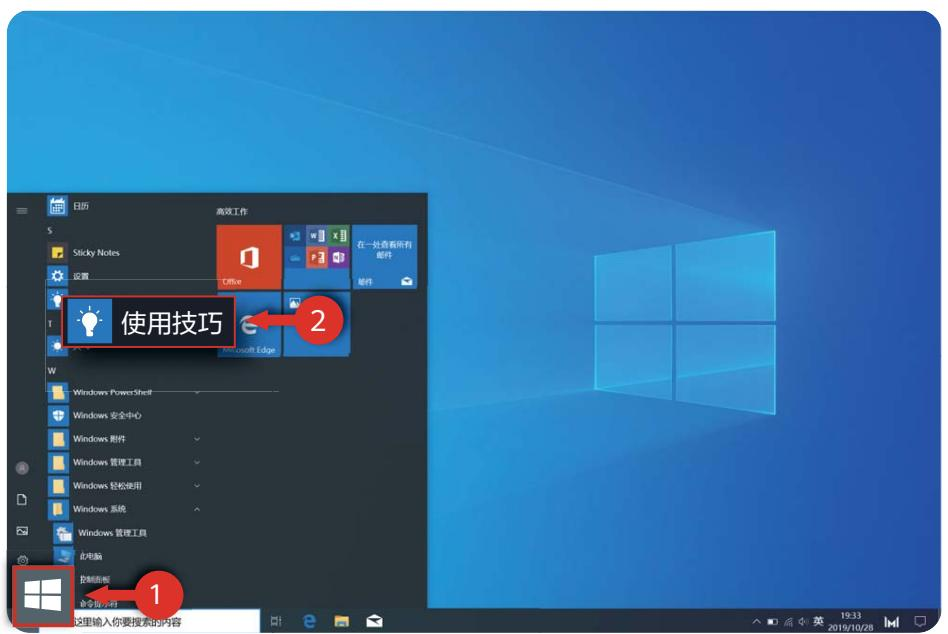

手册中描述的可选配件和软件可能未提供或可能未升级；手册中所述的系统环境可能与您的实际环境并不相同；手册中的图形可能和实际产品有差异，所有图示仅供参考，请以实际产品为准。

指示标志

<table><tr><td>i</td><td>说明</td><td>突出重要信息和使用小窍门,对您的操作进行必要的提示、补充和说明。</td></tr><tr><td>!</td><td>注意</td><td>提醒您在操作中必须注意和遵循某些事项。如未按照要求操作,可能会出现设备损坏、数据丢失等不可预知的结果。</td></tr><tr><td>∅</td><td>警告</td><td>警告您可能会存在潜在的危险情形,若无法避免,可能会造成较为严重的人身伤害。</td></tr></table>

# 了解计算机

# 外观介绍

正面

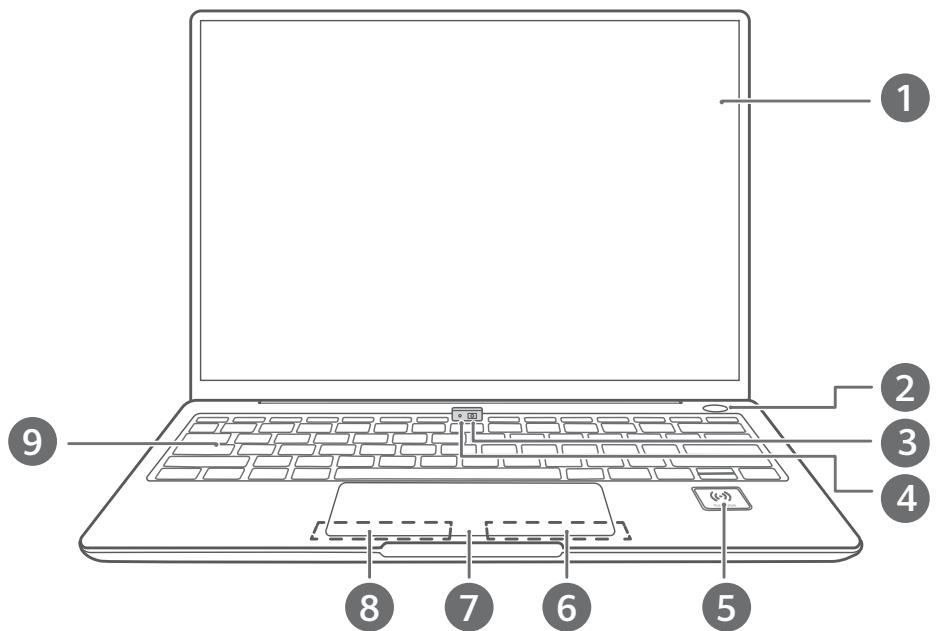

<table><tr><td>1</td><td>显示屏</td><td>画面显示。</td></tr><tr><td>2</td><td>指纹式电源键</td><td>录入指纹后,您只需使用已录入指纹的手指按一下电源键,即可同时实现开机、解锁,无需输入密码,快捷安全。·关机或睡眠时,按一下电源键,一键安全登录。·亮屏锁定时,轻触电源键,一键安全解锁。</td></tr><tr><td>3</td><td>隐藏式摄像头</td><td>使用摄像头可拍照、录像或举行视频会议。</td></tr><tr><td>4</td><td>摄像头指示灯</td><td>了解摄像头使用状态。摄像头开启时,指示灯白色常亮。</td></tr><tr><td>5</td><td>Huawei Share 标签</td><td>支持华为分享功能:部分华为/荣耀手机背部 NFC 区域与 Huawei Share 标签轻触,手机画面自动显示在笔记本上,用笔记本轻松操作手机应用和文件;拖拽或碰触即可互传文件,还可共享剪贴板。i ·请不要撕掉或损坏 Huawei Share 标签,以免影响华为分享功能的正常使用。·图片展示的标签位置,仅供参考,请以实际为准。</td></tr><tr><td>6</td><td>右键</td><td>相当于鼠标右键。</td></tr><tr><td>7</td><td>触摸板</td><td>类似鼠标的功能,更方便地操控计算机。</td></tr><tr><td>8</td><td>左键</td><td>相当于鼠标左键。</td></tr><tr><td>9</td><td>键盘</td><td>输入英文字母、数字、标点符号等。</td></tr></table>

# 左侧面

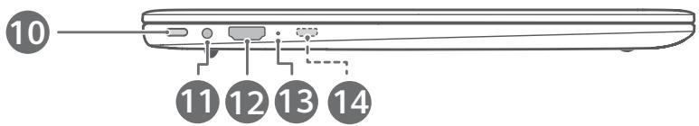

<table><tr><td>10</td><td>USB-C 接口</td><td>· 连接电源适配器给计算机充电。· 通过转接线或者扩展坞连接显示器、投影仪等视频显示设备。· 连接手机、U 盘等外接设备传输数据。</td></tr><tr><td>11</td><td>耳机接口</td><td>连接耳机。</td></tr><tr><td>12</td><td>HDMI 接口</td><td>高清晰度多媒体接口,连接显示设备。</td></tr><tr><td>13</td><td>充电指示灯</td><td>连接电源适配器时:· 充电状态白色闪烁。· 停充状态白色常亮。</td></tr><tr><td>14</td><td>迷你 RJ45 接口</td><td>通过 HUAWEI 迷你 RJ45 转 RJ45 转接线将计算机连接到有线网络。仅 MateBook B5-420 此位置配置有该接口。</td></tr></table>

# 右侧面

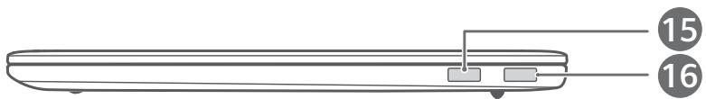

<table><tr><td>15</td><td>USB 2.0 接口</td><td>连接手机、U 盘等外接设备传输数据。</td></tr><tr><td>16</td><td>USB 3.0 接口</td><td>连接手机、U 盘等外接设备传输数据。</td></tr></table>

# 底部

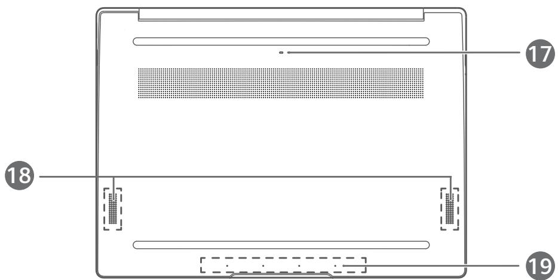

<table><tr><td>17</td><td>摄像头排水孔</td><td>键盘上的摄像头按钮与后壳排水孔相通,当有少量液体不小心从隐藏式摄像头进入键盘时,可从排水孔导出。但液体浸入键盘,可能会损坏您的计算机。</td></tr><tr><td>18</td><td>扬声器</td><td>声音从扬声器发出。</td></tr><tr><td>19</td><td>麦克风</td><td>使用麦克风视频会议、语音通话或录音。</td></tr></table>

# 开启和关闭计算机

首次开机时，请先连接电源适配器，计算机自动开机。等待屏幕亮起后，进入开机设置界面。

计算机关机或睡眠时，短按电源键至键盘指示灯亮起，即可开启或唤醒计算机。

计算机正常使用时，点击 > ，使计算机进入睡眠、关机或重启的状态。

强制关机：长按电源键 10 秒以上，可强制关机。强制关机会导致未保存的数据丢失，请谨慎使用。

# 键盘

# 快捷键功能介绍

计算机键盘的 F1、F2 等键默认为快捷键（热键）模式，可用于轻松执行常见任务。

<table><tr><td></td><td>降低屏幕亮度</td></tr><tr><td></td><td>增强屏幕亮度</td></tr><tr><td></td><td>开启或关闭键盘背光,调节键盘背光亮度</td></tr><tr><td></td><td>开启或关闭静音</td></tr><tr><td></td><td>减小音量</td></tr><tr><td></td><td>增大音量</td></tr><tr><td>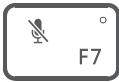</td><td>开启或关闭麦克风</td></tr><tr><td></td><td>切换屏幕投影模式</td></tr><tr><td>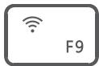</td><td>开启或关闭无线网络</td></tr><tr><td>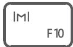</td><td>开启电脑管家</td></tr></table>

# 快捷键与功能键切换

在功能键模式下，运行不同的软件时，F1、F2 等键被定义不同的功能。

若要将 F1、F2 等键作为功能键使用，您可以：

• 按下 Fn 键，当 Fn 键指示灯亮起，表示已将 F1、F2 等键锁定为功能键模式。只需再次按 Fn键，当 Fn 键指示灯熄灭，即可返回快捷键（热键）模式。  
• 前往华为电脑管家的设置中心，在系统设置中，将键盘设置为功能键优先，设置后，F1、F2 等键将默认作为功能键使用。若要切换回快捷键模式，将键盘设置为热键优先即可。

键盘布局可能会因国家、地区存在差异，请以实物为准。

# Fn 键+方向键功能介绍

同时按下 Fn 键和方向键

，可以实现 Home、PgUp、PgDn 以及 End 键的功能。

<table><tr><td>组合方式</td><td>功能键</td></tr><tr><td>Fn 键 + 方向左键</td><td>Home 键</td></tr><tr><td>Fn 键 + 方向上键</td><td>PgUp 键</td></tr><tr><td>Fn 键 + 方向下键</td><td>PgDn 键</td></tr><tr><td>Fn 键 + 方向右键</td><td>End 键</td></tr></table>

# 触摸板

键盘上的触摸板拥有类似鼠标的功能，让您更方便的操控计算机。

# 常见触摸板手势

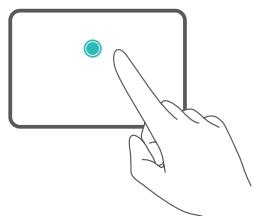

单指点击：相当于单击鼠标左键

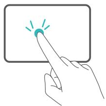

单指双击：相当于双击鼠标左键

<table><tr><td>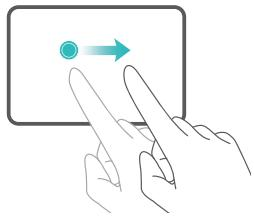</td><td>单指移动:移动桌面上的光标</td></tr><tr><td>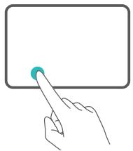</td><td>左键单击:相当于单击鼠标左键</td></tr><tr><td>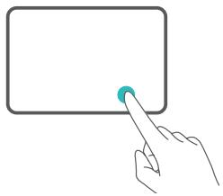</td><td>右键单击:相当于单击鼠标右键</td></tr><tr><td>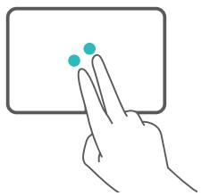</td><td>双指点击:相当于单击鼠标右键</td></tr><tr><td>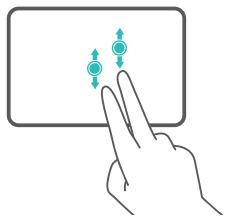</td><td>双指上下滑动:滚动浏览屏幕或文档</td></tr><tr><td>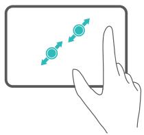</td><td>双指张开或闭合:浏览图片、网页等时,可以放大或缩小图片、网页等</td></tr><tr><td></td><td>三指点击:使用搜索</td></tr><tr><td>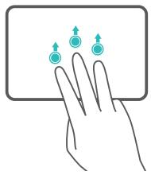</td><td>三指向上滑动:多任务视图</td></tr><tr><td>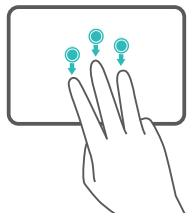</td><td>三指向下滑动:显示桌面</td></tr><tr><td>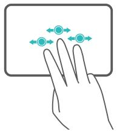</td><td>三指左右滑动:切换应用</td></tr><tr><td></td><td>四指点击:快速打开操作中心</td></tr></table>

# 更改触摸板设置

您也可以根据自己的使用习惯更改触摸板设置，让指尖操作更得心应手。

1 点击 > 打开设置界面。  
2 在设置界面中，点击 ，在设备中找到触摸板后，您可以设置：

• 开启或关闭触摸板。  
• 连接鼠标时开启或关闭触摸板。  
• 更改触摸滚动方向。  
• 设置手指动作在触摸板上的功能等。

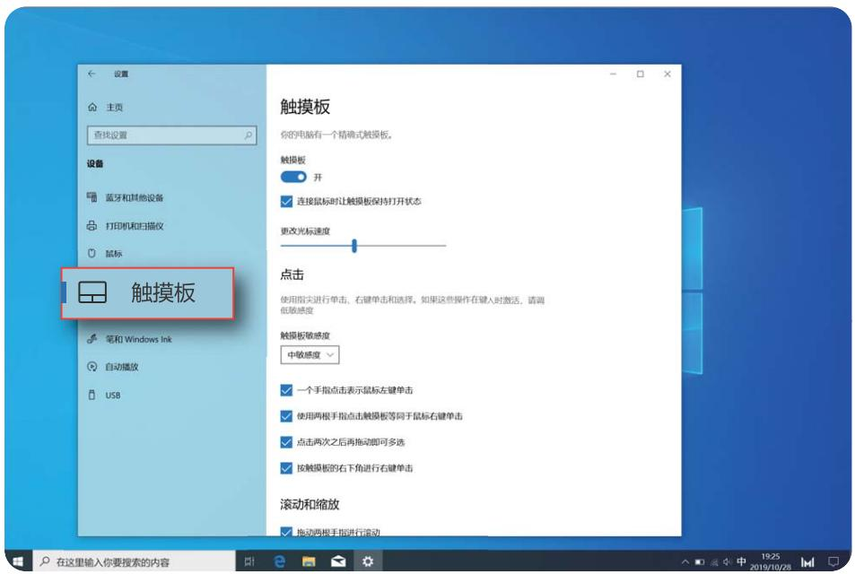

# 给计算机充电

当电池电量过低时，计算机会弹出低电提示，请及时为计算机充电，以免影响计算机的使用。

# 使用电源适配器为计算机充电

计算机内置（不可拆卸）可充电电池。连接随附的电源适配器和 USB-C 接口充电线缆可对计算机充电，充电指示灯白色闪烁表示电池正在充电。计算机关机或处于睡眠状态时，电池充电速度更快。

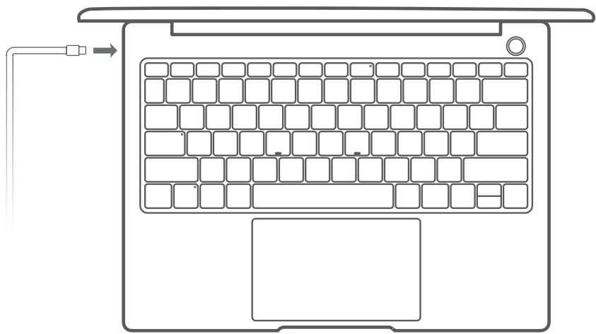

！ 使用第三方配件可能导致计算机性能下降，而且有可能存在安全隐患。

# 充电注意事项

请在适宜的温度范围内和通风良好的阴凉区域为计算机充电。

• 在高温环境下充电可能会损坏计算机。

• 计算机充电时间会随温度条件和电池使用状况而变化。  
• 计算机长时间工作和充电时，可能会表面发热，这属于正常现象。感觉发烫时，请关闭部分功能并停止充电。

# 了解电池状态

您可以通过屏幕上的电量图标判断当前的电池状态。

• 当计算机接入电源时， 电池图标会显示已连接状态。  
• 当计算机使用时，移动光标至 电池图标上，可查看电池的剩余电量和剩余使用时间。

图标显示的电池剩余使用时间是操作系统估算的时间，非实际时间。

！ 电池属于易损耗品，如发现待机时间大幅度减少，请勿自行更换，请前往附近的华为客户服务中心更换原装电池。

# 新机入手

# 第一步 连接无线网络

1 在桌面右下角，点击 （或 ）打开无线网络连接界面。  
2 选择需要连接的无线网络名称，根据指引即可连接至无线网络。

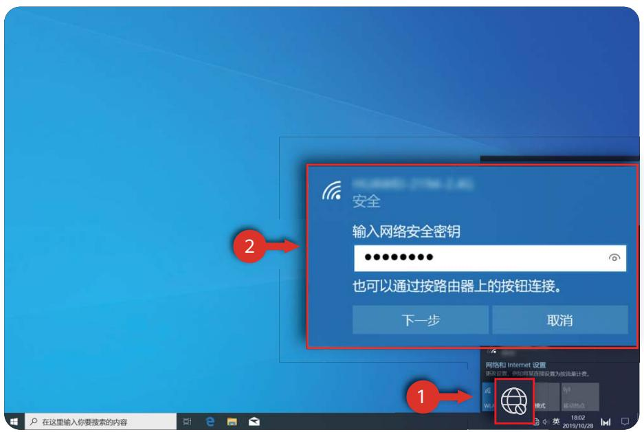

# 第二步 激活 Windows

首次联网后， Windows 自动激活。您可点击 > > 更新和安全 > 激活，查看Windows 是否激活。

如果 Windows 激活失败，请重启计算机后联网重试；如仍无法激活，请更换其他网络服务或者等待一段时间后再尝试。

i 若 Windows 未激活，计算机的部分功能使用可能受限。

# 第三步 激活 Office

• 若您的计算机预装了 Office 家庭和学生版，请您务必在 Windows 激活后的 6 个月内完成Office 激活，激活后可永久使用。超过 6 个月将无法免费激活，可能需要您重新购买 Office应用。  
• 若您的计算机未预装 Office 家庭和学生版，您可根据需要单独购买正版 Office 软件。

Windows 系统联网激活后，点击 ，打开 Word、Excel 或 PowerPoint，根据指引完成激活（建议联网使用几个小时后再进行 Office 激活）。

0 如果 Office 激活失败，请更换其他网络服务或者等待约 2 个小时后再尝试。您也可以拨打计算机背后标签上的 Office 激活支持热线进行人工激活。

• 详细操作指导，请访问： https://cn.club.vmall.com/thread-13032016-1-1.html

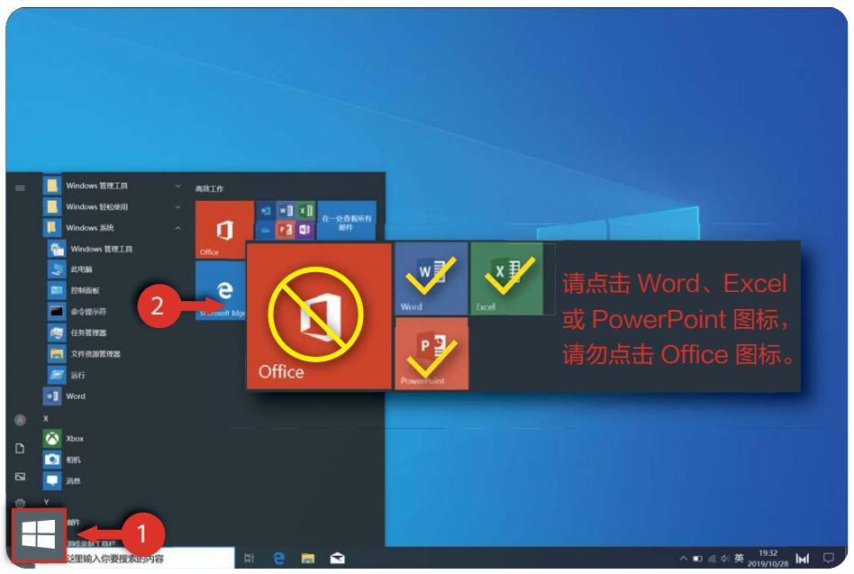

# 第四步 录入指纹

计算机采用指纹式电源键。录入指纹后，您只需按一下电源键，即可同时实现开机、解锁，无需输入密码，快捷安全。

如果您在首次开机的过程中，跳过了指纹录入，请点击 > > 帐户 > 登录选项，在登录选项中，先设置登录密码和 PIN 码，再根据指引录入指纹。

• 请保持手指干净。如果手指沾上水或者异物，都会影响指纹的录入质量。

• 每个帐户最多可录入 10 组指纹。

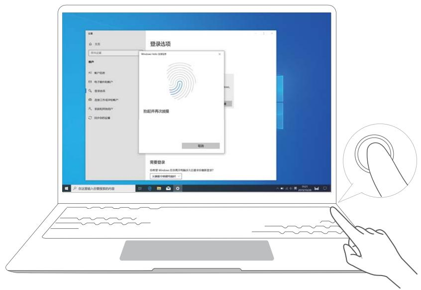

# 第五步 升级驱动

打开电脑管家，点击“驱动管理”。如果检测到有待升级驱动，请根据指引完成升级。

i 为了您有更好的体验，建议您定期检测驱动版本，并及时升级，以提高计算机的性能及稳定性。

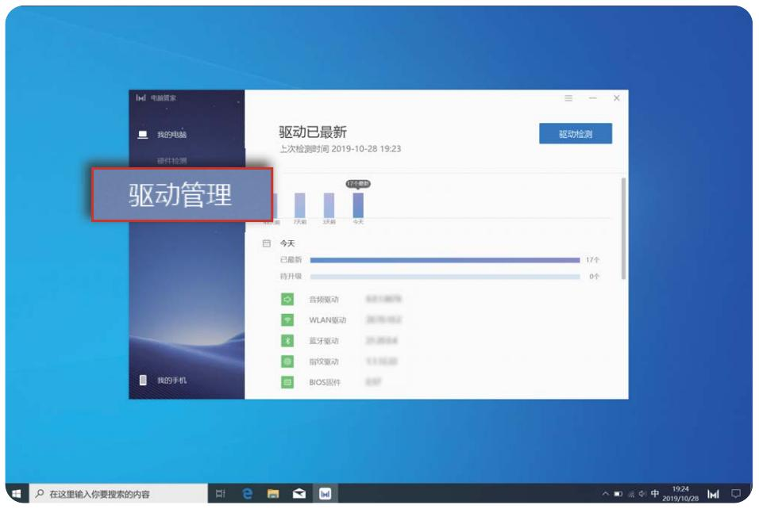

# 精彩功能

# 华为分享

手机与笔记本碰一碰：手机画面自动显示在笔记本上，用笔记本轻松操作手机应用和文件； 拖拽或碰触即可互传文件，还可共享剪贴板。

• 多屏协同：在笔记本上，轻松操作手机应用和文件，直接接听手机端音视频通话；笔记本与手机之间，通过拖拽即可高效互传文件。  
• 文件分享：碰一碰，便可互传文件；摇一摇，手机即可录制笔记本屏幕。  
• 数据同步：手机与笔记本共享剪贴板，无缝复制粘贴；手机端最近文档自动同步到笔记本。

i 详细操作指导，请访问官网：

https://consumer.huawei.com/cn/support/huaweishareonehop/

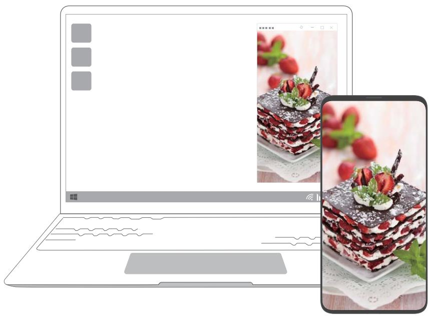

# 护眼模式

长期阅读时，请开启计算机护眼模式。

右键点击桌面空白处，选择 显示管理，点击开启护眼模式开关。

0 开启护眼模式后，屏幕显示偏黄为正常现象。

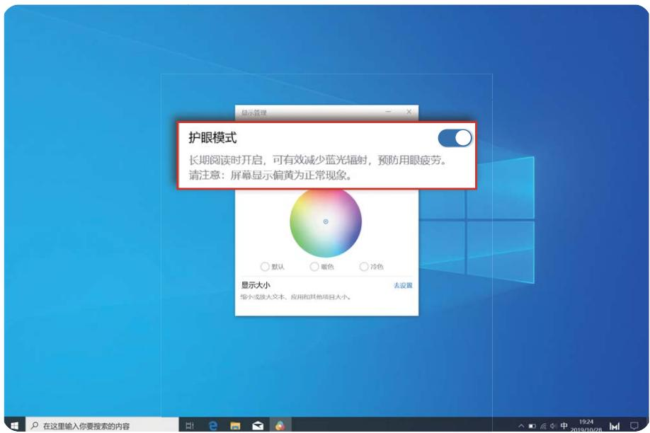

# F10 一键恢复出厂

计算机内置的 F10 系统恢复出厂功能，能短时间内帮您将计算机系统恢复到初始状态。

• 恢复出厂前，建议您备份 C 盘数据 。

• 部分国家或地区不支持此功能，请以实际为准。

1 将计算机连接电源，开机过程中长按或点按 F10 键。  
2 进入界面后，根据界面提示进行恢复出厂。

# 了解 Windows 10

# 开始菜单

您可以在开始菜单找到应用、设置、文件等内容。

在桌面左下角，点击 打开开始菜单。

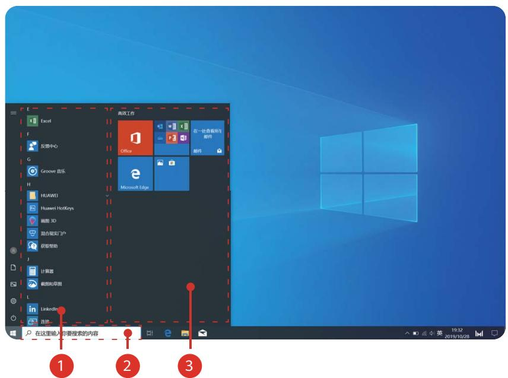

• 点击 ，更改、锁定、注销当前帐户。  
• 点击 ，进入计算机默认的文档文件夹。  
• 点击 ，进入计算机默认的图片文件夹。  
• 点击 ，进入系统设置界面。  
• 点击 ，让计算机睡眠、关机或重启。

1 为应用程序区域：上下拖动查看所有应用和程序。  
2 为搜索区域：在这里输入需要搜索的内容。  
3 为常用磁贴区域：将常用应用、网址等固定到开始菜单并对其进行分组管理。

# 操作中心

操作中心可显示系统更新等系统通知，以及电子邮件等推送通知；同时提供快速操作选项，让您可以快速打开或关闭相应功能或进行相关功能设置。

在桌面右下角，点击 打开操作中心，您可以：

• 快速打开设置、VPN等界面。  
• 快速更改常用设置（如节电模式、飞行模式、屏幕亮度等）。

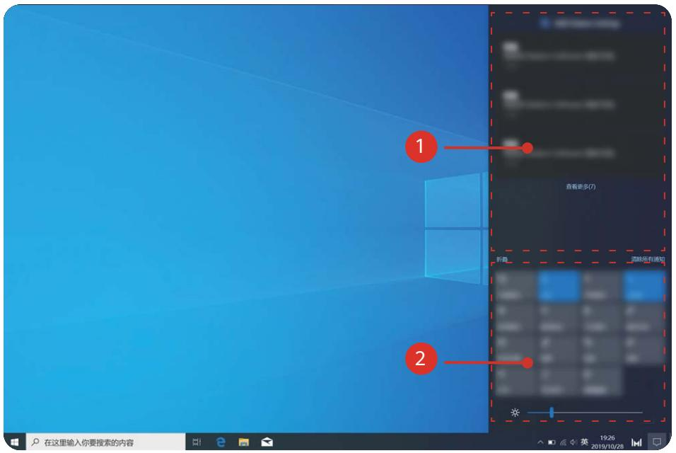

为新通知提醒区域。  
2 为快速操作区域。

# 将常用图标放到桌面

Windows 10 系统默认的工作桌面，仅显示了几个常用的快捷方式，如果需要显示其他常用图标，可以按如下步骤进行操作。

# 以显示“此电脑”图标为例：

1 右键单击桌面空白处，选择“个性化”。  
2 点击 主题，选择“桌面图标设置”。  
3 将“计算机”勾选上，点击“确定”。

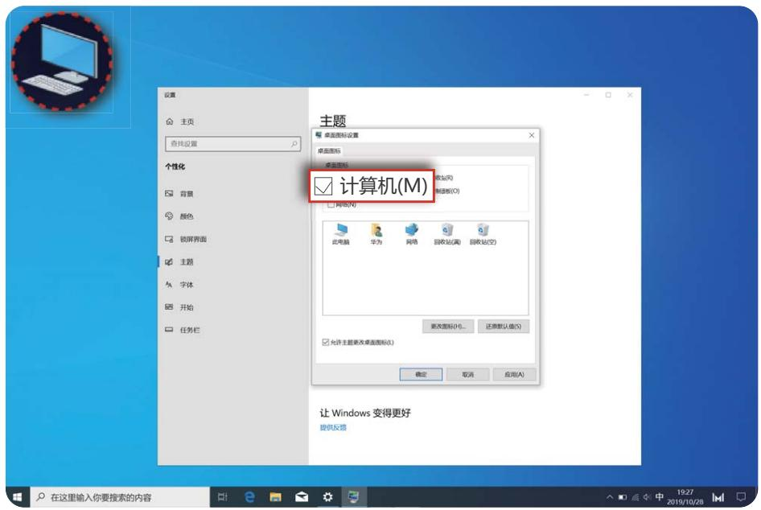

# 配件及扩展连线

# 扩展坞（可选配件）

# 了解扩展坞

通过扩展坞接口或插槽，计算机可以连接兼容多种设备和配件，如投影仪、电视、U 盘等，满足您的扩展需求。

扩展坞为可选配件，您可单独购买。

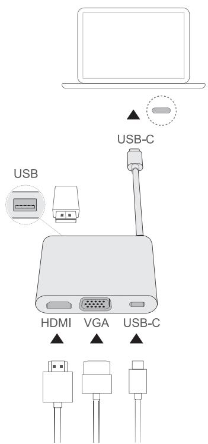

<table><tr><td>USB-C 插头</td><td>连接计算机 USB-C 接口。</td></tr><tr><td>USB 接口</td><td>连接 USB 设备,如 USB 鼠标/键盘、USB 存储设备、USB 网卡等。</td></tr><tr><td>HDMI 接口</td><td>连接 HDMI 输入设备,如电视机。</td></tr><tr><td>VGA 接口</td><td>连接 VGA 输入设备,如显示器。</td></tr><tr><td>USB-C 接口</td><td>连接 USB-C 接口设备。</td></tr></table>

# 连接到电视、显示器或投影仪

观看电影或会议演示时，将计算机连接到电视、显示器或投影仪等大屏显示设备，观看效果更佳。

在连接之前您需要检查所连接设备的端口，HDMI 或 VGA 端口您需要另行准备 HDMI 或VGA 连接线缆。

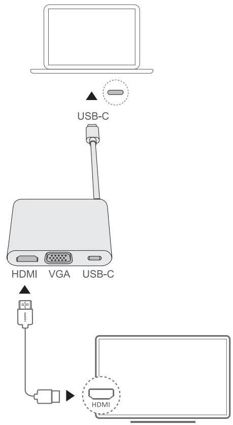

1 参照图示，通过扩展坞连接计算机和电视、显示器或投影仪。  
2 接通电视、显示器或投影仪的电源并打开。  
3 在桌面右下角，点击 打开操作中心。  
4 点击投影选择投影方式。

仅电脑屏幕：只在计算机显示桌面，外接设备屏幕不显示内容。  
复制：在计算机和外接设备上都显示桌面。  
• 扩展：将计算机的桌面扩展到外接设备屏幕，可以在屏幕之间移动项目。  
• 仅第二屏幕：只在外接设备上显示桌面，计算机屏幕不显示内容。

# 连接 USB 鼠标、打印机或其他设备

通过 USB 接口，可连接 USB 鼠标、打印机、扫描仪、智能手机或硬盘等 USB 设备。

# 连接 USB 设备

1 将设备的 USB 线缆插入扩展坞 USB 接口。  
2 如果设备需要连接电源线，请接通设备电源并启动 USB 设备。  
3 首次安装 USB 设备时，计算机会自动安装设备所需的软件。

# 查找计算机安装的 USB 设备

1 在屏幕左下角，点击 打开开始菜单。  
2 点击 > ，在已连接设备中查看安装的 USB 设备。

# 蓝牙鼠标（可选配件）

华为/荣耀蓝牙鼠标可通过蓝牙连接计算机。首次使用蓝牙鼠标，需要完成蓝牙鼠标与计算机的配对。

# 了解蓝牙鼠标

0 蓝牙鼠标为可选配件，您可单独购买。

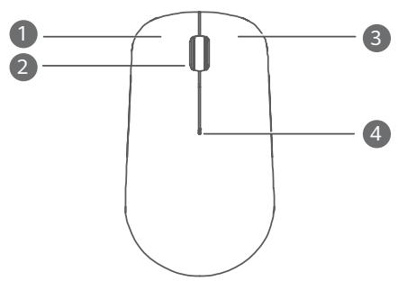

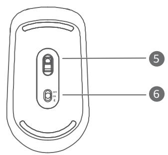

<table><tr><td>1</td><td>左键</td><td>2</td><td>滚轮+中键</td></tr><tr><td>3</td><td>右键</td><td>4</td><td>LED指示灯指示灯为红色闪烁时,表示电池电量低,请注意更换电池。</td></tr><tr><td>5</td><td>传感器</td><td>6</td><td>电源/蓝牙配对开关</td></tr></table>

# 安装电池

如下图所示，沿鼠标尾部标志打开上壳，按电池仓正负极(＋－)的标志安装一节 AA 电池，合上上壳，即可安装完成。

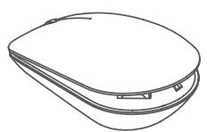

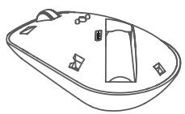

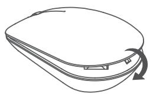

# 蓝牙鼠标与计算机配对

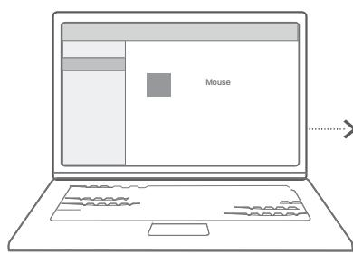

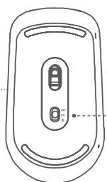

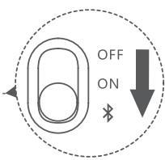

1 按照图示将底部配对开关拨至 $\ngeq$ 处并保持 3 秒，指示灯闪烁后松开，鼠标进入配对状态。  
2 在计算机中，打开设置，进入蓝牙配对界面，选择添加蓝牙设备，计算机进入蓝牙配对模式，选择 HUAWEI/HONOR Mouse，即可完成配对。

# 附录

# 安全注意事项

在使用和操作设备前，请阅读并遵守下面的注意事项，以确保设备性能最佳，并避免出现危险或非法情况。

# 电子设备

有明文规定禁止使用无线设备的场所，请勿使用本设备，否则会干扰其它电子设备或导致其它危险。

# 对医疗设备的影响

• 在明文规定禁止使用无线设备的医疗和保健场所，请遵守该场所的规定，并关闭设备。  
• 设备产生的无线电波可能会影响植入式医疗设备或个人医用设备的正常工作，如起搏器、植入耳蜗、助听器等。若您使用了这些医用设备，请向其制造商咨询使用本设备的限制条件。  
• 在使用本设备时，请与植入的医疗设备（如起搏器、植入耳蜗等）保持至少15厘米的距离。

# 听力保护

为了防止可能的听力损伤，请勿长时间使用高音量。  
• 驾车时接触高音量可能会分散注意力，从而导致事故。

• 当您使用耳机收听音乐或通话时，建议使用音乐或通话所需的最小音量，以免损伤听力。长时间接触高音量可能会导致永久性听力损伤。

# 易燃易爆区域

• 在加油站（维修站）或靠近易燃物品、化学制剂等任何易燃易爆区域，请勿使用本设备，并遵守所有图形或文字的指示。在燃油或化学制剂存放和运输区或易爆场所内或周围，设备可能引起爆炸或起火。

• 请勿将设备及其配件与易燃液体、气体或易爆物品放在同一箱子中存放或运输。

# 交通安全

• 遵守所在地区或国家的相关规定，驾车时请勿使用本设备。  
• 谨记安全驾驶是您的首要职责，请勿从事会分散注意力的活动。  
• 汽车的电子设备可能因设备的无线电干扰而出现故障。请联系制造商咨询详细信息。  
• 请勿将设备放在汽车安全气囊上方或安全气囊展开后能够触及的区域内。否则当安全气囊膨胀时，设备就会受到很强的外力推动而对车内人员造成严重伤害。  
• 无线设备可能干扰飞机的飞行系统，请遵守航空公司的相关规定，在禁止使用无线设备的地方，请勿使用该设备。

# 操作环境

• 请勿在多灰、潮湿、肮脏或靠近磁场的地方使用设备，以免引起设备内部电路故障。

• 请勿在雷雨天气使用本设备。雷雨天气可能导致设备故障或电击危险。  
• 请在温度 0℃～35℃ 范围内使用本设备，并在温度 –10℃～+45℃ 范围内存放设备及其配件。当环境温度过高或过低时，可能会引起设备故障。  
• 请勿将设备放置在阳光直射的地方，如汽车仪表盘或窗台处。  
• 请避免设备及其配件雨淋或受潮，否则可能导致火灾或触电危险。  
• 请勿将设备靠近热源或裸露的火源，如电暖器、微波炉、烤箱、热水器、炉火、蜡烛或其他可能产生高温的地方。  
• 设备在运行一段时间后，设备温度会升高。如果设备温度过高，请勿长时间接触，否则可能导致低温烫伤，引起皮肤红肿或色素沉淀。  
• 请勿让儿童或宠物吞咬设备或其配件，以免对其造成伤害或导致设备故障或爆炸。  
• 当不断重复同一动作时（例如玩游戏），您的手、臂、腕、肩、颈或其他身体部位可能会偶尔感觉不适。如果您感觉到不适，请停止使用并咨询医师。

# 儿童健康

• 本设备及其配件可能包含一些小零件，请将设备及其配件放置在儿童接触不到的地方。儿童可能在无意之中损坏本设备及其配件，或吞下小零件导致窒息或其他危险。

• 本设备并非玩具，儿童应在成人监护下使用设备。

# 配件要求

• 使用未经认可或不兼容的电源、充电器或电池，可能引发火灾、爆炸或其他危险。  
• 只能使用设备制造商认可且与此型号设备配套的配件。如果使用其他类型的配件，可能违反本设备的保修条款以及本设备所处国家的相关规定，并可能导致安全事故。如需获取认可的配件，请与授权服务中心联系。

# 充电器安全

• 设备充电时，电源插座应安装在设备附近并应易于触及。  
• 当充电完毕或者不充电时，请断开充电器与设备的连接并从电源插座上拔掉充电器。  
• 请勿摔落或碰撞充电器。充电器外壳受损时请联系授权服务中心进行更换。  
• 若充电器插头、外壳或电源线已损坏，请勿继续使用，以免发生触电或火灾。  
• 请勿用湿手触碰电源线，或用拉电源线缆的方式拔出充电器。  
• 请勿用湿手触摸设备或充电器，以免发生设备短路、故障或触电。  
• 充电器被雨淋、液体浸湿或严重受潮时，请停止使用，并联系授权服务中心进行更换。  
• 充电器必须满足标准《GB4943.1 信息技术设备的安全》中“2.5 受限制电源”的要求。  
• 若设备需要连接 USB 端口，请确认 USB 端口具备 USB-IF 标识且其性能符合 USB-IF 的相关规范。

# 电池安全

• 请勿将金属物导体与电池两极对接，或接触电池的端点，以免导致电池短路，以及因电池过热而引起的烧伤等身体伤害。  
• 请勿将电池暴露在高温处或发热设备的周围，如日照、取暖器、微波炉、烤箱或热水器等。电池过热可能引起爆炸。

• 请勿拆解或改装电池、插入异物、或浸入水或其它液体中，以免引起电池漏液、过热、起火或爆炸。  
• 如果电池漏液，请勿使皮肤或眼睛接触到漏出的液体。若接触到皮肤或眼睛上，请立即用清水冲洗，并到医院进行医疗处理。  
• 如果电池在使用、充电或保存过程中有变色、变形、异常发热等异常现象，请停止使用并更换新电池。  
• 请勿把电池扔到火里，否则会导致电池起火和爆炸。  
• 请按当地规定处理电池，不可将电池作为生活垃圾处理。若电池处置不当可能会导致电池爆炸。  
• 请勿让儿童或宠物吞咬电池 ，以免对其造成伤害或导致电池爆炸。  
• 请勿跌落、挤压或穿刺电池。避免让电池遭受外部大的压力，从而导致电池内部短路和过热。  
• 请勿使用已经损坏的电池。  
• 当设备的待机时间明显比正常时间短时，请更换电池。  
• 若设备配有不可拆卸的内置电池，请勿自行更换电池，以免损坏电池或设备。电池只能由授权服务中心更换。

# 维护和保养

• 请保持设备及其配件干燥。请勿使用微波炉或吹风机等外部加热设备对其进行干燥处理。  
• 请勿在温度过高或过低区域放置设备及其配件，否则可能导致设备故障、着火或爆炸。  
• 请勿使设备及其配件受到强烈的冲击或震动，以免损坏设备及其配件，导致设备故障。  
• 清洁和维护前，请停止使用本设备，关闭所有应用，并断开与其他设备的所有连接或线缆。  
• 请勿使用烈性化学制品、清洗剂或强洗涤剂清洁设备或其配件。请使用清洁、干燥的软布擦拭设备或其配件。  
• 请勿擅自拆卸或改装设备及配件，否则该设备及配件将不在本公司保修范围之内，设备发生故障时请联系授权服务中心。  
• 如果设备碰撞硬物或设备受到外界的强烈撞击造成破碎，切勿触摸或试图移除破碎的部分，请立即停止使用并及时联系授权服务中心。

# 环境保护

• 请勿将本设备及其附件作为普通的生活垃圾处理。  
• 请遵守本设备及其附件处理的本地法令，并支持回收行动。

# 个人信息和数据安全

在使用设备的一些功能和第三方应用时，可能会因为操作不正确或其他原因导致您的个人信息或数据泄露或丢失，建议按以下方式加强保护您的个人信息。

• 请将设备放置于安全区域，防止未经授权人员使用您的设备。  
• 设置设备屏幕锁定，并牢记您设定的密码或解锁图案。  
• 建议不要阅读来自陌生人的信息或邮件，以免设备遭受病毒感染。  
• 在使用设备上网时，请勿浏览存在安全隐患的网站，以免个人信息被盗。

• 在使用无线共享、蓝牙等业务时，请设定密码，防止未授权访问。不需要使用这些业务时，建议及时关闭。  
• 安装设备安全软件，并定期进行安全检查。  
• 获取第三方应用时，应保证获取方式的安全性。获取的第三方应用程序应进行病毒扫描。  
• 请及时安装或升级华为或授权的第三方应用程序供应商发布的安全性软件或补丁。  
• 使用非授权第三方软件升级设备的固件和系统，可能存在设备无法使用或者泄漏您个人信息等安全风险。建议您使用在线升级或者将设备送至您附近的华为授权服务中心升级。  
• 如果您使用了需要定位信息的应用程序，这些应用程序可以传输定位信息，第三方可能会共享这些定位信息。  
• 设备可能会将检测、诊断等信息反馈给第三方应用程序供应商，这些信息将用于帮助第三方应用供应商改善产品和服务。

# 法律声明

版权所有 © 华为 2020。保留一切权利。

未经华为技术有限公司书面同意，任何单位和个人不得擅自摘抄、复制本手册内容的部分或全部，并不得以任何形式传播。

本手册描述的产品中，可能包含华为技术有限公司及其可能存在的许可人享有版权的软件。除非获得相关权利人的许可，否则，任何人不能以任何形式对前述软件进行复制、分发、修改、摘录、反编译、反汇编、解密、反向工程、出租、转让、分许可等侵犯软件版权的行为，但是适用法禁止此类限制的除外。

# 中国 RoHS

是中国RoHS合格评定标识，表示产品符合中国《电器电子产品有害物质限制使用管理办法》要求。

# 商标声明

在本手册以及本手册描述的产品中，出现的其他商标、产品名称、服务名称以及公司名称，由其各自的所有人拥有。

# 注意

本手册描述的产品及其附件的某些特性和功能，取决于当地网络的设计和性能，以及您安装的软件。某些特性和功能可能由于当地网络运营商或网络服务供应商不支持，或者由于当地网络的设置，或者您安装的软件不支持而无法实现。因此，本手册中的描述可能与您购买的产品或其附件并非完全一一对应。

华为技术有限公司保留随时修改本手册中任何信息的权利，无需提前通知且不承担任何责任。

# 第三方软件声明

随本产品提供的第三方软件和应用程序归第三方所有，华为技术有限公司不拥有这些第三方软件和应用程序的知识产权，因此华为技术有限公司不对这些第三方软件和应用程序提供任何保证，华为技术有限公司既不会就这些软件和应用程序向您提供支持，也不对这些软件和应用程序的功能是否正常承担任何责任。

第三方软件和应用程序的服务可能中断或终止，华为技术有限公司不保证任何内容或服务可在任何期间维持其可用性。第三方系通过华为技术有限公司可控制范围外的网络及传输工具传送内容或服务。在相关法律允许的范围内，华为技术有限公司明确表示不对任何通过本产品提供的任何内容或服务的中断或终止承担任何责任。

对于您个人安装在本产品上的任何软件或上传、下载的任何文字、图片、视频或软件等第三方作品，华为技术有限公司不对其合法性、质量以及其他任何方面承担任何责任，对于您因个人安装软件或上传、下载前述第三方作品产生的任何后果，包括安装的软件与本产品不兼容等情况，由您自行承担一切相关风险。

# 责任限制

本手册中的内容均“按照现状”提供，除非适用法要求，华为技术有限公司对本手册中的所有内容不提供任何明示或暗示的保证，包括但不限于适销性或者适用于某一特定目的的保证。

在适用法律允许的范围内，华为技术有限公司在任何情况下，都不对因使用本手册相关内容及本手册描述的产品而产生的任何特殊的、附带的、间接的、继发性的损害进行赔偿，也不对任何利润、数据、商誉或预期节约的损失进行赔偿。

在相关法律允许的范围内，在任何情况下，华为技术有限公司对您因为使用本手册描述的产品而遭受的损失的最大责任（除在涉及人身伤害的情况中根据适用的法律规定的损害赔偿外）以您购买本产品所支付的价款为限。

# 进出口管制

若需将本手册描述的产品（包括但不限于产品中的软件及技术数据等）出口、再出口或者进口，您应遵守适用的进出口管制法律法规。

# 隐私保护

为了解我们如何使用和保护您的个人信息，请访问

http://consumer.huawei.com/privacy-policy 阅读我们的隐私政策。

本指南仅供参考，不构成任何形式的承诺，产品（包括但不限于颜色、大小屏幕显示等）请以实物为准。

购买华为终端产品，请访问华为商城 https://www.vmall.com/

更多信息请访问 https://consumer.huawei.com/cn/