# 用户指南

# PANTUM

WWW.PANTUM-COM

# Pantum P3000 Series

高速黑白激光打印机

# 前言

欢迎您使用奔图系列产品！

对您使用奔图系列产品我们表示衷心的感谢！

为了保障您的切身权益，请认真阅读下面的声明内容。

# 法律说明

# 商标

Pantum 和 Pantum 标识是珠海奔图电子有限公司注册的商标。

Microsoft® 、Windows® 、Windows server® 和 Windows Vista® 是微软公司在美国或其他国家注册的商标和注册商标。

对于本用户指南涉及的软件名称，其所有权根据相应的许可协议由所属公司拥有，引用仅供说明。

本用户指南涉及的其他产品和品牌名称为其相应所有者的注册商标、商标或服务标志，引用仅供说明。

# 版权

本用户指南版权归珠海奔图电子有限公司所有。

未经珠海奔图电子有限公司事先书面同意，禁止以任何手段或形式对本用户指南进行复印、翻译、修改和传送。

版本：V1.9

# 免责声明

为了更好的用户体验，珠海奔图电子有限公司保留对本用户指南作出更改的权利。如有更改，恕不另行通知。

用户未按用户指南操作，而产生的任何损害，应由本人承担。同时，珠海奔图电子有限公司除了在产品维修书或服务承诺作出的明示担保外，也未对本用户指南（包括排版或文字）作出任何明示或默示的担保或保证。

本产品被用于某些文档或图像的复印、打印、扫描或其他形式时，可能违反您所在地的法律。您如果无法确定该使用是否符合所在地法律时，应向法律专业人士咨询后进行。

此产品仅使用于非热带，海拔2000 米及以下地区安全使用。

# 维修保证

企业承诺，在停产后至少5 年内，保证提供产品在正常使用范围内可能损坏的备件。

# 消耗材料的供应

企业承诺，在停产后至少5 年内，提供产品的消耗材料。

# 安全防范措施

# 激光安全

激光辐射对人体有害。由于激光组件完全密闭在打印机内，激光辐射不会泄露。为了避免激光辐射，请不要随意拆机！

本机遵循 CFR 标准的 1 类激光产品。本机带有 Ⅲb 类的激光二极管，在激光组件中无激光辐射的外泄。

本机内部的激光组件上贴有如下标签：

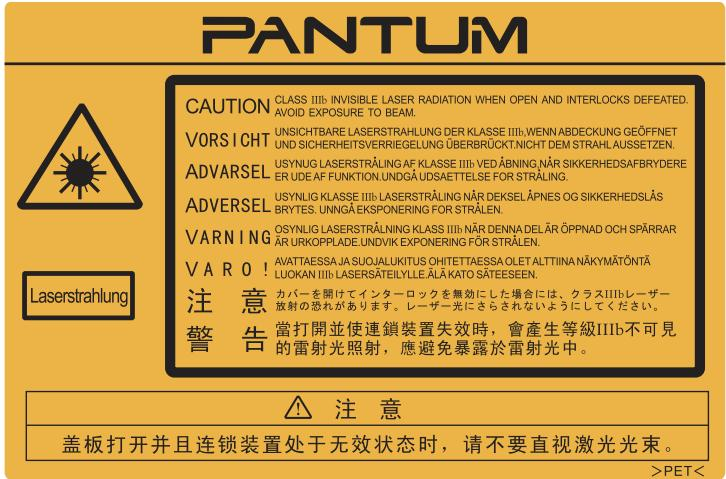

text_image

PANTUM
CAUTION CLASS IIIb INVISIBLE LASER RADIATION WHEN OPEN AND INTERLOCKS DEFEATED.
AVOID EXPOSURE TO BEAM.
VORS ICHT UNSICHTBARE LASERSTRAHLUNG DER KLASSE IIIb, WENN ABDECKUNG GEÖFFNET
UND SICHERHEITSVERRIEGELUNG ÜBERBRÜCKT, NICHT DEM STRAHLAUSSETZEN.
ADVARSEL USYNUG LASERSTRÅLING AF KLASSE IIIb VED ÅBNING NÄR SIKKERHEDSAF BRYDERE
ER UDE AF FUNKTION UNDGÅ UDS AETTELSE FOR STRÅLING.
ADVERSEL USYNLG KLASSE IIIb LASERSTRÅLING NÄR DEKSEL ÅPNES OG SIKKERHEDSLÅS
BRYTES, UNNGÅ EKSPONERING FOR STRÅLEN.
VARNING OSYNLIG LASERSTRÅLING KLASSE IIIb NÄR DENNA DEL ÄR ÖPPNAD OCH SPÄRRAR
ÄR URKOPPLADE. UNDVIK EXPONERING FÖR STRÅLEN.
VARO! AVATT AESSA JA SUOJALUKITUS OHITETTAESSA OLET ALTITINA NÄKYMÄTÖNTÄ
LUOKAN IIIb LASERSÄTEILYLE ÄLÄ KATO SÄTEESEN.
注意 カバーを開けてインターロックを無効にした場合には、クラスIIIbレーザー
放射の恐れがあります。レーザー光にさらされないようにしてください。
警告 當打開並使連鎖装置失效時，會產生等級IIIb不可見
的雷射光照射，應避免暴露於雷射光中。
注意
盖板打开并且连锁装置处于无效状态时，请不要直视激光光束。
>PET

# 奔图电子产品回收利用体系

为保护环境，奔图电子公司建立废弃产品的回收再利用体系，您可以选择将废弃的打印机和耗材交给当地奔图维修中心进行统一回收，再由国家认定的具备废弃物处理资质的处理机构对废弃产品进行正确的回收、再利用处理，以确保节约资源，降低环境污染，解除用户对废弃产品污染环境的担忧。

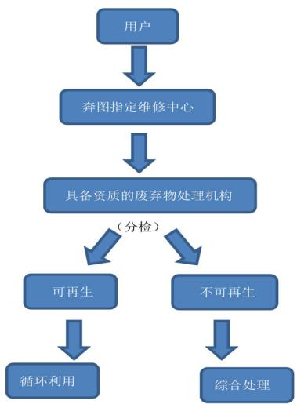

flowchart

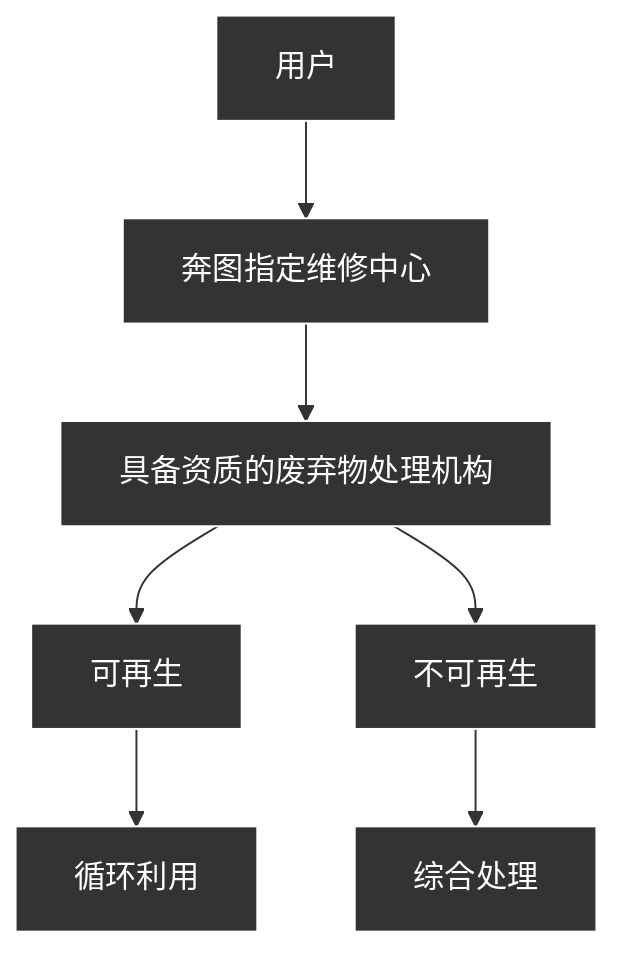
```mermaid
graph TD
    A["用户"] --> B["奔图指定维修中心"]
    B --> C["具备资质的废弃物处理机构"]
    C --> D["可再生"]
    C --> E["不可再生"]
    D --> F["循环利用"]
    E --> G["综合处理"]
    style A fill:#333,stroke:#fff,color:#fff
    style B fill:#333,stroke:#fff,color:#fff
    style C fill:#333,stroke:#fff,color:#fff
    style D fill:#333,stroke:#fff,color:#fff
    style E fill:#333,stroke:#fff,color:#fff
    style F fill:#333,stroke:#fff,color:#fff
    style G fill:#333,stroke:#fff,color:#fff
```

1. 用户负担费用：用户—维修中心；  
2. 奔图电子负担费用：奔图维修中心—具备资质的废弃物处理机构。

# 安全警告

在使用本打印机前，请注意如下安全警告：

# 警告

打印机内部有高压电极。在清洁打印机之前，请确保已切断电源！

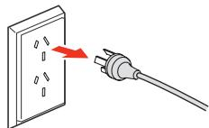

请勿用湿手插拔电源线插头，以免导致电击。

打印机打印时和打印后，定影组件会处于高温状态，请勿触摸定影单元（图示阴影部分），以免造成烫伤！

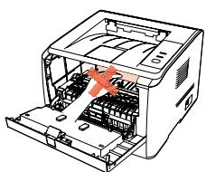

natural_image

Diagram of an open computer case with internal components and a red X mark indicating a specific area (no text or symbols present)

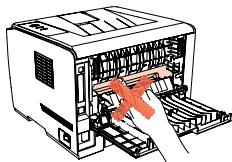

定影单元有高温警示标签，请勿移动或损坏该标签。

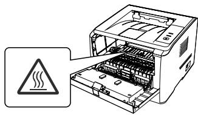

text_image

Diagram showing a printer with warning symbol and warning label, indicating thermal hazard or warning.

# 注意事项

# 使用打印前的注意事项：

1. 阅读和理解所有说明；  
2. 了解电器使用的基本常识；  
3. 遵循机器上标识或随机手册上的警告和说明；  
4. 如果操作说明与安全信息有冲突，请以安全信息为准；您可能错误理解了操作说明；如果您不能解决冲突，请拨打售后电话或与服务代表联系以寻求帮助；  
5. 清洁之前，请将电源线从 AC 电源插座拔下。请勿使用液体或气雾清洁剂；  
6. 请勿将本机器放在不稳定的台面上，以免跌落造成严重损坏；  
7. 请勿将任何物体放置于机器顶部，以免机器部件温度升高，从而造成损坏或者火灾；  
8. 严禁将本机器置于散热器、空调或通风管附近；  
9. 请勿在电源线上压任何物品；请勿将本机器放在人们会踩到其电源线的地方；  
10. 插座和延长线不要过载；这可能会降低性能，以及造成火灾或电击；  
11. 谨防小动物咬噬 AC 电源线和计算机接口线；  
12. 切勿让尖锐物品刺穿机器槽孔，以免触到内部高压装置，造成火灾或电击；切勿让任何液体溅到机器上；  
13. 请勿拆解本机器以免造成电击；需要修理时应请专业维护人员进行；打开或卸下护盖时会有电击或其它危险；不正确的拆装可能会导致以后使用时造成电击；  
14. 若出现以下情况，请将机器从计算机和墙上 AC 电源插座上拔下，并联络专业维修人员进行维护：

• 机器中溅入了液体。  
• 机器受到雨淋或进水。  
• 机器跌落，或机壳摔坏。  
• 机器性能发生明显变化。

15. 只调整操作说明中提到的控制；不正确地调整其它控制可能会造成损坏，并且需要专业维修人员用更长时间才能修好；

16. 避免在雷暴天气使用本机器，以免遭到电击；如果可能，请在雷雨期间拔下 AC 电源线；

17. 如果连续打印多页，出纸盘的表面会变得很烫,当心不要触碰此表面，并让儿童远离此表面；

18.与该打印机相连的设备的信号线不能连接到户外；

19. 在换气不畅的房间中长时间使用或打印大量文件时，请您适时换气；

20. 待机状态下，产品未接收到作业指示一段时间后（如1分钟），会自动进入节电（休眠）模式；只有当产品无任何外接输入电源相连时才能实现零能耗；

21. 本产品为Class 1 等级设备，使用时必须将其连接到带有保护性接地线的电源插座上。

22. 请妥善保管本手册。

法规信息

<table><tr><td></td><td>此符号表明不能将该产品与其它废物一起随意丢弃。更妥善的做法,您应该将废弃设备送到指定的收集点,以便回收利用废弃的电气和电子设备。</td></tr><tr><td></td><td>本产品适合室内使用,不适合室外使用。</td></tr><tr><td></td><td>欧共体(EC)指令合规性本产品符合欧共体理事会2004/108/EC和2006/95/EC指令的成员国近似和协调法规中涉及电磁兼容性和电气设备安全性(为在特定电压范围内使用)的保护要求。本产品制造商为:中华人民共和国广东省珠海市珠海大道3883号01栋3楼中区A珠海奔图电子有限公司。有关这些指令要求的合规声明,可向授权代表索取。本产品符合EN 55022的B级范围和EN 60950的安全要求。</td></tr><tr><td></td><td>本产品完全符合ROHS指令2009/95/EC及重订指令2011/65/EU对有毒有害物质的管理要求。</td></tr><tr><td></td><td>本产品仅使用于非热带地区安全使用.</td></tr><tr><td></td><td>本产品仅使用于海拔2000米及以下地区安全使用.</td></tr></table>

产品中有毒有害物质或元素名称及含量

<table><tr><td rowspan="2">部件名称</td><td colspan="6">有毒有害物质或元素</td></tr><tr><td>铅(Pb)</td><td>汞(Hg)</td><td>镉(Cd)</td><td>六价铬(Cr(VI))</td><td>多溴联苯(PBB)</td><td>多溴二苯醚(PBDE)</td></tr><tr><td>塑胶部件</td><td>○</td><td>○</td><td>○</td><td>○</td><td>○</td><td>○</td></tr><tr><td>金属部件</td><td>×</td><td>○</td><td>○</td><td>○</td><td>○</td><td>○</td></tr><tr><td>电线电缆</td><td>×</td><td>○</td><td>○</td><td>○</td><td>○</td><td>○</td></tr><tr><td>电路板组件</td><td>×</td><td>○</td><td>○</td><td>○</td><td>○</td><td>○</td></tr><tr><td>玻璃部件</td><td>○</td><td>○</td><td>○</td><td>○</td><td>○</td><td>○</td></tr><tr><td>碳粉</td><td>○</td><td>○</td><td>○</td><td>○</td><td>○</td><td>○</td></tr><tr><td>包装材料</td><td>○</td><td>○</td><td>○</td><td>○</td><td>○</td><td>○</td></tr></table>

1. ○：表示该有毒有害物质在该部件所有均质材料中含量均在 GB/T26572-2011 标准规定的限量要求以下。  
2. ×：表示该有毒有害物质至少在该部件的某一均质材料中的含量超出 GB/T26572-2011标准规定的限量要求。  
3. 本产品的部分部件含有有害物质，这些部件是在现有科学技术水平下暂时无可替代物质，但奔图电子将会为一直满足GB/T26572-2011 标准而做不懈努力。  
4. 环保使用期限取决于产品正常工作的温度和湿度等条件。

# 目录

# 1. 使用本机前 .. ..1-2

1.1. 装箱清单 . .1-2   
1.2. 本机组件 .. ..1-3  
1.3. 激光碳粉盒 . ..1-5

# 2. 纸张与打印介质 . ..2-2

2.1. 纸张规格 .. ..2-2  
2.2. 特殊纸张 . .2-3   
2.3. 装入纸张 .. .2-4

2.3.1. 装入自动进纸盒 . ..2-4   
2.3.2. 装入手动进纸盘 . ..2-5

2.4. 非打印区域 .. .2-7  
2.5. 纸张与原稿使用原则 . .2-7

# 3. 驱动软件安装与卸载 .3-2

3.1. 基于 WINDOWS 的驱动程序. ..3-2

3.1.1. 驱动安装 .. ..3-2   
3.1.2. 驱动程序卸载.. ..3-8

3.2. 基于 MAC 系统驱动软件安装 . ..3-10

# 4. 网络设置（适用于网络打印功能机型） .. 4-2

4.1. 安装产品到网络 . ..4-2  
4.2. 设置网络产品 . ..4-3

4.2.1. 查看或更改网络设置 .. ..4-3  
4.2.2. 设置或更改 WEB 页面登陆密码. ..4-3  
4.2.3. IP 地址.. ...4-4

# 5. 打印 . ..5-2

5.1. 打印功能 .. ..5-2  
5.2. 打开帮助文档 . ..5-3  
5.3. 打印方式 . .5-4

5.3.1. 自动进纸盘打印 . .5-4  
5.3.2. 手动进纸盘打印 ..5-5

5.4. 自动双面打印 . .5-5

# 6. 控制面板 . ..6-2

6.1. 控制面板概述 . ..6-2  
6.2. 控制面板按键和指示功能 ..6-2  
6.3. 指示灯指示 ..6-3

# 7. 日常维护 . ..7-2

7.1. 打印机清洁 .. ..7-2  
7.2. 激光碳粉盒维护 ..7-3

7.2.1. 关于激光碳粉盒 . ..7-3  
7.2.2. 更换激光碳粉盒 . ..7-4

# 8. 故障排除 ..8-2

8.1. 清除卡纸 ..8-2

8.1.1. 纸盒卡纸 . ..8-2   
8.1.2. 手送纸盘卡纸 . ..8-3  
8.1.3. 中间卡纸 . ..8-4  
8.1.4. 定影单元卡纸 ..8-5   
8.1.5. 双面单元卡纸 ..8-6

8.2. 软件故障 ..8-7  
8.3. 常见故障排除 ..8-7

8.3.1. 一般故障 . ..8-7

8.3.2. 图像缺陷 . ..8-8

9. 产品规格 . ..9-2

9.1. 规格总述 . ..9-2  
9.2. 打印规格 . ..9-3

# 使用本机前

#

# 章

1. 使用本机前 ..

1.1. 装箱清单 . .2   
1.2. 本机组件 .. .3  
1.3. 激光碳粉盒 . .5

# 1. 使用本机前

# 1.1. 装箱清单

当您打开包装时，检查纸箱中是否包括以下部件：

<table><tr><td>部件</td><td>名称</td><td>数量</td></tr><tr><td>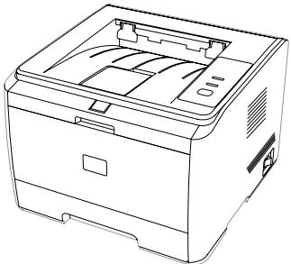</td><td>打印机</td><td>1</td></tr><tr><td>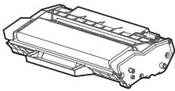</td><td>激光碳粉盒</td><td>1</td></tr><tr><td>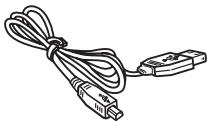</td><td>USB 连接线</td><td>1</td></tr><tr><td></td><td>电源线</td><td>1</td></tr><tr><td></td><td>随机光盘</td><td>1</td></tr><tr><td></td><td>快速安装指南</td><td>1</td></tr><tr><td>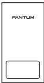</td><td>三包凭证</td><td>1</td></tr></table>

  
注： • 个别地区可能不包含三包凭证。

# 1.2. 本机组件

| 侧视图  
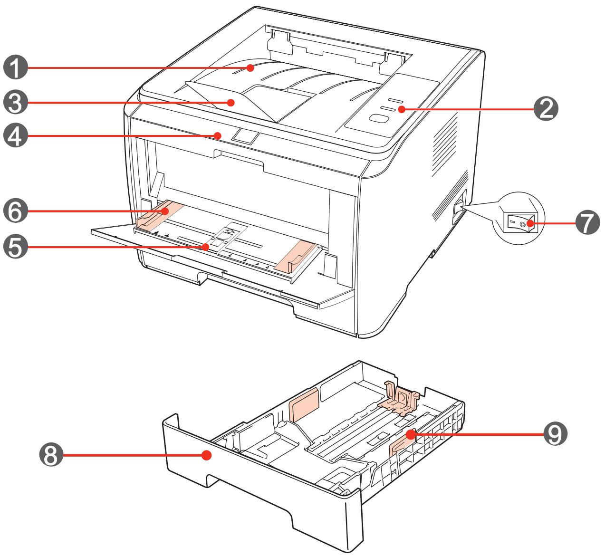

text_image

Technical diagram of a printer internal structure with numbered labels pointing to different components

<table><tr><td>1</td><td>出纸槽:用于存放打印出的纸张</td></tr><tr><td>2</td><td>控制面板:指示打印状态</td></tr><tr><td>3</td><td>出纸托盘:防止打印出来的纸张滑落</td></tr><tr><td>4</td><td>前盖:打开前盖,可取出激光碳粉盒</td></tr><tr><td>5</td><td>手动进纸盘:打开手动送纸盘前盖,手动放入打印介质</td></tr><tr><td>6</td><td>手动进纸盘导纸板:调整纸张两侧宽度</td></tr><tr><td>7</td><td>电源总开关:打开或关闭电源</td></tr><tr><td>8</td><td>自动进纸盒:放置打印纸张</td></tr><tr><td>9</td><td>宽度导纸板:在自动进纸盒内,用于调整该盒内纸张宽度</td></tr></table>

| 后视图  
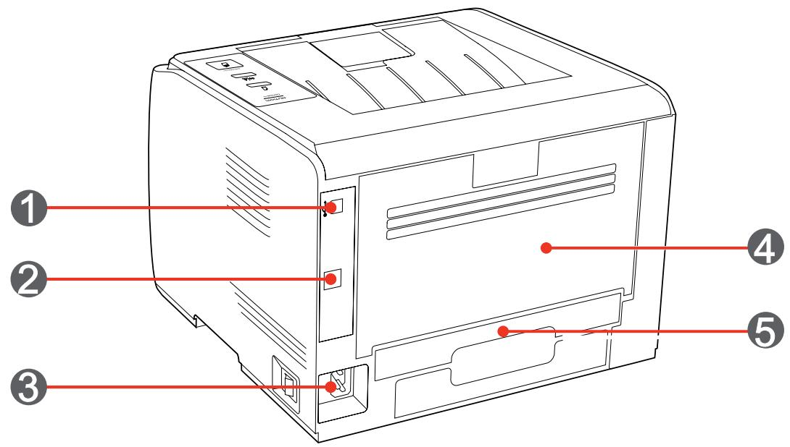

text_image

Diagram of a computer tower with numbered parts labeled 1 to 5 for identification.

<table><tr><td>1</td><td>USB接口:用于直接连接计算机</td></tr><tr><td>2</td><td>网络接口:用于连接产品到网络</td></tr><tr><td>3</td><td>电源接口:用于连接电源线</td></tr><tr><td>4</td><td>后盖:卡纸时可打开后盖检查</td></tr><tr><td>5</td><td>双面打印单元:用于后部双面打印卡纸释放;</td></tr></table>

# 1.3. 激光碳粉盒

| 激光碳粉盒使用寿命

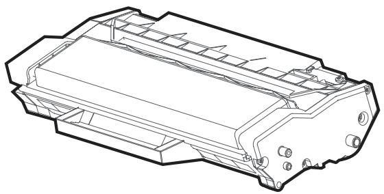

natural_image

Technical line drawing of a mechanical housing or enclosure component (no text or symbols)

<table><tr><td>类型</td><td>平均打印量</td></tr><tr><td>标准容量激光碳粉盒</td><td>约 3000 页(以上数据基于 ISO/IEC 19752 标准)</td></tr><tr><td>高容量激光碳粉盒</td><td>约 6000 页(以上数据基于 ISO/IEC 19752 标准)</td></tr></table>

注： • 如有型号变更恕不另行通知。

• 耗材容量可能会因使用类型不同而有所差异。  
• 本公司不建议使用 Pantum 原装品牌以外的耗材。  
• 因使用非 Pantum 原装耗材而导致的任何损坏不在保修范围之内。

# 纸张与打印介质

# 2

# 章

# 2. 纸张与打印介质 .

2.1. 纸张规格 . .2  
2.2. 特殊纸张 . .3   
2.3. 装入纸张 . .4

2.3.1. 装入自动进纸盒 . 4   
2.3.2. 装入手动进纸盘 . .5

2.4. 非打印区域 . 7  
2.5. 纸张与原稿使用原则 .

# 2. 纸张与打印介质

# 2.1. 纸张规格

<table><tr><td rowspan="4">自动进纸盒</td><td>介质类型</td><td>普通纸</td></tr><tr><td>介质尺寸</td><td>A4, A5, JIS B5, ISO B5, A6, Letter, Legal, Executive, Folio, Oficio, Statement, Japanese Postcard, Monarch Env, DL Env, C5 Env, C6 Env, No.10 Env, ZL, Big 16K, Big 32K, 16K, 32K, B6 自定义等。</td></tr><tr><td>介质克重</td><td>60~105g/m2</td></tr><tr><td>纸盒最大容量</td><td>250 张 80g/m2</td></tr><tr><td rowspan="3">手动进纸盘</td><td>介质类型</td><td>普通纸,特殊用纸(透明胶片,卡片纸,标签纸,信封,厚纸等)。</td></tr><tr><td>介质克重</td><td>60~200g/m2</td></tr><tr><td>纸盒最大容量</td><td>1 张</td></tr></table>

注: • 本款打印机建议使用标准纸、再生纸 。

• 不建议大量使用特殊纸，可能影响打印寿命。  
• 不符合本用户指南中所列准则的打印介质可能导致打印质量差、卡纸次数增多、打印机过度磨损。  
• 重量、成分、纹理及湿度等属性是影响打印机性能和输出质量的重要因素。  
• 在选择打印介质时，请注意以下事项：

1. 所需打印效果：选择的打印介质应符合打印任务的需要。  
2. 表面平滑度：打印介质的平滑度会对打印结果的清晰程度产生影响。  
3. 某些打印介质可能符合本部分的所有使用准则，但仍不能产生令人满意的打印效果。这可能是由于不正确的操作、不适宜的温度和湿度，或者奔图无法控制的其他因素造成的。在大批量购买打印介质之前，请确保打印介质符合本用户指南中指定的规格。  
4. 使用不符合这些规格要求的打印介质，可能会导致打印机的损坏。

# 2.2. 特殊纸张

本产品支持特殊纸张进行打印，特殊纸张包括：标签纸、信封、透明胶片、厚纸等。

注: • 当使用特殊纸张或打印介质时，请确保在打印设置上选择匹配的打印类型和尺寸以便获得最佳打印效果。

|请遵守以下标准：

<table><tr><td>打印介质种类</td><td>正确做法</td><td>错误做法</td></tr><tr><td>标签纸</td><td>仅使用未暴露衬纸的标签。标签使用时应放平。仅使用整张的标签。不保证市面上所有的标签纸都能够满足要求。</td><td>使用褶皱、起泡或破损的标签纸。</td></tr><tr><td>信封</td><td>信封应平整置入。</td><td>使用有褶皱、缺口、粘连或损坏的信封。使用带有别针、按扣、窗口或涂层衬里的信封。使用自粘不干胶或其他合成材料。</td></tr><tr><td>透明胶片</td><td>仅使用经核准适用于激光打印机的透明胶片。从产品中取出透明胶片后,应将其放在一个平整的面上。</td><td>使用不适用于激光打印机的透明打印介质。</td></tr><tr><td>厚纸</td><td>仅使用经核准适用于激光打印机并满足本产品重量规格的重质纸。</td><td>使用重量超过本产品推荐介质规格的纸张,除非是经核准适用于本产品的纸张。</td></tr></table>

# 2.3. 装入纸张

# 2.3.1. 装入自动进纸盒

1. 从打印机中完全抽出自动进纸盒。

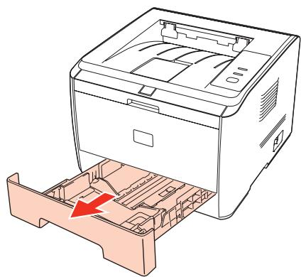

natural_image

Illustration of a printer with a red arrow indicating a component or insertion, showing internal structure without any text or symbols.

2. 滑动自动进纸盒长度导纸板、宽度导纸板到所需的纸张尺寸卡槽，匹配纸张的长度和宽度。

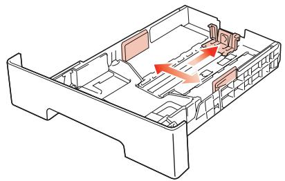

natural_image

Technical line drawing of a mechanical housing or enclosure with internal components and directional arrows indicating movement (no text or symbols)

注: • 请不要过度挤压“长度导纸板”和“宽度导纸板”，否则容易导致纸张变形。

3. 请在装入纸张之前展开堆叠的纸张，避免卡纸或进纸错误，再把纸张打印面朝下装入纸盒内。自动进纸盒最多可装入 250 张 80g/m² 纸。

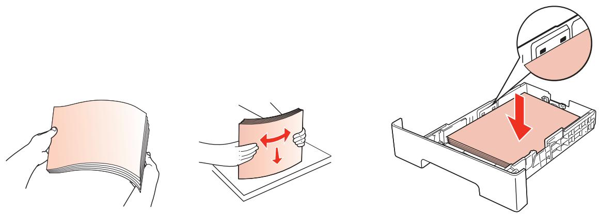

text_image

Illustration showing three steps of inserting a card into a printer, with arrows indicating fold change and a magnified inset highlighting the process.

4. 抬起出纸托盘，避免打印完的纸张滑落。

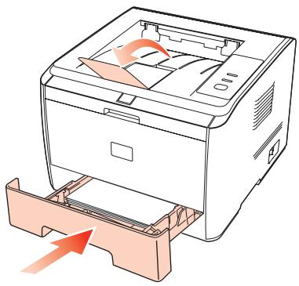

natural_image

Illustration of a printer with an arrow indicating press release (no text or symbols present)

注 : • 建议抬起出纸托盘避免打印完纸张滑落。如果您选择不抬起出纸托盘，我们建议立 即取走从打印机中输出的已打印纸张。

• 如果一次性放入标准纸盘的纸张超过 250 页 $( 8 0 { \mathsf { g } } / { \mathsf { m } } ^ { 2 } )$ ）会卡纸或不进纸。  
• 如果仅打印单面时，请把要打印的面（空白面）向下。

# 2.3.2. 装入手动进纸盘

1. 抬起出纸托盘，避免打印完的纸张滑落，或在打印完成后立即将打印的文档取走。

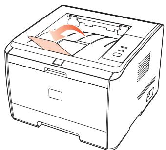

natural_image

Line drawing of a printer with an open lid and paper feed, showing internal structure (no text or symbols)

2. 打开手动进纸盘。

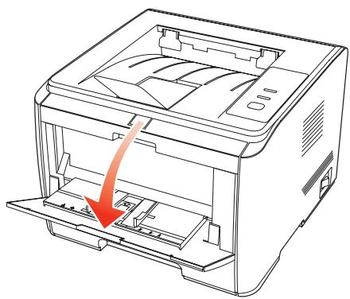

natural_image

Line drawing of a printer with an open lid and internal structure, showing no text or symbols.

3. 滑动手动进纸盘导纸板以匹配纸张的两侧。不要过度用力，否则会导致卡纸或纸张歪斜。

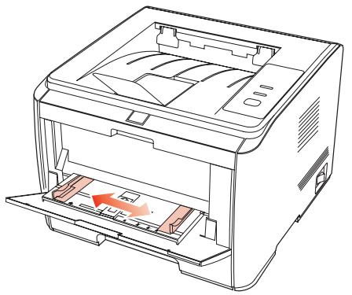

natural_image

Line drawing of a printer with internal components and a paper feed into the paper (no text or symbols)

4. 双手将一张信封或透明胶片等打印介质放入手动进纸盘中，直至信封或透明胶片的前端碰到校正锟。

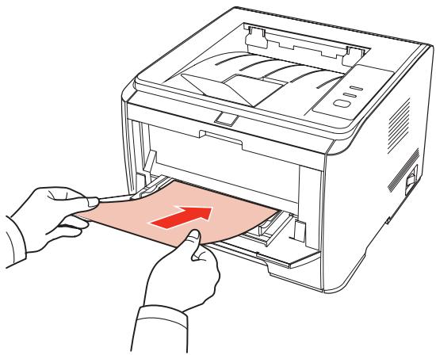

natural_image

Illustration of hands inserting a card into a printer (no text or symbols visible)

注: • 当您将纸张放入手动进纸盘时，打印机将自动进入手动进纸模式。

• 请每次放入一张打印介质到手动进纸盘中，打印结束后再放入另一张。  
• 将打印介质打印面向上放入手动进纸盘，装入时，纸张的顶部先进入手动进纸盘。  
•使用打印过的纸张时，请把要打印的面（空白面）朝上。

5. 当打印完的页面从打印机输出后，按照如上步骤，再放入第二张继续打印。放入过慢，将会提示缺纸，需要按控制面板继续打印；放入太快，纸张会被卷入打印机并容易造成卡纸。

注: • 打印后，请立刻取走纸张、信封和透明胶片纸。堆叠的纸张或信封会引起卡纸或曲纸。

# 2.4. 非打印区域

阴影部分表示非打印区域。

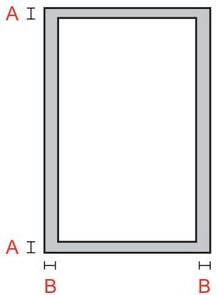

text_image

A I
A I
H
B
H
B

<table><tr><td>用途</td><td>纸张尺寸</td><td>上下边距(A)</td><td>左右边距(B)</td></tr><tr><td rowspan="2">打印</td><td>A4</td><td>5 mm (0.197 in)</td><td>5 mm (0.197 in)</td></tr><tr><td>Letter</td><td>5 mm (0.197 in)</td><td>5 mm (0.197 in)</td></tr></table>

# 2.5. 纸张与原稿使用原则

• 纹理粗糙、有凹凸、油渍、十分光滑的纸张或原稿打印性能不佳。  
• 请确保纸上无灰尘、绒毛等。  
• 将纸张置于平坦的表面，存放在荫凉、干燥的环境。

# 驱动软件安装与卸载

# 3

章

3. 驱动软件安装与卸载

3.1. 基于 WINDOWS 的驱动程序. .2

3.1.1. 驱动安装 .. 2

3.1.2. 驱动程序卸载.. .8

3.2. 基于 MAC 系统驱动软件安装 . ..10

# 3. 驱动软件安装与卸载

# 3.1. 基于 WINDOWS 的驱动程序

# 3.1.1. 驱动安装

# 1. 简介

驱动软件通过安装卸载向导帮助用户运行安装卸载程序，提供的模块与其主要功能如下：

• Autorun 完成安装光盘的自动运行。  
• 安装：为用户提供本打印机的安装向导。  
• 卸载：为用户提供本打印机的卸载向导。

在 Windows XP 及 Windows Server 2003 下，首次连接本设备时，系统会弹出“找到新的硬件向导”，请关闭此窗口。不关闭该窗口，可能搜索不到打印机，导致安装无法实现。

# 2. 安装步骤

# 1) 运行界面

运行安装光盘后，程序自动运行，显示如下界面：

PANTUM

程序运行前将对用户身份进行判定，若用户为管理员身份，则显示此界面；若用户为非管理员身份，则弹出“权限不足，请以管理员权限安装Pantum P3000 系列打印机。”的提示。

# 2) 安装语言

运行完毕后，进入下一个界面：语言选择界面。

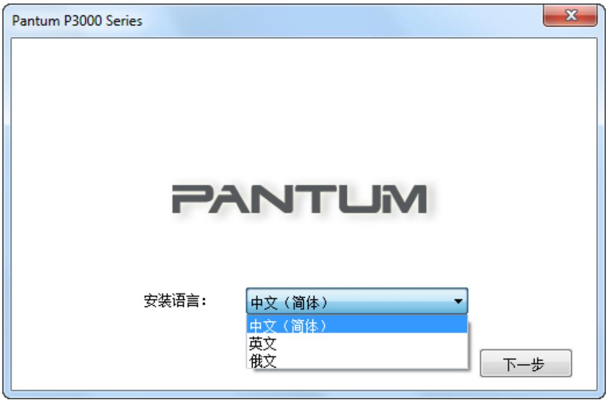

text_image

PANTUM P3000 Series
PANTUM
安装语言： 中文（简体）
中文（简体）
英文
俄文
下一步

# 3) 许可协议

点击“下一步”按钮进入许可协议界面，仔细阅读用户许可协议，如果同意请选择“我同意”选项，单击“下一步”按钮，继续安装。

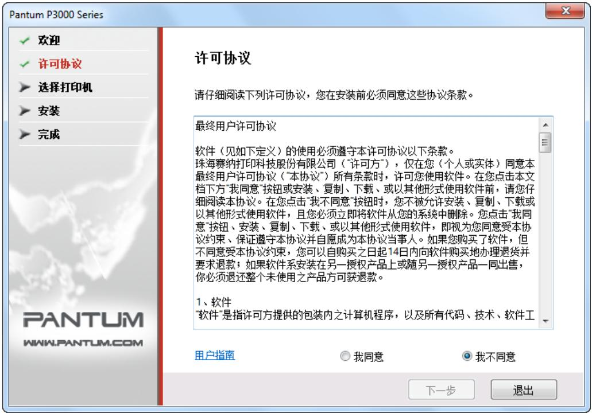

text_image

Pantum P3000 Series
✓ 欢迎
✓ 许可协议
▶ 选择打印机
▶ 安装
▶ 完成
许可协议
请仔细阅读下列许可协议，您在安装前必须同意这些协议条款。
最终用户许可协议
软件（见如下定义）的使用必须遵守本许可协议以下条款。
珠海赛纳打印科技股份有限公司（“许可方”），仅在您（个人或实体）同意本
最终用户许可协议（“本协议”）所有条款时，许可您使用软件。在您点击本文
档下方“我同意”按钮或安装、复制、下载、或以其他形式使用软件前，请您仔
细阅读本协议。在您点击“我不同意”按钮时，您不被允许安装、复制、下载或
以其他形式使用软件，且您必须立即将软件从您的系统中删除。您点击“我同
意”按钮、安装、复制、下载、或以其他形式使用软件，即视为您同意受本协
议约束、保证遵守本协议并自愿成为本协议当事人。如果您购买了软件，但
不同意受本协议约束，您可以自购买之日起14日内向软件购买地办理退货并
要求退款；如果软件系安装在另一授权产品上或随另一授权产品一同出售，
你必须退还整个未使用之产品方可获退款。
1、软件
“软件”是指许可方提供的包装内之计算机程序，以及所有代码、技术、软件工
用户指南	○ 我同意	● 我不同意
下一步	退出

该界面默认勾选“我不同意”单选按钮，“下一步”按钮灰显。为了继续安装本软件，用户需要勾选“我同意”选项，亮显“下一步”按钮。

本驱动给用户提供了有关 Pantum P3000 Series 打印机的使用帮助等资源，以HTML格式给出。用户可以点击该界面的“用户指南”阅读相应HTML格式的文档。

# 4) 搜索打印机

选择“同意”，点击“下一步”后，进入搜索打印机界面，程序会自动搜索计算机是否已经连接适合的打印机设备。

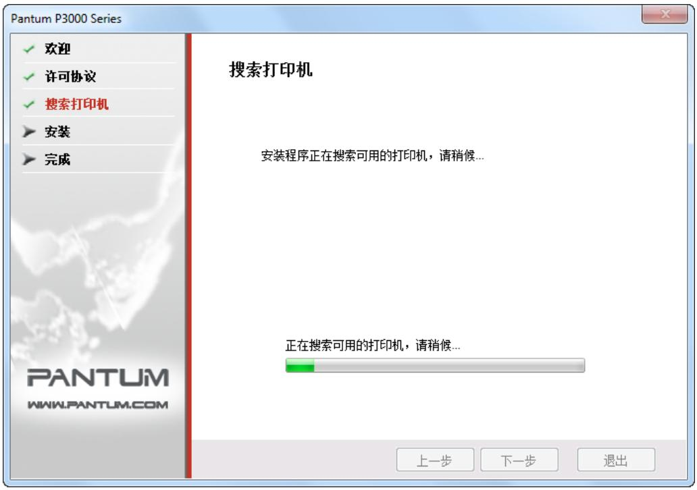

text_image

Pantum P3000 Series
✓ 欢迎
✓ 许可协议
✓ 搜索打印机
▶ 安装
▶ 完成
搜索打印机
安装程序正在搜索可用的打印机，请稍候...
正在搜索可用的打印机，请稍候...
PANTUM
WWW.PANTUM.COM
上一步	下一步	退出

# 5) 选择打印机

若搜索到适合的打印机设备，则自动进入“选择打印机”界面。

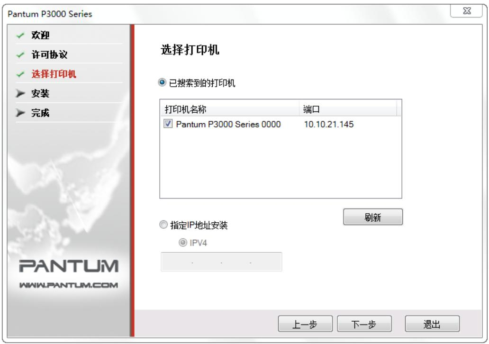

text_image

Pantum P3000 Series
✓ 欢迎
✓ 许可协议
✓ 选择打印机
▶ 安装
▶ 完成
选择打印机
● 已搜索到的打印机
打印机名称	端口
✓ Pantum P3000 Series 0000	10.10.21.145
○ 指定IP地址安装
● IPV4
刷新
上一步	下一步	退出
PANTUM
WWW.PANTUM.COM

注 : • “已搜索到的打印机”与“指定 IP 地址安装”只能同时选择一项。

若未搜索到适合的打印机设备，单击“下一步”，则弹出“当前未搜索到打印机，是否继续安装?”对话框。

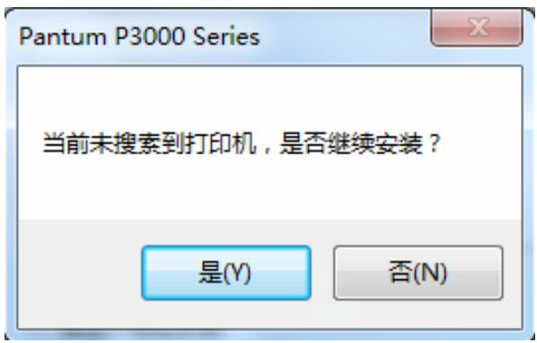

text_image

Pantum P3000 Series
当前未搜索到打印机，是否继续安装？
是(Y)
否(N)

如果用户选择“是”，则继续安装进入拷贝界面，如果用户选择“否”，则停留在选择打印机界面。选择后点击“下一步”进入拷贝界面。

# 6) 文件拷贝

将安装文件拷贝至安装路径。

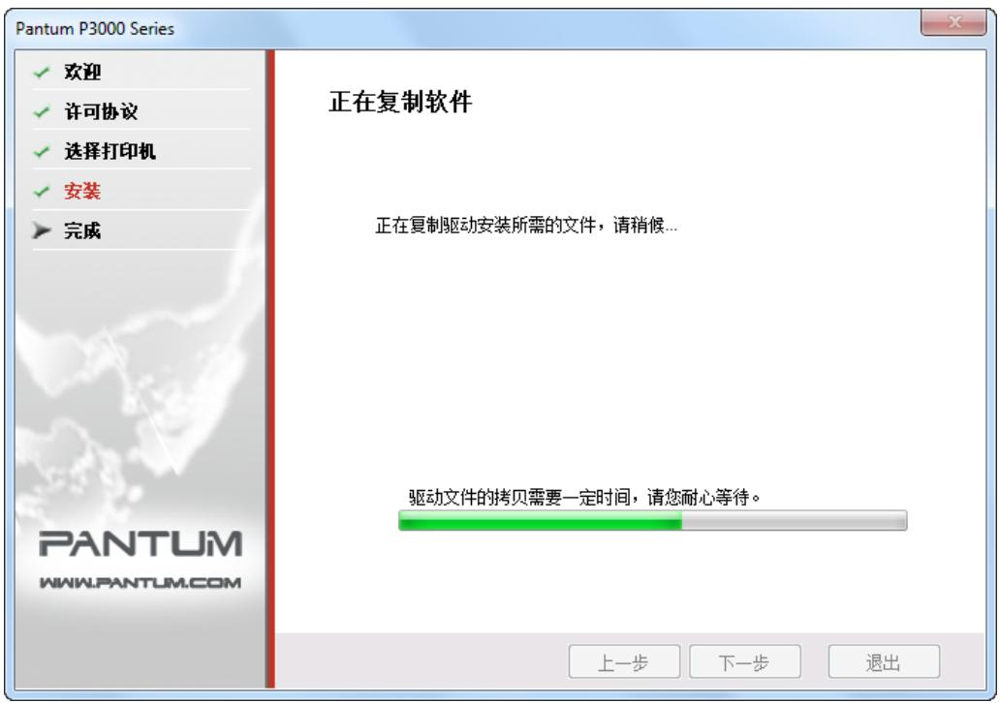

text_image

Pantum P3000 Series
✓ 欢迎
✓ 许可协议
✓ 选择打印机
✓ 安装
▶ 完成
正在复制软件
正在复制驱动安装所需的文件，请稍候...
驱动文件的拷贝需要一定时间，请您耐心等待。
PANTUM
WWW.PANTUM.COM
上一步	下一步	退出

# 7) 驱动安装

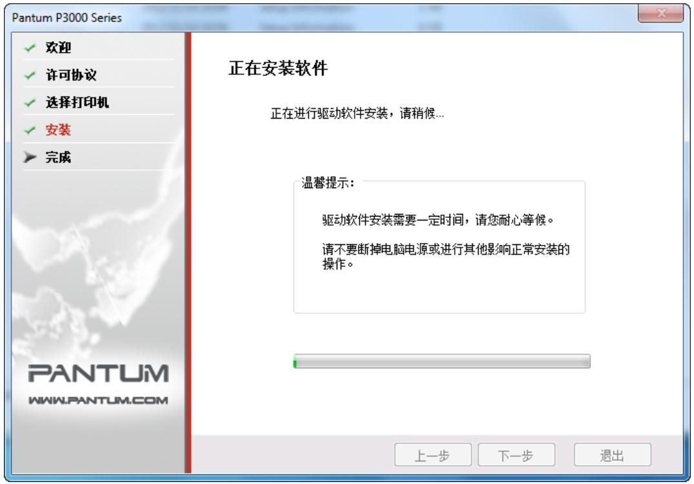

text_image

Pantum P3000 Series
✓ 欢迎
✓ 许可协议
✓ 选择打印机
✓ 安装
> 完成
正在安装软件
正在进行驱动软件安装，请稍候...
温馨提示：
驱动软件安装需要一定时间，请您耐心等候。
请不要断掉电脑电源或进行其他影响正常安装的操作。
PANTUM
WWW.PANTUM.COM
上一步    下一步    退出

如果驱动安装过程中弹出 Windows 无法验证此驱动程序软件的发布者，提示是否继续安装，用户需要点击“仍然继续”或“始终安装此驱动程序软件”，否则会造成安装不成功（不同操作系统弹出的警告显示界面稍有不同）。

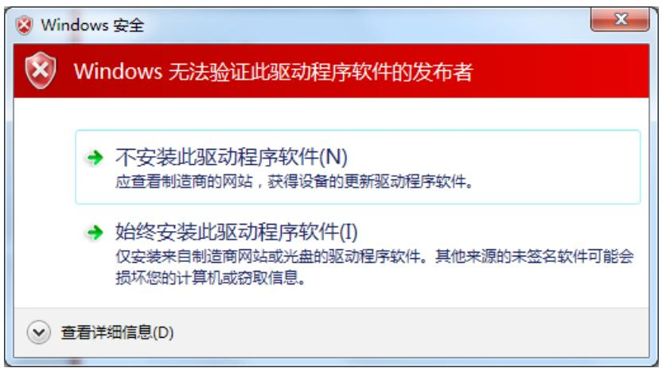

text_image

Windows 安全
Windows 无法验证此驱动程序软件的发布者
→ 不安装此驱动程序软件(N)
应查看制造商的网站，获得设备的更新驱动程序软件。
→ 始终安装此驱动程序软件(I)
仅安装来自制造商网站或光盘的驱动程序软件。其他来源的未签名软件可能会损坏您的计算机或窃取信息。
查看详细信息(D)

# 8) 完成安装

待驱动安装进度条显示安装进度完成之后，进入安装完成界面。

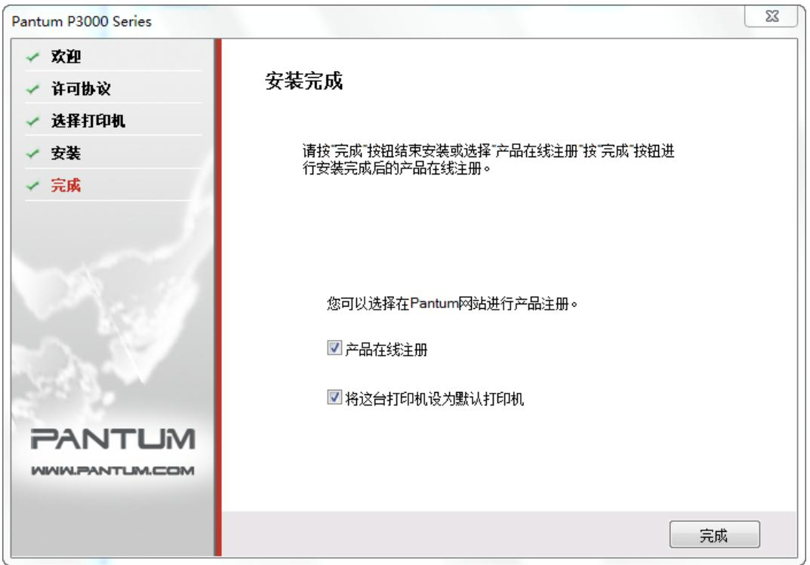

text_image

Pantum P3000 Series
✓ 欢迎
✓ 许可协议
✓ 选择打印机
✓ 安装
✓ 完成
安装完成
请按"完成"按钮结束安装或选择"产品在线注册"按"完成"按钮进行安装完成后的产品在线注册。
您可以选择在Pantum网站进行产品注册。
✓ 产品在线注册
✓ 将这台打印机设为默认打印机
完成

点击“完成”按钮，完成打印机驱动安装，进行在线产品注册，可提供在线服务和咨询、以及激光碳粉盒等信息，并设置这台打印机为默认打印机。也可根据需要取消这些选项。

注 : • 若在未连接打印机的状态下安装驱动程序，则不显示“将这台打印机设为默认打印机”选项。

# 3.1.2. 驱动程序卸载

# 1) 选择卸载方式。

在“开始”菜单中选择“Pantum-卸载图标”，进入卸载界面，或者在控制面板找到“添加/删除”，找到Pantum 相关选项，单击“更改及删除”，弹出欢迎界面。

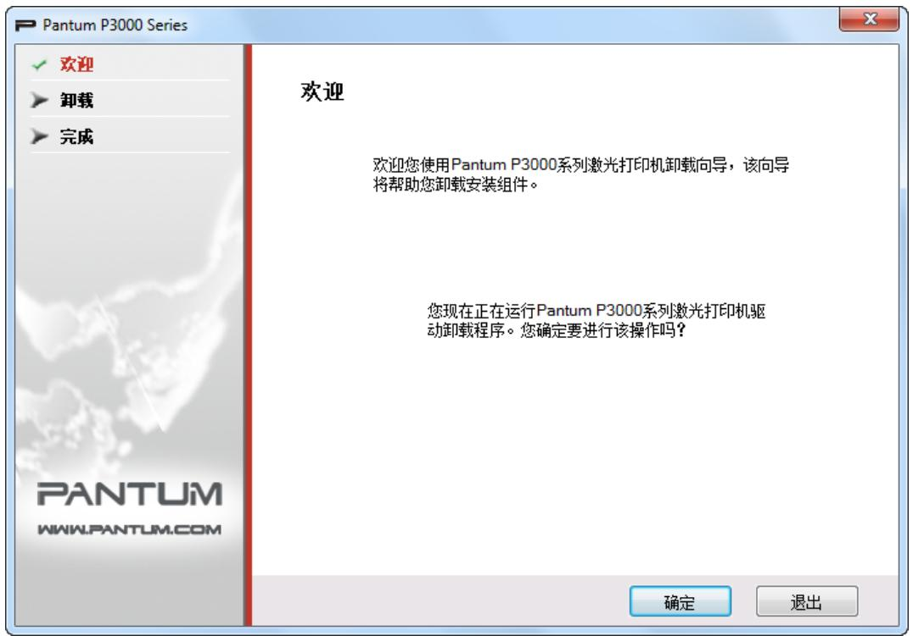

text_image

Pantum P3000 Series
欢迎
卸载
完成
欢迎
欢迎您使用Pantum P3000系列激光打印机卸载向导，该向导
将帮助您卸载安装组件。
您现在正在运行Pantum P3000系列激光打印机驱
动卸载程序。您确定要进行该操作吗？
确定	退出

# 2) 卸载权限判定提示。

卸载需要管理员权限。以非管理员身份运行卸载程序，弹出“权限不足，请以管理员权限卸载Pantum P3000 系列打印机。”信息提示框，卸载程序主界面不显示。点击信息提示框中的“确定”按钮，提示框界面消失。

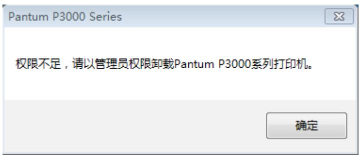

text_image

Pantum P3000 Series
权限不足，请以管理员权限卸载Pantum P3000系列打印机。
确定

# 3) 卸载进度界面

点击“下一步”，进入卸载界面。

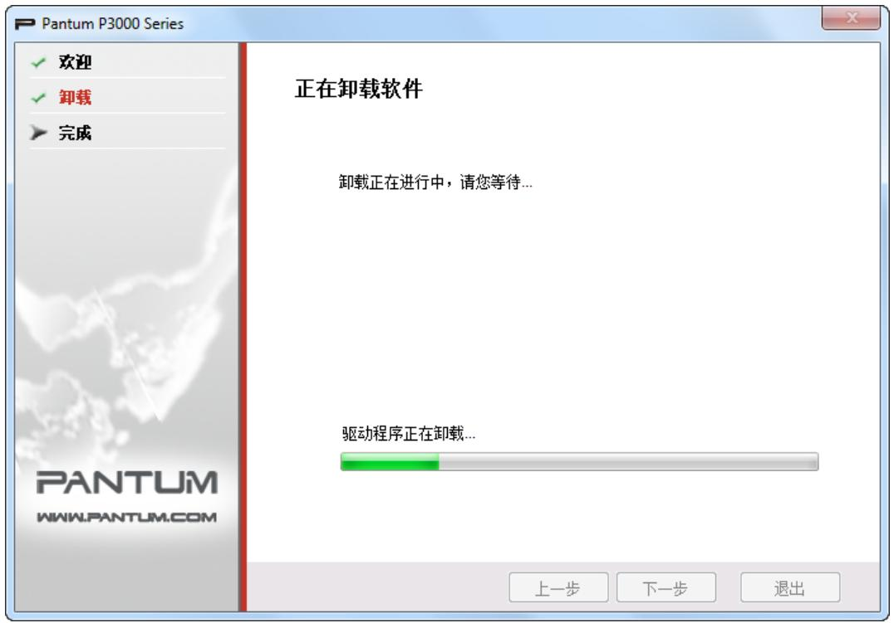

text_image

Pantum P3000 Series
✓ 欢迎
✓ 卸载
▶ 完成
正在卸载软件
卸载正在进行中，请您等待...
驱动程序正在卸载...
上一步	下一步	退出
PANTUM
WWW.PANTUM.COM

# 4) 完成界面

进度条推进完成后，进入完成界面。

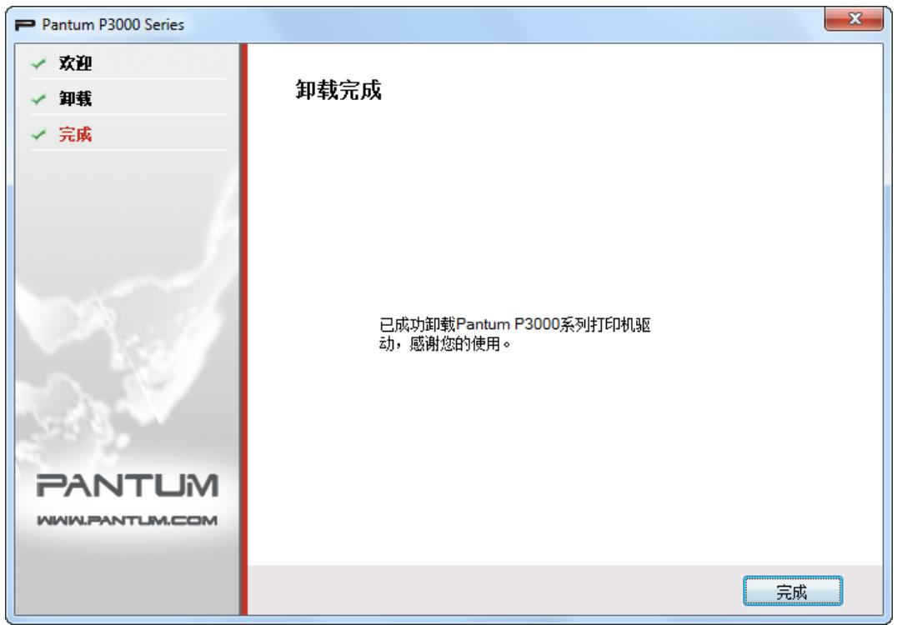

text_image

Pantum P3000 Series
✓ 欢迎
✓ 卸载
✓ 完成
卸载完成
已成功卸载Pantum P3000系列打印机驱动，感谢您的使用。
完成

单击“完成”按钮，卸载成功。

# 3.2. 基于 MAC 系统驱动软件安装

Mac 驱动安装是利用 Mac 系统自带的 PackageMaker 软件制作而成，其安装风格与 Mac 下普通软件安装基本保持一致。安装分为以下几个步骤：介绍、许可、目的宗卷、安装类型、安装、摘要。

# 1. 介绍

将随机光盘插入光盘驱动器，运行光盘点击Mac系统安装包，显示如下界面；

单击“继续”，显示许可协议内容。

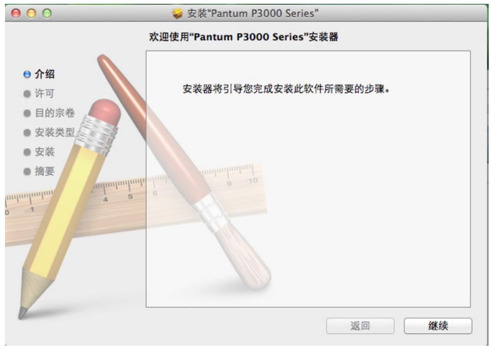

text_image

安装"Pantum P3000 Series"
欢迎使用"Pantum P3000 Series"安装器
● 介绍
● 许可
● 目的宗卷
● 安装类型
● 安装
● 摘要
安装器将引导您完成安装此软件所需要的步骤。
返回	继续

# 2. 许可

许可协议内容，示例图如下。

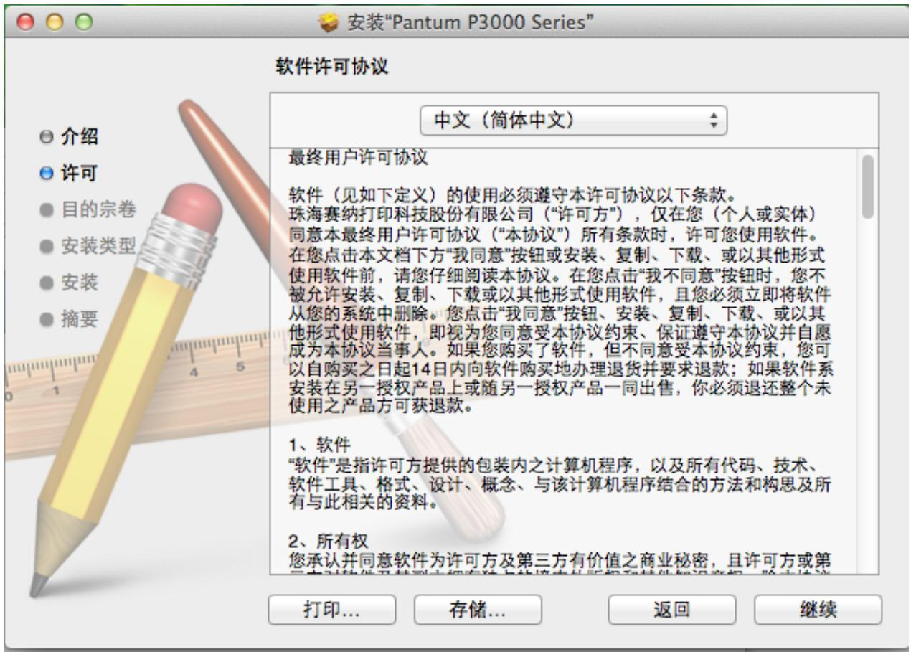

text_image

安装"Pantum P3000 Series"
软件许可协议
○ 介绍
● 许可
● 目的宗卷
● 安装类型
● 安装
● 摘要
中文（简体中文）
最终用户许可协议
软件（见如下定义）的使用必须遵守本许可协议以下条款。
珠海赛纳打印科技股份有限公司（“许可方”），仅在您（个人或实体）
同意本最终用户许可协议（“本协议”）所有条款时，许可您使用软件。
在您点击本文档下方“我同意”按钮或安装、复制、下载、或以其他形式
使用软件前，请您仔细阅读本协议。在您点击“我不同意”按钮时，您不
被允许安装、复制、下载或以其他形式使用软件，且您必须立即将软件
从您的系统中删除。您点击“我同意”按钮、安装、复制、下载、或以其
他形式使用软件，即视为您同意受本协议约束、保证遵守本协议并自愿
成为本协议当事人。如果您购买了软件，但不同意受本协议约束，您可
以自购买之日起14日内向软件购买地办理退货并要求退款；如果软件系
安装在另一授权产品上或随另一授权产品一同出售，你必须退还整个未
使用之产品方可获退款。
1、软件
“软件”是指许可方提供的包装内之计算机程序，以及所有代码、技术、
软件工具、格式、设计、概念、与该计算机程序结合的方法和构思及所
有与此相关的资料。
2、所有权
您承认并同意软件为许可方及第三方有价值之商业秘密，且许可方或第
打印...
存储...
返回
继续

单击“继续”，将弹出“若要继续安装软件，您必须同意软件许可协议中的条款。”对话框。

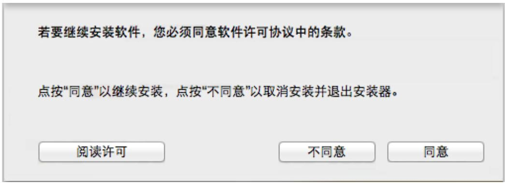

text_image

若要继续安装软件，您必须同意软件许可协议中的条款。
点按“同意”以继续安装，点按“不同意”以取消安装并退出安装器。
阅读许可	不同意	同意

用户单击“同意”，接受许可协议内容后继续安装。

# 3. 目标卷宗

选择安装磁盘，显示视图如下；

单击“继续”，显示安装相关信息。

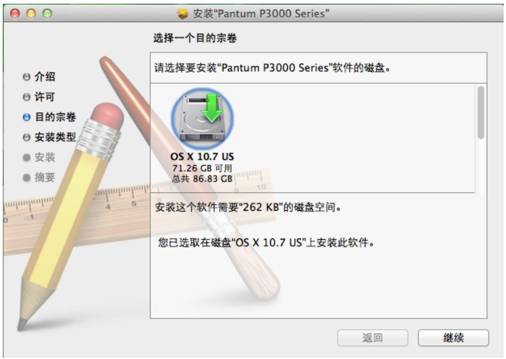

text_image

安装"Pantum P3000 Series"
选择一个目的宗卷
请选择要安装"Pantum P3000 Series"软件的磁盘。
OS X 10.7 US
71.26 GB 可用
总共 86.83 GB
安装这个软件需要"262 KB"的磁盘空间。
您已选取在磁盘"OS X 10.7 US"上安装此软件。
返回	继续

注 : • Mac OS X 10.4 下直接进入该界面，但在 Mac OS X 10.5 以后系统中先进入“安装类型”选项，在界面点击“更改安装位置”按钮才能跳转至“目的宗卷”。

# 4. 安装类型

显示安装相关信息，示例图如下。

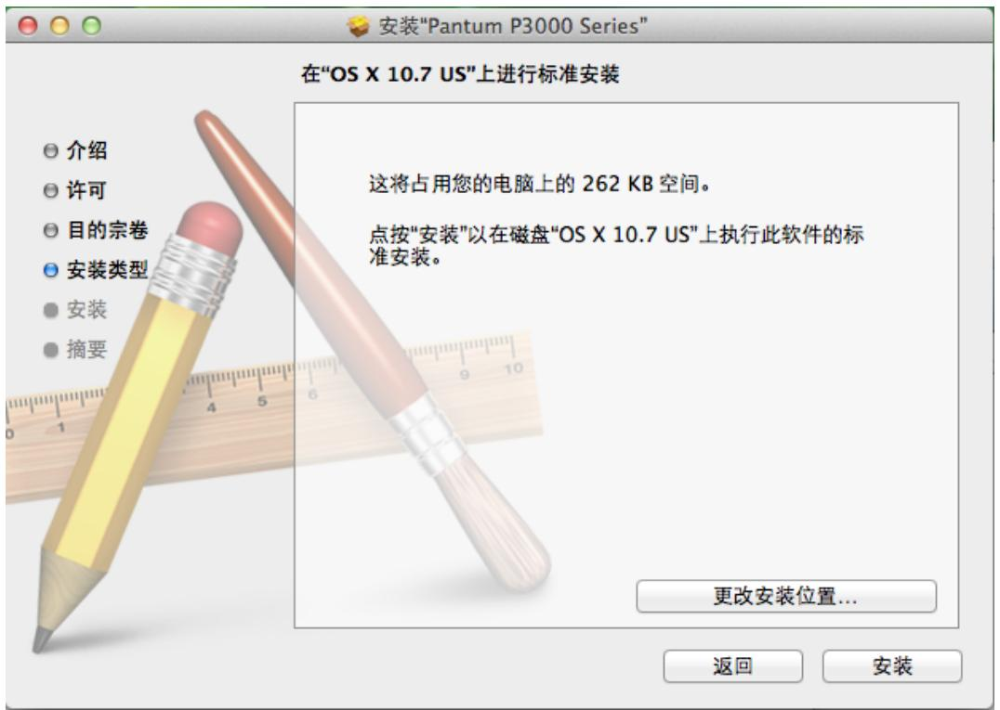

text_image

安装"Pantum P3000 Series"
在"OS X 10.7 US"上进行标准安装
● 介绍
● 许可
● 目的宗卷
● 安装类型
● 安装
● 摘要
这将占用您的电脑上的 262 KB 空间。
点按"安装"以在磁盘"OS X 10.7 US"上执行此软件的标
准安装。
更改安装位置...
返回	安装

单击“安装”，将弹出如下提示框，以管理员用户登录并授予权限后，可继续安装。

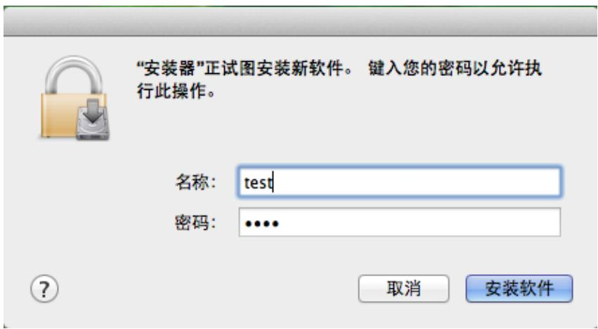

text_image

"安装器"正试图安装新软件。键入您的密码以允许执行此操作。
名称: test
密码: ••••
取消 安装软件

# 5. 安装

安装进度，示例图如下；

单击“继续”，显示安装完成界面。

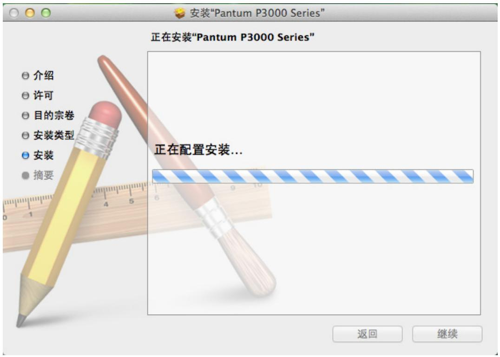

text_image

安装"Pantum P3000 Series"
正在安装"Pantum P3000 Series"
● 介绍
● 许可
● 目的宗卷
● 安装类型
● 安装
● 摘要
正在配置安装...
返回	继续

# 6. 摘要

安装完成，示例图如下。

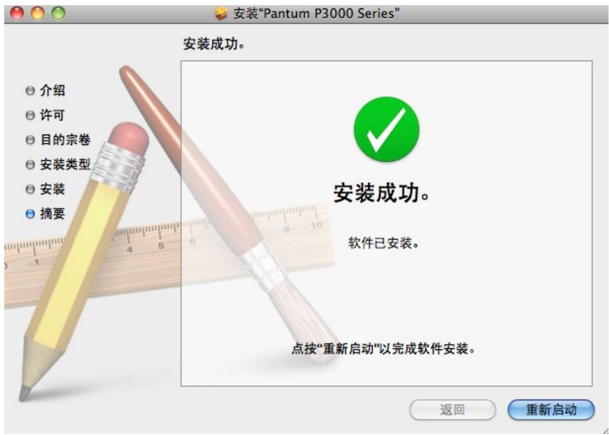

text_image

安装"Pantum P3000 Series"
安装成功。
介绍
许可
目的宗卷
安装类型
安装
摘要
安装成功。
软件已安装。
点按"重新启动"以完成软件安装。
返回  重新启动

# 网络设置（适用于网络打印功能机型）

# 4

章

4. 网络设置（适用于网络打印功能机型）

4.1. 安装产品到网络 . .2  
4.2. 设置网络产品 . .3

4.2.1. 查看或更改网络设置 . 3

4.2.2. 设置或更改 WEB 页面登陆密码. .3

4.2.3. IP 地址.. .4

# 4. 网络设置（适用于网络打印功能机型）

您可能需要在产品上设置某些网络参数，可以从内嵌的Web服务器设置这些参数。

# 4.1. 安装产品到网络

在此设置中，本产品直接连接到网络，并且可设置为允许网络上的所有计算机直接打印到本产品。

1. 在打开产品之前，先将网络电缆接入产品网络端口，以将产品直接连接到网络。  
2. 打开产品，等待控制面板上的状态指示灯显示为准备就绪状态，如下图所示。

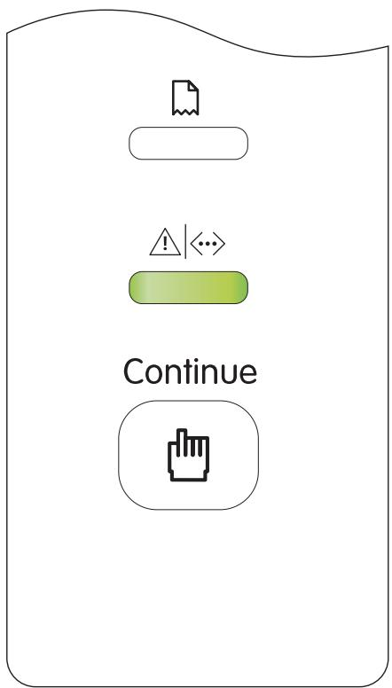

text_image

Continue

3. 将产品CD光盘插入计算机。如果软件安装程序未启动，请浏览CD 光盘上的“setup.exe”文件，然后双击运行该文件。  
4. 按照安装程序说明进行操作。  
5. 继续安装完成。

注: • 当安装程序提示选择打印机时，可从“已搜索到的打印机”中选择相应的打印机名称；

• 如果“已搜索到的打印机”中没有显示打印机名称，请点击“刷新”，搜索网络上的打印机产品；

• 如果您知道要连接的打印机产品的 IP 地址，可以选择“指定 IP 地址安装”输入 IP地址进行连接。

# 4.2. 设置网络产品

# 4.2.1. 查看或更改网络设置

您可以使用内嵌的 Web 服务器查看或更改 IP 设置。

1. 打印 DEMO 信息页，查看打印机的 IP 地址信息。

空闲状态下，长按控制面板按钮（如下图），可以打印 DEMO 页。

2. 在 Web 浏览器的地址行中键入 IP 地址，以打开内嵌的 Web 服务器。  
3. 单击选项卡以获得网络信息。可根据需要更改设置。

PANTUM   
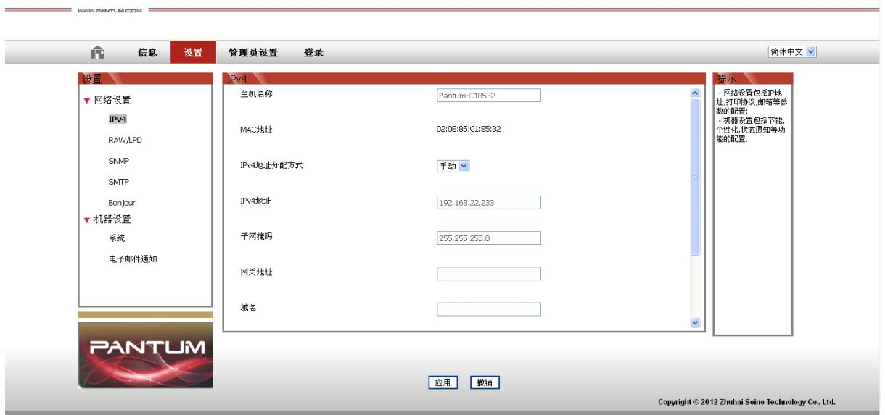

text_image

www.pantum.com
信息 设置 管理员设置 登录
简体中文
设置
网络设置
IPv4
RAW/LPD
SNMP
SMTP
Bonjour
机器设置
系统
电子邮件通知
IPv4
主机名称 Pantum-C18532
MAC地址 02:0E:85:C1:85:32
IPv4地址分配方式 手动
IPv4地址 192.168.22.233
子网掩码 255.255.255.0
网关地址
域名
提示
- 网络设置包括IP地
址,打印协议,邮箱等参
数的配置;
- 机器设置包括节能,
个性化,状态通知等功
能的配置.
应用 撤销
Copyright © 2012 Zhuhai Seine Technology Co., Ltd.

# 4.2.2. 设置或更改 WEB页面登陆密码

使用内嵌的Web服务器，设置一个网络密码或更改现有的密码。

1. 打开内嵌的Web服务器，请先登录。

注: • 产品默认用户名为“admin”，初始密码为“000000”。

2. 单击“账号管理”选项卡。  
3. 在密码框和确认密码框中键入新密码。  
4. 在窗口底部，单击“应用”按钮以保存设置。

# 4.2.3. IP 地址

产品IP地址可通过DHCP 功能自动设置，也可手动设置。

| 自动设置

产品默认开启DHCP 自动设置功能。

1. 将产品通过网络电缆连接到网络，并完成开机准备。  
2. 产品将自动获得服务器分配的IP地址。自动获得的IP地址可能要过几分钟才能使用。

注 : • 如 果 DHCP 自 动 获 取 IP 地 址 不 成 功， 产 品 会 自 动 采 用 默 认 的 IP 地 址：169.254.1.1。

• 鉴于 DHCP 的特性，如果打印机长时间不使用或者更换网络接入点，网络自动分配给打印机的 IP 地址可能会变化，导致无法连接打印机，建议启用 DHCP 功能的同时，将网络自动分配的 IP 地址与打印机 MAC 地址绑定。

# | 手动设置

在Web 浏览器的地址行中键入IP地址，以打开内嵌的Web服务器。

1. 在导航栏中点击“设置”，打开设置页面；  
2. 选择“网络设置”-“IPV4 设置”；  
3. 依次设置“IP地址分配方式（手动）”、“IP地址”和“子网掩码”，其他项为选填；  
4. 点击“应用”，保存设置。

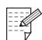

注: • 可以使用内嵌式Web服务器更改IP地址的分配方式为“自动”或“手动”。

• 如果要重置产品的所有参数设置，可以进行恢复出厂设置操作，具体做法是：在产品关闭电源的状态下，按住控制面板按钮（如下图），打开产品电源，2-3 秒后松开按钮，待打印机进入就绪状态后完成重置。

Continue

# 打印

# 5

# 章

5. 打印 ..

5.1. 打印功能 . .2  
5.2. 打开帮助文档 . .3  
5.3. 打印方式 . .4

5.3.1. 自动进纸盒打印 . 4  
5.3.2. 手动进纸盘打印 .5

5.4. 自动双面打印 .. .5

# 5. 打印

# 5.1. 打印功能

您可以通过在打印首选项中各种属性的设置实现如下打印功能。

<table><tr><td>功能</td><td>图示</td></tr><tr><td>自动双面打印</td><td>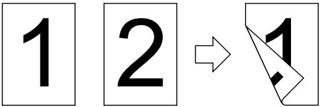</td></tr><tr><td>逐份打印</td><td></td></tr><tr><td>逆序打印</td><td></td></tr><tr><td>多页合一</td><td>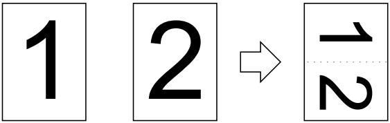</td></tr><tr><td>海报打印(仅适用于Windows系统)</td><td>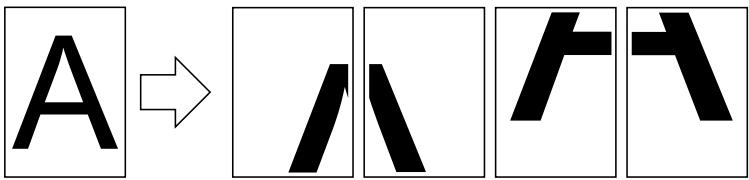</td></tr><tr><td>缩放打印</td><td>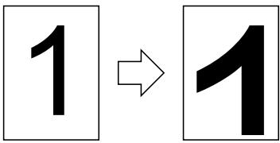</td></tr><tr><td>自定义尺寸</td><td></td></tr></table>

注： • 您可以在多页合一中选择“2x2 海报”打印，实现海报打印功能。

•您可以打开打印首选项，点击帮助按钮，查看具体的功能解释。如何打开帮助文档，请参阅章节5.2。

# 5.2. 打开帮助文档

您可以打开“打印首选项”，点击“帮助”按钮（仅适用于 Windows 系统）。

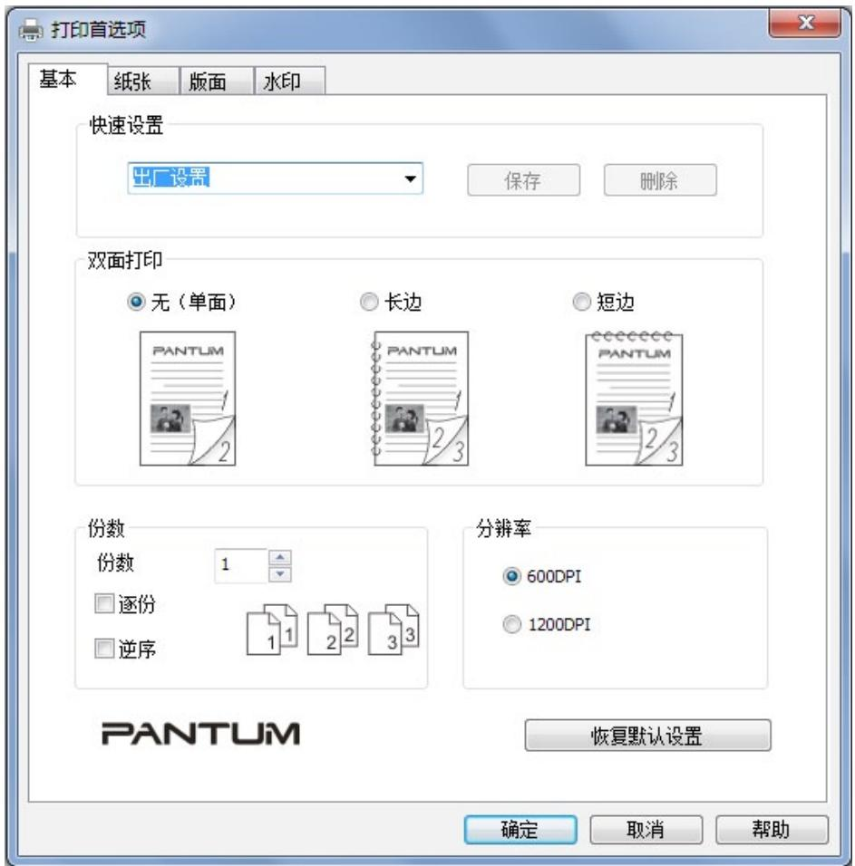

text_image

打印首选项
基本	纸张	版面	水印
快速设置
出厂设置
保存	删除
双面打印
无（单面）
PANTUM
2
PANTUM
2 3
短边
eeeeeee PANTUM
2 3
份数
份数	1
逐份
逆序
1 1	2 2	3 3
分辨率
600DPI
1200DPI
PANTUM
恢复默认设置
确定	取消	帮助

帮助文档中有打印机的使用指南。

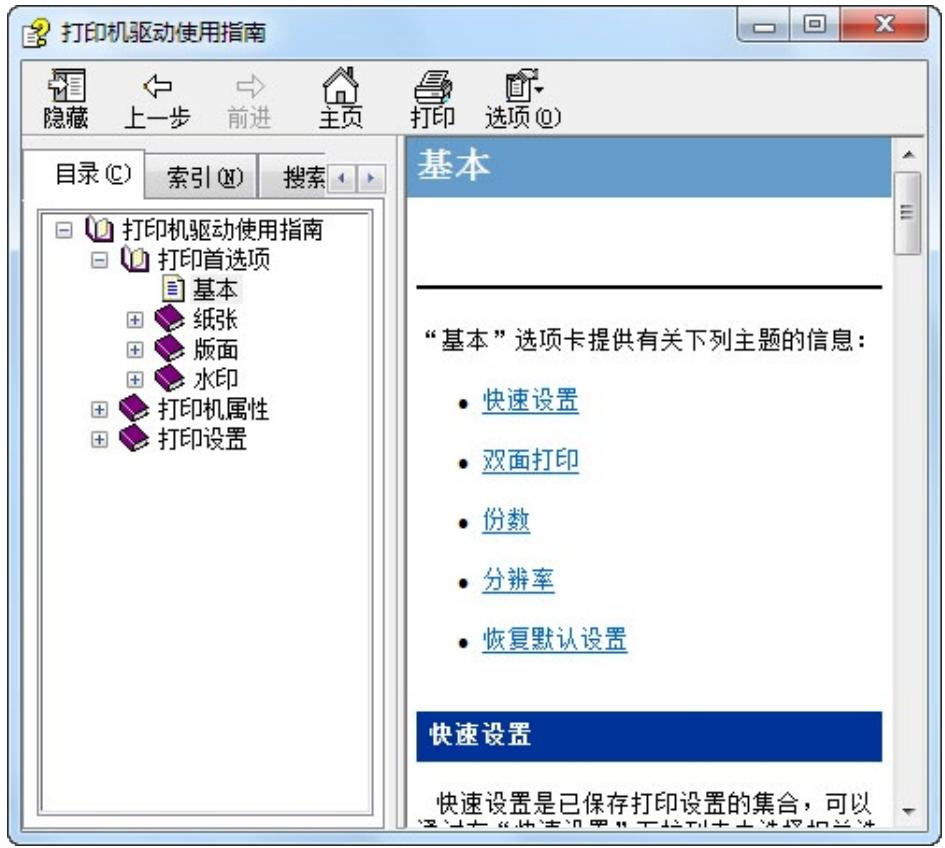

text_image

打印机驱动使用指南
隐藏 上一步 前进 主页 打印 选项 (O)
目录 (C) 索引 (N) 搜索
打印机驱动使用指南
打印首选项
基本
+ 纸张
+ 版面
+ 水印
+ 打印机属性
+ 打印设置
基本
“基本”选项卡提供有关下列主题的信息：
• 快速设置
• 双面打印
• 份数
• 分辨率
• 恢复默认设置
快速设置
快速设置是已保存打印设置的集合，可以

# 5.3. 打印方式

本机可以提供两种打印方式，自动进纸盒打印和手动进纸盘打印。默认状态为自动进纸盒打印，若手动进纸盘有打印介质，则优先打印手动进纸盘内的打印纸张。

# 5.3.1. 自动进纸盒打印

在打印前，请确保自动进纸盒中已装入相应数量的介质，且手动进纸盘内无打印介质。

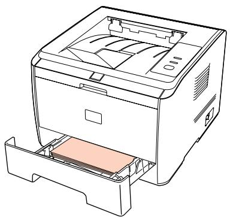

natural_image

Line drawing of a printer with paper feed and paper holder (no text or symbols)

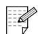

注： • 有关装纸注意事项，请参阅第2章。

• 有关自动进纸盒打印的介质类型，请参阅第2章。

# 5.3.2. 手动进纸盘打印

当您将纸张放入手动进纸盘时，本机将自动进入手动进纸模式。

natural_image

Illustration of hands inserting a card into a printer (no text or symbols visible)

注： • 手动进纸模式是当手动进纸盘放入纸张时，优先从手动进纸盘送纸。

• 手动进纸盘一般用来打印特殊纸张，如信封、透明胶片等，且每次只能放入一张。  
• 有关在手动进纸盘中装纸，请参阅第2章。  
• 有关可以通过手动进纸盘打印的介质类型，请参阅第2章。

# 5.4. 自动双面打印

1. 本机支持普通纸的自动双面打印。自动双面打印支持的纸张大小：A4/LETTER，LEGAL，OFICIO，FOLIO。

注： • 如果纸张薄，可能会起皱，如果纸张卷曲，将其恢复平整然后放回自动进纸盘中。

• 某些纸张介质不适于自动双面打印，尝试自动双面打印可能会损坏打印机。  
• 如果一次性放入自动进纸盒的纸张超过250张，将会出现卡纸或不进纸现象。  
• 自动双面打印不支持海报功能。  
• 有关装纸，自动进纸盒打印的介质类型，请参阅第2章，建议使用标准纸张。  
• 有关如何处理卡纸，请参阅第8章。

2. 本机支持自动进纸盒自动双面打印和手动进纸盘自动双面打印。

1）自动进纸盒自动双面打印。

在打印前，请确保自动进纸盒中已装入相应数量的介质。

natural_image

Line drawing of a printer with paper feed and paper holder (no text or symbols)

2）手动进纸盘自动双面打印。

从手动进纸盘中进纸进行自动双面打印。

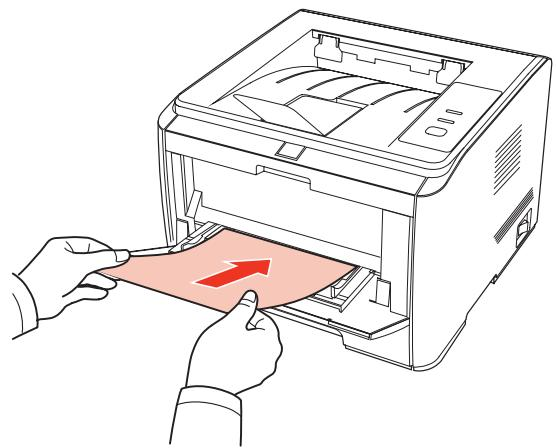

natural_image

Illustration of hands inserting a paper into a printer into a machine (no text or symbols visible)

当您将纸张放入手动进纸盘时，本机将优先选择手动进纸盘中的打印纸张。

注： • 手动进纸盘可实现自动双面打印，但是需要您手动给纸，且使用推荐的打印纸张类型。

自动双面打印步骤如下（仅适用于Windows 系统）

1. 从应用程序（如记事本）打开要打印的打印作业。  
2. 从“文件”菜单中选择“打印”。

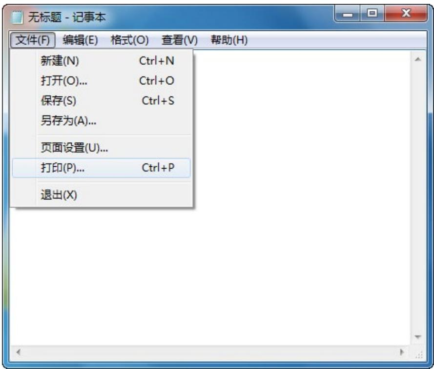

text_image

无标题 - 记事本
文件(F)  编辑(E)  格式(O)  查看(V)  帮助(H)
新建(N)      Ctrl+N
打开(O)...    Ctrl+O
保存(S)      Ctrl+S
另存为(A)...
页面设置(U)...
打印(P)...    Ctrl+P
退出(X)

3. 选择奔图相应型号的打印机。

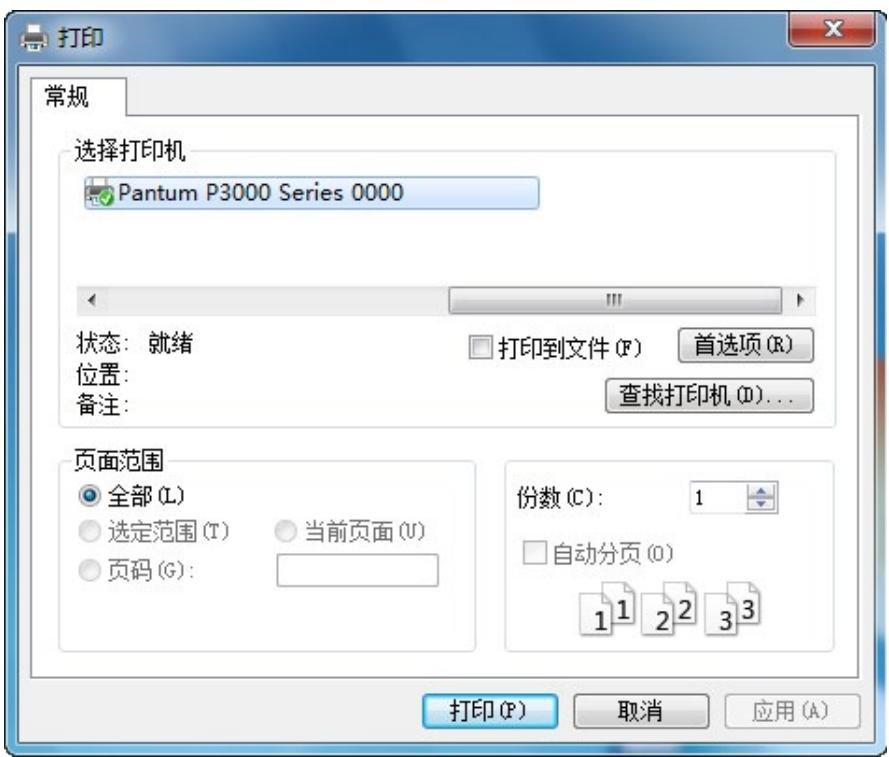

text_image

打印
常规
选择打印机
Pantum P3000 Series 0000
状态： 就绪
位置：
备注：
页面范围
全部 (L)
选定范围 (T)    当前页面 (U)
页码 (G)：
份数 (C)： 1
自动分页 (O)
1 1 2 2 3 3
打印 (P)    取消    应用 (A)

4. 单击“首选项”或“属性”按钮，进行打印的配置。

5. 选择“基本”选项卡的“双面打印”区，选择“长边”和“短边”选项。

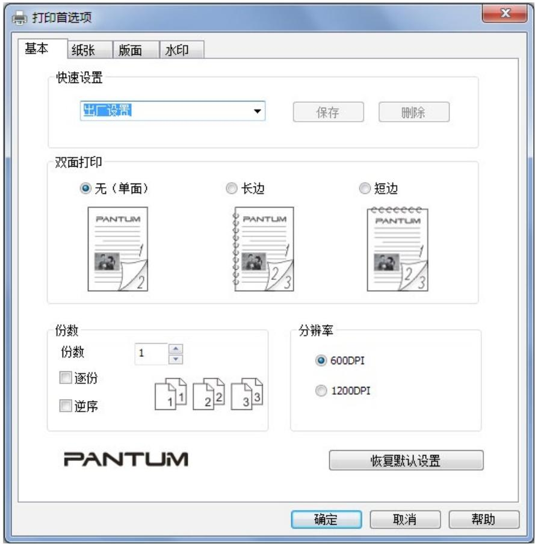

text_image

打印首选项
基本	纸张	版面	水印
快速设置
出厂设置
保存	删除
双面打印
无（单面）
PANTUM
2
长边
PANTUM
2
短边
PANTUM
2
3
份数
份数	1
逐份
逆序
1	1	2	2	3	3
分辨率
600DPI
1200DPI
PANTUM
恢复默认设置
确定	取消	帮助

6. 单击“打印”，完成打印设置后，即可实现自动双面打印。

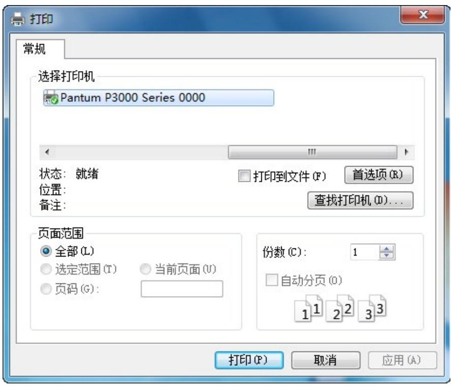

text_image

打印
常规
选择打印机
Pantum P3000 Series 0000
状态: 就绪
位置:
备注:
打印到文件 (F)
首选项 (R)
查找打印机 (D)...
页面范围
全部 (L)
选定范围 (T)
当前页面 (U)
页码 (G):
份数 (C): 1
自动分页 (O)
打印 (P)
取消
应用 (A)

注： • 建议抬起托纸板避免已打印纸张从出纸托盘中滑出。如果您选择不抬起出纸托盘托纸板，我们建议立即取走从本机中输出的已打印纸张。

• 在打印过程中，打印机将自动调整页面文字的方向。

# 控制面板

# 6

# 章

6. 控制面板 .

6.1. 控制面板概述 . .2  
6.2. 控制面板按键和指示功能 .2  
6.3. 指示灯指示 .3

# 6. 控制面板

# 6.1. 控制面板概述

操作面板包括一个按键，一个双色 LED 灯（双色 LED 灯显示红色、绿色、橙黄色），一个单色LED灯，如下图所示：

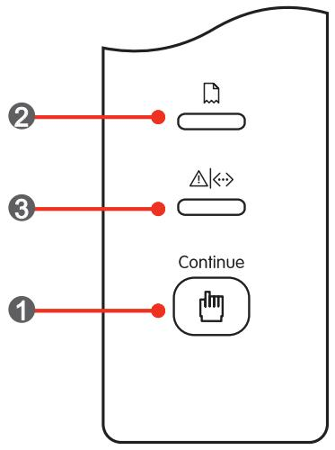

flowchart

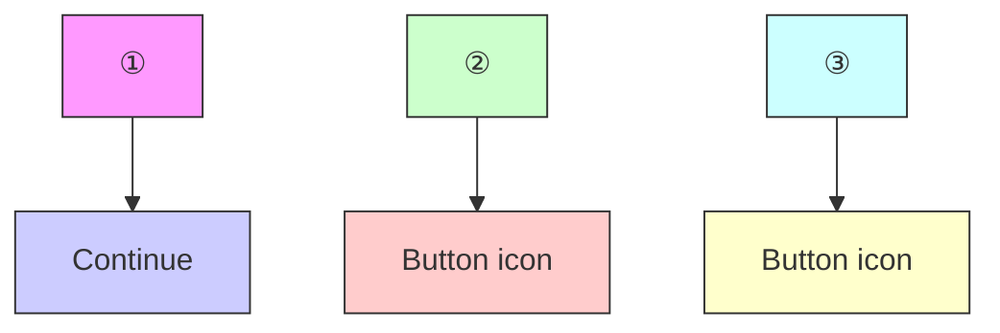
```mermaid
graph TD
    A["①"] --> B["Continue"]
    C["②"] --> D["Button icon"]
    E["③"] --> F["Button icon"]
    style A fill:#f9f,stroke:#333
    style B fill:#ccf,stroke:#333
    style C fill:#cfc,stroke:#333
    style D fill:#fcc,stroke:#333
    style E fill:#cff,stroke:#333
    style F fill:#ffc,stroke:#333
```

<table><tr><td>1</td><td>按键</td></tr><tr><td>2</td><td>单色 LED 灯</td></tr><tr><td>3</td><td>双色 LED 灯</td></tr></table>

# 6.2. 控制面板按键和指示功能

# 1. 按键功能

该键可以实现如下功能：

• 空闲状态下长按可以打印 DEMO 页  
• 休眠状态唤醒产品   
• 进纸失败时继续打印（短按）  
• 缺纸后继续打印 （短按）

# 2. 单色 LED 灯功能

当出现缺纸、卡纸、进纸失败、纸张不匹配、纸张来源与设定纸张来源不一致等，该灯亮红色，起到警示的功能。

# 3. 双色 LED 灯功能

双色LED灯会显示红色、绿色和橙黄色，具体功能为：

<table><tr><td></td><td>亮红色:出现较为严重的错误,具体错误请参阅第8章故障排除;</td></tr><tr><td></td><td>亮橙黄色:激光碳粉盒未安装、激光碳粉盒不匹配、激光碳粉盒粉量低等,即和激光碳粉盒相关;</td></tr><tr><td></td><td>亮绿色:上述以外的状态(打印、热机、休眠、就绪等)。</td></tr></table>

# 6.3. 指示灯指示

当打印机出现故障时，可以通过指示灯指示来判断故障来源。

LED指示灯状态指示含义如下：

<table><tr><td rowspan="2">序号</td><td colspan="2">状态</td><td rowspan="2">状态描述</td></tr><tr><td>纸张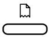</td><td>数据/碳粉盒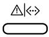</td></tr><tr><td>1</td><td></td><td></td><td>开机时双指示灯亮</td></tr><tr><td>2</td><td></td><td></td><td>启动机器,单色红灯灭,双色灯(绿)闪烁</td></tr><tr><td>3</td><td></td><td></td><td>就绪状态,单色红灯灭,双色灯(绿)长亮;就绪状态下,纸盒无纸,单色红灯灭,双色灯(绿)长亮</td></tr><tr><td>4</td><td></td><td></td><td>打印中,单色红灯灭,双色灯(绿)闪烁</td></tr><tr><td>5</td><td></td><td></td><td>休眠,单色红灯灭,双色灯(绿)闪烁</td></tr><tr><td>6</td><td></td><td></td><td>打印过程中纸盒无纸,手动进纸缺纸或者出现进纸失败,单色红灯闪烁</td></tr><tr><td>7</td><td></td><td></td><td>打印过程中卡纸(进纸处卡纸,中间卡纸,出纸处卡纸、双面打印单元卡纸),纸张来源与设定不匹配,单色红灯长亮</td></tr><tr><td>8</td><td></td><td></td><td>在就绪状态下,或者休眠状态下,粉量低报警,双色灯(橙黄)闪烁(此种状态下,双色灯不显示绿色)</td></tr><tr><td>9</td><td></td><td></td><td>碳粉盒错误(碳粉盒未安装,碳粉盒不匹配,寿命尽),双色灯(橙黄)长亮</td></tr><tr><td>10</td><td></td><td></td><td>打印机其他错误(加热辊异常、激光器马达异常、通信错误、盖子打开等等),双色灯(红色)长亮</td></tr></table>

# 日常维护

# 7

# 章

7. 日常维护 .

7.1. 打印机清洁 . 2  
7.2. 激光碳粉盒维护 .3

7.2.1. 关于激光碳粉盒 . .3

7.2.2. 更换激光碳粉盒 . 4

# 7. 日常维护

# 7.1. 打印机清洁

注: • 请使用中性清洁剂。

• 打印机使用后短时间内局部零件仍处于高温状态。当打开前盖或后盖接触内部零件时，请勿接触下图阴影部分的零件。

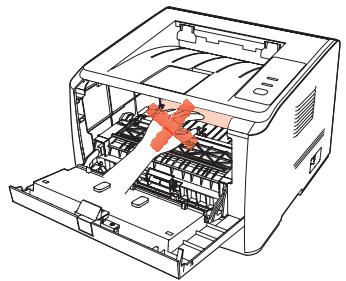

natural_image

Technical line drawing of a computer printer internal structure (no text or symbols)

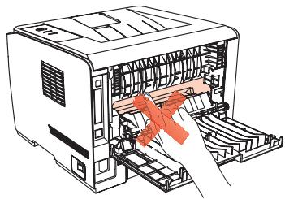

natural_image

Illustration of a printer with a hand inserting a red X-shaped component into the output (no text or symbols)

1. 使用柔软的抹布擦拭设备外部，除去灰尘。

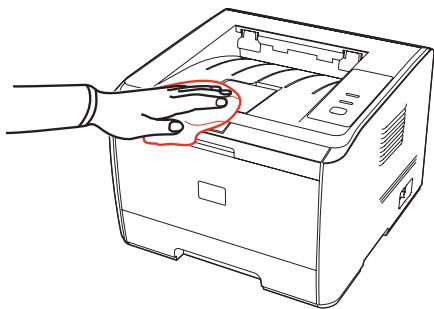

natural_image

Line drawing of a hand opening a printer into a rack (no text or symbols)

2. 打开前盖，取出激光碳粉盒。

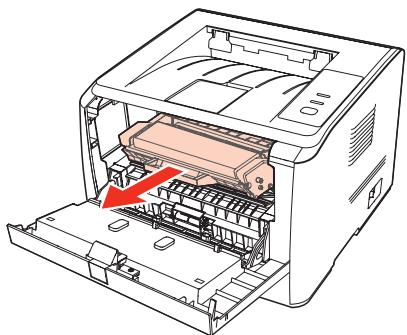

natural_image

Diagram of an open computer printer showing internal structure and a red arrow indicating a component (no text or symbols present)

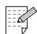

注: • 取下激光碳粉盒时，请将激光碳粉盒装入保护袋或用厚纸包裹，避免光线照射而损坏感光鼓。

3. 清洁打印机内部，如下图所示，用干燥无绒布料轻轻擦拭图示阴影处。

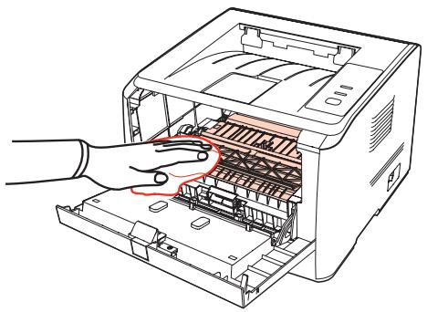

natural_image

Line drawing of a hand inserting into a computer into a rack (no text or symbols)

# 7.2. 激光碳粉盒维护

# 7.2.1. 关于激光碳粉盒

1. 激光碳粉盒的使用和维护。

为了获得更好的打印质量，请使用奔图原装激光碳粉盒。

使用激光碳粉盒时，请注意下列事项：

• 除非立即使用，否则请勿从包装中取出激光碳粉盒。  
• 请勿擅自重新填充激光碳粉盒。否则由此引起的损坏不包括在打印机保修范围内。  
• 请将激光碳粉盒存放在阴凉干燥的环境。  
• 请勿将激光碳粉盒置于火源附近，激光碳粉盒内的碳粉为易燃物,避免引起火灾。  
• 在取出或拆卸激光碳粉盒时 , 请注意碳粉泄露问题 , 若发生碳粉泄露导致碳粉与皮肤接触或者飞溅入眼睛和口中,请立即用清水清洗,如有不适请立即就医。  
• 放置激光碳粉盒时, 请远离儿童可接触区域。

2. 激光碳粉盒使用寿命。

激光碳粉盒的使用寿命取决于打印作业需要的碳粉量。

当打印机LED指示灯显示下图状态时，表示该激光碳粉盒已到寿命期限，请更换激光碳粉盒。

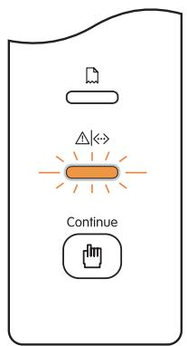

text_image

Continue

# 7.2.2. 更换激光碳粉盒

注: 在更换激光碳粉盒前，请注意如下事项：

• 因激光碳粉盒表面可能含有碳粉，取出时请小心处理，避免洒落。  
• 取出的激光碳粉盒请放置在纸张上，以免碳粉意外洒落。  
• 取下保护罩时，应立即将激光碳粉盒装入打印机，以免过多地受到阳光或室内光线直射，损坏激光碳粉盒感光鼓。  
• 安装时，请勿触碰感光鼓表面，以免刮伤感光鼓。

更换激光碳粉盒步骤如下：

1. 关闭打印机电源。

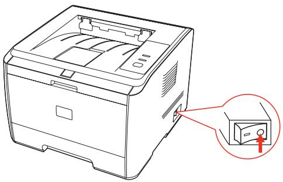

natural_image

Line drawing of a printer with a close-up inset showing the internal structure (no text or symbols)

2. 打开前盖，沿着导轨取出用尽的激光碳粉盒。

natural_image

Diagram of an open printer with a red arrow indicating the internal structure (no text or symbols present)

3. 打开新的激光碳粉盒包装，握住激光碳粉盒把手，轻轻左右摇晃 5-6 次，使激光碳粉盒内碳粉均匀分散。

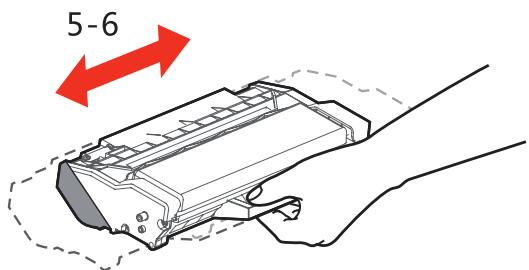

text_image

5-6

4. 取下保护罩，将激光碳粉盒沿导轨放入打印机，盖紧机盖。

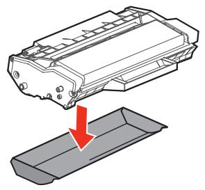

natural_image

Diagram showing a mechanical component being lowered into a tray, with a red arrow indicating the process (no text or symbols present)

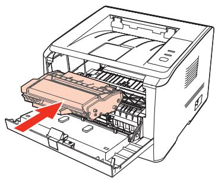

natural_image

Diagram of a computer printer internal structure with a red arrow indicating the open lid (no text or symbols present)

注 : 碳粉盒放入打印机前请检查是否有封条，如果有请先撕下封条再安装；

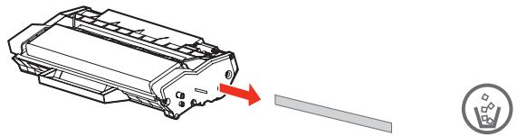

natural_image

Diagram of a mechanical component with a red arrow indicating direction, next to a circular icon showing a crown (no text or symbols present)

5. 重新开启打印机电源，打印一张测试页。

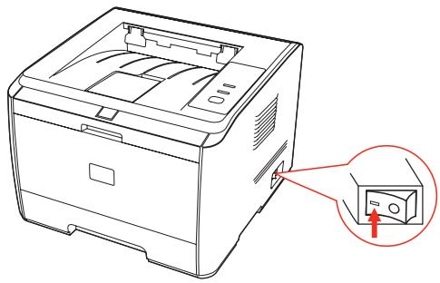

natural_image

Line drawing of a printer with a close-up view of the internal component (no text or symbols)

# 故障排除

# 8

# 章

# 8. 故障排除

8.1. 清除卡纸 .2

8.1.1. 纸盒卡纸 . 2   
8.1.2. 手送纸盘卡纸 3   
8.1.3. 中间卡纸 . 4  
8.1.4. 定影单元卡纸 .. 5   
8.1.5. 双面单元卡纸 .. 6

8.2. 软件故障  
8.3. 常见故障排除

8.3.1. 一般故障 . 7

8.3.2. 图像缺陷 .8

# 8. 故障排除

请仔细阅读本章节 , 可以帮您解决打印过程中常见的故障。若还未能解决出现的问题 , 请及时联系奔图售后服务中心。

在处理常见故障之前，首先请检查以下情况：

• 电源线是否连接正确，并且打印机电源开关已打开。  
• 所有的保护零件是否已拆除。  
• 激光碳粉盒是否已正确安装。  
• 出纸槽是否已完全合上。  
• 纸张是否已正确放入纸盒中。  
• 接口电缆线是否已正确连接打印机和计算机。  
• 是否已选择并安装了正确的打印机驱动程序。  
• 计算机端口是否已安装并连接到正确的打印机端口。

# 8.1. 清除卡纸

注 : • 按如下步骤将卡纸全部取出后，合上前盖，在纸盒中整理好纸张，打印机将自动恢复打印。如果打印机不能自动开始打印，请按控制面板按钮。  
• 如果打印机仍然未开始打印，请检查打印机内的卡纸是否全部清除。   
• 如果不能自行取出卡纸，请联系当地的奔图授权维修中心或送往就近奔图授权维修 中心维修。

# 8.1.1. 纸盒卡纸

1. 打开纸盒。

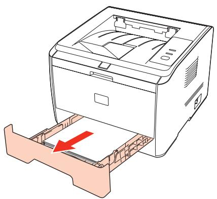

natural_image

Illustration of a printer with a red arrow indicating a download or file path (no text or symbols present)

2. 将卡住的纸张轻轻的向外径直拉出。

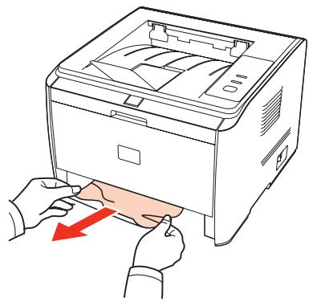

natural_image

Line drawing of hands inserting a printer into a machine (no text or symbols)

3. 取出卡纸后，请纸盒重新装入打印机，打印机将自动恢复打印。

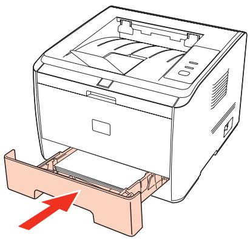

natural_image

Line drawing of a printer with a red arrow indicating compression or disassembly (no text or symbols present)

# 8.1.2. 手送纸盘卡纸

1. 将卡住的纸张轻轻的向外拉出。

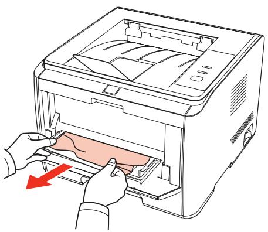

natural_image

Illustration of hands inserting a printer into a machine, showing paper being inserted (no text or symbols present)

2. 取出后重新装入纸张，打印机将自动恢复打印。

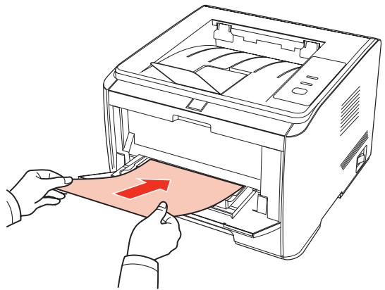

natural_image

Illustration of hands inserting a card into a printer (no text or symbols visible)

# 8.1.3. 中间卡纸

注 : • 在取中间卡纸与定影单元卡纸时，请注意切勿触摸如下阴影部分区域，避免灼伤。

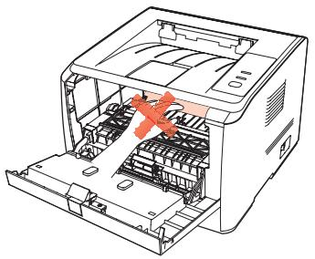

natural_image

Technical line drawing of a computer printer internal structure showing internal components and casing (no text or labels)

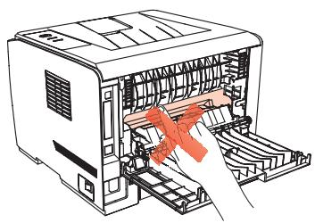

natural_image

Illustration of a printer's internal structure with a hand holding a red X-shaped object (no text or symbols)

1. 打开前盖。

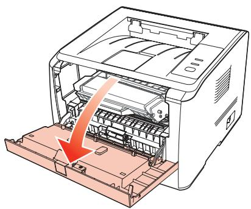

natural_image

Illustration of a printer's internal structure with a red arrow indicating compression or disassembly (no text or symbols present)

2. 将激光碳粉盒径直取出。（为避免感光鼓曝光影响打印质量，请用黑色胶袋将激光碳粉盒装好，或是用纸张盖住激光碳粉盒。）

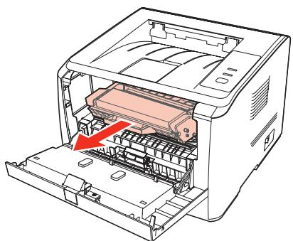

natural_image

Diagram of an open computer printer showing internal components and a red arrow indicating a specific part (no text or symbols present)

3. 将卡住的纸张轻轻的向外径直拉出。

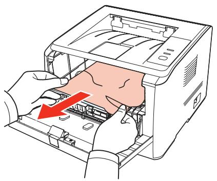

natural_image

Illustration of hands inserting a computer into a drive, with a red arrow indicating the process (no text or symbols present)

4. 取出卡纸后，重新装入激光碳粉盒，合上前盖，打印机将自动恢复打印。

# 8.1.4. 定影单元卡纸

1. 打开后盖。

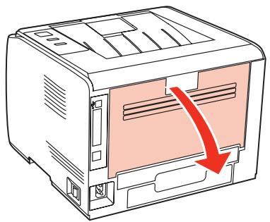

natural_image

Diagram of a computer tower with a red arrow indicating a directional change or movement (no text or symbols present)

2. 通过两边的把手打开定影解压单元。

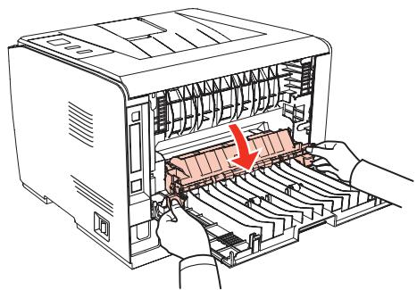

natural_image

Illustration of a server rack with hands inserting into the rack (no text or symbols visible)

3. 将卡住的纸张轻轻的向外拉出。

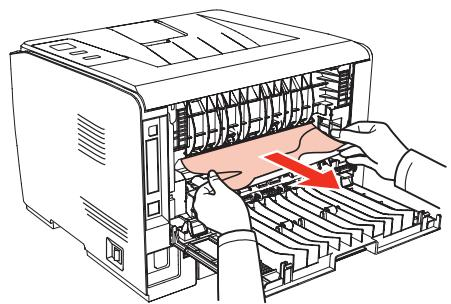

natural_image

Illustration of hands operating a computer tower with a red arrow indicating compression or disassembly (no text or symbols present)

4. 取出卡纸后，关上定影解压单元和后盖，打印机将自动恢复打印。

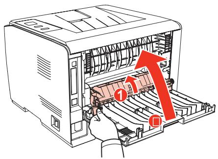

text_image

Diagram of a computer tower with labeled components and red arrows indicating directional flow or movement

# 8.1.5. 双面单元卡纸

1. 从打印机后面取出双面打印单元。

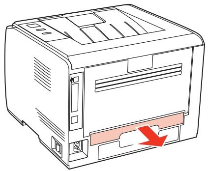

natural_image

Line drawing of a computer case with a red arrow indicating a download or exit point (no text or symbols present)

2. 从双面单元中取出卡纸。

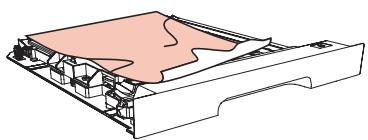

natural_image

Technical line drawing of a mechanical assembly with no visible text or symbols

3. 如果纸张未随双面单元一起出来，请打开纸盒直接从底部取出卡纸。

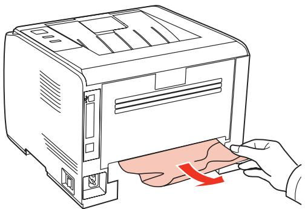

natural_image

Line drawing of a computer printer with a hand inserting a paper into it (no text or symbols present)

4. 取出后装回双面单元，检查产品其他部位，确保无卡纸后，开关前盖，打印机将自动恢复打印。

# 8.2. 软件故障

<table><tr><td>故障现象</td><td>解决方法</td></tr><tr><td>Pantum 3000 Series 打印机驱动程序在打印机和传真文件夹中看不到。</td><td>重新安装打印机驱动程序。确保 USB 连接线及电源线正确连接。</td></tr><tr><td>打印机处于“就绪”模式,但不执行任何打印作业。</td><td>重启打印机,若故障依旧,请重新安装打印机驱动程序。确保 USB 连接线正确连接。</td></tr><tr><td>驱动安装失败</td><td>检查 print spooler 服务是否已经开启。检查打印机电源是否开启,打印机连接是否正常。</td></tr><tr><td>打印机 IP 地址变更后,驱动无法使用</td><td>修改打印机驱动的端口 IP 地址。如果以上方法解决不了,请重新安装打印机程序。建议将网络打印机设置为固定 IP 地址。DHCP 网络中建议将 IP 地址与打印机 MAC 地址绑定。</td></tr></table>

# 8.3. 常见故障排除

# 8.3.1. 一般故障

<table><tr><td>故障现象</td><td>原因</td><td>解决办法</td></tr><tr><td colspan="3">打印机问题</td></tr><tr><td>打印机不打印</td><td>计算机与打印机之间的连接线未正确连接。打印端口指定错误。打印机处于脱机状态,勾选了“脱机使用打印机”。打印机内部错误未恢复,如卡纸,缺纸等。</td><td>断开打印机线缆连接,然后重新连接。检查 Windows 打印机设置,确保打印作业发送到正确的端口。如果计算机有多个端口,请确认产品连接到正确的端口。请确保打印机处于正常联机状态。</td></tr><tr><td colspan="3">纸张处理问题</td></tr><tr><td>打印不进纸</td><td>未正确安装打印介质。打印介质超出了使用规格范围。给纸辊脏污。</td><td>请正确安装打印介质,如果使用特殊打印介质打印,请使用手动进纸盘打印。请使用规格范围内的打印介质。清洁给纸辊。</td></tr><tr><td>卡纸</td><td>纸盘中的纸张过多。打印介质超出了使用规格范围。进纸通道有异物。给纸辊脏污。内部部件故障。</td><td>从纸盘中取出多余的纸张,如果在特殊打印介质上打印,请使用手动进纸盘。确保使用符合规格的纸张。如果在特殊打印介质上打印,请使用手动进纸盘。清洁进纸通道。清洁给纸辊。</td></tr><tr><td>打印多页进纸</td><td>打印介质含静电量过大。打印介质受潮或者粘合在一起。内部部件故障。</td><td>将打印介质重新分离,可以消除部分静电。建议使用推荐打印介质。请重新将打印介质分离或更好的干燥打印介质。</td></tr></table>

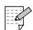

注: • 如果问题依旧，请联系奔图客服。

# 8.3.2. 图像缺陷

<table><tr><td>故障现象</td><td>故障原因</td><td>解决办法</td></tr><tr><td>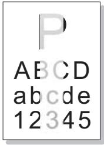</td><td>碳粉不足。打印介质不符合使用规格,例如介质受潮或太粗糙。打印程序中分辨率设置过低。激光碳粉盒损坏。</td><td>请正确使用规格范围内的介质。设置程序中的打印分辨率。</td></tr><tr><td>打印发白或偏淡</td><td></td><td></td></tr><tr><td>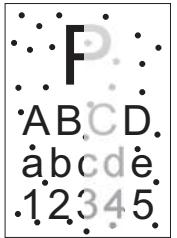</td><td>激光碳粉盒脏污或漏粉。激光碳粉盒损坏。使用了不符合使用规格的打印介质,例如介质受潮或太粗糙。进纸通道脏污。</td><td>请使用规格范围内的打印介质。清洁进纸通道。</td></tr><tr><td>粉墨斑点</td><td></td><td></td></tr><tr><td></td><td>使用了不符合使用规格的打印介质,例如介质受潮或太粗糙。进纸通道脏污。激光碳粉盒内部股损坏。机器内部激光器反光玻璃脏污。</td><td>请使用规格范围内的打印介质。清洁进纸通道。清洁激光器反光玻璃。</td></tr><tr><td>白点</td><td></td><td></td></tr><tr><td></td><td>使用了不符合使用规格的打印介质,例如介质受潮或太粗糙。机器内部脏污。激光碳粉盒损坏。机器内部部件损坏。</td><td>请使用规格范围内的打印介质,特殊介质请使用手动纸盘进行打印。清洁机器内部。</td></tr><tr><td>碳粉脱落</td><td></td><td></td></tr><tr><td>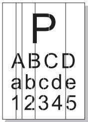</td><td>激光碳粉盒脏污。激光碳粉盒内部部件损坏。机器内部激光机反光玻璃脏污。进纸通道脏污。</td><td>清洁机器背部激光器反光玻璃。清洁打印机背部进纸通道。</td></tr><tr><td>黑色竖条</td><td></td><td></td></tr><tr><td>[0WFSW]ABCDabcde12345</td><td>·使用了不符合使用规格的打印介质,例如介质受潮或太粗糙。·激光碳粉盒脏污。·激光碳粉盒内部部件损坏。·进纸通道脏污。·打印内部转印电压异常。</td><td>·请使用规格范围内的打印介质。·清洁机器内部进纸通道。</td></tr><tr><td colspan="3">黑色背景(底灰)</td></tr><tr><td>[2TCS]ABCDabcde12345</td><td>·激光碳粉盒脏污。·激光碳粉盒内部部件损坏。·定影组件损坏。</td><td>·清洁或更换新激光碳粉盒。·请联系奔图客服维修更换新的定影组件。</td></tr><tr><td colspan="3">出现周期性痕迹</td></tr><tr><td>ABCDabcde12345</td><td>·未正确安装打印介质。·机器进纸通道脏污。</td><td>·确保正确安装打印介质。·清洁机器内部进纸通道。</td></tr><tr><td colspan="3">页面歪斜</td></tr><tr><td>ABCDabcde12345</td><td>·未正确安装打印介质。·打印介质不符合使用规格。·打印内部进纸通道脏污。·打印定影组件损坏。</td><td>·确保正确安装打印介质。·请使用规格范围内的打印介质进行打印。·清洁机器内部进纸通道。</td></tr><tr><td colspan="3">皱纸</td></tr><tr><td>[28TS]ABCDabcde345</td><td>·激光碳粉盒脏污。·机器内部转印辊脏污。·机器内部转印电压异常。</td><td>·清洁或更换新激光碳粉盒。·清洁机器内部转印部件。</td></tr><tr><td colspan="3">背面脏污</td></tr><tr><td></td><td>未正确安装激光碳粉盒。激光碳粉盒内部损坏。机器内部充电异常,未给激光碳粉盒充电。</td><td>确保正确安装激光碳粉盒。</td></tr><tr><td>打印全黑版</td><td></td><td></td></tr><tr><td>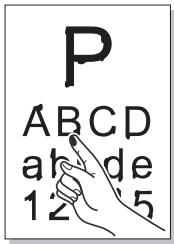</td><td>使用了不符合使用规格的打印介质,例如介质受潮或太粗糙。机器内部脏污。激光碳粉盒损坏。机器内部部件损坏。</td><td>请使用规格范围内的打印介质,特殊介质请使用手动纸盘进行打印。清洁机器内部。</td></tr><tr><td>碳粉晕开</td><td></td><td></td></tr><tr><td>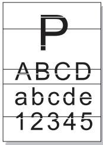</td><td>激光碳粉盒未正确安装。激光碳粉盒可能损坏。机器内部部件损坏。</td><td>确保正确安装激光碳粉盒。</td></tr><tr><td>水平条纹</td><td></td><td></td></tr></table>

注： • 上述故障可采用清洁或更换新激光碳粉盒等方法来改善。如果问题依旧，请联系奔图客服。

# 产品规格

# 9

章

9. 产品规格 ..

9.1. 规格总述 . .2  
9.2. 打印规格 . .3

# 9. 产品规格

9.1. 规格总述

<table><tr><td colspan="2">内存</td><td>64MB/128MB/512MB</td></tr><tr><td colspan="2">接口类型</td><td>USB2.0 和 10/100 Ethernet</td></tr><tr><td colspan="2">支持操作系统</td><td>Microsoft Windows Server2003/Server2008/Server2012/XP/Vista/Windows7/Windows8/Windows10 (32bit&amp;64bit)Mac OS X 10.4/10.5/10.6/10.7/10.8/10.9/10.10/10.11</td></tr><tr><td colspan="2">电源</td><td>220V Model: AC220~240V (-15%,+10%), 50/60Hz(±2Hz), 4A110V Model: AC110~127V (±10%), 50/60Hz (±2Hz),8A(注意:本产品适用的电源及电压,请参照打印机背面的铭牌标示。)</td></tr><tr><td rowspan="3">功耗</td><td>打印</td><td>495W 最大功率 750W (25°C)</td></tr><tr><td>待机</td><td>50W</td></tr><tr><td>休眠</td><td>3.5W</td></tr><tr><td rowspan="2">噪音</td><td>打印</td><td>小于 55dB</td></tr><tr><td>待机</td><td>小于 30dB</td></tr><tr><td colspan="2">休眠时间设定</td><td>默认 1 分钟</td></tr><tr><td colspan="2">操作环境</td><td>操作温度范围(最佳打印质量):5-35 (10-32)°C,操作湿度范围:20~80% RH</td></tr><tr><td colspan="2">产品尺寸 (W*D*H) mm</td><td>370*370*270mm</td></tr><tr><td colspan="2">重量(不含激光碳粉盒)</td><td>约 9Kg</td></tr><tr><td rowspan="7">网络能力</td><td>协议族</td><td>TCP/IP (IPv4)</td></tr><tr><td>打印方法</td><td>Direct IP (port 9100), LPR/LPD</td></tr><tr><td>管理协议</td><td>DHCP ,SNMPv1, DNS, HTTP</td></tr><tr><td>嵌入式网络服务器</td><td>Configuration/Status via Embedded Web Server</td></tr><tr><td>配置服务和其他服务</td><td>mail Alerts, TCP/IP port access control, Configuration Password, Restore Factory Settings</td></tr><tr><td>应用服务程序</td><td>Ping, Bonjour</td></tr><tr><td>寻址</td><td>IPv4 32-bit addressesSupports MIB-2, host resources MIB, printer MIB, enterprise MIBFunction supported in Internet Explorer 6.0 (or later),Apple Safari 4.0 (or later), MozillaFireFox, Google Chrome, Opera.</td></tr></table>

# 9.2. 打印规格

<table><tr><td colspan="2">打印速度 (PPM)</td><td>28/30/33 (A4)30/32/34 (LTR)</td></tr><tr><td colspan="2">打印语言</td><td>GDI</td></tr><tr><td colspan="2">首页打印时间</td><td>小于 8.5s</td></tr><tr><td colspan="2">最大打印幅面</td><td>Legal (216*355.6mm)</td></tr><tr><td colspan="2">自动双面打印</td><td>支持</td></tr><tr><td rowspan="2">纸张输入能力</td><td>多功能纸盒</td><td>1 张 (60~200g/m2)</td></tr><tr><td>标准纸盒</td><td>250 张 (80g/m2)</td></tr><tr><td>纸张输出能力</td><td>面朝下</td><td>150 张 (80g/m2)</td></tr><tr><td rowspan="3">打印介质</td><td>介质类型</td><td>普通纸, 厚纸, 特殊用纸 (透明胶片, 卡片纸, 标签纸, 信封)</td></tr><tr><td>介质尺寸</td><td>A4, A5, JIS B5, ISO B5, A6, Letter, Legal, Executive, Folio, Oficio, Statement, Japanese Postcard, Monarch Env, DL Env, C5 Env, C6 Env, No.10 Env, ZL, Big 16K, Big 32K, 16K, 32K, B6</td></tr><tr><td>介质克重</td><td>60 ~ 200g/m2</td></tr></table>

# PANTUM

#

网址: www.pantum.com.cn