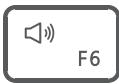
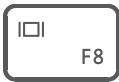

# 用户指南

# 目 录

# 了解计算机

外观介绍 1

键盘 3

开启和关闭计算机 4

F10 一键恢复出厂 4

获取精彩功能 4

# 安全信息

# 个人信息和数据安全

# 法律声明

# 了解计算机

# 外观介绍

B530 系列外观介绍  
/e34418820fd5f1b5b610eb4c098812ac2481d43daae0e5f3b448963d076b7b4c.jpg)

text_image

Technical diagram showing labeled components of an electronic device with numbered parts and internal wiring layout

<table><tr><td>1</td><td>电源键·关机状态下,短按电源键,可开启计算机。·开机状态下,长按电源键10秒以上,可强制关闭计算机。</td></tr><tr><td>2</td><td>耳麦接口连接耳机。</td></tr><tr><td>3</td><td>USB-A (USB 3.2 Gen 1) 接口 x 2连接手机、U盘等外接设备传输数据。</td></tr><tr><td>4</td><td>USB-A (USB 3.2 Gen 2) 接口 x 2连接手机、U盘等外接设备传输数据。</td></tr><tr><td>5</td><td>麦克风输入接口连接麦克风,可将麦克风接收到的声音输入计算机。</td></tr><tr><td>6</td><td>音频输出接口连接音箱等外部设备,将计算机内的音频信号传送至外部设备。</td></tr><tr><td>7</td><td>音频输入接口连接外部音频设备,将外部设备声音传送至计算机。</td></tr><tr><td>8</td><td>HDMI接口 x 2高清晰度多媒体接口,连接显示设备。部分型号只有一个HDMI接口,具体接口请以实物为准。</td></tr></table>

<table><tr><td>9</td><td>串口连接调制解调器、串行打印机、仿真器或有串口的设备。</td></tr><tr><td>10</td><td>USB-A (USB 3.2 Gen 1) 接口 x 2连接手机、U 盘等外接设备传输数据。</td></tr><tr><td>11</td><td>挡板i 挡板可拆卸,拆卸之后可增添新接口,具体接口请以实物为准。</td></tr><tr><td>12</td><td>电源接口连接计算机电源线。</td></tr><tr><td>13</td><td>RJ45 接口连接网线。i 不同型号,RJ45 接口的位置不同,请以实物为准。</td></tr><tr><td>14</td><td>USB-A (USB 2.0) 接口 x 4连接手机、U 盘等外接设备传输数据。</td></tr><tr><td>15</td><td>DP 接口 x 2接入 DP 线缆,连接显示设备。i 部分型号只有一个 DP 接口,具体接口请以实物为准。</td></tr></table>

B730 系列外观介绍

/1d5445e083d7e1504dc0865cc57fb10a44cd57153266244181b7c05e3577d5ee.jpg)

text_image

Technical diagram showing internal components of a device with numbered labels pointing to ports and connectors.

<table><tr><td>1</td><td>电源键·关机状态下,短按电源键,可开启计算机。·开机状态下,长按电源键10秒以上,可强制关闭计算机。</td></tr><tr><td>2</td><td>耳麦接口连接耳机。</td></tr><tr><td>3</td><td>USB-A (USB 3.2 Gen 1) 接口 x 2连接手机、U 盘等外接设备传输数据。</td></tr><tr><td>4</td><td>USB-A (USB 3.2 Gen 2) 接口 x 2连接手机、U 盘等外接设备传输数据。</td></tr><tr><td>5</td><td>USB-C (USB 2.0) 接口连接手机、U 盘等外接设备传输数据。</td></tr><tr><td>6</td><td>麦克风输入接口连接麦克风,可将麦克风接收到的声音输入计算机。</td></tr><tr><td>7</td><td>音频输出接口连接音箱等外部设备,将计算机内的音频信号传送至外部设备。</td></tr><tr><td>8</td><td>音频输入接口连接外部音频设备,将外部设备声音传送至计算机。</td></tr><tr><td>9</td><td>HDMI 接口 x 2高清晰度多媒体接口,连接显示设备。</td></tr><tr><td>10</td><td>串口连接调制解调器、串行打印机、仿真器或有串口的设备。</td></tr><tr><td>11</td><td>USB-A (USB 3.2 Gen 1) 接口 x 2连接手机、U 盘等外接设备传输数据。</td></tr><tr><td>12</td><td>挡板i 挡板可拆卸,拆卸之后可增添新接口,具体接口请以实物为准。</td></tr><tr><td>13</td><td>电源接口连接计算机电源线。</td></tr><tr><td>14</td><td>RJ45 接口连接网线。i 不同型号,RJ45 接口的位置不同,请以实物为准。</td></tr><tr><td>15</td><td>USB-A (USB 2.0) 接口 x 4连接手机、U 盘等外接设备传输数据。</td></tr><tr><td>16</td><td>DP 接口 x 2接入 DP 线缆,连接显示设备。</td></tr></table>

# 键盘

计算机配置的键盘不同，支持功能也会不同，请以实际为准。

# 快捷键功能介绍

部分型号键盘的 F1、F2 等键默认为快捷键（热键）模式，可用于轻松执行常见任务。

/891185c5ea2a221f0d45841ec1a37a961abd1a53043b441c9905ee0d84624d41.jpg)

降低屏幕亮度

i 仅支持华为品牌显示器。

<table><tr><td></td><td>增强屏幕亮度i 仅支持华为品牌显示器。</td></tr><tr><td></td><td>开启或关闭静音</td></tr><tr><td></td><td>减小音量</td></tr><tr><td></td><td>增大音量</td></tr><tr><td></td><td>切换屏幕投影模式</td></tr></table>

# 快捷键与功能键切换

在功能键模式下，运行不同的软件时，F1、F2 等键被定义不同的功能。

若要将 F1、F2 等键作为功能键使用，您可以：

按下 Fn 键，当 Fn 键指示灯亮起，表示已将 F1、F2 等键锁定为功能键模式。只需再次按 Fn 键，当 Fn 键指示灯熄灭，即可返回快捷键（热键）模式。

# 开启和关闭计算机

将计算机各部分组装完成后，短按计算机主机的电源键，电源键的指示灯亮起，表示主机开启。

计算机正常使用时，单击 > ，使计算机进入睡眠、关机或重启等状态。

强制关机：长按电源键 10 秒以上，可强制关机。强制关机会导致未保存的数据丢失，请谨慎使用。

# F10 一键恢复出厂

计算机内置的 F10 系统恢复出厂功能，能短时间内帮您将计算机系统恢复到初始状态。

系统恢复出厂会删除 C 盘中数据（也包含桌面文件、下载、文档等个人数据），请您备份 C盘内的个人数据。

1 将计算机连接电源，开机过程中连续快速点按 F10 键。  
2 进入界面后，根据界面提示进行恢复出厂。

# 获取精彩功能

请点击桌面底部任务栏上的 华为电脑管家 > 玩机技巧，获取更多精彩功能。

# 安全信息

【警告】在使用和操作设备前，为确保设备性能最佳，并避免出现危险或非法情况，请查阅并遵循所有的安全信息。

# 电子设备

有明文规定禁止使用无线设备的场所，请勿使用本设备，否则会干扰其它电子设备或导致其它危险。

仅部分产品支持无线功能，请以实际情况为准。

# 对医疗设备的影响

• 在明文规定禁止使用无线设备的医疗和保健场所，请遵守该场所的规定，并关闭设备。  
• 设备产生的无线电波或含有磁铁可能会影响植入式医疗设备或个人医用设备的正常工作，如起搏器、植入耳蜗、助听器等。若您使用了这些医用设备，请向其制造商咨询使用本设备的限制条件。  
• 在使用本设备时，请与植入的医疗设备（如起搏器、植入耳蜗等）保持至少 15 厘米的距离。

0 仅部分产品支持无线功能，请以实际情况为准。

# 听力保护

• 当您使用耳机收听音乐或通话时，建议使用音乐或通话所需的最小音量，以免损伤听力。长时间接触高音量可能会导致永久性听力损伤。

# 易燃易爆区域

• 在加油站（维修站）或靠近易燃物品、化学制剂等任何易燃易爆区域，请勿使用本设备，并遵守所有图形或文字的指示。在燃油或化学制剂存放和运输区或易爆场所内或周围，设备可能引起爆炸或起火。  
• 请勿将设备及其配件与易燃液体、气体或易爆物品放在同一箱子中存放或运输。

# 操作环境

• 设备铭牌位于设备底部。  
• 请勿在多灰、潮湿、肮脏或靠近磁场的地方使用设备，以免引起设备内部电路故障。  
• 插拔设备线缆前，请先停止使用设备并断开电源。在插拔线缆时请保持双手干燥。  
• 雷电天气请断开电源，并拔出连接在设备上的所有线缆，以免设备遭雷击损坏。

• 请勿在雷雨天气使用本设备。雷雨天气可能导致设备故障或电击危险。

• 请在温度 $0 ^ { \circ } C \sim 3 5 ^ { \circ } C$ 范围内使用本设备，并在温度 $- 1 0 ^ { \circ } C \sim + 4 5 ^ { \circ } C$ 范围内存放设备及其配件。当环境温度过高或过低时，可能会引起设备故障。

• 请避免设备及其配件雨淋或受潮，否则可能导致火灾或触电危险。

• 请勿将设备靠近热源或裸露的火源，如电暖器、微波炉、烤箱、热水器、炉火、蜡烛或其他可能产生高温的地方。

• 设备在运行一段时间后，设备温度会升高。如果设备温度过高，请勿长时间接触，否则可能导致低温烫伤，引起皮肤红肿或色素沉淀。  
• 请勿让儿童或宠物吞咬设备或其配件，以免对其造成伤害或导致设备故障或爆炸。  
• 当不断重复同一动作时（例如玩游戏），您的手、臂、腕、肩、颈或其他身体部位可能会偶尔感觉不适。如果您感觉到不适，请停止使用并咨询医师。  
• 装有激光产品（如 CD-ROM、DVD 驱动器）时，请勿卸下外盖。卸下激光产品的外盖可能会导致遭受危险的激光辐射。

【稳定性危险】本设备可能翻倒，造成严重人身伤害或死亡。采取诸如以下的简单的预防措施就能避免许多伤害，特别是对儿童的伤害：

• 始终使用设备制造商建议的柜子或支架。  
• 始终使用能安全支撑本设备的家具，始终确保本设备没有伸出该支撑家具的边缘。  
• 请勿将本设备放在不稳定的位置，请勿将本设备放置在高的家具（例如橱柜或书柜） 上。  
• 始终规划好连接到本设备上的电线和电缆， 这样它们就不会被绊或拉。  
• 请勿将本设备置于可能铺在本设备和支撑家具之间的织物或其他材料上。

• 始终教育儿童攀爬家具到达本设备或其控制装置的危险。

• 在本设备或放置本设备的家具顶部，请勿放置可能引诱儿童攀爬的物品，如玩具和遥控器。

• 如果设备需要保留并更换位置， 也应考虑上述注意事项。

# 儿童健康

• 本设备及其配件可能包含一些小零件，请将设备及其配件放置在儿童接触不到的地方。儿童可能在无意之中损坏本设备及其配件，或吞下小零件导致窒息或其他危险。  
• 本设备并非玩具，儿童应在成人监护下使用设备。

# 配件要求

• 使用未经认可或不兼容的电源、充电器或电池，可能引发火灾、爆炸或其他危险。  
• 只能使用设备制造商认可且与此型号设备配套的配件。如果使用其他类型的配件，可能违反本设备的保修条款以及本设备所处国家的相关规定，并可能导致安全事故。如需获取认可的配件，请与华为客户服务中心联系。

# 电源安全

• 电源软线上插头作为断开装置，对可插式设备，插座应安装在产品附近并应易于操作。  
• 当不使用本设备时，请断开电源与设备的连接并从电源插座上拔掉电源插头。  
• 电源插头应连接到插座，插座与接地线连接。  
• 若电源插头或电源线已损坏，请勿继续使用，以免发生触电或火灾。  
• 请勿用湿手触碰电源线，或用拉电源线缆的方式拔出电源。  
• 请勿用湿手触摸设备或电源，以免发生设备短路、故障或触电。  
• 若设备需要连接 USB 端口，请确认 USB 端口具备 USB-IF 标识且其性能符合 USB-IF 的相关规范。

# 电池安全

• 如果更换不正确的型号的电池会有起火或爆炸的危险。  
• 请勿将电池暴露在高温处或发热产品的周围，如日照、取暖器、微波炉、烤箱或热水器等。电池过热可能引起爆炸。  
• 请勿将电池放置在极低气压环境中，可能导致电池爆炸或泄漏可燃液体或气体。

• 请勿把电池扔到火里，否则会导致电池起火和爆炸。

• 请勿跌落、挤压或穿刺电池。避免让电池遭受外部大的压力，从而导致电池内部短路和过热。

• 请勿拆解或改装电池、插入异物、或浸入水中或其他液体中，以免引起电池漏液、过热、起火或爆炸。

• 请按当地规定处理电池，不可将电池作为生活垃圾处理。若电池处置不当可能会导致电池爆炸。

• 请勿将金属物导体与电池两极对接，或接触电池的端点，以免导致电池短路，以及因电池过热而引起的烧伤等身体伤害。

• 如果电池漏液，请勿使皮肤或眼睛接触到漏出的液体。若接触到皮肤或眼睛上，请立即用清水冲洗，并到医院进行医疗处理。

• 如果电池在使用或保存过程中有变色、变形、异常发热等异常现象，请停止使用并更换新电池。

• 请勿让儿童或宠物吞咬电池，以免对其造成伤害或导致电池爆炸。

• 请勿使用已经损坏的电池。

• 本产品包含纽扣锂电池，更换纽扣锂电池时，请仅使用相同类型的电池或制造商推荐的同类电池。该电池中含有锂，如果使用、操作或处理不当，可能会发生爆炸。

• 请勿让儿童接触电池。如果电池仓未安全闭合，停止使用该产品并使之远离儿童。如果吞食纽扣锂电池，在 2 小时内就可能导致严重的内部灼伤并可能导致死亡。如果误吞纽扣锂电池或误置入体内任何部位，请立即就医。

# 维护和保养

• 不建议您自行升级部件或更换模块。如有相关服务需求，请联系华为客户服务中心。  
• 请保持设备及其配件干燥。请勿使用微波炉或吹风机等外部加热设备对其进行干燥处理。  
• 请勿在温度过高或过低区域放置设备及其配件，否则可能导致设备故障、着火或爆炸。  
• 请勿使设备及其配件受到强烈的冲击或震动，以免损坏设备及其配件，导致设备故障。  
• 清洁和维护前，请停止使用本设备，关闭所有应用，并断开与其他设备的所有连接或线缆。  
• 请勿使用烈性化学制品、清洗剂或强洗涤剂清洁设备或其配件。请使用清洁、干燥的软布擦拭设备或其配件。  
• 请勿擅自拆卸或改装设备及配件，否则该设备及配件将不在本公司保修范围之内，设备发生故障时请联系华为客户服务中心。  
• 如果设备碰撞硬物或设备受到外界的强烈撞击造成破碎，切勿触摸或试图移除破碎的部分，请立即停止使用并及时联系华为客户服务中心。  
• 请勿将磁条卡（例如银行卡、电话卡等）长期接触本设备，否则可能导致磁条卡被磁场损坏。

i 仅部分产品支持无线功能，可能导致磁条卡损坏，请以实际情况为准。

# 环境保护

• 请勿将本设备及其附件作为普通的生活垃圾处理。  
• 请遵守本设备及其附件处理的本地法令，并支持回收行动。

# 认证信息

请在产品铭牌上查看型号核准代码。

# 支持微功率短距离无线电发射能力说明（NFC）

本产品具备《中华人民共和国无线电管理条例》规定的微功率短距离无线电发射能力（NFC 功能），根据“工业和信息化部公告 2019 年第 52 号”的要求，现注明如下：

（一）产品符合“微功率短距离无线电发射设备目录和技术要求”第一条通用微功率设备第 3 款 C类设备的规定，内置环形 NFC 天线，通过负载调制方式实现一碰连通信，不具备主动发射场景，用户可根据产品说明书来使用此功能；  
（二）不得擅自改变使用场景或使用条件、扩大发射频率范围、加大发射功率（包括额外加装射频功率放大器），不得擅自更改发射天线；  
（三）不得对其他合法的无线电台（站）产生有害干扰，也不得提出免受有害干扰保护；  
（四）应当承受辐射射频能量的工业、科学及医疗（ISM）应用设备的干扰或其他合法的无线电台（站）干扰；  
（五）如对其他合法的无线电台（站）产生有害干扰时，应立即停止使用，并采取措施消除干扰后方可继续使用；  
（六）在航空器内和依据法律法规、国家有关规定、标准划设的射电天文台、气象雷达站、卫星地球站（含测控、测距、接收、导航站）等军民用无线电台（站）、机场等的电磁环境保护区域内使用微功率设备，应当遵守电磁环境保护及相关行业主管部门的规定；  
（七）禁止在以机场跑道中心点为圆心、半径 5000 米的区域内使用各类模型遥控器；  
（八）本产品 NFC 工作电压为 1.5V，工作环境温度为 $0 ^ { \circ } C \sim 3 5 ^ { \circ } C$ 。  
（九）使用微功率短距离无线电发射设备应当符合国家无线电管理有关规定。  
0 仅部分型号涉及型号核准代码以及微功率，请以实际产品为准。

# 个人信息和数据安全

在使用设备的一些功能和第三方应用时，可能会因为操作不正确或其他原因导致您的个人信息或数据泄露或丢失，建议按以下方式加强保护您的个人信息。

• 请将设备放置于安全区域，防止未经授权人员使用您的设备。  
• 建议不要阅读来自陌生人的信息或邮件，以免设备遭受病毒感染。  
• 在使用设备上网时，请勿浏览存在安全隐患的网站，以免个人信息被盗。  
• 在使用无线共享、蓝牙等业务时，请设定密码，防止未授权访问。不需要使用这些业务时，建议及时关闭。  
• 安装设备安全软件，并定期进行安全检查。  
• 获取第三方应用时，应保证获取方式的安全性。获取的第三方应用程序应进行病毒扫描。  
• 请及时安装或升级华为或授权的第三方应用程序供应商发布的安全性软件或补丁。  
• 使用非授权第三方软件升级设备的固件和系统，可能存在设备无法使用或者泄漏您个人信息等安全风险。建议您使用在线升级或者将设备送至您附近的华为客户服务中心升级。  
• 设备可能会将检测、诊断等信息反馈给第三方应用程序供应商，这些信息将用于帮助第三方应用供应商改善产品和服务。

# 法律声明

版权所有 © 2024 华为终端有限公司。保留一切权利。

本手册描述的产品中，可能包含华为及其可能存在的许可人享有版权的软件。除非获得相关权利人的许可，否则，任何人不能以任何形式对前述软件进行复制、分发、修改、摘录、反编译、反汇编、解密、反向工程、出租、转让、分许可等侵犯软件版权的行为，但是适用法律禁止此类限制的除外。

# 商标声明

Bluetooth?字标及其徽标均为Bluetooth SIG,Inc.的注册商标，华为技术有限公司对此标记的任何使用都受到许可证限制，华为终端有限公司为华为技术有限公司的关联公司。

0 仅部分产品支持蓝牙功能，请以实际情况为准。

/cd2dc0fcd803be2efca3b5bf782eaf9e3afc6cb5676e2dcbe14560a01b4bc198.jpg)  
HIGH-DEFINITIONMULTIMEDIA INTERFACE

HDMI、HDMI High-Definition Multimedia Interface等词汇、HDMI 商业外观及HDMI 标识均为 HDMI Licensing Administrator, Inc. 的商标或注册商标。

Microsoft 和 Windows 是 Microsoft 集团公司的商标。

在本手册以及本手册描述的产品中，出现的其他商标、产品名称、服务名称以及公司名称，由其各自的所有人拥有。

# 注意

本手册描述的产品及其附件的某些特性和功能，取决于当地网络的设计和性能，以及您安装的软件。某些特性和功能可能由于当地网络运营商或网络服务供应商不支持，或者由于当地网络的设置，或者您安装的软件不支持而无法实现。因此，本手册中的描述可能与您购买的产品或其附件并非完全一一对应。

华为保留随时修改本手册中任何信息的权利，无需提前通知且不承担任何责任。

# 第三方软件声明

随本产品提供的第三方软件和应用程序归第三方所有，华为不拥有这些第三方软件和应用程序的知识产权，因此华为不对这些第三方软件和应用程序提供任何保证，华为既不会就这些软件和应用程序向您提供支持，也不对这些软件和应用程序的功能是否正常承担任何责任。

第三方软件和应用程序的服务可能中断或终止，华为不保证任何内容或服务可在任何期间维持其可用性。第三方系通过华为可控制范围外的网络及传输工具传送内容或服务。在相关法律允许的范围内，华为明确表示不对任何通过本产品提供的任何内容或服务的中断或终止承担任何责任。

对于您个人安装在本产品上的任何软件或上传、下载的任何文字、图片、视频或软件等第三方作品，华为不对其合法性、质量以及其他任何方面承担任何责任，对于您因个人安装软件或上传、下载前述第三方作品产生的任何后果，包括安装的软件与本产品不兼容等情况，由您自行承担一切相关风险。

# 责任限制

本手册中的内容均“按照现状”提供，除非适用法律要求，华为对本手册中的所有内容不提供任何明示或暗示的保证，包括但不限于适销性或者适用于某一特定目的的保证。

在适用法律允许的范围内，华为在任何情况下，都不对因使用本手册相关内容及本手册描述的产品而产生的任何特殊的、附带的、间接的、继发性的损害进行赔偿，也不对任何利润、数据、商誉或预期节约的损失进行赔偿。

在相关法律允许的范围内，在任何情况下，华为对您因为使用本手册描述的产品而遭受的损失的最大责任（除在涉及人身伤害的情况中根据适用的法律规定的损害赔偿外）以您购买本产品所支付的价款为限。

# 进出口管制

若需将本手册描述的产品（包括但不限于产品中的软件及技术数据等）出口、再出口或者进口，您应遵守适用的进出口管制法律法规。

# 隐私保护

为了解我们如何保护您的个人信息，请访问 https://consumer.huawei.com/privacy-policy 阅读我们的隐私政策。

本指南仅供参考，不构成任何形式的承诺，产品（包括但不限于颜色、大小、屏幕显示等）请以实物为准。如出现本指南与官网描述不一致的情况，请以官网说明为准，恕不另行通知。

# 获取更多

购买华为终端产品，请访问华为商城 https://www.vmall.com/

更多信息请访问 https://consumer.huawei.com/cn/