# 华为擎云C5

# 用户指南

# 目 录

# 基础使用

实况窗 1   
常用手势 2  
锁屏与解锁 4   
了解桌面 5   
控制中心 13  
截屏和录屏 22   
输入文本 29  
多窗口 31  
开关机和重启 37  
充电 38   
手写笔 40

# 智慧功能

智慧视觉 46   
智慧识屏 47   
超级终端 48  
平板投屏 53  
多屏协同 53  
华为分享 60  
智慧打印 60

# 相机图库

拍摄照片 64  
录制视频 66   
延时摄影 67  
相机设置 67  
管理图库 69  
编辑图片与视频 72  
时刻 74

# 应用

日历 76  
备忘录 77   
华为笔记 84

# 设置

更多连接 92  
桌面和个性化 92  
显示和亮度 93   
通知和状态栏 94  
生物识别和密码 96

<table><tr><td>安全</td><td>99</td></tr><tr><td>隐私</td><td>101</td></tr><tr><td>健康使用平板</td><td>103</td></tr><tr><td>辅助功能</td><td>107</td></tr><tr><td>系统和更新</td><td>112</td></tr><tr><td>关于平板电脑</td><td>113</td></tr></table>

目 录

# 基础使用

# 实况窗

# 实况窗显示任务实时信息

实况窗可显示当前任务的实时信息。如：在通话或追剧时，可通过实况窗了解外卖、航班等任务的实时信息。

仅部分应用支持实况窗，请以实际情况为准（前往官网了解支持的应用清单及使用场景）。

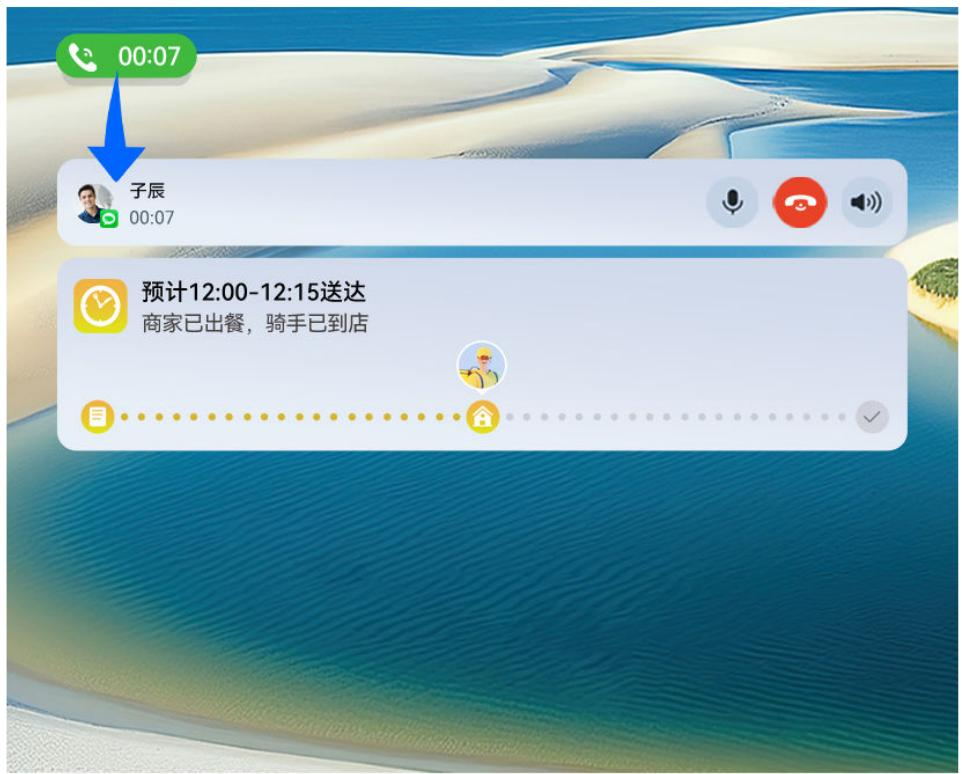

text_image

00:07
子辰
00:07
预计12:00-12:15送达
商家已出餐，骑手已到店

配图仅供参考，请以产品实际为准。

# 实况窗胶囊态：

当应用切换到桌面，或切换到其他应用时，状态栏会出现实况窗胶囊态，实时显示当前任务的概要信息。如：通话时长，外卖配送状态。

当有多个任务处于胶囊态时，实况窗将按照任务优先级和创建时间综合排序。

0 如某应用的实时任务未在实况窗显示，请进入设置 > 通知和状态栏，确认该应用通知权限已开启。

# 实况窗卡片态：

点击实况窗胶囊态，将展开为卡片态，可查看详细信息，或快速执行常用操作。点击某张卡片非按钮区，可直接进入该应用界面，进行更多操作。

点击空白处或上滑实况窗卡片态，可将其收起，自动切换为胶囊态。

您还可从屏幕顶部左侧向下滑出通知中心，查询当前所有任务列表。任务结束后，自动清理。

0 如不想显示某应用实况窗，请进入设置 > 通知和状态栏 > 状态栏 > 显示实况窗，关闭应用旁边的开关。

• 支持实况窗的应用正在陆续适配中，敬请期待。

# 常用手势

# 了解平板常用手势与快捷操作

# 全面屏导航手势

进入设置 > 系统和更新 > 系统导航方式，确保选择了手势导航。

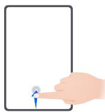

# 返回上一级

从屏幕左边缘或右边缘向内滑动。

# 返回桌面

从屏幕底部边缘上滑。

# 进入最近任务

从屏幕底部边缘向上滑并停顿。

# 结束单个任务

查看多任务时，上滑单个任务卡片。

<table><tr><td></td><td>快速切换应用·沿屏幕底部边缘横向滑动。使用该功能前,在系统导航方式界面中,点击更多设置,请确保底部边缘横滑切换应用开关开启。若您的设备中无底部边缘横滑切换应用开关,则不支持该功能,请以实际情况为准。·从屏幕底部边缘弧线滑动。</td></tr><tr><td></td><td></td></tr></table>

# 指关节手势

使用指关节前，请选择以下方式开启此功能（取决于您的机型）：

• 进入设置 > 辅助功能 > 快捷启动及手势，开启截屏和录屏开关。  
• 进入设置 > 辅助功能 > 手势控制 > 智能截屏，开启智能截屏开关。

<table><tr><td></td><td>截屏单指关节双击屏幕。</td></tr><tr><td></td><td>滚动截长屏单指关节敲击屏幕后画S。</td></tr><tr><td></td><td>截取局部屏幕单指关节敲击屏幕后画任意封闭图形。</td></tr><tr><td>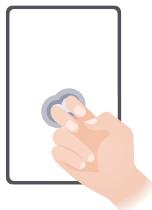</td><td>录屏双指指关节双击屏幕。</td></tr></table>

更多手势

<table><tr><td></td><td>进入桌面编辑状态在桌面上双指捏合。</td></tr><tr><td></td><td>进入锁屏快捷操作面板锁屏后,点亮屏幕,然后单指从底部上滑。</td></tr><tr><td></td><td>打开搜索从桌面中部向下滑动,打开搜索框。</td></tr><tr><td></td><td>打开通知消息从屏幕顶部左侧下滑出通知消息。</td></tr><tr><td></td><td>打开快捷开关从屏幕顶部右侧下滑出控制中心,常用功能快捷开关。点击需要的功能可快捷开启。</td></tr></table>

# 锁屏与解锁

# 锁屏与解锁

锁定屏幕

自动锁屏

一段时间不操作平板，平板将自动锁屏。

您可以进入设置 > 显示和亮度 > 休眠，选择对应的屏幕自动休眠时长。

手动锁屏

您可以通过以下任一方式手动锁屏：

• 按一下电源键锁定屏幕。  
• 在桌面双指捏合，点击服务卡片，添加一键锁屏卡片到桌面，点击卡片 ， 即可快捷锁屏。  
• 在桌面双指捏合，点击服务卡片，向下滑动至最底部，点击窗口小工具，长按一键锁屏，点击添加至桌面，然后点击一键锁屏。

# 点亮屏幕

您可以通过以下方式点亮屏幕（取决于您的机型）：

• 按电源键点亮屏幕。  
• 进入设置 > 辅助功能 > 快捷启动及手势 > 亮屏，开启并使用拿起设备亮屏、双击亮屏。

若您的平板中无此菜单，则不支持该功能。请以实际情况为准。

# 解锁屏幕

密码解锁：点亮屏幕后，从屏幕中部向上滑动，会出现密码输入面板。输入锁屏密码即可。

人脸解锁：点亮屏幕后，将平板对准人脸，平板会自动进行人脸识别校验，校验成功后即可解锁。

# 了解桌面

# HarmonyOS 桌面简介

HarmonyOS 新桌面提供了服务卡片、大文件夹和小艺建议等功能，信息更丰富，操作更快捷。还可智能聚合同色系或同类型的图标和卡片，美观且使用方便。

# 了解新桌面

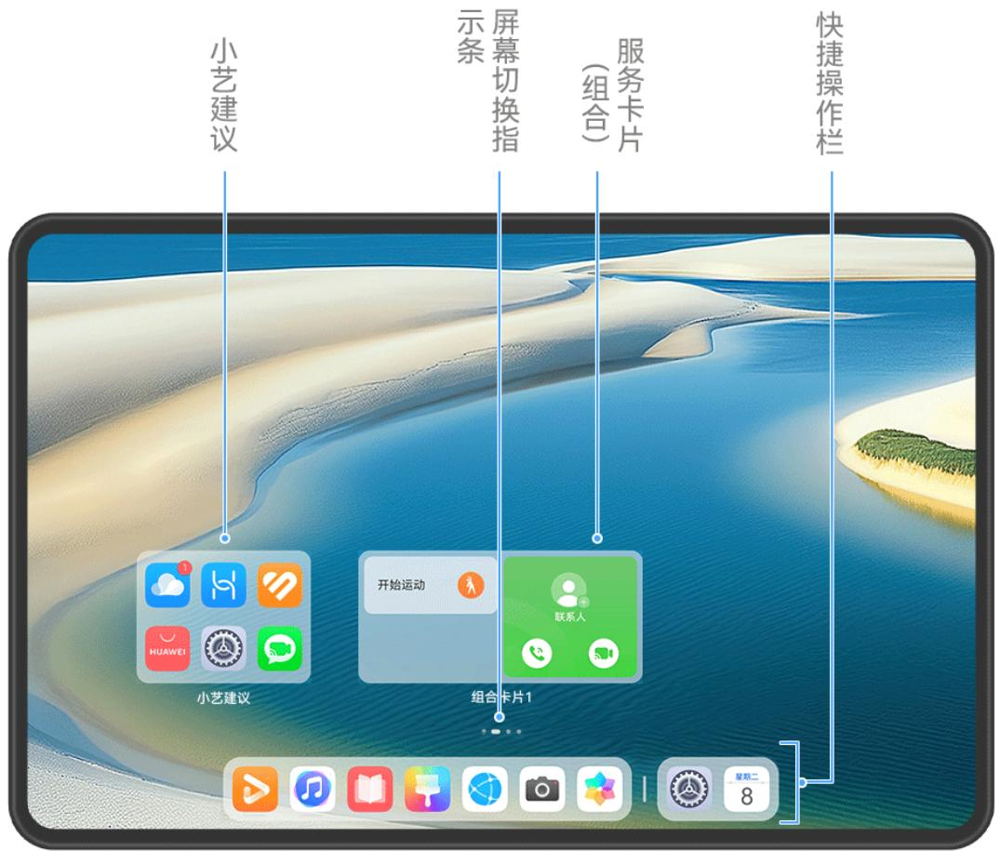

text_image

小艺建议
示条 屏幕切换指
服务卡片
(组合)
快捷操作栏
小艺建议
开始运动
联系人
组合卡片1
8

0 配图仅供参考，请以产品实际为准。

• 状态栏：通过顶部状态栏查看平板状态、通知消息。  
• 大文件夹：无需展开文件夹，可一步打开文件夹中的应用，还可调节文件夹尺寸。  
• 服务卡片：无需打开应用，可快速预览应用信息或使用常用功能，还可将多张卡片进行堆叠或组合。  
• 小艺建议：基于使用场景和个人习惯进行服务推荐。当您所处时间、地点或行为发生变化时，推荐的服务内容随之变化。  
• 屏幕切换指示条：左右滑动查看应用、桌面小工具。屏幕切换指示条显示当前屏幕所在位置。  
• 快捷操作栏：分别放置经常使用和最近使用过的应用。拖动中间拖拽条可调整最近使用的应用显示数量。

# 智能布局新桌面

您可使用智能布局，将同色系或同类型的桌面图标和卡片，智能聚合在同一屏，美观且使用方便。

1 在桌面上双指捏合，进入桌面编辑状态。  
2 点击布局，选择按颜色布局或按分类布局，对桌面图标和卡片进行自动布局。  
3 点击换一换，可预览不同的桌面样式，然后点击 ，根据界面提示完成操作。

若您需恢复到智能布局前的桌面，可在桌面双指捏合进入编辑界面，点击布局 > 原始布局。

# 使用服务卡片

使用服务卡片，您可以：

• 快速预览或操作应用，例如查看天气、播放歌曲等。

• 将卡片添加到桌面，根据喜好选取不同样式，打造个性化桌面。  
• 将多张卡片堆叠或组合，节省桌面空间，使桌面更简洁，操作更方便。

底部带有提示条 的应用支持服务卡片功能。您也可在设置 > 桌面和个性化 > 桌面设置 > 显示提示条中关闭提示条标识。

部分场景下不支持服务卡片，请以实际情况为准。

# 添加卡片到桌面

您可通过如下任一方式，将卡片添加到桌面：

• 上滑应用图标，展开卡片，点击 可快速将卡片添加到桌面。  
• 上滑应用图标，长按展开的卡片，选择更多服务卡片，选择所需卡片样式，然后点击添加至桌面。  
• 长按应用图标，点击服务卡片，选择所需卡片样式，然后点击添加至桌面。  
• 在桌面上双指捏合，点击服务卡片，选择所需卡片，点击添加至桌面。或长按所需卡片，拖至桌面空白处。

若当前屏幕没有空间，平板就在下一屏幕找空位放置。若当前屏幕和下一屏幕均无空位，平板自动在当前屏幕右侧新建一屏放置。

• 不支持将卡片固定在文件夹中。

• 部分场景下不支持上滑展开卡片，请以实际情况为准。

# 堆叠卡片

您可将多张同尺寸卡片或组合卡片堆叠起来，节省桌面空间，让桌面更简洁。

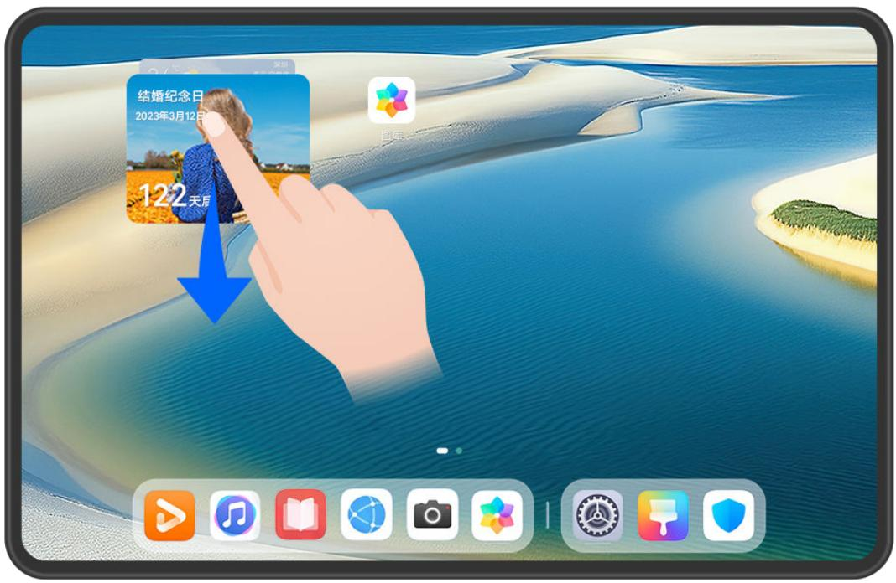

text_image

结婚纪念日
2023年3月12日
122天后

0 配图仅供参考，请以产品实际为准。

# 堆叠卡片操作：

长按并拖动卡片至其他同尺寸卡片或组合卡片上，使其完全重叠，触发堆叠后松开手指可形成堆叠。

# 查看堆叠卡片：

上滑或下滑已堆叠卡片，可查看该堆叠卡片中的所有卡片。

# 管理堆叠卡片：

# 1 您可通过以下任一方式展开全部卡片：

向下长滑展开全部卡片。  
长按堆叠卡片，点击展开堆叠。

# 2 展开后，通过如下操作管理堆叠卡片：

调整卡片位置：长按某张卡片，拖动调整该卡片位置。  
置顶某张卡片：点击某张卡片，可将其置顶到堆叠卡片顶层。  
• 移出某张卡片：长按某张卡片，向屏幕边缘处拖动并停顿，待移出堆叠卡片后，拖至桌面空 白处。   
• 移除某张卡片：左滑某张卡片，可将其从堆叠卡片中移除。  
删除堆叠卡片：将堆叠卡片中的全部卡片逐一移除后，自动删除堆叠卡片。

# 组合卡片

您可将多张任意尺寸卡片组合在一起，还可以在组合卡片中加入常用快捷方式，点击即可进入相应功能，让操作更便捷。

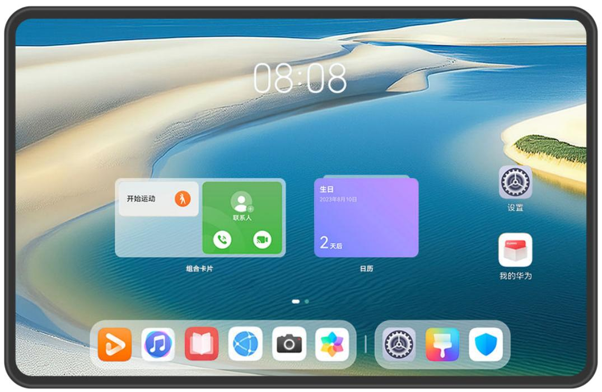

text_image

08:08
开始运动
组合卡片
联系人
生日
2023年8月10日
2天后
日历
设置
我的华为

0 配图仅供参考，请以产品实际为准。

# 添加组合卡片：

• 长按并拖动卡片至其他任意尺寸卡片上，使其部分重叠，展开背板后松开手指可形成组合卡片。

• 在桌面上双指捏合，点击服务卡片 > 组合卡片，长按待添加的组合卡片，点击添加至桌面。或点击 ，选择您喜欢的卡片自由组合，然后点击 <。

# 编辑组合卡片：

• 添加某张卡片：长按并拖动桌面上的某张卡片到组合卡片上。  
• 移出某张卡片：长按组合卡片至弹出菜单后松开，长按并拖动某张卡片至桌面空白处。   
• 移除某张卡片：长按组合卡片至弹出菜单后松开，长按并拖动某张卡片，拖至屏幕上方 按钮。完成编辑后，系统将根据空间自动适配合适的尺寸模板，点击组合卡片外其他区域，可退出编辑。您还可长按组合卡片，点击编辑组合卡片，添加或删除服务卡片、快捷方式。

# 移除组合卡片：

长按组合卡片，点击移除组合卡片，可将该组合卡片整体移除。

# 重命名组合卡片：

长按组合卡片，点击重命名，可重新编辑该组合卡片的名称。

您也可以长按组合卡片中的某张卡片，对该卡片进行编辑或移除。

部分卡片不支持编辑，请以实际情况为准。

# 编辑和移除卡片

# 编辑卡片：

长按卡片，选择编辑，可对卡片显示信息进行设置。

例如：您可将图库卡片的封面设置为指定图片。长按图库卡片，点击编辑 > 选择图片，根据提示设置。

# 移除卡片：

长按卡片，选择移除，可将服务卡片从桌面删除。

• 部分应用卸载后，其对应卡片也会移除。

• 部分卡片不支持编辑，请以实际情况为准。

# 创建和使用大文件夹

您可使用大文件夹对桌面应用图标进行分类管理，无需展开文件夹，可直接点击应用图标打开应用，还可调节文件夹尺寸，灵活布局您的桌面。

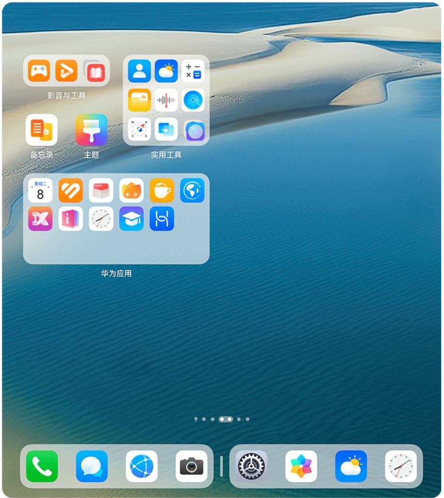

text_image

影音与工具
备忘录
主题
实用工具
华为应用

0 配图仅供参考，请以产品实际为准。

# 创建大文件夹

1 长按应用图标，然后将其拖动到另一个图标上，两个图标将集合在一个新文件夹中。部分平板会根据应用类型，自动命名文件夹，并同时智能推荐同类型应用，您可选择是否添加至新文件夹中。  
2 长按新文件夹，弹出菜单中选择显示为大文件夹。  
3 点击大文件夹右下角，打开大文件夹，点击文件夹名称，输入新名称。您还可长按大文件夹，选择重命名，输入新名称。

# 大文件夹常用操作

您可进行如下任一操作：

• 调整文件夹尺寸：长按大文件夹，弹出菜单后松开手指，拖动四周蓝色边缘或拐角，调整到合适的尺寸后，点击桌面空白处完成操作。  
• 打开或退出：点击大文件夹右下角，进入文件夹。进入后，点击文件夹空白区域即可退出。当应用图标超过一页显示时，在大文件夹右下角显示堆叠图标，您可点击该堆叠图标进入文件夹。

• 添加或移除应用：打开大文件夹，点击 。部分平板会根据文件夹内已有应用类型，智能推荐同类型应用，您可根据界面提示添加或移除应用，若将应用全部取消勾选，此文件夹将被删除。

• 切换显示方式：长按可自由切换大小文件夹。例如，长按小文件夹，弹出菜单中选择显示为大文件夹。

# 使用小艺建议

小艺建议将主动推荐工作生活中所需的服务和应用。

根据您当下所需，小艺建议将即时响应，动态推荐，便于您高效触达所需服务。

随着持续使用，小艺建议将越来越懂您，越用越顺心。

# 添加和更换小艺建议中的服务和应用

长按小艺建议中的图标区域，选择更多服务卡片，按照界面提示，可以添加一个新的小艺建议。

长按小艺建议中的服务/应用，选择不感兴趣，按界面提示操作后，系统会进行更换。

# 删除小艺建议

您可以采用如下任一方式删除小艺建议

• 长按小艺建议中服务或应用图标和外框之间的空白区域，选择移除，按照界面提示，确认删除桌面的小艺建议。

• 在主屏幕双指捏合，进入桌面编辑状态，拖动小艺建议到右上角或正上方的移除按钮处即可删除（取决于您的机型）。

# 常见通知和状态图标含义

i 网络状态图标可能因您所在的地区或网络服务提供商不同而存在差异。

不同产品支持的功能有差异，以下图标可能不会出现在您的平板上，请以平板实际显示为准。

<table><tr><td></td><td>信号满格</td><td></td><td>正在漫游</td></tr><tr><td></td><td>已开启省流量模式</td><td></td><td>未插入 SIM 卡</td></tr><tr><td></td><td>已开启热点</td><td></td><td>已连接至热点</td></tr><tr><td></td><td>热点已断开</td><td></td><td>正在通过 WLAN+ 自动切换网络</td></tr><tr><td></td><td>已连接至 WLAN 网络</td><td></td><td>WLAN 网络有故障,无法连接到互联网</td></tr><tr><td></td><td>已连接至 WLAN 6 网络</td><td></td><td>WLAN 6 网络有故障,无法连接到互联网</td></tr><tr><td></td><td>已连接至 WLAN 6+ 网络</td><td></td><td>WLAN 6+ 网络有故障,无法连接到互联网</td></tr><tr><td></td><td>已连接至双 WLAN 网络</td><td></td><td>已连接至双 WLAN 网络,主WLAN 支持 WLAN 6</td></tr><tr><td></td><td>已连接至双WLAN网络,主WLAN支持WLAN 6+</td><td></td><td>NFC已开启</td></tr><tr><td></td><td>电池无电量</td><td>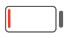</td><td>电池电量低</td></tr><tr><td></td><td>正在充电</td><td></td><td>正在使用快充</td></tr><tr><td></td><td>正在使用超级快充</td><td></td><td>无线超级快充</td></tr><tr><td></td><td>无线快充</td><td></td><td>普通无线充电</td></tr><tr><td></td><td>省电模式已开启</td><td></td><td>健康使用平板已开启</td></tr><tr><td>[0009]</td><td>蓝牙已开启</td><td>[0242]</td><td>蓝牙设备电量</td></tr><tr><td></td><td>已连接蓝牙设备</td><td></td><td>已连接至VPN网络</td></tr><tr><td>[0000]</td><td>飞行模式已开启</td><td>[7896]</td><td>免打扰模式已开启</td></tr><tr><td>[0007]</td><td>位置服务已开启</td><td></td><td>护眼模式已开启</td></tr><tr><td>[7H47]</td><td>已进入驾驶模式</td><td>[7W6H]</td><td>性能模式已开启</td></tr><tr><td>[0042]</td><td>已连接耳机</td><td>[0148]</td><td>已连接至投屏设备</td></tr><tr><td></td><td>正在通话</td><td>[0007]</td><td>VoLTE高清通话已开启</td></tr><tr><td>[44HX]</td><td>有未接来电</td><td>[7786]</td><td>当前网络无法正常通话</td></tr><tr><td></td><td>有新消息</td><td>[782W]</td><td>闹钟已开启</td></tr><tr><td>[5881]</td><td>静音模式</td><td>[0462]</td><td>振动模式</td></tr><tr><td></td><td>数据同步中</td><td></td><td>数据同步失败</td></tr><tr><td>[5731]</td><td>收到新邮件</td><td></td><td>收到日程提醒</td></tr><tr><td>[4974]</td><td>应用调用相机功能</td><td>[0922]</td><td>应用调用麦克风功能</td></tr><tr><td></td><td>更多未显示的信息</td><td>[09240]</td><td>已建立分布式联网</td></tr></table>

# 控制中心

# 控制中心简介

控制中心将常用的音频播控、快捷开关、超级终端等功能集合在一起，让您操作更便捷。

# 控制中心常用功能

从屏幕顶部右侧下滑出控制中心，您可以轻松体验如下功能：

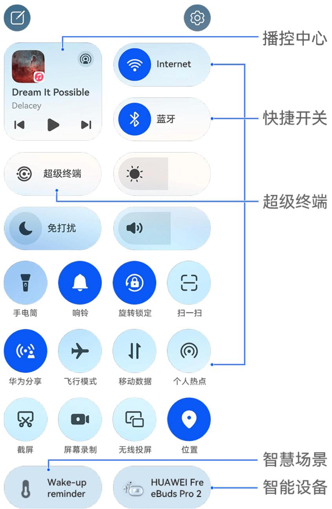

flowchart

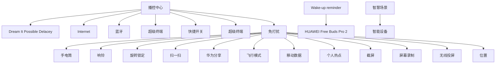
```mermaid
graph TD
    A["播控中心"] --> B["Dream It Possible Delacey"]
    A --> C["Internet"]
    A --> D["蓝牙"]
    A --> E["超级终端"]
    A --> F["快捷开关"]
    A --> G["超级终端"]
    A --> H["免打扰"]
    H --> I["手电筒"]
    H --> J["响铃"]
    H --> K["旋转锁定"]
    H --> L["扫一扫"]
    H --> M["华为分享"]
    H --> N["飞行模式"]
    H --> O["移动数据"]
    H --> P["个人热点"]
    H --> Q["截屏"]
    H --> R["屏幕录制"]
    H --> S["无线投屏"]
    H --> T["位置"]
    U["Wake-up reminder"] --> V["HUAWEI Free Buds Pro 2"]
    W["智慧场景"] --> X["智能设备"]
```

0 配图仅供参考，请以产品实际为准。

• 播控中心：统一控制音频播放，调节音频进度，切换最近使用的媒体应用、音乐播放设备（如：智慧屏、蓝牙耳机等）及通话设备。  
• 快捷开关：快速开启、关闭或设置一些常用小功能。

• 超级终端：可协同平板、笔记本、智慧屏等多种设备，实现多屏协同、无线投屏、视频流转等操作。  
• 智能设备：统一管理和操控在智慧生活应用中已添加的智能设备。  
• 智慧场景：快速执行和管理已订阅、创建的场景。

# 控制中心基础编辑

控制中心有很多编辑功能，如调整快捷开关位置、编辑智慧场景和智能设备等，可帮助您更好的使用控制中心。

从屏幕顶部右侧下滑出控制中心，点击 ，您可以进行如下操作：

• 编辑快捷开关：长按并拖动快捷开关可调整其在控制中心中的位置，点击快捷开关上的 可将其隐藏，点击快捷开关面板中的 ，然后点击隐藏的快捷开关上的 可将其添加到控制中心显示。  
• 编辑智能设备：点击设备和场景面板中的 > 设备，然后点击在智慧生活应用中已添加的某个设备卡片上的 ， 此设备卡片便可在控制中心显示；点击已添加的设备卡片上的 可将其从控制中心移除。  
• 编辑智慧场景：点击设备和场景面板中的 > 场景，然后点击在智慧生活应用中已添加的某个场景卡片上的 ， 此场景卡片便可在控制中心显示；点击已添加的场景卡片上的 可将其从控制中心移除。

# 使用快捷开关

# 打开快捷开关

从屏幕顶部右侧下滑出控制中心，即可使用常用功能快捷开关。

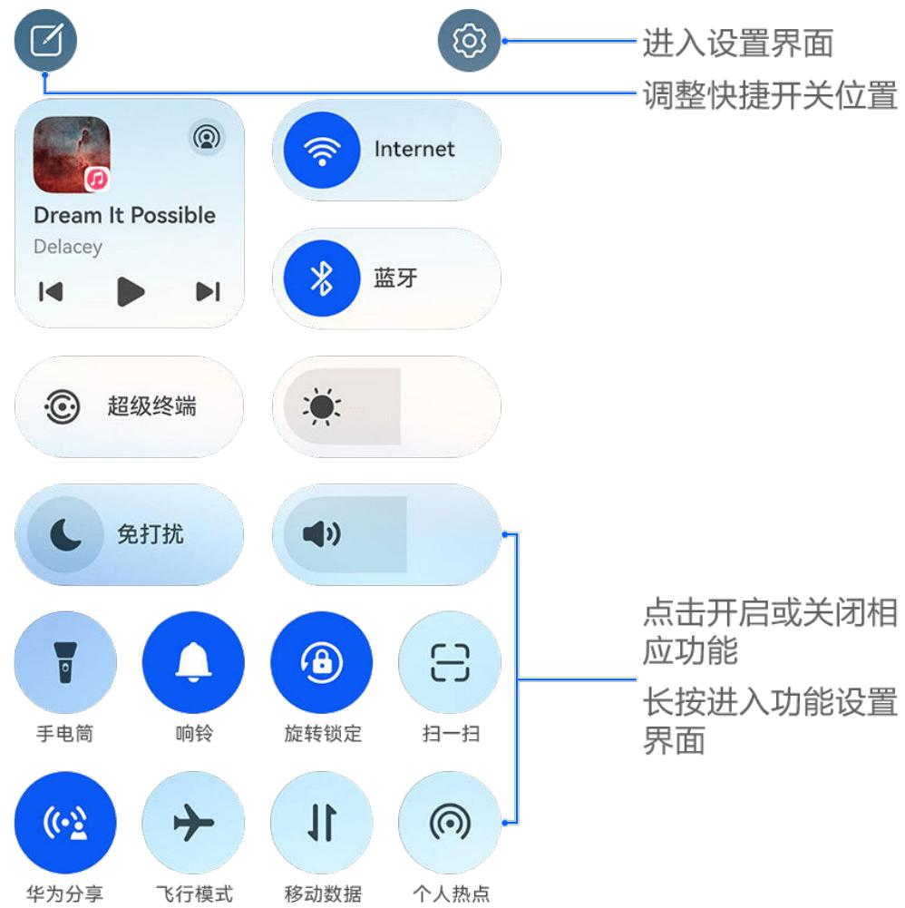

flowchart

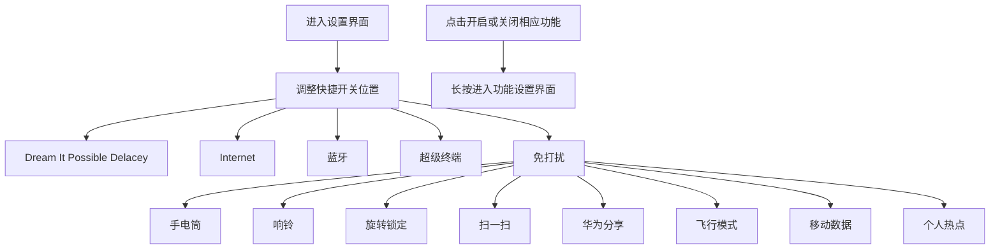
```mermaid
graph TD
    A["进入设置界面"] --> B["调整快捷开关位置"]
    B --> C["Dream It Possible Delacey"]
    B --> D["Internet"]
    B --> E["蓝牙"]
    B --> F["超级终端"]
    B --> G["免打扰"]
    G --> H["手电筒"]
    G --> I["响铃"]
    G --> J["旋转锁定"]
    G --> K["扫一扫"]
    G --> L["华为分享"]
    G --> M["飞行模式"]
    G --> N["移动数据"]
    G --> O["个人热点"]
    P["点击开启或关闭相应功能"] --> Q["长按进入功能设置界面"]
```

配图仅供参考，请以产品实际为准。

• 点击快捷开关，可开启或关闭相应功能。  
• 长按快捷开关，进入对应功能的设置页面（部分功能进入弹窗设置）。  
• 点击 进入设置界面。

# 自定义快捷开关

根据使用习惯，您可新增、移除快捷开关，还可调整快捷开关位置。从屏幕顶部右侧下滑出控制中心，点击 ，进入编辑界面。

移动：长按对应功能图标并拖动，可调整快捷开关位置。

移除：点击快捷开关右上角 可将不需要的快捷开关图标移除。

新增：点击 $\not { p } -$ ，可添加不同功能的快捷开关图标。

设置完成后，点击 保存。

# 使用播控中心

在播控中心，您可以快速控制和切换多个音视频类应用，或将本机的音频投放到耳机、音箱等其他设备。

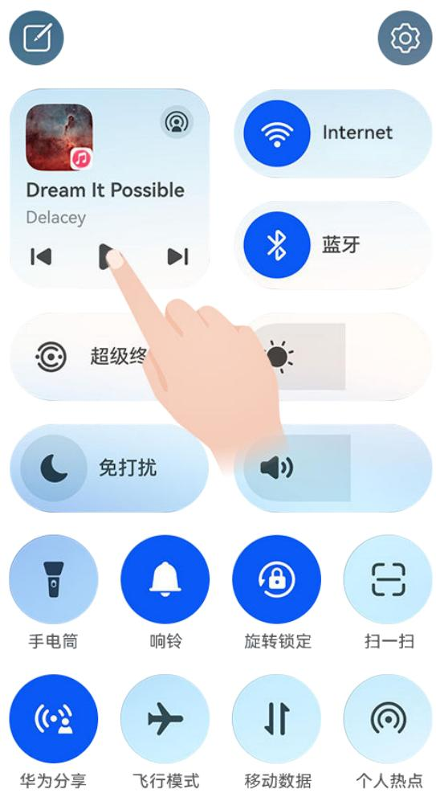

text_image

Dream It Possible
Delacey
Internet
蓝牙
超级终
免打扰
手电筒
响铃
旋转锁定
扫一扫
华为分享
飞行模式
移动数据
个人热点

i 配图仅供参考，请以产品实际为准。

# 控制和切换本机音视频应用

当开启了多个音视频类应用时（如音乐等），您可通过播控中心控制或切换。

0 并非所有应用均支持播控中心，部分应用需更新到最新版本后使用，请以实际情况为准（前往官网了解支持的应用）。

1 从平板顶部右侧下滑出控制中心，点击顶端的播控中心空白处，进入播控中心界面。  
2 播控中心会显示正在运行和最近使用过的音视频应用，您可以：

• 控制运行中的应用：点击按键或滑动，可实现播放暂停、调整音量及播放进度、切换上下曲等操作。  
切换到其他最近应用：点击界面中的其他应用，可进行切换。

部分应用还支持听视频功能。例如，您可在抖音中开启听抖音功能（需将抖音更新到最新版本），开启后，可在播控中心实现播放暂停，调整音量及播放进度等操作。

# 将音频共享到两副蓝牙耳机

您可以与好友各用一副蓝牙耳机，通过音频共享，在同一部平板上听音乐或看视频。

• 并非所有蓝牙耳机支持音频共享，请以实际情况为准（前往官网了解支持的耳机机型）。  
• 如您的蓝牙耳机支持此功能，请升级到最新版本。

1 将本机与一副蓝牙耳机配对后，在控制中心，点击播控中心右上角的 @ 。  
2 根据另一副耳机的配对情况，参考以下方式完成共享配对：

自有共享（另一副耳机已与本机配对）：设备列表中将显示已配对的耳机，勾选要共享的两副耳机。

您也可以在控制中心 > 超级终端中，将两副耳机拖拽至本机连接。

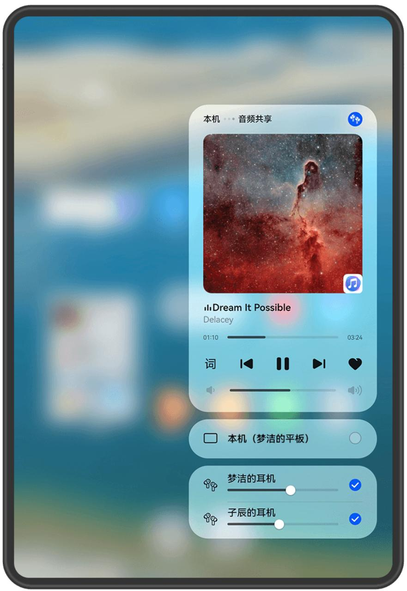

text_image

本机 · · 音频共享
Dream It Possible
Delacey
01:10 03:24
词
本机（梦洁的平板）
梦洁的耳机
子辰的耳机

配图仅供参考，请以产品实际为准。

临时共享（另一副耳机未与本机配对）：在本机设备列表，勾选已配对的耳机，然后点击耳机名称下方的共享给其他耳机，根据另一副耳机的情况设置。

• 另一副耳机未连接其他设备：将另一副耳机入盒开盖，靠近本机，根据提示连接；如平板未发现耳机，您可长按耳机盒功能键，靠近本机连接。  
• 另一副耳机已连接其他设备：如另一副耳机已连接其他手机/平板（手机/平板版本需为HarmonyOS 3 或以上），将其他手机/平板亮屏，靠近本机，根据提示完成连接。

3 完成配对后，在本机播放音频，即可在两副耳机上收听。

若要取消音频共享，请在播控中心点击 ，点击已共享的耳机取消勾选。

# 将音频投放到其他设备

当平板连接了耳机、音箱、智慧屏等设备后，您可将平板的音频（如播放视频、听音乐、视频通话、游戏音效等）快速投放到这些设备，并在播控中心控制和切换。

若您安装了华为全屋音乐系统，也可通过播控中心投放音频，管理和控制各个房间的播放。

# 投放其他设备

1 将平板连接音频设备（如连接耳机、音箱，或在智慧生活中添加设备等，具体操作请参考设备说明）。  
2 在控制中心，点击播控中心右上角的 ，然后点击列表中的某个设备，将平板的音频投放到对应的设备中。  
如播控中心未出现投音设备列表，请点击 切换。

# 投放全屋音乐系统

1 打开要播放的音频应用，在控制中心，点击播控中心右上角的 。  
2 全屋音乐系统的房间列表会在界面中显示，您可根据需要勾选要播放的房间，或设置全屋播放。若要取消某个房间的播放，请在列表中点击已选中的房间，取消勾选，或点击列表中的本机名称，切换到本机播放。

# 将通话音投放到其他设备

当平板连接了耳机、音箱等音频设备后，您可在通话时，将平板通话音投放到这些设备。

1 将平板连接有线耳机，或通过蓝牙连接耳机、音箱等设备。  
2 通话过程中，您可从平板顶部右侧下滑出控制中心，在播控中心右上角点击 ，然后点击列表中的有线或蓝牙设备，将通话音投放到对应的设备中。

如播控中心未出现投音设备列表，请点击 切换。

• WLAN only 版本的平板不支持通话业务，请以实际情况为准。

• 支持通话音投放设备切换的应用正在持续丰富中，请以实际情况为准。

# 控制和管理其他音频设备

当平板连接了多个附近的华为智能音频设备时（如智能音箱、智慧屏），您可以通过播控中心控制或切换设备播放。

使用此功能前，请先将连接设备升级到最新版本。

以华为智能音箱为例：

1 在智慧生活中添加华为智能音箱，并将平板和音箱连接到网络。  
2 在控制中心点击播控中心，卡片上方将显示已添加的设备图标。  
3 点击设备图标，进入对应的设备控制界面，可控制设备播放、暂停、切歌、调整音量等。如连接了多个音频设备，还可点击不同的设备图标，切换控制。

如卡片上方未显示设备图标，请点击 切换。

# 超级终端实现多设备协同

超级终端一键协同，让您使用多设备就像使用一台设备那样简单高效。例如：回到家，在智慧屏上继续进行平板上未完成的畅连视频通话，放大视听体验；回到办公桌，也可在电脑上轻松编辑平板上的文件，让办公更高效。

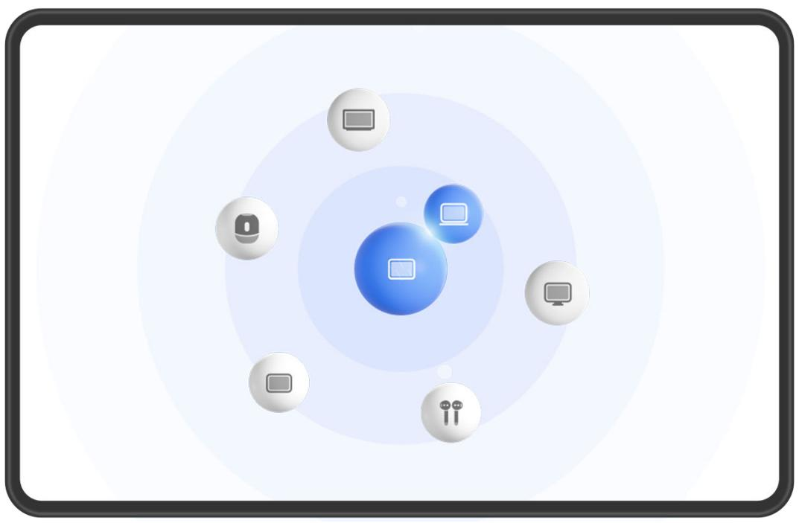

natural_image

Abstract diagram with concentric circles and small icons, no text or symbols present

0 配图仅供参考，请以产品实际为准。

# 超级终端使用前设置

使用超级终端前，请在平板上开启蓝牙、WLAN ，并登录华为帐号。

其他待协同设备保持亮屏状态，并进行如下设置：

0 不同产品的超级终端所支持的设备类型可能有差异，请以实际情况为准（前往官网了解支持设备清单）。

• 手机：开启蓝牙、WLAN 。

• 平板：开启蓝牙、WLAN 。

0 仅支持多机位模式的平板可作为待协同设备，请在相机 > 更多中查看是否支持多机位模式（前往官网了解多机位的支持机型清单）。

• 电脑：开启蓝牙、WLAN，并与平板登录同一华为帐号。

• 智慧屏、显示器：开启蓝牙、WLAN。

• 智能音箱、打印机：与平板接入同一局域网，并通过智慧生活应用绑定到平板所登录的华为帐号。

您可以进入智慧生活首页，点击 > 添加设备，根据界面提示完成绑定。

• 耳机、眼镜：与平板通过蓝牙配对连接。

• 手表、手环：通过运动健康应用绑定到平板所登录的华为帐号。

# 超级终端发现和协同附近设备

# 设备间使用同一华为帐号

使用超级终端前，您可前往官网了解支持设备清单（设备间使用同一华为帐号）。

1 在本机和待协同设备上登录同一华为帐号。

2 在本机控制中心的超级终端中点击待协同设备图标发起默认协同连接。

或点击 ，然后点击待协同设备图标，在菜单中选择需要的协同场景后发起连接。

若设备间存在多种协同场景，协同过程中想切换场景，在超级终端进入 后点击待协同设备图标，在菜单中切换协同场景。

# 设备间使用不同华为帐号

使用超级终端前，您可前往官网了解支持设备清单（设备间使用不同华为帐号）。

1 在待协同设备上完成如下设置：

手机/平板：进入设置 > 超级终端 > 本机 > 允许被发现，选择附近设备。

• 智慧屏：进入设置 > 网络与联接/遥控器与连接，确保多设备协同和投屏开关已开启。

0 使用此功能前，请将智慧屏升级至最新版本。

2 从本机顶部右侧下滑出控制中心，在超级终端中点击 。

3 点击 ，选择待绑定设备，根据界面提示完成绑定。

i若需解绑不同帐号设备，在超级终端中点击 ，长按解绑设备点击删除；或进入设置 > 超级终端，在其他已绑定设备中选择解绑设备点击删除。

4 点击待协同设备图标，在菜单中选择需要的协同场景后发起协同连接。

0若设备间存在多种协同场景，协同过程中想切换场景，在超级终端进入 后点击待协同设备图标，在菜单中切换协同场景。

# 将畅连、音乐等流转至待协同设备

当您正在使用平板聆听音乐或与家人进行畅连通话时，通过超级终端可将当前任务一键流转至待协同设备，如：在智慧屏上继续畅连通话等。

text_image

切换为悬浮窗
动车相框
无线摄像头
诊断
语音
更多
轻洗
正在通话中...
轻洗
WLAN
蓝牙
免打扰
数据
前驱
监控设定
华为分享
多屏协同
位置信息
飞行模式
计算器
手电测
护坡模式
多音机
屏幕录制
颜色模式
电子书模式
无线投屏
扫一扫

i 配图仅供参考，请以产品实际为准。

您可以将：

• 畅连流转至智慧屏。

• 音乐流转至蓝牙耳机、音箱、眼镜、智慧屏（熄屏状态）。

0 不同产品的超级终端所支持的设备类型和流转任务可能有差异，请以实际情况为准。

1 请参阅超级终端使用前设置完成平板和待协同设备的设置。

2 从平板顶部右侧下滑出控制中心，在超级终端中点击 搜索附近设备或点击 > 绑定新设备。

3 在平板上打开待流转应用（如：华为视频、华为音乐等）。

4 在平板控制中心的超级终端中点击待流转设备图标，根据界面提示完成流转。

或点击 ，拖拽待流转设备至本机，根据界面提示完成流转。

# 在电脑上实现多屏协同

通过超级终端将平板与电脑建立协同连接，在电脑上可浏览、编辑文件，拖拽互传文件，复制粘贴文本，使用键鼠操控平板；在平板上使用手写笔操控电脑等，让协同办公更高效。

1 请参阅超级终端使用前设置完成平板和待协同设备的设置。  
2 在平板控制中心的超级终端中点击待协同电脑图标后发起协同连接。

或点击 ，然后点击待协同电脑图标，在菜单中选择多屏协同。

当您需要断开平板与电脑的协同时，进入平板超级终端，再次点击电脑图标取消协同。

# 截屏和录屏

# 截取完整屏幕

您可使用多种截屏方法，轻松定格屏幕精彩瞬间。

# 使用指关节截取完整屏幕

1 使用指关节前，请选择以下方式开启此功能（取决于您的机型）：

• 进入设置 > 辅助功能 > 快捷启动及手势 > 截屏，开启指关节截屏开关。  
• 进入设置 > 辅助功能 > 手势控制 > 智能截屏，开启智能截屏开关。

2 用单指指关节稍微用力并连续快速双击屏幕，截取完整屏幕。

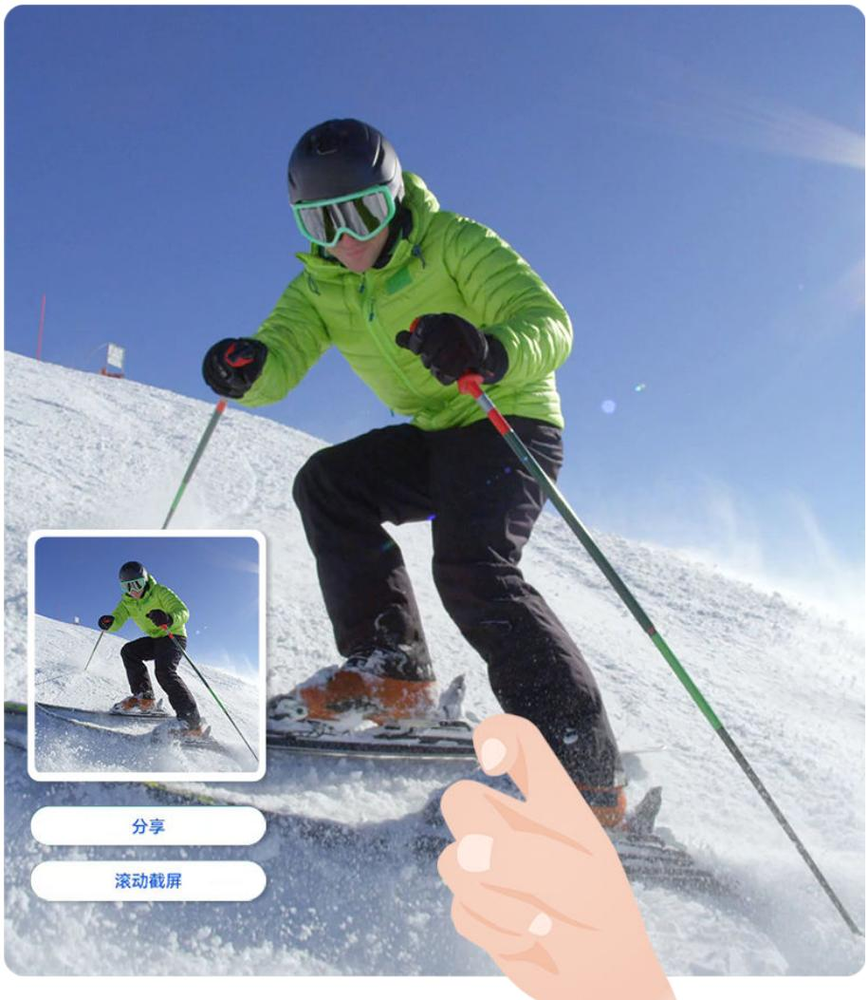

text_image

分享
滚动截屏

• 配图仅供参考，请以产品实际为准。

• 当您正在使用输入法时，请不要在键盘区域敲击，键盘区域已屏蔽指关节功能。  
• 如您担心在某个应用中指关节误触截图，可在游戏空间中对该应用屏蔽指关节。

进入设置 > 应用和服务 > 应用助手 > 游戏空间，点击添加游戏，根据屏幕提示添加应用。

# 使用组合键截取完整屏幕

同时按下电源键和音量下键截取完整屏幕。

# 使用快捷开关截取完整屏幕

从屏幕顶部右侧下滑出控制中心，点击截屏，截取完整屏幕。

# 分屏或悬浮窗状态下截取屏幕

当设备处于分屏或悬浮窗状态时，您可根据需要截取任一窗口内容。

截屏后，屏幕左下角会出现缩略图，点击缩略图顶部图标，可选择截取区域。

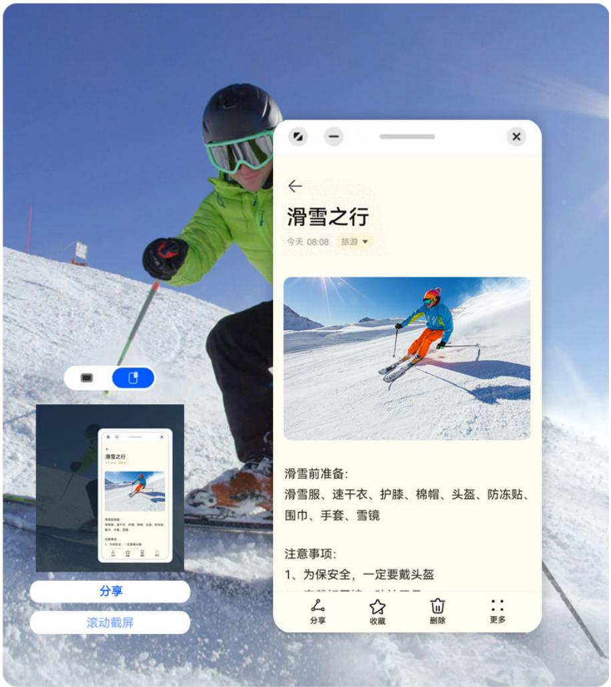

text_image

滑雪之行
今天 08:08 旅游
滑雪前准备:
滑雪服、速干衣、护膝、棉帽、头盔、防冻贴、围巾、手套、雪镜
注意事项:
1、为保安全,一定要戴头盔
分享
滚动截屏

0 配图仅供参考，请以产品实际为准。

悬浮窗状态下截屏：

• ：截取当前所有窗口内容。

：仅截取悬浮窗内容。

分屏状态下截屏（以上下分屏为例）：

• ：截取当前所有窗口内容。

：截取上分屏窗口内容。

：截取下分屏窗口内容。

# 分享、编辑或继续滚动截长图

截屏后，屏幕左下角会出现缩略图，您可以：

• 点击缩略图下方的分享，选择一种分享方式，快速将截图分享给好友。  
• 点击缩略图下方的滚动截屏，可以继续滚动截长图。  
• 点击缩略图，对截屏内容进行编辑、删除等操作。

截屏默认保存在图库中。

# 截取局部屏幕

当您需要截取屏幕局部精彩内容时，可以使用局部截屏，帮您截出不同形状（如：矩形，椭圆形，心形等）。

# 使用指关节截取局部屏幕

natural_image

Person peeking through a tent with a teddy bear, overlooking a mountain landscape under a clear blue sky (no text or symbols visible)

配图仅供参考，请以产品实际为准。

1 使用单指指关节敲击屏幕并保持指关节不离开屏幕，拖动指关节绘制一个任意封闭图形。  
2 屏幕会显示指关节的运动轨迹，您可以：

拖动截图框调整位置和大小。  
点击工具栏上的截图框，切换不同的截图形状。

3 点击 ，保存截图。

i 当您正在使用输入法时，请不要在键盘区域敲击，键盘区域已屏蔽指关节功能。

# 使用快捷开关截取局部屏幕

1 从屏幕顶部右侧下滑出控制中心，长按截屏图标，在弹框中点击局部截屏。  
2 根据屏幕提示，使用手指绘制一个任意封闭图形。

3 屏幕会显示手指的运动轨迹，您可以：

拖动截图框调整位置和大小。  
点击工具栏上的截图框，切换不同的截图形状。

4 点击 ，保存截图。

# 滚动截取长图

当截屏内容超过一屏时，您可以使用滚动截屏，帮您轻松定格屏幕精彩瞬间，分享给亲朋好友。

# 使用指关节滚动截长图

# 欧洲旅游攻略

# 畅游欧洲

路线推荐：

第一站：浪漫法国

natural_image

Exterior view of the Eiffel Tower in Paris with a hand holding a finger, framed by tree branches (no signage)

0 配图仅供参考，请以产品实际为准。

1 单指指关节敲击屏幕并保持指关节不离开屏幕，稍微用力画“S”，屏幕将自动向下滚动截屏。  
2 滚动过程中，点击滚动区域可停止截屏。  
i 当您正在使用输入法时，请不要在键盘区域敲击，键盘区域已屏蔽指关节功能。

# 使用快捷开关滚动截长图

1 从屏幕顶部右侧下滑出控制中心，长按截屏图标，在弹框中点击滚动截屏，屏幕将自动向下滚动截图。

2 滚动过程中，点击滚动区域可停止截屏。

# 截屏后继续滚动截长图

截取完整屏幕后，屏幕左下角会出现缩略图，您可继续滚动截长图。

1 点击缩略图下方的滚动截屏，屏幕将自动向下滚动截屏。  
2 滚动过程中，点击滚动区域可停止截屏。

# 录制平板屏幕

您可将平板屏幕操作过程录制成视频，分享给好友。还可以录制网络课程、视频聊天、在线会议等内容，方便后期回放。

• 部分应用不允许录屏，请以实际情况为准。

• 若想显示录屏实况窗，请进入设置 > 通知和状态栏 > 状态栏 > 显示实况窗，开启屏幕录制旁边的开关。

# 使用组合键录屏

同时长按电源键和音量上键启动录屏，再次按住结束录屏。

# 使用快捷开关录屏

1 从屏幕顶部右侧下滑出控制中心，点击屏幕录制，启动录屏。  
2 点击屏幕上方红色计时按钮，结束录屏。  
3 进入图库查看录屏结果。

# 使用双指关节录屏

1 使用指关节前，请选择以下方式开启此功能（取决于您的机型）：

• 进入设置 > 辅助功能 > 快捷启动及手势 > 录屏，开启录屏开关。  
• 进入设置 > 辅助功能 > 手势控制 > 智能截屏，开启智能截屏开关。

2 双指指关节稍微用力并连续快速地双击屏幕启动录屏，再次双击结束录屏。

natural_image

Skier in green jacket skiing on a snowy slope under clear blue sky, with inset showing close-up of hand gesture (no text or symbols)

• 配图仅供参考，请以产品实际为准。

• 当您正在使用输入法时，请不要在键盘区域敲击，键盘区域已屏蔽指关节功能。

# 边录屏，边解说

录屏时，您可点击麦克风图标，选择开启或关闭麦克风：

表示麦克风开启，您可以边录屏，边解说。

表示麦克风关闭，此时仅可以收录系统音（如：正在播放的音乐、视频等声音）。

# 显示或取消录屏时的触摸轨迹

录屏时，您可根据需要选择是否显示触摸轨迹。

未开启录屏实况窗：启动录屏后，点击屏幕上方红色计时按钮旁边的 ，开启或关闭显示触摸轨迹开关。

已开启录屏实况窗：启动录屏后，点击屏幕顶部的实况窗，然后点击 或 ，可开启或关闭显示触摸轨迹。

表示已开启。

# 输入文本

# 使用小艺输入法

小艺输入法是华为开发的一款安全，简洁的输入法。支持高效语音输入、流畅手写、全球 170 多种语言输入等，让您高效、安全的输入。

如果平板未安装小艺输入法，请进入应用市场搜索并安装小艺输入法。

进入设置 > 系统和更新 > 语言和输入法，选择小艺输入法，可以将小艺输入法设置为默认输入法。

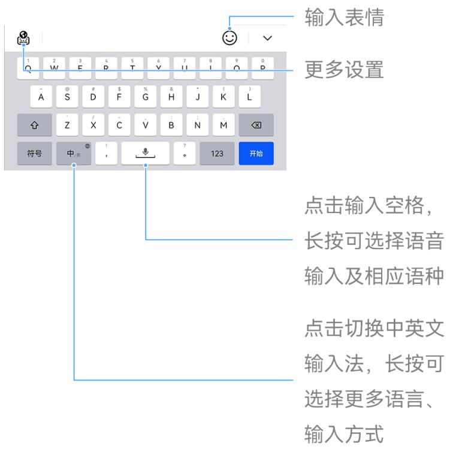

text_image

输入表情
更多设置
点击输入空格，
长按可选择语音
输入及相应语种
点击切换中英文
输入法，长按可
选择更多语言、
输入方式

• 配图仅供参考，请以产品实际为准。

• 部分产品支持功能有所不同，请在应用市场升级更新小艺输入法至最新版本。

切换中文输入方式

切换中文输入键盘

在输入键盘，长按左下角的 或进入 > 输入方式，您可以选择或切换 26键、9键、笔画、手写和五笔等中文键盘。

切换为繁体字

在输入键盘，进入 > 常用功能，点亮繁体输入，可将简体中文切换为繁体中文。若需中文语音直接转繁体输入，需先选择繁体输入。

切换为简体字

在输入键盘，进入 > 常用功能，点击繁体输入，即可将繁体中文切换为简体中文。

# 文字输入

# 按键输入

小艺输入法采用 26 键或 9 键键盘进行拼音输入，依次点击拼音字母，上方词条会出现联想词，点击即可输入。

按住字母键，上滑可输入数字或符号，向左或向右滑动，可以输入字母。

长按中/英键，您可点击切换 26 键或 9 键键盘。

# 语音输入

支持四川话、上海话等多种方言的语音输入，将语音转为文字，提升输入效率和使用便利性。

1 长按空格键，上滑至 ，选择您想使用的方言。  
2 长按空格键，进行语音输入。

# 手写输入

支持免切换键盘，直接在拼音键盘上手写输入，可叠写或连写。

在输入键盘，进入 > 常用功能 > 设置 > 手写设置，开启拼音键盘手写开关。

# 五笔输入

在输入键盘，进入 > 输入方式，点击五笔，开启五笔输入或按界面提示进行操作（如：下载五笔字典）。

# 富媒体输入

• 点击键盘面板中 ，点击Emoji，可以选择多种 Emoji 表情。  
• 点击键盘面板中 ，点击颜文字，可以选择丰富的颜文字。

# 切换输入语言

长按左下角的中英文切换键，在弹出的快捷面板中选择更多键盘设置…或点击中英文切换键，快速切换中英文。

# 小艺输入法设置

# 设置皮肤

在输入键盘，进入 > 常用功能 > 换肤或 > 常用功能 > 设置 > 键盘设置 > 皮肤，选择皮肤。

# 设置字体

在输入键盘，进入 > 常用功能 > 字体大小或 > 常用功能 > 设置 > 键盘设置 > 字体样式，设置字体。

# 翻译输入文字

使用小艺输入法，可以对输入的文字进行翻译，方便交流与办公。

# 开启或关闭翻译功能

在输入键盘，点击 > 常用功能 > 翻译输入，开启或关闭翻译功能。

# 选择翻译目标语言

开启翻译功能后，点击自动，可选择待翻译的目标语言（如：西班牙语）。

0 支持翻译的目标语言请参考自动 > 语种选择界面提示。

# 定制工具栏

在输入键盘，进入 > 常用功能 > 定制工具栏，按照界面提示，点击图标可添加、修改或删除工具栏工具。

# 多窗口

# 智慧多窗应用栏

使用智慧多窗应用栏，您可在使用应用时，快速打开其他应用。您还可添加、删除、移动智慧多窗应用栏中的应用，让它更符合您的使用习惯。

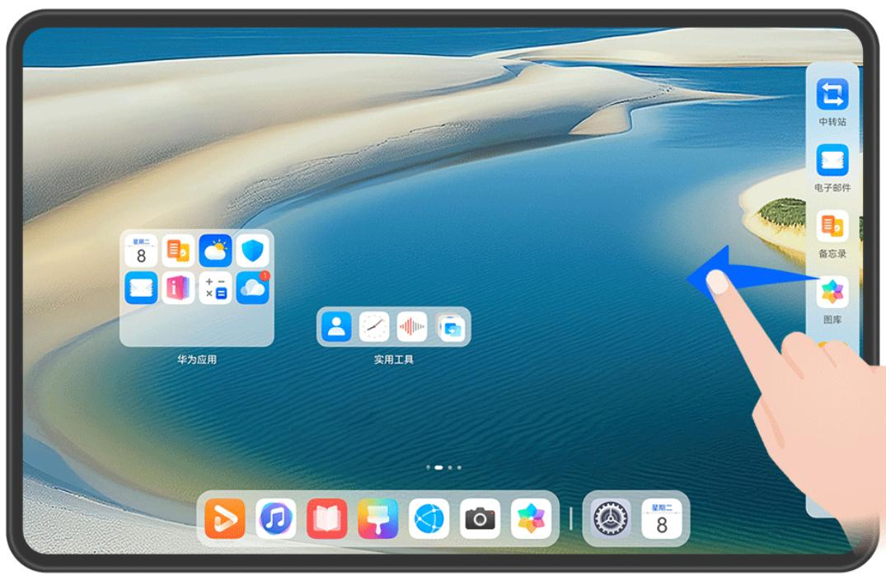

text_image

华为应用
实用工具
中转站
电子邮件
备忘录
图库

0 配图仅供参考，请以产品实际为准。

使用前，请进入设置 > 辅助功能 > 智慧多窗，确保智慧多窗应用栏开关已开启。

在平板屏幕左侧或右侧边缘，向屏幕内滑动并停顿，调出智慧多窗应用栏，您可以：

00• 查看支持智慧多窗的应用：点击 ，在支持智慧多窗的应用中查看。

• 添加应用：点击 $\stackrel { \triangledown } { . \vec { \bigtriangledown } { \bigcirc } } > \not - \bar { \vdash }$ ，进入编辑状态，点击应用图标，即可将该应用添加到应用栏，然后点击 保存。  
• 移动应用：点击 $\stackrel { \triangledown } { . \vec { \bigtriangledown } { \bigcirc } } > \not - \bar { \vdash }$ ，进入编辑状态，在应用栏中长按应用图标并拖拽，可将其移动到应用栏任一位置，点击 保存。  
• 删除应用：点击 $^ { 0 0 } _ { \cdot 0 0 } { > } ^ { { \ - } \ - { \ - } }$ ，进入编辑状态，在应用栏中点击应用图标右上角的 删除应用，然后点击 保存。

显示在智慧多窗应用栏上的最近推荐应用不能被删除。

# 悬浮窗，便捷切换多任务

使用悬浮窗功能，无需退出当前应用，即可通过悬浮窗打开另一个应用，玩游戏时不退出，也能随时畅聊。

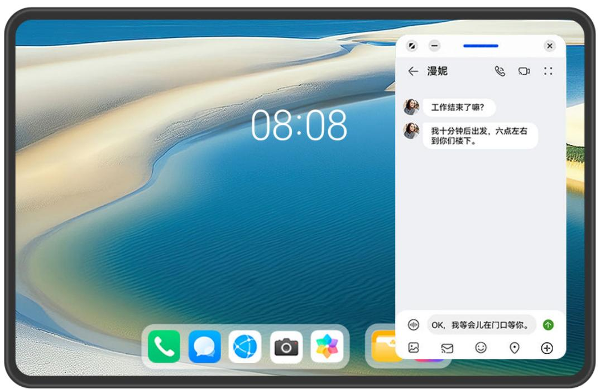

text_image

08:08
漫妮
工作结束了嘛？
我十分钟后出发，六点左右到你们楼下。
OK，我等会儿在门口等你。

i 配图仅供参考，请以产品实际为准。

# 开启悬浮窗

使用前，请进入设置 > 辅助功能 > 智慧多窗，确保智慧多窗应用栏开关已开启。

您可以通过以下任一方式开启悬浮窗（取决于您的机型）：

• 从屏幕底部上滑打开任务中心，在任务中心列表中点击某一任务右侧上方的 ，开启悬浮窗。  
• 在平板屏幕左侧或右侧边缘，向屏幕内滑动并停顿，调出智慧多窗应用栏，点击应用栏中的某个应用开启悬浮窗。

# 悬浮窗常用操作

开启悬浮窗后，您可实现以下操作：

# 移动悬浮窗位置

拖动悬浮窗顶部横条，移动悬浮窗位置。

# 调节悬浮窗大小

拖动悬浮窗底部边框、两侧边或底部两角，调节悬浮窗大小。

i 将悬浮窗缩小到最小尺寸，松手后悬浮窗将自动悬挂到右侧上方切换为悬浮小窗。

# 最小化悬浮窗

通过以下任一方式操作：

• 点击悬浮窗顶部的 。

• 拖动悬浮窗顶部横条，快速向左侧或右侧滑动。

• 拖动悬浮窗顶部横条，向左侧或右侧滑动悬浮窗至屏幕侧边。

# 恢复全屏显示

通过以下任一方式操作：

点击悬浮窗顶部的 。

• 拖动悬浮窗顶部横条，快速向上滑动。

• 拖动悬浮窗顶部横条，向上滑动悬浮窗至状态栏区域。

# 退出悬浮窗

通过以下任一方式操作：

点击悬浮窗顶部的 。

• 拖动悬浮窗顶部横条，快速向下滑动。

• 拖动悬浮窗顶部横条，向下滑动至底部 。

# 从悬浮窗切换为分屏

非桌面场景下，长按悬浮窗顶部横条，并拖动至屏幕左右（横屏时）或上下边缘（竖屏时）。

# 查找和切换悬浮窗任务

您可以通过悬浮窗任务管理，快速查找和切换悬浮窗。

1 已打开多个悬浮窗任务，最小化到悬浮球中。

2 点击悬浮球容器，展开悬浮窗任务管理：

查找悬浮窗：上下滑动浏览，查找需要的悬浮窗任务。

切换悬浮窗：单击需要恢复的悬浮窗任务卡片，打开一个悬浮窗任务。

关闭悬浮窗：点击需要退出的悬浮窗任务上的 ， 清除一个悬浮窗任务。

# 分屏，轻松应对多任务

开启分屏，您可同屏使用多个应用。

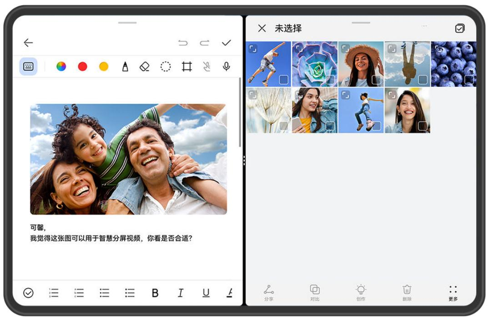

text_image

可馨，
我觉得这张图可以用于智慧分屏视频，你看是否合适？
× 未选择
分享  对比  创作  删除  更多

• 配图仅供参考，请以产品实际为准。

• 部分应用不支持分屏显示。

# 进入分屏

使用前，请进入设置 > 辅助功能 > 智慧多窗，确保智慧多窗应用栏开关已开启。

您可通过以下任一方式进入分屏（取决于您的机型）：

• 打开一个应用进入全屏后，从屏幕底部上滑到左上方的 $\boxed { \pmb { \bigtriangledown } } _ { \overrightarrow { \mathbf { g } } } \boxed { \pmb { \bigtriangledown } }$ ，进入待分屏状态，再打开另一支持分屏的应用，进入分屏。  
• 打开一个应用进入全屏后，在平板屏幕左侧或右侧边缘，向屏幕内滑动并停顿，调出智慧多窗应用栏，长按并拖拽应用栏中的应用至屏幕内，松手开启分屏。

# 分屏常用操作

在分屏状态下，您可实现以下操作：

• 分屏互换：点击分屏分隔线中的 或 ，然后点击上下互换或左右互换。

您也可长按分屏窗口顶部的 至分屏窗口缩小后，拖拽该窗口至另外一个分屏区域，松手即可分屏互换。

• 调节分屏比例：拖动分屏分隔线中的 或 ，可以调节分屏比例。  
• 由分屏切换为悬浮窗：长按分屏窗口顶部的 ，向左右任一方向拖动（竖屏时）或向下拖动（横屏时）。

• 退出分屏：拖动分屏分隔线中的 或 ，直至另外一个分屏窗口消失。

# 保存分屏组合

在分屏状态下，将常用分屏组合设为快捷方式保存到桌面，可快速进入。

点击分屏分隔线中的 或 ，然后点击保存组合，可将当前分屏组合保存到桌面。

在桌面点击该分屏组合图标，即可进入。

# 在分屏应用间快速拖拽

打开分屏应用后，可以直接在应用间拖拽图片、文字或文档。

• 拖拽图片：例如，在编辑备忘录时，同时打开文件管理并选中一张图片，可将其拖拽至备忘录编辑页面。  
• 拖拽文字：例如，在发送信息时，同时打开备忘录长按并选中需要文字，再次长按可将其拖拽至微信中。  
• 拖拽文档：例如，在编辑电子邮件时，同时打开文件管理选中一篇文档，可将其拖拽至电子邮件。

部分应用不支持应用间拖拽。

# 打开单个应用的多窗口

您可以打开单个应用的多个任务窗口，如：笔记，在多个任务窗口间拖拽文字等。

部分应用程序不支持此功能，请以实际情况为准。

以笔记为例，您可以实现以下操作：

# 分屏打开单个应用的多任务窗口

1 在桌面打开笔记。  
2 在平板屏幕左侧或右侧边缘，向屏幕内滑动并停顿，调出智慧多窗应用栏。  
3 长按并拖拽应用栏中的笔记应用图标至屏幕内，开启分屏，可同时使用笔记应用的多个任务窗口。

若您的智慧多窗应用栏中没有笔记，可点击 > ，进入编辑状态，点击笔记应用图标即可将该应用添加到应用栏，然后点击 保存。

# 在单个应用的多任务窗口间快速拖拽

拖拽文字：从一个笔记任务窗口长按并选中需要文字，再次长按可将其拖拽至另一个笔记任务窗口中。

# 开启一步小窗或一步分屏

在应用全屏下，可以一步开启悬浮小窗。也可以进入待分屏状态后，再打开另一应用直接形成分屏。

i 部分应用程序不支持此功能，请以实际情况为准。

使用该功能前，请进入设置 > 系统和更新 > 系统导航方式，选择手势导航。

# 开启一步小窗

在应用全屏下，从屏幕底部上滑到右上方的 ，开启悬浮小窗。一步小窗功能可识别视频或游戏的横屏界面，自动将悬浮小窗横屏显示。

i 部分应用程序不支持悬浮小窗横屏显示，请以实际情况为准。

natural_image

Mountain landscape with golden snow-capped peaks and dark forested slopes, no text or symbols visible

0 配图仅供参考，请以产品实际为准。

您可以尝试以下操作。

• 最小化悬浮小窗：拖动悬浮小窗快速向左或向右滑动，也可拖动悬浮小窗至屏幕左侧或右侧边缘。

• 删除悬浮小窗：拖动悬浮小窗快速向下滑动，也可拖动悬浮小窗至屏幕底部 。

• 触发全屏：拖动悬浮小窗快速向上滑动，也可拖动悬浮小窗至屏幕顶部。

• 放大悬浮窗：单击悬浮小窗，放大为悬浮窗。

i 拖动悬浮窗底边、两边或底部两角，将悬浮窗缩小到最小尺寸后，松手后自动悬挂到右侧上方， 切换回悬浮小窗。

# 开启一步分屏

1 在应用全屏下，从屏幕底部上滑到左上方的 $\mathbb { \boxed { \Xi \sharp } }$ ，进入待分屏状态。  
2 再打开另一支持分屏的应用，形成分屏。

# 开启平行视界

开启平行视界，横屏使用平板时，应用内容会在屏幕上双屏显示，同时展示应用首页和内容页，方便您操作和查阅。

0 部分应用不支持开启平行视界，请以实际情况为准。

1 进入设置 > 显示和亮度 > 平行视界或设置 > 应用和服务 > 平行视界（取决于您的机型），点击要使用平行视界的应用旁的开关。  
2 开启后，打开设置平行视界的应用，应用首页会在屏幕居中显示。  
3 点击首页中的某条内容后，应用首页将在屏幕左半边显示，内容页在屏幕右半边显示。  
0 部分页面在无更多内容时，将单屏显示，您可在两侧空白区域内上下、左右滑动，进行操作。

# 使用悬浮窗显示

您可以使用悬浮窗方式打开部分不支持横屏的应用，让您使用时更方便。

1 进入设置 > 显示和亮度 > 平行视界，根据界面提示，点击悬浮窗显示。  
2 开启悬浮窗显示。  
使用该功能前，请将您的设备升级到最新版本。

# 调整平行视界窗口

使用平行视界时，您可以对窗口做适当调整，如左右交换，悬浮显示等，让使用更方便贴心。

左右交换窗口：平行视界双窗口显示状态下，在左右窗口上方显示拖动条 ，长按拖动条并左右拖动可交换左右窗口。一次交换操作仅针对当前任务，不影响其它任务的显示模式。

悬浮显示窗口：应用在平行视界双窗口状态显示时，在窗口上方显示拖动条 ，长按拖动条拖动该窗口到屏幕中间位置，待出现悬浮窗动效后松手，即可将该窗口内容悬浮显示。长按并拖动悬浮窗口上方拖动条可将其拖回平行视界窗口。

调整窗口大小：若要调整应用首页和内容页的占比大小，按住分屏中间的 ，左右滑动调整。

取消窗口联动：若要取消左右窗口任务的联动，点击分屏顶部的 ，使两个窗口独立操作。

0 部分产品不支持调整占比和取消联动，请以实际情况为准。

# 开关机和重启

# 开关机和重启

# 将平板开机或关机

若要将平板关机，请长按电源键几秒钟，直至平板弹出关机菜单，依次点击关机和点击关机。

若要将平板重新开机，请长按电源键几秒钟，直到出现开机标志。

# 重启平板

经常重启平板，可以清理平板缓存，让平板保持在良好状态。如果平板不能正常工作，也可以尝试重启平板。

长按电源键几秒钟，直至平板弹出重启菜单，依次点击重启和点击重启。

# 强制重启平板

如果平板不能正常工作，也无法正常关机，可以尝试同时长按电源键和音量下键或长按电源键 10秒以上（取决于您的机型），强制重启平板。

# 充电

# 给平板充电

当电池电量过低时，平板会提示您及时充电。为避免电量不足，导致平板自动关机，请及时充电。

# 充电注意事项

• 使用未经认可或不兼容的电源、充电器或电池，可能引发火灾等危险，请您使用兼容的充电器和数据线。  
• 请勿在潮湿的地点（如盥洗池、浴缸或淋浴室附近）使用充电器，勿用湿手插拔充电器，勿为潮湿状态下的平板充电。  
• 通过数据线将平板连接到充电器或其他设备后，平板会自动检测 USB 端口。如端口潮湿，平板会启动保护措施而停止充电。此时请断开连接，待端口干燥后再充电。  
• 当充电完毕或者不充电时，请断开充电器与平板的连接，并从电源插座上拔掉充电器。  
• 当长时间不使用平板时，请断开电源适配器与平板的连接，并从电源插座上拔掉电源适配器；若需长期存放平板，请将平板关机并置于阴凉干燥的环境中 (理想温度为 20℃–25℃)，将平板电量维持在 50% 左右，并每隔六个月将平板电量复充至 50%。  
• 若平板长时间闲置后，按下电源键平板无任何反应，请充电后耐心等待平板自动开机或充电 30分钟后再开机。

# 使用充电器充电

为了保证充电安全，请使用兼容的充电器和数据线。

1 使用数据线连接充电器和平板。

2 将充电器插入电源插座。

当平板有“滴”的声音，表示开始充电，并在充电动画界面显示充电模式图标和当前电量。

<table><tr><td>图标</td><td>充电模式</td></tr><tr><td>⚡</td><td>超级快充</td></tr><tr><td>⚡</td><td>快充充电</td></tr><tr><td>⚡</td><td>普通充电</td></tr></table>

# 了解电池图标含义

您可以通过平板屏幕上的电量图标，判断当前的电池状态。

<table><tr><td>电池图标</td><td>电池电量状态</td></tr><tr><td></td><td>电池电量小于10%。</td></tr><tr><td></td><td>充电过程中,电池电量小于10%。</td></tr><tr><td></td><td>充电过程中,电池电量介于10%和90%之间。</td></tr><tr><td></td><td>充电过程中,电池电量大于90%。当状态栏上电量显示100%或在锁屏界面上有已充满提示时,表示电池电量已经充满。</td></tr></table>

# 通过 OTG 功能给其它设备反向充电

OTG（On-The-Go）是一种 USB 传输技术，通过 OTG 数据线，可以让平板直接访问 U 盘或数码相机等设备中的文件，还可以连接到键盘、鼠标等外接设备。

您可以通过 OTG 数据线用平板给其他设备充电。

1 通过 OTG 数据线连接平板和其他待充电设备。  
2 从屏幕顶部左侧下滑出通知中心，轻触点击查看更多选项，选择反向充电或反向超级快充 （取决于您的机型）。  
3 在待充电设备上，根据提示选择充电。

# 使用超级快充 Turbo 模式充电

当您有紧急充电需求时，使用超级快充 Turbo 模式为平板充电，可以享受更快速的充电体验。

1 进入设置 > 应用和服务，点击应用设置中的平板管家，确保智能维护开关已开启。  
2 使用华为原装超级快充充电器和数据线连接平板。  
3 您可以使用以下任一方式开启超级快充 Turbo 模式：

• 在充电动效消失之前，当屏幕上方出现长按屏幕中央开启 Turbo 充电提示时，长按屏幕中央，直至平板振动、出现超级快充 Turbo。

• 解锁屏幕，从屏幕顶部左侧向下滑动，打开通知中心，在 Turbo 充电消息框中点击本次开启。

如果您想关闭超级快充 Turbo 模式，请在通知中心 Turbo 充电中消息框中点击关闭 Turbo 充电或重新拔插数据线。如果您选择了不再提醒，Turbo 充电中消息框会在平板重启后再次出现。

i 超级快充 Turbo模式充电过程中，平板温度可能略有升高，属于正常情况，请放心使用。

# 手写笔

# 使用手写笔轻松书写

手写笔搭配平板使用，可以代替手指方便地进行操作，捕捉您细腻多样的笔尖动作，让您体验到真实纸笔一般的书写感受。

i 使用此功能前，需要配备 HUAWEI M-Pencil。您可以前往华为专卖店或访问华为商城购买。

首次使用时，将手写笔的笔身凹槽面吸附在平板顶部右侧，根据屏幕弹框提示，完成手写笔和平板的配对。

前往官网了解手写笔如何重启。

# 笔身凹槽面吸附在主机顶部右侧

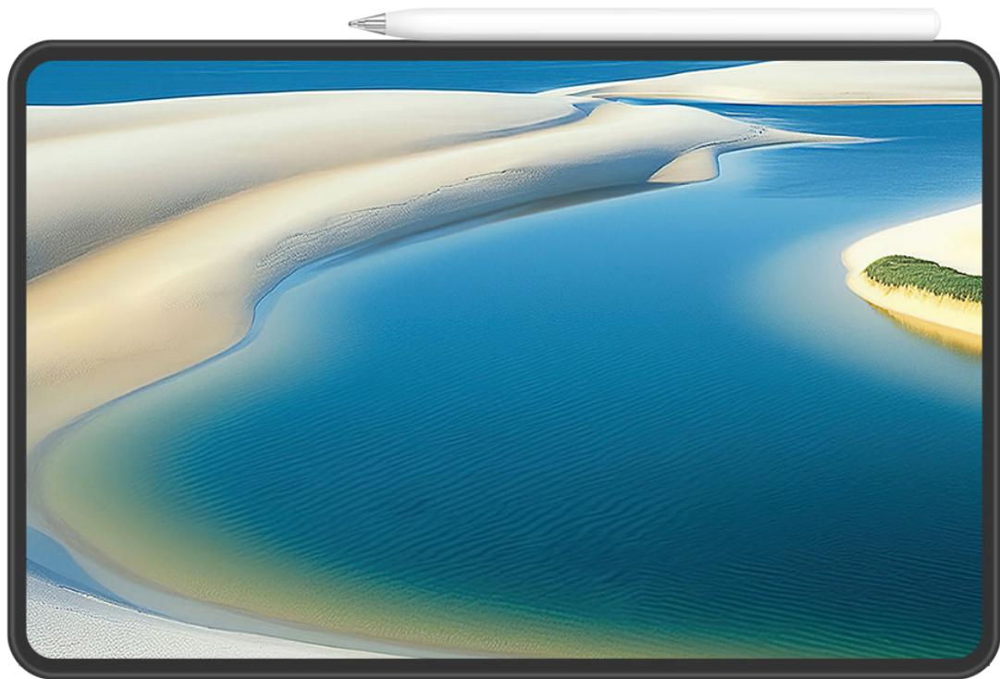

natural_image

Aerial view of a vast blue and white desert landscape with a small green island on the right (no text or symbols visible)

配图仅供参考，请以产品实际为准。

# 使用提笔速记

使用此功能前，请完成手写笔和平板的配对连接。（前往官网了解具体配对方式）。

手写笔和平板配对成功后，您可以在熄屏状态下，用手写笔点击屏幕或者在屏幕上划线，快速启动笔记或备忘录。

使用前，选择以下任一方式开启此功能（取决于您的机型）：

• 进入设置 > 辅助功能 > 手写笔 > 提笔速记，开启提笔速记开关，选择笔记或备忘录。  
• 进入设置 > 辅助功能 > 快捷启动及手势 > 亮屏，开启双击亮屏开关。

选择以下任一方式关闭此功能（取决于您的机型）：

• 进入设置 > 辅助功能 > 手写笔 > 提笔速记，关闭提笔速记开关。  
• 进入设置 > 辅助功能 > 快捷启动及手势 > 亮屏，关闭双击亮屏开关。

# 全局手写输入

使用此功能前，请完成手写笔和平板的配对连接。（前往官网了解具体配对方式）。

通过全局手写功能，您可以在输入框内，用手写笔输入文字，并使用笔势操作编辑文本。全局手写功能支持中英文混合输入。

进入设置 > 辅助功能 > 手写笔 > 全局手写输入，打开全局手写输入开关。

全局手写所支持的语言请以实际情况为准（前往官网了解详细信息）。

• 选择文字：在要选择的文字上画横线，横线所穿过的文字区域会被选中。  
• 删除文字：在要删除的文字上画波浪线，波浪线所覆盖的区域会被删除。  
• 插入空格：在要插入空格的文字中间画竖线。  
• 合并段落：在要合并的空白位置上画竖线。

# 让书写识别更精准

• 减少连笔，按笔顺书写可以很大程度上提高识别率。  
• 倾斜角度不要过大（尽量不要超过15度），按顺序书写工整，避免隔行书写。  
• 横向书写，不要纵向书写，一段文字内的字体大小尽量保持一致。  
• 在输入框内或附近落笔，落笔位置距离输入框较远会视为其他操作。

部分输入框不支持书写，包括安全、密码类的输入框，游戏内的输入框，个别应用自定义的输入框（如夸克浏览器）。

# 一笔成形

使用此功能前，请完成手写笔和平板的配对连接。（前往官网了解具体配对方式）。

一笔成形功能可以快速画出标准图形。

• 画出图形后，不要立即抬笔，停顿0.5-1s后，图形可以变成标准图形。  
• 图形识别支持直线、抛物线、三角形、矩形、平行四边形、圆形、椭圆形、菱形、箭头、五角星、五边形、心形、云朵等十多种常用形状，并非所有形状都可成形。  
• 需要一笔画完，不要多次抬笔拼凑成一个图形。例如矩形，需要一笔画成一个闭合矩形，稍作停顿后即可形成标准矩形。

i 此功能可在华为备忘录及部分手写笔应用内使用，并非所有应用都支持。

# 全局批注

使用此功能前，请完成手写笔和平板的配对连接。（前往官网了解具体配对方式）。

全局批注功能可以让您在任意界面、任意位置进行批注，并将相关内容与批注一起存储。

使用手写笔从屏幕右上角向内滑动，选择全局批注功能。

0 如果您使用的是 HUAWEI M-Pencil 第二代及以上手写笔，还可以通过双击手写笔笔身，开启全局批注功能。

使用前请先进入设置 > 辅助功能 > 手写笔 > 双击切换功能，打开双击切换功能开关，并选择全局快捷菜单。

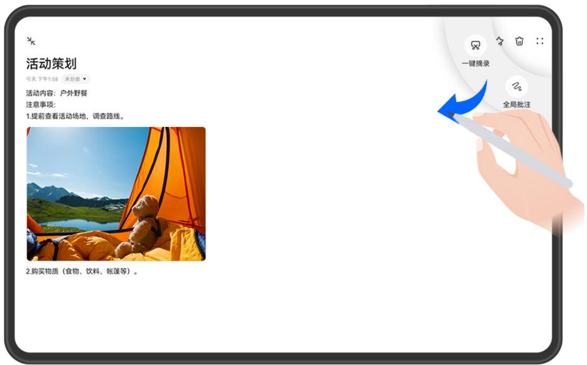

text_image

活动策划
今天 下午1:58 未分类
活动内容：户外野餐
注意事项：
1.提前查看活动场地，调查路线。
2.购买物质（食物、饮料、帐篷等）。
一键摘录
全局批注

配图仅供参考，请以产品实际为准。

进入全局批注后，您可以进行如下操作：

• 内容批注：直接用手写笔在您感兴趣的内容上进行写画标注，您的批注将覆盖在APP内容上方。内容批注不局限于当前屏幕显示。在批注过程中，您可以通过手指向上滑动来继续浏览内容（需要APP支持），并在浏览过程中在任意位置使用手写笔进行批注。  
• 笔刷设置：首次使用全局批注时，默认使用圆珠笔进行批注。您可以通过点击手写笔工具栏，进行笔刷切换、笔宽设置、颜色设置等操作。  
• 书写编辑：批注过程中，您可以随时修改自己的标注内容。点击手写笔工具栏，选择橡皮擦可以擦除笔迹，选择套索可以圈选笔迹，并进行复制、粘贴、删除、缩放、旋转等操作，也可以撤销或恢复。  
• 保存批注：批注结束后，您可以点击 保存批注结果，保存为图片或者PDF文档。  
• 分享批注：批注结束后，您可以点击 将批注结果进行分享，分享为图片或者PDF文档。

除了上述基本功能外，为了让您在批注过程中更方便的画出标准直线与图形，全局批注融入了一笔成形功能。您在画出图形后可以将手写笔停顿0.5-1s，即可变为标准图形。

# 使用演示批注

使用此功能前，请完成手写笔和平板的配对连接。（前往官网了解具体配对方式）。

当您开启屏幕共享时，使用演示批注功能，在任意界面、任意位置进行批注，与会人能够实时查看您在屏幕中的批注内容。

开启屏幕共享后，使用手写笔从屏幕右上角向内滑动，选择演示批注。

0 在演示批注功能下，手写笔仅能操作批注书写功能，其他功能可使用手指滑动界面或点击应用进行操作。  
• 屏幕共享时，在密码输入等安全隐私界面下，与会人的共享屏幕窗口会显示黑屏，当前界面内容不可见，但不会影响您的界面显示。

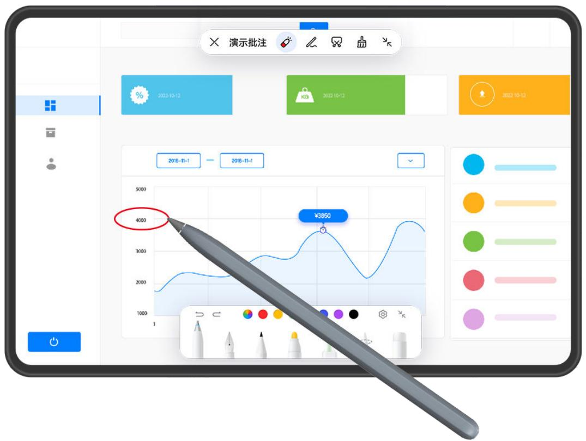

text_image

演示批注
2022-10-12
2022 10-12
2018-11-1
2018-11-1
¥3850

配图仅供参考，请以产品实际为准。

进入演示批注后，您可以使用手写笔进行如下操作：

• 内容批注：直接用手写笔在您需要展示的内容上进行写画批注，您的批注将覆盖在内容上方，与会人实时查看批注。  
• 笔刷设置：首次使用演示批注时，默认使用 进行批注，笔迹会在几秒后消失。您可以通过点击 ，在下方工具栏进行笔刷切换、颜色设置、橡皮擦擦除等操作，点击 $\supset$ 撤销上一步操作。  
• 截图保存：点击 ，将当前带有批注的界面内容截图，并保存至相册。  
• 清空屏幕批注：点击 ，将一键清空当前屏幕上所有批注内容，可点击屏幕下方工具栏 $\supset$ 撤销操作。  
• 最小化工具栏：批注过程中，您可以通过点击 将工具栏最小化，减少屏幕内容遮挡。点击 $^ { \Delta } _ { \kappa }$ ，即可恢复工具栏。

演示结束后，您可以使用任一方式退出：

• 点击 退出。

• 退出屏幕共享，演示批注会随屏幕共享一同退出。

0 不同产品所支持的功能可能有差异，请以实物为准。

# 一键摘录

使用此功能前，请完成手写笔和平板的配对连接。（前往官网了解具体配对方式）。

一键摘录功能可以高效截取和收录关键信息。通过文字摘录和图片摘录，您可以在任意界面获取文字或截图，获取成功后可以直接拖入支持拖入的应用内。

进入设置 > 辅助功能 > 手写笔 > 双击切换功能，确保双击切换功能已开启，选择全局快捷菜单。在平板右上角内滑或双击手写笔，点击一键摘录，可进入摘录状态。

# 连续摘录

在摘录状态下，点击工具栏 ，开启连续摘录，无需退出摘录状态可连续摘录。进入摘录状态后可以使用手指切换页面。

# 文字摘录

摘录状态下，长按屏幕上的文字，进入文字摘录模式，您可以：

• 调整文字范围：拖动光标调整选择范围。点击页面空白处可取消文字选择。

• 复制或拖动文字到其他应用：

复制文字：选中文字后，点击 。

拖拽文字：打开目标应用，选中文字后长按，拖拽至目标应用。

• 分享文字：选中文字后，点击 。

# 图片摘录

使用手写笔绘制任意图形，可自动生成矩形区域，拖动区域边缘可调整图片大小。点击屏幕可取消当前区域。

• 点击 ，对摘录的图片进行涂鸦。您可以切换笔刷、调整颜色。画出图形后可以将手写笔停顿直至变为标准图形。

• 点击 ，保存摘录图片。您拖入其他应用时，图片会保存在应用内，不会在图库中重复保存。

• 点击 ，将摘录图片进行分享。

• 点击 ，将图片固定到屏幕。长按图片，出现回缩效果后可拖拽至其他应用中。

• 点击 ，可退出摘录。

# 一笔校准

使用此功能前，请完成手写笔和平板的配对连接。（前往官网了解具体配对方式）。

手写笔在贴有保护膜的平板上使用时，可能会出现画线抖动的现象，您可以使用一笔校准功能来调整。

1 打开任意书写界面（如备忘录中的笔记）。  
2 使用手写笔，沿顺时针方向连续快速画圆，圆的直径尽量大于 3 厘米，时间超过 3 秒钟。  
3 画完后可以在当前界面测试线条效果，若效果不佳，可尝试适当增加画线速度，重新校准。

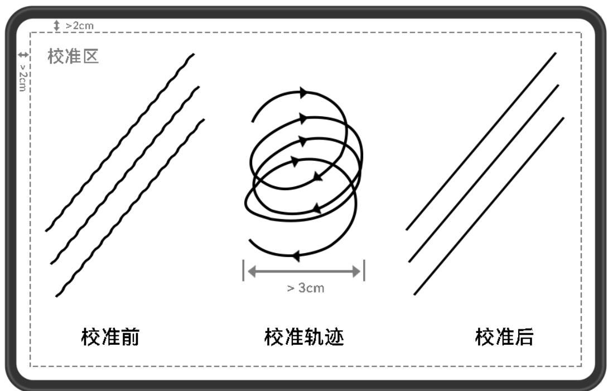

text_image

校准区
校准前	校准轨迹	校准后

• 使用该功能时，确保平板处于非充电状态，校准区域距离屏幕边缘至少 2 厘米。

• 画圆时手不要触摸平板，手写笔尽量保持与平板垂直。  
• 使用了笔尖套或者笔尖磨损严重，也可能导致画线抖动。为了保护您的屏幕，不建议使用笔尖套，笔尖磨损严重时请及时更换新笔尖。  
• 撕掉膜之后也可以通过该方法校准恢复。  
• 使用该功能前，请将您的设备升级到最新版本。

# 智慧功能

# 智慧视觉

# 扫描文档智慧识文

您可以使用智慧视觉的识文功能，实现扫描文档、提取文档内容、分词搜索、翻译等操作，或获取更多第三方服务。

1 进入相机 > 拍照，点击 ，然后点击识文。  
2 将镜头对准文档，点击快门，静待识别。  
3 按界面提示选择已识别的文字后，点击 ，可复制所选择的文字。

# 使用相机扫描身份证

用平板扫描身份证后，身份证正反面可自动同页显示，方便快速实现 A4 纸一页打印。

1 进入相机 > 拍照，点击 ，然后点击身份证。  
2 按界面提示，将镜头对准身份证人像面，点击 。  
3 按界面提示，对准身份证国徽面，点击   
4 点击 生成图片。  
5 点击 ，按提示保存图片，或直接点击 以便快速分享。

当生成了双面同页的身份证图片时，您还可以点击防盗水印，对图片加水印，以防盗用。

# 使用相机，还原空白试卷

用平板识别试卷后，可自动擦除试卷上的手写字迹，还原空白卷面，形成新的试卷，方便错题重练。

1 进入相机 > 拍照，点击 ，点击试卷还原。

识别多张试卷时，需将镜头依次对准每张试卷，分别点击 。

2 拍摄完成后点击 √ ，即可还原试卷。您还可以点击裁剪，以便重新选定试卷范围；或点击擦除进行手动涂抹操作。  
3 点击 ，选择保存方式。

# 使用相机扫描文档

用平板扫描文档后，可以将文档自动校正并进行“黑白增强”，便于清晰打印。

进入相机 > 拍照，点击 ，然后点击文档扫描，根据界面提示，选择文档扫描或表格提取。

# 文档扫描

1 依次对准需要识别的文档，点击 进行扫描。  
2 待扫描结束后，点击 可对文档进行裁剪、去模糊等操作。  
3 点击 ，可选择保存方式。

# 表格提取

1 对准需要识别的文档，点击 进行表格提取。  
2 待表格提取后，可对表格进行裁剪或分享。  
3 点击 ，可进行保存。

# 智慧识屏

# 使用聊天隐私保护

使用畅连或微信应用聊天时，可以将头像昵称和某些聊天内容进行打码和涂抹后，再进行分享。这样既可以安全保护自己，保护朋友，还做到隐私不外露。

# 双指长按后操作

.·双指长按聊天界面，直接点击隐藏头像昵称或 隐藏头像昵称。

• 可自动对头像等隐私信息进行打码。  
• 点击其他需要隐私保护的头像或内容，可进行手动打码。  
• 可将打码的聊天信息，进行分享或保存到相册。

# 截屏后操作

在聊天界面，进行截屏操作时，点击 ，可自动对头像等隐私信息进行打码。

可将打码的聊天信息，进行分享或保存到相册。

# 图片分享，隐私保护

分享图片时，可以将图片中的某些敏感信息自动打码或手动涂抹后，再进行分享。例如：自动打码身份证姓名、身份证号码等信息。

进入图库，选择图片，点击分享，点击 AI 隐私保护：

• 可对真实姓名、连续数字等信息自动打码。  
• 点击其他需要隐私保护的文本内容，可进行手动打码。  
• 可点击马赛克，选择更多打码样式。  
• 可将打码后的图片，进行分享或保存到相册。

# 超级终端

# 超级终端实现多设备协同

超级终端一键协同，让您使用多设备就像使用一台设备那样简单高效。例如：回到家，在智慧屏上继续进行平板上未完成的畅连视频通话，放大视听体验；回到办公桌，也可在电脑上轻松编辑平板上的文件，让办公更高效。

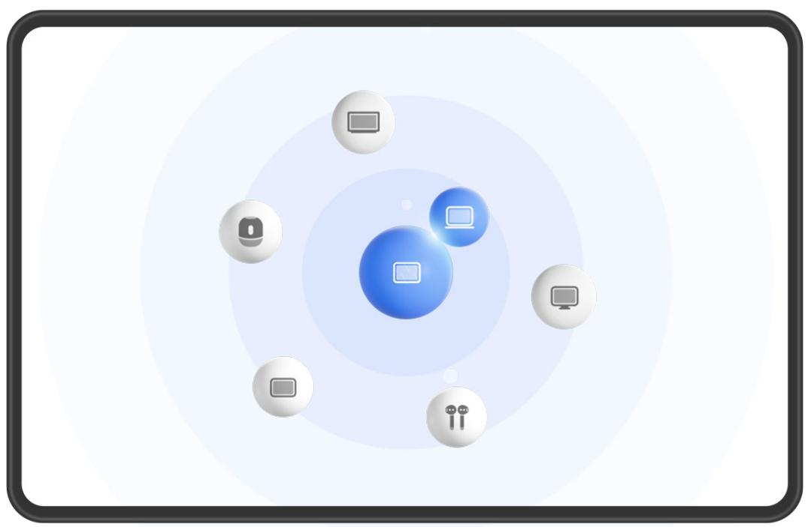

natural_image

Abstract diagram with concentric circles and icons, no text or symbols present

0 配图仅供参考，请以产品实际为准。

# 超级终端使用前设置

使用超级终端前，请在平板上开启蓝牙、WLAN ，并登录华为帐号。

其他待协同设备保持亮屏状态，并进行如下设置：

0 不同产品的超级终端所支持的设备类型可能有差异，请以实际情况为准（前往官网了解支持设备清单）。

• 手机：开启蓝牙、WLAN 。

• 平板：开启蓝牙、WLAN 。

仅支持多机位模式的平板可作为待协同设备，请在相机 > 更多中查看是否支持多机位模式（前往官网了解多机位的支持机型清单）。

• 电脑：开启蓝牙、WLAN，并与平板登录同一华为帐号。

• 智慧屏、显示器：开启蓝牙、WLAN。

• 智能音箱、打印机：与平板接入同一局域网，并通过智慧生活应用绑定到平板所登录的华为帐号。

您可以进入智慧生活首页，点击 > 添加设备，根据界面提示完成绑定。

• 耳机、眼镜：与平板通过蓝牙配对连接。

• 手表、手环：通过运动健康应用绑定到平板所登录的华为帐号。

# 超级终端发现和协同附近设备

# 设备间使用同一华为帐号

使用超级终端前，您可前往官网了解支持设备清单（设备间使用同一华为帐号）。

1 在本机和待协同设备上登录同一华为帐号。

2 在本机控制中心的超级终端中点击待协同设备图标发起默认协同连接。

或点击 ，然后点击待协同设备图标，在菜单中选择需要的协同场景后发起连接。

若设备间存在多种协同场景，协同过程中想切换场景，在超级终端进入 后点击待协同设备图标，在菜单中切换协同场景。

# 设备间使用不同华为帐号

使用超级终端前，您可前往官网了解支持设备清单（设备间使用不同华为帐号）。

1 在待协同设备上完成如下设置：

手机/平板：进入设置 > 超级终端 > 本机 > 允许被发现，选择附近设备。

• 智慧屏：进入设置 > 网络与联接/遥控器与连接，确保多设备协同和投屏开关已开启。

0 使用此功能前，请将智慧屏升级至最新版本。

2 从本机顶部右侧下滑出控制中心，在超级终端中点击

3 点击 ， 选择待绑定设备，根据界面提示完成绑定。

0 若需解绑不同帐号设备，在超级终端中点击 ? ，长按解绑设备点击删除；或进入设置 > 超级终端，在其他已绑定设备中选择解绑设备点击删除。

4 点击待协同设备图标，在菜单中选择需要的协同场景后发起协同连接。

0若设备间存在多种协同场景，协同过程中想切换场景，在超级终端进入 后点击待协同设备图标，在菜单中切换协同场景。

# 将畅连、音乐等流转至待协同设备

当您正在使用平板聆听音乐或与家人进行畅连通话时，通过超级终端可将当前任务一键流转至待协同设备，如：在智慧屏上继续畅连通话等。

text_image

切换为悬浮窗
动态视图
天能摄像头
炫新
拼音
更多
正在通话中...
WLAN
蓝牙
免打扰
载屏
装帧
刷新设定
华为分享
多屏协同
位置信息
飞行模式
计算器
手电脑
护锁模式
录音机
屏幕录制
消息模式
电子书模式
无线视频
扫一扫

0 配图仅供参考，请以产品实际为准。

您可以将：

• 畅连流转至智慧屏。

• 音乐流转至蓝牙耳机、音箱、眼镜、智慧屏（熄屏状态）。

不同产品的超级终端所支持的设备类型和流转任务可能有差异，请以实际情况为准。

1 请参阅超级终端使用前设置完成平板和待协同设备的设置。  
2 从平板顶部右侧下滑出控制中心，在超级终端中点击 搜索附近设备或点击 > 绑定新设备。  
3 在平板上打开待流转应用（如：华为视频、华为音乐等）。  
4 在平板控制中心的超级终端中点击待流转设备图标，根据界面提示完成流转。

或点击 ，拖拽待流转设备至本机，根据界面提示完成流转。

# 在电脑上实现多屏协同

通过超级终端将平板与电脑建立协同连接，在电脑上可浏览、编辑文件，拖拽互传文件，复制粘贴文本，使用键鼠操控平板；在平板上使用手写笔操控电脑等，让协同办公更高效。

1 请参阅超级终端使用前设置完成平板和待协同设备的设置。  
2 在平板控制中心的超级终端中点击待协同电脑图标后发起协同连接。

或点击 ，然后点击待协同电脑图标，在菜单中选择多屏协同。

当您需要断开平板与电脑的协同时，进入平板超级终端，再次点击电脑图标取消协同。

# 多设备移动通信共享

开启此功能，您可使用附近无通信能力的平板共享手机移动网络上网、接听或拨打电话、查看或回复手机接收到的短消息。

text_image

正在使用 梦洁的手机 的网络
刚刚
本次消耗 梦洁的手机 移动流量 0 MB，本月总共消耗 梦洁的手机 移动流量 100 MB。
停止使用
旅行
Travel
08:08 8月8日星期一
已将移动通信能力共享给 梦洁的平板
梦洁的平板 可借助本机移动通信网络进行
上网、接打电话、收发信息。共享网络...
正在共享网络给 梦洁的平板
本月已消耗移动流量 100 MB
去设置

部分产品不支持此功能，请前往官网了解支持此功能的设备清单。

# 共享手机通信能力给其他设备

使用前，请完成如下设置：

• 在手机和平板上同时开启 WLAN、蓝牙开关，并登录同一华为帐号。

共享网络时需删除手机和平板上正在连接的 WLAN。您可进入设置 > WLAN，点击已连接的 WLAN 名称，然后点击删除。

• 在手机和平板上进入设置 > 超级终端 > 多设备移动通信共享，确保电话、信息、网络共享功能的相关开关已开启。

完成以上设置后，请通过以下任一方式完成手机与平板的连接：

• 手动开启通信共享：

1 从平板顶部右侧下滑出控制中心，在超级终端点击 ，然后点击手机图标，在菜单中选择使用该设备的网络、电话、短信。  
2 待附近平板状态栏出现 ，表示连接成功。

• 自动共享通信能力：

1 在平板上进入设置 > 超级终端 > 多设备移动通信共享 > 连接附近我的设备的移动通信网络，选择自动连接。  
2 手机与平板靠近，待平板状态栏出现 ，表示连接成功。

i 目前仅支持设备间一对一通信共享。

# 在其他设备使用手机通信能力

将手机通信能力成功共享给附近无通信能力的平板后，您可以在平板上使用以下功能：

• 电话共享：高清语音来电，手机和平板会同步响铃，您可以就近或按需选择用手机或平板接听，也可以在手机不方便时使用平板接听或拨打电话。  
• 信息共享：可在平板上显示和回复手机侧接收到的信息。例如平板上应用需要短信验证码，无需操作手机可直接在平板上接收验证码。  
• 网络共享：手机需开启移动网络。在户外使用平板浏览网页，无网络可用时，可通过共享手机的移动网络进行上网。  
您可以对共享的移动流量进行限制。进入手机设置 > 超级终端 > 多设备移动通信共享，在每月共享移动流量限制列表中点击自定义完成设置。

i 电话、信息、网络共享功能均可进入设置 > 超级终端 > 多设备移动通信共享单独开启或关闭。

# 跨设备剪贴文本或图片

通过跨设备剪贴板，可在手机和平板之间复制粘贴文本、图片等，方便您用平板创作构思时，用手机搜索需要的内容，直接复制粘贴至平板。

# 启用跨设备剪贴板

1 手机和平板登录同一华为帐号，并接入同一 WLAN 网络。  
2 进入设置 > 超级终端 > 跨设备剪贴板，确保跨设备剪贴板开关已开启。  
3 在手机上复制文本或图片后，可在平板上粘贴此文本或图片，反之亦然。

0 备忘录、邮件、图库、华为浏览器、部分三方应用程序支持，请以实际情况为准。

# 复制粘贴文本或图片

# 复制粘贴文本

1 在一台设备的应用程序（如：备忘录、邮件、华为浏览器）要选择的文字上长按，直至出现。

i 在不同的应用程序中长按文字出来的结果可能不一样。请根据界面提示进行操作。

2 拖动 和 选择文字，或点击全选选择全部文字。

3 根据需要，点击复制或剪切。

4 在另一台设备的应用程序（如：备忘录、邮件）要插入文本的位置长按，点击粘贴。

# 复制粘贴图片

1 在一台设备的应用程序（如：备忘录、邮件）中要选择的图片上长按，点击复制。

或者在图库中选择图片，点击 > 复制到剪贴板。

2 在另一台设备的应用程序（如：备忘录、邮件）中要插入图片的位置长按，点击粘贴。

# 平板投屏

# 将当前应用投屏到大屏

将平板的当前应用单独投屏到大屏设备观看（如：智慧屏），同时您可以在本机操作其他应用，互不影响。

i 应用投屏适用于支持 Cast+/Miracast 协议的大屏设备，请以实际情况为准。

完成应用投屏，请参考以下不同场景操作：

• 若暂未开启投屏，想将正在观看的视频单独投送至大屏，可开启大屏设备，从平板顶部右侧下滑出控制中心，点击无线投屏，根据界面提示将应用单独投送至大屏。  
• 若已处于投屏状态，可在平板上打开想要投屏的应用，点击屏幕顶部投屏中胶囊 ，然后在实况窗中根据界面提示将当前应用单独投送至大屏。

完成投屏后，平板上的投屏应用会缩小为悬浮窗口，点击窗口中的 可将悬浮窗口最小化为悬浮球。若在部分视频类应用（如华为视频、优酷等）中正在观看视频，应用投至大屏后视频将自动全屏播放。

操控投屏应用：点击本机悬浮球展开应用悬浮窗口，您可在悬浮窗口中操控此投屏应用。还可通过调节悬浮窗口中应用的音量来控制大屏上的播放音量。

• 当应用处于分屏或悬浮窗状态时，不支持应用投屏。

• 为了保护您的安全隐私，目前不支持锁屏后继续投屏。

退出应用投屏，通过以下任一方式：

• 点击平板屏幕顶部投屏中胶囊 ，在实况窗中点击 ，切换至镜像投屏，点击 退出无线投屏。  
• 点击本机悬浮球展开应用悬浮窗口，点击悬浮窗口中的 ， 退出应用投屏至镜像投屏。  
• 长按本机悬浮球并拖至屏幕底部 ，退出应用投屏至镜像投屏。

# 多屏协同

# 多屏协同，连接平板和电脑

将平板和华为电脑建立连接，您可以在平板和电脑间自由拖拽内容，灵活共享键鼠，实现双屏操作，让协同办公更高效。

• 部分产品不支持此功能，前往官网了解支持的机型。

• 不同版本的电脑管家功能和操作路径可能有所差异，请以实际情况为准。建议您将电脑管家版本升级到最新，点击 > 检查更新进行升级。

# 连接平板和电脑

您可以选择以下任一方式连接平板和电脑，开启多屏协同：

# 通过电脑管家连接：

1 从平板顶部右侧下滑出控制中心，点亮 WLAN 和蓝牙，且平板处于亮屏状态。  
2 在电脑端打开电脑管家，点击我的设备 > 我的平板 > 立即连接。  
3 将平板靠近电脑，在搜索到的设备列表中选择您的平板。  
4 在平板和电脑端根据屏幕提示完成连接。

# 通过超级终端连接：

1 在电脑上开启 WLAN 和蓝牙，并与平板登录同一华为帐号。  
2 从平板顶部右侧下滑出控制中心，点亮 WLAN 和蓝牙。  
3 在超级终端中点击待协同电脑图标后发起协同连接。或点击 ，点击待协同电脑图标，在菜单中选择多屏协同。

# 通过有线连接：

1 从平板顶部右侧下滑出控制中心，点亮 WLAN 和蓝牙，且平板处于亮屏状态。  
2 使用 USB 数据线连接平板与电脑。  
3 在平板和电脑端根据屏幕提示完成连接。

您可在电脑管家的协同设置界面，点击镜像、扩展或共享任一卡片即可切换成对应的协同模式。其中镜像是首次连接时的默认协同模式。

# 将平板作为电脑的第二块屏幕

平板和电脑建立连接后，平板变身电脑的第二屏幕，扩展电脑的操作空间和方式，共用电脑的键盘鼠标，平板通过触屏（手指/手写笔）实现反控，双屏操作，让您的办公更高效。

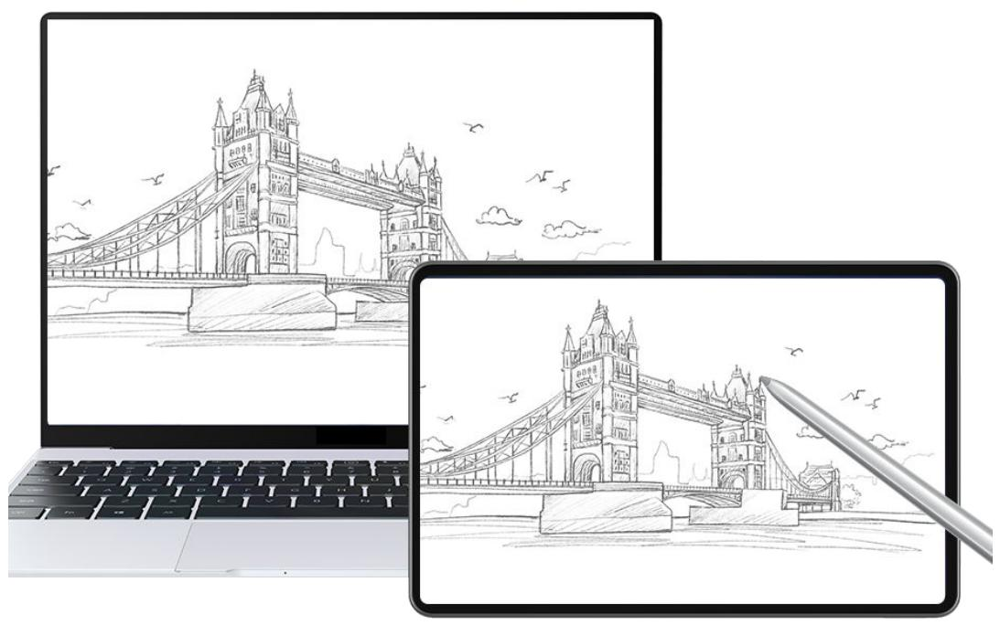

natural_image

Illustration of a detailed view of the Tower Bridge on a laptop keyboard and its corresponding sketched version on a tablet with a stylus (no text or symbols present)

0 配图仅供参考，请以产品实际为准。

1 在电脑端打开电脑管家，点击我的设备 > 我的平板进入协同界面。  
2 选择镜像或扩展，切换成对应的协同模式。

镜像：平板将复制电脑屏幕，二者屏幕内容显示相同并实时同步，您可以在平板上操作电脑上的应用和文件，例如：

打开应用：打开电脑文件管理，查看文件或图片。  
浏览网页：打开电脑浏览器，浏览电脑网页。  
• 如果平板外接了键盘或配对了手写笔，也可以使用外接键盘和手写笔进行绘画创作、文档批注。

扩展：平板将扩展电脑屏幕，二者屏幕内容显示不同，您可以将电脑应用窗口拖至平板上（长按应用窗口顶部横栏即可拖拽），实现一个屏幕查资料，一个屏幕写文案。

# 平板和电脑互传文件

平板和电脑建立连接后，电脑的鼠标键盘可以共享给平板使用，也可以跨平板和电脑拖拽文字、图片或文件等内容，让文件传输更便捷。

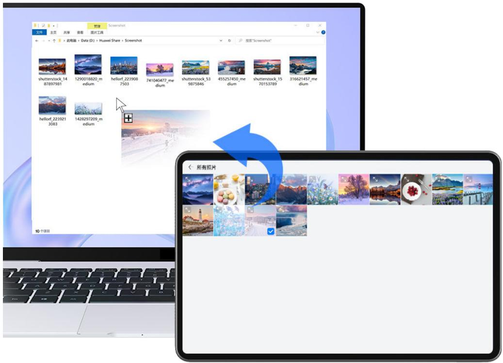

text_image

文件
主页
共享
查看
图片工具
Screenshot
文件
主页
共享
查看
图片工具
此电脑 + Data (D:) > Huawei Share > Screenshot
搜索"Screenshot"
shutterstock_14
87897981
1290018820_m
edium
hellof_223908
7503
741046477_
edium
shutterstock_53
9875846
455257450_
edium
shutterstock_15
70153789
316621457_
edium
hellof_223921
3083
1428297209_
edium
10 个项目
所有照片

0 配图仅供参考，请以产品实际为准。

1 在电脑端打开电脑管家，点击我的设备 > 我的平板进入协同界面。  
2 选择共享，切换成对应的协同模式。  
3 此时电脑的键盘和鼠标共享给平板，您可以使用电脑的键盘鼠标进行如下操作：操作平板上的应用和文件

打开应用：单击鼠标左键，打开平板应用。  
浏览页面：滑动鼠标滚轮，浏览平板网页。  
• 输入文字：使用电脑输入法，直接在平板窗口输入文字。

# 在平板和电脑间快速拖拽互传文件

从电脑到平板：使用鼠标或触控板选中文字、图片或文件等，长按并拖拽至平板。

例如，将电脑图片拖至平板上正在编辑的备忘录中，在平板上继续编辑。

• 从平板到电脑：使用鼠标或触控板选中文字、图片或文件等，长按直至缩略图浮起后再拖拽至电脑。

例如，将平板中的照片或者备忘录中的文本拖至电脑上正在编辑的文档中，在电脑上完成编辑。

0 当目标窗口支持拖入此类文件时，浮窗左上角角标变为加号；如果不支持拖入，则角标变为禁用状态。

# 修改协同设置项

平板和电脑建立连接后，您可以根据需要，修改如下设置项：

屏幕排列：进入电脑管家协同界面，点击协同设置 > 屏幕排列，修改屏幕排列。

例如，选择置于电脑右侧，当您拖拽应用窗口、拖拽文件或共享鼠标时，需要从电脑的右侧边缘拖至平板，从平板的左侧边缘拖至电脑。

显示设置：进入电脑管家协同界面，点击协同设置 > 显示设置，修改平板边栏位置及分辨率设置，长按平板侧边栏图标会出现气泡提示。

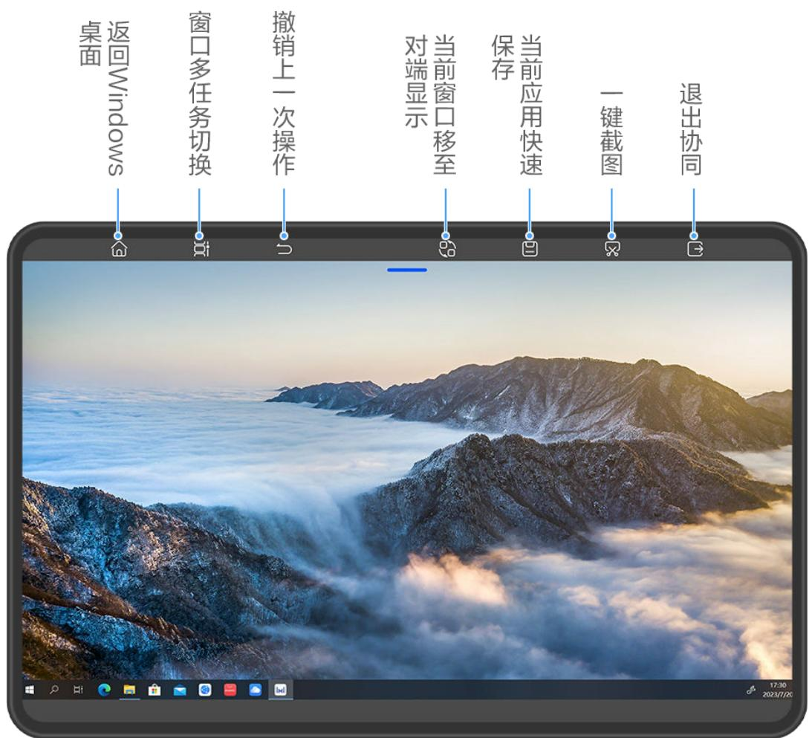

text_image

桌面
返回Windows
窗口多任务切换
撤销上一次操作
对端显示
当前窗口移至
保存
当前应用快速
一键截图
退出协同

i 配图仅供参考，请以产品实际为准。

音频切换：您可以通过以下任一方式选择音频的出声设备：

# 电脑上：

• 进入电脑管家协同界面，点击协同设置 > 音频切换，选择音频出声设备名称。

1• 点击电脑任务栏右下角的 ，进入电脑控制中心，点击多屏协同旁边的三角形图标，选择音频出声设备名称。

# 平板上：

点击平板屏幕顶部协同中胶囊 ，然后点击实况窗空白区域，在弹框中切换音视频播放设备。

i 以上设置项因协同模式而异，若某些设置项置灰，则表示该协同模式不支持修改此设置。

# 断开平板和电脑协同连接

完成多屏协同办公后，根据需要，通过以下任一方式断开连接：

# 电脑上：

• 在电脑端打开电脑管家，点击我的设备 > 我的平板 > 断开连接或我的设备 > 我的平板 > 退出协同。  
• 点击电脑任务栏右下角的 ，进入电脑控制中心，点击多屏协同图标断开连接。

# 平板上：

• 点击平板屏幕顶部协同中胶囊 ，然后在实况窗中点击 。  
• 从平板顶部左侧下滑出通知中心，在多屏协同通知栏里点击 。  
• 从平板顶部右侧下滑出控制中心，在超级终端中点击设备图标。  
• 点击平板侧边栏

# 多屏协同，手机和平板协同连接

将手机和平板建立连接，在平板上镜像显示手机窗口，使用手机应用、拖拽互传、复制粘贴文本、编辑手机文件更高效。

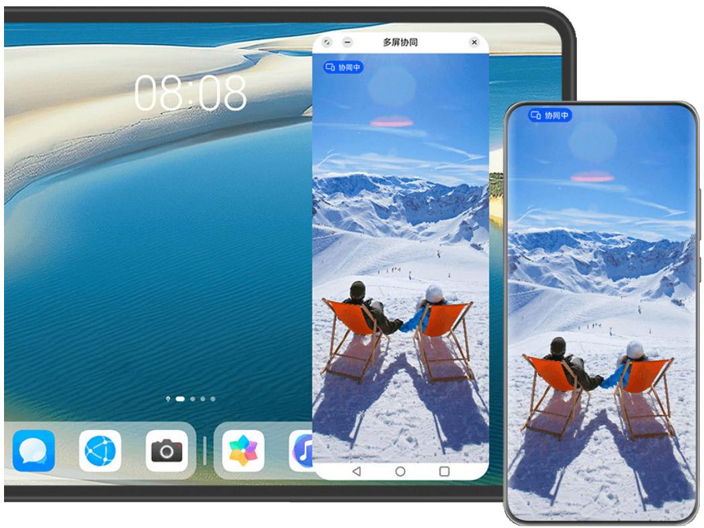

text_image

08:08
多屏协同
协同中
协同中

0 配图仅供参考，请以产品实际为准。

# 连接手机和平板

i 仅部分手机支持此功能，请以实际情况为准。

使用前，请先了解不同手机版本与平板多屏协同的连接方式：

• 若手机系统为 HarmonyOS 5 及以上版本：靠近发现连接、超级终端连接。  
• 若手机系统为 HarmonyOS 4.3 及以下版本：靠近发现连接、扫码连接、超级终端连接。

根据手机实际版本情况选择合适的连接方式：

# 靠近发现连接：

1 从平板顶部右侧下滑出控制中心，点击多屏协同。  
2 从手机顶部右侧下滑出控制中心，点亮蓝牙。  
3 将手机靠近平板，根据手机和平板屏幕弹框提示完成连接。

# 扫码连接：

1 在平板上打开多屏协同，在多屏协同界面点击扫码连接。  
2 手机在联网状态下，根据平板扫码连接界面的提示完成连接。

# 超级终端连接：

1 手机、平板开启蓝牙、WLAN ，并登录同一华为帐号。  
2 在平板超级终端中点击手机图标完成协同连接。  
或点击 ，然后点击手机图标，在菜单中选择多屏协同。

# 在平板上操作手机应用和文件

平板与手机连接后，您可以在平板上操作手机应用和文件，查看手机部分通知消息（如微信、短信），并可以在平板接打手机电话。

当手机屏幕处于解锁状态时，您可以在平板上的手机协同窗口：

• 打开电话，通过手机号码拨打电话。  
• 打开信息，查看和回复手机短信。  
• 打开微信，查看和处理手机微信信息。  
• 打开图库或文件管理，查看和操作手机上的图片、视频或文件，播放视频或音频。  
• 点击手机屏幕顶部协同中胶囊 ，然后点击实况窗空白区域，在弹框中切换音视频播放设备。  
• 如果平板外接了键盘或配对了手写笔，也可以使用外接键盘或手写笔输入文字，快速处理手机上的信息。

# 手机和平板拖拽互传文件

1 打开平板或手机镜像窗口中的图库或文件管理，长按图片、视频或者其他文件，进入多选界面。  
2 选择一个或多个文件，再次长按处于选中状态的文件，待出现拖拽图标后，进行拖拽。

例如您可以：

• 从平板/手机图库、文件管理拖拽图片视频至手机/平板文件管理。  
• 从平板/手机文件管理拖拽其他文件至手机/平板文件管理。  
• 从手机拖拽图片、文本或文件至平板上正在编辑的文档中（Office 文档、备忘录或者邮件等）。

# 手机和平板间音视频切换

手机与平板多屏协同连接后，根据需要，您可以将手机上正在播放的音乐、视频、语音通话、视频通话等声音切换到平板播放，视频通话的摄像头也会同步切换成使用平板摄像头，反之亦然。

手机切换到平板，可使用以下任一方式：

• 点击手机屏幕顶部协同中胶囊 ，然后点击实况窗空白区域，在弹框中音视频切换模块选择平板名称。  
• 从平板顶部左侧下滑出通知中心，点击协同通知中的 ， 然后点击音视频切换到平板。

平板切换到手机，可使用以下任一方式：

• 点击手机屏幕顶部协同中胶囊 ，然后点击实况窗空白区域，在弹框中音视频切换模块选择本机。

从平板顶部左侧下滑出通知中心，点击协同通知中的 ， 然后点击音视频切换到手机。

# 断开手机和平板的连接

完成多屏协同后，通过以下方式断开连接：

在平板上的手机镜像窗口，点击 。

• 点击手机屏幕顶部的协同中胶囊 ，然后在实况窗中点击 。

• 从平板顶部左侧下滑出通知中心，点击协同通知中的断开连接。

• 从手机顶部右侧下滑出控制中心，在超级终端中点击平板图标。

# 华为分享

# 置顶常用的分享方式

当您想分享文件给朋友时，您可提前将系统分享框中的常用的分享方式（如：蓝牙、电子邮件等）置顶，下次分享时可一步直达所需要的分享方式。

1 长按待分享文件，点击 。  
2 在分享应用区，左滑至最后一屏，点击 或全部 > （取决于您的机型）进入编辑置顶界面。  
3 点击待置顶的分享方式。部分应用有多种方式，可根据需要添加。  
4 在置顶区域中，长按并拖动已置顶的分享方式，可排序。点击多余分享方式可删除置顶。完成后点击 或完成（取决于您的机型）。

# 智慧打印

# 使用华为打印轻松打印文件

使用华为打印，平板便能轻松发现周边打印机并一键打印存于平板中的图片、文档等。还支持远程打印，即使不在身边，也能为家里的孩子打印作业。

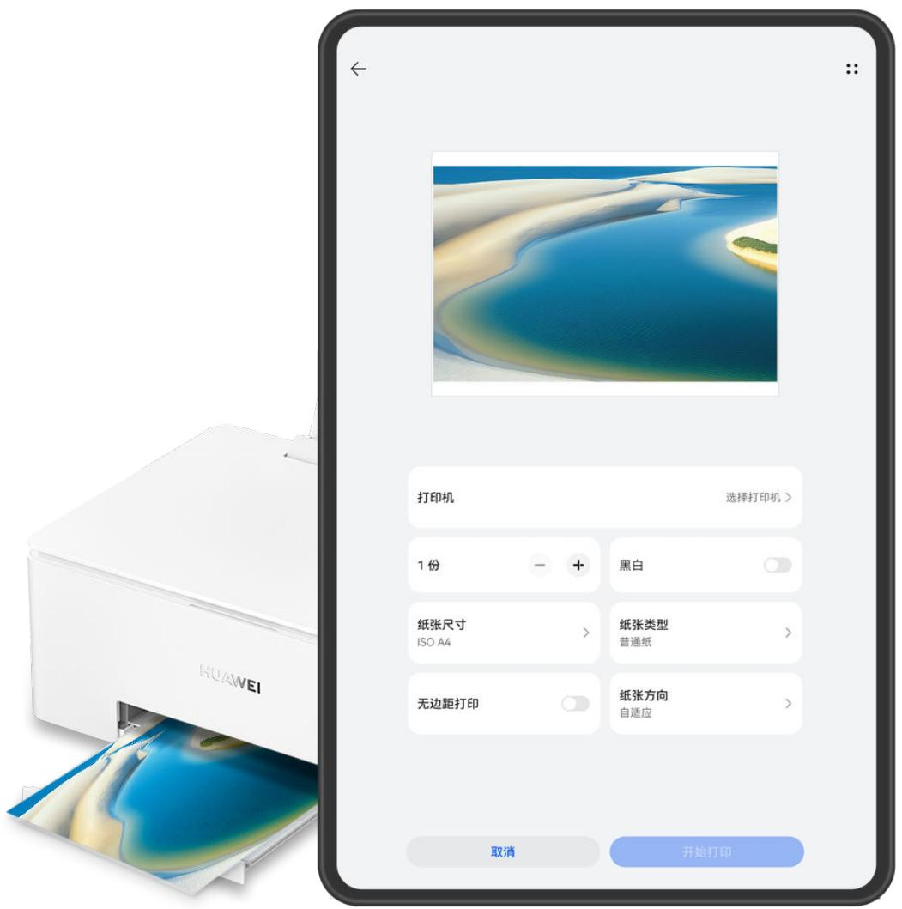

text_image

打印机
选择打印机 >
1份
+
黑白
纸张尺寸
ISO A4
>
纸张类型
普通纸
无边距打印
>
纸张方向
自适应
取消
开始打印

0 配图仅供参考，请以产品实际为准。

# 使用华为打印近场打印

1 在平板上开启 WLAN 开关，并确保打印机与平板接入同一 WLAN 网络，或已开启 WLAN 直连功能。  
2 对平板中不同存储位置的文件，选择以下对应方式进行打印：

• 图库：在图库中打开一张或选择多张图片，点击分享 > ，或点击更多 > 打印或生成PDF。  
备忘录：在备忘录中打开任一笔记，点击更多 > 打印。  
• 文件管理：在文件管理中选择一个或多个文件，点击分享 > 打印。

不同版本的应用操作路径可能有所差异，请以实际为准。

3 点击选择打印机进入打印机列表，选择合适的打印机，然后在预览界面调整份数、色彩、纸张尺寸等参数，点击开始打印。

若非首次使用华为打印，打印时会自动连接上次使用过的打印机，无需再手动选择。

打印开始后，平板界面会出现打印胶囊 。打印过程中若需要添加打印任务，可打开待打印图片、文档等，然后点击打印胶囊 ，在实况窗中点击 即可将打印任务加入排队。

0 若连接的是华为打印机，建议您在打印预览界面点击更多选项下载打印插件，体验更多打印功能。

# 使用华为打印远程打印

若您使用的是华为打印机，便能将平板中的文件通过华为打印功能完成远程打印，快捷方便。

1 通过平板智慧生活应用添加打印机。  
2 当身处异地时，可参考：使用华为打印近场打印的操作方式远程打印文件。

# 使用超级打印快速打印文件

将打印机加入超级终端，与平板捏合后即可保持实时连接，一点即可打印图片、文档、笔记、网页等多种内容，有效简化多文件打印的繁琐步骤，让打印更快更方便。

i 超级打印目前仅部分华为打印机支持，详情请咨询华为客服。

text_image

1/3
2023年8月8日
06:08
HUAWEI
TYME

0 配图仅供参考，请以产品实际为准。  
1 通过平板智慧生活应用给打印机配置网络，使打印机和平板接入同一局域网。

2 从平板顶部右侧下滑出控制中心，在超级终端中点击打印机名称或点击 ，拖拽打印机至平板，调出打印胶囊 。

打印前若要根据不同打印内容设置打印参数，可点击打印胶囊 ，在实况窗中点击空白区域，然后在弹框中进行设置。设置完成后继续以下操作：

• 打印图片：在图库中打开单张图片或同时选中多张图片。  
打印文档：用 WPS Office 打开需要打印的文档。  
打印笔记：在备忘录中打开需要打印的笔记。  
打印网页：在平板自带浏览器中打开需要打印的网页。

点击打印胶囊 在实况窗中点击 开始打印。

3 完成打印后，点击打印胶囊 ，在实况窗中点击 断开连接。

• 打印过程中若需要查看打印状态及列表，可点击打印胶囊 ，在实况窗中点击空白区域调出打印任务弹框查看。  
• 打印过程中若想取消打印任务，可在调出的打印任务弹框中点击打印任务尾部的 。

# 相机图库

# 拍摄照片

拍照   
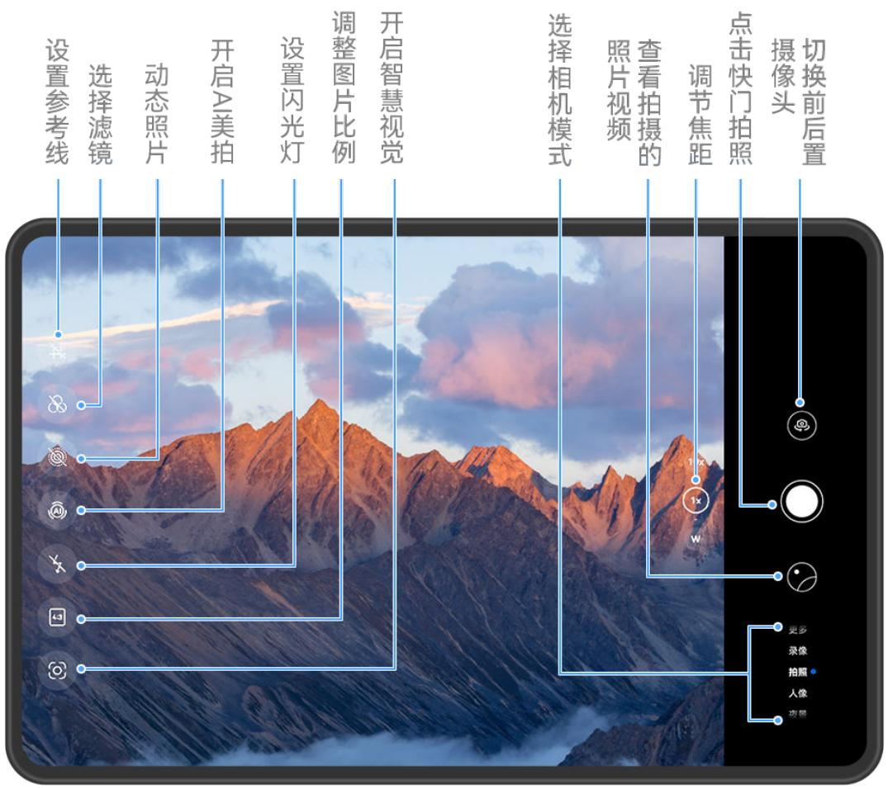

text_image

设置参考线
选择滤镜
动态照片
开启≥美拍
设置闪光灯
调整图片比例
开启智慧视觉
选择相机模式
查看拍摄的
照片视频
调节焦距
点击快门拍照
摄像头
切换前后置
更多
录像
拍照
人像
背景

0 配图仅供参考，请以产品实际为准。

1 打开相机。   
2 您可以进行以下操作：

对焦：轻触屏幕中想要重点突出的位置。

若要分离对焦点和测光点，可在取景框中长按，待对焦框和测光框同时出现时，分别拖动到需要的位置。

调节画面明暗：轻触屏幕，上下滑动对焦框旁的 $\therefore \dot { 0 } _ { 5 } ^ { 2 }$ 。  
• 放大或缩小画面：在屏幕上，双指张开/捏合，或滑动屏幕旁的变焦环，放大/缩小画面。  
选择相机模式：在相机模式区域，左右或上下滑动，选择一种模式。  
• 打开或关闭闪光灯：点击 ，选择 （自动）、 （开）、 （关）或 （常亮）。

当选择了 $l _ { Z A }$ （自动）时，若相机检测到您处于较暗的环境，取景框将出现闪光灯提示，拍摄时自动开启闪光灯。

并非所有模式支持以上操作，请以实际情况为准。

# 3 点击快门拍摄。

# 调节相机焦距

拍摄时，您可调节相机焦距，放大或缩小取景画面。

1 打开相机，选择一种模式。  
2 在取景框中，通过以下任一方式实现变焦：

在取景框中张开/捏合双指，调节焦距。  
点击变焦环上显示的快捷变焦倍数，快速切换焦距。  
按住变焦环，在展开的变焦区域中，左右（竖屏时）或上下（横屏时）滑动，使目标变焦倍数与中心点重合。松手后，该区域将同时显示变焦环与快捷变焦倍数，方便您快速切换。例如您想拍摄较远的风景，需要从 1x 变焦调整为 5x 时，可按住变焦环，向左（竖屏时）或向下（横屏时）滑动，直至变焦环上的 5x 与中心点重合；您也可点击需要的快捷变焦倍数，直接切换。

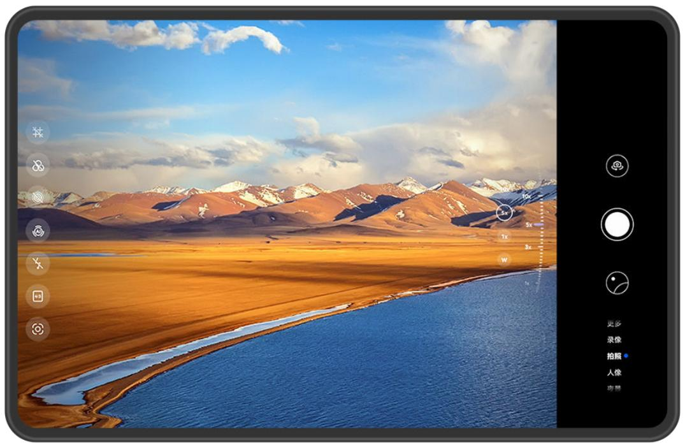

natural_image

Aerial view of a vast desert landscape with snow-capped mountains and blue water, captured via smartphone camera interface (no text or symbols on the landscape itself)

• 配图仅供参考，请以产品实际为准。

• 并非所有相机模式都支持调节变焦，不同机型支持的变焦倍数可能存在差异，请以实际情况为准。

# 使用悬浮快门键拍摄

使用相机时，您可以开启悬浮快门，将悬浮快门键拖动到惯用的位置，方便拍摄。

1 进入相机 > ，开启悬浮快门键开关。  
2 开启后，取景框中会出现悬浮快门键，按住悬浮快门键并拖动，可以将其移动到您要的位置。  
3 点击悬浮快门键开始拍摄。

# 设置定时拍照

开启定时拍照，只需定好取景画面，按下快门，相机将在倒计时结束后自动拍摄。

1 进入相机 > > 定时拍摄，选择需要的定时时长。  
2 回到拍摄界面，点击快门，平板将在倒计时结束后自动拍摄。

# 使用声控拍照

无需手动点击快门，说出拍照口令，即可拍照。

1 进入相机 > > 声控拍照，选择需要的拍照口令。  
2 回到拍照界面，说出设置的口令拍照。

# 录制视频

# 拍摄视频

1 打开相机，选择录像模式。  
2 您可以执行以下任一操作，为拍摄做准备：

• 放大或缩小：在屏幕上双指张开/捏合，或滑动变焦环以放大或缩小。  
对焦：轻触屏幕中想要重点突出的位置。在屏幕中长按，可锁定曝光和对焦。

• 打开或关闭闪光灯：点击 ，选择闪光灯为 （常亮）或 （关闭）。

当使用前置摄像头录像时，在光线不足的情况下，您可以选择闪光灯为 0 （常亮）。开启后，相机会为您进行补光，帮您提升面部亮度。

调节美颜效果：点击 ，滑动调节美肤效果。  
• 调整视频分辨率和帧率：进入 > 视频分辨率，选择所需分辨率。分辨率越高，视频越清晰，最后生成的视频文件越大，请根据实际需要选择。

您还可以点击 > 视频帧率，选择需要的帧率，帧率越高，视频越流畅。

选择节约空间的视频格式：点击 ，打开高效视频格式开关。 i

开启该开关后，平板会采用更高效的视频格式，帮您节约存储空间。但其他设备可能无法播放此格式视频，请根据实际需要选择。

并非所有产品支持以上所有功能，部分设置项会随着其他设置项的调节而变化，请以实际情况为准。

3 点击 开始拍摄。

点击 可拍下当前画面。

4 点击 暂停拍摄，点击 结束拍摄。

# 拍摄 4K 高清视频

您的平板支持录制 4K 分辨率的高清视频，为您带来更清晰的视频体验。

1 打开相机，选择录像模式。

2 点击 > 视频分辨率，选择 4K 分辨率。

4K 分辨率下不支持使用美颜、滤镜和视频特效拍摄，当您选择 4K 分辨率时，平板将自动关闭这些功能。

3 回到录像界面，点击 录制视频。

0 分辨率越高，视频越清晰，占用的存储空间也越大，请根据实际需要选择。

# 延时摄影

# 拍摄延时摄影短片

使用延时摄影，可将连续几分钟、几小时的视频压缩成一段快速播放的短片，记录下花蕾绽放、云卷云舒等变化过程。

1 进入相机 > 更多，选择延时摄影模式。

2 在要拍摄的位置放置好平板。为减小拍照过程中的抖动，建议您使用三脚架固定平板。

3 点击 开始拍摄，点击 结束拍摄。

拍摄完成后，您可以在图库中查看生成的延时摄影短片。

# 相机设置

# 调整相机设置

根据使用习惯调整相机设置，可以让您更快捷地拍摄。

进入相机，点击 ，选择需要的设置。

i 并非所有模式支持以下设置，请以实际情况为准。

# 调整照片比例

进入相机 > > 照片比例，选择需要的照片比例。

i 部分模式下无法调整照片比例，请以平板实际功能为准。

# 开启地理定位

当已启用平板定位服务后，您可以在相机 > 中开启记录地理位置信息开关。开启后，拍摄的照片和视频会带有地理位置信息。

您可以在图库中，点击这些照片或视频后上滑，查看照片和视频的地理位置。

如未开启平板定位服务，请通过以下任一方式开启：

• 从平板顶部右侧下滑出控制中心，点亮位置信息。

• 进入设置 > 隐私 > 定位服务，打开访问我的位置信息开关。

# 使用参考线辅助拍照

使用参考线辅助取景，可以帮您更好地构图。

1 开启参考线开关，开启参考线后，取景框将出现九宫格参考线。

2 将拍摄主体放在交叉点上，点击快门拍摄。

# 开启或关闭自拍镜像

使用前置摄像头自拍时，进入 ，开启或者关闭自拍镜像。

开启自拍镜像时，所拍图片与真实场景相反，与拍照预览一致。

关闭自拍镜像时，所拍图片与真实场景相同，与拍照预览相反。

# 静音拍照

根据需要，开启或者关闭拍摄静音开关。开启后，拍照和录像时会关闭快门音。

0 此功能只有部分国家和地区支持，请以实际情况为准。

# 自动抓拍笑脸

开启笑脸抓拍开关。拍照时，相机检测到取景框内出现笑脸时，将自动抓拍。

# 使用水平仪辅助构图

开启水平仪开关，开启后，取景界面将出现水平辅助线。

当水平辅助线的虚线与实线重合时，表明平板处于水平位置，帮您避免因平板不正导致的构图倾斜。

# 恢复相机默认值

平板相机出厂时预置了参数，如您手动调整了参数，您可恢复默认值，将参数还原初始化。

在 中，点击恢复默认值。

恢复后，部分参数将被恢复到初始状态，如 ISO、白平衡、曝光补偿等，请按需选择。

# 自定义相机模式

您可以自定义相机模式，将常用的模式移动到相机主界面，或调整模式顺序，让模式布局更符合您的使用习惯。

拍照、录像、人像（或美肤）模式不支持移动到更多中，请以实际情况为准。

1 进入相机 > 更多，点击 进入模式编辑界面。

2 长按某个模式，拖动到要放置的位置。您可以将更多中的模式移动到相机主界面，或将主界面中的模式移动到更多中，或按使用频率调整布局。

部分可删除的模式上会显示 图标，点击 可删除。

3 点击 保存布局。

若要恢复已删除的模式，在相机 > 更多中点击 ，然后点击添加恢复模式。

# 管理图库

# 图片对比

如您有多张类似的图片，您可使用对比功能，多张图片同屏显示，还可将图片同步缩放比较细节，方便您快速挑选出满意的一张。

• 部分图片格式不支持对比，请以实际情况为准。

• 使用该功能前，请将您的设备升级到最新版本。

1 进入图库，在照片或相册页签，长按勾选要对比的图片，点击 。

2 进入对比界面后，您可以：

调整图片显示：在单张图片上，双指张开或捏合，放大或缩小；单指按住图片移动，调整显示范围。平板默认开启同步缩放功能，当您在单张图片上调整时，对比界面中的所有图片都会同步变化。如需取消同步，点击 。   
收藏选中图片：点击要收藏图片下方的 。  
删除图片：点击要删除图片下方的 。  
• 更换对比图片：在下方列表中点击已选择的图片，取消对比；点击未选择的图片，增加对比。  
• 重新选择图片：点击左下角的 ，勾选或取消选中图片，然后点击完成。

# 在图库中快速搜索

# 在图库中快速搜索图片

在图库搜索栏中输入时间、事物等关键词，可以快速搜图。

1 进入图库，点击屏幕顶端的搜索栏，选择推荐的关键词或输入关键词（如“美食”、“风景”等）进行查找。

若要搜索聊天截图，还可输入对话中的关键词。

部分产品不支持搜索聊天截图关键词，请以实际为准。

2 图库会为您呈现相关的图片，并推荐更多关键词。点击推荐的关键词，或继续输入关键词，可进行更精确的搜索。

# 在图库中快速搜索视频

当熄屏充电时，平板会自动分析和分类图库中的本地视频，并在搜索栏中为您推荐关键词，方便您在图库中快速查找视频。

1 进入图库，点击屏幕顶端的搜索栏，选择推荐的关键词或输入关键词（如“美食”、“风景”等）进行查找。  
2 图库会为您呈现相关的视频，并推荐更多关键词。点击推荐的关键词，或继续输入关键词，可进行更精确的搜索。

在搜索结果中的视频会自动轮播关键片段，方便您快速预览确认。

截屏录屏中的视频不会被分析并生成关键词，请以实际为准。

# 整理相册

当图片和视频比较多时，您可以通过相册管理图片和视频，方便查看。

# 新建相册

1 进入图库 > 相册。  
2 点击 ，输入新相册名称，然后点击确定。  
3 选择要添加到相册的图片或视频，将所选文件移动或复制至新相册中。

# 给相册排序

1 进入图库 > 相册 > ，点击相册排序。  
2 长按并拖动相册旁的 进行排序。

点击恢复默认排序或 > 恢复默认排序，可重置相册为默认排序。

# 调整相册显示风格

进入图库 > 相册，点击顶端的 $\mathsf { \Pi } _ { \infty } ^ { \mathsf { O } \mathsf { O } } \varXi \varXi ^ { \bigotimes }$ ，选择喜欢的相册显示风格。

# 更改相册封面

1 进入图库 > 相册，点击要设置的相册。

2 点击 > 更换相册封面，选择喜欢的相册封面。

# 移动图片和视频

1 点击一个相册，长按勾选要移动的图片或视频。  
2 点击 > 移动到相册，选择要移入的相册。  
3 移动完成后，原相册中将不再保留已移出的文件。

所有照片相册聚合了图库的全部图片，将图片移动到其他相册，仍会在所有照片中显示。（隐藏、屏蔽、删除的图片除外）。

# 删除图片和视频

长按勾选要删除的图片、视频或相册，然后点击删除 > 删除。

部分系统预置的相册无法删除，如所有照片、我的收藏、视频和相机等。

删除的图片和视频会在最近删除相册中保留一段时间，超过该时间后会被永久删除。

若要在保留期内永久删除图片或视频，请在最近删除中长按勾选要删除的图片或视频，根据提示删除。

# 恢复删除的图片和视频

在最近删除相册中，长按勾选要恢复的图片或视频，点击 ，图片或视频将恢复到原来的相册中。

若原相册被删除，平板会为您重新创建该相册。

# 收藏图片和视频

点击要收藏的图片或视频，然后点击 。

收藏后，原相册中的文件不会被移动，收藏后的图片和视频会呈现在我的收藏相册中，方便您查看。

# 屏蔽相册

若您不想让某些第三方应用相册在图库中显示，您可以屏蔽这些相册。

1 在其他相册列表中，点击要屏蔽的相册。  
2 点击 > 屏蔽此相册。

已屏蔽的相册无法在其他应用中查看（文件管理除外）。

3 若要解除屏蔽，在其他相册列表中，点击查看已屏蔽相册，然后点击相册旁的取消屏蔽。

0 仅其他相册中的部分相册可被屏蔽，已开启云同步的相册无法屏蔽，请以平板实际情况为准。

# 在图库中隐藏图片、视频或相册

您可以在图库中隐藏隐私图片、视频，或某个相册。

进入图库 > 相册，您可以：

• 隐藏图片/视频：点开某个相册，长按勾选要隐藏的图片或视频，然后点击 > 隐藏 > 确定。  
• 隐藏相册：点开要隐藏的相册，然后在相册中点击 > 隐藏该相册 > 确定。   
• 查看隐藏内容：在相册页签，点击 > 隐藏相册。

在隐藏相册中，您可切换显示视图，方便按不同维度查看。点击 ，选择切换图片视图或切换相册视图。

• 设置相册锁：在隐藏相册中，您可点击 > 开启相册锁，验证锁屏密码后开启相册锁。如您的平板支持指纹或人脸功能并已录入，您可根据提示关联，后续通过指纹或人脸识别验证进入。  
• 取消相册隐藏：在隐藏相册中，点击要取消的相册，然后在相册中点击 > 取消隐藏。  
• 取消图片或视频的隐藏：在隐藏相册中，点击 > 切换图片视图，长按勾选图片或视频，然后点击取消隐藏。取消隐藏后，图片和视频将恢复到原相册中。

# 编辑图片与视频

# 编辑图片

使用图库的编辑功能，您可以对图片实现自定义编辑。

# 基本图片编辑

1 打开图库，点击一张要编辑的图片，然后点击 ， 您可以实现以下操作。

修剪和旋转图片：点击修剪，然后点击一个修剪框，拖动网格工具选框或边角，选择保留的部分。您可以在修剪框中拖动图片，或双指开合进行缩放，调整图片的显示部分。若要旋转图片，在修剪中，滑动角度滑条，自定义图片的旋转角度。

若要固定旋转或镜像翻转图片，点击 或 。

调节图片效果：点击调节，调节图片的亮度、对比度、饱和度等参数。  
添加滤镜效果：点击滤镜，选择滤镜效果。  
其他图片编辑：根据需要，还可实现涂鸦图片、为图片添加标注等操作。

使用调节、滤镜等编辑后，您可以点击对比，查看编辑前后的效果对比。部分编辑模式不支持对比，请以实际情况为准。

2 点击 或 保 存编辑。

# 给图片添加水印

1 在图库中，点击要编辑的图片，然后点击 > 水印，进入水印编辑。

2 选择要添加的水印，将水印拖动到合适的位置。按住水印边角上的圆点拖动，可放大或缩小水印。点击 $\times$ 可删除水印。

部分水印文字可编辑（可编辑的区域将显示虚线），点击虚线区域，输入内容。

3 点击 保存当前编辑，点击 □ 保存图片。

# 给图片添加马赛克

1 在图库中，点击要编辑的图片，然后点击 > 马赛克，进入马赛克编辑界面。  
2 选择马赛克样式和粗细，在图片上涂抹。  
3 若要擦除已添加的马赛克，点击 后擦除。  
4 点击 保存当前编辑，点击 保存图片。

# 重命名图片

1 在图库中，点击要重命名的图片。  
2 点击 > 重命名，输入该图片的新名称。  
3 点击确定。

# 拼图

您可以使用拼图功能，将图库中的多张图片快速拼接成一张，方便分享。

1 您可以通过以下方式进入拼图（取决于您的机型）：

在图库发现页签，点击拼图创作，勾选要拼接的图片，点击开始制作。  
在照片或相册页签，长按勾选要拼接的图片，点击 > 拼图。

2 选择一个拼图模板，您可以：

调整图片位置：长按要调整的图片，将其拖动到想要的位置进行交换。  
• 调整图片显示部分：点击要调整的图片，拖动图片或双指开合，调整图片的显示部分。

• 旋转图片：点击要调整的图片，然后点击 或 进行旋转或镜像翻转。

• 添加或删除边框：拼图默认在图片之间和外沿显示边框，如您不需要边框，点击边框可删除。

3 点击 $\boxed { \underline { { \underline { { \mathbf { U } } } } } }$ 保存拼图效果。

您可以在相册 > 拼图中查看拼图。

0如在图库发现页签未找到拼图创作，请在图库右上角点击 > 设置，打开图库扩展服务开关。

# 为图片添加相框

1 在图库中，点击要编辑的图片，然后点击 相框。  
2 选择喜欢的相框后，点击 ，根据提示保存图片。

# 时刻

# 时刻

当您在假日、生日、聚会等场景，拍摄了较多的照片、视频后，图库会根据时间、主题或场景，自动聚合精华照片视频，生成时刻相册。

生成时刻相册需满足以下条件：

• 拍摄前，进入相机 > ，打开记录地理位置信息开关。平板会根据照片、视频的拍摄时间和地理位置信息合成时刻相册。  
• 拍摄时，需在同一场景下的不同时间点，拍摄多张内容不同的照片。若同一场景下照片数量太少，或拍摄时间相近/内容相同，平板将不会自动生成时刻相册。  
• 请确认平板已接入网络，并在图库设置界面，打开开启图库网络连接开关。  
• 拍摄后，当平板连接到 WLAN 网络，并处于熄屏充电状态，且电量充足时，平板将自动分析创建时刻相册。该过程需要一定时间，请耐心等待。

# 查看时刻视频

1 进入图库 > 时刻，选择一个时刻相册。

2 点击相册顶部视频封面的 ，播放时刻视频。

# 编辑时刻视频

1 点击 播放时刻视频。  
2 在播放界面点击 ，选择喜欢的主题模板，确认后，点击 。  
3 点击 ，导出视频。

# 更改时刻相册封面

1 在时刻中，选择一个时刻相册。  
2 点击 > 更换封面，选择一张图片，然后点击 。

# 添加、移除时刻中的图片或视频

1 在时刻中，选择一个时刻相册。  
2 您可以执行以下任一操作：

添加图片或视频：点击 ，按提示勾选并添加图片或视频。  
• 移除图片或视频：长按勾选时刻相册内要移除的图片或视频，点击 ，然后点击移出。

# 分享时刻

您可分享时刻视频、长图或封面。

# 分享时刻视频

1 如编辑并导出了时刻视频，导出的时刻视频会保存在图库 > 相册 > 视频编辑中。  
2 在视频编辑中长按勾选视频，然后点击 $\ l _ { 0 }$ 分享。

# 分享时刻长图或封面

点击要分享的时刻相册，然后点击 ，您可选择分享为长图或分享为封面：

• 选择分享为长图：平板会生成时刻长图，您可按提示分享。  
• 选择分享为封面：平板会将该时刻封面生成一张图片（包括封面图和文字），您可按提示分享。

生成的时刻长图和封面图默认保存在图库 > 相册 > 拼图中，您也可以在该相册中分享。

# 重命名时刻相册

1 在时刻中，选择一个时刻相册。  
2 点击 > 重命名，然后输入新的相册名。

# 删除时刻

1 在时刻中，选择一个时刻相册。  
2 点击 > 删除，然后点击删除。

删除某个时刻后，该时刻将无法恢复，时刻相册中的图片和视频仍将保留在图库中。

# 应用

# 日历

# 添加和管理重要日

将过去或将来有特殊意义的日子添加为重要日，正数日或倒数日提醒，让每天都充满期待。您还可以添加重要日卡片到平板桌面，卡片背景支持设置为图库中的图片，定制您的专属重要日卡片。

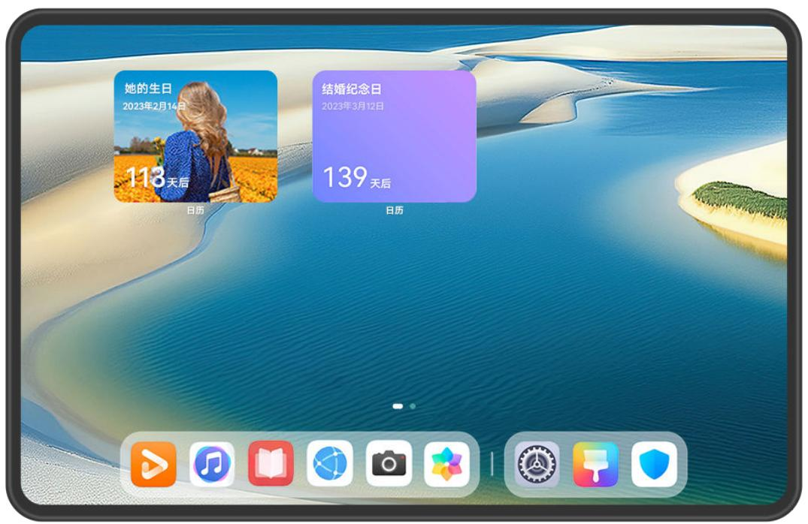

text_image

她的生日
2023年2月14日
118天后
日历
结婚纪念日
2023年3月12日
139天后
日历

0 配图仅供参考，请以产品实际为准。

# 添加重要日卡片

1 进入日历，点击 重要日。   
2 输入重要日名称，选择日期、计时方式（正数日或倒数日），并开启添加卡片到桌面。若需要将日期显示农历，选择日期时勾选显示农历即可。若未出现显示农历选项，请从桌面进入设置 > 系统和更新 > 语言和输入法 > 语言和地区，将当前地区设置为中国后再次尝试。  
3 点击 选择重复提醒方式。点击 设置提醒时间。点击 为重要日添加相关附件。若计时方式选择正数日，则无法设置提醒。  
4 点击 ，然后对重要日卡片样式完成编辑，点击应用。

添加成功后，在日历月视图下会显示重要日列表，同时会在桌面生成重要日卡片。

i 添加重要日过程中若关闭添加卡片到桌面，则不会在桌面自动生成重要日卡片。

# 分享、编辑或删除重要日

在日历月视图下的重要日列表中点击重要日名称或在桌面点击相应的重要日卡片，进入重要日详情页。您可以：

• 点击 ，可将重要日以日历文件 (VCS)或文本格式分享。  
• 点击 ，可重新编辑重要日名称、日期、提醒方式、附件等。  
• 点击 ，可根据界面提示删除此重要日。

# 管理重要日卡片

添加重要日卡片到桌面后，您可根据需要对卡片重新编辑或移除。

长按重要日卡片，您可以：

• 点击编辑，可重新选择此卡片要呈现的重要日，同时还可重新编辑卡片的背景、版式等。  
• 点击更多服务卡片，可选择添加其他样式的重要日卡片到桌面。  
• 点击移除，可根据界面提示移除此重要日卡片。

# 备忘录

# 创建和编写备忘录笔记

使用备忘录可以帮您快速留住一闪而过的想法和灵感。还可以使用核对清单、图片、网页链接等多种形式让笔记内容更详细、丰富。

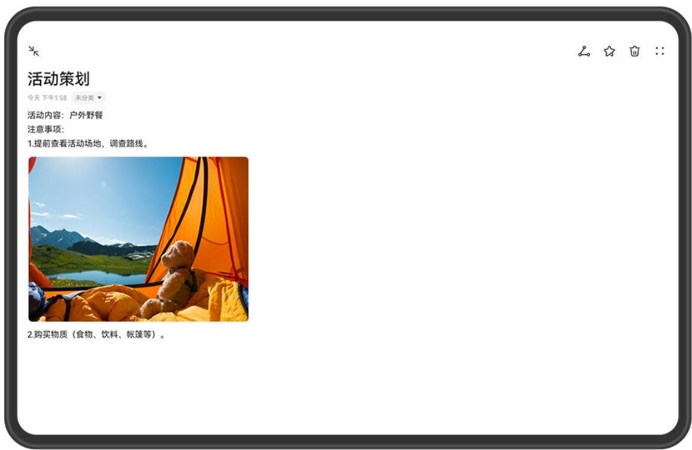

text_image

活动策划
今天 下午1:58 未分类 ▼
活动内容：户外野餐
注意事项：
1.提前查看活动场地，调查路线。
2.购买物质（食物、饮料、帐篷等）。

0 配图仅供参考，请以产品实际为准。

# 创建新笔记

1 进入备忘录 > 笔记，点击 ， 输入标题和内容。  
3 完成编辑后，点击 保存笔记。

2 若需要更改文字样式、内容排版等，可在屏幕下方编辑工具栏查找相应功能。

# 添加核对清单

将工作内容、购买物品等添加为核对清单，完成后可勾选标注，让工作、生活井井有条。

在备忘录中创建笔记时，点击 可执行以下操作：

• 将项目添加到清单：在空心圆圈后输入文本，换行输入下一项。  
• 将项目标记为完成：点击项目旁边的空心圆圈可将此项目划掉，重新点击可取消划线。

# 添加图片、视频等到笔记

1 在备忘录中创建笔记时，您可以根据需要进行以下操作：

点击 ， 选择拍照或从图库中选择插入图片。长按拖动可调整图片在笔记中的位置。  
点击 ，选择文档、音频、视频或更多文件插入附件。长按拖动可调整附件在笔记中的位置，点击附件可直接预览。

2 编辑完成后，点击 保存笔记。

0 长按笔记中插入的附件可进行复制、删除、保存和分享等操作。

# 分享网页内容到笔记

可将网页或网页中选中的文字等直接分享到备忘录快速创建笔记。在笔记中点击添加的网页链接可跳回网页查看详情。

i 并非所有应用都支持分享操作，请以实际为准。

1 浏览网页时，选中要分享的内容（如网页、网页中的文字等）。  
2 点击分享按钮，选择备忘录。  
3 按照界面提示，将分享内容等添加到现有笔记或创建为新笔记。

# 应用间拖拽创建笔记

您可以从华为浏览器、文件管理等应用中将文本、图片或文件拖拽至备忘录笔记中，也可以在备忘录笔记间混合选中多种类型（如文字、图片、音视频或文档等），一次性拖拽，快速创建笔记。

0 并非所有应用都支持拖拽，请以实际情况为准。

1 进入备忘录 > 笔记，点击 +  
2 根据需要，您可以从指定应用中选择并拖拽想要记录的内容到备忘录笔记中：

• 从其他应用拖拽：分屏或悬浮窗打开文件管理，选中文字、图片或文件，长按可将其拖拽至指定笔记中。  
• 在备忘录笔记间拖拽：分屏或悬浮窗打开另一备忘录笔记，同时选中文字、图片、音视频或文档等多种类型，长按可将其一次性拖拽至指定笔记中。

3 在笔记内部，您也可以混合选中多种类型，长按并拖动可调整在笔记中的位置。

4 点击 保存笔记。

# 创建待办事项

创建待办事项用于跟踪日常购物清单、工作项目、家务琐事以及任何想要跟踪的事项。

# 创建待办并设置提醒

将计划要做的事情记录在待办事项中，并设置在具体时间或者位置提醒您完成待办。

1 进入备忘录 > 待办，点击

2 输入待办事项。您也可以点击 录入语音待办，点击 结束录音，语音内容会自动转换为文字显示。

部分产品不支持语音输入，请以实际情况为准。

3 根据需要设置待办提醒方式。

• 指定时间提醒：点击 ，设置计划提醒时间后点击确定，点击 ，设置重复提醒方式（如每天、每周、每月、每年等）。平板会按照指定周期在指定时间自动发出待办提醒。  
• 指定地点提醒：点击 ，输入地址或在地图上长按选择位置，选择有效期、指定位置范围后点击 。当您经过指定位置时，平板会自动发出待办提醒。

部分产品不支持指定提醒位置，请以实际情况为准。

4 点击 设置重要提醒。如果您设置了重要提醒，锁屏时会全屏提醒您完成待办事项。

5 点击保存。

# 在备忘录中涂鸦或书写

将想法或灵感用手绘涂鸦或书写的方式记录在笔记中，让笔记更生动，内容更丰富。

1 进入备忘录 > 笔记，点击 0

2 参考以下操作，手绘或书写需要记录的内容：

点 击 ，选择画笔颜色。

• 点击 或 （取决于您的机型），选择笔尖粗细等。

• 点击 ，可手动擦除部分涂鸦或手写，再次点击 ，选择清空，一键清空所有手绘或书写内容。  
• 点击 ，选择笔记背景。  
点击 ，显示横线样式。  
• 如果您的设备支持并连接了手写笔，点击 ，可屏蔽手指涂鸦或书写，仅能使用手写笔编辑。

并非所有产品均支持以上功能，请以实际情况为准。

3 编辑完成后，点击 保存笔记。

# 扫描文档或卡证

在备忘录中，您可以使用相机扫描图片或文档创建笔记。还可以快速扫描身份证、银行卡等证件将其收藏在备忘录中备用，同时可添加水印防止被盗用。

# 扫描文档创建笔记

1 进入备忘录 > 笔记，点击 > 文档扫描。  
2 将镜头对准要扫描的图片、文档，点击 单张或连续扫描。  
3 点击提取文字 > 保存，选择保存图片和文字或仅保存文字，然后点击 。

0 若您的平板中无此菜单，则不支持该功能。请以实际情况为准。

# 扫描卡证收藏备用

1 进入备忘录 > 笔记，点击 > 卡证收藏。  
2 将镜头对准要扫描的证件，点击 单张或连续扫描。点击 ，预览扫描结果。  
3（可选）如果需要对照片进行调整，可点击左上角 返回扫描界面，点击缩略图后手动校正，然后点击 ，预览扫描件。  
4（可选）如果需要为扫描件添加水印，点击全屏水印或文字水印。  
5 点击 ，选择移动到“我的卡证”或添加笔记锁，点击确定，根据屏幕提示完成卡证收藏。

# 设备协作创建备忘录笔记

如果您的附近有手机、平板等华为设备，即可实现设备间相互调用相机拍照或扫描文档，并将照片或扫描件快速插入正在编辑的笔记中。

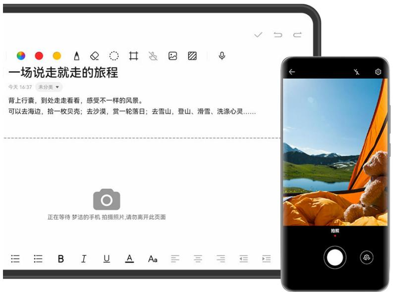

text_image

一场说走就走的旅程
今天 16:37 未分类
背上行囊，到处走走看看，感受不一样的风景。
可以去海边，拾一枚贝壳；去沙漠，赏一轮落日；去雪山，登山、滑雪、洗涤心灵......
正在等待 梦洁的手机 拍摄照片,请勿离开此页面

配图仅供参考，请以产品实际为准。

此处以平板调用手机相机为例，其他情况如手机调用平板、平板间相互调用和手机间相互调用操作相同。

1 将手机、平板登录同一华为帐号并接入同一局域网。  
2 在平板端，进入备忘录 > 笔记，点击 v > ，选择调用手机端的相机拍照或文档扫描，拍摄的照片或文档扫描结果可直接插入到平板端正在编辑的笔记中。  
3 点击 保存笔记。   
0 并非所有设备都支持此功能，请以实际情况为准。

# 搜索和整理备忘录笔记

# 快速搜索笔记

在备忘录搜索栏中输入笔记标题、文本内容、附件名称等关键词，可以快速搜索。

1 进入备忘录，点击屏幕顶部的搜索栏，输入关键词。

2 备忘录会根据关键词为您呈现相关的笔记。

# 修改笔记排序方式

您可以根据习惯将笔记按照编辑时间或创建时间排序，查阅更方便。

进入备忘录 > 笔记，点击 > 排序方式，选择按照编辑时间或创建时间排序。

若选择编辑时间，笔记排序会动态改变，即每次修改历史笔记后，被修改的笔记会自动排在最前面。

若选择创建时间，笔记将会严格按照创建时间排序，最新创建的笔记在最前面。编辑历史笔记不会改变其排序。

# 添加文件夹或笔记本

备忘录支持新建文件夹或笔记本用来存放不同类型的笔记。笔记本的类别还可以用不同的颜色标签来区分。

进入备忘录，点击全部笔记或全部待办，您可以进行以下操作：

• 新建文件夹：点击管理 > 新建文件夹，完成命名后点击保存。  
• 新建笔记本：打开任一文件夹，点击新建，完成标签颜色选择和命名后，点击保存。

若想对文件夹或笔记本重命名或删除，可点击管理 > 编辑，然后点击任一文件夹或笔记本的名称，对其进行重命名或删除。

0 Exchange 帐号文件夹及里面的内容不支持编辑。

# 将笔记或待办分类整理

您可以将备忘录中的笔记或待办按照不同类别整理到不同的文件夹的笔记本中，使分类更清晰。

• 置顶笔记：在全部笔记列表中，向左滑动某条笔记，点击 将其置顶在列表最上面。  
• 收藏笔记：在全部笔记列表中，向左滑动某一条笔记，点击 将其收藏。

点击全部笔记，在我的收藏中查看收藏内容。

• 将笔记或待办移入不同笔记本：在全部笔记或全部待办列表，向左滑动某条笔记或待办，点击

选择您要的笔记本进行归类。

长按待整理的笔记或待办，勾选或沿着勾选框滑动选择多条待分类的笔记或待办，点击 可批量进行分类。

# 锁定备忘录或备忘录中的笔记

您可以根据需要，为备忘录添加应用锁，也可以为单条笔记设置访问密码，有效保护隐私。

• 锁定备忘录应用：进入设置 > 安全 > 应用锁，按照屏幕提示，输入锁屏密码或自定义应用锁密码，开启备忘录旁的开关。

• 锁定单条笔记：进入备忘录 > 笔记，打开要锁定的笔记，点击 > 添加笔记锁，按照屏幕提示设置密码，然后点击 。

如果要移除笔记锁，可解锁后进入笔记，点击 > 移除笔记锁。

若您的设备支持指纹、人脸且已录入，可进入备忘录 > > 设置 > 笔记锁，开启关联指纹解锁和关联人脸解锁开关，便可快速认证解锁。

# 分享、导出备忘录

备忘录支持将笔记或待办直接分享给好友，也支持将笔记导出为图片、TXT 等多种格式的文档。

# 分享笔记或待办

• 分享单个笔记或待办：在全部笔记或全部待办列表中，打开要分享的笔记或待办，点击 ，按照提示完成分享。  
笔记可以通过笔记、图片等多种方式进行分享。

• 分享多个笔记：在全部笔记列表中，长按勾选多条待分享的笔记，点击 ，按照提示完成分享。

# 导出笔记

进入备忘录 > 笔记，打开要导出的笔记，您可以进行以下操作：

• 导出为图片：点击 ，左右滑动屏幕上方的内容缩略图，选择图片后点击 保存。导出结果可进入图库查看。

• 导出为文档：点击 > 导出为文档，按照提示导出需要的文档类型。

您可以打开文件管理，搜索 Documents 并进入查看已保存的笔记。

0 若您的设备已安装 WPS，则可导出 TXT、HTML、PDF、DOC 等多种格式，且可自定义保存路径。若未安装，纯手绘涂鸦或纯语音类型的笔记不支持导出为文档，其他类型笔记只能导出 TXT 或 HTML 格式文档。

# 使用备忘录速记

开启速记功能，从屏幕边缘可随时滑出速记窗口，方便及时记录所见所想或者重要事项。

# 开启速记功能

通过以下任一方式开启速记功能：

• 进入备忘录 > > 设置 > 速记，开启速记开关。  
• 从屏幕左、右边缘向内滑动并停顿，调出智慧多窗应用栏，点击 $\stackrel { \triangledown } { . 0 0 } > \not - 1 -$ ，进入编辑状态，在支持智慧多窗的应用中点击速记图标将其添加至智慧多窗应用栏，然后点击 保存。

# 使用快速记事

1 从屏幕左、右边缘向内滑动并停顿，调出智慧多窗应用栏，点击速记或备忘录，打开速记或备忘录悬浮窗。  
2 输入记录内容，或者点击 录入语音内容后创建笔记或待办。

# 删除备忘录笔记或待办

通过以下任一方式删除笔记或待办：

• 在全部笔记或全部待办列表中，向左滑动一条笔记或待办，点击 删除。  
• 长按要删除的笔记或待办，勾选或者沿着勾选框滑动选择多条待删除的记录，点击 。

删除完成后，点击全部笔记或全部待办，在最近删除文件夹中可查看删除记录。若想恢复删除内容，长按选中或直接进入内容详情页，点击 。

# 华为笔记

# 在平板中新建和添加笔记文件

笔记应用作为专业的笔记编辑和管理工具，可以给您带来流畅的手写体验，助您自由描绘创意，满足个性化需求。

0 仅平板预置笔记应用，其他华为设备请前往应用市场下载笔记应用。如应用市场搜索不到笔记应用，则说明此设备不支持笔记功能，请以实际情况为准。

# 新建和添加笔记

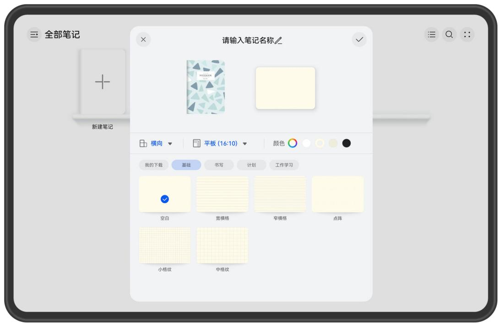

text_image

全部笔记
新建笔记
请输入笔记名称/
横向	平板 (16:10)	颜色
我的下载	基础	书写	计划	工作学习
空白	宽横格	窄横格	点阵
小格纹	中格纹

0 配图仅供参考，请以产品实际为准。

# 新建笔记

打开笔记应用，通过以下任一方式创建笔记：

• 快速新建：双击 快速新建笔记。  
• 使用模板新建：点击 ，选择新建笔记，进入设置界面：

设置封面：点击封面样式，选择您喜欢的封面，也可以点击自定义 > ，根据界面显示添加自.定义图片。如需修改已设置好的笔记封面，可以在已经创建好的笔记下方点击 > 修改封面，进行修改。

设置纸张：点击纸张样式，点击 ，选择纸张方向为纵向或横向，根据需要选择不同类型的纸张模板、规格和颜色，点击 。如需修改已设置好的纸张类型，可以进入笔记编辑界面，点击，根据界面显示进行修改。

• 通过导入新建：点击 ，选择导入图片、导入 PDF或导入 hinote，根据界面显示完成创建。同时勾选多个PDF文件可批量导入。

# 添加笔记附件

进入笔记编辑界面，点击右上角的 ，您可以：

• 添加附件：选择添加附件，选择需要的附件格式，根据界面显示选择附件，附件将以卡片的形式置入笔记。  
• 通过导入新建：选择导入图片、导入 PDF，根据界面显示完成导入。

# 使用平板笔记自定义书写样式

笔记应用支持丰富的笔刷样式和易用的辅助工具，可自定义书写样式。

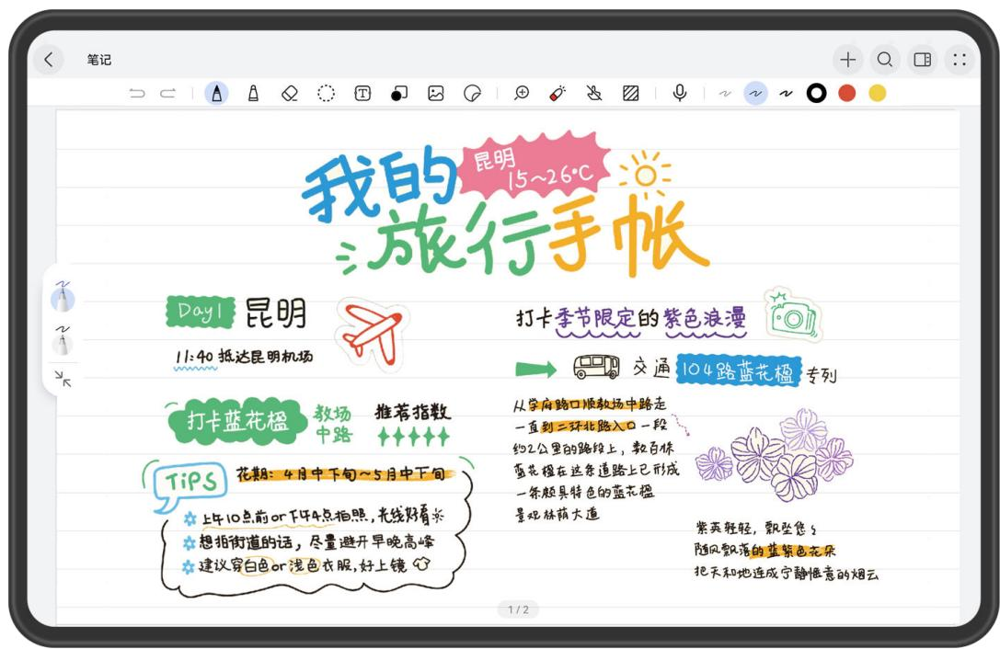

text_image

我的昆明
15~26℃
旅行手帐
Day1 昆明
11:40 抵达昆明机场
打卡季节限定的紫色浪漫
打卡蓝花橙 教场中路 推荐指数
TiPS 花期：4月中下旬～5月中下旬
上午10点前or下午4点拍照，光线好看来
想拒街道的话，尽量避开早晚高峰
建议穿白色or浅色衣服，好上镜
从学府路口顺教场中路走
一直到二环北路入口一段
约2公里的路综上，数百棵
蓝花橙在这条道路上已形成
一条极具特色的蓝花橙
景观林荫大道
紫英轻轻，飘坠悠了
随风飘落的蓝紫色花朵
把天和地连成宁静惬意的烟云

配图仅供参考，请以产品实际为准。

打开笔记应用，进入笔记编辑界面，您可以：

• 设置和收藏笔刷：点击 可直接使用笔刷，双击右侧快捷工具栏中颜色或粗细图标，可进行自定义设置。再次点击 进入笔刷设置界面，点击 ，打开显示收藏工具栏，界面左侧会生成笔刷收藏栏，可点击收藏栏中的笔刷进行切换。如需删除已收藏的笔刷，长按收藏栏中的笔刷，点击 。

• 跨应用取色：跨应用提取喜欢的颜色自由涂鸦和编辑笔记。您可以在分屏或悬浮窗模式下，点击，双击右侧快捷工具栏中颜色图标，点击 ，在目标应用中提取需要的颜色，例如从图库 或浏览器中的图片上取色。

• 使用荧光笔和马克笔：点击 可直接使用马克笔，双击右侧快捷工具栏中颜色或粗细图标，可A 进行自定义设置。再次点击 进入设置界面，点击 可切换为荧光笔，荧光笔的笔迹将自动置底显示，不会遮挡之前的书写内容。在荧光笔功能下，打开直线绘制开关，可直接绘制出一条直线。

• 橡皮擦：点击 可手动擦除部分涂鸦或书写内容，双击右侧快捷工具栏中橡皮擦图标，拖动下方滑块可调整橡皮擦大小。再次点击 进入橡皮擦设置界面，打开擦除整个笔划开关，可擦除完整的笔划内容。点击清空笔划，则直接清空所有手绘或书写内容，如需恢复可点击 按钮。

• 压感橡皮擦：连接手写笔后，连续两次点击 进入橡皮擦设置界面，开启压感橡皮擦开关，并适当调整压感灵敏度，使用手写笔涂鸦或书写过程中，按压屏幕并稍作停顿即可触发橡皮擦功能，擦除内容后，抬起手写笔点击相应笔刷即可继续进行书写。

• 输入文字：选 择 ，点击右侧快捷工具栏中文本编辑图标，可进行自定义设置。点击编辑页面弹出输入框后可输入文字。长按输入的文字可以进行复制、添加至大纲等操作。

• 一笔成形：一笔绘制标准图形进行重点标记。点击 ，双击右侧快捷工具栏中颜色或粗细图标，可进行自定义设置。一笔画完需要的图形（如箭头、圆形、矩形、爱心等），抬起手写笔即可变成标准图形，点击图形上的 ，可以再次调节该图形。

0 部分图形不可二次调节，请以实际情况为准。

放大镜：点击 可以放大编辑页面，拖动显示框右下方的三角图标调整放大比例，或移动显示框选择放大范围。

• 激光笔：点击 使用激光笔对内容进行临时批注，点击右侧快捷工具栏中样式图标，可进行自定义设置。激光笔的笔迹将自动置顶显示，并且会在几秒后消失。

• 禁止手指书写：点击 后，将禁止使用手指编辑笔记，防止手指误触，不影响手写笔书写。

• 更改模板：点击 ，根据界面显示，可以更改封面和纸张模板。

不同产品所支持的功能可能有差异，请以实物为准。

# 笔记排版

笔记应用支持图文混合编排，可轻松排版笔记。

打开笔记应用，进入笔记编辑界面，您可以：

• 套索：点击 ，圈选待编辑的内容，可在当前页面内自由拖动；点击圈中内容，还可以：选择剪切或复制，点击右上角的 ，将内容移动到全部页面中的任一页面。

选择颜色，点击色块修改颜色，点击 ， 可以提取界面中的颜色。

选择转文本，可复制全文或一键插入笔记到所需位置。

• 贴纸：可以使用丰富的贴纸素材，点击 > ， 选择多种贴纸或封面素材。点击 ，根据界面显示添加自定义贴纸。点击右侧快捷工具栏中最近使用的贴纸素材，可快速插入到笔记中。

您还可以在笔记首页，点击 素材集市，进行素材选择。

• 图片编辑：点击 ，右侧快捷工具栏中会显示图库中最近的图片，点击图片可快速插入到笔记中。双指捏合自由旋转和缩放图片。还可以点击图片进行自由裁剪、复制等操作，例如选中自由裁剪，可自由裁剪出想要的图文形状。

• 页面管理：双指上滑可快捷添加页面，或点击 ，长按笔记页面缩略图，通过复制、粘贴或插入空白页的方式添加页面。您还可以长按并拖动缩略图，调整页面顺序。

• 翻页设置：点击 > 翻页设置，选择笔记页面的滚动方向和翻页方式。

• 快捷手势：点击 ，打开快捷手势开关，在书写过程中，双指轻点屏幕，撤销上一次的操作；三指轻点屏幕，恢复上一次的操作。

# 字迹调整

笔记应用还可以为您调整手写字迹，多种字体可选，让您的手写内容更加美观。

打开笔记应用，进入笔记编辑界面，点击 ，圈选待编辑的手写字迹，选择字迹调整，点击 选择字体，并适当调整强度，即可美化手写字迹。

该功能目前支持系统版本为 HarmonyOS 4 及以上的平板，且仅支持对横向书写的中文、英文、数字、常用标点符号进行调整，请以实际情况为准。

# 添加和编辑录音文件

打开笔记应用，进入笔记编辑界面，点击 开始录制，录制过程中您可以：

• 点击 ，切换音频渠道为麦克风或媒体音。

• 点击 ，根据界面显示，可将语音内容转换为文字。

• 点击 ，打开音记同步开关，可在播放录音时，同步回放书写的过程。

点击 结束录制。

# 编辑录音文件

录制完的录音文件可以继续编辑使用，您可以：

• 点击 ，勾选您需要操作的录音文件，点击转文本，根据界面显示，可将语音内容转换为文字。  
• 点击 ，点击录音文件旁的 ，选择重命名、转文本、分享或导出，根据界面显示编辑录音文件。

仅部分产品支持语音转文本功能，请以实际情况为准。

# 在平板中管理笔记文件

当笔记比较多时，您可以使用多种方式管理笔记，方便查找。

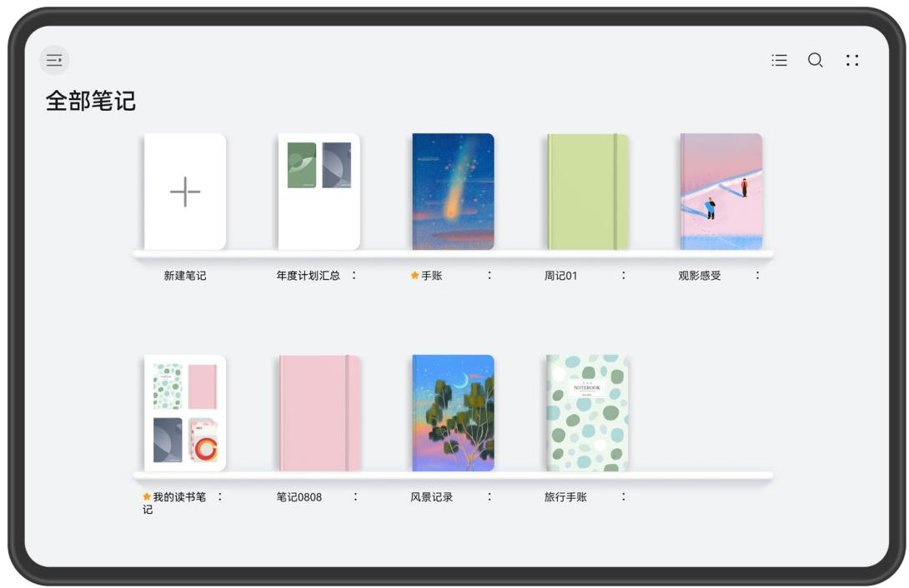

text_image

全部笔记
新建笔记	年度计划汇总 :	★手账 :	周记01 :	观影感受 :	★我的读书笔 :	笔记0808 :	风景记录 :	旅行手账 :

0 配图仅供参考，请以产品实际为准。

# 切换笔记的显示风格

打开笔记应用，点击笔记首页的 $\mathop { : = } \mathop { \tt o o }$ ，选择喜欢的笔记显示风格。

# 修改笔记的排序方式

您可以根据习惯将笔记按照时间、名称或类型排序，查阅更方便。

打开笔记应用，点击 > 排序方式，选择排序方式：

• 选择时间，笔记将会按照修改时间排序，最近修改的笔记排在最前面。  
• 选择名称，笔记将会按照名称字符从小到大进行排序。单个字符大小顺序由小到大定义为：0-9$< \mathsf { a } \mathrm { - } z < \mathsf { A } \mathrm { - } Z$ ，名称相同的笔记按照修改时间排序。  
• 选择类型，笔记将会按照类型排序，文件夹类型排列在单本笔记类型之前。

# 使用文件夹管理笔记

使用文件夹分类管理和查看笔记，打造个性化工作空间。

打开笔记应用，通过以下任一方式创建文件夹：

• 长按拖动单个笔记文件，移动到其他任一笔记文件中，快速创建文件夹。

• 点击 ， 选择新建文件夹，输入标题，点击确定。

笔记首页会显示文件夹和零散笔记，点击笔记下方 > ，收藏笔记或文件夹；还可以点击，输入关键字（如标题、文本等）快速搜索和查看笔记。

# 添加和管理大纲

通过添加和管理大纲可以帮您有效管理笔记，快捷预览笔记内容。

# 导入和添加大纲

打开笔记应用，通过以下任一方式创建笔记大纲：

• 自动导入PDF大纲：点击 ，选择导入 PDF，笔记将自动导入PDF的大纲。

• 手动添加大纲：进入笔记编辑界面，打开需要添加大纲的页面，点击 > 添加至大纲，根据界面显示输入大纲标题，点击确定。

# 编辑和管理大纲

打开笔记应用，打开已添加过大纲的笔记页面，您可以：

• 预览大纲：点击 > ，查看添加后的大纲，点击大纲名称，跳转到对应的笔记内容。

• 编辑大纲：点击 > ，在大纲名称上点开 ，通过创建同级大纲、创建子级大纲等操作编辑大纲。

• 管理大纲：点击 > 管理大纲，在大纲页面下，根据界面显示管理笔记大纲。

# 在桌面显示笔记卡片

您可在桌面添加笔记卡片，将常用笔记显示在桌面上，快速查看笔记内容。

1 在桌面长按笔记图标，点击服务卡片，选择一种笔记卡片样式，点击添加至桌面。

2 长按已添加的笔记卡片，点击编辑，您可以根据界面显示选择需要展示的笔记。

长按已添加的笔记卡片，选择移除，根据界面显示，可将笔记卡片从桌面删除。

# 同步笔记

开启云空间，登录任一支持笔记应用的华为设备，随时查看和分享笔记。

0 仅平板预置笔记应用，其他华为设备请前往应用市场下载笔记应用。如应用市场搜索不到笔记应用，则说明此设备不支持笔记功能，请以实际情况为准。

1 打开设置，在设备上登录华为帐号。

# 2 进入云空间，开启笔记应用的云同步开关，将数据上传至云端。

笔记应用中的所有数据将会自动上传至云端，您可以在支持笔记应用的任一华为设备上查看和编辑笔记内容，所做的更改也会保持同步更新。

# 删除笔记

进入全部笔记页面，您可以：

• 单个删除：在要删除的笔记下方，点击 > 删除 > 删除。

• 批量删除：点击 > 批量管理，选中待删除的笔记，点击 $\overline { { 1 1 } } ^ { 2 }$ > 删除。

删除的笔记会在最近删除页面中保留一段时间，超过该时间后会被永久删除。若要在保留期内永久删除笔记，点击 .$\equiv$ > 最近删除，在待删除笔记下方，点击 > 永久删除 > 永久删除。

# 恢复笔记

点击 > 最近删除，您可以：

• 单个恢复：在要恢复的笔记下方，点击 > 恢复。

• 批量恢复：点击 > 批量管理，勾选要恢复的笔记，点击 。

# 分享和导出笔记

笔记应用支持将笔记内容直接分享给好友，也支持将笔记内容导出为图片、PDF等多种格式的文档。

打开笔记应用，您可以通过以下方式分享或导出笔记：

# 分享笔记

• 分享整本笔记：在要分享的笔记下方，点击 $: > \ell _ { - }$ ，或在笔记编辑界面，点击 $\therefore \cdot > \mathcal { L } _ { \circ }$ 选择分享为图片、分享为 PDF或分享为 hinote。

• 分享单页笔记：在笔记编辑界面，点击 $\boxed { \cdot } \textcircled { < } \textcircled { > } \textcircled { > } \textcircled { > }$ ，长按笔记页面缩略图，点击分享本页，选择分享为图片、分享为 PDF或分享为 hinote。

# 导出笔记

• 导出整本笔记：在要导出的笔记下方，点击 $: > \boxed { \nearrow }$ ，或在笔记编辑界面，点击 $\therefore \cdot > \boxed { 7 }$ 选择导出为图片、导出为 PDF或导出为 hinote。

• 导出单页笔记：在笔记编辑界面，点击 $\boxed { \cdot } \textcircled { \div } \textcircled { \div } \textcircled { \div } \textcircled { \div }$ ，长按笔记页面缩略图，点击导出本页，选择导出为图片、导出为 PDF或导出为 hinote。

导出的图片可在图库查看；导出的 PDF 和 hinote 文件可进入文件管理，搜索文件名关键字进行查看。

# 打印笔记

1 打开笔记应用，在全部笔记列表界面，打开要打印的笔记内容。  
2 点击 > 打印，按照界面提示选择打印机和打印参数，点击开始打印。

# 锁定笔记

笔记应用支持添加应用锁，也可以为单条笔记设置访问密码，可有效保护隐私。

• 锁定笔记应用：进入设置 > 安全 > 应用锁，根据界面显示，输入锁屏密码或自定义应用锁密码，开启笔记旁的开关。  
• 锁定单条笔记：打开笔记应用，进入笔记编辑界面，点击 > 添加笔记锁，根据界面显示设置锁屏密码并绑定华为帐号，然后点击 。

如果要移除笔记锁，可解锁后进入笔记，点击 > 移除笔记锁。

若您的设备已录入人脸，进入已锁定的笔记，点击解锁时，将自动使用人脸识别解锁笔记。

# 设置

# 更多连接

# 将当前应用投屏到大屏

将平板的当前应用单独投屏到大屏设备观看（如：智慧屏），同时您可以在本机操作其他应用，互不影响。

0 应用投屏适用于支持 Cast+/Miracast 协议的大屏设备，请以实际情况为准。

完成应用投屏，请参考以下不同场景操作：

• 若暂未开启投屏，想将正在观看的视频单独投送至大屏，可开启大屏设备，从平板顶部右侧下滑出控制中心，点击无线投屏，根据界面提示将应用单独投送至大屏。  
• 若已处于投屏状态，可在平板上打开想要投屏的应用，点击屏幕顶部投屏中胶囊 ，然后在实况窗中根据界面提示将当前应用单独投送至大屏。

完成投屏后，平板上的投屏应用会缩小为悬浮窗口，点击窗口中的 可将悬浮窗口最小化为悬浮球。若在部分视频类应用（如华为视频、优酷等）中正在观看视频，应用投至大屏后视频将自动全屏播放。

操控投屏应用：点击本机悬浮球展开应用悬浮窗口，您可在悬浮窗口中操控此投屏应用。还可通过调节悬浮窗口中应用的音量来控制大屏上的播放音量。

• 当应用处于分屏或悬浮窗状态时，不支持应用投屏。

• 为了保护您的安全隐私，目前不支持锁屏后继续投屏。

退出应用投屏，通过以下任一方式：

• 点击平板屏幕顶部投屏中胶囊 ，在实况窗中点击 ，切换至镜像投屏，点击 退出无线投屏。  
• 点击本机悬浮球展开应用悬浮窗口，点击悬浮窗口中的 ， 退出应用投屏至镜像投屏。  
• 长按本机悬浮球并拖至屏幕底部 ，退出应用投屏至镜像投屏。

# 桌面和个性化

# 设置个性主题

选择您喜欢的个性主题，一步应用到熄屏显示、锁屏壁纸、桌面壁纸和图标。您还可进一步更换照片、显示样式和图标颜色等元素，打造您的个人专属主题，让桌面与众不同。

部分产品不支持熄屏显示，请以实际情况为准。

# 设置艺术主角主题

您可选择人像或宠物照片，搭配纹理或渐变等背景，为照片增添色彩，打造您的专属个性主题。

1 进入设置 > 桌面和个性化 > 主题，在杂志主题样式中，选择艺术主角主题。

首次使用艺术主角主题时，请根据界面提示下载并安装主题。

2 点击自定义进入编辑界面，您可以：

点击 ，选择喜欢的人像或宠物照片作为主角。  
点击编辑，按住并移动照片调整位置。  
调整纹理样式、图标色等。

3 点击应用。

# 显示和亮度

# 使用护眼模式

护眼模式能有效降低蓝光辐射，调整屏幕光为更加温和的暖光，可缓解用眼疲劳，保护视力。

# 开启或关闭护眼模式

• 从屏幕顶部右侧下滑出控制中心，点亮或关闭护眼模式。长按护眼模式进入设置界面。  
• 进入设置 > 显示和亮度 > 护眼模式，开启或关闭全天开启。

护眼模式开启后，状态栏中将显示 图标，因滤除部分蓝光，屏幕显示颜色会偏黄。

# 定时开启护眼模式

进入设置 > 显示和亮度 > 护眼模式，开启定时开启开关，根据需要设置护眼模式的开始时间和结束时间。

# 调整护眼模式蓝光过滤

进入设置 > 显示和亮度 > 护眼模式，打开全天开启或设置定时开启，然后滑动蓝光过滤下的滑块调整蓝光过滤强度。

# 电子书模式

长时间阅读文章、浏览网页时，使用电子书模式可缓解用眼疲劳。开启该模式后，屏幕显示为接近书本的效果。

# 开启或关闭电子书模式

您可以通过以下方式开启或关闭电子书模式（取决于您的机型）：

• 从屏幕顶部右侧下滑出控制中心，在快捷开关栏中开启或关闭电子书模式。长按电子书模式进入设置界面。  
• 进入设置 > 显示和亮度，开启或关闭电子书模式开关。

• 进入设置 > 显示和亮度 > 电子书模式，根据您的喜好，选择彩色绘本或经典黑白风格，开启或关闭对应开关。

0 若同时开启电子书模式与护眼模式，电子书模式生效，您的设备将显示为电子书模式效果。若同时开启电子书模式与深色模式，两种模式将同时生效，您的设备将显示为深色模式下的电子书效果。

仅部分机型支持彩色绘本风格，请以实际为准。

# 通知和状态栏

# 常见通知和状态图标含义

0 网络状态图标可能因您所在的地区或网络服务提供商不同而存在差异。

不同产品支持的功能有差异，以下图标可能不会出现在您的平板上，请以平板实际显示为准。

<table><tr><td></td><td>信号满格</td><td></td><td>正在漫游</td></tr><tr><td></td><td>已开启省流量模式</td><td></td><td>未插入 SIM 卡</td></tr><tr><td>[SA3W]</td><td>已开启热点</td><td></td><td>已连接至热点</td></tr><tr><td></td><td>热点已断开</td><td></td><td>正在通过 WLAN+ 自动切换网络</td></tr><tr><td></td><td>已连接至 WLAN 网络</td><td></td><td>WLAN 网络有故障,无法连接到互联网</td></tr><tr><td></td><td>已连接至 WLAN 6 网络</td><td></td><td>WLAN 6 网络有故障,无法连接到互联网</td></tr><tr><td></td><td>已连接至 WLAN 6+ 网络</td><td></td><td>WLAN 6+ 网络有故障,无法连接到互联网</td></tr><tr><td></td><td>已连接至双 WLAN 网络</td><td></td><td>已连接至双 WLAN 网络,主WLAN 支持 WLAN 6</td></tr><tr><td></td><td>已连接至双 WLAN 网络,主WLAN 支持 WLAN 6+</td><td></td><td>NFC 已开启</td></tr><tr><td></td><td>电池无电量</td><td></td><td>电池电量低</td></tr><tr><td></td><td>正在充电</td><td></td><td>正在使用快充</td></tr><tr><td></td><td>正在使用超级快充</td><td></td><td>无线超级快充</td></tr><tr><td></td><td>无线快充</td><td></td><td>普通无线充电</td></tr><tr><td></td><td>省电模式已开启</td><td>[S4ZW]</td><td>健康使用平板已开启</td></tr><tr><td>[3K2.5]</td><td>蓝牙已开启</td><td>[STYK]</td><td>蓝牙设备电量</td></tr><tr><td></td><td>已连接蓝牙设备</td><td></td><td>已连接至VPN网络</td></tr><tr><td>[EZKA]</td><td>飞行模式已开启</td><td>[HKSA]</td><td>免打扰模式已开启</td></tr><tr><td></td><td>位置服务已开启</td><td></td><td>护眼模式已开启</td></tr><tr><td>[TAXK]</td><td>已进入驾驶模式</td><td></td><td>性能模式已开启</td></tr><tr><td>[XZ50]</td><td>已连接耳机</td><td>[00AK]</td><td>已连接至投屏设备</td></tr><tr><td></td><td>正在通话</td><td></td><td>VoLTE高清通话已开启</td></tr><tr><td></td><td>有未接来电</td><td></td><td>当前网络无法正常通话</td></tr><tr><td></td><td>有新消息</td><td></td><td>闹钟已开启</td></tr><tr><td>[2X48]</td><td>静音模式</td><td>[3S4Z]</td><td>振动模式</td></tr><tr><td></td><td>数据同步中</td><td></td><td>数据同步失败</td></tr><tr><td>[22D7]</td><td>收到新邮件</td><td>[TV6D]</td><td>收到日程提醒</td></tr><tr><td>[STX5]</td><td>应用调用相机功能</td><td>[8/12]</td><td>应用调用麦克风功能</td></tr><tr><td></td><td>更多未显示的信息</td><td></td><td>已建立分布式联网</td></tr></table>

# 管理通知和状态栏

# 置顶应用通知

您可通过以下任一方式置顶应用通知，将您关注的应用通知显示在通知中心顶部：

• 从屏幕顶部左侧下滑进入通知中心，然后左滑通知消息，点击 > 置顶此应用通知。  
• 进入设置 > 通知和状态栏，找到并点击您要置顶通知的应用，开启置顶通知开关。

# 管理单个应用通知

您可调整某个应用的通知提醒方式、铃声效果，还可为具体类别的通知单独设置通知效果。

进入设置 > 通知和状态栏，点击某个应用进入通知管理详情页，开启或关闭该应用通知。还可对该应用进行如下设置：

• 静默通知：开启后，通知仅在下拉通知栏显示，不显示横幅通知、锁屏通知、状态栏图标等，也不会响铃和振动。

• 锁屏通知和横幅通知：选择消息提醒方式。

• 通知铃声：更改铃声和振动模式，如：仅铃声、仅振动等。

• 允许打扰：开启后，平板在免打扰模式下，也能继续接收此应用通知。

• 各类别通知设置：针对应用内不同类别的通知设置不同的通知效果。点击应用通知中的某个类别名称（如：服务提醒），可开启或关闭该类通知，还可按照类别设置不同的通知铃声、消息提醒方式等。

不同应用的类别名称有所差异，请以实际情况为准。

您还可从屏幕顶部左侧向下滑出通知中心，左滑通知消息，点击 > 更多设置，对该应用通知进行管理。

部分产品不支持设置振动效果，请以实际情况为准。

# 隐藏锁屏通知内容

开启该功能后，在锁屏状态下，屏幕上会显示通知提醒，但不会显示具体的通知内容，解锁后才可查看，保护您的隐私安全。

请选择以下方式开启此功能（取决于您的机型）：

• 进入设置 > 通知和状态栏，开启隐藏通知内容开关。

• 进入设置 > 通知和状态栏 > 锁屏通知，选择隐藏通知内容。

# 收到通知时自动亮屏

进入设置 > 通知和状态栏，开启通知亮屏提示开关。平板在熄屏状态下收到锁屏通知将自动亮屏。

# 关闭应用通知

若您不想被某个应用通知打扰，可通过以下任一方式关闭应用通知：

• 当您收到应用通知后，在通知中心中向左滑动通知，然后点击 > 关闭此应用通知。  
• 进入设置 > 通知和状态栏，找到并点击您要禁止通知的应用，然后关闭允许通知开关。  
• 进入设置 > 通知和状态栏 > 批量管理，关闭应用旁边的开关。

# 设置状态栏纯净显示

进入设置 > 通知和状态栏 > 状态栏，开启纯净显示开关，平板状态栏默认仅显示时间、WLAN、移动信号、电量等常用图标。

# 生物识别和密码

# 人脸识别

将人脸录入平板，录入的人脸信息可代替密码，识别人脸即可解锁屏幕、访问应用锁等。

# 录入人脸数据

1 进入设置 > 生物识别和密码 > 人脸识别，输入锁屏密码。

如果您未设置锁屏密码，除了可设置 6 位数字密码外，还可以点击其他密码类型，选择更多密码类型。

2 点击新建面部数据。  
3 打开拿起设备亮屏开关。

设置项因产品而异，若您的平板中无对应项，则不支持该功能。

4 点击开始录入，面部正对平板，按照屏幕提示完成人脸录入。

# 添加多张人脸信息

您可以为平板录入多张人脸（最多 5 张），让家人都能安全共用。

进入人脸识别界面，点击新建面部数据，根据界面提示录入人脸数据。

# 设置人脸解锁方式

进入人脸识别界面，点击解锁屏幕，选择一种解锁方式。

• 直接解锁：人脸识别成功后，直接解锁。  
• 滑动解锁：人脸识别成功后，滑动屏幕可解锁。

• 若您不想使用人脸解锁屏幕，点击解锁屏幕 > 关闭。

• 当您开启了隐私空间，仅在主空间下可使用人脸解锁；当您添加了多用户，仅登录用户为机主时可使用人脸解锁。

# 设置人脸访问应用锁

进入人脸识别界面，开启访问应用锁开关，按照屏幕提示关联人脸与应用锁。

设置成功后，在桌面上点击被锁定的应用，使用人脸即可访问该应用。

# 设置人脸关联密码保险箱

进入人脸识别界面，开启自动填充帐号和密码开关。

登录应用时，使用人脸识别，即可自动填充密码保险箱中已保存的帐号和密码。

# 设置人脸识别安全增强

使用人脸解锁时，同时开启解锁时需连接可信设备开关，当平板人脸认证已通过，并检测到已设置的可信解锁设备连接时，才会被解锁，以提升解锁安全性。

该功能默认关闭，如需开启，请在人脸识别界面，点击解锁时需连接可信设备，开启解锁时需连接可信设备开关，根据屏幕提示完成操作。

i 可信设备指可用于解锁的蓝牙设备，如耳机、手表、手环等。

# 禁用或删除人脸数据

进入人脸识别界面，您可以：

• 禁止部分功能使用人脸：关闭解锁屏幕或访问应用锁等设置，将禁止人脸数据在此功能上的使用，但不会删除人脸数据。  
• 删除人脸数据：点击面部列表中要删除的人脸数据名称，然后点击删除面部 > 删除，将删除该人脸数据。

# 开启智能解锁

当您的平板检测到可解锁的蓝牙设备时（如手环），无需密码、指纹或人脸身份验证，即可滑动解锁平板，方便快捷。

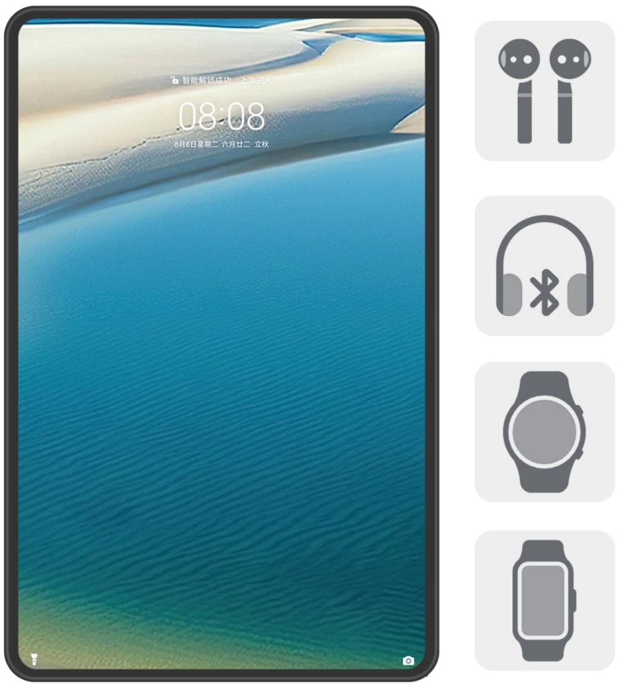

text_image

智能解锁成功，上海进入
08:08
8月8日星期二 六月廿二 立秋

0 配图仅供参考，请以产品实际为准。

1 将平板与蓝牙设备配对连接。配对成功后，蓝牙设备名称将显示在蓝牙界面的已配对的设备列表中。  
2 在平板上，进入设置 > 生物识别和密码 > 智能解锁，开启智能解锁开关。  
3 按照屏幕提示，完成锁屏密码设置。若已设置锁屏密码，请跳过此操作。  
4 在智能解锁界面，点击添加解锁设备，在已配对的设备列表中选择所需蓝牙设备名称，根据屏幕提示进行设置。

设置成功后，蓝牙设备名称将显示在解锁设备列表中。

当蓝牙设备与平板在连接状态下，点亮平板屏幕，滑动平板屏幕即可解锁。

在智能解锁界面，点击 可了解智能解锁的更多内容。

# 安全

# 使用安全中心，保护平板安全

在安全中心，您可以更直观地查看平板的安全状态和保护建议，设置安全保护功能，多方面保护您的平板安全。

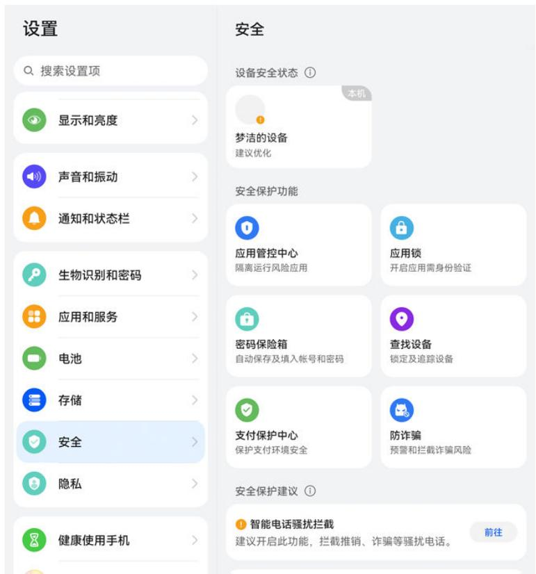

text_image

设置
搜索设置项
显示和亮度 >
声音和振动 >
通知和状态栏 >
生物识别和密码 >
应用和服务 >
电池 >
存储 >
安全 >
隐私 >
健康使用手机 >
安全
设备安全状态 ①
梦洁的设备
建议优化
本机
安全保护功能
应用管控中心
隔离运行风险应用
应用锁
开启应用需身份验证
密码保险箱
自动保存及填入帐号和密码
查找设备
锁定及追踪设备
支付保护中心
保护支付环境安全
防诈骗
预警和拦截诈骗风险
安全保护建议 ①
智能电话骚扰拦截
建议开启此功能，拦截推销、诈骗等骚扰电话。
前往

0 配图仅供参考，请以产品实际为准。

# 查看设备安全状态

平板会显示本机及已在超级终端中发现的同一华为帐号设备的安全状态，您可查看这些设备的安全保护建议及保护记录。

0 该功能目前支持系统版本为 HarmonyOS 3 及以上的手机和平板，后续将支持更多设备，请以实际为准。

进入设置 > 安全，平板会显示本机和同一华为帐号超级终端设备的安全状态。

当状态提示为绿色时，表示您的设备状态良好；黄色时，表示您的设备存在安全隐患；红色时，表示您的设备有较高风险，建议您尽快优化。

在设备安全状态中，点击本机，您可以：

• 查看和设置安全保护功能：本机会显示当前安全保护状态，您可点击某个功能项进行设置。例如，点击锁屏密码，根据提示设置。

• 查看安全保护建议：系统会根据本机的设置情况提供保护建议，点击建议旁的按钮，根据提示开启保护措施。  
• 查看近期安全保护记录：在列表中可查看近期的安全保护记录，帮助您了解设备情况及设置保护。

您还可点击显示的其他设备，查看该设备的安全状态。若要修改安全设置，请根据提示在对应设备上操作。

# 设置平板安全保护功能

进入设置 > 安全，点击要设置的功能，如应用锁、密码保险箱等，根据提示操作。

# 查看平板安全保护建议

查看平板推荐的安全保护建议，您可根据设备情况，处置或者忽略该建议。

进入设置 > 安全，点击要优化的安全建议旁的开关，或根据提示跳转到对应界面进行设置。

如要忽略某条保护建议，左滑该建议，点击 同一建议忽略 2 次后不再提醒。

# 添加安全隐私中心卡片到桌面

如您想实时查看平板的安全隐私防护情况，可在平板桌面添加安全隐私中心的服务卡片，快速查看。

• 进入设置 > 安全，点击添加“安全隐私中心”至桌面，添加后，如有应用存在风险，该卡片会进行提示，您可点击卡片，快速跳转至应用管控中心管控该应用。  
• 进入设置 > 隐私，点击添加“安全隐私中心”至桌面，添加后，可快速查看保护建议及应用行为。

在桌面长按卡片，还可进入更多服务卡片，选择不同样式的卡片。

# 使用 PIN 码保护 SIM 卡

平板丢失或被盗后，可能会被他人通过电话号码和验证码的验证方式，造成个人信息泄露和个人财产损失（如照片和聊天记录泄露、被网贷等）。

PIN 码是 SIM 卡的身份识别码，可将其设置为打开 SIM 保护，每次开机或更换平板时，会要求输入正确的 PIN 码解锁 SIM 卡，以防他人盗用。

PIN 码输入错误超过限制次数时，需输入 PUK 码（PUK 码全称 PIN Unlocking Key）进行解锁，解锁成功后，并重新设置 PIN 码。如果 PUK 码输入错误超过限制次数时，SIM 卡将作废，请谨慎使用。

PIN 码和 PUK 码均需从运营商处获取，位数和输入限制次数以运营商告知为准。

1 进入设置 > 安全 > SIM 卡保护，进入 SIM 卡保护界面。  
2 开启开启 SIM 卡保护开关，输入 PIN 码，点击确定即可。

如需修改 PIN 码，可点击修改 SIM 卡 PIN 码，根据提示进行修改。

WLAN only 版本的平板不支持此功能，请以实际情况为准。

# 隐私

# 查看和管理平板隐私

您可通过隐私中心更直观地查看平板的隐私权限、应用隐私行为记录及隐私保护建议，当有应用使用敏感权限时，平板还会实时显示提醒，让您能更快速地了解和管理平板隐私。

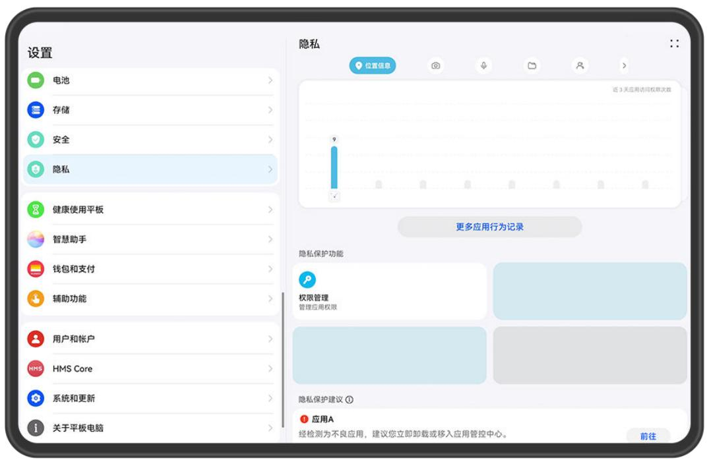

text_image

设置
电池
存储
安全
隐私
健康使用平板
智慧助手
钱包和支付
辅助功能
用户和帐户
HMS Core
系统和更新
关于平板电脑
隐私
位置信息
近3天应用访问权限次数
9
更多应用行为记录
隐私保护功能
权限管理
管理应用权限
隐私保护建议①
应用A
经检测为不良应用，建议您立即卸载或移入应用管控中心。
前往

• 配图仅供参考，请以产品实际为准。

• 隐私记录的分析和呈现均在您的平板本地进行，不会上传到云端，您可放心使用。

• 部分系统应用使用权限时，将不会显示在权限提醒及隐私建议等提示中，请以实际为准。

• 部分功能随版本陆续推送中，请以当前界面实际显示为准。

# 查看权限访问提醒

有应用访问敏感权限时，平板会在状态栏和控制中心实时提醒当前访问的敏感权限及应用信息，方便您查看和管理。

例如，当某个应用使用麦克风权限时，状态栏会显示麦克风图标，您可从平板顶部右侧下滑出控制中心，在顶端查看访问该权限的应用。

点击该应用名，可查看该应用近期的敏感权限记录，也可禁用该应用使用某些权限。

0 并非所有敏感权限支持实时访问提醒，请以实际为准。

# 查看敏感权限记录

您可在隐私看板中查看敏感权限使用情况、近期应用隐私行为等记录。

进入设置 > 隐私，您可在隐私看板中点击权限图标、应用图标、或权限图标旁的 等位置，查看权限使用情况、应用权限等。

点击更多应用行为记录，还可查看锁屏数据访问、高频数据访问、应用隐私行为等记录。

如您想关闭应用隐私报告等数据显示，可在隐私界面右上角点击 > 关闭应用隐私报告。

# 设置图片隐私保护

您可开启图片隐私保护，避免某些三方应用在后台获取您的图片信息，还可避免分享图片到社交媒体等渠道时，图片信息被泄露，保护您的隐私安全。

进入设置 > 隐私，点击图片隐私保护，打开去除图片的位置信息和去除图片的拍摄数据开关。

开启后，除图库等系统应用外，其余三方应用将无法获取您的图片敏感信息，如图片拍摄时的定位记录、设备型号、时间等。

# 查看隐私保护建议

当平板检测到您的隐私设置存在风险或可优化时，将提供保护建议。

在设置 > 隐私中，根据提示，点击建议旁的按键进行设置。

例如，当平板识别到病毒、不良、诈骗应用时，会建议您将该应用卸载或移入应用管控中心，您可根据提示操作。加入管控后，该应用将被限制访问敏感数据、禁用敏感权限，以保护您的隐私安全，管控后，应用的部分功能可能受到影响。

您可在设置 > 安全 > 应用管控中心查看管控中的应用，解除管控或卸载应用。

如要忽略某条保护建议，左滑该建议，点击 。同一建议忽略 2 次后不再提醒。

平板仅通过本地 AI 智能识别图片类型，不会将您的图片上传到云端分析。

# 剪贴板读取提醒

开启剪贴板读取提醒，当平板检测有应用读取剪贴板时，将弹出提醒。

进入设置 > 隐私 > 剪贴板读取提醒，打开剪贴板读取提醒开关。

# 管理应用访问权限

应用在使用时可能需要获取一些数据和访问权限，例如获取位置信息、悬浮窗权限等，以便为您提供相应的服务。

您可进入设置 > 应用和服务 > 权限管理，查看各应用的权限，根据需要设置。

不同应用程序支持的访问权限选项不同，请以实际情况为准。

# 管理应用获取位置信息的权限

当授权某个应用获取您的位置信息权限后，此应用将可读取您的位置信息。如地图获取位置信息权限，可为您提供定位和导航服务，不需要时可随时关闭。

进入权限管理界面，通过以下任一方式设置应用获取位置信息的权限：

• 在应用页签下，点击需要修改权限的应用，然后点击位置信息，选择合适的应用访问权限选项。

• 在权限页签下，点击位置信息，然后点击需要修改权限的应用，选择合适的应用访问权限选项。

# 管理应用的获取设备方向权限

部分应用会获取您的设备方向权限，以收集平板传感器数据，实现摇一摇平板跳转其他应用、广告等功能。如您不想在进入某个应用时触发摇一摇跳转，您可关闭该应用相应的权限。

进入权限管理界面，通过以下任一方式设置应用的获取设备方向权限：

• 在权限页签下，点击应用获取设备方向，开启或关闭需要修改权限的应用旁的开关。  
• 在应用页签下，点击需要修改权限的应用，然后点击应用获取设备方向，选择允许或禁止。

当开关为开启、或权限为允许时，表明该应用可以获取设备方向权限。

0 部分应用需获取设备方向权限，以实现应用功能，如播放视频时窗口自动识别适应横竖屏、通讯应用听筒切换（如 QQ、微信等）、游戏动作捕捉等，关闭该权限可能导致这些功能无法使用，请您按需设置。

# 管理应用的悬浮窗权限

悬浮窗权限，是指允许应用弹出悬浮窗口。例如，社交软件的视频悬浮窗口，应用的系统提醒窗口等。某些提醒窗口可能会占据整个屏幕，请根据实际情况合理授权。

进入权限管理界面，通过以下任一方式设置应用的悬浮窗权限：

• 在应用页签下，点击需要修改权限的应用，然后点击悬浮窗，选择允许或禁止。  
• 在权限页签下，点击悬浮窗，开启或关闭需要修改权限的应用开关。

# 管理应用的后台弹窗权限

后台弹窗权限，是指应用在锁屏或后台运行时可能弹出窗口。如您误触安装恶意应用后平板不断显示引导弹窗，您可在权限设置中关闭此类应用权限。

进入权限管理界面，通过以下任一方式设置应用的后台弹窗权限：

• 在应用页签下，点击需要修改权限的应用，然后点击后台弹窗，选择允许或禁止。  
• 在权限页签下，点击后台弹窗，开启或关闭需要修改权限的应用旁的开关。

# 管理应用访问其他私人数据的权限

您可以根据需要，合理管理应用访问位置信息、麦克风、及相机等更多私人数据的权限，以便获取更好的服务，保护隐私安全，防止信息泄露。

进入权限管理界面，通过以下任一方式设置应用的更多权限：

• 在应用页签下，点击需要修改权限的应用，然后点击相应权限，选择允许或禁止。  
• 在权限页签下，点击相应权限，开启或关闭应用对此权限的访问。

# 健康使用平板

# 合理规划用机时长

通过健康使用平板，可以随时了解自己花费在平板上的时间，并可设置平板可用时长、应用使用限制以及停用时间。

# 设置用机时长

通过屏幕时间管理，帮助您平衡平板使用时间。

1 进入设置 > 健康使用平板，点击开启。  
2 选择我自己使用，点击确定。  
3 开启屏幕使用时间管理开关，您可以：  
点击可用时长，设置每天允许使用平板的总时长。  
点击应用和服务限额，选择需要设置的应用或服务，设置允许使用时长。  
点击停用时间 > 添加停用时间，并根据提示设置停用平板的时间段。

到达限定时间后，不可用的应用图标会变成灰色。

如需继续使用某应用，点击延时使用，请根据屏幕提示进行设置。

如需取消用机时长限制，仅查看用机统计报告，可关闭屏幕使用时间管理开关。

如需关闭健康使用平板，请进入健康使用平板界面，点击关闭健康使用平板。

# 查看用机统计报告

通过健康使用平板查看您花费在各应用上的时间分布，助您健康用机。

进入设置 > 健康使用平板 > 使用统计，点击每天或过去七天，您可以查看平板使用情况的统计，例如使用时间，解锁统计等。

# 鼓励孩子健康使用平板

通过健康使用平板，您可在孩子的平板上，帮孩子设置屏幕时间管理，引导孩子合理使用平板。还可在家长平板上，实时获取孩子的位置信息，查看孩子用机情况。

# 帮孩子管理平板使用时间

在孩子的平板上，帮孩子设置屏幕时间管理，引导孩子合理使用平板。

1 登录孩子的华为帐号。  
2 进入设置 > 健康使用平板 > 开启，选择孩子使用，点击确定。  
3 根据界面提示，设置密码和密保问题。

4 开启屏幕使用时间管理开关，您可以：

点击可用时长，设置每天允许孩子使用平板的总时长。  
点击应用和服务限额，选择需要设置的应用或服务，设置允许使用时长。  
• 点击停用时间 > 添加停用时间，根据提示设置停用平板的时间段。

5 您还可以点击密码设置 > 家长防护，根据提示登录家长的华为帐号，以便忘记密码和密保时可重设密码，也可防止平板被强制恢复出厂设置，而导致屏幕时间管理失效。

当孩子需要调整屏幕时间管理设置时，必须先输入输入健康使用平板密码。

如需退出孩子模式，在健康使用平板界面，点击关闭健康使用平板。

# 为孩子建立远程守护

在家长的平板上，开启远程守护后，您可实时获取孩子的位置信息，查看孩子用机情况等。

i 使用该功能前，请确保双方设备为 HarmonyOS 3.1 及以上版本。

请在家长平板上完成如下设置：

1 进入设置 > 华为帐号 > 设置家人共享 > 开始使用，根据实际情况选择操作：

• 若没有儿童帐号，点击创建儿童帐号，为孩子创建帐号，创建后会自动加入家入共享。  
• 若已有儿童帐号，可选择通讯录邀请或帐号邀请，邀请孩子帐号加入家人共享。

2 您可选择如下任一方式开启远程守护：

• 进入设置 > 健康使用平板 > 开启 > 我自己使用 > 确定，点击为孩子开启“远程守护”，按界面提示完成操作。  
• 进入家人共享 > 远程守护 > 开启，根据界面提示完成操作。

设置完成后，远程守护操作如下：

• 在孩子的设备上，登录儿童帐号。在家长平板上，进入健康使用平板或家人共享界面，点击远程守护，可实时查看孩子位置信息、用机情况等。  
• 若孩子使用时长到达限额，需继续使用某应用，可点击该应用，选择申请延时使用，家长收到通知后同意即可。  
• 如需退出远程守护，请在家长平板上，进入健康使用平板或家人共享界面，点击远程守护 >> 管理，根据提示退出守护。

• 可进入设置 > 华为帐号 > 家人共享，点击 > ，了解如何创建儿童帐号。

• 此功能仅适用于未成年人，请确保儿童帐号中的年龄信息与实际相符。

# 查看孩子用机情况及位置信息

通过绑定孩子的华为帐号，在家长的平板上，远程查看孩子使用手机或平板的情况，还可实时查看孩子位置信息。

在家长的平板上，进入设置 > 健康使用平板 > 远程守护，选择已绑定的孩子帐户，您可以：

• 查看设备使用统计：点击时间统计卡片，查看孩子过去七天内使用设备的时长和解锁次数。  
• 查看应用使用时长：点击应用统计卡片，查看孩子过去七天内使用各应用的时长。  
• 查看孩子位置信息：点击地图卡片，查看孩子当前详细位置信息。

# 与孩子约定用机规则

通过绑定孩子的华为帐号，家长可在自己的平板上，远程管控孩子使用手机或平板的情况，并与孩子一起约定使用规则，守护孩子用机健康。

在家长的平板上，进入设置 > 健康使用平板 > 远程守护，选择已绑定的孩子帐户，您可进行如下设置：

• 停用时段：点击停用时段 > 添加停用时间，设置设备停用时间及重复周期。

• 可用时长：点击可用时长 > 添加，设置设备每日的可用时长。还可点击应用或服务，设置每个应用或服务的可用时长。  
• 始终允许：点击始终允许，点击应用或服务旁边 的 ，将其设置为始终允许。  
• 内容限制：点击内容限制，按界面提示可设置应用安装许可与等级、视频等级、音乐等级、浏览器等。

0 如某应用或服务被设置为始终允许（电话默认为始终允许），将不受停用时段和可用时长的限制。

• 应用安装许可与等级：如设置为限制所有应用安装，则孩子安装任何应用都需要输入健康使用平板的密码；如设置为仅限安装相应等级应用，则可选择孩子对应的年龄段，孩子端设备在应用市场或游戏中心只能安装相应等级的应用。

# 远程守护长辈

在您的平板上，通过绑定长辈的华为帐号，可实时查看长辈位置信息，设置长辈到家提醒和长时间未使用平板提醒，减少您的担忧。

# 绑定长辈平板，随时查看长辈位置

在您的平板上，通过家长助手实时获取长辈的位置信息。

• 您可通过应用市场下载并安装最新版家长助手。  
• 双方设备均需使用华为设备（手机或平板等）。

1 在长辈设备上，登录华为帐号，进入设置 > 健康使用平板 > 开启 > 长辈使用。

若长辈设备中无长辈使用设置项，则不支持该功能。请以实际情况为准。

2 进入健康使用平板界面中，点击远程守护，屏幕将出现二维码。  
3 在您的平板上，打开家长助手并登录您的华为帐号，在主界面点击添加用户，根据界面提示扫码添加。

若已存在其他帐号，请点击 > 新增绑定添加用户。

4 在长辈设备上，点击同意，输入长辈的华为帐号密码，点击确定完成绑定。

绑定成功后，在您的平板上，进入家长助手，点击已绑定的长辈帐户，可随时查看长辈所在位置。

您可通过以下任一方式解除已绑定的帐号：

• 在长辈设备上，进入健康使用平板 > 远程守护，点击 > 解除绑定，根据界面提示解除绑定。  
• 在您的平板上，打开家长助手，点击长辈帐户头像，然后点击解除绑定，根据界面提示解除绑定。

# 设置长辈守护位置提醒

当长辈到达或离开已设置的守护范围时，您的平板上会收到系统发出的通知消息，也可在家长助手中直接查看长辈当前位置信息。

1 在您的平板上，点击家长助手，选择已绑定的长辈帐户。

2 点击地图，进入实时位置卡片，点击 输入守护位置名称和地点（如父母家）。  
3 拖动滑块调整守护范围半径，然后点击保存。   
4 长辈进入或离开守护范围时，您的平板将会收到长辈进入或离开了守护范围的通知消息。

进入实时位置卡片，点击守护范围或守护围栏（取决于您的机型），然后点击 ，可修改或删除该张卡片。

若您新增了多张守护范围卡片，可左右滑动查看所有卡片。

# 长时间未使用平板提醒

1 在您的平板上，点击家长助手，选择已绑定的长辈帐户。  
2 开启长时间未使用手机提醒开关。  
3 若长辈 24 小时未使用平板，您的平板上将会收到系统发送的提醒消息。

系统发送提醒消息周期为 24 小时。

# 辅助功能

# 无障碍使用平板

通过使用读屏软件、放大手势、屏幕色彩校正等无障碍功能，可以帮助视障人士使用平板。

# 开启屏幕朗读

开启屏幕朗读后，平板将自动读出您触摸、选择和启用的具体内容，让您在看不清屏幕的情况下，也能使用平板。

1 进入设置 > 辅助功能 > 无障碍 > 屏幕朗读，根据界面提示开启屏幕朗读开关。  
2 开启后，您可以使用如下手势操作平板：

• 浏览屏幕：双指上下滑动滚动屏幕，左右滑动翻页或翻屏。  
• 单击选择项目：使用单指单击项目，可以选中该项目，但不能打开。此时平板会朗读点击到的具体内容。  
• 双击开启项目：单击选择后，再使用单指双击屏幕上的任意地方，开启选中的项目。例如，若要开启设置，先单指单击设置图标，然后在屏幕任意位置双击。  
• 返回上一层：在任意界面单指向下滑动一段距离后，不要抬起手指，继续向左滑动，实现返回操作。

3 您还可以在屏幕朗读界面，点击更多设置 > 屏幕朗读教程，学习更多手势。  
4 您也可以在更多设置界面，自定义屏幕朗读的其它设置项，如锁屏提示、通知栏播报等。

# 关闭屏幕朗读

您可通过以下快捷方式关闭屏幕朗读：

• 同时按住音量上下键 3 秒。

若同时按住音量上下键无法关闭，请进入无障碍设置界面，确保无障碍快捷方式已开启，且选择功能已设为屏幕朗读。  
• 长按电源键直至平板弹出关机和重启菜单，然后双指长按屏幕 3 秒。  
部分产品无音量键，请使用长按电源键方式关闭屏幕朗读。

# 将文本转换成语音（TTS）

文本转语音（TTS）输出功能可以让平板上的文字以语音的形式读出来，可以与读屏软件配合使用。

进入设置 > 辅助功能 > 无障碍 > 文本转语音。您可进行如下任一操作：

• 调整语速   
• 调整音调   
• 选择需要的语音合成引擎

# 开启色彩校正，定制屏幕色彩

色彩校正可以帮助视力偏弱的人士更方便识别屏幕。

1 进入设置 > 辅助功能 > 无障碍 > 色彩校正，开启色彩校正开关。  
2 点击校正模式，根据需要选择色彩校正模式。

# 放大手势

您可以通过放大手势，放大屏幕显示的内容，方便查看。

在无障碍 > 放大手势设置界面，开启放大手势开关。

# 放大手势

单指连续快速点击屏幕三次，放大状态下，您可以：

• 平移：在屏幕上拖动两指进行平移。  
• 缩放：开合两指调整缩放级别。

放大状态下，再次单指连续快速点击屏幕三次，可恢复到之前的状态。

# 缩放区域

根据需要，您还可以切换全屏缩放或局部缩放。当选择局部缩放时，屏幕将出现长方形方框，两指拖动方框，可局部放大屏幕上的内容。

0 放大手势功能开启后，电话、计算器等其他应用的响应速度可能变慢。

# 开启颜色反转

颜色反转可以更改屏幕上文字和背景显示颜色。开启后，平板会变成黑底白字。

在无障碍设置界面，开启颜色反转开关。

开启此功能后，反转后的底色和文字颜色，请以实际机型为准。

# 快捷启动或关闭无障碍功能

您可以设置通过音量键快速启动或关闭无障碍的某项功能。

1 在无障碍设置界面，进入无障碍快捷方式，开启无障碍快捷方式开关。  
2 点击选择功能，选择需要通过快捷方式启动的功能（如：屏幕朗读）。  
3 同时按住音量上下键 3 秒可开启对应的功能。再次执行该操作即可关闭。

# 调整屏幕触控时间

您可以调整点击和长按屏幕时的响应时间，也可设置忽略重复点击的间隔时间。

在无障碍设置界面，点击屏幕触控，您可执行如下任一操作：

• 点击点击持续时间，选择点击屏幕持续时间。  
• 点击长按持续时间，选择长按屏幕持续时间。  
• 开启忽略重复点击开关，拖动滑块设置重复点击间隔时间。  
部分产品不支持忽略重复点击功能，请以实际情况为准。

# 开启长辈关怀

长辈关怀支持放大屏幕显示，让长辈看得更清楚。还可进行增强防护和骚扰拦截，帮长辈拦截恶意应用和骚扰信息、电话，让长辈使用更安心。

进入设置 > 辅助功能 > 长辈关怀，开启长辈关怀开关。

# 设置放大显示

放大显示可一键放大字体和桌面应用图标等，还支持多档位调节，设置最合适的显示大小，帮助长辈更清楚地浏览屏幕内容。

开启长辈关怀后，在放大显示中拖动滑块，根据个人习惯选择最合适的档位。

# 开启各应用中的关怀模式

您可通过该功能统一管理各个应用的关怀模式开关。开启关怀模式后，相应应用的字体、图标会更大，界面会更简洁，让长辈看得更清楚。

点击关怀模式，按照界面提示，批量开启或开启部分应用旁边的开关。

i 不同应用的关怀模式支持功能有所差异，请以实际情况为准。

# 中转站，图文收集分发更便捷

您可以将多个页面中的文本、图片或文件拖入到中转站暂存，再整体、单个或多个拖出到其它应用。

# 跨页面收集内容

在应用中选中文本、图片或文件等内容，长按直至内容浮起后，拖拽到中转站悬浮窗。

您也可以双指长按屏幕进入智慧识屏，选中识别出的文本或图片，长按直至内容浮起后，拖拽到中转站悬浮窗。

若您同时选中了多张图片或多个文件，该组内容将会在中转站堆叠显示，点击堆叠内容可查看详情。

0 若长按内容浮起后未弹出中转站悬浮窗，您可以进入设置 > 辅助功能 > 中转站，开启拖拽时启动开关。

• 并非所有应用都支持拖拽，您可以前往官网了解支持的应用清单。

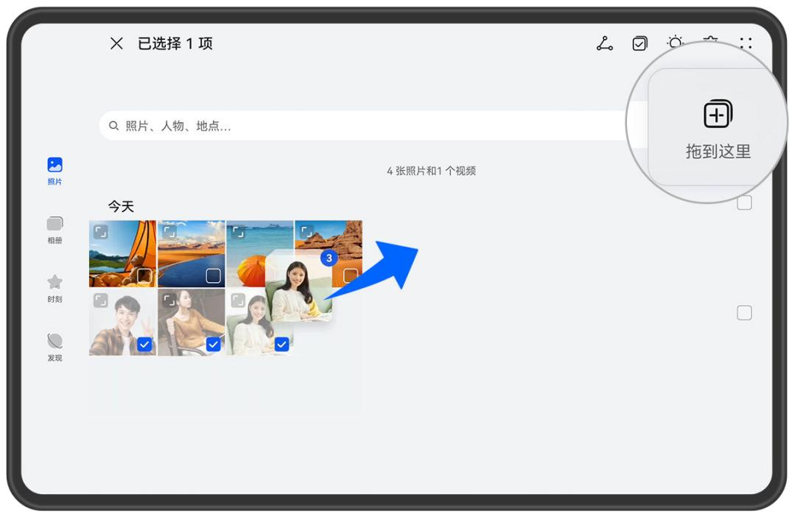

text_image

× 已选择 1 项
照片、人物、地点...
4 张照片和 1 个视频
拖到这里
今天

配图仅供参考，请以产品实际为准。

# 将内容拖拽至其它应用

您可以将中转站的内容拖出到备忘录或电子邮件等应用中编辑，也可以拖出到文件管理或图库等应用中存储，还可以拖出到畅连等应用中发送给好友。

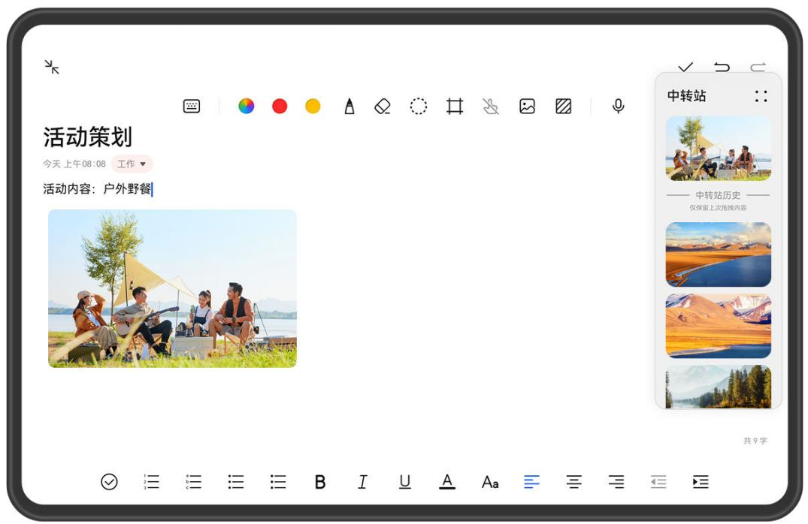

text_image

活动策划
今天 上午08:08 工作
活动内容：户外野餐
中转站
—— 中转站历史 ——
仅保留上次拖拽内容
共9字

0 配图仅供参考，请以产品实际为准。

例如，在编辑备忘录笔记时，您可以：

• 整体拖出：长按中转站悬浮窗，内容浮起后可拖出所有内容到笔记中。  
• 单个拖出：点击中转站悬浮窗展开中转站，长按想要的内容，浮起后拖出到笔记中。您也可以点击中转站的堆叠内容查看详情，从中选择单个内容拖出。  
• 多个拖出：点击中转站悬浮窗展开中转站，长按内容或点击 > 多选，勾选想要拖出的内容，长按内容浮起后拖出到笔记中。  
i 并非所有应用都支持拖拽，您可以前往官网了解支持的应用清单。

# 管理中转站

您可点击中转站悬浮窗展开中转站（若悬浮窗隐藏到屏幕边缘，可向屏幕内滑动唤出），通过如下操作管理中转站：

• 删除中转站的内容：长按内容或点击 > 多选，勾选要删除的内容，点击删除。  
• 关闭中转站悬浮窗：点击 > 关闭。关闭后，本次中转站的内容会移至中转站历史中，并覆盖上一次的历史内容。  
• 中转站历史：从中转站底部上滑可查看和使用中转站历史。

• 剪贴板：点击 > 剪贴板，根据界面提示开启剪贴板。开启后，剪切或复制的文本将在剪贴板 中显示。

您还可进入设置 > 辅助功能 > 中转站，开启或关闭剪贴板。

# 将内容流转至其它设备

当您想要在其它设备上接续完成本机上未完成的任务时，您可以将中转站的内容一键流转至其它支持中转站的设备。

1 在本机和待接收的设备上开启 WLAN、蓝牙，并登录同一华为帐号。

2 在本机上，点击中转站悬浮窗展开中转站，长按内容或点击 > 多选，勾选要流转的内容，点击流转，点击要接收的设备名称，一键流转至对应设备的中转站。

# 文件流转连接要求

流转需同时满足以下条件：

1 确保本机和待接收的设备支持中转站（后续将有更多设备支持）。

流转到手机/平板：确保手机/平板系统为 HarmonyOS 3 或 EMUI 13.0 及以上版本。

若手机/平板中无“中转站”设置项，则该手机/平板不支持此功能，请以实际情况为准。

流转到电脑：确保本机“中转站”已升级至 3.0.0.440 及以上版本，并将电脑管家升级至最新版本，点击 > 检查更新进行升级。

i 若电脑控制中心中无“中转站”图标，则该电脑不支持此功能，请以实际情况为准。

2 确保本机和待接收的设备上已开启 WLAN 、蓝牙，并登录同一华为帐号。

# 系统和更新

# 多设备协同升级

您可以通过平板对登录相同华为帐号的设备进行软件更新。协同更新过程中，根据设备联网能力，软件版本可通过设备自身下载，或者通过平板辅助下载。

• 此功能因产品而异，请以实际情况为准。

• 协同更新适用于手机、平板、智慧屏、手表、耳机等设备，且在不断扩展中，具体支持型号请以实际情况为准。

# 通过平板对蓝牙设备协同升级

0 下面以通过平板对蓝牙耳机协同升级为例说明，具体操作过程仅供参考，其他蓝牙设备请以实际情况为准。

1 将平板开启蓝牙，并与蓝牙耳机配对连接。

2 进入设置 > 系统和更新 > 软件更新，点击检查更新。

3 当系统检测到蓝牙耳机有新版本时，在升级设备列表中显示蓝牙耳机信息，您可以点击更新通过平板对此蓝牙耳机进行固件更新。

# 通过平板对智慧屏协同升级

0 下面以通过平板对智慧屏协同升级为例说明，具体操作过程仅供参考，其他设备请以实际情况为准。  
1 将平板和智慧屏开启蓝牙，连接网络，并登录同一华为帐号。  
2 在智慧屏首页选择设置 > 系统 > 软件更新，点击确认 > 协同更新开关已开启。

若您不愿意本机被其他设备协同升级，请关闭协同更新开关。

3 将平板进入设置 > 系统和更新 > 软件更新，点击 > 本机设置，确保协同更新开关已开启。  
若您不愿意本机被其他设备协同升级，请关闭协同更新开关。  
4 将平板进入设置 > 系统和更新 > 软件更新，点击检查更新。  
5 当系统检测到智慧屏有新版本时，在升级设备列表中显示智慧屏信息，您可以点击更新通过平板对此智慧屏进行软件更新。

# 关于平板电脑

# 法律声明

版权所有 © 2025 华为终端有限公司。保留一切权利。

本指南仅供参考，不构成任何形式的承诺，产品（包括但不限于颜色、大小、屏幕显示等）请以实物为准。

型号: BYD5-W10

BYD5-AL10

HarmonyOS 4.3\_01