# H3C ER2100 企业级路由器

用户手册

杭州华三通信技术有限公司

http://www.h3c.com.cn

资料版本：6W104-20150902

Copyright © 2009-2015 杭州华三通信技术有限公司及其许可者 版权所有，保留一切权利。

未经本公司书面许可，任何单位和个人不得擅自摘抄、复制本书内容的部分或全部，并不得以任何形式传播。

H3C、 、H3CS、H3CIE、H3CNE、Aolynk、 、H3 Care、 、IRF、NetPilot、Netflow、SecEngine、SecPath、SecCenter、SecBlade、Comware、ITCMM、HUASAN、华三均为杭州华三通信技术有限公司的商标。对于本手册中出现的其它公司的商标、产品标识及商品名称，由各自权利人拥有。

由于产品版本升级或其他原因，本手册内容有可能变更。H3C保留在没有任何通知或者提示的情况下对本手册的内容进行修改的权利。本手册仅作为使用指导，H3C尽全力在本手册中提供准确的信息，但是 H3C 并不确保手册内容完全没有错误，本手册中的所有陈述、信息和建议也不构成任何明示或暗示的担保。

# 前 言

H3C ER2100企业级路由器 用户手册将会详细地指导您如何通过 Web设置页面或命令行对设备进行本地管理。

前言部分包含如下内容：

读者对象  
本书约定  
资料获取方式  
技术支持  
资料意见反馈

# 读者对象

本手册主要适用于如下工程师：

网络规划人员  
现场技术支持与维护人员  
负责网络配置和维护的网络管理员

# 本书约定

1. 命令行格式约定

<table><tr><td>格式</td><td>意义</td></tr><tr><td>粗体</td><td>命令行关键字(命令中保持不变、必须照输的部分)采用加粗字体表示。</td></tr><tr><td>斜体</td><td>命令行参数(命令中必须由实际值进行替代的部分)采用斜体表示。</td></tr><tr><td>[]</td><td>表示用“[]”括起来的部分在命令配置时是可选的。</td></tr><tr><td>{x|y|...}</td><td>表示从多个选项中仅选取一个。</td></tr><tr><td>[x|y|...]</td><td>表示从多个选项中选取一个或者不选。</td></tr><tr><td>{x|y|...}*</td><td>表示从多个选项中至少选取一个。</td></tr><tr><td>[x|y|...]*</td><td>表示从多个选项中选取一个、多个或者不选。</td></tr><tr><td>&amp;&lt;1-n&gt;</td><td>表示符号&amp;前面的参数可以重复输入1~n次。</td></tr><tr><td>#</td><td>由“#”号开始的行表示为注释行。</td></tr></table>

2. 图形界面格式约定

<table><tr><td>格式</td><td>意义</td></tr><tr><td>&lt;&gt;</td><td>带尖括号“&lt;&gt;”表示按钮名,如“单击&lt;确定&gt;按钮”。</td></tr><tr><td>[]/</td><td>带方括号“[]”表示窗口名、菜单名和数据表,如“弹出[新建用户]窗口”。多级菜单用“/”隔开。如[文件/新建/文件夹]多级菜单表示[文件]菜单下的[新建]子菜单下的[文件夹]菜单项。</td></tr></table>

# 3. 各类标志

本书还采用各种醒目标志来表示在操作过程中应该特别注意的地方，这些标志的意义如下：

<table><tr><td> 警告</td><td>该标志后的注释需给予格外关注,不当的操作可能会对人身造成伤害。</td></tr><tr><td>[BYD5] 注意</td><td>提醒操作中应注意的事项,不当的操作可能会导致数据丢失或者设备损坏。</td></tr><tr><td>提示</td><td>为确保设备配置成功或者正常工作而需要特别关注的操作或信息。</td></tr><tr><td>说明</td><td>对操作内容的描述进行必要的补充和说明。</td></tr><tr><td> 窍门</td><td>配置、操作、或使用设备的技巧、小窍门。</td></tr></table>

# 资料获取方式

您可以通过H3C网站（www.h3c.com.cn）获取最新的产品资料：

H3C网站与产品资料相关的主要栏目介绍如下：

[服务支持/文档中心]： 可以获取硬件安装类、软件升级类、配置类或维护类等产品资料。  
[产品技术]：可以获取产品介绍和技术介绍的文档，包括产品相关介绍、技术介绍、技术白皮书等。  
[解决方案]：可以获取解决方案类资料。  
[服务支持/软件下载]：可以获取与软件版本配套的资料。

# 技术支持

用户支持邮箱：service@h3c.com

技术支持热线电话：400-600-9999（手机、固话均可拨打）

网址：http://www.h3c.com.cn

# 资料意见反馈

如果您在使用过程中发现产品资料的任何问题，可以通过以下方式反馈：

E-mail：info@h3c.com

感谢您的反馈，让我们做得更好！

# 目 录

# 1 您想了解什么？ 1-1

# 2 产品概述 · 2-1

2.1 产品简介 ···· ···· 2-1  
2.2 主要特性 ····· ··· 2-1

2.2.1 强大的功能特性 ·· 2-1  
2.2.2 友好的用户界面 ··· 2-2  
2.2.3 丰富的统计诊断功能和管理方式 · ·· 2-2

# 2.3 典型组网应用· ··· 2-2

# 3 登录Web设置页面 · ·· 3-1

3.1 准备工作 ·········· ········· 3-1

3.1.1 管理计算机要求 · 3-1  
3.1.2 建立网络连接 ······· ······· 3-1  
3.1.3 取消代理服务器 ······· ······· 3-3

# 3.2 登录路由器Web设置页面 ···· · 3-4

# 4 熟悉Web设置页面 · · 4-1

4.1 Web设置页面介绍 ······· ·· 4-1   
4.2 常用页面控件介绍 · 4-1  
4.3 页面列表操作介绍 ·· 4-2  
4.4 Web用户超时处理 ·· 4-3  
4.5 退出Web设置页面 ·· 4-3

# 5 接口设置 · 5-1

5.1 设置WAN ····· ···· 5-1

5.1.1 连接到因特网 ·· 5-1   
5.1.2 设置WAN口MAC地址克隆 ·· 5-3   
5.1.3 设置WAN口的速率和双工模式 ·· 5-3

# 5.2 设置LAN ···· ···· 5-4

5.2.1 修改LAN口的IP地址· ·· 5-4  
5.2.2 设置LAN口MAC地址克隆 ·· 5-5   
5.2.3 设置LAN口的基本属性 · ·· 5-5  
5.2.4 设置本地端口镜像 ·· 5-6

# 5.3 设置DHCP ···· ···· 5-7

5.3.1 DHCP简介 ···· ··5-7   
5.3.2 DHCP的IP地址分配 · ··· 5-8

5.3.3 设置DHCP服务器 · 5-9  
5.3.4 设置DHCP静态表 ··· 5-10  
5.3.5 显示和维护DHCP客户列表 ··· 5-12

# 6 安全专区 · 6-1

# 6.1 设置ARP安全 ···· ···· 6-1

6.1.1 ARP简介 ···· ··· 6-1   
6.1.2 设置ARP绑定 · ·· 6-3   
6.1.3 设置ARP检测 · ·· 6-5   
6.1.4 设置发送免费ARP· ·· 6-5

# 6.2 设置接入控制· ··· 6-7

6.2.1 设置MAC过滤 ·· 6-7   
6.2.2 设置网站过滤 ·· 6-8  
6.2.3 设置IPMAC过滤 · ··· 6-10

# 6.3 设置防火墙 ···· 6-11

6.3.1 设置出站通信策略 ··· 6-11   
6.3.2 设置入站通信策略 ··· 6-13

# 6.4 设置防攻击 ···· 6-15

6.4.1 防攻击方式··· ··· 6-15  
6.4.2 设置IDS防范 ···· ··· 6-15   
6.4.3 设置报文源认证 ··· 6-16   
6.4.4 设置异常流量防护 · ··· 6-17

# 7 设置IPSec VPN · 7-1

# 7.1 IPSec VPN简介 ···· ···· 7-1

7.1.1 IPSec简介 ···· · 7-1   
7.1.2 IPSec VPN常见的组网模式 ·· ·· 7-3

# 7.2 IPSec VPN设置方法 · ·· 7-4

# 7.3 通过快速向导实现IPSec VPN · · 7-4

# 7.4 通过高级设置实现IPSec VPN · ··· 7-6

7.4.1 设置IKE ·· · 7-6   
7.4.2 设置IPSec · ···· 7-10   
7.4.3 查看VPN状态 · ···· 7-13

# 8 设置QoS · 8-1

8.1 设置IP流量限制 ···· ··· 8-1  
8.2 设置网络连接限数 ········ ········· 8-3

# 9 高级设置 · 9-1

# 9.1 设置网络连接参数 ·· 9-1

9.2 设置虚拟服务器 ·· 9-1  
9.3 设置端口触发· ··· 9-3   
9.4 设置ALG应用· ·· 9-4   
9.5 设置静态路由···· ···· 9-5   
9.6 业务控制 · ··· 9-7

9.6.1 限制使用IM软件 ··· 9-7  
9.6.2 设置QQ特权号码 ··· 9-8   
9.6.3 限制使用金融软件 ··· 9-8

9.7 应用服务 · ··· 9-9

9.7.1 设置DDNS ··· 9-9   
9.7.2 设置UPnP · ·· 9-10

# 10 设备管理 · 10-1

10.1 基本管理 ····· 10-1

10.1.1 配置管理 ···· 10-1  
10.1.2 设置系统时间 · ···· 10-1  
10.1.3 软件升级 ···· 10-2  
10.1.4 重新启动路由器 ···· 10-3

10.2 用户管理 · ····· 10-3

10.2.1 登录管理 ···· 10-3  
10.2.2 密码管理 ··· 10-4

10.3 远程管理 ····· 10-4  
10.4 设置SNMP ··· ····· 10-5

10.4.1 SNMP简介 ·· ··· 10-5   
10.4.2 设置SNMP v1、SNMP v2c基本功能 ···· 10-6  
10.4.3 设置SNMP v3 基本功能 ···· 10-8  
10.4.4 设置TRAP ·· ··· 10-10

# 11 系统监控 · 11-1

11.1 查看运行信息· ···· 11-1

11.1.1 查看基本信息 ··· ··· 11-1  
11.1.2 查看运行状态 · ···· 11-3   
11.1.3 实时监视性能状态 · ···· 11-3   
11.1.4 技术支持信息 ··· ··· 11-4

11.2 查看和管理日志信息 · ···· 11-4

11.2.1 查看日志信息 · ···· 11-4  
11.2.2 管理日志信息 · ···· 11-4

11.3 流量监控 · ···· 11-6

11.3.1 监控端口流量 ·· ···· 11-6  
11.3.2 监控IP流量 · ··· 11-7  
11.3.3 实时监视WAN口流量 · ··· 11-8  
11.3.4 安全统计 ··· ···· 11-9

# 11.4 网络维护 ··· ··· 11-9

11.4.1 网络诊断 ··· 11-9  
11.4.2 系统自检 ···· 11-10  
11.4.3 导出故障定位信息 · ··· 11-11

# 12 典型组网配置举例 · 12-1

# 12.1 企业典型组网配置举例 ···· 12-1

12.1.1 组网需求 · ···· 12-1   
12.1.2 组网配置方案 ···· 12-1   
12.1.3 组网图 · ···· 12-2  
12.1.4 设置步骤 ···· 12-2

# 13 附录 - 命令行设置 · 13-1

13.1 通过Console口搭建配置环境 ··· 13-1  
13.2 命令行在线帮助 ···· 13-3   
13.3 命令行操作 ···· 13-4

13.3.1 修改路由器登录密码 ··· 13-4  
13.3.2 查看路由器LAN口的IP地址··· ··· 13-4  
13.3.3 恢复路由器到出厂设置 ··· 13-4   
13.3.4 重新启动路由器 ···· 13-4  
13.3.5 显示路由器系统资源使用情况 ··· 13-4  
13.3.6 显示路由器硬件信息 ··· 13-4  
13.3.7 显示局域网内允许访问路由器的用户IP地址信息 ··· 13-5  
13.3.8 恢复局域网内允许所有用户访问路由器 ··· 13-5  
13.3.9 网络连通性测试 ···· 13-5

# 14 附录 - 故障排除 · 14-1

# 15 附录 - 缺省设置 · 15-1

# 16 附录 - 术语表 · · 16-1

# 1 您想了解什么？

<table><tr><td>如果您想?</td><td>您可以查看</td></tr><tr><td>初识产品的大致形态、业务特性或者它在实际网络应用中的定位</td><td>“产品概述”</td></tr><tr><td>通过搭建Web环境来管理设备,同时想进一步熟悉其设置页面</td><td>“登录Web设置页面”和“熟悉Web设置页面”</td></tr><tr><td>通过Web设置页面来设置设备WAN口、LAN口的相关参数及DHCP功能</td><td>“接口设置”</td></tr><tr><td>通过Web设置页面来实现设备及网络环境的安全性,比如:ARP安全、接入控制、防火墙等</td><td>“安全专区”</td></tr><tr><td>通过Web设置页面来实现设备IPSec VPN功能</td><td>“设置IPSec VPN”</td></tr><tr><td>通过Web设置页面来设置设备WAN口的带宽、IP流量限制、网络连接限数等</td><td>“设置QoS”</td></tr><tr><td>通过Web设置页面来实现设备的高级业务功能,比如:虚拟服务器、业务控制、静态路由等</td><td>“高级设置”</td></tr><tr><td>通过Web设置页面对设备进行维护管理,比如:软件升级、用户管理、SNMP等</td><td>“设备管理”</td></tr><tr><td>通过Web设置页面对设备当前的设置状态进行查询或对系统运行情况进行监控等</td><td>“系统监控”</td></tr><tr><td>通过具体的典型组网举例来进一步理解设备的关键特性</td><td>“典型组网配置举例”</td></tr><tr><td>通过命令行来简单地维护设备</td><td>“附录-命令行设置”</td></tr><tr><td>定位或排除使用设备过程中遇到的问题</td><td>“附录-故障排除”</td></tr><tr><td>获取设备重要的缺省出厂配置信息</td><td>“附录-缺省设置”</td></tr></table>

# 产品概述

本章节主要包含以下内容：

产品简介  
主要特性  
典型组网应用

# 2.1 产品简介

感谢您选择了全新的 ER2100路由器（以下简称路由器）。

它是华三通信技术有限公司（以下简称 H3C）全新推出的一款面向中小企业的高性能宽带路由器，采用专业的 64位网络处理器，同时配合 DDRII RAM进行高速转发，可以达到百兆线速转发。路由器支持丰富的软件特性，比如：ARP防攻击、流量限速、QQ/MSN应用限制、DDNS动态域名、IPSecVPN 等功能，并提供非常简便、易操作的 Web 设置页面，可以帮您快速地完成各功能特性需求的配置。


# 说明

本手册中所描述的功能特性规格可能随产品的升级而发生改变，恕不另行通知。详情您可以向 H3C公司市场人员或技术支援人员咨询获取。

# 2.2 主要特性

# 2.2.1 强大的功能特性

高性能防火墙

内置高性能防火墙，通过设置出站和入站通信策略来快速地实现访问控制。

防攻击

支持对来自因特网和内网的常见攻击进行防护。同时，内置内网异常流量防护模块，对局域网内各台主机的流量进行检查，并根据您所选择的防护等级（支持高、中、低三种）进行相应的处理，确保网络在遭受此类异常攻击时仍能正常工作。

ARP 双重防护

通过静态 ARP绑定功能，固化了网关的 ARP表项；另外，对于DHCP分配的 IP地址，则采用 DHCP授权 ARP技术，自动绑定分配的 IP地址/MAC地址信息，从而可以有效地防止 ARP欺骗引起的内网通讯中断问题；同时，提供毫秒级的免费 ARP 定时发送机制，可以有效地避免局域网内主机中毒后引发的 ARP攻击。

业务控制

QQ/MSN等即时通讯软件的大量普及，可能会引起员工办公效率低下，无法集中精力。路由器独有的应用控制功能，可以方便地限制内网用户对 QQ/MSN 等应用的使用；同时还支持对大智慧/分析家/同花顺/广发至强/光大证券/国元证券等金融软件的应用控制功能。另外，您还可以通过对特权用户组的设置保证关键用户的使用不受影响。

# IPSec VPN

通过 VPN安全连接，最多支持 10路 IPSec连接到办公网络。并且，您无需了解专业的 VPN知识，只需通过简单的 VPN配置向导就可以实现 VPN隧道的创建。

# 网络流量监控

提供流量实时监控和排序功能，同时提供多种安全日志，包括内/外网攻击实时日志、地址绑定日志、流量告警日志和会话日志，为网络管理员实时监控网络运行状态和安全状态提供了更快捷的窗口。

# 网络流量限速

通过基于 IP的网络流量限速功能，可以有效地控制指定用户的上/下行流量，限制了 P2P软件对网络带宽的过度占用。同时，提供弹性带宽功能，在网络空闲时可以智能地提升用户的限制带宽，既充分地提升了网络带宽的利用率，又保证了网络繁忙时带宽的可用性。

# 2.2.2 友好的用户界面

提供非常简便的 Web设置页面，配置直观、易操作、使用复杂度低。  
• 提供了快速配置向导和 VPN配置向导，减少了网络配置时间，提高了效率。  
每个 Web设置页面均提供详细的联机帮助，供您查阅。

# 2.2.3 丰富的统计诊断功能和管理方式

提供了丰富的统计信息和状态信息显示功能，使您对路由器当前的运行状态一目了然。  
支持通过本地和远程 Web方式对路由器进行详细的配置和管理。  
支持通过 Console 口、Telnet 方式对路由器进行简单的命令行管理。

# 2.3 典型组网应用

图2-1 组网应用  
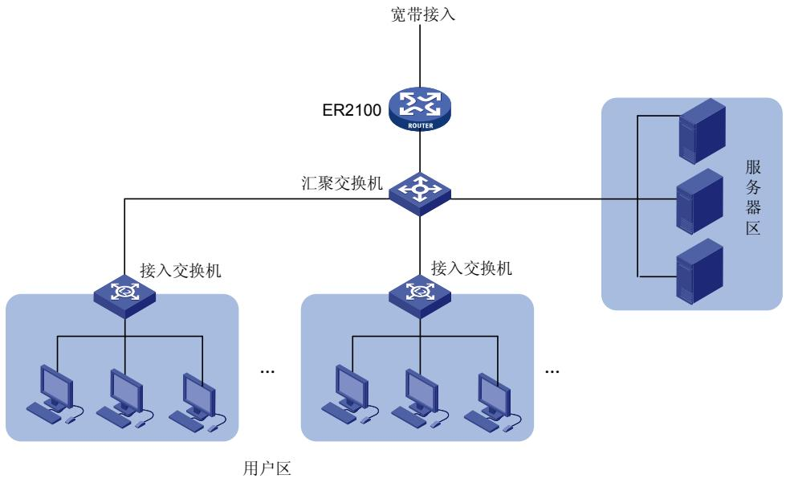

# 登录Web设置页面


# 说明

本小节仅介绍如何本地登录路由器的Web设置页面。如果您想实现远程登录路由器进行管理，需要先本地登录路由器，并开启其远程管理功能，相关的介绍请参见“10.3 远程管理”

本章节主要包含以下内容：

准备工作  
登录路由器Web设置页面

# 3.1 准备工作

完成硬件安装后（安装过程可参见《H3C ER2100企业级路由器快速入门》），在登录路由器的 Web设置页面前，您需要确保管理计算机和网络满足一些基本要求。

# 3.1.1 管理计算机要求

请确认管理计算机已安装了以太网卡。

# 3.1.2 建立网络连接

# 1. 设置管理计算机的IP地址

自动获取 IP地址（推荐使用）：请将管理计算机设置成“自动获得 IP地址”和“自动获得 DNS服务器地址”（计算机系统的缺省配置），由路由器自动为管理计算机分配 IP地址。  
设置静态 IP地址：请将管理计算机的 IP地址与路由器的 LAN口 IP地址设置在同一网段内（LAN 口缺省的 IP 地址为：192.168.1.1，子网掩码为 255.255.255.0）

操作步骤如下（以 Windows XP系统为例）：

(1) 单击屏幕左下角<开始>按钮进入[开始]菜单，选择“控制面板”。双击“网络连接”图标，再双击弹出的“本地连接”图标，弹出“本地连接状态”窗口

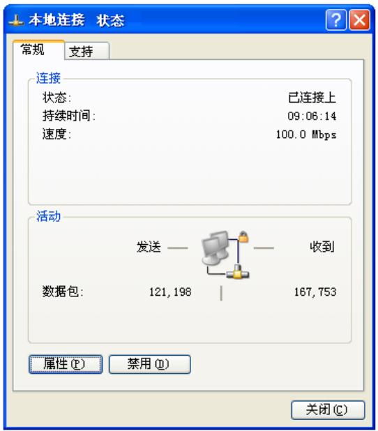

(2) 单击<属性>按钮，进入“本地连接属性”窗口

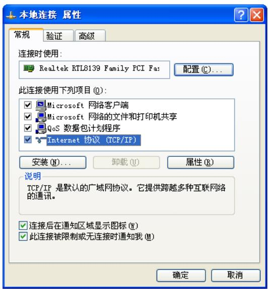

(3) 选中“Internet 协议（TCP/IP）”，单击<属性>按钮，进入“Internet协议（TCP/IP）属性”窗口。选择“使用下面的IP地址”单选按钮，输入IP地址（在 192.168.1.2～192.168.1.254 中任意值）、子网掩码（255.255.255.0）及默认网关（192.168.1.1），确定后完成操作

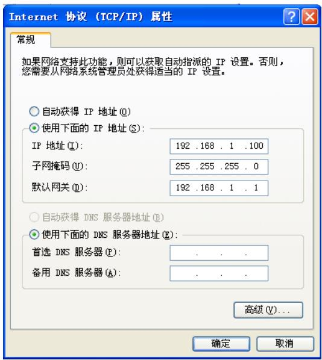

# 2. 确认管理计算机和路由器之间的网络是否连通

# 操作步骤如下：

(1) 单击屏幕左下角<开始>按钮进入[开始]菜单，选择“运行”，弹出“运行”对话框

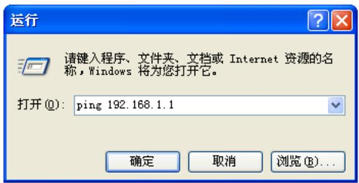

(2) 输入“ping 192.168.1.1（路由器的 IP 地址，此处是缺省 IP 地址）”，单击<确定>按钮。如果在弹出的对话框中显示了从路由器侧返回的回应，则表示网络连通；否则请检查网络连接

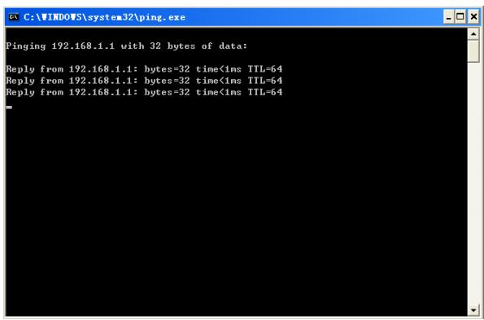

# 3.1.3 取消代理服务器

如果当前管理计算机使用代理服务器访问因特网，则必须取消代理服务，操作步骤如下：

(1) 在浏览器窗口中，选择[工具/Internet 选项]进入“Internet 选项”窗口

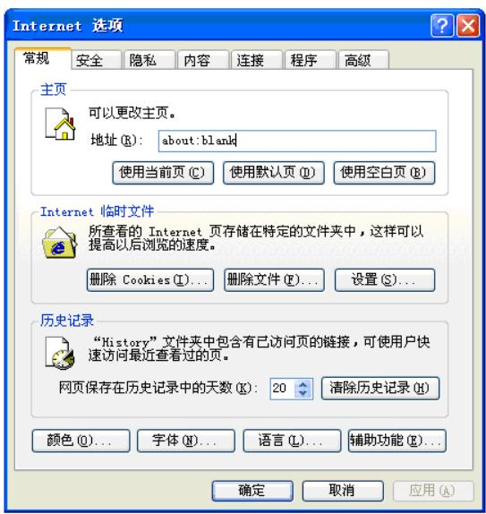

(2) 选择“连接”页签，并单击<局域网设置（L）>按钮，进入“局域网（LAN）设置”页面。请确认未选中“为LAN使用代理服务器”选项；若已选中，请取消并单击<确定>按钮

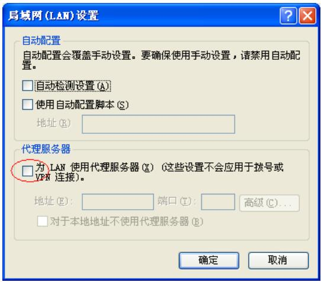

# 3.2 登录路由器Web设置页面

运行Web浏览器，在地址栏中输入“http://192.168.1.1”，回车后跳转到Web登录页面，如 图 3-1所示。输入用户名、密码（缺省均为admin，区分大小写）以及验证码（不区分大小写），单击<登录>按钮或直接回车即可进入Web设置页面。

图3-1 登录路由器 Web设置页面  


# 说明

• 同一时间，路由器最多允许五个用户通过 Web设置页面进行管理。当对路由器进行多用户管理时，建议不要同时对其进行配置操作，否则可能会导致数据配置不一致。  
• 为了安全起见，建议您首次登录后修改缺省的登录密码，并保管好密码信息。  
• 验证码功能会使您的系统安全性更高。如果您想在登录路由器Web设置页面时不需要输入验证码，可以通过 登录管理页面来设置其状态。

# 熟悉Web设置页面

路由器提供非常简便的 Web 设置页面，您可以通过该设置页面快速地完成所需功能的配置。本章将带领您先了解和熟悉 Web设置页面。

本章节主要包含以下内容：

Web设置页面介绍  
常用页面控件介绍  
页面列表操作介绍  
Web用户超时处理  
退出Web设置页面

# 4.1 Web设置页面介绍

图4-1 Web 设置页面示意图  
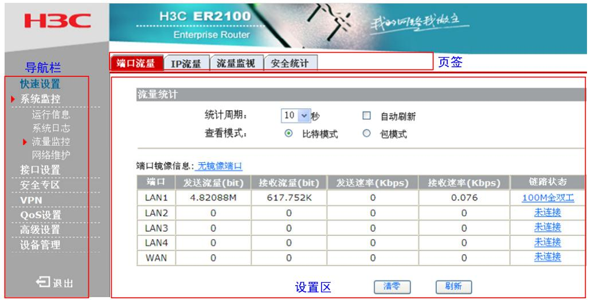

# 4.2 常用页面控件介绍

以下控件是 Web设置页面中经常出现的，有关它们的用途请参见下表。

表4-1 常见页面控件说明

<table><tr><td>页面控件</td><td>描述</td></tr><tr><td></td><td>文本框,用于输入文本</td></tr><tr><td>使用设备MAC:手工输入MAC:</td><td>单选按钮,用于从多个选项中选择一项</td></tr><tr><td>启用DHCP服务器</td><td>复选框,用于开启(选中)和关闭(未选中)该功能或服务</td></tr><tr><td>PPPoE(大部分的宽带网或xDSL)静态地址(手工配置地址)动态地址(从DHCP服务器自动获取)PPPoE(大部分的宽带网或xDSL)</td><td>下拉列表框,用于选择相应的列表项</td></tr><tr><td>应用</td><td>当您完成了某页面设置项的操作后,必须单击该页面上的&lt;应用&gt;按钮,设置才能生效</td></tr><tr><td>启用</td><td>如果页面中出现类似的蓝色字体项,您可以通过单击它来跳转到相应的页面进行设置修改</td></tr><tr><td>刷新自动刷新:禁止秒</td><td>单击&lt;刷新&gt;按钮,您可以手动对设置页面的数据进行更新;在“自动刷新”列表框中选择刷新频率后,页面的数据会自动根据该刷新频率进行更新</td></tr></table>

# 4.3 页面列表操作介绍

路由器的Web设置页面中经常会出现类似 图 4-2的页面，此处对其操作进行统一的介绍，以下不再赘述。

图4-2 页面列表举例  


表4-2 页面列表操作介绍

<table><tr><td>界面项</td><td>描述</td></tr><tr><td>查询</td><td>您可通过设置关键字,单击&lt;查询&gt;按钮来查看符合条件的列表项</td></tr><tr><td>显示全部</td><td>单击&lt;显示全部&gt;按钮,您可查看所有的列表项</td></tr><tr><td>全选</td><td>单击&lt;全选&gt;按钮,您可选中所有的列表项对其进行批量操作说明您也可以通过单击各列表项的方式来选中指定表项进行批量操作</td></tr><tr><td>新增 删除</td><td>单击&lt;新增&gt;按钮,您可在弹出的对话框中添加一个新的表项。添加完成后,您可以通过该页面中的查询功能来确认刚添加的表项是否已存在选中指定的列表项,单击&lt;删除&gt;按钮,您可将该列表项删除</td></tr><tr><td>[S+H4C]</td><td>单击该图标,您可在弹出的对话框中对该列表项进行修改 说明双击某列表项,同样也可在弹出的对话框中对该列表项进行修改</td></tr><tr><td>↑</td><td>当列表中的标题栏出现箭头时,表示您可以根据对应的标题项进行排序操作。您可以通过单击标题项来切换升序和降序方式 说明“↓”表示降序,“↑”表示升序</td></tr></table>

# 4.4 Web用户超时处理

当您长时间没有操作Web设置页面时，系统超时并将注销本次登录，返回到Web设置登录页面（如图 3-1 所示）。


# 说明

Web用户登录的超时时间缺省为 5 分钟。如果您想修改此超时时间，相关操作请参见“10.2.1 登录管理”

# 4.5 退出Web设置页面

单击导航栏中的 退出 确认后即可退出 Web设置页面。

# 接口设置

本章节主要包含以下内容：

设置WAN   
设置LAN   
设置DHCP

# 5.1 设置WAN

# 5.1.1 连接到因特网

路由器支持静态地址、动态地址、PPPoE三种连接方式。具体选择何种方式请咨询当地运营商。

静态地址：手动为 WAN口设置 IP地址和子网掩码。  
• 动态地址：设置 WAN口作为 DHCP客户端，使用 DHCP方式获取 IP地址。  
PPPoE：设置WAN口作为PPPoE客户端，使用PPPoE用户名和密码拨号连接获取IP地址。

页面向导：接口设置→WAN设置→连接到因特网

本页面为您提供如下主要功能：

• 通过静态地址连接到因特网

设置WAN口参数

<table><tr><td>WAN网口:</td><td>静态地址(手工配置地址)</td></tr><tr><td>IP 地址:</td><td>218.3.55.6</td></tr><tr><td>子网掩码:</td><td>255.255.255.0</td></tr><tr><td>缺省网关:</td><td>218.3.55.1</td></tr><tr><td>MTU:</td><td>1500 (范围:576~1500,缺省值:1500)</td></tr><tr><td>主DNS服务器:</td><td>202.55.4.2 (可选)</td></tr><tr><td>辅DNS服务器:</td><td>0.0.0.0 (可选)</td></tr></table>

• 通过动态地址连接到因特网

设置WAN口参数

<table><tr><td>WAN网口:</td><td colspan="2">动态地址(从DHCP服务器自动获取)</td></tr><tr><td>MTU:</td><td>1500</td><td>(范围:576~1500,缺省值:1500)</td></tr><tr><td>主DNS服务器:</td><td>0.0.0.0</td><td>(可选)</td></tr><tr><td>辅DNS服务器:</td><td>0.0.0.0</td><td>(可选)</td></tr><tr><td>主机名:</td><td></td><td>(可选,范围:1~15个字符)</td></tr></table>

# • 通过PPPoE连接到因特网

设置WAN口参数  
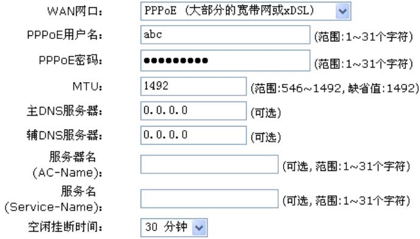

页面中关键项的含义如下表所示。

表5-1 页面关键项描述

<table><tr><td>页面关键项</td><td>描述</td></tr><tr><td>IP地址</td><td>设置路由器WAN口的IP地址。由运营商提供</td></tr><tr><td>子网掩码</td><td>设置路由器WAN口的IP地址子网掩码。由运营商提供</td></tr><tr><td>缺省网关</td><td>设置路由器WAN口的缺省网关地址。由运营商提供</td></tr><tr><td>MTU</td><td>设置路由器WAN口允许通过的最大传输单元,单位为字节。建议您使用缺省值</td></tr><tr><td>主DNS服务器</td><td>设置路由器主域名服务器的地址,用于将便于记忆的、有意义的域名解析为正确的IP地址。由运营商提供</td></tr><tr><td>辅DNS服务器</td><td>设置路由器辅域名服务器的地址,用于当主域名服务器失效时,可以由它来完成解析。由运营商提供</td></tr><tr><td>主机名</td><td>设置在路由器使用DHCP方式获取IP地址时,DHCP服务器侧显示的路由器主机名</td></tr><tr><td>PPPoE用户名</td><td>设置PPPoE拨号上网时,身份验证使用的用户名。由运营商提供</td></tr><tr><td>PPPoE密码</td><td>设置PPPoE拨号上网时,身份验证使用的密码。由运营商提供</td></tr><tr><td>服务器名</td><td>设置PPPoE服务器的名称。由运营商提供</td></tr><tr><td>服务名</td><td>设置PPPoE服务器的服务名称。由运营商提供</td></tr><tr><td>空闲挂断时间</td><td>设置PPPoE空闲时自动断开拨号的时间,在按时计费的网络环境中,这样处理可以节省网络费用。缺省情况下为不自动挂断拨号</td></tr></table>


# 说明

• 当您需要设置运营商分配给您的带宽时，相关操作请参见“8.1 设置IP流量限制”。  
• 设置完成后，您可以通过查看 基本信息页面中的“WAN网口状态”来验证设置是否已生效。

# 5.1.2 设置WAN口MAC地址克隆

路由器出厂时，各 WAN 口都有一个缺省的 MAC 地址，一般情况下，无需改变。但是，比如：有些运营商要求只有注册过的路由器才能连接到因特网，此时，您就需要使用路由器 WAN 口 MAC地址克隆功能，将 WAN口 MAC地址修改为在运营商侧注册过的 MAC地址。

# 页面向导：接口设置→WAN设置→MAC地址克隆

本页面为您提供如下主要功能：

• 设置 WAN口 MAC地址克隆

# WAN网口MAC地址克隆

某些ISP要求注册您的MAC地址，只有您注册的那个MAC地址才能上网，如果是这样的情况，本设备的MAC地址也必须改为那个曾经注册过的MAC地址。

WAN网口：

0 使用本设备的MAC(08:00:12:34:56:58)

使用这台PC的MAC(OO:OA:EB:7F:AA:AB)

手工输入MAC:08:00:12:34:56:58

应用

页面中关键项的含义如下表所示。

表5-2 页面关键项描述

<table><tr><td>页面关键项</td><td>描述</td></tr><tr><td>使用本设备的MAC地址</td><td>选中该项,使用路由器出厂时的MAC地址</td></tr><tr><td>使用这台PC的MAC地址</td><td>选中该项,使用用来设置路由器的管理计算机的MAC地址</td></tr><tr><td>手工输入MAC地址</td><td>选中该项,输入在运营商侧注册过的MAC地址</td></tr></table>


# 说明

• 当进行 WAN口 MAC地址克隆设置时，如果更换了 MAC地址，则 WAN口会重新进行初始化。在此过程中，转发的流量会因为接口地址和路由的变化，会重新选择出接口。待接口初始化完成以后，新建立的转发业务才会按照您所设置的方式进行转发。  
• 设置完成后，您可以通过查看 基本信息页面中的“MAC地址”来验证设置是否已生效。

# 5.1.3 设置WAN口的速率和双工模式

路由器的 WAN口支持以下几种速率和双工模式的组合：

表5-3 WAN 口的速率和双工模式

<table><tr><td>项目</td><td>描述</td></tr><tr><td>Auto</td><td>WAN口的双工和速率状态均由本端口和对端端口自动协商而定说明缺省情况下,WAN口采用Auto模式</td></tr><tr><td>10M半双工</td><td>WAN口工作在10Mbps速率下,且端口同一时刻只能发送数据包或接收数据包</td></tr><tr><td>10M全双工</td><td>WAN口工作在10Mbps速率下,且端口在发送数据包的同时可以接收数据包</td></tr><tr><td>100M半双工</td><td>WAN口工作在100Mbps速率下,且端口同一时刻只能发送数据包或接收数据包</td></tr><tr><td>100M全双工</td><td>WAN口工作在100Mbps速率下,且端口在发送数据包的同时可以接收数据包</td></tr></table>

# 页面向导：接口设置→WAN设置→网口模式

本页面为您提供如下主要功能：

• 选择WAN口的速率和双工模式

WAN网口连接速度和双工模式

<table><tr><td rowspan="6">WAN网口:</td><td>Auto</td></tr><tr><td>10M半双工</td></tr><tr><td>10M全双工</td></tr><tr><td>100M半双工</td></tr><tr><td>100M全双工</td></tr><tr><td>应用</td></tr></table>


# 说明

• 除了 Auto 模式外，路由器 WAN 口的速率和双工模式需要与对端设备保持一致。  
• 设置完成后，您可以通过查看 端口流量页面中的“链路状态”来验证设置是否已生效。

# 5.2 设置LAN

# 5.2.1 修改LAN口的IP地址

当您修改了路由器 LAN口的 IP地址后，您需要在浏览器中输入新的 IP地址重新登录，才能对路由器继续进行配置和管理。比如：某企业事先已经将整个 IP地址段均已规划好，因此，您需要根据已规划好的 IP地址来修改路由器 LAN口的 IP地址，以适应实际环境。

# 页面向导：接口设置→LAN 设置→局域网设置

本页面为您提供如下主要功能：

修改LAN口的 IP地址（缺省情况下，路由器LAN口的IP地址为192.168.1.1，子网掩码为255.255.255.0）

LAN设置 

<table><tr><td>IP地址:</td><td>192.168.1.1</td></tr><tr><td>子网掩码:</td><td>255.255.255.0</td></tr></table>


# 说明

修改 LAN口 IP地址后，其他页面中和 IP地址相关的配置可能需要相应修改（如 IP/MAC绑定表中的 IP地址等），保持和 LAN口 IP在统一网段。

# 5.2.2 设置LAN口MAC地址克隆

路由器出厂时，LAN口均有一个缺省的 MAC地址，一般情况下，无需改变。但是，比如：某企业之前为了防止 ARP攻击，给局域网内的主机均设置了网关的静态 ARP表项。此时，如果企业想升级设备，将原来的网关换成了路由器（网关地址保持不变），局域网内的主机则无法学习到路由器的 MAC地址。因此，您需要逐个修改局域网内主机的静态 ARP表项，才可使局域网内的主机恢复正常上网，这样维护效率会很低。

路由器的 LAN口 MAC克隆功能可以使您免除这样的重复劳动，只需将路由器的 LAN口 MAC地址设为原来网关的 MAC地址，局域网内的主机即可正常上网了。

# 页面向导：接口设置→LAN 设置→局域网设置

本页面为您提供如下主要功能：

• 设置 LAN口 MAC地址克隆


页面中关键项的含义如下表所示。

表5-4 页面关键项描述

<table><tr><td>页面关键项</td><td>描述</td></tr><tr><td>使用本设备MAC</td><td>选中该项,使用路由器LAN口出厂时的MAC地址</td></tr><tr><td>手工输入MAC</td><td>选中该项,输入原网关的MAC地址</td></tr></table>

# 5.2.3 设置LAN口的基本属性

路由器 LAN口的基本属性包括端口的速率/双工模式、广播风暴抑制和流控功能。

# 1. 速率/双工模式

路由器的 LAN口支持以下几种速率和双工模式的组合：

表5-5 LAN口的速率和双工模式

<table><tr><td>项目</td><td>描述</td></tr><tr><td>Auto</td><td>LAN口的双工和速率状态均由本端口和对端端口自动协商而定说明缺省情况下,LAN口采用Auto模式</td></tr><tr><td>10M半双工</td><td>LAN口工作在10Mbps速率下,且端口同一时刻只能发送数据包或接收数据包</td></tr><tr><td>10M全双工</td><td>LAN口工作在10Mbps速率下,且端口在发送数据包的同时可以接收数据包</td></tr><tr><td>100M半双工</td><td>LAN口工作在100Mbps速率下,且端口同一时刻只能发送数据包或接收数据包</td></tr><tr><td>100M全双工</td><td>LAN口工作在100Mbps速率下,且端口在发送数据包的同时可以接收数据包</td></tr></table>

# 2. 广播风暴抑制

如果局域网内存在大量的广播报文流量（可能由病毒导致）时，将会影响网络的正常通信。您可以通过设置路由器 LAN口的广播风暴抑制功能，可以有效地抑制大量广播报文的传播，避免网络拥塞，保证网络业务的正常运行。

路由器允许您设置四种 LAN 口的广播风暴抑制状态级别：不抑制、低、中、高。这四个级别允许通过的报文流量依次减少，您可根据实际需求进行相应的设置。缺省情况下，LAN口的广播风暴抑制功能处于关闭状态（即不抑制）。

# 3. 流控

一般仅在网络拥塞比较严重时，才开启路由器 LAN口的流控功能。

当路由器和对端设备都开启了流量控制功能后，如果路由器发生拥塞：

路由器将向对端设备发送消息，通知对端设备暂时停止发送报文或减慢发送报文的速度  
对端设备在接收到该消息后，将暂停向路由器发送报文或减慢发送报文的速度，从而避免了报文丢失现象的发生，保证了网络业务的正常运行

缺省情况下，路由器 LAN 口的流控功能处于关闭状态。

# 页面向导：接口设置→LAN 设置→端口设置

本页面为您提供如下主要功能：

• 设置LAN口的基本属性

端口设置   
端口设置允许您为设备LAN口设置工作模式、广播风暴抑制、流控等属性。

<table><tr><td>端口</td><td>端口模式</td><td>广播风暴抑制</td><td>流控启用</td></tr><tr><td>LAN1</td><td>Auto</td><td>不抑制</td><td></td></tr><tr><td>LAN2</td><td>Auto</td><td>不抑制</td><td></td></tr><tr><td>LAN3</td><td>Auto</td><td>不抑制</td><td></td></tr><tr><td>LAN4</td><td>Auto</td><td>不抑制</td><td></td></tr></table>

注意：广播风暴抑制功能各个LAN口必须设置成一致。

应用


# 说明

• 除了 Auto 模式外，路由器 LAN 口的速率和双工模式需要与对端设备保持一致。  
• 设置完成后，您可以通过查看 端口流量面中的“链路状态”来验证端口模式设置是否已生效。

# 5.2.4 设置本地端口镜像

端口镜像是将指定镜像源端口的报文复制到镜像目的端口，镜像目的端口会与数据监测设备相连，用户利用这些数据监测设备来分析复制到目的端口的报文，进行网络监控和故障排除。

路由器提供本地端口镜像功能，即镜像源端口和镜像目的端口在同一台设备上。

图5-1 本地端口镜像示意图  
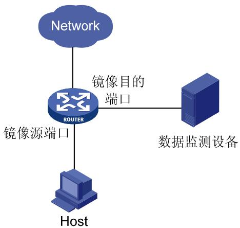

页面向导：端口管理→端口配置→端口镜像

本页面为您提供如下主要功能：

• 通过设置镜像源端口（被镜像端口）和镜像目的端口（镜像端口）来实现路由器的本地端口镜像

# 端口镜像

端口镜像能够将被镜像端口的报文自动复制到镜像端口，实时提供各端口传输状况的详细资料，方便网络管理人员进行流量监控、性能分析和故障诊断。

<table><tr><td>端口</td><td>镜像端口</td><td>被镜像端口</td></tr><tr><td>WAN</td><td></td><td></td></tr><tr><td>LAN1</td><td></td><td></td></tr><tr><td>LAN2</td><td></td><td></td></tr><tr><td>LAN3</td><td></td><td></td></tr><tr><td>LAN4</td><td></td><td></td></tr></table>


# 说明

设置完成后，您可以通过查看 端口流量页面中的“端口镜像信息”来验证设置是否已生效。

# 5.3 设置DHCP

# 5.3.1 DHCP简介

DHCP采用“客户端/服务器”通信模式，由客户端向服务器提出配置申请，服务器返回为客户端分配的 IP地址等配置信息，以实现网络资源的动态配置。

在DHCP的典型应用中，一般包含一台DHCP服务器和多台DHCP客户端（比如：PC和便携机），如图 5-2 所示。

图5-2 DHCP 典型应用   
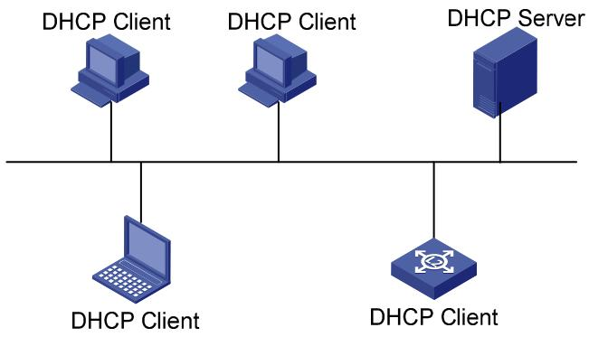

当DHCP客户端和DHCP服务器处于不同物理网段时，客户端可以通过DHCP中继与服务器通信，获取IP地址及其他配置信息，如 图 5-3 所示。

图5-3 DHCP中继的典型组网应用  
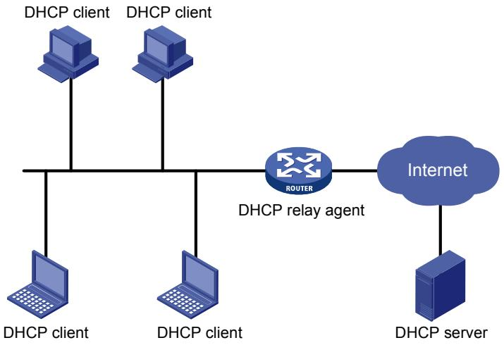

# 5.3.2 DHCP的IP地址分配

# 1. IP地址分配策略

路由器作为 DHCP服务器，提供两种 IP地址分配策略：

手工分配地址：由管理员为特定客户端静态绑定 IP地址。通过 DHCP将配置的固定 IP地址分配给客户端。  
动态分配地址：DHCP为客户端分配具有一定有效期限的 IP地址，当使用期限到期后，客户端需要重新申请地址。

# 2. IP地址分配机制

(1) 路由器接收到 DHCP 客户端申请 IP 地址的请求时，首先查找手工设置的 DHCP 静态表，如果这台 DHCP客户端的MAC地址在DHCP静态表中，则把对应的 IP地址分配给该 DHCP客户端。

(2) 如果申请 IP 地址的 DHCP 客户端 MAC 地址不在 DHCP 静态表中，或者 DHCP 客户端申请的 IP地址与LAN口的 IP地址不在同一网段，路由器会从地址池中选择一个在局域网中未被使用的 IP 地址分配给该主机。  
(3) 如果地址池中没有任何可分配的 IP 地址，则主机获取不到 IP 地址。


# 说明

如果主机离线（比如：主机关机了），路由器不会马上把之前分给它的 IP地址分配出去，只有在地址池中没有其他可分配的 IP地址，且该离线主机 IP地址的租约过期时，才会分配出去。

# 5.3.3 设置DHCP服务器

页面向导：接口设置→DHCP 设置→DHCP 设置

本页面为您提供如下主要功能：

• 显示接口地址池及全局地址池列表

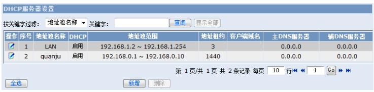

• 设置接口地址池

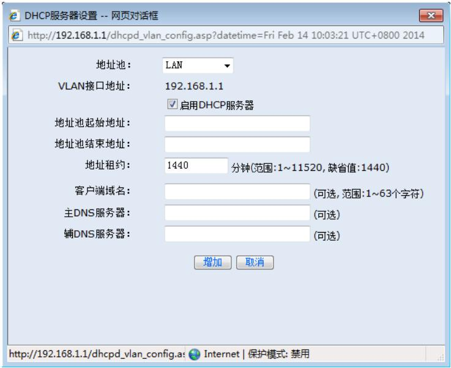

• 设置全局地址池

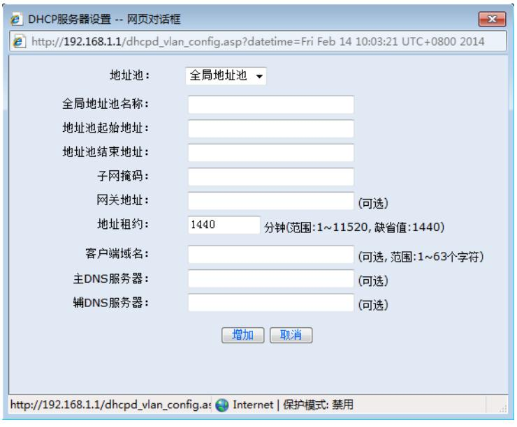

页面中关键项的含义如下表所示。

表5-6 页面关键项描述

<table><tr><td>页面关键项</td><td>描述</td></tr><tr><td>地址池名称</td><td>选择需要在哪一个VLAN接口上创建DHCP服务器,一个VLAN接口上只能创建一个DHCP服务器</td></tr><tr><td>全局地址池名称</td><td>如果您选择全局地址池,请输入全局地址池的名称</td></tr><tr><td>地址池起始地址</td><td>DHCP服务器地址池的起始地址</td></tr><tr><td>地址池结束地址</td><td>DHCP服务器地址池的结束地址,地址池结束地址不能小于地址池起始地址</td></tr><tr><td>子网掩码</td><td>如果您选择全局地址池,请配置该全局地址池对应的子网掩码</td></tr><tr><td>网关地址</td><td>如果您选择全局地址池,请配置该全局地址池对应的网关地址,如果您不配置网关地址,有可能造成网络不通</td></tr><tr><td>地址租约</td><td>设置DHCP服务器分配给客户端IP地址的租借期限。当租借期满后,DHCP服务器会收回该IP地址,客户端必须重新向路由器申请(客户端一般会自动申请)缺省情况下,地址租约为1440分钟</td></tr><tr><td>客户端域名</td><td>设置DHCP服务器分配给客户端使用的域名地址后缀</td></tr><tr><td>主DNS服务器</td><td>设置DHCP服务器分配IP地址时所携带的主DNS服务器地址缺省情况下,非全局地址池的DNS服务器分配IP地址时所携带的DNS服务器地址为网关地址。全局地址池时,如果您不配置任何DNS服务器,有可能造成网络不通</td></tr><tr><td>辅DNS服务器</td><td>设置DHCP服务器分配IP地址时所携带的辅DNS服务器地址</td></tr></table>

# 5.3.4 设置DHCP静态表

如果您想让路由器给某些特定的客户端分配固定的 IP 地址，可以事先通过 DHCP 静态表将客户端的 MAC地址和 IP地址进行绑定，使其成为一对一的分配关系。


# 说明

当您设置路由器通过DHCP方式为客户端分配IP地址的同时又设置了 ARP绑定，此时，请确保DHCP静态表项与ARP绑定表项不冲突，否则对应的客户端可能无法上网。建议您可以将 ARP绑定表导出，然后再将其导入到DHCP静态表中。

# 页面向导：接口设置→DHCP 设置→DHCP 静态表

本页面为您提供如下主要功能：

显示和修改已添加的DHCP静态表项（主页面）

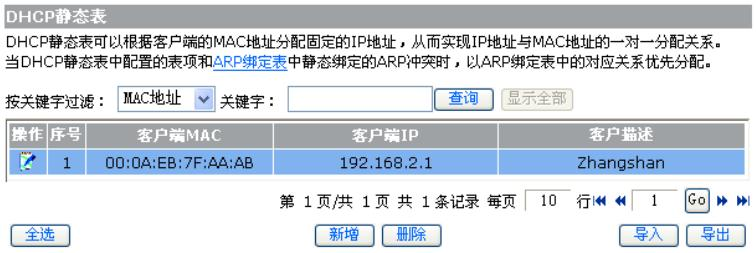

• 单个添加DHCP静态表项（单击主页面上的<新增>按钮，在弹出的对话框中设置相应的参数，并单击<增加>按钮完成操作）

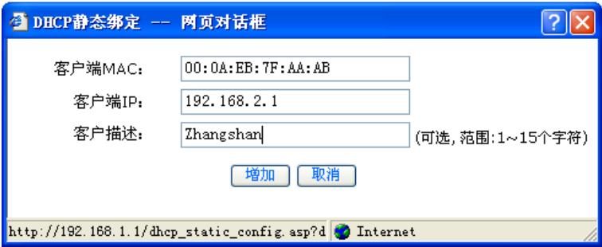

• 批量添加DHCP静态表项（您可以先在本地编辑一个.cfg文件，内容格式为“MAC地址 IP地址 描述”（比如：00:0A:EB:7F:AA:AB192.168.1.2 zhangshan），且每条静态表项之间需换行。单击主页面上的<导入>按钮，在弹出的对话框中选择该文件将其导入即可）

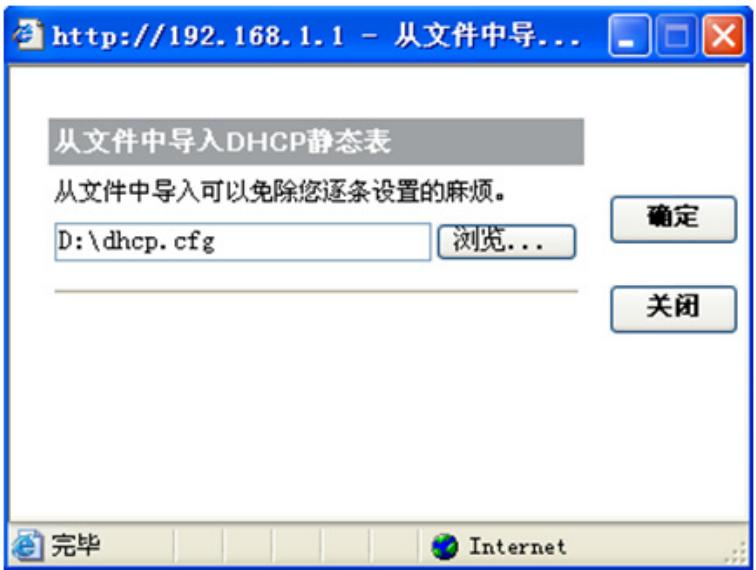

将路由器当前的DHCP静态表项备份保存（.cfg文件），且您可用“记事本”程序打开该文件进行编辑（单击主页面上的<导出>按钮，确认后即可将其导出到本地）

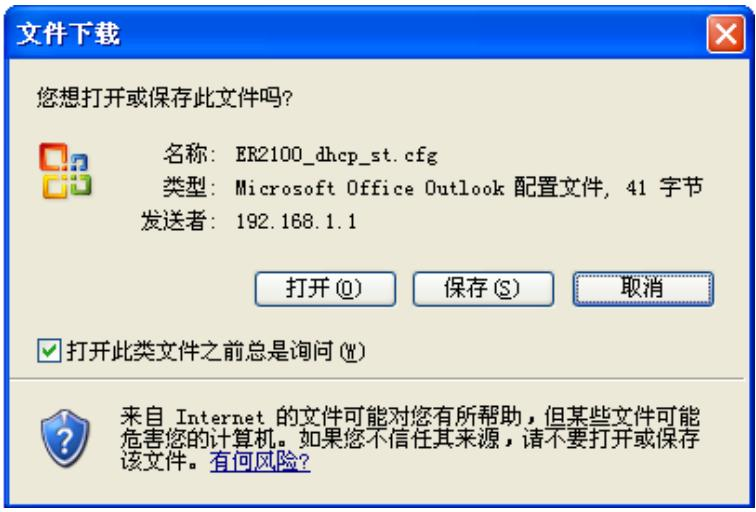

# 5.3.5 显示和维护DHCP客户列表

页面向导：接口设置→DHCP 设置→DHCP 客户列表

本页面为您提供如下主要功能：

显示已分配的DHCP客户列表信息  
• 释放并回收指定客户端的IP地址，使该IP地址可以重新被分配（选择指定的客户项，比如：已关机客户PC，单击<释放>按钮即可）


# 6 安全专区

本章节主要包含以下内容：

设置ARP安全  
设置接入控制  
设置防火墙   
设置防攻击

# 6.1 设置ARP安全

# 6.1.1 ARP简介

# 1. ARP作用

ARP是将 IP地址解析为以太网 MAC地址（或称物理地址）的协议。

在局域网中，当主机或其他网络设备有数据要发送给另一个主机或设备时，它必须知道对方的网络层地址（即 IP地址）。但是仅仅有 IP地址是不够的，因为 IP数据报文必须封装成帧才能通过物理网络发送。因此发送方还必须有接收方的物理地址，需要一个从 IP 地址到物理地址的映射。APR就是实现这个功能的协议。

# 2. ARP报文结构

图6-1 ARP 报文结构  
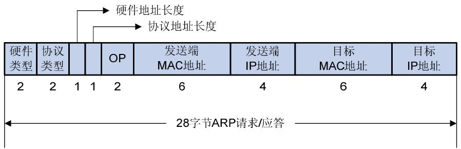

硬件类型：表示硬件地址的类型。它的值为 1表示以太网地址。  
协议类型：表示要映射的协议地址类型。它的值为 0x0800即表示 IP地址。  
硬件地址长度和协议地址长度分别指出硬件地址和协议地址的长度，以字节为单位。对于以太网上 IP地址的 ARP请求或应答来说，它们的值分别为 6和 4。  
操作类型（OP）：1 表示 ARP 请求，2 表示 ARP 应答。  
发送端 MAC地址：发送方设备的硬件地址。  
发送端 IP 地址：发送方设备的 IP 地址。  
目标 MAC地址：接收方设备的硬件地址。  
目标 IP地址：接收方设备的 IP地址。

# 3. ARP地址解析过程

假设主机A和B在同一个网段，主机A要向主机B发送信息。如 图 6-2所示，具体的地址解析过程如下：

(1) 主机 A 首先查看自己的 ARP 表，确定其中是否包含有主机 B 对应的 ARP 表项。如果找到了对应的 MAC地址，则主机 A直接利用 ARP表中的 MAC地址，对 IP数据包进行帧封装，并将数据包发送给主机 B。  
(2) 如果主机 A 在 ARP 表中找不到对应的 MAC 地址，则将缓存该数据报文，然后以广播方式发送一个 ARP请求报文。ARP请求报文中的发送端 IP地址和发送端 MAC地址为主机 A的 IP地址和 MAC地址，目标 IP地址和目标 MAC地址为主机 B的IP地址和全0的 MAC地址。由于ARP请求报文以广播方式发送，该网段上的所有主机都可以接收到该请求，但只有被请求的主机（即主机 B）会对该请求进行处理。  
(3) 主机 B 比较自己的 IP 地址和 ARP 请求报文中的目标 IP 地址，当两者相同时进行如下处理：将 ARP请求报文中的发送端（即主机 A）的 IP地址和 MAC地址存入自己的 ARP表中。之后以单播方式发送 ARP 响应报文给主机 A，其中包含了自己的 MAC 地址。  
(4) 主机 A 收到 ARP 响应报文后，将主机 B 的 MAC 地址加入到自己的 ARP 表中以用于后续报文的转发，同时将 IP数据包进行封装后发送出去。

图6-2 ARP地址解析过程  
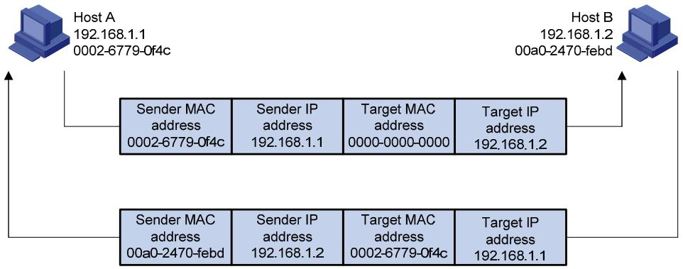

当主机 A和主机 B不在同一网段时，主机 A就会先向网关发出 ARP请求，ARP请求报文中的目标IP地址为网关的 IP地址。当主机 A从收到的响应报文中获得网关的 MAC地址后，将报文封装并发给网关。如果网关没有主机 B的 ARP表项，网关会广播 ARP请求，目标 IP地址为主机 B的IP地址，当网关从收到的响应报文中获得主机 B的 MAC地址后，就可以将报文发给主机 B；如果网关已经有主机 B的 ARP表项，网关直接把报文发给主机 B。

# 4. ARP表

设备通过 ARP解析到目的 MAC地址后，将会在自己的 ARP表中增加 IP地址到 MAC地址的映射表项，以用于后续到同一目的地报文的转发。

ARP表项分为动态 ARP表项和静态 ARP表项。

动态 ARP表项

动态 ARP表项由 ARP协议通过 ARP报文自动生成和维护，会被新的 ARP报文所更新。

静态 ARP表项

静态 ARP 表项需要通过手工配置和维护，不会被动态的 ARP 表项所覆盖。

配置静态 ARP表项可以增加通信的安全性。它可以限制和指定 IP地址的设备通信时只使用指定的MAC 地址，此时攻击报文无法修改此表项的 IP 地址和 MAC 地址的映射关系，从而保护了本设备和指定设备间的正常通信。

# 6.1.2 设置ARP绑定

通过设置 ARP绑定，可以有效地防止路由器的 ARP表项受到攻击，保证了网络的安全。

# 1. 设置动态ARP绑定

为了防止通过DHCP方式获取IP地址的主机在路由器上的ARP表项被篡改，您可以开启动态ARP绑定功能，使得所有通过 DHCP服务器分配出去的 IP地址和其对应的 MAC地址自动绑定。且动态绑定的表项在地址租约到期后不会被删除。

# 页面向导：安全专区→ARP 安全→ARP 绑定

页面为您提供如下主要功能：

• 设置动态ARP绑定（选中“对DHCP分配的地址进行ARP保护”复选框，单击<应用>按钮生效）

# 对DHCP分配的地址进行ARP保护（动态绑定）

对DHCP分配的地址进行ARP保护(动态绑定)

应用


# 说明

开启动态 ARP绑定后，路由器通过 DHCP方式获取到的 ARP表项状态为“动态绑定”。反之，则为“未绑定”。

# 2. 设置静态ARP绑定

静态 ARP 绑定即需要通过手工配置和维护。建议您将局域网内所有主机都添加到路由器的静态ARP 表项中。

# 页面向导：安全专区→ARP 安全→ARP 绑定

本页面为您提供如下主要功能：

• 显示和修改ARP表项（主页面）  
• 将动态获取到的ARP表项进行绑定（选中动态获取到的表项，单击<静态绑定>按钮即可完成绑定。此时，ARP表项状态则为“静态绑定”）

# ARP绑定表

ARP静态绑定功能一般用于静态设置IP环境下的ARP攻击防护，在这种环境下，建议您绑定内网所有的主机。


单个添加静态ARP表项（单击主页上的<新增>按钮，在弹出的对话框中设置相应的参数，并单击<增加>按钮完成操作）

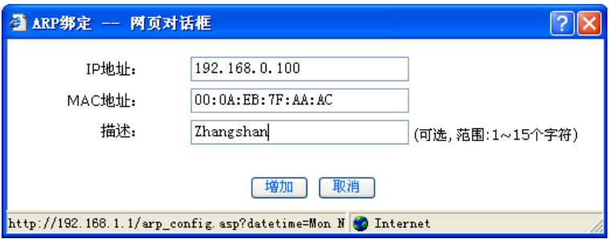

批量添加静态ARP表项（您可以在本地用“记事本”程序创建一个.cfg文件，内容格式为“MAC地址 IP地址 描述”（比如：00:0A:EB:7F:AA:AB 192.168.1.2zhangshan），且每条绑定项之间需换行。单击主页面上的<导入>按钮，在弹出的对话框中选择该文件将其导入即可）

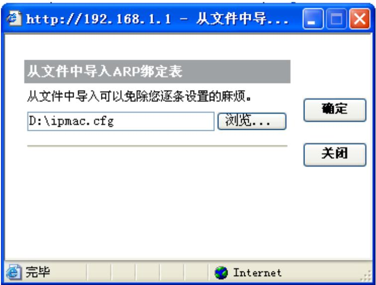

• 将路由器当前的ARP静态表项备份保存（.cfg文件），且您可用“记事本”程序打开该文件进行编辑（单击主页面上的<导出>按钮，确认后即可将其导出到本地）

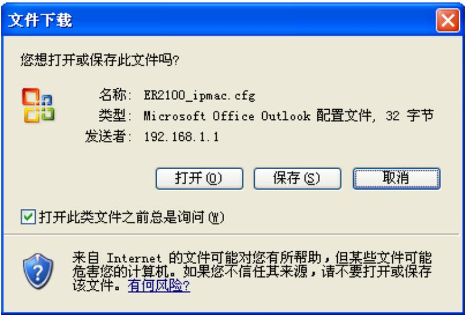


# 说明

您还可以通过路由器自动搜索在线主机功能来获取ARP表项，然后再将其批量绑定添加到路由器的ARP静态表中。相关操作可参见“6.1.3 设置ARP检测”

# 6.1.3 设置ARP检测

通过 ARP检测功能，您可以快速地搜索到局域网内所有在线的主机，获取相应的 ARP表项。同时，系统会检测这些表项当前的绑定状态以及是否存在异常（比如：获取的表项是否和路由器的静态ARP表项存在冲突等），并在页面的列表中以不同的颜色加以标明，帮助您更直观地对 ARP表项进行判断和维护。

# 页面向导：安全专区→ARP安全→ARP检测

本页面为您提供如下主要功能：

• 搜索在线主机，获取ARP表项（输入指定的地址范围，单击<扫描>按钮即可。如果您想清除当前的搜索结果，请单击<清除结果>按钮）  
将获取到的、未绑定的ARP表项进行批量绑定（选中未绑定项，单击<绑定>按钮即可）


扫描网段：

LAN

地址范围：

192.168.1.2

192.168.1.254

扫描


全选

绑定 清除结果

# 6.1.4 设置发送免费ARP

免费 ARP报文是一种特殊的 ARP报文，该报文中携带的发送端 IP地址和目标 IP地址都是本机 IP地址，报文源 MAC地址是本机 MAC地址，报文的目的 MAC地址是广播地址。

设备通过对外发送免费 ARP 报文来实现以下功能：

确定其他设备的 IP 地址是否与本机的 IP 地址冲突。当其他设备收到免费 ARP 报文后，如果发现报文中的 IP地址和自己的 IP地址相同，则给发送免费 ARP报文的设备返回一个 ARP应答，告知该设备 IP地址冲突。  
• 设备改变了硬件地址，通过发送免费 ARP 报文通知其他设备更新 ARP 表项。

路由器支持定时发送免费 ARP功能，这样可以及时通知下行设备更新 ARP表项或者 MAC地址表项，主要应用场景如下：

防止仿冒网关的 ARP 攻击

如果攻击者仿冒网关发送免费 ARP 报文，就可以欺骗同网段内的其他主机，使得被欺骗的主机访问网关的流量，被重定向到一个错误的 MAC地址，导致其他用户无法正常访问网络。

为了尽量避免这种仿冒网关的 ARP 攻击，可以在网关的接口上开启能定时发送免费 ARP 功能。开启该功能后，网关接口上将按照配置的时间间隔周期性发送接口主IP地址的免费ARP报文。这样，每台主机都可以学习到正确的网关，从而正常访问网络。

防止主机 ARP表项老化

在实际环境中，当网络负载较大或接收端主机的 CPU占用率较高时，可能存在 ARP报文被丢弃或主机无法及时处理接收到的 ARP报文等现象。这种情况下，接收端主机的动态 ARP表项会因超时而被老化，在其重新学习到发送设备的 ARP表项之前，二者之间的流量就会发生中断。

为了解决上述问题，您可以在路由器的接口上开启定时发送免费 ARP 功能。开启该功能后，路由器接口上将按照配置的时间间隔周期性地发送接口主 IP地址的免费 ARP报文。这样，接收端主机可以及时更新 ARP映射表，从而防止了上述流量中断现象。

# 页面向导：安全专区→ARP安全→ARP防护

本页面为您提供如下主要功能：

• 设置路由器丢弃源MAC地址不合法的ARP报文，即选中该功能后，当设备接收到的 ARP 报文的源MAC地址为0、组播MAC地址或广播MAC地址时，则直接将其丢弃不对其进行 ARP 学习（缺省情况下，此功能处于开启状态）  
• 设置路由器丢弃源MAC地址不一致的报文，即选中该功能后，当设备接收到的ARP报文的源MAC地址与该报文的二层源MAC地址不一致时（通常情况下，认为存在ARP欺骗），则直接将其丢弃不对其进行ARP学习（缺省情况下，此功能处于关闭状态）  
• 设置路由器ARP报文学习抑制，即选中该功能后，设备在一段时间内只学习第一个返回的ARP响应报文，丢弃其他响应报文，从而防止有过多的ARP响应报文返回造成 ARP 表项异常（缺省情况下，此功能处于开启状态）  
• 设置路由器检测到ARP欺骗时，LAN口或WAN口会主动发送免费ARP（缺省情况下，此功能处于开启状态）  
• 设置路由器LAN口主动定时发送免费ARP（缺省情况下，此功能处于关闭状态）  
• 设置路由器WAN口主动定时发送免费ARP（缺省情况下，此功能处于关闭状态）

# ARP报文合法性检查

回 丢弃源MAC地址不合法的ARP报文  
丢弃源MAC地址不一致的ARP报文  
ARP报文学习抑制

# 免费ARP

设备发送免费ARP可以防止LAN或WAN侧的主机受到ARP攻击和欺骗。免费ARP发送间隔越小，主机防ARP攻击能力越强，但对网络整体性能影响越大。

回 检测到ARP欺骗时，发送免费ARP报文  
回 LAN内主动发送免费ARP报文，发送间隔：50 毫秒（范围:10\~1800000，缺省值：50)  
回 WAN口主动发送免费ARP报文，发送间隔：50 毫秒（范围：10\~1800000，缺省值：50）


# 说明

设置完成后，您可以通过查看 运行状态页面中的“ARP防攻击”来验证功能是否已启用。

# 6.2 设置接入控制

# 6.2.1 设置MAC过滤

通过 MAC过滤功能，您可以有效地控制局域网内的主机访问外网。路由器为您提供两种 MAC过滤功能：

仅允许 MAC地址列表中的 MAC访问外网：如果您仅允许局域网内的某些主机访问外网，可以选中此功能，并添加相应的主机 MAC地址表项。  
仅禁止 MAC地址列表中的 MAC访问外网：如果您想禁止局域网内的某些主机访问外网，可以选中此功能，并添加相应的主机 MAC地址表项。

# 页面向导：安全专区→接入控制→MAC 过滤

本页面为您提供如下主要功能：

• 根据实际需求启用相应的MAC过滤功能（主页面。选择相应的 MAC过滤功能后，单击<应用>按钮生效）

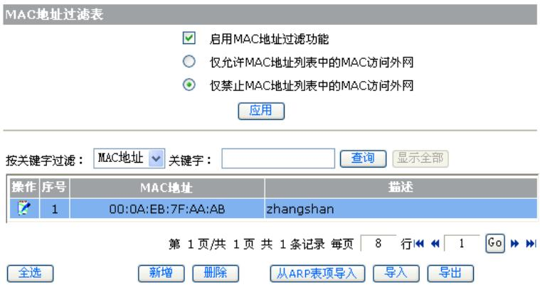

单个添加MAC过滤表项（单击主页面上的<新增>按钮，在弹出的对话框中添加一个需要过滤的MAC地址，单击<增加>按钮完成操作）

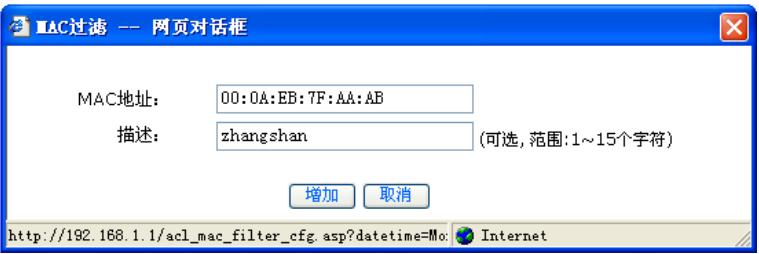

• 通过导入路由器的ARP绑定表来批理添加MAC过滤表项（单击主页面上的<从 ARP 表项导入>按钮，在弹出的对话框中选择需要过滤的MAC地址，单击<导入MAC地址过滤表>按钮完成操作）

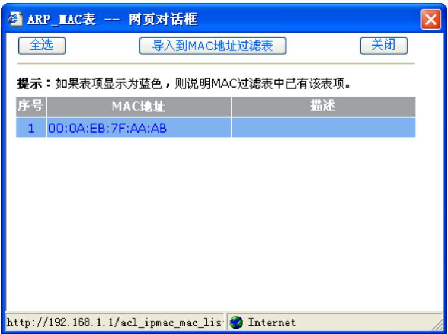

• 通过配置文件批量添加MAC过滤表项（您可以在本地用“记事本”程序创建一个.cfg 文件，内容格式为“MAC地址 描述”，且每条过滤项之间需要换行。单击主页面上的<导入>按钮，在弹出的对话框中选择该文件将其导入即可）

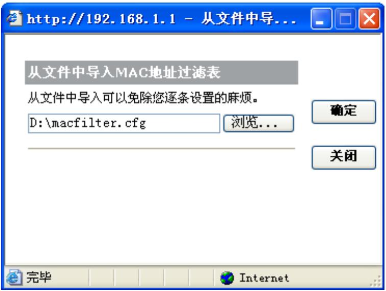

• 将当前您需要进行过滤处理的MAC地址保存（.cfg文件），且您可用“记事本”程序打开该文件进行编辑（单击主页面上的<导出>按钮，确认后即可将其导出到本地）

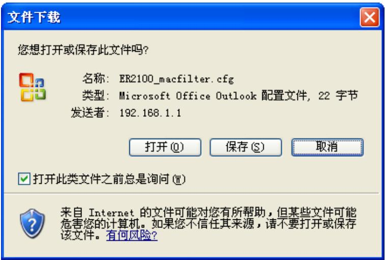


# 说明

设置完成后，您可以通过查看 运行状态页面中的“MAC过滤”来验证功能是否已启用。

# 6.2.2 设置网站过滤

通过网站过滤功能，您可以灵活地限制局域网内的主机所能访问的网站及生效时间。路由器支持以下配置：

(1) 两种网站过滤功能：

仅允许访问列表中的网站地址：如果您想让局域网内的主机仅能访问固定的某些网站，可以选中此功能，然后添加相应的网站地址。  
仅禁止访问列表中的网站地址：如果您想让局域网内的主机不能访问某些非法网站，可以选中此功能，然后添加相应的网站地址。

(2) 生效时间：如果您想让局域网内的计算机在每周的固定时间内使能网站过滤功能，可以设置生效时间；生效时间包括两部分内容，在一天中生效的时间段，时间使用24小时制，起始时间应早于结束时间，00:00～24:00表示该规则在一天内任何时间都生效；一周中哪些天规则生效。  
(3) 两种匹配方式：设备支持模糊匹配和精确匹配两种匹配方式。  
(4) 网站过滤特权 IP 功能：特权 IP 控制，支持设置网站过滤全局特权 IP 地址范围，属于特权 IP地址范围的用户，网站过滤功能不生效。特权 IP 地址段，包括起始 IP 地址和结束 IP 地址，起始 IP地址不能大于结束 IP地址。设备最多支持设置 20条特权 IP地址段。

# 页面向导：安全专区→接入控制→网站过滤

本页面为您提供如下主要功能：

• 根据实际需求启用相应的网站过滤功能（主页面。选择相应的网站过滤功能后，单击<应用>按钮生效）


• 单个添加网站地址（单击主页面上的<新增>按钮，在弹出的对话框中选择匹配方式，并添加需要过滤的网站地址或对应网站地址的匹配信息，单击<增加>按钮完成操作）

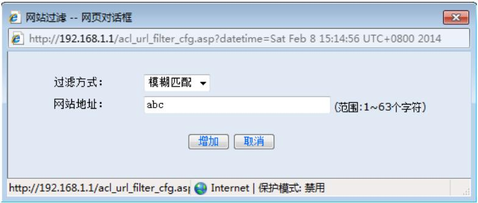

批量添加网站地址（您可以在本地用“记事本”程序创建一个.cfg文件，内容格式为0 abc 或1www.abc.com，其中 0 表示模糊匹配，1表示精确匹配，且每条过滤项之间需要换行。单击主页面上的<导入>按钮，在弹出的对话框中选择该文件将其导入即可）

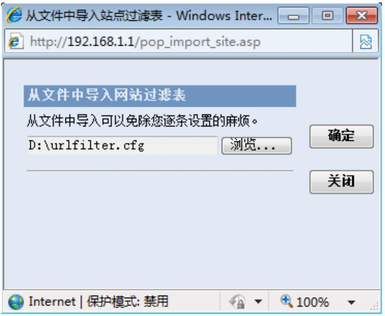

• 将当前您需要进行过滤处理的网站地址保存（.cfg文件），且您可用“记事本”程序打开该文件进行编辑（单击主页面上的<导出>按钮，确认后即可将其导出到本地）

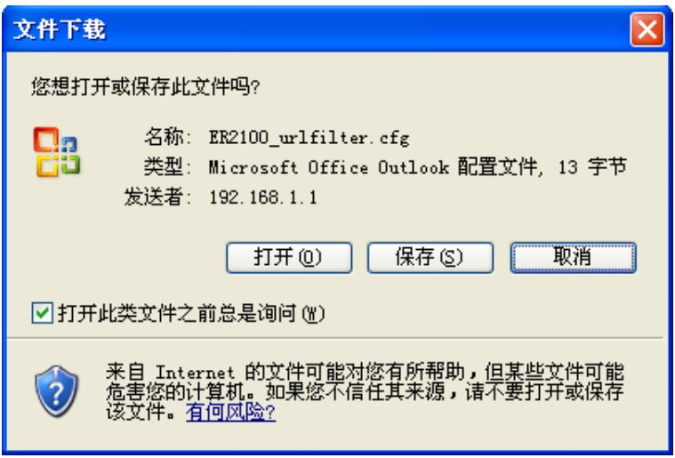


# 说明

• 网站过滤仅对 HTTP站点生效，且您输入站点时不能带有 http://。比如：要禁止访问www.abc.com 网站，可以输入“www.abc.com”，但不能输入“http://www.abc.com”。  
• 设置完成后，您可以通过查看 运行状态页面中的“网站过滤”来验证功能是否已启用。

# 6.2.3 设置IPMAC过滤

IPMAC过滤功能可以同时对报文中的源 MAC地址和源 IP地址进行匹配，仅当源 MAC地址和源 IP地址均符合条件的主机才允许访问外网。IPMAC过滤功能支持以下两种匹配方式：

仅允许 DHCP 服务器分配的客户端访问外网：即开启此功能后，不在路由器 DHCP 服务器分配的客户列表中的用户将无法访问外网。此方式可以运用于企业环境中，因为企业通常使用DHCP方式为客户端分配 IP地址。

仅允许 ARP静态绑定的客户端访问外网：即开启此功能后，不在 ARP静态绑定表中的客户端将无法访问外网。此方式可以运用于网吧环境中，因为网吧通常为客户端设置静态 IP 地址。

# 页面向导：安全专区→接入控制→IPMAC过滤

本页面为您提供如下主要功能：

设置IPMAC过滤功能（选择相应的IPMAC过滤匹配方式，单击<应用>按钮生效）

# IPMAC过滤

□ 仅允许DHCP服务器分配的客户端访问外网  
仅允许ARP静态绑定的客户端访问外网

应用


# 说明

设置完成后，您可以通过查看 运行状态页面中的“IPMAC过滤”来验证功能是否已启用。

# 6.3 设置防火墙

路由器的防火墙功能为您实现了根据报文的内容特征（比如：协议类型、源/目的 IP地址等），来对入站方向（从因特网发向局域网的方向）和出站方向（从局域网发向因特网的方向）的数据流执行相应的控制，保证了路由器和局域网内主机的安全运行。

# 6.3.1 设置出站通信策略

# 页面向导：安全专区→防火墙→出站通信策略

本页面为您提供如下主要功能：

• 开启出站通信策略功能并设置报文在出站方向上未匹配任何您预先设定的规则时，路由器所采取的策略（主页面。选中“启用出站通信策略功能”复选框，然后在“出站通信缺省策略”下拉框中选择指定的方式，单击<应用>按钮生效）

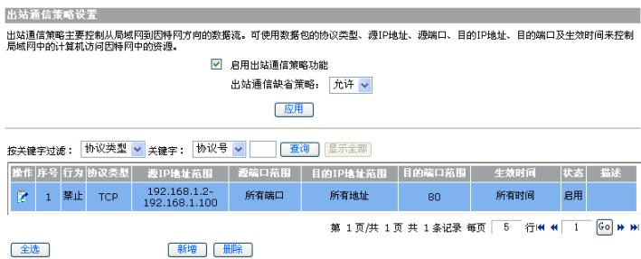

• 添加匹配规则来控制指定的报文（在主页面上单击<新增>按钮，在弹出的对话框中设置相应的匹配项，单击<增加>按钮完成操作）

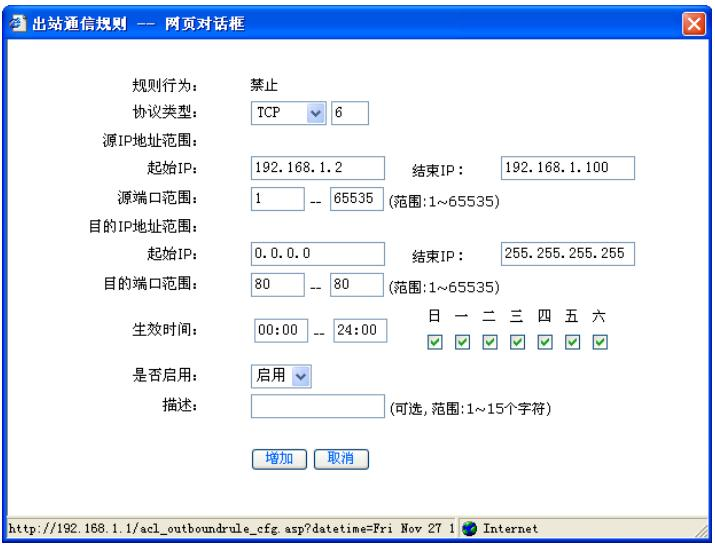

页面中关键项的含义如下表所示。

表6-1 页面关键项描述

<table><tr><td>页面关键项</td><td>描述</td></tr><tr><td>出站通信缺省策略</td><td>“允许”:允许内网主动发起的访问报文通过“禁止”:禁止内网主动发起的访问报文通过缺省情况下,出站通信缺省策略为“允许”说明当缺省策略是“允许”时,您手动添加的策略即为“禁止”,反之亦然缺省策略更改后,所有已配置的出站通信策略将会被清空,且仅对新建立的访问连接生效当您手动添加了出站通信策略后,路由器会优先根据该策略对主机进行访问控制,如果未匹配手动添加的策略,则遵循缺省策略</td></tr><tr><td>协议类型</td><td>选择需要匹配的报文的协议类型</td></tr><tr><td>起始IP/结束IP(源IP地址范围)</td><td>输入需要匹配的报文的源IP地址段说明起始IP地址不能大于结束IP地址如果无需匹配报文的源IP地址,您可以将起始IP地址设置为0.0.0.0,结束IP地址设置为255.255.255.255</td></tr><tr><td>源端口范围</td><td>输入需要匹配的报文的源端口范围说明只有设置协议为TCP/UDP之后,源端口范围才可设置</td></tr><tr><td>起始IP/结束IP(目的IP地址范围)</td><td>输入需要匹配的报文的目的IP地址段说明起始IP地址不能大于目的IP地址如果无需匹配报文的目的IP地址,您可以将起始IP地址设置为0.0.0.0,结束IP地址设置为255.255.255.255</td></tr><tr><td>目的端口范围</td><td>输入需要匹配的报文的目的端口范围说明只有设置协议为TCP/UDP之后,目的端口范围才可设置</td></tr><tr><td>生效时间</td><td>设置此新增规则的生效时间说明生效时间需要您指定具体的时间段,比如:某天的某个时间段</td></tr><tr><td>是否启用</td><td>在下拉列表框中选择“启用”,表示此匹配策略生效;选择“禁用”,表示此匹配策略不生效</td></tr><tr><td>描述</td><td>对此新增规则进行简单的描述</td></tr></table>


# 说明

设置完成后，您可以通过查看 运行状态页面中的“出站缺省策略”来验证功能是否已启用。

# 6.3.2 设置入站通信策略

页面向导：安全专区→防火墙→入站通信策略

本页面为您提供如下主要功能：

• 开启入站通信策略功能（主页面。选中“启用入站通信策略功能”复选框，单击<应用>按钮生效）

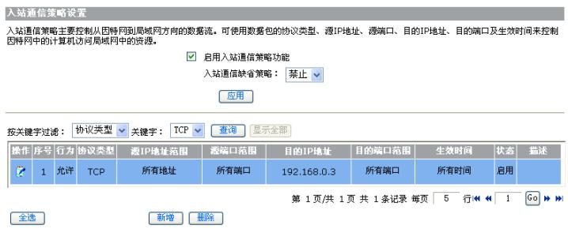

• 添加匹配规则来控制指定的报文（在主页面上单击<新增>按钮，在弹出的对话框中设置相应的匹配项，单击<增加>按钮完成操作）

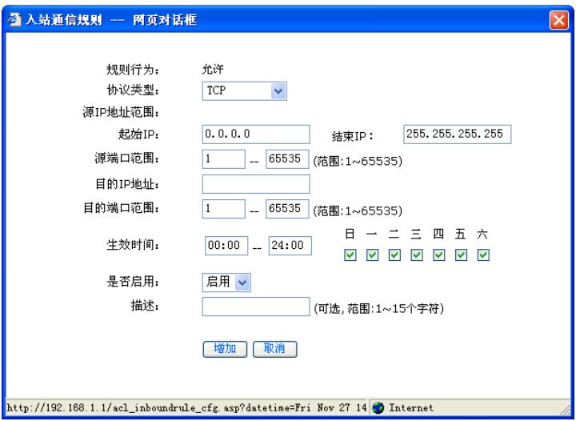

页面中关键项的含义如下表所示。

表6-2 页面关键项描述

<table><tr><td>页面关键项</td><td>描述</td></tr><tr><td>入站通信缺省策略</td><td>“禁止”:禁止外网主动发起的访问报文通过说明当缺省策略是“禁止”时,您手动添加的策略即为“允许”当您手动添加了入站通信策略后,路由器会优先根据该策略对主机进行访问控制,如果未匹配手动添加的策略,则遵循缺省策略</td></tr><tr><td>协议类型</td><td>选择需要匹配的报文的协议类型</td></tr><tr><td>起始IP/结束IP(源IP地址范围)</td><td>输入需要匹配的报文的源IP地址段说明起始IP地址不能大于结束IP地址如果无需匹配报文的源IP地址,您可以将起始IP地址设置为0.0.0.0,结束IP地址设置为255.255.255.255</td></tr><tr><td>源端口范围</td><td>输入需要匹配的报文的源端口范围</td></tr><tr><td>目的IP地址</td><td>输入需要匹配的报文的目的IP地址</td></tr><tr><td>目的端口范围</td><td>输入需要匹配的报文的目的端口范围</td></tr><tr><td>生效时间</td><td>设置此新增规则的生效时间说明生效时间需要您指定具体的时间段,比如:某天的某个时间段</td></tr><tr><td>是否启用</td><td>在下拉列表框中选择“启用”,表示此匹配策略生效;选择“禁用”,表示此匹配策略不生效</td></tr><tr><td>描述</td><td>对此新增规则进行简单的描述</td></tr></table>

# 6.4 设置防攻击

在复杂网络环境中，常常由于主机异常或中毒，导致其不断地发送一些攻击报文，造成路由器资源和网络带宽不必要的消耗。防攻击主要的目的就是发现并丢弃非法的报文，以保证整体网络的稳定性。

# 6.4.1 防攻击方式

路由器为您提供了以下三种防攻击方式：

# IDS 防范

IDS 防范主要用于发现一些常见的攻击类型报文对路由器的扫描和一些常见的 DOS 攻击，并丢弃相应的报文。在一定程度上，可以有效地保护路由器的正常运行。

# 报文源认证

攻击类型的报文多种多样，除了 ARP 欺骗外，最主要的是伪装 IP 地址的报文和伪装 MAC 地址的报文。您通过设置路由器的静态路由表和 ARP 表项，可以在很大程度上认证内网发送的报文的合法性。比如：当报文的源 IP地址属于不可达网段，报文的源 IP地址/源MAC地址和静态 ARP表项存在冲突等，则路由器会认为该报文是非法伪装的报文，会直接将其丢弃。

# 异常流量防护

在网络实际应用中，往往会由于单台主机中毒或异常，导致这台主机大量发送数据包。而这些报文并不能被路由器的报文源认证功能确定为非法的报文，此时会大量地消耗路由器的资源。开启该功能后，路由器会对各台主机的流量进行检查，并根据您所选择的防护等级（包括：高、中、低三种）进行相应的处理，以确保路由器受到此类异常流量攻击时仍可正常工作。

# 6.4.2 设置IDS防范

# 页面向导：安全专区→防攻击→IDS 防范

本页面为您提供如下主要功能：

• 开启指定攻击类型报文的IDS防范（选中您需要防范的攻击类型，单击<应用>按钮生效）

# IDS防范

回 启用IDS防范功能

丢弃攻击报文，不记入日志

丢弃攻击报文，并记入日志

WAN口Ping

TCP NULL扫描

SYN Flood攻击

smurf攻击

Land攻击

TearDrop攻击

UDP扫描

TCP Stealth FIN扫描

UDP Flood攻击

WinNuke攻击

IP Spoofing攻击

Ping Of Death攻击

应用

TCP SYN扫描

TCP Xmas Tree扫描

ICMP Flood攻击

Fraggle攻击

碎片包攻击


# 说明

• 本页面中的各攻击类型的介绍可直接参见路由器的在线联机帮助。  
• 仅当您选择了“丢弃攻击报文，并记入日志”选项，路由器才会对攻击事件以日志的形式记录。日志信息的查看，可参见“11.2.1 查看日志信息”。  
• 设置完成后，您可以通过查看 运行状态页面中的“IDS防范功能”来验证功能是否已启用。

# 6.4.3 设置报文源认证

页面向导：安全专区→防攻击→报文源认证

本页面为您提供如下主要功能：

• 选择基于哪个表项（静态路由表、静态ARP表、动态ARP表）来对报文进行源认证（选中相应的功能项，单击<应用>按钮生效）

# 报文源认证

本功能将对内网发送的报文进行源IP和源MAC认证，如果报文的源IP或源MAC来自不存在的主机，该报文将被丢弃。开启本功能可防止内网的欺骗报文，提高网络稳定性。

启用基于静态路由的报文源认证功能  
启用基于ARP绑定、DHCP分配ARP防护下的报文源认证功能  
启用基于动态ARP的报文源认证功能

应用

页面中关键项的含义如下表所示。

表6-3 页面关键项描述

<table><tr><td>页面关键项</td><td>描述</td></tr><tr><td>启用基于静态路由的报文源认证功能</td><td>开启该功能后,路由器将根据静态路由表对所有报文的源IP地址进行检查。如果静态路由表中存在到该源IP地址的表项,则转发该报文;否则丢弃该报文比如:路由器LAN口下挂的设备接口地址为192.168.1.5/24,内网为192.200.200.0/24网段。同时,您设置静态路由目的地址为192.200.200.0/24,下一跳为192.168.1.5,出接口为LAN口。此时,路由器允许从192.200.200.0/24网段转发过来的报文通过</td></tr><tr><td>启用基于ARP绑定、DHCP分配ARP防护下的报文源认证功能</td><td>开启该功能后,路由器将根据静态ARP表的绑定关系及DHCP分配列表中的对应关系,来认证内网的报文。如果报文的源IP地址/MAC地址与静态ARP表中的IP地址/MAC地址对应关系存在冲突,则路由器将其直接丢弃比如:您设置了一条ARP静态绑定项(将源IP地址:192.168.1.100与源MAC地址:08:00:12:00:00:01绑定)。当路由器LAN侧收到一个报文,其源IP地址为192.168.1.100,但源MAC地址为08:00:12:00:00:02,路由器会将该报文丢弃</td></tr><tr><td>启用基于动态ARP的报文源认证功能</td><td>开启该功能,路由器将会根据动态ARP表的对应关系,来认证内网的报文。如果报文的源IP地址/MAC地址与已确认合法的动态ARP表的IP地址/MAC地址对应关系存在冲突,则路由器将其直接丢弃比如:路由器动态学习到一条ARP表项(源IP地址:192.168.1.100,源MAC地址:08:00:12:00:00:01),当路由器LAN侧在该ARP表项老化之前收到一个报文,其源IP地址为192.168.1.100,但源MAC地址为08:00:12:00:00:02,路由器会将该报文丢弃</td></tr></table>

# 6.4.4 设置异常流量防护

页面向导：安全专区→防攻击→异常流量防护

本页面为您提供如下主要功能：

• 选择防护等级来对异常主机流量进行防护（选中“启用异常主机流量防护功能”复选框，并设置异常流量阈值和选择相应的防护等级，单击<应用>按钮生效）

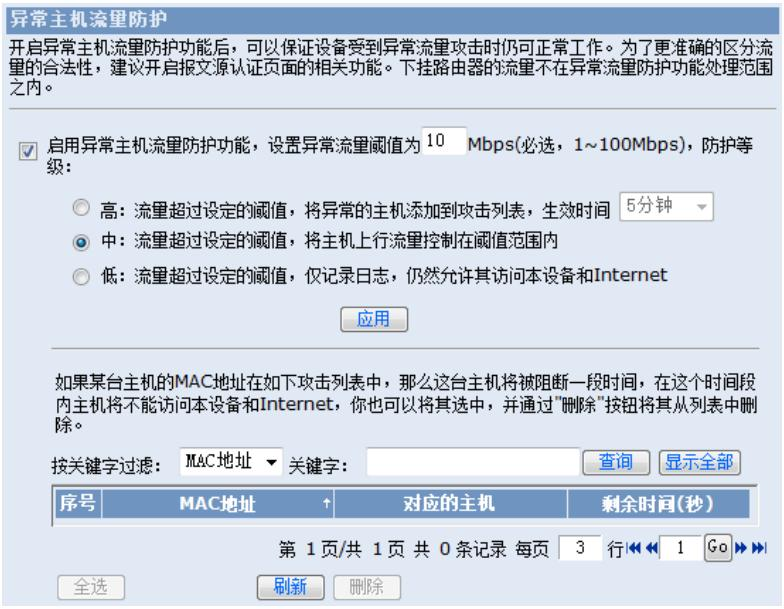

页面中关键项的含义如下表所示。

表6-4 页面关键项描述

<table><tr><td>页面关键项</td><td>描述</td></tr><tr><td>启用异常主机流量防护功能</td><td>通过该选项,您可以开启或关闭异常主机流量防护功能。下挂路由器的流量不在异常流量防护功能处理范围之内</td></tr><tr><td>高</td><td>启用该项,防护等级最高,设备会进行异常主机流量检查,并且自动把检查到的攻击主机添加到攻击列表中,在指定的生效时间范围内,禁止其访问本设备和Internet,以尽量减少这台异常主机对网络造成的影响</td></tr><tr><td>中</td><td>启用该项,防护等级居中,设备会把内网主机上行流量分别限制在异常流量阈值范围内,超过阈值的流量将被设备所丢弃</td></tr><tr><td>低</td><td>启用该项,防护等级低,设备仅对超过异常流量阈值的事件记入日志,仍然允许对应的主机访问设备和Internet</td></tr><tr><td>MAC地址</td><td>被加入攻击列表主机的MAC地址</td></tr><tr><td>对应主机</td><td>被加入攻击列表主机可能对应的IP地址</td></tr><tr><td>剩余时间</td><td>该主机将被阻断时间的倒计时</td></tr></table>

# 7 设置IPSec VPN

本章节主要包含以下内容：

IPSec VPN简介  
IPSec VPN设置方法  
通过快速向导实现IPSec VPN  
通过高级设置实现IPSec VPN

# 7.1 IPSec VPN简介

VPN是近年来随着 Internet的广泛应用而迅速发展起来的一种新技术，用以实现在公用网络上构建私人专用网络。“虚拟”主要指这种网络是一种逻辑上的网络。

# 7.1.1 IPSec简介

IPSec是IETF制定的三层隧道加密协议，它为Internet上数据的传输提供了高质量的、可互操作的、基于密码学的安全保证。特定的通信方之间在 IP层通过加密与数据源认证等方式，可以获得以下的安全服务：

数据机密性（Confidentiality）：IPSec 发送方在通过网络传输包前对包进行加密。  
数据完整性（Data Integrity）：IPSec接收方对发送方发送来的包进行认证，以确保数据在传输过程中没有被篡改。  
数据来源认证（Data Authentication）：IPSec接收方可以认证 IPSec报文的发送方是否合法。  
防重放（Anti-Replay）：IPSec接收方可检测并拒绝接收过时或重复的报文。

可以通过 IKE为 IPSec提供自动协商交换密钥、建立和维护 SA的服务，以简化 IPSec的使用和管理。IKE协商并不是必须的，IPSec所使用的策略和算法等也可以手工协商。

# 1. IPSec的实现

IPSec通过如下两种协议来实现安全服务：

• AH是认证头协议，协议号为 51。主要提供的功能有数据源认证、数据完整性校验和防报文重放功能，可选择的认证算法有 MD5、SHA-1等。AH报文头插在标准 IP包头后面，保证数据包的完整性和真实性，防止黑客截获数据包或向网络中插入伪造的数据包。  
• ESP是报文安全封装协议，协议号为 50。与 AH协议不同的是，ESP将需要保护的用户数据进行加密后再封装到 IP 包中，以保证数据的机密性。常见的加密算法有 DES、3DES、AES等。同时，作为可选项，用户可以选择 MD5、SHA-1算法保证报文的完整性和真实性。

AH 和 ESP 可以单独使用，也可以联合使用。设备支持的 AH 和 ESP 联合使用的方式为：先对报文进行 ESP 封装，再对报文进行 AH 封装，封装之后的报文从内到外依次是原始 IP 报文、ESP 头、AH头和外部 IP头。

# 2. IPSec基本概念

(1) SA

IPSec 在两个端点之间提供安全通信，端点被称为 IPSec 对等体。

SA是IPSec的基础，也是 IPSec的本质。SA是通信对等体间对某些要素的约定，例如，使用哪种协议（AH、ESP 还是两者结合使用）、协议的封装模式（传输模式和隧道模式）、加密算法（DES、3DES和 AES）、特定流中保护数据的共享密钥以及密钥的生存周期等。

SA是单向的，在两个对等体之间的双向通信，最少需要两个 SA来分别对两个方向的数据流进行安全保护。同时，如果两个对等体希望同时使用 AH和 ESP来进行安全通信，则每个对等体都会针对每一种协议来构建一个独立的 SA。

SA 由一个三元组来唯一标识，这个三元组包括 SPI（Security Parameter Index，安全参数索引）、目的 IP地址、安全协议号（AH或 ESP）。

SPI是为唯一标识SA而生成的一个32比特的数值，它在AH和ESP头中传输。在手工配置SA时，需要手工指定 SPI的取值；使用 IKE协商产生 SA时，SPI将随机生成。

SA 是具有生存周期的，且只对通过 IKE 方式建立的 SA 有效。生存周期到达指定的时间或指定的流量，SA 就会失效。SA 失效前，IKE 将为 IPSec 协商建立新的 SA，这样，在旧的 SA 失效前新的 SA就已经准备好。在新的 SA开始协商而没有协商好之前，继续使用旧的 SA保护通信。在新的SA协商好之后，则立即采用新的 SA保护通信。

# (2) 验证算法与加密算法

# 【验证算法】：

验证算法的实现主要是通过杂凑函数。杂凑函数是一种能够接受任意长的消息输入，并产生固定长度输出的算法，该输出称为消息摘要。IPSec 对等体计算摘要，如果两个摘要是相同的，则表示报文是完整未经篡改的。

IPSec使用以下两种验证算法：

表7-1 验证算法

<table><tr><td>验证算法</td><td>描述</td></tr><tr><td>MD5</td><td>MD5通过输入任意长度的消息,产生128bit的消息摘要与SHA-1相比:计算速度快,但安全强度略低</td></tr><tr><td>SHA-1</td><td>SHA-1通过输入长度小于2的64次方bit的消息,产生160bit的消息摘要与MD5相比:计算速度慢,但安全强度更高</td></tr></table>

# 【加密算法】：

加密算法实现主要通过对称密钥系统，它使用相同的密钥对数据进行加密和解密。

IPSec支持以下三种加密算法：

表7-2 加密算法

<table><tr><td>加密算法</td><td>描述</td></tr><tr><td>DES</td><td>使用64bit的密钥对一个64bit的明文块进行加密</td></tr><tr><td>3DES</td><td>使用三个64bit的DES密钥(共192bit密钥)对明文进行加密</td></tr><tr><td>AES</td><td>使用128bit、192bit或256bit密钥长度的AES算法对明文进行加密</td></tr></table>

这三个加密算法的安全性由高到低依次是：AES、3DES、DES，安全性高的加密算法实现机制复杂，但运算速度慢。对于普通的安全要求，DES算法就可以满足需要。

# (3) 协商方式

有如下两种协商方式建立 SA：

手工方式配置比较复杂，创建 SA所需的全部信息都必须手工配置，而且不支持一些高级特性（例如定时更新密钥），但优点是可以不依赖 IKE而单独实现 IPSec功能。  
IKE自动协商方式相对比较简单，只需要配置好 IKE协商安全策略的信息，由 IKE自动协商来创建和维护 SA。

当与之进行通信的对等体设备数量较少时，或是在小型静态环境中，手工配置 SA 是可行的。对于中、大型的动态网络环境中，推荐使用 IKE协商建立 SA。

# (4) 安全隧道

安全隧道是建立在本端和对端之间可以互通的一个通道，它由一对或多对 SA 组成。

# 7.1.2 IPSec VPN常见的组网模式

• 中心/分支模式应用在一对多网络中，如图 7-1所示。中心/分支模式的网络采用野蛮模式进行IKE协商，可以使用安全网关名称或IP地址作为本端ID。在中心/分支模式的网络中，中心节点不会发起IPSec SA的协商，需要由分支节点首先向中心节点发起IPSec SA的协商。路由器通常作为分支节点的VPN接入设备使用。

图7-1 中心/分支模式组网  
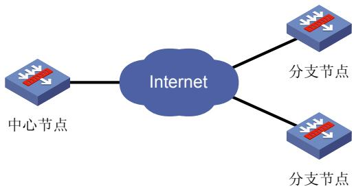

对等模式应用在一对一网络中，如 图 7-2所示。在对等模式的网络中，两端的设备互为对等节点，都可以向对端发起IPSec SA的协商。

图7-2 对等模式组网  


# 7.2 IPSec VPN设置方法

路由器提供以下两种方法提导您完成 IPSec VPN 设置：

通过快速向导实现IPSec VPN（推荐在大多数应用环境下使用）  
通过高级设置实现IPSec VPN（当VPN设置向导参数不能满足您当前特殊的应用环境时使用）

# 7.3 通过快速向导实现IPSec VPN

VPN设置向导可以帮忙您快速地完成 IPSec VPN隧道的创建，轻易地实现安全、远程的连接，进一步提高设置效率。

下面以一个一对一网络的 IPSec VPN隧道设置为例进行讲解：

# 1. 组网需求

在 Router A（采用 ER2100）和 Router B（采用 ER2100）之间建立一个安全隧道，对客户分支机构 A 所在的子网（192.168.1.0/24）与客户分支机构 B 所在的子网（172.16.1.0/24）之间的数据流进行安全保护。

# 2. 组网图

图7-3 组网示意图  
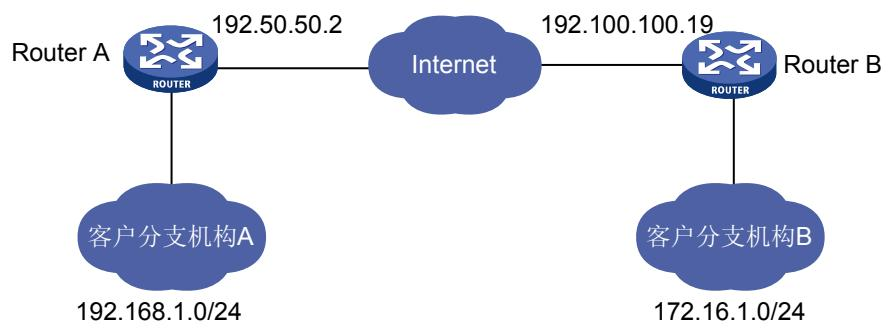

# 3. 设置步骤

设置 Router A

(1) 选择“VPN→VPN 向导→VPN 向导”


此向导将通过四步简单的设置帮助您完成IPSeCVPN的创建。

通过向导完成设置之后，您可以在VPN设置栏编辑相应的参数，向导中所涉及的参数与VPN设置栏对应关系如下：

·安全策略名称、对端子网IP/掩码： IPSec安全策略  
·预共享密钥（PSK)、对端地址、协商模式： IKE对等体  
·ID类型、对端ID、本端ID： IKE对等体

开始

(2) 单击<开始>按钮，进入第一步：设置安全策略名和预共享密钥(PSK)

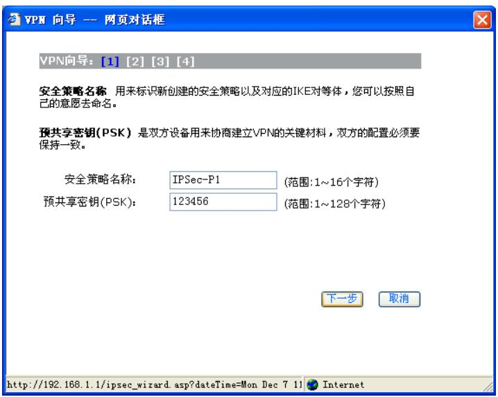

(3) 单击<下一步>按钮，进入第二步：设置对端地址信息和对端子网IP/掩码信息（说明：如果是在中心/分支模式组网应用中，建议您尽可能将作为分支节点的ER2100的对端子网 IP/掩码参数设置成为宽范围）

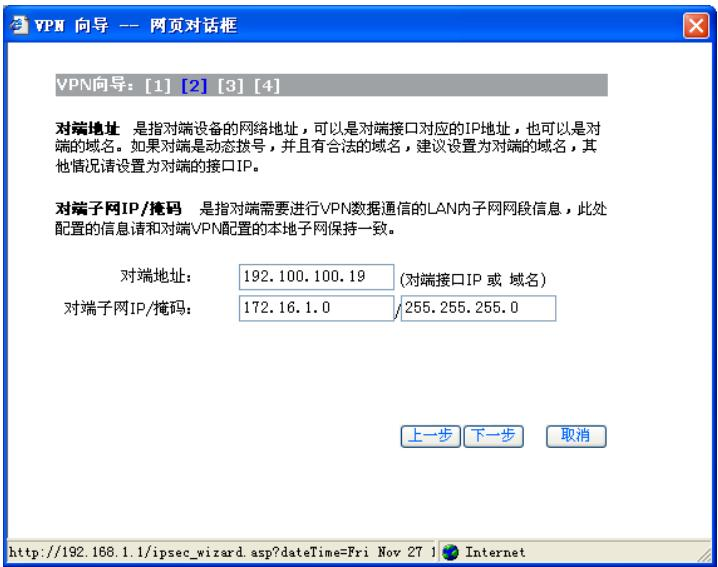

(4) 单击<下一步>按钮，进入第三步：选择协商模式

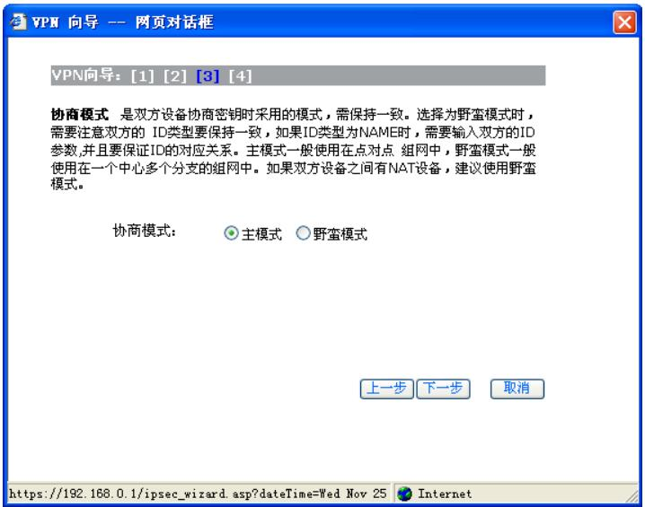

(5) 单击<下一步>按钮，进入第四步：设置预览，同时您可根据组网配置方案来修改IKE安全提议和IPSec安全提议。单击<完成>按钮设置结束

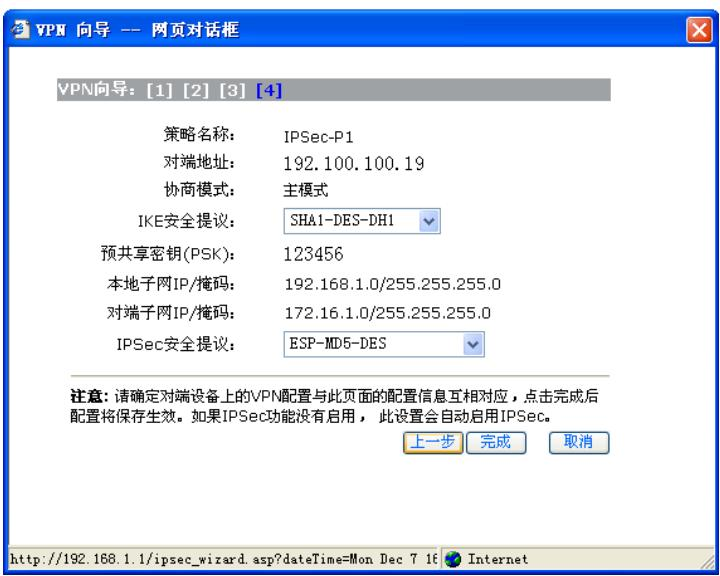

# 设置 Router B

对端 Router B 上的 IPSec VPN 设置与 Router A 是相互对应的，除了对端地址和对端子网 IP/掩码需要做相应修改，其他的设置均一致。此处略。

# 查看 VPN状态

两端均设置完成后，您可以通过选择路由器的“VPN→VPN状态→安全联盟”页面，并单击<刷新>按钮来查看相应的隧道是否已成功建立。

# 7.4 通过高级设置实现IPSec VPN

# 7.4.1 设置IKE

在实施 IPSec 的过程中，可以使用 IKE协议来建立 SA。该协议建立在由 Internet SA和密钥管理协议 ISAKMP定义的框架上。IKE为IPSec 提供了自动协商交换密钥、建立SA的服务，能够简化 IPSec的使用和管理。

IKE 不是在网络上直接传输密钥，而是通过一系列数据的交换，最终计算出双方共享的密钥，并且即使第三者截获了双方用于计算密钥的所有交换数据，也不足以计算出真正的密钥。

# 1. IKE简介

# (1) IKE 的安全机制

IKE具有一套自保护机制，可以在不安全的网络上安全地认证身份、分发密钥、建立 IPSec SA。

# 【数据认证】：

数据认证有如下两方面的概念：

身份认证：身份认证确认通信双方的身份，支持预共享密钥认证。  
• 身份保护：身份数据在密钥产生之后加密传送，实现了对身份数据的保护。

# 【DH】：

DH 算法是一种公共密钥算法。通信双方在不传输密钥的情况下通过交换一些数据，计算出共享的密钥。即使第三者（如黑客）截获了双方用于计算密钥的所有交换数据，由于其复杂度很高，不足以计算出真正的密钥。所以，DH交换技术可以保证双方能够安全地获得公有信息。

# 【PFS】：

PFS特性是一种安全特性，指一个密钥被破解，并不影响其他密钥的安全性，因为这些密钥间没有派生关系。对于 IPSec，是通过在 IKE 阶段 2 协商中增加一次密钥交换来实现的。PFS 特性是由DH算法保障的。

# (2) IKE 的交换过程

IKE使用了两个阶段为 IPSec进行密钥协商并建立 SA：

第一阶段，通信各方彼此间建立了一个已通过身份认证和安全保护的通道，即建立一个ISAKMP SA。第一阶段有主模式和野蛮模式两种 IKE交换方法。  
第二阶段，用在第一阶段建立的安全隧道为IPSec协商安全服务，即为IPSec协商具体的SA，建立用于最终的 IP 数据安全传输的 IPSec SA。

图7-4 主模式交换过程  
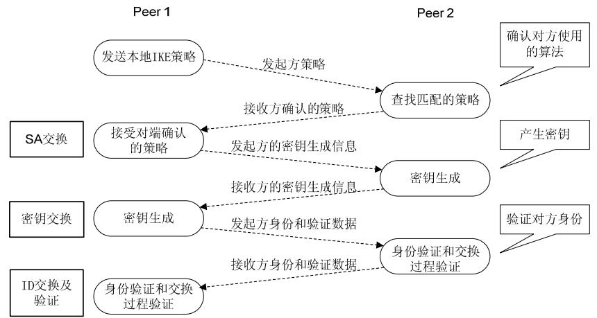

如 图 7-4 所示，第一阶段主模式的IKE协商过程中包含三对消息：

第一对叫 SA 交换，是协商确认有关安全策略的过程；  
第二对消息叫密钥交换，交换 Diffie-Hellman公共值和辅助数据（如：随机数），密钥材料在这个阶段产生；  
最后一对消息是 ID信息和认证数据交换，进行身份认证和对整个 SA交换进行认证。

野蛮模式交换与主模式交换的主要差别在于，野蛮模式不提供身份保护，只交换 3条消息。在对身份保护要求不高的场合，使用交换报文较少的野蛮模式可以提高协商的速度；在对身份保护要求较高的场合，则应该使用主模式。

# (3) IKE 在 IPSec 中的作用

因为有了 IKE，IPSec很多参数（如：密钥）都可以自动建立，降低了手工配置的复杂度。  
• IKE 协议中的 DH 交换过程，每次的计算和产生的结果都是不相关的。每次 SA 的建立都运行DH交换过程，保证了每个 SA所使用的密钥互不相关。  
IPSec使用 AH或 ESP报文头中的序列号实现防重放。此序列号是一个 32比特的值，此数溢出后，为实现防重放，SA需要重新建立，这个过程需要 IKE协议的配合。  
对安全通信的各方身份的认证和管理，将影响到 IPSec的部署。IPSec的大规模使用，必须有认证机构或其他集中管理身份数据的机构的参与。  
IKE提供端与端之间动态认证。

# (4) IPSec 与 IKE 的关系

图7-5 IPSec 与 IKE 的关系图  
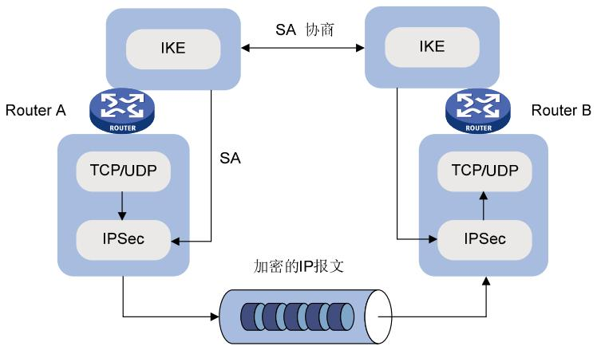

从 图 7-5中我们可以看出IKE和IPSec的关系：

IKE 是 UDP 之上的一个应用层协议，是 IPSec 的信令协议；  
IKE 为 IPSec 协商建立 SA，并把建立的参数及生成的密钥交给 IPSec；

IPSec使用 IKE建立的 SA对 IP报文加密或认证处理。

# 2. 设置安全提议

安全提议定义了一套属性数据来描述IKE 协商怎样进行安全通信。配置IKE 提议包括选择加密算法、选择验证算法、选择 Diffie-Hellman 组标识。

# 页面向导：VPN→VPN 设置→IKE 安全提议

本页面为您提供如下主要功能：

显示和修改已添加的 IKE 安全提议（主页面）

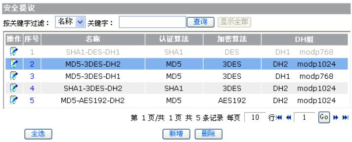

添加一条新的IKE安全提议（单击主页面上的<新增>按钮，在弹出的对话框中设置相应的参数，并单击<增加>按钮完成操作）

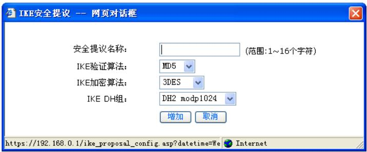

页面中关键项的含义如下表所示。

表7-3 页面关键项描述

<table><tr><td>页面关键项</td><td>描述</td></tr><tr><td>安全提议名称</td><td>输入安全提议的名称</td></tr><tr><td>IKE验证算法</td><td>选择IKE所使用的验证算法缺省情况下,使用MD5</td></tr><tr><td>IKE加密算法</td><td>选择IKE所使用的加密算法缺省情况下,使用3DES</td></tr><tr><td>IKE DH组</td><td>选择IKE所使用的DH算法• DH1: 768位DH组• DH2: 1024位DH组• DH5: 1536位DH组• DH14: 2048位DH组缺省情况下,使用DH2</td></tr></table>

# 3. 设置对等体

对等体定义了协商的双方，包括本端发起协商接口、对方地址、采用的安全提议、协商模式、ID类型等信息。只有经定义的双方才能够进行协商通信。

# 页面向导：VPN→VPN设置→IKE对等体

本页面为您提供如下主要功能：

显示和修改已添加的 IKE 对等体（主页面）


• 添加一个新的IKE对等体单击主页面上的<新增>按钮，在弹出的对话框中设置相应的参数，并单击<增加>按钮完成操作）

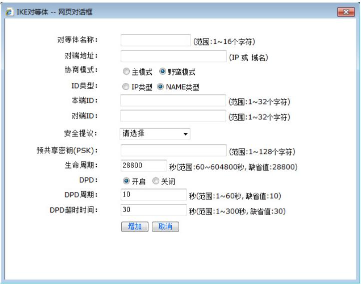

页面中关键项的含义如下表所示。

表7-4 页面关键项描述

<table><tr><td>页面关键项</td><td>描述</td></tr><tr><td>对等体名称</td><td>输入对等体的名称</td></tr><tr><td>对端地址</td><td>设置对等体对端的地址信息</td></tr><tr><td>协商模式</td><td>选择协商模式。主模式一般应用于点对点的对等组网模式;野蛮模式一般应用于中心/分支组网模式缺省情况下,使用主模式</td></tr><tr><td>ID类型、本端ID、对端ID</td><td>此设置项需在野蛮模式下进行当ID类型为NAME类型时,还需要指定相应的本端ID与对端ID</td></tr><tr><td>安全提议</td><td>选择对等体需要引用的IKE安全提议</td></tr><tr><td>预共享密钥(PSK)</td><td>设置IKE认证所需的预共享密钥(pre-shared-key)</td></tr><tr><td>生命周期</td><td>设置IKE SA存在的生命周期(IKE SA实际的周期以协商结果为准)</td></tr><tr><td>DPD开启</td><td>DPD用于IPsec邻居状态的检测。启动DPD功能后,当接收端在触发DPD的时间间隔内收不到对端的IPSec加密报文时,会触发DPD查询,主动向对端发送请求报文,对IKE对等体是否存在进行检测</td></tr><tr><td>DPD周期</td><td>指定对等体DPD检测周期,即触发DPD查询的间隔时间</td></tr><tr><td>DPD超时时间</td><td>指定对等体DPD检测超时时间,即等待DPD应答报文超时的时间</td></tr></table>


# 说明

• 设置对等体对端的地址信息时，不能设置成 0.0.0.0；如果对端地址不是固定地址而是动态地址，建议通过将对端地址配置为动态域名的方式进行连接。  
• 当组网模式为中心/分支模式时，本设备不能作为中心节点使用。

# 7.4.2 设置IPSec

# 1. 设置安全提议

安全提议保存 IPSec需要使用的特定安全性协议，以及加密/验证算法，为 IPSec协商 SA提供各种安全参数。为了能够成功的协商 IPSec的 SA，两端必须使用相同的安全提议。

页面向导：VPN→VPN设置→IPSec安全提议

本页面为您提供如下主要功能：

显示和修改已添加的IPSec安全提议（主页面）

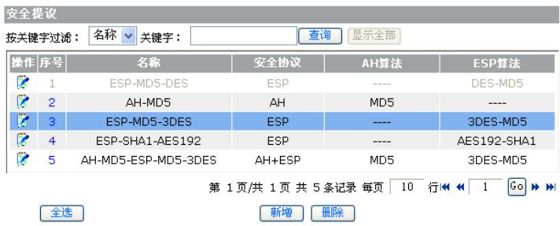

添加一条新的IPSec安全提议（单击主页面上的<新增>按钮，在弹出的对话框中设置相应的参数，并单击<增加>按钮完成操作）

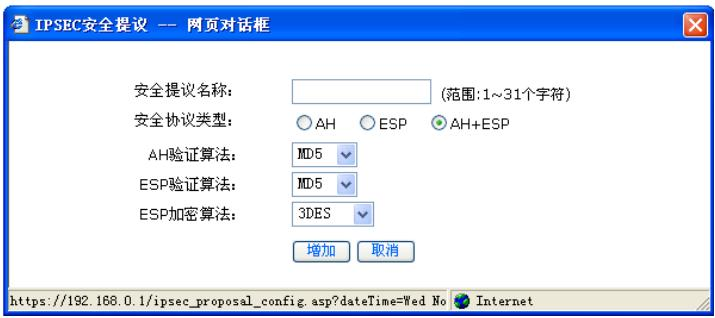

页面中关键项的含义如下表所示。

表7-5 页面关键项描述

<table><tr><td>页面关键项</td><td>描述</td></tr><tr><td>安全提议名称</td><td>输入安全提议的名称</td></tr><tr><td>安全协议类型</td><td>选择安全协议类型来实现安全服务缺省情况下,使用ESP</td></tr><tr><td>AH验证算法</td><td>选择AH验证算法缺省情况下,使用MD5</td></tr><tr><td>ESP验证算法</td><td>选择ESP验证算法缺省情况下,使用MD5</td></tr><tr><td>ESP加密算法</td><td>选择ESP加密算法缺省情况下,使用3DES</td></tr></table>

# 2. 设置安全策略

安全策略规定了对什么样的数据流采用什么样的安全提议。安全策略分为手工安全策略和 IKE协商安全策略。前者需要用户手工配置密钥、SPI等参数；后者则由 IKE自动协商生成这些参数。

# 页面向导：VPN→VPN设置→IPSec安全策略

本页面为您提供如下主要功能：

开启IPSec功能、显示和修改已添加的安全策略（主页面）

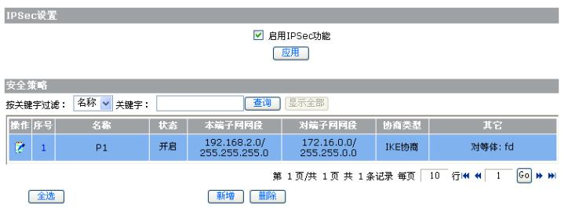

• 设置使用IKE协商方式建立SA（单击主页面上的<新增>按钮，在弹出的对话框中选择“协商类型”为IKE协商并设置相应的参数，单击<增加>按钮完成操作）

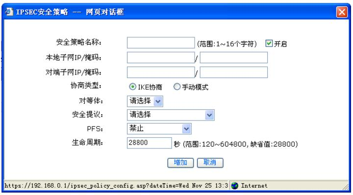

• 设置使用手动协商方式建立SA（单击主页面上的<新增>按钮，在弹出的对话框中选择“协商类型”为手动模式并设置相应的参数，单击<增加>按钮完成操作）

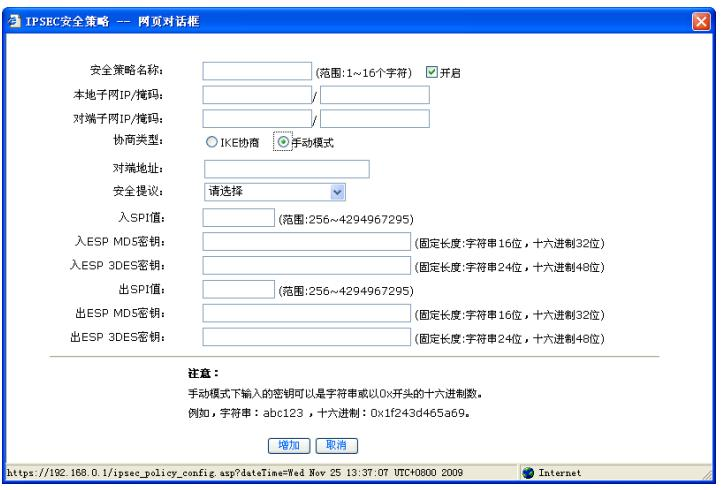

页面中关键项的含义如下表所示。

表7-6 页面关键项描述

<table><tr><td colspan="2">页面关键项</td><td>描述</td></tr><tr><td colspan="2">启用IPSec</td><td>选中“启用IPSec”,开启IPSec功能缺省情况下,禁用IPSec功能</td></tr><tr><td colspan="2">安全策略名称</td><td>设置安全策略的名称,后面的复选框可以设置该安全策略的使用状态</td></tr><tr><td colspan="2">本地子网IP/掩码</td><td>本地子网IP/掩码和对端子网IP/掩码,两个配置项组成一个访问控制规则。IPSec通过此访问控制规则来定义需要保护的数据流,访问控制规则匹配的报文将会被保护</td></tr><tr><td colspan="2">对端子网IP/掩码</td><td>本地子网IP/掩码和对端子网IP/掩码分别用来指定IPSec VPN隧道本端和对端的子网网段</td></tr><tr><td colspan="2">协商类型</td><td>选择IPSec协商方式缺省情况下,使用IKE协商方式</td></tr><tr><td colspan="2">对等体</td><td>选择需要引用的IKE对等体</td></tr><tr><td colspan="2">安全提议</td><td>选择需要引用的IPSec安全提议</td></tr><tr><td colspan="2">页面关键项</td><td>描述</td></tr><tr><td colspan="2">PFS</td><td>PFS特性是一种安全特性,指一个密钥被破解,并不影响其他密钥的安全性,因为这些密钥间没有派生关系。IKE在使用安全策略发起一个协商时,可以进行一个PFS交换。如果本端设置了PFS特性,则发起协商的对端也必须设置PFS特性,且本端和对端指定的DH组必须一致,否则协商会失败禁止:关闭PFS特性DH1:768位DH组DH2:1024位DH组DH5:1536位DH组DH14:2048位DH组缺省情况下,PFS特性处于关闭状态</td></tr><tr><td colspan="2">生命周期</td><td>设置IPSec SA存在的生命周期缺省情况下,生命周期为28800秒</td></tr><tr><td colspan="2">对端地址</td><td>指定IPSec对等体另外一端的IP地址</td></tr><tr><td colspan="2">入/出SPI值</td><td>在安全隧道的两端设置的SA参数必须是完全匹配的。本端入方向SA的SPI必须和对端出方向SA的SPI一样;本端出方向SA的SPI必须和对端入方向SA的SPI一样。SPI具有唯一性,不允许输入相同的SPI值</td></tr><tr><td>安全联盟使用的密钥</td><td>入/出ESPMD5密钥入/出ESP3DES密钥</td><td>在安全隧道的两端设置的SA参数必须是完全匹配的。本端入方向SA的SPI及密钥必须和对端出方向SA的SPI及密钥一样;本端出方向SA的SPI及密钥必须和对端入方向SA的SPI及密钥一样</td></tr></table>

# 7.4.3 查看VPN状态

页面向导：VPN→VPN 状态→安全联盟

本页面为您提供如下主要功能：

单击<刷新>按钮，您可以查看已建立的VPN隧道及对应的安全策略信息

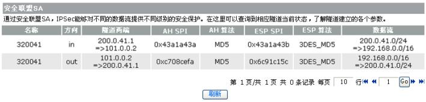


# 说明

IPSec VPN隧道建立后，路由器会自动添加一条路由信息（目的地址是为IPSec VPN对端网段地址，出接口为IPSec VPN虚接口）。您可以通过单击“静态路由”页面中的<查看路由信息表>按钮来获知。

# 8 设置QoS

QoS是指针对网络中各种应用不同的需求，提供不同的服务质量，比如：提供专用带宽、减少报文丢失率、降低报文传送时延及抖动。

本章节主要包含以下内容：

设置IP流量限制  
设置网络连接限数

# 8.1 设置IP流量限制

某些应用（比如：P2P下载等）在给用户带来方便的同时，也占用了大量的网络带宽。一个网络的总带宽是有限的，如果这些应用过度占用网络带宽，必将会影响其他用户正常使用网络。

为了保证局域网内所有用户都能正常使用网络资源，您可以通过 IP流量限制功能对局域网内指定主机的流量进行限制。

路由器支持以下两种 IP流量限制方式：

允许每 IP通道借用空闲的带宽（推荐使用）：即弹性带宽限制，在带宽使用不紧张时，允许每台主机可以使用系统空闲带宽，其实际流量可以超过限速值。  
每 IP通道只能使用预设的带宽：即固定带宽限制，每台主机的实际流量不能超过限速值。即使系统还有空闲的带宽，也不能利用。

# 页面向导：QoS设置→流量管理→IP流量限制

本页面为您提供如下主要功能：

• 启用IP流量限制功能，并设置您所需的限制方式（主页面。选中“启用IP流量限制”复选框，选择相应的限制方式，设置WAN接口的带宽，单击<应用>按钮生效）

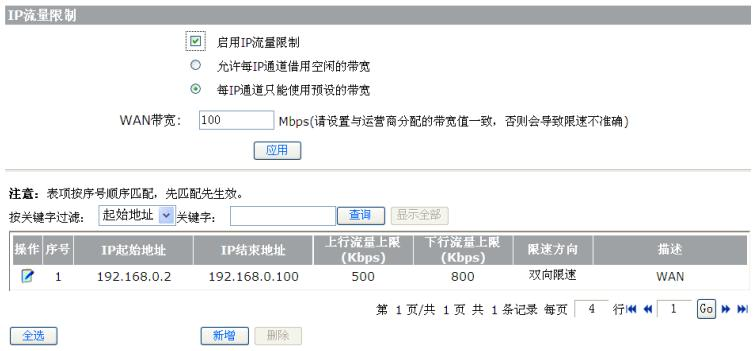

• 添加限速规则（单击<新增>按钮，在弹出的对话框中设置限速规则，单击<增加>按钮完成操作）

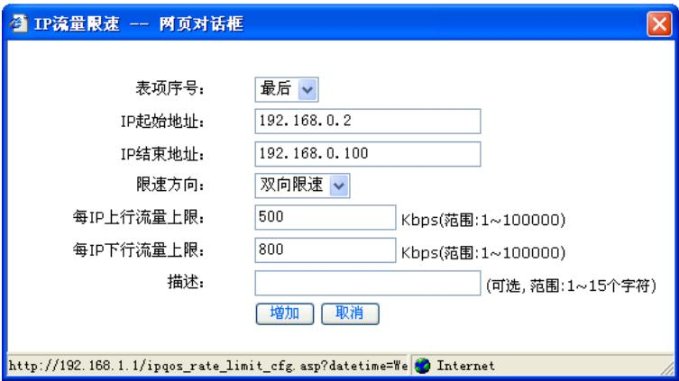

页面中关键项的含义如下表所示。

表8-1 页面关键项描述

<table><tr><td>页面关键项</td><td>描述</td></tr><tr><td>启用IP流量限制</td><td>开启路由器的IP流量限制功能缺省情况下,IP流量限制功能处于关闭状态[5x8Y]说明设置完成后,您可以通过查看运行状态页面中的“IP流量限制”来验证功能是否已启用</td></tr><tr><td>允许每IP通道借用空闲的带宽</td><td rowspan="2">选择路由器的IP流量限制方式缺省情况下,路由器采用每IP通道只能使用预设的带宽说明以出口带宽为30M,带机量为150台为例:每IP上行和下行流量上限均可设置为200Kbps,同时开启使用允许每IP通道借用空闲的带宽</td></tr><tr><td>每IP通道只能使用预设的带宽</td></tr><tr><td>WAN带宽</td><td>设置WAN接口的带宽请根据运营商提供给您的线路的带宽设置。带宽设置会对IP流量限制、绿色专用通道和限制专用通道等功能产生影响,请务必设置准确。</td></tr><tr><td>表项序号</td><td>由于系统会根据表项的序号来顺序匹配,因此您可以通过此选项来调整该表项的匹配优先级缺省情况下,新增的表项会排在最后</td></tr><tr><td>IP起始地址</td><td>输入局域网内需要进行流量限制的主机的起始IP地址</td></tr><tr><td>IP结束地址</td><td>输入局域网内需要进行流量限制的主机的结束IP地址</td></tr><tr><td>限速方向</td><td>选择IP流量限速方向:“上行限速”:限制由局域网发送到因特网的数据流速率(比如:局域网内主机向因特网上的FTP服务器上传文件)“下行限速”:限制由因特网发送到局域网的数据流速率(比如:局域网内主机从因特网上的FTP服务器下载文件)“双向限速”:同时限制上行、下行两个方向上的数据流速率</td></tr><tr><td>每IP上行流量上限</td><td>输入最大上行流量说明此最大上行流量限制值是在“IP起始地址”和“IP结束地址”地址段中各个主机的上行带宽,而不是IP地址段内所有主机的共享上行带宽</td></tr><tr><td>每IP下行流量上限</td><td>输入最大下行流量说明此最大下行流量限制值是在“IP起始地址”和“IP结束地址”地址段中各个主机的下行带宽,而不是IP地址段内所有主机的共享下行带宽</td></tr><tr><td>描述</td><td>对此条新增限速规则进行描述</td></tr></table>


# 说明

• 当对相同的单个 IP地址或 IP地址网段，在同一个限速接口上进行限速时，先添加的限速规则生效。比如：

先添加规则 1：设置用户（192.168.0.2）在 WAN 口上的 IP 流量限速为 300Kbps。

后添加规则 2：设置用户（192.168.0.2）在 WAN 口上的 IP 流量限速为 400Kbps。

生效情况：规则 1生效。

• 未设置限速规则的用户，带宽不做限制，只受系统转发能力的限制；当路由器开启弹性带宽后，系统为了合理地分配带宽，限速的用户可以占用一定的弹性带宽。

# 8.2 设置网络连接限数

当局域网内的主机遭受 NAT攻击时，主机的网络连接数可能会超过几万个，从而会严重影响业务的正常运行或出现网络掉线现象。此时，您可对指定主机的最大网络连接数进行限制，保证网络资源的有效利用。

# 页面向导：QoS设置→连接限制→网络连接限数

本页面为您提供如下主要功能：

启用网络连接限数功能（主页面。选中“启用网络连接限数”复选框，单击<应用>按钮生效）

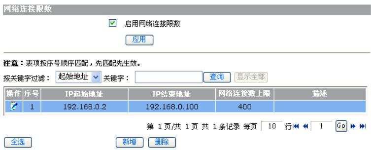

• 添加指定IP地址范围内每台主机同时发起的最大网络连接数（单击主页面上的<新增>按钮，在弹出的对话框中设置相应参数，单击<增加>按钮完成操作）

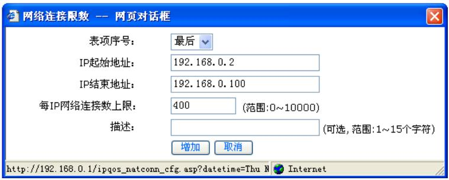

页面中关键项的含义如下表所示。

表8-2 页面关键项描述

<table><tr><td>页面关键项</td><td>描述</td></tr><tr><td>启用网络连接限数</td><td>缺省情况下,网络连接限数功能处于关闭状态说明设置完成后,您可以通过查看运行状态页面中的“网络连接限数”来验证功能是否已启用</td></tr><tr><td>表项序号</td><td>由于系统会根据表项的序号来顺序匹配,因此您可以通过此选项来调整该表项的匹配优先级缺省情况下,新增的表项会排在最后</td></tr><tr><td>IP起始地址</td><td>输入对局域网内进行网络连接限数的主机的起始IP地址</td></tr><tr><td>IP结束地址</td><td>输入对局域网内进行网络连接限数的主机的结束IP地址</td></tr><tr><td>每IP网络连接数上限</td><td>输入指定主机的网络连接数上限值</td></tr><tr><td>描述</td><td>对此网络连接限数项进行描述</td></tr></table>


# 说明

当对相同的单个 IP地址或 IP地址网段进行网络连接限数时，先添加的限数规则生效。比如：

• 先添加规则 1：设置 192.168.0.1～192.168.0.100 网段中的用户网络连接数上限为 40。  
• 后添加规则 2：设置 192.168.0.1～192.168.0.100 网段中的用户网络连接数上限为 50。

生效情况：规则 1生效。

# 9 高级设置

本章节主要包含以下内容：

设置网络连接参数  
设置虚拟服务器  
设置端口触发   
设置ALG应用  
设置静态路由  
业务控制  
应用服务

# 9.1 设置网络连接参数


# 说明

建议您在 H3C技术人员的指导下对网络连接参数进行操作。

# 页面向导：高级设置→地址转换→NAT设置

本页面为您提供如下主要功能：

• 设置路由器支持的网络连接总数，即会话总数（一般情况下，请保留缺省值。比如：局域网内PC遭受病毒攻击从而建立大量无用的连接，您可以修改该参数来减少路由器资源的浪费）  
• 清除指定接口的网络连接（一般情况下，如果路由器运行正常，请勿执行此操作。因为，清除网络连接会导致现有的业务重新选择出接口，可能会影响现有业务的正常运行）

# 网络连接

网络连接总数：

15000

条（范围：8000\~20000，缺省值：15000）

提示：网络连接总数配置建议保持缺省值！您可以通过系统自检页面生成的设备自检报告中查看到设备当前已经建立的网络连接总数。

应用

清除WAN口网络连接

# 9.2 设置虚拟服务器

为保证局域网的安全，路由器会阻断从因特网主动发起的连接请求。因此，如果您想让因特网用户能够访问局域网内的服务器（比如：Web 服务器、Email 服务器、FTP 服务器等），需要设置虚拟服务器。

虚拟服务器也可称为端口映射，它可以将 WAN口 IP地址、外部端口号和局域网内服务器 IP地址、内部端口号建立映射关系，使所有对该 WAN 口某服务端口的访问重定向到指定的局域网内服务器的相应端口。

路由器会根据以下步骤来进行端口映射：

图9-1 端口映射  
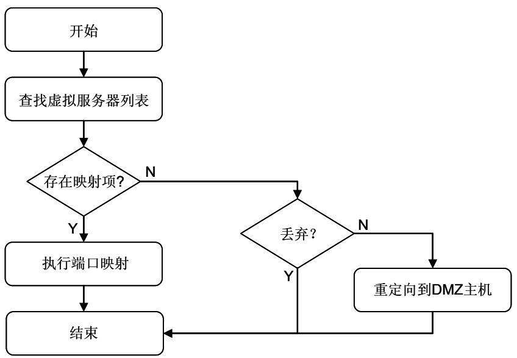

# 页面向导：高级设置→地址转换→虚拟服务器

本页面为您提供如下主要功能：

• 设置当虚拟服务器列表中如果不存在对应的映射项时，对报文的处理方式（主页面。选择“丢弃”或“重定向到 DMZ 主机”，单击<应用>按钮生效）


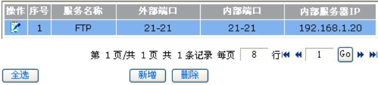

• 添加虚拟服务器列表项（单击主页面上的<新增>按钮，在弹出的对话框中设置相应的虚拟服务器参数，单击<增加>按钮完成操作）

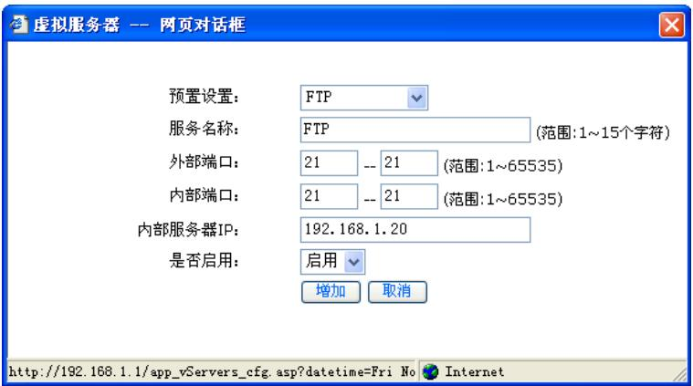

页面中关键项的含义如下表所示。

表9-1 页面关键项描述

<table><tr><td>页面关键项</td><td>描述</td></tr><tr><td>预置设置</td><td>路由器提供一些常用服务的预置设置选项,比如:FTP、Web等服务在下拉列表框中选择某服务,服务名称、外部端口、内部端口项均将自动完成设置说明如果路由器提供的预设服务没有您需要的,您可以自行设置服务信息预设服务的端口号是常用端口号,如果需要,您可以自行修改对于FTP、TFTP服务等,您需要开启对应的ALG项,且内部端口必须设置为标准端口号。例如:WAN侧客户端通过PASV模式(被动FTP)访问局域网内的FTP服务器,内部端口必须设置为21</td></tr><tr><td>服务名称</td><td>输入虚拟服务器设置项的名称</td></tr><tr><td>外部端口</td><td>输入客户端访问虚拟服务器所使用的端口。取值范围:1~65535,端口范围必须从小到大。如果只有一个端口,则左右两边的文本框请填写同一端口号说明各设置项的外部端口不能重复,且内部端口和外部端口的设定个数必须一样,即内部端口和外部端口一一对应。比如:设置某个虚拟服务器,外部端口为100~102,内部端口为10~12。如果路由器收到外部101端口的访问请求,则路由器会把报文转发到内部服务器的11端口</td></tr><tr><td>内部端口</td><td>输入内部服务器上真实开放的服务端口。取值范围:1~65535,端口范围必须从小到大。如果只有一个端口,则左右两边的文本框请填写同一端口号说明各设置项的内部端口允许重复,且内部端口和外部端口的设定个数必须一样,即内部端口和外部端口一一对应</td></tr><tr><td>内部服务器IP</td><td>输入内部服务器的IP地址</td></tr><tr><td>是否启用</td><td>在下拉列表框中选择“启用”,表示此虚拟服务器生效;选择“禁用”,表示此虚拟服务器不生效</td></tr></table>

# 9.3 设置端口触发

当局域网内的客户端访问因特网上的服务器时，对于某些应用（比如：IP 电话、视频会议等），客户端向服务器主动发起连接的同时，也需要服务器向客户端发起连接请求。而缺省情况下，路由器收到 WAN侧主动连接的请求都会拒绝，此时通信会被中断。

通过设置路由器的端口触发规则，当客户端访问服务器并触发规则后，路由器会自动开放服务器需要向客户端请求的端口，从而可以保证通信正常。当客户端和路由器长时间没有数据交互时，路由器会自动关闭之前对外开放的端口，最大限度地保证了局域网的安全。

页面向导：高级设置→地址转换→端口触发

本页面为您提供如下主要功能：

显示和修改当前您已添加的端口触发规则（主页面）


• 添加端口触发规则（单击主页面上的<新增>按钮，在弹出的对话框中设置相应的参数，单击<增加>按钮完成操作）

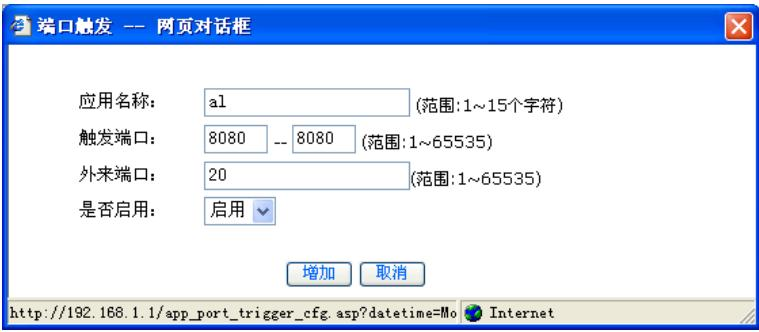

页面中关键项的含义如下表所示。

表9-2 页面关键项描述

<table><tr><td>页面关键项</td><td>描述</td></tr><tr><td>应用名称</td><td>输入端口触发设置项的名称</td></tr><tr><td>触发端口</td><td>输入局域网内的客户端向外网服务器发起请求的端口。取值范围:1~65535,端口范围必须从小到大。如果只有一个端口,则左右两边的文本框请填写同一端口号说明当局域网内的客户端通过触发端口与外部网络建立连接时,其相应的外来端口也将被打开。此时,外部网络的主机可以通过这些端口来访问局域网</td></tr><tr><td>外来端口</td><td>输入外网服务器需要主动向局域网内客户端请求的端口。取值范围:1~65535,可设置单一端口、端口范围或两者的组合,端口间用英文逗号“,”隔开,比如:100,200-300,400,表示请求端口为端口100,400及200到300之间的端口</td></tr><tr><td>是否启用</td><td>在下拉列表框中选择“启用”,表示此端口触发生效;选择“禁用”,表示此端口触发不生效</td></tr></table>

# 9.4 设置ALG应用

通常情况下，NAT 只对报文头中的 IP 地址和端口信息进行转换，不对应用层数据载荷中的字段进行分析。

然而，对于一些特殊的协议（比如：FTP、TFTP 等），它们报文的数据载荷中可能包含 IP 地址或端口信息，这些内容不能被 NAT 进行有效地转换，就可能会出现问题。比如：FTP 应用是由数据连接和控制连接共同完成的，而且数据连接的建立由控制连接中的载荷字段信息动态地决定，这就需要 ALG来完成载荷字段信息的转换，以保证后续数据连接的正确建立。

针对需要 ALG的一些应用层协议，您在使用时只需要在路由器上开启相应的项即可。

# 页面向导：高级设置→地址转换→ALG应用

本页面为您提供如下主要功能：

• 设置ALG应用（缺省情况下，应用层协议的ALG应用均已经开启，建议您保留缺省设置）

# ALG应用

ALG（ApplicationLevel Gateway，应用层网关）主要完成对应用层报文的处理。通常情况下，NAT只对报文头中的IP地址和端口信息进行转换，不对应用层数据载荷中的字段进行分析。然而一些特殊协议，它们报文的数据载荷中可能包含IP地址或端口信息，这些内容不能被NAT进行有效的转换，这就需要ALG来完成载荷字段信息的转换，以保证后续数据连接的正确建立。

回 启用SIP  
回 启用H323  
启用FTP   
启用TFTP   
启用MMS   
启用RTSP

应用

# 9.5 设置静态路由

静态路由是一种特殊的路由，需要您手工设置。设置静态路由后，去往指定目的地的报文将按照您指定的路径进行转发。在组网结构比较简单的网络中，只需设置静态路由就可以实现网络互通。恰当地设置和使用静态路由可以改善网络的性能，并可为重要的网络应用保证带宽。

静态路由的缺点在于：不能自动适应网络拓扑结构的变化，当网络发生故障或者拓扑发生变化后，可能会出现路由不可达，导致网络中断。此时必须由您手工修改静态路由的设置。

比如：如 图 9-2 所示，如果您希望LAN A中PC1 与LAN B中PC2 可以相互访问或LAN B中PC2 通过ER2100访问因特网，则可以在ER2100上设置一条静态路由（目的地址：192.168.2.0，下一跳地址：192.168.1.3）。

图9-2 静态路由设置举例组网图  
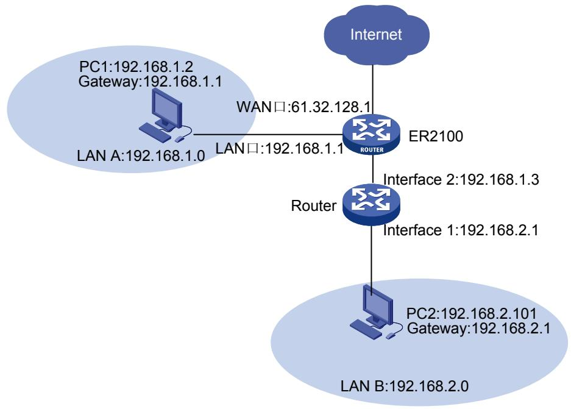

# 页面向导：高级设置→路由设置→静态路由

# 本页面为您提供如下主要功能：

显示和修改当前您已添加的静态路由（主页面）


• 添加静态路由（主页面。单击<新增>按钮，在弹出的对话框中设置相应的参数，单击<增加>按钮完成操作）

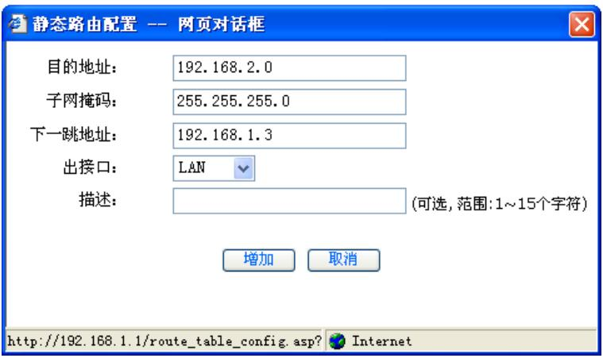

• 查看所添加的静态路由的生效情况（单击主页面上的“查看路由信息表”按钮，您即可在弹出的页面中查看已经生效的静态路由信息。如果您添加了一条错误的静态路由，该路由不会生效。您可以通过对比主页面的静态路由表和此处的路由信息，判断您是否添加了错误路由）

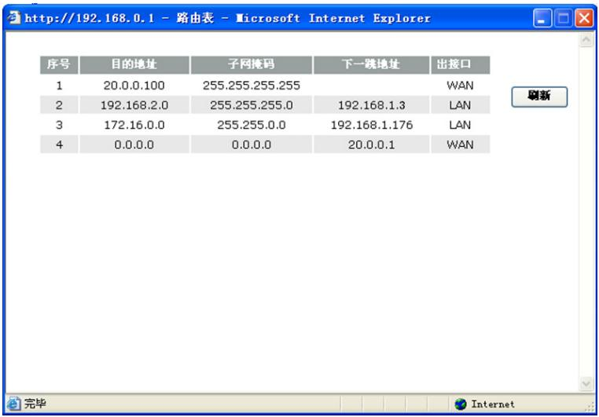

页面中关键项的含义如下表所示。

表9-3 页面关键项描述

<table><tr><td>页面关键项</td><td>说明</td></tr><tr><td>目的地址</td><td>输入需要到达的目的IP地址</td></tr><tr><td>子网掩码</td><td>输入需要到达的目的地址的子网掩码</td></tr><tr><td>下一跳地址</td><td>输入数据在到达目的地址前,需要经过的下一个路由器的IP地址</td></tr><tr><td>出接口</td><td>选择静态路由的出接口 说明您必须选择正确的出接口,所添加的静态路由才能生效</td></tr><tr><td>描述</td><td>对此静态路由表项进行描述</td></tr></table>

# 9.6 业务控制

# 9.6.1 限制使用IM软件

您可以通过此功能来限制局域网内某些主机对 IM 软件（如 QQ 或 MSN）的上线权限。

页面向导：高级设置→业务控制→IM软件

本页面为您提供如下主要功能：

• 开启/关闭局域网内所有主机对QQ或MSN软件的上线权限（主页面。选中“禁止 QQ 上线”或“禁止MSN上线”复选框，单击<应用>按钮生效。如果有部分特殊主机需要使用该软件进行通信，则可以在“IM软件特权”中开放对应的权限）


注意：RTX腾讯通与QQ属于类似业务，如需禁止QQ上线但仍需使用RTX，请配置允许访问的RTX服务器IP地址。


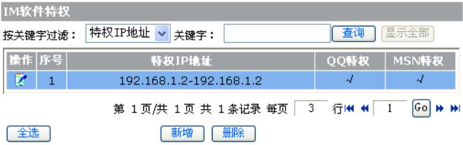

• 添加使用QQ或MSN软件的特殊主机（单击主页面中的<新增>按钮，在弹出的对话框中设置相应的特权主机及需要开放的IM软件，单击<增加>按钮生效）

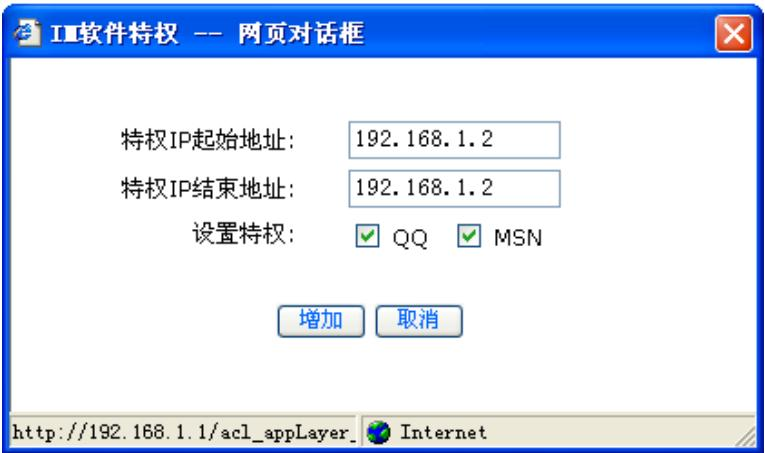

# 9.6.2 设置QQ特权号码

当您开启“禁止 QQ上线”功能而又希望某些特定 QQ号码能正常使用时，您可以通过启用 QQ特权号码功能实现。

# 页面向导：高级设置→业务控制→QQ 特权号码

本页面为您提供如下主要功能：

开启/关闭“QQ特权号码”功能（主页面。选中“启用QQ特权号码”复选框，单击<应用>按钮，在特权号码列表中增加QQ特权号码）

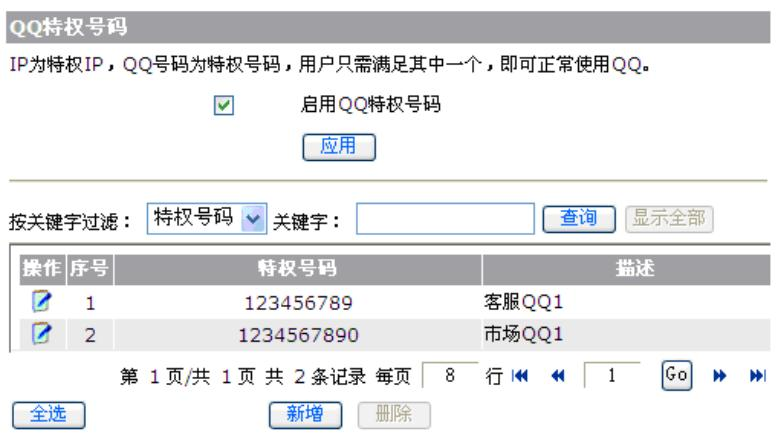

• 添加特权号码（单击主页面中的<新增>，在弹出的对话框中填写特权号码和描述信息，单击<增加>按钮生效）

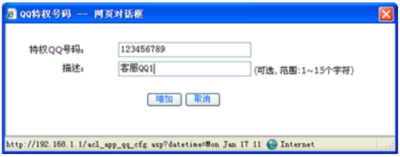


# 说明

设置 QQ 特权号码后，请使用 QQ 号码登录 QQ 服务器，以绑定邮箱地址为用户名的方式登录会失败。

# 9.6.3 限制使用金融软件

您可以通过此功能来限制局域网内某些主机对常见金融软件的使用。对于一些特殊的金融软件，您还可以通过设置 防火墙来进行控制。

# 页面向导：高级设置→业务控制→金融软件

本页面为您提供如下主要功能：

• 开启/关闭局域网内所有主机对金融软件的使用（主页面。选中需要禁止的金融软件对应的复选框，单击<应用>按钮生效。如果有部分特殊主机需要使用该软件，则可以在“金融软件特权”中开放对应的权限）


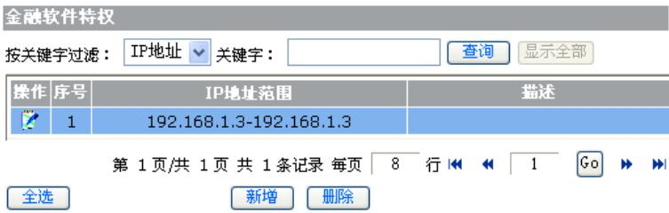

添加使用金融软件的特殊主机（单击主页面中的<新增>按钮，在弹出的对话框中设置相应的特权主机及需要开放的金融软件，单击<增加>按钮生效）

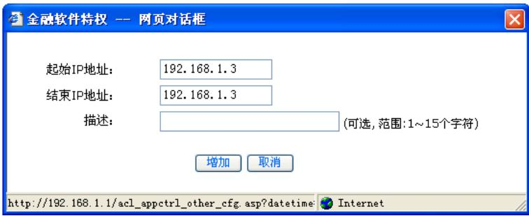

# 9.7 应用服务

# 9.7.1 设置DDNS

当路由器通过 PPPoE 方式或动态方式连接到因特网时，所获取到的 IP 地址是不固定的。因此，给想访问本局域网内服务器的因特网用户带来很大的不便。

开启 DDNS功能后，路由器会在 DDNS服务器上建立一个 IP与域名的映射表。当 WAN口 IP地址变化时，路由器会自动向指定的 DDNS服务器发起更新请求，DDNS服务器会更新域名与 IP地址的映射关系。所以，无论路由器的 WAN口 IP地址如何改变，因特网上的用户仍可以通过域名对本局域网内的服务器进行访问。


# 说明

路由器的 DDNS功能是作为 DDNS服务的客户端工具，需要与 DDNS服务器协同工作。使用该功能之前，请先到 www.pubyun.com去申请注册一个域名。

页面向导：高级设置→应用服务→DDNS

本页面为您提供如下主要功能：

# • 设置 WAN 口的 DDNS

# 动态域名配置

如果您在网站上申请的主机名为xxxx(3322.org或pubyun.com用户)，那么请在下面“注册的主机名”输入框中配置“主机名+域名”的格式（“DDNS服务器地址”统一选用pubyun.com)，例如配置xxxx.3322.0rg。刷新页面可查看注册状态。

WAN: DDNS :

禁用启用

用户名：

(范围:1\~31个字符）

密码：

(范围:1\~31个字符）

注册的主机名：

(范围:1\~63个字符)

DDNS服务器地址：

pubyun. com

网址链接:www.pubyun.com

当前地址：

0.0.0.0

状态：未连接

页面中关键项的含义如下表所示。

表9-4 页面关键项描述

<table><tr><td>页面关键项</td><td>描述</td></tr><tr><td>WAN DDNS</td><td>开启或关闭对应WAN口的DDNS功能缺省情况下,WAN口的DDNS功能处于关闭状态</td></tr><tr><td>用户名</td><td>输入在DDNS服务器上申请到的登录用户名</td></tr><tr><td>密码</td><td>输入在DDNS服务器上申请到的登录密码</td></tr><tr><td>注册的主机名</td><td>输入在DDNS服务器上申请的主机名,例如:ddnstest.3322.org</td></tr><tr><td>DDNS服务器地址</td><td>选择DDNS服务器地址</td></tr><tr><td>当前地址</td><td>显示对应WAN口当前的IP地址</td></tr><tr><td>状态</td><td>显示当前对应WAN口的DDNS工作状态未连接:与DDNS服务器连接失败注册成功:向DDNS服务器注册成功注册失败:DDNS服务器认证没有通过,可能是用户名或密码错误</td></tr></table>

# 9.7.2 设置UPnP

UPnP 主要用于实现设备的智能互联互通，无需用户参与和使用主服务器，能自动发现和控制来自各家厂商的各种网络设备。

启用 UPnP 功能，路由器可以实现 NAT 穿越：当局域网内的主机通过路由器与因特网通信时，路由器可以根据需要自动增加、删除 NAT映射表，从而解决一些传统的业务不能穿越 NAT的问题。

如需与UPnP功能配合使用，您所使用的计算机操作系统和应用程序均需要支持UPnP功能（比如：

操作系统：Windows XP，应用程序：MSN）。

页面向导：高级设置→应用服务→UPnP

本页面为您提供如下主要功能：

• 开启UPnP功能（选中“启用UPnP功能”，单击<应用>按钮生效。缺省情况下，UPnP 功能处于关闭状态）

# UPnP设置

UPnP（UniversalPlugandPlay）通用即插即用，是针对设备彼此间的通讯而制定的一组协议的统称。本设备作为UPnP网关，主要功能是完成端口自动映射，设备启用UPnP后，可以为支持UPnP的应用程序自动添加端口映射，加速点对点的传输，还可以解决一些传统业务（比如，MSN）不能穿越NAT的问题。但开启该功能同样会为支持UPnP功能的非法软件建立映射，存在安全隐患。

通过UPnP实现端口自动映射需要满足三个条件：1.本设备必须启用UPnP功能；2.内网主机的操作系统必须支持并开启UPnP服务；3.应用程序必须支持并开启UPnP功能。


启用UPnP功能

应用


# 说明

设置完成后，您可以通过查看 运行状态页面中的“UPnP”来验证功能是否已启用。

# 10 设备管理

本章节主要包含以下内容：

基本管理  
用户管理  
远程管理

# 10.1 基本管理

# 10.1.1 配置管理

页面向导：设备管理→基本管理→配置管理

本页面为您提供如下主要功能：

• 将当前路由器的设置信息以.cfg文件的形式备份到本地（比如：当您发生误操作或其他情况导致路由器的系统设置信息丢失时，您可用此备份文件进行恢复操作，保证路由器的正常运行）  
将路由器当前的设置恢复到您之前备份过的设置  
• 将路由器恢复到出厂设置（比如：当您从一个网络环境切换到另一个不同的网络环境的情况，可将路由器恢复到出厂设置，然后再进行重新设置，以适应当前的组网）

# 备份系统设置信息

单击<备份>按钮，可以把所有的设置信息打包成一个文件，备份到PC上。

备份

# 从文件中恢复设置信息

单击<浏览>按钮，选择一个以前备份的文件，然后单击<恢复>按钮，可以恢复到以前的设置状态。

恢复

浏览..

注意：恢复设置之后，设备将重启动。

# 恢复到出厂设置

单击<复原>按钮，当前的所有设置都将恢复到出厂时的初始状态，恢复完成后设备将重启。

复原


# 注意

• 请不要编辑备份在本地的设置文件。因为，设置文件经过加密，修改后不能再次恢复到路由器中。  
• 恢复到出厂设置后，当前的设置将会丢失。如果您不希望丢失当前设置信息，请先对路由器进行备份操作。  
• 恢复出厂设置后，路由器将会重新启动。在此期间请勿断开设备的电源。

# 10.1.2 设置系统时间

路由器支持通过 NTP服务器来自动获取系统时间和手工设置系统时间两种方式。

# 1. 通过NTP服务器自动获取系统时间（推荐）

NTP是由 RFC 1305定义的时间同步协议，用来在分布式时间服务器和客户端之间进行时间同步。NTP基于 UDP报文进行传输，使用的 UDP端口号为 123。

使用 NTP 的目的是对网络内所有具有时钟的设备进行时钟同步，使网络内所有设备的时钟保持一致，从而使设备能够提供基于统一时间的多种应用。对于运行 NTP 的本地系统，既可以接受来自其他时钟源的同步，又可以作为时钟源同步其他的时钟。

对于网络中的各台设备来说，如果单依靠管理员手工修改系统时间，不但工作量巨大，而且也不能保证时钟的精确性。通过 NTP，可以很快将网络中设备的时钟同步，同时也能保证很高的精度。

当路由器连接到因特网后，会自动从路由器缺省的 NTP服务器或您手工设置的 NTP服务器中获取时间。当通过 NTP成功获取到系统时间后，该时间还会根据您选择的时区做相应的调整。


# 说明

如果路由器无法通过NTP服务器获得到系统时间，则路由器会在 基本信息页面中的“系统时间“处显示“网络未获取时间”，此时您需要手工设置系统时间。

# 2. 手工设置系统时间

手工设置的系统时间不会与其他设备同步，也不支持时区的切换。当路由器重新启动后，手工设置的系统时间会丢失，并且路由器将恢复成了通过 NTP 服务器来自动获取系统时间。此时，如果您将路由器连接到因特网后，它会通过缺省的 NTP服务器来获取系统时间。

# 页面向导：设备管理→基本管理→时间设置

本页面为您提供如下主要功能：

通过NTP服务器来自动获到系统时间（单击“通过网络获到系统时间”单选按钮，并指定相应的NTP服务器及时区，单击<应用>按钮生效）  
手工设置系统时间（单击“手工设置系统时间”单选按钮，设置具体的时间参数，单击<应用>按钮生效）

# 系统时间设置

您必须先连上Internet通过网络获取到系统时间或到此页手动设置系统时间后，其他功能（如访问控制）中的时间限定才能正确生效。

# 通过网络获取系统时间


# 手工设置系统时间


# 说明

设置完成后，您可以通过查看 基本信息页面中的“系统时间”来验证设置是否已生效。

# 10.1.3 软件升级

通过软件升级，您可以加载最新版本的软件到路由器，以便获得更多的功能和更为稳定的性能。


# 注意

• 请您在软件升级之前备份路由器当前的设置信息。如果升级过程中出现问题，您可以用其来恢复到原来的设置。  
• 升级过程中请勿断开路由器的电源，否则可能会造成路由器不能正常工作。  
• 路由器升级成功后，将会重新启动。

# 页面向导：设备管理→基本管理→软件升级

单击页面上的“H3C的技术支持网站”链接下载对应产品的最新软件版本，保存到本地主机。然后，单击<浏览>按钮，选择相应的升级软件。最后，单击<升级>按钮，即可开始升级。


# 说明

软件升级后，您可以通过查看 基本信息页面中“软件版本”来验证当前运行的版本是否正确。

# 10.1.4 重新启动路由器

页面向导：设备管理→基本管理→重启动


# 注意

• 重新启动期间，请勿断开路由器的电源。  
• 重新启动期间，网络通信将暂时中断。

单击页面上的<重启动>按钮，确认后，路由器重新启动。

# 10.2 用户管理

# 10.2.1 登录管理

页面向导：设备管理→用户管理→登录管理

本页面为您提供如下主要功能：

• 设置局域网内允许管理路由器的用户IP地址范围（在“LAN内管理PC的IP范围”文本框中输入允许管理路由器的 IP 地址范围，单击<应用>按钮生效。此限制功能仅对 http/https、telnet访问有效）  
• 设置 Web 用户超时时间（在“超时时间”文本框中输入时间参数，单击<应用>按钮生效）  
• 开启/关闭Web登录页面验证码功能（选择功能状态，单击<应用>按钮生效）

# 登陆管理设置

LAN内管理PC的IP范围：

192.168.1.2

192.168.1.200

超时时间：

分钟（范围:5\~120，缺省值：5)

验证码功能：

启用

应用

# 当前登录用户

<table><tr><td>用户名</td><td>IP 地址</td><td>登录时间</td><td>操作</td></tr><tr><td>useradmin</td><td>192.168.1.2</td><td>2000-01-01 00:02:37</td><td>当前用户</td></tr></table>

• 查看当前已登录的用户信息  
• 注销已登录用户（单击某用户所对应的<注销>按钮，即可将该用户强制退出。如需登录，需要重新认证）


# 说明

当由于误操作而未将自身的IP划入到允许管理路由器的用户IP地址范围内，导致无法登录路由器时，您可以通过Console下的 admin acl default命令将其恢复为缺省设置（缺省情况下，允许局域网内所有用户访问路由器）。

# 10.2.2 密码管理

页面向导：设备管理→用户管理→密码管理

本页面为您提供如下主要功能：

• 修改路由器的登录密码

用户密码管理

<table><tr><td>原密码:</td><td>●●●●●●</td><td>(范围:1~31个字符)</td></tr><tr><td>新密码:</td><td>●●●●●●●●●●●●</td><td>(范围:1~31个字符)</td></tr><tr><td>认密码:</td><td>●●●●●●●●●●●●●</td><td>(范围:1~31个字符)</td></tr></table>

# 10.3 远程管理

路由器为您提供了远程登录管理的功能，即因特网上的主机可以通过路由器的 WAN口来实现 Web或 Telnet 登录。

远程 Web管理支持 HTTP和 HTTPS两种访问方式。HTTPS相对于 HTTP，在安全性方面有所增强，它将 HTTP和 SSL结合，通过 SSL对客户端身份和服务器进行验证，对传输的数据进行加密，从而实现了对设备的安全管理。

HTTPS通过SSL协议，从以下几方面提高了安全性：

客户端通过数字证书对服务器进行身份验证，保证客户端访问正确的服务器；  
服务器通过数字证书对客户端进行身份验证，保证合法客户端可以安全地访问设备，禁止非法的客户端访问设备；  
客户端与设备之间交互的数据需要经过加密，保证了数据传输的安全性和完整性，从而实现了对设备的安全管理。


# 说明

• 同一时间，路由器最多允许五个用户远程通过 Web 或 Telnet 进行管理和设置。  
• 缺省情况下，路由器的远程 Web管理和远程 Telnet管理均处于关闭状态。

页面向导：设备管理→用户管理→远程管理

本页面为您提供如下主要功能：

开启远程Web管理功能（选中“启用远程 web管理”复选按钮，选择访问方式，并设置相关的参数，单击<应用>按钮生效）  
开启远程Telnet管理功能（选中“启用远程 telnet 管理”复选按钮，设置相关的参数，单击<应用>按钮生效）

# 远程web管理


在浏览器地址栏输入http://WANIP:port或https://WANIP:port，进行远程管理。选择HTTPS方式时，请按浏览器的提示安装证书，进行访问。

# 远程telnet管理


页面中关键项的含义如下表所示。

表10-1 页面关键项描述

<table><tr><td>页面关键项</td><td>描述</td></tr><tr><td>访问方式</td><td>当选择HTTP访问方式时,远程用户需要在浏览器的地址栏中输入http://xxx.xxx.xxx.xxx:port登录路由器;当选择HTTPS访问方式时,远程用户需要在浏览器的地址栏输入https://xxx.xxx.xxx.xxx:port登录路由器说明xxx.xxx.xxx.xxx是指路由器WAN口的IP地址,port是指您所指定的“设备的远程管理端口”如果您使用HTTPS方式访问路由器,路由器会向您发放一份证书。此证书可能因为不受信任而被浏览器阻止,您只要选择信任此证书,继续操作便可进入路由器的Web登录页面</td></tr><tr><td>远程管理PC的IP范围</td><td>设置远程用户的IP地址范围,仅在该指定范围内的用户才允许远程管理路由器缺省情况下,允许所有用户对路由器进行远程管理</td></tr><tr><td>设备的远程管理端口号</td><td>设置对路由器进行远程管理的端口号</td></tr></table>


# 说明

设置完成后，您可以通过查看 运行状态页面中的“设备管理”来验证远程管理功能是否已启用。

# 10.4 设置SNMP

# 10.4.1 SNMP简介

SNMP用于保证管理信息在任意两点间传送，便于网络管理员在网络上的任何节点检索信息、修改信息、寻找故障、完成故障诊断、进行容量规划和生成报告。

SNMP采用轮询机制，提供最基本的功能集，特别适合在小型、快速和低价格的环境中使用。SNMP的实现基于无连接的传输层协议 UDP，因此可以实现和众多产品的无障碍连接。

# 1. SNMP的工作机制

SNMP 分为 NMS 和 Agent 两部分：

NMS是运行客户端程序的工作站。  
Agent是运行在网络设备（比如：交换机）上的服务器端软件。

NMS 可以向 Agent 发出 GetRequest、GetNextRequest 和 SetRequest 报文，Agent 接收到 NMS的这些请求报文后，根据报文类型对 MIB 进行 Read 或 Write 操作，生成 Response 报文，并将报文返回给 NMS。

Agent 在设备发生异常情况或状态改变时（比如：设备重新启动），也会主动向 NMS 发送 Trap 报文，向 NMS汇报所发生的事件。

# 2. SNMP的版本

目前，的 SNMP Agent 支持 SNMP v1、SNMP v2c 和 SNMP v3 三个版本。

SNMP v3 采用用户名和密码认证方式；SNMP v1、SNMP v2c 采用团体名（Community Name）认证，非认可团体名的 SNMP 报文将被丢弃。SNMP 团体名用来定义 SNMP NMS 和 SNMP Agent的关系。团体名起到了类似于密码的作用，可以限制 SNMP NMS 访问上的 SNMP Agent。

# 3. MIB

在SNMP报文中用管理变量来描述中的管理对象。为了唯一标识中的管理对象，SNMP用层次结构命名方案来识别管理对象。整个层次结构就像一棵树，树的节点表示管理对象，如下图 10-1所示。每一个节点，都可以用从根开始的一条路径唯一地标识。

图10-1 MIB 树结构  


MIB的作用就是用来描述树的层次结构，它是所监控网络设备的标准变量定义的集合。在 图 10-1中，管理对象B可以用一串数字{1.2.1.1}唯一确定，这串数字是管理对象的对象标识符。

# 10.4.2 设置SNMP v1、SNMP v2c基本功能

# 1. 基本设置

页面向导：设备管理→SNMP→基本设置

本页面为您提供如下主要功能：

设置 SNMP Agent 的状态、版本、维护信息等

SNMP基本配置

<table><tr><td colspan="2">启用SNMP功能</td></tr><tr><td>SNMP版本选择:</td><td>v2c</td></tr><tr><td>维护联系信息:</td><td>R&amp;D Hangzhou, Hangzhou H3C (可选,范围:1~200个字符)</td></tr><tr><td>物理位置信息:</td><td>Hangzhou, China (可选,范围:1~200个字符)</td></tr><tr><td>本地引擎ID:</td><td>800063A2456700238912feef (范围:10~64个字符)</td></tr><tr><td>SNMP信任主机</td><td></td></tr></table>

页面中关键项的含义如下表所示。

表10-2 页面关键项描述

<table><tr><td colspan="2">页面关键项</td><td>描述</td></tr><tr><td colspan="2">启用SNMP功能</td><td>开启/关闭SNMP Agent功能缺省情况下,SNMP Agent功能处于关闭状态</td></tr><tr><td colspan="2">SNMP版本选择</td><td>选择v1或v2c说明只有选择了相应的SNMP版本,路由器才会处理对应版本的SNMP数据报文</td></tr><tr><td rowspan="3">系统信息</td><td>维护联系信息</td><td rowspan="2">如果路由器发生故障,维护人员可以利用系统维护联系信息,及时与生产厂商取得联系,便于快速地定位和解决问题缺省情况下,维护联系信息为“Hangzhou H3C Technologies Co., Ltd.”;物理位置信息为“Hangzhou China”</td></tr><tr><td>物理位置信息</td></tr><tr><td>本地引擎ID</td><td>本地引擎ID必须是16进制字符形式的字符串,至少10个字符,可以是IP地址、MAC地址或者自己定义的文本。缺省为公司的企业号+设备信息</td></tr><tr><td colspan="2">SNMP信任主机</td><td>设置SNMP Agent信任的NMS IP地址,即允许指定的NMS对SNMP Agent进行访问。若不设置该项,即不对NMS进行限制</td></tr></table>

# 2. 设置团体名

页面向导：设备管理→SNMP→团体名设置

本页面为您提供如下主要功能：

• 设置团体名及访问模式

团体名管理

<table><tr><td>团体名</td><td>访问权限</td><td>MIB视图</td></tr><tr><td>public</td><td>Read-Only</td><td>defaultview</td></tr><tr><td>private</td><td>Read-Write</td><td>defaultview</td></tr><tr><td></td><td>Read-Only</td><td>defaultview</td></tr><tr><td></td><td>Read-Only</td><td>defaultview</td></tr></table>

注意：团体名设置只支持SNMPv1、SNMPv2c版本。

应用

页面中关键项的含义如下表所示。

表10-3 页面关键项描述

<table><tr><td>页面关键项</td><td>描述</td></tr><tr><td>团体名</td><td>您可以采用标准的团体名(public或private)或自定义团体名</td></tr><tr><td>访问权限</td><td>团体访问MIB对象的读写(Read-Write)或者只读(Read-Only)权限。具有只读权限的团体只能对设备信息进行查询,而具有读写权限的团体还可以对设备进行配置</td></tr></table>

# 10.4.3 设置SNMP v3 基本功能

# 1. 基本设置

页面向导：设备管理→SNMP→基本设置

页面中关键项的含义如下表所示。

表10-4 页面关键项描述

<table><tr><td colspan="2">页面关键项</td><td>描述</td></tr><tr><td colspan="2">启用SNMP功能</td><td>开启/关闭SNMP Agent功能缺省情况下,SNMP Agent功能处于关闭状态</td></tr><tr><td colspan="2">SNMP版本选择</td><td>选择v3说明只有选择了相应的SNMP版本,路由器才会处理对应版本的SNMP数据报文</td></tr><tr><td rowspan="3">系统信息</td><td>维护联系信息</td><td rowspan="2">如果路由器发生故障,维护人员可以利用系统维护联系信息,及时与生产厂商取得联系,便于快速地定位和解决问题缺省情况下,维护联系信息为“Hangzhou H3C Technologies Co., Ltd.”;物理位置信息为“Hangzhou China”</td></tr><tr><td>物理位置信息</td></tr><tr><td>本地引擎ID</td><td>本地引擎ID必须是16进制字符形式的字符串,至少10个字符,可以是IP地址、MAC地址或者自己定义的文本。缺省为公司的企业号+设备信息</td></tr><tr><td colspan="2">SNMP信任主机</td><td>设置SNMP Agent信任的NMS IP地址,即允许指定的NMS对SNMP Agent进行访问。若不设置该项,即不对NMS进行限制</td></tr></table>

# 2. 设置用户组

页面向导：设备管理→SNMP→用户组设置

本页面为您提供如下主要功能：

• 设置用户组以及安全级别

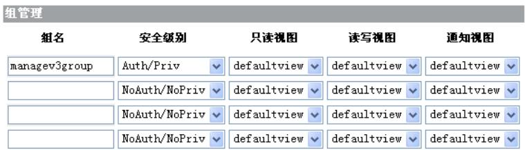  
注意：用户组、用户设置只支持SNMPv3版本。

应用

页面中关键项的含义如下表所示。

表10-5 页面关键项描述

<table><tr><td>页面关键项</td><td>描述</td></tr><tr><td>组名</td><td>设置SNMP v3版本的群组名称,长度为1~32个字符,区分大小写</td></tr><tr><td>安全级别</td><td>选择SNMP v3版本的群组安全级别:Auth/NoPriv:对报文进行认证但不加密Auth/Priv:对报文进行认证并加密NoAuth/NoPriv:对报文即不进行认证,也不加密缺省情况下,SNMP v3版本的群组安全级别为NoAuth/NoPriv</td></tr></table>

# 3. 添加用户到用户组

页面向导：设备管理→SNMP→用户设置

本页面为您提供如下主要功能：

显示和修改已添加的用户（主页面）


• 添加新用户（单击主页面上的<新增>按钮，在弹出的对话框中输入用户名，选择需要加入的用户组，并根据实际需求设置认证和加密信息，单击<增加>按钮完成操作）

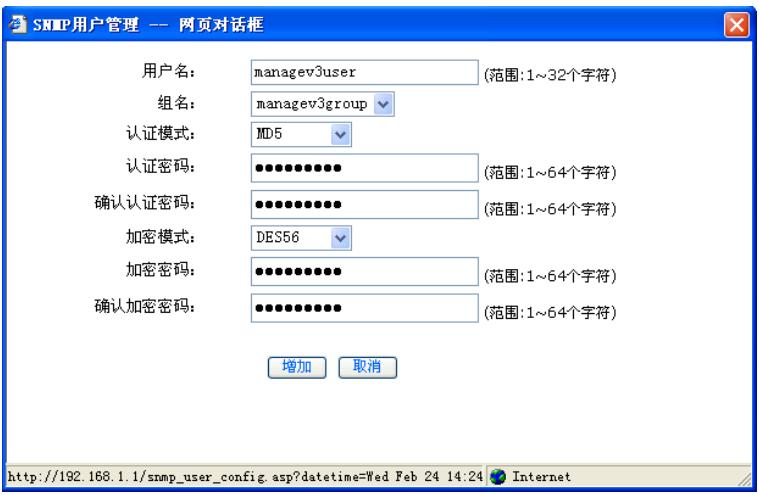


# 说明

认证模式介绍：

MD5通过输入任意长度的消息，产生 128bit的消息摘要，与 SHA相比：计算速度快，但安全强度略低；SHA-1 通过输入长度小于 2 的 64 次方 bit 的消息，产生 160bit 的消息摘要，与 MD5 相比：计算速度慢，但安全强度更高。

# 10.4.4 设置TRAP

TRAP 是被管理设备不经请求，主动向 NMS 发送的信息，用于报告一些紧急的重要事件（比如：被管理设备重新启动等）。


# 说明

在设置 SNMP TRAP功能前必须先完成 SNMP基本功能配置。

# 页面向导：设备管理→SNMP→基本设置

本页面为您提供如下主要功能：

• 设置TRAP基本功能

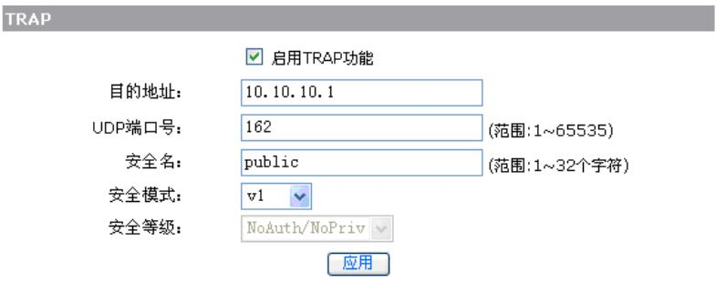

页面中关键项的含义如下表所示。

表10-6 页面关键项描述

<table><tr><td>页面关键项</td><td>描述</td></tr><tr><td>启用TRAP功能</td><td>开启/关闭SNMP TRAP功能缺省情况下,SNMP TRAP功能处于关闭状态</td></tr><tr><td>目的地址</td><td>指定接收TRAP消息的主机地址</td></tr><tr><td>UDP端口号</td><td>指定接收TRAP消息的UDP端口号</td></tr><tr><td>安全名</td><td>设置安全名称,须为SNMP v1、SNMP v2c的团体名或SNMP v3的用户名</td></tr><tr><td>安全模式</td><td>选择对应的SNMP Agent版本号</td></tr><tr><td>安全等级</td><td>选择安全级别,且仅当安全模式为v3时此选项才可用Auth/NoPriv:对报文进行认证但不加密Auth/Priv:对报文进行认证并加密NoAuth/NoPriv:对报文即不进行认证,也不加密</td></tr></table>

# 11 系统监控

本章节主要包含以下内容：

查看运行信息  
查看和管理日志信息  
流量监控   
网络维护

# 11.1 查看运行信息

# 11.1.1 查看基本信息

页面向导：系统监控→运行信息→基本信息

本页面为您提供如下主要功能：

查看系统基本信息（比如：当前运行的软件版本号、CPU/内存使用率、运行时间等）  
• 查看WAN口当前的状态信息（比如：连接因特网的方式、IP 地址等）


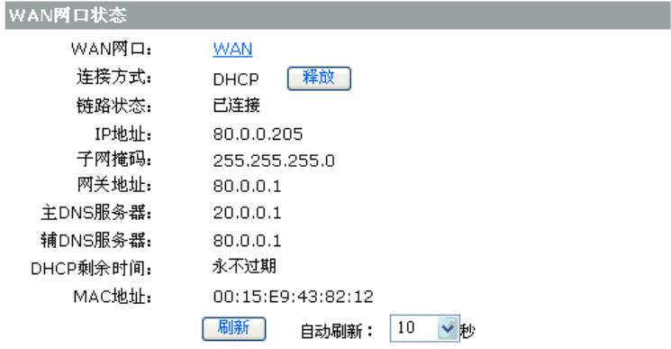

页面中关键项的含义如下表所示。

表11-1 页面关键项描述

<table><tr><td>页面关键项</td><td>描述</td></tr><tr><td>生产序列号</td><td>显示路由器的序列号</td></tr><tr><td>软件版本</td><td>显示路由器当前的软件版本说明页面中的软件版本信息仅作参考,请以路由器加载软件版本后的最终显示为准</td></tr><tr><td>Bootrom版本</td><td>显示路由器当前的Bootrom版本</td></tr><tr><td>硬件版本</td><td>显示路由器当前的硬件版本</td></tr><tr><td>系统资源</td><td>显示路由器CPU及内存的使用百分比,您可以通过该参数值来简单判断路由器当前是否运行正常</td></tr><tr><td>运行时间</td><td>显示路由器从上一次通电后到现在的总运行时间</td></tr><tr><td>系统时间</td><td>显示路由器当前的系统时间和系统时间设置方式</td></tr><tr><td>连接方式</td><td>显示路由器WAN口连接到因特网的方式</td></tr><tr><td>链路状态</td><td>显示路由器WAN口当前的链路状态已连接:WAN口工作正常物理连接已断开:WAN口物理链路出现故障连接中:在PPPoE、DHCP连接方式下,路由器正在与服务器建立连接服务器没响应:在PPPoE、DHCP连接方式下,对应的服务器无响应或线路异常IP地址已释放:在DHCP连接方式下,单击页面上的&lt;释放&gt;按钮主动断开连接,显示此状态。此状态下,接口不再尝试与服务器进行连接连接已断开:在PPPoE连接方式下,单击页面上的&lt;释放&gt;按钮主动断开连接,显示此状态。此状态下,接口不再尝试与服务器进行连接</td></tr><tr><td>IP地址</td><td>显示WAN口当前的IP地址</td></tr><tr><td>子网掩码</td><td>显示WAN口当前的子网掩码</td></tr><tr><td>网关地址</td><td>显示WAN口当前的网关地址</td></tr><tr><td>主DNS服务器</td><td>显示WAN口的主DNS服务器地址</td></tr><tr><td>辅DNS服务器</td><td>显示WAN口的辅DNS服务器地址</td></tr><tr><td>DHCP剩余时间</td><td>显示DHCP租约的剩余时间说明仅当连接方式为DHCP方式时才显示</td></tr><tr><td>MAC地址</td><td>显示WAN口当前生效的MAC地址说明当您设置了WAN口的MAC地址克隆后,此MAC地址会出现相应的变化</td></tr><tr><td>连接</td><td>单击此按钮建立WAN口的链路连接说明仅当连接方式为PPPoE、DHCP时才显示此按钮</td></tr><tr><td>释放</td><td>单击此按钮释放当前路由器WAN口动态获取到的IP地址说明仅当连接方式为PPPoE、DHCP时才显示此按钮</td></tr></table>

# 11.1.2 查看运行状态

页面向导：系统监控→运行信息→运行状态

本页面为您提供如下主要功能：

查看当前路由器主要功能项的设置状态

<table><tr><td colspan="2">高级功能</td></tr><tr><td>UPnP:</td><td>未启用</td></tr><tr><td colspan="2">安全功能</td></tr><tr><td>ARP防攻击:</td><td>启用</td></tr><tr><td>MAC过滤:</td><td>未启用</td></tr><tr><td>网站过滤:</td><td>未启用</td></tr><tr><td>IPMAC过滤:</td><td>未启用</td></tr><tr><td>出站通信策略:</td><td>启用</td></tr><tr><td>入站通信策略:</td><td>启用</td></tr><tr><td>IDS防范功能:</td><td>启用</td></tr><tr><td>IPSec VPN功能:</td><td>未启用</td></tr><tr><td colspan="2">QoS功能</td></tr><tr><td>IP流量限制:</td><td>启用</td></tr><tr><td>网络连接限数:</td><td>未启用</td></tr><tr><td colspan="2">设备管理</td></tr><tr><td>远程web管理:</td><td>未启用</td></tr><tr><td>远程telnet管理:</td><td>未启用</td></tr></table>

# 11.1.3 实时监视性能状态

当您开启性能实时监视功能后，系统会对路由器 CPU 和内存的使用进行实时采样，并通过一个直观的滚动折线图来显示数据变化，供您及时了解 CPU和内存的使用率是否过高，波动是否正常。

页面向导：系统监控→运行信息→性能监视

本页面为您提供如下主要功能：

• 单击页面中的<开始监视>按钮，您即可在弹出的页面中实时监视路由器CPU和内存的使用状态

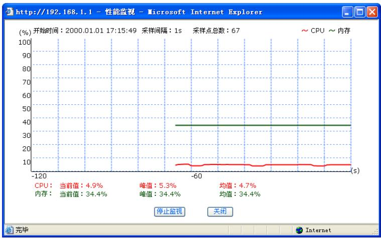

# 11.1.4 技术支持信息

页面向导：系统监控→运行信息→技术支持

本页面为您提供了路由器相关的技术支持类信息，比如：H3C公司网站链接、客服热线/邮箱等。

# 11.2 查看和管理日志信息

路由器能够记录当前运行过程中的设置状态变化、网络攻击等信息，可以帮助您快速定位设备故障、了解网络情况及对网络攻击进行定位。

路由器还支持把日志信息实时发送给日志服务器的功能，以免路由器重新启动后，所有记录的日志都会丢失。


# 说明

当路由器中的日志信息存满后，新的日志将会覆盖最早被记录的日志信息。因此，为了避免日志信息遗漏，建议您使用日志服务器来记录日志信息。此时，需要您预先在局域网内或外网建立相应的日志服务器，且与路由器保持连通。

# 11.2.1 查看日志信息

页面向导：系统监控→系统日志→日志信息

本页面为您提供如下主要功能：

显示和查询路由器上电启动以来所产生的日志信息  
• 将路由器所记录的日志信息下载到本地（单击<下载>按钮，可将日志信息导出到本地保存）  
• 清除路由器所记录的日志信息（单击<清除>按钮即可完成操作）


# 11.2.2 管理日志信息

页面向导：系统监控→系统日志→日志管理

本页面为您提供如下主要功能：

控制日志信息输出的等级（在“日志记录等级”下拉框中选择某个等级，单击<应用>按钮生效。此时，仅不大于该等级的日志信息才被路由器记录或允许发送到日志服务器。日志等级的具体描述请参见“表 11-2”）  
• 控制日志信息输出的来源（选择您需要关注的日志信息来源，单击<应用>按钮生效。日志信息来源描述请参见“表 11-3”）  
• 将日志信息同步输出到日志服务器（选中“发送到日志服务器”复选框，输入服务器地址，单击<应用>按钮生效）  
• 开启/关闭路由器日志信息记录功能（选中“本地不记录日志”复选框，单击<应用>按钮，本地记录日志信息功能关闭。反之，开启）

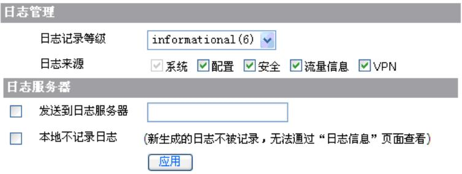

表11-2 日志信息等级描述

<table><tr><td>严重等级</td><td>数值</td><td>描述</td></tr><tr><td>emergency</td><td>0</td><td>系统不可用</td></tr><tr><td>alert</td><td>1</td><td>需要立即做出反应的信息</td></tr><tr><td>critical</td><td>2</td><td>严重信息</td></tr><tr><td>error</td><td>3</td><td>错误信息</td></tr><tr><td>warning</td><td>4</td><td>告警信息</td></tr><tr><td>notice</td><td>5</td><td>正常出现但是重要的信息</td></tr><tr><td>informational</td><td>6</td><td>需要记录的通知信息</td></tr><tr><td>debug</td><td>7</td><td>调试过程产生的信息</td></tr></table>

表11-3 日志信息来源描述

<table><tr><td>日志来源</td><td>描述</td></tr><tr><td>系统</td><td>所有路由器功能运行的日志信息。比如:您使用PPPoE方式连接因特网时,路由器会输出相应的日志信息</td></tr><tr><td>配置</td><td>当更改了路由器的配置操作时输出的日志信息。比如:功能的开启或关闭</td></tr><tr><td>安全</td><td>路由器进行防攻击、报文过滤等操作时输出的日志信息</td></tr><tr><td>流量信息</td><td>路由器流量统计时输出的日志信息。比如:局域网内的某台主机的网络连接数超过限速值时,路由器会输出相应的日志信息</td></tr><tr><td>VPN</td><td>路由器IPSec VPN相关的日志信息</td></tr></table>

# 11.3 流量监控

路由器为您提供了端口流量和 IP流量的监控功能，您可以根据路由器所获取的统计数据，更好地了解网络运行状况，便于管理与控制。

监控端口流量：统计每个物理端口的流量。  
监控 IP 流量：统计局域网内各在线主机通过 WAN 口的流量。


# 说明

路由器支持以下两种查看模式供您对端口流量和 IP流量进行监控：

• 比特模式：以每秒传输的比特数为单位来显示流量和速率信息。  
• 包模式：以每秒传输的报文个数为单位来显示流量和速率信息。

# 11.3.1 监控端口流量

# 页面向导：系统监控→流量监控→端口流量

本页面为您提供如下主要功能：

• 在比特模式下查看路由器各端口的发送/接收流量、发送/接收速率及链路状态

流量统计 

<table><tr><td>统计周期:</td><td>10秒</td><td>自动刷新</td></tr><tr><td>查看模式:</td><td>●比特模式</td><td>○包模式</td></tr></table>

端口镜像信息：无镜像端口

<table><tr><td>端口</td><td>发送流量(bit)</td><td>接收流量(bit)</td><td>发送速率(Kbps)</td><td>接收速率(Kbps)</td><td>链路状态</td></tr><tr><td>LAN1</td><td>0</td><td>0</td><td>0</td><td>0</td><td>未连接</td></tr><tr><td>LAN2</td><td>15.2398M</td><td>3.03376M</td><td>0</td><td>0</td><td>100M全双工</td></tr><tr><td>LAN3</td><td>0</td><td>0</td><td>0</td><td>0</td><td>未连接</td></tr><tr><td>LAN4</td><td>0</td><td>0</td><td>0</td><td>0</td><td>未连接</td></tr><tr><td>WAN</td><td>0</td><td>0</td><td>0</td><td>0</td><td>未连接</td></tr></table>

清零 刷新

• 在包模式下查看路由器各端口的发送/接收流量、发送/接收速率及链路状态

流量统计 

<table><tr><td>统计周期:</td><td>10秒</td><td>自动刷新</td></tr><tr><td>查看模式:</td><td>○比特模式</td><td>●包模式</td></tr></table>

端口镜像信息：无镜像端口

<table><tr><td>端口</td><td>发送流量(pkt)</td><td>接收流量(pkt)</td><td>错误包数(pkt)</td><td>丢包数(pkt)</td><td>发送包速率(pps)</td><td>接收包速率(pps)</td><td>链路状态</td></tr><tr><td>LAN1</td><td>0</td><td>0</td><td>0</td><td>92</td><td>0</td><td>0</td><td>未连接</td></tr><tr><td>LAN2</td><td>0</td><td>0</td><td>0</td><td>92</td><td>0</td><td>0</td><td>未连接</td></tr><tr><td>LAN3</td><td>4.17200K</td><td>3.68300K</td><td>0</td><td>28</td><td>0</td><td>0</td><td>未连接</td></tr><tr><td>LAN4</td><td>0</td><td>0</td><td>0</td><td>92</td><td>0</td><td>0</td><td>未连接</td></tr><tr><td>WAN</td><td>4.52200K</td><td>39.6440K</td><td>0</td><td>1</td><td>0</td><td>4</td><td>100M全双工</td></tr></table>

清零 刷新

界面项描述如下：

表11-4 查看流量统计

<table><tr><td>界面项</td><td>描述</td></tr><tr><td>统计周期</td><td>选择页面统计数据刷新的时间间隔,缺省为10秒</td></tr><tr><td>自动刷新</td><td>选中该复选框,页面的统计数据会根据统计周期自动刷新</td></tr><tr><td>查看模式</td><td>选择端口流量统计的显示模式缺省情况下,路由器使用比特模式</td></tr><tr><td>端口镜像信息</td><td>显示路由器各物理端口之间的端口镜像状态</td></tr><tr><td>发送流量/接收流量</td><td>显示路由器相应端口发送/接收的总流量</td></tr><tr><td>发送速率/接收速率发送包速率/接收包速率</td><td>显示路由器相应端口发送/接收报文的速率</td></tr><tr><td>错误包数</td><td>显示路由器相应端口发送/接收的错误包总数</td></tr><tr><td>丢包数</td><td>显示路由器相应端口丢包的总数</td></tr><tr><td>链路状态</td><td>显示对应端口的链路状态说明如果该端口未有物理连接或出现链路故障,则显示“未连接”</td></tr></table>

# 11.3.2 监控IP流量

# 页面向导：系统监控→流量监控→IP 流量

本页面为您提供如下主要功能：

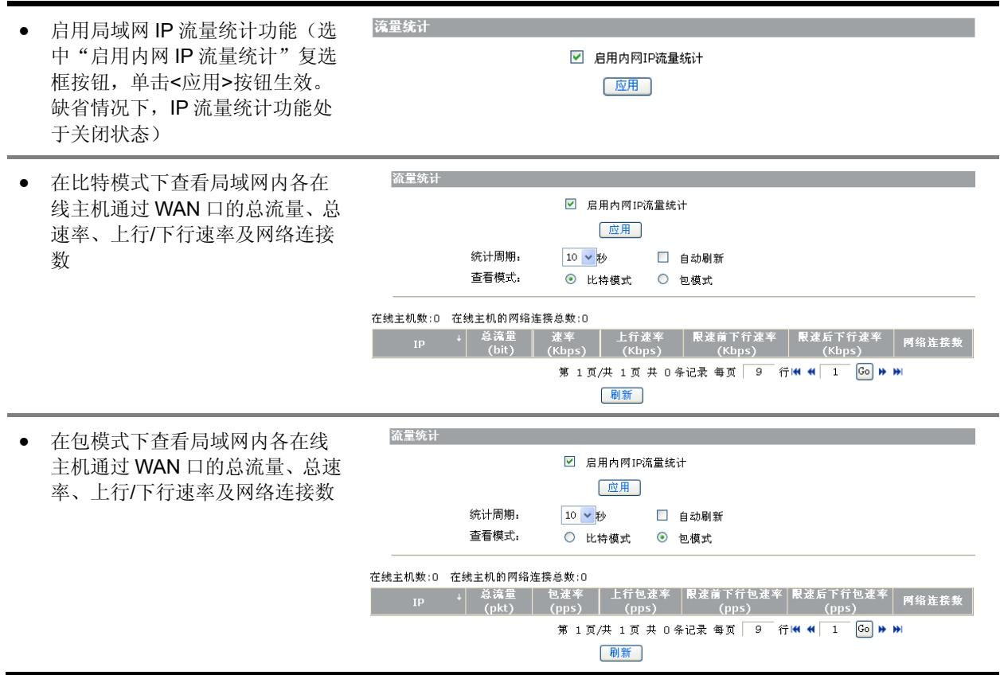

页面中关键项的含义如下表所示。

表11-5 页面关键项描述

<table><tr><td>页面关键项</td><td>描述</td></tr><tr><td>统计周期</td><td>选择页面统计数据刷新的时间间隔,缺省为10秒</td></tr><tr><td>自动刷新</td><td>选中该复选框,页面的统计数据会根据统计周期自动刷新</td></tr><tr><td>查看模式</td><td>选择IP流量统计的显示模式缺省情况下,路由器使用比特模式</td></tr><tr><td>总流量</td><td>显示相应主机通过WAN口的总流量</td></tr><tr><td>速率包速率</td><td>显示相应主机通过WAN口的总速率</td></tr><tr><td>上行速率/限速前下行速率/限速后下行速率上行包速率/限速前下行包速率/限速后下行包速率</td><td>显示相应主机通过WAN口的上行速率和限速前后下行速率说明您可以通过路由器的IP流量限制功能来限制对应主机的上行速率/下行速率</td></tr><tr><td>网络连接数</td><td>显示对应的主机所尝试的网络连接总数说明您可以通过路由器的网络连接限数功能来限制对应主机的网络连接总数</td></tr></table>

# 11.3.3 实时监视WAN口流量

当您开启 WAN 口实时流量监视功能后，系统会对该端口发送速率和接收速率进行实时采样，并通过一个直观的滚动折线图来显示数据变化，供您分析当前网络流量状态是否正常。

# 页面向导：系统监控→流量监控→流量监视

本页面为您提供如下主要功能：

• 选择需要监视的WAN口，并单击<开始监视>按钮，您即可在弹出的页面中实时监视路由器WAN口的发送速率和接收速率状态

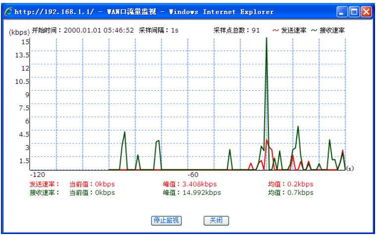

# 11.3.4 安全统计

当您开启了路由器防攻击相应的功能后，路由器的安全统计模块会对攻击报文的个数和可疑的一些报文进行统计。您可以通过查看和分析统计数据的变化，来判断网络环境是否存在欺骗和攻击行为。

# 页面向导：系统监控→流量监控→安全统计

本页面为您提供如下主要功能：

开启路由器的报文统计功能（选中“开启数据包统计功能”复选框，单击<应用>按钮生效）  
对源认证失败的和可疑的报文进行统计（具体报文的描述请参见“表 11-6”）

<table><tr><td colspan="6">数据包统计</td></tr><tr><td colspan="6">开启数据包统计功能 应用</td></tr><tr><td>数据包类型</td><td>总包数</td><td>TCP数据包</td><td>UDP数据包</td><td>ICMP数据包</td><td>其它</td></tr><tr><td>报文源认证失败</td><td>0</td><td>0</td><td>0</td><td>0</td><td>0</td></tr><tr><td>LAN侧可疑</td><td>0</td><td>0</td><td>0</td><td>0</td><td>0</td></tr><tr><td>WAN侧可疑</td><td>0</td><td>0</td><td>0</td><td>0</td><td>0</td></tr></table>

■报文源认证失败的数据包：是指在LAN内网络环境中本设备认为是非法的主机发送的数据包。  
●LAN侧可疑的数据包：是指在LAN内网络中无法确定是否真实存在的主机发送的数据包。  
●WAN侧可疑的数据包：是指INTERNET上主动发往设备WAN口的数据包。

清零

刷新

表11-6 报文类型及描述

<table><tr><td>报文类型</td><td>描述</td></tr><tr><td>报文源认证失败</td><td>源认证失败的判断依赖于路由器的报文源认证设置。对于源认证失败的报文,路由器会直接将其丢弃。如果您在统计数据中发现此类报文的个数不断增加,可能您的网络环境中存在IP欺骗或MAC欺骗攻击行为</td></tr><tr><td>LAN侧可疑</td><td>当来自LAN侧的报文未与路由器表项冲突(比如:ARP表项),但又不能确认该报文是否来源于合法的主机时,则认为是可疑报文。缺省情况下,路由器允许其通过。但如果您在统计数据中发现此类报文的个数不断增加,可能您的组网环境出现了问题或存在攻击行为</td></tr><tr><td>WAN侧可疑</td><td>由因特网侧主动向路由器发送的报文,比如:因特网侧主机主动尝试与路由器建立Telnet连接,则认为是可疑报文。如果在特定时间段内,您在统计数据中发现此类报文的个数不断增加,并造成网络稳定性下降,则可能遭受到了来自因特网侧的攻击,建议您更改WAN口的IP地址,或者联系运营商进行处理</td></tr></table>

# 11.4 网络维护

# 11.4.1 网络诊断

路由器为您提供两种网络诊断工具：

ping 测试：检测路由器与目标主机或另一台设备是否连通。  
路由跟踪测试：检查从路由器到达目标主机所经过的路由情况。

# 页面向导：系统监控→网络维护→网络诊断

本页面为您提供如下主要功能：

选择 ping 测试进行网络诊断（输入“目的地址”，单击<开始>按钮执行诊断）

# ping通信测试

目的地址：

192.168.0.100

开始

停止

# 路由跟踪测试

目的地址：

开始

停止

# 测试结果：

PING 192.168.0.100 (192.168.0.100): 56 data bytes

56 bytes from 192.168.0.100: icmp\_seq=0 ttl=128 time=1.1 ms

56 bytes from 192.168.0.100: icmp\_seq=1 ttl=128 time=0.5 ms

56 bytes from 192.168.0.100: icmp\_seq=2 ttl=128 time=0.5 ms

56 bytes from 192.168.0.100: icmp\_seq=3 ttl=128 time=0.5 ms

--- 192.168.0.100 ping statistics ---

4 packets transmitted, 4 packets received, 0% packet loss

round-trip min/avg/max = 0.5/0.6/1.1 ms

\### Ping completed ###

• 选择路由跟踪测试进行网络诊断（输入“目的地址”，单击<开始>按钮执行诊断）

# ping通信测试

目的地址：

开始

停止

# 路由跟踪测试

目的地址：

192.168.0.100

开始

停止

# 测试结果：

01: 2.85ms 0.52ms 0.43ms 192.168.0.100 ### Trace completed ###


# 说明

• ping 测试结果

当路由器可以接收到从目标主机侧返回的应答时，表示路由器与目标主机连通（如上图所示）；否则表示两者之间不连通，可能网络存在问题。

• 路由跟踪测试结果

如上图所示，只存在一跳，表示路由器和目标主机之间属于直连路由。

# 11.4.2 系统自检

# 页面向导：系统监控→网络维护→系统自检

路由器为您提供简便的系统自检功能，您可以随时单击页面中的<开始>按钮，在弹出的页面中将会分类显示检测结果及一些注意事项。通过该检测信息，您可以判断路由器当前的设置是否合理、运行是否正常等。

# 11.4.3 导出故障定位信息

# 页面向导：系统监控→网络维护→一键导出

当路由器运行出现异常时，您可以单击页面中的<导出>按钮，确认后，路由器可以自动把当前的运行状态、故障定位所需的各种信息压缩成一个定位信息文件下载到本地。H3C技术支持人员可以根据该文件快速、准确地定位问题，从而可以更好地为您解决路由器的使用问题。

# 12 典型组网配置举例

# 12.1 企业典型组网配置举例

# 12.1.1 组网需求

某企业使用电信线路接入，对应的带宽为 30M，带机量为 100 台；  
防止局域网内的 ARP攻击；  
• 防止局域网内某些主机使用 P2P软件（比如：BT、迅雷等）过度占用网络资源；  
禁止局域网内某些主机（比如：192.168.1.2～192.168.1.10）在某个时间段（比如：每天的08：00～18：00）访问外网；  
禁止局域网内除某些主机（比如：192.168.1.50～192.168.1.55）外，其他主机在某个时间段（比如：每天的 08：30～18：00）访问某些网站（比如：www.xxx.com等）；  
禁止局域网内某些主机（比如：192.168.1.15-192.168.1.20）使用 QQ 和 MSN 上线。

# 12.1.2 组网配置方案

下面以具体的组网配置方案为例进行说明：

网关使用 H3C ER2100、汇聚交换机采用 H3C S5024P、接入交换机采用 H3C S1224R；  
设置 WAN口通过静态方式连接到因特网；  
使用 DHCP 服务器功能给局域网内各主机动态分配 IP 地址；  
开启 ARP 绑定功能来防止 ARP 表项受到攻击；  
• 设置 IP流量限制和网络连接数限制，防止 P2P软件过度占用网络资源；  
• 设置防火墙的出站通信策略功能来禁止特定主机在某个时间段访问外网；  
设置网站过滤功能来禁止局域网内某些主机访问指定网站；  
设置业务控制功能来禁止某些主机使用 QQ 和 MSN 上线。

# 12.1.3 组网图

图12-1 典型应用组网图  
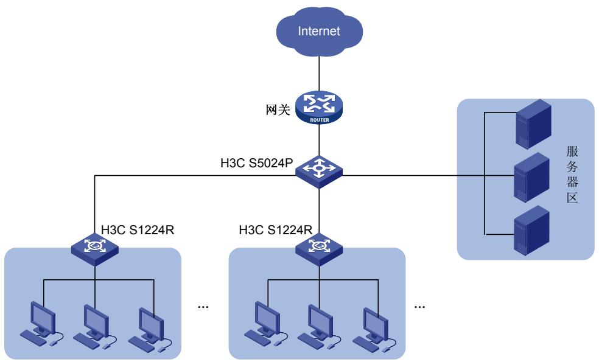  
用户区

# 12.1.4 设置步骤


# 说明

此典型配置举例仅体现 H3C ER2100上的设置，且所涉及的设置均在 H3C ER2100缺省配置的基础上进行。如果您之前已经对 H3C ER2100上做过相应的设置，为了保证效果，请确保当前设置和以下设置不冲突。

(1) 在管理计算机的 Web 浏览器地址栏中输入 http://192.168.1.1，回车。输入缺省的用户名、密码（缺省均为admin，区分大小写）以及验证码，单击<确定>按钮后便可进入Web设置页面


(2) 选择“接口设置→WAN 设置→连接到因特网”，在“WAN网口”下拉框中选择“静态地址（手工配置地址）”选项。用电信提供的参数填写WAN口的上网参数，单击<应用>按钮生效

设置WAN口参数  
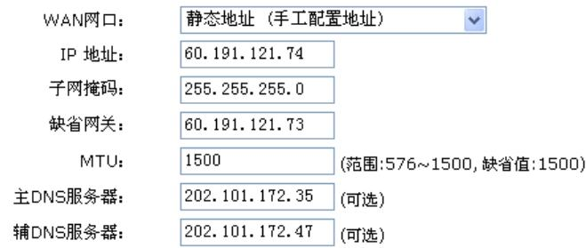


(3) 选择“安全专区→ARP 安全→ARP检测”，设置IP地址搜索范围，单击<扫描>按钮开始搜索。待搜索完毕后，请确认搜索是否有遗漏（比如：查看搜索到的条目数是否与客户端的开机数一致）。如果没有遗漏，单击<全选>按钮选中所有的表项，再单击<绑定>按钮，将所有客户端主机的IP/MAC进行绑定即可；如果存在遗漏，您还可以选择“安全专区→ARP安全→ARP绑定”，手工添加ARP绑定项

ARP检测

ARP检测可以帮您搜索到当前网段内所有在线的主机，同时系统还会检查是否与已存在的ARP表项有冲突。蓝色条目指表项未绑定；红色条目指表项异常，如：检测到不止一台设备回应了报文或者与静态绑定的有冲突。


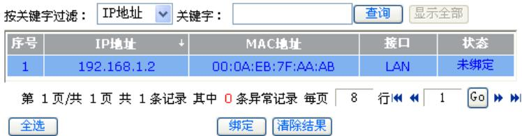

(4) 选择“安全专区→ARP 安全→ARP防护”，选中“检测ARP攻击时，发送免费ARP报文”复选框，单击<应用>按钮生效

免费ARP

设备发送免费ARP可以防止LAN或WAN侧的主机受到ARP攻击。免费ARP发送间隔越小，主机防ARP攻击能力越强，但对网络整体性能影响越大。


(5) 选择“QoS设置→流量管理→IP流量限制”。选中“启用 IP 流量限制”复选框和“允许每IP通道借用空闲的带宽”单选框，填写WAN口对应的带宽，单击<应用>按钮生效

IP流量限制  


(6) 单击<新增>按钮，在弹出的对话框中设置IP流量限制规则：建议上行和下行流量的上限值均设置为300Kbps。同时，您也可以根据实际的网络情况对其进行适当地调整

IP流量限速--网页对话框  
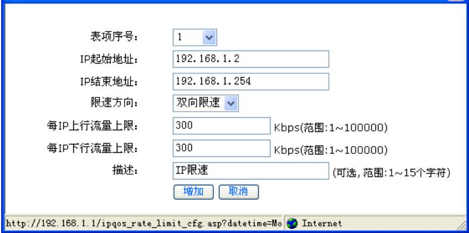

(7) 选择“QoS设置→连接限制→网络连接限数”，选中“启用网络连接限数”复选框，单击<应用>按钮生效  
(8) 单击<新增>按钮，在弹出的对话框中设置对每台客户端主机进行网络连接数限制（建议网络连接数设置在300～500之间），单击<增加>按钮完成操作

网络连接限数  
□ 启用网络连接限数  
应用  
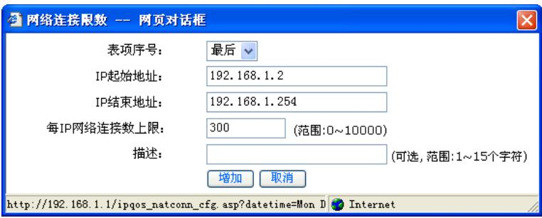

(9) 选择“安全专区→防火墙→出站通信策略”，单击<新增>按钮，在弹出的对话框中设置相应的策略，如右图所示。单击<增加>按钮完成操作

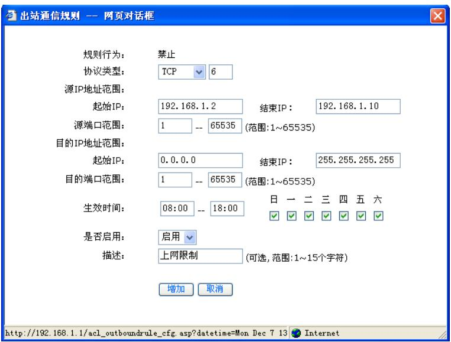

(10) 选择“安全专区→接入控制→网站过滤”，选中“启用网站过滤功能”复选框，再选中“仅禁止访问列表中的网站地址”单选框，设置生效时间，单击<应用>按钮生效


(11) 单击<新增>按钮，在弹出的对话框中，选择过滤方式为“精确匹配”，并输入需要过滤的网站地址，单击<增加>按钮完成操作

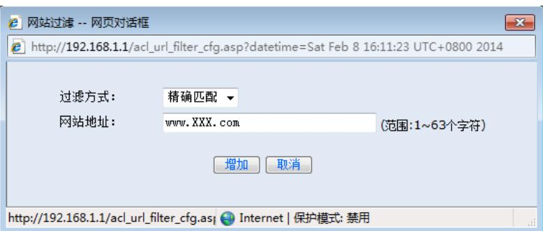

(12) 在网站过滤特性IP中选择<新增>按钮，在弹出的对话框中，输入特权IP起始地址和结束地址，单击<增加>按钮完成操作

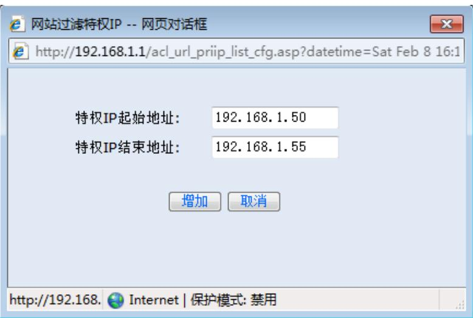

(13) 选择“高级设置→业务控制→IM软件”，单击<新增>按钮，在弹出的对话框中设置特权IP使其拥有QQ/MSN上线权限，单击<增加>按钮完成操作

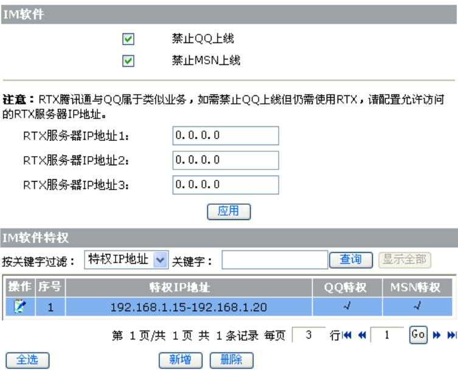

完成以上所有设置后，您可以通过选择“系统监控→运行信息→基本信息”查看网络状态是否正常，同时可以选择“系统监控→运行信息→运行状态”来查看您所设置的各功能项是否已正常开启。

# 13 附录 - 命令行设置

您可以在局域网内通过 Console口或 Telnet本地登录路由器进行命令行设置。

通过Console口本地登录：需要您先搭建配置环境，相关操作请参见“13.1 通过Console口搭建配置环境”。  
• 通过Telnet本地登录：请先确保管理计算机与路由器之间网络连通。然后在管理计算机上单击屏幕左下角<开始>按钮进入“开始”菜单。选择[运行]，在弹出的“运行”对话框中输入“telnetxxx.xxx.xxx.xxx”（xxx.xxx.xxx.xxx为路由器LAN口的IP地址）。回车后按界面提示输入用户名和密码（缺省情况下，两者均为admin）即可登录路由器进行设置，具体命令行介绍请参见“13.2 命令行在线帮助”。

路由器为您提供以下简单的命令行维护：

表13-1 命令行索引

<table><tr><td>命令行</td><td>请参见</td></tr><tr><td>password(仅限于通过Console口进行配置)</td><td>13.3.1</td></tr><tr><td>ip address</td><td>13.3.2</td></tr><tr><td>restore default</td><td>13.3.3</td></tr><tr><td>reboot</td><td>13.3.4</td></tr><tr><td>display sysinfo</td><td>13.3.5</td></tr><tr><td>display device manuinfo</td><td>13.3.6</td></tr><tr><td>ping</td><td>13.3.9</td></tr></table>


# 说明

本手册以通过 Console 口登录路由器进行命令行管理为例。

# 13.1 通过Console口搭建配置环境

# 1. 连接管理计算机到路由器

将管理计算机的串口通过配置线缆与路由器的 Console 口相连。

# 2. 配置管理计算机参数

操作步骤如下（以 Windows XP系统为例）：

(1) 打开管理计算机，在管理计算机Windows界面上单击[开始/所有程序/附件/通讯]，运行终端仿真程序。在“名称”文本框中键入新建连接的名称，比如：aaa，单击<确定>按钮


(2) 在“连接时使用”下拉框中选择进行连接的串口（请确保选择的串口应与配置线缆实际连接的串口相一致），单击<确定>按钮

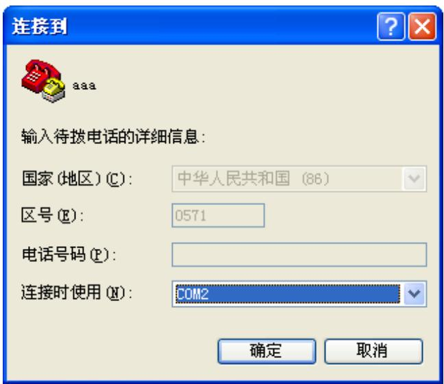

(3) 在串口的属性对话框中设置相关参数，如右图所示，单击<确定>按钮

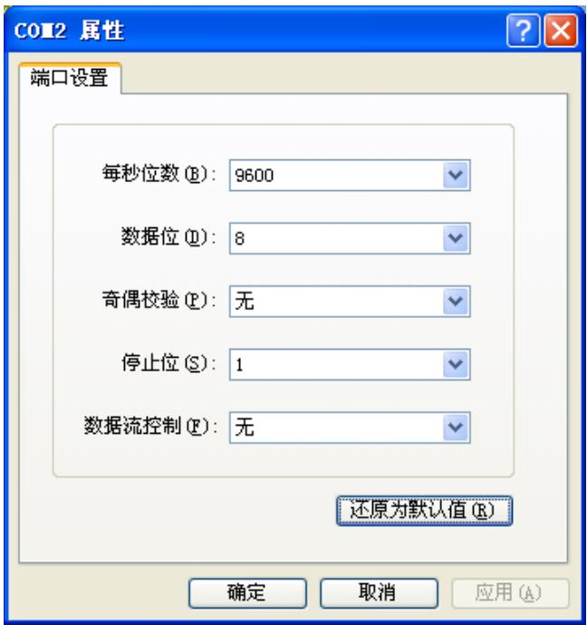

(4) 选择[文件/属性/设置]，进入如右图所示的属性设置窗口。选择终端仿真类型为自动检测，单击<确定>按钮

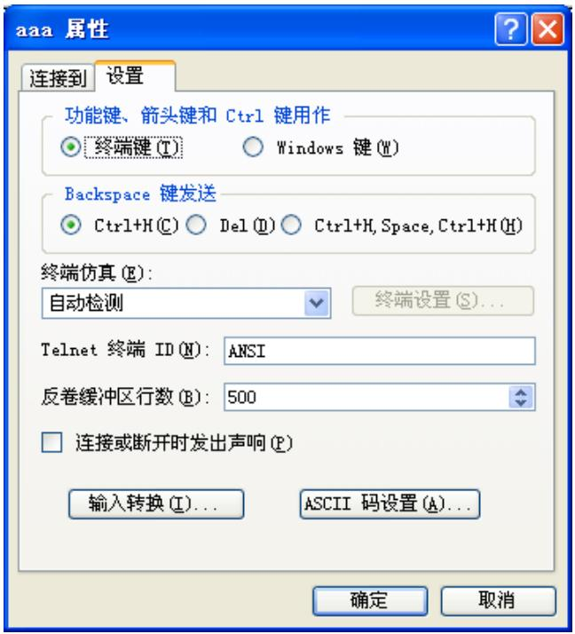

(5) 回车后，即可登录路由器，且终端上显示命令行提示符<H3C>


# 13.2 命令行在线帮助

(1) 在任一视图下，键入<?>获取该视图下所有的命令及其简单描述。

```txt
<H3C>?  
reboot Reboot device  
restore Restore configuration  
password Set administrator's password  
ip Display the IP configuration  
display Display current information  
ping Ping function  
admin Admin the LAN interface 
```

(2) 键入一命令，后接以空格分隔的“?”，如果该命令行位置有关键字，则列出全部关键字及其简单描述。

```txt
<H3C>ip ?
address Display IP addresses 
```

(3) 键入一字符串，其后紧接<?>，列出以该字符串开头的所有命令。

```txt
<H3C>di?
display 
```

(4) 键入命令的某个关键字的前几个字母，按下<Tab>键，如果以输入字母开头的关键字唯一，则可以显示出完整的关键字。

```txt
<H3C> di ←按下<Tab>键
<H3C> display 
```

# 13.3 命令行操作

# 13.3.1 修改路由器登录密码

输入 password命令并回车，按照系统提示，输入新密码，并重新输入一次以确认即可。


# 说明

• 缺省情况下，路由器登录密码为 admin。  
• 密码长度为 1～31个字符，区分大小写。

# 13.3.2 查看路由器LAN口的IP地址

输入 ip address 命令并回车，即可显示路由器 LAN 口的 IP 地址信息。

# 13.3.3 恢复路由器到出厂设置

输入 restore default 命令并回车，确认后，路由器将恢复到出厂设置并重新启动。


# 说明

恢复出厂设置后，路由器的用户名、密码以及IP地址等所有设置都会被恢复到缺省设置。路由器的缺省信息可参见“15 附录 - 缺省设置”

# 13.3.4 重新启动路由器

输入 reboot 命令并回车，确认后，路由器将重新启动。

# 13.3.5 显示路由器系统资源使用情况

输入 display sysinfo 命令并回车，显示路由器的 CPU 和内存使用情况。

# 13.3.6 显示路由器硬件信息

输入 display device manuinfo命令并回车，显示路由器基本的硬件信息，比如：设备型号、设备序列号、设备 MAC地址等。

# 13.3.7 显示局域网内允许访问路由器的用户IP地址信息

输入 admin acl info 命令并回车。

# 13.3.8 恢复局域网内允许所有用户访问路由器

输入 admin acl default 命令并回车。

# 13.3.9 网络连通性测试

输入 ping [ -a source-ip | -c count | -i interface-name | -s packet-size ] \* host

表13-2 Ping 命令参数项描述

<table><tr><td>参数</td><td>描述</td></tr><tr><td>-a source-ip</td><td>指定ICMP回显请求(ECHO-REQUEST)报文的源IP地址。该地址必须是路由器接口的IP地址</td></tr><tr><td>-c count</td><td>指定ICMP回显请求报文的发送次数,取值范围为1~4294967295,缺省值为4</td></tr><tr><td>-i interface-name</td><td>指定发送ICMP回显请求报文的路由器接口名称。不指定该参数时,将根据目的IP查找路由表或者转发表来确定发送ICMP回显请求报文的接口</td></tr><tr><td>-s packet-size</td><td>指定发送的ICMP回显请求报文的长度(不包括IP和ICMP报文头),取值范围为20~8100,单位为字节,缺省值为56字节</td></tr><tr><td>host</td><td>目的端的IP地址或主机名,主机名为1~31个字符的字符串</td></tr></table>

# 14 附录 - 故障排除

本手册仅介绍简单的路由器故障处理方法，如仍不能排除，可通过 表14-2获取售后服务。

表14-1 故障排除

<table><tr><td>常见问题</td><td>故障排除</td></tr><tr><td>Power灯不亮</td><td>(1) 请检查电源线是否连接正确(2) 请检查电源线插头是否插紧,无松动现象</td></tr><tr><td>端口指示灯不亮</td><td>(1) 请检查网线与路由器的以太网端口是否卡紧,无松动现象(2) 将网线的两端分别插到路由器的两个以太网端口上,如果该两个端口对应的指示灯都亮,表示网线正常;否则该网线可能存在问题,请更换网线重新尝试</td></tr><tr><td>不能通过Web设置页面本地登录路由器</td><td>(1) 使用MS-DOS方式的Ping命令检查网络连接• Ping 127.0.0.1用来检查管理计算机的TCP/IP协议是否安装• Ping路由器LAN口的IP地址来检查管理计算机与路由器是否连通(2) 通过ip address命令来查看当前路由器LAN口的地址,核对您输入的IP地址是否正确(3) 如果管理计算机使用静态IP地址,请确认其IP地址是否与路由器LAN口的IP地址处于同一网段(4) 路由器允许管理的用户数已经达到最大值(最多支持5个用户同时登录),请稍后再试(5) 请检查Web浏览器是否设置代理服务器或拨号连接,若有,请取消设置</td></tr><tr><td>局域网内用户出现掉线,无法访问因特网</td><td>(1) 检查与路由器级连的交换机的网线和路由器WAN口的网线是否存在松动现象(2) 检查路由器是否已经对局域网内所有主机进行了ARP绑定(3) 登录路由器的Web设置页面,选择“安全专区→防火墙→出站通信策略”,查看是否配置了某IP地址段在某段时间内无法访问因特网</td></tr></table>

表14-2 获取售后服务

<table><tr><td>故障类型</td><td>描述</td><td>如何获取售后服务</td></tr><tr><td>硬件类故障</td><td>比如:出现设备不能正常通电、未插网线但以太网端口指示灯却常亮等问题</td><td>请联系当地授权服务中心予以确认后更换(各地区的H3C授权服务中心的联系方式可在H3C官方网站找到)</td></tr><tr><td>软件类问题</td><td>比如:出现设备功能不可用、异常等问题或配置咨询</td><td>请联系H3C技术支持服务热线:400-810-0504获取帮助</td></tr></table>

# 15 附录 - 缺省设置

表 15-1列出了路由器的一些重要的缺省设置信息，供您参考。

表15-1 路由器缺省设置

<table><tr><td colspan="2">选项</td><td>缺省设置</td></tr><tr><td rowspan="4">接口设置</td><td>LAN口IP地址</td><td>IP地址:192.168.1.1子网掩码:255.255.255.0</td></tr><tr><td>LAN口基本属性</td><td>端口模式:Auto广播风暴抑制:不抑制流控:关闭</td></tr><tr><td>连接因特网方式</td><td>DHCP自动获取方式</td></tr><tr><td>端口镜像</td><td>无</td></tr><tr><td rowspan="6">安全专区</td><td>ARP防护</td><td>采用路由器检测到ARP攻击时,LAN口或WAN口会主动发送免费ARP</td></tr><tr><td>网站过滤</td><td>关闭</td></tr><tr><td>防火墙</td><td>出站通信缺省策略:允许入站通信缺省策略:禁止</td></tr><tr><td>IDS防范</td><td>开启各攻击类型防护</td></tr><tr><td>报文源认证</td><td>开启基于静态路由、静态ARP表、动态ARP表的报文源认证</td></tr><tr><td>异常流量防护</td><td>开启,且防护等级为高</td></tr><tr><td rowspan="2">QoS管理</td><td>IP流量限制</td><td>关闭</td></tr><tr><td>网络连接限数</td><td>关闭</td></tr><tr><td rowspan="3">高级设置</td><td>ALG应用</td><td>开启</td></tr><tr><td>DDNS</td><td>关闭</td></tr><tr><td>UPnP</td><td>关闭</td></tr><tr><td rowspan="4">设备管理</td><td>系统时间</td><td>通过缺省的NTP服务器获取</td></tr><tr><td>远程管理</td><td>远程Web管理:关闭远程Telnet管理:关闭</td></tr><tr><td>用户管理</td><td>用户:admin密码:admin</td></tr><tr><td>超时时间</td><td>5分钟</td></tr></table>

# 16 附录 - 术语表

表16-1 术语表

<table><tr><td>术语缩写</td><td>英文全称</td><td>中文名称</td><td>含义</td></tr><tr><td>100Base-TX</td><td>100Base-TX</td><td>100Base-TX</td><td>100Mbit/s基带以太网规范,使用两对5类双绞线连接,可提供最大100Mbit/s的传输速率</td></tr><tr><td>10Base-T</td><td>10Base-T</td><td>10Base-T</td><td>10Mbit/s基带以太网规范,使用两对双绞线(3/4/5类双绞线)连接,其中一对用于发送数据,另一对用于接收数据,提供最大10Mbit/s传输速率</td></tr><tr><td>DDNS</td><td>Dynamic Domain Name Service</td><td>动态域名服务</td><td>动态域名服务(Dynamic Domain Name Service),能实现固定域名到动态IP地址之间的解析</td></tr><tr><td>DHCP</td><td>Dynamic Host Configuration Protocol</td><td>动态主机配置协议</td><td>动态主机配置协议(Dynamic Host Configuration Protocol)为网络中的主机动态分配IP地址、子网掩码、网关等信息</td></tr><tr><td>DHCP Server</td><td>Dynamic Host Configuration Protocol Server</td><td>DHCP服务器</td><td>动态主机配置协议服务器(Dynamic Host Configuration Protocol Server)是一台运行了DHCP动态主机配置协议的设备,主要用于给DHCP客户端分配IP地址</td></tr><tr><td>DNS</td><td>Domain Name Service</td><td>域名服务</td><td>域名服务(Domain Name Service)将域名解析成IP地址。DNS信息按等级分布在整个因特网上的DNS服务器间,当我们访问一个网址时,DNS服务器查看发出请求的域名并搜寻它所对应的IP地址。如果该DNS服务器无法找到这个IP地址,就将请求传送给上级DNS服务器,继续搜寻IP地址。例如,www.yahoo.com这个域名所对应的IP地址为216.115.108.243</td></tr><tr><td>DoS</td><td>Denial of Service</td><td>拒绝服务</td><td>拒绝服务(Denial of Service)是一种利用合法的方式请求占用过多的服务资源,从而使其他用户无法得到服务响应的网络攻击行为</td></tr><tr><td>DSL</td><td>Digital Subscriber Line</td><td>数字用户线路</td><td>数字用户线(Digital Subscriber Line)这种技术使得数字数据和仿真语音信号都可以在现有的电话线路上进行传输。目前比较受家庭用户青睐的是ADSL接入方式</td></tr><tr><td>Firewall</td><td>Firewall</td><td>防火墙</td><td>防火墙(Firewall)技术保护您的计算机或局域网免受来自外网的恶意攻击或访问</td></tr><tr><td>FTP</td><td>File Transfer Protocol</td><td>文件传输协议</td><td>文件传输协议(File Transfer Protocol)是一种描述网络上的计算机之间如何传输文件的协议</td></tr><tr><td>HTTP</td><td>Hypertext Transfer Protocol</td><td>超文本传送协议</td><td>超文本传送协议(Hypertext Transfer Protocol)是一种主要用于传输网页的标准协议</td></tr><tr><td>Hub</td><td>Hub</td><td>集线器</td><td>共享式网络连接设备,工作在物理层,主要用于扩展局域网规模</td></tr><tr><td>ISP</td><td>Internet Service Provider</td><td>因特网服务提供商</td><td>因特网服务提供商(Internet Service Provider),提供因特网接入服务的提供商</td></tr><tr><td>LAN</td><td>Local Area Network</td><td>局域网</td><td>局域网(Local Area Network)一般指内部网,例如家庭网络,中小型企业的内部网络等</td></tr><tr><td>MAC address</td><td>Media Access Control address</td><td>介质访问控制地址</td><td>介质访问控制地址(Media Access Control address),MAC地址是由厂商指定给设备的永久物理地址,它由6对十六进制数字所构成。例如:00-0F-E2-80-65-25。每一个网络设备都拥有一个全球唯一的MAC地址</td></tr><tr><td>NAT</td><td>Network Address Translation</td><td>网络地址转换</td><td>网络地址转换(Network Address Translation),可以把局域网内的多台计算机通过NAT转换后共享一个或多个公网IP地址,接入Internet,这种方式同时也可以屏蔽局域网用户,起到网络安全的作用。通常共享上网的宽带路由器都使用这个技术</td></tr><tr><td>NMS</td><td>Network Management Station</td><td>网络管理站</td><td>NMS运行SNMP客户端程序的工作站,能够提供非常友好的人机交互界面,方便网络管理员完成绝大多数的网络管理工作</td></tr><tr><td>Ping</td><td>Packet Internet Grope</td><td>因特网包探测器</td><td>Ping命令是用来测试本机与网络上的其它计算机能否进行通信的诊断工具。Ping命令将报文发送给指定的计算机,如果该计算机收到报文则会返回响应报文</td></tr><tr><td>PPP</td><td>Point-to-Point Protocol</td><td>点对点协议</td><td>点对点协议(Point-to-Point Protocol)是一种链路层通信协议</td></tr><tr><td>PPPoE</td><td>PPP over Ethernet</td><td>点对点以太网承载协议</td><td>点对点以太网承载协议(PPP over Ethernet)在以太网上承载PPP协议封装的报文,它是目前使用较多的业务形式</td></tr><tr><td>QoS</td><td>Quality of Service</td><td>服务质量</td><td>服务质量(Quality of Service)是用来解决网络延迟和阻塞等问题的一种技术。当网络过载或拥塞时,QoS能确保重要业务量不受延迟或丢弃,同时保证网络的高效运行</td></tr><tr><td>RJ-45</td><td>RJ-45</td><td>RJ-45</td><td>用于连接以太网交换机、集线器、路由器等设备的标准插头。直连网线和交叉网线通常使用这种接头</td></tr><tr><td>Route</td><td>Route</td><td>路由</td><td>基于数据的目的地址和当前的网络条件,通过有效的路由选择能够到达目的网络或地址的出接口或网关,进行数据转发。具有路由功能的设备称作路由器(router)</td></tr><tr><td>SNMP</td><td>Simple Network Management Protocol</td><td>简单网络管理协议</td><td>SNMP是网络中管理设备和被管理设备之间的通信规则,它定义了一系列消息、方法和语法,用于实现管理设备对被管理设备的访问和管理</td></tr><tr><td>TCP</td><td>Transfer Control Protocol</td><td>传输控制协议</td><td>传输控制协议(Transfer Control Protocol)是一种面向连接的、可靠的传输层协议。</td></tr><tr><td>TCP/IP</td><td>Transmission Control Protocol/Internet Protocol</td><td>传输控制协议/网际协议</td><td>传输控制协议/网际协议(Transmission Control Protocol/Internet Protocol),网络通信的基本通信协议簇。TCP/IP定义了一组协议,不仅仅是TCP和IP</td></tr><tr><td>Telnet</td><td>Telnet</td><td>Telnet</td><td>一种用来访问远程主机的基于字符的交互程序。Telnet允许用户远程登录并对设备进行管理</td></tr><tr><td>UDP</td><td>User Datagram Protocol</td><td>用户数据报协议</td><td>用户数据报协议(User Datagram Protocol)是一种面向非连接的传输层协议</td></tr><tr><td>UPnP</td><td>Universal Plug and Play</td><td>通用即插即用</td><td>通用即插即用(Universal Plug and Play),支持UPnP的设备彼此可自动连接和协同工作</td></tr><tr><td>WAN</td><td>Wide Area Network</td><td>广域网</td><td>广域网(Wide Area Network)是覆盖地理范围相对较广的数据通信网络,如因特网</td></tr></table>