# H3C MSR 系列开放多业务路由器

Web 配置指导(V7)

新华三技术有限公司

http://www.h3c.com

资料版本：6W102-20231108

产品版本：R6728

Copyright © 2022-2023 新华三技术有限公司及其许可者 版权所有，保留一切权利。

未经本公司书面许可，任何单位和个人不得擅自摘抄、复制本书内容的部分或全部，并不得以任何形式传播。

除新华三技术有限公司的商标外，本手册中出现的其它公司的商标、产品标识及商品名称，由各自权利人拥有。

由于产品版本升级或其他原因，本手册内容有可能变更。H3C保留在没有任何通知或者提示的情况下对本手册的内容进行修改的权利。本手册仅作为使用指导，H3C尽全力在本手册中提供准确的信息，但是 H3C 并不确保手册内容完全没有错误，本手册中的所有陈述、信息和建议也不构成任何明示或暗示的担保。

# 前 言

本配置指导主要介绍如何通过 Web 设置页面对设备进行本地管理。

前言部分包含如下内容：

读者对象  
本书约定  
资料意见反馈

# 读者对象

本手册主要适用于如下工程师：

网络规划人员  
现场技术支持与维护人员  
负责网络配置和维护的网络管理员

# 本书约定

# 1. 命令行格式约定

<table><tr><td>格式</td><td>意义</td></tr><tr><td>粗体</td><td>命令行关键字(命令中保持不变、必须照输的部分)采用加粗字体表示。</td></tr><tr><td>斜体</td><td>命令行参数(命令中必须由实际值进行替代的部分)采用斜体表示。</td></tr><tr><td>[]</td><td>表示用“[]”括起来的部分在命令配置时是可选的。</td></tr><tr><td>{x|y|...}</td><td>表示从多个选项中仅选取一个。</td></tr><tr><td>[x|y|...]</td><td>表示从多个选项中选取一个或者不选。</td></tr><tr><td>{x|y|...}*</td><td>表示从多个选项中至少选取一个。</td></tr><tr><td>[x|y|...]*</td><td>表示从多个选项中选取一个、多个或者不选。</td></tr><tr><td>&amp;&lt;1-n&gt;</td><td>表示符号&amp;前面的参数可以重复输入1~n次。</td></tr><tr><td>#</td><td>由“#”号开始的行表示为注释行。</td></tr></table>

# 2. 图形界面格式约定

<table><tr><td>格式</td><td>意义</td></tr><tr><td>&lt;&gt;</td><td>带尖括号“&lt;&gt;”表示按钮名,如“单击&lt;确定&gt;按钮”。</td></tr><tr><td>[]</td><td>带方括号“[]”表示窗口名、菜单名和数据表,如“弹出[新建用户]窗口”。</td></tr><tr><td>/</td><td>多级菜单用“/”隔开。如[文件/新建/文件夹]多级菜单表示[文件]菜单下的[新建]子菜单下的[文件夹]菜单项。</td></tr></table>

# 3. 各类标志

本书还采用各种醒目标志来表示在操作过程中应该特别注意的地方，这些标志的意义如下：

<table><tr><td> 警告</td><td>该标志后的注释需给予格外关注,不当的操作可能会对人身造成伤害。</td></tr><tr><td> 注意</td><td>提醒操作中应注意的事项,不当的操作可能会导致数据丢失或者设备损坏。</td></tr><tr><td>提示</td><td>为确保设备配置成功或者正常工作而需要特别关注的操作或信息。</td></tr><tr><td>说明</td><td>对操作内容的描述进行必要的补充和说明。</td></tr><tr><td> 窍门</td><td>配置、操作、或使用设备的技巧、小窍门。</td></tr></table>

# 4. 图标约定

本书使用的图标及其含义如下：

<table><tr><td></td><td>该图标及其相关描述文字代表一般网络设备,如路由器、交换机、防火墙等。</td></tr><tr><td></td><td>该图标及其相关描述文字代表一般意义下的路由器,以及其他运行了路由协议的设备。</td></tr><tr><td></td><td>该图标及其相关描述文字代表二、三层以太网交换机,以及运行了二层协议的设备。</td></tr><tr><td></td><td>该图标及其相关描述文字代表无线控制器、无线控制器业务板和有线无线一体化交换机的无线控制引擎设备。</td></tr><tr><td></td><td>该图标及其相关描述文字代表无线接入点设备。</td></tr><tr><td></td><td>该图标及其相关描述文字代表无线终结单元。</td></tr><tr><td></td><td>该图标及其相关描述文字代表无线终结者。</td></tr><tr><td></td><td>该图标及其相关描述文字代表无线Mesh设备。</td></tr><tr><td></td><td>该图标代表发散的无线射频信号。</td></tr><tr><td></td><td>该图标代表点到点的无线射频信号。</td></tr><tr><td></td><td>该图标及其相关描述文字代表防火墙、UTM、多业务安全网关、负载均衡等安全设备。</td></tr><tr><td></td><td>该图标及其相关描述文字代表防火墙插卡、负载均衡插卡、NetStream插卡、SSL VPN插卡、IPS插卡、ACG插卡等安全插卡。</td></tr></table>

# 5. 示例约定

由于设备型号不同、配置不同、版本升级等原因，可能造成本手册中的内容与用户使用的设备显示信息不一致。实际使用中请以设备显示的内容为准。

本手册中出现的端口编号仅作示例，并不代表设备上实际具有此编号的端口，实际使用中请以设备上存在的端口编号为准。

# 资料意见反馈

如果您在使用过程中发现产品资料的任何问题，可以通过以下方式反馈：

E-mail：info@h3c.com

感谢您的反馈，让我们做得更好！

# 更多资料内容

扫描下方二维码，可以获取更多资料内容。

  
新华三官方网站文档中心

  
新华三资料速递微信公众号

  
新华三资料速递B站视频号

# 1 产品介绍

H3C MSR系列开放多业务路由器包括如下：

H3C MSR 810 路由器  
H3C MSR 830 路由器  
H3C MSR 1000 路由器  
H3C MSR 2600 路由器  
H3C MSR 3600 路由器  
H3C MSR 5600 路由器

# 说明

设备机箱外观和安装方法请参见对应款型的安装指导或者硬件描述。

不同系列产品的Web界面可能存在差异，具体以实际界面显示为准。

本手册是在 MSR810 路由器 Release 6728P26 版本上进行配置和验证的。

# 1 登录设备

# 说明

本章节仅介绍如何首次本地登录设备的Web管理页面。  
建议使用 Internet Explorer 10 及以上版本、Chrome 57 及以上版本、Firefox 35 及以上版本的浏览器访问 Web管理页面。

本章节主要包含以下内容：

准备工作  
登录设备Web管理页面

# 1.1 准备工作

完成硬件安装后（安装过程请参见对应款型的安装指导手册），在登录设备的Web设置页面前，您需要确保管理计算机和网络满足一些基本要求。

# 1.1.1 管理计算机要求

请确认管理计算机已安装了以太网卡。

# 1.1.2 建立网络连接

# 1. 设置管理计算机的IP地址

自动获取IP地址（推荐使用）：请将管理计算机设置成“自动获得IP地址”和“自动获得DNS服务器地址”（计算机系统的缺省配置），由设备自动为管理计算机分配IP地址。  
设置静态IP地址：请将管理计算机的IP地址与设备的LAN口IP地址设置在同一网段内（LAN口缺省的 IP 地址为 192.168.0.1，子网掩码为 255.255.254.0）。

操作步骤如下（以Windows 7系统为例）：

1. 单击桌面右下角的网络图标，如， 选择“打开网络和共享中心”

2. 单击“本地连接”，单击<属性>按钮，进入“本地连接属性”窗口

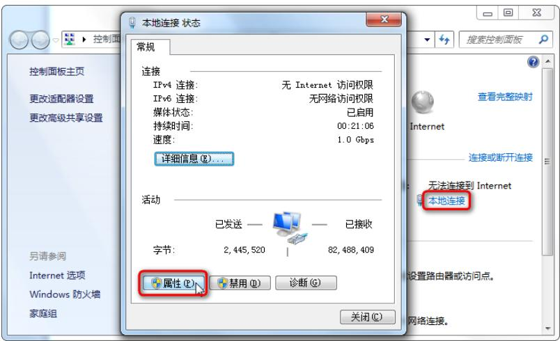

3. 双击“Internet 协议版本 4（TCP/IPv4）”

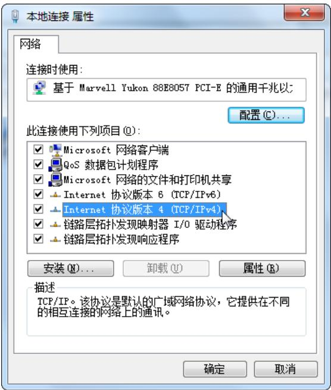

4. 配置电脑的 IP地址

• 可选择自动获取IP地址和DNS服务器地址，或通过手动配置电脑 IP地址，与设备缺省 IP地址保持同一网段  
设置好 IP地址后，单击<确定>按钮，返回[本地连接属性]对话框，再单击<确定>按钮

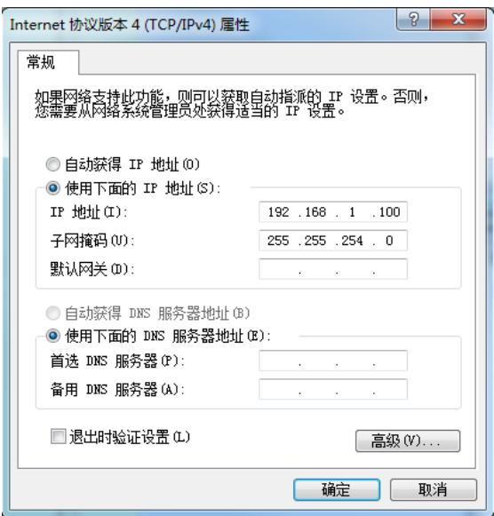

# 2. 确认管理计算机和路由器之间的网络是否连通

# 操作步骤如下：

5. 单击屏幕左下角<开始>按钮进入[开始]菜单，选择“运行”，弹出“运行”对话框  
6. 输入“ping 192.168.0.1（设备的 IP 地址，此处是缺省 IP地址）”，单击<确定>按钮

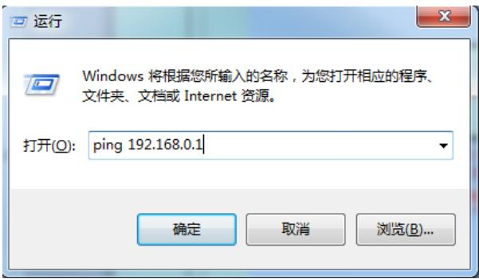

7. 如果在弹出的对话框中显示了从设备侧返回的回应，则表示网络连通；否则请检查网络连接

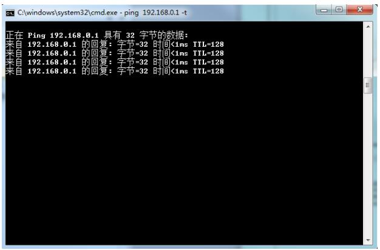

# 1.1.3 取消代理服务器

如果当前管理计算机使用代理服务器访问因特网，则必须取消代理服务，操作步骤如下：

8. 在 Internet Explorer 浏览器窗口中，选择[工具/Internet 选项]进入“Internet 选项”窗口

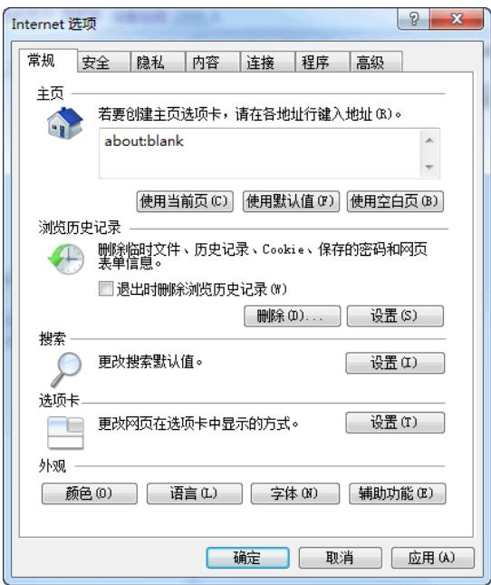

9. 选择“连接”页签，并单击<局域网设置（L）>按钮，进入“局域网（LAN）设置”页面。请确认未选中“为 LAN使用代理服务器”选项；若已选中，请取消并单击<确定>按钮

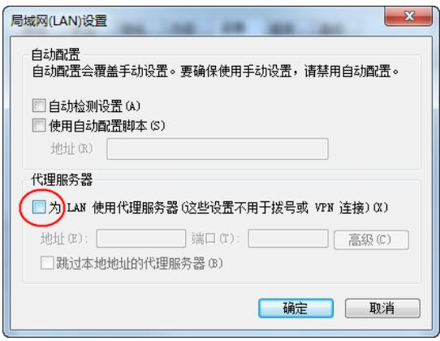

# 1.2 登录设备Web管理页面

运行Web浏览器，在地址栏中输入“http://192.168.0.1”，回车后跳转到Web登录页面，如图 1-1所示。输入用户名、密码（缺省均为 admin，区分大小写），单击<登录>按钮或直接回车即可进入Web设置页面。

图1-1 登录设备Web管理页面  

# 说明

为了安全起见，首次登录后系统会提示您修改缺省的登录密码，请您修改并保管好密码信息。

# 1 系统信息

# 1.1 简介

系统信息将展示设备的运行情况，基本功能的配置向导和技术支持信息。

# 1.2 查看系统信息

# 1.2.1 CPU 使用率和内存使用率

# 1. 配置需求

显示设备CPU使用率和内存使用率相关信息，包括：

CPU的当前使用率、平均使用率。  
内存的当前使用率、平均使用率。

# 2. 配置步骤

(1) 单击导航树中[系统信息]菜单项，进入系统信息显示页面。  
(2) 单击页面上方的“CPU 使用率”区段或“内存使用率”区段，可查看 CPU 或内存的当前使用率、平均使用率。

图1-1 CPU使用率和内存使用率  
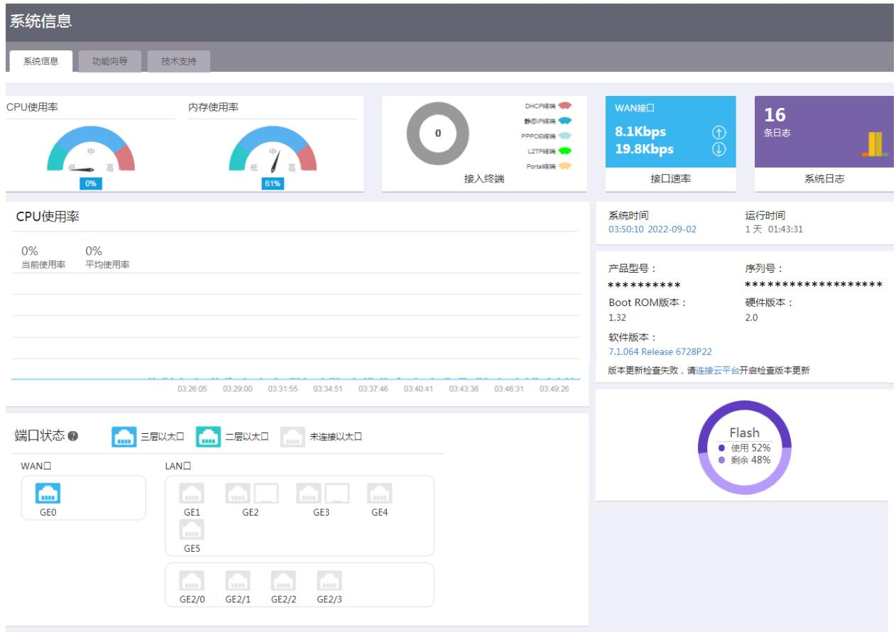

# 1.2.2 接入终端

# 1. 配置需求

显示设备接入终端相关信息，包括：

实时流量排行TOP5。  
在线主机数。  
在线主机信息表，表中包含终端IP地址、终端名、用户名、接入方式、接口、终端MAC地址等信息。

# 2. 配置步骤

(1) 单击导航树中[系统信息]菜单项，进入系统信息显示页面。  
(2) 单击页面上方的“接入终端”区段，可查看实时流量排行 TOP5 信息。  
(3) 点击“点击查看更多”链接，可查看用户流量排行页面。

图1-2 用户流量排行  
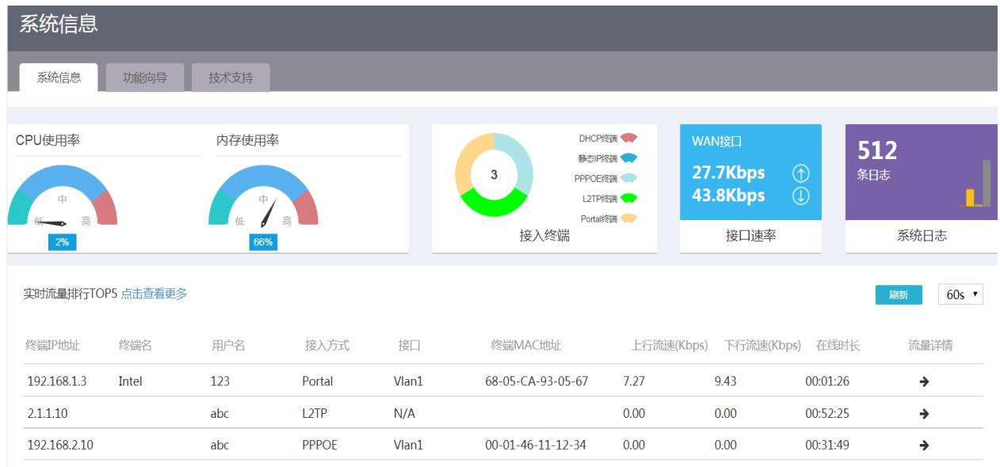

# 1.2.3 接口速率

# 1. 配置需求

显示设备的接口速率相关信息，例如：上行流量、当前上行速度、下行流量、当前下行速度，上网WAN接口的状态和上网参数等。还可以对接口进行重连接或者断开操作，刷新接口的显示信息。

# 2. 配置步骤

(1) 单击导航树中[系统信息]菜单项，进入系统信息显示页面。  
(2) 单击页面上方的“接口速率”区段，可查看接口流量的相关信息。   
(3) 点击<重连接>按钮，可重新连接接口。  
(4) 点击<断开>按钮，可断开接口连接。

# 1.2.4 系统日志

# 1. 配置需求

显示设备系统日志相关信息，包括：

设备记录的日志信息。  
日志统计信息。

# 2. 配置步骤

单击导航树中[系统信息/]菜单项，进入系统日志显示页面。

(1) 单击导航树中[系统信息]菜单项，进入系统信息显示页面。  
(2) 单击页面上方的“系统日志”区段，可查看系统日志的相关信息。

图1-3 系统日志  
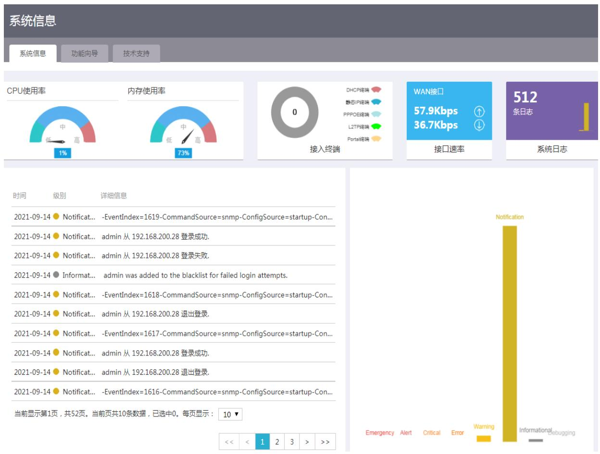

# 1.2.5 系统信息

# 1. 配置需求

显示设备系统时间和产品型号等信息。

# 2. 配置步骤

(1) 单击导航树中[系统信息]菜单项，进入系统信息显示页面。  
(2) 在“系统时间”区段中，可查看系统时间和运行时间；在“产品型号”区段中，可参看产品型号、序列号、Boot ROM版本、硬件版本和软件版本等信息。

# 1.2.6 端口状态

# 1. 配置需求

显示WAN口和LAN口的使用状态。

# 2. 配置步骤

(1) 单击导航树中[系统信息]菜单项，进入系统信息显示页面。  
(2) 在“端口状态”区段中，点击端口图标，可进入WAN或LAN配置页面。

图1-4 LAN 配置  
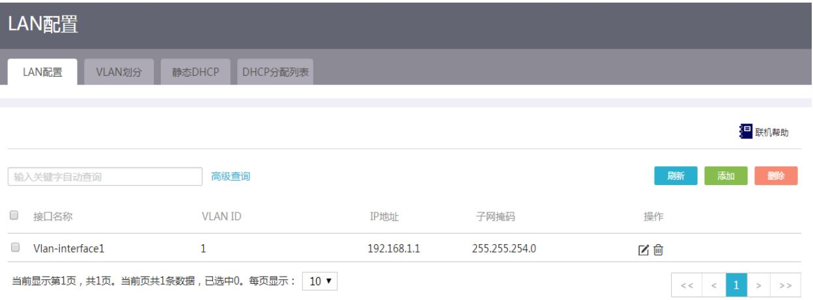

# 1.2.7 存储介质

# 1. 配置需求

存储介质上存储空间的使用情况。

# 2. 配置步骤

(1) 单击导航树中[系统信息]菜单项，进入系统信息显示页面。  
(2) 在页面右下方区段，可查看存储介质上存储空间的使用率。

# 1.3 使用功能向导

通过功能向导帮助用户快速的配置网络。

(1) 单击导航树中[系统信息]菜单项，进入系统信息页面。  
(2) 单击“功能向导”页签，进入功能向导页面。  
(3) 根据需要点击功能对应的链接，配置向导如下：  
上网配置  
 连接到因特网：单击“连接到因特网”链接，页面自动跳转至外网配置页面。  
 局域网(LAN)设置：单击“局域网(LAN)设置”链接，页面自动跳转至LAN配置页面。  
 NAT配置：单击“NAT配置”链接，页面自动跳转至NAT配置页面。

上网行为

 全局控制：单击“全局控制”链接，页面自动跳转至上网行为管理的全局控制页面。  
 带宽限速：单击“带宽限速”链接，页面自动跳转至带宽管理的带宽限速页面。  
 上网行为管理策略：单击“上网行为管理策略”链接，页面自动跳转至上网行为管理的上网行为管理策略页面。  
 连接限制：单击“连接限制”链接，页面自动跳转至连接限制的网络连接限制数页面。  
 网址黑白名单：单击“网址黑白名单”链接，页面自动跳转至上网行为管理的网址黑白名单页面。  
 流量排行：单击“流量排行”链接，页面自动跳转至流量排行的全局控制页面。

# 接入安全

 用户管理：单击“用户管理”链接，页面自动跳转至用户管理的用户设置页面。  
 IPsec 策略：单击“IPsec 策略”链接，页面自动跳转至 IPsec VPN 的 IPsec 策略页面。   
 本地（微信/Portal）认证：单击“本地（微信/portal）认证”链接，页面自动跳转至Portal认证的认证设置页面。  
 MAC地址过滤：单击“MAC地址过滤”链接，页面自动跳转至MAC地址过滤的MAC地址设置页面。  
 防火墙：单击“防火墙”链接，页面自动跳转至防火墙页面。  
 ARP攻击防御：单击“ARP攻击防御”链接，页面自动跳转至ARP攻击防御的动态ARP表项学习页面。

# 设备维护

 配置管理：单击“配置管理”链接，页面自动跳转至配置管理的查看当前配置页面。  
 重新启动：单击“重新启动”链接，页面自动跳转至重新启动的立即重启页面。  
 系统升级：单击“系统升级”链接，页面自动跳转至系统升级的版本升级页面。  
 远程管理（Web,Telnet）：单击“远程管理（Web,Telnet）”链接，页面自动跳转至远程管理的Ping页面。  
 用户 FAQ：单击“用户 FAQ”链接，页面自动跳转至用户 FAQ 页面。  
 网络诊断：单击“网络诊断”链接，页面自动跳转至网络诊断的Tracert页面。

图1-5 功能向导  

# 上网配置

# 上网行为

# 接入安全

# 设备维护

配置管理

# 1.4 获取技术支持

如果用户对产品存有疑问，可以通过本页签提供的联系方式联系我们。包括：

热线电话  
客服邮箱   
知了社区

图1-6 技术支持  

新华三技术有限公司一直致力于为用户提供最优质的产品，如果您对产品存有疑问，请通过以下方式联系我们：

·热线电话： 400-810-0504  
·客服邮箱：  
·知了社区：  
·微信公众号：

# 1 快速设置

# 1.1 简介

通过快速设置完成广域网WAN和局域网LAN的基本配置后，局域网内的用户便可以访问外网。

# 1.2 配置WAN

# 1. 配置需求

设备支持单 WAN 和双 WAN 两种广域网接入场景。如果用户仅租用了一个运营商网络，则选择单WAN场景；如果用户租用了两个运营商网络，则使用双WAN场景。单WAN和双WAN场景的配置方法相同。

设备可以通过物理接口或移动通信（3G/4G）Modem接入广域网。

# 2. 通过物理接口接入广域网配置步骤

(1) 单击导航树中[快速设置]菜单项，进入快速设置页面。  
(2) 根据使用场景需求，选择“单 WAN 场景”或“双 WAN 场景”，设置广域网接入参数。

图1-1 快速设置-场景选择  
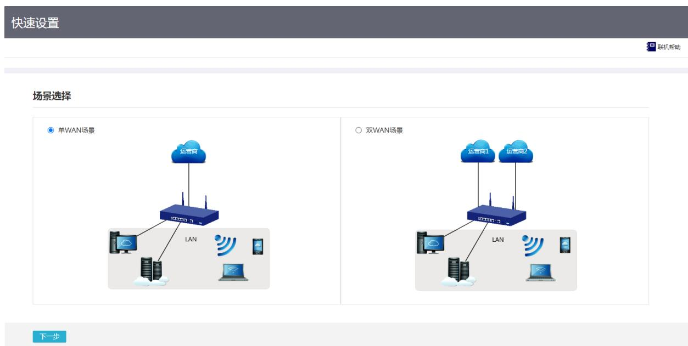

(3) 在“线路 1”或“线路 2”配置项处选择要接入广域网的物理接口 WANx。  
(4) 根据用户实际的上网方式，在“连接模式”配置项处选择对应的连接模式：  
(5) 如果选择连接模式为“PPPoE”：

− 在“上网账号”配置项处，输入运营商提供的PPPoE接入用户名。  
− 在“上网口令”配置项处，输入运营商提供的PPPoE接入密码。

 如果选择连接模式为“DHCP”，将自动从DHCP服务器获取接入广域网的公网IP地址。

 如果选择连接模式为“固定地址”：

− 在“IP地址”配置项处，输入接入广域网的固定IP地址。  
− 在“子网掩码”配置项处，输入 IP 地址的掩码或掩码长度，例如 255.255.255.0 或 24。  
− 在“网关地址”配置项处，输入接入广域网的网关地址。  
− 在“DNS1”和“DNS2”配置项处，输入接入广域网的DNS服务器地址。注意设备优先使用DNS1进行域名解析。如果解析失败，则使用DNS2进行域名解析。

(6) 在“NAT地址转换”配置项处，根据实际需求选择是否启用该功能。局域网中的多台设备共用同一个公网IP时需要启用此功能。

(7) 点击<下一步>按钮，完成WAN配置。

图1-2 快速设置-单WAN配置  
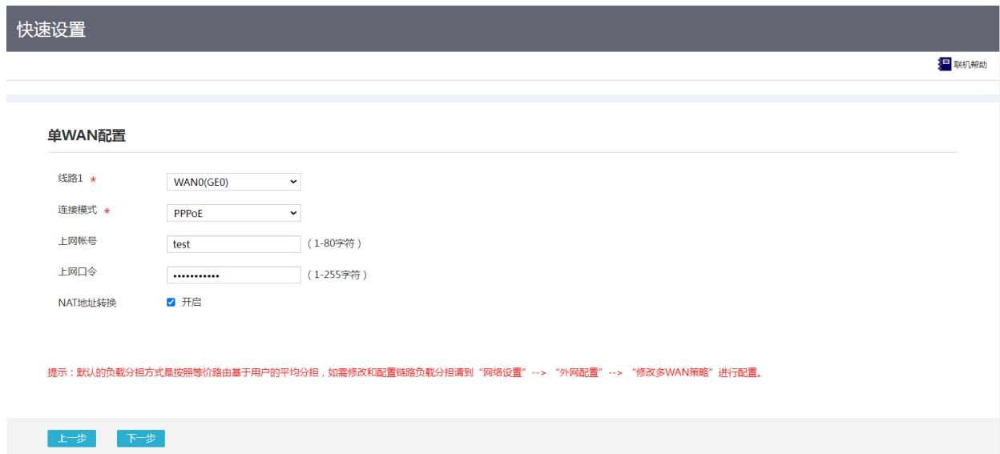

图1-3 快速设置-双WAN配置  
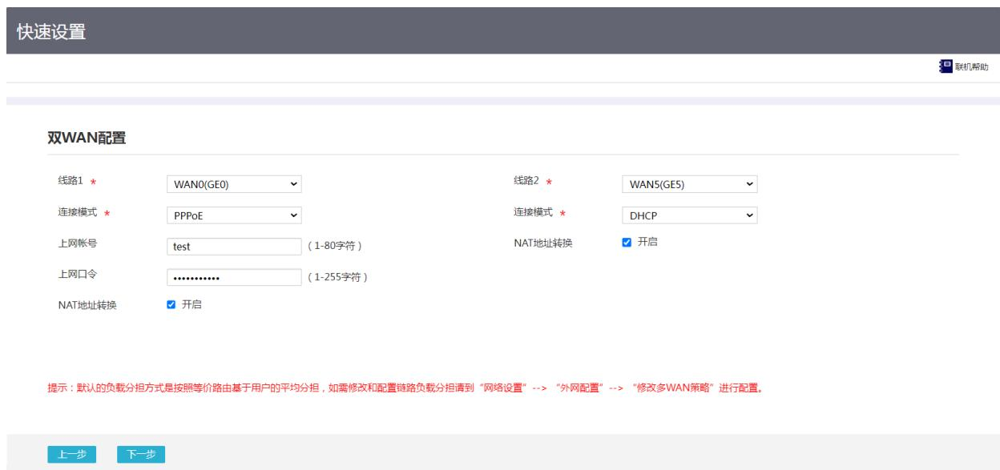

# 3. 通过移动通信（3G/4G）Modem接入广域网配置步骤

(1) 单击导航树中[快速设置]菜单项，进入快速设置页面。  
(2) 根据使用场景需求，选择“单 WAN 场景”或“双 WAN 场景”，设置广域网接入参数。  
(3) 在“线路 1”或“线路 2”配置项处选择移动通信 Modem 对应的 Cellular 接口。

当移动通信 Modem 是通过 USB接口接入时，此处需选择 USB SIM0(Cellular0/m)接口；当移动通信Modem是SIC插卡自带Modem或者设备内置Modem时，此处需选择已插入SIM卡的 SIMx(Cellularn/m)接口。

(4) 在“运营商”配置项处，根据实际使用的运营商情况选择“移动”、“联通”、“电信”或“自定义”：

 如果选择运营商为“移动”、“联通”或“电信”：

− 在“用户名”配置项处，输入从运营商处获取的用户名。  
− 在“密码”配置项处，输入从运营商处获取的密码。  
− 在“认证方式”配置项处，选择用户认证方式。用户认证方式包括PAP or CHAP（设备和用户登录终端自动协商来选择PAP或CHAP认证方式）、PAP（密码认证方式）和CHAP（质询握手认证方式）。PAP适用于对网络安全要求相对较低的环境，CHAP的安全性比PAP高。必须指定用户名和密码后，配置的认证方式才生效。

 如果选择连接模式为“自定义”：

− 在“APN”配置项处，输入从运营商处获取的APN。  
− 在“对端号”配置项处，输入从运营商处获取的对端号。  
− 在“用户名”配置项处，输入从运营商处获取的用户名。  
− 在“密码”配置项处，输入从运营商处获取的密码。  
− 在“认证方式”配置项处，选择用户认证方式。用户认证方式包括PAP or CHAP（设备和用户登录终端自动协商来选择PAP或CHAP认证方式）、PAP（密码认证方式）和CHAP（质询握手认证方式）。PAP适用于对网络安全要求相对较低的环境，CHAP的安全性比PAP高。必须指定用户名和密码后，配置的认证方式才生效。

当使用国外的运营商或其他物联网的SIM卡时，需要选择“自定义”连接模式。

(5) 在“制式选择”配置项处，选择当前运营商对应的网络制式。  
(6) 在“NAT地址转换”配置项处，根据实际需求选择是否启用该功能。局域网中的多台设备共用同一个公网IP时需要启用此功能。  
(7) 点击<下一步>按钮，完成WAN配置。

图1-4 快速设置-单WAN配置  
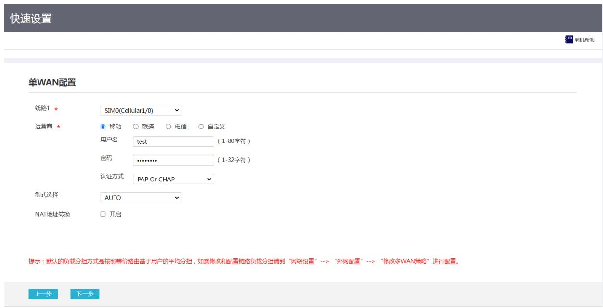

图1-5 快速设置-双WAN配置  
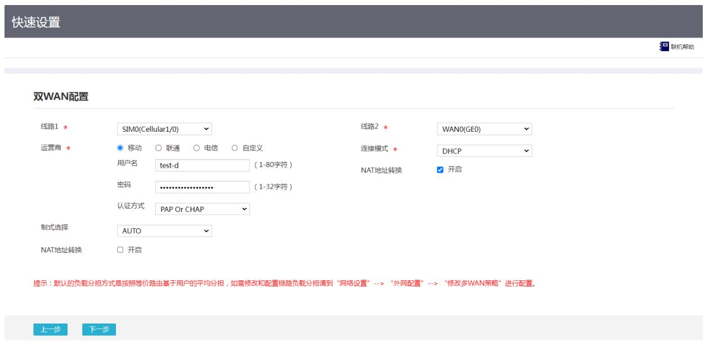

# 1.3 配置LAN

完成WAN配置后，会进入到LAN配置的页面。

(1) 在“局域网 IP 地址”配置项处，输入设备在局域网中使用的 IP 地址。  
(2) 在“子网掩码”配置项处，输入 IP 地址的掩码或掩码长度，例如 255.255.255.0 或 24。  
(3) 在“DHCP服务”配置项处，根据需要勾选“启用”。如果设备需要作为DHCP服务器为局域网中的主机分配IP地址，则需要选择“启用”。

 如选择“启用”：

− 在“IP分配范围”配置项处，输入待分配地址的起始IP地址和结束IP地址；  
− 在“网关地址”配置项处，输入设备为DHCP客户端分配的网关地址；  
− 在“DNS”配置项处，输入设备为DHCP客户端分配的DNS服务器的IP地址。

 如不勾选“启用”，则表示不启用设备的DHCP功能。

(4) 点击<下一步>按钮，完成 LAN 配置。

图1-6 快速设置-LAN配置

# 快速设置

# LAN配置

局域网IP地址

192.168.1.1

子网掩码

255.255.255.0

（例如：255.255.255.0）

DHCP服务

启用

IP分配范围

192.168.1.0

192.168.1.255

网关地址

192.168.1.1

DNS

192.168.1.1

上一步

下一步

# 1 网络设置

# 1.1 外网配置

# 1.1.1 简介

通常情况下，外网指的就是广域网（WAN，Wide Area Network），广域网是覆盖地理范围相对较广的数据通信网络，Internet就是一个巨大的广域网。

通常在设备上会有多个WAN接口，通过配置WAN接口可以实现设备访问外网。

# 1.1.2 场景定义

# 1. 配置需求

设备支持单WAN和多WAN两种广域网接入场景。如果用户仅租用了一个运营商网络，则选择单WAN场景；如果用户租用了两个运营商网络，则使用多WAN场景。单WAN和多WAN场景的配置方法相同。

# 2. 配置步骤

(1) 单击导航树中[网络设置/外网配置]菜单项，进入外网配置页面。  
(2) 单击“场景定义”页签，进入场景定义配置页面。  
(3) 根据使用场景需求，选择“单 WAN 场景”或“多 WAN 场景”。  
(4) 选择要接入广域网的接口，该接口可以是设备上物理的 WAN 接口或移动通信 Modem 对应的Cellular 接口：  
 单WAN场景下，在“线路1”配置项处选择接入广域网的接口。  
 多WAN场景下，在“线路1”、“线路2”、“线路3”或“线路4”配置项处选择多个接入广域网的接口。

如果选择移动通信Modem对应的Cellular接口，需要注意：当移动通信Modem是通过USB接口接入时，此处需选择 USB SIM0(Cellular0/m)接口；当移动通信 Modem 是 SIC 插卡自带Modem 或者设备内置 Modem 时，此处需选择已插入 SIM 卡的 SIMx(Cellularn/m)接口。

(5) 点击<应用>按钮，完成场景定义配置。

图1-1 场景定义  
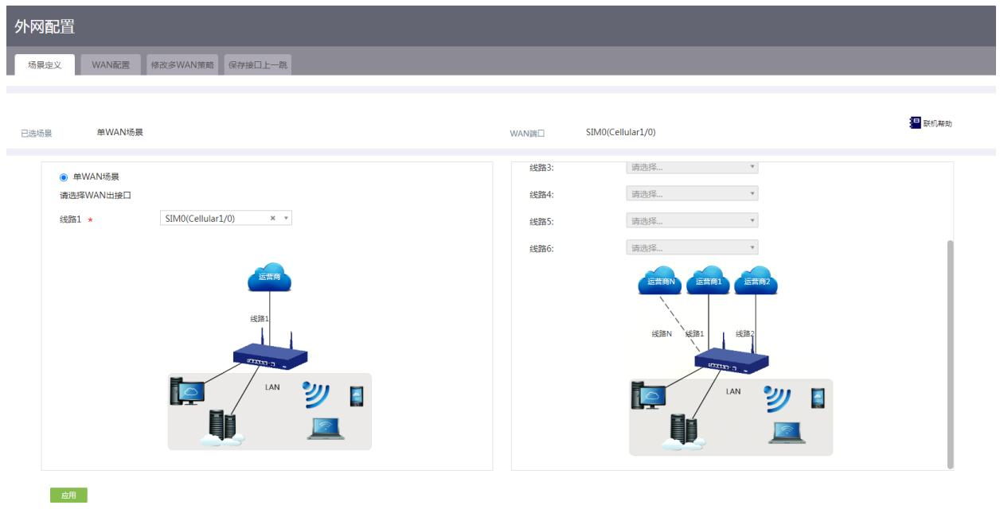

# 1.1.3 WAN 配置

# 1. 配置需求

设备支持通过物理接口和移动通信（3G/4G）Modem接入广域网，两种方式需要配置的参数不同。

# 2. 通过物理接口接入广域网配置步骤

(1) 单击导航树中[网络设置/外网配置]菜单项，进入外网配置页面。  
(2) 单击“WAN 配置”页签，进入 WAN 配置页面。

图1-2 WAN 配置  
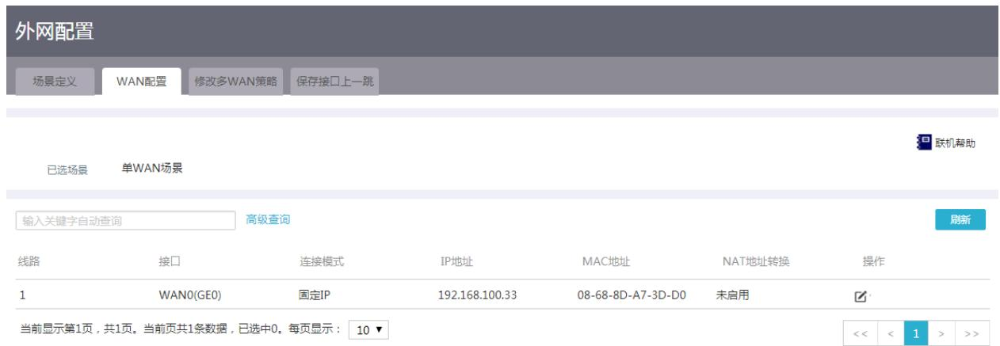

(3) 在线路列表中，单击指定线路上“操作”区段的“修改”按钮，进入修改WAN配置页面。  
(4) 根据用户实际的上网方式，在“连接模式”配置项处选择对应的连接模式：  
 如果选择连接模式为“PPPoE”：

− 在“上网账号”配置项处，输入运营商提供的PPPoE接入用户名。  
− 在“上网密码”配置项处，输入运营商提供的PPPoE接入密码。  
“在线方式”为“始终在线”。

 如果选择连接模式为“DHCP”，将自动从DHCP服务器获取接入广域网的公网IP地址。

 如果选择连接模式为“固定地址”：

− 在“IP地址”配置项处，输入接入广域网的固定IP地址。  
− 在“子网掩码”配置项处，输入 IP 地址的掩码或掩码长度，例如 255.255.255.0 或 24。  
− 在“网关地址”配置项处，输入接入广域网的网关地址。  
− 在“DNS1”和“DNS2”配置项处，输入接入广域网的DNS服务器地址。注意设备优先使用DNS1进行域名解析。如果解析失败，则使用DNS2进行域名解析。

(5) 在“MAC地址”配置项处，根据实际需求选择“使用接口出厂MAC地址(XX-XX-XX-XX-XX-XX)”或“使用静态指定的 MAC”。如果选择“使用静态指定的 MAC”，则在配置项处输入配置的静态MAC地址。如需通过运营商分配的公网地址访问外网，则需要配置静态MAC地址。  
(6) 在“NAT 地址转换”配置项处，根据实际需求选择是否启用该功能。局域网中的多台设备共用同一个公网IP时需要启用此功能。启用“NAT地址转换”功能后，若勾选“使用地址池转换”，请在下拉框中选择指定地址池来进行NAT地址转换。  
(7) 在“TCP MSS”配置项处，设置接口的TCP报文段的最大长度。  
(8) 在“MTU”配置项处，输入接口允许通过的 MTU（Maximum Transmission Unit，最大传输单元）的大小。  
(9) 在“链路探测”配置项处，根据实际情况选择是否启用该功能，如果选择启用：

 在“探测地址”配置项处，输入链路探测的IP地址。

 在“探测间隔”配置项处，输入链路探测的时间间隔。

启用链路探测功能后，可以对到达指定IP地址的链路状态进行判断，提高链路的可靠性。

(10) 点击<确定>按钮，完成WAN配置修改。

图1-3 修改WAN配置  
修改WAN配置  

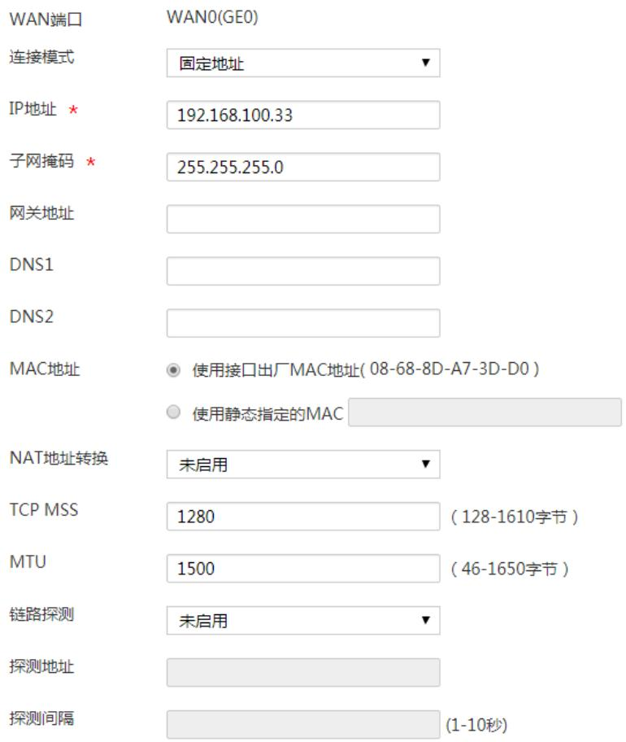

确定

取消

# 3. 通过移动通信（3G/4G）Modem接入广域网配置步骤

(1) 单击导航树中[网络设置/外网配置]菜单项，进入外网配置页面。  
(2) 单击“WAN配置”页签，进入WAN配置页面。

图1-4 WAN 配置  
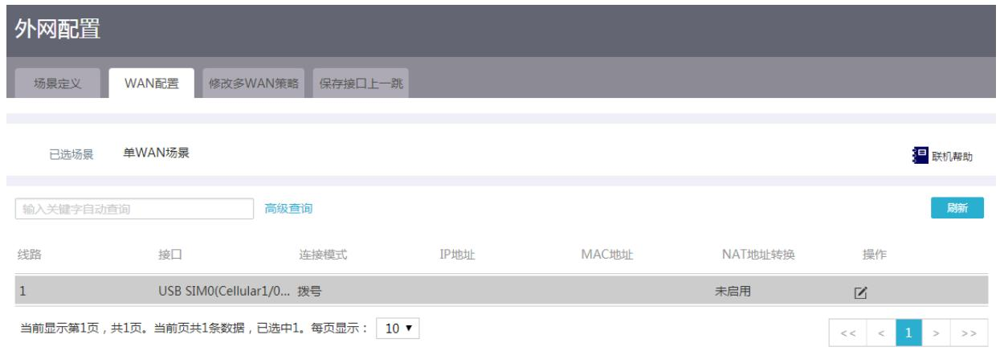

(3) 在线路列表中，单击指定线路上“操作”区段的“修改”按钮，进入修改WAN配置页面。  
(4) 在“运营商”配置项处，根据实际使用的运营商情况选择“移动”、“联通”、“电信”或“自定义”：

 如果选择运营商为“移动”、“联通”或“电信”：

− 在“用户名”配置项处，输入从运营商处获取的用户名。  
− 在“密码”配置项处，输入从运营商处获取的密码。  
− 在“认证方式”配置项处，选择用户认证方式。用户认证方式包括PAP or CHAP（设备和用户登录终端自动协商来选择PAP或CHAP认证方式）、PAP（密码认证方式）和CHAP（质询握手认证方式）。PAP适用于对网络安全要求相对较低的环境，CHAP的安全性要比PAP高。必须指定用户名和密码后，配置的认证方式才生效。

 如果选择连接模式为“自定义”：

− 在“APN”配置项处，输入从运营商处获取的APN。  
− 在“拨号串”配置项处，输入从运营商处获取的拨号串。  
− 在“用户名”配置项处，输入从运营商处获取的用户名。  
− 在“密码”配置项处，输入从运营商处获取的密码。  
− 在“认证方式”配置项处，选择用户认证方式。用户认证方式包括PAP or CHAP（设备和用户登录终端自动协商来选择PAP或CHAP认证方式）、PAP（密码认证方式）和CHAP（质询握手认证方式）。PAP适用于对网络安全要求相对较低的环境，CHAP的安全性要比PAP高。必须指定用户名和密码后，配置的认证方式才生效。

当使用国外的运营商或其他物联网的SIM卡时，需要选择“自定义”连接模式。

(5) 在“制式选择”配置项处，选择当前运营商对应的网络制式。  
(6) 在“NAT地址转换”配置项处，根据实际需求选择是否启用该功能。局域网中的多台设备共用同一个公网IP时需要启用此功能。启用“NAT地址转换”功能后，若勾选“使用地址池转换”，请在下拉框中选择指定地址池来进行NAT地址转换。  
(7) 在“链路探测”配置项处，根据实际情况选择是否启用该功能，如果选择启用：

 在“探测地址”配置项处，输入链路探测的IP地址。

 在“探测间隔”配置项处，输入链路探测的时间间隔。

启用链路探测功能后，可以对到达指定IP地址的链路状态进行判断，提高链路的可靠性。

(8) PIN（Personal Identification Number，个人识别密码）码是保护 SIM 卡的一种安全措施，防止别人盗用SIM卡，可以点击<更多配置>按钮，进入PIN码配置页面：

 根据需要决定是否勾选“开启 PIN码认证功能”，如勾选，则在配置项处输PIN码。建议开启PIN码认证功能，提高设备安全性。  
 如果开启PIN码认证功能时输入的PIN码有误，可以点击<修改PIN码>按钮，进入修改PIN码配置页面：

− 在“原PIN码”配置项处，输入原有的PIN码。  
− 在“新PIN码”配置项处，输入新的PIN码。  
− 在“确认新PIN码”配置项处，再次输入新的PIN码。  
− 点击<提交修改>按钮完成PIN码修改，点击<返回>按钮取消修改操作。

 如果多次输入PIN码错误，需要点击<PIN码解锁>按钮，进入PIN码解锁配置页面：

− 在“PUK码”配置项处，输入解锁的PUK码。  
− 在“新PIN码”配置项处，输入新的PIN码。  
− 在“确认新PIN码”配置项处，再次输入新的PIN码。  
− 点击<解锁>按钮完成PIN码解锁，点击<返回>按钮取消解锁操作。

 如果需要重启移动通信Modem，可以点击<重启 Modem>按钮。

(9) 点击<保存配置>按钮，完成WAN配置修改。

图1-5 修改WAN配置  
修改WAN配置  

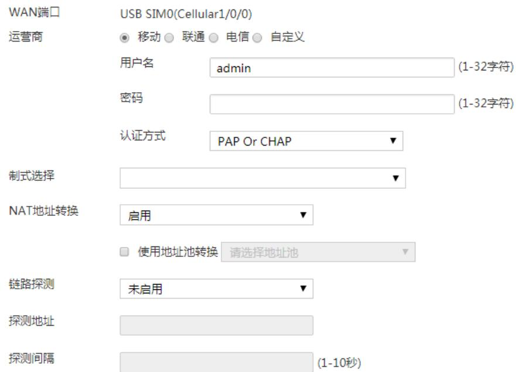

# 更多配置

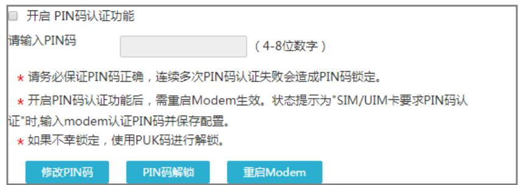

#

# 1.1.4 修改多 WAN 策略

# 1. 注意事项

只有多WAN场景可以进行本页面的配置。

# 2. 配置步骤

(1) 单击导航树中[网络设置/外网配置]菜单项，进入外网配置页面。  
(2) 单击“修改多WAN策略”页签，进入修改多WAN策略配置页面。   
(3) 根据实际应用，对多 WAN 策略进行修改：  
 如果多WAN属于相同的运营商，建议选择“平均分配负载分担”或“带宽比例负载分担”。如果多WAN链路的带宽一致，可以选择“平均分配负载分担”，否则选择“带宽比例负载分担”。

 如果多WAN属于不同的运营商，建议选择“基于运营商的负载分担”或“多链路高级负载分担”。如果每个运营商提供的链路带宽一致，可以选择“基于运营商的负载分担”，否则选择“多链路高级负载分担”。 为了保持网络的稳定性，可以进行链路备份，选择“主链路（请选择作为主链路的WAN接口）”以及对应的“线路n”，然后选择备份链路的“线路m”。注意n和m不能一致，否则不能实现链路备份。

(4) 点击<应用>按钮，完成多 WAN 策略修改。

图1-6 修改多WAN策略  

多WAN属于相同运营商，推荐如下模式：

平均分配负载分担  
带宽比例负载分担

多WAN属于不同运营商，推荐如下模式：

基于运营商的负载分担  
多链路高级负载分担

链路备份：

主链路（请选择作为主链路的WAN接口）

。 线路1:

备份链路（请选择作为备份链路的WAN接口）

线路1:

# 应用

# 1.1.5 保存接口上一跳

(1) 单击导航树中[网络设置/外网配置]菜单项，进入外网配置页面。  
(2) 单击“保存接口上一跳”页签，进入配置页面。

(3) 选择“开启保存接口上一跳功能”或“关闭保存接口上一跳功能”。多WAN场景下，为了确保进入和离开局域网的报文通过同一个WAN接口转发，需要开启保存接口上一跳功能。

图1-7 保存接口上一跳  

# 1.2 LAN配置

# 1.2.1 简介

本功能主要用于配置设备连接内网的LAN接口参数，开启DHCP服务，以及将接口加入VLAN。

DHCP（Dynamic Host Configuration Protocol，动态主机配置协议）是一个局域网协议，主要用于为局域网内的主机分配IP地址。DHCP支持动态及静态地址分配机制：

动态地址分配功能配置在接口上，此功能给用户主机动态分配IP地址，时间到期或主机明确表示放弃该地址时，该地址可以被其他主机使用。该分配方式适用于局域网的主机获取有一定有效期限的地址的组网环境。  
静态分配的IP地址不和接口绑定，仅需要与主机的网卡 MAC地址进行绑定，具有永久使用权限。该分配方式适用于局域网的主机获取租期为无限长的IP地址的组网环境。

# 1.2.2 配置 LAN 接口基本参数

# 1. 配置需求

为设备连接内网的GE接口配置IP地址，或创建VLAN与VLAN接口。

# 2. 配置步骤

(1) 单击导航树中[网络设置/LAN 配置]菜单项，进入 LAN 配置页面。  
(2) 单击“LAN配置”页签，进入LAN接口配置页面。

图1-8 LAN 配置  
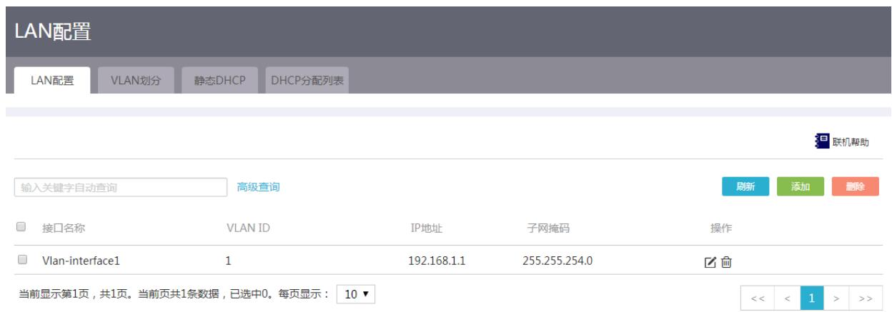

(3) 点击<添加>按钮，进入添加LAN接口页面。  
(4) 在“LAN 接口类型”配置项处，选择配置的接口类型：

 如果选择“VLAN接口”，则表示创建VLAN与VLAN接口，还需要输入VLAN ID。 如果选择“GE接口”，则表示配置指定的GE接口，还需要选择GE接口。

(5) 在“接口 IP 地址”配置项处，输入接口的 IP 地址。  
(6) 在“子网掩码”配置项处，输入 IP 地址的掩码或掩码长度，例如 255.255.255.0 或 24。  
(7) 在“TCP MSS”配置项处，设置接口的TCP报文最大分段长度值。  
(8) 在“MTU”配置项处，输入接口允许通过的MTU的大小。  
(9) 如果还希望设备为连接到设备的客户端（如连接到设备的计算机等）动态分配 IP 地址，则需要勾选“开启DHCP服务”复选框，开启设备的DHCP服务。  
(10) 点击<确定>按钮，完成配置。

图1-9 添加 LAN  
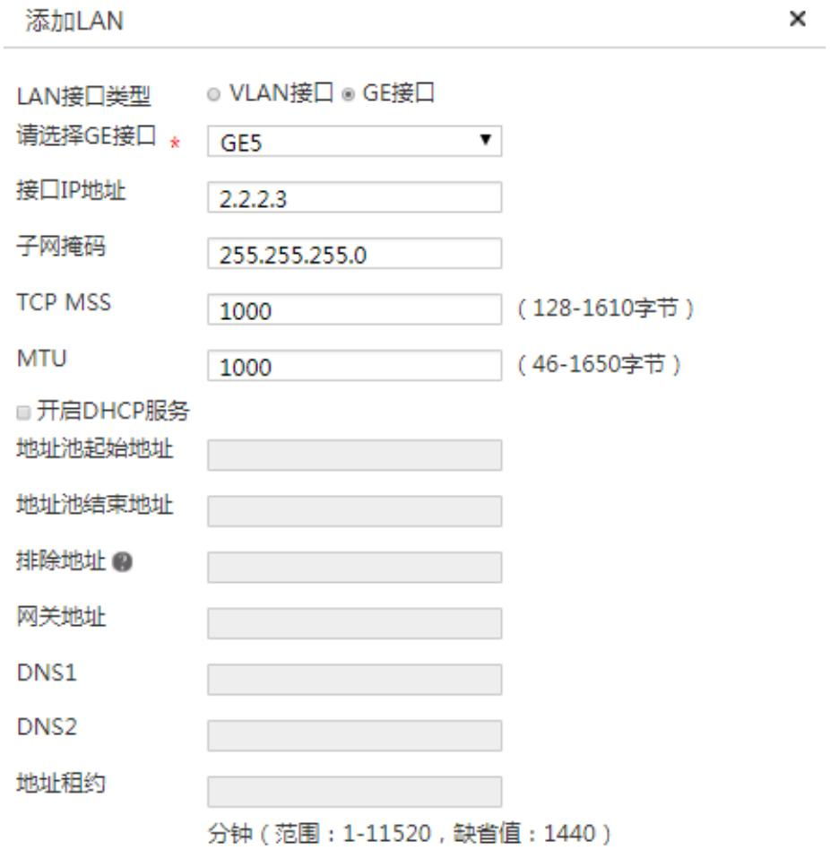

# 1.2.3 配置 VLAN

# 1. 配置需求

需要将设备上的LAN接口加入指定的VLAN，使得局域网内处于同一VLAN的主机能直接互通，处于不同 VLAN的主机不能直接互通。

# 2. 注意事项

在端口详细配置页面配置端口的PVID时，只能指定已创建的VLAN。

# 提示

PVID（Port VLAN ID，端口的缺省 VLAN）：当端口收到未携带 VLAN Tag 的报文时，即认为此报文所属的VLAN为端口的缺省VLAN。

# 3. 配置准备

规划设备上 LAN 接口所属的 VLAN，并在 LAN 接口配置页面上，创建对应的 VLAN 接口。

# 4. 配置步骤

(1) 单击导航树中[网络设置/LAN 配置]菜单项，进入 LAN 配置页面。  
(2) 单击“VLAN 划分”页签，进入 VLAN 划分页面。

图1-10 VLAN 划分  
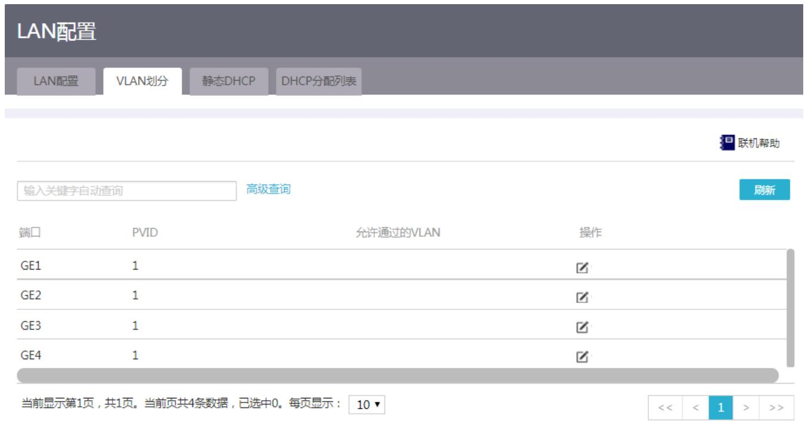

(3) 在端口列表中，单击指定端口上“操作”区段的“修改”按钮，进入详细端口配置页面。  
(4) 单击在 PVID 配置项处的下拉框，修改端口的 PVID。  
(5) 配置端口加入或移除 VLAN：

 单击待选VLAN下方的VLAN编号可以将端口加入该VLAN，或通过待选VLAN下方的向右方向按钮将端口加入当前所有的待选VLAN中。  
 单击已选VLAN下方的VLAN编号可以将端口移除该VLAN，或通过已选VLAN下方的向左方向按钮将端口从所有已加入的VLAN中移除。

(6) 点击<确定>按钮，完成配置。

图1-11 详细端口配置  
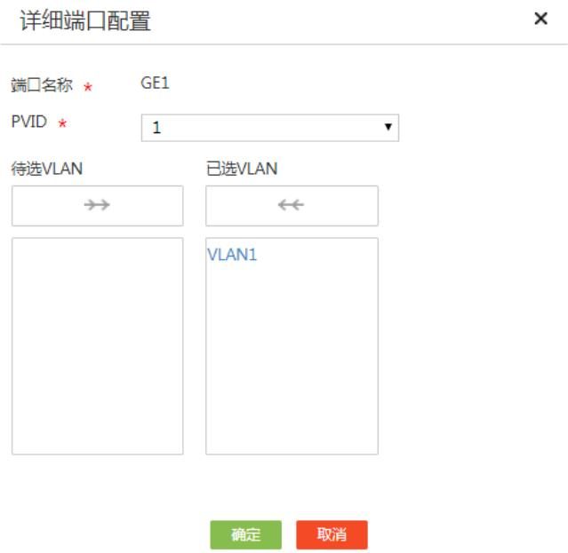

# 1.2.4 开启接口上的 DHCP 服务

# 1. 配置需求

如果希望设备可以为连接到该接口的客户端（如连接到设备的计算机等）动态分配IP地址，则需要开启指定接口上的DHCP服务。

# 2. 注意事项

接口上指定的地址池的地址范围不能与设备上WAN口的IP地址网段包含相同的IP地址。

# 3. 配置步骤

(1) 单击导航树中[网络设置/LAN 配置]菜单项，进入 LAN 配置页面。  
(2) 单击“LAN配置”页签，进入LAN接口配置页面。  
(3) 在接口列表中，单击指定接口上“操作”区段的“修改”按钮，进入修改接口配置页面。  
(4) 单击“开启DHCP服务”配置项。  
(5) 在“地址池起始地址”和“地址池结束地址”配置项处，设置设备可分配给客户端的IP地址范围。  
(6) 在“排除地址”配置项处，设置不能分配给客户端的IP地址。  
如果地址池范围内的某些IP地址（如网关地址）不能分配给客户端，就需要将其配置为排除地址。  
(7) 在“网关地址”和“DNS1”以及“DNS2”配置项处，输入客户端的网关地址和DNS服务器地址。  
(8) 在“地址租约”配置项处，以分钟为单位设置IP地址的使用时间，比如设置IP地址租约为5天，则输入7200。  
(9) 点击<确定>按钮，完成配置。

图1-12 修改 LAN

# 修改LAN

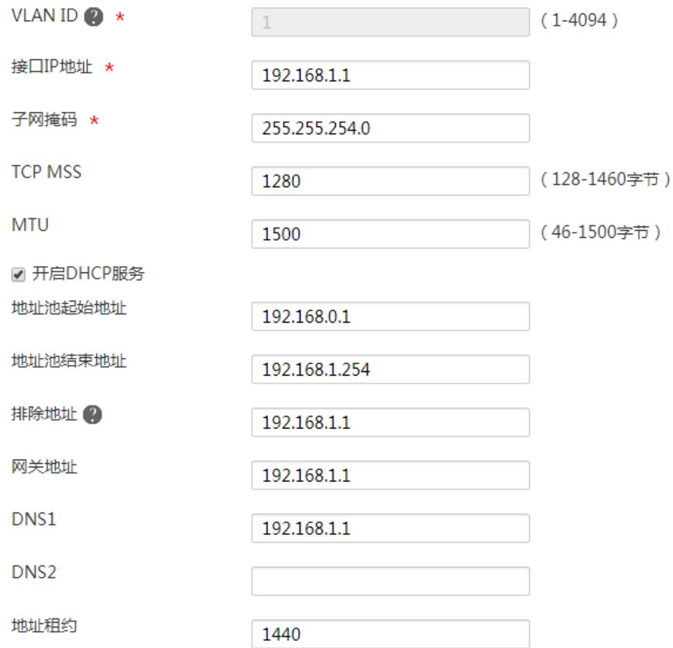  
分钟（范围：1-11520，缺省值：1440）

确定

取消

# 1.2.5 绑定一组静态表项

# 1. 配置需求

如果需要为某些客户端分配固定的IP地址，则需要配置静态DHCP将客户端的硬件地址与IP地址进行绑定。

# 2. 注意事项

静态绑定的客户端IP地址不能是设备上WAN口的 IP地址网段包含的 IP地址。

# 3. 配置准备

在任何一个接口上开启DHCP服务。如果仅需要使用静态DHCP方式分配IP地址，则还需要删除该接口上的DHCP参数配置。

# 4. 配置步骤

(1) 单击导航树中[网络设置/LAN 配置]菜单项，进入 LAN 配置页面。  
(2) 单击“静态 $\mathsf { D H C P } ^ { \prime \prime }$ 页签，进入静态 DHCP 配置页面。  
(3) 点击<添加>按钮，进入新增DHCP静态绑定关系配置页面。  
(4) 在“接口”配置项处，点击下拉单选择开启 DHCP 服务器功能的接口。  
(5) 在“客户端 ${ \mathsf { M A C } } ^ { \prime \prime }$ 配置项处，输入客户端的 MAC 地址。对于 PC 类型的客户端，可以在网卡信息中查询到MAC地址；对于设备类型的客户端，可以通过display interface命令查询接口的MAC地址。  
(6) 在“客户端IP”配置项处，输入要分配给客户端的IP地址。  
(7) 点击<确定>按钮，完成配置。

图1-13 新增DHCP静态绑定关系  
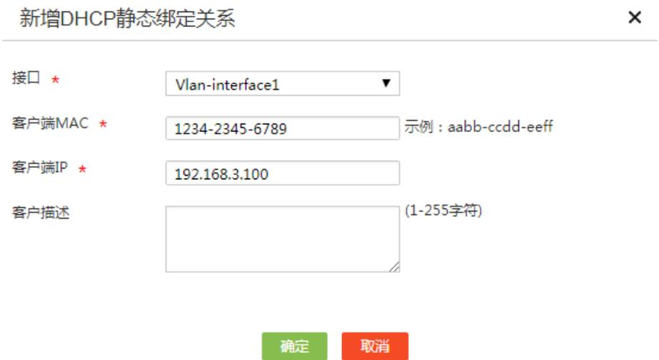

# 1.2.6 绑定多组静态表项

# 1. 注意事项

绑定多组客户端的硬件地址与IP地址时，可以采用导入静态绑定表的功能。

# 2. 配置步骤

(1) 单击导航树中[网络设置/LAN 配置]菜单项，进入 LAN 配置页面。  
(2) 单击“静态 $\mathsf { D H C P } ^ { \prime \prime }$ 页签，进入静态 DHCP 配置页面。  
(3) 点击<导入>按钮，进入导入静态绑定表配置界面。  
(4) 在“选择接口”配置项处，点击下拉菜单选择开启DHCP服务器功能的接口。  
(5) 点击“选择文件”打开本地路径下保存的静态绑定表。  
(6) 点击<确定>按钮，完成配置。  
(7) 可以在“DHCP 地址分配表”查看到分配给 DHCP 客户端的 IP 地址信息。

图1-14 导入静态绑定表

# 导入静态绑定表

选择接□

GE5

选择文件

未选择任何文件

取消

# 说明

“静态绑定表”使用 Excel 制作，共四列信息：“IP ADDRESS”、“MASK”、“MAC ADDRESS”、“DESCRIPTION（选填）”，具体内容按实际需求填写，制作完成后保存为CSV格式。

# 1.2.7 查看 DHCP 分配列表

# 1. 配置准备

在设备接口上开启 DHCP 服务或者配置静态 DHCP 后，可以在 DHCP 地址分配表中查看分配给DHCP客户端的IP地址信息。

# 2. 配置步骤

(1) 单击导航树中[网络配置/LAN 配置]菜单项，进入 LAN 配置页面。  
(2) 单击“DHCP分配列表”页签，进入DHCP分配列表页面。  
(3) 在“DHCP服务”配置项处，选择开启DHCP服务器功能的接口，显示DHCP服务器已分配地址租约的信息。

图1-15 DHCP 分配列表  
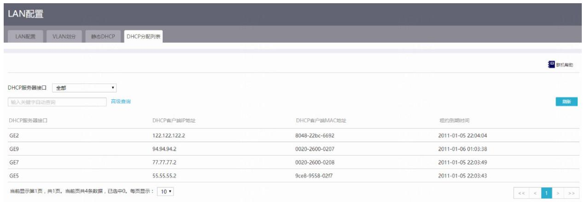

# 1.3 端口管理

# 1. 简介

端口管理功能用来查看设备各个物理端口的端口类型、端口模式、速率、MAC 地址等信息，设置端口的物理状态，以及修改端口的双工模式和速率。

# 2. 配置步骤

(1) 单击导航树中[网络设置/端口管理]菜单项，进入端口管理页面。  
(2) 在物理端口列表中，点击指定端口对应的物理状态列按钮，设置开启或者关闭该端口。

图1-16 端口管理  
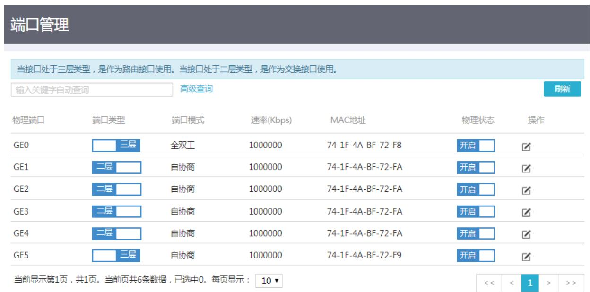

(3) 在物理端口列表中，点击指定端口对应的操作列编辑图标，弹出修改端口配置对话框。  
(4) 在“端口模式”配置项处，选择配置的端口模式。

(5) 在“速率”配置项处，选择配置的端口速率。  
(6) 在“MAC 地址”配置项处，查看端口的 MAC 地址。  
(7) 点击<确定>按钮，完成配置。

图1-17 修改端口配置  
修改端口配置  

# 1.4 NAT配置

# 1.4.1 简介

NAT（Network Address Translation，网络地址转换）是一种将内部网络私有 IP 地址，转换成公网IP地址的技术。拥有私有IP地址的内网用户无法直接访问Internet，如果希望内网用户使用运营商提供的公网IP访问外网，或者允许外网用户使用公网IP访问内网资源，则需要配置NAT。

NAT支持如下两种地址转换方式：

• 端口映射：通过这种转换方式，可以实现利用一个公网地址和不同的协议端口同时对外网提供多个内网服务器（例如Web\Mail\FTP服务器）资源的目的。这种方式可以节约设备的公网IP地址资源。端口映射可以将内网中的一组IP地址和不同的协议端口映射到一个公网 IP地址和对应的协议端口上，使得一个公网 IP地址可以同时分配给多个内网IP地址使用。  
一对一映射：这种方式适用于内外网之间存在固定访问需求的环境，比如某个网络管理员必须使用一个固定的外网IP去远程访问位于内网中对外提供服务的设备。一对一映射可以在设备上建立一个固定的一对一的映射关系，将内网中的一个私有IP地址转换为一个公网 IP地址。

NAT还提供如下高级功能：

• NAThairpin：如果您的某些内网服务器通过公网IP地址对外提供服务，同时内网用户也有访问这些服务器的需求，为了确保这些内网用户访问内网服务器的流量也经过网关控制，则可以开启NAT hairpin功能。开启该功能后，内网用户将与外网用户一样，都可以使用公网IP地址访问内网服务器。

NATALG：如果内部网络与外部网络之间存在应用层业务，例如FTP/DNS，为了保证这些应用层协议的数据连接经过端口映射或一对一映射后还可以正确建立，就需要开启相应协议的NAT ALG 功能。

# 1.4.2 配置端口映射

(1) 单击导航树中[网络设置/NAT 配置]菜单项，进入 NAT 配置页面。  
(2) 单击“端口映射”页签，进入端口映射配置页面。  
(3) 点击<添加>按钮，进入添加NAT端口映射页面。  
(4) 在“接口”配置项处，选择用于连接 Internet 的端口。  
(5) 在“协议类型”配置项处，选择协议为“TCP”、“UDP”、“TCP＋UDP”或“自定义”。此处需要根据内部服务器采用的传输层协议类型选择TCP或UDP，比如FTP服务器采用TCP协议，TFTP采用UDP协议。或者通过“自定义”方式以数值的形式指定协议类型。  
(6) 在“外部地址”配置项处，可以选择使用当前端口的 IP 地址，也可以使用设备上的其它公网IP地址。  
(7) 在“外部端口”配置项处，选择 FTP、Telnet 或自定义端口。如果您对外提供的服务不是FTP或Telnet，请输入提供的服务所使用的端口号，比如HTTP服务端口号 80。  
通过“自定义”方式指定协议类型时，不支持配置“外部端口”。  
(8) 在“内部地址”配置项处，输入允许外部网络访问的内网IP地址。  
(9) 在“内部端口”配置项处，输入内部网络资源使用的端口号。通过“自定义”方式指定协议类型时，不支持配置“内部端口”。  
(10) 点击<确定>按钮，完成配置。

图1-18 添加 NAT 端口映射  
添加NAT端口映射   
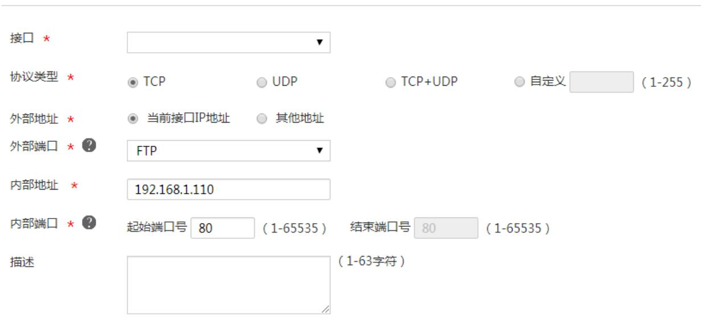

# 1.4.3 配置一对一映射

# 1. 注意事项

如果设备上仅有一个公网IP地址，不建议配置一对一映射来占用公网IP地址。

# 2. 配置步骤

(1) 单击导航树中[网络设置/NAT 配置]菜单项，进入 NAT 配置页面。  
(2) 单击“一对一映射”页签，进入一对一映射配置页面。  
(3) 点击<添加>按钮，进入添加NAT一对一映射页面。  
(4) 在“内部地址”配置项处，输入内网 IP 地址。  
(5) 在“外部地址”配置项处，输入拥有的公网 IP 地址。  
(6) 根据需要勾选“外部网络来源地址范围”选项：

 若勾选“外部网络来源地址范围”选项，则需在“IP 地址/掩码”配置项处，输入内部主机可以访问的目的地址范围。设置该范围后，仅对目的地址在该范围内的报文进行地址转换。 若未勾选“外部网络来源地址范围”选项，则对所有从内网到外网的报文进行地址转换。

(7) 点击<确定>按钮，完成配置。  
(8) 在一对一映射配置页面上，开启一对一映射功能。

图1-19 添加一对一映射  
添加NAT—对一映射   

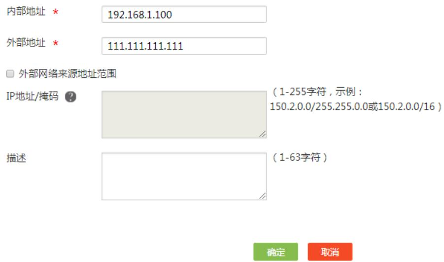

# 1.4.4 配置地址池

(1) 单击导航树中[网络设置/NAT 配置]菜单项，进入 NAT 配置页面。  
(2) 单击“地址池”页签，进入地址池配置页面。   
(3) 点击<添加>按钮，弹出添加NAT地址池对话框。  
(4) 在“地址池名”配置项处，输入用于NAT转换的公网 IP地址池名称。  
(5) 在“起始地址”配置项处，输入地址池的起始IP地址。  
(6) 在“结束地址”配置项处，输入地址池的结束 IP 地址。  
(7) 点击配置项右侧的 按钮，提交配置的地址池内容。  
(8) 重复(5)、(6)步骤可完成多个地址池的添加。  
(9) 点击<确定>按钮，完成配置。

图1-20 添加 NAT 地址池  
添加NAT地址池  
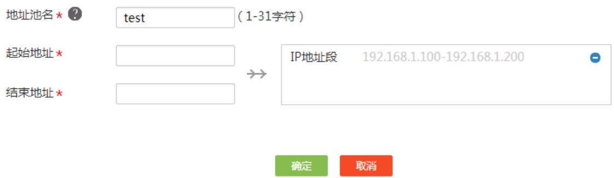

# 1.4.5 配置 NAT hairpin

# 1. 配置准备

在配置 NAT hairping 前，需要完成如下配置中的一项或多项：

在端口映射配置页面上，配置内网服务器的IP地址/端口与公网IP地址/端口的映射关系。  
• 在一对一映射配置页面上，配置内网用户IP地址与公网IP地址的映射关系。

# 2. 配置步骤

(1) 单击导航树中[网络设置/NAT 配置]菜单项，进入 NAT 配置页面。  
(2) 单击“高级配置”页签，进入高级配置页面。  
(3) 开启 NAT hairpin 功能。  
(4) 点击<应用>按钮，完成配置。

图1-21 高级配置-NAT hairping  
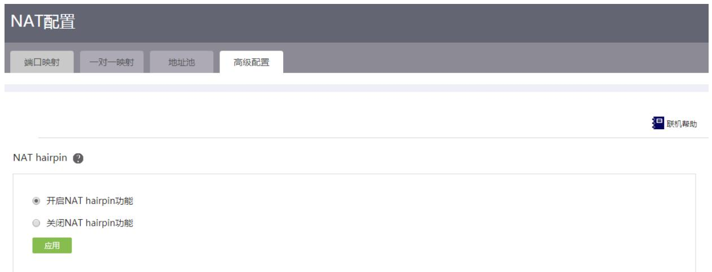

# 1.4.6 配置 NAT ALG

(1) 单击导航树中[网络设置/NAT 配置]菜单项，进入 NAT 配置页面。  
(2) 单击“高级配置”页签，进入高级配置页面。  
(3) 启用指定协议的 NAT ALG功能。  
(4) 点击<应用>按钮，完成配置。

图1-22 高级配置-NAT ALG  

联机帮助

NAT hairpin 0

●开启NAT hairpin功能  
○关闭NAT hairpin功能

应用

NAT ALG

启用DNS   
启用FTP   
启用H323   
☑启用ICMP-ERROR   
启用ILS   
□启用MGCP   
启用NBT   
启用PPTP   
启用RTSP   
启用RSH   
启用SCCP   
启用SIP   
启用SOLNET   
启用TETP   
启用XDMCP

应用

# 1 上网行为管理

# 1.1 用户组

# 1. 简介

用户组是一组用户主机名或IP地址的集合。每个用户组中可以添加若干成员，成员的类型包括主机名、IP地址以及IP地址段。如果您的某些业务（例如带宽管理）需要使用用户组来识别用户报文，则需要提前配置符合业务需求的用户组。

# 2. 注意事项

添加到用户组中的IP地址只支持IPv4地址格式，不支持IPv6地址格式。  
添加到用户组中的IP地址段的起始地址必须小于结束地址。

# 3. 配置步骤

(1) 单击导航树中[上网行为管理/用户组]菜单项，进入用户组配置页面。

图1-1 用户组  

(2) 点击<添加>按钮，进入新建用户组页面。  
(3) 在“用户组名称”配置项处，输入用户组的名称。  
(4) 在“描述信息”配置项处，输入用户组的描述信息。  
(5) 配置用户组内容：

 配置添加到用户组的主机名。  
 配置添加到用户组的单个IP地址。  
 配置添加到用户组IP地址段的起始IP地址及结束IP地址。  
 配置用户组排除的IP地址。

(6) 点击配置项右侧的<→→>按钮，提交配置的用户组内容。  
(7) 重复(5)、(6)步骤可完成多个同类型成员的添加。  
(8) 点击<确定>按钮，完成新建用户组。

图1-2 添加用户组  
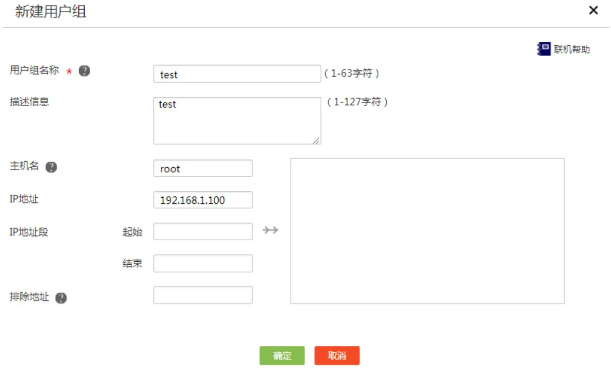

# 1.2 时间组

# 1.2.1 简介

如果您希望设备上的某些功能（例如带宽管理、上网行为管理）仅在特定时间生效，而其他时间不生效，可以创建一个时间组，并在配置相关功能时引用时间组。

一个时间组中可以配置一个或多个时间段。时间段的生效时间有如下两种方式：

周期性生效：以周作为周期，循环生效。例如，每周一的8至12点。  
非周期生效：在指定的时间范围内生效。例如，2015年 1月1日 8点至 2015年 1月3日18点。

如果一个时间组中配置了多个周期性生效和非周期生效的时间段，设备将取所有周期性生效时间段的并集和所有非周期生效时间段的并集，再取这两个并集的交集作为该时间组最终的生效时间。

例如，对名称为test的时间组配置如下时间段：

周期性生效的时间段为每周一至周五：

 上午 08：30～12：00； 。上午08：30～12:00;

。下午13:30\~18:00;  下午 13：30～18：00；

非周期时间段为2019年4月 1日至2019年4月 30日：

 上午 10：00～12：00；

 下午 14：00～16：00。

则该时间组在2019年4月份每周一至周五的上午10点至12点和下午14点至 16点生效。

# 1.2.2 注意事项

您最多可以创建1024个不同名称的时间组。  
对于同一个时间组，不可以使用命令行和web页面混合配置。  
一个时间组内最多可以配置32个周期性生效的时间段和12个非周期生效的时间段。

# 1.2.3 创建单项时间组

# 1. 注意事项

如果您想创建一个仅含有周期性生效时间段的时间组，或一个仅含有非周期生效时间段的时间组，请按照如下配置步骤操作。

# 2. 配置步骤

(1) 单击导航树中[上网行为管理/时间组]菜单项，进入时间组配置页面。

图1-3 时间组  

(2) 点击<添加>按钮，进入新建时间组页面。  
(3) 在“时间组名称”配置项处，输入时间组的名称。  
(4) 在“生效时间”配置项处，选择“周期性生效”或“非周期生效”，配置时间段。请选择其中一项进行配置。  
 周期性生效  
点选每周需要生效的具体天数，并在下面输入每天的具体生效时间，点击<加号>按钮，完成本时间段的配置。  
 非周期生效  
选择生效的起止日期，并在下面输入具体生效的起止时间，点击<加号>按钮，完成本时间段的配置。  
(5) 点击<确定>按钮，完成时间组创建。

图1-4 新建单项时间组  

# 1.2.4 创建多项时间组

# 1. 注意事项

如果您想创建一个同时含有周期性生效时间段和非周期生效时间段的时间组，请按照如下配置步骤操作。

# 2. 配置步骤

(1) 单击导航树中[上网行为管理/时间组]菜单项，进入时间组配置页面。  
(2) 点击<添加>按钮，进入新建时间组页面。  
(3) 在“时间组名称”配置项处，输入时间组的名称。  
(4) 在“生效时间”配置项处，根据需要选择：

 选择“周期性生效”。点选每周需要生效的具体天数，并在下面输入每天的具体生效时间，点击<加号>按钮，完成本时间段的配置。

图1-5 新建多项时间组-周期性生效  

 选择“非周期生效”：选择生效的起止日期，并在下面输入具体生效的起止时间，点击<加号>按钮，完成本时间段的配置。

图1-6 新建多项时间组-非周期生效  
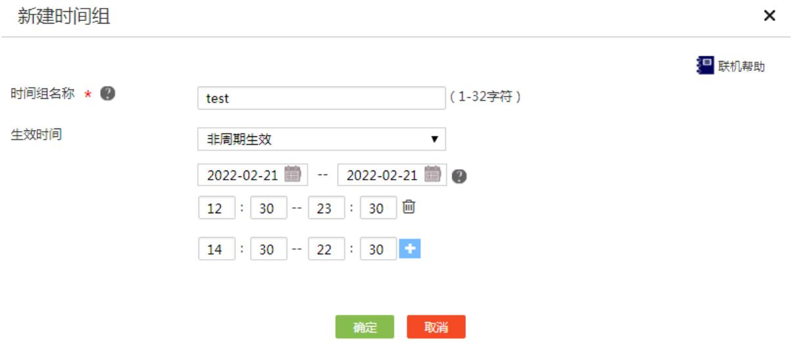

(5) 点击<确定>按钮，完成时间组创建。

# 1.2.5 修改时间组

# 1. 注意事项

如果您想将一个同时含有周期性生效时间段和非周期生效时间段的时间组，修改成一个只含有一种生效方式的时间组，请按照如下配置步骤操作。

# 2. 配置步骤

(1) 单击导航树中[上网行为管理/时间组]菜单项，进入时间组配置页面。  
(2) 在指定时间组的“操作”区段上，点击<编辑>按钮，进入修改时间组页面。  
(3) 在“生效时间”配置项处，选择想删除的生效方式：“周期性生效”或“非周期生效”。  
(4) 依次点击具体生效时间后面的<删除>按钮，删除所有的具体生效时间。  
(5) 点击<确定>按钮，完成时间组的修改。

图1-7 修改时间组  

# 1.3 带宽管理

# 1.3.1 简介

带宽管理功能用于对流量进行限速，用户可基于用户组和时间段等限制条件对流量进行精细控制。对于需要保证时延的交互性应用流量，可通过启用绿色专用通道功能来保证带宽。

# 1.3.2 配置带宽限速

# 1. 配置步骤

(1) 单击导航树中[上网行为管理/带宽管理]菜单项，进入带宽管理配置页面。

图1-8 带宽限速  

(2) 在“带宽限速”页签下，点击<添加>按钮，进入新建带宽策略页面。 在“应用接口”配置项处，选择接口，设备将基于该接口进行带宽管理。

 在“用户范围”配置项处，选择用户组，设备将仅对该用户组内的成员进行带宽管理。  
 在“流量限制”配置项处，分别配置上传带宽、下载带宽和流量分配方式。若不配置上传或下载中任意一个方向的带宽值，则表示不对该方向的带宽进行限速。

流量分配方式包括如下类型：

− 共享式：分配的带宽为总带宽，由所有用户平均分配。  
− 独占式：分配的带宽为单用户的带宽，由单用户独享。

 在“限制时段”配置项处，选择时间组。

(3) 点击<确定>按钮，完成新建带宽策略。

图1-9 新建带宽策略  
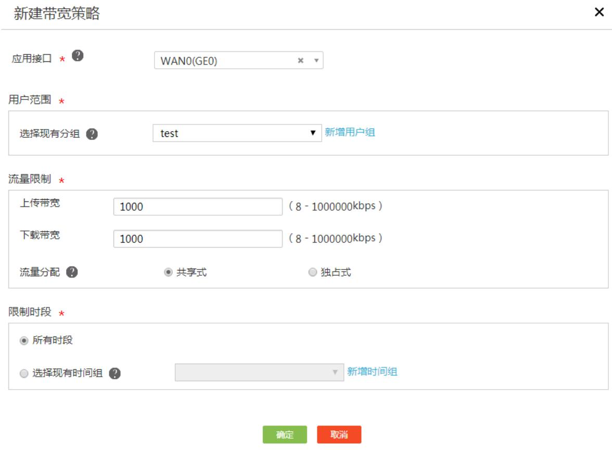

# 1.3.3 配置绿色通道

# 1. 注意事项

请勿将绿色通道带宽设置过大，以免对普通流量产生影响。

# 2. 配置步骤

(1) 单击导航树中[上网行为管理/带宽管理]菜单项，进入带宽管理配置页面。  
(2) 单击“绿色通道”页签，进入绿色通道配置页面。  
(3) 勾选“启用绿色专用通道”复选框，开启带宽管理的绿色通道功能。

(4) 对于需要保证时延的交互性应用流量，需要用户根据实际情况自行配置应用的协议和端口号。只有匹配应用的流量才能进入绿色通道传输，具体配置步骤如下：

 勾选“自定义应用端口匹配绿色通道”复选框，点击自定义应用端口配置项右侧的<添加>按钮，进入新建界面，配置应用名称、应用协议和端口号。  
 点击<确定>按钮，完成新建自定义应用。

(5) 配置绿色通道中需要传输的应用后，还可以针对通道中所有应用进行如下限制：

 如果希望对所有WAN口绿色通道中的流速上限配置相同限速值，则需要勾选“保障绿色通道流速上限”复选框，并配置每接口上行流速或每接口下行流速。  
 如果希望对不同WAN口绿色通道中的流速上限配置不同限速值，则需要取消“保障绿色通道流速上限”复选框的勾选，并按需配置各线路（对应各WAN口）的上下行带宽。  
 如果希望对绿色通道中传输的数据包长度进行限制，则需要勾选“匹配绿色通道数据包长度选择”复选框，并配置数据包的最大长度。超过最大长度的数据包不会进入绿色通道传输。

(6) 点击<应用>按钮，完成绿色通道的配置。

图1-10 绿色通道  
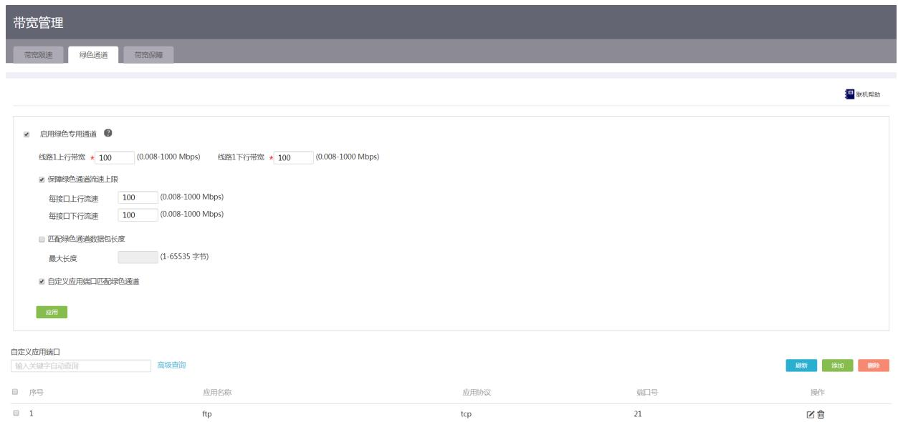

# 1.3.4 配置带宽保障

# 1. 注意事项

只有设置了出口带宽的接口，配置的带宽保障策略才能生效。

一个接口只允许绑定一个策略；一个策略下可绑定多个匹配规则；一个匹配规则可添加多个匹配条件，其保证速率是确保符合当前匹配条件的所有用户能够使用到的总速率。

# 2. 配置步骤

(1) 单击导航树中[上网行为管理/带宽管理]菜单项，进入带宽管理配置页面。  
(2) 单击“带宽保障”页签，进入带宽保障配置页面。  
(3) 设置接口的出口带宽，具体配置步骤如下：

 在接口对应的“出口带宽”配置处，输入该接口实际运营商提供的链路带宽。  
 点击<应用>按钮。

图1-11 带宽保障  
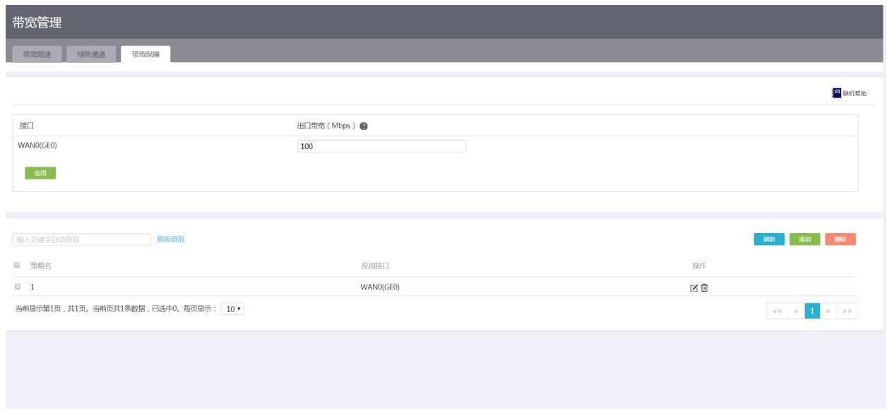

(4) 设置接口的带宽保障策略，具体配置步骤如下：

 点击<添加>按钮，弹出新建带宽保障策略对话框。  
 在“策略名”配置处，输入带宽保障策略的名称。  
 在“应用接口”配置处，选择带宽保障策略应用的接口。

图1-12 新建带宽保障策略  
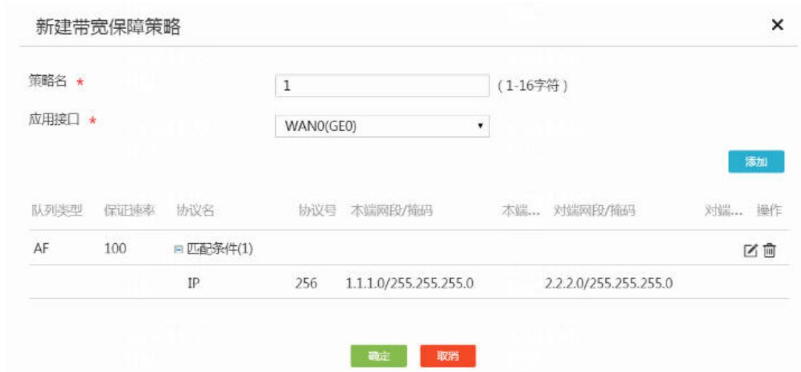

 点击<添加>按钮，弹出新建匹配规则对话框。  
 在“队列类型”配置处，选择匹配规则的队列调度机制。EF（快速转发）的转发优先级高于AF（确保转发）的转发优先级。

 在“保证速率”配置处，输入确保符合当前匹配条件的所有用户能够使用到的总速率。  
 配置规则的匹配条件：输入协议名或者协议号，设置本端网段或者掩码、本端端口、对端网段或者掩码和对端端口后，点击<+>图标，完成匹配条件的增加。  
 点击<确定>按钮，完成匹配规则的新建。

(5) 返回新建带宽保障策略对话框，点击<确定>按钮，完成带宽保障策略的新建。

图1-13 新建匹配规则  
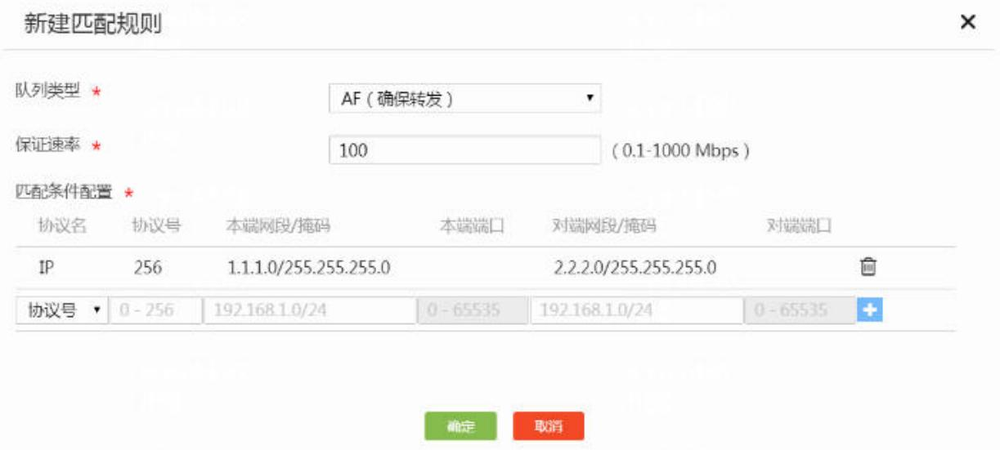

# 1.4 上网行为管理

# 1.4.1 简介

上网行为管理功能用于对用户访问的应用以及网址进行控制，并可基于用户组和时间段等限制条件对用户的上网行为进行更精细的控制。

# 1.4.2 配置全局控制

# 1. 配置需求

当用户需要使配置的上网行为管理策略和网址过滤功能生效时，需要在全局控制页面中开启上网行为管理功能。

# 2. 配置步骤

(1) 单击导航树中[上网行为管理/上网行为管理]菜单项，进入上网行为管理配置页面。  
(2) 在“全局控制”页签下，点击<开启上网行为管理>按钮。  
(3) 单击<应用>按钮，使配置生效。

图1-14 全局控制  

# 1.4.3 配置上网行为管理策略

# 1. 注意事项

因为网址过滤功能基于HTTP协议，所以应用控制功能中不能将HTTP协议阻断，否则将影响设备对网址的识别，导致网址过滤功能不生效。

# 2. 配置步骤

(1) 单击导航树中[上网行为管理/上网行为管理]菜单项，进入上网行为管理配置页面。

图1-15 上网行为管理策略  

(2) 在“上网行为管理策略”页签下，点击<添加>按钮，进入新建上网行为管理策略页面。

 在“策略名”配置项处，配置上网行为管理策略名。  
 在“用户范围”配置项处，选择用户组。  
 在“限制时段”配置项处，选择时间组。  
 在“网址控制”配置项处，进行如下配置：

− 选择网址分类：包括预定义和自定义网址分类，自定义网址分类的配置步骤请参见“配置自定义网址分类”。

− 选择协议类型：支持对HTTP和HTTPS协议类型进行网址控制。缺省情况下，已选择HTTP 协议。配置网址控制动作：对所选的网址分类执行的动作，包括放行、阻断和记录。配置以上任何一个动作时，也可同时配置记录动作，对放行和阻断行为进行记录。

 在“应用控制”配置项处，点击“选择网络应用”右侧的<详情>按钮，选择应用，并配置对该应用的访问执行的动作，包括如下：

− 阻断：阻断对应用的访问。  
− 不阻断不限速：不对应用的访问进行限制。

− 限速：对应用的访问进行限速，并通过点击右侧的<编辑>按钮，分别配置上下行最大带宽。

(3) 点击<确定>按钮，完成新建上网行为管理策略。  
(4) 在上网行为管理页面，选择“全局控制”页签，点击<开启上网行为管理>按钮，使新建的上网行为管理策略生效。

图1-16 新建上网行为管理策略

# 新建上网行为管理策略

确定

取消

# 1.4.4 配置网址黑/白名单

# 1. 配置需求

当用户需要对指定的网址进行放行或阻断时，可通过开启Web白名单或黑名单实现。

# 2. 配置步骤

(1) 单击导航树中[上网行为管理/上网行为管理]菜单项，进入上网行为管理配置页面。  
(2) 在“网址黑白名单”页签下，点击<启用web黑名单>或<启用 web白名单>按钮。  
(3) 选择支持的协议类型，包括HTTP和HTTPS。缺省情况下，已选择HTTP协议。  
(4) 在网址关键字配置项中，输入网址。  
(5) 点击右侧的<+>按钮，逐一添加网址。  
(6) 点击<应用>按钮，完成web黑名单或白名单的配置。

图1-17 网址黑白名单  
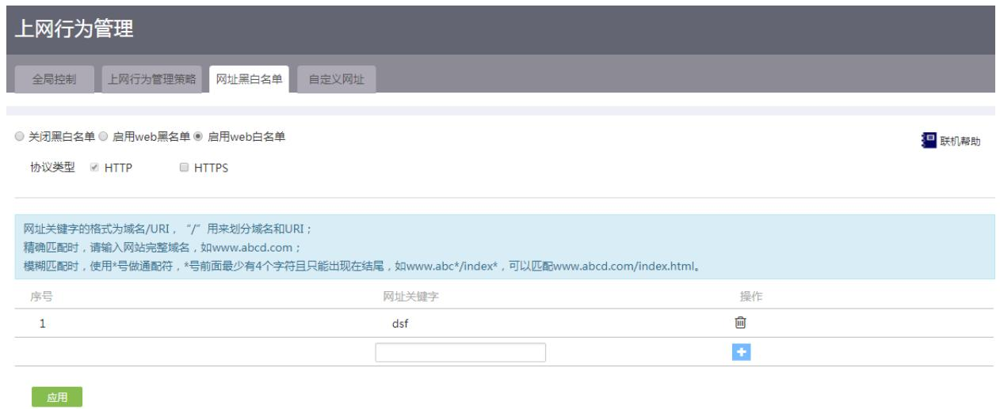

# 1.4.5 配置自定义网址分类

# 1. 配置需求

当设备已有的网址分类不能满足用户需求时，可通过自定义网址分类的方式按需添加网址。

# 2. 注意事项

自定义网址支持导出功能，当使用IE浏览器进行导出时，如果出现无法启动Excel的错误提示，请参考如下步骤修改浏览器配置：

单击浏览器的<工具>按钮，选择“Internet选项”，进入Internet选项窗口；选择“安全”页签，点击<自定义级别>按钮，找到“对未标记为可安全执行脚本的ActiveX 控件初始化并执行脚本”一项，选择“启用”。

# 3. 配置步骤

(1) 单击导航树中[上网行为管理/上网行为管理]菜单项，进入上网行为管理配置页面。

图1-18 自定义网址  

(2) 在“自定义网址”页签下，新建网址分类。  
(3) 在默认网址分类下方的输入框中，配置新建网址分类的名称，点击右侧<+>按钮，新建一个空的网址分类成功，点击<编辑>按钮，进入设置网址关键字页面，向新建的网址分类中添加网址。  
(4) 在“网址关键字”输入框中，配置网址，点击右侧的<+>按钮，逐条添加网址。  
(5) 添加网址后，点击<确定>按钮，完成新建自定义网址分类。

图1-19 设置网址关键字  

# 1.5 特征库管理

# 1.5.1 简介

特征库是用来对经过设备的应用层流量进行识别的资源库，包括应用特征库和网址特征库。管理员需要及时更新设备中的特征库，对用户的上网行为进行更好的管理。

设备提供如下升级方式：

本地升级：管理员先手工从设备的官方网站获取最新的特征库，再导入到设备中进行升级。  
在线升级：管理员触发在线升级功能后，设备自动从设备的官方网站获取最新的特征库文件，并自动导入设备中进行升级。

# 1.5.2 注意事项

更新特征库时，请确保License已正确安装，并处于生效状态。  
当系统内存处于告警门限状态时，请勿进行特征库更新，否则易导致设备特征库更新失败，进而影响上网行为管理功能的正常使用。

# 1.5.3 本地更新特征库

# 1. 配置步骤

(1) 单击导航树中[上网行为管理/特征库管理]菜单项，进入特征库管理页面。

图1-20 应用特征库  

(2) 在“应用特征库”或“网址特征库”页签下，点击<本地更新特征库>按钮，进入应用特征导入页面。  
(3) 点击<选择文件>按钮，选择特征库文件。  
(4) 点击<确定>按钮，完成本地更新特征库。

图1-21 网址特征库  

# 1.5.4 在线更新特征库

# 1. 注意事项

在线更新特征库时，需要确保设备能通过静态或动态域名解析方式获得官方网站的IP地址，并与之路由可达，否则设备更新特征库会失败。

# 2. 配置步骤

(1) 单击导航树中[上网行为管理/特征库管理]菜单项，进入特征库管理页面。  
(2) 在“应用特征库”或“网址特征库”页签下，点击<在线更新特征库>按钮，完成在线更新特征库。

# 1.6 审计日志

# 1.6.1 简介

审计日志用来查看上网行为管理功能的应用控制和网址控制产生的日志信息，方便管理员对用户的上网行为进行分析与审计。

# 1.6.2 配置应用审计日志

# 1. 配置步骤

(1) 单击导航树中[上网行为管理/审计日志]菜单项，进入审计日志页面。  
(2) 在“应用审计日志”页签下，点击<开启日志>按钮，开启日志审计功能。  
(3) 设置完成后，管理员可在应用审计日志页面查看应用控制产生的日志信息，可单击<导出 Excel>按钮，导出应用审计日志。

图1-22 应用审计日志  
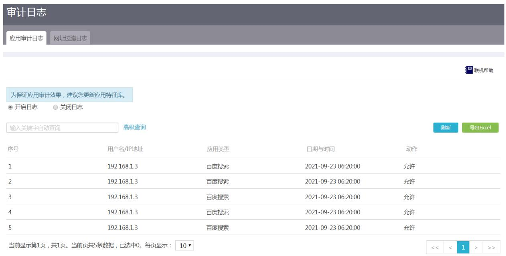

# 1.6.3 配置网址过滤日志

# 1. 配置步骤

(1) 单击导航树中[上网行为管理/审计日志]菜单项，进入审计日志页面。  
(2) 应用审计日志”页签下，点击<开启日志>按钮，开启日志审计功能。  
(3) 单击“网址过滤日志”页签，进入网址过滤日志页面。  
(4) 管理员可在网址过滤日志页面查看网址控制产生的日志信息，可单击<导出Excel>按钮，导出网址过滤日志。

图1-23 网址过滤日志  
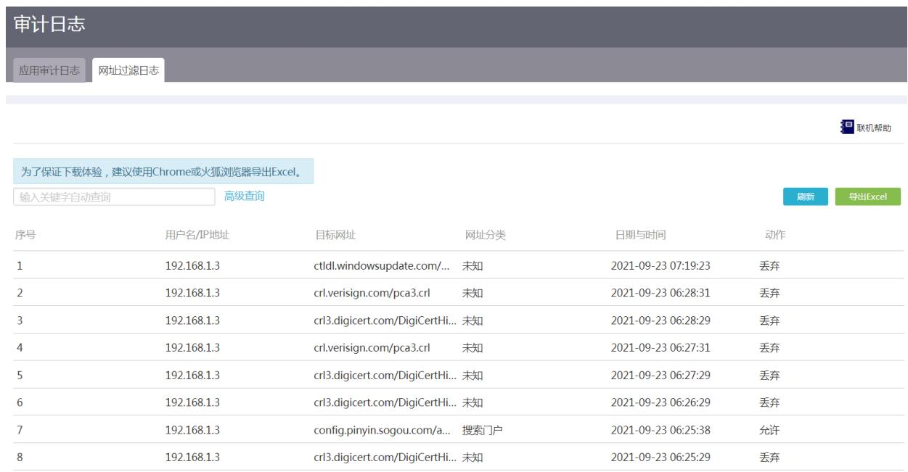

# 1.7 流量排行

# 1.7.1 简介

全局控制页面可以对用户的流量排行和应用流量排行进行开启和关闭的操作。

如果开启用户流量排行，在用户流量排行界面可查看到用户流量数据。  
如果开启应用流量排行，在应用流量排行界面可查看到应用流量数据。

# 1.7.2 配置全局控制

# 1. 注意事项

(1) 增加 LAN 接口时，需要单独开启该接口的用户流量排行。  
(2) 如果接口下存在 Portal 配置，则在全局控制界面不显示该接口名称。删除该接口的 Portal 配置后可在全局控制页面显示该接口。

# 2. 配置步骤

(1) 单击导航树中[上网行为管理/流量排行]菜单项，进入流量排行配置页面。  
(2) 在“全局控制”页面，点击应用流量排行后的<开启>按钮可开启应用流量排行功能；反之，点击<关闭> 按钮可关闭应用流量排行功能。  
(3) 在接口列表中可通过点击单个接口后的<开启>按钮，开启该接口上静态 IP 用户和 DHCP 用户的流量排行功能，也可以选中多个接口，然后点击右上角的<批量开启>按钮同时开启所有选中接口上静态IP用户和 DHCP用户的流量排行功能。反之，可关闭相应接口上静态IP用户和DHCP用户的流量排行功能。

(4) 点击操作栏下的<编辑>按钮，进入“添加内网网段”页面。系统仅对内网网段中的 IP 地址进行流量统计和排行。系统默认配置的内网网段为直连网段，为保证网络连通性，请务必正确配置内网网段，若内网网段变化，请及时修改。

 “接口名称”，表示当前是基于哪个接口进行修改操作，不允许修改接口名称。  
 配置添加到内网网段的单个IP地址。  
 配置添加到内网网段的IP地址段的起始IP地址及结束IP地址。

(5) 点击配置项右侧的<→→>按钮，提交配置的内网网段内容。

(6) 点击<确定>按钮，完成内网网段添加。

图1-24 全局控制  
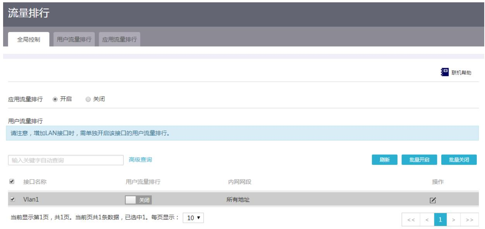

# 1.7.3 配置用户流量排行

# 1. 注意事项

认证用户的用户流量排行功能默认固定开启，无需用户操作。如需查看非认证用户的用户流量排行功能，需先在“全局控制”页面开启相应接口上的用户流量排行功能。

# 2. 配置步骤

(1) 单击导航树中[上网行为管理/流量排行]菜单项，进入流量排行页面。  
(2) 单击“用户流量排行”页签，进入用户流量排行页面。  
(3) 单击操作栏下的<限速>按钮，进入终端限速页面。  
(4) 进入终端限速界面后，在下拉框中选择需要应用的接口，配置上传带宽和下载带宽。  
(5) 点击<确定>按钮，完成终端限速设置。  
(6) 单击操作栏下的<详情>按钮，进入详情页面。在该页面可查看到用户流量等相关信息。

图1-25 用户流量排行  
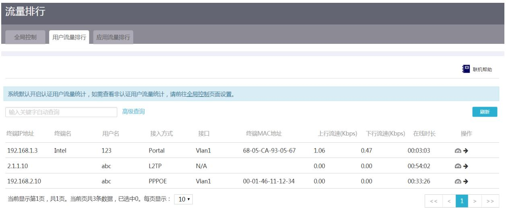

# 1.7.4 配置应用流量排行

# 1. 注意事项

配置应用流量排行前需要先在“全局控制”页面开启应用流量排行功能。

# 2. 配置步骤

(1) 单击导航树中[上网行为管理/流量排行]菜单项，进入流量排行页面。  
(2) 单击“应用流量排行”页签，进入应用流量排行页面。  
(3) 单击操作栏下的<详情>按钮，进入详情页面。在该页面可查看到应用流量等相关信息。

图1-26 应用流量排行  
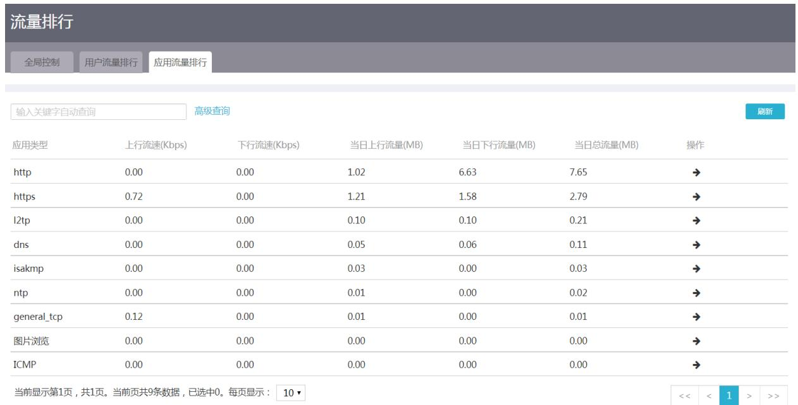

# 1 网络安全

# 1.1 防火墙

# 1. 简介

防火墙功能是通过一系列的安全规则匹配网络中的报文，并执行相应的动作，从而达到阻断非法报文传输、正常转发合法报文的目的，为用户的网络提供一道安全屏障。

# 2. 注意事项

当报文匹配到一个防火墙安全规则后，则不会继续向下匹配，所以请合理安排安全规则的优先级，避免报文匹配错误的规则而导致执行相反动作。

# 3. 配置准备

请提前完成外网配置页面的相关配置，才可创建防火墙安全规则。  
• 若需指定防火墙安全规则的生效时间，请提前在时间组页面创建相应的时间组。

# 4. 配置步骤

(1) 单击导航树中[网络安全/防火墙]菜单项，进入防火墙配置页面。

图1-1 防火墙安全规则  
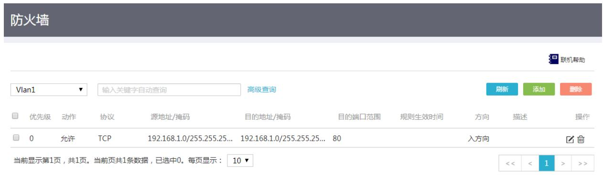

(2) 点击<添加>按钮，进入创建安全规则页面。  
(3) 在“接口”配置项处，选择应用的接口，该规则将对指定接口接收到的报文进行匹配。  
(4) 在“协议”配置项处，选择该规则所匹配报文的协议类型。若需匹配某传输层协议的报文，则选择“TCP”或“UDP”；若需匹配 Ping、Tracert等 ICMP协议报文，则选择“ICMP”；若需匹配所有协议报文，则选择“所有协议”。  
(5) 在“源IP地址/掩码”配置项处，配置该规则所匹配报文发送端的IP地址及掩码，输入“any”则代表匹配所有源IP地址。  
(6) 在“目的 IP 地址/掩码”配置项处，配置该规则所匹配报文接收端的 IP 地址及掩码，输入“any”则代表匹配所有目的IP地址。  
(7) 在“目的端口”配置项处，配置该规则所匹配报文的目的端口号，例如HTTP协议报文的目的端口号为80。  
(8) 在“规则生效时间”配置项处，选择该规则生效时间对应的时间组。

(9) 在“动作”配置项处，选择该规则所匹配报文的执行动作。  
(10) 在“优先级”配置项处，选择该规则的优先级类型。

 自动：系统自动为该规则分配优先级，即根据规则的配置顺序以5为步长进行依次分配。  
 自定义：用户自定义规则的优先级，数值越小则优先级越高。

(11) 在“描述”配置项处，配置该安全规则的描述信息。  
(12) 点击<确定>按钮，完成创建安全规则。

图1-2 创建安全规则  
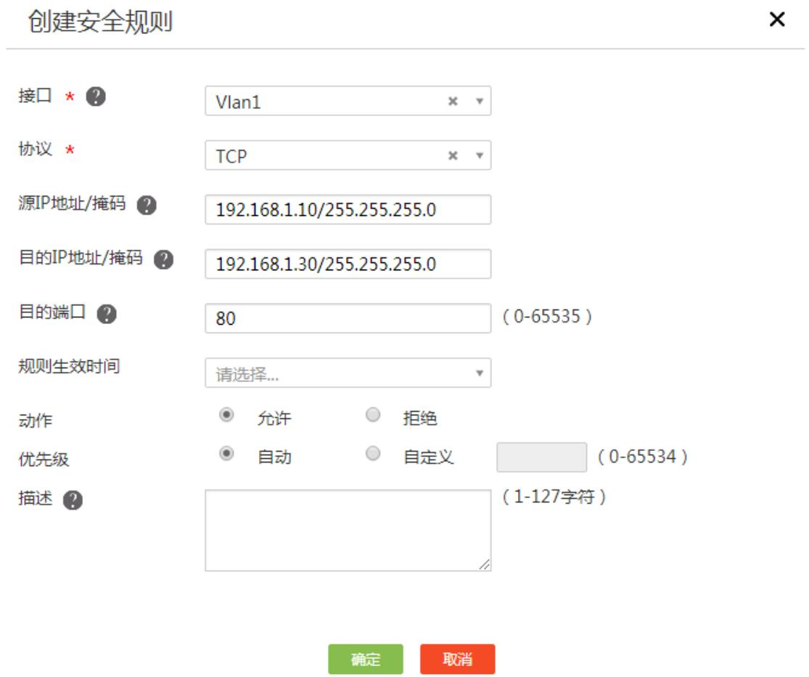

# 1.2 DDoS攻击防御

# 1.2.1 简介

DDoS攻击是一类广泛存在于互联网中的攻击，能造成比传统DoS攻击（拒绝服务攻击）更大的危害。配置本功能能让您的设备和网络免受如下DDoS攻击的困扰：

单包攻击：攻击者利用畸形报文发起攻击，旨在瘫痪目标系统。例如Land攻击报文是源IP和目的IP均为攻击目标IP的TCP报文，此攻击将耗尽目标服务器的连接资源，使其无法处理正常业务。  
异常流攻击

 扫描攻击：攻击者对主机地址和端口进行扫描，探测目标网络拓扑以及开放的服务端口，为进一步侵入目标系统做准备。  
 泛洪攻击：攻击者向目标系统发送大量伪造请求，导致目标系统疲于应对无用信息，从而无法为合法用户提供正常服务。

设备可防御的DDoS攻击包括：

单包攻击：Fraggle 攻击、Land 攻击、WinNuke 攻击、TCP Flag 攻击、ICMP 不可达报文攻击、ICMP重定向报文攻击、Smurf攻击、带源路由选项的IP报文攻击、带路由记录选项的IP报文攻击和超大ICMP报文攻击。  
异常流攻击：扫描攻击、SYN flood 攻击、UDP flood 攻击和 ICMP flood 攻击。

# 1.2.2 攻击防御

# 1. 配置步骤

(1) 单击导航树中[网络安全/DDoS 攻击防御]菜单项，进入 DDoS 攻击防御配置页面。  
(2) 单击“攻击防御”页签，进入攻击防御配置页面。

图1-3 攻击防御   
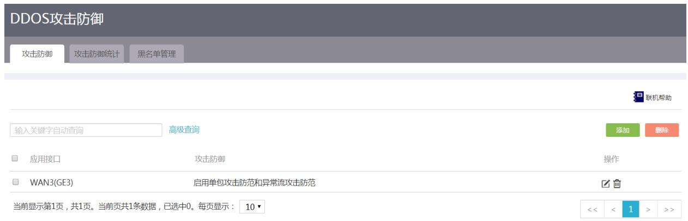

(3) 点击<添加>按钮，进入新建攻击防御页面。

 在“应用接口”配置项处，选择应用该DDoS攻击防御策略的接口。  
 在“单包攻击防御”配置项处，选择需要开启防御的单包攻击类型。

建议您开启全部单包攻击防御。

 在“异常流攻击防御”配置项处，选择需要开启防御的异常流攻击类型。

− 启动扫描攻击防御后，可选择将源IP地址加入黑名单。在一定时间内，来自扫描攻击源的报文将被设备直接丢弃。被加入黑名单的IP地址可在黑名单管理页面查看。  
− 建议您根据网络流量类型开启对应的泛洪攻击防御。

(4) 点击<确定>按钮，完成配置。

图1-4 新建攻击防御

# 新建攻击防御

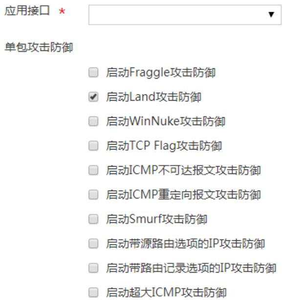

异常流攻击防御

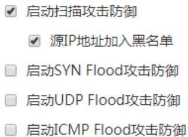

取消

# 1.2.3 攻击防御统计

# 1. 简介

攻击防御统计功能是用来查看设备受到DDoS攻击的详情，包括攻击类型、总次数、最后发生时间、被攻击的接口/安全域，以及发生的用户IP。

# 2. 配置步骤

(1) 单击导航树中[网络安全/DDoS攻击防御]菜单项，进入DDoS攻击防御配置页面。  
(2) 单击“攻击防御统计”页签，进入攻击防御统计页面。  
(3) 点击<单包攻击防御>按钮，查看单包攻击的相关统计信息。  
(4) 点击<异常流量攻击防御>按钮，查看异常流量攻击的相关统计信息。  
(5) 点击<导出Excel>按钮，可将相关统计信息以Excel文件的形式导出。

图1-5 攻击防御统计  
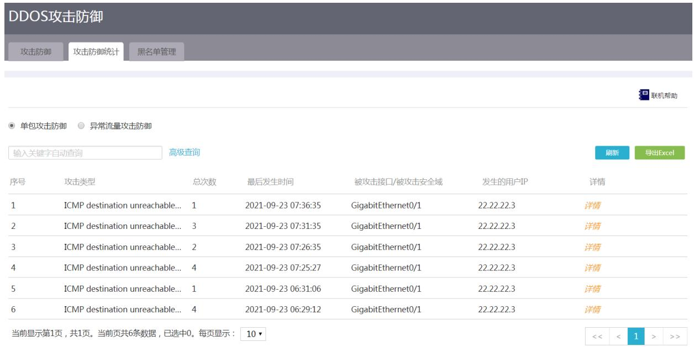

# 1.2.4 黑名单管理

# 1. 简介

启动扫描攻击防御后，可选择将源IP地址加入黑名单。在一定时间内，来自扫描攻击源的报文将被设备直接丢弃。

被加入黑名单的用户可在黑名单管理页面查看，该页面用来记录黑名单相关信息，包括黑名单用户、MAC地址、类型和动作。

# 2. 配置步骤

(1) 单击导航树中[网络安全/DDoS攻击防御]菜单项，进入DDoS攻击防御配置页面。  
(2) 单击“黑名单管理”页签，进入黑名单管理页面。  
(3) 在列表中点击黑名单用户对应的动作列图标，可将用户从黑名单中删除。

# 黑名单管理

请输入关键字自动查询

<table><tr><td>黑名单用户 ▲</td><td>MAC地址 ▲</td><td>类型 ▲</td><td>动作 ▲</td></tr><tr><td>6.1.1.9</td><td>00-10-94-00-00-02</td><td>动态黑名单</td><td>解除</td></tr><tr><td>6.1.1.18</td><td>00-10-94-00-00-02</td><td>动态黑名单</td><td>解除</td></tr><tr><td>6.1.1.16</td><td>00-10-94-00-00-02</td><td>动态黑名单</td><td>解除</td></tr><tr><td>6.1.1.12</td><td>00-10-94-00-00-02</td><td>动态黑名单</td><td>解除</td></tr><tr><td>6.1.1.14</td><td>00-10-94-00-00-02</td><td>动态黑名单</td><td>解除</td></tr><tr><td>6.1.1.13</td><td>00-10-94-00-00-02</td><td>动态黑名单</td><td>解除</td></tr><tr><td>6.1.1.2</td><td>00-10-94-00-00-02</td><td>动态黑名单</td><td>解除</td></tr><tr><td>6.1.1.6</td><td>00-10-94-00-00-02</td><td>动态黑名单</td><td>解除</td></tr><tr><td>6.1.1.8</td><td>00-10-94-00-00-02</td><td>动态黑名单</td><td>解除</td></tr><tr><td>6.1.1.20</td><td>00-10-94-00-00-02</td><td>动态黑名单</td><td>解除</td></tr></table>

当前显示第1页，共2页。当前页共10条数据，已选中0。每页显示：10·

# 1.3 连接限制

# 1.3.1 简介

连接限制功能是一种安全机制，通过限制每个IP地址主动发起连接的个数，达到合理分配设备处理资源、防范恶意连接的效果。

如果设备发现来自某 IP 地址的 TCP 或 UDP 连接数目超过指定的数目，将禁止该连接建立。直到该连接数低于限制数时，其才被允许新建连接。

设备支持配置如下两种连接限制：

网络连接限制：在指定IP地址范围内，配置每个IP地址发起连接的个数限制。此方式用于对设备上的所有接口收到的连接进行控制。  
VLAN网络连接限制：在指定VLAN接口上，配置每个IP地址发起连接的个数限制。此方式用于对指定VLAN接口收到的连接进行控制。

# 1.3.2 配置网络连接限制数

(1) 单击导航树中[网络安全/连接限制]菜单项，进入连接限制配置页面。  
(2) 单击“网络连接限制数”页签。  
(3) 勾选“开启网络连接限制数”选项，进入网络连接限制数配置页面。

图1-6 网络连接限制数规则  
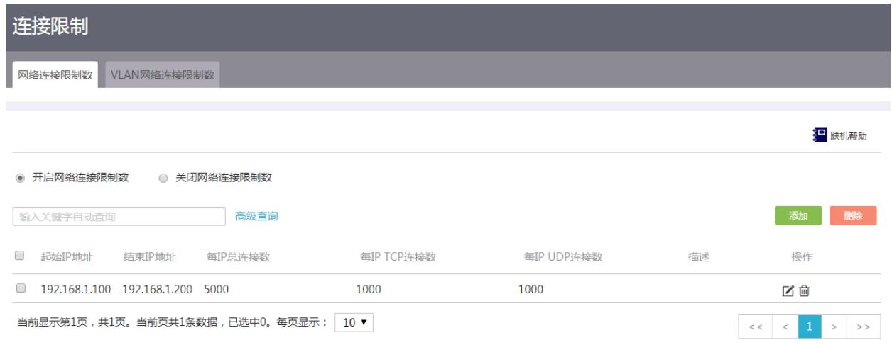

(4) 点击<添加>按钮，进入新建网络连接限制数规则页面。  
(5) 在“起始IP地址”配置项处，输入地址范围的起始IP地址。  
(6) 在“结束 IP 地址”配置项处，输入地址范围的结束 IP 地址。  
(7) 在“每IP总连接数上限”配置项处，输入每个IP地址所允许发起连接的总个数上限。相同源IP，源端口、目的IP、目的端口或报文协议不完全相同的连接均属于不同的连接。  
(8) 在“每 IP TCP 连接数上限”配置项处，输入每个 IP 地址所允许发起的 TCP 连接的个数上限。您可以在上面设置的总连接限制数下，对TCP连接数进行单独限制。  
(9) 在“每 IP UDP 连接数上限”配置项处，输入每个 IP 地址所允许发起的 UDP 连接的个数上限。您可以在上面设置的总连接限制数下，对UDP连接数进行单独限制。  
(10) 在“描述”配置项处，输入规则描述信息。  
(11) 点击<确定>按钮，完成配置。

图1-7 修改网络连接限制数规则  
修改网络连接限制数规则  

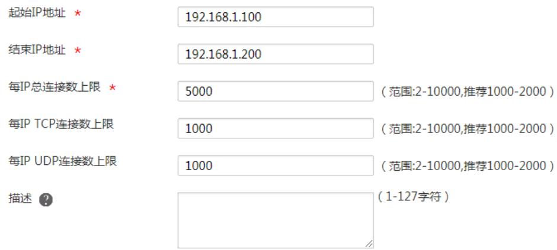

取消

# 1.3.3 配置 VLAN 网络连接限制数

(1) 单击导航树中[网络安全/连接限制]菜单项，进入连接限制配置页面。  
(2) 单击“VLAN网络连接限制数”页签。

图1-8 VLAN网络连接限制数  
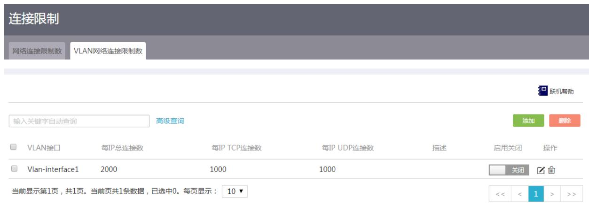

(3) 点击<添加>按钮，进入新建 VLAN 网络连接限制数规则页面。  
(4) 在“VLAN 接口”下拉菜单处，选择应用此规则的 VLAN 接口。  
(5) 选择“启动连接限制功能”选项。  
(6) 在“每 IP 总连接数上限”配置项处，输入每个 IP 地址所允许发起连接的总个数上限。相同源IP，源端口、目的IP、目的端口或报文协议不完全相同的连接均属于不同的连接。

(7) 在“每 IP TCP 连接数上限”配置项处，输入每个 IP 地址所允许发起的 TCP 连接的个数上限。您可以在上面设置的总连接限制数下，对TCP连接数进行单独限制。  
(8) 在“每 IP UDP 连接数上限”配置项处，输入每个 IP 地址所允许发起的 UDP 连接的个数上限。您可以在上面设置的总连接限制数下，对UDP连接数进行单独限制。  
(9) 在“描述”配置项处，输入规则描述信息。  
(10) 点击<确定>按钮，完成配置。

图1-9 新建VLAN网络连接限制数规则  
新建VLAN网络连接限制数规则  

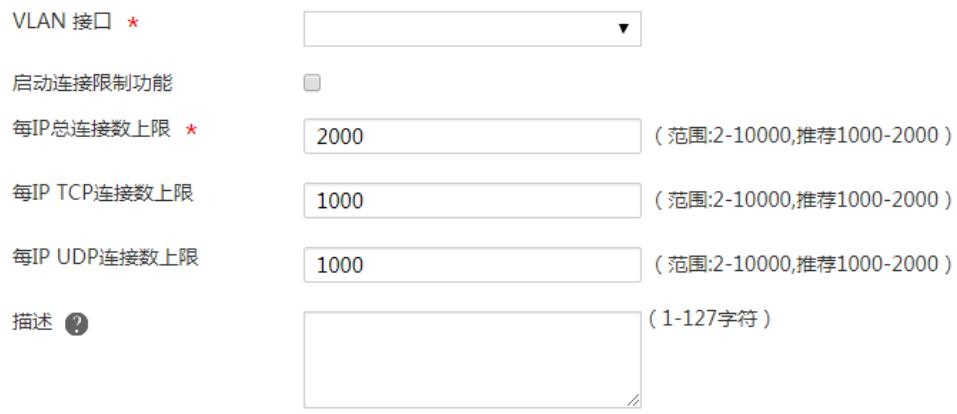

取消

# 1.4 MAC地址过滤

# 1.4.1 简介

如果您希望对某些设备发送过来的报文进行限制（允许或禁止其通过），则可以在三层接口上配置MAC地址过滤功能，本功能将根据接收报文的源MAC地址对其过滤。

配置方式有如下两种：

白名单：允许源MAC地址在白名单内的报文通过，其余禁止通过。  
黑名单：禁止源MAC地址在黑名单内的报文通过，其余允许通过。

# 1.4.2 MAC 过滤设置

# 1. 注意事项

如果您想在管理员终端连接的接口上开启MAC地址过滤功能，请先确保管理员的终端MAC地址已添加到白名单中或未添加到黑名单。

# 2. 配置步骤

(1) 单击导航树中[网络安全/MAC地址过滤]菜单项，进入MAC地址过滤配置页面。

(2) 单击“MAC 过滤设置”页签，进入 MAC 过滤设置页面。  
(3) 在指定接口的“过滤方式”区段上，选择“白名单”或“黑名单”，并在“开启和关闭”区段上勾选“开启”。  
(4) 点击<应用>按钮，开启 MAC 地址过滤。

图1-10 MAC 过滤设置  
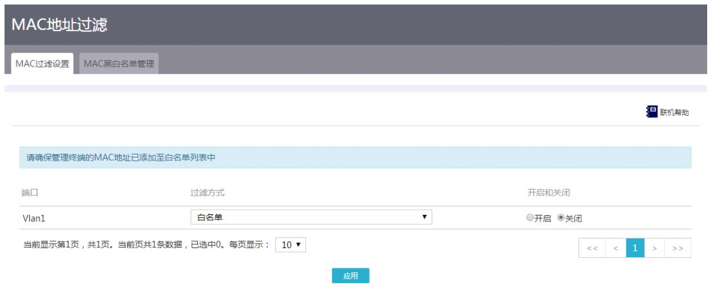

# 1.4.3 单个添加黑白名单

# 1. 注意事项

单个添加黑白名单的方法相同，下面以白名单为例介绍配置步骤。

# 2. 配置步骤

(1) 单击导航树中[网络安全/MAC地址过滤]菜单项，进入MAC地址过滤配置页面。  
(2) 单击“MAC黑白名单管理”页签，进入MAC黑白名单管理设置页面。  
(3) 单击“白名单”页签，进入白名单设置页面。

图1-11 MAC黑白名单管理  
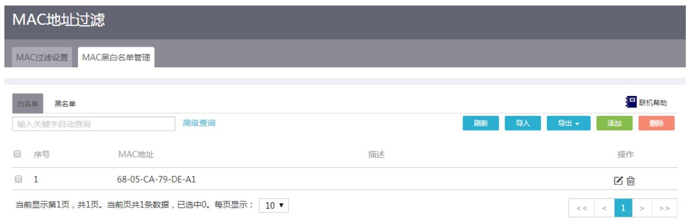

(4) 点击<添加>按钮，进入添加源 MAC 地址页面。  
(5) 输入待过滤的源 MAC 地址。

(6) 点击<确定>按钮，完成对白名单添加单个 MAC 地址的操作。

图1-12 添加源 MAC 地址

# 添加源MAC地址

68-05-CA-79-DE-A1

描述

取消

# 1.4.4 批量添加黑白名单

# 1. 注意事项

批量添加黑白名单的方法相同，下面以白名单为例介绍配置步骤。

# 2. 配置步骤

(1) 单击导航树中[网络安全/MAC 地址过滤]菜单项，进入 MAC 地址过滤配置页面。  
(2) 单击“MAC黑白名单管理”页签，进入MAC黑白名单管理设置页面。  
(3) 单击“白名单”页签，进入白名单设置页面。  
(4) 点击<导出>按钮，选择“导出模板”。  
(5) 打开下载好的模板，添加待过滤的源 MAC 地址并在本地保存。  
(6) 点击<导入>按钮，进入导入源 MAC 地址页面。  
(7) 点击<选择文件>按钮，选择已编辑好的模板。  
(8) 点击<确定>按钮，完成对白名单批量添加MAC地址的操作。

# 1.4.5 修改黑白名单

# 1. 注意事项

修改黑白名单的方法相同，下面以白名单为例介绍配置步骤。

# 2. 配置步骤

(1) 单击导航树中[网络安全/MAC地址过滤]菜单项，进入MAC地址过滤配置页面。  
(2) 单击“MAC黑白名单管理”页签，进入MAC黑白名单管理设置页面。  
(3) 单击“白名单”页签，进入白名单设置页面。  
(4) 点击 MAC 地址项的<编辑>图标，进入修改源 MAC 地址页面。  
(5) 添加新的 MAC 地址，并点击<确定>按钮，完成编辑修改。

图1-13 修改源 MAC 地址  

# 1.5 ARP攻击防御

# 1.5.1 简介

ARP协议本身存在缺陷，攻击者可以轻易地利用ARP协议的缺陷对其进行攻击。ARP攻击防御技术提供了多种ARP攻击防御技术对局域网中的ARP攻击和ARP病毒进行防范、检测和解决。

ARP攻击防御功能包括：

• 动态ARP表项学习：本功能支持开启和关闭接口的动态ARP表项学习功能，当执行关闭接口的动态ARP表项学习功能后，该接口无法再学习新的动态ARP表项，提高了安全性。当设备的某个接口已经学到了该接口下所有合法用户的ARP表项时，建议关闭动态ARP表项学习功能。  
• 动态ARP管理：包括动态ARP表项管理功能和ARP扫描、固化功能。ARP扫描、固化功能即对局域网内的用户进行自动扫描，并将生成的动态ARP表项固化为静态ARP表项。建议环境稳定的小型网络（如网吧）中配置本功能。先配置ARP扫描、固化功能，再关闭动态ARP表项学习功能，可以防止设备学习到错误的ARP表项。  
攻击防御管理：包括静态ARP表项管理功能和仅允许ARP静态表项对应的用户访问外网功能。先配置ARP扫描、固化功能，再配置仅允许ARP静态表项对应的用户访问外网功能，可以防止攻击用户访问外网。

# 1.5.2 动态 ARP 表项学习

(1) 单击导航树中[网络安全/ARP 攻击防御]菜单项，进入 ARP 攻击防御配置页面。  
(2) 单击“动态 ARP 表项学习”页签，进入动态 ARP 表项学习配置页面。  
(3) 在接口的“ARP学习”项，设置是否允许学习动态ARP表项：

 点击<开启>按钮，则该接口允许学习动态ARP表项；

 点击<关闭>按钮，则该接口不允许学习动态ARP表项。

图1-14 动态 ARP 表项学习  
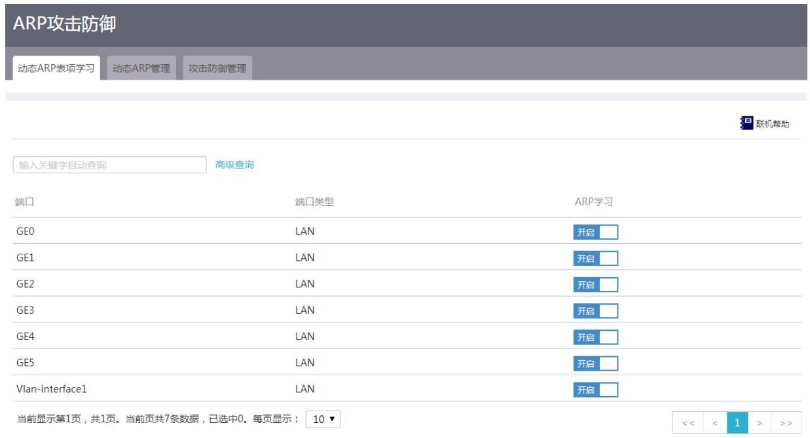

# 1.5.3 动态 ARP 管理

(1) 单击导航树中[网络安全/ARP攻击防御]菜单项，进入ARP攻击防御配置页面。  
(2) 单击“动态ARP管理”页签，进入动态ARP表项管理配置页面。  
(3) 可对已有的动态 ARP 表项执行以下管理操作：

 点击<刷新>按钮，则可以刷新当前动态ARP表项的显示信息。  
 点击<清除>按钮，则可以清除当前显示的所有动态ARP表项。  
 选择指定的动态ARP表项，点击<删除>按钮，再点击<确定>按钮后，可以删除对应的动态ARP表项。

图1-15 动态 ARP 管理  
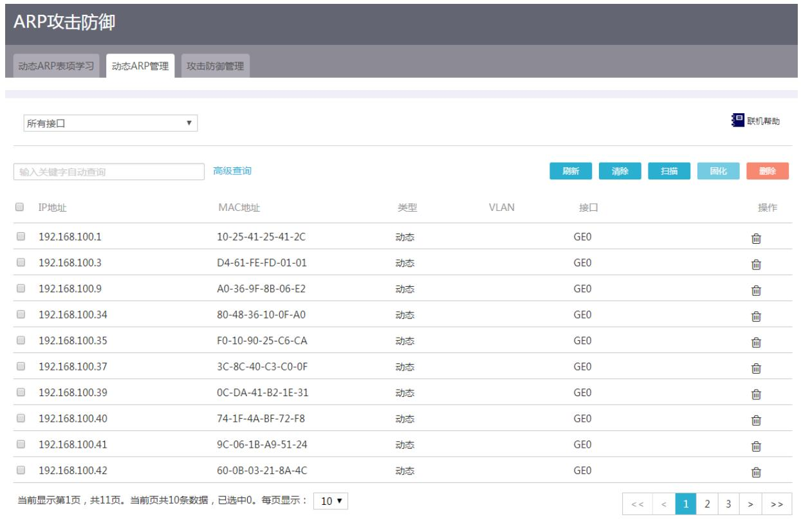

(4) 可对已有的动态 ARP 表项执行以下管理操作：

a. 点击<扫描>按钮，进入扫描配置页面。  
b. 在“接口”配置项处，选择需要执行ARP扫描操作的接口。  
c. 在“开始IP地址”和“结束IP地址”配置项处，设置ARP扫描操作的起止IP地址。此处指定起止IP地址需要和接口的IP地址处于同一网段。  
d. 选择“对已存在ARP表项的IP地址也进行扫描”后，ARP扫描功能会对开始IP地址和结束IP地址中的所有IP地址进行扫描，不会区分是否已存在ARP表项。  
e. 选择指定的动态ARP表项，再点击<固化>按钮，则可以将这些动态ARP表项固化为静态ARP 表项。

图1-16 扫描  

# 1.5.4 攻击防御管理

(1) 配置限制和指导

需要保证管理客户端的ARP表项是静态ARP表项，否则管理客户端可能无法工作。

# 2. 配置准备

如果需要执行批量添加静态 ARP 表项操作，还需要提前将记录静态 ARP 表项的文件保存在本地，然后再执行静态 ARP 表项的导入操作。建议通过 Web 页面导出一个 ARP 表项文件，在该文件中批量添加静态ARP表项后，再使用它进行导入操作。

# 3. 配置步骤

(1) 单击导航树中[网络安全/ARP攻击防御]菜单项，进入ARP攻击防御配置页面。  
(2) 单击“攻击防御管理”页签，进入攻击防御管理配置页面。  
(3) 选择“仅允许ARP静态绑定的客户访问外网”时，设备禁止学习动态ARP表项并删除已有的动态ARP表项（WAN接口的动态ARP表项不会被删除），动态ARP表项对应的用户无法访问设备和外网，只有静态 ARP表项对应的客户可以访问设备和外网。选择“不限制”，则静态ARP表项和动态ARP表项对应的客户都能访问设备和外网。  
(4) 可对静态ARP表项执行以下管理操作：

 点击<刷新>按钮，则可以刷新当前静态ARP表项的显示信息。  
 点击<导入>按钮，则可以批量导入静态ARP表项。  
 点击<导出>按钮，则可以批量导出静态ARP表项到文件中。

图1-17 攻击防御管理  
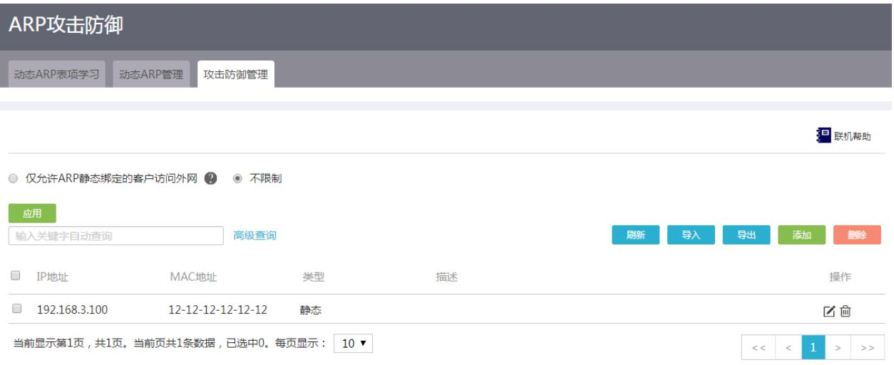

 点击<添加>按钮，进入“添加ARP表项”页面。在“添加ARP表项”页面，输入静态ARP表项的 IP地址和 MAC地址，点击“确定”按钮，静态ARP表项添加成功。  
 选择指定的静态ARP表项，点击<删除>按钮，再点击<确定>按钮后，可以删除对应的静态ARP表项。

图1-18 添加 ARP 表项  
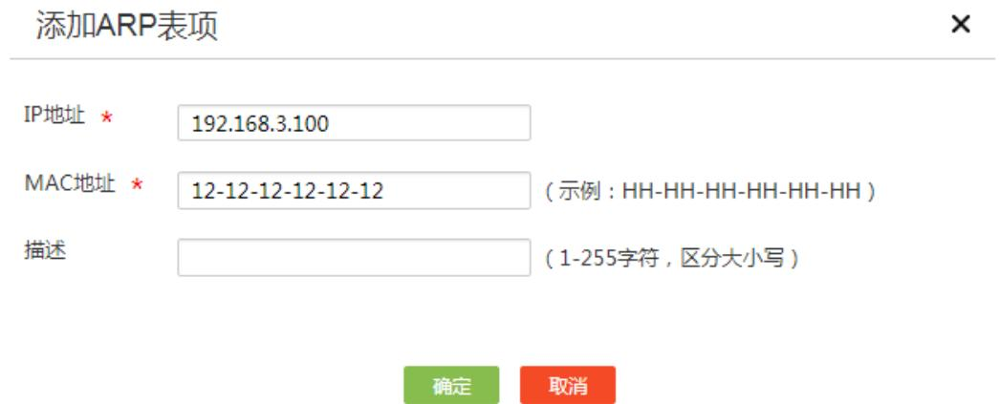

# 1 认证管理

# 1.1 Portal认证

# 1.1.1 简介

Portal 是互联网接入的一种认证方式，通过对用户进行身份认证，以达到对用户访问进行控制的目的。

Web网页认证应用场景下，用户无需安装客户端软件，直接通过Web页面接受用户输入的用户名和密码，设备对用户进行身份认证，用户通过Portal认证后，可以访问互联网资源。  
微信客户端认证应用场景下，用户关注微信公众号进行认证，在微信公众号中点击上网链接即可进行认证，用户通过Portal认证后，可以访问互联网资源。

您可以为不需要通过Portal认证即可访问网络资源的用户设置免认证规则，免认证规则的匹配项包括 MAC地址、IP地址或域名。

# 1.1.2 配置 Web 网页 Portal 认证页面信息

# 1. 配置准备

为设备连接Portal用户终端的接口配置IP地址。

将需要导入的背景图片文件保存到本地。该图片的分辨率为 1440×900，大小为 255K，名称为background-logon.jpg。

# 2. 配置步骤

(1) 单击导航树中[认证管理/Portal认证]菜单项，进入Portal认证配置页面。  
(2) 单击“认证设置”页签，进入认证设置页面。  
(3) 选择“Web 网页认证”。  
(4) 勾选“启用Web认证服务”，使用Portal认证功能，必须开启Web认证服务。  
 在“会话超时时间”配置项处，输入Portal会话的超时时间。  
如果用户在线时长超过该值，设备会强制该用户下线。  
 在“认证服务接口”配置项处，选择需要开启Portal功能的接口。  
该接口必须已配置IP地址。  
 在“认证页面语言”配置项处，选择“中文”或“英文”，配置认证页面语言。

(5) 根据实际需要，选择是否勾选“允许修改密码”，来配置是否允许修改Web认证用户的登录密码。

(6) 在“窗口标题”配置项处，输入窗口标题的内容，例如“欢迎登录Portal认证页面”。

(7) 在“窗口提示信息”配置项处，输入窗口提示信息，例如“XXX 公司”。

(8) 在“导入背景图片”配置项处，点击<选择文件>按钮，选择要导入的图片文件。

(9) 点击<确定>按钮，完成配置。

(10) 点击<预览>按钮，可以预览已配置完成的Portal认证页面。

图1-1 WEB网页认证设置  
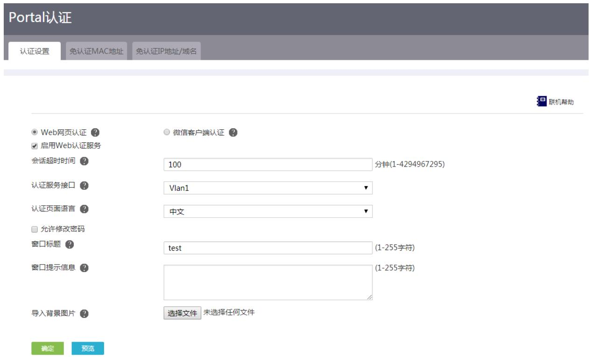

# 1.1.3 配置微信客户端Portal认证页面信息

# 1. 配置准备

为设备连接Portal用户终端的接口配置IP地址。

将需要导入的背景图片文件保存到本地。该图片的分辨率为 422×251，大小为 47K，名称为guanzhu.jpg。

# 2. 配置步骤

(1) 单击导航树中[认证管理/Portal认证]菜单项，进入Portal认证配置页面。  
(2) 单击“认证设置”页签，进入认证设置页面。  
(3) 选择“微信客户端认证”。  
(4) 勾选“启用 Web 认证服务”，使用 Portal 认证功能，必须开启 Web 认证服务。

 在“会话超时时间”配置项处，输入Portal会话的超时时间。

如果用户在线时长超过该值，设备会强制该用户下线。

 在“认证服务接口”配置项处，选择需要开启Portal功能的接口。

该接口必须已配置IP地址。

(5) 在“窗口标题”配置项处，输入窗口标题的内容，例如“欢迎登录 Portal 认证页面”。  
(6) 在“窗口提示信息”配置项处，输入窗口提示信息，例如“XXX 公司”。

在“导入背景图片”配置项处，点击<选择文件>按钮，选择要导入的图片文件。

(7) 在“微信DNS”配置项处，输入微信公众号上面设置的设备的域名。

输入设备的域名时，只能输入字母、数字、“-”、“\_”和“.”，且不能以“.”开头。

(8) 点击<确定>按钮，完成配置。  
(9) 点击<预览>按钮，可以预览已配置完成的 Portal 认证页面。

图1-2 微信客户端认证设置  
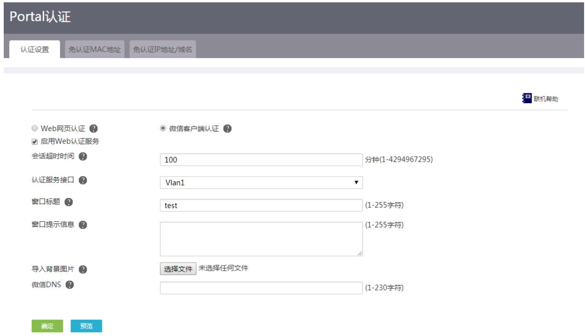

# 1.1.4 配置免认证 MAC 地址

(1) 单击导航树中[认证管理/Portal认证]菜单项，进入Portal认证配置页面。  
(2) 单击“免认证MAC地址”页签，进入免认证MAC地址配置页面。

图1-3 免认证 MAC地址  
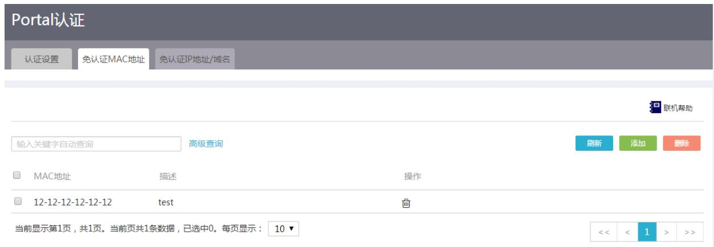

(3) 点击<添加>按钮，进入添加免认证 MAC 地址页面。  
(4) 在“MAC地址”配置项处，输入免认证MAC地址。  
(5) 在“描述”配置项处，输入与本配置相关的描述。

(6) 点击<确定>按钮，完成配置。

图1-4 添加免认证MAC地址  

# 1.1.5 配置免认证 IP 地址/域名

(1) 单击导航树中[认证管理/Portal认证]菜单项，进入Portal认证配置页面。  
(2) 单击“免认证 IP 地址/域名”页签，进入免认证 IP 地址/域名配置页面。

图1-5 免认证IP地址/域名  
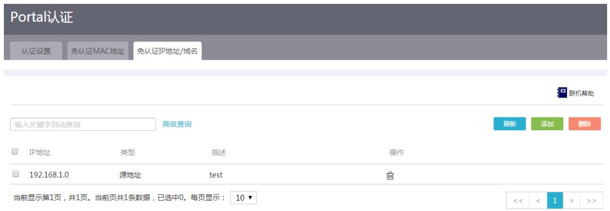

(3) 点击<添加>按钮，进入添加免认证地址页面。  
(4) 在“地址添加方式”配置项处，选择免认证地址的类型。

 选择“源地址”或“目的地址”，请继续在“IP地址”配置项处，输入免认证的IP地址及掩码。  
 选择“域名”，请继续在“域名”配置项处，输入域名。

(5) 在“描述”配置项处，输入与本配置相关的描述。  
(6) 点击<确定>按钮，完成配置。

图1-6 添加免认证地址  
添加免认证地址  

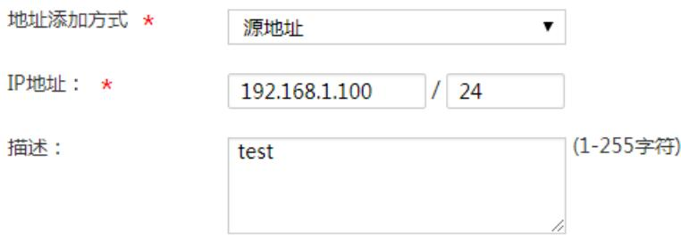

取消

# 1.2 PPPoE服务器

# 1. 简介

如果您希望对用户提供 PPPoE 宽带拨号服务，以实现对拨号用户的地址分配管理和认证管理，那么您可以通过配置PPPoE服务器来满足上述需求。

# 2. 注意事项

本节配置完成后，设备仅作为 PPPoE 服务器为拨号用户提供地址分配和认证管理服务。如果您希望为拨号用户提供上网服务，以便用户可以访问互联网，除完成本节配置外，还需要完成外网的设置。外网的具体设置步骤具体请参见[快速设置]或[网络设置/外网配置]菜单项中的配置。

# 3. 配置步骤

(1) 单击导航树中[认证管理/PPPoE服务器]菜单项，进入PPPoE服务器配置页面。

图1-7 PPPoE 服务器  
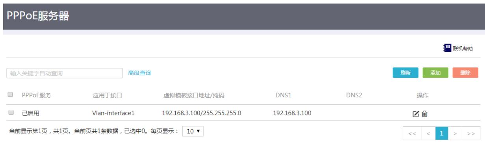

(2) 点击<添加>按钮，进入新建 PPPoE 服务器页面。  
(3) 在“应用于”配置项处，选择设备用于提供PPPoE拨号服务的接口。  
(4) 在“虚拟模板接口地址”配置项处，输入虚拟模板接口的IP地址，使PPPoE服务器具有为用户分配IP地址的能力。

(5) 在“子网掩码”配置项处，输入虚拟模板接口IP地址的子网掩码。  
(6) 在“用户地址池”配置项处，输入用于分配给PPPoE拨号用户的IP地址。  
(7) 在“DNS1”配置项处，输入用于分配给 PPPoE 拨号用户的主 DNS 服务器 IPv4 地址。  
(8) 在“DNS2”配置项处，输入用于分配给PPPoE拨号用户的从DNS服务器IPv4地址。  
(9) 在“当前服务器可接入的终端数”配置项处，输入允许拨号上网的最大用户数。  
(10) 点击<确定>按钮，启动 PPPoE 服务。

图1-8 添加 PPPoE 服务器  
新建PPPoE服务器  

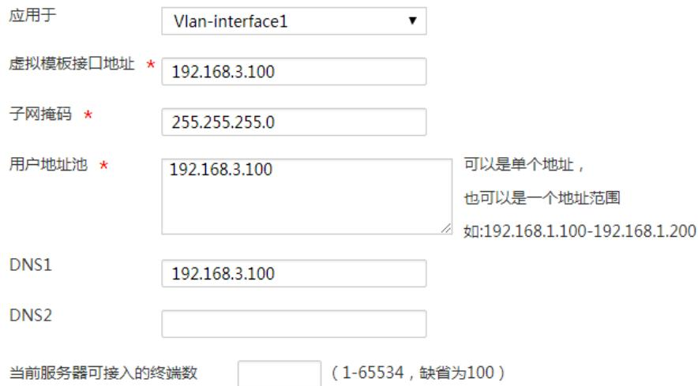  
提示：请在用户管理页面添加PPP服务类型的用户。

取消

# 1.3 用户管理

# 1.3.1 简介

如果您需要对通过设备访问外部网络的用户进行身份认证（例如Portal认证、PPPoE认证），则需要通过本功能配置相应的用户账户，来维护用户的身份信息和与其相关的网络服务信息（例如用户名、密码、可用的服务、有效期等）。通过身份认证的用户将可以获得访问外部网络的权限。

# 1.3.2 添加上网用户账户

# 1. 配置准备

如果待添加的用户账户需要与某个MAC地址绑定，请提前收集该客户端网卡的MAC地址。

# 2. 配置步骤

(1) 单击导航树中[认证管理/用户管理]菜单项，进入用户管理配置页面。  
(2) 单击“用户设置”页签，进入用户配置页面。

图1-9 用户设置  
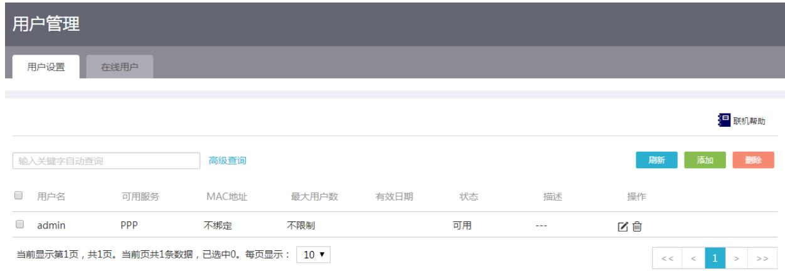

(3) 点击<添加>按钮，进入添加用户页面。  
(4) 在“用户名”配置项处，输入账户名称。  
(5) 在“状态”配置项处，选择“可用”或“禁用”。

 如果需要该账户在配置完成后立即生效，请选择“可用”。  
 如果暂时不需要该账户生效，请选择“禁用”。

(6) 在“密码”配置项处，输入用户密码。如果不设置用户密码，则该用户进行身份认证时，不需要提供密码。为提高用户帐户的安全性，建议您设置用户密码。  
(7) 在“可用服务”配置项处，选择该账户可使用的接入认证方式。  
(8) 在“MAC地址”配置项处，选择该账户是否需要与某个客户端的MAC地址绑定。

 如果选择“绑定“，请同时输入要绑定的MAC地址，MAC地址格式为xx-xx-xx-xx-xx-xx。例如，此处绑定MAC地址 00-e0-fc-00-58-29，用户进行身份认证时，设备会检查该用户客户端的MAC地址与此处绑定的MAC地址是否一致，如果不一致则用户认证失败。

 如果您不希望该账户仅能由指定MAC地址的客户端设备使用，请选择“不绑定”。

(9) 在“最大用户数”配置项处，输入允许同时使用该账户在线的用户数目。如果不设置该值，则表示不限制使用该账户在线的用户数。  
(10) 在“有效日期”配置项处，选择该账户的有效期。如果指定了有效期，则用户只能在有效期内使用账户进行认证。  
(11) 在“描述”配置项处，可输入相应的描述信息以便记忆和管理用户。  
(12) 点击<确定>按钮，完成配置。

图1-10 添加用户  
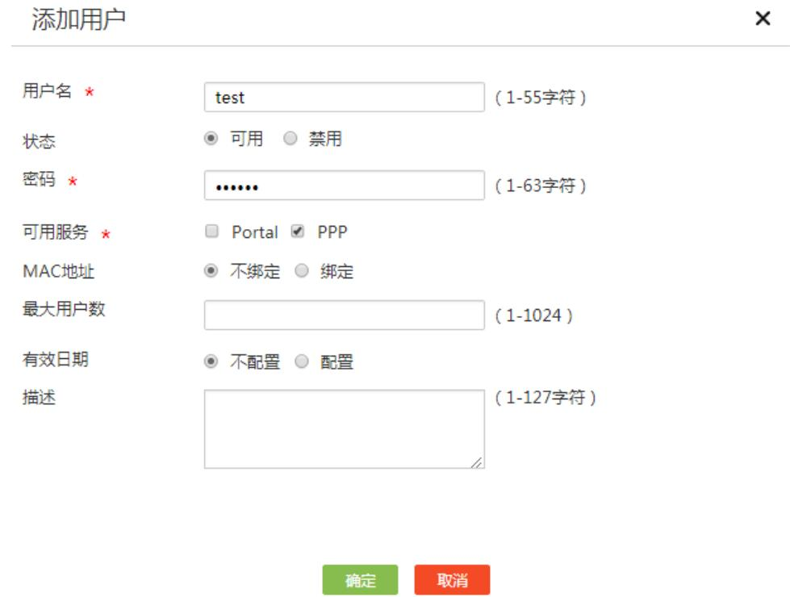

# 1.3.3 删除上网用户账户

# 1. 注意事项

删除用户账户并不会导致正在使用该账户的在线用户下线，仅会导致新用户无法使用该账户上线。

# 2. 配置步骤

(1) 单击导航树中[认证管理/用户管理]菜单项，进入用户管理配置页面。  
(2) 在用户行的“操作”区域，点击删除按钮，删除该用户账户。  
在弹出的“确认提示”对话框中，点击<是>按钮，完成删除操作。

图1-11 删除上网用户  

确定要删除选中的数据吗？

# 1.3.4 查看在线用户

# 1. 配置步骤

(1) 单击导航树中[认证管理/用户管理]菜单项，进入用户管理配置页面。  
(2) 单击“在线用户”页签，进入在线用户页面，即可查看在线用户列表。  
(3) 点击<高级查询>按钮，弹出高级查询对话框。可设定与用户相关的多个筛选条目，点击<查询>按钮，完成查询。

图1-12 高级查询  
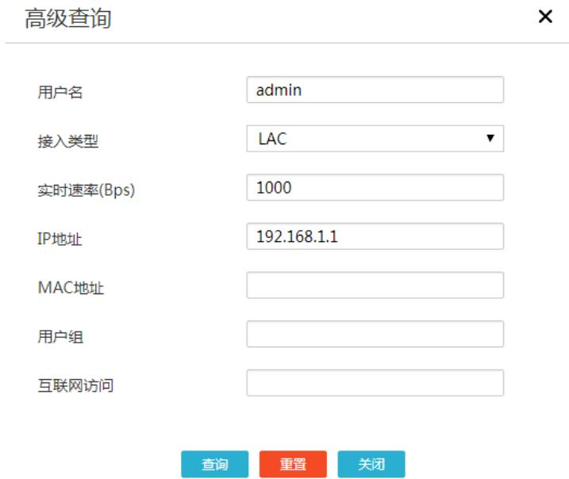

# 1 虚拟专网

# 1.1 IPsec VPN

# 1.1.1 简介

IPsec VPN是利用 IPsec技术建立的虚拟专用网。IPsec通过在特定通信方之间建立“通道”，来保护通信方之间传输的用户数据，该通道通常称为IPsec隧道。

IPsec协议为IP层上的网络数据安全提供了一整套安全体系结构，包括安全协议AH（AuthenticationHeader，认证头）和 ESP（Encapsulating Security Payload，封装安全载荷）、IKE（Internet KeyExchange，互联网密钥交换）以及用于网络认证及加密的一些算法等。其中，AH 协议和 ESP 协议用于提供安全服务，IKE协议用于密钥交换。

设备支持两种IPsec VPN组网方式：

“中心—分支”方式组网：企业分支机构网关将主动与总部网关建立 IPsec 隧道，分支机构内部终端可以安全访问总部的网络资源。  
对等方式组网：企业各分支网关之间均可主动建立IPsec隧道，来保护分支之间的数据通信。

# 1.1.2 配置 IPsec 分支节点

# 1. 配置需求

“中心—分支”方式组网环境中的分支节点设备需要主动建立IPsec隧道与中心节点通信。对等方式组网环境中的设备需要与对端设备主动建立IPsec隧道。

# 2. 配置步骤

# IPsec 基本配置

(1) 单击导航树中[虚拟专网/IPsec VPN]菜单项，进入 IPsec VPN 配置页面。  
(2) 单击“IPsec 策略”页签，进入 IPsec 策略配置页面。

图1-1 IPsec 策略   
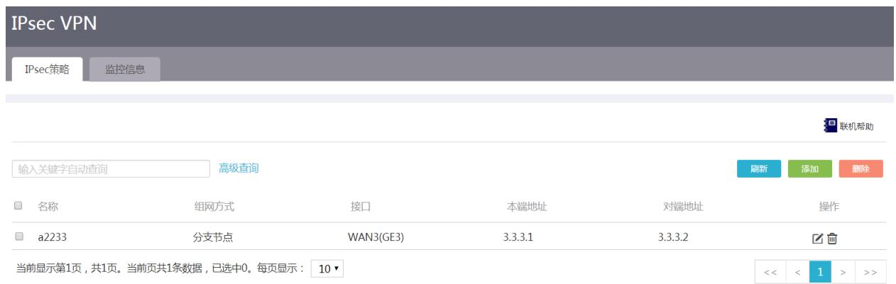

(3) 点击<添加>按钮，进入添加IPsec策略页面。

(4) 在“名称”配置项处，输入IPsec策略的名称。  
(5) 在“接口”配置项处，选择应用 IPsec 策略的接口。请注意，此接口需要与对端设备路由可达。  
(6) 在“组网方式”配置项处，选择分支节点。  
(7) 在“对端网关地址”配置项处，输入IPsec隧道对端的IP地址。通常为总部网关或对端分支机构网关的WAN口地址。  
(8) 在“认证方式”配置项处，设备目前仅支持预共享密钥认证方式。  
(9) 在“预共享密钥”配置项处，输入与对端设备相同的预共享密钥。该密钥需要提前进行协商和通告。  
(10) 在“保护流配置”配置项处，进行如下配置：

a. 在“受保护协议”配置项处，选择受IPsec隧道保护的报文的协议类型。  
b. 在“本端受保护网段/掩码”配置项处，输入本端受保护网段。  
c. 在“本端受保护端口”配置项处，输入本端受保护端口。仅当受保护协议选择为TCP或UDP时支持配置。

由本端受保护网段内主机的受保护端口发送的报文将被设备进行IPsec隧道封装处理。

d. 在“对端受保护网段/掩码”配置项处，输入对端受保护网段。  
e. 在“对端受保护端口”配置项处，输入对端受保护端口。仅当受保护协议选择为TCP或UDP时支持配置。

由对端受保护网段内主机的受保护端口发送的报文才可以被设备进行IPsec隧道解封装处理。

f. 可以通过多次执行步骤（9）添加多条保护流。

图1-2 添加 IPsec 策略

添加IPsec 策略

添加IPsec策略  
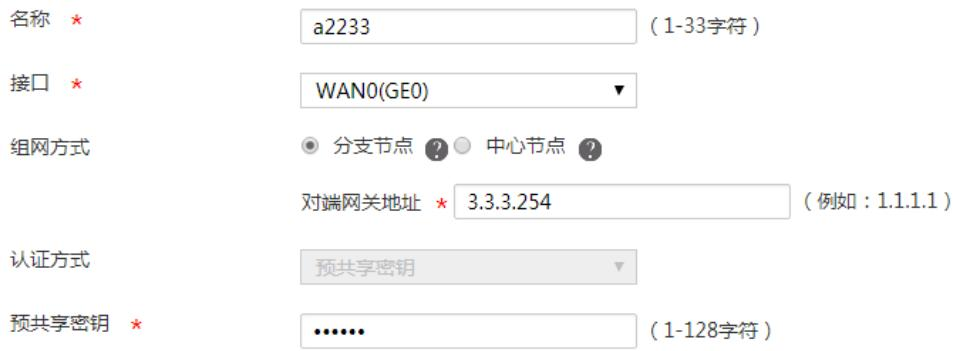  
保护流配置 \*

  
显示高级配置...

# IKE 配置

如您需要改变设备的缺省IKE配置，可按如下方式进行配置。

(11) 按上述方式完成IPsec基本配置。  
(12) 点击<显示高级配置>链接，进入高级配置页面。   
(13) 单击“IKE配置”页签，进入IKE配置页面。  
(14) 在“协商模式”配置项处，选择IKE协商模式：

 主模式：协商步骤多，身份验证位于密钥交互过程之后进行，适用于对身份保护要求较高的场合。  
 野蛮模式：协商步骤少，身份验证与密钥交互同时进行，适用于对身份保护要求不高的场合。

若设备公网IP地址是动态分配的，建议您选择IKE协商模式为野蛮模式。

(15) 在“本端身份类型”配置项处，配置用于IKE认证的本端设备身份类型和身份标识。身份类型可选择IP地址、FQDN名称或 user FQDN名称。需要注意的是，此项必须与对端设备上执行步骤（6）配置的对端身份类型和身份标识一致。

如果您执行步骤（4）选择的IKE协商模式为主模式，您需要将本端设备身份类型配置为IP地址。

(16) 在“对端身份类型”配置项处，配置用于IKE认证的对端设备身份类型和身份标识。身份类型可选择IP地址、FQDN名称或user FQDN名称。需要注意的是，此项必须与对端设备上执行步骤（5）配置的本端身份类型和身份标识一致。

(17) 在“对等体存活检测（DPD）”配置项处，选择是否开启对等体存活检测功能。该功能可用于检测对端是否存活，设备将拆除对端失活的IPsec隧道。建议您开启此功能，使设备能够及时获悉 IPsec 隧道的可用情况。  
(18) 在“算法组合”配置项处，选择IKE协议交互所需的加密和认证算法。您可选择推荐的算法组合亦可自定义认证算法、加密算法和PFS算法。

IPsec隧道的两端所配置的认证算法、加密算法和PFS算法必须一致。

(19) 在“SA生存时间”配置项处，输入IKE重新协商的时间间隔，超过所配时间将触发IKE相关参数的重新协商。

图1-3 高级配置-IKE配置  
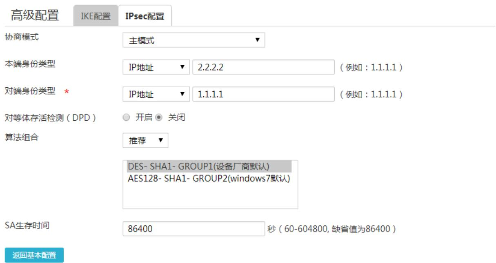

# IPsec 高级配置

如您需要改变设备的缺省IPsec高级配置，可按如下方式进行配置。

(20) 按上述方式完成IPsec基本配置。  
(21) 单击“IPsec配置”页签，进入IPsec配置页面。   
(22) 在“算法组合”配置项处，选择IPsec协议交互使用的安全协议以及相应的加密和认证算法。您可选择推荐的算法组合亦可自定义安全协议、认证算法、加密算法、封装模式和PFS算法。若 IPsec本端受保护网段与对端受保护网段均为私网网段，建议您选择封装模式为隧道模式。IPsec隧道的两端所配置的安全协议、认证算法、加密算法、封装模式和PFS算法必须一致。  
(23) 在“基于时间的SA生存时间”配置项处，输入触发IPsec重新协商的时间间隔，超过所配时间将触发IPsec相关参数的重新协商。  
(24) 在“基于流量的生存时间”配置项处，输入触发IPsec重新协商的流量大小，超过所配流量将触发IPsec相关参数的重新协商。

(25) 在“触发模式”配置项处，选择IPsec协议交互使用的触发模式，包括流量触发和长连模式。流量触发表示只有存在符合要求的流量时才会触发建立IPSec隧道；长连模式表示只要配置条件满足就会建立IPSec隧道。  
(26) 点击<返回基本配置>按钮，返回添加IPsec策略页面。  
(27) 点击<确定>按钮，完成配置。

图1-4 高级配置-IPsec 配置  
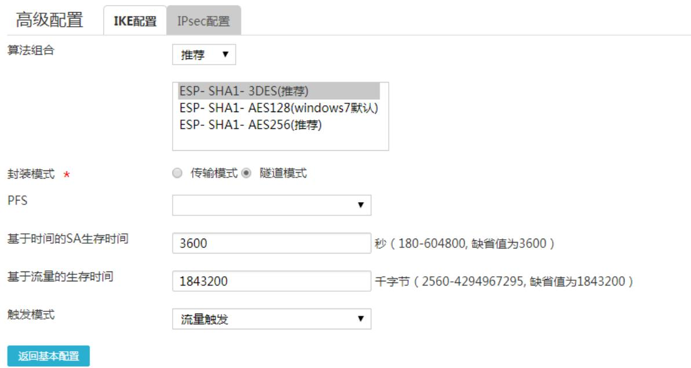

# 1.1.3 配置 IPsec 中心节点

# 1. 配置需求

“中心—分支”方式组网环境中的中心节点设备需要主动建立IPsec隧道与对端设备通信。

# 2. 配置步骤

# IPsec 基本配置

(1) 单击导航树中[虚拟专网/IPsec VPN]菜单项，进入 IPsec VPN 配置页面。  
(2) 单击“IPsec 策略”页签，进入 IPsec 策略配置页面。

图1-5 IPsec 策略   
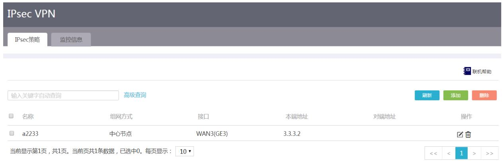

(3) 点击<添加>按钮，进入添加IPsec策略页面。  
(4) 在“名称”配置项处，输入IPsec策略的名称。  
(5) 在“接口”配置项处，选择应用IPsec策略的接口。请注意，此接口需要与分支节点设备路由可达。  
(6) 在“组网方式”配置项处，选择中心节点。  
(7) 在“认证方式”配置项处，设备目前仅支持预共享密钥认证方式。  
(8) 在“预共享密钥”配置项处，输入与对端设备相同的预共享密钥。该密钥需要提前进行协商和通告。

图1-6 添加 IPsec 策略  
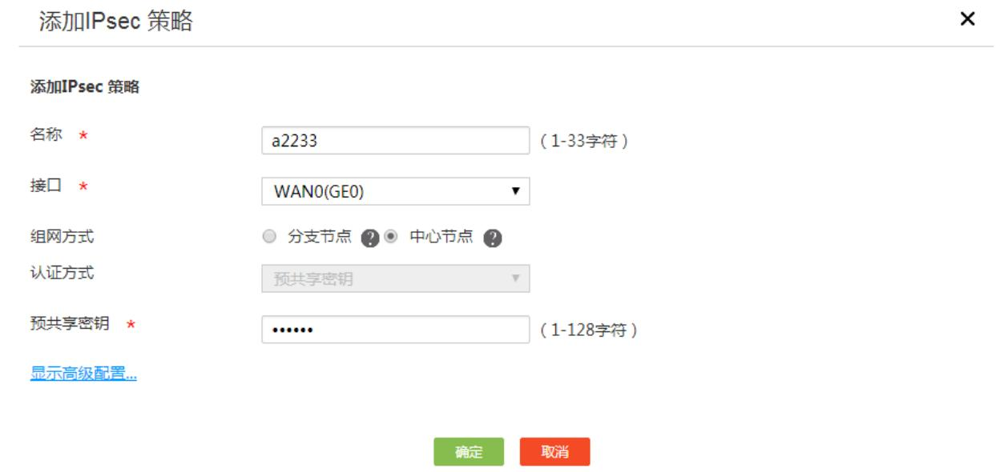

# IKE 配置

如您需要改变设备的缺省IKE配置，可按如下方式进行配置。

(9) 按上述方式完成IPsec基本配置。

(10) 点击<显示高级配置>链接，进入高级配置页面。

(11) 单击“IKE配置”页签，进入IKE配置页面。  
(12) 在“协商模式”配置项处，选择 IKE 协商模式：

 主模式：协商步骤多，身份验证位于密钥交互过程之后进行，适用于对身份保护要求较高的场合。

 野蛮模式：协商步骤少，身份验证与密钥交互同时进行，适用于对身份保护要求不高的场合。

若设备公网IP地址是动态分配的，建议您选择IKE协商模式为野蛮模式。

(13) 在“本端身份类型”配置项处，配置用于IKE认证的本端设备身份类型和身份标识。身份类型可选择IP地址、FQDN名称或 user FQDN名称。需要注意的是，此项必须与分支节点设备上配置的对端身份类型和身份标识一致。

如果您执行步骤（4）选择的IKE协商模式为主模式，您需要将本端设备身份类型配置为IP地址。

(14) 在“对等体存活检测（DPD）”配置项处，选择是否开启对等体存活检测功能。该功能可用于检测对端是否存活，设备将拆除对端失活的IPsec隧道。建议您开启此功能，使设备能够及时获悉IPsec隧道的可用情况。  
(15) 在“算法组合”配置项处，选择IKE协议交互所需的加密和认证算法。您可选择推荐的算法组合亦可自定义认证算法、加密算法和PFS算法。

IPsec隧道的两端所配置的认证算法、加密算法和PFS算法必须一致。

(16) 在“SA生存时间”配置项处，输入IKE重新协商的时间间隔，超过所配时间将触发IKE相关参数的重新协商。

图1-7 高级配置-IKE配置  
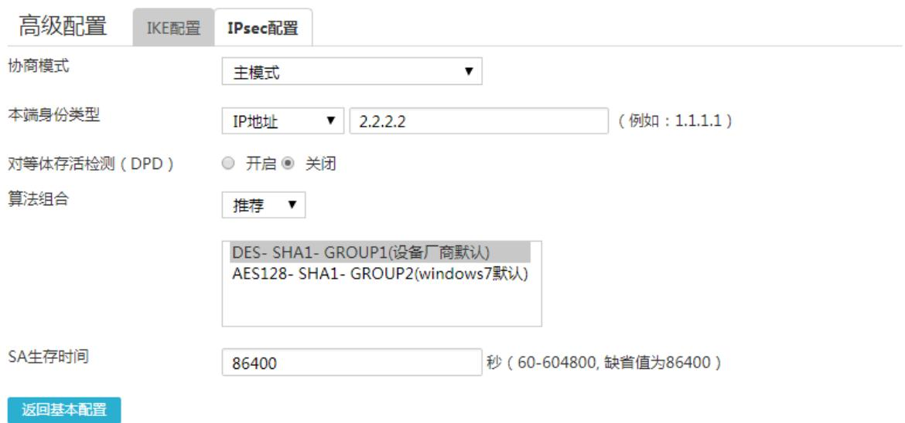

# IPsec 高级配置

如您需要改变设备的缺省IPsec高级配置，可按如下方式进行配置。

(17) 按上述方式完成IPsec基本配置。  
(18) 单击“IPsec 配置”页签，进入 IPsec 配置页面。

(19) 在“算法组合”配置项处，选择IPsec协议交互使用的安全协议以及相应的加密和认证算法。您可选择推荐的算法组合亦可自定义安全协议、认证算法、加密算法、封装模式和PFS算法。若 IPsec本端受保护网段与对端受保护网段均为私网网段，建议您选择封装模式为隧道模式。IPsec隧道的两端所配置的安全协议、认证算法、加密算法、封装模式和PFS算法必须一致。  
(20) 在“基于时间的SA生存时间”配置项处，输入触发IPsec重新协商的时间间隔，超过所配时间将触发IPsec相关参数的重新协商。  
(21) 在“基于流量的生存时间”配置项处，输入触发IPsec重新协商的流量大小，超过所配流量将触发 IPsec相关参数的重新协商。  
(22) 点击<返回基本配置>按钮，返回添加IPsec策略页面。  
(23) 点击<确定>按钮，完成配置。

图1-8 高级配置-IPsec 配置  
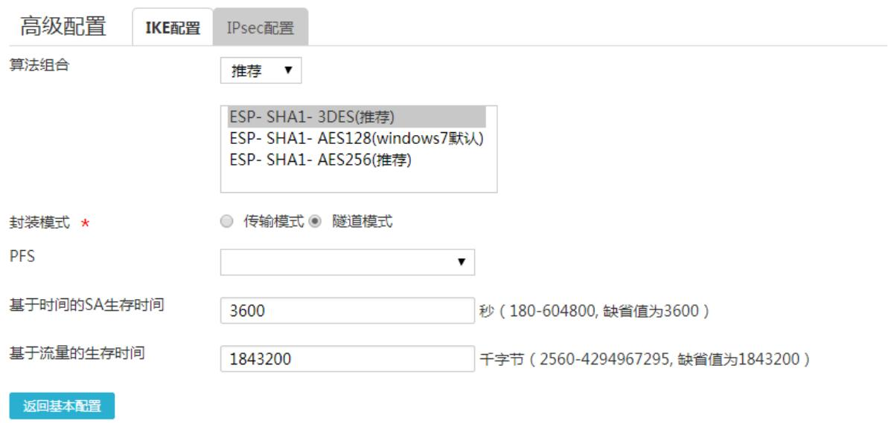

# 1.1.4 监控信息

# 1. 配置步骤

(1) 单击导航树中[虚拟专网(VPN)/IPsec VPN]菜单项，进入 IPsec VPN 配置页面。  
(2) 单击“监控信息”页签，进入监控信息页面。

图1-9 监控信息  
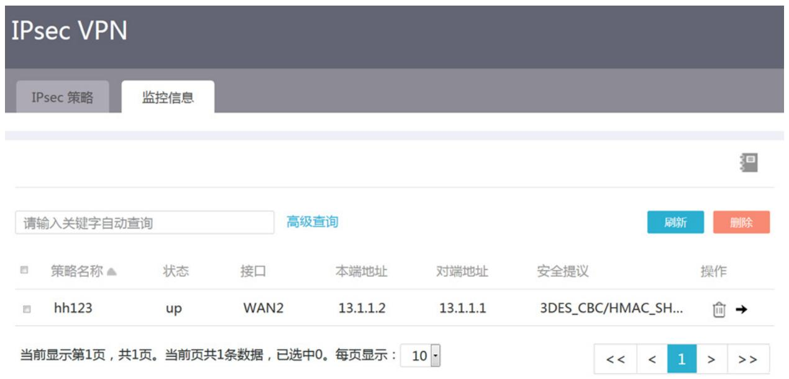

# 1.2 L2TP服务器端

# 1.2.1 简介

本功能主要用于配置L2TP服务器端基本参数，开启L2TP服务。

如果您希望为企业驻外机构和出差人员等远端用户，提供一种安全且经济的方式，让他们能够与企业内部网络通信，访问企业内部网络资源，那么您可以通过配置L2TP服务器端来实现上述需求。

L2TP服务器端是具有PPP和 L2TP协议处理能力的设备，通常位于企业内部网络的边缘。

# 1.2.2 配置 L2TP 服务端

# 1. 配置步骤

(1) 单击导航树中[虚拟专网/L2TP服务器端]菜单项，进入L2TP服务器端页面。  
(2) 单击“L2TP 配置”页签，进入 L2TP 配置页面。  
(3) 在“L2TP服务器端”配置项处，选择“开启”，开启L2TP服务。

图1-10 L2TP 服务器端-L2TP 配置  

(4) 点击<添加>按钮，进入新建 L2TP 组页面。  
(5) 在“L2TP配置”下，设置L2TP隧道参数：

 根据需要决定是否勾选“对端隧道名称”，如勾选，则在配置项处输入L2TP客户端的隧道名称。  
 在“本端隧道名称”配置项处，输入L2TP服务器端的隧道名称。  
 在“隧道验证”配置项处，根据实际需要选择“启用”或“禁用”。

− 如选择“启用”，则需在“隧道验证密码”配置项处，输入验证密码。该方式更加安全，但需要L2TP服务器端和L2TP客户端都启用隧道验证，且密码一致。  
− 如选择“禁用”，则表示L2TP服务器端和L2TP客户端在建立隧道时无需验证。

(6) 在“PPP认证配置”下的“PPP认证方式”配置项处，根据需要选择认证方式为“None”、“PAP”或“CHAP”。

 如选择“None”，则表示对用户免认证。该方式，安全性最低，请谨慎使用。  
 如选择“PAP”，则表示采用两次握手机制对用户进行认证。该方式，安全性中。  
 如选择“CHAP”，则表示采用三次握手机制对用户进行认证。该方式，安全性最高。

(7) 在“PPP地址配置”下，设置PPP地址参数：

 在“虚拟模板接口地址”配置项处，输入虚拟模板接口的IP地址，使L2TP服务器端具有为L2TP客户端或用户分配IP地址的能力。  
 在“子网掩码”配置项处，输入虚拟模板接口IP地址的子网掩码。  
 在“用户地址池”配置项处，输入用于分配给L2TP客户端或用户的IP地址。

(8) 在“LNS用户管理”下根据提示添加指定接入的PPP用户。  
(9) 点击<显示高级设置>按钮，展开高级配置页面。  
(10) 在“高级配置”下，设置高级配置参数：

 在“Hello报文间隔”配置项处，输入保活报文的时间间隔。  
 在“AVP 数据隐藏”配置项处，根据实际需要选择“启用”或“禁用”。

如选择“启用”，则表示利用隧道验证密码对AVP数据（例如隧道协商参数、会话协商参数和用户认证信息）进行加密传输，增强数据传输的安全性。

− 如选择“禁用”，则表示不对AVP数据进行加密传输。

 在“流量控制”配置项处，根据实际需要选择“启用”或“禁用”。

− 如选择“启用”，则表示在L2TP数据报文的接收与发送过程中，基于报文中携带的序列号来检测是存在否丢包，并根据序列号对乱序报文进行排序，提高L2TP数据报文传输的正确性和可靠性。在L2TP服务器端和L2TP客户端中的任意一端启用流量控制，该功能即可生效。

− 如选择“禁用”，则表示不对报文进行检测及排序。

 在“强制本端CHAP认证”配置项处，根据实际需要选择“启用”或“禁用”。

− 如选择“启用”，则表示在L2TP客户端对用户进行验证后，再由L2TP服务器端采用CHAP方式对用户进行二次认证，增强安全性。启用强制CHAP认证时，PPP认证方式必须选择为“CHAP”。

如选择“禁用”，则表示不在L2TP服务器端对用户进行强制CHAP验证。对于不支持进行第二次CHAP认证的用户，建议禁用本功能。

 在“强制LCP重协商”配置项处，根据实际需要选择“启用”或“禁用”。

− 如选择“启用”，则表示在L2TP客户端对用户进行验证后，再由L2TP服务器端采用LCP 重协商方式对用户进行二次 LCP 协商及认证，增强安全性。如果同时启用了强制LCP重协商和强制CHAP认证，则仅强制LCP重协商生效。

− 如选择“禁用”，则表示不在L2TP服务器端与用户进行强制LCP重协商。对于不支持LCP协商的用户，建议禁用本功能。

(11) 点击<确定>按钮，完成配置。

图1-11 新建 L2TP 组

# 新建L2TP组

# L2TP配置

√对端隧道名称

123abc

（1-31字符）

本端隧道名称

H3C-LNS

（1-31字符）

隧道验证

启用禁用

# PPP认证配置

PPP认证方式

PAP

# PPP地址配置

虚拟模板接口地址

1.1.1.1

子网掩码 \*

255.255.255.0

用户地址池\*

192.168.1.100

可以是单个地址，

也可以是一个地址范围

如：192.168.1.100-192.168.1.200

# LNS用户管理

\*需要添加指定接入的PPP用户，完成本页设置后请到"认证管理-用户管理"页面添加

显示高级配置...

确定

取消

# 1.2.3 修改 L2TP 配置

# 1. 配置步骤

(1) 单击导航树中[虚拟专网/L2TP服务器端]菜单项，进入L2TP服务器端页面。  
(2) 单击“L2TP配置”页签，进入L2TP配置页面。  
(3) 点击操作栏下的<修改>按钮，进入修改 L2TP组页面。  
(4) 在该页面根据实际需要完成相关修改后，点击<确定>按钮，完成修改操作。

图1-12 修改 L2TP 组

# 修改L2TP组

×

# L2TP配置

# PPP认证配置

# PPP地址配置

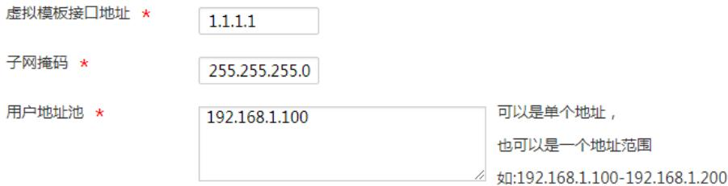

# LNS用户管理

\*需要添加指定接入的PPP用户，完成本页设置后请到"认证管理-用户管理"页面添加

确定

取消

# 1.2.4 删除 L2TP 组

# 1. 配置步骤

(1) 单击导航树中[虚拟专网/L2TP服务器端]菜单项，进入L2TP服务器端页面。  
(2) 单击“L2TP 配置”页签，进入 L2TP 配置页面。

 点击操作栏下的<删除>按钮，可删除当前L2TP配置项。

 在“L2TP组号”列，勾选多个待删除的“L2TP配置”项，点击右上角<删除>按钮，可以一次性删除多个L2TP配置项。

(3) 点击<删除>按钮后，在弹出的“确认提示”对话框中，点击<是>按钮，完成删除操作。

图1-13 删除 L2TP 组

# 确认提示

确定要删除选中的数据吗？

是

香

# 1.2.5 查看隧道信息

# 1. 配置步骤

(1) 单击导航树中[虚拟专网/L2TP服务器端]菜单项，进入L2TP服务器端页面。  
(2) 单击“隧道信息”页签，进入隧道信息页面，可查看当前设备作为L2TP服务端时隧道的信息。

图1-14 L2TP 服务器端-隧道信息  
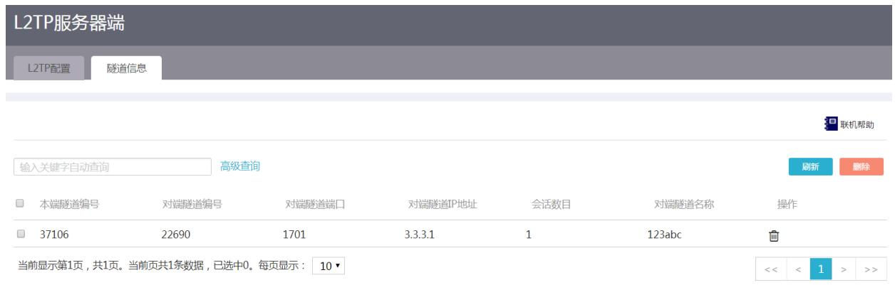

# 1.2.6 删除隧道信息

# 1. 配置步骤

(1) 单击导航树中[虚拟专网/L2TP服务器端]菜单项，进入L2TP服务器端页面。  
(2) 单击“隧道信息”页签，进入隧道信息页面。  
(3) 删除 L2TP 隧道有如下方式：  
 删除单个隧道：在列表中点击待删除隧道对应操作列的<删除>按钮，在弹出的确认提示对话框中，点击<是>按钮，完成删除操作。  
 一次性删除多个隧道：在列表中勾选多个待删除的隧道后，点击右上方的<删除>按钮，在弹出的确认提示对话框中，点击<是>按钮，完成删除操作。

图1-15 删除 L2TP 隧道

# 确认提示

确定要删除选中的数据吗？

是

香

# 1.3 L2TP客户端

# 1.3.1 简介

本功能主要用于配置L2TP客户端基本参数，开启L2TP服务。

如果您希望为企业驻外机构，提供一种安全且经济的方式，让他们能够与企业内部网络通信，访问企业内部网络资源，那么您可以通过配置L2TP服务器端来实现上述需求。

L2TP客户端是具有PPP和 L2TP协议处理能力的设备，通常位于企业驻外机构网络的出口。

# 1.3.2 配置 L2TP 客户端

# 1. 配置步骤

(1) 单击导航树中[虚拟专网/L2TP 客户端]菜单项，进入 L2TP 客户端页面。  
(2) 单击“L2TP配置”页签，进入L2TP配置页面。  
(3) 在“L2TP 客户端”配置项处，选择“开启”，开启 L2TP 服务。

图1-16 L2TP 客户端-L2TP 配置  
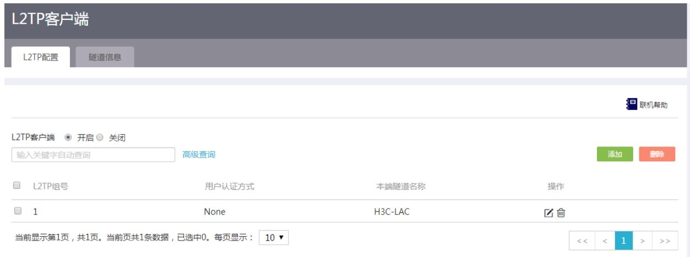

(4) 点击<添加>按钮，进入新建 L2TP 组页面。  
(5) 在“L2TP配置”下，设置L2TP隧道参数：  
 在“本端隧道名称”配置项处，输入L2TP客户端的隧道名称。 。在“本端隧道名称”配置项处，输入L2TP客户端的隧道名称。  
 在“地址获取方式”配置项处，根据实际需要选择“静态”或“动态”选项。 。在“地址获取方式”配置项处，根据实际需要选择“静态”或“动态”选项。

− 若选择“静态”，则需在“静态IP地址”配置处，为虚拟PPP接口手工配置一个IP地址；  
− 若选择“动态”，则由LNS端为虚拟PPP接口动态分配IP地址。

 在“隧道验证”配置项处，根据实际需要选择“启用”或“禁用”。

− 如选择“启用”，则需在“隧道验证密码”配置项处，输入验证密码。该方式更加安全，但需要L2TP服务器端和L2TP客户端都启用隧道验证，且密码一致。  
− 如选择“禁用”，则表示L2TP服务器端和L2TP客户端在建立隧道时无需验证。

(6) 在“PPP 认证配置”下的“PPP 认证方式”配置项处，，根据需要选择认证方式为“None”、“PAP”或“CHAP”。

 如选择“None”，则表示对用户免认证。该方式，安全性最低，请谨慎使用。  
 如选择“PAP”，则表示采用两次握手机制对用户进行认证。该方式，安全性中。  
 如选择“CHAP”，则表示采用三次握手机制对用户进行认证。该方式，安全性最高。

(7) 在“L2TP 服务器端配置”下的“L2TP 服务器端地址”配置项处，输入 L2TP 服务器端的 IP地址。

(8) 在“高级配置”下，设置高级配置参数：

 在“Hello报文间隔”配置项处，输入保活报文的时间间隔。  
 在“AVP数据隐藏”配置项处，根据实际需要选择“启用”或“禁用”。

如选择“启用”，则表示利用隧道验证密码对AVP数据（例如隧道协商参数、会话协商参数和用户认证信息）进行加密传输，增强数据传输的安全性。  
− 如选择“禁用”，则表示不对AVP数据进行加密传输。

 在“流量控制”配置项处，根据实际需要选择“启用”或“禁用”。

− 如选择“启用”，则表示在L2TP数据报文的接收与发送过程中，基于报文中携带的序列号来检测是存在否丢包，并根据序列号对乱序报文进行排序，提高L2TP数据报文传输的正确性和可靠性。在L2TP服务器端和L2TP客户端中的任意一端启用流量控制，该功能即可生效。  
− 如选择“禁用”，则表示不对报文进行检测及排序。

(9) 点击<确定>按钮，完成配置。

图1-17 新建 L2TP 组  
新建L2TP组  

L2TP配置   

  
PPP认证配置

  
L2TP服务器端配置

高级配置  

取消

# 1.3.3 修改 L2TP 配置

# 1. 配置步骤

(1) 单击导航树中[虚拟专网/L2TP 客户端]菜单项，进入 L2TP 客户端页面。  
(2) 单击“L2TP配置”页签，进入L2TP配置页面。  
(3) 点击操作栏下的<修改>按钮，进入修改 L2TP 组页面。  
(4) 在该页面根据实际需要完成相关修改后，点击<确定>按钮，完成修改操作。

图1-18 修改 L2TP 组

# 修改L2TP组

# L2TP配置

本端隧道名称

H3C-LAC

（1-31字符）

地址获取方式

静态。 动态

静态IP地址

隧道验证

启用禁用

# PPP认证配置

PPP认证方式

None

# L2TP服务器端配置

L2TP服务器端地址\*

1.1.1.1

（1-5个IP地址或域名，以英文状态下的逗号分隔）

# 高级配置

Hello报文间隔

60

秒（60-1000，缺省值为60）

AVP数据隐藏

启用禁用

流量控制

启用禁用

取消

# 1.3.4 删除 L2TP 配置

# 1. 配置步骤

(1) 单击导航树中[虚拟专网/L2TP客户端]菜单项，进入L2TP客户端页面。   
(2) 单击“L2TP配置”页签，进入L2TP配置页面。

 点击操作栏下的<删除>按钮，可删除当前L2TP配置项。  
在“L2TP组号”列，勾选多个待删除的“L2TP配置”项，点击右上角<删除>按钮，可以一次性删除多个L2TP配置项。

(3) 点击<删除>按钮后，在弹出的“确认提示”对话框中，点击<是>按钮，完成删除操作。

图1-19 删除 L2TP 组

确认提示

确定要删除选中的数据吗？

香

# 1.3.5 查看隧道信息

# 1. 配置步骤

(1) 单击导航树中[虚拟专网/L2TP 客户端]菜单项，进入 L2TP 客户端页面。  
(2) 单击“隧道信息”页签，进入隧道信息页面，可查看当前设备作为 L2TP 客户端时隧道的信息。

图1-20 L2TP 客户端-隧道信息  
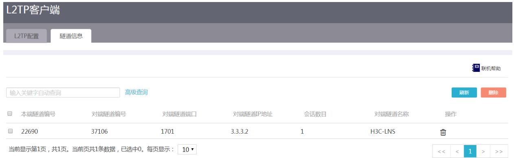

# 1.3.6 删除隧道信息

# 1. 配置步骤

(1) 单击导航树中[虚拟专网/L2TP客户端]菜单项，进入L2TP客户端页面。   
(2) 单击“隧道信息”页签，进入隧道信息页面。  
(3) 删除 L2TP 隧道有如下方式：

 删除单个隧道：在列表中点击待删除隧道对应操作列的<删除>按钮，在弹出的确认提示对话框中，点击<是>按钮，完成删除操作。  
 一次性删除多个隧道：在列表中勾选多个待删除的隧道后，点击右上方的<删除>按钮，在弹出的确认提示对话框中，点击<是>按钮，完成删除操作。

图1-21 删除 L2TP 隧道

确认提示

×

确定要删除选中的数据吗？

是

香

# 1.4 EoGRE

# 1.4.1 简介

EoGRE（Ethernet over GRE，通用路由封装传输以太网报文）协议用来对以太网数据报文进行封装，使这些被封装的数据报文能够在IP网络中传输。封装后的数据报文在网络中传输的路径，称为EoGRE隧道。EoGRE隧道是一个虚拟的点到点的连接，其两端的设备分别对数据报文进行封装及解封装。

EoGRE隧道的模式分为 EoGRE隧道模式和 UDP封装的 EoGRE隧道模式。若二层以太网报文跨三层网络转发且穿越NAT，EoGRE隧道需设置为 UDP封装的 EoGRE隧道模式，若不穿越NAT，EoGRE隧道需设置为EoGRE隧道模式。

本功能包括配置EoGRE隧道，配置VE-Bridge接口，并监控EoGRE信息。

# 1.4.2 配置 EoGRE 隧道

# 1. 注意事项

创建 EoGRE 隧道时，设置的隧道模式，在创建完成后，无法修改。

# 2. 配置步骤

(1) 单击导航树中[虚拟专网/EoGRE]菜单项，进入 EoGRE 配置页面。  
(2) 单击“EoGRE隧道”页签，进入EoGRE隧道配置页面。

图1-22 EoGRE 隧道  

(3) 点击<添加>按钮，进入新建 EoGRE 隧道页面。  
(4) 设置 EoGRE 隧道的参数：

a. 在“隧道编号”配置项处，输入EoGRE隧道的编号。  
b. 在“隧道源端”配置项处，为隧道源端选择源接口或者设置IP地址。

(5) 在“隧道目的端地址”配置项处，为隧道目的端设置IP地址。

(6) 点击<高级配置>按钮，可为隧道设置模式。

 若勾选“UDP封装”选项，将隧道模式设置为UDP封装的 EoGRE隧道模式，可根据需要设置UDP端口号。

 若不勾选“UDP封装”选项，将隧道模式设置为EoGRE隧道模式。

(7) 点击<确定>按钮，完成 EoGRE 隧道的创建。

图1-23 新建 EoGRE 隧道  
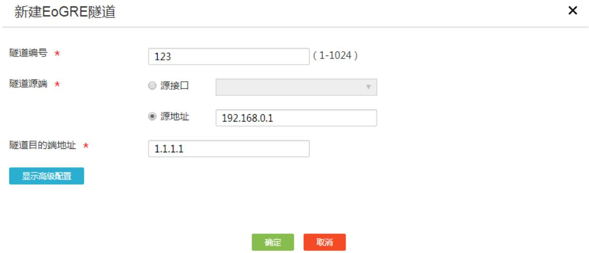

# 1.4.3 配置 VE-Bridge 接口

# 1. 注意事项

为 VE-Bridge 接口绑定 Tunnel 接口或者 GE 接口时，如果选择了已经与其他 VE-Bridge 接口绑定的 Tunnel 接口或者 GE 接口，配置完成后，此 Tunnel 接口或者 GE 接口将与之前绑定的VE-Bridge 接口解除绑定。  
为VE-Bridge接口绑定GE接口时，选择的GE接口将只能用于二层报文的转发，此GE接口已配置的其他业务将会失效 。

# 2. 配置步骤

(1) 单击导航树中[虚拟专网/EoGRE]菜单项，进入 EoGRE 配置页面。  
(2) 单击“VE-Bridge 接口”页签，进入 VE-Bridge 接口配置页面。

图1-24 VE-Bridge 接口  
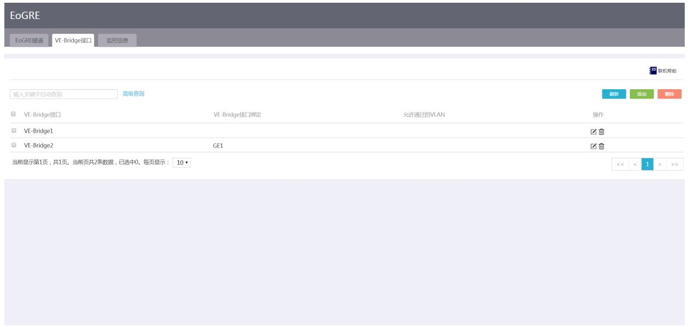

(3) 点击<添加>按钮，进入新建 VE-Bridge 接口页面。  
(4) 在“接口编号”配置项处，输入 VE-Bridge 接口的编号。  
(5) 在“缺省 VLAN”配置项处，为 VE-Bridge 接口配置缺省的 VLAN，即 PVID。  
(6) 在“链路类型”配置项处，选择接口的链路类型，

 若选择“Access”选项，则不需要设置允许通过的VLAN。  
 若选择“Trunk”选项，则需在“允许通过的 VLAN”配置项处，输入允许通过该 VE-Bridge接口的 VLAN ID。

(7) 在“接口绑定”配置项处，为VE-Bridge接口绑定用于二层转发的接口。

 若选择“Tunnel接口”选项，则可以选择已创建的EoGRE隧道接口与该VE-Bridge接口绑定，也可以选择“不绑定”，表示不为VE-Bridge接口绑定EoGRE隧道接口。  
 若选择“GE口”选项，则可以选择三层接口作与该VE-Bridge接口绑定，也可以选择“不绑定”，表示不为VE-Bridge接口绑定三层接口。

(8) 点击<确定>按钮，完成VE-Bridge接口的创建。

图1-25 新建 VE-Bridge 接口  
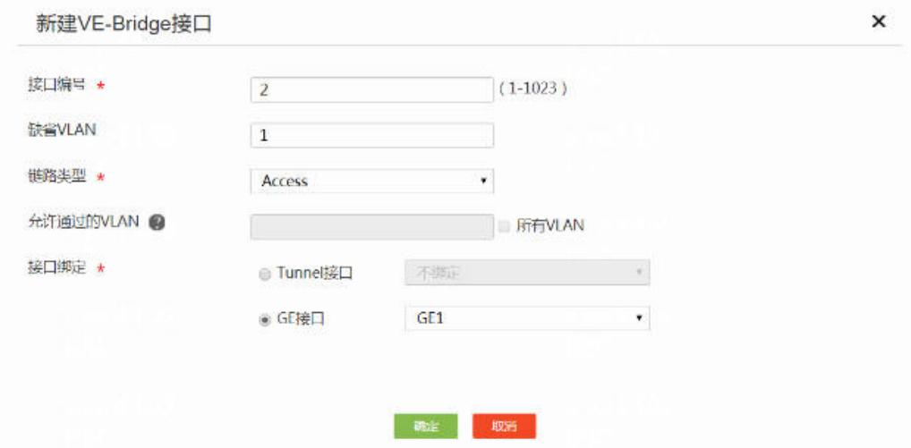

# 1.4.4 查看监控信息

# 1. 配置步骤

(1) 单击导航树中[虚拟专网/EoGRE]菜单项，进入 EoGRE 配置页面。  
(2) 单击“监控信息”页签，进入监控信息配置页面。  
(3) 在 EoGRE 隧道列表中可以查看 EoGRE 隧道的编号、状态、源接口/源地址和目的端地址。其中隧道状态分为UP和Down。UP表示隧道能够正常转发报文；Down表示隧道不能转发报文。

图1-26 EoGRE-隧道信息  
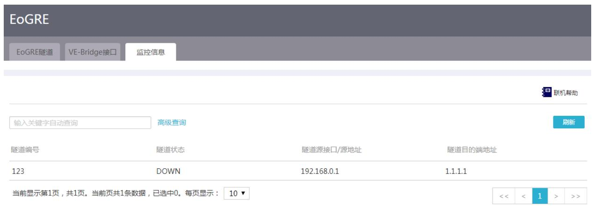

# 1 高级选项

# 1.1 应用服务

# 1.1.1 简介

应用服务提供对 DNS 的配置功能，DNS（Domain Name System，域名系统）是一种用于 TCP/IP应用程序的分布式数据库，提供域名与IP地址之间的转换。主要包括：

# 1. 1.静态 DNS

静态DNS就是手工建立域名和IP地址之间的对应关系。当您使用域名访问设备提供的服务（Web、Mail或者FTP等服务）时，系统会查找静态DNS解析表，从中获取指定域名对应的IP地址。

# 2. 2.动态 DNS

如果您通过设备的 WAN接口来提供 Web、Mail 或者 FTP 等服务，且希望在设备 WAN 接口的 IP发生变化的情况下（如宽带拨号方式下），用户仍然能够通过固定的域名访问设备提供的服务，那么需要在设备上的提供 Web、Mail 或者 FTP 等服务的 WAN 接口上配置 DDNS（Dynamic DomainName System，动态域名系统）服务。

使用DDNS服务之前，需要提前在DDNS服务器（即DDNS服务提供商，如花生壳网站）上注册。之后，当设备WAN接口的 IP地址变化时，设备会自动通知 DDNS服务器更新记录的IP地址和固定域名的映射关系。

# 1.1.2 配置静态 DNS

(1) 单击导航树中[高级选项/应用服务]菜单项，进入应用服务配置页面。  
(2) 单击“静态DNS”页签，进入静态DNS配置页面。

图1-1 静态 DNS  
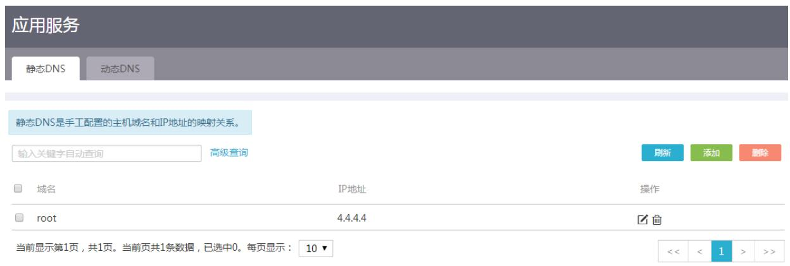

(3) 点击<添加>按钮，弹出新建静态DNS对话框。  
(4) 在“域名”配置项处，输入网络设备的域名。  
(5) 在“IP地址”配置项处，输入网络设备的IP地址。

(6) 点击<确定>按钮，完成设置。

图1-2 新建静态 DNS  
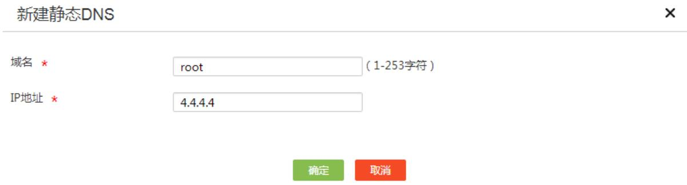

# 1.1.3 配置动态 DNS

# 1. 注意事项

设备向 DDNS服务器申请域名时，请保证WAN接口地址为公网IP地址。

# 2. 配置准备

请提前在动态域名服务提供商（如花生壳网站）处注册账户，设置密码。

# 3. 配置步骤

(1) 单击导航树中[高级选项/应用服务]菜单项，进入应用服务配置页面。  
(2) 单击“动态 DNS”页签，进入动态 DNS 配置页面。

图1-3 动态 DNS  
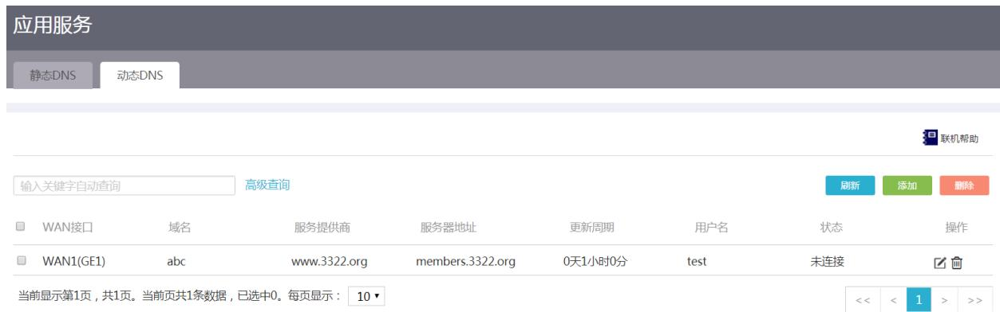

(3) 点击<添加>按钮，进入“新建动态DNS策略”页面。  
(4) 在“WAN接口”配置项处，选择设备上的提供Web、Mail或者 FTP等服务的WAN接口。  
(5) 在“域名”配置项处，输入设备的域名。  
(6) 在“服务器配置”下，设置DDNS服务器参数：  
 服务提供商：选择服务提供商，如花生壳等。

 设置服务器地址：服务提供商的服务器地址。如果服务器地址与缺省情况不同，勾选“修改服务器地址”后进行修改。  
 设置设备向服务器发送更新请求的时间间隔。如果配置时间间隔为0，设备只在WAN接口IP地址发生变化或者接口连接由down变为up时发送更新请求。

(7) 在“账户配置”下，输入在服务提供商处注册的用户名和密码。

(8) 点击<确定>按钮，启动动态 DNS 服务。

图1-4 新建动态DNS策略  
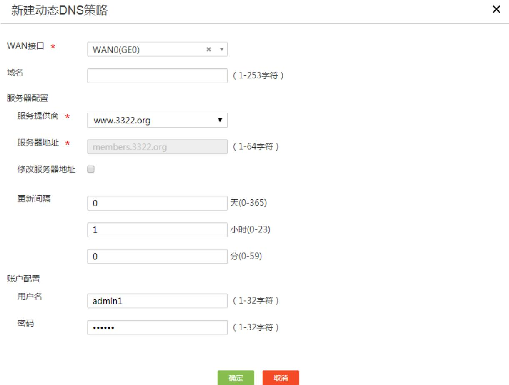

# 1.2 静态路由

# 1. 简介

静态路由是在路由器中通过手工方式设置的固定路由条目。当您的网络结构比较简单且比较稳定时，通过配置静态路由就可以实现网络互通。例如，当您知道网络的出接口，以及网关的IP地址时，设置静态路由即可实现正常通信。

当去往同一目的地存在多条静态路由时，如果您希望优先选用某条静态路由，可以调整静态路由的优先级。优先级的值越小，对应的静态路由的优先级越高。

# 2. 注意事项

当静态路由中下一跳对应的接口失效时，本地的静态路由条目不会被删除，这种情况下需要您检查网络环境，然后修改静态路由的配置。

# 3. 配置步骤

(1) 单击导航树中[高级选项/静态路由]菜单项，进入静态路由配置页面。

图1-5 静态路由  

(2) 点击<添加>按钮，进入添加 IPv4 静态路由页面。  
(3) 在“目的IP地址”配置项处，输入设备要访问的目的网络的IP地址。  
(4) 在“掩码长度”配置项处，输入目的网络的掩码长度。  
(5) 在“下一跳”下，设置去往目的网络的出接口和下一跳参数：  
 选择出接口，包括 WAN、Cellular、VLAN 等接口。  
 设置下一跳IP地址。  
(6) 在“路由优先级”下，输入静态路由的优先级。  
(7) 在“描述”下，输入静态路由的描述信息。  
(8) 点击<确定>按钮，完成静态路由的添加。

图1-6 添加 IPv4 静态路由  
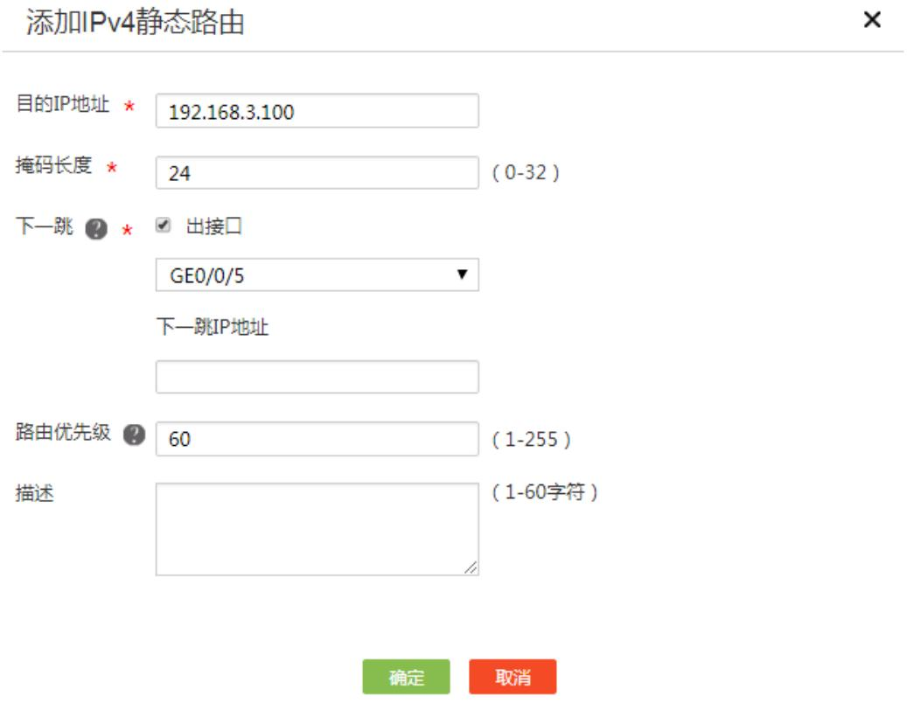

# 1.3 策略路由

# 1. 简介

与单纯按照 IP报文的目的地址查找路由表进行转发不同，策略路由是一种依据用户制定的策略进行路由转发的机制。策略路由可以对于满足一定条件（源地址和目的地址等）的报文，执行指定的操作（设置报文的下一跳和出接口等）。策略路由的匹配条件比普通路由更丰富，当需要按照报文的某些特征（如报文源地址和目的地址等）转发到不同的网络中时，可以配置策略路由功能。

# 2. 配置步骤

(1) 单击导航树中[高级选项/策略路由]菜单项，进入策略路由配置页面。  
(2) 选择应用策略路由的接口。

图1-7 策略路由

# 策略路由

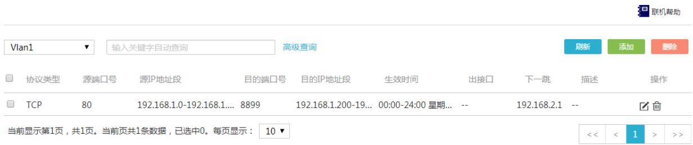

(3) 点击<添加>按钮，进入“新增策略路由列表”页面。  
(4) 在“匹配规则”下，设置策略路由的匹配规则参数：

 选择匹配的协议类型，如果选择了“协议号”，则需要输入具体的协议编号，如HTTP的协议号为80。  
 如果协议类型指定为“TCP”或“UDP”，则需要设置匹配报文的源端口和目的端口。  
 在“源IP地址段”和“目的IP地址段”配置项处，设置匹配报文的源IP地址范围和目的IP地址范围。输入地址段时，起始地址和结束地址间需要用短横线连接，如“1.1.1.1-1.1.1.2”，如果只指定一个地址，则起始地址和结束地址需要相同。  
 在“源端口”和“目的端口”配置项处，设置匹配报文的源端口和目的端口。仅匹配的协议类型为“TCP”或“UDP”时，才需设置此参数。  
 在“生效时间”配置项处，设置匹配规则的生效时间和生效周期。如果策略需要全天生效，则设置为 00:00-23:59。

(5) 在“出接口”或“下一跳”配置项处，配置匹配规则的报文通过指定出接口转发或转发到指定的下一跳。  
(6) 配置策略的描述信息，当某些策略用于特殊用途时，管理员可以配置描述信息，方便后续查询使用。  
(7) 点击<确定>按钮，完成配置。

图1-8 新增策略路由列表

# 新增策略路由列表

匹配规则

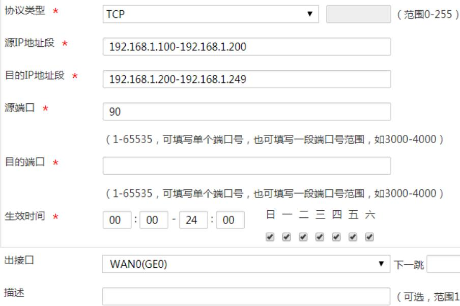

取消

# 1.4 SNMP

# 1.4.1 简介

SNMP（Simple Network Management Protocol，简单网络管理协议）是互联网中的一种网络管理标准协议，广泛用于实现管理设备对被管理设备的访问和管理。

如果您希望通过网管软件（如MIB Browser）实现对设备的管理，或者设备发生紧急事件（比如接口 Up或者 Down、CPU利用率高、内存耗尽等）时能自动通过告警信息告知网管软件，则需要配置 SNMP。

设备支持 SNMPv1、SNMPv2c 和 SNMPv3 三种版本。SNMPv3 比 SNMPv1 和 SNMPv2c 更安全。

SNMPv1 和 SNMPv2c 使用口令认证。  
SNMPv3采用用户名认证，并且必须配置认证密码和加密密码。其中：  
 用户名和认证密码用于对网管软件进行身份认证，以免非法网管软件访问设备。  
 加密密码用于对网管软件和设备之间传输的报文进行加密，以免报文被窃听。

# 1.4.2 配置准备

确定SNMP版本号，网管软件和设备必须配置相同的SNMP版本号。

# 1.4.3 配置 SNMPv1 和 SNMPv2c

# 1. 注意事项

网管软件和设备必须配置相同的 SNMP 口令。SNMP 口令包括只读口令和读写口令，二者至少配置一项。

如果您仅需读取设备上参数的值，则只需配置只读口令。  
• 如果您既需要读取设备上参数的值、又需要设置参数的值，则需配置读写口令。

# 2. 配置步骤

(1) 单击导航树中[高级选项/SNMP]菜单项，进入 SNMP 配置页面。  
(2) 选择“开启”SNMP。  
(3) 选择“SNMPv1 和 SNMPv2c”版本。  
(4) 在“SNMP 口令”配置项处，输入口令。  
(5) 在“SNMP信任主机IPv4地址”配置项处，输入网管软件的地址。只有指定地址的网管软件可以管理设备。如果不配置该参数，则拥有口令的网管软件均可以管理设备。  
(6) 在“Trap接收主机IPv4地址/域名”配置项处，输入接收告警信息的主机的IPv4地址或域名，通常为网管软件的IP地址。  
(7) 在“联系信息”配置项处，输入设备管理员的联系方式。  
(8) 在“设备位置”配置项处，输入设备所处的地理位置，方便快速定位设备。  
(9) 点击<确定>按钮，完成配置。

图1-9 配置 SNMPv1 和 SNMPv2c

# SNMP

联机帮助

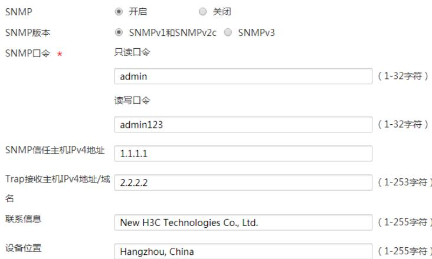  
\*SNMP只读口令和SNMP读写口令至少配置一项目不能相同。

确定

# 1.4.4 配置 SNMPv3

# 1. 注意事项

网管软件和设备必须配置相同的用户名、认证密码和加密密码。

# 2. 配置步骤

(1) 单击导航树中[高级选项/SNMP]菜单项，进入 SNMP 配置页面。  
(2) 选择“开启”SNMP。  
(3) 选择“SNMPv3”版本。  
(4) 在“用户名”配置项处，输入用户名。  
(5) 在“认证密码”配置项处，输入认证密码。  
(6) 在“加密密码”配置项处，输入加密密码。  
(7) 在“SNMP 信任主机 IPv4 地址”配置项处，输入网管软件的地址。只有指定地址的网管软件可以管理设备。如果不配置该参数，则用户名、认证密码和加密密码正确的网管软件均可以管理设备。  
(8) 在“Trap 接收主机 IPv4 地址/域名”配置项处，输入接收告警信息的主机的 IPv4 地址或域名，通常为网管软件的IP地址。  
(9) 在“联系信息”配置项处，输入设备管理员的联系方式。  
(10) 在“设备位置”配置项处，输入设备所处的地理位置，方便快速定位设备。  
(11) 点击<确定>按钮，完成配置。

图1-10 配置 SNMPv3

# SNMP

联机帮助

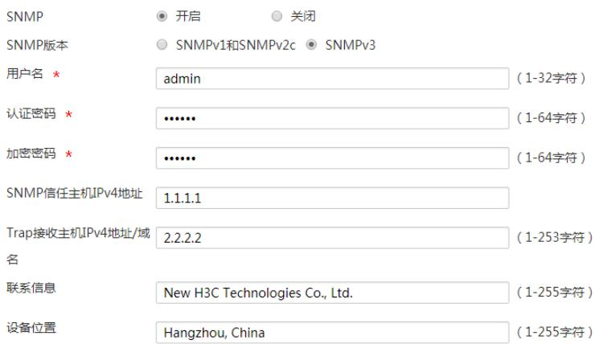

确定

# 1.5 CWMP

# 1. 简介

CWMP（CPE WAN Management Protocol，CPE 广域网管理协议）通过 ACS（Auto-ConfigurationServer，自动配置服务器）对 CPE（Customer Premises Equipment，用户侧设备）进行远程集中管理，解决了 CPE 设备管理困难的问题，并节约了维护成本。

# 2. 配置准备

需要准备支持ACS功能的服务器，并完成ACS服务器的配置。

# 3. 配置步骤

(1) 单击导航树中[高级选项/CWMP]菜单项，进入 CWMP 页面。  
(2) 选择开启 CWMP。  
(3) 在“ACS”配置项处，输入ACS的URL地址、用户名和密码。  
(4) CPE 向 ACS 发起的连接请求中携带 ACS 的用户名和密码。只有该用户名和密码与 ACS 本地配置的用户名和密码一致时，ACS才会接受CPE的连接请求。  
(5) 在“CPE”配置项处，配置CPE相关参数：

CPE的用户名和密码。为了防止被恶意控制，当ACS向CPE发送管理指令时，携带CPE的用户名和密码，只有该用户名和密码与CPE上配置的一致时，ACS才能控制CPE。

 是否发送 Inform 报文，及 Inform 报文的发送时间间隔。

CPE 通过向 ACS发送 Inform 报文发起连接请求，Inform 报文中携带 CPE和 ACS 的用户名、密码等信息。

如果希望设备可以周期性地自动连接ACS，则需要开启Inform报文发送功能。

 CPE上用于连接ACS的接口。

(6) 点击<确定>按钮，完成配置。

图1-11 配置 CWMP

# CwMP

联机帮助

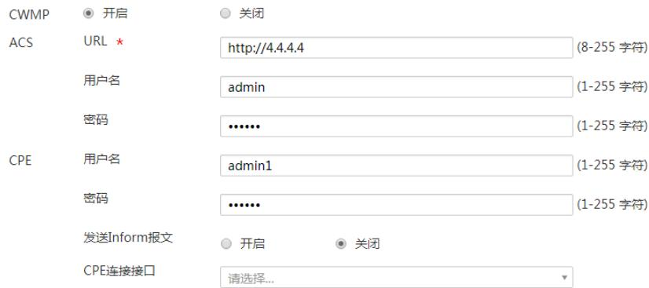

确定

# 1 系统工具

# 1.1 系统设置

# 1.1.1 简介

通过本功能可以设置设备信息和系统时间。

设备信息包括设备名称、设备位置和设备管理员的联系方式，方便管理员管理和定位设备。其中，设备名称可以修改，设备位置和联系方式不可修改。

系统时间包括日期、时间和时区等。为了便于管理设备，并保证本设备与其它网络设备协同工作，您需要为设备配置准确的系统时间。

系统时间的获取方式有两种：

手工设置日期和时间。该方式下，用户手工指定的日期和时间即为当前的系统时间。后续，设备使用内部时钟信号计时。如果设备重启，系统时间将恢复到出厂时间。  
• 自动同步网络日期和时间。该方式下，设备使用从NTP服务器获取的时间作为当前的系统时间，并周期性地同步NTP服务器的时间，以便和NTP服务器的系统时间保持一致。即便本设备重启，设备也会迅速重新同步NTP服务器的系统时间。如果您管理的网络中有NTP服务器，推荐使用该方式，该方式获取的时间比手工配置的时间更精准。

# 说明

建议使用以下浏览器访问 Web：Internet Explorer 10 及以上版本、Chrome 57 及以上版本、Firefox35及以上版本。

# 1.1.2 配置设备信息

(1) 单击导航树中[系统工具/系统设置]菜单项，进入系统设置配置页面。  
(2) 单击“设备信息”页签，进入设备信息配置页面。  
(3) 在“设备名称”配置项处，输入设备名称，例如以“设备型号.IP地址”为设备名称。  
(4) 点击<应用>按钮，完成配置。

图1-1 设备信息  
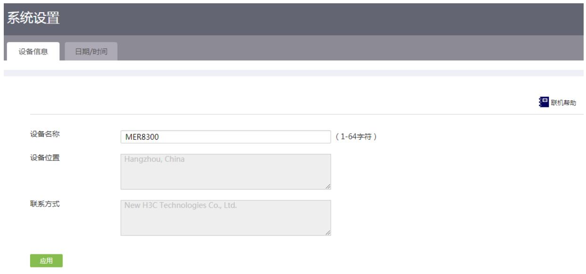

# 1.1.3 手工设置日期和时间

# 1. 注意事项

如果设备重启，系统时间将恢复到出厂时间。

# 2. 配置准备

了解设备所处的时区。全球分为 24 个时区，请将设备的时区配置为设备所在地理区域的时区。例如，设备在中国，请选择“北京,重庆,香港特别行政区,乌鲁木齐(GMT+08:00)”；如果设备位于美国，请选择“中部时间(美国和加拿大)(GMT-06:00)”。

# 3. 配置步骤

(1) 单击导航树中[系统工具/系统设置]菜单项，进入系统设置配置页面。  
(2) 单击“日期/时间”页签，进入系统时间配置页面。  
(3) 在日期和时间配置项处，选择“手工设置日期和时间”选项。  
(4) 将系统时间配置为设备所在地理区域的当前时间。

a. 选择年月日。

b. 选择时分秒。界面中供选择的分钟和秒钟数值为3的倍数（00、03、06、09、……、57），您可以通过向上或者向下的箭头来进行微调。例如要配置分钟数为20，则先选中18，再点击两次向上的箭头即可得到20。

(5) 将时区配置为设备所在地理区域的时区。  
(6) 点击<应用>按钮，完成配置。

图1-2 手工设置日期和时间  
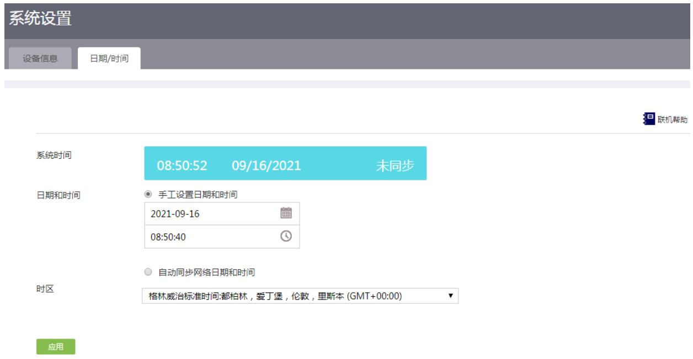

# 1.1.4 自动同步网络日期和时间

# 1. 注意事项

设备和 NTP服务器上配置的时区必须相同，否则，会导致设备的系统时间和NTP服务器的系统时间不一致。

# 2. 配置准备

了解设备所处的时区。全球分为 24 个时区，请将设备的时区配置为设备所在地理区域的时区。例如，设备在中国，请选择“北京,重庆,香港特别行政区,乌鲁木齐(GMT+08:00)”；如果设备位于美国，请选择“中部时间(美国和加拿大)(GMT-06:00)”。

# 3. 配置步骤

(1) 单击导航树中[系统工具/系统设置]菜单项，进入系统设置配置页面。  
(2) 单击“日期/时间”页签，进入系统时间配置页面。  
(3) 选择“自动同步网络日期和时间”。  
(4) 点击“默认NTP服务器列表”，查看设备出厂时配置的缺省NTP服务器。  
(5) 添加 NTP 服务器配置，输入 NTP 服务器的 IP 地址或主机名。  
(6) 将时区配置为设备所在地理区域的时区。  
(7) 点击<应用>按钮，完成配置。

图1-3 自动同步网络日期和时间  
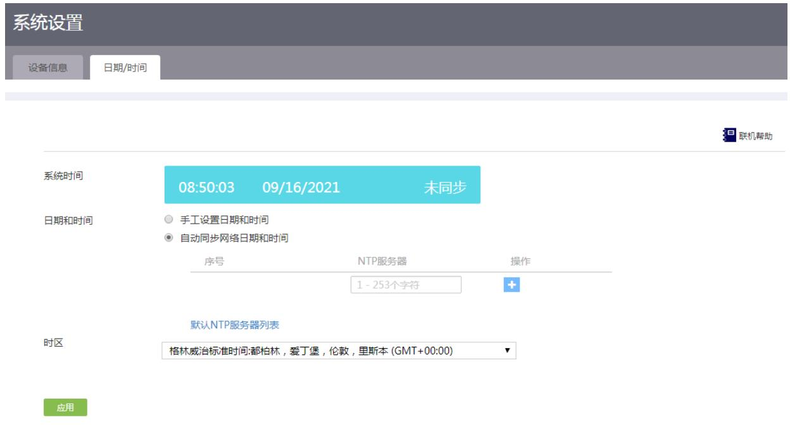

# 说明

设备出厂是否携带缺省NTP服务器与设备的型号有关，请以设备的实际情况为准。

如果设备出厂配置了NTP服务器，用户可使用缺省的NTP服务器，也可以自行指定NTP服务器。设备会从这些服务器中选择一台当前可用的、时间精度最高的服务器保持同步。如果NTP服务器均故障，设备将使用内部时钟信号继续计时，待 NTP服务器恢复后，再同步 NTP服务器的时间。

# 1.2 网络诊断

# 1.2.1 简介

通过本功能可以对网络故障进行诊断，包括如下功能：

Tracert通信测试：用于检查从设备到达目标主机所经过的路由情况。  
Ping通信测试：用于检测网络，测试另一台设备或主机是否可达。  
诊断信息：诊断信息为各功能模块的运行信息，用于定位问题。设备会将该信息以压缩文件的形式自动保存到您的终端设备。  
端口镜像：用于将被镜像端口的报文自动复制到镜像端口，实时提供各端口传输状况的详细信息，方便网络管理人员进行流量监控、性能分析和故障诊断。  
抓包工具：用于抓取网络数据报文，以便更有效地分析网络故障。本抓包工具使用 tcpdump在后台运行，抓包完成后，会自动导出抓取的文件“flash--packetCapture.pcap”供用户保存到本地。

# 1.2.2 Tracert 通信测试

(1) 单击导航树中[系统工具/网络诊断]菜单项，进入网络诊断页面。  
(2) 单击“Tracert”页签，进入 Tracert 通信测试页面。  
(3) 在“目的 IP 地址或者主机名”配置项处，输入需要路由跟踪的目的 IP 地址或者主机名。  
(4) 点击<开始>按钮，系统开始进行检测。检测的过程和结果显示在当前页面。

图1-4 配置 Tracert  
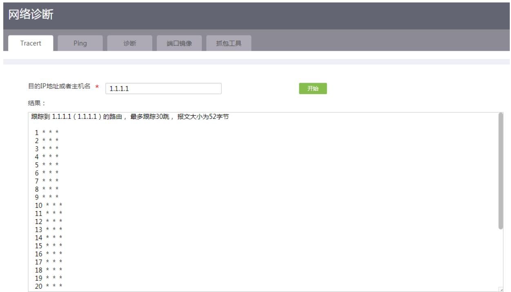

# 1.2.3 Ping 通信测试

(1) 单击导航树中[系统工具/网络诊断]菜单项，进入网络诊断页面。  
(2) 单击“Ping”页签，进入 Ping 通信测试页面。  
(3) 在“目的IP地址或者主机名”配置项处，输入需要Ping的目的 IP地址或者主机名。  
(4) 在“源接口或IP地址”配置项处，选择需要检测的源接口或IP地址。  
(5) 点击<开始>按钮，系统开始进行检测。检测的过程和结果显示在当前页面，说明网络发包的测试情况和与测试主机的往返平均时延。

图1-5 配置 Ping 通信测试  
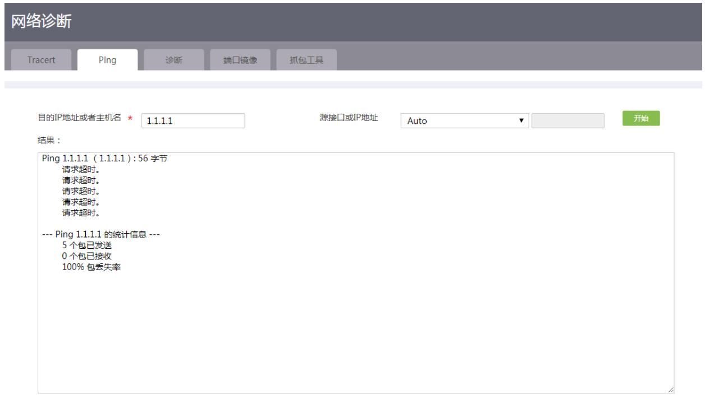

# 1.2.4 诊断信息

(1) 单击导航树中[系统工具/网络诊断]菜单项，进入网络诊断页面。  
(2) 单击“诊断”页签，进入收集网络诊断信息页面。  
(3) 点击<收集诊断信息>按钮，系统开始收集诊断信息。

图1-6 收集诊断信息  

# 诊断

诊断信息为各个功能模块的运行信息，用于定位问题。设备会将该信息以压缩文件的形式自动保存到您的登录终端。

收集诊断信息

# 1.2.5 端口镜像

(1) 单击导航树中[系统工具/网络诊断]菜单项，进入网络诊断页面。

(2) 单击“端口镜像”页签，进入端口镜像页面。  
(3) 根据需要选择“二层镜像”或“三层镜像”选项。  
(4) 设置镜像的源端口：

a. 在“接口”配置项处，选择镜像的源端口，即与数据监测设备相连的端口。

b. 在“方向”配置项处，选择镜像的方向。

 若选择“入方向”，表示仅复制源端口收到的报文。  
 若选择“出方向”，表示仅复制源端口发出的报文。  
 若选择“双向”，表示对源端口收到和发出的报文都进行复制。  
c. 完成“接口”和“方向”配置项的选择后，点击“+”图标，添加镜像的源端口。可根据需要添加多个镜像的源端口。

(5) 在“目的端口”配置项处，选择镜像的目的端口，即与数据监测设备相连的端口。

(6) 点击<确定>按钮，系统开始端口镜像。

图1-7 配置端口镜像  

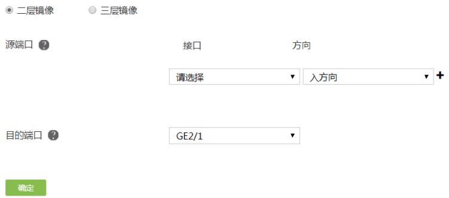

# 1.2.6 抓包工具

# 1. 注意事项

使用该功能前，请确保存储介质上有足够的空间存储抓包文件，否则，会因为存储空间不够导致抓包任务提前终止。

# 2. 配置步骤

(1) 单击导航树中[系统工具/网络诊断]菜单项，进入网络诊断页面。  
(2) 单击“抓包工具”页签，进入抓包工具页面。  
(3) 在“接口”配置项处，选择需要抓取数据的接口，支持当前路由器的所有的WAN接口。  
(4) 在“抓包长度”配置项处，输入tcpdump数据包的抓取长度，单位为字节。如果数据包长度大于此数值，数据包将会被截断。需要注意的是，采用长的抓取长度，会增加包的处理时间，并且会减少tcpdump可缓存的数据包的数量，从而会导致数据包的丢失。所以，在能抓取我们想要的包的前提下，抓取长度越小越好。

(5) 在“协议”配置项处，选择需要过滤的协议类型。如果选择 ALL，将抓取当前接口下所有报文。  
(6) 在“抓包文件大小”配置项处，输入抓取报文的大小，单位为 MB。  
(7) 在“抓包时间”配置项处，输入抓包的持续时长，单位为秒。  
(8) 在“源主机”、“目的主机”配置项处，选择抓取报文时过滤发出或者接收报文的主机。

 所有主机：对源或者目的主机进行过滤，即抓取所有的源/目的主机的报文。  
 IP地址过滤：选择此项时，需设置主机的IP地址。  
 MAC地址过滤：选择此项时，需设置主机的MAC地址。

(9) 点击<开始>按钮，系统开始进行抓包。抓包的过程和当前抓取的分组数显示在当前页面，在抓包的过程中，您可以点击<取消>按钮，终止当前的操作，并导出抓取的文件“flash--packetCapture.pcap”。

图1-8 配置抓包工具  
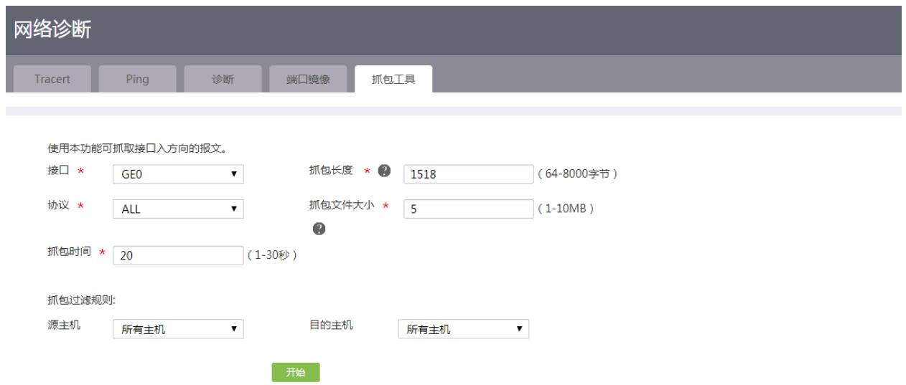

# 1.3 管理账户

# 1.3.1 简介

可以通过本页面对登录设备的管理员账户信息进行管理和维护，包括添加管理账户以及修改或删除管理账户。

# 1.3.2 添加管理账户

(1) 单击导航树中[系统工具/管理账户]菜单项，进入管理账户配置页面。

图1-9 管理账户  
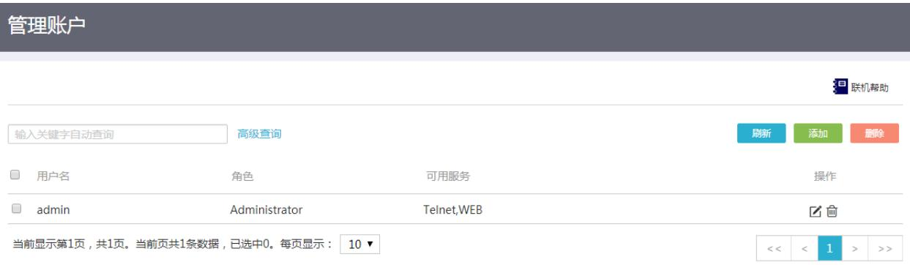

(2) 点击<添加>按钮，进入添加管理员页面。  
(3) 在“用户名”配置项处，输入管理员名称。  
(4) 在“密码”配置项处，输入管理员密码。如果不设置管理员密码，则管理员登录设备时，不需要提供密码。为提高管理员帐户的安全性，建议您设置管理员密码。  
(5) 在“确认密码”配置项处，请再次输入您设置的密码，并确保与之一致。  
(6) 在“角色”配置项处，选择该账户登录时的角色。

 如果该账户需要具有最高管理权限，请选择“Administrator”  
 如果该账户仅拥有普通的查看权限，无配置权限，请选择“Operator”。

(7) 在“可用服务”配置项处，点击复选框选择允许该管理员账户使用的网络服务。

 Console：表示管理员可通过 Console口登录设备。  
 Telnet：表示管理员可通过Telnet方式登录设备。使用该服务的管理员需要使用Telnet客户端来访问设备，设备将作为Telnet服务器为其提供服务。  
 FTP：表示管理员可通过FTP访问设备文件系统资源。使用该服务的管理员需要使用FTP客户端来访问设备，设备将作为FTP服务器为其提供服务。  
 WEB：表示管理员可通过Web页面登录设备。  
 SSH：表示管理员可通过SSH方式登录设备，该方式比Telnet方式更安全。使用该服务的管理员需要使用SSH客户端来访问设备，设备将作为SSH服务器为其提供服务。

(8) 在“同时在线最大用户数”配置项处，输入允许同时使用该账户在线的用户数目。如果不设置该值，则表示不限制使用该账户在线的用户数。需要注意的是，使用FTP服务的管理员不受此配置限制。  
(9) 在“FTP 目录”配置项处，输入管理员通过 FTP 方式访问设备时的工作路径，例如 flash:/dpi。建议您首先通过[系统工具/系统升级]菜单项的“文件管理”页面查看系统中已有的文件路径，以确保此处输入的工作路径准确。  
(10) 点击<确定>按钮，完成配置。

图1-10 添加管理员  
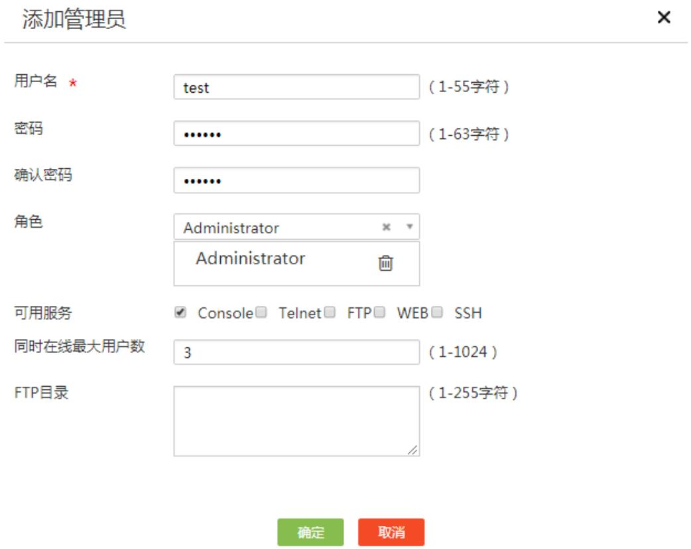

# 1.3.3 修改管理账户

(1) 单击导航树中[系统工具/管理账户]菜单项，进入管理账户配置页面。  
(2) 在用户行的“操作”区域，点击编辑按钮，进入修改管理员配置页面。  
(3) 可在“重置密码”配置项处，输入新密码。重置了管理员账户的密码后，该管理员下次登录设备时还需要修改密码。  
(4) 如果您修改了密码，请在“确认密码”配置项处，再次输入新密码，并确保与之一致。  
(5) 可在“角色”配置项处，选择该账户的新角色，并删除不需要的角色。

 如果该账户需要具有最高管理权限，请选择“Administrator”  
 如果该账户仅拥有普通的查看权限，无配置权限，请选择“Operator”。

(6) 可在“可用服务”配置项处，点击复选框选择允许该管理员账户使用的网络服务。

 Console：表示管理员可通过 Console口登录设备。  
 Telnet：表示管理员可通过Telnet方式登录设备。使用该服务的管理员需要使用Telnet客户端来访问设备，设备将作为Telnet服务器为其提供服务。  
 FTP：表示管理员可通过FTP访问设备文件系统资源。使用该服务的管理员需要使用FTP客户端来访问设备，设备将作为FTP服务器为其提供服务。  
 WEB：表示管理员可通过Web页面登录设备。

(7) SSH：表示管理员可通过 SSH 方式登录设备，该方式比 Telnet 方式更安全。使用该服务的管理员需要使用SSH客户端来访问设备，设备将作为SSH服务器为其提供服务。

(8) 可在“同时在线最大用户数”配置项处，输入允许同时使用该账户在线的用户数目。如果不设置该值，则表示不限制使用该账户在线的用户数。需要注意的是，使用FTP服务的管理员不受此配置限制。  
(9) 可在“FTP目录”配置项处，输入管理员通过FTP方式访问设备时的工作路径，例如flash:/dpi。建议您首先通过[系统工具/系统升级]菜单项的“文件管理”页面查看系统中已有的文件路径，以确保此处输入的工作路径准确。  
(10) 点击<确定>按钮，完成配置。

图1-11 修改管理账户  
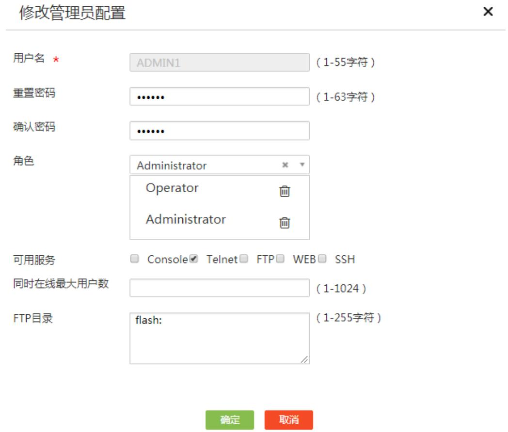

# 1.3.4 删除管理账户

(1) 单击导航树中[系统工具/管理账户]菜单项，进入管理账户配置页面。  
(2) 在用户行的“操作”区域，点击删除按钮，删除该管理员账户。  
(3) 在弹出的“确认提示”对话框中，点击<是>按钮，完成删除操作。

# 1.4 远程管理

# 1.4.1 简介

远程管理功能既可以用来检测网络的连通性，又可以为用户提供登录设备、管理设备的方式。远程管理功能包括：

Ping：通过 ping 功能，可以检测网络的连通性，及时了解网络状况。  
Telnet：是一种实现远程登录服务的协议。用户可以在PC上通过Telnet方式登录设备，对设备进行远程管理。  
SSH（Secure Shell，安全外壳）：用来在不安全的网络环境中，通过加密机制和认证机制，实现安全的远程访问以及文件传输。如果希望用户更安全地访问设备，则可以使用SSH服务。设备作为SSH服务器，提供如下几种服务：

 Stelnet：即安全的Telnet。Stelnet实现的功能与Telnet相同，但访问方式更加安全可靠。  
 SFTP：即安全的FTP。可提供安全可靠的网络文件传输服务，使得用户可以安全登录到设备上进行文件管理操作，且能保证文件传输的安全性。  
 SCP：即 Secure Copy。可提供安全的文件复制功能。

HTTP/HTTPS：是基于 HTTP、HTTPS 超文本传输协议的两种 Web 登录方式。HTTPS 登录方式的安全性能高于HTTP登录方式。用户可以在PC上使用HTTP/HTTPS协议登录设备的Web界面，通过Web界面直观地配置和管理设备。

云服务：是指设备与 H3C云平台服务器（H3C Cloud server）通过 Internet建立的远程管理通道。网络管理员可以通过云平台服务器对分布在不同地域的设备进行远程管理和维护。

# 1.4.2 配置 Ping

(1) 单击导航树中[系统工具/远程管理]菜单项，进入远程管理页面。  
(2) 单击 Ping 页签。   
(3) 勾选一个发送 Ping 报文的接口。  
(4) 点击<应用>按钮。

图1-12 配置 Ping 服务  
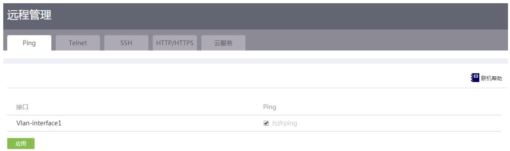

# 1.4.3 配置 Telnet

(1) 单击导航树中[系统工具/远程管理]菜单项，进入远程管理配置页面。  
(2) 单击“Telnet”页签，进入 Telnet 配置页面。  
(3) 在“Telnet 服务”配置项处，点击按钮，使得按钮状态为“ON”，开启 Telnet 服务。  
(4) 在“IPv4 端口”或“IPv6 端口”配置项处，输入 Telnet 服务使用的端口号。

请根据组网需求选择IP协议对应的端口类型：

 如果用户通过IPv4网络Telnet登录设备时，使用的端口号需要与本配置项指定的端口号相同。  
 如果用户通过IPv6网络Telnet登录设备时，使用的端口号需要与本配置项指定的端口号相同。

(5) 在“管理员 IP”列表下可配置一个或者多个 IPv4 地址用于远程管理设备。

(6) 点击<应用>按钮，完成配置。

图1-13 配置 Telnet 服务  

联机帮助

Telnet服务 ON （23，1025-65535，缺省为23） IPv6端口23 （23，1025-65535，缺省为23）

应用

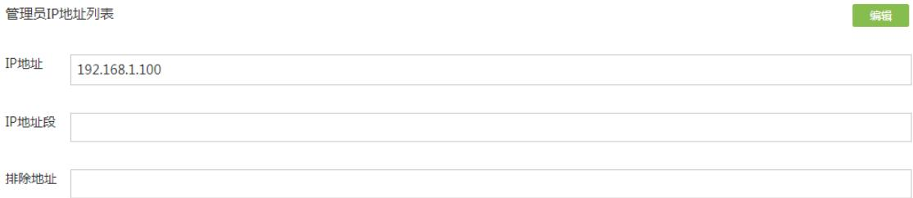

(7) 点击<添加>按钮，进入添加管理员 IP 地址页面。  
(8) 添加管理员 IP 地址：

a. 在“IP地址”配置项处，输入管理员IP地址。  
b. 在“IP地址段”配置项处，配置管理员IP地址段。所配置的起始地址必须小于结束地址，IP地址可以不在IP地址段内。  
c. 在“排除地址”配置项处，输入排除的IP地址。排除地址必须在IP地址段内，排除地址不能通过Telnet访问设备。

(9) 点击右侧的“ ”按钮，提交配置。   
(10) 根据实际需求，重复步骤（7）和步骤（8），完成所有管理员IP地址的添加。  
(11) 点击<确定>按钮，完成管理员IP地址的配置。

图1-14 配置管理员IP地址  
添加管理员IP地址  

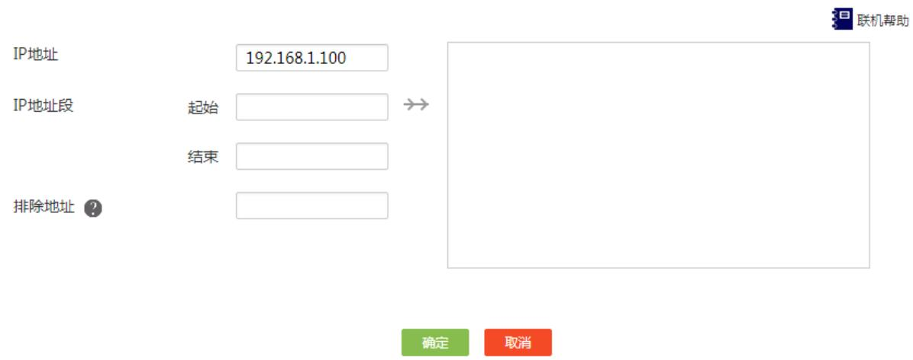

# 1.4.4 配置 SSH

(1) 单击导航树中[系统工具/远程管理]菜单项，进入远程管理配置页面。  
(2) 单击“SSH”页签，进入SSH配置页面。  
(3) 根据需要执行以下任意一个或多个操作，开启相应的 SSH 服务。

 点击“Stelnet 服务”后的按钮，使其置为“ON”状态，开启 Stelnet 服务。  
 点击“SFTP 服务”后的按钮，使其置为“ON”状态，开启 SFTP 服务。  
 点击“SCP”服务后的按钮，使其置为“ON”状态，开启 SCP 服务。

图1-15 配置 SSH 服务  

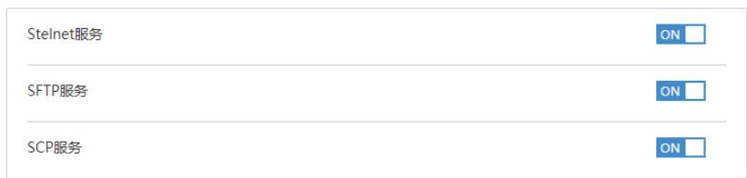

# 1.4.5 配置 HTTP/HTTPS

(1) 单击导航树中[系统工具/远程管理]菜单项，进入远程管理配置页面。

(2) 单击“HTTP/HTTPS”页签，进入 HTTP/HTTPS 配置页面。  
(3) 在“HTTP 登录端口”配置项处输入 HTTP 方式登录设备对应的端口号，建议使用 10000 以上的端口号。  
(4) 在“HTTPS 登录端口”配置项处输入 HTTP 方式登录设备对应的端口号，建议使用 10000 以上的端口号。  
(5) 在“登录超时时间”配置项处，输入登录超时时间。  
(6) 点击<应用>按钮，完成 HTTP/HTTPS 服务的端口号和登录超时时间的配置。

图1-16 配置 HTTP/HTTPS 服务  
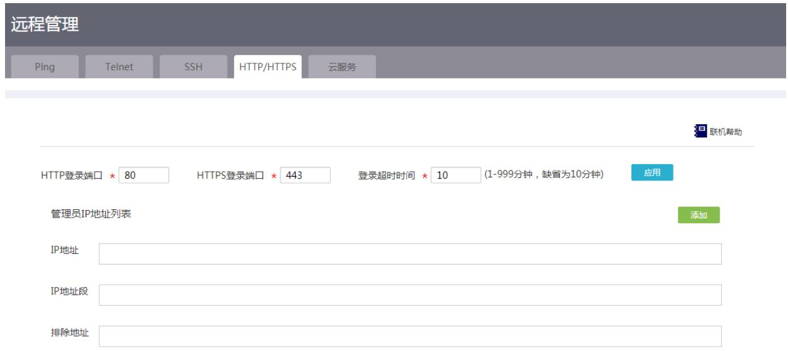

(7) 点击<添加>按钮，进入添加管理员 IP 地址页面。  
(8) 添加管理员IP地址：

a. 在“IP地址”配置项处，输入管理员IP地址。  
b. 在“IP地址段”配置项处，配置管理员IP地址段。所配置的起始地址必须小于结束地址，IP地址可以不在IP地址段内。  
c. 在“排除地址”配置项处，输入排除的IP地址。排除地址必须在IP地址段内，排除地址不能访问Web。

(9) 点击右侧的“ ”按钮，提交配置。

(10) 根据实际需求，重复步骤（8）和步骤（9），完成所有管理员IP地址的添加。  
(11) 点击<确定>按钮，完成管理员IP地址的配置。

缺省情况下，设备允许 IP地址段“1.1.1.1～255.255.255.255”访问Web，用户可以根据实际需求修改管理员IP地址，修改时，请保证设置正确，即保证有管理员能够正常访问Web。建议用户将一个VLAN接口所在的地址段添加到管理员IP地址中，且不要删除。

图1-17 配置管理员IP地址  
添加管理员IP地址  

若未配置管理员IP地址，设备将自动为管理员地址列表添加默认推荐地址。

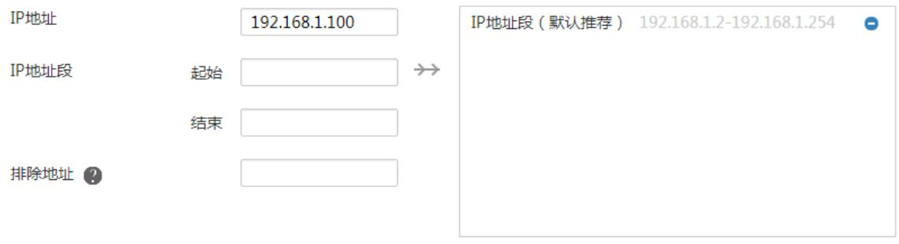

取消

# 1.4.6 配置云服务

(1) 单击导航树中[系统工具/远程管理]菜单项，进入远程管理配置页面。  
(2) 单击“云服务”页签，进入云服务配置页面。  
(3) 在“云服务”配置项处，单击选中<开启>按钮，开启云服务。  
(4) 在“云平台服务器域名”配置项处，输入云平台的域名。  
(5) 在“云场所定义”配置项处，输入设备的系统名称。  
(6) 点击<应用>按钮，完成配置。  
(7) 使用手机扫描页面右侧的二维码，下载并安装“Cloudnet”应用程序，然后在手机上打开“Cloudnet”应用程序登录云平台，实现对设备的远程管理和维护。

图1-18 配置云服务  

云服务

云平台服务器域名

云场所定义

云连接状态

云管理状态

应用

开启

未连接

未纳入管理

APP下载   

# 1.5 配置管理

# 1.5.1 简介

本功能主要用于对设备的配置文件进行管理。配置文件是指用来保存设备配置的文件。

通过本功能可以：

查看当前配置：如果希望查看设备的当前配置，例如设备版本号、接口IP地址等，则需通过单击导航树中[系统工具/配置管理]菜单项，点击“查看当前配置”页签查看设备的当前配置。  
恢复出厂配置：如果设备没有配置文件或者配置文件损坏时，希望设备能够正常启动运行，则需通过本功能将设备上的配置恢复到出厂状态。  
保存当前配置：对设备进行配置后，如果希望设备重启后配置能继续生效，则需通过本功能保存设备当前所有配置。  
从备份文件恢复：设备配置错误后，如果希望设备恢复到正确配置运行状态，则需通过本功能恢复设备配置。  
导出当前配置：如果希望将当前配置文件导出作为备份配置文件，则需通过本功能将当前配置文件导出保存到指定路径。

# 1.5.2 恢复出厂配置

(1) 单击导航树中[系统工具/配置管理]菜单项，进入配置管理页面。  
(2) 单击“恢复出厂配置”页签，进入恢复出厂配置页面。

图1-19 恢复出厂配置  

(3) 点击<重置>按钮，在确认提示框中选择“是”选项，完成恢复出厂配置并强制重启设备。

# 1.5.3 保存当前配置

(1) 单击导航树中[系统工具/配置管理]菜单项，进入配置管理页面。  
(2) 单击“备份恢复配置”页签，进入备份恢复配置页面。

图1-20 备份恢复配置  

保存当前配置

从备份文件恢复

导出当前配置

(3) 点击<保存当前配置>按钮，进入保存当前配置页面。  
(4) 选择当前配置的保存方式：

 如果选择“保存到下次启动配置文件”，将当前配置保存到存储介质的根目录下，并将该文件设置为主用下次启动配置文件。  
 如果选择“保存到指定配置文件”，则可以输入自定义的配置文件名称。设备会将当前配置保存到指定的配置文件中，并将该文件设置为主用下次启动配置文件。

图1-21 保存当前配置

# 保存当前配置

×

。 保存到下次启动配置文件  
保存到指定配置文件

确定

取消

(5) 点击<确定>按钮，完成保存当前配置。

# 1.5.4 从备份文件恢复

(1) 单击导航树中[系统工具/配置管理]菜单项，进入配置管理页面。  
(2) 单击“备份恢复配置”页签，进入备份恢复配置页面。

(3) 点击<从备份文件恢复>按钮，进入从备份文件恢复页面。  
(4) 点击“选择文件”按钮，选择特定路径下的备份配置文件。

图1-22 从备份文件恢复  

(5) 点击<确定>按钮，需手动重启设备，才可以恢复配置。

# 1.5.5 导出当前配置

(1) 单击导航树中[系统工具/配置管理]菜单项，进入配置管理页面。  
(2) 单击“备份恢复配置”页签，进入备份恢复配置页面。  
(3) 点击<导出当前配置>按钮，选择保存路径，即可将当前配置下载到本地PC。

# 1.6 系统升级

# 1.6.1 简介

本功能主要用来对设备版本进行升级以及对设备上的文件进行管理。如果希望完善当前软件版本漏洞或者更新应用功能，则需通过版本升级功能来实现。

版本升级支持以下两种操作：

手动升级系统软件：将本地的IPE文件上传至设备并进行升级。  
自动升级系统软件：设备从云平台下载最新版本的软件包并进行升级。

文件管理支持以下三种操作：

上传：本地的文件上传至设备。例如，对设备进行系统升级前，需要将IPE文件上传到设备。  
删除：删除设备上的文件。上传文件到设备时，如果内存空间不足以存储要上传的文件，则需要删除某些非重要文件，释放存储空间。  
下载：将设备上保存的文件下载到本地。用户可以根据自己需求将设备上的文件下载到本地，以便备份或者数据分析。

# 1.6.2 版本升级

# 1. 手动升级系统软件

(1) 单击导航树中[系统工具/系统升级]菜单项，进入系统升级页面。  
(2) 单击“版本升级”页签，进入版本升级配置页面。

图1-23 版本升级  

(3) 点击<手动升级系统软件>按钮，进入升级系统软件页面。  
(4) 点击<选择文件>按钮，选择设备升级使用的 IPE 文件。  
(5) 如果希望设备在完成软件升级后立即重启，则需要勾选“立即重启设备”。  
(6) 点击<确定>按钮，设备会从本地下载选择的 IPE 文件并进行升级。

图1-24 手动升级系统软件  

# 2. 自动升级系统软件

# 注意事项

在自动升级系统软件前请先配置云服务，保证设备与云平台成功连接。先单击导航树中[系统工具/远程管理]菜单项进入远程管理配置页面，再单击“云服务”页签进入云服务配置页面。

# 配置步骤

(1) 单击导航树中[系统工具/系统升级]菜单项，进入系统升级页面。  
(2) 单击“版本升级”页签，进入版本升级配置页面  
(3) 点击<自动升级系统软件>按钮，设备会从云平台下载最新版本的软件包并进行升级。

图1-25 自动升级系统软件  

# 1.6.3 文件管理

# 1. 上传

(1) 单击导航树中[系统工具/系统升级]菜单项，进入系统升级页面。  
(2) 单击“文件管理”页签，进入文件管理配置页面。

图1-26 系统文件管理  

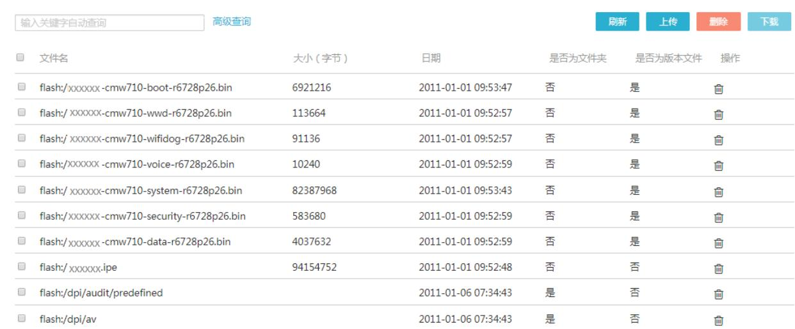  
当前显示第1页，共7页。当前页共10条数据，已选中0。每页显示：10·

(3) 点击<上传>按钮，进入上传页面。  
(4) 点击<选择文件>按钮，选择特定路径下保存的文件。  
(5) 点击<确定>按钮，完成文件上传。

图1-27 上传文件

上传文件

选择文件未选择任何文件

取消

# 2. 删除

# 注意事项

不能删除版本文件，否则会导致设备运行出错。

# 配置步骤

(1) 单击导航树中[系统工具/系统升级]菜单项，进入系统升级页面。  
(2) 单击“文件管理”页签，进入文件管理配置页面。  
(3) 在文件名列表中勾选要删除的文件。  
(4) 点击<删除>按钮，完成文件删除。

图1-28 删除文件

确认提示

确定要删除选中的数据吗？

否

# 3. 下载

(1) 单击导航树中[系统工具/系统升级]菜单项，进入系统升级页面。  
(2) 单击“文件管理”页签，进入文件管理配置页面。  
(3) 在文件名列表中勾选要下载的文件。  
(4) 点击<下载>按钮，即可实现文件下载到本地PC。

# 1.7 License管理

# 1.7.1 简介

用户需要为设备购买授权码、申请激活文件、安装License，才能使用设备上基于License的特性。哪些特性需要安装License可通过“License和特性”页签来查看。

# 1.7.2 注意事项

对于一台设备，请不要多个用户同时进行License操作，以免操作失败。

# 1.7.3 查看哪些特性需要 License

(1) 单击导航树中[系统工具/License管理]菜单项，进入License管理配置页面。  
(2) 单击“License 和特性”页签，进入 License 和特性显示页面。  
(3) 了解特性的授权情况。

 “特性名称”列：表示设备支持的、需安装License才能正常使用的特性。  
 “是否授权”列：取值为“Y”时，表示已安装了License；取值为“N”时，表示未安装License。  
 “状态”列：表示License的状态。取值为“Formal”时表示当前已经为该特性安装了正式License，License处于有效状态；取值为“Trial”时表示当前已经为该特性安装了临时License，License 处于有效状态；取值为“Pre-licensed”时表示在出厂时已经为该特性安装了预授权，License处于有效状态；取值为“-”时表示当前无有效License，用户如需使用该特性，请安装对应的 License。

图1-29 License 和特性  
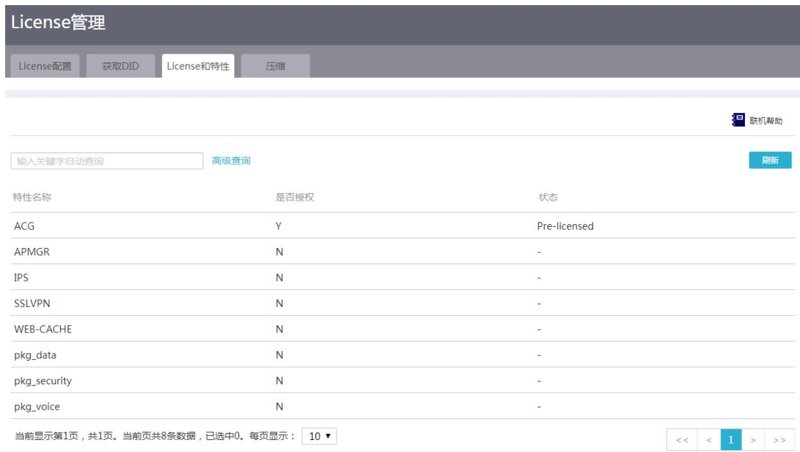

# 1.7.4 压缩 License 存储区

# 1. 功能简介

过期后的 License 会一直占用 License 存储区。如果 License 存储区空间耗尽，会导致新的 License安装失败。此时，需要压缩License存储区来释放空间。

# 2. 注意事项

压缩 License 可能会导致 DID 变化。因此，在压缩 License 存储区前，请确保使用旧 DID 申请的License 已经安装完毕。否则，License 存储区压缩后，使用旧 DID 申请的 License 将无法继续安装。

# 3. 配置步骤

(1) 单击导航树中[系统工具/License 管理]菜单项，进入 License 管理配置页面。  
(2) 单击“压缩”页签，进入压缩License存储区配置页面。  
(3) 确认设备还可安装的激活文件的个数。“设备还可安装的激活文件的个数”=“可安装激活文件个数”-“已安装激活文件的个数”。  
(4) 如果您当前需要安装的激活文件的个数大于“设备还可安装的激活文件的个数”，请点击<压缩>按钮，完成配置。否则，不需要压缩License存储区。

图1-30 压缩  

# 1.7.5 申请激活文件

# 1. 注意事项

用户获取到激活文件之后请妥善保存并备份，以免不慎丢失。

请不要打开激活文件，以免影响文件的格式，导致文件无效。

请不要修改激活文件的名称，以免影响授权。

如果在 H3C License管理平台填写正确信息后，仍申请激活文件失败，请联系技术支持人员。

# 2. 配置准备

通过购买授权书获取授权码。

# 3. 配置步骤

(1) 单击导航树中[系统工具/License管理]菜单项，进入License管理配置页面。  
(2) 单击“获取 DID”页签，进入 DID 显示页面。  
(3) 获取设备 SN 和 DID。  
(4) 登录 H3C License 管理平台（网址为 http://www.h3c.com/cn/License），获取 License 激活文件，具体方法请参见《http://www.h3c.com/cn/home/qr/default.htm?id=602》。

图1-31 获取 DID  
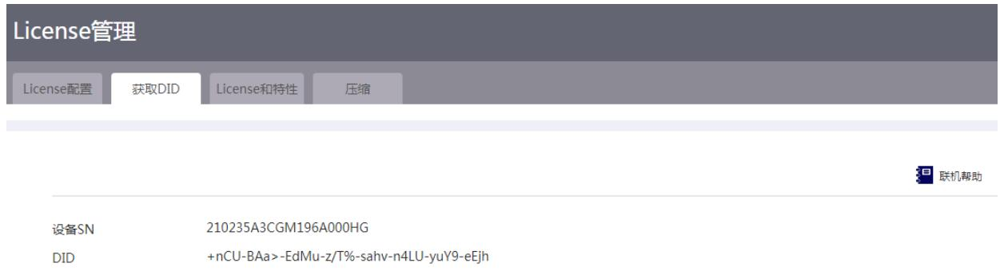

# 1.7.6 安装 License

(1) 单击导航树中[系统工具/License管理]菜单项，进入License管理配置页面。  
(2) 单击“License 配置”页签，进入 License 配置页面。

图1-32 License 配置  
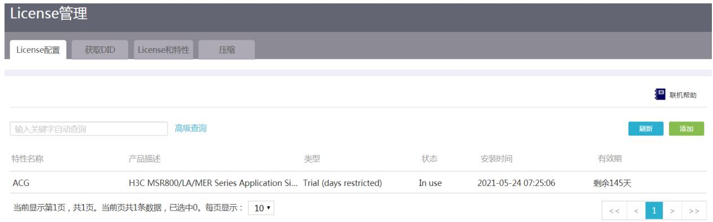

(3) 点击<添加>按钮，进入添加License页面。  
(4) 选择激活文件。  
(5) 点击<确定>按钮，完成配置。

图1-33 安装 License  
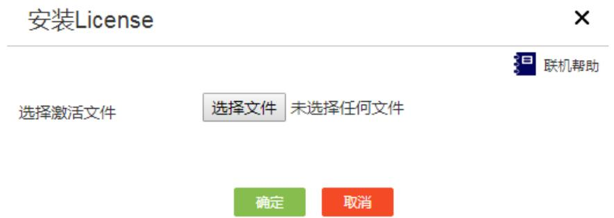

# 1.8 重新启动

# 1.8.1 简介

重新启动功能用于立即和定时重新启动设备。

# 1.8.2 立即重启

# 1. 注意事项

重新启动设备可能会导致业务中断，请谨慎使用。

# 2. 配置步骤

(1) 单击导航树中[系统工具/重新启动]菜单项，进入重新启动配置页面。  
(2) 在“立即重启”页签下，点击<重启设备>按钮，在弹出的确认提示对话框中：  
 勾选“保存配置”配置项，设备在重启之前先保存配置，以防止配置丢失。  
 勾选“强制设备不进行任何检查直接重启”配置项，则设备不进行自检，直接重启。

(3) 点击<确定>按钮，立即重新启动设备。

图1-34 立即重启  

重启

重新启动设备可能会导致业务中断，请谨慎使用。

重启设备

# 1.8.3 定时重启

(1) 单击导航树中[系统工具/重新启动]菜单项，进入重新启动配置页面。  
(2) 单击“定时重启”页签，进入定时重启配置页面。  
(3) 在“定时重启”配置处，选择“开启”选项。开启定时重启设备的功能。  
(4) 在“生效时间”配置处，设定每周设备重启的具体时间。  
(5) 点击<确定>按钮，设备将会在设定时间进行重启。

图1-35 定时重启  
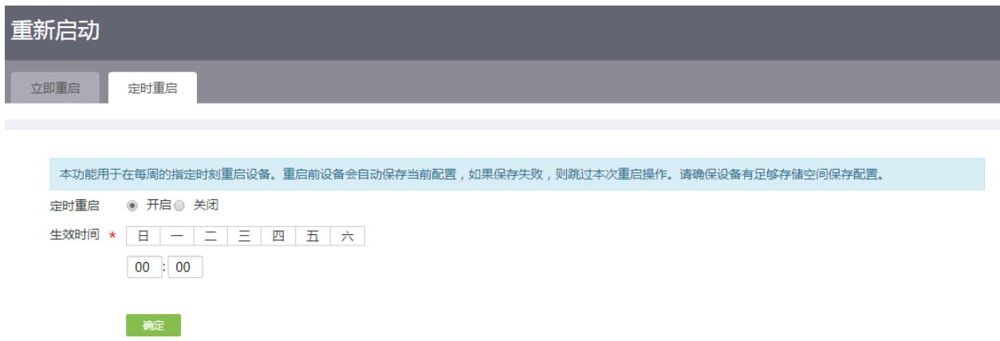

# 1.9 系统日志

# 1.9.1 简介

设备在运行过程中会生成系统日志。日志中记录了管理员在设备上进行的配置、设备的状态变化以及设备内部发生的重要事件等，为用户进行设备维护和故障诊断提供参考。

用户可以将日志发送到日志服务器集中管理，也可以直接在Web页面查看日志。

日志划分为如表10-1所示的八个级别，各级别的严重性依照数值从0～7依次降低。了解日志级别，能帮助您迅速筛选出重点日志。

表1-1 日志级别列表

<table><tr><td>数值</td><td>信息级别</td><td>描述</td></tr><tr><td>0</td><td>emergency</td><td>表示设备不可用的信息,如系统授权已到期</td></tr><tr><td>1</td><td>alert</td><td>表示设备出现重大故障,需要立刻做出反应的信息,如流量超出接口上限</td></tr><tr><td>2</td><td>critical</td><td>表示严重信息,如设备温度已经超过预警值,设备电源、风扇出现故障等</td></tr><tr><td>3</td><td>error</td><td>表示错误信息,如接口链路状态变化等</td></tr><tr><td>4</td><td>warning</td><td>表示警告信息,如接口连接断开,内存耗尽告警等</td></tr><tr><td>5</td><td>notification</td><td>表示正常出现但是重要的信息,如通过终端登录设备,设备重启等</td></tr><tr><td>6</td><td>informational</td><td>表示需要记录的通知信息,如通过命令行输入命令的记录信息,执行ping命令的日志信息等</td></tr><tr><td>7</td><td>debugging</td><td>表示调试过程产生的信息</td></tr></table>

# 1.9.2 将系统日志发往日志服务器

# 1. 配置准备

请确保设备和日志服务器能互相ping通，日志服务器才能收到设备发送的日志。

# 2. 配置步骤

(1) 单击导航树中[系统工具/系统日志]菜单项，进入系统日志配置页面。  
(2) 选择“发送到日志服务器”，输入日志服务器的 IP 地址或者域名地址。  
(3) 点击<应用>按钮，完成配置。

# 系统日志

应用

# 1.9.3 通过Web页面查看系统日志

(1) 单击导航树中[系统工具/系统日志]菜单项，进入系统日志配置页面。设备会逐条显示日志的生成时间、级别以及详细信息。  
(2) 点击<导出>按钮，可以将设备上已有的日志信息导出到登录PC上。

图1-36 系统日志

# 系统日志

应用

刷新

清除

导出

# 1 SmartMC

# 1.1 配置向导

# 1. 简介

SmartMC（Smart Management Center，智能管理中心）功能用于集中管理和维护大量分散的网络设备。在 SmartMC 网络中，有管理设备和成员设备两种角色。其中，管理设备用于管理所有成员设备，成员设备被管理设备管理。

用户可以在本页面将设备配置为管理设备，将设备配置为管理设备后，便可以访问“智能管理”、“智能运维”和“可视化”页面，通过这几个页面提供的功能，实现对成员设备的集中管理。将设备配置为管理设备后，不能再访问“配置向导”页面。

成员设备可以自动加入到SmartMC网络，也可以在“可视化> 拓扑”页面，点击<添加设备>按钮手动添加。对于成员设备，可以访问“配置向导”、“智能管理> 角色”和“智能管理> 关闭SmartMC”页面。在“配置向导”和“智能管理 > 角色”页面中，用户可以将成员设备切换为管理设备。

# 2. 注意事项

SmartMC网络中有且仅有一台管理设备。  
用户必须先配置好管理设备，再空配置启动成员设备，才能保证成员设备自动加入到SmartMC网络中。

# 3. 配置步骤

(1) 单击导航树中[配置向导]菜单项，进入配置向导配置页面。  
(2) 单击“管理IP”页签，进入管理IP配置页面。  
(3) 在“配置管理IP地址”配置项处，输入本设备的VLAN接口 1的 IP地址。管理IP是VLAN接口1的IP地址，SmartMC网络在VLAN 1内建立。如果已经为VLAN接口1配置了 IP地址，直接将VLAN接口1的 IP地址配置为管理IP即可。  
(4) 在“掩码长度”配置项处，输入管理IP地址的掩码长度。

图1-1 配置管理IP地址  

<table><tr><td>配置管理IP地址</td><td>192.168.0.3</td><td></td></tr><tr><td>掩码长度</td><td>24</td><td>(1-31)</td></tr></table>

#

(5) 点击<下一步>按钮，进入“出接口”配置页面，配置出接口。  
(6) 配置出接口是为了便于本PC直接访问成员设备的Web管理页面。当本PC和SmartMC网络所在的 VLAN 1不在同一网段时，无法在本PC上直接访问成员设备的Web管理页面。将管理设备上连接本PC的接口设置为出接口后，用户进入“可视化> 拓扑”页面，在拓扑图中选中一台成员设备，然后点击<登录Web页面>按钮，便可以直接访问该成员设备的Web管理页面。  
(7) 在“出接口”配置项处，将连接本PC的接口设置为出接口。

图1-2 配置出接口  

#

(8) 点击<下一步>按钮，进入“管理用户”配置页面，配置管理用户。  
(9) 管理用户是管理设备的本地用户。如果指定的用户不存在，设备会自动创建该本地用户。  
(10) 在“用户名”配置项处，输入本地用户的用户名。  
(11) 在“密码”配置项处，输入本地用户的登录密码。

图1-3 配置管理用户  
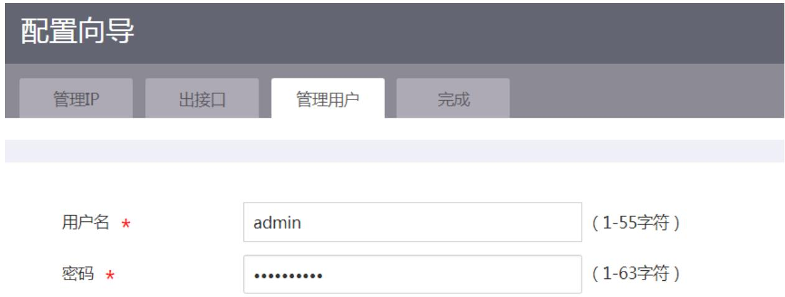

#

(12) 点击<下一步>按钮，进入“完成”页面。  
(13) 确认上述配置内容正确后，点击<确定>按钮，完成配置。

图1-4 完成配置  

管理IP地址 192.168.0.3

掩码长度 24

出接口 GigabitEthernet0/2

用户名 admin

# 1.2 智能管理

# 1.2.1 配置设备角色

# 1. 简介

用户可以在本页面切换设备角色，将管理设备切换为成员设备，或者将成员设备切换为管理设备。

# 2. 注意事项

将管理设备切换为成员设备后，请手工删除FTP服务器中原管理设备备份的配置文件。否则，会导致该设备下载错误的配置文件，影响网络正常运行。

# 3. 配置步骤

(1) 单击导航树中[智能管理]菜单项，进入智能管理配置页面。  
(2) 单击“角色”页签，进入设备角色配置页面。  
(3) 在“配置角色”配置项处，选择设备角色为“成员设备”或“管理设备”。  
(4) 点击<确定>按钮，完成配置。

图1-5 配置角色  

# 1.2.2 配置出接口

# 1. 简介

出接口是管理设备上的一个三层以太网接口，配置出接口是为了便于本 PC 直接访问成员设备的Web管理页面。

如图 11-6 所示，Host 通过 Interface 连接到管理设备，所在网段为 192.168.56.0/24，SmartMC 网络在VLAN 1内建立，所在网段为192.168.2.0/24。此时Host可以访问管理设备的Web管理页面，而无法访问两个成员设备的 Web 管理页面。如果将 Interface设置为 SmartMC 网络的出接口，用户通过 Interface访问管理设备的SmartMC管理页面之后，进入“可视化>拓扑”页面，从拓扑图中选中一台成员设备，然后点击“登录Web页面”，便可以访问成员设备的Web管理页面。此时，管理设备是将成员设备的地址映射为“SmartMC网络的出接口IP地址:端口号”的形式，让用户使用新地址访问成员设备的Web管理页面，例如将Member 1的地址映射为“192.168.56.1:5002”。

图1-6 配置SmartMC网络的出接口组网图  
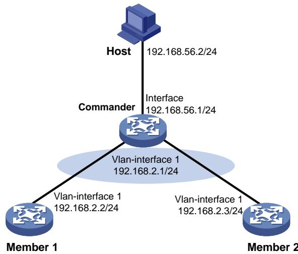

# 2. 注意事项

SmartMC 网络在 VLAN1 内建立，不能将 Vlan-interface1 配置为 SmartMC 网络的出接口。

# 3. 配置步骤

(1) 单击导航树中[智能管理]菜单项，进入智能管理配置页面。  
(2) 单击“出接口”页签，进入出接口配置页面。  
(3) 在接口列表的“操作”列，点击图标“ ”，将该接口设置为出接口。  
(4) 在接口列表的“操作”列，点击图标“ ”，删除该出接口。

图1-7 配置出接口  
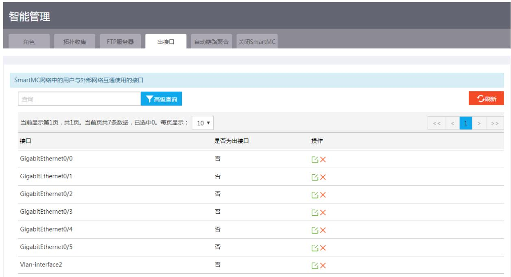

# 1.3 智能运维

# 1.3.1 升级设备

# 1. 简介

升级设备用于升级成员设备的启动软件和配置文件。

在成员设备从FTP服务器下载升级文件的过程中，可以点击<取消下载>按钮，取消文件下载。

在成员设备升级的过程中，可以点击<取消升级>按钮，取消本次升级。

# 2. 注意事项

(1) 执行升级操作前，请保证已经配置了FTP服务器信息。用户可以进入“智能管理> FTP服务器”页面，配置FTP服务器信息。  
(2) 执行升级操作前，请保证已经将升级使用的文件保存在了 FTP 服务器上，升级过程中，成员设备会自动从FTP服务器下载升级所需文件。

# 3. 配置升级文件

(1) 单击导航树中[智能运维]菜单项，进入智能运维配置页面。  
(2) 单击“升级设备”页签，进入升级设备配置页面。  
(3) 点击设备列表中“操作”列的图标“ ”，弹出“配置升级文件”窗口。  
(4) 在“升级文件类型”配置项处，选择文件类型：  
(5) 如果选择了“IPE 文件”，则在“IPE 文件名称”配置项处，输入 IPE 文件名称。  
(6) 如果选择了“Bin 文件”，则在“Boot 包名称”配置项处，输入 Boot 包名称；在“System 包名称”配置项出，输入System包名称。  
(7) 如果选择了“配置文件”，则在“配置文件名称”配置项处，输入配置文件名称。  
(8) 重复前两步，完成所有待升级设备的升级文件的配置。

图1-8 配置升级文件  
配置升级文件  
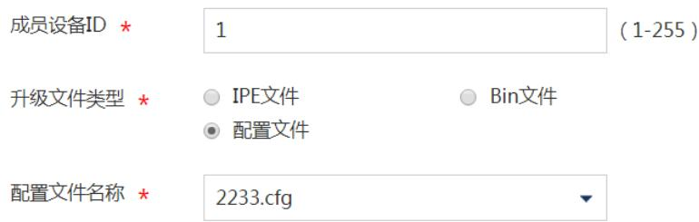

# 4. 升级设备

(1) 单击导航树中[智能运维]菜单项，进入智能运维配置页面。  
(2) 单击“升级设备”页签，进入升级设备配置页面。  
(3) 在设备列表中勾选需要升级的成员设备。  
(4) 点击<升级>按钮，弹出“升级”配置页面。  
(5) 在“升级对象”配置项处，选择升级对象。  
(6) 在“升级时间”配置项处，选择升级时间：  
(7) 如果选择“延时”升级，则在“延时时长”配置项处，输入延时时长。  
(8) 如果选择“定时”升级，则在“指定时间”配置项处，输入指定的时间。  
(9) 点击<确定>按钮，完成配置。

图1-9 升级

# 升级

升级成员设备前，用户需保证该成员设备Flash空间满足升级需要。升级成员设备的启动软件时，成员设备可能自动重启，因此建议用户升级前先保存当前运行配置。

# 5. 取消升级

(1) 单击导航树中[智能运维]菜单项，进入智能运维配置页面。  
(2) 单击“升级设备”页签，进入升级设备配置页面。  
(3) 在设备列表中勾选需要取消升级的成员设备。  
(4) 点击<取消升级>按钮，完成配置。

图1-10 取消升级  
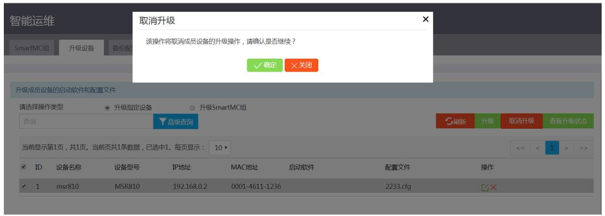

# 1.3.2 一键部署 VLAN

# 1. 简介

本功能是将成员设备上所有满足下列条件的端口加入到指定VLAN中：

该端口没有连接其它成员设备或管理设备。  
端口类型为 Access。

# 2. 注意事项

连接离线成员设备的 Access 类型端口不会加入到指定 VLAN 中。  
如果成员设备创建VLAN成功，但是没有成功的向VLAN中添加所有满足条件的端口，则所有满足条件的端口的配置将恢复到创建VLAN前的状态。  
一台成员设备创建VLAN失败不会影响其他成员设备的VLAN创建。

# 3. 配置步骤

(1) 单击导航树中[智能运维]菜单项，进入智能运维配置页面。  
(2) 单击“一键部署 VLAN”页签，进入一键部署 VLAN 配置页面。  
(3) 在“请选择操作类型”配置项处，选择操作类型为“部署指定设备”或“部署SmartMC组”。  
(4) 在设备列表中选择需要部署的成员设备或 SmartMC 组，点击<一键部署 VLAN>按钮，进入一键部署VLAN配置页面。  
(5) 在“VLAN ID”配置项处，输入 VLAN ID。

图1-11 配置 VLAN ID  
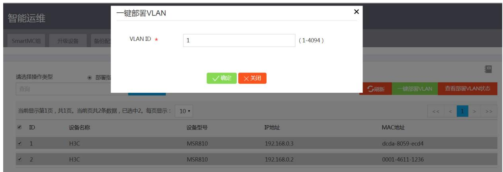

(6) 点击<确定>按钮，完成配置。  
(7) 点击<查看部署VLAN状态>按钮，查看配置结果。

图1-12 查看部署 VLAN 状态  
查看部署VLAN状态  
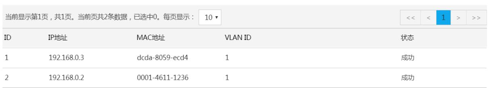

关闭

# 1.3.3 端口智能识别

# 1. 简介

端口智能识别功能用于管理设备自动识别成员设备上连接AP和IP电话的端口，然后将端口配置下发给这些端口，端口配置是保存在用户指定的配置文件中的。

# 2. 注意事项

• 端口批量配置文件中的配置必须全部为端口视图下的配置，否则可能导致配置错误。  
端口批量配置文件的内容不能超过8190个字符。  
指定端口配置文件时，设备不检查文件名的正确性，请用户自行保证。配置完成后，请不要删除或重命名此文件。  
下发配置前，会先将端口配置恢复到缺省情况。  
AP或IP电话和成员设备断开连接后，端口配置保持不变。

# 1.3.4 指定端口配置文件

# 1. 配置步骤

(1) 单击导航树中[智能运维]菜单项，进入智能运维配置页面。  
(2) 单击“端口智能识别”页签，进入端口智能识别配置页面。  
(3) 点击<新建>按钮，进入创建端口批量配置文件页面。文件创建成功后，自动刷新页面下方的文件列表。如果端口批量配置文件已经存在，请直接执行第二步。  
(4) 在页面下方的文件列表中，选择端口批量配置文件。  
(5) 点击<指定端口配置文件>按钮，进入端口配置文件配置页面。  
(6) 在“端口连接的设备”配置项处，选择设备类型为“AP”或“IP电话”。  
(7) 点击<确定>按钮，完成配置。

图1-13 指定端口配置文件

# 指定端口配置文件

待配置的文件\* bendi.zip

已配置的文件

端口连接的设备 。 AP

IP电话

×关闭

# 1.3.5 取消端口配置文件

# 1. 配置步骤

(1) 单击导航树中[智能运维]菜单项，进入智能运维配置页面。  
(2) 单击“端口智能识别”页签，进入端口智能识别配置页面。  
(3) 点击<取消端口配置文件>按钮，进入取消端口配置文件配置页面。  
(4) 在“端口连接的设备”配置项处，选择设备类型为“AP”或“IP 电话”。  
(5) 点击<确定>按钮，完成配置。  
(6) 取消端口配置文件

图1-14 取消端口配置文件

# 取消端口配置文件

端口连接的设备

。 AP

IP电话

×关闭

# 1.3.6 查看端口配置状态

# 1. 配置步骤

(1) 单击导航树中[智能运维]菜单项，进入智能运维配置页面。  
(2) 单击“端口智能识别”页签，进入端口智能识别配置页面。

(3) 点击<查看端口配置状态>按钮，进入端口配置状态页面。  
(4) 在“下发方式”配置项处，选择下发方式为“手动下发”或“自动下发”。  
(5) 如果选择了“自动下发”，再在“端口连接的设备”配置项处，选择设备类型为“AP”或“IP电话”。

图1-15 查看端口配置状态  
端口配置状态   
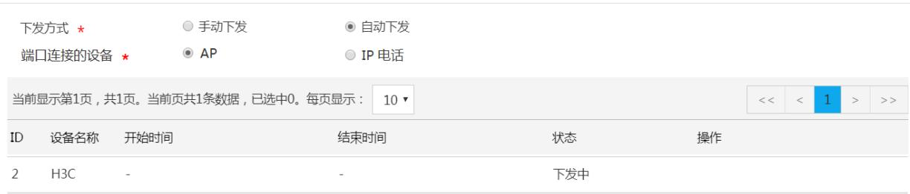

# 1.3.7 替换故障设备

# 1. 简介

本功能是使用新成员设备替换SmartMC网络中的故障成员设备，包括自动替换和手动替换。

对于手动替换，要求新成员设备和故障成员设备的设备类型相同；对于自动替换，不仅要求设备类型相同，同时要求新成员设备和故障成员设备的LLDP信息相同，且1小时内连续三次获取到新成员设备的LLDP信息均相同。进行故障替换时，管理设备会通知新成员设备到FTP服务器下载原故障成员设备的配置文件，新成员设备下载配置文件后运行配置文件中的配置。

# 2. 注意事项

• 当超过1台相邻的设备同时出现故障时，无法实现自动替换，应进行手动替换。  
对堆叠设备进行故障替换时，请保证新成员设备和故障成员设备的堆叠配置以及物理连线完全一致。否则，替换后可能会引起新成员设备堆叠分裂。

# 1.3.8 自动替换故障设备

# 1. 配置步骤

(1) 单击导航树中[智能运维]菜单项，进入智能运维配置页面。  
(2) 单击“替换故障设备”页签，进入替换故障设备配置页面。  
(3) 点击<开启自动替换>按钮。  
(4) 将新成员设备安装到原故障成员设备的位置并启动。

图1-16 自动替换故障设备  
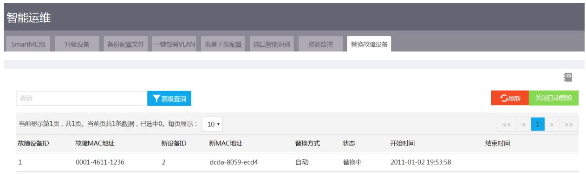

# 1.3.9 手动替换故障设备

# 1. 配置步骤

(1) 单击导航树中[智能运维]菜单项，进入智能运维配置页面。  
(2) 单击“替换故障设备”页签，进入替换故障设备配置页面。  
(3) 将新成员设备安装到原故障成员设备的位置并启动。  
(4) 单击导航树中的[可视化]菜单项，进入可视化页面。  
(5) 单击“拓扑”页签，进入拓扑管理页面。  
(6) 点击<手动替换>按钮，进入手动替换故障成员设备配置页面。  
(7) 在“设备型号”配置项处选择设备型号、在“故障设备”配置项处选择故障成员设备、在“替换设备”配置项处选择新成员设备。  
(8) 点击<确定>按钮，完成配置。

图1-17 手动替换故障成员

# 手动替换

设备型号＊

MSR810

故障设备 大

1 192.168.0.2

替换设备 \*

2 192.168.0.4

×关闭

# 1.4 可视化

# 1.4.1 保存拓扑信息

# 1. 简介

SmartMC网络稳定后，设备会根据实际网络连接自动绘制SmartMC网络拓扑图。管理员可以在拓扑显示页面拖拽成员设备来优化 SmartMC 网络拓扑图，以便管理员更好的理解管理设备和成员设备之间的层级关系。拓扑图优化完成后，可将拓扑图保存，用户下一次查看拓扑图时，将显示保存后的拓扑图。

 注意事项  
 拓扑图保存在当前浏览器中，切换浏览器后，之前保存的拓扑图不生效。  
 如果保存拓扑图后，SmartMC网络连接发生了变化，例如，有成员设备加入或离开，设备会根据实际网络连接自动重新绘制拓扑图。用户之前保存的拓扑图不再生效。

# 2. 配置步骤

(1) 单击导航树中[可视化]菜单项，进入可视化配置页面。  
(2) 单击“拓扑”页签，进入拓扑配置页面。  
(3) 点击<拓扑信息收集>按钮，获取当前网络中设备信息，设备间的邻居信息和端口信息。  
(4) 点击<手动刷新拓扑图>按钮，根据邻居信息和设备信息刷新当前页面中的拓扑图。  
(5) 拖拽设备图标优化 SmartMC 网络拓扑图。  
(6) 点击<保存拓扑信息>按钮，将拓扑图保存。

图1-18 手动刷新拓扑图  
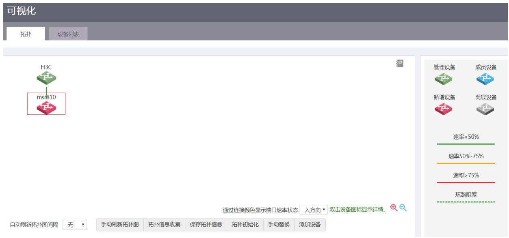

# 1.4.2 拓扑初始化

# 1. 简介

根据 SmartMC 网络当前状态绘制拓扑图，包括管理设备和正常运行的成员设备，离线设备将从拓扑图中清除。

# 2. 配置步骤

(1) 单击导航树中[可视化]菜单项，进入可视化配置页面。  
(2) 单击“拓扑”页签，进入拓扑配置页面。  
(3) 点击<拓扑初始化>按钮，完成配置。

图1-19 拓扑初始化  
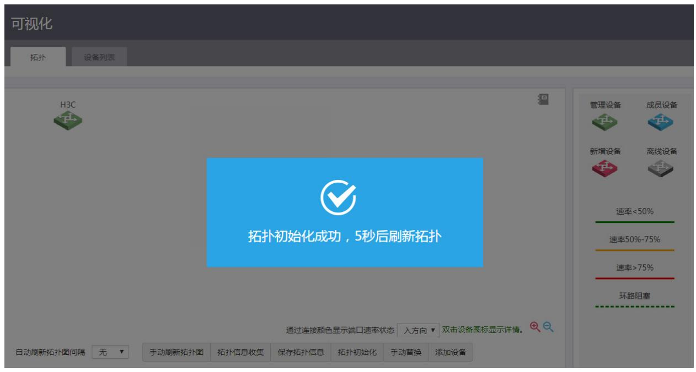

# 1.4.3 手动替换

# 1. 简介

用户将新成员设备安装到原来故障成员设备的位置后，执行本操作，新设备到FTP服务器下载原故障设备的配置文件并运行配置文件中的配置。

# 2. 注意事项

新加入的成员设备的型号、IRF编号必须与故障成员设备一致。  
手动替换故障成员设备功能前，请务必将新成员设备安装到原故障成员设备的位置，并连接好线缆。

# 3. 配置步骤

(1) 单击导航树中[可视化]菜单项，进入可视化配置页面。  
(2) 单击“拓扑”页签，进入拓扑配置页面。  
(3) 点击<手动替换>按钮，进入手动替换故障设备配置页面。  
(4) 在“设备型号”配置项处选择设备型号、在“故障设备”配置项处选择故障设备、在“替换设备”配置项处选择替换设备。  
(5) 点击<确定>按钮，完成配置。

图1-20 手动替换

# 手动替换

设备型号\*

MSR810

故障设备 \*

1 192.168.0.2

替换设备 \*

2 192.168.0.4

×关闭

# 1.4.4 添加设备

# 1. 简介

手动将设备添加到 SmartMC网络。“添加设备”按钮的右上角会显示不能自动加入 SmartMC网络的设备的数量。

# 2. 注意事项

手动将设备添加到SmartMC网络前，请确认已对该设备进行如下配置：

开启 HTTP、HTTPS 服务。  
开启 Telnet 服务。  
开启基于 HTTP 的 NETCONF over SOAP 功能。  
开启全局LLDP功能。  
配置本地用户 admin。其密码为 admin，服务类型为 Telnet、HTTP 和 HTTPS，RBAC 角色为 network-admin。  
配置VTY用户线的认证方式为scheme。  
配置设备支持 SNMP 版本为 SNMPv2c、SNMP 只读团体名为 public。

# 3. 配置步骤

(1) 单击导航树中[可视化]菜单项，进入可视化配置页面。  
(2) 单击“拓扑”页签，进入拓扑配置页面。  
(3) 点击<添加设备>按钮，进入添加设备配置页面。  
(4) 在“IP地址”配置项处，输入设备的IP地址；在“用户名”配置项处，输入用户名；在“密码”配置项处，输入密码。  
(5) 点击<确定>按钮，完成配置。

图1-21 添加设备

# 添加设备

关闭

# 1.4.5 成员设备相关功能

# 1. 批量配置端口

(1) 单击导航树中[可视化]菜单项，进入可视化配置页面。  
(2) 单击“拓扑”页签，进入拓扑配置页面。  
(3) 在拓扑图中单击待配置设备的图标。  
(4) 在页面下方的设备面板中选择端口。  
(5) 点击<批量配置端口>按钮，进入批量配置端口页面。  
(6) 在“配置文件”配置项处，选择配置文件。  
(7) 点击<确定>按钮，将配置文件中的配置下发到对应端口上。  
(8) 单击导航树中的[智能运维]菜单项，进入智能运维管理页面。  
(9) 单击“端口智能识别”页签，进入端口智能识别页面。  
(10) 点击<查看端口配置状态>按钮，查看端口配置结果。

图1-22 批量配置端口

# 批量配置端口

配置文件\*

关闭

# 2. 设备命名

(1) 单击导航树中[可视化]菜单项，进入可视化配置页面。  
(2) 单击“拓扑”页签，进入拓扑配置页面。  
(3) 在拓扑图中单击待配置设备的图标。  
(4) 点击<设备命名>按钮，进入设备命名配置页面。  
(5) 在“设备名称”配置项处，输入设备名称。  
(6) 点击<确定>按钮，完成配置。

图1-23 设备命名

# 设备命名

设备名称\*

msr810

（1-64字符）

×关闭

# 1.4.6 登录 Web 页面

# 1. 简介

登录成员设备的Web管理页面。

# 2. 配置步骤

(1) 单击导航树中[可视化]菜单项，进入可视化配置页面。  
(2) 单击“拓扑”页签，进入拓扑配置页面。  
(3) 在拓扑图中单击要登录的成员设备。  
(4) 点击<登录 Web 页面>按钮，进入成员设备的 Web 登录页面。  
(5) 输入成员设备的用户名和密码，进入成员设备的Web管理页面。

图1-24 登录 Web 页面  

# 1.4.7 重启设备

# 1. 简介

重启选中的成员设备。支持如下重启方式：

保存配置并重启。  
强制重启。  
出厂配置重启。

# 2. 注意事项

重启设备会导致业务中断，请谨慎使用。

对于支持自动配置的设备，设备以出厂配置重启后会进入自动配置流程。

# 3. 配置步骤

(1) 单击导航树中[可视化]菜单项，进入可视化配置页面。  
(2) 单击“拓扑”页签，进入拓扑配置页面。  
(3) 在拓扑图中单击要重启的成员设备。  
(4) 点击<重启设备>按钮，进入重启配置页面。  
(5) 选择重启方式。  
(6) 点击<确定>按钮，完成配置。

# 重启

确定要重启整个设备？

保存配置  
强制设备不进行任何检查直接重启  
出厂配置重启

# 1.4.8 成员设备日志

# 1. 简介

显示成员设备的日志缓冲区日志、成员设备重启日志、AP重启日志等日志。

# 2. 注意事项

每台成员设备最多有10条重启日志。

# 3. 配置步骤

(1) 单击导航树中[可视化]菜单项，进入可视化配置页面。  
(2) 单击“拓扑”页签，进入拓扑配置页面。  
(3) 在拓扑图中单击要查看的成员设备。  
(4) 点击<成员设备日志>按钮，查看成员设备日志。

图1-26 成员设备日志  

<成员设备日志  
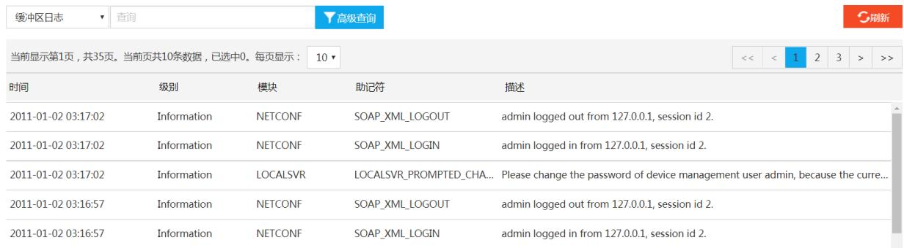

# 1.4.9 监控信息

# 1. 简介

显示成员设备的资源监控信息，如CPU利用率、内存利用率、温度以及丢包信息。

# 2. 配置步骤

(1) 单击导航树中[可视化]菜单项，进入可视化配置页面。  
(2) 单击“拓扑”页签，进入拓扑配置页面。  
(3) 在拓扑图中单击要查看的成员设备。  
(4) 点击<监控信息>按钮，查看监控信息。

图1-27 监控信息  
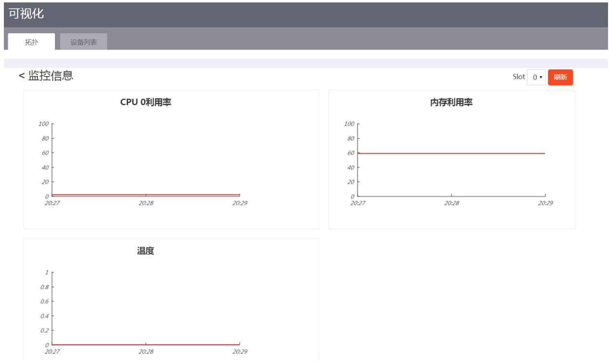

# 1.4.10 设备列表

# 1. 简介

本页面展现管理设备和成员设备的基本信息。用户可以点击列表中“操作列”的图标“ ”，以查看设备的详细信息。用户可以自定义设备类型，也可以查看自定义设备类型。

# 2. 自定义设备类型

(1) 单击导航树中[可视化]菜单项，进入可视化配置页面。  
(2) 单击“设备列表”页签，进入设备列表配置页面。  
(3) 在设备列表中，确认需要自定义设备类型的设备，点击“操作列”的图标“ ”，查看设备详细信息。  
(4) 在“设备详细信息”弹窗中查找设备的SYSOID取值，并复制。  
(5) 点击<关闭>按钮，关闭“设备详细信息”弹窗。  
(6) 点击<自定义设备类型>按钮，进入“自定义设备类型”配置页面。  
(7) 在“SYSOID”配置项处，粘贴设备的SYSOID取值。  
(8) 在“设备类型”配置项处，输入自定义的设备类型。  
(9) 点击<确定>按钮，完成配置。

图1-28 自定义设备类型  
自定义设备类型  

SYSOID \*

1.3.6.1.4.1.25506.1.1473

（1-63字符）

设备类型 \*

MSR3610

（1-31字符）

关闭

# 3. 查看自定义设备类型

(1) 单击导航树中[可视化]菜单项，进入可视化配置页面。  
(2) 单击“设备列表”页签，进入设备列表配置页面。  
(3) 点击<查看自定义设备类型>按钮，查看自定义的设备类型。

图1-29 查看自定义设备类型  
自定义设备类型  
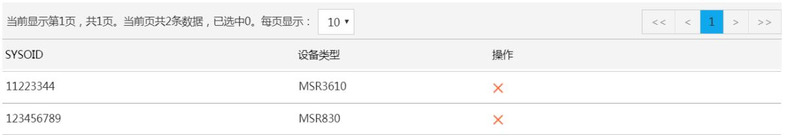

关闭