# PANTUM

WWW-PANTUM-COM

# Pantum P3030D

# 黑白激光打印机

# 前言

欢迎您使用奔图系列产品！

对您使用奔图系列产品我们表示衷心的感谢！

为了保障您的切身权益，请认真阅读下面的声明内容。

更多信息可登录奔图官网（www.pantum.com）获取。

# 法律说明

# 商标

Pantum 和 Pantum 标识是珠海奔图电子有限公司注册的商标。

Microsoft $^{®}$ 、Windows $^{®}$ 、Windows server $^{®}$ 和 Windows Vista $^{®}$ 是微软公司在美国和其他国家注册的商标和注册商标。

对于本用户指南涉及的软件名称，其所有权根据相应的许可协议由所属公司拥有，引用仅供说明。

本用户指南涉及的其他产品和品牌名称为其相应所有者的注册商标、商标或服务标志，引用仅供说明。

# 版权

本用户指南版权归珠海奔图电子有限公司所有。

未经珠海奔图电子有限公司事先书面同意，禁止以任何手段或形式对本用户指南进行复印、翻译、修改和传送。

版本：V1.2

# 免责声明

为了更好的用户体验，珠海奔图电子有限公司保留对本用户指南作出更改的权利。如有更改，恕不另行通知。

用户未按用户指南操作，而产生的任何损害，应由本人承担。同时，珠海奔图电子有限公司除了在产品维修书或服务承诺作出的明示担保外，也未对本用户指南（包括排版或文字）作出任何明示或默示的担保或保证。

本产品被用于某些档案或影像的复印、打印、扫描或其他形式时，可能违反您所在地的法律。您如果无法确定该使用是否符合所在地法律时，应向法律专业人士咨询后进行。

# 维修保证

企业承诺，在停产后至少5年内，保证提供产品在正常使用范围内可能损坏的备件。

# 消耗材料的供应

企业承诺，在停产后至少5年内，提供产品的消耗材料。

# 安全防范措施

断开产品电源

本产品必须放置在靠近且容易触及到电源插座的地方，以便于从电源插座上及时拔下产品电源插头切断电源！

激光安全

激光辐射对人体有害。由于激光组件完全密闭在打印机内，激光辐射不会泄露。为了避免激光辐射，请不要随意拆机！

注意：未按照本说明书所规定内容进行控制、调整或操作程序可能导致接触危险的放射性辐射。

本机遵循 CFR 及 IEC 60825-1 标准的 1 类激光产品。

# 1类激光产品

本机带有 3B 类的激光二极管，在激光组件中无激光辐射的外泄。

本机内部的激光组件上贴有如下标签：

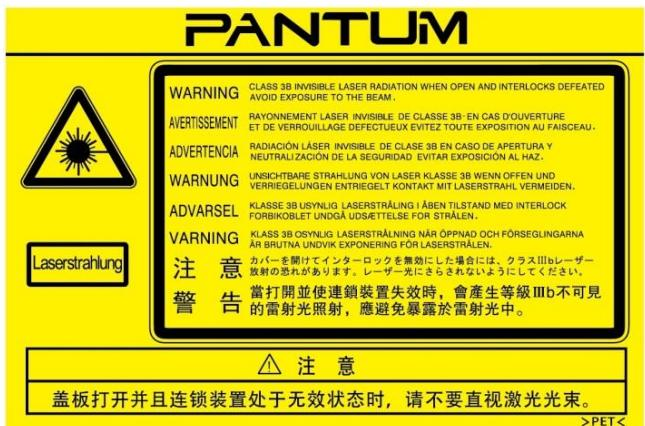

# or

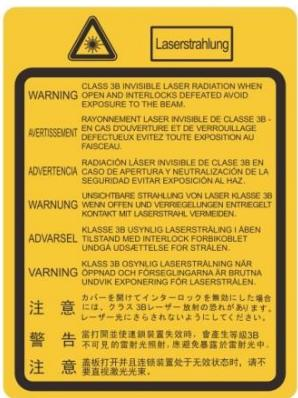

# 珠海奔图电子产品回收利用体系

为保护环境，珠海奔图电子有限公司建立废弃产品的回收再利用体系，您可以选择将废弃的打印机和耗材交给当地奔图维修中心进行统一回收，再由国家认定的具备废弃物处理资质的处理机构对废弃产品进行正确的回收、再利用处理，以确保节约资源，降低环境污染，解除用户对废弃产品污染环境的担忧。

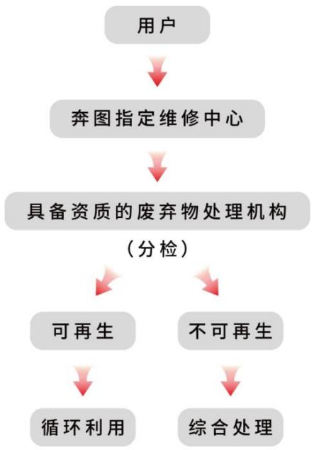

1. 用户负担费用：用户—维修中心。  
2. 珠海奔图电子有限公司负担费用：奔图维修中心—具备资质的废弃物处理机构。

# 安全警告

在使用本打印机前，请注意如下安全警告：

<table><tr><td colspan="2">警告</td></tr><tr><td>打印机内部有高压电极。在清洁打印机之前,请确保已切断电源!</td><td>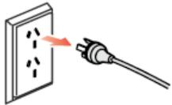</td></tr><tr><td>请勿用湿手插拔电源线插头,以免导致电击。</td><td>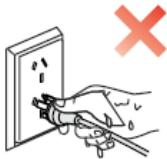</td></tr><tr><td>打印机打印时和打印后,定影组件会处于高温状态,请勿触摸定影单元(图示阴影部分),以免造成烫伤!</td><td>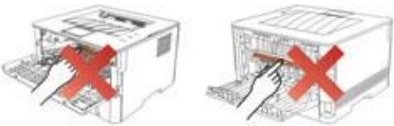</td></tr><tr><td>定影单元有高温警示标签,请勿移动或损坏该标签。</td><td>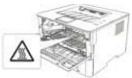</td></tr></table>

# 注意事项

# 使用打印机前的注意事项：

1. 阅读和理解所有说明；  
2. 了解电器使用的基本常识;  
3. 遵循机器上标识或随机手册上的警告和说明；  
4. 如果操作说明与安全信息有冲突，请以安全信息为准；您可能错误理解了操作说明；如果您不能解决冲突，请拨打售后电话或与服务代表联系以寻求说明；  
5. 清洁之前，请将电源线从 AC 电源插座拔下。请勿使用液体或气雾清洁剂；  
6. 请勿将本机器放在不稳定的台面上，以免跌落造成严重损坏；  
7. 请勿将任何物体放置于机器顶部，以免机器部件温度升高，从而造成损坏或者火灾；  
8. 严禁将本机器置于散热器、空调或通风管附近；  
9. 请勿在电源在线压任何物品；请勿将本机器放在人们可能会踩到其电源线的地方；  
10. 插座和延长线不要超载；这可能会降低性能，以及造成火灾或电击；  
11. 谨防小动物咬噬 AC 电源线和计算机接口线；  
12. 切勿让尖锐物品刺穿机器槽孔，以免触到内部高压装置，造成火灾或电击；切勿让任何液体溅到机器上；  
13. 请勿拆解本机器以免造成电击；需要修理时应请专业维护人员进行；打开或卸下护盖时会有电击或其它危险；不正确的拆装可能会导致以后使用时造成电击；  
14. 若出现以下情况,请将机器从计算机和墙上 AC 电源插座上拔下,并联络专业维修人员进行维护:  
- 机器中溅入了液体。  
- 机器受到雨淋或进水。  
- 机器跌落，或机壳摔坏。  
- 机器性能发生明显变化。  
15. 只调整操作说明中提到的控制；不正确地调整其它控制可能会造成损坏，并且需要专业维修人员用更长时间才能修好；  
16. 避免在雷暴天气使用本机器，以免遭到电击；如果可能，请在雷雨期间拔下 AC 电源线；  
17. 如果连续打印多页，出纸盘的表面会变得很烫，当心不要触碰此表面，并让儿童远离此表面；  
18. 与该打印机相连的设备的信号线不能连接到户外；

19. 在换气不畅的房间中长时间使用或打印大量文件时，请您适时换气；  
20. 待机状态下，产品未接收到工作指示一段时间后（如 1 分钟），会自动进入节电（休眠）模式；只有当产品无任何外接输入电源相连时才能实现零能耗；  
21. 本产品为 Class1 等级设备，使用时必须将其连接到带有保护性接地线的电源插座上；  
22. 本产品运输过程中请按照产品包装箱运输标识放置；  
23. 本产品为低电压设备，在低于本产品规定电压范围时，使用过程中如出现打印机内的碳粉脱落，或启动出现启动缓慢等故障，请参见产品注意事项或连络奔图售后服务中心；  
24. 本产品为整机销售，消费者可到奔图售后服务中心购买所需配件。如销售产品与包装列表不一致，请到产品指定售后服务中心进行处理；  
25. 请将本产品安装在温度介于 $10^{\circ} \mathrm{C}$ 至 $35^{\circ} \mathrm{C}$ 之间，相对湿度介于 $20 \%$ 至 $80 \%$ 之间的地方；  
26. 为避免火灾或电击危险，请只使用随本产品提供的电源线或经制造商许可的替代品；  
27. 本产品提供的电源线只可用于此产品。请勿适用于其他设备，可能会造成火灾、电击或其他伤害；  
28. 请勿在机器附近或内部使用可燃性喷雾或易燃溶剂等。另外，请勿放置在机器附近或内部。会造成火灾或电击；  
29. 请妥善保管本手册。

# 法规信息

<table><tr><td>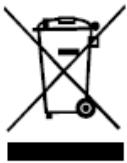</td><td>此符号表明不能将该产品与其它废物一起随意丢弃。更妥善的做法,您应该将废弃设备送到指定的收集点,以便回收利用废弃的电气和电子设备。</td></tr><tr><td></td><td>本产品适合室内使用,不适合室外使用。</td></tr><tr><td></td><td>欧共体(EC)指令合规性本产品符合欧共体理事会2014/30/EU和2014/35/EU指令的成员国近似和协调法规中涉及电磁兼容性和电气设备安全性(为在特定电压范围内使用)的保护要求。本产品制造商为:中华人民共和国广东省珠海市金湾区平沙镇升平大道888号02栋、06栋、08栋珠海奔图电子有限公司。有关这些指令要求的合规声明,可向授权代表索取。本产品符合EN 55032 / EN 55035的B级范围和EN 62368-1的安全要求。</td></tr><tr><td></td><td>本产品仅适用于非热带气候条件下安全使用。</td></tr><tr><td></td><td>本产品仅适用于海拔2000米及以下地区安全使用。</td></tr></table>

产品中有害物质的名称及含量

<table><tr><td rowspan="2">部件名称</td><td colspan="10">有害物质</td></tr><tr><td>Pb</td><td>Hg</td><td>Cd</td><td>Cr(VI)</td><td>PBB</td><td>PBDE</td><td>DEHP</td><td>BBP</td><td>DBP</td><td>DIBP</td></tr><tr><td>塑胶部件</td><td>○</td><td>○</td><td>○</td><td>○</td><td>○</td><td>○</td><td>○</td><td>○</td><td>○</td><td>○</td></tr><tr><td>金属部件</td><td>×</td><td>○</td><td>○</td><td>○</td><td>○</td><td>○</td><td>○</td><td>○</td><td>○</td><td>○</td></tr><tr><td>电线电缆</td><td>×</td><td>○</td><td>○</td><td>○</td><td>○</td><td>○</td><td>○</td><td>○</td><td>○</td><td>○</td></tr><tr><td>电路板组件</td><td>×</td><td>○</td><td>○</td><td>○</td><td>○</td><td>○</td><td>○</td><td>○</td><td>○</td><td>○</td></tr><tr><td>玻璃部件</td><td>○</td><td>○</td><td>○</td><td>○</td><td>○</td><td>○</td><td>○</td><td>○</td><td>○</td><td>○</td></tr><tr><td>碳粉</td><td>○</td><td>○</td><td>○</td><td>○</td><td>○</td><td>○</td><td>○</td><td>○</td><td>○</td><td>○</td></tr><tr><td>包装材料</td><td>○</td><td>○</td><td>○</td><td>○</td><td>○</td><td>○</td><td>○</td><td>○</td><td>○</td><td>○</td></tr></table>

本表格依据SJ/T11364的规定编制：

1. ○：表示该有毒有害物质在该部件所有均质材料中含量均在GB/T26572规定的限量要求以下。

2. ×：表示该有毒有害物质至少在该部件的某一均质材料中的含量超出GB/T26572规定的限量要求。

3. 本产品的部分部件含有有害物质，这些部件是在现有科学技术水平下暂时无可替代物质。

4. 环保使用期限取决于产品正常工作的温度和湿度等条件。

# 目录

# 1. 使用本机前.... 1

1.1. 产品系列简介....1  
1.2. 随机附件..... 2   
1.3. 产品视图.....3   
1.4. 激光碳粉盒....5   
1.5. 控制面板....6

1.5.1. 控制面板概览....6  
1.5.2. 控制面板指示灯功能.....7

# 2. 纸张与打印介质.....8

2.1. 纸张规格.....8   
2.2. 特殊纸张....9   
2.3. 装入纸张.....10

2.3.1. 装入自动进纸盒....10   
2.3.2. 装入手动进纸盒....12

2.4. 非打印区域.....14  
2.5. 纸张使用原则.....14

# 3. 驱动安装与卸载.....15

3.1. Windows 系统的驱动安装..... 15

3.1.1. 一键安装.....15  
3.1.2. 手动安装.....17  
3.1.3. 驱动卸载方法..... 18

3.2.macOS系统的驱动安装....18  
3.2.1. 驱动安装..... 19   
3.3.macOS系统添加打印机....21

3.3.1. USB 连接方式添加打印机.....21

4. 安全功能.....22

4.1. 文档溯源功能.....22

4.1.1. 打印二维码溯源信息设置....22

4.1.2. 提取二维码溯源信息.....23

5. 打印 24

5.1. 打印功能.....24

5.2. 打印设置..... 25

5.3. 取消打印.....25

5.4. 打印方式.....26

5.4.1. 自动进纸盒打印 26

5.4.2. 手动进纸盒打印 27

5.5. 自动双面打印.....27

5.5.1. 双面打印单元设置.....28

5.5.2. 如何进行自动双面打印.... 29

5.6. 精细模式打印....31

5.7. 静音打印....32

5.8. 自动关机设置....33

5.9. 打开帮助文档....34

6. 日常维护....35

6.1. 打印机清洁....35

6.2. 粉盒和鼓组件维护 37

6.2.1. 关于粉盒和鼓组件....37

6.2.2. 更换粉盒和鼓组件....38

7. 故障排除....43

7.1. 移除卡纸.....43

7.1.1. 自动进纸盒卡纸 43  
7.1.2. 手动进纸盒卡纸 45  
7.1.3. 中间卡纸.....46  
7.1.4. 定影单元卡纸.....49  
7.1.5. 双面打印单元卡纸.....51

7.2. 软件故障....52

7.3. 常见故障排除....53

7.3.1. 一般故障....53  
7.3.2. 图像缺陷.....55

8. 产品规格.....58

8.1. 规格总述.....58

# 1. 使用本机前

# 1.1. 产品系列简介

<table><tr><td colspan="3">产品系列参数</td><td>P3030D</td></tr><tr><td>接口类型</td><td colspan="2">USB</td><td>●</td></tr><tr><td>打印语言</td><td colspan="2">GDI</td><td>●</td></tr><tr><td>控制面板</td><td colspan="2">LED</td><td>●</td></tr><tr><td rowspan="2">打印速度</td><td>A4</td><td>30ppm</td><td>●</td></tr><tr><td>Letter</td><td>32ppm</td><td>●</td></tr><tr><td colspan="3">自动双面打印</td><td>●</td></tr><tr><td colspan="3">静音打印</td><td>●</td></tr></table>

(●：支持，空白：不支持)

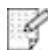  
注：·如有产品系列增加或变更，恕不另行通知。

# 1.2. 随机附件

<table><tr><td>名称</td><td>部件</td></tr><tr><td>粉盒</td><td>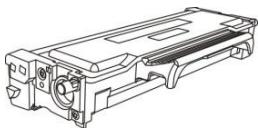</td></tr><tr><td>鼓组件</td><td>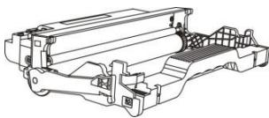</td></tr><tr><td>USB 连接线</td><td>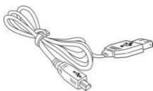</td></tr><tr><td>电源线</td><td>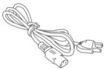</td></tr><tr><td>光盘</td><td>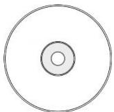</td></tr><tr><td>快速安装指南</td><td></td></tr><tr><td>三包凭证</td><td>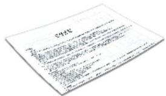</td></tr></table>

注：·个别地区可能不包含三包凭证。

# 1.3. 产品视图

侧视图  
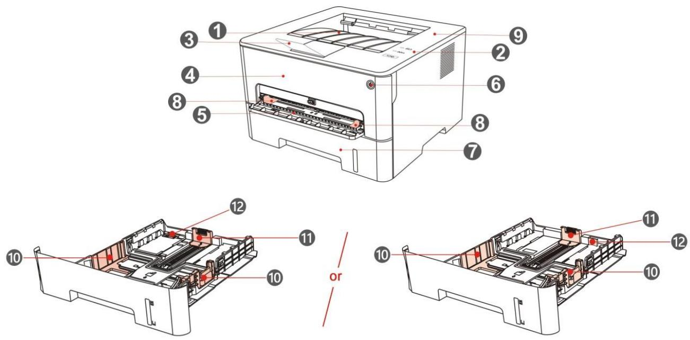

<table><tr><td>1</td><td>出纸槽</td><td>用于存放打印出来的纸张。</td></tr><tr><td>2</td><td>控制面板</td><td>指示打印机当前状态。</td></tr><tr><td>3</td><td>出纸托盘</td><td>防止打印出来的纸张滑落。</td></tr><tr><td>4</td><td>前盖</td><td>打开前盖,可取出激光碳粉盒。</td></tr><tr><td>5</td><td>手动进纸盒</td><td>用于放置从手动进纸盒进行打印的介质。</td></tr><tr><td>6</td><td>电源开关</td><td>打开或关闭电源,就绪状态按下此按钮进入节能模式。按住此按钮超过2秒钟,关闭打印机电源。</td></tr><tr><td>7</td><td>自动进纸盒</td><td>用于放置从自动进纸盒进行打印的介质。</td></tr><tr><td>8</td><td>手动进纸盒导纸板</td><td>滑动导纸板以匹配纸张的宽度。</td></tr><tr><td>9</td><td>自动进纸盒宽度导纸板</td><td>滑动宽度导纸板以匹配纸张的宽度。</td></tr><tr><td>10</td><td>自动进纸盒长度导纸板</td><td>滑动长度导纸板以匹配纸张的长度。</td></tr><tr><td>11</td><td>自动进纸盒延长托盘卡扣</td><td>用于调节托盘的延伸长度</td></tr></table>

# 后视图

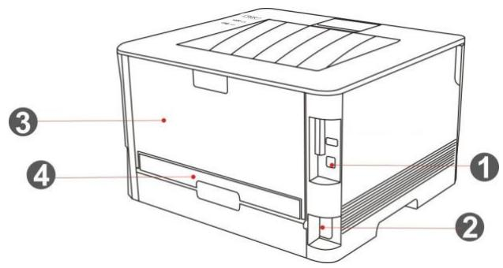

<table><tr><td>1</td><td>USB 界面</td><td>用于通过USB连接线将产品连接到计算机。</td></tr><tr><td>2</td><td>电源界面</td><td>用于通过电源线将产品连接到电源。</td></tr><tr><td>3</td><td>后盖</td><td>用于在出纸口处卡纸时解除卡纸。</td></tr><tr><td>4</td><td>双面打印单元</td><td>用于双面打印走纸及在双面打印卡纸时解除卡纸。</td></tr></table>

注：·打印机外观因型号功能不同会存在差异，示意图仅供参考。

# 1.4. 激光碳粉盒

激光碳粉盒由鼓组件和粉盒两部分组成。

鼓组件使用寿命

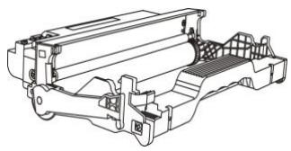

<table><tr><td>类型</td><td>平均打印量</td></tr><tr><td>标准鼓组件</td><td>约 12000 页(基于 ISO 19752 标准)</td></tr></table>

粉盒使用寿命

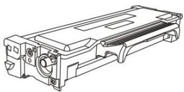

<table><tr><td>类型</td><td>平均打印量</td></tr><tr><td>标准容量粉盒</td><td>约 1500 页(基于 ISO 19752 标准)</td></tr><tr><td>高容量粉盒</td><td>约 3000 页(基于 ISO 19752 标准)</td></tr></table>

注：·如有型号增加恕不另行通知。

- 耗材容量可能会因使用类型不同而有所差异。  
- 本公司不建议使用原装耗材以外的耗材，因使用非原装耗材而导致的任何损坏不在保修范围之内。  
- 粉盒外观因容量型号不同可能会存在差异，示意图仅供参考。

# 1.5. 控制面板

# 1.5.1. 控制面板概览

打印机控制面板布局如下图所示：

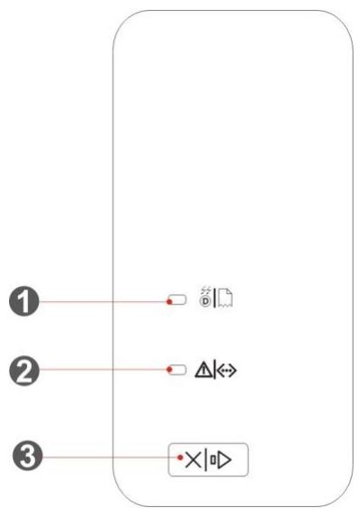

<table><tr><td>序号</td><td>名称</td><td>功能</td></tr><tr><td>1</td><td>鼓组件/纸张状态灯</td><td>指示纸张和鼓组件的状态(请参阅第1.5.2章)。</td></tr><tr><td>2</td><td>粉盒/状态灯</td><td>指示粉盒和除纸张以外其他的状态(请参阅第1.5.2章)。</td></tr><tr><td>3</td><td>取消/继续按键</td><td>有作业正常打印的情况下,按住此按钮超过2秒钟取消当前正在打印的工作。有作业进纸失败、缺纸的情况下,按下此按钮继续打印当前正在打印的工作,按住此按钮超过2秒钟取消当前正在打印的工作。在空闲状态时,按住此按钮超过2秒钟可打印信息页。</td></tr></table>

# 1.5.2. 控制面板指示灯功能

鼓组件/纸张状态灯状态显示含义如下：

<table><tr><td>序号</td><td>鼓组件/纸张状态灯状态显示</td><td>状态</td><td>状态描述</td></tr><tr><td>1</td><td></td><td>熄灭</td><td>休眠状态</td></tr><tr><td>2</td><td></td><td>绿灯常亮</td><td>鼓组件正常,无纸张错误</td></tr><tr><td>3</td><td>-</td><td>红灯常亮</td><td>鼓组件错误(鼓组件未安装、鼓组件不匹配、鼓组件寿命尽)、纸张错误(打印缺纸、卡纸、进纸失败)</td></tr><tr><td>4</td><td></td><td>橙灯常亮</td><td>鼓组件即将达到其预计寿命</td></tr></table>

粉盒/状态灯状态显示含义如下：

<table><tr><td>序号</td><td>粉盒/状态灯状态显示</td><td>状态</td><td>状态描述</td></tr><tr><td>1</td><td></td><td>熄灭</td><td>休眠状态</td></tr><tr><td>2</td><td></td><td>绿灯常亮</td><td>打印机就绪</td></tr><tr><td>3</td><td></td><td>绿灯闪烁</td><td>预热中、打印中、工作取消中</td></tr><tr><td>4</td><td></td><td>红灯常亮</td><td>前盖打开等打印机错误</td></tr><tr><td>5</td><td></td><td>橙灯常亮</td><td>粉盒错误(粉盒未安装,粉盒不匹配,粉盒寿命尽)</td></tr><tr><td>6</td><td>[5y35]</td><td>橙灯闪烁</td><td>粉量低警告</td></tr></table>

# 2. 纸张与打印介质

# 2.1. 纸张规格

<table><tr><td rowspan="4">自动进纸盒</td><td>介质类型</td><td>普通纸(70~105g/m2)、薄纸(60~70g/m2)</td></tr><tr><td>介质尺寸</td><td>A4、Letter、A5、Legal、Statement、JIS B5、Folio、Oficio、Executive、ISO B5、A6、B6、16K、Big 16K、32K、Big 32K、自定义</td></tr><tr><td>介质克重</td><td>60~105 g/m2</td></tr><tr><td>纸盒最大容量</td><td>250页 (80 g/m2)</td></tr><tr><td rowspan="4">手动进纸盒</td><td>介质类型</td><td>普通纸(70~105g/m2)、薄纸(60~70g/m2)、厚纸(105~200g/m2)、透明胶片、卡片纸、标签纸、信封</td></tr><tr><td>介质尺寸</td><td>A4、Letter、Legal、Folio、Oficio、Statement、Executive、JIS B5、ISO B5、A5、A6、B6、Monarch Env、DL Env、C5 Env、NO.10 Env、C6 Env、Japanese Postcard、ZL、16K、Big 16K、32K、Big 32K、Yougata4、Postcard、Younaga3、Nagagata3、Yougata2、自定义</td></tr><tr><td>介质克重</td><td>60~200 g/m2</td></tr><tr><td>纸盒最大容量</td><td>1页</td></tr></table>

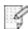

注：· 本款打印机建议使用 $80 \, g/m^{2}$ 标准纸。

- 不建议大量使用特殊纸，可能影响打印机寿命。  
- 不符合本用户指南中所列准则的打印介质可能导致打印质量差、卡纸次数增多、打印机过度磨损。  
- 重量、成分、纹理及湿度等属性是影响打印机性能和输出质量的重要因素。

在选择打印介质时，请注意以下事项：

1. 所需打印效果：选择的打印介质应符合打印任务的需要。  
2. 表面平滑度：打印介质的平滑度会对打印效果的清晰程度产生影响。

3. 某些打印介质可能符合本部分的所有使用准则，但仍不能产生令人满意的打印效果。这可能是由于不正确的操作、不适宜的温度和湿度，或者奔图无法控制的其他因素造成的。在大批量购买打印介质之前，请确保打印介质符合本用户指南中指定的规格。

# 2.2. 特殊纸张

本产品支持特殊纸张进行打印，特殊纸张包括：标签纸、信封、透明胶片、厚纸、卡片纸、薄纸。

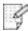

注：·当使用特殊纸张或打印介质时，请确保在打印设置上选择匹配的打印类型和尺寸，以便获得最佳打印效果。

请遵守以下标准：

<table><tr><td>打印介质种类</td><td>正确做法</td><td>错误做法</td></tr><tr><td>标签纸</td><td>仅使用未暴露衬纸的标签。标签使用时应放平。仅使用整张的标签。不保证市面上所有的标签纸都能够满足要求。</td><td>使用褶皱、起泡或破损的标签纸。</td></tr><tr><td>信封</td><td>信封应平整置入。</td><td>使用有褶皱、缺口、粘连或损坏的信封。使用带有别针、按扣、窗口或涂层衬里的信封。使用自粘不干胶或其他合成材料的信封。</td></tr><tr><td>透明胶片</td><td>仅使用经核准适用于激光打印机的透明胶片。</td><td>使用不适用于激光打印机的透明胶片。</td></tr><tr><td>厚纸、卡片纸</td><td>仅使用经核准适用于激光打印机并满足本产品重量规格的重质纸。</td><td>使用重量超过本产品推荐介质规格的纸张,除非是经核准适用于本产品的纸张。</td></tr></table>

# 2.3. 装入纸张

# 2.3.1. 装入自动进纸盒

1. 从打印机中完全抽出自动进纸盒。

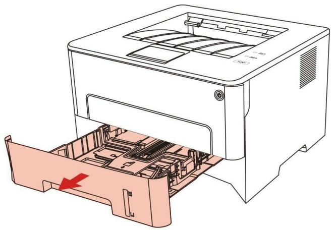

2. 滑动自动进纸盒延长托盘卡扣、长度导纸板及宽度导纸板到所需的纸张大小卡槽，匹配纸张的长度和宽度。

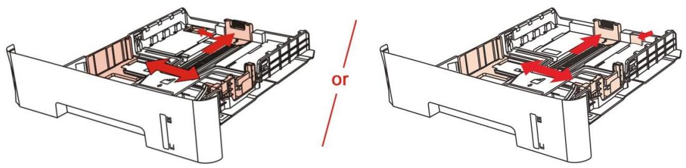

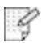

注：·请不要过度挤压“长度导纸板”和“宽度导纸板”，否则容易导致纸张变形。

3. 请在装入纸张之前展开堆叠的纸张，避免卡纸或进纸错误，再把纸张打印面朝下装入纸盒内，自动进纸盒最多可装入250张 $80\mathrm{g} / \mathrm{m}^2$ 纸。

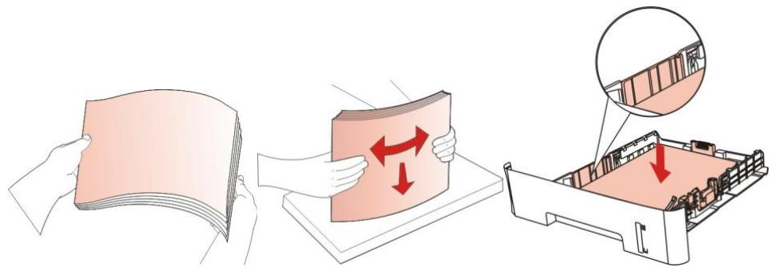

4. 抬起出纸托盘，避免打印完的纸张滑落，或在打印完成后立即将打印的取走。

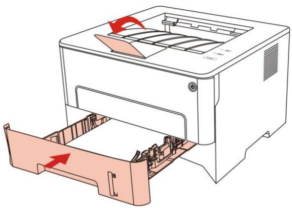

注：· 建议抬起出纸托盘避免打印完纸张滑落。如果您选择不抬起出纸托盘，我们建议立即取走从打印机中输出的已打印纸张。

- 如果一次性放入自动进纸盒的纸张超过 250 页（80g/m²）会造成卡纸或不进纸。  
- 如果仅打印单面时，请把要打印的面（空白面）朝下。

# 2.3.2. 装入手动进纸盒

1. 抬起出纸托盘，避免打印完的纸张滑落，或在打印完成后立即将打印的取走。

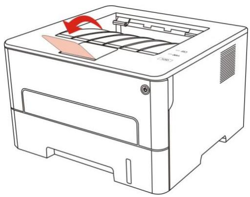

2. 打开手动进纸盒。

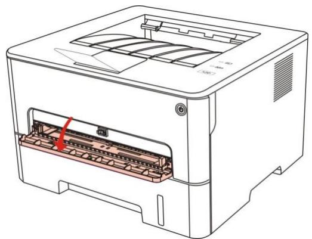

3. 滑动手动进纸盒的导纸板以匹配纸张的两侧。不要用力过度，否则会导致卡纸或纸张歪斜。

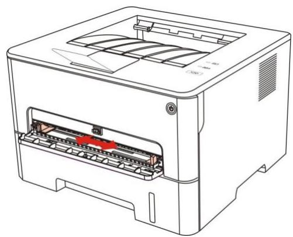

4. 双手将一张打印介质平整的放入手动进纸盒中。

注：· 当您将纸张放入手动进纸盒时，打印机将自动进入手动进纸模式。  
- 请每次放入一张打印介质到手动进纸盒中，打印结束后再放入另一张。  
- 将打印介质打印面向上放入手动进纸盒，装入时，纸张的顶部先进入手动进纸盒。

5. 当打印完的页面从打印机输出后，按照如上步骤，再放入第二张继续打印。放入过慢，将会提示手动进纸盒缺纸或手动进纸盒进纸失败，放入纸张，自动继续打印；放入太快，纸张会被卷入打印机并容易造成卡纸。

注：·打印后，请立即取走从打印机中输出的已打印纸张。堆叠的纸张或信封会引起卡纸或曲纸。

# 2.4. 非打印区域

阴影部分表示非打印区域。

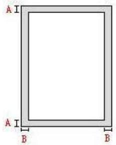

<table><tr><td>用途</td><td>纸张尺寸</td><td>上下边距(A)</td><td>左右边距(B)</td></tr><tr><td rowspan="2">打印</td><td>A4</td><td>5mm(0.197inch)</td><td>5mm(0.197inch)</td></tr><tr><td>Letter</td><td>5mm(0.197inch)</td><td>5mm(0.197inch)</td></tr></table>

# 2.5. 纸张使用原则

- 纹理粗糙、有凹凸、油渍、十分光滑的纸张打印效果不佳。  
- 请确保纸上无灰尘、绒毛等。  
- 将纸张置于平坦的表面，存放在阴凉、干燥的环境。

# 3. 驱动安装与卸载

# 3.1. Windows 系统的驱动安装

Windows 驱动安装软件提供一键安装和手动安装两种安装方式。推荐您使用一键安装方式，它可以帮助您更快速、更便捷的自动完成驱动安装。当您使用一键安装方式遇到困难时，您可以尝试手动安装。

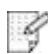

注：·驱动安装界面因型号功能不同存在差异，示意图仅供参考。

# 3.1.1. 一键安装

一键安装为您提供 USB 线连接打印机、有线网络连接打印机、无线网络连接打印机三种安装方式，您可以根据您打印机支持的连接方式选择您习惯使用的安装方式。

# 3.1.1.1. 方式一：USB线连接打印机

1. 使用 USB 线连接打印机和计算机，并开启打印机和计算机电源。  
2. 在计算机的光驱中插入随附的安装光盘：

- Windows XP 系统：自动运行安装程序。  
- Windows 7/Vista/Server 2008 系统：弹出“自动播放”界面，点击“Autorun.exe”，运行安装程序。  
- Windows 8 系统：计算机桌面右上角弹出“DVD RW 驱动器”窗口，鼠标点击此弹窗任意位置，然后点击“Autorun.exe”，运行安装程序。  
- Windows 10 系统：计算机桌面右下角弹出“DVD RW 驱动器”窗口，鼠标点击此弹窗任意位置，然后点击“Autorun.exe”，运行安装程序。

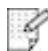

注：· 部分计算机可能因系统配置等原因，插入安装光盘后不会自动播放光盘，请双击“计算机”，找到“DVD RW 驱动器”，双击“DVD RW 驱动器”，运行安装程序。

3. 阅读并同意《最终用户许可协议》和《隐私政策》协议条款，点击界面右下角的“下一步”按钮，进入驱动安装界面。  
4. 点击方式一下方的“一键安装”按钮，进入安装过程，安装过程可能需要一定时间，时间长短与您计算机配置有关，请您耐心等待。

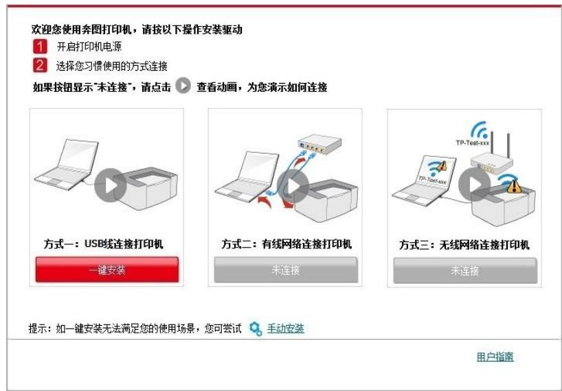

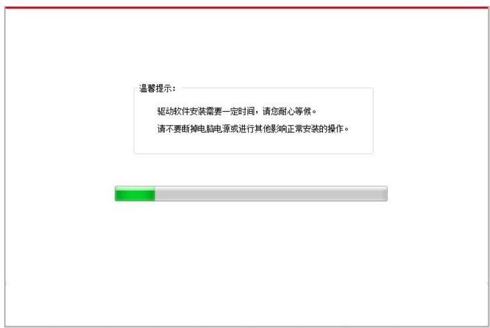

5. 安装完成，点击“打印测试页”，如果您的打印机能打印测试页，说明您已经正确安装打印机驱动。

# 3.1.2. 手动安装

\- 驱动安装前，您需要知道打印机型号，请打印打印机的“信息页”并查看“产品名称”来获知打印机型号（如何打印，请长按“取消/继续”键）。

# 3.1.2.1. USB连接方式安装

1. 使用 USB 连接线连接打印机和计算机，并开启打印机和计算机电源。  
2. 在计算机的光驱中插入随附的安装光盘：

\- Windows XP 系统：自动运行安装程序。

\- Windows 7/Vista/Server 2008 系统：弹出“自动播放”界面，点击“Autorun.exe”，运行安装程序。

\- Windows 8 系统：计算机桌面右上角弹出“DVD RW 驱动器”窗口，鼠标点击此弹窗任意位置，然后点击“Autorun.exe”，运行安装程序。

\- Windows 10 系统：计算机桌面右下角弹出“DVD RW 驱动器”窗口，鼠标点击此弹窗任意位置，然后点击“Autorun.exe”，运行安装程序。

注：· 部分计算机可能因系统配置等原因，插入安装光盘后不会自动播放光盘，请双击“计算机”，找到“DVD RW 驱动器”，双击“DVD RW 驱动器”，运行安装程序。

3. 阅读并同意《最终用户许可协议》和《隐私政策》协议条款，点击界面右下角的“下一步”按钮，进入驱动安装界面。  
4. 点击驱动安装界面下方的“手动安装”，进入手动安装界面。   
5. 选择安装语言和打印机型号。

6. 选择“USB 连接”，点击“安装”。

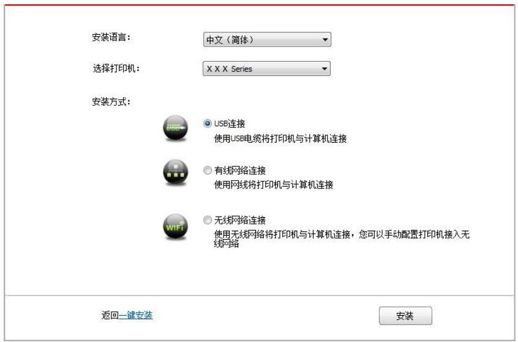

7. 安装软件自动安装驱动，安装过程可能需要一定时间，时间长短与您计算机配置有关，请您耐心等待。  
8. 安装完成，点击“打印测试页”，如果您的打印机能打印测试页，说明您已经正确安装打印机驱动。

# 3.1.3. 驱动卸载方法

以下操作以 Windows 7 为例，您的计算机屏幕信息可能因操作系统的不同而有差异。

1. 点击计算机的“开始菜单”，然后点击“所有程序”。  
2. 点击"Pantum"，然后点击"Pantum XXX Series"。

Pantum XXX Series 中的"XXX"代表产品型号。

3. 点击“卸载”，按照卸载窗口说明删除驱动。  
4. 卸载完成后重启计算机。

# 3.2. macOS 系统的驱动安装

\- macOS 系统下的驱动安装分为驱动安装和添加打印机两个步骤。

# 3.2.1. 驱动安装

以下操作以 macOS 10.14 为例，您的计算机屏幕信息可能因操作系统的不同而有差异。

1. 打开打印机和计算机的电源。  
2. 在计算机的光驱中插入随附的安装光盘，双击"Pantum XXX Series" 安装包。(Pantum XXX Series中的 XXX 代表产品型号。)

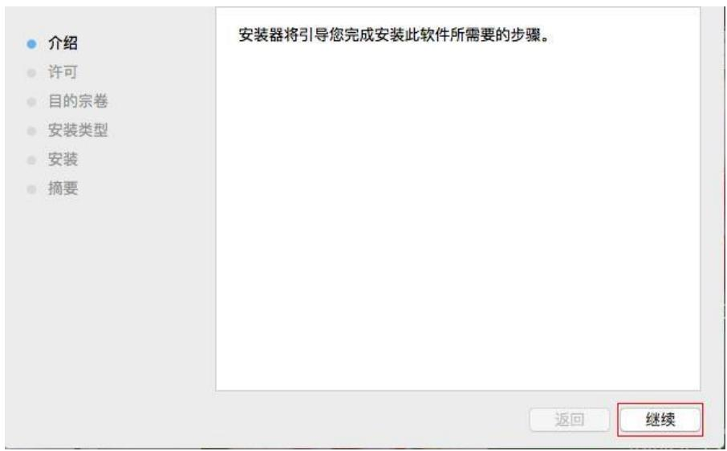

3. 点击“继续”。  
4. 阅读许可协议，然后点击“继续”。

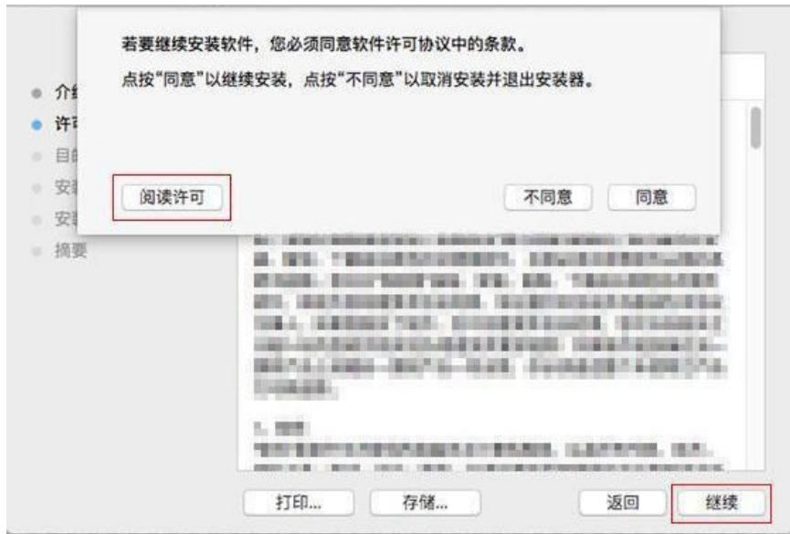

5. 在弹出的提示窗口，点击“同意”，接受许可协议。

6. 阅读隐私政策，然后点击“继续”。

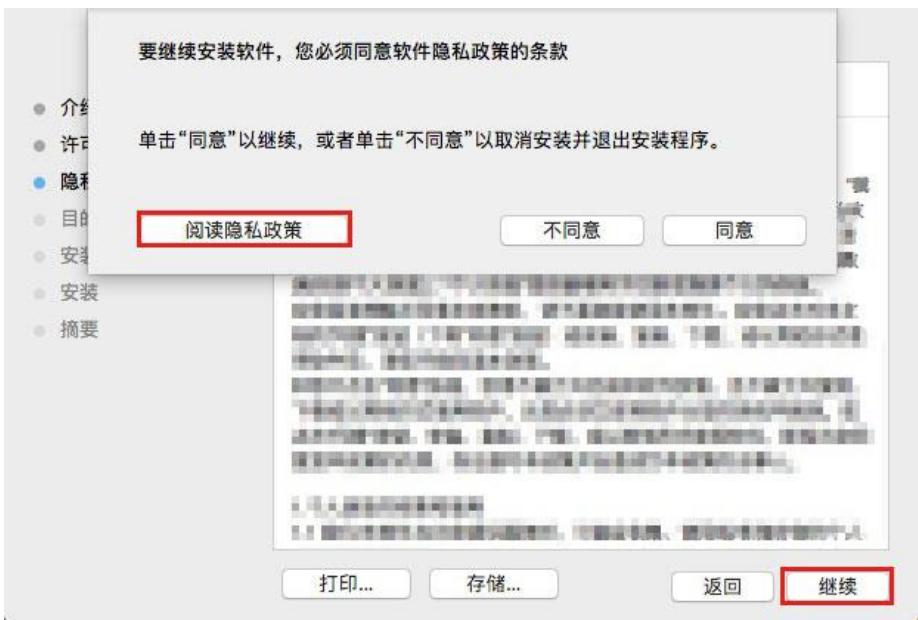

7. 在弹出的提示窗口，点击“同意”，接受隐私政策。  
8. 点击“安装”。  
9. 输入计算机密码，点击“安装软件”。

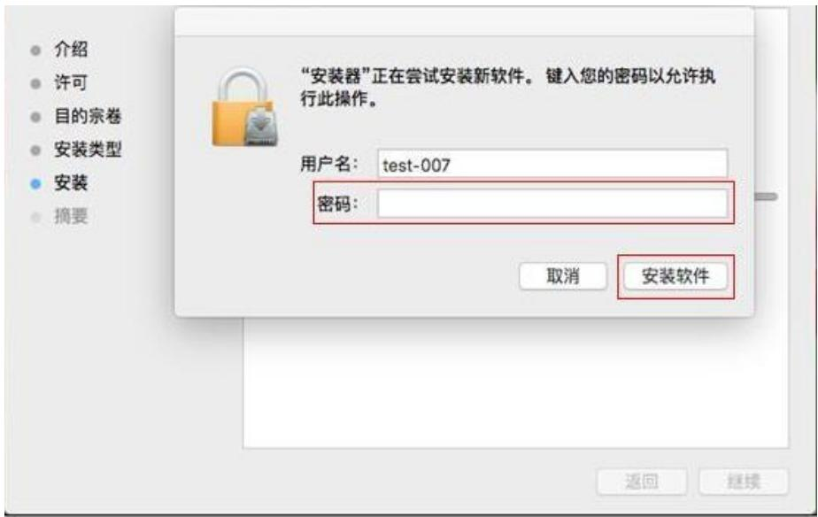

10. 在弹出的提示窗口，点击“继续安装”。  
11. 系统自动完成驱动安装。

若用 USB 连接线连接计算机，在驱动安装过程中将弹出“添加打印机”界面，可在此处添加打印机（如何添加打印机，请参阅第 3.3 章）。

# 3.3. macOS 系统添加打印机

# 3.3.1. USB 连接方式添加打印机

1. 使用 USB 连接线连接打印机和计算机，打开电源。  
2. 进入计算机的“系统偏好设置”—“打印机与扫描仪”。  
3. 点击 + 按钮，选择“添加打印机或扫描仪”。  
4. 选择打印机，然后从“使用”弹出菜单中选择对应的打印机型号。  
5. 点击“添加”。

# 4. 安全功能

安全功能仅适用于安全型打印机。本机支持的安全功能有文档溯源功能。若您需要进行普通打印，请参阅第 5 章。

# 4.1. 文档溯源功能

文档溯源功能用于打印纸质文档来源追溯，保护文档版权及追踪泄密源头。可以通过打印机的打印首选项配置文档溯源功能。

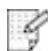

注：·打印溯源仅支持A4和A5纸张尺寸。

# 4.1.1. 打印二维码溯源信息设置

通过打印首选项来设置二维码溯源信息，操作如下：

1. 打开您需要打印的文件，点击左上角“文件”菜单，选择“打印”，调出打印驱动。  
2. 选择相应型号的打印机。  
3. 单击“打印机属性”-“首选项”-“溯源打印”，进行打印配置。

4. 根据需要勾选“二维码溯源”，设置溯源内容（默认内容为“计算机 MAC 地址”+“打印时间”），也可以根据您的需要自定义溯源内容，选择二维码显示位置，点击“应用”。

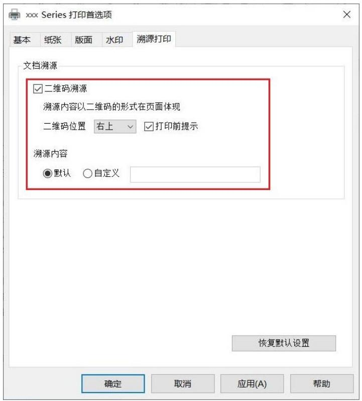

注：·自定义内容最多可以设置24个字符（包括汉字、字母、数字、符号、空格）。

\- 若您打印的当页文件内容过多，二维码可能会遮挡部分内容，请根据文件内容调整二维码位置。

5. 打开一份文档，设置打印参数后启动打印。  
6. 打印机开始打印，打印完成，步骤 4 设置的二维码溯源信息将嵌入到打印文档内。  
7. 已经嵌入的二维码溯源信息需用第三方软件来获取（如何获取，请参阅第4.1.2章）。

# 4.1.2. 提取二维码溯源信息

您可以通过第三方软件的“扫一扫”功能提取二维码溯源信息。

# 5. 打印

# 5.1. 打印功能

您可以通过“开始”—“设备和打印机”—选择相应的打印机—单击鼠标右键—在“打印首选项”中设置打印功能，部分功能如下：

<table><tr><td>功能</td><td>图示</td></tr><tr><td>自动双面打印</td><td>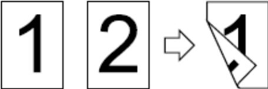</td></tr><tr><td>逐份打印</td><td></td></tr><tr><td>逆序打印</td><td></td></tr><tr><td>多页合一</td><td>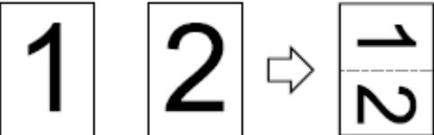</td></tr><tr><td>海报打印(仅适用于Windows系统)</td><td>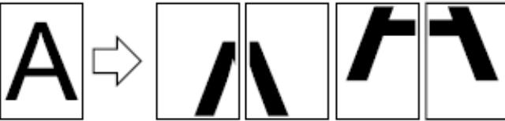</td></tr><tr><td>缩放打印</td><td></td></tr><tr><td>自定义尺寸</td><td></td></tr></table>

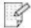

注：· 以上说明以Windows 7系统为例。

- 您可以在多页中选择2x2海报打印，实现海报打印功能。  
- 您可以打开打印首选项，点击帮助按钮，查看具体的功能解释。如何打开帮助文档，请参阅第5.9章。

# 5.2. 打印设置

发送打印作业前，可通过以下两种方式设置打印参数（如纸张类型、纸张尺寸和纸张来源）。

<table><tr><td>操作系统</td><td>临时更改打印作业的设置</td><td>永久更改默认设置</td></tr><tr><td>Windows 7</td><td>1. 点击文件菜单一打印一选择打印机一打印机属性(具体步骤因操作系统不同而有差异)。</td><td>1. 点击开始菜单一控制面板一设备和打印机。2. 右键点击打印机图标,选择打印首选项,更改设置并保存。</td></tr><tr><td>macOS</td><td>1. 点击文件菜单一打印。2. 在弹出的窗口更改设置。</td><td>1. 点击文件菜单一打印。2. 在弹出的窗口更改设置,点击保存预设置。(每次进行打印时,必须选择预设置,否则按默认设置进行打印。)</td></tr></table>

注：·应用软件设置优先级高于打印机设置。

# 5.3. 取消打印

在打印过程中可取消当前打印作业。对于 LED 控制面板的打印机，按“取消”键超过 2 秒钟取消当前打印作业。

# 5.4. 打印方式

本机可进行自动进纸盒打印和手动进纸盒打印。默认状态为自动选择，若手动进纸盒有打印介质，则优先打印手动进纸盒内的打印纸张。

# 5.4.1. 自动进纸盒打印

在打印前，请确保自动进纸盒中已装入相应数量的介质，且手动进纸盒内无打印介质。

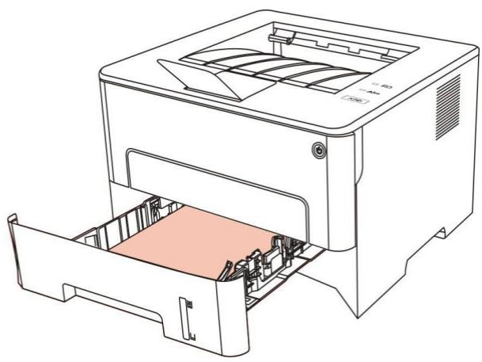

注：· 有关装纸注意事项，请参阅第2章。

\- 有关自动进纸盒打印的介质类型，请参阅第2.1章。

# 5.4.2. 手动进纸盒打印

当您将纸张放入手动进纸盒时，本机将自动进入手动进纸模式。

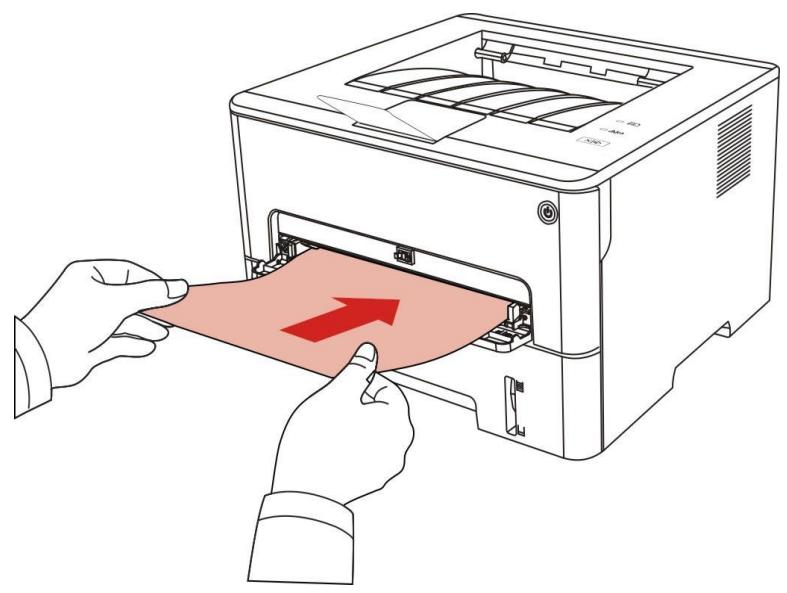

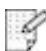

注：·手动进纸模式是当手动进纸盒放入纸张时，优先从手动进纸盒走纸。  
- 手动进纸盒一般用来打印特殊纸张，如信封纸、胶片纸等，且每次只能放入一张。  
- 有关在手动进纸盒中装纸，请参阅第2章。  
- 有关可以通过手动进纸盒打印的介质种类，请参阅第2.1章。

# 5.5. 自动双面打印

本机支持普通纸的自动双面打印。自动双面打印支持的纸张大小：A4、Letter、Legal、Oficio、Folio、16K。

注：·某些纸张介质不适于自动双面打印，尝试自动双面打印可能会损坏打印机。

- 自动双面打印不支持海报打印。  
- 有关装纸，自动进纸盒打印的介质类型，请参阅第2章。

# 5.5.1. 双面打印单元设置

为获得最佳打印效果，您可以对双面打印单元的纸张尺寸进行设置。若进行 A4、16K 双面打印，需将拨块调节到 A4 位置；若进行 Letter、Legal、Folio、Oficio 双面打印，需将拨块调节到 Letter 位置。双面打印单元设置步骤为：

1. 抽出双面打印单元。

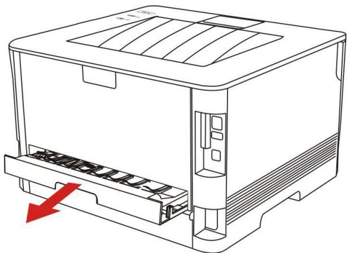

2. 将双面打印单元的背面朝上。

3. 调节纸张尺寸拨块到 A4 或 Letter 位置，即可完成设置。

4. 将双面打印单元装入打印机。

# 5.5.2. 如何进行自动双面打印

1. 从应用程序（如记事本）打开要打印的打印作业。  
2. 从“文件”菜单中选择“打印”。

3. 选择相应型号的打印机。

4. 单击“首选项”，进行打印配置。  
5. 选择“基本”选项卡的“双面打印”，选择“长边”或“短边”选项。

6. 单击“确定”，完成打印设置。点击“打印”，即可实现自动双面打印。

# 5.6. 精细模式打印

精细模式适用于工程图纸及细线打印。

在打印机首选项的基本页面，进行精细模式设置。打印作业，即可实现精细模式打印。

# 5.7. 静音打印

设置静音打印，可减小打印噪音，但打印速度将会有所降低。

静音打印，操作步骤如下（适用于 USB 连接方式安装的打印机）

以下步骤以 Windows 7 系统为例，您的计算机屏幕信息可能因操作系统的不同而有差异。

1. 进入计算机的“开始”菜单—“控制面板”—查看“设备和打印机”。  
2. 右键点击打印机，在下拉菜单，选择“打印机属性”。  
3. 进入“辅助设置”选项。  
4. 勾选“静音打印”，点击“确定”，完成设置。

5. 从应用程序打开要打印的打印作业，选择相应型号的打印机，根据需要进行打印配置。  
6. 点击“打印”，即可实现静音打印。

# 5.8. 自动关机设置

“自动关机设置”用来设置打印机关机条件和关机延时时间。

1. 进入计算机的“开始菜单”—“控制面板”—查看“设备和打印机”。  
2. 右键点击打印机，在下拉菜单，选择“打印机属性”。  
3. 进入“辅助设置”选项，进行相应的“自动关机设置”选项设置。   
4. 点击“确定”，完成设置。

注：·个别国家（或地区）不支持自动关机设置功能。

# 5.9. 打开帮助文档

您可以打开“打印首选项”，点击“帮助”按钮（仅适用于 Windows 系统）。帮助文档中有打印机的使用指南，可通过使用指南了解打印的相关设置信息。

# 6. 日常维护

注：·打印机外观因型号功能不同存在差异，示意图仅供参考。

# 6.1. 打印机清洁

注：· 请使用中性清洁剂。

\- 打印机使用后短时间内局部零件仍处于高温状态。当打开前盖或后盖接触内部零件时，请勿立即触碰高温警示标签位置，谨防烫伤。

1. 使用柔软的抹布擦拭设备外部，除去灰尘。

2. 打开前盖，沿着导轨取出激光碳粉盒。

注：· 取下激光碳粉盒时，请将激光碳粉盒装入保护袋或用厚纸包裹，避免光线照射而损坏感光鼓。

3. 清洁打印机内部，如下图所示，用干燥无绒布料轻轻擦拭图示阴影处。

4. 用干燥无绒布料轻轻擦拭打印机 LSU 镜片。

5. 打开打印机的自动进纸盒，用干燥无绒布料轻轻擦拭打印机搓纸辊。

# 6.2. 粉盒和鼓组件维护

# 6.2.1. 关于粉盒和鼓组件

1. 粉盒的使用和维护。

为了获得更好的打印质量，请使用原装粉盒。

使用粉盒时，请注意下列事项：

- 除非立即使用，否则请勿从包装中取出粉盒。  
- 请勿擅自重新填充粉盒。否则由此引起的损坏不包括在打印机保修范围内。

- 请将粉盒存放在阴凉干燥的环境。  
- 请勿将粉盒置于火源附近，粉盒内的碳粉为易燃物，避免引起火灾。  
- 在取出或拆卸粉盒时，请注意碳粉泄露问题，若发生碳粉泄露导致碳粉与皮肤接触或者飞溅入眼睛和口中，请立即用清水清洗，如有不适请立即就医。  
- 放置粉盒时，请远离儿童可接触区域。

# 2. 粉盒使用寿命。

- 粉盒的使用寿命取决于打印作业需要的碳粉量。  
- LED 控制面板的打印机，当粉盒指示灯橙灯常亮，表示该粉盒已到寿命期限，请更换粉盒。

# 3. 鼓组件使用寿命。

\- LED 控制面板的打印机，当鼓组件指示灯红灯常亮，表示该鼓组件已到寿命期限，请更换鼓组件。

# 6.2.2. 更换粉盒和鼓组件

注：在更换粉盒前，请注意如下事项：

- 因粉盒表面可能含有碳粉，取出时请小心处理，避免洒落。  
- 取出的粉盒请放置在纸张上，以免碳粉大范围洒落。  
- 安装时，请勿触碰感光鼓表面，以免刮伤感光鼓。

# 更换粉盒步骤如下：

# 1. 关闭打印机电源。

# 2. 打开前盖，沿着导轨取出激光碳粉盒。

# 3. 用左手按下鼓组件左侧蓝色按钮，同时用右手提起粉盒把手，取出粉盒。

4. 打开新的粉盒包装，握住粉盒把手，轻轻的左右摇动 5 至 6 次使粉盒内碳粉均匀分散。

5. 拉出封条，取下粉盒保护罩。

6. 沿着鼓组件内导轨将粉盒装入鼓组件内，完成粉盒安装。

7. 拿起安装完粉盒的鼓组件，沿着打印机内导轨装入已安装了粉盒的鼓组件，完成安装。

8. 合上前盖。

# 更换鼓组件步骤如下:

1. 关闭打印机电源。

2. 打开前盖，沿着导轨取出激光碳粉盒。

3. 用左手按下鼓组件左侧蓝色按钮，同时用右手提起粉盒把手，取出粉盒。

4. 打开新的鼓组件包装，取下鼓组件保护装置，将鼓组件放置于水平台面。

5. 沿着鼓组件内导轨将粉盒装入鼓组件内，完成粉盒安装。

6. 拿起安装完粉盒的鼓组件，沿着打印机内导轨装入已安装了粉盒的鼓组件，完成安装。

7. 合上前盖。

# 7. 故障排除

请仔细阅读本章节，可以帮您解决打印过程中常见的故障。若还未能解决出现的问题，请及时联系奔图售后服务中心。

在处理常见故障之前，首先请检查以下情况：

- 电源线是否连接正确，并且打印机电源开关是否已打开。  
- 所有的保护零件是否已拆除。  
- 激光碳粉盒是否已正确安装。  
- 纸张是否已正确放入纸盒中。  
- 接口电缆线是否已正确连接打印机和计算机。  
- 是否已选择并安装了正确的打印机驱动程序。  
- 计算机端口是否已安装并连接到正确的打印机端口。

# 7.1. 清除卡纸

# 7.1.1. 自动进纸盒卡纸

# 1. 打开纸盒。

2. 将卡住的纸张轻轻地向外拉出。

3. 取出卡纸后，请将纸盒重新装入打印机，开合前盖，打印机将自动恢复打印。

# 7.1.2. 手动进纸盒卡纸

1. 将卡住的纸张轻轻地向外拉出。

2. 取出后重新装入纸张，开合前盖，打印机将恢复打印。

# 7.1.3. 中间卡纸

注：·在取中间卡纸时，请注意切勿触摸如下阴影部分区域，避免灼伤。

1. 抽出纸盒。

2. 将卡住的纸张轻轻地向外拉出。

3. 装入纸盒。

4. 打开前盖。

5. 沿着导轨取出激光碳粉盒。（为避免感光鼓曝光影响打印质量，请用保护袋将激光碳粉盒装好，或用厚纸包裹激光碳粉盒。）

6. 将卡住的纸张轻轻地向外拉出。

7. 取出卡纸后，重新装入激光碳粉盒，合上前盖，打印机将恢复打印。

# 7.1.4. 定影单元卡纸

注：·在取定影单元卡纸时，请注意切勿触摸如下阴影部分区域，避免灼伤。

1. 打开后盖。

2. 通过两边的把手打开定影解压单元。

3. 将卡住的纸张轻轻地向外拉出。

4. 取出卡纸后，关上后盖，开合前盖，打印机将自动恢复打印。

# 7.1.5. 双面打印单元卡纸

1. 从打印机后面取出双面打印单元。

2. 从双面打印单元中取出卡纸。

3. 如果纸张未随双面打印单元一起出来，请打开纸盒直接从底部取出卡纸。

4. 取出卡纸后，装回双面打印单元，检查产品其他部位，确保无卡纸后，开合前盖，打印机将自动恢复打印。

注：·按如上步骤将卡纸全部取出后，合上前盖，整理好纸盒中的纸张，打印机将自动恢复打印。

- 如果打印机仍然未开始打印，请检查打印机内的卡纸是否全部清除。   
- 如果不能自行取出卡纸，请联系当地的奔图授权维修中心或送往就近奔图授权维修中心维修。   
- 打印机外观因型号功能不同会存在差异，示意图仅供参考。

# 7.2. 软件故障

<table><tr><td>故障现象</td><td>解决方法</td></tr><tr><td>在“设备和打印机”文件夹中不显示打印机图标。</td><td>重新安装打印机驱动程序。请确保USB连接线及电源线正确连接。</td></tr><tr><td>打印机处于“就绪”模式,但不执行任何打印作业。</td><td>重启打印机,若故障依旧,请重新安装打印机驱动程序。确保USB连接线正确连接。</td></tr><tr><td>驱动安装失败。</td><td>检查Print Spooler服务是否已经打开。检查打印机电源是否打开,打印机连接是否正常。</td></tr></table>

# 7.3. 常见故障排除

# 7.3.1. 一般故障

<table><tr><td>故障现象</td><td>原因</td><td>解决办法</td></tr><tr><td colspan="3">打印机问题</td></tr><tr><td>打印机不打印</td><td>计算机与打印机之间的连接线未正确连接。打印端口指定错误。打印机处于脱机状态,勾选了“脱机使用打印机”。打印机内部错误未恢复,如卡纸,缺纸等。打印机驱动程序安装不正确。</td><td>断开打印机线缆连接,然后重新连接。检查 Windows 打印机设置,确保打印作业发送到正确的端口。如果计算机有多个端口,请确认产品连接到正确的端口。请确保打印机处于正常联机状态。请排除错误使打印机恢复正常状态。卸载然后重新安装打印机的驱动程序。</td></tr><tr><td colspan="3">纸张处理问题</td></tr><tr><td>打印不进纸</td><td>未正确安装打印介质。打印介质超出了使用规格范围。给纸辊脏污。纸盒中的纸张过多。</td><td>请正确安装打印介质,如果使用特殊打印介质打印,请使用手动进纸盒打印。请使用规格范围内的打印介质。清洁给纸辊。从纸盒中取出多余的纸张,如果在特殊打印介质上打印,请使用手动进纸盒。</td></tr><tr><td>卡纸</td><td>纸盒中的纸张过多。打印介质超出了使用规格范围。进纸通道有异物。给纸辊脏污。内部部件故障。</td><td>从纸盒中取出多余的纸张,如果在特殊打印介质上打印,请使用手动进纸盒。确保使用符合规格的纸张。如果在特殊打印介质上打印,请使用手动进纸盒。清洁进纸通道。清洁给纸辊。</td></tr><tr><td>打印多页进纸</td><td>打印介质含静电量过大。打印介质受潮或粘合在一起。内部部件故障。</td><td>将打印介质重新分离,可以消除部分静电。建议使用推荐打印介质。请重新将打印介质分离或使用更好的干燥打印介质。</td></tr></table>

注：·若问题依旧存在，请联系客服中心，具体联系方式请查阅三包凭证。

# 7.3.2. 图像缺陷

<table><tr><td>故障现象</td><td>故障原因</td><td>解决办法</td></tr><tr><td>打印发白或偏淡</td><td>·打印介质不符合使用规格,例如介质受潮或太粗糙。·打印程序中质量设置过低,浓度设置过低,或勾选了省墨模式。·碳粉不足。·粉盒损坏。</td><td>·请正确使用规格范围内的介质。·设置程序中的打印质量,浓度设置,或取消勾选省墨模式。·建议更换原装粉盒。</td></tr><tr><td>粉墨斑点</td><td>·粉盒脏污或漏粉。·粉盒损坏。·使用了不符合使用规格的打印介质,例如介质受潮或太粗糙。·进纸通道脏污。</td><td>·建议更换原装粉盒。·请使用规格范围内的打印介质。·清洁进纸通道。</td></tr><tr><td>白点</td><td>·使用了不符合使用规格的打印介质,例如介质受潮或太粗糙。·进纸通道脏污。·粉盒内部鼓损坏。</td><td>·请使用规格范围内的打印介质。·清洁进纸通道。·建议更换原装粉盒。</td></tr><tr><td>碳粉脱落</td><td>·使用了不符合使用规格的打印介质,例如介质受潮或太粗糙。·设置打印纸张介质与放置纸张介质不一致·机器内部脏污。粉盒损坏。机器内部部件损坏。</td><td>·请使用规格范围内的打印介质,特殊介质请使用手动进纸盒进行打印。·请使用相对应的纸张介质进行打印。·清洁机器内部。·建议更换原装粉盒。</td></tr><tr><td>黑色竖条</td><td>粉盒脏污。粉盒内部部件损坏。机器内部激光器反光玻璃脏污。进纸通道脏污。</td><td>清洁或更换新粉盒。清洁机器背部激光器反光玻璃。清洁打印机进纸通道。</td></tr><tr><td>黑色背景(底灰)</td><td>使用了不符合使用规格的打印介质,例如介质受潮或太粗糙。粉盒脏污。粉盒内部部件损坏。进纸通道脏污。打印机内部转印电压异常。</td><td>请使用规格范围内的打印介质。清洁或更换新粉盒。清洁机器内部进纸通道。</td></tr><tr><td>出现周期性痕迹</td><td>粉盒脏污。粉盒内部部件损坏。定影组件损坏。</td><td>清洁或更换新粉盒。请联系客服中心维修更换新的定影组件。</td></tr><tr><td>页面歪斜</td><td>未正确安装打印介质。机器进纸通道脏污。</td><td>确保正确安装打印介质。清洁机器内部进纸通道。</td></tr><tr><td>皱纸</td><td>未正确安装打印介质。打印介质不符合使用规格。机器进纸通道脏污。定影组件损坏。</td><td>确保正确安装打印介质。请使用规格范围内的打印介质进行打印。清洁机器内部进纸通道。请联系客服中心维修更换新的定影组件。</td></tr><tr><td>背面脏污</td><td>粉盒脏污。机器内部转印辊脏污。机器内部转印电压异常。</td><td>清洁或更换新粉盒。清洁机器内部转印部件。</td></tr><tr><td>打印全黑版</td><td>未正确安装粉盒。粉盒内部损坏。机器内部充电异常,未给粉盒充电。</td><td>确保正确安装粉盒。建议更换原装粉盒。</td></tr><tr><td>碳粉晕开</td><td>使用了不符合使用规格的打印介质,例如介质受潮或太粗糙。机器内部脏污。粉盒损坏。机器内部部件损坏。</td><td>请使用规格范围内的打印介质,特殊介质请使用手动纸盒进行打印。清洁机器内部。建议更换原装粉盒。</td></tr><tr><td>水平条纹</td><td>粉盒未正确安装。粉盒可能损坏。机器内部部件损坏。</td><td>确保正确安装粉盒。建议更换原装粉盒。</td></tr></table>

注：· 上述故障可采用清洁或更换新粉盒等方法来改善。如果问题依旧，请联系客服中心，具体联系方式请查阅三包凭证。

# 8. 产品规格

注：· 不同型号不同功能的打印机，规格数值略有差异，不同区域国家的产品规格也存在差异。

\- 数值基于初始数据，有关更多最新规格信息，请访问：www.pantum.com。

8.1. 规格总述

<table><tr><td>产品尺寸(长*宽*高)</td><td>354mm*334mm*232mm</td></tr><tr><td>产品净重(含本体半成品和随机鼓粉)</td><td>6.8Kg</td></tr><tr><td>产品毛重(含所有包材和外箱)</td><td>9.4kg</td></tr><tr><td rowspan="2">操作环境</td><td>最佳打印温度范围:10~32°C</td></tr><tr><td>最佳打印湿度范围:20%RH~80%RH</td></tr><tr><td>电源电压</td><td>220V Model:AC220-240V,50/60Hz,4.5A</td></tr><tr><td rowspan="3">噪音(声压级)</td><td>打印:≤52dB(A)</td></tr><tr><td>就绪:≤30dB(A)</td></tr><tr><td>静音模式:≤46 dB(A)</td></tr><tr><td>进入网络待机时间</td><td>1分钟</td></tr><tr><td rowspan="3">功耗</td><td>待机:≤50W</td></tr><tr><td>关机:≤0.5W</td></tr><tr><td>TEC:符合中国能效等级要求</td></tr><tr><td>操作系统</td><td>Microsoft Windows XP/ Windows Vista/ Windows 7/ Windows 8/ Windows 8.1/ Windows 10/ Windows 11/ Windows Server 2003/ Windows Server 2008/ Windows Server 2012 (32/64 Bit)macOS 10.9/10.10/10.11/10.12/10.13/10.14/10.15/11.6/12.1</td></tr><tr><td></td><td>Linux (Ubuntu 14.04/ Ubuntu 16.04/ Ubuntu 18.04/ Ubuntu 20.04)</td></tr><tr><td>通信接口</td><td>USB 2.0 (High Speed)</td></tr><tr><td>首页打印时间</td><td>≤8.5秒</td></tr><tr><td>最大打印幅面</td><td>216mm*356mm</td></tr></table>

# PANTUM