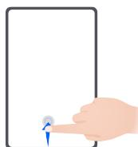
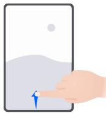
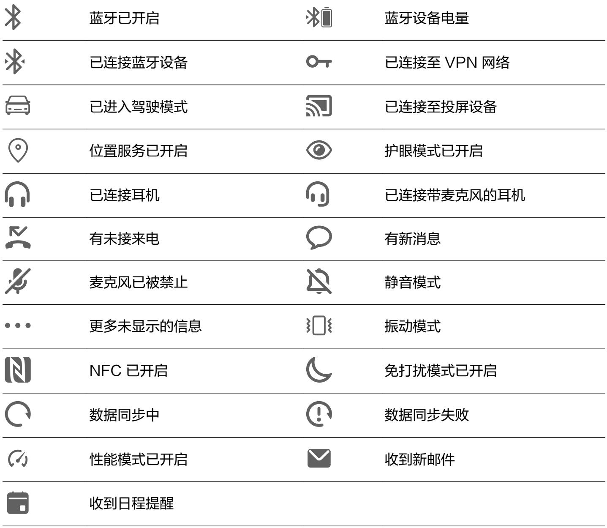
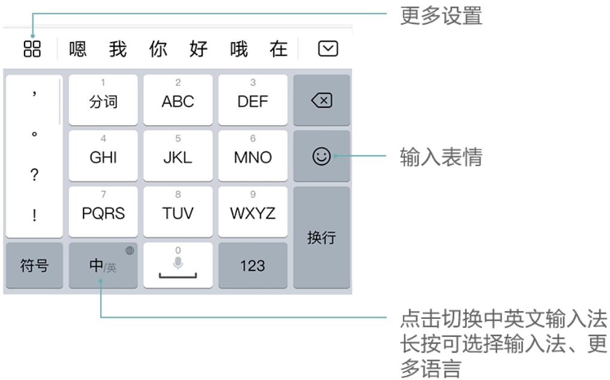
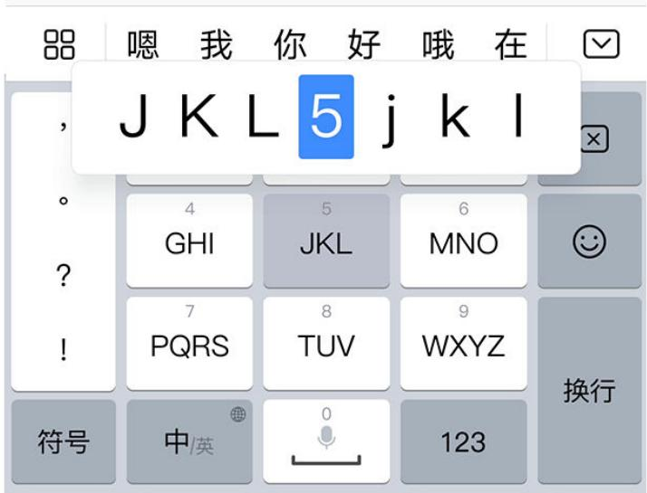
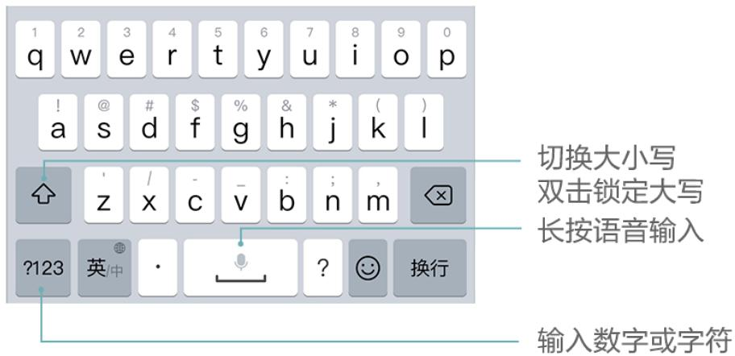

# 华为平板C5

# 用户指南

# 目 录

# 基础使用

常用手势 1

系统导航 2

平板克隆 3

锁屏与解锁 4

了解桌面 5

常见图标含义 5

快捷开关 6

桌面窗口小工具 6

更换壁纸 7

截屏和录屏 7

查看和关闭通知 8

调整音量 9

输入文本 9

分屏与悬浮窗 12

充电 14

# 智慧功能

平板投屏 16

手机平板多屏协同 17

华为分享 18

多设备协同管理 19

音频通道一键切换 20

# 相机图库

打开相机 21

拍照 21

AI 美拍 22

变焦拍摄照片 22

全景拍摄 23

HDR 拍摄 23

动态照片 23

照片添加水印 24

专业相机 24

拍视频 26

延时摄影 26

相机滤镜 27

相机设置 27

管理图库 28

图库智能分类 33

精彩时刻 34

# 应用

应用管理 36

日历 37

时钟 38

备忘录 39

录音机 41

电子邮件 42

计算器 45

手电筒 46

指南针 46

应用分身 46

打开应用常用功能 46

平板管家 47

平板克隆 48

# 设置

WLAN 49

更多连接 50

桌面和壁纸 51

显示和亮度 53

声音和振动 55

通知 56

生物识别和密码 57

应用 59

电池 59

存储 60

安全 61

隐私 63

辅助功能 66

用户和帐户 68

系统和更新 68

关于平板电脑 71

# 基础使用

# 常用手势

# 常用手势

# 全面屏导航手势

进入 设置 > 系统和更新 > 系统导航方式，确保选择了手势导航。

更多手势  

# 返回上一级

从屏幕左边缘或右边缘向内滑动

# 返回桌面

从屏幕底部边缘中间上滑

# 查看多任务

从屏幕底部边缘向上滑并停顿

# 结束单个任务

查看多任务时，上滑单个任务卡片

<table><tr><td></td><td>进入锁屏快捷操作面板锁屏后,点亮屏幕,然后单指从底部上滑</td></tr><tr><td></td><td>打开搜索从桌面中部向下滑动,打开搜索框</td></tr><tr><td></td><td>打开快捷开关和通知消息从屏幕顶部下滑</td></tr></table>

# 系统导航

# 更改导航方式

进入 设置 > 系统和更新 > 系统导航方式，选择需要的导航方式。

# 手势导航

进入 设置 > 系统和更新 > 系统导航方式，开启或关闭手势导航。

开启手势导航后，您可以：

• 返回上一级菜单：从屏幕左边缘或右边缘向内滑动。

• 返回桌面：从屏幕底部边缘中间上滑。

• 进入多任务：从屏幕底部边缘向上滑并停顿。

• 结束单个任务：进入多任务界面时，上滑单个任务卡片。

# 三键虚拟导航

进入 设置 > 系统和更新 > 系统导航方式，选择屏幕内三键导航。

您还可以根据使用习惯，进入更多设置，选择不同的导航栏组合。

开启屏幕内三键导航后，您可以：

返回键：点击返回上一级菜单或退出应用程序。在文字输入界面，点击关闭屏幕键盘。

• 主屏键：点击返回主屏幕。

最近键：点击进入多任务管理界面。

下拉通知键：点击打开通知面板。

# 修改屏幕内三键导航样式

进入屏幕内三键导航 > 更多设置，您可以：

• 选择不同的导航栏组合样式。

• 打开导航键可隐藏开关，在不使用导航键时将其隐藏。

# 悬浮导航

进入 设置 > 系统和更新 > 系统导航方式 > 更多，开启悬浮导航开关。

当出现悬浮导航按钮后，您可以：

• 拖动悬浮导航到您顺手的位置  
• 点击悬浮导航，返回上一级  
• 双击悬浮导航，返回两级  
• 长按悬浮导航后松开手指，返回桌面  
• 按住悬浮导航并向左或右滑动，查看后台运行中的任务

# 平板克隆

# 平板克隆

使用平板克隆，只需较短时间，便可将旧平板上的基础数据（如联系人、日历、图片、视频等）迁移到新平板，实现新旧平板无缝衔接。

# 从 Android 设备导入数据

1 在新平板上，进入 平板克隆应用（在实用工具文件夹中），或进入 设置 > 系统和更新 >平板克隆，点击这是新设备，选择 华为 或其他安卓。  
2 根据界面提示，在旧设备下载安装平板克隆。  
3 在旧设备上，进入 平板克隆应用，点击这是旧设备，根据界面提示，通过扫码或手动连接的方式，将旧设备与新平板建立连接。  
4 在旧设备上，选择要克隆的数据，点击开始迁移完成数据克隆。  
i 平板克隆仅支持 Android 5.0 及以上版本的平板。

# 从 iPhone 或 iPad 导入数据

1 在新平板上，进入 平板克隆应用（在实用工具文件夹中），或进入 设置 > 系统和更新 >平板克隆，点击这是新设备，选择 iPhone/iPad。  
2 根据屏幕提示，在旧设备下载安装平板克隆。  
3 在旧设备上，进入 平板克隆应用，点击这是旧设备，根据界面提示，通过扫码或手动连接的方式，将旧设备与新平板建立连接。

4 在旧设备上，选择要克隆的数据，并根据界面提示完成数据克隆。

平板克隆仅支持 iOS 8.0 及以上版本的平板。

# 锁屏与解锁

# 锁屏与解锁

# 锁定屏幕

一段时间不操作平板，平板将自动锁屏。

您也可以通过以下方式手动锁定屏幕：

• 按电源键锁定屏幕。

• 在主屏幕，双指捏合进入主屏幕编辑模式，点击窗口小工具，将一键锁屏快捷图标添加到主屏幕。然后点击一键锁屏图标锁屏。

# 设置自动锁屏时间

进入 设置 > 显示和亮度 > 休眠，选择对应的屏幕自动休眠时长。

# 点亮屏幕

您可以通过以下方式点亮屏幕：

• 按电源键点亮屏幕。

• 进入 设置 > 辅助功能 > 快捷启动及手势 > 亮屏，开启并使用拿起设备亮屏或双击亮屏。

# 输入密码解锁

点亮屏幕后，从屏幕中部向上滑动，会出现密码输入面板。输入锁屏密码即可。

# 使用人脸解锁

点亮屏幕后，将平板对准人脸。平板会自动进行人脸识别校验，校验成功后即可解锁。

# 更改锁屏界面显示

进入 设置 > 桌面和壁纸，点击锁屏签名，输入个性的签名信息。

如需关闭锁屏签名，点击锁屏签名，删除原签名内容。

# 从锁屏界面快速打开应用

在锁屏界面，您可以快速打开相机、录音机、计算器等常用应用。

• 点亮屏幕，按住 并上滑，打开相机。

• 点亮屏幕，从屏幕底部边缘向上滑动，打开快捷操作面板，点击录音机、手电筒、计算器、计时器、智慧视觉。

# 了解桌面

# 了解桌面

在桌面上，您可以：

• 通过顶部状态栏查看平板状态、通知消息。  
• 左右滑动查看应用、桌面小工具。

• 滑动至最左边屏幕，开启智能助手，实时查看平板给您推荐的智能消息。

# 常见图标含义

# 常见图标含义

i 网络状态图标可能因您所在的地区或网络服务提供商不同而存在差异。

不同产品支持的功能有差异，以下图标可能不会出现在您的平板上，请以平板实际显示为准。

<table><tr><td>5G</td><td>5G 网络已连接</td><td>4G</td><td>4G 网络已连接</td></tr><tr><td>3G</td><td>3G 网络已连接</td><td>2G</td><td>2G 网络已连接</td></tr><tr><td></td><td>信号满格</td><td></td><td>正在漫游</td></tr><tr><td></td><td>已开启省流量模式</td><td></td><td>未插入 SIM 卡</td></tr><tr><td></td><td>已开启热点</td><td></td><td>已连接至热点</td></tr><tr><td></td><td>正在通话</td><td></td><td>VoLTE 高清通话已开启</td></tr><tr><td></td><td>已连接至 WLAN 网络</td><td></td><td>正在使用天际通</td></tr><tr><td></td><td>热点已断开</td><td></td><td>正在通过 WLAN+ 自动切换网络</td></tr><tr><td></td><td>飞行模式已开启</td><td></td><td>闹钟已开启</td></tr><tr><td></td><td>电池无电量</td><td></td><td>电池电量低</td></tr><tr><td></td><td>正在充电</td><td></td><td>正在使用快充</td></tr><tr><td></td><td>正在使用超级快充</td><td></td><td>无线超级快充</td></tr><tr><td></td><td>无线快充</td><td></td><td>普通无线充电</td></tr><tr><td></td><td>省电模式已开启</td><td></td><td>健康使用平板已开启</td></tr></table>

<table><tr><td></td></tr></table>

# 快捷开关

# 快捷开关

# 打开快捷开关

从屏幕顶部状态栏下滑出通知面板，继续向下滑出整个菜单。

• 点击快捷开关，开启或关闭相应功能。  
• 长按快捷开关，进入对应功能的设置页面（部分功能支持）。

• 点击 进入设置界面。

# 自定义快捷开关

点击 ，然后长按并拖动快捷开关调整位置。

# 桌面窗口小工具

# 桌面窗口小工具

您可以根据需要添加、移动或删除桌面窗口小工具，包括一键锁屏、天气、备忘录预览、联系人、日历等。

# 添加天气、时钟等桌面小工具

1 在桌面上双指捏合，进入桌面编辑状态。  
2 点击窗口小工具，然后可以向左滑动查看所有小工具。  
3 部分小工具（如天气）会有多种样式，点击该图标可以展开所有的样式。向右滑动展开的样式，可以收拢。  
4 点击需要的小工具图标，即可将其添加到当前屏幕。如果当前屏幕没有空间，您可以长按并拖动该图标，将其添加到其它屏幕。

# 移动或删除窗口小工具

在桌面，长按一个窗口小工具直到平板振动，然后可将其拖动到桌面的任意位置。或点击移除将其删除。

# 更换壁纸

# 更换壁纸

# 使用自带的壁纸

1 进入 设置 > 桌面和壁纸 > 壁纸。  
2 选择一张图片。  
3 根据需要选择：

• 虚化：让壁纸呈现出模糊、虚化的效果。滑动滑块可以调节虚化程度。  
滚动：让壁纸能跟随屏幕滑动。

4 点击 ， 选择将其设为锁屏、设为桌面或同时设置。

# 将图库中的照片设为壁纸

1 进入 图库，找到您喜欢的图片。  
2 点击 > 设置为 > 壁纸，根据屏幕提示完成设置。

# 截屏和录屏

# 截屏

# 使用组合键截取屏幕

同时按下电源键和音量下键截取完整屏幕。

# 使用快捷开关截取屏幕

从屏幕顶部状态栏下滑出通知面板，继续向下滑出整个菜单，点击 截取完整屏幕。

# 使用三指下滑截屏

1 进入 设置 > 辅助功能 > 快捷启动及手势 > 截屏，确保三指下滑截屏开关已开启。  
2 使用三指从屏幕中部向下滑动，即可截取完整屏幕。

# 分享、编辑或继续滚动截长图

截屏完成后，左下角会出现缩略图。您可以：

• 向下滑动缩略图，可以继续滚动截长屏。

0 横屏下不支持该功能。

• 向上滑动缩略图，选择一种分享方式，快速将截图分享给好友。

• 点击缩略图，可以编辑、删除截屏。

截屏图片默认保存在图库中。

# 录屏

您可以将屏幕操作过程录制成视频，分享给亲朋好友。

# 使用快捷开关录屏

1 从顶部状态栏向下滑出通知面板，继续向下滑出整个菜单。  
2 点击屏幕录制，启动录屏。   
3 点击屏幕上方的红色计时按钮，结束录屏。  
4 进入图库查看录屏结果。

# 边录屏，边解说

录屏时，您还可以开启麦克风，边录屏，边解说。

启动录屏后，点击麦克风图标让其处于 ，就可以同步记录声音。

表示麦克风关闭。此时仅可以收录系统音（如：音乐）。如您不想收录任何系统音，请在屏前将平板调成静音并关闭音乐等媒体音。

# 查看和关闭通知

# 查看和关闭通知

# 查看通知

当有通知提醒时，您可以点亮屏幕，从状态栏向下滑动，打开通知面板，查看各类消息。

# 清除通知

• 在通知面板上，快速向右滑动，可以清除该条通知。

• 点击通知面板底部的 ，清除所有通知。

# 关闭、设为静默通知或延后提醒

向左滑动需要处理的通知项，然后点击 ，可选择关闭通知、设为静默通知、延后提醒等。

0 部分系统通知不能被关闭、清除或延后。

# 调整音量

# 调整音量

# 按音量键调整音量

按音量上键或下键即可调大、调小音量。

# 按电源键快速静音

来电、闹铃响起时，按电源键可快速静音。

# 通过快捷开关切换响铃、振动或静音模式

1 从顶部状态栏向下滑出通知面板，继续向下滑出整个菜单。  
2 点击 响铃、 静音或 振动，可以在不同的模式之间快速切换。

# 输入文本

# 百度输入法华为版

百度输入法华为版由百度和华为联合开发，支持多种输入方式、键盘布局、输入语言、皮肤等，满足您的多种输入需求。

# 输入文本

当您需要输入文本时，点击屏幕，平板会自动弹出输入键盘。

键盘默认采用拼音9键布局，依次点击拼音字母，上方词条会出现联想词，点击即可输入。

按住字母键，上滑可输入数字，向左或向右滑动，可以输入字母。

如您习惯 26 键布局，长按左下角的中英文切换键，然后选择“拼音26键”。

0 使用百度输入法华为版的不同皮肤，按键快捷功能会有差异。如需完整体验上述快捷功能，请切换至默认皮肤。

# 更改键盘布局或输入方式

您可以通过以下任意一种方式切换键盘布局或输入方式：

• 长按左下角的中英文切换键，然后选择拼音26键、拼音9键、手写、五笔等。

• 点击 > 输入方式，然后选择拼音26键、拼音9键、手写、五笔等。

# 使用手写输入

1 长按左下角的中英文切换键，选择手写。  
2 在手写面板内书写文字，点击上方的文字联想确认您要输入的文字。  
3 您还可以点 击 ，选择全屏或半屏作为手写面板。

# 输入 AR 表情

1 点击键盘面板中的 > AR表情。  
2 选择要拍摄的表情格式（GIF动图、视频或图片）、贴纸等，根据界面提示录制个性化的 AR表情。  
3 若已安装微信程序，您可点击发送，将表情快速分享给好友。

# 切换输入语言

长按左下角的中英文切换键，在弹出的快捷面板中选择一种语言。

或点击更多语言，根据提示下载并勾选需要的语言，将其添加到快捷面板。再次打开输入面板，平板会提示您切换为新的语言。

# 使用语音输入

说出要输入的内容，平板会自动转成文本，还支持将说出的内容翻译成其他语言。

1 长按空格键，待平板振动后，进入语音输入界面。

2 点击 ， 根据提示选择输入语言，或要翻译的语言。  
3 点击 ，对着麦克风开始说话。  
4 点击返回关闭语音输入。

# 更换输入法皮肤

输入法支持多种个性化皮肤，如 CHERRY 经典黑、经典版皮肤等。

不同皮肤的视觉效果、数字键盘布局、符号键布局、快捷按键等存在差异，您可以按照个人喜好选择适合的皮肤。

点击 > 超级皮肤，在本地或精品下查找并启用需要的皮肤。

# 编辑文本

您可以对文本进行选取、复制、剪切、粘贴和分享等操作。

1 在要选择的文字上长按，直至出现 。

i 在不同的应用程序中长按文字出来的结果可能不一样。请根据界面提示进行操作。

2 拖动 和 选择文字，或点击全选选择全部文字。  
3 根据需要，点击复制或剪切。  
4 在要插入文本的位置长按直至出现粘贴，然后点击粘贴。

# 分屏与悬浮窗

# 智慧分屏

使用智慧分屏，开启分屏或悬浮窗，可同时使用多个应用。

# 启用分屏

• 启用分屏：

1 打开某个应用后，在平板屏幕左侧或右侧，从外向内滑动屏幕并停顿，调出智慧分屏应用栏。  
2 长按并拖拽应用栏中的应用图标至屏幕，开启分屏。

• 分屏互换：长按分屏窗口顶部的横条 至分屏窗口缩小后，拖拽该窗口至另外一个分屏窗口。

• 退出分屏：按住分屏中间线上的短条 或 上下或左右拖动直至另外一个窗口消失。

• 部分应用不支持分屏显示。

• 不支持将同一个应用分屏。  
• 同一时间只能使用两个分屏应用。

# 启用悬浮窗

通过智慧分屏应用栏启用悬浮窗，玩游戏时不退出，也能随时畅聊。

• 开启悬浮窗：

1 在平板屏幕左右侧边处，从外向内滑动屏幕并停顿，调出智慧分屏应用栏。  
2 点击应用栏中的某个应用开启悬浮窗。

• 移动悬浮窗位置：拖动悬浮窗顶部横条可随意移动悬浮窗位置。

• 全屏显示：点击悬浮窗上的 ， 将悬浮窗全屏显示。

退出悬浮窗：点击悬浮窗上的 ， 退出悬浮窗。

i 悬浮窗大小不能调整。

# 分屏与悬浮窗相互切换

• 分屏切换为悬浮窗：平板竖屏时，长按分屏窗口顶部横条向左或向右滑动可切换为悬浮窗；平板横屏时，长按分屏窗口顶部横条向下滑动可切换为悬浮窗。  
• 悬浮窗切换为分屏：平板竖屏时，长按悬浮窗顶部横条向上或向下拖动切换至分屏；平板横屏 时，长按悬浮窗顶部横条向左或向右拖动切换至分屏。

# 在分屏应用间快速拖拽

打开分屏应用后，可以直接在应用间拖拽图片、文字或文档。

• 拖拽图片：例如，在编辑备忘录时，同时打开文件管理并选中一张图片，可将其拖拽至备忘录编辑页面。  
• 拖拽文字：例如，在发送信息时，同时打开备忘录长按并标选中需要文字，再次长按可将其拖拽至信息文本输入框中。  
• 拖拽文档：例如，在编辑电子邮件时，同时打开文件管理选中一篇文档，可将其拖拽至电子邮件。

i 部分应用不支持应用间拖拽。

# 在智慧分屏应用栏中添加、移动或移除应用

• 将应用添加至智慧分屏应用栏：调出智慧分屏应用栏，点击 ，点击要添加的应用，点击完成。  
• 移动应用：调出智慧分屏应用栏，点击 ，在应用栏中长按应用图标并拖拽，可将其移动到应用栏任一位置，点击完成  
• 移除应用：调出智慧分屏应用栏，点击 ，在应用栏中点击应用图标右上角的 移除应用，点击完成

# 关闭智慧分屏

智慧分屏功能默认开启，若想关闭，可进入 设置 > 辅助功能 > 智慧分屏，关闭智慧分屏应用栏。

# 平行视界

开启平行视界，横屏使用平板时，应用内容会在屏幕上双屏显示，同时展示应用首页和内容页，方便您操作和查阅。

部分应用不支持开启平行视界，请以实际情况为准。

1 进入 设置 > 应用 > 平行视界，点击要开启应用旁的开关。  
2 开启后，打开设置平行视界的应用，应用首页会在屏幕居中显示。  
3 点击首页中的某条内容后，应用首页将在屏幕左半边显示，内容页在屏幕右半边显示。部分页面在无更多内容时，将单屏显示，请以实际情况为准。

若要调整应用首页和内容页的占比大小，按住分屏中间的 ，左右滑动调整。

若您的平板中无此图标，则不支持该功能。请以实际情况为准。

# 充电

# 给平板充电

当电池电量过低时，平板会提示您及时充电。为避免电量不足，导致平板自动关机，请及时充电。

# 充电注意事项

• 请使用随机配送的充电器和数据线给平板充电。使用非原装充电器或数据线，可能会导致重启、充电慢、充电器过热或其他异常情况发生。  
• 通过数据线将平板连接到充电器或其他设备后，平板会自动检测 USB 端口。如端口潮湿，平板会启动保护措施而停止充电。此时请断开连接，待端口干燥后再充电。  
• 充电时间会随温度和电池使用情况而变化。  
• 电池属于易损耗品，如果发现待机时间大幅度降低，则需要更换电池。请联系本公司授权的客户服务中心更换。  
• 请勿在平板和充电器上覆盖物体。  
• 平板在长时间或高温环境下工作后，可能出现发热，这属于正常现象。感觉发热时，请停止充电并关闭部分应用，并将平板移至阴凉处。  
• 建议您在充电时，避免使用平板。  
• 若按下电源键平板无任何反应，表明电池电量已耗尽。请充电 10 分钟以后再开机。

# 使用标配的充电器充电

1 使用随机配送的数据线连接充电器和平板。  
2 将充电器插入电源插座。

# 通过电脑为平板充电

1 通过数据线将平板连接至电脑或其他设备。  
2 当平板弹出 USB 连接方式对话框时，点击仅充电。

如果 USB 连接方式已经设置为其他模式，从屏幕顶端状态栏下滑出通知面板，点击设置，选择仅充电。

# 了解电池图标含义

您可以通过平板屏幕上的电量图标，判断当前的电池状态。

<table><tr><td>电池图标</td><td>电池电量状态</td></tr><tr><td></td><td>电池电量小于4%。</td></tr><tr><td></td><td>充电过程中,电池电量小于10%。</td></tr><tr><td></td><td>充电过程中,电池电量介于10%和90%之间。</td></tr><tr><td></td><td>充电过程中,电池电量大于90%。当状态栏上电量显示100%或在锁屏界面上有已充满提示时,表示电池电量已经充满。</td></tr></table>

# 智慧功能

# 平板投屏

# 无线投屏

将平板通过无线投屏连接至大屏显示器（如电视机），使用大屏进行办公和娱乐。

1 根据您的大屏设备型号和功能，选择如下操作：

• 如果大屏支持 Miracast 协议，在大屏上开启无线投屏的设置开关。  
• 如果大屏不支持 Miracast 协议，将无线投屏器插入大屏的 HDMI 接口中，并连接无线投屏器的电源线。

如果您不了解大屏设备是否支持 Miracast 协议或者如何在大屏端开启无线投屏，您可以查阅大屏设备的说明书或咨询设备厂家。

2 在平板端从屏幕顶部状态栏下滑出通知面板，点击 开启 WLAN。  
3 继续向下滑出整个菜单，开启无线投屏，平板开始搜索大屏设备。

您也可以进入 设置 > 更多连接 > 无线投屏，开启无线投屏开关。

4 在设备列表选择对应的大屏设备名，完成投屏。

如果您使用的无线投屏器，则选择无线投屏器设备名。

# 电脑模式

平板完成投屏后，如果您想在大屏上办公，从平板屏幕顶部状态栏下滑出通知面板，选择电脑模式。

电脑模式下，平板内容在大屏上显示成电脑桌面相似的布局，平板和大屏独立操作，互不干扰。例如大屏模拟电脑桌面进行文档编辑，平板显示聊天界面。投屏过程中的通知、来电、聊天消息会以红点提示显示在通知栏，不会被实时投射到大屏。

• 插入外接键盘后，平板会提醒您是否开启电脑模式。

• 插入外接键盘后，在使用百度输入法华为版时，您可以使用如下方法切换输入法：[shift]，切换中英文；在输入中文时，[shift] + [ctrl]，可在拼音、笔画、自定义（默认五笔）之间切换。

# 在大屏上使用平板办公

电脑模式下，您可以使用如下功能：

• 多窗口：打开多个浏览器窗口或办公软件，用手拖动或点击当前需要的页面，按需要打开或隐藏页面，多窗口并行操作更高效。  
• 文件管理：把文件保存在桌面，也可以在桌面上创建文件、文件夹，或者对文件进行删除、重命名等操作。  
• 快捷搜索：在开始菜单栏搜索框中，可以搜索文件、图片、音视频文件以及开始菜单中的应用等。

• 创建应用快捷方式：从开始菜单栏中长按、拖拽应用到桌面，即可创建应用快捷方式。也可右键点击应用图标，选择发送到桌面，创建应用快捷方式。  
• 使用荧光笔：在大屏上投射 PPT 时，触控板上的荧光笔功能可直接在大屏上进行书写，让会议演示更智能。

# 退出电脑模式

完成大屏办公后，点击状态栏的信号栏区域，进入通知中心，点击退出电脑模式。

# 打开关闭电脑模式

打开电脑模式：从状态栏处向下滑动，打开通知面板，点击电脑模式，即可进入电脑模式桌面。

0 插入外接键盘后，在使用百度输入法华为版时，您可以使用如下方法切换输入法：[shift]，切换中英文；在输入中文时，[shift] + [ctrl] 可在拼音、笔画、自定义（默认五笔）之间切换。

退出电脑模式：点击状态栏的信号栏区域，打开通知中心，点击退出电脑模式。

# 手机平板多屏协同

# 手机平板多屏协同

使用多屏协同，将平板和华为或荣耀手机建立连接，平板上会镜像同屏显示手机窗口。您可以在平板上操作手机应用和文件，或在平板和手机间拖拽传输文件。

# 连接手机和平板

i 装有 EMUI 10.0 及以上版本的部分华为或荣耀手机支持和平板的多屏协同功能。

通过以下任一方式连接手机和平板，开启多屏协同：

• 蓝牙连接

1 从手机屏幕顶部状态栏下滑出通知面板，点击 开启蓝牙。  
2 从平板状态栏下滑出通知面板，点击多屏协同，根据屏幕提示操作。  
3 将您的手机靠近平板，根据手机和平板屏幕弹框提示完成连接。

• 扫码连接

1 在平板上打开多屏协同，在多屏协同界面点击扫码连接。  
2 根据屏幕提示完成连接。扫码时请确保手机处于联网状态。

• 键盘碰一碰

通过键盘的 NFC 功能，与手机碰一碰连接。

并非所有键盘支持该功能，请以实际情况为准。

1 确保平板与外接键盘已配对成功。  
2 从手机屏幕顶部状态栏下滑出通知面板，继续向下滑出整个菜单，点击 开启NFC。  
3 用手机背部 NFC 区域（手机背部摄像头周围）触碰键盘的 NFC 区域（右下角 符号），并保持至提示音响起或振动后拿起手机。

4 在手机和平板界面根据弹框提示完成连接。

手机和平板连接成功后，平板上会镜像显示手机窗口，您可以根据需要在手机窗口内进行操作。

# 在平板上操作手机应用和文件

平板与手机连接后，您可以在平板上操作手机应用和文件，在平板通知栏查看手机端的部分通知消息（如微信、短信），并可以在平板顶部的小窗口接听和挂断手机端的来电。

当手机屏幕处于解锁状态时，您可以在平板上的手机协同窗口：

• 打开电话，通过手机号码拨打电话。

• 打开信息，查看和回复手机短信。

• 打开微信，查看和处理手机微信信息。

• 打开图库或文件管理，查看和操作手机上的图片、视频或者文件，播放视频或者录音文件。

• 如果平板外接了键盘或配对了手写笔，也可以使用外接键盘或手写笔输入文字，快速处理手机上的信息。

0 若您的平板中无此菜单，则不支持该功能。请以实际情况为准。

# 在手机和平板间拖拽互传文件

1 打开 图库或 文件管理，长按图片、视频或者其他文件，进入多选界面。  
2 选择一个或多个文件，再次长按处于选中状态的文件，待出现拖拽图标后，进行拖拽。

您可以：

• 从平板图库或文件管理拖拽图片视频至手机图库或文件管理  
• 从平板文件管理拖拽其他文件至手机文件管理  
• 从手机图库或文件管理拖拽图片视频至平板图库或文件管理  
• 从手机文件管理拖拽其他文件至平板文件管理或平板桌面  
• 从手机拖拽图片、文本或文件至平板上正在编辑的文档中（Office文档、备忘录或者邮件等）

# 断开手机和平板的连接

通过以下任一方式断开手机和平板的连接，退出多屏协同：

• 在平板上的手机协同窗口，点击 ，断开连接。

• 从手机屏幕顶部状态栏下滑出通知面板，点击断开连接。

# 华为分享

# 华为分享

华为分享是一种设备间无线快速共享图片、视频、文档等文件的技术。它通过蓝牙发现周边其他支持华为分享的设备，然后通过 WLAN 直连传输文件，传输过程不需要流量。

# 开启或关闭华为分享

执行以下任一操作开启或关闭华为分享：

• 从屏幕顶部状态栏下滑出通知面板，继续向下滑出整个菜单。点击 开启或关闭华为分享。长按进入华为分享设置界面。

• 进入 设置 > 更多连接 > 华为分享，开启或关闭 Huawei Share 开关。

开启华为分享后，WLAN 和蓝牙开关会自动打开。

# 通过华为分享在平板间极速共享文件

通过华为分享可在华为平板间快速共享文件，接收端在接收前可预览，接收后直接呈现接收到的内容。例如：图片/视频接收成功后，直接调用图库预览此图片/视频； APP 接收成功后，直接进入安装界面等。

1 在接收设备上，开启 Huawei Share 开关。  
2 在发送设备上，长按选中待分享文件，点击 。然后点击 Huawei Share，发现接收设备后，点击接收设备名称发送文件。

如果在应用中直接分享，操作路径可能有所不同，请以实际情况为准。

3 在接收设备上点击接收开始接收文件。

在接收设备上，进入文件管理，在分类页签下点击内部存储 > Huawei Share 查看接收到的文件。

接收到的图片或视频也可以在 图库 > 相册 > 华为分享 中直接查看。

# 通过华为分享进行一键打印

当周围有支持华为分享一键打印的打印机时，打开平板华为分享便能轻松发现并一键打印存于平板中的图片、PDF 文件。

1 针对不同类型的打印机，需做好如下准备：

• WLAN 打印机：启动打印机，并确保打印机与平板接入同一网络。  
• WLAN 直连打印机：启动打印机，在面板中选择 WLAN Direct 进入，然后进入设置，开启 WLAN Direct 开关。  
蓝牙打印机：启动打印机，并确保打印机蓝牙处于可发现状态。

2 在平板上预览要打印的文件，点击分享 > 华为分享。  
3 平板发现打印机后，点击打印机名称，在预览界面调整参数，点击开始打印。

若使用蓝牙打印机，首次连接时，需要在平板发现打印机并点击打印机名称后，按住打印机电源键 1 秒左右确认连接。

0 如需了解支持华为分享一键打印的打印机型号，请在华为分享的分享界面，点击了解详情，然后选择打印机，点击支持的打印机型号有哪些。

# 多设备协同管理

# 使用多设备控制中心

如果您附近有智慧屏等设备，且已登录与平板相同的华为帐号，可以将平板当前任务一键接续至其他设备，或控制智慧生活场景及设备。

使用此功能前，请根据具体需求，按照各设备操作指导做好以下准备:

• 智慧屏：开启蓝牙、WLAN、多屏互动及多设备协同开关，与平板接入同一局域网并登录同一华为帐号。

多设备控制中心默认显示支持接续的设备。

# 开启或关闭多设备控制中心

进入 设置 > 更多连接 > 多设备协同，开启或关闭多设备协同和多设备控制中心开关。

开启多设备控制中心后，从平板左下边缘或右下边缘竖直向上滑动，即可打开多设备控制中心。多设备控制中心会自动显示支持接续的设备。

# 在智慧屏上实现多屏协同

将平板屏幕投送至智慧屏，在大屏上浏览平板页面。

1 从平板左下边缘或右下边缘竖直向上滑动，打开多设备控制中心。  
2 选择想要协同的设备，在对应设备上显示平板协同窗口。

当您需要断开平板与设备的协同时，再次点击多设备控制中心的相应设备即可。

# 音频通道一键切换

# 音频通道一键切换

带着耳机播放音乐、视频时，如果想将音频投放到其他设备播放，或与朋友共同欣赏，无需拔下有线耳机或断开蓝牙耳机，一键即可切换。

1 打开平板蓝牙，将平板与有线耳机或蓝牙音频设备（如蓝牙耳机、蓝牙音箱或车载设备等）连接。  
2 连接成功后，下拉平板通知栏可显示当前音频输出设备。点击 ， 弹出可切换的音频输出设备列表。如果需要切换多媒体播放的音频通道，在弹出的音频输出设备列表中，选择相应的音频通道即可。  
0 当连接非 Type-C 接口的有线耳机时，平板自带音频输出通道显示由本机切换为有线耳机。

# 相机图库

# 打开相机

# 打开相机

您可以通过多种方式启动相机。

# 在桌面打开相机

在桌面上，打开 相机。

# 在锁屏界面打开相机

锁屏时，点亮屏幕，按住右下角的相机图标并上滑，启动相机。

# 拍照

# 拍照

1 打开 相机。

2 您可以进行以下操作：

• 对焦：轻触屏幕中想要重点突出的位置。  
若要分离对焦点和测光点，可在取景框中长按，待对焦框和测光框同时出现时，分别拖动到需要的位置。  
调节画面明暗：轻触屏幕，上下滑动对焦框旁的 。  
• 放大或缩小画面：在屏幕上，双指张开/捏合，或滑动屏幕旁的变焦条，放大/缩小画面。  
选择相机模式：在相机模式区域，左右或上下滑动，选择一种模式。  
• 打开或关闭闪光灯：点击 ，选择 $S _ { A }$ （自动）、 （开）、 （关）或 （常亮）。  
并非所有模式支持以上操作，请以实际情况为准。

3 点击 开始拍摄。

# 连拍照片

使用连拍功能，连续拍下运动的过程，从中选择最精彩的那一张。

连拍功能仅后置摄像头支持。

1 打开 D相机，选择拍照模式。  
2 长按 或音量键，进行连拍。连拍过程中，屏幕上会显示所拍摄的照片数量。

3 抬起手指，停止连拍。

拍摄完成后，您可以从连拍照片中选择要保留的照片。

1 打开 图库。  
2 点击带有 标记的连拍照片，然后点击 。  
3 滑动照片列表，勾选要保留的照片，点击 ，根据提示操作。  
4 若要删除整组连拍照片，长按勾选该组照片，然后点击 。

# 设置定时拍照

合影时，使用定时拍照功能，无需求助他人帮忙。只需定好取景画面，按下快门，相机将在倒计时结束后自动拍照。

1 打开 相机。

2 进入 > 定时拍摄，选择需要的定时时长。  
3 回到拍摄界面，点击快门后，平板将在倒计时结束后自动拍照。

# 使用声控拍照

无需手动点击快门，持稳平板，或将平板放置在三脚架上，说出拍照口令，即可拍照。

1 打开 相机。   
2 进入 > 声控拍照，打开声控拍照开关，选择需要的拍照口令。  
3 回到拍照界面，说出设置的口令，即可拍照。

# AI 美拍

# AI 美拍

AI 美拍是相机预置的一种拍照功能，该功能可以智能识别拍照对象和场景，优化色彩和亮度，帮您拍出更好的照片。  
AI 美拍支持识别舞台、沙滩、蓝天、绿植、文字等多种场景。

1 打开 5 相机，选择拍照模式。  
2 点击 ，确认已开启 AI 美拍。  
3 将镜头对准拍摄对象，AI 美拍识别后，自动推荐对应的模式（如人像、绿植、文本等）。  
4 若要关闭推荐的场景模式，点击推荐模式文字旁的 ，或点击 关闭 AI 美拍。

# 变焦拍摄照片

# 变焦拍摄照片

使用相机变焦功能，可以拍下范围更宽广、或距离较远的美景。

# 拍摄远处的风景

1 打开 C相机，选择拍照模式。  
2 将平板对准远处待拍摄的物体，滑动变焦条或在屏幕上双指开合，调节焦距。   
3 在取景框内，点击要拍摄的物体对焦。待对焦清晰后，点击 拍照。

# 全景拍摄

# 全景拍摄

当拍摄壮丽河山、集体合照等大幅照片时，您可使用全景模式，在拍摄过程中移动相机，将捕获的画面合成一幅宽广的全景照片。

# 使用后置摄像头拍摄全景照片

1 进入 相机 > 更多，选择全景模式。  
2 点击屏幕下方的 ，选择相机移动方向为水平或垂直。  
3 将镜头对准拍摄起点，点击 ，开始拍摄。  
4 持稳平板，让镜头朝着箭头指示方向缓慢移动，保持箭头顶点始终位于中心线上。  
5 点击 完成拍摄。

# HDR 拍摄

# HDR 拍摄

当在逆光、明暗光反差比较大的场景下拍摄时，使用相机 HDR，可以同时提升照片暗部和亮部的效果，让照片细节更出众。

# 拍摄后置 HDR 照片

1 进入 相机 > 更多，选择 HDR模式。  
2 使用三脚架固定或持稳平板。  
3 点击 拍摄。

# 动态照片

# 动态照片

动态照片可以捕捉按动快门前后各约 1 秒左右的画面和声音，帮您拍下可能错过的精彩瞬间。

# 拍摄动态照片

进入 相机 > 更多 > 动态照片，点击 进行拍摄。

# 查看动态照片

拍摄完成的动态照片将以 JPG 格式保存在图库中。

进入 图库 > 相册 > 相机，点击动态照片，然后点击照片顶端的 ，查看动态照片效果。动态照片效果会在播放完成后自动停止，您也可点击屏幕，提前停止播放。

# 分享动态照片

通过 WLAN 直连、蓝牙、华为分享等方式，可以将动态照片分享到华为/荣耀设备。

进入 图库 > 相册 > 相机，长按勾选要分享的动态照片，点击 ，按提示完成分享。

分享到第三方应用或不支持的设备时，动态照片将以静图形式显示。

# 将动态照片另存为视频或 GIF

若要将动态照片转存为 GIF 或视频，在相册中，点击要处理的动态照片进入详情页，然后点击，选择另存为视频或另存为 GIF。

# 照片添加水印

# 拍摄带水印的照片

您可以为相片增加时间、地点、天气、心情、美食等水印。

1 进入 相机 > 更多，选择水印模式。如您在更多中没有找到水印，请在更多中点击 ，下载水印。

2 点击 ，选择水印，选择的水印会出现在取景框内。  
3 拖动水印，可改变水印的位置。部分水印的文字可点击修改。  
4 点击 拍照。

# 专业相机

# 专业相机

当您想在拍摄时自由调节相机的对焦方式、测光方式、曝光补偿等参数，让照片和视频呈现更专业的效果，可以使用专业模式。

使用专业模式录像时，部分参数不支持设置（如快门速度等），请以平板实际功能为准。

# 1 打开 相机 > 更多，选择专业模式。

# 2 您可调整参数拍照，或点击 $\textcircled { \square }$ 切换到专业录像。

调整测光方式：点击 M，选择测光方式。

<table><tr><td>测光方式</td><td>适用场景</td></tr><tr><td>矩阵测光</td><td>对画面整体测光。适合拍摄自然风光。</td></tr><tr><td>中央重点测光</td><td>重点对画面中央区域测光。适合拍摄人像等。</td></tr><tr><td>点测光</td><td>对画面中心极小的区域测光(如人物的眼睛等)。</td></tr></table>

• 调节 ISO 感光度：点击 ISO，滑动 ISO 调节区。

当光线较弱时，可提高 ISO 感光度；当光线充足时，可降低 ISO 感光度，避免画面出现过多噪点。

调节快门速度：点击 S，滑动快门速度调节区。

快门速度会影响相机的进光量，当拍摄静止风景、人像时，可调低快门速度；当拍摄运动风景、人像时，可调高快门速度。

调节曝光补偿值：点击 EV·，滑动 EV 调节区。

当光线较弱时，可以调高 EV 值；当光线较强时，调低 EV 值。

调节对焦：点击 AF·，选择对焦模式。

<table><tr><td>对焦模式</td><td>适用场景</td></tr><tr><td>AF-S 单次对焦</td><td>静止人物、风景等。</td></tr><tr><td>AF-C 连续对焦</td><td>运动人物、风景等。</td></tr><tr><td>MF 手动对焦</td><td>点击需要突出的部位(如人物面部)进行对焦拍摄。</td></tr></table>

调节色彩基调：点击 WB·，选择白平衡。

如在日光下，可选择 $\div \ddot { O } =$ 在阴天或阴暗环境下，选择 $\frac { 1 1 1 1 } { 1 1 1 1 }$ 。

点击 $\frac { \triangledown } { \Delta }$ ，可改变色温，让画面呈现较冷或较暖的色调。

• 保存 RAW 格式的照片：RAW 格式照片保留了更多照片细节，方便对照片进行后期处理。

在专业相机界面，点 击 ，打开 RAW 开关。 $R A N$

拍照时，平板将自动保存一张普通格式和一张 RAW 格式的照片，RAW 格式的照片保存在图库的 RAW 相册中。

RAW 格式照片会占用较多内存，请确保平板存储空间充足。

• 开启自动对焦辅助灯：若要在弱光环境下对焦，点击 ，开启自动对焦辅助灯。

# 3 点击快门拍照或录像。

# 拍视频

# 拍摄视频

1 打开 相机，选择录像模式。  
2 您可以执行以下任一操作，为拍摄做准备：

• 放大或缩小：在屏幕上双指张开/捏合，或滑动变焦条以放大或缩小。  
对焦：轻触屏幕中想要重点突出的位置。在屏幕中长按，可锁定曝光和对焦。

• 打开或关闭闪光灯：点击 ，选择闪光灯为 （常亮）或 （关闭）。

当使用前置摄像头录像时，在光线不足的情况下，您可以选择闪光灯为 （常亮）。开启后，相机会通过提升屏幕亮度进行环形补光，提升面部亮度。

调节美颜效果：点击 ，滑动调节美肤效果。  
• 调整视频分辨率和帧率：进入 > 视频分辨率，选择所需分辨率。分辨率越高，视频越清晰，最后生成的视频文件越大，请根据实际需要选择。

您还可以点击视频帧率，选择需要的帧率。

选择节约空间的视频格式：点击 ，打开高效视频格式开关。

开启该开关后，平板会采用更高效的视频格式，帮您节约存储空间。但其他设备可能无法播放此格式视频，请根据实际需要选择。

3 点击 开始拍摄。

录像过程中，长按 或 ，可平滑放大或缩小画面。

点击 可拍下当前画面。

4 点击 暂停拍摄，点击 结束拍摄。

# 延时摄影

# 延时摄影

使用延时摄影，可将连续几分钟、几小时的视频压缩成一段快速播放的短片，记录下花蕾绽放、云卷云舒等变化过程。

1 进入 D相机 > 更多，选择延时摄影模式。  
2 在要拍摄的位置放置好平板。为减小拍照过程中的抖动，建议您使用三脚架固定平板。  
3 点击 开始拍摄，点击 结束拍摄。

拍摄完成后，您可以在图库中查看生成的延时摄影短片。

# 相机滤镜

# 相机滤镜

1 打开 C相机，选择拍照或录像模式。  
2 点击 或 ，选择一种滤镜，预览效果。

0部分平板无 图标，请以平板界面显示为准。

3 点击快门拍照或录像。

# 相机设置

# 相机设置

根据使用习惯调整相机设置，可以让您更快捷地拍摄。

0 并非所有模式支持以下设置，请以实际情况为准。

# 调整照片比例

1 打开 相机，点击 ， 进入相机设置界面。  
2 点击照片比例，选择需要的照片比例（如 1:1、4:3 等）。  
0 部分模式下无法调整照片比例，请以平板实际功能为准。

# 开启地理定位

打开记录地理位置信息开关。开启后，拍摄的照片和视频会带有地理位置信息。

您可以在图库中，点击照片或视频后上滑，查看照片和视频的地理位置。

# 使用参考线辅助拍照

使用参考线辅助取景，可以帮您更好的取景构图。

1 进入 相机 > 。   
2 打开参考线开关。  
3 开启参考线后，取景框将出现九宫格参考线。将拍摄主体放在交叉点上，点击快门拍摄。

# 开启或关闭自拍镜像

使用前置摄像头自拍时，点击 ， 可开启或者关闭自拍镜像。

# 静音拍照

根据需要，开启或者关闭拍摄静音开关。开启后，拍照和录像时会关闭快门音。

# 自动抓拍笑脸

打开笑脸抓拍开关。拍照时，相机检测到取景框内出现笑脸时，将自动进行抓拍。

# 使用水平仪辅助构图

1 点击 ，进入相机设置界面。

2 打开水平仪开关，开启后，取景界面将出现水平辅助线。当水平辅助线的虚线与实线重合时，表明平板处于水平位置，可避免因平板不正而导致的构图倾斜。

# 管理图库

# 查看图片和视频

在图库中，您可以查看、编辑和分享图片和视频，或浏览图库自动生成的精彩短片。

# 按拍摄时间查看

在 图库中，您可以按时间和地点浏览图片和视频，也可以通过相册查看。

在照片页签，两指分开或合拢，缩放屏幕，可以按月视图或日视图布局，查看图片和视频。

# 按拍摄地点查看

若在拍摄时，相机设置页面的记录地理位置信息开关已打开，您可以通过地图模式查看这些图片和视频。

1 在图库中，点击 > 设置，打开地图相册功能开关。

2 在照片页签，点击 ，包含位置信息的图片或视频将标记在对应的拍摄地点。

3 两指分开放大地图，可查看图片的详细拍摄地点。点击图片缩略图，可查看在该地点拍摄的所有图片和视频。

# 按相册查看

在相册页签，您可以按相册查看图片和视频。

部分图片和视频存放在系统指定的默认相册内。例如，使用相机拍摄的照片、视频保存在相机内，截屏、录屏文件保存在截屏录屏内。

# 按图库智能分类查看

在发现页签，图库会智能识别图片内容并分类展示。

您可以点击已识别的分类相册查看，如人像、地点、美食、风景等。

# 查看图片和视频详细信息

1 点击任意图片或视频，可进入全屏查看，再次点击屏幕隐藏菜单。

2 全屏查看时，您可以点击 ，在弹出的详细信息窗口中，查看图片和视频的存储路径、分辨率、大小等参数信息。

若查看的图片位于云端，默认查看缩略图的信息。

# 在平板上查看其他设备的图片/视频

使用分布式图库，您可以在平板上查看和搜索保存在其他设备（如手机、平板）上的图片和视频。

• 此功能只有部分国家和地区支持，请以实际情况为准。

• 使用此功能前，请确保设备电量大于 10%。

1 在您的平板和要连接的手机/平板上点击设置 > 更多连接，确认已开启多设备协同开关。若您的设备中无此开关，则不支持此功能，请以实际情况为准。  
2 将平板和要连接的手机/平板连接到同一个路由器或手机/平板热点，登录到同一个华为帐号，并开启蓝牙，平板和手机/平板将自动连接。  
3 连接成功后，在图库 > 相册中将显示其他设备页签。  
4 点击其他设备，即可在该页签下查看已连接的设备。您可以：

• 浏览其他设备中的图片或视频：点击要查看的设备，设备中的本地相册将显示在页面中。  
• 搜索图片：在相册中，点击搜索栏，输入要查找的图片关键词（如“风景”“美食”等），搜索结果将按设备呈现在搜索栏下方。  
• 将其他设备中文件保存至平板：点击要查看的设备，长按勾选图片或视频，然后点击 ，可将文件保存至本地。

已保存的文件将显示在图库 > 相册 > 其他设备保存中。

如需关闭此功能，请在设置 > 更多连接中，关闭多设备协同开关。

# 搜索图片

在图库中输入时间、地点、事物等关键词，可以快速搜图。

1 打开 图库，在屏幕顶端的搜索栏输入要搜索的关键词。  
2 输入图片关键词（如“美食”、“风景”、“身份证”、“银行卡”等）。若要搜索聊天截图，可输入对话中的关键词。  
3 图库会为您呈现与关键词相关的图片，并推荐相关关键词。点击关键词，或继续输入关键词，可进行更精确的搜索。

# 编辑图片和视频

使用图库的编辑功能，您可以对图片和视频实现自定义编辑。

# 基本图片编辑

1 打开 图库，点击图片，然后点击 ，您可以实现以下操作。

• 修剪和旋转图片：点击 ，然后点击一个修剪框，拖动网格工具选框或边角大小，选择保留的部分。

若要旋转图片，点击 $\because$ 后，滑动角度滑条，自定义图片的旋转角度。

若要固定旋转或镜像翻转图片，可点击 或 。 $\int \limits _ { \frac { \pi } { 2 } } \pi d$

添加滤镜效果：点击 $\textcircled{7}$ ，选择滤镜效果。  
调节图片效果：点击 $= 0 -$ ，调节图片的亮度、对比度、饱和度等参数。  
• 其他图片编辑：点击 $\bigstar \bigstar \bigstar$ ，进行保留色彩、虚化图片、涂鸦图片、为图片添加标注等操作。

2 点击 保存当前编辑，或点击 □保存图片。

# 给图片添加水印

1 点击要编辑的图片，然后点击 $\ L > \infty$ 水印，进入水印编辑。  
2 选择要添加的水印信息，如时间、地点、天气、心情等。  
3 选择水印后，将水印拖动到合适的位置。部分水印文字可编辑，点击水印，输入内容。  
4 点击 保存当前编辑，点击 $\boxed { \underline { { \underline { { \mathbf { U } } } } } }$ 保存图片。

# 给图片添加马赛克

1 在图库中，点击要编辑的图片，然后点击 $\mathcal { L } > \mathsf { \partial _ { \mathsf { O } } ^ { \mathsf { D } } \mathsf { \partial _ { \mathsf { D } } ^ { \mathsf { D } } } } >$ 马赛克，进入马赛克编辑界面。  
2 选择马赛克样式和粗细，在图片上涂抹。  
3 若要擦除马赛克，点击橡皮擦后擦除。  
4 点击 保存当前编辑，点击 $\boxed { \pm }$ 保存图片。

# 重命名图片

1 在图库中，点击要重命名的图片。  
2 点击 $\vdots \ \textgreater$ 重命名，输入该图片的新名称。  
3 点击确定。

# 拼图

当拍摄了多张照片时，您可以使用拼图功能，将多张照片快速拼接成一张，方便分享。

1 在照片或相册中，长按勾选要拼接的图片，点击 > 拼图。  
2 选择一个拼接模板，您可以：

调整图片位置：长按要调整的图片，将其拖动到想要的位置。  
• 调整图片显示部分：拖动要调整的图片，或在框中双指开合，放大或缩小图片，让想要的部分出现在框中。

• 旋转图片：点击要调整的图片，然后点击 $\int \limits _ { \frac { \pi } { 2 } x } \theta K$ 进行旋转或镜像翻转。  
增加边框：点击边框，可在图片之间和外沿增加边框。

# 3 点击 保存拼接效果。

您可以在相册 > 拼图中查看拼图。

# 分享图片和视频

您可以通过多种方式分享图库中的图片和视频。

# 1 打开 图库。

# 2 您可以通过以下方式分享：

• 分享单个图片或视频：点击某个图片或视频，然后点击 进行分享。  
• 分享多个图片或视频：在某个相册中，长按勾选多个图片和视频，点击 进行分享。

当要分享的图片或视频位于云端时，需下载到本地后才能分享。此功能需要在联网状态下进行，建议您将设备连接 WLAN 网络以避免消耗数据流量。

# 云图库

开启云图库，您可以将平板本地的图片和视频同步到云端。还可以通过任意设备登录您的华为帐号，随时查看云图库上的图片和视频。

此功能需要在联网状态下进行，建议您将设备连接 WLAN 网络以避免消耗数据流量。

• 此功能只有部分国家和地区支持，请以实际情况为准。

# 开启云图库

1 打开 图库，点击相册页签。  
2 在相册页签，进入 > 设置。  
3 登录华为帐号，打开图库数据同步开关。  
4 开启后，相机和截屏录屏相册内的图片及视频，将在 WLAN 网络下自动同步到云端。

电量低于 10% 时，云图库将不会进行自动同步。

# 将指定相册同步至云端

进入 > 设置 > 其他需要同步的相册，打开要同步相册旁的开关。

# 筛选本地或云端照片

点击要查看的相册，然后点击相册上方的所有，选择本地或云端查看。

# 释放平板相册存储空间

已同步到云端的图片和视频，您可以在平板仅保留缩略图，节约平板存储空间。

进入 > 设置，点击释放本地存储空间。平板会自动扫描并压缩已同步到云图库的图片和视频。 $\vdots \ \textgreater$

0 同步到云图库 30 天以上的图片和视频才会被释放。

# 将云图库源文件下载到本地

进入某个相册，长按勾选您要下载到本地的图片或视频，然后点击 > 下载。若要下载整个相册的云端文件，长按勾选某个相册，然后点击 。

# 共享相册

创建共享相册并邀请好友加入，让您和好友都可以在共享相册中随时上传、查看图片和视频。

此功能只有部分国家和地区支持，请以实际情况为准。

1 打开 图库。

2 在相册页签，点击 > 设置，登录华为帐号，打开图库数据同步开关。  
3 回到相册页签，点击新建相册，选择共享相册，输入共享相册的名称，然后点击确定创建相册。  
4 选择要分享的图片或视频，按提示添加到共享相册。位于云端的图片或视频不支持直接添加到共享相册，若要共享，请先将图片或视频下载到本地。  
5 在共享相册中，点击 > 相册成员，按照屏幕提示邀请好友加入共享相册。  
6 相册成员点击收到的链接，即可选择加入该共享相册。或查看共享相册中的图片、视频。若要相册成员都能上传图片，请打开允许所有成员上传照片开关。

# 管理图库

当图片和视频比较多时，您可以通过相册管理图片和视频，方便查看。

# 新建相册

1 打开 图库，点击相册页签。  
2 点击新建相册，输入新相册名称。  
3 点击确定。  
4 选择要添加到相册的图片或视频，将所选文件添加至新相册中。

# 移动图片和视频

1 点击某个相册，长按勾选要移动的图片或视频。

2 点击 > 移动 ，选择要移入的相册。

3 移动完成后，原相册中将不再保留已移出的文件。

所有照片和视频相册中，会聚合显示图库中的所有图片和视频。移动图片或视频，不会影响该相册中的显示。

# 删除图片和视频

长按勾选要删除的文件或相册，然后点击 > 删除。

i 部分系统预置的相册无法删除，如所有照片、我的收藏、视频和相机等。

删除的图片和视频会在最近删除相册中保留一段时间（最长 30 天），超过该时间后会被永久删除。

若要在保留期内永久删除图片或视频，请在最近删除中长按勾选要删除的图片或视频，然后点击

> 删除。

# 恢复删除的图片和视频

在最近删除相册中，长按勾选要恢复的图片或视频，点击 ，图片或视频将恢复到原来的相册中。

若原相册被删除，平板会为您重新创建该相册。

# 收藏图片和视频

点击要收藏的图片或视频，然后点击 。

收藏后，原相册中的文件不会被移动，收藏后的图片和视频会呈现在我的收藏相册中，方便您查看。

# 隐藏相册

相机、视频、我的收藏及截屏录屏等系统相册无法隐藏。

在相册页签，点击 > 隐藏相册，打开要隐藏的相册开关。

开启开关后，该相册及相册中的图片和视频无法在图库中查看。

# 屏蔽相册

若您不想让某些第三方应用相册在图库中显示，您可以屏蔽这些相册。

1 在相册页签中，点击其他相册。

2 点击某个相册，可被屏蔽的相册顶端显示 图标。点 击 > 屏蔽。您可以把要屏蔽的图片或视频移动到可被屏蔽的相册中，进行屏蔽。已屏蔽的相册无法在其他应用中查看（文件管理除外）。

3 若要解除屏蔽，在其他相册中，点击查看已屏蔽相册，然后点击相册旁的取消屏蔽。

0 仅其他相册中的部分相册可被屏蔽，已开启云同步的相册无法屏蔽，请以平板实际功能为准。

# 图库智能分类

# 图库智能分类

平板可自动识别图库中的图片，并按人像、地点、风景、美食等类别智能分类，帮助您更快捷地整理和查看图片。

打开 图库，点击发现页签，可按分类查看相册。

若要移出某个分类相册中的图片，长按勾选要移除的图片，然后点击 （人像相册中点击 ）。

部分分类相册中的图片无法移除。

# 查看和设置人像相册

在拍摄了较多的人物照片后，充电熄屏时，平板可以自动识别人物，聚合生成单人或合影相册。

您可以命名人像相册，或设定人物关系，方便您快速搜索和查看人物照片。

生成合影相册，需要在合影人数为 2 \~10 人、照片数量充足，且已为照片中出现的人物设置相册命名时实现。

1 进入 图库 > 发现页签，查看生成的人物相册。

2 点击相册，然后点击 > 人物信息编辑 > 添加名字，输入人物姓名，选择人物关系（如“宝宝”、“妈妈”等）。

设置后，在图库搜索栏中搜索人像命名或人物关系，可以快速查找人物图片。

# 精彩时刻

# 精彩时刻

当您在假日、生日、聚会等场景，拍摄了较多的照片、视频时，图库会根据时间、主题或场景，自动聚合精华照片视频，生成精彩时刻相册。

• 平板会根据照片、视频的拍摄时间和地理位置信息合成视频。拍摄前请进入相机 > ，打开记录地理位置信息开关。  
• 请确保平板已接入网络，并在图库设置界面，打开开启图库网络连接开关。  
• 当平板处于熄屏充电状态，且电量大于 50% 时，系统将自动分析创建精彩时刻相册。该过程需要一定时间，请耐心等待。

若同一场景下的照片数量不足时（照片数量少于 10 张），平板将不会自动生成精彩时刻相册。

# 查看精彩时刻视频

1 进入 图库 > 时刻，选择一个精彩时刻相册。  
2 点击相册顶部视频封面中的 开始播放精彩时刻视频。

# 分享精彩时刻视频

1 导出的视频保存在图库 > 相册 > 视频编辑中。  
2 您可以在视频编辑中长按勾选视频，然后点击 分享。

# 添加、移除精彩时刻中的照片或视频

1 在时刻中，选择一个精彩时刻相册。  
2 您可以执行以下任一操作：

• 添加照片或视频：点击 ，勾选要添加的照片或视频，然后点击 。

• 移除照片或视频：长按勾选精彩时刻相册内的任意一张照片或视频，点击 ，然后点击移除。

# 重命名精彩时刻相册

1 在时刻中，选择一个精彩时刻相册。  
2 点击 > 重命名，然后输入新的相册名。

# 删除精彩时刻相册

1 在时刻中，选择一个精彩时刻相册。  
2 点击 > 删除，然后点击删除。

# 应用

# 应用管理

# 应用管理

# 安装应用

进入 应用市场，搜索或在相应分类中查找所需应用，点击安装，应用安装后会自动在桌面创建图标。

# 查找应用

从主屏幕中部向下滑动，在搜索框中输入应用名称，在搜索列表中点击 可快速找到应用。

# 恢复预置应用

从主屏幕中部向下滑动，在搜索框中输入应用名称。在搜索列表中，点击预置应用旁边的恢复。

# 卸载程序

通过以下任一方式卸载应用：

• 在桌面长按要卸载的应用图标直到平板振动，然后点击卸载，根据屏幕提示操作。

• 进入 设置 > 应用 > 应用管理，点击要卸载的应用，点击卸载。

i 为确保系统正常运行，部分系统预置的应用无法卸载。

# 管理后台应用

1 通过以下任一方式操作：

当您使用手势导航时，从屏幕底部边缘向上滑并停顿。  
当您使用屏幕内三键导航时，点击

2 查看、切换、结束或锁定最近运行的后台应用：

左右滑动屏幕查看后台运行的应用程序。  
点击应用页签进入应用。  
上滑应用页签结束对应的应用。

• 下滑某个应用可锁定该应用，应用上方出现 。点击 时，不会结束被锁定的应用。  
下滑已锁定的应用，可解除锁定，应用上方不出现 。  
点击 结束全部未锁定的应用。

# 清空应用缓存

删除应用的缓存文件，释放存储空间。

进入 设置 > 应用 > 应用管理，选择应用，然后点击存储 > 清空缓存。

# 日历

# 添加和管理日程

日程帮助您规划日常生活和工作中的各项活动，例如公司会议、朋友聚会、银行还贷等。添加日程并设置提醒，提前安排好日程计划。

# 添加日程

1 进入 日历，点击   
2 输入日程的标题、地点、开始、结束时间等详细信息。  
3 点击添加提醒，设置日程的提醒时间。  
4 点击 保存。

# 导入会议提醒

1 进入 日历 > > 日历帐户管理。  
2 点击添加帐户，根据界面提示，将工作邮箱（Exchange 帐户）添加到日历，可以通过日历查看会议提醒。

# 搜索日程

1 在日历界面，点击 。  
2 在搜索框输入待搜索日程的关键字，如日程的标题、地点等。

# 分享日程

1 在日历界面，在视图或日程中点击某个日程。  
2 点击 ，根据屏幕提示，通过多种方式分享日程。

# 删除日程

通过以下任一方式删除日程：

在日历界面，点击要删除的日程，然后点击 。  
• 在日程界面，长按一条日程进入多选界面，勾选想要删除的日程，然后点击 。

# 设置日历通知

根据需要设置日历的通知方式，例如状态栏显示、横幅通知或者铃声通知等。

您还可以修改默认提醒时间，平板会在相应的时间为您发送通知提醒。

1 进入 日历 > > 设置。  
2 在提醒栏，设置默认提醒时间和全天事件默认提醒时间。  
3 点击通知，开启允许通知开关。根据界面提示，设置日历的通知方式。

# 自定义日历显示方式

根据个人习惯，设置日历视图中的周数显示、一周开始日等。

1 进入 日历 > > 设置。  
2 设置在日历中是否显示周数、一周开始日等。  
3 设置显示节假班休信息，可以在日历中查看节假日安排。

# 更改历法显示

根据个人需要，设置在日历中显示其他历法，例如中国农历、伊斯兰历等。

进入 日历 > > 设置 > 其他历法，选择其他历法。

# 查看全球节假日

开启全球节假日，提前了解当地的节假日情况，更好地规划您的出行计划。

1 进入 日历 > > 设置 > 国家 (地区) 节日。  
2 开启对应国家旁边的开关，平板会自动下载节假日信息并在日历中显示。

# 时钟

# 闹钟

您可以设定几个在特定时间响铃或振动的闹钟。

# 添加闹钟

1 进入 时钟 > 闹钟，点击 设置闹钟时间。  
2 选择铃声。在选择铃声时按压音量键，可设置铃声的大小。  
3 您还可以设置：

响铃重复周期  
响铃时是否振动  
响铃时长  
再响间隔  
闹钟名

4 点击 保存。

# 修改或删除闹钟

点击设定好的闹钟，可进行修改或者删除操作。

# 让闹钟稍后提醒

闹钟响起时，如果您想小睡几分钟，可按屏幕提示点击稍后提醒按钮，或者按下电源键。

闹钟再次响起的时间间隔，是添加闹钟时设置的。

# 关闭闹钟

闹钟响起时，您可以按屏幕上的提示左右滑动按钮关闭闹钟。

# 计时器或秒表

您可以使用计时器从特定时间开始倒数。您还可以使用秒表计量事件的持续时间。

# 计时器

进入 时钟 > 计时器，设定倒计时时长，点击 开始计时，点击 停止。

# 秒表

进入 时钟 > 秒表，点击 开始计时，点击 停止。

# 查看世界各地的时间

您可以使用时钟查看世界各地不同时区的当地时间。

进入 时钟 > 世界时钟，点击 ，输入城市名称或从城市列表中选择城市，即可查看该城市的时间。

# 备忘录

# 使用备忘录速记

开启速记功能，从屏幕边缘可随时滑出速记窗口，方便及时记录所见所想或者重要事项。

# 开启速记功能

1 进入 备 忘录 > > 设置 > 速记，开启速记开关。  
2 设置入口位置为屏幕左侧或屏幕右侧。

# 使用快速记事

1 在屏幕解锁状态下的任意界面，根据设置的速记入口位置，长按速记区域直至振动后，再向屏幕内滑动，打开速记窗口。  
2 输入记录内容，或者点击 记录语音内容。  
3 点击创建笔记或创建待办。

# 使用语音记事

使用语音输入记录笔记，语音会自动转换成文字，方便快速地记事。

1 进入 备忘录 > 笔记，点击  
2 点击 ，说出要记录的内容，语音内容自动转换为文字，显示在笔记中。  
3 点击 结束语音。  
4 点击 保存笔记。

# 使用手绘涂鸦记事

有些想法和灵感不方便用文字表达，可以使用手绘涂鸦生动地画出来。

1 进入 备忘录 > 笔记，点击   
2 点击 ，手写或手绘要记录的内容，根据需要选择书写的颜色。  
3 点击 保存笔记。

# 管理备忘录

您可以将备忘录分类整理到不同的文件夹中，删除不需要的记录，还可以将备忘录分享给他人。查看浏览备忘录时，点击屏幕顶部状态栏，可以快速返回顶部。

# 创建笔记

创建笔记，随手记录想法和灵感。

1 进入 备忘录 > 笔记，点击   
2 输入笔记的标题和需要记录的内容。  
3 根据需要，点击 ，插入图片。长按图片，拖动图片在笔记中的显示位置。 ：  
4 如果您希望笔记分类更清晰、方便查看，记录完成后点击 ，给笔记添加标签。  
5 点击 保存笔记。

# 创建待办事项

将计划要做的事情记录在待办事项中，并设置在具体时间或者位置提醒您完成待办。

如果您指定了提醒时间，平板会在指定时间发出通知，提醒您完成待办事项。

如果您指定了提醒位置，当经过设置的目的地有效范围并超过 1 分钟时，平板会发出通知，提醒您完成要做的事项。

1 进入 备忘录 > 待办，点击   
2 输入待办事项。

您还可以点击 ，说出待办内容。完成后点击 记录语音，语音内容自动转换为文字显示。

3 点击 $\bigcap { }$ ，设置待办的提醒方式。

点击指定时间，设置计划提醒的时间，点击确定。  
• 点击指定位置，输入地址或在地图上长按选择位置信息，选择有效期、指定位置范围并点击<

4 点击保存。

# 分类整理备忘录

为备忘录分类，使分类更清晰。不同类别的笔记会呈现不同的颜色。

通过以下任一方式整理备忘录：

• 在全部笔记或全部待办列表界面，向左滑动一条记录，点击 ，选择您要的标签进行归类。  
• 长按待整理的笔记或待办，勾选或者沿着勾选框滑动选择多条待分类的记录，点击 进行分类。

# 分享备忘录

在全部笔记或全部待办列表界面，打开要分享的记录，点击 ，按照提示完成分享。笔记可以通过图片或者文本方式分享。

# 删除备忘录

通过以下任一方式删除备忘录：

• 在全部笔记或全部待办列表界面，向左滑动一条记录，点击 删除。  
• 长按要删除的笔记或待办，勾选或者沿着勾选框滑动选择多条待删除的记录，点击 。  
如果想恢复误删的备忘录，点击全部笔记或全部待办，在最近删除文件夹中选择想要保留的记录，点击 $\bigcirc$ 。

# 录音机

# 录音机

1 在实用工具文件夹中打开 $\boxed { \cdot 1 \vert \vert \vert \cdots }$ 录音机，点击 ，启动录音。  
2 录音过程中，您可以点击 $\sqcap$ 在关键位置添加录音标记。  
3 点击 结束录音。  
4 您可以长按录音文件，然后分享、重命名、删除该录音。您还可以进入文件管理 > 分类 > 内部存储 > Sounds，查看录音文件。

# 播放录音

录音文件会以列表的形式展示在 $\lvert \cdot \rvert \rvert \lvert 1 \rvert \cdot$ 录音机首页，点击即可播放。

在录音播放界面，您还可以：

• 点击 $\sqrt { 1 \times }$ ，播放时会自动跳过静音部分。  
• 点击 ， $\textcircled{1.0}$ 可以快速或慢速播放。  
• 点击 $☉$ ，可以给关键位置添加标识。  
• 点击已经添加的标签名称，可以重命名标签。

# 编辑录音文件

1 $\# ^ { ( * | | | * \cdot }$ 录音机首页，点击录音文件。  
三2 点击 ，显示录音的全部波形。  
3 拖动录音的起始和结束时间条，选择需剪辑的录音区域。您还可以在波形区域，放大和合拢双指，调节波形显示区域后再选择裁剪区域。  
4 点击 ，选择保留选中区域或删除选中区域。 $: \frac { 1 1 1 1 } { 8 }$

# 电子邮件

# 添加邮件帐户

在电子邮件中添加邮箱帐户，使用平板随时随地查看邮件。

# 添加个人邮箱帐户

1 在平板上进入 电子邮件，选择已有的邮箱服务提供商或点击其他。  
2 输入电子邮件地址和密码，点击登录，按照提示进行配置，系统会自动连接服务器并检查服务器设置。

由于网易、QQ等邮箱的登录策略，在平板预置的邮箱客户端需要使用授权码登录。

如果无法正常登录，请在电脑上登录网页版邮箱，确保已开启 POP3 / SMTP / IMAP 服务，并获取授权码。

# 获取邮箱授权码

以 QQ 邮箱为例介绍授权码获取，对于其他邮箱可以参考设置，或者咨询邮箱服务提供商。

1 在电脑上登录 QQ 邮箱网页版，进入设置 > 帐户 > POP3/IMAP/SMTP/Exchange/CardDAV/CalDAV服务，开启POP3/SMTP服务和IMAP/SMTP服务开关。  
2 根据屏幕提示，进行短信验证。  
3 验证通过后，屏幕显示授权码，作为平板邮箱登录的密码。

# 添加 Exchange 帐户

Exchange 是微软公司开发的用于企业内部的邮件交换系统，如果您的公司邮箱使用 Exchange服务器，您可以在平板上登录公司邮箱。

1 联系公司邮箱服务器的管理员，获取域名、服务器地址、端口和安全类型等信息。  
2 进入 电子邮件，选择Exchange。  
3 输入电子邮件地址、用户名和密码。  
4 点击手动设置，在帐户设置界面，设置邮箱域名、服务器地址、端口和安全类型等参数。  
5 点击下一步，按照提示进行配置，系统会自动连接服务器并检查服务器设置。

# 发送电子邮件

选取邮件帐户，编写邮件发送给朋友、家人或同事。

# 发送邮件

1 进入 电子邮件，点击  
2 输入收件人邮箱地址，或者点击 ，选择邮件联系人或群组，点击 。  
3 添加抄送、密送的邮件地址。如果有多个邮件帐户，选择要使用的发件人邮箱。  
4 输入主题和邮件内容，点击 。

# 保存邮件为草稿

在新建邮件界面，输入收件人邮箱地址、主题或邮件内容后，点击 ，将邮件存为草稿。点击收件箱 > 显示全部文件夹 > 草稿箱，查看保存为草稿的邮件。

# 回复邮件

1 在收件箱界面，打开要回复的邮件。  
2 点击 单独回复发件人，或者点击 回复此邮件中的所有联系人。  
3 输入要回复的内容后，点击 。

# 设置 Exchange 邮件自动回复

1 进入 电子邮件 > > 设置。  
2 选择要设置的 Exchange 帐户，点击自动回复，开启自动回复开关。  
3 设置自动回复的时间或内容，点击完成。

# 设置邮件通知

根据需要，设置邮件的通知方式。

1 进入 电子邮件 > > 设置 > 通用设置 > 通知，开启允许通知开关。  
2 选择要设置的邮件帐户，开启允许通知开关，设置通知方式。

# 查看和管理邮件

在收件箱中，收取和查看电子邮件，并对邮件进行整理。

# 查看邮件

1 进入 电子邮件，在收件箱界面，向下滑动刷新邮件列表。

如果有多个邮箱帐户，点击收件箱，选择要查看的邮件帐户。

2 打开一封邮件，可对该邮件进行查看、回复、转发、删除等操作。

如果邮件收到重要事项，点击 > 添加事件到日程，将重要事项导入到日历。

3 左右滑动屏幕，可查看下一封或上一封邮件。

# 按主题聚合邮件

在收件箱界面，点击 > 设置 > 通用设置，开启按主题聚合开关。

# 添加邮件联系人到群组

创建不同的邮件群组进行交流，可以提高沟通效率。

1 在收件箱界面，打开一封邮件，点击添加至群组。  
2 选择将发件人或收件人添加入群组，点击确定。  
3 在群组选择界面，选择已有群组，点击 保存。

或者点击新建群组，输入群组名称后，点击保存。

创建群组后，在收件人中选择群组，可以群发邮件给组内成员。

# 设置邮件自动同步

设置邮件自动同步后，平板中的邮件内容会定期和邮箱服务器的内容自动同步。

1 在收件箱界面，点击 > 设置。  
2 点击要设置的帐户，开启同步电子邮件开关。  
3 点击同步周期，设置自动同步时间。

# 搜索邮件

在收件箱界面，点击搜索栏，输入关键字搜索，如邮件的主题、内容等。

# 删除邮件

在收件箱界面，长按要删除的邮件进入选择界面，勾选或者沿着勾选框滑动选择要删除的邮件，点击 。

# 管理邮件帐户

当有多个邮件帐户时，可以添加和管理多个帐户。

# 添加多个邮件帐户

1 进入 电子邮件 > > 设置 > 添加帐户。

2 选择已有的邮箱服务提供商或点击其他，按照提示输入信息，添加邮件帐户。

# 切换邮件帐户

在收件箱界面，点击收件箱，选择要使用的邮件帐户。

# 更改帐户名称和签名

在收件箱界面，点击 > 设置，选择一个帐户，设置帐户名称、签名和默认帐户等。

# 退出邮件帐户

在收件箱界面，点击 > 设置，选择一个帐户，点击删除帐户。

# 计算器

# 计算器

平板作为计算器使用时，可以进行简单的加减乘除计算，也可以进行指数、开方、函数等较复杂的科学计算。

# 使用普通计算器

您可以通过如下任一方式打开计算器：

• 从主屏幕中部向下滑动打开搜索框，输入计算器，最靠前的搜索结果就是系统自带的计算器。  
• 在实用工具文件夹中打开计算器 。  
• 在锁屏界面，从屏幕底部边缘向上滑动，打开锁屏快捷操作面板，点击 。

# 使用科学计算器

打开计算器后，将平板旋转为横屏，普通计算器就转换成科学计算器。

# 拷贝、删除或清除数字

• 拷贝计算结果：长按显示的计算结果，轻点复制，然后将结果粘贴到其他位置，如备忘录或信息中。  
• 删除最后一位数：轻点 冈 。  
• 清除显示：轻点 。当点击 完成计算后，也可以点击 清除显示。

# 手电筒

# 手电筒

您可以通过如下任一方式打开手电筒：

• 从屏幕顶部状态栏下滑出快捷开关面板，点击 ，即可打开/关闭手电筒。  
• 在锁屏界面，从屏幕底部边缘向上滑动，打开锁屏快捷操作面板，点击 ，即可打开/关闭手电筒。

开启手电筒后，在锁屏界面会出现手电筒已开启的通知。点击 $( 1 )$ 可以关闭手电筒。

# 指南针

# 指南针

1 通过如下任一方式打开指南针：

• 从主屏幕中部向下滑动打开搜索框，输入指南针，最靠前的搜索结果就是系统自带的指南针。  
在实用工具文件夹中打开指南针。

2 若要锁定当前方向，请轻点指南针刻度盘。偏向时会显示蓝色刻度区。

为获得较为准确的方向信息，请尽量让指南针与地面保持水平或垂直，无角度偏差。

# 应用分身

# 应用分身

使用应用分身，可同时登录两个 QQ 或微信帐号，不用频繁切换，即可区分工作和日常社交。

0 仅部分应用可以使用应用分身功能，请以实际功能为准。

1 进入 设置 > 应用 > 应用分身，打开需要分身的应用开关。  
2 桌面将生成两个应用图标，您可以同时登录两个帐号。  
3 如需关闭应用分身，长按分身图标，点击关闭。关闭后，分身应用的数据将被删除。

# 打开应用常用功能

# 快速打开应用常用功能

部分应用支持直接从桌面打开常用功能，还可以将常用功能添加到桌面。

# 快速启动应用常用功能

长按应用图标，在弹出的常用功能列表中，点击即可使用对应的功能。

例如，长按 图标，会出现常用功能列表，点击即可直接进入对应的拍照模式。

若长按应用图标未弹出功能列表，说明应用不支持快速启动。

# 将常用功能添加到桌面

长按应用图标，在弹出的常用功能列表中，长按功能并拖动至桌面，即可为该功能创建桌面快捷图标。

# 平板管家

# 清理加速

平板管家的清理加速会扫描存储空间中冗余文件和大文件，如应用残留、多余的安装包、微信产生的数据等，并提供清理建议，帮助您释放存储空间。

1 进入 平板管家，点击清理加速。

2 待扫描完毕后，点击清理项后的去清理，根据提示删除多余的文件。

# 清理微信数据

长时间使用微信，会产生大量的数据，如微信缓存、聊天视频、语音、表情等。平板管家可以识别缓存数据类型，并允许您按数据类型或按微信群清理不需要的数据。

在清理加速界面，点击微信清理。您可以：

• 清理缓存文件、网络视频、收藏夹。

• 前往微信按群清理群聊数据。

• 对聊天图片、聊天视频、聊天语音等进行专项清理。

# 清理重复文件

平板管家还可以识别平板中的重复文件。

在清理加速界面，点击重复文件，点击浏览重复的文件，然后按界面提示勾选删除。

# 病毒查杀

病毒查杀默认开启。随时全盘扫描设备，轻松查杀隐藏病毒，净化使用环境。

# 查看平板安全状态

进入 平板管家，点击病毒查杀，可查看设备当前的安全状态。

# 开启或关闭联网病毒查杀

进入 平板管家 > ，点击联网病毒查杀，选择以下任一状态：

• 仅连接 WLAN 时

# • 关闭

# 一键优化平板

通过平板管家的一键优化，自动对平板进行全面智能体检，让平板时刻保持最佳状态。

1 进入 平板管家，点击一键优化。

2 优化完毕后，平板管家会显示优化结果。

# 平板克隆

# 平板克隆

使用平板克隆，只需较短时间，便可将旧平板上的基础数据（如联系人、日历、图片、视频等）迁移到新平板，实现新旧平板无缝衔接。

# 从 Android 设备导入数据

1 在新平板上，进入 平板克隆应用（在实用工具文件夹中），或进入 设置 > 系统和更新 >平板克隆，点击这是新设备，选择 华为 或其他安卓。  
2 根据界面提示，在旧设备下载安装平板克隆。  
3 在旧设备上，进入 平板克隆应用，点击这是旧设备，根据界面提示，通过扫码或手动连接的方式，将旧设备与新平板建立连接。  
4 在旧设备上，选择要克隆的数据，点击开始迁移完成数据克隆。

0 平板克隆仅支持 Android 5.0 及以上版本的平板。

# 从 iPhone 或 iPad 导入数据

1 在新平板上，进入 平板克隆应用（在实用工具文件夹中），或进入 设置 > 系统和更新 >平板克隆，点击这是新设备，选择 iPhone/iPad。  
2 根据屏幕提示，在旧设备下载安装平板克隆。  
3 在旧设备上，进入 平板克隆应用，点击这是旧设备，根据界面提示，通过扫码或手动连接的方式，将旧设备与新平板建立连接。  
4 在旧设备上，选择要克隆的数据，并根据界面提示完成数据克隆。  
0 平板克隆仅支持 iOS 8.0 及以上版本的平板。

# 设置

# WLAN

# 连接 WLAN 网络

通过无线局域网（Wireless Local Area Network，简称为 WLAN）连接网络，有效的节约数据流量，还可开启 WLAN 安全检测，过滤风险热点，让接入网络更安全。

# 接入 WLAN 网络

！ 请谨慎接入公共场所的免费 WLAN 网络，避免造成个人隐私数据泄露及财产损失等安全隐患。

1 进入 设置 > WLAN，开启 WLAN 开关。  
2 在 WLAN 设置界面，通过以下任一方式连接 WLAN 网络：

• 在可用 WLAN 列表中，点击要连接的 WLAN 网络。如果选择了加密的网络，则需输入密码。  
• 下拉到菜单底部，点击添加其他网络，按照屏幕提示输入网络名称及接入密码，完成 WLAN连接。

状态栏显示 ，表示平板正通过 WLAN 方式上网。

# WLAN 安全检测

进入 WLAN 设置界面，点击更多 WLAN 设置 ，打开 WLAN 安全检测。平板管家将对已连接的热点进行联网安全监测，并暂停自动连接存在安全风险的热点。

# WLAN 直连

WLAN 直连支持在华为设备之间快速传输数据。相比蓝牙传输，WLAN 直连无需配对且速度更快，更适合近距离传输大型文件。

1 在接收设备上，进入 设置 > WLAN，开启WLAN开关。  
2 点击更多 WLAN 设置 > WLAN 直连，开启 WLAN 直连检测。  
3 在发送设备上长按选中待分享文件，点击 ，选择 WLAN 直连。

如果在应用中直接分享，操作路径可能有所不同，请以实际情况为准。

4 点击接收设备名称建立连接，并发送文件。  
5 在接收设备上接受 WLAN 直连传输请求。

在接收设备上，进入文件管理，在分类页签下，点击内部存储 > WLAN Direct 查看接收到的文件。

# WLAN+

开启 WLAN+ 功能，当检测到周围有连接过的 WLAN 网络或免费的 WLAN 网络时，平板将自动连接该网络。还会对网络质量做出评测，当 WLAN 信号不好时，平板会智能切换到移动数据网络。

1 进入 设置 > WLAN。  
2 点击更多 WLAN 设置，开启或关闭 WLAN+ 开关。

# 更多连接

# 飞行模式

搭乘飞机时，可按照航空公司要求，开启飞行模式。飞行模式会禁止平板接打电话、收发短信、使用数据流量，其他功能仍可正常使用。

您可以通过以下任一方式开启或关闭飞行模式：

• 从屏幕顶部状态栏下滑出通知面板，继续向下滑出整个菜单。点击 开启或关闭飞行模式。  
• 进入 设置 > 移动网络，开启或关闭飞行模式开关。

开启飞行模式后，平板 WLAN 和蓝牙功能会自动关闭。在条件允许的情况下，您可以重新手动开启。

# 无线投屏

将平板通过无线投屏连接至大屏显示器（如电视机），使用大屏进行办公和娱乐。

1 根据您的大屏设备型号和功能，选择如下操作：

• 如果大屏支持 Miracast 协议，在大屏上开启无线投屏的设置开关。  
• 如果大屏不支持 Miracast 协议，将无线投屏器插入大屏的 HDMI 接口中，并连接无线投屏器的电源线。

如果您不了解大屏设备是否支持 Miracast 协议或者如何在大屏端开启无线投屏，您可以查阅大屏设备的说明书或咨询设备厂家。

2 在平板端从屏幕顶部状态栏下滑出通知面板，点击 开启 WLAN。  
3 继续向下滑出整个菜单，开启无线投屏，平板开始搜索大屏设备。

您也可以进入 设置 > 更多连接 > 无线投屏，开启无线投屏开关。

4 在设备列表选择对应的大屏设备名，完成投屏。

如果您使用的无线投屏器，则选择无线投屏器设备名。

# 华为分享

华为分享是一种设备间无线快速共享图片、视频、文档等文件的技术。它通过蓝牙发现周边其他支持华为分享的设备，然后通过 WLAN 直连传输文件，传输过程不需要流量。

# 开启或关闭华为分享

执行以下任一操作开启或关闭华为分享：

• 从屏幕顶部状态栏下滑出通知面板，继续向下滑出整个菜单。点 击 开启或关闭华为分享。长按进入华为分享设置界面。

• 进入 设置 > 更多连接 > 华为分享，开启或关闭 Huawei Share 开关。

开启华为分享后，WLAN 和蓝牙开关会自动打开。

# 通过华为分享在平板间极速共享文件

通过华为分享可在华为平板间快速共享文件，接收端在接收前可预览，接收后直接呈现接收到的内容。例如：图片/视频接收成功后，直接调用图库预览此图片/视频； APP 接收成功后，直接进入安装界面等。

1 在接收设备上，开启 Huawei Share 开关。  
2 在发送设备上，长按选中待分享文件，点击 。然后点击 Huawei Share，发现接收设备后，点击接收设备名称发送文件。

如果在应用中直接分享，操作路径可能有所不同，请以实际情况为准。

3 在接收设备上点击接收开始接收文件。

在接收设备上，进入文件管理，在分类页签下点击内部存储 > Huawei Share 查看接收到的文件。

接收到的图片或视频也可以在 图库 > 相册 > 华为分享 中直接查看。

# 通过华为分享进行一键打印

当周围有支持华为分享一键打印的打印机时，打开平板华为分享便能轻松发现并一键打印存于平板中的图片、PDF 文件。

1 针对不同类型的打印机，需做好如下准备：

• WLAN 打印机：启动打印机，并确保打印机与平板接入同一网络。  
• WLAN 直连打印机：启动打印机，在面板中选择 WLAN Direct 进入，然后进入设置，开启 WLAN Direct 开关。  
蓝牙打印机：启动打印机，并确保打印机蓝牙处于可发现状态。

2 在平板上预览要打印的文件，点击分享 > 华为分享。  
3 平板发现打印机后，点击打印机名称，在预览界面调整参数，点击开始打印。

若使用蓝牙打印机，首次连接时，需要在平板发现打印机并点击打印机名称后，按住打印机电源键 1 秒左右确认连接。

0 如需了解支持华为分享一键打印的打印机型号，请在华为分享的分享界面，点击了解详情，然后选择打印机，点击支持的打印机型号有哪些。

# 桌面和壁纸

# 整理桌面

让平板桌面更符合自己的使用习惯，您可以通过以下方式管理桌面布局。

# 调整桌面图标位置

长按应用图标直到平板振动，然后根据需要将其拖动到桌面任意位置。

# 自动对齐桌面图标

在主屏幕双指捏合，进入桌面设置，开启自动对齐功能。当您删除某个应用后，桌面图标将自动补齐空位。

# 锁定桌面图标位置

在主屏幕双指捏合，进入桌面设置，开启锁定布局功能，桌面图标位置将被锁定。

# 选择桌面图标排列数目

在主屏幕双指捏合，进入桌面设置 > 桌面布局，选择您喜欢的桌面图标排列形式。

# 通过文件夹管理桌面图标

将应用分类放在文件夹中，并给文件夹取名，方便您管理桌面图标。

1 长按应用图标直到平板振动，然后将其拖动到另一个图标上，两个图标将集合在一个新文件夹中。

2 打开文件夹，点击文件夹名称，输入便于记忆的名称。

# 添加或移除桌面文件夹中的图标

打开文件夹，点击 。您可以：

• 勾选要添加的应用，然后点击确定，勾选的应用将被自动添加到该文件夹。

• 取消勾选要删除的应用，点击确定，将应用移除文件夹。若将应用全部取消勾选，此文件夹将被删除。

# 杂志锁屏

杂志锁屏可以在每次亮屏时自动切换锁屏壁纸。

# 开启杂志锁屏

进入 设置 > 桌面和壁纸 > 杂志锁屏，开启开启杂志锁屏开关。

当平板连接至 WLAN 网络后，将自动下载锁屏壁纸。当有新壁纸时，历史壁纸会被自动清理，不再占用空间。

# 关闭杂志锁屏

进入 设置 > 桌面和壁纸 > 杂志锁屏，关闭开启杂志锁屏开关。

关闭杂志锁屏后，平板将不再自动切换锁屏壁纸。但收藏的图片及从本地添加到杂志锁屏的图片不会被清除。

# 锁定、移除杂志锁屏图片

点亮屏幕后，从屏幕底部边缘向上滑动进入杂志锁屏管理界面。

点击屏幕上方的 $\vdots$ ，您可以：

• 点击锁定，亮屏将不再切换杂志锁屏图片。再次点击 > 取消锁定，可以取消锁定。

• 点击移除，当前显示的杂志锁屏图片将被移除，亮屏时自动切换的锁屏图片中将不再显示已移除的图片。

当您开启了人脸解锁后，点亮屏幕后可能直接解锁平板，导致您无法上滑进入杂志锁屏。如需进入杂志锁屏管理界面，请避免脸部正对平板。

# 订阅杂志图片

进入 设置 > 桌面和壁纸 > 杂志锁屏，根据喜好，勾选或取消订阅杂志类型。

当您取消所有勾选后，平板将只展示之前已经下载的壁纸，不再下载新壁纸。

# 添加本地的图片作为杂志锁屏图片

进入 设置 > 桌面和壁纸 > 杂志锁屏 > 添加到锁屏的图片，点击 ，选择本地图片，然后点击 。

# 显示和亮度

# 电子书模式

长时间阅读文章、浏览网页时，使用电子书模式可预防用眼疲劳。开启该模式后，您的平板将变为黑白屏幕，更加适合阅读和文字类的场景。

您可通过以下任一方式开启或关闭电子书模式。

• 从屏幕顶部状态栏下滑出通知面板，继续向下滑出整个快捷开关菜单，点击 开启或关闭电子书模式。

如果通知面板中找不到电子书模式开关，点击 ，将其拖动到通知面板显示区域。

• 进入 设置 > 显示和亮度，开启或关闭电子书模式。

• 若同时开启电子书模式与护眼模式，电子书模式生效，您的平板变为黑白屏幕。

• 若同时开启电子书模式与深色模式，屏幕会变为黑底白字。

# 亮度、色彩与色温

根据眼睛的舒适程度，调节屏幕的亮度、色彩或色温。

# 自动调亮或调暗屏幕

进入 设置 > 显示和亮度，开启自动调节。

平板会根据周围光线的变化情况，自动调节屏幕亮度。

# 手动调亮或调暗屏幕

通过以下任一方式，手动调亮或调暗屏幕：

• 从屏幕顶部状态栏下滑出通知面板，在 区域，拖移滑块调整屏幕亮度。

• 进入 设置 > 显示和亮度，在 区域，拖移滑块调整屏幕亮度。

# 调节色温

进入 设置 > 显示和亮度 > 色彩与色温，根据使用习惯，选择色温，建议选择对眼睛较为舒适的默认或暖色。

• 默认：屏幕显示更接近自然颜色的色温  
• 暖色：屏幕显示的内容偏黄  
• 冷色：屏幕显示的内容偏白  
• 手动点击或拖动色温环上的圆点调整

# 护眼模式

护眼模式能有效降低蓝光辐射，调整屏幕光为更加温和的暖光，可缓解用眼疲劳，保护视力。

• 每使用半小时手机后，休息眼睛 10 分钟时间。

• 休息时，请向远处眺望，调节眼部睫状肌，避免眼部疲劳。  
• 请养成做眼保健操的良好习惯，保护视力，预防近视。

# 开启或关闭护眼模式

• 从屏幕顶部状态栏下滑出通知面板，继续向下滑出整个快捷开关菜单，点击 开启或关闭护眼模式。长按进入护眼模式设置界面。

• 进入 设置 > 显示和亮度 > 护眼模式，开启或关闭全天开启。

护眼模式开启后，状态栏中将显示 图标，因滤除部分蓝光，屏幕显示颜色会偏黄。

# 定时开启护眼模式

进入 设置 > 显示和亮度 > 护眼模式，开启定时开启开关，根据需要设置护眼模式的开始时间和结束时间。

# 调整护眼模式蓝光过滤

进入 设置 > 显示和亮度 > 护眼模式，打开全天开启或设置定时开启，然后滑动蓝光过滤下的滑块调整蓝光过滤强度。

# 深色模式

在夜晚光线较暗的环境下，深色模式将屏幕背景调为深色调，可以降低屏幕过亮对人眼的刺激。

进入 设置 > 显示和亮度，开启或关闭深色模式开关。

# 调整字体

您可以调节字体大小、屏幕文字和图片的显示大小，还可以将字体修改为自己喜欢的样式。

# 放大或缩小字体

进入 设置 > 显示和亮度 > 字体与显示大小，拖移滑块调整字体大小。

# 放大或缩小屏幕内容

显示大小可等比放大或缩小应用内显示的内容（如文字、图片等）。

进入 设置 > 显示和亮度 > 字体与显示大小，拖移滑块调整显示大小。

# 更换字体

进入 设置 > 显示和亮度 > 字体样式，查看正在使用的字体，或者选择其他字体。

# 屏幕分辨率

# 智能调整屏幕分辨率

进入 设置 > 显示和亮度，开启智能分辨率开关，系统会根据应用运行情况，自动调高或调低屏幕分辨率。

# 切换横屏竖屏

平板内置重力感应器，旋转屏幕可以自动切换横、竖屏。

从屏幕顶部状态栏下滑出通知面板，继续向下滑出整个菜单。点击 允许或禁止屏幕自动旋转。

# 声音和振动

# 振动和提示音

1 进入 设置 > 声音和振动，根据需要开启或关闭静音时振动。  
2 点击更多声音设置，不同产品支持的功能不同，根据需要设置：

# • 拨号按键音

• 锁屏提示音  
• 截屏提示音  
• 触摸提示音  
• 点击时振动   
• 开机铃声

0 此功能因产品而异，请以实际情况为准。

# 设置通知铃声

您可以选择一首铃声作为默认通知铃声，或为某些应用（如备忘录、日历等）单独设置通知铃声。

# 设置默认通知铃声

1 进入 设置 > 声音和振动，点击默认通知铃声。  
2 选择一首系统铃声，或点击本地音乐，选择一首本地歌曲作为通知铃声。

# 为某些应用单独设置通知铃声

部分应用支持单独设置通知铃声。您可以通过以下方式查看并为应用设置通知铃声。

1 进入 设置 > 应用 > 应用管理。  
2 选择一个应用（以备忘录为例）。  
3 点击通知管理 > 待办通知 > 铃声。

4 选择一首系统铃声，或点击本地音乐，选择一首音乐作为通知铃声。

# 通知

# 桌面图标角标

部分应用图标上会有“小红点”的数字角标出现，表示该应用有新的通知消息。您可以关闭“小红点”提示，或改变“小红点”的显示样式。

# 关闭应用角标

1 进入 设置 > 通知，点击桌面图标角标。  
2 关闭全部或部分应用后的角标开关。

# 选择应用角标显示方式

在桌面图标角标管理界面，点击角标显示方式，选择数字角标或圆点角标。

# 关闭或更改应用通知

# 关闭应用推送通知

您可以通过以下任一方式关闭应用推送通知：

• 当您收到应用通知后，在通知面板中向左滑动通知，然后点击 > 更多设置，关闭允许通知开关。  
• 进入 设置 > 通知，找到并点击您要禁止推送通知的应用，然后关闭允许通知开关。  
• 进入 设置 > 应用 > 应用管理，点击要设置的应用图标后，进入通知管理，关闭允许通知开关。

# 更改应用通知提醒方式

1 进入 设置 > 通知，选择某个应用，开启允许通知开关。  
2 根据界面显示可以进行如下设置：

设为静默通知  
勾选锁屏通知、横幅通知  
选择通知铃声  
开启或关闭通知振动  
开启或关闭允许打扰

不同应用程序支持的通知提醒方式不同，请以实际显示为准。

# 锁屏通知

进入 设置 > 通知，开启隐藏通知内容开关，平板锁定时，通知内容将隐藏。关闭隐藏通知内容开关，新消息直接显示在锁屏界面上。

# 更多通知提醒方式

进入 设置 > 通知 > 更多通知设置，开启通知亮屏提示开关。平板在熄屏状态下收到锁屏通知将自动亮屏。

# 生物识别和密码

# 人脸识别

将人脸录入平板，暗光条件下也能被识别。录入的人脸信息可代替密码，用来解锁屏幕、访问应用锁等。

# 录入人脸数据

1 进入 设置 > 生物识别和密码 > 人脸识别，输入锁屏密码。  
2 点击新建面部数据 > 开始录入，面部正对平板，按照屏幕提示完成人脸录入。

# 添加多张人脸信息

给平板录入多张人脸（最多 5 张），让全家人都可以安全共用。

进入人脸识别界面，点击新建面部数据，根据界面提示录入人脸数据。

# 开启人脸解锁

进入人脸识别界面，点击解锁屏幕，选择解锁方式完成设置。

0 当您的平板开启了隐私空间，或是添加了多用户，仅在主空间和登录用户为机主时可以使用人脸解锁。

# 设置人脸访问应用锁

进入人脸识别界面，开启访问应用锁开关，按照屏幕提示关联人脸与应用锁。

设置成功后，在桌面上点击被锁定的应用，使用人脸即可访问该应用。

# 禁用或删除人脸数据

进入人脸识别界面，可根据需求执行以下操作：

• 暂停特定项目使用人脸：关闭解锁屏幕或访问应用锁等开关，将禁止人脸数据在此功能上的使用，但不会删除人脸数据。

• 删除人脸数据：点击删除面部，根据屏幕提示完成操作，将彻底删除人脸数据。

# 锁屏密码

您可以设置数字、图案或混合密码作为锁屏密码。

# 设置锁屏密码

您可以设置数字、图案或混合密码。

1 进入 设置 > 生物识别和密码，点击锁屏密码。

2 输入6位数字作为密码。

3 或点击其他密码类型，选择一种密码类型，根据提示录入密码。

# 更改锁屏密码

1 再次进入生物识别和密码，点击更改锁屏密码。

2 输入旧锁屏密码。

3 然后输入新密码，或点击其他密码类型，选择并录入新密码。

# 关闭锁屏密码

进入生物识别和密码，点击关闭锁屏密码。

# 安全锁定设置

平板有不同解锁方式。某些情况下（例如坐车睡着时），密码比其他解锁方式更安全。您可开启安全锁定，该模式下手机仅支持密码解锁，其他解锁方式会被暂时屏蔽。

使用此功能前，请先设置锁屏密码。

1 进入 设置 > 生物识别和密码 > 安全锁定设置，打开在关机界面使用锁定模式。

2 开启后，长按关机键，界面会出现锁定模式。

3 点击锁定模式，根据界面提示操作，进入锁定模式，此时您只能使用锁屏密码解锁屏幕。  
4 解锁屏幕后，再次锁屏，锁定模式将失效，此时可使用其他方式解锁屏幕。

如需再次使用锁定模式，请长按关机键，重新点击锁定模式。

# 应用

# 应用分身

使用应用分身，可同时登录两个 QQ 或微信帐号，不用频繁切换，即可区分工作和日常社交。

仅部分应用可以使用应用分身功能，请以实际功能为准。

1 进入 设置 > 应用 > 应用分身，打开需要分身的应用开关。  
2 桌面将生成两个应用图标，您可以同时登录两个帐号。  
3 如需关闭应用分身，长按分身图标，点击关闭。关闭后，分身应用的数据将被删除。

# 查看或修改应用设置

进入 设置 > 应用 > 应用管理，点击某个应用，可以停止或卸载应用，还可以清除缓存、查看或修改应用的权限或通知方式等。

0 部分应用程序不能卸载，请以实际情况为准。

# 电池

# 查看耗电情况

进入 设置 > 电池（或进入 平板管家 > ），您可以：

• 点击耗电排行，查看高耗电应用。  
• 点击高耗电应用查看应用耗电详情，还可根据需要进行设置。例如结束应用等。  
• 点击电量使用详情，了解硬件或软件用电情况。

# 省电管理

在电池界面，您可以查看待机时间，并通过一键省电、启用省电模式，延长平板待机时间。

# 通过一键省电优化平板设置项

进 入 设置 > 电池（或进入 平板管家 > ），点击一键省电，平板会分析目前存在的耗电问题，自动优化部分设置项，并推荐一些其他可优化的设置项。

# 开启省电模式

平板管家提供两种省电模式：

• 省电模式会通过限制后台应用活动、减弱或关闭部分视觉效果、及系统提示音来降低耗电量。

• 超级省电会采取严格的后台应用管控策略以保证您获得最长的待机时间。在该模式下，您将仅能添加部分应用。并且平板会关闭除 WLAN 和数据业务之外的所有系统开关。

在电池界面，选择一种省电模式：

• 当电量极低时，您可以开启超级省电模式。开启后，平板会进入黑色桌面。

开启超级省电后，若要添加可使用的应用，点击 ，在列表中点击应用；点击 可移除应用； 点击右上角的 ，退出超级省电。

• 当电量处于中间状态且想要省电时，您可以开启省电模式。开启后，状态栏会出现 图标。

i 部分产品不支持超级省电模式。若界面无此菜单，说明不支持。

# 开启性能模式

性能模式会根据不同的场景，自动平衡平板性能和功耗，以保障使用体验。例如，在游戏场景下，为让您获得更佳的视听体验，平板耗电量会增加。

当电量充足时，您可以进入 设置 > 电池（或进入 平板管家 > ），开启性能模式。

开启后，状态栏会出现 图标。

i 性能模式仅部分产品支持。若平板管家界面无性能模式菜单，则说明不支持此功能。

# 电池设置

您还可以设置在电池中显示电量百分比，以及当平板休眠时，是否保持网络连接。

# 在状态栏显示电量百分比

进入 设置 > 电池（或进入 平板管家 > ），点击电量百分比显示方式，选择在状态栏的电池内或电池外显示电量百分比。

# 在休眠状态下保持网络连接

如果想平板在休眠状态下，仍然接收消息或者继续下载数据，需要设置休眠时仍然保持网络连接。但开启此开关会增加耗电量。

在电池界面，点击更多电池设置，开启或关闭休眠时始终保持网络连接开关。

# 存储

# 查看存储空间使用情况

进入 设置 > 存储，查看存储空间使用情况，并根据存储空间的情况，及时清理空间。

# 清理加速

平板管家的清理加速会扫描存储空间中冗余文件和大文件，如应用残留、多余的安装包、微信产生的数据等，并提供清理建议，帮助您释放存储空间。

1 进入 平板管家，点击清理加速。  
2 待扫描完毕后，点击清理项后的去清理，根据提示删除多余的文件。

# 清理微信数据

长时间使用微信，会产生大量的数据，如微信缓存、聊天视频、语音、表情等。平板管家可以识别缓存数据类型，并允许您按数据类型或按微信群清理不需要的数据。

在清理加速界面，点击微信清理。您可以：

• 清理缓存文件、网络视频、收藏夹。  
• 前往微信按群清理群聊数据。  
• 对聊天图片、聊天视频、聊天语音等进行专项清理。

# 清理重复文件

平板管家还可以识别平板中的重复文件。

在清理加速界面，点击重复文件，点击浏览重复的文件，然后按界面提示勾选删除。

# 安全

# 密码保险箱

使用密码保险箱保存应用帐号和密码，登录应用时可自动填充。帐号和密码通过硬件加密后保存在设备中，华为不会获取，也不会将您的数据上传至网络或服务器。

• 使用密码保险箱之前，请先为您的平板设置锁屏密码。  
• 部分应用不支持密码保险箱功能，请以实际为准。

# 自动填充帐号和密码

1 首次登录应用时，输入帐号密码后，平板会自动提醒您保存。点击弹窗内的保存密码。

若不慎点击了永不保存，可进入 设置 > 安全 > 密码保险箱 > 应用管理中，打开应用图标尾部的开关，来恢复对此应用帐号密码的自动填充功能。关闭后将停止自动填充。

2 再次登录时，只需通过锁屏身份验证，即可自动填充帐号密码。

更换新机时，通过平板克隆可将密码保险箱中的数据迁移至新的华为平板，在新平板上也可快速登录。

# 查看或删除已存储的帐号和密码

对已保存在密码保险箱中的帐号和密码，您可以随时查看或删除。

进入 设置 > 安全 > 密码保险箱 > 帐号和密码中查看或删除。

# 阻止平板自动填充密码

密码保险箱功能默认开启，如若需要，可随时关闭。

进入 设置 > 安全 > 密码保险箱，关闭密码保险箱开关。

# 应用锁

给聊天、支付等隐私应用加把“锁”，有效防止别人未经允许访问。

# 开启应用锁，保护私密应用

给聊天、支付等隐私应用加把“锁”，有效防止别人未经允许访问。当应用锁关联人脸后，光线良好下检测到人脸发生变化时需再次验证，智能保护您的隐私内容。

# 启用应用锁

进入 设置 > 安全 > 应用锁 > 开启，设置应用锁密码并选择加锁应用。

如果您已设置了人脸或指纹解锁，还可以根据弹框提示将应用锁关联人脸或指纹，通过刷脸或指纹进入应用。

0 并非所有产品支持指纹功能，请以实际情况为准。

# 更改应用锁密码或密保

进入应用锁设置界面，点击 > 密码类型，可重新选择锁屏密码或自定义密码来作为应用锁密码。

如果选择了自定义密码，可以继续修改自定义密码和自定义密码保护。

# 取消或关闭应用锁

进入应用锁设置界面，请执行以下任一操作：

• 取消应用锁：在加锁应用列表中，关闭需要取消应用锁的应用尾部的开关。

• 关闭应用锁：点击 > 关闭应用锁 > 重置。此操作会取消所有应用的应用锁，同时清除应用锁的所有数据。

# 智能解锁

开启智能解锁屏幕功能，当您的平板检测到可用于解锁的设备（如手环）时，平板无需密码等身份验证，即可解锁，方便快捷。

1 为平板设置锁屏密码。

2 进入 设置 > 生物识别和密码 > 智能解锁，开启智能解锁开关。

3 点击 ， 配对蓝牙设备，如手环。配对成功后，蓝牙设备名称将显示在智能解锁开关界面的已配对的设备列表中。

4 在已配对的设备列表中点击蓝牙设备名称，然后点击应用，根据提示将其设置为用于解锁的设备。

设置成功后，平板在锁屏状态下，当此蓝牙设备靠近时即可自动解锁。

在智能解锁开关界面，点击 ? 可了解智能解锁的更多内容。

# 安全输入键盘

开启安全输入功能，当您在登录社交应用、转账支付等需要输入密码时，平板会自动启用安全输入键盘，有效防止恶意程序窃取您的密码信息。

进入 设置 > 系统和更新 > 语言和输入法，开启或关闭安全输入开关。

# 屏幕固定

当您希望专注于一个应用，比如：玩游戏、看视频等，可以通过屏幕固定功能，让平板固定在当前应用界面。

进入 设置 > 安全 > 更多安全设置 > 屏幕固定，开启屏幕固定开关。

• 在手势导航方式下，单指从屏幕底部边缘上滑并停顿到多任务界面时，点击任务卡片上的 将其固定。屏幕一旦固定后，需从屏幕底部边缘上滑两次取消固定屏幕。  
• 在三键导航方式下，点击 最近键，进入多任务界面时，点击任务卡片上的 将其固定。屏幕一旦固定后，需长按 返回键，取消固定屏幕。

# 隐私

# 权限管理

应用在使用时可能需要获取一些数据和访问权限，例如获取位置信息、悬浮窗权限等，以便为您提供相应的服务。

但部分应用也可能会获取过多不必要的权限，存在隐私安全和信息泄露的风险。您可以查看各应用的权限，关闭不合理的权限。

# 管理应用获取位置信息的权限

当授权某个应用获取您的位置信息权限后，此应用将可读取您的位置信息。如地图获取位置信息权限，可为您提供定位和导航服务，不需要时可随时关闭。

进入 设置 > 应用 > 权限管理，通过以下任一方式设置应用获取位置信息的权限：

• 在应用页签下，点击需要修改权限的应用图标，然后进入位置信息，选择始终允许、仅使用期间允许或禁止。  
• 在权限页签下，进入位置信息，点击需要修改权限的应用图标，选择始终允许、仅使用期间允许或禁止。

# 管理应用的悬浮窗权限

悬浮窗权限，是指允许应用弹出悬浮窗口。例如，社交软件的视频悬浮窗口，应用的系统提醒窗口等。某些提醒窗口可能会占据整个屏幕，请根据实际情况合理授权。

进入权限管理界面，通过以下任一方式设置应用的悬浮窗权限：

• 在应用页签下，点击需要修改权限的应用图标，然后进入悬浮窗，选择允许或禁止。

• 在权限页签下，进入悬浮窗，开启或关闭需要修改权限的应用图标旁的开关。

# 管理应用访问其他私人数据的权限

您还可以根据需要，合理管理应用访问“通讯录”、“信息”、“通话记录”、“健身运动”、“日历”、“相机”等更多私人数据的权限，以便获取更好的服务，同时保证隐私安全，防止信息泄露。

进入权限管理界面，通过以下任一方式设置应用的更多权限：

• 在应用页签下，点击需要修改权限的应用图标，然后进入相应权限，选择允许或禁止。  
• 在权限页签下，进入相应权限，开启或关闭应用对此权限的访问。

# 定位服务

部分应用在使用时需要获取您的位置信息，以便为您提供更好的服务。您可以根据需要开启或关闭定位服务，或设置某个应用的位置信息权限。

# 开启和关闭定位服务

您可以通过以下任一方式，开启或关闭定位服务：

• 从屏幕顶部状态栏下滑出通知面板，继续向下滑出整个菜单，点亮或关闭 。

• 进入 设置 > 隐私 > 定位服务，打开或关闭访问我的位置信息开关。

关闭定位服务后，除了指定的预置应用（如查找设备）外，平板将阻止所有应用和服务收集和使用位置信息。当您尝试使用它们时，平板会提醒您再次开启定位服务。

# 提高定位服务精确度

开启提高定位服务精确度后，平板将允许应用和服务随时扫描 WLAN 网络和蓝牙设备，以提供定位辅助，帮助提高定位的精确度。

进入 设置 > 隐私 > 定位服务 > 提高精确度，您可根据需要进行设置。

# 允许或限制应用获取位置信息

您可允许或禁止某个应用访问位置信息的权限，可设置仅在使用期间允许获取、始终允许或禁止。

1 进入 设置 > 隐私 > 权限管理 > 权限，点击位置信息，查看可授予位置信息权限的应用。  
2 点击要设置的应用，按提示选择权限。

# 隐私空间

在平板上创建一个与主空间（原有的空间）完全独立的隐私空间，只有通过指纹或者密码才能进入。

您可以将私密相片、商业机密文件等迁移到隐私空间，以防他人查看或窃取；也可以将支付类、游戏类等应用转换到隐私空间使用，以防小孩误触。

# 开启和进入隐私空间

1 进入 设置 > 隐私 > 隐私空间 > 开启，按照提示创建隐私空间。  
2 创建成功后，可通过以下任一方式进入隐私空间：

• 在锁屏界面，输入为隐私空间设置的指纹或密码即可进入隐私空间。

在主空间，进入 设置 > 隐私 > 隐私空间，点击进入。

重启平板后，必须先输入主空间密码进入主空间，再切换至隐私空间。

# 隐藏或重新显示隐私空间入口

您可以将主空间设置项中的隐私空间入口隐藏，这样只有在锁屏界面通过为隐私空间设置的指纹或密码才可进入，让隐私空间更隐蔽。

• 隐藏隐私空间入口：在隐私空间，进入 设置 > 隐私 > 隐私空间，开启隐藏隐私空间开关。  
• 恢复隐私空间入口：在主空间，进入 设置 > 安全 > 更多安全设置，点击显示所有设置项 >确定。

# 在主空间和隐私空间之间传输文件

1 在隐私空间，进入 设置 > 隐私 > 隐私空间，点击主空间至隐私空间或隐私空间至主空间。  
2 选择并勾选需要传输的文件（如联系人、图片、视频、音频），点击移动，然后按照屏幕提示完成传输。

在目标空间，进入图库 > 相册 > 其他相册 > SharedImages 或 图库 > 相册 > 其他相册 >SharedVideos，查看图片、视频。

# 在隐私空间创建私密联系人

在隐私空间，进入联系人，按照与主空间相同的方法创建联系人。

您也可以通过数据迁移的方式，将主空间私密联系人迁移到隐私空间。与该私密联系人的通信记录也将迁移至隐私空间，但通信过程中互发的文件及群发消息不会被迁移。

0 在主空间也可与隐私空间的联系人通话或发信息，但通信记录仅在隐私空间显示。  
i WLAN only 版本的平板不支持通话业务，请以实际情况为准。

# 重置隐私空间密码

您可以开启密保功能，在忘记隐私空间密码时，通过回答密保问题重置隐私空间密码。

1 在隐私空间，进入 设置 > 隐私 > 隐私空间。点击密码保护。  
2 根据屏幕提示完成验证，选择密保问题并设置答案，点击完成。  
3 在主空间，进入 设置 > 隐私 > 隐私空间，点击 > 重置密码，根据屏幕提示完成验证，重置隐私空间密码。

# 将隐私空间中的数据迁移到新平板

通过空间克隆，可快速将旧平板中隐私空间的私密数据，如联系人、图片、文档等迁移到新平板的隐私空间中。

1 在新平板上创建并进入隐私空间，再进入 设置 > 隐私 > 隐私空间 > 空间克隆，选择这是新手机。  
2 在旧平板上进入隐私空间，再进入 设置 > 隐私 > 隐私空间 > 空间克隆，选择这是旧手机。  
3 根据界面提示，通过扫码或手动连接的方式，将旧设备与新平板建立连接。  
4 在旧平板选择要发送的数据，开始数据迁移。传输过程中可取消操作，再次连接时支持继续传输。

# 删除隐私空间

删除隐私空间，将同时删除存储在该空间的所有应用和数据，且不可恢复。请谨慎操作。

您可以选择以下任一方式删除：

• 在主空间，进入 设置 > 隐私 > 隐私空间，点击 $\vdots \ \textgreater$ 删除隐私空间。

• 在隐私空间，进入 设置 > 隐私 > 隐私空间，点击删除。

# 辅助功能

# 无障碍

通过使用读屏软件、放大手势、屏幕色彩校正等无障碍功能，可以帮助视力不佳人士使用平板。

# 将文本转换成语音（TTS）

文本转语音（TTS）输出功能可以让平板上的文字以语音的形式读出来，可以与读屏软件配合使用。

在无障碍设置界面，点击文本转语音，您可以：

• 调整语速   
• 调整音调   
• 选择需要的语音合成引擎

# 开启色彩校正，定制屏幕色彩

色彩校正可以帮助视力偏弱的人士更方便识别屏幕。

1 进入 设置 > 辅助功能 > 无障碍 > 色彩校正，开启色彩校正开关。  
2 点击校正模式，根据需要选择色彩校正模式。

# 放大手势

您可以通过放大手势，放大屏幕显示的内容。

在无障碍 > 放大手势设置界面，开启放大手势开关。

单指连续快速点击屏幕三次后，您可以：

• 开合两指或更多手指进行屏幕的缩放。  
• 拖动两指或更多手指平移屏幕。

# 开启颜色反转

颜色反转可以更改屏幕上文字和背景显示颜色。开启后，平板会变成黑底白字。

在无障碍设置界面，开启颜色反转开关。

# 通过快捷方式启动无障碍功能

您可以设置通过音量键快速启动无障碍的某项功能。

1 在无障碍设置界面，点击无障碍快捷方式。  
2 点击选择功能，选择需要通过快捷方式启动的功能。  
3 开启无障碍快捷方式。当您需要启动无障碍功能时，同时按住音量上下键3秒即可开启对应的功能。

# 调整点击和按住的延迟时间

通过该功能，可以调整点击和按住屏幕时的响应时间。

在无障碍设置界面，点击点击和按住延迟，选择适合自己的延迟时间。

# 皮套操作

为避免出现误操作，建议您从官方渠道购买产品专属的原装皮套。

# 开启皮套模式

进入 设置 > 辅助功能 > 皮套操作，开启皮套操作开关。

# 使用手写笔轻松书写

手写笔搭配平板使用，可以代替手指方便地进行操作，捕捉您细腻多样的笔尖动作，让您体验到真实纸笔一般的书写感受。

首次使用时，将手写笔充电器连接主机，再将手写笔的笔身凹槽面吸附在充电器上，进行配对或充电。

手写笔和平板配对成功后，您可以使用手写笔如下功能：

• 提笔速记：熄屏状态下，用笔点击平板屏幕或者在屏幕上划线，快速点亮屏幕启动备忘录。

• 更多应用：在手写笔应用专区中，您可以下载喜欢的手写笔应用。

# 定时开关机

定时开关机，既可以省电，又可以确保夜间好好休息。

1 进入 设置 > 辅助功能 > 定时开关机，开启定时开关机开关。  
2 设置开机时间、关机时间及重复周期。系统将在设定的时间自动关机或开机。  
若要取消定时开关机功能，请关闭定时开关机开关。

# 用户和帐户

# 设置多用户

1 进入 设置 > 用户和帐户 > 多用户，点击添加用户或添加访客，根据提示添加。  
2 点击切换，进入用户或访客帐号。根据提示完成新用户数据配置。  
3 根据需要安装应用。但如果另一个用户已经安装过该应用，且版本高于新用户要安装的版本时，会安装失败。

您最多可添加 3 个用户和 1 个访客帐号。

# 在管理员、用户及访客之间切换

您可以通过以下任一方法切换多用户帐户：

• 从顶部状态栏向下滑出通知面板，点击 ，然后点击要登录的用户头像。

• 进入 设置 > 用户和帐户 > 多用户，然后点击想要登录的用户名。

# 删除用户或访客

删除用户或访客帐号后，会同步清除该帐号下的数据，请谨慎操作。

以管理员帐号登录，选择以下任一方法删除：

• 进入 设置 > 用户和帐户 > 多用户，选择要删除的帐号，根据提示删除。

• 从顶部状态栏向下滑出通知面板，点击 > 更多设置，然后点击要删除的帐号，根据提示删除。

# 系统和更新

# 语言和地区

1 进入 设置 > 系统和更新 > 语言和输入法 > 语言和地区，选择要使用的语言。  
2 如果语言列表中没有您要使用的语言，请点击添加语言，搜索并添加至语言列表后，再选择语言。  
3 点击地区选择国家和地区，系统界面会根据您选择地区的文化习惯进行显示。

# 输入法

您可将已下载的第三方输入法设置为默认输入法。

1 从应用市场下载需要的输入法。  
2 根据屏幕提示将其设为默认输入法。或进入 设置 > 系统和更新 > 语言和输入法 > 默认，勾选您安装的输入法，将其设为默认输入法。

# 日期和时间

平板会通过网络获得正确的时间，并根据您所在的时区来更新时间。您可以根据需要，手动调整日期、时间、时区。

进入 设置 > 系统和更新 > 日期和时间，按需设置。

# 自动获取或手动设置日期和时间

• 开启自动确定时间和日期开关，平板将与当前网络上的时间同步。  
• 或关闭自动确定时间和日期开关手动调整日期和时间。

# 设置 12 小时制或 24 小时制

• 开启24小时制开关，时间将以 24 小时格式显示。  
• 关闭24小时制开关，时间将以 12 小时格式显示。

# 平板克隆

使用平板克隆，只需较短时间，便可将旧平板上的基础数据（如联系人、日历、图片、视频等）迁移到新平板，实现新旧平板无缝衔接。

# 从 Android 设备导入数据

1 在新平板上，进入 平板克隆应用（在实用工具文件夹中），或进入 设置 > 系统和更新 >平板克隆，点击这是新设备，选择 华为 或其他安卓。  
2 根据界面提示，在旧设备下载安装平板克隆。  
3 在旧设备上，进入 平板克隆应用，点击这是旧设备，根据界面提示，通过扫码或手动连接的方式，将旧设备与新平板建立连接。  
4 在旧设备上，选择要克隆的数据，点击开始迁移完成数据克隆。

0 平板克隆仅支持 Android 5.0 及以上版本的平板。

# 从 iPhone 或 iPad 导入数据

1 在新平板上，进入 平板克隆应用（在实用工具文件夹中），或进入 设置 > 系统和更新 >平板克隆，点击这是新设备，选择 iPhone/iPad。  
2 根据屏幕提示，在旧设备下载安装平板克隆。  
3 在旧设备上，进入 平板克隆应用，点击这是旧设备，根据界面提示，通过扫码或手动连接的方式，将旧设备与新平板建立连接。  
4 在旧设备上，选择要克隆的数据，并根据界面提示完成数据克隆。

平板克隆仅支持 iOS 8.0 及以上版本的平板。

# 重置

# 还原网络设置

此操作主要可还原 WLAN 、移动数据网络和蓝牙的设置，不会删除其他数据或修改其它设置。

进入 设置 > 系统和更新 > 重置，点击还原网络设置，根据屏幕提示还原。

# 还原所有设置

此操作主要还原网络设置、锁屏密码等，若平板支持指纹或人脸，还会还原指纹和人脸信息，不会删除其他类型数据或文件。查找我的平板、用户和帐户、设备管理器、应用设置等也不会被还原。

进入 设置 > 系统和更新 > 重置，点击还原所有设置，根据屏幕提示还原。

# 恢复出厂设置

此操作会删除您平板内部存储空间中的数据，包括帐户、系统及应用数据和设置、已安装的应用、音乐、图片、内部存储空间上的所有文件、安全芯片中的信息、与账号关联并存储在本设备上的系统、应用和个人数据。请在恢复出厂设置之前，及时备份您的数据。

进入 设置 > 系统和更新 > 重置 > 恢复出厂设置，点击重置平板电脑，根据屏幕提示重置。

# 在线升级平板系统

当您的平板有新的软件版本发布时，平板会提示您下载并安装更新。

0 在线升级前，请确认平板未安装过非官方版本，否则存在升级失败的风险，且可能引入未知问题。  
• 请在升级前备份个人信息。  
• 升级后，部分第三方应用程序可能对新系统不兼容而导致不可用。这是因为部分第三方应用程序对新系统响应较慢，请耐心等待第三方应用程序的新版本。  
• 升级过程中，请勿进行手动关机或重启平板、插拔存储卡（若支持）等操作。

1 进入 设置 > 系统和更新，点击软件更新。  
2 当系统检测到新版本时，您可以手动下载升级包更新版本，或通过夜间升级功能更新版本：

手动下载升级包：点击新版本 > 下载并安装。下载升级包会消耗一定的流量，建议您在WLAN 环境下进行操作。

升级完成后，平板会自动重启。

• 夜间自动升级：点击 ，同时开启WLAN 环境自动下载和夜间安装开关。

平板将在凌晨 2:00 至 4:00 时自动安装升级包，并重启平板。

在此时间段内，平板需处于开机锁屏状态，且未设置 2:00 至 4:00 之间的闹钟。升级电量需大于 35%，如果电量不足，请提前插入充电器。

如需关闭系统自动更新，请在软件更新界面点击 ，关闭 WLAN 环境自动下载开关。

# 关于平板电脑

法律声明

版权所有 © 华为 2021。保留一切权利。

本指南仅供参考，不构成任何形式的承诺，产品（包括但不限于颜色、大小、屏幕显示等）请以实物为准。

型号：BZT3-W59

BZT3-W69

EMUI 10.1\_01