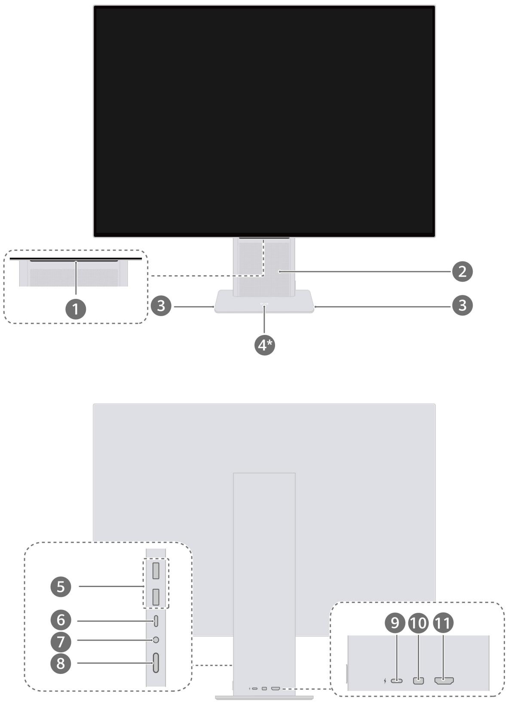
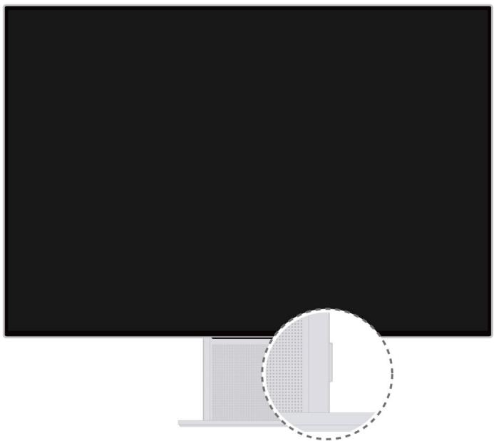
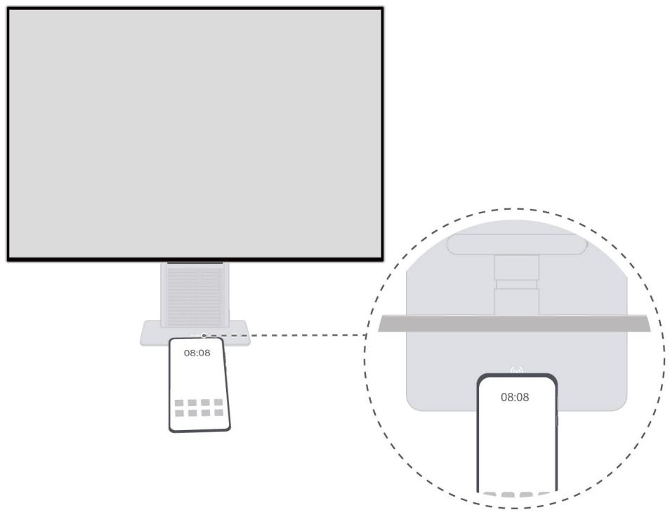
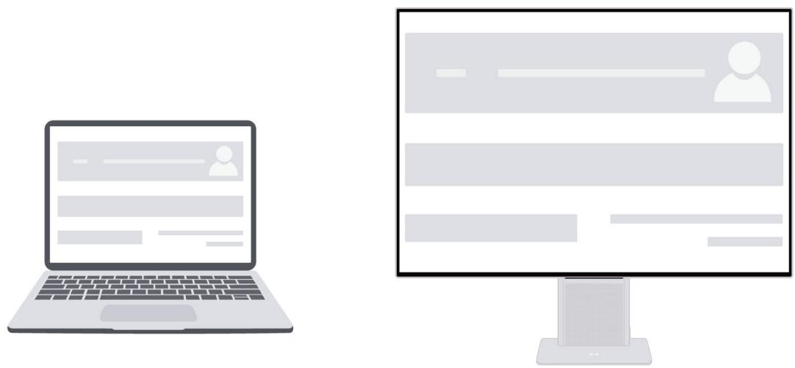
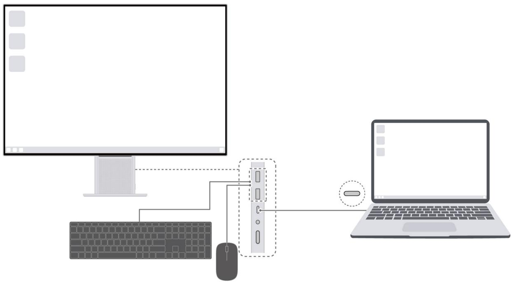
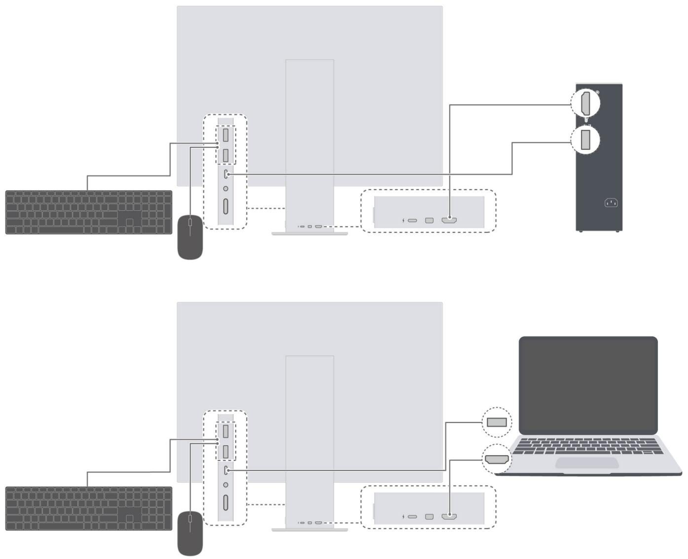
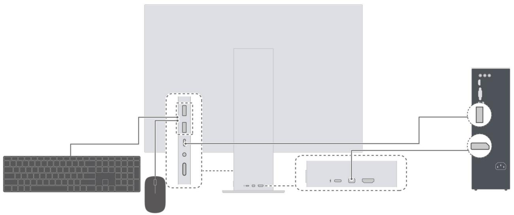
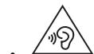

# 用户指南

# 目 录

关于本手册

显示器外观和接口介绍

开启和关闭显示器

调整显示器俯仰角度和高度

无线投屏（仅 HSN-CBA 型号显示器支持）

显示器连接无线网络（仅 HSN-CBA 型号显示器支持）

有线连接显示器

连接蓝牙键盘、鼠标（仅 HSN-CBA 型号显示器支持）

设置显示器 OSD 菜单

常见问题

安全信息

法律声明

# 关于本手册

使用设备前请仔细阅读本手册。

手册中展示的组件可能未包含在设备内，您需要单独购买；手册中描述的功能可能需要与其他组件配合，才能使用；手册中的图形、界面可能和实际有差异，所有图示仅供参考，请以实际产品为准。

# 显示器外观和接口介绍

<table><tr><td>1</td><td>Smart Bar显示器熄屏、睡眠时,单指单击Smart Bar唤醒显示器。显示器开机状态下,通过有线连接或无线投屏的方式外接其他设备,显示器显示外接设备画面,且未打开显示器OSD菜单时:单指在Smart Bar上滑动,可调节显示器的扬声器音量。双指在Smart Bar上滑动,可直接打开输入源切换界面,快捷切换输入源。单指单击Smart Bar,可打开显示器OSD菜单。显示器开机状态下,显示器打开OSD菜单或显示自身的系统画面时,通过操控Smart Bar,可调节显示器设置。单指在Smart Bar上滑动,切换选项。单指单击Smart Bar,确定选择。单指双击Smart Bar,返回或退出。仅HSN-CBA型号显示器支持无线投屏,在开机且无信号输入时,显示器显示自身的系统桌面。无线投屏时,单指双击Smart Bar可退出投屏。</td></tr><tr><td>2</td><td>扬声器声音从扬声器中发出。</td></tr><tr><td>3</td><td>麦克风位于显示器底座两侧。使用麦克风进行视频会议、语音通话、录音。当显示器通过USB-C转USB-A线缆连接至台式电脑、笔记本电脑(USB-A一端接入电脑),或通过显示器随附的USB-C转USB-C线缆连接至笔记本电脑等设备时,才能使用显示器的麦克风功能。</td></tr><tr><td>4*</td><td>Huawei Share感应区域部分华为手机的NFC感应区域与显示器的Huawei Share感应区域轻触,实现无线投屏。仅HSN-CBA型号显示器配置此部件。</td></tr><tr><td>5</td><td>USB-A(USB 3.2 Gen 1)接口可以以5V DC/1A对手机等设备充电。可接入有线键盘、鼠标等设备。通过HDMI线缆或MiniDP转DP线缆连接显示器和电脑时,若要将键盘和鼠标接入显示器反向控制电脑,还需要通过USB-C转USB-A线缆将显示器和电脑连接起来,线缆USB-A一端接入电脑。通过显示器随附的USB-C转USB-C线缆将显示器连接至笔记本电脑、手机等设备时,可将键盘和鼠标接入显示器反控外接设备。HSN-CBA型号显示器显示自身系统桌面时,接入键盘、鼠标可操作显示器。</td></tr><tr><td>6</td><td>USB-C接口可以对支持PD协议的笔记本电脑等移动设备以最大20V/3.25A进行充电。支持显示,通过显示器随附的USB-C转USB-C线缆,将显示器连接至计算机。</td></tr><tr><td>7</td><td>耳麦接口连接耳机。</td></tr><tr><td>8</td><td>电源键开启和关闭显示器。</td></tr><tr><td>9</td><td>USB-C电源接口连接电源适配器,给显示器供电。</td></tr><tr><td>10</td><td>MiniDP接口接入MiniDP接头线缆,将显示器连接至计算机等设备。</td></tr><tr><td>11</td><td>HDMI接口接入HDMI接头线缆,将显示器连接至计算机等设备。</td></tr></table>

# 开启和关闭显示器

• 显示器关机、熄屏、睡眠时，短按电源键可开启显示器。  
• 显示器开机时，长按电源键 3 秒以上，可将显示器关机。  
• 显示器亮屏时，短按电源键，显示器进入熄屏状态。  
• 开机状态且无信号输入时，显示器自动进入睡眠状态。

0 HSN-CBA 型号显示器开启节能开关后，显示器开机状态且无信号输入时，系统会自动进入深度睡眠状态，关闭 WLAN、蓝牙等功能。节能模式开启方式：开机且有信号输入时，单指

单击 Smart Bar，打开 OSD 菜单，选择 > ，开启节能模式。

# 调整显示器俯仰角度和高度

双手扶住显示器面板，前后转动面板可调整显示器的俯仰角度，上下移动面板可调整显示器高度。显示器支持 $5 ^ { \circ } ( \pm 2 ^ { \circ } )$ 俯 $ { / 1 8 } ^ { \circ }  { \textbf { ( \pm 2 ^ { \circ } ) } }$ 仰角度调节，升降 $1 1 0 \mathrm { { m m } \left( \pm 5 \mathrm { { m m }  } }\right)$ 高度调节。

！ 在调整显示器俯仰角度和高度，或移动显示器位置时，请勿用力按压显示器屏幕，以免屏幕破损。

# 无线投屏（仅 HSN-CBA 型号显示器支持）

无需连线，将手机、电脑设备屏幕快速投至显示器，获得跨屏体验。

# 手机投屏

1 在手机通知面板中，打开 NFC、WLAN 和蓝牙功能。  
2 显示器开机状态下，且手机处于亮屏解锁状态，手机 NFC 感应区域轻触显示器底座中间的（） 区域，并保持至手机提示音响或振动后移开手机，然后根据界面提示操作。  
3 手机屏幕画面显示在显示器上，操作手机，显示器上同步手机屏幕画面。

• 部分具有 NFC 功能或无线投屏功能的华为手机支持此功能。

• 如果手机版本比较低，手机投屏到显示器，可能需要手机和显示器连接相同的无线网络，请根据界面提示操作。为更好体验手机投屏功能，请您将手机升级为最新版本。  
• 如果您的手机无法通过碰一碰投屏，您可以在手机快捷开关栏中打开 ，手机搜索附近的设备，选择您的无线显示器，然后根据界面提示操作。  
• 设备首次连接显示器时，可能需要输入配对码，根据界面提示操作即可。  
• 若显示器通过有线连接至其他设备，屏幕上显示外接设备的画面时，建议您双指在Smart Bar 上滑动，将输入源切为 ，显示器显示自身系统桌面后，再按上述操作投屏。

# 电脑投屏

1 将显示器和电脑开机。  
2 单击电脑桌面底部 ，单击 打开投影界面，选择将电脑连接到无线显示器。  
如果界面未显示 图标，将快捷操作区域展开，即可找到此图标。  
3 电脑搜索附近的设备，选择您的无线显示器，然后根据界面提示操作。  
4 电脑屏幕画面显示在显示器上，操作电脑，显示器上同步显示电脑屏幕画面。

• 仅支持具有无线投影功能的 Windows 系统电脑。

• 若显示器通过有线连接至其他设备，屏幕上显示外接设备的画面时，建议您双指在Smart Bar 上滑动，将输入源切为 ，显示器显示自身系统桌面后，再按上述操作投屏。

上述手机投屏和电脑投屏，一般在设备未联网时即可进行。若要将其他设备的图片、音乐、视频等直接投屏到显示器上（DLNA 投屏），则需要设备连接到相同的无线网络。

# 显示器连接无线网络（仅 HSN-CBA 型号显示器支持）

1 将显示器切换到无信号输入状态，显示自身系统桌面。

• 若显示器处于无线投屏状态：在手机或电脑上断开连接，或者单指双击显示器的 SmartBar，即可退出无线投屏。  
• 若显示器通过有线连接至其他设备，屏幕上显示外接设备的画面时：双指在 Smart Bar 上滑动，将输入源切为 ，即可退出有线连接。

2 触摸 Smart Bar 选择 > ，按界面提示选择对应网络连接。

• 若您的显示器未外接鼠标：无线网络界面为安装智慧生活 APP 界面。您可以使用华为手机下载并安装智慧生活 APP，在 APP 中完成网络连接。  
若您的显示器已外接鼠标：点击 之后的界面为可连接的 WLAN 列表，点击对应WLAN 名称，完成连接；您也可以点击 WLAN 列表下的智慧生活配对，按界面提示，在华为手机中使用智慧生活 APP 连接网络。

• 首次使用智慧生活 APP，需要登录华为帐号。

• 若 APP 未弹出发现显示器的弹框，请点击智慧生活 APP 顶部 >添加设备，APP将会自动扫描附近设备，您也可以选择手动添加或扫描显示器的配网二维码添加设备。  
• 智慧生活 APP 除了可以给显示器配网之外，在 APP 上点击显示器图标，进入设备控制界面后，可对显示器的一些功能进行设置，如修改显示器设备名称。

# 有线连接显示器

i 部分组件或线缆未包含在设备内，请单独购买。

# USB-C 转 USB-C 线缆连接

一线将笔记本电脑、手机等设备连接至显示器，在显示器大屏上轻松操作设备，且同时可对笔记本电脑等设备进行充电。

1 使用显示器随附的 USB-C 转 USB-C 线缆一端接入显示器的 USB-C 接口，另一端接入笔记本电脑等设备的 USB-C 接口（需支持显示、数据传输和充电功能）。  
2 将显示器和笔记本电脑等设备开机，显示器屏幕上显示笔记本电脑等设备的屏幕画面，代表连线成功。  
3 将键盘和鼠标接入显示器的 USB-A 接口，即可在显示器上操作笔记本电脑等设备。

若笔记本电脑等设备画面未自动显示在显示器上，选择 ，将输入源切换为 USB-C。

# HDMI 线缆连接

1 HDMI 线缆一端接入电脑的 HDMI 接口，一端接入显示器的 HDMI 接口。  
2 根据需要，接入键盘、鼠标等设备。若要将键盘、鼠标等设备接入显示器使用，则需要通过USB-C 转 USB-A 线缆将显示器连接至电脑（USB-A 一端接入电脑）。  
3 将显示器和电脑开机后。稍等片刻，显示器屏幕上显示电脑的系统桌面，则表示连线成功。

0 部分型号显示器，首次开启可能会先进入显示器自身的系统桌面，根据界面指引，将输入源切换为 HDMI，即可进入电脑的系统桌面。再次开启自动进入电脑的系统桌面。

# MiniDP 转 DP 线缆连接

1 MiniDP 转 DP 线缆的 MiniDP 接头接入显示器，DP 接头接入台式电脑。  
2 根据需要，接入键盘、鼠标等设备。若要将键盘、鼠标等设备接入显示器使用，则需要通过USB-C 转 USB-A 线缆将显示器连接至台式电脑（USB-A 一端接入电脑）。  
3 将显示器和台式电脑开启后。稍等片刻，显示器屏幕上显示电脑的系统桌面，则表示连线成功。

0 部分型号显示器，首次开启可能会先进入显示器自身的系统桌面，根据界面指引，将输入源切换为 MiniDP，即可进入电脑的系统桌面。再次开启自动进入电脑的系统桌面。

# 连接蓝牙键盘、鼠标（仅 HSN-CBA 型号显示器支持）

HSN-CBA 型号显示器配置蓝牙，支持连接蓝牙键盘、鼠标。

1 显示器显示自身的系统桌面时，触摸 Smart Bar 选择 > ，显示器搜索附近的蓝牙设备。

若显示器屏幕显示的是外接设备画面， 双指在 Smart Bar 上滑动，将输入源切为 即可回到显示器自身的系统桌面。

2 打开键盘、鼠标的蓝牙开关，使其可被发现。  
3 在显示器上选择您的蓝牙设备，完成连接后，即可用蓝牙鼠标和键盘操作显示器，或者在下列场景中反向操作连接至显示器的外接设备：

• 手机无线投屏至显示器时（若手机系统版本较低，可能不支持蓝牙键鼠反向操作手机，请以设备实际支持情况为准）；  
• 手机、笔记本电脑等设备通过显示器随附的 USB-C 转 USB-C 线缆连接至显示器时；  
电脑通过 HDMI 线缆和 USB-C 转 USB-A 线缆连接至显示器时，或者通过 MiniDP 转DP 线缆和 USB-C 转 USB-A 线缆连接至显示器时。（ USB-C 转 USB-A 线缆的USB-A 一端需接入电脑）。

# 设置显示器 OSD 菜单

1 显示器开机状态下，通过有线连接或无线投屏的方式外接其他设备，显示器显示外接设备画面时，单指单击 Smart Bar，打开显示器的 OSD 菜单界面。  
2 根据界面显示的 Smart Bar 手势说明操作，设置 OSD 菜单。  
3 设置完成后，单指双击 Smart Bar 退出 OSD 菜单。或者稍等片刻，OSD 菜单会自动退出。

# OSD 菜单说明

不同型号的显示器，OSD 菜单存在差异，请以实际为准。

<table><tr><td></td><td>开启和关闭护眼模式。i 长期阅读时,建议开启护眼模式。护眼模式开启后,屏幕显示偏黄为正常现象。</td></tr><tr><td></td><td>调节亮度。</td></tr><tr><td></td><td>切换输入源。</td></tr><tr><td></td><td>切换色域。</td></tr><tr><td></td><td>可开启和关闭节能模式。i 仅HSN-CBA型号显示器支持节能模式。可调节扬声器、麦克风音量。可调节显示器显示。可切换显示器OSD菜单语言。可将显示器OSD菜单恢复出厂设置等。</td></tr></table>

# 常见问题

# 无法开机

检查电源线是否正确连接到显示器和电源插座。

# 有线连接显示器，屏幕无显示

• 请确认显示器与主机间线缆是否连接正常，可重新插拔尝试。  
• 建议使用显示器标配线缆或从正规渠道购买的线缆进行连接。  
• 请确认主机显卡的输出分辨率是否与显示器的分辨率匹配。

• 请确认主机显卡驱动已更新到最新版本，若驱动不是最新版本，请下载安装最新版本后再尝试。

# 屏幕太亮或太暗

打开显示器设置菜单，调节屏幕显示亮度和对比度。

# 屏幕颜色显示异常

• 检查 HDMI/DP 等信号线是否出现损坏，如插针弯曲。  
• 打开显示器设置菜单，调整色温。

# 手机无线投屏到显示器，显示器连接键盘/鼠标操控失败

• 若是华为手机，请将手机系统升级至最新的版本。  
• 您可以将键盘/鼠标直接连接到手机上进行操控。  
• 您可以使用 USB-C 转 USB-C 线缆有线连接手机和显示器，再使用键盘/鼠标操控。

# 显示器作为副屏显示有黑边

显示器连接笔记本电脑作为副屏显示时，在复制模式下是以主屏的显示比例为主，当主屏和副屏的分辨率不一致时，副屏上会有黑边，请在主机上选择扩展模式即可显示正常。

# 安全信息

在使用和操作设备前，为确保设备性能最佳，并避免出现危险或非法情况，请查阅并遵循所有的安全信息。

# 电子设备

有明文规定禁止使用无线设备的场所，请勿使用本设备，否则会干扰其它电子设备或导致其它危险。

# 对医疗设备的影响

• 在明文规定禁止使用无线设备的医疗和保健场所，请遵守该场所的规定，并关闭设备。  
• 设备产生的无线电波可能会影响植入式医疗设备或个人医用设备的正常工作，如起搏器、植入耳蜗、助听器等。若您使用了这些医用设备，请向其制造商咨询使用本设备的限制条件。  
• 在使用本设备时，请与植入的医疗设备（如起搏器、植入耳蜗等）保持至少 15 厘米的距离。

# 听力保护

为了防止可能的听力损伤，请勿长时间使用高音量。

• 当您使用耳机收听音乐或通话时，建议使用音乐或通话所需的最小音量，以免损伤听力。长时间接触高音量可能会导致永久性听力损伤。

# 易燃易爆区域

• 在加油站（维修站）或靠近易燃物品、化学制剂等任何易燃易爆区域，请勿使用本设备，并遵守所有图形或文字的指示。在燃油或化学制剂存放和运输区或易爆场所内或周围，设备可能引起爆炸或起火。  
• 请勿将设备及其配件与易燃液体、气体或易爆物品放在同一箱子中存放或运输。

# 操作环境

• 请勿在多灰、潮湿、肮脏或靠近磁场的地方使用设备，以免引起设备内部电路故障。  
• 插拔设备线缆前，请先停止使用设备并断开电源。在插拔线缆时请保持双手干燥。  
• 雷电天气请断开电源，并拔出连接在设备上的所有线缆，以免设备遭雷击损坏。  
• 请勿在雷雨天气使用本设备。雷雨天气可能导致设备故障或电击危险。  
• 请在温度 0℃～35℃ 范围内使用本设备，并在温度 -10℃～+45℃ 范围内存放设备及其配件。当环境温度过高或过低时，可能会引起设备故障。

• 请避免设备及其配件雨淋或受潮，否则可能导致火灾或触电危险。

• 请勿将设备靠近热源或裸露的火源，如电暖器、微波炉、烤箱、热水器、炉火、蜡烛或其他可能产生高温的地方。

• 设备在运行一段时间后，设备温度会升高。如果设备温度过高，请勿长时间接触，否则可能导致低温烫伤，引起皮肤红肿或色素沉淀。

• 请勿让儿童或宠物吞咬设备或其配件，以免对其造成伤害或导致设备故障或爆炸。

• 当不断重复同一动作时（例如玩游戏），您的手、臂、腕、肩、颈或其他身体部位可能会偶尔感觉不适。如果您感觉到不适，请停止使用并咨询医师。  
• 请勿在设备上放置任何物体（如蜡烛、盛水容器等），若有异物或液体进入设备，请立刻停止使用并断开电源，拔出连接在设备上的所有线缆，并联系华为客户服务中心。

# 儿童健康

• 本设备及其配件可能包含一些小零件，请将设备及其配件放置在儿童接触不到的地方。儿童可能在无意之中损坏本设备及其配件，或吞下小零件导致窒息或其他危险。  
• 本设备并非玩具，儿童应在成人监护下使用设备。

# 配件要求

• 使用未经认可或不兼容的电源、充电器或电池，可能引发火灾、爆炸或其他危险。  
• 只能使用设备制造商认可且与此型号设备配套的配件。如果使用其他类型的配件，可能违反本设备的保修条款以及本设备所处国家的相关规定，并可能导致安全事故。如需获取认可的配件，请与华为客户服务中心联系。

# 电源安全

• 电源插头作为断开电源的装置。  
• 电源插座应安装在设备附近并应易于触及。  
• 当不使用本设备时，请断开电源与设备的连接并从电源插座上拔掉电源插头。  
• 若电源插头或电源线已损坏，请勿继续使用，以免发生触电或火灾。  
• 请勿用湿手触碰电源线，或用拉电源线缆的方式拔出电源。  
• 请勿用湿手触摸设备或电源，以免发生设备短路、故障或触电。

• 请务必使用 CCC 认证并满足标准《GB 4943.1-2011 信息技术设备 安全 第 1 部分：通用要求》中“2.5 受限制电源”要求的充电器或电源给产品充电或供电。

# 维护和保养

• 不建议您自行升级部件或更换模块。如有相关服务需求，请联系华为客户服务中心。  
• 请保持设备及其配件干燥。请勿使用微波炉或吹风机等外部加热设备对其进行干燥处理。  
• 请勿在温度过高或过低区域放置设备及其配件，否则可能导致设备故障、着火或爆炸。  
• 请勿使设备及其配件受到强烈的冲击或震动，以免损坏设备及其配件，导致设备故障。  
• 清洁和维护前，请停止使用本设备，关闭所有应用，并断开与其他设备的所有连接或线缆。  
• 请勿使用烈性化学制品、清洗剂或强洗涤剂清洁设备或其配件。请使用清洁、干燥的软布擦拭设备或其配件。  
• 请勿将磁条卡（例如银行卡、电话卡等）长期接触本设备，否则可能导致磁条卡被磁场损坏。  
• 如果设备碰撞硬物或设备受到外界的强烈撞击造成破碎，切勿触摸或试图移除破碎的部分，请立即停止使用并及时联系华为客户服务中心。

# 环境保护

• 请勿将本设备及其附件作为普通的生活垃圾处理。  
• 请遵守本设备及其附件处理的本地法令，并支持回收行动。

# 法律声明

版权所有 © 华为 2022。保留一切权利。

本手册描述的产品中，可能包含华为及其可能存在的许可人享有版权的软件。除非获得相关权利人的许可，否则，任何人不能以任何形式对前述软件进行复制、分发、修改、摘录、反编译、反汇编、解密、反向工程、出租、转让、分许可等侵犯软件版权的行为，但是适用法禁止此类限制的除外。

# 商标声明

Bluetooth?字标及其徽标均为Bluetooth SIG,Inc.的注册商标，华为技术有限公司对此标记的任何使用都受到许可证限制，华为终端有限公司为华为技术有限公司的关联公司。

HDMI、HDMI 高清晰度多媒体接口以及 HDMI 标志是 HDMI Licensing Administrator, Inc.在美国和其他国家的商标或注册商标。

在本手册以及本手册描述的产品中，出现的其他商标、产品名称、服务名称以及公司名称，由其各自的所有人拥有。

# 注意

本手册描述的产品及其附件的某些特性和功能，取决于当地网络的设计和性能，以及您安装的软件。某些特性和功能可能由于当地网络运营商或网络服务供应商不支持，或者由于当地网络的设置，或者您安装的软件不支持而无法实现。因此，本手册中的描述可能与您购买的产品或其附件并非完全一一对应。

华为保留随时修改本手册中任何信息的权利，无需提前通知且不承担任何责任。

# 第三方软件声明

随本产品提供的第三方软件和应用程序归第三方所有，华为不拥有这些第三方软件和应用程序的知识产权，因此华为不对这些第三方软件和应用程序提供任何保证，华为既不会就这些软件和应用程序向您提供支持，也不对这些软件和应用程序的功能是否正常承担任何责任。

第三方软件和应用程序的服务可能中断或终止，华为不保证任何内容或服务可在任何期间维持其可用性。第三方系通过华为可控制范围外的网络及传输工具传送内容或服务。在相关法律允许的范围内，华为明确表示不对任何通过本产品提供的任何内容或服务的中断或终止承担任何责任。

对于您个人安装在本产品上的任何软件或上传、下载的任何文字、图片、视频或软件等第三方作品，华为不对其合法性、质量以及其他任何方面承担任何责任，对于您因个人安装软件或上传、下载前述第三方作品产生的任何后果，包括安装的软件与本产品不兼容等情况，由您自行承担一切相关风险。

# 责任限制

本手册中的内容均“按照现状”提供，除非适用法律要求，华为对本手册中的所有内容不提供任何明示或暗示的保证，包括但不限于适销性或者适用于某一特定目的的保证。

在适用法律允许的范围内，华为在任何情况下，都不对因使用本手册相关内容及本手册描述的产品而产生的任何特殊的、附带的、间接的、继发性的损害进行赔偿，也不对任何利润、数据、商誉或预期节约的损失进行赔偿。

在相关法律允许的范围内，在任何情况下，华为对您因为使用本手册描述的产品而遭受的损失的最大责任（除在涉及人身伤害的情况中根据适用的法律规定的损害赔偿外）以您购买本产品所支付的价款为限。

# 进出口管制

若需将本手册描述的产品（包括但不限于产品中的软件及技术数据等）出口、再出口或者进口，您应遵守适用的进出口管制法律法规。

# 隐私保护

为了解我们如何保护您的个人信息，请访问 https://consumer.huawei.com/privacy-policy 阅读我们的隐私政策。

本指南仅供参考，不构成任何形式的承诺，产品（包括但不限于颜色、大小、屏幕显示等）请以实物为准。如出现本指南与官网描述不一致的情况，请以官网说明为准，恕不另行通知。

购买华为终端产品，请访问华为商城 https://www.vmall.com/

更多信息请访问 https://consumer.huawei.com/cn/