# CM407/CM408

#

# 联想至像鲸鱼系列彩色喷墨�in�多功能一体机用户手册

# 用户手册

注意：使用本产品时，请您先仔细阅读使用说明书，再正确操作。请妥善保管好本手册，以便日后查询。

版本：��.��

# 目录

# 产品介绍 .

外观 .

常用操作指引 2

灯效指示 ... 2

规格参数... 4

# 首次安装与配网. �

首次安装打印机 �

给打印机配置网络 �

# 更多设备连接. ��

# 打印 .. ��

打印手机中的文件 ��

打印电脑中的文件 ��

取消打印 ... .  ��

# 复印 .. . ��

机身按键复印 ��

移动端智享家App复印 . . ��

电脑端【 Lenovo Page 】软件复印 . ��

取消复印... .. ��

# 扫描 . . ��

将原稿扫描至手机中 ��

将原稿扫描至电脑（ Windows ）中 . ��

取消扫描. . ��

# 更多操作 . . ��

蓝牙配网 .. . ��

查看打印机基本信息（打印帮助信息页） . ��

重置网络... . ��

恢复出厂设置 .. ��

打印机端语言设置 .��

身份证复印纠偏开关 .. ��

打印机固件升级 . ��

# 机器维护 . ��

保持通电 . ��

校准打印头（初次安装打印头） ��

校准打印头 . ��

清洁打印头 ��

墨水处理注意事项 . ��

清洁打印机 ��

清洁打印机光栅条（光栅条脏污） . ��

更换墨水瓶 . ��

# 故障排除 39

检查本产品的状态 . . ��

常见问题 ��

送纸问题 ��

打印问题 ��

复印问题 . ��

扫描问题 ��

清除卡纸 ��

注意事项 . ��

# 安全信息 47

# 法律声明 . ��

# 外观

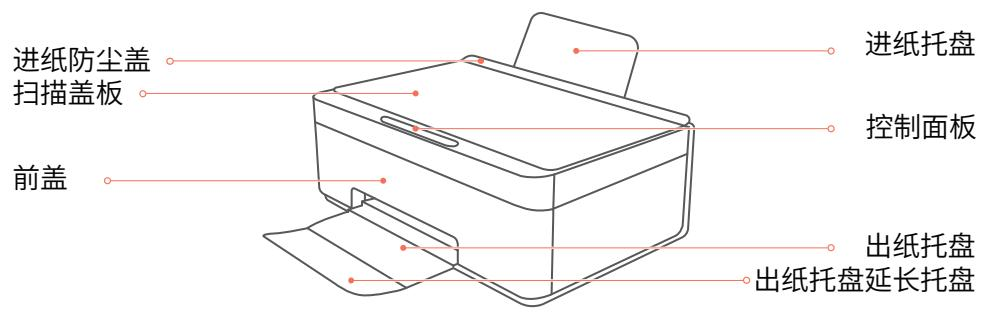

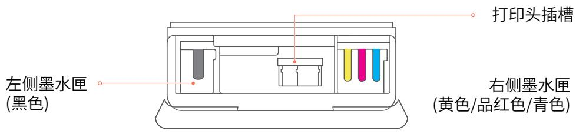

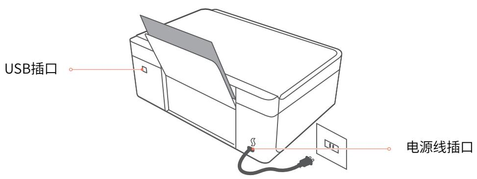

常用操作指引

<table><tr><td>操作</td><td>关键操作步骤</td></tr><tr><td>开机</td><td>将打印机接通电源,按住 ▶ 键1秒以上,屏幕显示先显示“Lenovo”再显示“开机启动中”,当开始/电源指示灯白灯常亮后,打印机开机。</td></tr><tr><td>关机</td><td>按住 ▶ 键3秒以上,屏幕显示“正在关机中”,当开始/电源指示灯熄灭后,打印机关机。⚠ 注意:关机是强制性动作,不要在打印状态下进行,以免造成卡纸。</td></tr><tr><td>休眠唤醒</td><td>短按 ▶ 键,或点击操作面板上任意按键。</td></tr><tr><td>蓝牙配网</td><td>请参考 &gt;&gt; 更多操作中的查看蓝牙配网。</td></tr><tr><td>重置网络</td><td>请参考 &gt;&gt; 更多操作中的重置网络。</td></tr><tr><td>取消当前任务</td><td>点击 ▶ 键。</td></tr><tr><td>普通复印</td><td>按任意键唤醒打印机,在唤醒打印机状态下,点击“&lt;”键或“&gt;”键,设置复印份数,点击 ▶ 键。</td></tr><tr><td>身份证复印</td><td>按任意键唤醒打印机后,在唤醒打印机状态下,按“≡”键进入菜单,按“&lt;”或“&gt;”键切换菜单,选择身份证复印功能,点击 ▶ 键。</td></tr><tr><td>手动双面打印时打印第二面</td><td>将页面翻转后,点击 ▶ 键打印第二面。</td></tr><tr><td>缺纸后继续打印</td><td>放入纸张,点击 ▶ 键继续打印。</td></tr><tr><td>清除卡纸</td><td>请参考 &gt;&gt; 故障排除中的清除卡纸步骤操作。</td></tr><tr><td>帮助信息页</td><td>请参考 &gt;&gt; 更多操作中的查看打印机基本信息。</td></tr><tr><td>恢复出厂设置</td><td>请参考 &gt;&gt; 更多操作中的恢复出厂设置。</td></tr></table>

灯效指示

�）按键操作说明

<table><tr><td>按键</td><td>状态描述</td></tr><tr><td rowspan="3">返回/取消</td><td>打印机正在工作中,短按可取消任务。</td></tr><tr><td>在菜单界面,短按返回上级界面。</td></tr><tr><td>打开前盖,短按一次可使打印头插槽至更换/维护位置。</td></tr><tr><td rowspan="2">&lt; / +</td><td>短按可设置复印份数,长按可快速以10倍数量增减复印份数。</td></tr><tr><td>在菜单界面,短按可左右切换菜单选择功能。</td></tr><tr><td rowspan="2">确认/菜单</td><td>在主页面短按可进入菜单界面。</td></tr><tr><td>其它界面,短按可确认当前选项。</td></tr><tr><td rowspan="2">开始/电源</td><td>短按开始复印</td></tr><tr><td>关机状态,短按开机;就绪状态,长按3秒关机</td></tr></table>

�）指示灯指示状态说明

<table><tr><td>指示灯</td><td>状态描述</td><td>打印机状态</td></tr><tr><td>◎</td><td>开始/电源键灯不亮</td><td>关机</td></tr><tr><td>◎</td><td>开始/电源键白灯常亮</td><td>开机</td></tr><tr><td>◎</td><td>开始/电源键白灯0.5秒闪烁</td><td>开机中</td></tr><tr><td>◎</td><td>开始/电源键白灯和红灯每0.5秒交替闪烁</td><td>固件升级</td></tr><tr><td>◎</td><td>开始/电源键白灯3秒闪烁</td><td>休眠模式</td></tr><tr><td>◎</td><td>开始/电源键白灯1秒闪烁</td><td>任务进行中、任务取消打印中/复印中/继续复印/扫描/等待复印身份证的背面、恢复出厂设置</td></tr><tr><td>◎</td><td>开始/电源键红灯常亮</td><td>运行故障(前盖打开、卡纸、缺纸、墨水瓶空等)</td></tr></table>

�）屏幕图标指示说明

<table><tr><td>指示灯</td><td>状态说明</td></tr><tr><td></td><td>蓝牙未连接</td></tr><tr><td></td><td>蓝牙连接成功</td></tr><tr><td></td><td>Wi-Fi 网络未连接或断开连接</td></tr><tr><td></td><td>Wi-Fi 网络连接成功</td></tr></table>

# 规格参数

�）常规功能规格

<table><tr><td>内容</td><td>规格参数</td></tr><tr><td>配置</td><td>台式</td></tr><tr><td>使用扫描仪玻璃板扫描的最大尺寸</td><td>216×297 (mm)</td></tr><tr><td>打印的最大纸张尺寸</td><td>210×297 (mm)</td></tr><tr><td>纸张尺寸</td><td>A4、A5、B5 (JIS)、5寸/3R、6寸/4R、7寸/5R、增值税发票专用信封、信封C5、信封DL</td></tr><tr><td rowspan="2">自定义纸张尺寸</td><td>宽度:89-210 (mm)</td></tr><tr><td>长度:127-297 (mm)</td></tr><tr><td rowspan="4">纸张类型</td><td>普通纸(65-100g/m2)</td></tr><tr><td>相片纸(180-300g/m2)</td></tr><tr><td>喷墨纸(108-230g/m2)</td></tr><tr><td>信封(80-120g/m2)</td></tr><tr><td>纸张输入容量</td><td>100张(80g/m2)</td></tr><tr><td>内存</td><td>256MB</td></tr><tr><td>电源要求</td><td>AC 220~240V、5A/6A、50/60Hz</td></tr><tr><td rowspan="6">功耗</td><td>操作模式功率Pom (W):3.9</td></tr><tr><td>待机功率(W):0.5</td></tr><tr><td>预设延迟时间td (min):5</td></tr><tr><td>附加功能功率因子之和(W):3.3</td></tr><tr><td>能效等级:1级</td></tr><tr><td>依据国家标准:GB21521-2014</td></tr><tr><td>机器尺寸(宽度×深度×高度)</td><td>560×380×260 (mm)</td></tr><tr><td>重量(机身、打印头/墨水瓶)</td><td>约7.3kg或更少</td></tr></table>

�）打印功能规格

<table><tr><td>内容</td><td>规格参数</td></tr><tr><td>草稿模式打印速度</td><td>黑白每分钟15页,彩色每分钟10页(A4短边进纸)</td></tr><tr><td>一般模式多页打印速度</td><td>黑白每分钟8.5页,彩色每分钟4页(A4短边进纸)</td></tr><tr><td rowspan="2">分辨率</td><td>彩色(默认):可达600dpi600dpi</td></tr><tr><td>彩色(最佳模式+画质优化):可达4800dpi1200dpi</td></tr><tr><td rowspan="2">接口</td><td>USB2.0</td></tr><tr><td>IEEE 802.11 b/g/n/ac 频宽:2.4GHz/5GHz</td></tr><tr><td>打印机语言</td><td>GDI</td></tr></table>

�）复印功能规格

<table><tr><td>内容</td><td>规格参数</td></tr><tr><td>复印颜色</td><td>彩色、黑白</td></tr><tr><td>一般复印功能</td><td>支持,单次复印份数最高为99份</td></tr><tr><td>最大复印尺寸</td><td>A4</td></tr><tr><td>身份证复印</td><td>支持黑白身份证复印(支持身份证360°纠偏复印),默认自动纠偏,份数:最高1份;</td></tr><tr><td>复印方式</td><td>支持在打印机本体、移动端智享家App、PC端Lenovo Page进行复印</td></tr></table>

�）扫描功能规格

<table><tr><td>内容</td><td>规格参数</td></tr><tr><td>扫描类型</td><td>平板</td></tr><tr><td>色彩模式</td><td>彩色、黑白</td></tr><tr><td>物理分辨率(最大支持)</td><td>1200×1200 (dpi)</td></tr><tr><td>最大分辨率(插值)</td><td>1200×1200 (dpi)</td></tr><tr><td>色彩位数</td><td>可达24位色深</td></tr><tr><td rowspan="2">最大原稿扫描尺寸</td><td>A4 (210×297mm)</td></tr><tr><td>Letter (215.9×279.4mm)</td></tr></table>

�）纸张尺寸规格

<table><tr><td>纸张类型</td><td>纸张克重</td><td>进纸容量</td><td>纸张尺寸</td><td>具体尺寸</td></tr><tr><td rowspan="3">普通纸</td><td rowspan="3">65~100g/m2</td><td rowspan="3">100页</td><td>A4</td><td>210x297mm</td></tr><tr><td>A5</td><td>148x210mm</td></tr><tr><td>B5 (JIS)</td><td>182x257mm</td></tr><tr><td>喷墨纸</td><td>108~230g/m2</td><td>20页</td><td>A4</td><td>210x297mm</td></tr><tr><td rowspan="4">相片纸</td><td rowspan="4">180~300g/m2</td><td rowspan="4">20页</td><td>A4</td><td>210x297mm</td></tr><tr><td>5寸/3R</td><td>89x127mm</td></tr><tr><td>6寸/4R</td><td>102x152mm</td></tr><tr><td>7寸/5R</td><td>127x178mm</td></tr><tr><td rowspan="3">信封*</td><td rowspan="3">80~120g/m2</td><td rowspan="3">10页</td><td>信封C5</td><td>162x229mm</td></tr><tr><td>信封DL</td><td>110x220mm</td></tr><tr><td>增值税发票专用信封</td><td>160x250mm</td></tr></table>

# 首次安装打印机

# �）从包装箱中取出打印机和所有配件，并清点齐全。

随机物品(拆除包装后):   
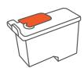  
黑色打印头

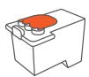  
彩色打印头

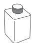

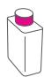

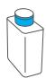  
墨水瓶(黑色/黄色/品红色/青色)

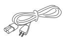  
电源线

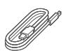  
USB数据线

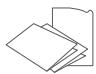  
快速安装指南、保修卡

注意：打印头、墨水瓶拆封后，除质量问题外，不可无理由退换。如果任何部件缺失或损坏，请致电售后服务热线咨询。

# �）移除胶带

移除所有包装材料和胶带；从两侧扣手位处，向前打开前盖，移除打印机内部的保护泡棉。

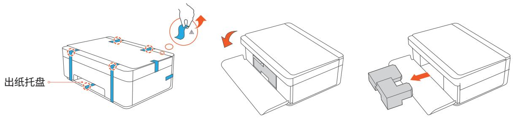

Q 注意：出纸托盘处胶带，需要打开前盖取出保护泡棉后移除。

# �）安装打印头

在打印机内部找到打印头插槽，确认蓝色上盖已打开;若未打开，请向上适当用力打开，听到“咔哒”声，上盖打开。

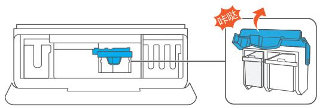

③ 沿左侧打印头插槽轨道,将黑色打印头水平向里推到底，,直至推不动,确保打印头安装到位。沿右侧打印头插槽轨道,将彩色打印头水平向里推到底,直至推不动，确保打印头安装到位。

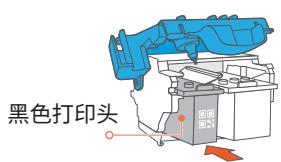  
左侧打印头插槽

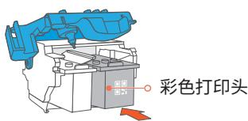  
右侧打印头插槽

手握打印头两侧，移除上面的密封塞与胶带。

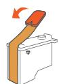  
黑色打印头

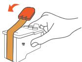  
彩色打印头

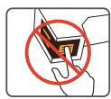  
0 请勿触摸打印头芯片部位和底部喷孔部位

④ 向下适当用力关闭蓝色上盖,听到"咔哒"声，表示蓝色上盖已关闭到位。若关闭不到位，打印机会显示“请检查打印头插槽上盖是否盖好，按返回键”。

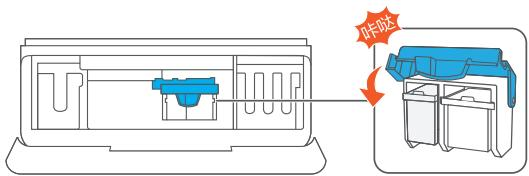

0 完成安装后，除必要情况外，请勿打开蓝色打印头插槽上盖，以免造成打印机故障。

# �）安装墨水瓶

移除四个墨水瓶封口膜。

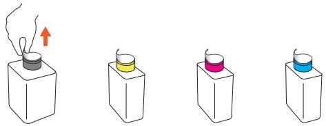

向里轻推关闭墨水匣，再关闭前盖。

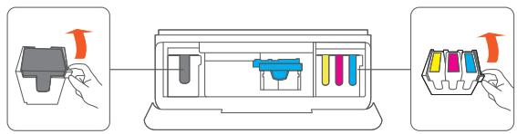

0 请注意墨水瓶不能装错，否则会引起打印机故障。

打开墨水匣，墨水瓶口朝下，按照下图顺序将墨水瓶完全插入墨水匣中。

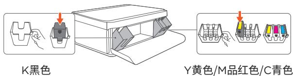

# �）装入纸张

完全打开进纸托盘、出纸托盘及延长托盘。

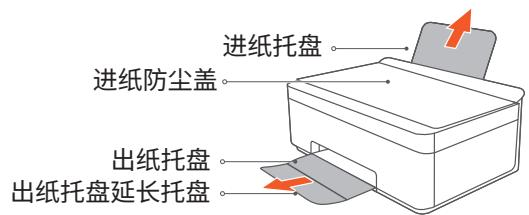

0 在使用时，若不打开出纸延长托盘，打印完成后纸张容易掉落。  
翻开进纸防尘盖，确认蓝色纸张宽度调节器在两侧，放 入纸张，调节纸张宽度调节器，夹紧纸张。

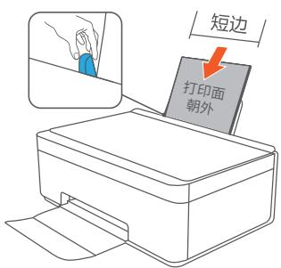

# �）连接电源与校准打印头

！注意：在打印机首次使用前，为了获得更好的打印效果及体验,请您务必先完成打印头校准。校准必须使用未打印过的普通A4纸。  
连接电源线，打印机自动开机。根据屏幕提示打印校准页，请稍等片刻。  
② 打开扫描盖板，将校准页标题朝左，内容面朝下，对齐扫描区左上角箭头处放置,合上盖板。

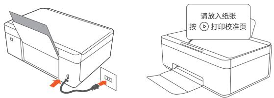

充分展开堆叠的纸张，避免纸张粘连。

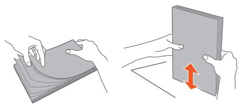

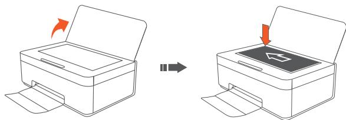

按 键 ，屏幕显示正在校准，打印机开始扫描校准页并进行自动校准，耗时约�分钟。屏幕显示“校准已完成，可以开始使用”，表示校准成功。将校准页从扫描台取出后可正常使用打印机。

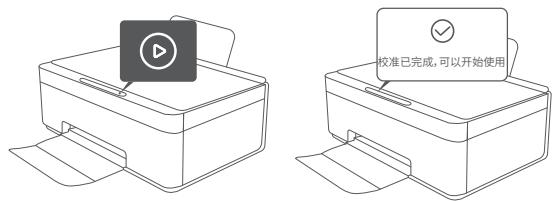

如果在步骤3屏幕中显示“校准失败”,此时按键重新打印校准页。校准页打出后，重复�、�步骤。

# 给打印机配置网络（移动端智享家App/电脑端App【LenovoPage】）

打印机的程序及软件配置

<table><tr><td>程序&amp;软件</td><td>内容</td></tr><tr><td>手机端(Android/iOS)</td><td>移动端智享家App</td></tr><tr><td>电脑端(Windows)</td><td>Lenovo Page</td></tr><tr><td>驱动程序</td><td>Windows</td></tr><tr><td rowspan="3">在安装打印机驱动程序前确认</td><td>您的计算机上至少应有2GB内存。</td></tr><tr><td>您的计算机硬盘至少有200MB的空余空间。</td></tr><tr><td>您的计算机上已安装了Windows系统。</td></tr><tr><td>提示</td><td>打印机支持2.4G和5G Wi-Fi。</td></tr><tr><td rowspan="2">安装建议</td><td>1.先安装手机App【移动端智享家】,完成打印机的配网与绑定。</td></tr><tr><td>2.电脑端安装时,选择与手机配网时使用的同名网络。</td></tr></table>

# 移动端智享家App

�）请保持手机连接Wi-Fi，并开启蓝牙。  
�）扫描下方二维码安装最新版本移动端智享家App。

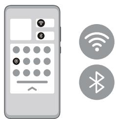

�）打开移动端智享家App，登录联想账号，点击“+”号，选择添加设备。

�）待App扫描到打印机后，点击设备卡片进行连接；根据界面指引完成打印机配网。

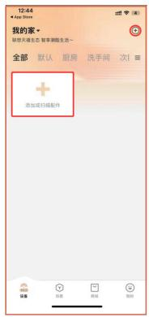

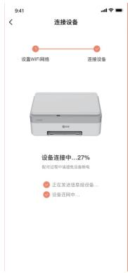

\*当未搜索到打印机时，按任意键唤醒打印机后，在唤醒打印机状态下，按“ ”键 进入菜单，按“ ”或“ ”键 切换菜单，找到重置网络，再按“ ”键，根据屏幕提示，确认重置网络，屏幕显示蓝牙图标代表已重置网络并进 入待配网状态。

# 电脑端App【Lenovo Page】

# �）Windows系统安装打印驱动程序

下列示意图 以Windows ��系统为例,实际步骤取决于您所使用的操作系统。

➀电脑连接路由器Wi-Fi或有线网络。如打印机已完成配网，请选择配网时使用的同名网络。  
➁使用随附的USB线连接电脑和打印机，电脑端弹出驱动下载界面。  
➂点击对应电脑系统的驱动链接，下载打印机驱动，解压后进行安装;

或登录官网：https://www.lenovoimage.com，根据打印机型号下载打印机驱动，解压后进行安装。

如果你使用的是较旧版本的windows 系统，安装时可能会出现windows 安全提示，请点击“始终安装此驱动程序软件”。

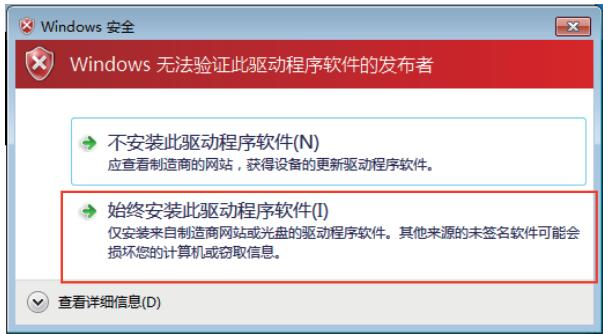

➃根据界面指引安装驱动，点击【下一步】继续安装。

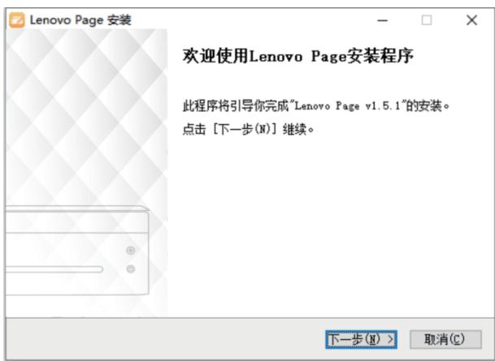

➄勾选“我接受许可证协议中的条款”，点击【下一步】继续安装。

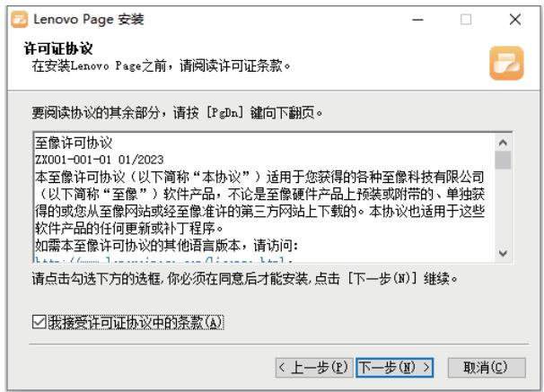

⑥点击【浏览】选择所需安装目录，点击【安装】。

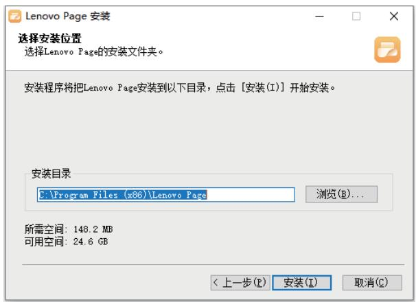

⑦程序自动安装，请耐心等待。

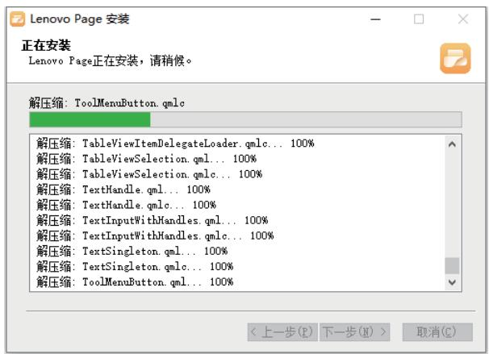

➇打印机驱动程序安装完成，勾选【运行Lenovo Page】，点击【完成】运行驱动程序。

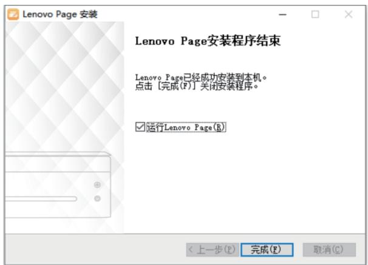

➈点击【开始添加】添加打印机，并确认打印机连接状态。

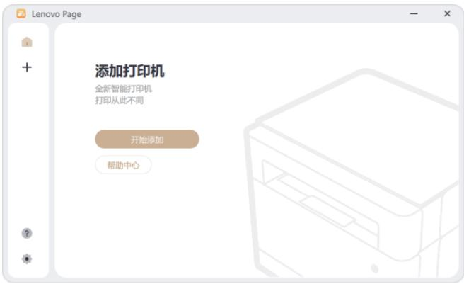

# Wi-Fi打印机添加方法:

➉根据界面指引，按照需求添加Wi-Fi打印机。

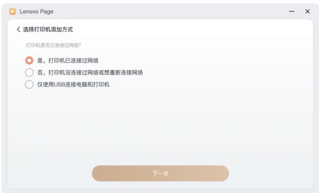

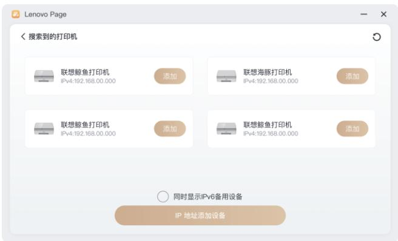

⑪设备添加成功后，点击【开始使用】，完成设置。

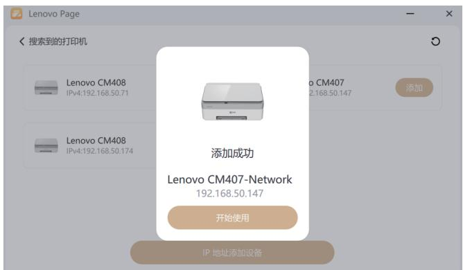

# USB打印机添加方法：

⑫根据界面指引，按照需求添加打印机或配置打印机Wi-Fi。

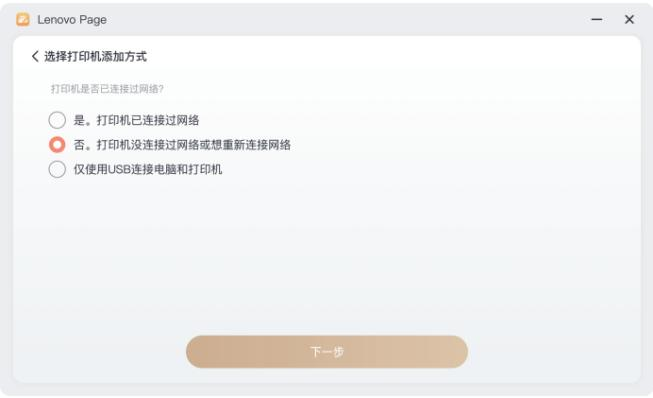

⑬点击【取消】，仅添加USB设备至设备列表。

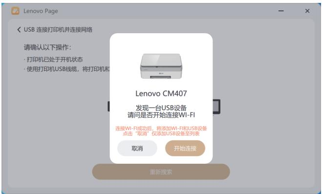

⑭点击【开始连接】，配置打印机Wi-Fi。

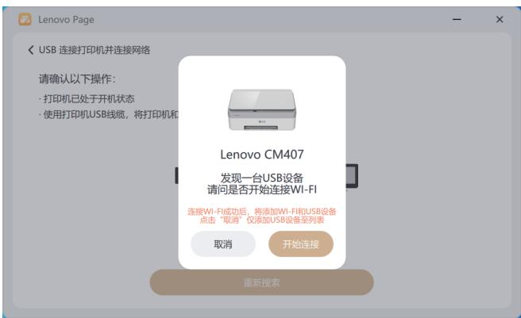

⑮选择可用Wi-Fi并配置，点击【设置并添加】。

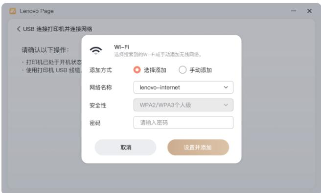

①点击【开始使用】完成设置，在首页设备列表会有添加成功的设备显示。

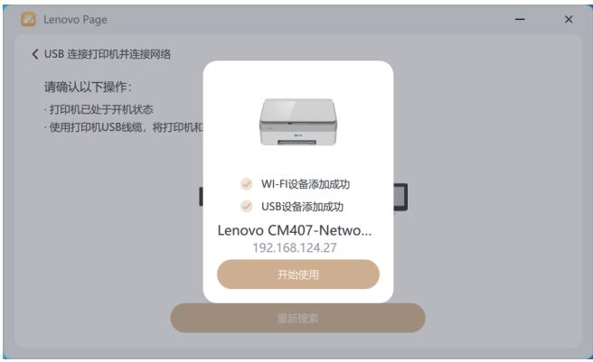

# 更多设备连接

# 更多设备连接

# 配网后，通过智享家App分享设备

打开管理员手机（为打印机配网的设备）中的智享家App，点击“我的”>>“设备分享”下选择要分享的打印机设备，按照界面指引完成操作。

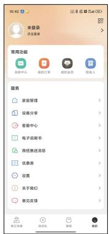

# 打印

打印

# 打印手机中的文件

打印机支持多种方式打印手机中的文件，您可以根据您的使用场景，任选一种方式完成打印。

<table><tr><td>设备</td><td>方式</td><td>适用场景</td></tr><tr><td rowspan="5">手机</td><td rowspan="2">通过智享家App打印</td><td>支持Android/iOS手机。</td></tr><tr><td>此方式支持远程打印手机中的文件。</td></tr><tr><td rowspan="2">局域网打印</td><td>支持Android/iOS手机。</td></tr><tr><td>打印机通过电脑配网,手机与打印机连接同一个路由器Wi-Fi时,可使用此方式打印手机文件。</td></tr><tr><td>远程打印</td><td>支持Android/iOS手机。</td></tr></table>

# �）通过智享家App打印

\*注意：打印机不同插件版本，打印参数可能略有不同，请以实际界面为准

➀手机通过智享家App连接了打印机后，打开App，在首页点击打印机卡片。

➁文档打印：在首页点击文档打印，点击不同路径卡片选择需打印文档。在文档打印预览界面，按界面提示设置好相关参数后，点击开始打印。

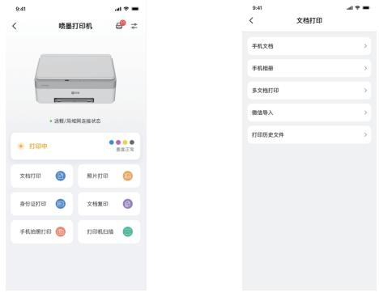

※打印文档相关参数如下：

打印份数：默认打印1份,按"+/-”符号可以增减份数。

纸张尺寸： A�纸，文档打印支持尺寸为:A�、A�、B�(JIS)，请根据纸盒中的纸张尺寸进行选择。

纸张类型：普通纸、相片纸、喷墨纸。

打印范围： 默认为全部，通过此选项可选择需要打印的范围，请根据需要选择打印。

打印质量： 高、中、低。

打印颜色： 彩色、黑白。

③打印图片;在首页点击照片打印,自动跳转至手机图库/相册，选择需打印照片/图片，在照片打印预览界面，按界面提示设置好相关参数后，点击开始打印。

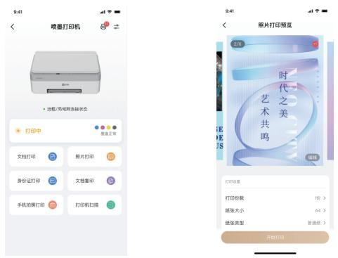

※打印图片相关参数如下：

打印份数：默认打印�份，按“+/-”符号可以增减份数。

打印份数:默认打印1份,按"+/-”符号可以增减份数。

纸张尺寸:默认为相片纸,照片打印支持尺寸:A4、5寸/3R、6寸/4R、7寸/5R,请根据纸盒中的纸张尺寸进行选择。

纸张类型：普通纸、相片纸、喷墨纸。

打印范围:默认为全部,通过此选项可选择需要打印的范围，请根据需要选择打印。

打印质量：高、中、低。

打印颜色:彩色、黑白。

打印方向：横向、纵向。

无边框打印:开启、关闭。

④身份证打印;在首页点击身份证打印,根据界面指引选择证件照片上传,在照片打印预览界面,选择另存为即保存A4纸大小,或点击开始打印。

# �）局域网打印

手机连接了和打印机相同的路由器W-Fi,可通过局域网打印,快速打印手机中的文件。在手机中打开待打印文件，选择"分享”或“发送”,选择“打印”,在可用打印机列表中选择局域网中的联想打印机(名称为打印机宣传名，例如CM407-xxxx.CM408-xxxx,按界面设置好打印参数,开始打印。)

\*注意：不同品牌手机打开打印的方式可能不同，若无法找到打印入口，请咨询手机供应商。

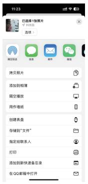

# 以IOS手机为例：

➀ 打印图片：打开图库，点击 > 打印 进入打印预览界面，点击选择打印机，在可用打印机列表中局域网中的联想打印机（例如Lenovo xxxx），设置好打印参数后，点击打印。  
②打印文档;打开待打印文件，点击·…>用其他应用打开>打印进入打印预览界面,点击选择打印机,在可用打印机列表中局域网中的联想打印机（例如Lenovo xxxx），设置好打印参数后，点击打印。

# �）远程打印

打印机不在身边，也可以通过智享家App，远程打印手机中的文件，快捷方便。通过智享家App远程打印手机文件具体操作方式：

➀打开智享家App，在首页点击打印机卡片。  
➁点击打印，选择文档打印或图片打印，在打印预览界面，按界面提示设置好相关参数后，点击开始打印。

\*注意： 远程打印时，复印、扫描选项置灰不可用。

# 打印电脑中的文件

# 打印机驱动程序打印

本章节介绍打印机驱动程序中的设置内容和步骤。

<table><tr><td>打印机驱动程序打印</td><td colspan="2">设置选项</td></tr><tr><td rowspan="12">Windows中使用驱动程序(含通过网络使用打印机)</td><td rowspan="6">一般设置</td><td>打印颜色</td></tr><tr><td>纸张类型</td></tr><tr><td>无边距</td></tr><tr><td>纸张尺寸</td></tr><tr><td>打印质量</td></tr><tr><td>画质优化</td></tr><tr><td rowspan="6">高级设置</td><td>方向</td></tr><tr><td>手动双面打印</td></tr><tr><td>打印页面顺序</td></tr><tr><td>出纸顺序</td></tr><tr><td>每张打印页数</td></tr><tr><td>份数设置</td></tr></table>

# Windows中使用驱动程序

下面的过程说明基于Windows ��操作系统环境中打印的步骤。

# 注意

打印文件的准确步骤可能随应用程序的不用而有所不同，关于准确的打印步骤，请参照您的应用软件。

通过网络使用打印机时，请先确认您已经安装网络驱动程序。

下面的过程说明基于Windows ��操作系统环境中打印的步骤。

�）打开您需要打印的文件。  
�）在【文件】菜单中选择打印。  
�）点击【属性】。属性对话框允许您访问和改变打印机设置。

# 打印

�）在图例左侧窗口确认您的当前设置。  
�）点击属性，按需选择一般设置和高级设置，确定后可以保存。

➀一般设置  

# 打印颜色

默认彩色，可选择黑白和彩色。

选择彩色模式，打印机会使用黑色和彩色墨水进行全彩打印。

选择黑白模式，打印机仅使用黑色墨水进行黑白打印。

# 纸张类型

默认普通纸，可选择普通纸、相片纸、喷墨纸。

# 无边距

默认有边距打印，仅纸张类型选择相片纸时，方可选择切换无边距。

# 纸张尺寸

可选择 A�、A�、信封 DL、信封 C�、增值税发票专用信封、B�、�x� 英寸、�x� 英寸、�x� 英寸。

自定义纸张，可自己设置纸张名称和大小，包含名称、宽度、长度和单位。

自定义尺寸范围：宽度（W）=[��.�-���.�]mm，长度（H）=[���.�-���.�]mm。

自定义单位：毫米。

# 打印质量

打印质量按照打印分辨率（每英寸点数(DPI)）进行测量。较高的 DPI 会生成更清晰且更精细的印品，但也会降低打印速度，并且可能会使用更多墨水。可选择最佳、一般、草稿。

草稿：通常在墨水量不足或不需要高品质印品时使用的最低 DPI。

一般：适合大多数打印作业。

最佳：比一般分辨率更高的 DPI。适合照片打印。

# .i 画质优化

勾选画质优化可提升打印质量。适用于以下两种场景：

A.选择纸张类型“普通纸”，打印质量：“一般”，画质优化功能可选“关闭”和“开启”。

B.选择纸张类型“相片纸”，打印质量：“最佳”，画质优化功能可选“关闭”和“开启”。

➁高级设置

# 方向

用于改变页面方向。可选择纵向、横向。

纵向：进行垂直打印，

横向：进行水平打印。

. 手动双面打印

纸张的一面打印完成后进行手动翻转，以实现纸张的双面打印。通过选择<双面打印>，可使用双面打印功能。可选择无，长边翻转和短边翻转。

长边翻转： 如果希望对纸张进行双面打印时沿纸张的长边进行翻转，则选择此选项。

短边翻转：如果希望对纸张进行双面打印时沿纸张的短边进行翻转,则选择此选项。

打印页面顺序

可以选择从最后一页开始打印或从第一页开始打印。

从最后一页开始打印：输出的页序为 �，�，�……。

从第一页开始打印：输出的页序为 �，�，�……。

. 出纸顺序

逐份打印：文档输出效果为 �,�,�，�,�,�，�,�,�……；

逐页打印：文档输出效果为 �,�,�，�,�,�，�,�,�……。

. 每张打印页数

每张打印页数为1:文书输出效果为

每张打印页数为�：文书输出效果为

每张打印页数为4:文书输出效果为

每张打印页数为9:文书输出效果为

# 取消打印

如果您需要取消打印作业，根据打印状态不同操作不同。

打印开始前取消打印作业

�）在计算机任务栏上双击打印机图标，出现任务框。

�）选中【打印任务】，之后点击右键，然后单击【取消】。

3)点击【是】,打印任务取消。

# 打印进行中取消打印作业

�) 点击面板上的“ ”返回/取消键可以取消正在进行的打印作业  
�) 操作面板上 “ ” 开始/电源键白灯�秒闪烁，屏幕显示“正在取消”

注意

如果取消的打印作业已经在处理中，则会继续打印几页后才会取消。

取消多页打印作业可能需要一段时间。

# 复印

复印

# 机身按键复印

# 普通复印

�）将您要复印的文件或证件放置于扫描仪玻璃板上，需要复印的面朝下。  
�）就绪状态下，根据复印需求在操作面板屏幕中设置相应的参数，如份数、颜色、质量、复印尺寸等。

※复印相关参数如下：

份数：默认�份，可选择�\~��份。

颜色：默认彩色，可选择黑白、彩色。

质量：默认标准质量，可选择标准质量、最佳质量。

复印尺寸：默认A�，有A�、A�、B�JIS三种尺寸可选。

�）设置就绪后，按操作面板上的 “ ” 开始/电源键，进行复印。  
�）操作面板上“ ” 开始/电源键白灯闪烁，屏幕显示“正在复印”，打印机状态为复印中/连续复印中。

注意

如果打印机处于休眠状态，操作面板上 “ ” 开始/电源键灯不亮，按任意键唤醒打印机，之后使用打印机进行复印任务。

# 身份证复印

您可以通过使用打印机上按键将身份证的两面复印到纸张的一面上。

�）将身份证放置于扫描仪玻璃板上复印最佳区域内。

2)根据身份证复印需求在操作面板上选择要复印的份数。

※身份证复印相关参数如下：

份数：默认�份，最高可选择�份。

颜色：默认黑白身份证复印。

质量：默认标准质量。

复印尺寸：默认A�出纸纸张尺寸。

3)在操作面板上的屏幕选择身份证复印功能,按确认/菜单键,进入身份证复印模式。  
�）进入身份证复印模式后，屏幕显示“扫描正面请按 ”，此时为等待扫描证件第一面。  
�）请将证件放置在扫描仪玻璃板复印区域内点击操作面板上 “ ” 开始/电源键，开始扫描证件的第一面。  
�）操作面板上屏幕显示“正在扫描正面”，此时为开始扫描证件的第一面。  
�）操作面板上屏幕显示“扫描反面请按 ”，此时为等待扫描证件第二面。  
�）请将证件翻面，放置位置仍保持放置在扫描仪玻璃板复印区域内，按操作面板上的 “ ” 开始/电源键一下，屏幕显示“正在扫描反面”,进入第二面扫描模式。  
�）打印机会自动打印出您要复印的证件，证件的正反面在同一张纸的一面上。

<table><tr><td rowspan="2">注意</td><td>在复印过程中您也可以按操作面板 返回/取消键退出身份证复印功能。</td></tr><tr><td>如果身份证复印失败,请尝试确认及操作:1.确认玻璃板是否擦拭干净;2.扫描盖板是否有漏光。</td></tr></table>

# 移动端智享家App复印

# 普通复印

手机与打印机连接后，您可以通过手机中的移动端智享家App，进行单面复印。

�）打开扫描盖板，将原稿正面朝下，按左后角对齐原则，放入扫描区并盖上盖板。  
�）在移动端智享家App中打开打印机设备页面，点击复印。在复印参数设置界面，设置好复印参数后，点击开始复印。

※复印相关参数如下：

复印份数:默认复印1份,按后面的“+/-”符号可以增减份数。

纸张尺寸：默认为A�，有A�、A�、B�JIS请根据纸盒中纸张的实际尺寸进行选择。

复印质量:默认为标准,您可以设置为标准、最佳。

复印颜色：默认为彩色，您可以设置为黑白、彩色。

纸张类型:默认为普通纸。

# 电脑端【Lenovo Page】软件复印

# 普通复印

点击【复印】并设置好复印参数后，点击【开始复印】按钮即可。

# 身份证复印

如果需要将身份证正反面复印到同一张A4纸上，可按照以下步骤进行操作：点击【身份证复印】并设置好复印参数后，点击【开始复印】按钮即可。

# 取消复印

�)点击面板上的“ ”返回/取消键可以取消正在进行的复印作业  
�)操作面板上 “ ” 开始/电源键白灯�秒闪烁，屏幕显示“正在取消”。

<table><tr><td rowspan="2">注意</td><td>如果机器正在扫描原稿时取消复印,则复印会立即取消且没有打印输出复件。</td></tr><tr><td>如果在打印过程中取消复印,则系统将在打印输出当前页面之后取消复印过程。</td></tr></table>

# 扫描

扫描

# 将原稿扫描至手机中

# 移动端智享家App扫描

手机与打印机连接后，您可以通过手机中的智享家App，将原稿扫描至手机中。

<table><tr><td>注意</td><td>手机需连接和打印机相同的路由器Wi-Fi。</td></tr></table>

�）打开扫描盖板，将原文稿正面朝下，按左后角对齐原则，放入扫描区并盖上盖板。  
�）打开智享家App，在首页点击打印机卡片。  
�）点击扫描，设置好扫描参数后，点击开始扫描。

扫描相关参数如下(打印机不同插件版本，扫描参数可能略有不同，请以实际界面为准)：

扫描颜色：默认为彩色，您可以设置为彩色 、黑白 。

扫描质量：

最佳：扫描分辨率为1200dpi。当待扫描原稿内容较多时，建议选择此选项,但此选项扫描时间较长。

标准：扫描分辨率为600dpi。扫描后的文件质量较好。

原稿尺寸:默认为A4,不支持修改尺寸。

4)待出现扫描图片时，表示扫描完成。扫描的文件将以JPG格式自动保存在手机中。打开手机图库，可以查看扫描后的单个JPG文件。

# 将原稿扫描至电脑（Windows）中

# 电脑端【Lenovo Page】软件扫描

将需要扫描的物件放入打印机的扫描区域,按照以下流程进行操作：

�）点击【扫描】按钮；

�）设置扫描参数，将扫描文件保存至指定文件夹，点击【开始扫描】；

�） 扫描中请耐心等待；

�） 扫描结束后，可在扫描结果页面查看结果或编辑扫描结果；

�） 长按扫描结果，可拖动排序或勾选多个结果，合并另存为其他格式文件。

�） 可在编辑页面中，编辑图片对比度和亮度，以及裁剪和旋转扫描结果。

# 取消扫描

�)点击面板上的“ ”返回/取消键可以取消正在进行的扫描作业  
�)操作面板上 “ ” 开始/电源键白灯�秒闪烁，屏幕显示“正在取消”。

# 更多操作

更多操作

# 蓝牙配网

➀请保持手机连接�.�G或�G 无线网络，并开启蓝牙。  
➁打开智享家App，登录联想账号，点击“+”号，选择添加设备。  
➂待App扫描到打印机后，点击设备卡片进行连接；根据界面指引完成打印机配网。  
\*若未发现打印机或连接打印机失败，请重置网络后再次配置。

# 重置网络

按任意键唤醒打印机后，在唤醒打印机状态下，按“ ”键 进入菜单，按“ ”或“ ”键 切换菜单，找到帮助信息页,再按“目”键，根据屏幕提示,确认重置网络,屏幕显示蓝牙图标代表已重置网络并进入待配网状态。

# 打印帮助信息页操作步骤：

按任意键唤醒打印机后，在唤醒打印机状态下，按“ ”键 进入菜单，按“ ”或“ ”键 切换菜单，找到配置报 告打印，再按“ ”键，屏幕提示正在打印，打印机会自动打印帮助信息页。

# 查看打印机基本信息（打印帮助信息页）

您可以通过打印帮助信息页查看您的打印机的基本信息及参数，比如打印机设备信息、设备使用统计信息、耗材信息、网络信息、错误记录、连接指导、按键操作说明等等。

# 恢复出厂设置

按任意键唤醒打印机后，在唤醒打印机状态下，按“ ”键 进入菜单，按 “ ”或“ ”键切换菜单，找到设置，在设置功能中找到恢复出厂设置功能，再按 “ ”键，根据屏幕提示，确认恢复出厂设置，打印机自动重启完成恢复出厂设置。

# 打印机端语言设置

按任意键唤醒打印机后，在唤醒打印机状态下，按“ ”键 进入菜单，按“ ”或“ ”键 切换菜单，找到设置，在设置功能中找到语言设置功能，再按“ ”键，根据屏幕提示，选择“中文/English”。

打印机默认中文语言。选择English，打印机端屏幕显示为English。

# 身份证复印纠偏开关

按任意键唤醒打印机后,在唤醒打印机状态下,按“国”键进入菜单,按“<”或“>”键切换菜单,找到设置，在设置功能中找到身份证复印纠偏功能，再按“ ”键，根据屏幕提示，选择“开启/关闭”。

打印机默认开启身份证复印纠偏,身份证复印时,身份证正反面可随意放置扫描平板区域。

选择关闭,身份证复印时,身份证正反面需放置在扫描平板左上角横向A5区域。

# 打印机固件升级

# 电脑端【Lenovo Page】固件升级

1)在打印机设置-设备信息-固件升级中点击“检查"按钮判断是否有新固件版本,如有固件更新会弹出提示“发现新版本固件”此时点击“更新”按钮即可执行固件升级。

�）固件升级过程中请勿断电，请耐心等待�-��分钟（受用户网络环境影响）。

固件正在升级请勿断电

3)固件更新成功,打印机自动重启至待机状态。

�）固件更新失败，提示“固件升级失败，按 返回主界面”

�）重复步骡�),再次检查固件版本。

# App内的固件升级

设备首页，点击【固件升级】App自动判断是否有新固件版本；如需更新，设备需在通电状态下等待�-��分钟（受用户网络环境影响），升级成功后设备会自动重启。

# 机器维护

机器维护

# 保持通电

打印头需要自动定期维护,维护需要电源,请保持打印机通电。

注意：若打印头插槽未回到右侧维护站时，打印机断电，打印头会快速干掉。

# 校准打印头（初次安装打印头）

初次安装打印头需要强制校准，否则不可进入下一流程；

初次校准失败，建议再次打印校准页进行校准，否则可能会影响打印质量

# 校准打印头

当打印内容出现以下情形时，请选择校准打印头，以改善打印质量：·

# 文字、图像重影

# 文字重影

# 线条不直

  
注意：校准前请在进纸托盘中装入未使用过的A� 普通纸

# 校准打印头（打印机端）

在进纸托盘中装入未使用过的 A� 普通纸。

按任意键唤醒打印机后,在唤醒打印机状态下,按“目”确认/菜单键进入菜单,按“<”或“>”键切换菜单,找到校准，再按“ ”键，根据屏幕提示“请放入纸张，按 打印校准页”，打印机打印完校准页后，根据校准页界面提示操作。

1、打开扫描盖板,将打印完成的校准页文字面朝下放下玻璃上,盖上盖板。  
�、按“ ” 开始/电源键开始校准，屏幕显示“正在校准”。  
�、屏幕显示“校准已完成，可以开始使用”，可以开始使用打印机。

如果屏幕显示“校准失败”按“ ” 开始/电源键重新打印校准页，重复�、�步骤。

注意：按“ ” 开始/电源键可以关闭显示“校准已完成，可以开始使用”。

# 校准打印头（Lenovo Page App）

校准打印头 (初次安装打印头)

初次安装打印头需要强制校准，否则不可进入下一流程；

初次校准失败，建议再次打印校准页进行校准，否则可能会影响打印质量

校准打印头

为什么要打印头校准？

通过校准打印头，提升打印质量

# 校准文字

文字校准前

# 校准学

文字校准后

  
图片校准前

  
图片校准后

如何校准打印头

打印机开机，在进纸托盘中装入未使用过的 A� 普通纸；

打印机添加至列表后，点击“去校准”按钮；

�） 确认已放入空白A�普通纸，点击“开始校准”按钮；

�） 打印校准页完成后，请按照校准页下方步骤完成校准

3)提示:将校准页放置在扫描台点击开始校准。

# 校准打印头（智享家App）

按照以下流程进行操作：

�)点击主界面右上角【打印机设置】按钮；

�)在设置界面点击【打印头自动校准】按钮；

�)放入空白A�纸后，勾选“我已放入空白A�纸”，点击【开始打印】按钮。

�)打印校准页完成后，请按照校准页下方步骤完成校准。

�)提示：将校准页放置在扫描台点击 开始校准。

# 清洁打印头

当出现以下情形时，请选择清洁打印头，以改善打印质量

缺失某种色彩

文字颜色深浅不一

文字颜色深浅不一 文字颜色深浅不一

文字颜色深浅不一 文字颜色深浅不一

文字颜色深浅不一 文字颜色深浅不一

图片上有明显的线条

注意：清洁前请在进纸托盘中装入未使用过的A4普通纸。

# 清洁打印头（打印机端）

在进纸托盘中装入未使用过的A4普通纸。

按任意键唤醒打印机后，在唤醒打印机状态下，按“ ”开始/菜单键 进入菜单，按“ ”或“ ”键 切换菜单， 找到清洁，再按“ ”键，打印清洁页。

�、如果清洁页下面�种色块图案任意�个出现颜色缺失，或者不完整现象，请继续清洁，直到清洁页里的图案正常为止。  
2、如果清洁页下面4种线框任意1个颜色出现3条线框以上缺失,请继续清洁,直到清洁页里的图案正常为止。

# 清洁打印头（Lenovo Page App）

电脑端【Lenovo Page】软件设置

当出现以下情形时，请选择清洁打印头，以改善打印质量

# 缺失某种色彩

# 文字颜色深浅不一

文字颜色深浅不一

文字颜色深浅不一

文字颜色深浅不一

文字颜色深浅不一

文字颜色深浅不一

文字颜色深浅不一

# 文字颜色深浅不一

按照以下流程进行操作：

�） 点击【打印机设置】按钮

�） 设备维护中，点击【清洁】按钮；

3)放入空白A4纸后，点击【开始清洁】按钮;

开始清洁后，打印机将处于工作中，请等待清洁完成后即可使用；

# 清洁打印头（智享家App）

按照以下流程进行操作：

�）点击主界面右上角【打印机设置】按钮；

�）在设置界面点击【打印头清洁】按钮；

�）放入空白A�纸后，勾选“我已放入空白A�纸”，点击【确定】按钮。

开始清洁后，打印机将处于工作中，请等待清洁完成后即可使用。

# 墨水处理注意事项

# 墨水保管注意事项

在标准室温�°C-��°C内存放墨水，并避免阳光直射。

从较冷的存放点取出墨水后，应在使用之前使其在室温下至少暖化�小时。

墨水一旦打开，最好尽快使用

# 补充墨水时的处理注意事项

使用适用于本产品的正确编号的墨水瓶或墨盒。

本产品需要小心处理墨水，补充墨水时墨水可能会溅出，如果墨水溅到您的衣服或其它东西上，可能不能将其去除。

请勿猛力摇晃或挤压墨水瓶或墨盒。

为了获得更加更佳打印效果，请保持墨水量充足。

# 墨水消耗

要让打印头保持较好的性能，不仅在打印时会消耗墨水，在维护（如打印头清洗）时也会消耗墨水。

因打印的图像、打印设置、打印纸张类型、机器使用的频繁程度和温度的不同,墨水在用户实际使用的打印输出页数会有所不同。

# 清洁打印机

为了保持良好的打印质量，在每次更换打印头/墨水瓶或出现打印质量时，执行下面的清洁程序。

# �）清洁注意事项

请定期清洁机器以维持较高的打印质量。

①用软布干擦机身表面。如果干擦不够,请使用完全拧干的柔软湿布擦拭。  
② 如果仍然不能去除污垢污渍，请使用中性清洁剂，为防止变形、变色或破裂，请勿使用挥发化学物品（例如汽油、稀释剂或喷雾杀虫剂）擦拭机器，用完全拧干的湿布反复擦拭，然后干擦该区域使其干燥。  
➂　在清洁打印机内部时，不要接触到光栅条下方金属棒。  
➃　如果机器内部有灰尘或污渍，请用清洁的干布擦拭。  
③每年必须至少从墙壁插座上拔掉插头一次。清除插头和插座上的所有灰尘和污垢,然后再重新连接。积聚的灰尘和污垢可能导致起火危险。

# �）清洁打印机外部

用清洁的、干的无绒布清洁打印机的外部。

# �）清洁扫描仪玻璃板

➀抬起扫描仪盖板。  
➁用软湿布清洁扫描仪玻璃板部件，然后用干布擦拭相同部件，以去除所有剩余的水。

# 清洁打印机光栅条（光栅条脏污）

①在清洁打印机之前,请按“@”开始/电源键3秒以上关闭打印机,并从电源插座上拔下电源线。  
②使用干净的纸巾/无尘布蘸取适量的酒精/纯净水，轻轻擦拭图示皮带前方的光栅条来回三次，再使用干纸巾/无尘布轻轻擦拭光栅条来回三次。  
③擦拭时不要接触到光栅条下方金属棒。  
④ 使用灯光确认光栅条无明显脏污后,关闭前门,插上电源线后开机,观察是否恢复正常。

# 更换墨水瓶

打印机缺墨时,操作面板“”开始/电源键指示灯红色常亮、屏幕显示“XX色墨水已用完,请立即更换墨水瓶”。建议您前往联想官方渠道购买打印机适配的原装墨水瓶，如使用非原装墨水瓶，打印机的打印质量和性能可能达不到原来的设计标准，并无法享受原厂保修服务。

以下示意图以“更换黑色墨水瓶”为例。

➀　打开前盖。  
➁　打开墨水匣。  
➂　取出墨水已用完的墨水瓶。  
➃　移除新的墨水瓶顶部标贴（请勿拧瓶盖）。  
➄　将新的墨水瓶瓶口朝下，然后将墨水匣关闭。

# 故障排除

故障排除

# 检查本产品的状态

指示灯和本产品的状态

打印机端操作面板上，在出现错误时，出现错误时， “ ” 开始/电源键指示灯红色常亮，屏幕会显示错误信息。

移动端智享家App，在出现错误时，会显示错误的详细信息，请根据详细解决方案操作。

电脑端【Lenovo Page】，在出现错误时，会显示错误的详细信息，请根据详细解决方案操作。

<table><tr><td>错误信息显示</td><td>解决方案</td></tr><tr><td>纸张尺寸不匹配,请按“⊃”返回/取消键后重新操作</td><td>请检查打印任务选择的纸张尺寸与实际放置的是否一致,确认一致后,按“⊃”返回/取消键,清除错误代码。(若要打印信息页,必须用A4普通纸。)</td></tr><tr><td>打印机卡纸,请清除卡纸后按“⊃”返回/取消键后重新操作</td><td>先拉出纸张,根据操作指导将纸张放入正确位置后,按“⊃”返回/取消键清除故障码当前任务自动取消,需重新发起任务。</td></tr><tr><td>放入纸张或重新放置纸张,按开始或电源键继续打印</td><td>取出进纸托盘纸张,拉开蓝色纸张卡板,根据操作指导将纸张放入正确位置后,夹紧蓝色卡板,按开始或电源键清除故障码当前任务自动取消,需重新发起任务。</td></tr><tr><td>前盖已打开</td><td>检查前盖,关闭前盖。</td></tr><tr><td>黑色打印头不匹配,请重新安装打印头</td><td rowspan="6">打开前门,打印头插槽自动回到更换位置,重新安装打印头;若打印头安装正常,打印机自动检测并清除错误;若依旧显示打印头不匹配,请联系客服。</td></tr><tr><td>彩色打印头不匹配,请重新安装打印头</td></tr><tr><td>未检测到黑色打印头,请重新安装打印头</td></tr><tr><td>未检测到彩色打印头,请重新安装打印头</td></tr><tr><td>黑色打印头识别异常,请重新安装打印头</td></tr><tr><td>彩色打印头识别异常,请重新安装打印头</td></tr></table>

故障排除 

<table><tr><td>黑色墨水空,请立即更换墨水瓶</td><td rowspan="4">打开前盖检查,更换新的墨水瓶,或者将墨水瓶拔出后重新安装到墨水匣。更换墨水时,请使用原装联想墨水瓶,否则会影响打印质量和打印性能。</td></tr><tr><td>青色墨水空,请立即更换墨水瓶</td></tr><tr><td>黑色墨水空,请立即更换墨水瓶</td></tr><tr><td>品红色墨水空,请立即更换墨水瓶</td></tr><tr><td>打印机已达到设计使用寿命</td><td>请联系客服,用户可以继续打印,但不再提供保修服务。</td></tr><tr><td>故障#6143,重启或联系客服</td><td rowspan="5">取出进纸托盘纸张,拉开蓝色纸张卡板,根据操作指导将纸张放入正确位置后,夹紧蓝色卡板,按开始或电源键清除故障码当前任务自动取消,需重新发起任务。</td></tr><tr><td>故障#6144,重启或联系客服</td></tr><tr><td>故障#6139,重启或联系客服</td></tr><tr><td>故障#6140,重启或联系客服</td></tr><tr><td>故障#6141,重启或联系客服</td></tr><tr><td>打印机卡纸,请清除卡纸后按“ $\text{☐}$ ”返回/取消键后重新操作</td><td>先拉出纸张,根据操作指导将纸张放入正确位置后,按“ $\text{☐}$ ”返回/取消键清除故障码当前任务自动取消,需重新发起任务。</td></tr><tr><td>故障#6121,请断电后擦拭光栅条</td><td>将打印机断电后,擦拭光栅条。擦拭光栅条后错误仍未能解决,请联系客服。</td></tr><tr><td>故障#7200,请断电重启</td><td rowspan="5">用户请将打印机断电后重启,若重启后错误仍未能解决,请联系客服。</td></tr><tr><td>故障#7201,请断电重启</td></tr><tr><td>故障#7202,请断电重启</td></tr><tr><td>故障#7203,请断电重启</td></tr><tr><td>故障#7204,请断电重启</td></tr><tr><td>校准失败,按开始或电源键重新打印机校准页</td><td>校准失败,按开始或电源键重新打印机校准页。</td></tr><tr><td>校准失败,请重试</td><td>请按照软件端界面提示继续完成手动校准。</td></tr><tr><td>请在打印机端选择语言(仅移动端显示、打印机端不显示)</td><td>请按照打印机端界面提示选择语言(中文/English)</td></tr><tr><td>请在打印机端完成校准(移动端+PC端都会显示、固件端不显示)</td><td>请按照打印机端界面提示完成自动校准。</td></tr><tr><td>请在软件端完成手动校准</td><td>请按照软件端界面提示完成手动校准。</td></tr><tr><td>请盖好打印头插槽上盖后,按“ $\text{☐}$ ”返回/取消键</td><td>长按电源键3s以上关机,打开打印机前盖,保证打印头插槽上盖关闭到位后,关闭前盖,短按电源键开机,打印机恢复正常。</td></tr></table>

# 常见问题

本节介绍如何对操作机器时可能出现的常见问题进行故障排除。

<table><tr><td>问题</td><td>可能的原因</td><td>解决方法</td></tr><tr><td>机器无法开机</td><td>没有正确连接电源线</td><td>1确保电源插头牢牢地插入墙上插座中。2.通过连接其他工作设备,确保墙上插座没有故障。</td></tr><tr><td>无法打印</td><td>USB 线未正确连接</td><td>重新连接 USB 线</td></tr></table>

<table><tr><td rowspan="2">1 注意</td><td>如果取消的打印作业已经在处理中,则会继续打印几页后才会取消。</td></tr><tr><td>取消多页打印作业可能需要一段时间。</td></tr></table>

# 送纸问题

如果机器运行正常，但无法送纸或者频繁卡纸，请检查机器和纸张的情况。

<table><tr><td>问题</td><td>解决方法</td></tr><tr><td>纸张无法顺利送入</td><td>使用支持的纸张类型。请参见 &gt;&gt; 纸张尺寸(P5)。正确装入纸张,确保正确调整蓝色纸张导板。请参见 &gt;&gt; 装入纸张(P6)。如果纸张卷曲了,请弄平纸张。从进纸托盘中取出纸张并将其扇开。随后,颠倒纸张顶部和底部,然后放到进纸托盘中。</td></tr><tr><td>经常出现卡纸</td><td>如果纸张和挡纸板之间有缝隙,请调整蓝色纸张导板以消除缝隙。在打印包含大面积纯色的图像(这些图像会消耗大量墨水)时,请避免在纸张的两面上进行打印。使用支持的纸张类型。请参见 &gt;&gt; 纸张尺寸(P5)。</td></tr><tr><td>一次送入多张纸</td><td>在装纸前,将纸来回弯曲,使纸松动,再扇动纸。在桌子上墩齐纸的边缘。确保进纸托盘位于正确的位置。使用支持的纸张类型。请参见 &gt;&gt; 纸张尺寸(P5)。检查是否在进纸托盘中还有少量纸的情况下直接添加了新纸,请将打印机进纸托盘。中剩余的纸张拿出来,然后将它们放入新的纸张中,重新扇开墩齐后放回进纸托盘中。</td></tr><tr><td>纸张有褶皱</td><td>纸张潮湿。请使用保存良好的纸张。纸张过薄。请参见 &gt;&gt; 纸张尺寸(P5)。如果纸张和纸张导板之间有缝隙,请调纸张导板以消除缝隙。</td></tr><tr><td>打印的纸张卷曲</td><td>在进纸托盘中颠倒装入纸张。纸张潮湿。请使用保存良好的纸张。</td></tr><tr><td>打印到页面上的图像是斜的</td><td>如果纸张和纸张导板之间有缝隙,请调节纸张导板以消除缝隙。</td></tr></table>

打印问题

<table><tr><td>类型</td><td>问题</td><td>解决方法</td></tr><tr><td rowspan="8">打印常见问题</td><td>打印出错</td><td>如果打印时出错,请更改计算机和打印机驱动程序设置。检查其他应用程序是否正在运行。关闭其他应用程序,因为它们可能会干扰打印。如果问题没有解决,请另外再关闭不需要的进程。检查是否使用了最新的打印机驱动程序。</td></tr><tr><td>打印启动命令和实际打印之间的时间间隔太长</td><td>处理时间取决于数据量。处理大量数据(例如图形密集型文件)的时间较长。稍等片刻。要加快打印速度,请使用打印机驱动程序来降低打质量。</td></tr><tr><td>整个打印输出模糊不清</td><td>纸张潮湿。请使用保存良好的纸张。请参见 &gt;&gt; 纸张尺寸(P5)。</td></tr><tr><td>使用某个应用程序时,无法正常打印,或者无法正常打印图像数据</td><td rowspan="2">更改打印质量设置。</td></tr><tr><td>打印的某些字符暗淡,或者没有打印某些字符</td></tr><tr><td>打印纸卷曲破损</td><td>使用干爽的纸张;将纸张放置在纸仓后,调节蓝色纸张导板,将纸张轻轻夹住。</td></tr><tr><td>文件转换慢</td><td>与文件页数和网络速度有关,请耐心等待。</td></tr><tr><td>打印任务不能排队,多任务并行</td><td>建议在PC端使用USB连接或局域网下尝试,移动端App不支持。</td></tr><tr><td rowspan="5">打印质量问题</td><td>机器的位置有问题</td><td>确保机器位于水平表面上。将机器放在不会摇动或震动的位置。</td></tr><tr><td>使用了不受支持的纸张类型</td><td>确保机器支持您所使用的纸张。请参见 &gt;&gt; 纸张尺寸(P5)。</td></tr><tr><td>纸张类型设置不正确</td><td>确保打印机驱动程序的纸张类型设置与装入的纸张类型一致。请参见 &gt;&gt; 纸张尺寸(P5)。</td></tr><tr><td>使用的是非原装耗材</td><td>使用的是非原装打印头和墨水瓶。非原装打印头和墨水瓶会降低打印质量,而且会引起故障。请使用原装打印头和墨水瓶。</td></tr><tr><td>使用的是旧的墨水瓶</td><td>墨水瓶应在过期日期之前打开并在打开以后24个月内使用。</td></tr><tr><td></td><td>机器脏了</td><td>根据需要清洁机器。请参见 &gt;&gt; 清洁打印机(P36)。</td></tr><tr><td rowspan="2">打印位置与显示位置不一致</td><td>页面布局设置的配置不正确</td><td>检查应用程序中是否正确配置了页面布局设置。</td></tr><tr><td>纸张尺寸设置与装入的纸张不一致</td><td>检查打印机驱动程序中指定的纸张尺寸是否与装入的纸张尺寸一致。</td></tr></table>

复印问题

<table><tr><td>问题</td><td>解决方法</td></tr><tr><td>复印的纸张为空白</td><td>放置原稿时正反颠倒,按照正确的方向放置原稿。</td></tr><tr><td>复印的页面太深或太淡</td><td>在【Lenovo Page】软件的复印功能中调整复印质量。</td></tr><tr><td>复印的页面看起来与原稿不一样</td><td>在【Lenovo Page】软件的复印功能中根据原稿类型选择正确的扫描模式。</td></tr><tr><td>复印照片印刷材料时,复印件上出现黑点</td><td>由于湿度较高,原稿可能粘到扫描仪玻璃板上了。将原稿放在扫描仪玻璃板上,然后将两张或三张白纸放在它上面。复印时未合上扫描仪盖板。</td></tr><tr><td>复印的图案有波纹</td><td>原稿可能有一些线条或点比较密集的区域。在【Lenovo Page】软件的复印功能中在【照片】和【文字/照片】设置之间切换可能会减少波纹图案。</td></tr><tr><td>复印的纸张很脏</td><td>图像浓度过高。调整图像浓度。打印页表面上的墨水没有干。复印以后,请勿立即触碰打印表面。逐一取走刚刚打印的纸张,注意不要触碰打印区域。扫描仪玻璃板上有脏污,请清洁扫描仪玻璃板。请参见&gt;&gt;清洁扫描仪玻璃板(P38)。将原稿放在扫描仪玻璃板上之前,请确保墨水或修正液是干的。</td></tr><tr><td>从扫描仪玻璃板复印时复印件的打印区域未与原稿对齐</td><td>将原稿复印面朝下放置,确保它与左后角对齐并在扫描仪玻璃板上将它压平。</td></tr><tr><td>纸张尺寸设置与装入的纸张不一致</td><td>检查机器上指定的纸张尺寸是否与装入的纸张尺寸一致。</td></tr><tr><td>身份证复印画像边缘缺失</td><td>身份证原稿放置在扫描仪玻璃板上下左右的距离至少各3mm。尽量放置扫描仪玻璃板中间。</td></tr></table>

扫描问题

<table><tr><td>问题</td><td>解决方法</td></tr><tr><td>扫描的图像脏</td><td>扫描仪玻璃板上有脏污,请清洁扫描仪玻璃板。请参见 &gt;&gt; 清洁扫描仪玻璃板(P37)。将原稿放在扫描仪玻璃板上之前,请确保墨水或修正液是干的。</td></tr><tr><td>扫描的图像变形或错位</td><td>扫描过程中原稿被移动。扫描过程中请勿移动原稿。</td></tr><tr><td>扫描的图像上下颠倒</td><td>放置原稿时正反颠倒放置。按照正确的方向放置原稿。</td></tr><tr><td>扫描图像为空白</td><td>放置原稿时正反颠倒。</td></tr><tr><td>扫描有阴影</td><td>放置原稿时,需压平,尤其有厚度的原稿,否则会透光,致使扫描不清晰,有阴影。</td></tr><tr><td>扫描有轻微色差</td><td>性能限制,可尝试调整扫描质量。</td></tr><tr><td>扫描速度较慢</td><td>高质量扫描规格会影响速度;扫描完成后,需要等待扫描杆归位。</td></tr></table>

# 清除卡纸

打印过程中有时会出现卡纸现象。打印介质被卡住时，您会通过【Lenovo Page】软件提供的出错信息和打印机的指示灯状态显示得到通知。

# �)卡纸的原因

进纸托盘里的纸张装得不正确，或装得太多。

纸张不符合要求的规格。请参见 >> 纸张尺寸（P�）。

使用的纸张尺寸超出允许的大小范围。请参见 >> 纸张尺寸（P�）。

<table><tr><td rowspan="2">注意</td><td>如果出现卡纸,操作面板上“◎”开始/电源键红灯常亮。</td></tr><tr><td>如果看不清卡纸的位置,先检查打印机内部。。</td></tr></table>

# �)要清除进纸托盘中的卡纸

➀将纸张从进纸托盘中轻轻拉出。

②确保纸张路径中没有外物,然后重新进纸。

注意：进纸托盘挡板可以防止外部碎片掉入纸张路径中,造成严重卡纸。

# �)要清除出纸托盘中的卡纸

➀ 打开前盖。。  
➁ 将纸张从出纸托盘中轻轻拉出。

➂ 确保纸张路径中没有外物，然后重新进纸。

注意：打印机发生卡纸，打印任务会自动取消，如需打印，请重新发起任务。

# �)避免卡纸的注意事项

选择正确的纸张类型,可以避免大部分卡纸。如果发生了卡纸,请按照“清除卡纸"中的步骤操作。

为了获得优异的效果，请勿使进纸托盘内的纸张过满，但要确保至少装入了 � 页纸。  
打印机不使用时，请取出纸张并关闭进纸托盘，防止打印机落灰和落入碎片。  
·及时从出纸托盘中取出已打印好的纸张。   
确保纸张平放在进纸托盘中，并且边缘没有弯曲或撕裂。  
·不要在进纸托盘中放不同类型和尺寸的纸张;进纸托盘中所有纸张的尺寸和类型都必须完全相同。  
调整进纸托盘中的纸张调节器，使其紧贴所有纸张。  
·确保纸张调节器没有将进纸托盘中的纸张压弯。  
·不要将打印纸硬往进纸托盘里推。  
打印机正在打印时请勿添加纸张。  
·如果打印机中的纸张即将用尽,请等待系统显示缺纸消息后再添加纸张。

# �）重要信息

卡纸上可能覆盖有墨水。注意不要使其沾到手上或衣服上。  
·清除卡纸后,如果立即进行打印，则打印上的墨水可能无法充分定影，从而弄脏纸张。打印一些测试页,直到不再出现污迹为止。  
请勿用力取出卡纸，因为卡纸可能会撕破。残留在机器中的碎片会导致以后卡纸并且可能损坏机器。  
·卡纸可能导致页面丢失。请检查打印作业是否有丢失的页面,并重新打印没有打印输出的页面。

# 注意事项

# �）耗材的注意事项

如果使用非正品耗材，则无法保证机器正常运行。  
·根据打印条件，有时候打印机无法打印出规格中说明的纸张数量。  
·如果打印的图像突然变浅或模糊，请更换墨水瓶。

# �）移动和搬运机器

本节介绍您在长/短距离范围内移动机器时必须注意的事项。

长距离移动机器时，请使用原始包装材料来重新包装机器。  
为了获得优异的效果，请勿使进纸托盘内的纸张过满，但要确保至少装入了 � 页纸。  
打印机不使用时，请取出纸张并关闭进纸托盘，防止打印机落灰和落入碎片。  
及时从出纸托盘中取出已打印好的纸张。  
确保纸张平放在进纸托盘中，并且边缘没有弯曲或撕裂。  
不要在进纸托盘中放不同类型和尺寸的纸张；进纸托盘中所有纸张的尺寸和类型都必须完全相同。  
调整进纸托盘中的纸张调节器，使其紧贴所有纸张。  
确保纸张调节器没有将进纸托盘中的纸张压弯。  
不要将打印纸硬往进纸托盘里推。  
打印机正在打印时请勿添加纸张。  
如果打印机中的纸张即将用尽，请等待系统显示缺纸消息后再添加纸张。

# 移动/搬运包装机器步骤

➀ 从两侧扣手位处，向前打开前盖。  
➁ 按返回/取消键让打印头插槽移动到更换/维护位置。  
➂ 在打印机内部找到打印头插槽，打开蓝色上盖。  
注意：请不要取出打印头。  
④将打印头插槽整体推至最左端,使用硬纸板或其他较硬的物体塞入，将打印头插槽限制在打印机内部最左端。  
➄ 注意：有新机打印头的保护泡棉，请使用保护泡棉将打印头插槽限制在打印机内部最左端。  
⑥打开墨水匣,取出墨水瓶。从打印机后部取出灌墨嘴密封帽，将密封帽对准灌墨嘴插入，推回墨水匣,再关闭前盖。  
⑦若是退货，请将取下来的墨水瓶使用密封塑料袋进行密封包装，放入打印机的包装箱内。若是售后维修，请将墨水瓶进行保留，等待打印机售后维修完成后，可继续使用墨水瓶。  
➇ 有新机包材按照新机的包材进行捆包，没有新机包材按照快递公司的建议捆包进行。

# �）如何处理本机

有关正确处理本机的信息，请询问您的销售或服务代表。

# �）到何处询问

要了解本手册包含主题的更多信息，或了解本手册未涵盖的其他主题，请咨询您的销售或服务代表。

# �）不推荐的纸张类型

请勿使用以下类型的纸张：

·激光机打印机专用纸张;   
·弯曲、折叠或有折痕的纸张;   
卷曲或扭曲的纸张；  
●起皱的纸张；  
潮湿的纸张；  
·很脏或破损的纸张;   
容易产生静电的过分干燥的纸张；

已经打印过的纸张、除有信头图案的纸张以外；  
采用非喷墨打印机（例如黑白和彩色复印机、激光打印机等）使用的纸张；  
打印过的纸张尤其可能造成故障；  
特殊纸张、如热敏纸和复写纸；  
纸张重量比限制值更重或更轻；  
带有窗、洞、孔眼、图案或凹凸的纸张；  
上面贴有胶纸或原纸的粘胶标签纸；  
带有回形针或订书钉的纸张；  
信封

<table><tr><td rowspan="2">注意</td><td>采用保存不当的纸张打印时也会造成卡纸、打印质量下降或出现故障。</td></tr><tr><td>如果使用上述任意一类纸张,则可能会损坏设备。由此造成的损坏不在本公司的保修服务范围内。</td></tr></table>

# 安全信息

# 安全信息

# 一般安全信息

Lenovo保留随时对产品进行更改的权利。

本设备及其附件的塑料包装袋不是玩具，切勿将塑料包装袋存放在儿童容易触及的地方，以防室息危险。对于装有心脏起搏器的用户，如接近本设备时发现心脏起搏器出现异常情况，请立即远离设备并就医。

遵循说明书操作时，如果本设备无法正常使用，请遵照说明书相关提示操作。操作不当可能导致设备损坏或损坏范围扩大。

本手册中的任何内容均不影响本设备的保修条款，也不会追加任何保修条款。

未遵循本手册中的安全说明可能导致产品保修条款失效。

如果在产品购买国家或地区以外的国家或地区使用本设备，可能导致本设备无法正常使用。

切勿移除或损坏本设备表面或设备内的任何警示标签。

设备铭牌在背面内部。

# 设备安放的位置

请将本设备放置在稳固的水平桌子或柜子上。请勿将本设备放置在活动的桌子，柜子或推车等位置，以防设备跌落所造成的设备损坏或人身伤害;尤其对干有儿童活动的使用场合，请务必确保将本设备放置在安全的位置。

请勿将本设备放置在人员往来频繁的位置,尤其是狭窄的通道或类似的位置,以避免设备被意外撞倒,跌落,设备跌落可能造成设备损坏或人身伤害。

如果本设备发生跌落，请立即切断电源并拔下产品电源连接线插头，并将本设备交由Lenovo授权维修站并由专业维修人员进行检查或维修。

请妥善排布连接到本设备的电源线等线缆，确保不会绊倒任何人，否则可能造成人身伤害或设备跌落损伤。

请在温度 $5 ^ { \circ } C { \sim } 3 5 ^ { \circ } C .$ 、湿度在��%\~��%（非凝结）范围内使用本设备，并在温度- $2 5 ^ { \circ } \mathsf { C } \sim + 4 0 ^ { \circ } \mathsf { C }$ 、湿度��%\~��%范围存放本设备。

切勿将本设备放置在下列任一环境中，否则可能导致设备不能正常工作或设备损坏，甚至导致火灾等。

·阳光直射,温度过高,临近明火或热源,温度骤变;   
· 水源附近（包括如空调，冰箱，风扇可能产生的冷凝水），潮湿环境；  
·扬尘,有腐蚀性气体或化学品附近的环境等。

请将本设备放置在室内通风良好的环境中，请保证设备四周预留足够空隙（如右图）。

请确保预留足够的空间以打开机盖和进纸托盘。

请勿将本设备放置在封闭的柜体内，否则可能导致设备过热，甚至可能导致起火。

请勿在本设备上堆叠或放置任何物品，切勿将任何物品塞入本设备机壳的缝隙内。

# 电气安全

请确保本设备连接到符合标签上所表明的额定电压范围内的接地交流电源上。如果无法确定,请联系专业电工或Lenovo专业维修人员。使用不匹配的交流电源可能导致设备损坏、火灾或人身伤害。

请使用随机提供的电源连接线连接墙上的电源插座和本设备电源接口。

请勿使用第三方的电源连接线,否则可能导致火灾或人身伤害。

请确保墙上的电源插座由专业电工安装,接地良好,切勿随意改造电源线插头,否则可能导致设备损坏或火灾。

如需使用电源延长线插座,请务必使用符合最新国家标准的电源延长线插座。

从交流电源插座拔下电源插头之前,请先关闭本设备后部的电源开关。

切勿将本设备连接到自动定时器控制的电源插座上,或与空调、复印机、微波炉、电磁炉等大功率电器共用同一电路,否则可能导致电路过载,甚至导致火灾。

插拔电源连接线时应抓牢插头,而非电源线。

切勿用湿手插拔电源连接线插头,否则可能导致触电。

切勿使电源连接线过度拉伸,切勿踩踏电源连接线,切勿使用破损的电源连接线,否则可能导致火灾。

雷雨天气,请勿使用本设备。

如果发生以下任意一种情况,请立即关闭设备，从交流电源插座拔下交流电源插头,并致电产品服务热线400-6600-���。

·本设备发出异味或不正常的噪音。  
·交流电源插头或连接线磨损。  
·电路上的断路器或熔断器等发生跳闸。  
· 本设备任何部件损坏。  
· 本设备被水侵入。

如果发生以下情况时，请务必立即拔掉电源连接线插头,并联系Lenovo维修站并交由Lenovo专业维修人员处理。

·本设备遭液体渗漏。  
·本设备遭雨淋或进水。  
·本设备异常发烫、冒烟、异响、有异常刺鼻气味。

# 保修

本设备没有任何用户可以自行维修的部件。切勿尝试自行拆解或自行维修本设备，否则可能导致触电等危险。自行拆解或自行维修本设备导致的设备损坏不在保修范围内。

请使用Lenovo原装正品打印头，使用非Lenovo原装正品打印头可能导致设备损坏，使用非Lenovo原装正品打印头导致的设备损坏不在保修范围内。

如本设备发生故障，请致电产品服务热线���-����-���；如有必要，请将本设备交由Lenovo授权维修站并由Lenovo专业维修人员进行维修。

# 打印头·墨水瓶

切勿拆解打印头。

打印头的喷嘴部位属于易碎件，请勿触碰。

将打印头保护膜撕掉或打印头放入字车的过程中，注意保护打印头，防止跌落。如果发生跌落，打印头可能会损坏。请不要让墨水进入眼中或口中。

如发生眼睛接触墨水或墨水不慎进入口中，请用清洗冲洗请立即就医。

请勿剧烈摇晃墨水瓶、墨盒或使其受到强烈冲击，否则可能导致墨水泄露。

将打印头、墨水瓶、墨盒放置到儿童触摸不到的地方。

# 维修保养

进行清洁维护前请务必先拔掉电源连接线插头。

请使用柔软的干布或纸巾清洁本设备外部或内部。

切勿使用任何液体、任何类型的喷雾剂或清洁剂清洁本设备外部或内部，否则可能导致火灾或触电。

# 无线电干扰

>本设备符合GB/T9254.1-2021B级标准。

>本设备主要技术参数及指标如下：

使用频率: ����-����MHz ����-����MHz ����-����.�MHz。

发射功率：≤��dBm(EIRP) <��/��dBm(EIRP)(不支持TPC) ≤��dBm(EIRP)。

占用带宽：≤��MHz ≤��MHz ≤��MHz ≤�MHz

频率容限：≤��ppm。

杂散发射限值：≤-��dBm。

调制方式：BPSK/QPSK/��QAM/��QAM/���QAM/DBPSK/DQPSK/CCK/GFSK π/�-DQPSK �DPSK

>注意:为了使本设备可在工业、科学和医疗(ISM)设备附近运行,可能要限制ISM设备的外部辐射或采取特殊的缓解措施。

>不得擅自更改发射频率,加大发射功率(包括额外加装射频功率放大器),不得擅自外接天线或改用其他发射天线。

>使用时不得对各种合法的无线电通信业务产生有害干扰；一旦发现有干扰现象时，应采取措施消除干扰后方可使用。

>使用功率无线电设备，必须忍受各种无线电业务的干扰或工业，科学及医疗应用设备的辐射干扰。

>不得在飞机和机场附近使用。

# 警告

此符号表明不能将该产品与其它废物一起随意丢弃。更妥善的做法，您应当将废弃设备送到指定集合点，以便回收利用废弃的电气和电子设备。

本产品适合室内使用，不适合室外使用。

仅适用于非热带气候条件下安全使用。

仅适用于海拔����m以下地区安全使用。

本产品完全符合中国电子行业标准SJ/T�����-����的要求。

# 特别声明：

请仔细通读本手册，按照所有安全指示进行操作，确保设备正常运行。

如果不遵守这些指示，制造商将不承担任何责任。

# 电子信息产品污染控制的表示

<table><tr><td rowspan="2">部件名称</td><td colspan="6">有害物质</td></tr><tr><td>(Pb)</td><td>(Hg)</td><td>(Cd)</td><td>(Cr(VI))</td><td>(PBB)</td><td>(PBDE)</td></tr><tr><td>电路板</td><td>×</td><td>○</td><td>○</td><td>○</td><td>○</td><td>○</td></tr></table>

注1:O:表示该有害物质在该部件所有均质材料中的含量均不超出电器电子产品有害物质限制使用国家标准要求。  
x:表示该有害物质至少在该部件的某一均质材料中的含量超出电器电子产品有害物质限制使用国家标准要求。  
注2:以上未列出的部件,表明其有害物质含里均不超出电器电子产品有害物质限制使用国家标准要求。  
注 �:表中标记“X”的部件,皆因现阶段技术水平限制,业界无法实现有害物质的替代,但符合中国 RoHs 物质限制和适用的豁免要求。

# 环保使用期限的说明

<table><tr><td></td><td>依《电器电子产品有害物质限制使用合格评定制度实施安排》、《绿色产品标识使用管理办法》中标识的相关要求,我司针对纳入《达标管理目录》内的产品,使用自我声明方式。</td></tr><tr><td></td><td>本标识内数字表示产品在正常使用状态下的环保使用期限为10年。</td></tr></table>

# 为了创造更加美好的环境

首先对您使用Lenovo产品表示衷心的感谢！

Lenovo公司致力于关爱地球环境，制定了“从产品开发到废弃，关爱地球环境”的基本方针。当地的公民在环境保护活动中也应该对当地社会、环境两方面尽每个人的微薄之力。因此，希望您能配合这个计划，作为环境保护活动的一环,在平时处理废弃物的时候能多加注意。

�.不用的包装材料，为了能再次回收利用，请交付当地相关回收公司进行处理。  
�.废弃耗材的处理，应遵守相关的法律和规定。请根据相关法律和规定妥当处理。  
3.产品保养或修理需要更换零部件时,有不需要的电路板和电子零件,以及产品废弃时，请作为电子废弃物处理。  
�.关闭本产品的电源开关后，在拔下电源插头的情况下耗电量是零。  
�.本产品中的部分零部件可以用于同一工厂生产的同系列机型上。  
注：零部件的更换请联系就近的Lenovo维修站。

# 中国环境标志的提示

�）建议将噪声大于��dB的设备放置于相对独立的区域。  
�）建议使用再生纸。  
�）在换气不畅的房间中长时间使用或打印大量文件时，应适时换气。  
�）在产品停产后�年内，联想保证提供产品在正常使用范围内可能损坏的部件，并提供产品的消耗材料。

# 声明

欢迎您使用Lenovo产品！

首次安装和使用本产品前，请先仔细阅读随机配送的所有材料,这将有助于您更好地使用本产品。如果您未能按照本用户手册的说明和要求操作本产品,或由于理解错误等原因误操作本产品,至像科技有限公司将不对由此而导致的任何损失承担任何责任，但由于Lenovo专业维修人员安装或操作不当而造成的损失除外。

至像科技有限公司已经对本手册的内容进行了严格、仔细的校勘，但是我们不能保证本手册完全没有错误或是疏漏。

至像科技有限公司致力于不断改进产品功能、提升服务品质,因此保留随时更改本手册所叙述任何产品或软件程序以及本手册内容的权利，恕不另行通知。

本手册旨在帮助您正确地使用本产品,并不包括对本产品的软硬件配置的任何说明。有关产品配置情况,请参阅相关合同（如有）和装箱清单，或者咨询向您出售产品的经销商。本手册中的图片仅供参考，如果有个别图片与产品实物不符，请以产品实物为准。

© ����至像科技有限公司。本手册受版权法律法规的保护。未经至像科技有限公司事先书面授权，不得以任何方式复制或抄录本手册，不得以任何形式在任何有线或无线网络中传送本手册，也不得将本手册翻译成任何语言。

“联想”、“Lenovo”文字及徽标是联想集团所属企业的商标。提及的其他商号、产品或服务名称可能是联想或其他公司的商标并由其各自权利人拥有。@2025联想集团所属企业和/或其许可方，保留所有权利。

如果您在操作过程中发现本产品的实际情况与本手册有不一致之处,或您想获取最新的信息,或您有任何问题或建议，请登录服务网站：https://www.lenovoimage.com

# 法律禁止项目

纸币；

印花税票；

债券或其他债务证明；

存折；

义务服兵役文件或草拟文件；

股票；

银行汇票；

支票；

护照；

驾驶执照；

福利文件；

移民文件；

政府机构签发的支票或汇票；

身份证明文件；

徽章或勋章；

邮票（作废的或未作废的）；

不可复印受版权保护的作品。一些受版权保护的作品可以被部分复制以进行“合理使用”。多份复制将被视为不正当使用。艺术作品等同于受版权保护的作品。

以上列表仅作参考，并不包括所有内容在内。对于其完整性及准确性，本公司概不承担责任。如果您有与复印或打印某些项目的合法性相关的问题，请咨询法律顾问。