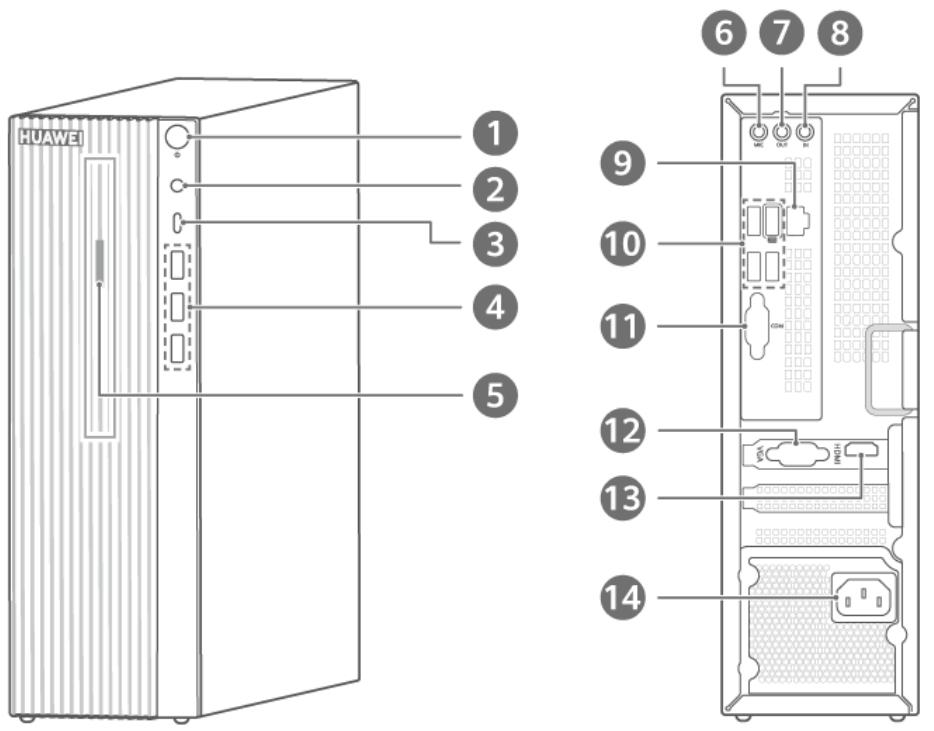
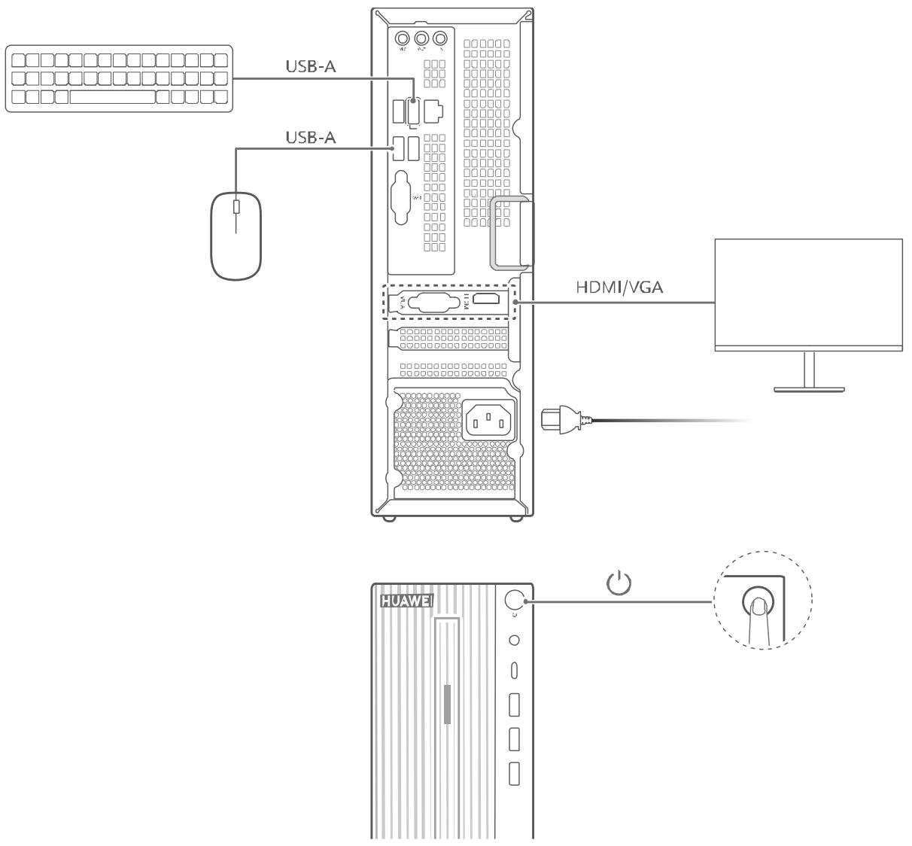
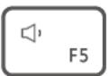
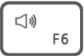
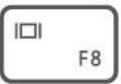

# 用户指南

# 目录

# 1 了解计算机..

1.1 外观介绍...  
1.2 连线与开机...   
1.3 键盘 ...   
1.3.1 快捷键功能介绍.. 4  
1.3.2 快捷键与功能键切换. 4

# 2 BIOS设置..

2.1 进入 BIOS 设置界面的方法..  
2.2 查看 BIOS 版本信息、EC 版本信息.  
2.3 恢复 BIOS 默认设置..   
2.4 设置 BIOS 密码..

2.4.1 BIOS 管理员密码和 BIOS 用户密码（EC 版本为 1.55 及以上的产品适用） 5

2.4.2 BIOS 管理员密码和 BIOS 开机密码（EC 版本低于 1.55 的产品适用） .6

2.5 BIOS 中切换电源上电策略...

2.6 在 BIOS 中切换 USB 模式.. .8

# 3 常见问题.

# 4 安全信息 . . 10

4.1 电子设备 .... .. 10  
4.2 对医疗设备的影响 . . 10  
4.3 听力保护.. . 10  
4.4 易燃易爆区域. . 10   
4.5 操作环境.. .. 10  
4.6 儿童健康... . 11   
4.7 配件要求... . 11  
4.8 电源安全.. . 11

4.9 电池安全.. .. 11  
4.10 维护保养.. . 12  
4.11 环境保护.. . 12

# 5 个人信息和数据安全. 13

# 6 法律声明 . 14

6.1 商标声明.. .. 14  
6.2 注意 .. .. 14   
6.3 第三方软件声明 .. .. 14  
6.4 责任限制.. . 15   
6.5 进出口管制.. . 15   
6.6 隐私保护.. . 15

# 1 了解计算机

# 1.1 外观介绍

0 计算机的配置不同，接口会存在差异，请以实际为准。

text_image

HUAWEI
1
2
3
4
5
6 7 8
9
10
11
12
13
14

<table><tr><td>1</td><td>电源键关机状态下,短按电源键,可开启计算机。开机状态下,长按电源键 10 秒以上,可强制关闭计算机。</td></tr><tr><td>2</td><td>耳麦接口连接耳机。</td></tr><tr><td>3</td><td>USB-C 接口连接手机、U 盘等外接设备传输数据。</td></tr><tr><td>4</td><td>USB-A (USB 3.2 Gen 1) 接口 x 3连接手机、U 盘等外接设备传输数据。</td></tr><tr><td>5</td><td>光驱按键短按光驱按键,打开光驱托盘,可放入光盘。仅部分型号支持光驱,请以实物为准。</td></tr><tr><td>6</td><td>麦克风输入接口
连接麦克风，可将麦克风接收到的声音输入计算机。</td></tr><tr><td>7</td><td>音频输出接口
连接音箱等外部设备，将计算机内的音频信号传送至外部设备。</td></tr><tr><td>8</td><td>音频输入接口
连接外部音频设备，将外部设备声音传送至计算机。</td></tr><tr><td>9</td><td>RJ45 接口
连接网线。</td></tr><tr><td>10</td><td>USB-A (USB 3.2 Gen 1) 接口 x 4
连接手机、U 盘等外接设备传输数据。</td></tr><tr><td>11</td><td>串口
连接调制解调器、串行打印机、仿真器或有串口的设备。</td></tr><tr><td>12</td><td>VGA 接口
接入 VGA 线缆，连接显示设备。</td></tr><tr><td>13</td><td>HDMI 接口
高清晰度多媒体接口，连接显示设备。</td></tr><tr><td>14</td><td>电源接口
连接计算机电源线。</td></tr></table>

# 1.2 连线与开机

text_image

USB-A
USB-A
HDMI/VGA
HUAWEI

1. 完成显示器、鼠标、键盘、电源等连线后，短按电源键启动计算机。  
2. 开机后连接无线网络或插入网线联网。

0 部分型号支持 WLAN，开机后可连接无线网络。

显示器以及部分型号的键盘、鼠标需要单独购买，请以实际产品为准。

# 1.3 键盘

0 计算机配置的键盘不同，支持的功能也会不同，请以实际为准。

# 1.3.1 快捷键功能介绍

部分型号键盘的 F1、F2 等键默认为快捷键（热键）模式，可用于轻松执行常见任务。

<table><tr><td></td><td>降低屏幕亮度i 仅支持华为品牌显示器。</td></tr><tr><td></td><td>增强屏幕亮度i 仅支持华为品牌显示器。</td></tr><tr><td></td><td>开启或关闭静音</td></tr><tr><td></td><td>减小音量</td></tr><tr><td></td><td>增大音量</td></tr><tr><td></td><td>切换投影屏幕模式</td></tr></table>

# 1.3.2 快捷键与功能键切换

在功能键模式下，运行不同的软件时，F1、F2 等键被定义不同的功能。

若要将 F1、F2 等键作为功能键使用，您可以：

按下 Fn 键，当 Fn 键指示灯亮起，表示已将 F1、F2 等键锁定为功能键模式。只需再次按 Fn键，当 Fn 键指示灯熄灭，即可返回快捷键（热键）模式。

# 2 BIOS 设置

# 2.1 进入 BIOS 设置界面的方法

开机或重启时，长按或连续点按 F2 键进入 BIOS Setup 界面，然后根据界面对 BIOS 进行设置。

# 2.2 查看 BIOS 版本信息、EC 版本信息

开机或重启时，长按或连续点按 F2 键，进入 BIOS Setup 界面，在“BIOS 版本”“EC 版本”处可以看到 BIOS 版本信息和 EC 版本信息。

# 2.3 恢复 BIOS 默认设置

恢复 BIOS 默认设置，可以将 BIOS 各接口配置还原到原始状态，例如将 BIOS 语言还原到默认语言。但此操作不影响您已配置的 BIOS 密码。

# 操作方法：

开机或重启时，长按或连续点按 F2 键进入 BIOS 设置界面，按 F9 键调出“恢复出厂设置”（Load Defaults）窗口，然后选择“是”（Yes），按 F10 键保存并退出。

# 2.4 设置 BIOS 密码

开机或重启时，长按或连续点按 F2 键，进入 BIOS 设置界面，根据不同的 BIOS 版本，您可以设置两种 BIOS 密码：

第一种：BIOS 管理员密码和 BIOS 用户密码（EC 版本为 1.55 及以上的产品适用）。

第二种：BIOS 管理员密码和 BIOS 开机密码（EC 版本低于 1.55 的产品适用）。

不同的 BIOS 版本，设置的密码作用有差异，您可以根据实际情况，按需求设置。

# 2.4.1 BIOS 管理员密码和 BIOS 用户密码（EC 版本为 1.55 及以上的产品适用）

# BIOS 密码的作用：

BIOS 管理员密码：可以作为启动密码登录系统；可以作为配置密码登录 BIOS 设置界面，登录后，可以修改 BIOS 任意配置。BIOS 管理员密码权限大于 BIOS 用户密码。

BIOS 用户密码：可以作为启动密码登录系统；可以作为配置密码登录 BIOS 设置界面，但是登录后，只能查看 BIOS 相关配置，不可以修改 BIOS 除用户密码外的其他配置。

启动密码：在 BIOS 中开启“启动时检查菜单密码”选项后，计算机开机进入系统或 BIOS 设置页面前，会有界面提示您 “输入启动密码”，此时输入 BIOS 管理员密码或 BIOS 用户密码都可以进入。即 BIOS 管理员密码或 BIOS 用户密码都是启动密码。

配置密码：配置 BIOS 管理员密码和 BIOS 用户密码后，在进入 BIOS 设置界面时，会有界面提示您“输入配置密码”，此时，可以输入BIOS 管理员密码或 BIOS 用户密码，但输入不同的密

码，获得的权限不同：

输入 BIOS 管理员密码：可以修改 BIOS 任意配置。  
输入 BIOS 用户密码：只能查看 BIOS 相关配置，不可以修改 BIOS 除用户密码外的其他配置。  
华为计算机没有设置出厂 BIOS 管理员密码和 BIOS 用户密码，也没有任何形式的通用密码，一旦设置，请妥善保管。BIOS 用户密码可以通过 BIOS 管理员密码清除重置。BIOS 管理员密码和 BIOS 用户密码一旦都丢失，只能更换主板，才能进入系统。

# 配置 BIOS 管理员密码、BIOS 用户密码：

1. 在开机时长按或连续点按 F2 进入 BIOS 设置界面。  
2. 选择“BIOS 配置管理员密码”，按 Enter 键确认。按界面提示输入并确认密码，例如：123，按 Enter 键确认。配置了管理员密码后，每次进入 BIOS 界面都需要输入配置密码。  
3. 选择“BIOS 配置用户密码”，按 Enter 键确认。按界面提示输入并确认密码，例如：456，按 Enter 键确认。  
4. 若您需要开启 BIOS 启动密码，请检查“启动时检查菜单密码”选项是否打开（此选项默认打开）。若显示关闭，按 Enter 键确认选项后，按界面提示打开。  
5. 按 F10 键保存退出。  
6. 计算机进入系统时，会提示您输入启动密码，此时输入“BIOS 管理员密码”（例如 123）或“BIOS 用户密码”（例如 456）中的任意一个，都可以进入系统。“BIOS 管理员密码”或“BIOS 用户密码”都是计算机启动密码。

# 修改 BIOS 管理员密码、BIOS 用户密码：

1. 在开机时长按或连续点按 F2 键，出现提示界面，让您输入启动密码，输入 BIOS 管理员密码（例如 123）或 BIOS 用户密码（例如 456）都可以，按 Enter 键确认。

2. 提示您输入配置密码：

若您输入的是 BIOS 管理员密码（例如 123），进入 BIOS 设置界面后：选择“BIOS 配置管理员密码”，按 Enter 键确认，按界面提示可以修改密码（若您设置新密码为空，将清除管理员密码）；选择“BIOS 配置用户密码”，按 Enter 键，按界面提示可以修改密码；选择“启动时检查菜单密码”，按 Enter 键，选择“关闭”，再次按 Enter 键确认选项，关闭此选项后，开机时不需要再输入启动密码。若您输入的是 BIOS 用户密码（例如 456），在 BIOS 设置界面，您只能修改 BIOS 用户密码，无法修改 BIOS 管理员密码，以及无法关闭启动密码。

# 2.4.2 BIOS 管理员密码和 BIOS 开机密码（EC 版本低于 1.55 的产品适用）

# BIOS 密码作用：

BIOS 管理员密码（即 BIOS 配置密码）：进入 BIOS 设置界面时，需要输入的 BIOS 配置密码，登录后，可以修改 BIOS 任意配置。但是无法作为开机密码登录系统。  
BIOS 开机密码：计算机开机进入系统或 BIOS 界面需要输入的密码。但不能作为 BIOS 配置密码登录 BIOS 设置界面。  
0 华为计算机没有设置出厂 BIOS 管理员密码和 BIOS 开机密码，也没有任何形式的通用密码，一旦设置，请妥善保管。BIOS 开机密码一旦丢失，只能更换主板，才能进入系统。

# 配置 BIOS 管理员密码、BIOS 开机密码：

1. 在开机时长按或连续点按 F2 进入 BIOS 设置界面。  
2. 在“安全设置”（Security Setting）栏下，点击“BIOS 配置管理员密码”（SETUPAdministrator Password）或“BIOS 开机密码”（POST Password），按 Enter 键确认，按界面提示输入并确认密码后，按 Enter 键确认。  
3. 按 F10 键保存并退出。

# 修改 BIOS 管理员密码、BIOS 开机密码：

1. 在开机时长按或连续点按 F2 进入 BIOS 设置界面。  
2. 在“安全设置”（Security Setting）栏下，点击“BIOS 配置管理员密码”（SETUPAdministrator Password）或“BIOS 开机密码”（POST Password），按 Enter 键确认，按界面提示输入旧密码并确认新密码后，按 Enter 键确认（若您设置新密码为空，将清除管理员密码或开机密码）。  
3. 按 F10 键保存并退出。

# 2.5 BIOS 中切换电源上电策略

“电源上电策略”的具体作用为：当计算机断电后再次恢复供电时，计算机会根据之前设置的电源上电策略，执行开关机或维持上次使用状态。

0 计算机断开电源后，需要主机机箱内的独立电源电量释放完全，重新连接电源后才能执行上电策略。如果断开电源的时间间隔太短，主机机箱内的独立电源电量没有完全释放，此功能可能无法生效。

# 操作方法：

1. 开机或重启时，长按或连续点按 F2 键进入 BIOS 设置界面。  
2. 选择“电源上电策略”，根据需要在三种模式间切换。

当电源上电策略设置为“开机”时：计算机开机或关机状态下断电，再次通电时，计算机将自动开机。  
当电源上电策略设置为“上次状态”时：计算机断电再次通电，计算机将自动恢复到断电前状态。如断电前计算机是休眠状态，重新通电时，计算机将再次进入休眠状态。

当电源上电策略设置为“关机”时：计算机开机或关机状态下断电，再次供电时，计算机将维持关机状态。

# 2.6 在 BIOS 中切换 USB 模式

计算机支持 USB 模式切换，切换方式：

1. 开机或重启时，长按或连续点按 F2 键进入 BIOS 设置界面。  
2. 选择“USB 智能模式控制”，根据需要在三种模式间切换。

正常模式：支持全功能 USB 3.0。U 盘等外部存储设备插入 USB 接口中，可以读取和写入。  
存储只读：可以识别存储设备，但无法写入。U 盘等外部存储设备插入 USB 接口中，可以读取设备中的文件，但无法将计算机文件写入到设备中。  
存储拒绝：不支持识别存储设备。U 盘等外部存储设备插入 USB 接口中，无法读取和写入。

3. 设置完成后，按 F10 保存。

# 3 常见问题

# 计算机无法开机、启动

检查计算机的电源和适配器上线缆的所有插头是否牢固插入插座，如果仍无法开机，请联系华为客户服务中心。

# 上电启动后，显示器无显示

检查所有线缆是否正确连接。  
检查显示器和计算机等设备是否均处于开机状态。  
检查 HDMI 等信号线是否出现损坏。  
如果无上述问题，则重启设备，查看屏幕是否可正常显示图。

# 无法访问 USB 接口

确保 USB 电缆与计算机的 USB 接口和 USB 设备连正确连接。  
如果 USB 设备有开关，请确保其处于“打开”状态。  
如果 USB 设备有联机开关，请确保其处于“联机”状态。  
如果 USB 设备为打印机，请确保纸张正确装入。  
确保 USB 设备随附的任何设备驱动程序或其他软件已正确安装。  
拆离并重新连接 USB 接口以复位设备。

# 4 安全信息

在使用和操作设备前，为确保设备性能最佳，并避免出现危险或非法情况，请查阅并遵循所有的安全信息。

# 4.1 电子设备

有明文规定禁止使用无线设备的场所，请勿使用本设备，否则会干扰其它电子设备或导致其它危险。

# 4.2 对医疗设备的影响

在明文规定禁止使用无线设备的医疗和保健场所，请遵守该场所的规定，并关闭设备。  
设备产生的无线电波可能会影响植入式医疗设备或个人医用设备的正常工作，如起搏器、植入耳蜗、助听器等。若您使用了这些医用设备，请向其制造商咨询使用本设备的限制条件。  
在使用本设备时，请与植入的医疗设备（如起搏器、植入耳蜗等）保持至少 15 厘米的距离。

# 4.3 听力保护

当您使用耳机收听音乐或通话时，建议使用音乐或通话所需的最小音量，以免损伤听力。长时间接触高音量可能会导致永久性听力损伤。

# 4.4 易燃易爆区域

在加油站（维修站）或靠近易燃物品、化学制剂等任何易燃易爆区域，请勿使用本设备，并遵守所有图形或文字的指示。在燃油或化学制剂存放和运输区或易爆场所内或周围，设备可能引起爆炸或起火。  
请勿将设备及其配件与易燃液体、气体或易爆物品放在同一箱子中存放或运输。

# 4.5 操作环境

请勿在多灰、潮湿、肮脏或靠近磁场的地方使用设备，以免引起设备内部电路故障。  
插拔设备线缆前，请先停止使用设备并断开电源。在插拔线缆时请保持双手干燥。  
雷电天气请断开电源，并拔出连接在设备上的所有线缆，以免设备遭雷击损坏。  
请勿在雷雨天气使用本设备。雷雨天气可能导致设备故障或电击危险。  
请在温度 $0 ^ { \circ } C \sim 3 5 ^ { \circ } C$ 范围内使用本产品，在 $- 1 0 ^ { \circ } C \sim + 4 5 ^ { \circ } C$ 范围内存储本产品。  
请避免设备及其配件雨淋或受潮，否则可能导致火灾或触电危险。  
请勿将设备靠近热源或裸露的火源，如电暖器、微波炉、烤箱、热水器、炉火、蜡烛或其他可能产生高温的地方。  
设备在运行一段时间后，设备温度会升高。如果设备温度过高，请勿长时间接触，否则可能导

致低温烫伤，引起皮肤红肿或色素沉淀。

请勿让儿童或宠物吞咬设备或其配件，以免对其造成伤害或导致设备故障或爆炸。  
当不断重复同一动作时（例如玩游戏），您的手、臂、腕、肩、颈或其他身体部位可能会偶尔感觉不适。如果您感觉到不适，请停止使用并咨询医师。  
装有激光产品（如 CD-ROM、DVD 驱动器）时，请勿卸下外盖。卸下激光产品的外盖可能会导致遭受危险的激光辐射。

# 4.6 儿童健康

本设备及其配件可能包含一些小零件，请将设备及其配件放置在儿童接触不到的地方。儿童可能在无意之中损坏本设备及其配件，或吞下小零件导致窒息或其他危险。  
本设备并非玩具，儿童应在成人监护下使用设备。

# 4.7 配件要求

使用未经认可或不兼容的电源、充电器或电池，可能引发火灾、爆炸或其他危险。  
只能使用设备制造商认可且与此型号设备配套的配件。如果使用其他类型的配件，可能违反本设备的保修条款以及本设备所处国家的相关规定，并可能导致安全事故。如需获取认可的配件，请与华为客户服务中心联系。

# 4.8 电源安全

电源插头作为断开电源的装置。  
电源插座应安装在设备附近并应易于触及。  
当不使用本设备时，请断开电源与设备的连接并从电源插座上拔掉电源插头。  
若电源插头或电源线已损坏，请勿继续使用，以免发生触电或火灾。  
请勿用湿手触碰电源线，或用拉电源线缆的方式拔出电源。  
请勿用湿手触摸设备或电源，以免发生设备短路、故障或触电。

# 4.9 电池安全

请勿将金属物导体与电池两极对接，或接触电池的端点，以免导致电池短路，以及因电池过热而引起的烧伤等身体伤害。  
请勿将电池暴露在高温处或发热设备的周围，如日照、取暖器、微波炉、烤箱或热水器等。电池过热可能引起爆炸。  
请勿拆解或改装电池、插入异物、或浸入水或其它液体中，以免引起电池漏液、过热、起火或爆炸。  
如果电池漏液，请勿使皮肤或眼睛接触到漏出的液体。若接触到皮肤或眼睛上，请立即用清水

冲洗，并到医院进行医疗处理。

如果电池在使用或保存过程中有变色、变形、异常发热等异常现象，请停止使用并更换新电池。  
更换电池时，只能使用同类型或等效类型的电池。若电池更换不当可能会导致电池爆炸。  
请勿把电池扔到火里，否则会导致电池起火和爆炸。  
请按当地规定处理电池，不可将电池作为生活垃圾处理。若电池处置不当可能会导致电池爆炸。  
请勿让儿童或宠物吞咬电池 ，以免对其造成伤害或导致电池爆炸。  
请勿跌落、挤压或穿刺电池。避免让电池遭受外部大的压力，从而导致电池内部短路和过热。  
请勿使用已经损坏的电池。  
本产品包含纽扣锂电池，更换纽扣锂电池时，请仅使用相同类型的电池或制造商推荐的同类电池。该电池中含有锂，如果使用、操作或处理不当，可能会发生爆炸。  
请勿让儿童接触电池。如果电池仓未安全闭合，停止使用该产品并使之远离儿童。如果吞食纽扣锂电池，在 2 小时内就可能导致严重的内部灼伤并可能导致死亡。如果误吞纽扣锂电池或误置入体内任何部位，请立即就医。

# 4.10 维护保养

不建议您自行升级部件或更换模块。如有相关服务需求，请联系华为客户服务中心。  
请保持设备及其配件干燥。请勿使用微波炉或吹风机等外部加热设备对其进行干燥处理。  
请勿在温度过高或过低区域放置设备及其配件，否则可能导致设备故障、着火或爆炸。  
请勿使设备及其配件受到强烈的冲击或震动，以免损坏设备及其配件，导致设备故障。  
清洁和维护前，请停止使用本设备，关闭所有应用，并断开与其他设备的所有连接或线缆。  
请勿使用烈性化学制品、清洗剂或强洗涤剂清洁设备或其配件。请使用清洁、干燥的软布擦拭设备或其配件。  
请勿将磁条卡（例如银行卡、电话卡等）长期接触本设备，否则可能导致磁条卡被磁场损坏。  
如果设备碰撞硬物或设备受到外界的强烈撞击造成破碎，切勿触摸或试图移除破碎的部分，请立即停止使用并及时联系华为客户服务中心。

# 4.11 环境保护

请勿将本设备及其附件作为普通的生活垃圾处理。  
请遵守本设备及其附件处理的本地法令，并支持回收行动。

# 5 个人信息和数据安全

在使用设备的一些功能和第三方应用时，可能会因为操作不正确或其他原因导致您的个人信息或数据泄露或丢失，建议按以下方式加强保护您的个人信息。

请将设备放置于安全区域，防止未经授权人员使用您的设备。  
建议不要阅读来自陌生人的信息或邮件，以免设备遭受病毒感染。  
在使用设备上网时，请勿浏览存在安全隐患的网站，以免个人信息被盗。  
在使用无线共享、蓝牙等业务时，请设定密码，防止未授权访问。不需要使用这些业务时，建议及时关闭。  
安装设备安全软件，并定期进行安全检查。  
获取第三方应用时，应保证获取方式的安全性。获取的第三方应用程序应进行病毒扫描。  
请及时安装或升级华为或授权的第三方应用程序供应商发布的安全性软件或补丁。  
使用非授权第三方软件升级设备的固件和系统，可能存在设备无法使用或者泄漏您个人信息等安全风险。建议您使用在线升级或者将设备送至您附近的华为客户服务中心升级。  
设备可能会将检测、诊断等信息反馈给第三方应用程序供应商，这些信息将用于帮助第三方应用供应商改善产品和服务。

# 6 法律声明

版权所有 © 2023 华为技术有限公司。保留一切权利。

本手册描述的产品中，可能包含华为及其可能存在的许可人享有版权的软件。除非获得相关权利人的许可，否则，任何人不能以任何形式对前述软件进行复制、分发、修改、摘录、反编译、反汇编、解密、反向工程、出租、转让、分许可等侵犯软件版权的行为，但是适用法禁止此类限制的除外。

# 6.1 商标声明

Bluetooth?字标及其徽标均为Bluetooth SIG,Inc.的注册商标，华为技术有限公司对此标记的任何使用都受到许可证限制，华为终端有限公司为华为技术有限公司的关联公司。

  
HIGH-DEFINITIONMULTIMEDIAINTERFACE

词语 HDMI、HDMI High-Definition Multimedia Interface（高清晰度多媒体接口）、HDMI商业外观和 HDMI 徽标均为 HDMI Licensing Administrator, Inc. 的商标或注册商标。

本产品操作系统由第三方供应商提供，第三方供应商会对操作系统进行版本更新升级、错误修正，并保证应用软件的兼容性。

在本手册以及本手册描述的产品中，出现的其他商标、产品名称、服务名称以及公司名称，由其各自的所有人拥有。

# 6.2 注意

本手册描述的产品及其附件的某些特性和功能，取决于当地网络的设计和性能，以及您安装的软件。某些特性和功能可能由于当地网络运营商或网络服务供应商不支持，或者由于当地网络的设置，或者您安装的软件不支持而无法实现。因此，本手册中的描述可能与您购买的产品或其附件并非完全一一对应。

华为保留随时修改本手册中任何信息的权利，无需提前通知且不承担任何责任。

# 6.3 第三方软件声明

随本产品提供的第三方软件和应用程序归第三方所有，华为不拥有这些第三方软件和应用程序的知识产权，因此华为不对这些第三方软件和应用程序提供任何保证，华为既不会就这些软件和应用程序向您提供支持，也不对这些软件和应用程序的功能是否正常承担任何责任。

第三方软件和应用程序的服务可能中断或终止，华为不保证任何内容或服务可在任何期间维持其可用性。第三方系通过华为可控制范围外的网络及传输工具传送内容或服务。在相关法律允许的范围内，华为明确表示不对任何通过本产品提供的任何内容或服务的中断或终止承担任何责任。

对于您个人安装在本产品上的任何软件或上传、下载的任何文字、图片、视频或软件等第三方作品，华为不对其合法性、质量以及其他任何方面承担任何责任，对于您因个人安装软件或上传、下载前述第三方作品产生的任何后果，包括安装的软件与本产品不兼容等情况，由您自行承担一切相关风险。

# 6.4 责任限制

本手册中的内容均“按照现状”提供，除非适用法律要求，华为对本手册中的所有内容不提供任何明示或暗示的保证，包括但不限于适销性或者适用于某一特定目的的保证。

在适用法律允许的范围内，华为在任何情况下，都不对因使用本手册相关内容及本手册描述的产品而产生的任何特殊的、附带的、间接的、继发性的损害进行赔偿，也不对任何利润、数据、商誉或预期节约的损失进行赔偿。

在相关法律允许的范围内，在任何情况下，华为对您因为使用本手册描述的产品而遭受的损失的最大责任（除在涉及人身伤害的情况中根据适用的法律规定的损害赔偿外）以您购买本产品所支付的价款为限。

# 6.5 进出口管制

若需将本手册描述的产品（包括但不限于产品中的软件及技术数据等）出口、再出口或者进口，您应遵守适用的进出口管制法律法规。

# 6.6 隐私保护

为了解我们如何保护您的个人信息，请访问

https://consumer.huawei.com/privacy-policy 阅读我们的隐私政策。

本指南仅供参考，不构成任何形式的承诺，产品（包括但不限于颜色、大小、屏幕显示等）请以实物为准。如出现本指南与官网描述不一致的情况，请以官网说明为准，恕不另行通知。

购买华为终端产品，请访问华为商城 https://www.vmall.com/

更多信息请访问 https://consumer.huawei.com/cn/