#

版本：01.04

# 目录

# 产品介绍

外观 ...

常用操作指引.

灯效指示. 3

规格参数.. 4

# 首次安装与配网

首次安装打印机. 6

给打印机配置网络（智享家 App/NFC/电脑端 Lenovo Page）.........9

# 更多设备连接

配网后，通过智享家App分享设备.. 22

# 打印

打印手机中的文件. 22

打印电脑中的文件. .25

取消打印.. .39

# 复印

机身按键复印. 40

智享家 App 复印.. .40

电脑端【Lenovo page】软件复印.. . 42

取消复印.. .45

# 扫描

将原稿扫描至手机/平板中. . 45

将原稿扫描至电脑（Windows/Mac）中. . 46

取消扫描. .48

# 更多操作

更换鼓粉盒组件. ..48

恢复出厂设置. ..49

重置网络. .49

打印机固件升级. ..50

查看打印机基本信息. .52

# 机器维护

维护感光鼓和墨粉盒 .52

清洁打印机. .53

# 故障排除

常见问题.. ..54

送纸问题.. . 55

打印问题. .. 56

复印问题. . 57

扫描问题. .58

清除卡纸.. .. 58

注意事项.. .. 63

# 安全信息

# 法律声明

# 产品介绍

外观  
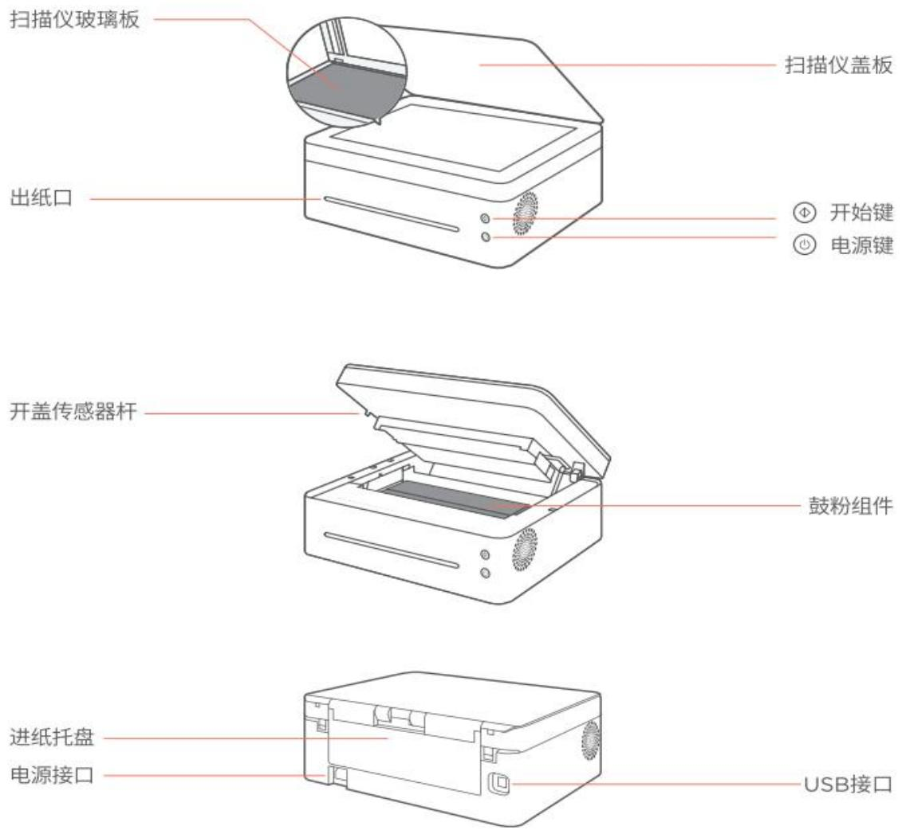

常用操作指引

<table><tr><td>操作</td><td>关键操作步骤</td></tr><tr><td>开机</td><td>将打印机接通电源,短按一下电源键开机。</td></tr><tr><td>关机</td><td>按住电源键 6 秒以上,所有的指示灯熄灭后,释放按钮后打印机关机。注意:关机是强制性动作,不要在打印状态下进行,以免造成卡纸</td></tr><tr><td>休眠唤醒</td><td>按任意按键。</td></tr><tr><td>进入 Wi-Fi 配置模式</td><td>按任意键唤醒打印机,长按开始键 6 秒以上,至电源键开始蓝绿/</td></tr></table>

产品介绍 

<table><tr><td></td><td>红/灯交替闪烁,释放按键。</td></tr><tr><td>取消当前任务</td><td>按住电源键1秒以上,至电源键红灯和绿灯交替闪烁,释放按键。</td></tr><tr><td>复印一页</td><td>按任意键唤醒打印机,按一下开始键。</td></tr><tr><td>连续复印5页</td><td>按任意键唤醒打印机,按住开始键3秒以上,释放按钮。</td></tr><tr><td>进入身份证复印模式</td><td>按任意键唤醒打印机,同时按住开始键和电源键1秒后,释放按键,开始键和电源键绿灯长亮,打印机进入身份证复印模式。</td></tr><tr><td>开始复印身份证第一面</td><td>打印机处于身份证复印模式,按一下开始键,此时开始键绿灯长亮电源键绿灯闪烁,打印机开始扫描。</td></tr><tr><td>开始复印身份证第二面</td><td>当开始键绿灯和电源键绿灯同时闪烁时,请将证件翻面放置,按一下开始键,打印机扫描完后打印出复印件。</td></tr><tr><td>退出身份证复印模式</td><td>打印机处于身份证复印模式,或提示等待扫描第二面时,按住电源键1秒以上。</td></tr><tr><td>在N合1复印模式下扫描下一页</td><td>当开始键绿灯和电源键绿灯同时闪烁时,更换待扫描稿件,按一下开始键。</td></tr><tr><td>手动双面打印时打印第二面</td><td>第一面打印完成后,电源键红灯闪烁,将纸张理齐后,空白面向上放入进纸槽内,按一下电源键。</td></tr><tr><td>缺纸后继续打印</td><td>打印机电源键红灯闪烁提示缺纸时,装入纸张,按一下电源键。</td></tr><tr><td>清除卡纸</td><td>请参考 &gt;&gt; 故障排除中的清除卡纸步骤操作(P58)</td></tr><tr><td>复位感光鼓</td><td>打印机电源键红灯慢速闪烁提示感光鼓寿命不足时,打开上盖,更换新的感光鼓,然后在1.5秒内按下电源键5次,然后关闭上盖。注意:此操作只能在更换新感光鼓后操作,否则会影响到感光鼓寿命的识别。</td></tr><tr><td>复位墨粉盒</td><td>打印机电源键红灯慢速闪烁提示墨粉不足时,打开上盖,更换新的墨粉盒,然后在1.5秒内按下电源键2次,然后关闭上盖。注意:此操作只能在更换新感光鼓后操作,否则会影响到感光鼓寿命的识别。</td></tr><tr><td>打印配置页</td><td>按任意键唤醒打印机,在1秒内连续按3次电源键。</td></tr><tr><td>恢复出厂设置</td><td>先将打印机关机,然后打开上盖,按住电源键10秒以上,电源键指示灯橙灯亮(红灯绿灯同时亮)后释放按钮。</td></tr></table>

# 灯效指示

# 1）按键及指示灯简介

<table><tr><td>指示灯</td><td>按键介绍</td></tr><tr><td>∅</td><td>开始键</td></tr><tr><td>⊕</td><td>电源键</td></tr><tr><td>∅</td><td>开始键闪烁/慢闪</td></tr><tr><td>⊕</td><td>电源键闪烁/慢闪</td></tr></table>

# 2）指示灯颜色简介

<table><tr><td>指示灯</td><td>颜色介绍</td></tr><tr><td></td><td>红灯长亮</td></tr><tr><td></td><td>蓝灯长亮</td></tr><tr><td></td><td>绿灯长亮</td></tr><tr><td></td><td>橙灯长亮(红灯、绿灯同时长亮)</td></tr><tr><td></td><td>紫灯长亮(红灯、绿灯和蓝灯同时长亮)</td></tr></table>

# 3）按键及指示灯状态与状态描述

<table><tr><td>指示灯</td><td>状态描述</td><td>打印机状态</td></tr><tr><td rowspan="2"></td><td>开始键灯不亮</td><td rowspan="2">关机</td></tr><tr><td>电源键灯不亮</td></tr><tr><td rowspan="2"></td><td>开始键灯不亮</td><td>开机</td></tr><tr><td>电源键绿灯长亮</td><td>Wi-Fi 网络断开或不能使用</td></tr><tr><td rowspan="2"></td><td>开始键灯不亮</td><td rowspan="2">预热</td></tr><tr><td>电源键绿灯闪烁</td></tr><tr><td rowspan="2"></td><td>开始键灯不亮</td><td rowspan="2">Wi-Fi 网络连接成功</td></tr><tr><td>电源键蓝灯长亮</td></tr><tr><td rowspan="2"></td><td>开始键灯不亮</td><td rowspan="2">配网模式</td></tr><tr><td>电源键红、绿、蓝灯每 0.5 秒交替闪烁</td></tr><tr><td rowspan="2"></td><td>开始键灯不亮</td><td rowspan="2">固件升级</td></tr><tr><td>电源键红灯和蓝灯每 0.5 秒交替闪烁</td></tr><tr><td rowspan="2"></td><td>开始键不亮</td><td rowspan="2">休眠模式</td></tr><tr><td>电源键绿灯慢闪</td></tr><tr><td rowspan="2"></td><td>开始键灯不亮</td><td rowspan="2">恢复出厂设置</td></tr><tr><td>电源键红灯快闪 10 秒后显示橙灯亮</td></tr></table>

产品介绍 

<table><tr><td></td><td>开始键灯不亮电源键绿灯闪烁</td><td>任务进行中</td></tr><tr><td></td><td>开始键灯不亮电源键红灯和绿灯每0.5秒交替闪烁</td><td>任务取消</td></tr><tr><td></td><td>开始键绿灯长亮电源键绿灯闪烁</td><td>复印中/继续复印/扫描</td></tr><tr><td></td><td>开始键绿灯长亮电源键绿灯长亮</td><td>启动身份证复印模式</td></tr><tr><td></td><td>开始键绿灯闪烁电源键绿灯闪烁</td><td>等待复印身份证的背面</td></tr><tr><td></td><td>开始键绿灯闪烁电源键绿灯闪烁</td><td>N合1模式下等待复印下一页</td></tr><tr><td></td><td>开始键灯不亮电源键蓝灯长亮</td><td>Wi-Fi处于连接状态</td></tr><tr><td></td><td>开始键绿灯不亮电源键红灯、绿灯和蓝灯同时长亮</td><td>云打印连接状态</td></tr><tr><td></td><td>开始键灯不亮电源键红灯长亮</td><td>运行故障(上盖打开/卡纸/感光鼓寿命已到等)</td></tr><tr><td></td><td>开始键灯不亮电源键红灯闪烁</td><td>缺纸/机器降温中/等待打印手动双面打印的第二面</td></tr><tr><td rowspan="2"></td><td rowspan="2">开始键灯不亮电源键红灯慢闪</td><td>没有墨粉/墨粉不足</td></tr><tr><td>感光鼓寿命不足</td></tr></table>

# 规格参数

1）常规功能规格

<table><tr><td>内容</td><td>规格参数</td></tr><tr><td>配置</td><td>台式</td></tr><tr><td>使用扫描仪玻璃板扫描的最大尺寸</td><td>216 × 297 (mm)</td></tr><tr><td>打印的最大纸张尺寸</td><td>216 × 356 (mm)</td></tr><tr><td>预热时间</td><td>小于 25 秒(23 °C、50%RH)</td></tr><tr><td>纸张尺寸</td><td>A4/Letter/B5/A5 SEF/B6 SEF/A6/Executive/16K/自定义纸张尺寸</td></tr><tr><td rowspan="2">自定义纸张尺寸</td><td>宽度:76.2-216 (mm)</td></tr><tr><td>长度:116-355.6 (mm)</td></tr></table>

产品介绍 

<table><tr><td rowspan="5">纸张类型</td><td>普通纸 (70-90g/m2)</td></tr><tr><td>再生纸 (70-90g/m2)</td></tr><tr><td>薄纸 (60-70g/m2)</td></tr><tr><td>厚纸 (90-105g/m2)</td></tr><tr><td>标签 (激光打印机专用)</td></tr><tr><td>纸张输入容量</td><td>50 张 (80g/m2)</td></tr><tr><td>内存</td><td>128 MB</td></tr><tr><td>电源要求</td><td>AC 220~240V、5A、50/60Hz</td></tr><tr><td rowspan="2">功耗</td><td>最大功耗: 900 W</td></tr><tr><td>节能模式: 1.2 W 或更少</td></tr><tr><td>机器尺寸(宽度×深度×高度)</td><td>350 × 275 × 141 (mm)</td></tr><tr><td>重量(机身、鼓粉组件)</td><td>约6.5kg或更少</td></tr></table>

2）打印功能规格

<table><tr><td>内容</td><td>规格参数</td></tr><tr><td>打印速度</td><td>每分钟 22 页(A4 短边进纸)</td></tr><tr><td rowspan="2">分辨率</td><td>600 x 600 (dpi)</td></tr><tr><td>1200 x 600 (dpi)(最大)</td></tr><tr><td>首页打印速度</td><td>8.5 秒或更少(从开始打印到出纸完成)</td></tr><tr><td rowspan="2">接口</td><td>USB 2.0</td></tr><tr><td>Wi-Fi 802.11 b/g/n</td></tr><tr><td>打印机语言</td><td>GDI</td></tr></table>

3）复印功能规格

<table><tr><td>内容</td><td>规格参数</td></tr><tr><td rowspan="2">最大分辨率(扫描和打印)</td><td>扫描:600 x 600 (dpi)</td></tr><tr><td>打印:600 x 600 (dpi)</td></tr><tr><td>多页复印速度</td><td>每分钟 22 页</td></tr><tr><td>复印比例</td><td>固定比例:50%、70%、81%、100%、122%、微调比例:25% 到 400%</td></tr><tr><td>复印数量(单次最大复印数量)</td><td>99</td></tr></table>

4）扫描功能规格

<table><tr><td>内容</td><td>规格参数</td></tr><tr><td>最大扫描面积(横向×纵向)</td><td>216 × 297 (mm)</td></tr><tr><td>(插值)最大分辨率</td><td>4800 × 4800 (dpi)</td></tr><tr><td>(光学)最大分辨率</td><td>1200 × 1200 (dpi)</td></tr></table>

# 首次安装与配网

# 首次安装打印机

1）从包装箱中取出打印机和所有配件，并清点齐全。

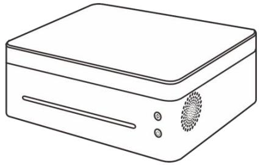  
打印机

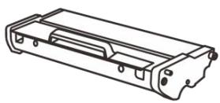  
鼓粉组件\*已安装于打印机内

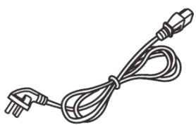  
电源线

  
快速安装指南

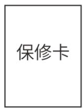  
保修卡

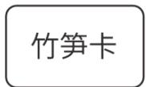  
竹笋卡仅（M7528WE）

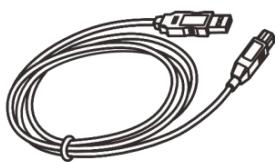

USB线

<table><tr><td rowspan="3">注意</td><td>如果发现其中缺少或有损坏的,请立即通知经销商。</td></tr><tr><td>鼓粉组件已经装在打印机中。</td></tr><tr><td>在不同的国家,少数部件可能不可用。</td></tr></table>

# 2）移除胶带

小心地撕下打印机上的包装及机器内部全部胶带。

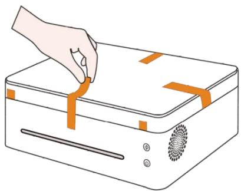

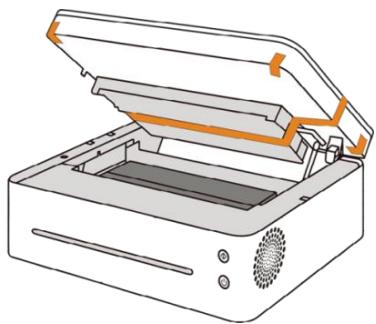

# 3）放置位置和预留空间

将打印机水平稳固放置，前端预留30 厘米以上空间，左右、后端预留15厘米以上空间。

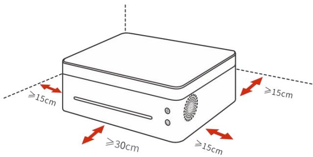

# 4）装入纸张

①打开并拉出进纸托盘，向上翻转中间处延伸板，捏住两端绿色固定手柄底部向左右拉至最大，平整放入纸张；  
②捏住手柄底部调整至合适位置以固定纸张。

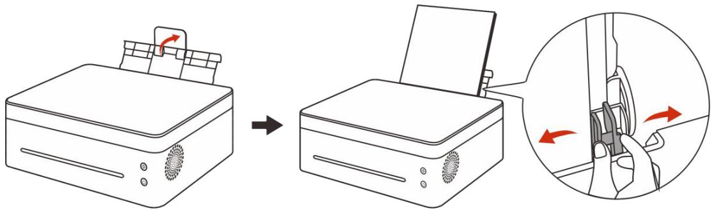

# ！ 提示

关于打印介质的详细信息，请参见 >> 支持的纸张尺寸（P27）。

③在进纸托盘中装入一叠用于打印的纸。

在装纸前，将纸来回弯曲，使纸松动，再扇动纸，在桌子上墩齐纸的边缘。

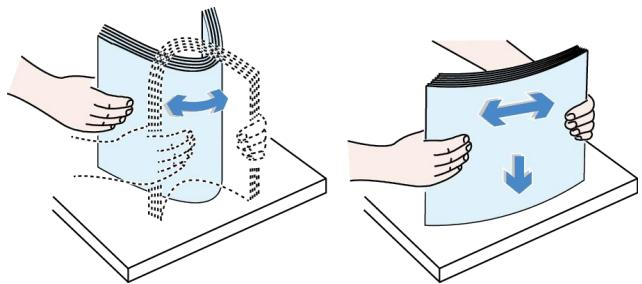

# 提示

装纸前这样做有助于防止卡纸

④装入纸叠，打印面朝上。不要装入太多的纸，进纸托盘最大可装50张 $( 8 0 9 / \mathsf { m } ^ { 2 } )$ 纸。

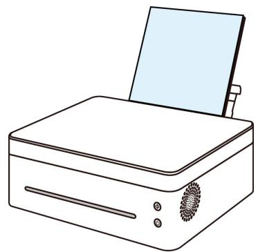

<table><tr><td>注意</td><td>装入纸张时,请务必配置纸张尺寸和纸张类型。打印文件时,请在打印机驱动程序中指定纸张尺寸和纸张类型,以便装入纸张时配置的设置可用来进行打印。</td></tr><tr><td rowspan="5">提示</td><td>关于在打印机驱动程序中指定纸张尺寸和纸张类型的详细信息,请参见 &gt;&gt; 支持的纸张尺寸(P27)。</td></tr><tr><td>纸张卷曲可能会卡纸。装纸前,请将卷曲的纸张整理平整。</td></tr><tr><td>不要将导纸板推得太紧,以致引起纸张拱起。</td></tr><tr><td>如果您未调整导纸板,可能会卡纸。</td></tr><tr><td>如果您需要在打印时向打印机的进纸托盘中加纸,首先将打印机进纸托盘中剩余的纸张拿出来,然后将它们放进新的纸张中。直接在打印机进纸托盘中剩余的纸张上加纸,可能会导致打印机卡纸或多页纸同时输送。</td></tr></table>

# 5）接通电源

将电源线插入打印机后面的电源接口，将电源线的另一端插入正确接地的交流电源插座内。

# 6）启动打印机

短按 电源键启动打印机，电源键绿灯 长亮时，打印机准备就绪。

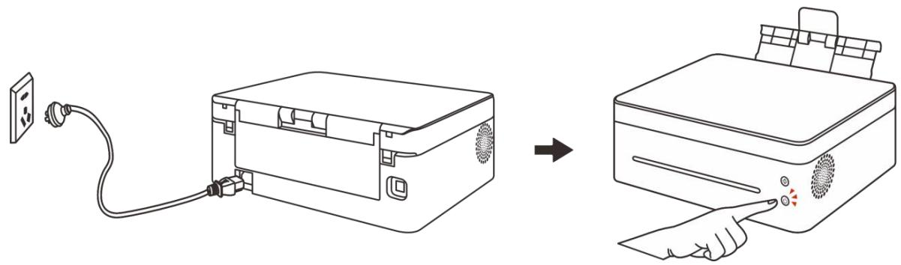

<table><tr><td rowspan="2">注意</td><td>打印机启动后,扫描仪会进行校准,请耐心等待。</td></tr><tr><td>Wi-Fi 机型如果远程打印功能可用,则电源键 ⏻ 会红灯、绿灯和蓝灯同时长亮。</td></tr></table>

# 给打印机配置网络（智享家 App/NFC/电脑端 Lenovo Page）

打印机不同型号的程序及软件配置

<table><tr><td>程序&amp;软件</td><td>M7328W</td><td>M7398W</td><td>M7328WE</td><td>M7398WE</td><td>M7228W</td><td>M7298W</td></tr><tr><td>智享家 App(Android&amp;iOS)</td><td>√</td><td>√</td><td>√</td><td>√</td><td>×</td><td>×</td></tr><tr><td>Lenovo Page(Android&amp;iOS)</td><td>×</td><td>×</td><td>×</td><td>×</td><td>√</td><td>√</td></tr><tr><td>Lenovo Page(Windows&amp;Mac)</td><td>√</td><td>√</td><td>√</td><td>√</td><td>√</td><td>√</td></tr><tr><td>驱动程序</td><td>√</td><td>√</td><td>√</td><td>√</td><td>√</td><td>√</td></tr><tr><td rowspan="3">手机端安装方式</td><td colspan="6">1)智享家App(仅M7328W/M7398W/M7328WE/M7398WE)</td></tr><tr><td colspan="6">2)NFC配网(仅M7328W/M7398W/M7328WE/M7398WE)</td></tr><tr><td colspan="6">3)Lenovo page App(仅M7228W/M7298W)</td></tr><tr><td rowspan="2">驱动程序安装方式</td><td colspan="6">1)快速安装</td></tr><tr><td colspan="6">2)自定义安装</td></tr><tr><td rowspan="3">Lenovo Page安装方式</td><td colspan="6">1)安装USB打印机</td></tr><tr><td colspan="6">2)安装Wi-Fi打印机</td></tr><tr><td colspan="6">3)安装已连入当前网络打印机</td></tr><tr><td rowspan="3">在安装打印机驱动程序前确认</td><td colspan="6">您的计算机上至少应有2GB内存。</td></tr><tr><td colspan="6">您的计算机硬盘至少有200MB的空余空间。</td></tr><tr><td colspan="6">您的计算机上已安装了Windows或Mac OS系统。</td></tr><tr><td rowspan="3">提示</td><td colspan="6">【Lenovo Page】和用户手册在您安装打印驱动时,会默认安装在您的电脑上。</td></tr><tr><td colspan="6">M7328W/M7398W/M7328WE/M7398WE支持2.4G和5G Wi-Fi。</td></tr><tr><td colspan="6">M7228W/M7298W仅支持2.4G Wi-Fi。</td></tr><tr><td rowspan="2">安装建议</td><td colspan="6">1.先安装手机App【智享家】,完成打印机的配网与绑定。</td></tr><tr><td colspan="6">2.电脑端安装时,选择与手机配网使用的同名网络。</td></tr></table>

# 智享家 App

1）请保持手机/平板连接Wi-Fi，并开启蓝牙。  
2）扫描下方二维码安装最新版本智享家 App。

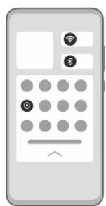

3）打开智享家 App，登录联想账号，点击“+”号，选择添加设备。  
4）待App 扫描到打印机后，点击设备卡片进行连接；根据界面指引完成打印机配网。

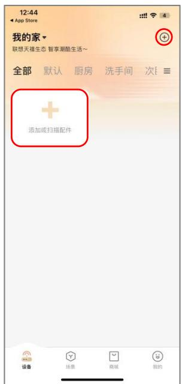

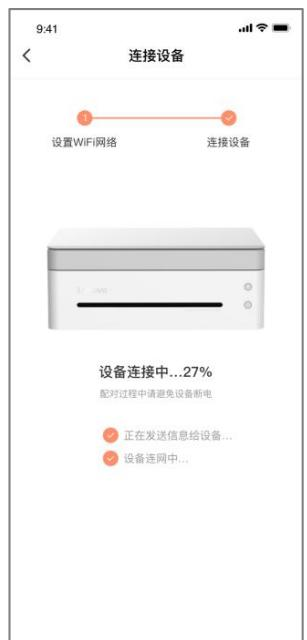

\*若未发现打印机或连接失败，请按一下电源键唤醒打印机，长按开始键 6秒以上，重置网络后（电源键蓝灯 绿灯 红灯 闪烁代表进入配网状态），再次配置。

# NFC 配网

1）请保持手机/平板连接Wi-Fi，并开启蓝牙。  
2）打开手机/平板NFC功能。  
3）将手机放置在打印机上盖最右侧 NFC 图标上，手机自动弹出智享家App，根据 App 指引完成配置操作。

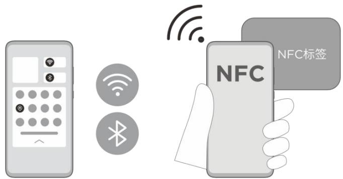

# 电脑端 Lenovo page

# Windows系统安装无线驱动程序

# 1）快速安装

仅适用于操作系统为 XP SP3 以上（包含 SP3）并且已经安装了.Net Framework4.0 及以上版本的系统插件。

以Windows 10系统为例，实际步骤取决于您所使用的操作系统。

①请开启打印机，将计算机接入到打印机将要连接的无线网络中。  
②从官网：https://www.lenovoimage.com/下载您购买机型的驱动程序并安装。  
③将打印机通过USB线连接到计算机。

④出现安装程序主界面，选择所需语言；请仔细阅读许可协议，如果接受许可协议，勾选“我同意使用联想打印机驱动”前的方框；为了帮助我们为您提供更好的服务，我们希望您能参加“用户体验改善计划”，并同意我们收集打印机的使用数据。点击【下一步】；

⑤根据相关界面步骤，自动检测并完成参数配置。

a.自动检测电脑的网络连接状态；  
b.出现选择配置Wi-Fi的列表；  
c.自动进行打印机无线参数配置。

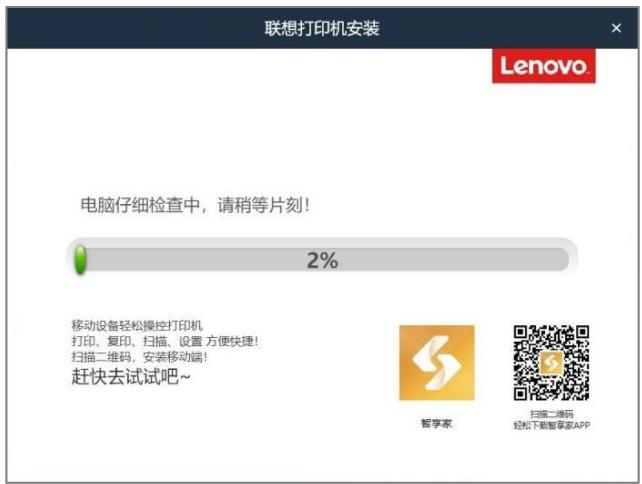

⑥当安装完成，可以点击【打印测试页】检测打印机驱动是否安装成功，选择重启方式后点击【确定】退出驱动安装程序，安装完成您可以使用您的打印机了。

# 2）安装Wi-Fi打印机

<table><tr><td rowspan="2">提示</td><td>确保您的打印机支持无线联网。</td></tr><tr><td>关于不同型号打印机的程序和软件配置,请参见 &gt;&gt; 打印机不同型号的程序及软件配置(P9)。</td></tr></table>

以 Windows 10 系统为例，实际步骤取决于您所使用的操作系统。

①请开启打印机，将计算机接入到打印机将要连接的无线网络中。  
②从官网：https://www.lenovoimage.com/下载您购买机型的驱动程序并安装。  
③将打印机通过USB线连接到计算机。

④出现安装程序主界面，选择所需语言，选择安装方式为自定义安装；请仔细阅读许可协议，如果接受许可协议，勾选 “我同意使用联想打印机驱动”前的方框；为了帮助我们为您提供更好的服务，我们希望您能参加“用户体验改善计划”，并同意我们收集打印机的使用数据。点击【下一步】；

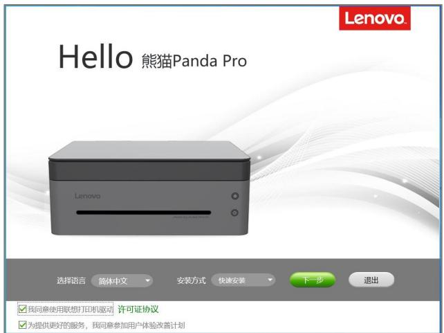

⑤点击【安装Wi-Fi打印机】。

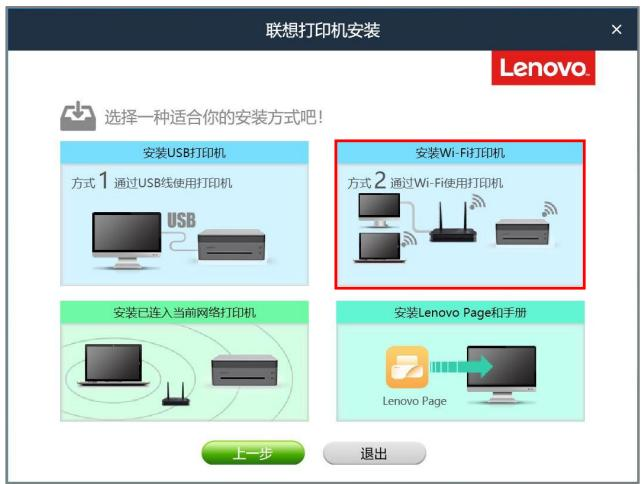

⑥自动检测电脑的网络连接状态。

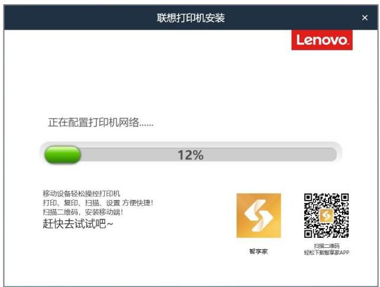

7如果检测到电脑的有线连接正常，则需要通过用户手动选择网络，确定打印机无线网络参数；检测到电脑仅有Wi-Fi连接正常，则使用电脑Wi-Fi参数作为打印机无线网络参数。

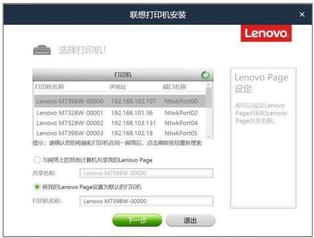

⑧当获取到打印机无线网络参数时，自动进行打印机无线参数配置。

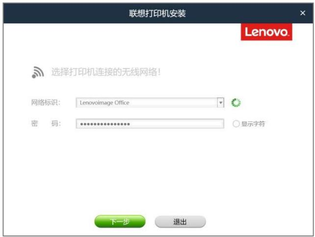

⑨自动进行驱动安装。

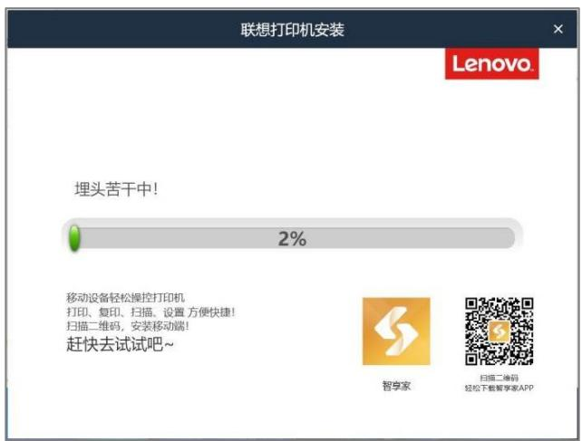

○10 当安装完成，可以点击【打印测试页】检测打印机驱动是否安装成功，也可以直接选择重启方式后点击【确定】直接退出驱动安装程序。无线驱动安装完成，您可以通过无线网络使用您的打印机了。

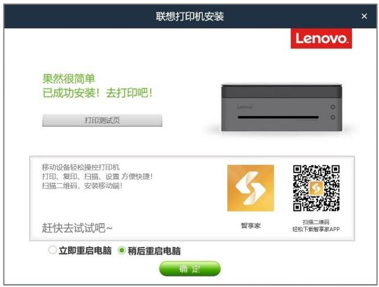

# 3）安装已连入当前网络打印机

在您的打印机已经无线配置过的情况下，选择网络安装。

以 Windows 10 系统为例，实际步骤取决于您所使用的操作系统。

①请确认打印机已经开启，Wi-Fi 功能已经打开。  
②从官网：https://www.lenovoimage.com/下载您购买机型的驱动程序并安装。  
③出现安装程序主界面，选择所需语言，选择安装方式为自定义安装；请仔细阅读许可协议，如果接受许可协议，勾选 “我同意使用联想打印机驱动”前的方框；为了帮助我们为您提供更好的服务，我们希望您能参加“用户体验改善计划”，并同意我们收集打印机的使用数据。点击【下一步】；

④点击【安装已连入当前网络打印机】。

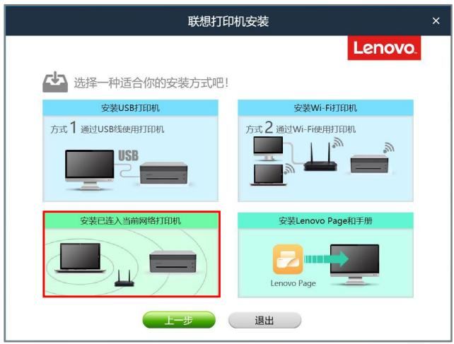

⑤自动检测电脑的网络连接状态。

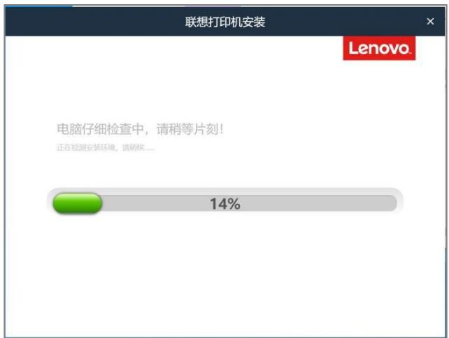

⑥选择在无线网络中搜索到的打印机。

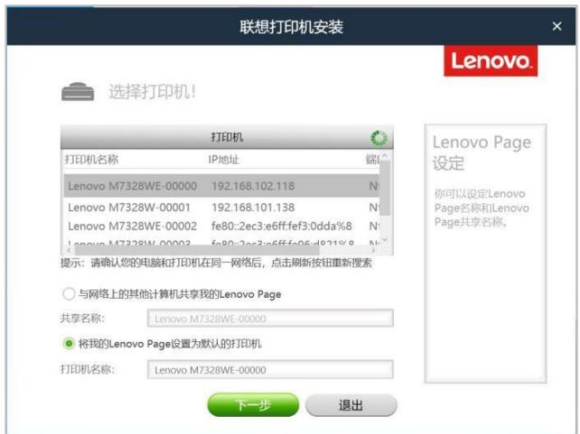

⑦自动进行驱动安装。

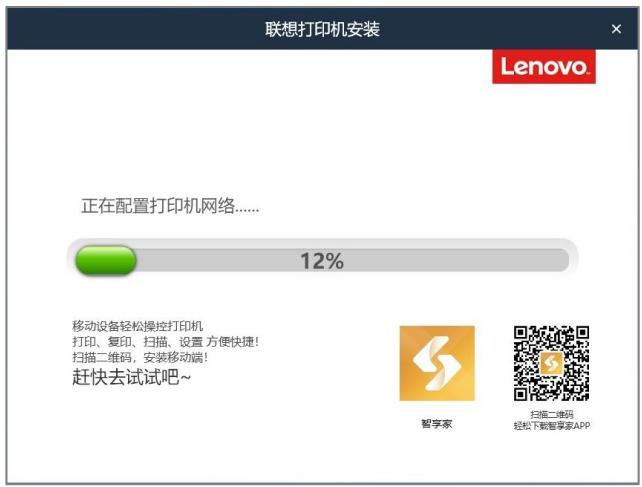

⑧当安装完成，可以点击【打印测试页】检测打印机驱动是否安装成功，也可以直接选择重启方式后点击【确定】直接退出驱动安装程序。

⑨无线驱动安装完成，您可以通过无线网络使用您的打印机了。

# Mac OS系统安装无线驱动程序

1）依照安装打印机驱动程序和打印软件指示完成安装，重启计算机。  
2）通过USB线连接计算机与打印机。  
3）在“打印机与扫描仪”中添加USB打印机。

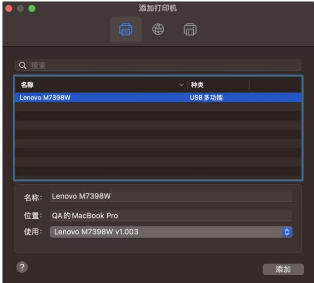

4）打开【Lenovo Page】软件，在“设定”中设置“Wi-Fi 安装”。

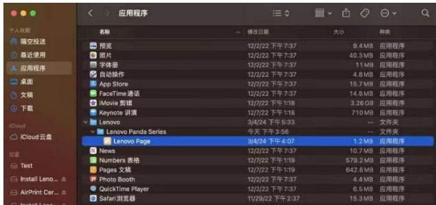

5）搜索Wi-Fi，选择要连接的网络，输入网络密码，点击"应用"后会弹出管理员登录窗口，输入管理员密码即可设置完成。管理员初始密码为：888888。

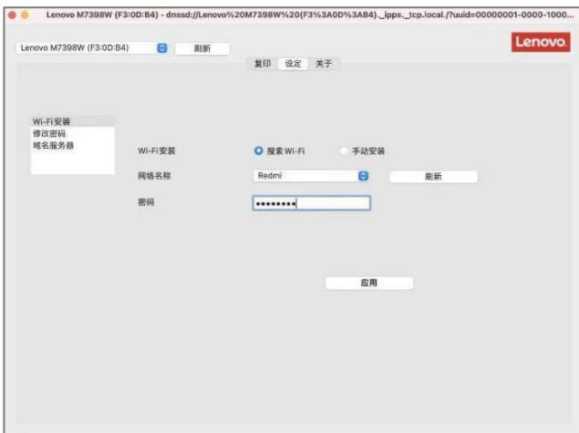

6）添加网络打印机

方法一：通过Bonjour添加网络打印机

a.单击“添加打印机或扫描仪…”。

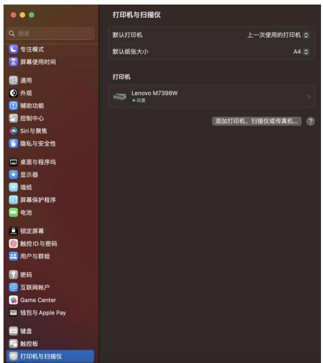

b. 选择要安装的打印机点击“添加”。

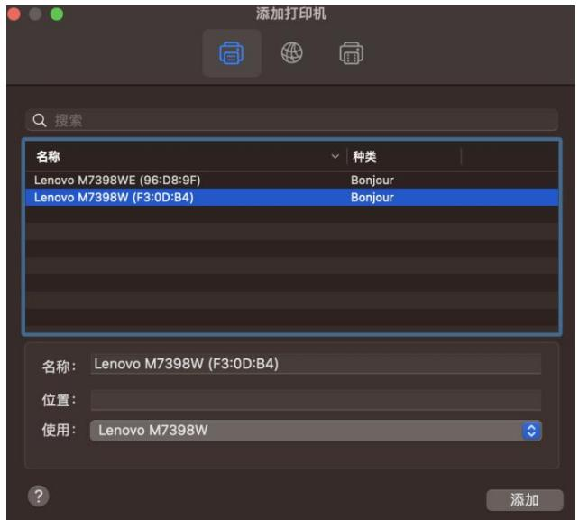

方法二：通过IP 地址添加网络打印机。

a.在“打印机与扫描仪”中选择“添加打印机或扫描仪...”在【IP】地址栏中输入地址。

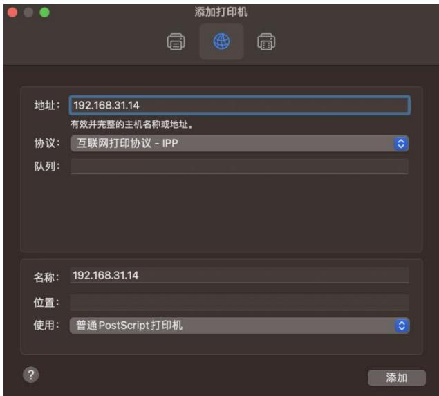

# ！ 提示

在打印机就绪状态下1秒内连续按3次电源键 可打印出配置页，配置页包含 IP 地址等信息。

b. 在“使用”栏选择“选择软件”。

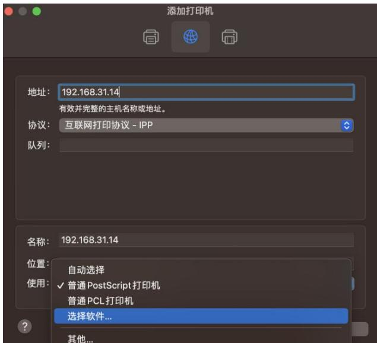

c. 根据您的机型，在弹出的“打印机软件”窗口中搜索您的打印机型号，例如：7398，列表出现已安装的打印机驱动，选择要安装的打印机，单击“好”。

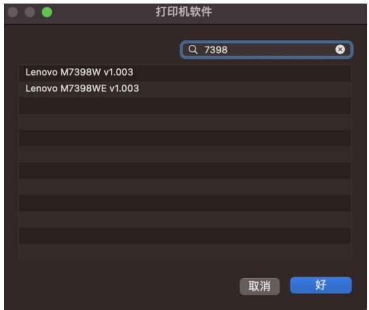

d. 单击“添加”，网络打印机添加完成。

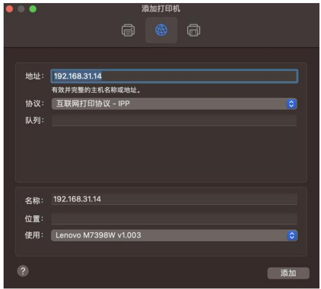

e. 安装完成后列表显示已安装的打印机。

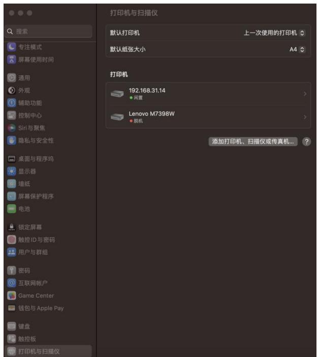

# 更多设备连接

# 配网后，通过智享家App 分享设备

打开管理员手机（为打印机配网的设备）中的智享家 App，点击“我的”>>“设备分享”下选择要共享的打印机设备，按照界面指引完成操作。

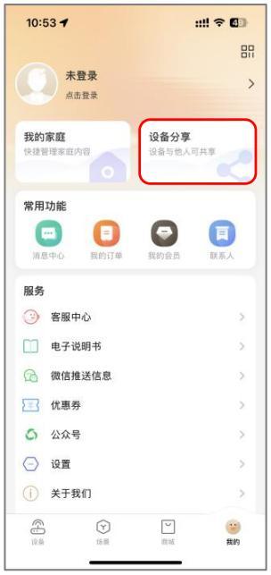

# 打印

# 打印手机中的文件

打印机支持多种方式打印手机/平板中的文件，您可以根据您的使用场景，任选一种方式完成打印。

<table><tr><td>设备</td><td>方式</td><td>适用场景</td></tr><tr><td rowspan="5">手机/平板</td><td rowspan="2">通过智享家 App 打印</td><td>支持 Android/iOS 手机、平板。</td></tr><tr><td>此方式支持远程打印手机/平板中的文件。</td></tr><tr><td rowspan="2">局域网打印</td><td>支持 Android/iOS 手机、平板。</td></tr><tr><td>打印机通过电脑配网,手机/平板与打印机连接同一个路由器Wi-Fi 时,可使用此方式打印手机/平板文件。</td></tr><tr><td>远程打印</td><td>支持 Android/iOS 手机、平板。</td></tr></table>

# 1）通过智享家App打印

①手机/平板通过智享家App 连接了打印机后，打开 App，在首页点击打印机卡片。

②文档打印：点击打印，选择文档打印，在打印预览界面，按界面提示设置好相关参数后，点击开始打印。

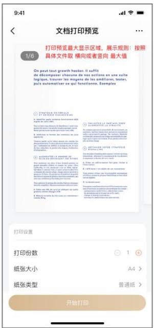

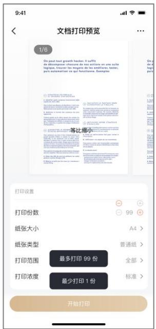

※打印文档相关参数如下（打印机不同插件版本，打印参数可能略有不同，请以实际界面为准）：

份数：默认打印 1 份，按后面的 +/- 符号可以增减份数。  
. 纸张尺寸：默认为 A4纸，有 A4、A5、A6 等选项，请根据纸盒中的纸张尺寸进行选择。  
纸张类型：默认为普通纸，有普通纸 、再生纸 、选项，请根据纸盒中的纸张类型进行选择。  
③打印图片：点击打印，选择图片打印，在打印预览界面，按界面提示设置好相关参数后，点击开始打印。

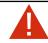

# 注意

打印机不同插件版本，打印参数可能略有不同，请以实际界面为准

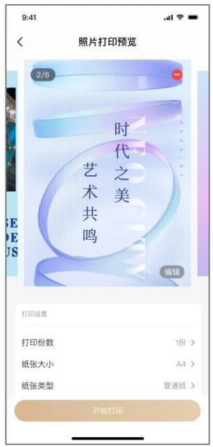

打印图片相关参数如下：

份数：默认打印1份，按后面的 +/- 符号可以增减份数。  
，纸张尺寸：默认为A4纸，有A4、A5、A6等选项，请根据纸盒中的纸张尺寸进行选择。  
纸张类型：默认为普通纸，有普通纸、再生纸选项，请根据纸盒中的纸张类型进行选择。

# 2）局域网打印

手机连接了和打印机相同的路由器 W-Fi，可通过局域网打印，快速打印手机中的文件。在手机中打开待打印文件，选择“分享”或“发送”，选择“打印”，在可用打印机列表中选择局域网中的联想打印机(名称为打印机宣传名，例如Lenovo xxxx，按界面设置好打印参数，开始打印。）

注意 不同品牌手机/平板打开打印的方式可能不同，若无法找到打印入口，请咨询手机供应商。

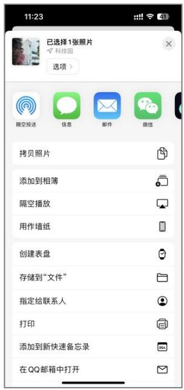

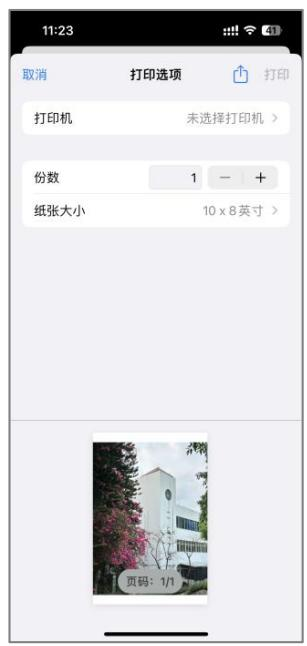

以ios手机为例:

打印图片：打开图库，点击 > 进入打印预览界面，点击选择打印机，在可用打印机列表中局域网中的联想打印机（例如 Lenovo xxxx），设置好打印参数后，点击开始打印。  
打印文档：在WPS 中打印待打印文件，点击分享 > 打印 > 联想打印，点击选择打印机，在可用打印机列表中局域网中的联想打印机（例如Lenovo xxx×），设置好打印参数。

# 3）远程打印

打印机不在身边，也可以通过智享家App，远程打印手机/平板中的文件，快捷方便。通过智享家App 远程打印手机/平板文件具体操作方式：

①打开智享家App，在首页点击打印机卡片。  
②点击打印，选择文档打印或图片打印，在打印预览界面，按界面提示设置好相关参数后，点击开始打印。

注意

远程打印时，复印、扫描选项置灰不可用。

# 打印电脑中的文件

# 打印机驱动程序打印

本章节介绍打印机驱动程序中的设置内容和步骤。

<table><tr><td>打印机驱动程序打印</td><td colspan="2">设置选项</td></tr><tr><td>Windows 中使用驱动程序</td><td>基本设置</td><td>● 纸张尺寸● 方向</td></tr></table>

打印

<table><tr><td rowspan="4"></td><td></td><td>● 份数● 纸张类型● 打印质量● 打印设置● 多页● 双面打印● 省墨模式</td></tr><tr><td>高级设置</td><td>● 缩放比例● 小册子打印● 使用水印● 页眉页脚打印● 浓度调整● 跳过空白页● 以黑白二色打印文本● 逆序打印</td></tr><tr><td>快捷设置</td><td>● 快捷设置● 删除配置文件● 添加快捷设置● 技术支持</td></tr><tr><td colspan="2">通过网络使用打印机</td></tr><tr><td>Mac 中使用驱动程序</td><td>基本设置</td><td>● 份数● 页数● 介质和质量● 布局● 纸张处理● 封面● 水印</td></tr></table>

# Windows中使用驱动程序

# 基本设置

下面的过程说明基于Windows 10操作系统环境中打印的步骤。

注意

打印文件的准确步骤可能随应用程序的不同而有所不同。

使用打印机驱动程序从计算机中打印文件。

1）打开您需要打印的文件。

2）在文件菜单中选择打印。  
3）点击【属性】。属性对话框允许您访问和改变打印机设置。

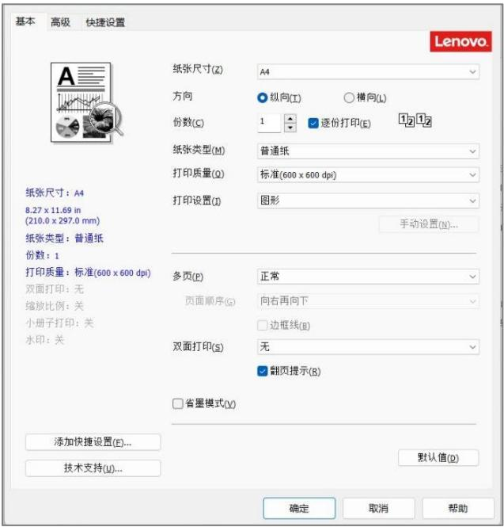

在图例左侧窗口确认您的当前设置。

点击【确定】您选择的设置。

若要恢复默认设置，请点击【默认值】，然后点击【确定】。

①纸张尺寸

从下拉列表中选择您正在使用的纸张的大小。

支持的纸张尺寸

A4，Letter，B5，A5 SEF/LEF，B6 SEF/LEF，A6，Executive，16K，自定义尺寸；

自定义尺寸支持如下纸张尺寸：

宽度：约 76.2-216(mm)

长度：约 116-355.6(mm)

<table><tr><td rowspan="2">提示</td><td>关于纸张尺寸详情,请参见 &gt;&gt; 支持的纸张尺寸(P27)。</td></tr><tr><td>您选择的纸张尺寸最好与您正在使用的纸张尺寸一致。</td></tr></table>

②方向

可以选择文档打印的方向：纵向（垂直）或横向（水平）。

<table><tr><td>纵向(垂直)</td><td>横向(水平)</td></tr><tr><td></td><td></td></tr></table>

③份数

份数选项可以设置将要打印的份数。

 选中逐份打印复选框时，将打印出一份完整的副本，然后重复整份打印，直至打印完 您所选择的份数。   
未选中逐份打印复选框时，打印机将根据设定份数对每一页重复打印。

<table><tr><td>选中逐份打印复选框时</td><td>未选中逐份打印复选框时</td></tr><tr><td>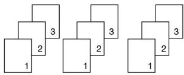</td><td>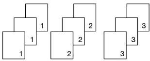</td></tr></table>

④纸张类型

本设备支持下列纸张类型。选择您想使用的纸张类型，以便获取最佳的打印质量。

普通纸  
再生纸  
 厚纸   
 薄纸   
标签

⑤打印质量

您可以选择以下打印质量：

标准（600×600dpi）  
精细（1200×600dpi）

⑥打印设置

您可以将打印设置更改为：

图形：图形文档的最佳打印模式。  
文本：文本文档的最佳打印模式。

手动：您可以通过选择手动并点击【手动设置】按钮手动更改设置亮度和对比度。

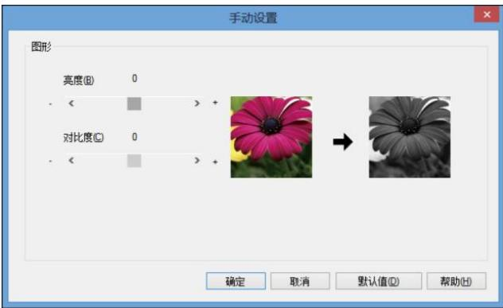

⑦多页

多页选项可以缩小图像尺寸，将多个页面打印在同一张纸上，可以放大图像尺寸，将一个页面打印在多张纸上。

页面顺序

选择每页N版选项时，可以在下拉列表中选择页面的顺序。

<table><tr><td rowspan="3">注意</td><td>选择每页N版选项时,高级功能中的缩放功能不可用。</td></tr><tr><td>选择N×N页1版选项时,双面打印功能不可用。</td></tr><tr><td>部分功能不可用时,会有对应警告信息对话框弹出。</td></tr></table>

边框线

使用多页功能将多个页面打印在同一张纸上时，您可以选择为纸张添加实线边框和无边框。

打印裁切线

选择N×N页1 版选项时，可以选择打印裁切线选项。使用此选项可以为打印区域添加细裁切线。

⑧手动双面打印

如果您想进行双面打印，请使用此选项。

a.双面打印选项框中选择长边翻页或短边翻页。  
b.开启双面打印功能后，弹出一个对话框告诉您如何操作。

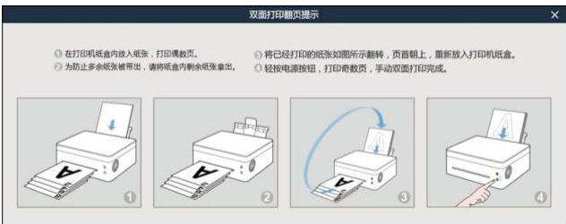

c.第一面打印完成后，需要您手动将纸张按照上述对话框提示装回进纸盘以打印第二面。  
d.装回纸张后，按一下正在闪烁红灯的 电源键。  
e.打印机继续打印第二面。

# 注意

标签纸不支持双面打印功能。

打印顺序：无、长边翻页、短边翻页。

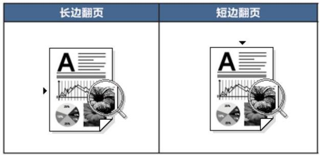

当在高级选项卡中逆序打印选项框勾选中时：

先是打印偶数页（…8,6,4,2），之后打印奇数页（…7,5,3,1）。

当在高级选项卡中逆序打印选项框没有勾选时：

先是打印偶数页（2,4,6,8…），之后打印奇数页（1,3,5,7…）。

# 提示

如果打印页数总数为奇数，最后会出现一张空白页。

⑨省墨模式

使用省墨模式可以减少墨粉消耗。  
 使用省墨模式可以得到正常密度的打印质量，但是打印输出效果较浅。  
省墨模式默认为关。  
省墨模式不影响打印速度和内存使用。

# 高级设置

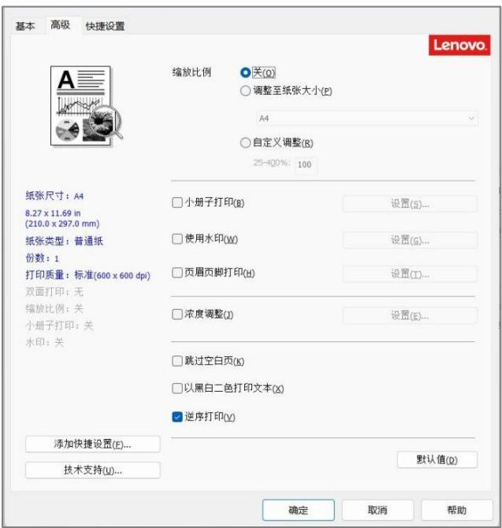

①缩放比例

您可以更改打印图像的比例。

 关   
调整至纸张尺寸   
自定义调整【25%-400%】

<table><tr><td rowspan="2">注意</td><td>当开启调整至纸张尺寸或任意缩放选项时,多页功能或小册子打印功能不可用。</td></tr><tr><td>此时会有警告信息对话框弹出。</td></tr></table>

②小册子打印

使用双面打印功能制作小册子时，请使用此选项。它会按照正确的页码排列文档，您无需排列页码顺序，只要对折打印的页面即可。

您可以在小册子打印设置对话框中进行以下设置：

装订制作设定：左侧装订、右侧装订；  
小册子打印方式：整册装订、分册装订。

分册装订：使用此选项可以将整本小册子打印成较小的单个小册子集，也无需排列页码顺序，只要对折已打印的小册子集即可。您可以从1到15指定各个小册子集的页数。对打印页数较多的小册子，此选项非常有用。

装订偏移量：如果您选中装订偏移量，您可以指定以毫米或英寸为单位的装订偏移量。

<table><tr><td rowspan="2">注意</td><td>当您选择小册子打印时,弹出警告对话框显示双面打印中长边翻页打开。</td></tr><tr><td>当您选择小册子打印时,多页功能或页眉页脚打印中的页数功能不可用。</td></tr></table>

③使用水印

您可以将标识或文本作为水印打印到文档中。您可以选择预设的水印或使用自己创建的文本/图片文件。请选中使用水印复选框，然后点击【设置】按钮。

<table><tr><td rowspan="2">注意</td><td>水印功能开启时,多页功能中的“N×N 页1版”功能不可用。</td></tr><tr><td>内置水印无法编辑与删除。</td></tr></table>

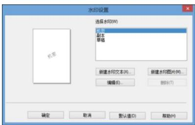

④页眉页脚打印

启动此功能后，您可以在文档上打印页眉和页脚信息。请选中页眉页脚打印复选框，然后点击【设置】按钮进行设置。

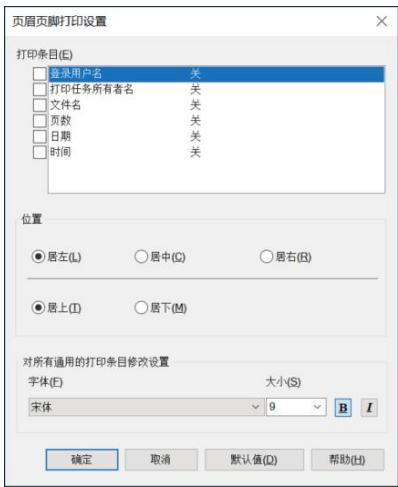

# ⑤浓度调整

调整打印浓度值选中浓度调整复选框，然后点击【设置】按钮进行设置。

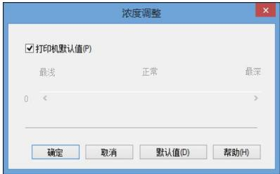

# ⑥跳过空白页

如果选中跳过空白页，打印机驱动程序会自动检测空白页并且不打印空白页。

# 注意

当您选择以下选项时，此选项不可用：

使用水印  
页眉页脚打印   
多页打印   
双面打印   
小册子打印

# ⑦以黑白二色打印文本

此功能指定始终以黑白二色打印所有文本。

# 注意

可能不兼容某些字符。

# ⑧逆序打印

选中逆序打印复选框，所有打印页逆序。

# 快捷设置

快捷设置是可编辑的预设值，可使您快速访问常用打印配置。

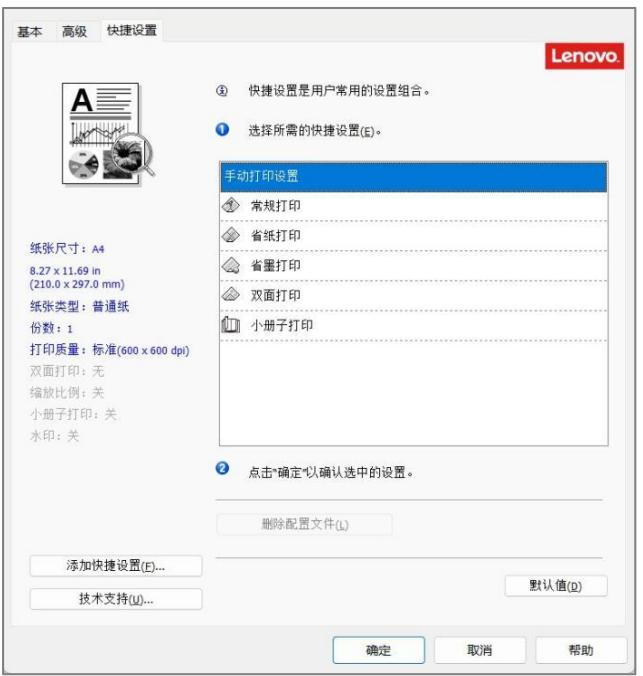

①手动打印设置

从快捷设置框中选择所需的快捷设置（常规打印、省纸打印、省墨打印、双面打印、小册子打印），点击【确定】应用您选择的快捷设置。

②添加快捷设置

点击【添加快捷设置】可打开添加快捷设置对话框。

a.在名称中输入所需标题。  
b.从图标列表中选择您想使用的图标，然后点击【确定】。  
c.显示在打印机驱动程序窗口左侧的当前设置将会被保存。

③删除快捷设置

可删除任何已添加的快捷设置，但内置快捷设置不能被删除。

a.在【选择所需的快捷设置】中选择想要删除的快捷设置。  
b.点击删除配置文件。  
c.点击确定。  
d.所选快捷设置将被删除。

④技术支持

访问官网获取更多的信息和技术支持：https://www.lenovoimage.com/，为您提供产品及耗材的相关信息，行业解决方案及服务支持。

通过网络使用打印机

<table><tr><td rowspan="2">提示</td><td>确认您已经安装网络驱动程序。</td></tr><tr><td>打印文件的准确步骤可能随应用程序的不用而有所不同,关于准确的打印步骤,请参照</td></tr></table>

您的应用软件。

使用打印机驱动程序从计算机中打印文件。

下面的过程说明基于 Windows 10 操作系统 Acrobat Reader DC 环境中打印的步骤。

1）请确认您的打印机已经开启 Wi-Fi 并且您的个人电子设备与打印机置于同一无线网络。  
2）打开您需要打印的文件。  
3）在文件菜单中选择打印。  
4）确认您的打印机被选择。  
5）点击【属性】按钮，可以设置打印参数，包括打印份数、纸张尺寸和页面方向等。  
6）设置好打印参数，点击【打印】，启动打印。

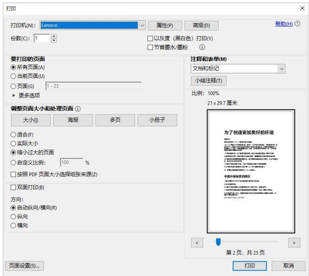

# Mac系统中使用驱动程序

# 基本设置

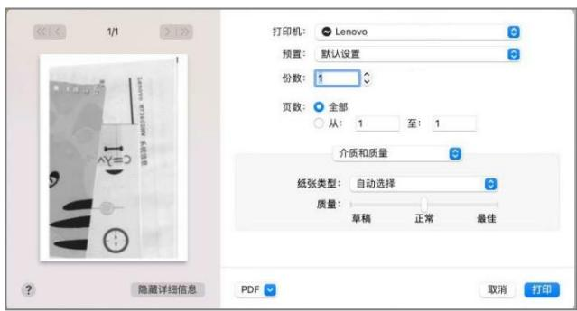

1）打开您要打印的文件。  
2）从系统弹出的基本设置界面，选择指定打印机进行打印。  
3）设置份数、页数、介质和质量、布局、纸张处理、封面和水印等打印参数。  
4）完成参数设置，单击【打印】。

！ 提示

系统内置功能的变化取决于您安装的 OS X 版本。

# ①份数

份数选项可以设置将要打印的份数，默认份数为“1”。

# ②页数

页数选项可以设置将要打印的文件，全部页数或指定页数进行打印。

③其他设置：可以在此选项中选择介质和质量、布局、纸张处理、封面和水印等设置。

# ④手动双面打印

如果您想进行双面打印，请使用此选项。

1）用户使用手动双面打印选项设置打印一份文件。  
2）第一面打印偶数页（...8,6,4,2）。  
3）第一面打印完成后，取出剩余白纸，将已打印纸张翻转，且页眉朝上，再次放入打印机。  
4）放回纸张后，按一下正在闪烁红灯的 G 电源键。  
5）打印机继续打印第二面。

# 提示

标签纸不支持双面打印功能。

电脑端【Lenovo page】软件打印

1）点击桌面的图标 开启 LenovoPage。软件开启后首先会显示软件首页面，并在后台自动搜索打印机。

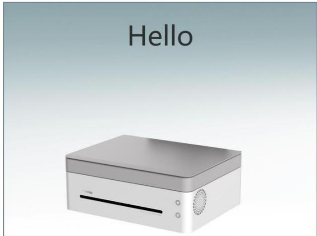

2）在首次开启 Windows 版“Lenovo Page”时，会弹出“用户体验改善计划”界面。为了帮助我们为您提供更好的服务，我们希望您能参加“用户体验改善计划”，并同意我们收集打印机的使用数据。

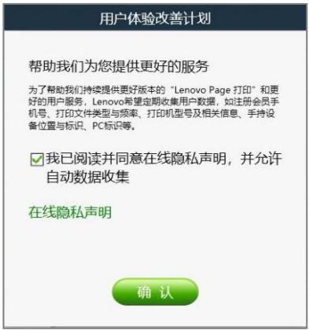

3）如果您在后续使用过程中需要对您的选择做出修改，可以在会员中心的“用户体验改善计划”选项中进行修改。

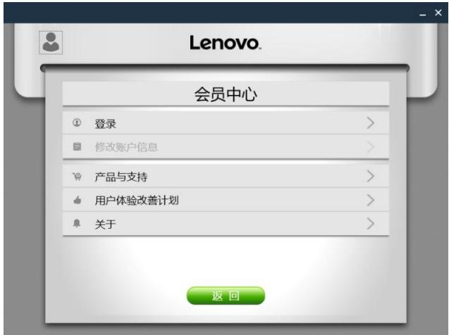

4）软件开启时首先是搜索打印机，将搜索到的打印机放入列表；检查列表中第一个打印机是否在线，如果检测在线则根据机型显示功能页面，首页面为打印的文件选择页面。

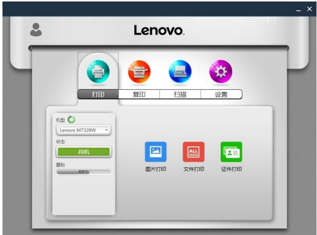

5）如果检测不到打印机在线，将会显示提示页面，请按照提示排除网络故障后重新搜索打印机。

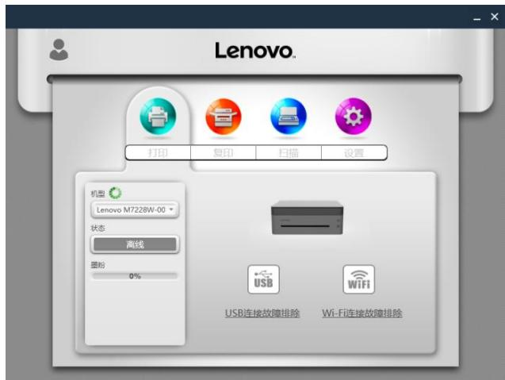  
图片打印

1）在打印的文件选择页面中点击“图片打印”选项后进入图片选择页面。

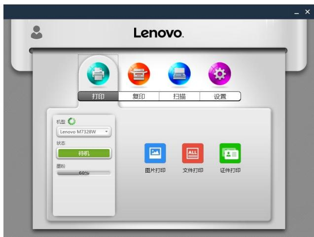

2）在图片选择页面中可以选择单张或多张图片进行打印，图片打印支持 TIFF、BMP、PNG 和 JPEG 格式的图片。  
3）在该界面可以直接点击“打印”按钮直接进行打印，也可以修改参数后再点击“打印”按钮进行打印。

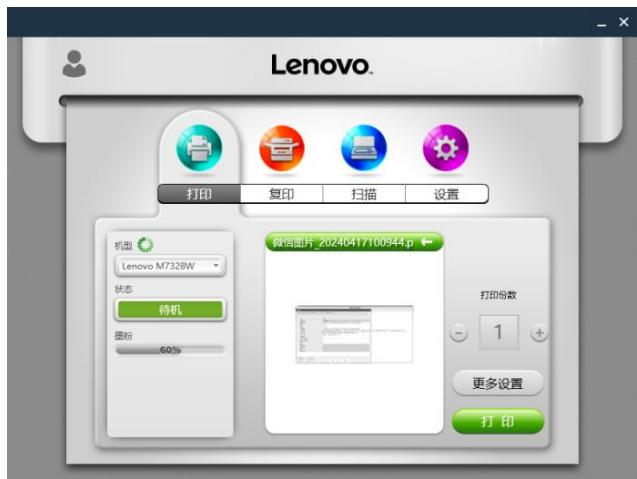  
文件打印

1）在打印的文件选择页面中点击“文件打印”选项后进入文件选择页面。

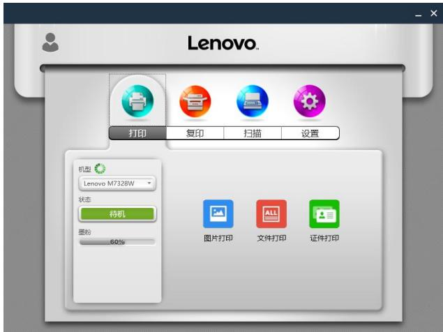

2）在文件选择页面中可以选择需要打印的文件进行打印，如果选中的文件在 Windows系统不支持打印，将会提示用户该文件不支持打印；  
3）选好文件点击“打开”按钮后跳转到打印功能页面，在该画面进行打印参数设置后点击“打印”按钮即可打印；如果选中的文件无法进行预览，将会在预览窗口提示用户。

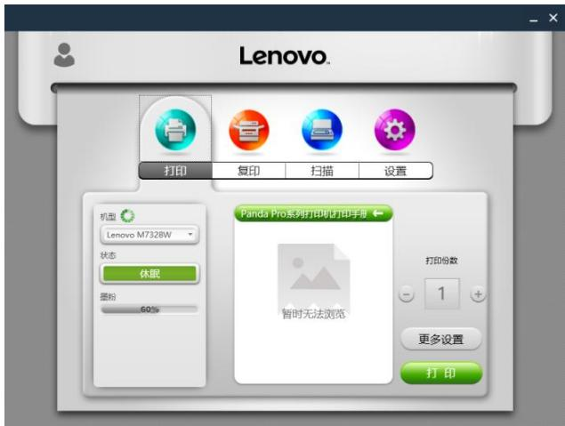

# 证件打印

在打印的文件选择页面中点击“证件打印”选项后可以进行证件打印选择，包括身份证、户口本、结婚证、护照、房产证、驾照、毕业证、学生证、出生证明、银行卡、社保卡的打印；所选择的图片格式为：BMP、PNG、TIFF和JPEG 格式。

1）身份证：选择证件打印→选择证件类型→选择图片→图片有效区域选择→点击确定→选择图片→图片有效区域选择→点击确定→图像处理到一张A4纸→跳转到打印功能页面  
2）其它证件：选择证件打印→选择证件类型→选择图片→图片有效区域选择→点击确定→图像处理到一张A4纸→跳转到打印功能页面

# 手动双面打印

当需要打印的文件页数多于 2 页时，可设置手动双面打印。

1）选择打印内容后，在打印功能页面中，点击“更多设置”按钮；  
2）更多设置页面中选中“手动双面打印”选项，并选择双面打印类型，点击“确定”按钮；

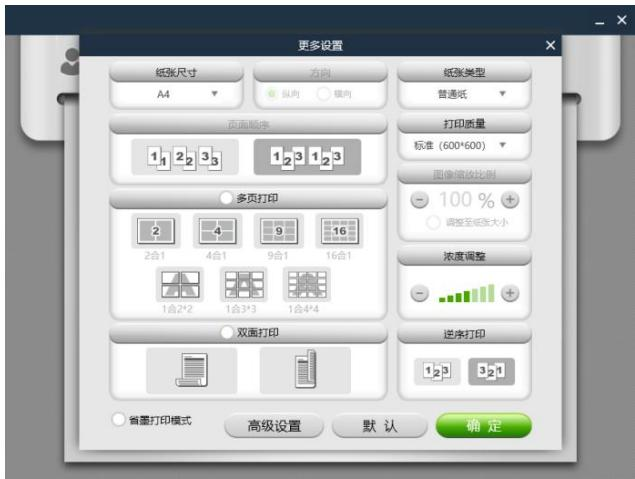

3）在打印功能页面中点“打印”按钮，双面打印提示将会自动提示，然后开始打印偶数页；

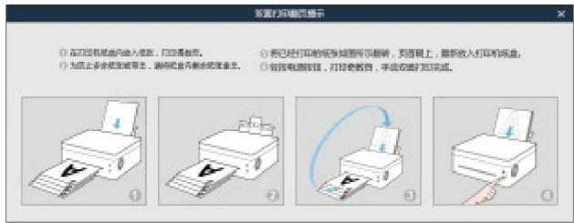

4）偶数页打印完毕后按照提示首先移除纸盒内剩余的纸，然后对打印页面进行翻页，按下打印机电源按钮进行奇数页打印；

5）手动双面打印完成。

# 取消打印

如果您需要取消打印作业，根据打印状态不同操作不同。

# 打印开始前取消打印作业

1）在计算机任务栏上双击打印机图标，出现任务框。

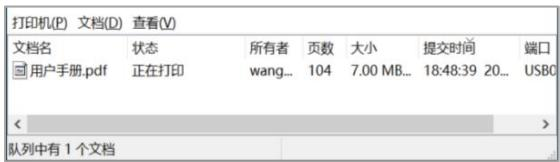

2）选中【打印任务】，之后点击右键，然后单击【取消】。

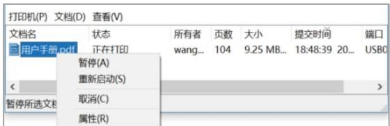

3）点击【是】，打印任务取消。

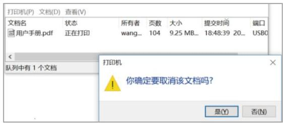

# 打印进行中取消打印作业

按电源键 1 秒以上，电源键 红灯和 绿灯每 0.5 秒交替闪烁，显示取消当前任务。

<table><tr><td rowspan="2">注意</td><td>如果取消的打印作业已经在处理中,则会继续打印几页后才会取消。</td></tr><tr><td>取消多页打印作业可能需要一段时间。</td></tr></table>

# 复印

# 机身按键复印

# 单次复印

1）将您要复印的文件或证件放置于扫描仪玻璃板上，需要复印的面朝下。  
2）就绪状态下，按 开始键一下，复印一张。  
3）电源键 G 由绿灯长亮变成绿灯亮1 秒灭1 秒，状态为复印中/连续复印中。

<table><tr><td>提示</td><td>如果打印机处于休眠状态,请先按任意键唤醒打印机,电源键由不亮变成绿灯慢闪,之后使用打印机进行复印任务。</td></tr></table>

# 连续复印

1）将您要复印的文件或证件放置于扫描仪玻璃板上。  
2）就绪状态下，长按 开始键 3秒以上，连续复印5张。  
3）开始键 由绿灯长亮变成绿灯亮1 秒灭1 秒，状态为复印中/连续复印中。

<table><tr><td>提示</td><td>如果打印机处于休眠状态,请先按任意键唤醒打印机,电源键由不亮变成绿灯慢闪,之后使用打印机进行复印任务。</td></tr></table>

# 身份证双面复印

您可以通过使用打印机上按键将身份证的两面复印到纸张的一面上。

1）将身份证的正面朝下，放置于扫描仪玻璃板左半边最佳复印区域内效果更佳。

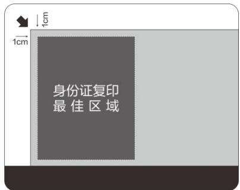

2）就绪状态下，同按住 开始键和 电源键后释放按键。  
3）开始键由绿灯 长亮变成电源键 绿灯长亮，进入身份证双面复印模式。

# ！ 提示

如果在 1 分钟内，您没有任何操作动作，打印机将会退出此模式，回到就绪状态。

4）进入身份证双面复印模式后，点击 开始键，开始扫描证件的第一面。  
5）开始键 绿灯长亮电源键 绿灯闪烁，状态为扫描中。   
6）开始键 绿灯和电源键 绿灯同时闪烁，此时为等待扫描证件第二面。  
7）请将证件翻面，放置位置不变，按 开始键一下，进入第二面扫描模式。  
8）打印机会自动打印出您要复印的证件，证件的正反面在同一张纸的一面上。

# ！ 提示

证件复印完后，证件复印功能将会保持 1 分钟，您可以继续进行下一张身份证双面复印，如果 1 分钟内，没有任何操作动作，打印机将会退出身份证双面复印功能，回到就绪状态。

您也可以手动取消身份证双面复印功能，长按 电源键 1 秒以上。

开始键 由不亮变成电源键 红灯和 绿灯每0.5秒交替闪烁即取消当前任务。

如果打印机处于休眠状态，开始键 由不亮变成电源键 绿灯亮 1 秒灭 3 秒，按任意键一下唤醒打印机，之后使用打印机进行任务。

# 智享家App 复印

手机/平板与打印机连接后，您可以通过手机/平板中的智享家App，进行单面复印。

# A 注意

复印操作前，需将手机/平板连接和打印机相同的路由器 ${ \mathsf { W i - F i } } _ { \circ }$

1）打开扫描盖板，将原稿正面朝下，按左后角对齐原则，放入扫描区并盖上盖板。  
2）在智享家 App 中打开打印机设备页面，点击复印。在复印参数设置界面，设置好复印参数后，点击开始复印。

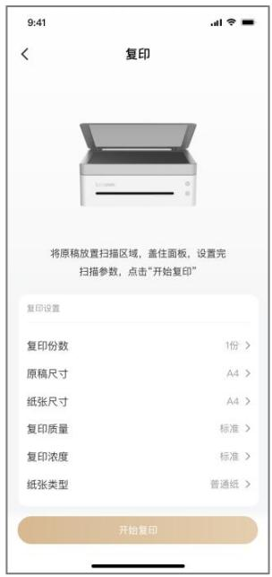

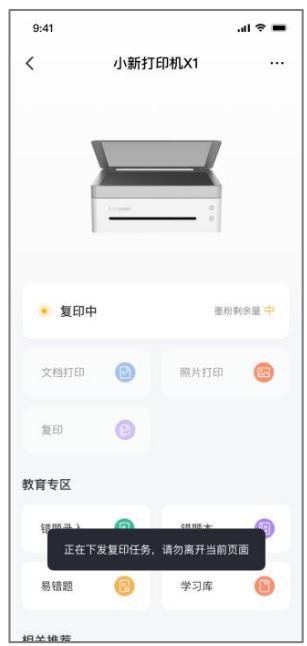

复印相关参数如下（打印机不同插件版本，复印参数可能略有不同，请以实际界面为准）：

份数：默认复印1份，按后面的 +/- 符号可以增减份数。  
单双面：默认单面复印。  
复印浓度：默认为标准，您可以设置为浅灰、标准、深黑。  
复印质量：默认为标准，您可以设置为标准、最佳。  
原稿尺寸：默认为A4，有A4、A5、B5 等选项，请根据原稿的实际尺寸进行选择。  
纸张尺寸：默认为A4，有A4、A5、B5等选项，请根据纸盒中纸张的实际尺寸进行选择。  
纸张类型：默认为普通纸，您可以根据纸盒中实际纸张类型，选择普通纸、再生纸等。  
每张复印页数：默认每张纸复印 1页。

# 电脑端【Lenovo page】软件复印

# 1）普通复印

在复印功能页面中设置好复印参数后点击“复印”按钮即可。

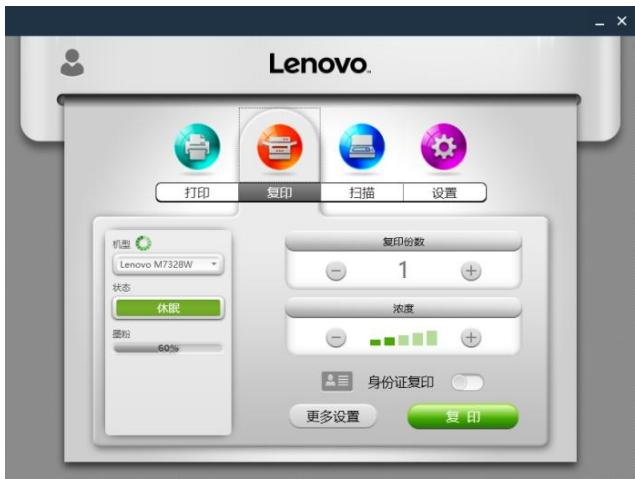

# 2）身份证复印

如果需要将身份证正反面复印到同一张A4纸上，可按照以下步骤进行操作：

①在复印功能页面中打开身份证复印开关，然后点“身份证复印”按钮；

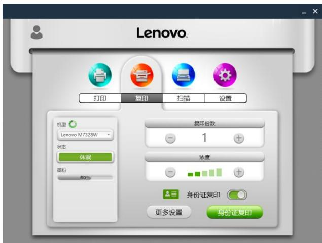

②按照弹出的动画提示放置身份证正面，然后点“确定”按钮；

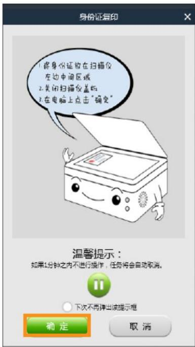

③当复印完身份证正面后，打印机上 2 个绿色指示灯闪烁，请在 1 分钟之内将复印件反面放置原位置并按打印机的开始键 ? 按钮；  
④身份证复印完成。

# 3）N合1复印

如果需要将多张原稿复印到一张纸上，可按照以下步骤进行操作：

①在复印功能页面中点“更多设置”按钮，在更多设置页面中设置 N 合 1 复印，点“确定”按钮；

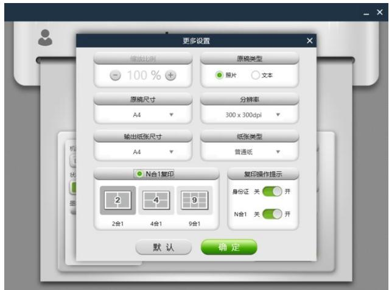

②点击功能页面中的“复印”按钮，按照弹出的动画提示放置第一页原稿，然后点击“确定”按钮；

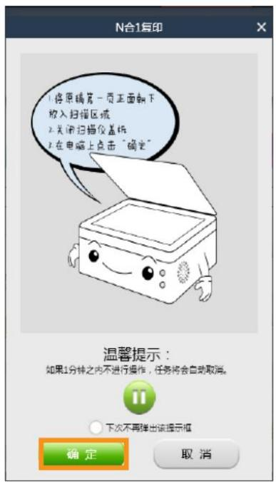

③当第一页原稿复印后，打印机上2 个绿色指示灯闪烁，请在1 分钟之内按照弹出的动画提示放置后面的原稿，按打印机的开始键 按钮；循环本步骤，直至打印机吐纸；

④N 合1 复印完成。

# 取消复印

1）按 G 电源键 1 秒以上取消当前的所有作业。  
2）开始键 由不亮变成电源键红灯 和绿灯 每 0.5秒交替闪烁，显示取消当前任务。

<table><tr><td rowspan="2">注意</td><td>如果机器正在扫描原稿时取消复印,则复印会立即取消且没有打印输出复件。</td></tr><tr><td>如果在打印过程中取消复印,则系统将在打印输出当前页面之后取消复印过程。</td></tr></table>

# 扫描

# 将原稿扫描至手机/平板中

# 智享家App扫描

手机/平板与打印机连接后，您可以通过手机/平板中的智享家App，将原稿扫描至手机/平板中。

A注意 手机/平板需连接和打印机相同的路由器 Wi-Fi。

1）打开扫描盖板，将原文稿正面朝下，按左后角对齐原则，放入扫描区并盖上盖板。  
2）打开智享家App，在首页点击打印机卡片。  
3）点击扫描，设置好扫描参数后，点击开始扫描。

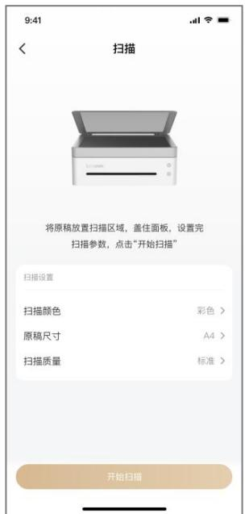

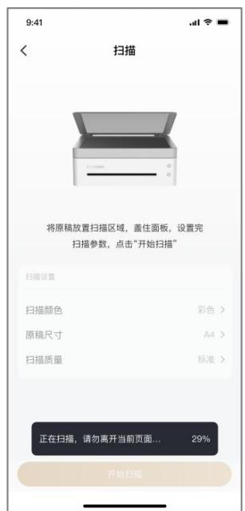

扫描相关参数如下（打印机不同插件版本，扫描参数可能略有不同，请以实际界面为准）：

扫描颜色：默认为彩色，您可以设置为彩色 、黑白 、灰度。

# 扫描质量：

最佳：扫描分辨率为1200dpi。当待扫描原稿内容较多时，建议选择此选项，但此选项 扫描时间较长。

标准：扫描分辨率为600dpi。扫描后的文件质量较好。

原稿尺寸：默认为 A4，有 A4、A5、B5 等选项，请根据原稿的实际尺寸进行选择。  
4）待出现扫描图片时，表示扫描完成。扫描的文件将以JPG 格式自动保存在手机/平板中。打开手机/平板图库，可以查看扫描后的单个JPG 文件。  
5）若有多个文稿需要同时扫描，点击继续扫描，更换原稿后，点击开始扫描。  
6）全部原稿扫描完成后，长按拖动可以调整扫描文件顺序。勾选已扫描的文件，选择另存为 PDF。  
7）选择保存文件路径。设置好扫描文件名称后，点击保存。  
8）在手机文件管理器中打开对应的保存路径，即可看到已保存的 PDF文件。

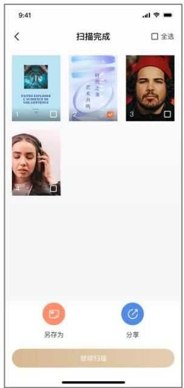

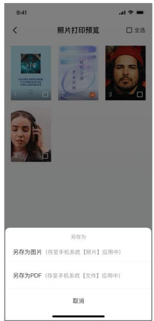

# 将原稿扫描至电脑（Windows/Mac）中

# 电脑端【Lenovo page】软件扫描

# 1）扫描

将需要扫描的物件放入打印机的扫描区域，按照以下流程进行操作：

①在扫描功能页面中设置好扫描参数后点击“扫描”按钮；

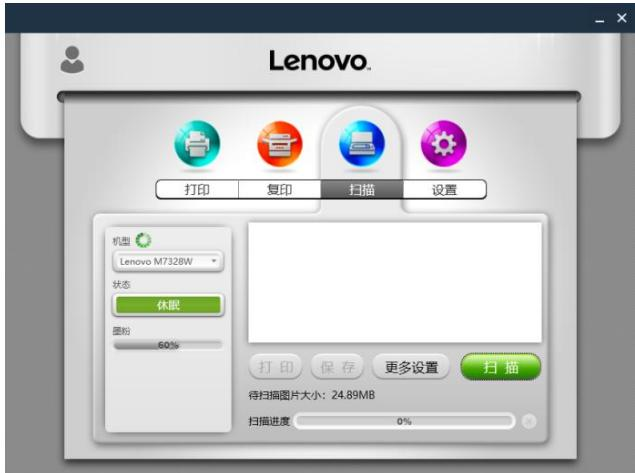

②扫描中提示进度；

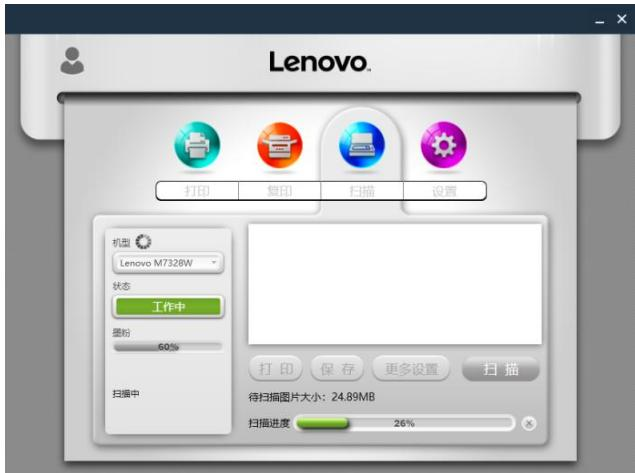

③扫描结束后可在功能页面中查看扫描结果；

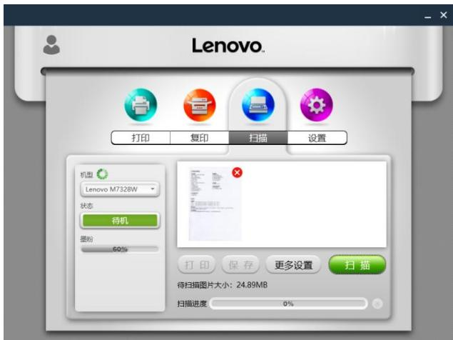

④双击图片，可以对扫描的图片进行浏览，旋转和打印；

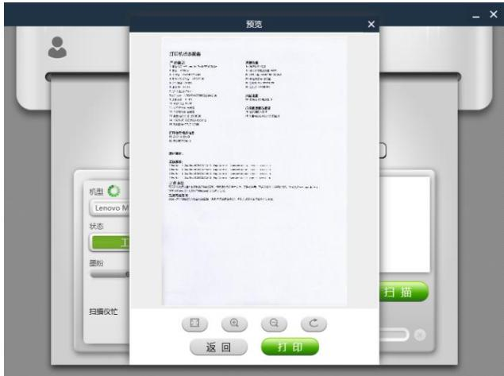

# 2）设置

在扫描前可以进行扫描参数设置。点击“更多设置”按钮，设置扫描选项，点击“确定”按钮；

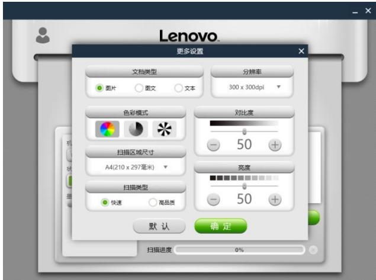

# 3）保存

点击“保存”按钮，保存所选扫描图像；如果是 1 幅图片被选择，则保存的类型可以设置为 JPG、TIF、PDF；如果选择图片大于 1 幅，则保存的类型可以设置为 TIF、PDF，保存顺序按照图片右上角的序号来保存；

# 4）打印

点击“打印”按钮，跳转到打印功能页面；如果没有任何一张图片被选中，该按钮不可选择；

# 取消扫描

按住电源键 1 秒以上，至电源键红灯 和绿灯 交替闪烁，然后释放按键。

# 更多操作

# 更换鼓粉盒组件

# 1）打开机器上盖。

# 2）握住鼓粉组件拉手，向上拉出。

# 注意

取出鼓粉盒时，注意高温烫手。

如果墨粉沾在您的衣服上，用干布擦，并用冷水洗，热水会使墨粉渗进到纤维中。

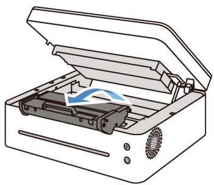

3）根据打印机的提示，更换相应的墨粉盒或感光鼓。  
4）安装前请水平轻轻摇晃鼓粉盒五、六次，以使墨粉分布均匀。

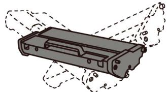

5）将鼓粉组件放到打印机内，确保鼓粉组件卡到位，并关上机器上盖。

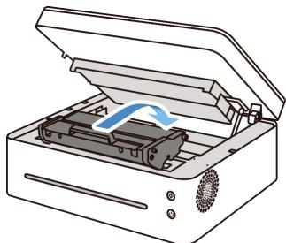

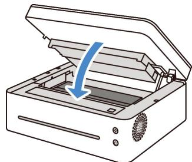

6）通过打印机按键或软件，复位墨粉盒或感光鼓。

<table><tr><td>复位感光鼓</td><td>打印机电源键红灯 ⏻慢速闪烁提示感光鼓寿命不足时,打开上盖,更换新的感光鼓,然后在1.5秒内按下电源键 ⏻5次,然后关闭上盖。⚠注意:此操作只能在更换新感光鼓后操作,否则会影响到感光鼓寿命的识别。</td></tr><tr><td>复位墨粉盒</td><td>打印机电源键红灯 ⏻慢速闪烁提示墨粉不足时,打开上盖,更换新的墨粉盒,然后在1.5秒内按下电源键 ⏻2次,然后关闭上盖。⚠注意:此操作只能在更换新感光鼓后操作,否则会影响到感光鼓寿命的识别。</td></tr></table>

# 恢复出厂设置

先将打印机关机，然后打开上盖，按住电源键 10 秒以上，电源键指示灯 橙灯亮(红灯绿灯同时亮）后释放按钮。

# 重置网络

按任意键唤醒打印机，长按 开始键 6 秒以上，至电源键蓝灯 绿灯 红灯

交替闪烁，释放按键。

# 打印机固件升级

# 手动固件升级

# 注意

整个过程约 5分钟，升级过程中请不要关闭打印机；升级完成后打印机会自动重启。

1）先解压固件升级包至电脑本地某位置，如 C 盘根目录。  
2）确认打印机 USB 线连接至电脑 USB插口，按电源键开机。  
3）双击固件升级主程序。

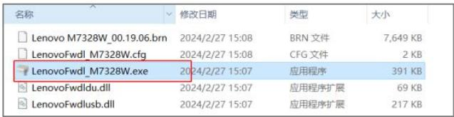

4）检查要升级版本，点击下一步。

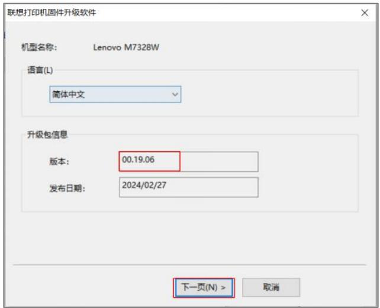

5）检查目标机型与当前版本，勾选后确认后，点击下一步。

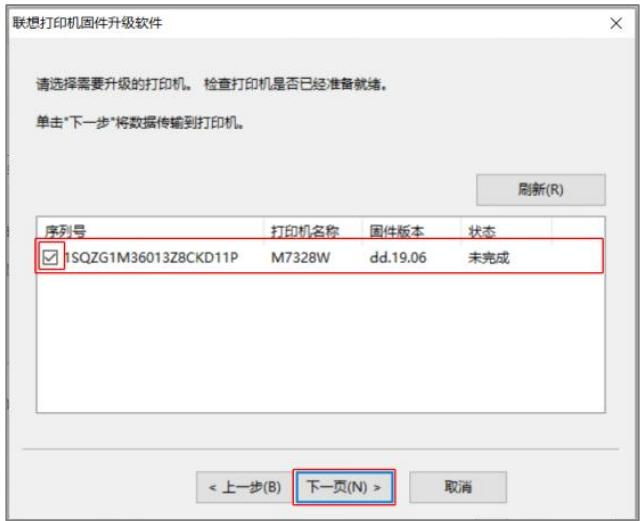

6）执行升级。

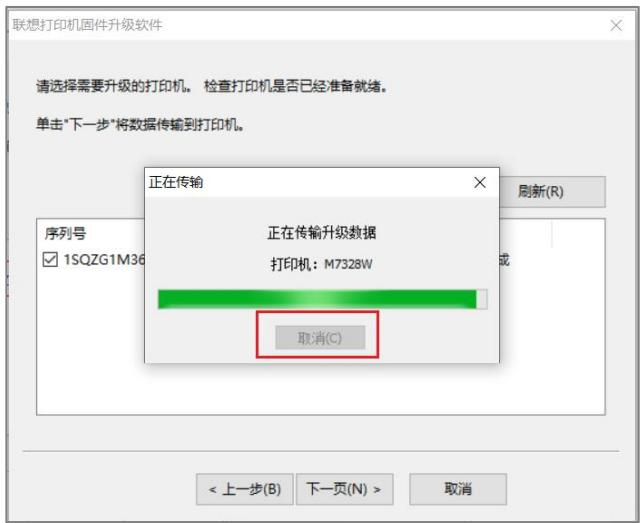

7）等待升级成功，确认版本无误后点击完成，关闭升级程序。

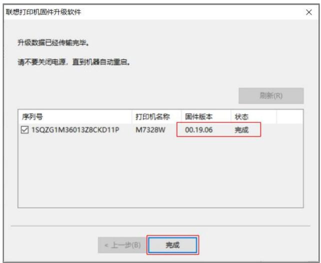

# App内的固件升级

设备首页,点击【固件升级】App 自动判断是否有新固件版本；如需更新，设备需在通电状态下等待5-10分钟（受用户网络环境影响），升级成功后设备会自动重启。

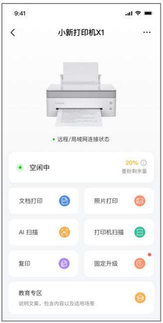

# 查看打印机基本信息

您可以通过打印配置页查看您的打印机的基本信息及参数，比如打印机的型号名、网络参数、打印机热点的名称和密码、墨粉余量、废墨粉和打印总页数。

打印配置页操作步骤：打印机就绪状态下，一秒钟内快速按 电源键 3 次，看到指示灯状态显示为电源键绿灯 亮一秒灭一秒，说明打印中，任务设置成功。

# 机器维护

# 维护感光鼓和墨粉盒

# 1）感光鼓和墨粉盒的储存

为了使感光鼓和墨粉盒发挥最大作用，请您牢记下列准则：

直到准备安装时，才将感光鼓或墨粉盒从它的包装中拿出来。  
不建议再次灌装墨粉盒，对打印机的保证不包括由于使用再次灌装墨粉盒而引起的损坏。  
不建议使用非原装正品的感光鼓，对打印机的保证不包括由于使用非本机官方配套的感光鼓而引起的损坏。  
）将感光鼓和墨粉盒储存在于打印机相同的环境中。应将感光鼓和墨粉盒存放于阴凉处。  
为了防止损坏感光鼓，不要将它暴露在光线下长达数分钟。

# 2）感光鼓和墨粉盒的寿命

感光鼓和墨粉盒的寿命取决于打印任务需要使用量。以打印“ISO/IEC19752”测试页进行

计算，墨粉盒的寿命平均为 1000 页，感光鼓的寿命平均为10000页。

如果使用纸张不是推荐纸张，则感光鼓、墨粉盒和设备零件的寿命会因此而缩短。

感光鼓和墨粉盒的更换频率因打印页面、打印覆盖率和使用纸张类型的不同而有所不同。

# 3）感光鼓和墨粉盒的回收

请根据当地法规处理使用过的感光鼓和墨粉盒，并将其与生活垃圾分开。

如果您有任何问题，请致电当地的废品处理站。务必重新密封感光鼓和墨粉盒以防内部墨粉溅出。

我们建议您将使用过的感光鼓和墨粉盒放在干净的纸上，以防止墨粉意外溅出或散落。

# 4）省墨

打印机的属性设置中启用省墨模式。选择此选项，可延长墨粉盒使用寿命，降低打印每页的成本，但是也降低了打印质量。

<table><tr><td>提示</td><td>如果机器墨粉不足和感光鼓使用寿命快结束时,按键指示灯会显示开始键 ⏻ 不亮变为电源键 ⏻ 红灯慢闪。</td></tr></table>

如果打印的图像突然变浅或模糊，则请根据【Lenovo Page】软件提示更换感光鼓或墨粉盒。

实际可打印的数量因图像数量和浓度、一次打印的页数、纸张类型和尺寸以及环境条件（如温度和湿度）而异。墨粉质量会随时间下降。

为了获得良好的打印质量建议您使用原装正品感光鼓和墨粉盒。

对因在办公产品上使用非原装部件而导致的任何损坏或损失，本公司概不负责。

# 清洁打印机

为了保持良好的打印质量，在每次更换鼓粉组件或出现打印质量时，执行下面的清洁程序。

# 1）清洁注意事项

请定期清洁机器以维持较高的打印质量。

 用软布干擦机身表面。如果干擦不够，请使用完全拧干的柔软湿布擦拭。  
 如果仍然不能去除污垢污渍，请使用中性清洁剂，为防止变形、变色或破裂，请勿使用挥发化学物品（例如汽油、稀释剂或喷雾杀虫剂）擦拭机器，用完全拧干的湿布反复擦拭，然后干擦该区域使其干燥。  
在清洁打印机内部时，小心不要触及转印辊（位于鼓粉组件下面），手上的油污会引起打印质量问题。

如果机器内部有灰尘或污渍，请用清洁的干布擦拭。  
 每年必须至少从墙壁插座上拔掉插头一次。清除插头和插座上的所有灰尘和污垢，然后再重新连接。积聚的灰尘和污垢可能导致起火危险。

# 2）清洁打印机外部

用清洁的、干的无绒布清洁打印机的外部。

# 3）清洁打印机内部

在打印过程中，纸、墨粉和灰尘颗粒会堆积在打印机内。时间久了之后，这些堆积物会引起打印质量问题，例如墨粉斑点、污迹和卡纸，清洁打印机内部可消除或减少这些问题。

①关闭打印机，然后拔下电源线，等待打印机冷却。  
②打开上盖，拿出鼓粉组件。  
③用干的无绒布擦去鼓粉组件区域和放鼓粉组件的空间上的灰尘和洒落的墨粉。  
④重新安装上鼓粉组件，并关紧上盖。  
⑤插上电源线，接通打印机电源。

<table><tr><td rowspan="2">注意</td><td>为了防止损坏感光鼓,不要将感光鼓暴露在光线下长达数分钟。</td></tr><tr><td>如需要请用纸盖上它,不要触及打印机内部转印辊。</td></tr></table>

# 4）清洁扫描仪玻璃板

①抬起扫描仪盖板。  
②用软湿布清洁扫描仪玻璃板部件，然后用干布擦拭相同部件，以去除所有剩余的水。

# 故障排除

# 常见问题

本节介绍如何对操作机器时可能出现的常见问题进行故障排除。

<table><tr><td>问题</td><td>可能的原因</td><td>解决方法</td></tr><tr><td>机器无法开机</td><td>没有正确连接电源线</td><td>1.确保电源插头牢牢地插入墙上插座中。2.通过连接其他工作设备,确保墙上插座没有故障。</td></tr><tr><td>无法打印</td><td>USB 线未正确连接</td><td>重新连接 USB 线</td></tr><tr><td>听到奇怪的噪音</td><td>鼓粉组件未正确安装</td><td>检查感光鼓和墨粉盒是否已正确安装</td></tr><tr><td>搜索不到打印机</td><td>1.未进入配网状态。2.电脑或手机与打印机不在同一个网络。</td><td>1.按任意键唤醒打印机,长按开始键 6 秒以上,直至电源键蓝/绿/红灯依次循环闪烁,进入配网模式。2.将电脑或手机切换到打印机所在的网络。</td></tr><tr><td>打印/复印出来的纸张有脏污</td><td>使用了打印/复印过的纸张。</td><td>使用新纸打印/复印。</td></tr><tr><td>复印/扫描有局部底灰</td><td>1.原稿本身不是空白的。2.原稿不平整。3.扫描盖板未盖严。</td><td>1.调淡复印/扫描浓度。2.展平原稿。3.轻微压住扫描盖板。</td></tr><tr><td>提示</td><td colspan="2">如果这些问题依然存在,请关闭电源,拔下电源线,然后与您的销售或服务代表联系。</td></tr></table>

# 送纸问题

如果机器运行正常，但无法送纸或者频繁卡纸，请检查机器和纸张的情况。

<table><tr><td>问题</td><td>解决方法</td></tr><tr><td>纸张无法顺利送入</td><td>● 使用受支持的纸张类型。请参见 &gt;&gt; 支持的纸张尺寸(P27)。● 正确装入纸张,确保正确调整纸张导板。请参见 &gt;&gt; 装入纸张(P7)。● 如果纸张卷曲了,请弄平纸张。● 从进纸托盘中取出纸张并将其扇开。随后,颠倒纸张顶部和底部,然后放到进纸托盘中。</td></tr><tr><td>经常出现卡纸</td><td>● 如果纸张和挡纸板之间有缝隙,请调整纸张导板以消除缝隙。● 在打印包含大面积纯色的图像(这些图像会消耗大量墨粉)时,请避免在纸张的两面上进行打印。● 使用受支持的纸张类型。请参见 &gt;&gt; 支持的纸张尺寸(P27)。● 装纸时,请确保纸张高度不超过纸张导板上的上限标记。</td></tr><tr><td>一次送入多张纸</td><td>● 在装纸前,将纸来回弯曲,使纸松动,再扇动纸。在桌子上墩齐纸的边缘。● 确保进纸托盘位于正确的位置。● 使用受支持的纸张类型。请参见 &gt;&gt; 支持的纸张尺寸(P27)。● 装纸时,请确保纸张高度不超过纸张导板上的上限标记。● 检查是否在进纸托盘中还有少量纸的情况下直接添加了新纸,请将打印机进纸托盘中剩余的纸张拿出来,然后将它们放入新的纸张中,重新扇开墩齐后放回进纸托盘中。</td></tr><tr><td>纸张有褶皱</td><td>● 纸张潮湿。请使用保存良好的纸张。● 纸张过薄。请参见 &gt;&gt; 支持的纸张尺寸(P27)。● 如果纸张和纸张导板之间有缝隙,请调纸张导板以消除缝隙。</td></tr><tr><td>打印的纸张卷曲</td><td>● 在进纸托盘中颠倒装入纸张。● 纸张潮湿。请使用保存良好的纸张。</td></tr><tr><td>打印到页面上的</td><td>如果纸张和纸张导板之间有缝隙,请调节纸张导板以消除缝隙。</td></tr></table>

图像是斜的

打印问题

<table><tr><td>类型</td><td>问题</td><td>解决方法</td></tr><tr><td rowspan="8">打印常见问题</td><td>打印出错</td><td>● 如果打印时出错,请更改计算机和打印机驱动程序设置。● 检查其他应用程序是否正在运行。关闭其他应用程序,因为它们可能会干扰打印。● 如果问题没有解决,请另外再关闭不需要的进程。检查是否使用了最新的打印机驱动程序。</td></tr><tr><td>打印启动命令和实际打印之间的时间间隔太长</td><td>● 处理时间取决于数据量。处理大量数据(例如图形密集型文件)的时间较长。稍等片刻。● 要加快打印速度,请使用打印机驱动程序来降低打印分辨率。</td></tr><tr><td>整个打印输出模糊不清</td><td>● 纸张潮湿。请使用保存良好的纸张。请参见 &gt;&gt; 支持的纸张尺寸(P27)。● 如果启用了【省墨模式】,则打印浓度通常比较低。● 可能聚集了冷凝物。如果温度或湿度变化较快,请在本机适应环境以后再使用。</td></tr><tr><td>使用某个应用程序时,无法正常打印,或者无法正常打印图像数据。</td><td rowspan="2">更改打印质量设置。</td></tr><tr><td>打印的某些字符暗淡,或者没有打印某些字符。</td></tr><tr><td>打印纸卷曲破损</td><td>使用干爽的纸张;将纸张放置在纸仓后,调节纸张导板,将纸张轻轻夹住。</td></tr><tr><td>文件转换慢</td><td>与文件页数和网络速度有关,请耐心等待。</td></tr><tr><td>打印任务不能排队,多任务并行</td><td>建议在PC端使用USB连接或局域网下尝试,移动端App不支持。</td></tr><tr><td>打印质量</td><td>机器的位置有问题</td><td>确保机器位于水平表面上。将机器放在不会摇动或震动的位置。</td></tr></table>

故障排除 

<table><tr><td rowspan="5">问题</td><td>使用了不受支持的纸张类型</td><td>确保机器支持您所使用的纸张。请参见 &gt;&gt; 支持的纸张尺寸(P27)。</td></tr><tr><td>纸张类型设置不正确</td><td>确保打印机驱动程序的纸张类型设置与装入的纸张类型一致。请参见 &gt;&gt; 支持的纸张尺寸(P27)。</td></tr><tr><td>使用的是非原装耗材</td><td>使用的是非原装感光鼓和墨粉盒。非原装感光鼓和墨粉盒会降低打印质量,而且会引起故障。请使用原装感光鼓和墨粉盒。</td></tr><tr><td>使用的是旧感光鼓和墨粉盒</td><td>感光鼓和墨粉盒应在过期日期之前打开并在打开以后六个月内使用。</td></tr><tr><td>机器脏了</td><td>根据需要清洁机器。请参见 &gt;&gt; 清洁打印机(P52)。</td></tr><tr><td rowspan="2">打印位置与显示位置不一致</td><td>页面布局设置的配置不正确</td><td>检查应用程序中是否正确配置了页面布局设置。</td></tr><tr><td>纸张尺寸设置与装入的纸张不一致</td><td>检查打印机驱动程序中指定的纸张尺寸是否与装入的纸张尺寸一致。</td></tr></table>

复印问题

<table><tr><td>问题</td><td>解决方法</td></tr><tr><td>复印的纸张为空白</td><td>放置原稿时正反颠倒,按照正确的方向放置原稿。</td></tr><tr><td>复印的页面太深或太淡</td><td>在【Lenovo Page】软件的复印功能中调整图像浓度。</td></tr><tr><td>复印的页面看起来与原稿不一样</td><td>在【Lenovo Page】软件的复印功能中根据原稿类型选择正确的扫描模式。</td></tr><tr><td>复印照片印刷材料时,复印件上出现黑点</td><td>● 由于湿度较高,原稿可能粘到扫描仪玻璃板上了。● 将原稿放在扫描仪玻璃板上,然后将两张或三张白纸放在它上面。● 复印时未合上扫描仪盖板。</td></tr><tr><td>复印的图案有波纹</td><td>原稿可能有一些线条或点比较密集的区域。在【Lenovo Page】软件的复印功能中在【照片】和【文字/照片】设置之间切换可能会减少波纹图案。</td></tr><tr><td>复印的纸张很脏</td><td>● 图像浓度过高。调整图像浓度。● 打印页表面上的墨粉没有干。复印以后,请勿立即触碰打印表面。逐一取走刚刚打印的纸张,注意不要触碰打印区域。● 扫描仪玻璃板上有脏污,请清洁扫描仪玻璃板。请参见 &gt;&gt; 清洁扫描仪玻璃板(P54)。● 将原稿放在扫描仪玻璃板上之前,请确保墨粉或修正液是干的。</td></tr></table>

故障排除 

<table><tr><td>从扫描仪玻璃板复印时复印件的打印区域未与原稿对齐</td><td>将原稿复印面朝下放置,确保它与左后角对齐并在扫描仪玻璃板上将它压平。</td></tr><tr><td>纸张尺寸设置与装入的纸张不一致</td><td>检查机器上指定的纸张尺寸是否与装入的纸张尺寸一致。</td></tr></table>

扫描问题

<table><tr><td>问题</td><td>解决方法</td></tr><tr><td>扫描的图像脏</td><td>● 扫描仪玻璃板上有脏污,请清洁扫描仪玻璃板。请参见 &gt;&gt; 清洁扫描仪玻璃板(P54)。● 将原稿放在扫描仪玻璃板上之前,请确保墨粉或修正液是干的。</td></tr><tr><td>扫描的图像变形或错位</td><td>扫描过程中原稿被移动。扫描过程中请勿移动原稿。</td></tr><tr><td>扫描的图像上下颠倒</td><td>放置原稿时正反颠倒放置。按照正确的方向放置原稿。</td></tr><tr><td>扫描图像为空白</td><td>放置原稿时正反颠倒。</td></tr><tr><td>扫描的图像太深或太淡</td><td>调整图像浓度。</td></tr><tr><td>扫描有阴影</td><td>放置原稿时,需压平,尤其有厚度的原稿,否则会透光,致使扫描不清晰,有阴影。</td></tr><tr><td>扫描有轻微色差</td><td>性能限制,可尝试调整扫描质量。</td></tr><tr><td>扫描速度较慢</td><td>高质量扫描规格会影响速度;扫描完成后,需要等待扫描杆归位。</td></tr></table>

# 清除卡纸

打印过程中有时会出现卡纸现象。打印介质被卡住时，您会通过【Lenovo Page】软件提供的出错信息和打印机的指示灯状态显示得到通知。

# 1）卡纸的原因

进纸托盘内纸装得不正确，或装得太多。  
在打印时，上盖被打开。

纸张不符合要求的规格。请参见 >> 支持的纸张尺寸（P27）。

使用的纸张尺寸超出允许的大小范围。请参见 >> 支持的纸张尺寸（P27）。

<table><tr><td rowspan="2">注意</td><td>如果出现卡纸,开始键 ⏻ 不亮变为电源键 ⏻ 红灯长亮。</td></tr><tr><td>如果看不清卡纸的位置,先检查打印机内部。</td></tr></table>

# 2）机器自动强排

卡纸时请首先使用自动强排功能，开关上盖机器将自动排纸。若自动强排，机器无反应，建议手动排纸。

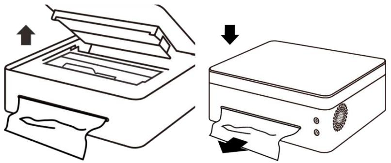

# 3）手动排纸

若机器不能自动强排，请按照以下步骤完成手动排纸。

纸卡在出纸区域 

<table><tr><td>注意</td><td>如卡纸在这个区域,可能会引起墨粉洒在纸上。如果您的衣服沾上墨粉,用冷水清洗,因为热水会使墨粉进入纤维。</td></tr></table>

1 ..打开打印机上盖。

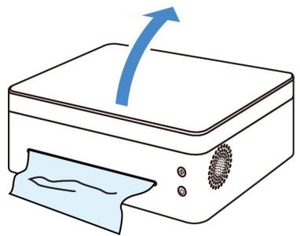

②拿出鼓粉组件。

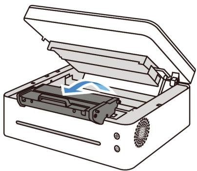

③小心地将卡住的纸拉出出纸口。注意不要撕坏纸张。

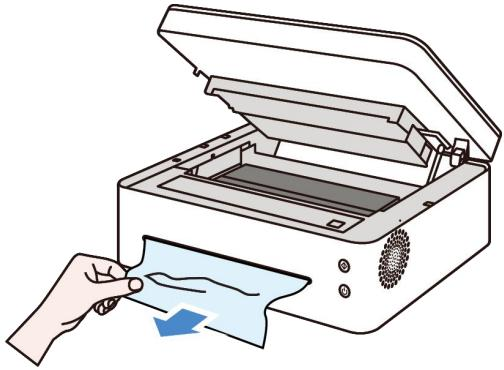

④放回鼓粉盒。

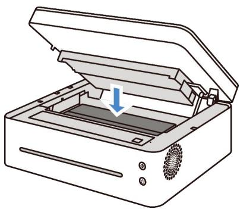

⑤合上上盖，恢复打印。

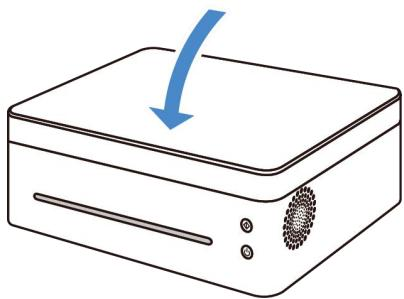

纸卡在进纸区域 

<table><tr><td rowspan="2">注意</td><td>如果纸已经进入鼓粉组件区域,按照如下步骤操作。</td></tr><tr><td>如果电源键 ⏻ 依然红灯亮,说明仍然有纸卡在打印机内部。请检查打印机内部。</td></tr></table>

①打开上盖，拿出鼓粉组件。

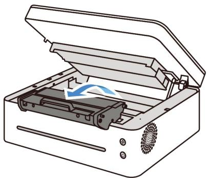

②合上上盖，小心地拉出卡在进纸托盘的纸。注意不要撕坏纸张。

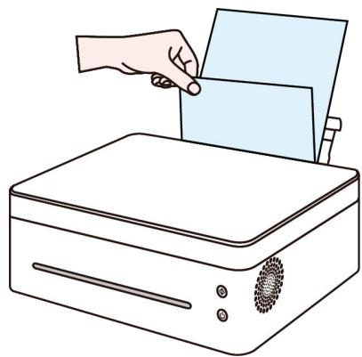

③重新装回鼓粉组件，合上上盖。

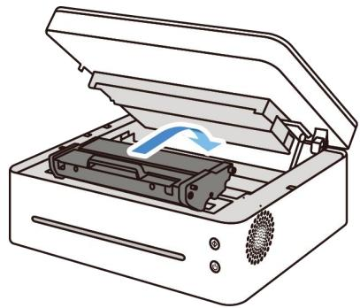

纸卡在打印机内部

<table><tr><td rowspan="2">注意</td><td>如纸卡在这个区域,可能会引起墨粉洒在纸上,如果您的衣服上沾上墨粉,用冷水清洗,因为热水会使墨粉进入纤维。</td></tr><tr><td>为了防止损坏感光鼓,不要将它暴露在光线下达数分钟,当将它从打印机内取出后,用一张纸盖住它。</td></tr></table>

①打开打印机上盖。

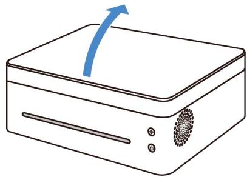

②拿出鼓粉组件。

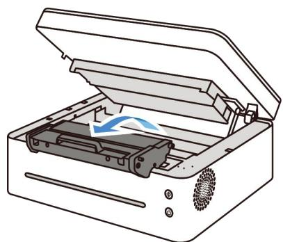

③轻轻地将纸向您的方向从打印机内拉出。确保没有纸留在打印机内部。

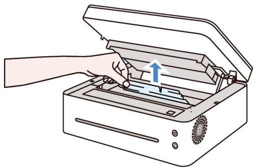

④重新装回鼓粉组件。

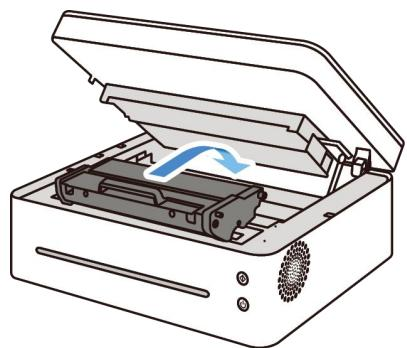

⑤关紧上盖。打印机恢复打印。

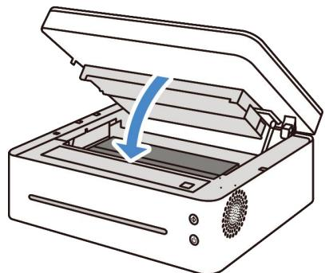

<table><tr><td rowspan="2">注意</td><td>如果电源键指示灯依然红灯亮,说明仍然有纸卡在打印机内部。</td></tr><tr><td>请检查打印机内部。</td></tr></table>

# 4）避免卡纸的注意事项

选择正确的纸张类型，可以避免大部分卡纸。如果发生了卡纸，请按照“清除卡纸”中的步骤操作。

正确地装入纸，正确调整纸张导板的位置。请参见 >> 装入纸张（P7）。  
不要向进纸盘装入过多的纸。  
正在进行打印时，不要从进纸托盘内取出纸。  
在装入纸之前，弯曲、扇开和展平纸。  
不要使用皱的、折叠过的、受潮的或非常卷曲的纸。  
不要在一个进纸盘内混装不同类型的纸。  
仅使用推荐的纸张。

将打印介质保存在适当的环境中。

# 5）重要信息

卡纸上可能覆盖有墨粉。注意不要使其沾到手上或衣服上。  
 清除卡纸后，如果立即进行打印，则打印上的墨粉可能无法充分定影，从而弄脏纸张。打印一些测试页，直到不再出现污迹为止。  
请勿用力取出卡纸，因为卡纸可能会撕破。残留在机器中的碎片会导致以后卡纸并且可能损坏机器。  
 卡纸可能导致页面丢失。请检查打印作业是否有丢失的页面，并重新打印没有打印输出的页面。

# 注意事项

# 1）耗材的注意事项

如果使用非正品耗材，则无法保证机器正常运行。  
. 根据打印条件，有时候打印机无法打印出规格中说明的纸张数量。  
如果打印的图像突然变浅或模糊，则请更换墨粉盒或感光鼓。

# 2）移动和搬运机器

本节介绍您在长/短距离范围内移动机器时必须注意的事项。

长距离移动机器时，请使用原始包装材料来重新包装机器。

运输之前，请务必拔下机器上的所有电缆。  
本机是精密设备。移动时，请务必小心操作。  
请务必水平移动机器。上下楼梯搬运机器时，请格外小心。  
移动机器时请勿取出鼓粉组件。  
移动机器时，请务必让机器保持水平。为了防止墨粉溅出，请小心移动机器。  
要长距离移动机器，请将其包装妥当。在搬运过程中，请小心不要翻倒或倾斜机器。  
在搬运过程中，如果机器未保持水平，则墨粉可能会溅到机器内。  
有关移动机器的详细信息，请与您的销售或服务代表联系。

# 3）如何处理本机

有关正确处理本机的信息，请询问您的销售或服务代表。

# 4）到何处询问

要了解本手册包含主题的更多信息，或了解本手册未涵盖的其他主题，请咨询您的销售或

服务代表。

# 5）鼓粉组件

鼓粉组件包括感光鼓和墨粉盒。以打印“ISO/IEC19752”测试页进行计算，墨粉盒的寿命平均为 1000 页，感光鼓的寿命平均为10000页。

<table><tr><td rowspan="4">提示</td><td>除非在感光鼓使用寿命到达之前更换感光鼓,否则打印无法继续。为便于更换感光鼓,我们建议您在感光鼓快到达使用寿命之前购买并储存多余的感光鼓。</td></tr><tr><td>实际可打印的页数将视图像容量和浓度、一次要打印的页数、所用的纸张类型和纸张尺寸以及环境条件(例如温度和湿度)的不同而有所变化。</td></tr><tr><td>由于鼓粉组件随使用时间的延长而质量下降,因此可能需要在出现相关的指示信息之前将其更换。</td></tr><tr><td>鼓粉组件不在保修范围内。但是如果出现问题,请与销售商店联系。</td></tr></table>

# 6）不推荐的纸张类型

请勿使用以下类型的纸张：

喷墨打印机专业纸张；  
粘性墨水特殊纸张；  
弯曲、折叠或有折痕的纸张；  
卷曲或扭曲的纸张；  
起皱的纸张；  
潮湿的纸张；  
很脏或破损的纸张；  
容易产生静电的过分干燥的纸张；  
已经打印过的纸张、除有信头图案的纸张以外；  
采用非激光打印机（例如黑白和彩色复印机、喷墨打印机等）使用的纸张；  
打印过的纸张尤其可能造成故障；  
特殊纸张、如热敏纸和复写纸；  
纸张重量比限制值更重或更轻；  
带有窗、洞、孔眼、图案或凹凸的纸张；  
上面贴有胶纸或原纸的粘胶标签纸；  
带有回形针或订书钉的纸张；  
信封。

<table><tr><td rowspan="2">提示</td><td>采用保存不当的纸张打印时也会造成卡纸、打印质量下降或出现故障。</td></tr><tr><td>如果使用上述任意一类纸张,则可能会损坏设备。由此造成的损坏不在本公司的保修服务范围内。</td></tr></table>

# 安全信息

# 免责声明

开始安装、使用、维护、维修本产品前，请仔细阅读产品安全信息。如用户未遵循产品安全信息导致的短路、触电、设备损坏、火灾或人身伤害等，本公司不承担任何责任。

# 电源线及电源安全

1.本产品功率较大，请务必使用产品包装内附的电源线。  
2.为了您的安全，产品不使用时请关闭电源，长时间不使用时请从电源插座拔下电源插头。  
3.本产品必须安装在靠近电源插座的地方，确保紧急情况时，可立即从电源插座上拔下产品电源插头以安全切断电源。  
4.请用电源软线连接到具有接地连接的输出插座。  
5.使用本产品前，请检查电源线是否有损坏或磨损，如：绝缘皮破损、插头变形、插头损坏等，如有以上情况，请勿接触损坏部位，并停止使用本产品，关闭电源并拔下电源插头。  
6.本产品必须连接到符合产品标签所标的额定电压范围的交流电源上且电源插头完全插入电源插座，请勿将本产品连接到直流电源或变压器上。  
7.请从插座上拔下电源插头以切断电源，切勿通过拉扯电源线材的方式切断电源，否则会使插头与插座在分离过程中发生接触不良，引起触电或火灾。  
8.请勿用湿手插拔电源线插头，以免导致触电。  
9.请勿踩踏、挤压或拉紧电源线，同时不要在电源线上放置任何物品，否则会导致电源线内部芯线短路引起火灾。  
10.请勿让任何金属物品、水或其他液体落在本产品的电源插头上，否则可能会造成触电或火灾。  
11.请勿使用不符合产品规格的 USB线或网线，否则可能会造成火灾或漏电。  
12.强烈建议您不要使用任何类型的电源插排。

# 安装本产品

1.请勿将本产品放置在加热器或者散热器等产品附近的场所，否则产品可能因为过热或加热设备引起短路或火灾。  
2.请勿将本产品放置在空调、电风扇、冰箱或水源等附近，否则产品可能会因为接触到水（包括加热器、空调或其他通风设备造成的凝露），而造成触电、短路或火灾。

# 安全信息

3.请勿将本产品暴露于阳光直射、高温（超过 35℃）、有明火、有腐蚀性气体、潮湿或多尘的环境中，否则可能会造成触电、短路或火灾。  
4.请勿将本产品放置在化学品附近或可能发生化学品泄漏的地方，否则可能会造成火灾或触电；特别是有机溶剂或液体，例如苯、油漆稀释剂、去光水或除臭剂，可能会导致塑料外壳、电缆融化或溶解，造成触电或火灾。  
5.请将本产品放置在通风状况良好的场所，请勿遮挡或阻碍产品通风口（如：散热孔等），否则可能会造成产品过热或引起火灾。  
6.请将本产品（含墨粉盒/鼓粉组件）放置在儿童不易接触到的地方，警惕受伤。  
7.请将本产品（含墨粉盒/鼓粉组件）放置在温湿度适宜的位置，环境温度应保持在10℃-32℃，湿度应保持在15%-80%（无凝露）。

# 日常使用与维护本产品

1.本产品发出的无线电波可能会影响医疗电气设备工作（例：心脏起搏器），请勿在任何医疗电气设备附近使用本产品（仅限带无线网络功能的产品），否则可能导致医疗电气设备出现故障，造成医疗事故或人员伤害。  
2.长时间使用产品时，产品内部的一些零件温度会非常高。因此，请至少等待15分钟以上，直至产品完全冷却后再接触产品。如果产品异常发烫、冒烟并释放一些强烈刺鼻气味，请立即关闭电源，并联系产品服务热线或您当地的产品经销商。

# 激光辐射标准

本机符合 IEC60825-1:2014 中对 1 类激光产品的要求。本机器包含 AIGaAs 激光二极管（12毫瓦），每个发射极的波长为 775-800 纳米。垂直方向的光束发射角为 25度（最小值）和 35 度（最大值），水平方向的光束发散角为 7 度（最小值）和 12 度（最大值），并且激光束在连续波（CW）模式下产生。

！ 注意：利用非本手册的步骤进行控制、调整或操作时，可能会导致危险的辐射暴露。

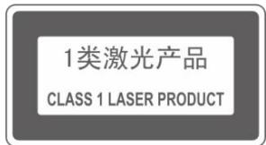

# 本机安全标签

本机器内部有 ！ 警告或注意标签，为了安全起见，请根据说明操作本机。

1.请勿焚烧碳粉或碳粉容器。  
2.碳粉遇到明火时会燃烧。  
3.不得使用吸尘器吸除溢出的碳粉（包括废碳粉）。由于吸尘器内部的电器触点会产生火花，吸入碳粉（包括废碳粉）可能会导致火灾或爆炸。可使用专为防止粉尘爆炸而设计的吸尘器。  
4.如果碳粉撒落到地上，应用湿布缓慢清除撒落的碳粉，以免碳粉飘散。  
5.将碳粉（包括废碳粉）、碳粉盒和接触过碳粉的物品放在儿童所能触及的范围之外。  
6.如果碳粉弄到衣服上，请用冷水清洗相关部位。  
7.如果碳粉或废碳粉进入眼睛，请立即用大量的水冲洗。必要时请就医。

警告或注意内容

<table><tr><td></td><td>请勿接触标签标示的部件,机器的该部件可能很烫。</td></tr><tr><td></td><td>本产品仅在海拔 2000m 以下的地方能够安全使用。</td></tr><tr><td>[DKSD]</td><td>本产品仅在非热带气候条件的地方能够安全使用。</td></tr></table>

电器电子产品中有害物质的名称及含有信息表如下

<table><tr><td colspan="11">产品中有害物质的名称及含有的信息表</td></tr><tr><td rowspan="2">部件名称</td><td colspan="10">有害物质</td></tr><tr><td>Pb</td><td>Hg</td><td>Cd</td><td>Cr(VI)</td><td>PBBs</td><td>PBDEs</td><td>DBP</td><td>DIBP</td><td>BBP</td><td>DEHP</td></tr><tr><td>印制电路板组件</td><td>×</td><td>○</td><td>○</td><td>○</td><td>○</td><td>○</td><td>○</td><td>○</td><td>○</td><td>○</td></tr></table>

注 1：○：表示该有害物质在该部件所有均质材料中的含量均不超出电器电子产品有害物质限制使用国家标准要求。  
×：表示该有害物质至少在该部件的某一均质材料中的含量超出电器电子产品有害物质限制使用国家标准要求。  
注2：以上未列出的部件，表明其有害物质含量均不超出电器电子产品有害物质限制使用国家标准要求。  
注3：表中标记"x"的部件，皆因现阶段技术水平限制，业界无法实现有害物质的替代，但符合中国RoHS 物质限制和适用的豁免要求。

China RoHS 合格评定制度标识和产品中有害物质含有信息标识说明

<table><tr><td></td><td>依《电器电子产品有害物质限制使用合格评定制度实施安排》、《绿色产品标识使用管理办法》中标识的相关要求,我司针对纳入《达标管理目录》内的产品,使用自我声明方式。</td></tr><tr><td></td><td>本标识内数字表示产品在正常使用状态下的环保使用期限为10年。</td></tr></table>

# 法律声明

# 为了创造更加美好的环境

首先对您使用Lenovo产品表示衷心的感谢！

Lenovo公司致力于关爱地球环境，制定了“从产品开发到废弃，关爱地球环境”的基本方针。当地的公民在环境保护活动中也应该对当地社会、环境两方面尽每个人的微薄之力。因此，希望您能配合这个计划，作为环境保护活动的一环，在平时处理废弃物的时候能多加注意。

1.不用的包装材料，为了能再次回收利用，请交付当地相关回收公司进行处理。  
2.废弃耗材的处理，应遵守相关的法律和规定。请根据相关法律和规定妥当处理。法律声明  
3.产品保养或修理需要更换零部件时，有不需要的电路板和电子零件，以及产品废弃时，请作为电子废弃物处理。  
4.关闭本产品的电源开关后，在拔下电源插头的情况下耗电量是零。  
5.本产品中的部分零部件可以用于同一工厂生产的同系列机型上。

注：零部件的更换请联系就近的 Lenovo维修站。

# 中国环境标志的提示

1）建议将噪声大于 63dB 的设备放置于相对独立的区域。  
2）可以使用再生纸。  
3）在换气不畅的房间中长时间使用或打印大量文件时，应适时换气。  
4）在产品停产后5年内，联想保证提供产品在正常使用范围内可能损坏的部件，并提供产品的消耗材料。

www.lenovoimage.com/1.html

# 声明

欢迎您使用Lenovo产品！

首次安装和使用本产品前，请先仔细阅读随机配送的所有材料，这将有助于您更好地使用本产品。如果您未能按照本用户手册的说明和要求操作本产品，或由于理解错误等原因误操作本产品，至像科技有限公司将不对由此而导致的任何损失承担任何责任，但由于 Lenovo专业维修人员安装或操作不当而造成的损失除外。

至像科技有限公司已经对本手册的内容进行了严格、仔细的校勘，但是我们不能保证本手册完全没有错误或是疏漏。

至像科技有限公司致力于不断改进产品功能、提升服务品质，因此保留随时更改本手册所叙述任何产品或软件程序以及本手册内容的权利，恕不另行通知。

本手册旨在帮助您正确地使用本产品，并不包括对本产品的软硬件配置的任何说明。有关产品配置情况，请参阅相关合同（如有）和装箱清单，或者咨询向您出售产品的经销商。本手册中的图片仅供参考，如果有个别图片与产品实物不符，请以产品实物为准。

©2024至像科技有限公司。本手册受版权法律法规的保护。未经至像科技有限公司事先书面授权，不得以任何方式复制或抄录本手册，不得以任何形式在任何有线或无线网络中传送本手册，也不得将本手册翻译成任何语言。

该产品由至像科技有限公司依许可生产。Lenovo，联想以及Lenovo图标是联想（北京）有限公司的注册商标，依许可使用。其它商标系其它商标所有人的知识产权。法律声明

如果您在操作过程中发现本产品的实际情况与本手册有不一致之处，或您想获取最新的信息，或您有任何问题或建议，请登录服务网站：https://www.lenovoimage.com

# 法律禁止项目

请勿复印或打印法律禁止复制的任何项目。

根据当地法律，复制或打印以下项目一般属于违法行为：

纸币；  
印花税票；  
债券或其他债务证明；  
存折；  
义务服兵役文件或草拟文件；  
股票；  
银行汇票；  
支票；  
护照；  
驾驶执照；  
福利文件；  
移民文件；  
政府机构签发的支票或汇票；  
身份证明文件；  
徽章或勋章；

 邮票（作废的或未作废的）。

不可复印受版权保护的作品。一些受版权保护的作品可以被部分复制以进行“合理使用”。多份复制将被视为不正当使用。艺术作品等同于受版权保护的作品。

以上列表仅作参考，并不包括所有内容在内。对于其完整性及准确性，本公司概不承担责任。如果您有与复印或打印某些项目的合法性相关的问题，请咨询法律顾问。