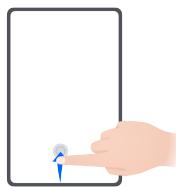
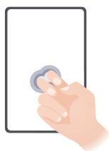

# 华为平板C7

# 用户指南

# 目 录

# 基础使用

常用手势 1

系统导航 3

平板克隆 4

锁屏与解锁 5

了解桌面 5

常见图标含义 8

控制中心 9

打开应用常用功能 11

桌面窗口小工具 12

更换壁纸 12

截屏和录屏 13

查看和关闭通知 15

调整音量 15

输入文本 16

多窗口 19

开关机和重启 21

充电 22

# 智慧功能

智慧语音 24

智慧视觉 31

智慧识屏 34

服务中心 36

平板投屏 37

设备与笔记本协同办公 37

华为分享 39

华为打印 41

多设备协同管理 41

音频播控中心 42

# 相机图库

打开相机 44

拍摄照片 44

全景拍摄 45

照片添加水印 46

文档矫正 46

录制视频 47

延时摄影 48

相机设置 48

管理图库 49

时刻

目 录

55

# 应用

畅连 57

日历 61

时钟 62

备忘录 62

录音机 67

电子邮件 68

计算器 71

平板管家 72

平板克隆 73

# 设置

搜索设置项 74

WLAN 74

更多连接 75

桌面和壁纸 78

显示和亮度 81

声音和振动 83

通知 84

生物识别和密码 85

应用和服务 86

电池 86

存储 88

安全 89

隐私 92

辅助功能 93

系统和更新 97

关于平板电脑 101

# 基础使用

# 常用手势

# 了解平板常用手势与快捷操作

# 全面屏导航手势

进入设置 > 系统和更新 > 系统导航方式，确保选择了手势导航。

# 返回上一级

从屏幕左边缘或右边缘向内滑动

# 返回桌面

从屏幕底部边缘上滑

# 进入最近任务

从屏幕底部边缘向上滑并停顿

# 结束单个任务

查看多任务时，上滑单个任务卡片

# 快速切换应用

• 沿屏幕底部边缘横向滑动  
使用该功能前，在系统导航方式界面中，点击更多设置，请确保底部边缘横滑切换应用开关开启。  
• 从屏幕底部边缘弧线滑动

0 若您的设备中无底部边缘横滑切换应用开关，则不支持该功能，请以实际情况为准。

# 指关节手势

进入设置 > 辅助功能 > 快捷启动及手势，确保截屏和录屏开关已开启。

更多手势

<table><tr><td></td><td>进入桌面编辑状态在桌面上双指捏合。</td></tr><tr><td></td><td>进入锁屏快捷操作面板锁屏后,点亮屏幕,然后单指从底部上滑。</td></tr><tr><td></td><td>打开搜索从桌面中部向下滑动,打开搜索框。</td></tr><tr><td></td><td>打开通知消息从屏幕顶部左侧下滑出通知消息。</td></tr><tr><td></td><td>打开快捷开关从屏幕顶部右侧下滑出控制中心,点击展开快捷开关栏(取决于您的机型)。</td></tr></table>

# 系统导航

# 更改系统导航方式

# 使用手势导航

进入设置 > 系统和更新 > 系统导航方式，选择手势导航。

您可以：

• 返回上一级菜单：从屏幕左边缘或右边缘向内滑动。

• 返回桌面：从屏幕底部边缘中间上滑。

• 进入多任务：从屏幕底部边缘向上滑并停顿。

• 结束单个任务：进入多任务界面后，上滑单个任务卡片。下滑卡片可锁定任务，锁定后，在多任务界面点击 时不会被批量清除。

• 快速切换应用：从屏幕底部边缘弧线滑动，切换应用；或开启底部边缘横滑切换应用开关后，沿屏幕底部边缘横向滑动。

您还可以开启显示提示条开关，用导航条辅助手势操作。

i 部分产品不支持底部边缘横滑切换应用或显示提示条，请以实际情况为准。

# 使用屏幕内三键虚拟导航

进入设置 > 系统和更新 > 系统导航方式，选择屏幕内三键导航。

开启屏幕内三键导航后，您可以：

• 点 击 ，返回上一级菜单或退出应用程序。

• 点击 $\bigcirc$ ，返回主屏幕。  
• 点击 ，进入多任务管理界面。

您还可以根据使用习惯，进入更多设置，进行更多操作：

• 选择不同的导航键组合。  
• 打开导航键可隐藏开关，在不使用导航键时将其隐藏。

• 点击 $\doublebarwedge$ （若所选导航键组合中包含 $\equiv _ { \overline { { \overline { { \Psi } } } } } $ ，打开通知中心。

# 使用悬浮导航操控平板

进入设置 > 系统和更新 > 系统导航方式 > 更多或设置 > 系统和更新 > 系统导航方式 > 悬浮导航（取决于您的机型），开启悬浮导航开关。

当出现悬浮导航按钮后，您可以：

• 拖动悬浮导航到您顺手的位置  
• 点击悬浮导航，返回上一级  
• 长按悬浮导航后松开手指，返回桌面  
• 按住悬浮导航并向左或右滑动，查看后台运行中的任务

# 平板克隆

# 平板克隆，换机无忧

使用平板克隆，只需较短时间，便可将旧平板上的基础数据（如联系人、日历、图片、视频等）迁移到新平板，实现新旧平板无缝衔接。

# 从华为或其他安卓设备迁移数据

1 在新平板上，进入平板克隆应用，或进入设置 > 系统和更新 > 平板克隆，点击这是新设备，选择华为或其他安卓。  
2 根据界面提示，在旧设备下载安装平板克隆。  
3 在旧设备上，进入平板克隆应用，点击这是旧设备，根据界面提示，通过扫码或手动连接的方式，将旧设备与新平板建立连接。  
4 在旧设备上，选择要克隆的数据，点击开始迁移完成数据克隆。

# 从 iPhone 或 iPad 迁移数据

1 在新平板上，进入平板克隆应用，或进入设置 > 系统和更新 > 平板克隆，点击这是新设备，选择 iPhone/iPad。  
2 根据屏幕提示，在旧设备下载安装平板克隆。  
3 在旧设备上，进入平板克隆应用，点击这是旧设备，根据界面提示，通过扫码或手动连接的方式，将旧设备与新平板建立连接。  
4 在旧设备上，选择要克隆的数据，并根据界面提示完成数据克隆。

# 锁屏与解锁

# 锁屏与解锁

# 锁定屏幕

一段时间不操作平板，平板将自动锁屏。

您也可以通过以下方式手动锁定屏幕：

• 按电源键锁定屏幕。  
• 在主屏幕，双指捏合进入主屏幕编辑模式，点击窗口小工具，将一键锁屏快捷图标添加到主屏幕。然后点击一键锁屏图标锁屏。

# 设置自动锁屏时间

进入设置 > 显示和亮度 > 休眠，选择对应的屏幕自动休眠时长。

# 点亮屏幕

您可以通过以下方式点亮屏幕：

• 按电源键点亮屏幕。  
• 进入设置 > 辅助功能 > 快捷启动及手势 > 亮屏，开启并使用拿起设备亮屏、双击亮屏。

i 若您的平板中无此菜单，则不支持该功能。请以实际情况为准。

# 输入密码解锁

点亮屏幕后，从屏幕中部向上滑动，会出现密码输入面板。输入锁屏密码即可。

# 使用人脸解锁

点亮屏幕后，将平板对准人脸。平板会自动进行人脸识别校验，校验成功后即可解锁。

# 从锁屏界面快速打开应用

在锁屏界面，您可以快速打开相机、录音机、计算器等常用应用。

• 点亮屏幕，按住右下角相机图标并上滑，打开相机。  
• 点亮屏幕，从屏幕底部边缘向上滑动，打开快捷操作面板，您可根据需要点击应用图标。例如手电筒、计算器、计时器等。

# 了解桌面

# 了解新桌面

HarmonyOS 提供服务卡片、大文件夹和小艺建议，让您把重要信息放在眼前，操作更快捷，屏幕也更个性化。

0 配图仅供参考，请以产品实际为准。

• 状态栏：通过顶部状态栏查看平板状态、通知消息。

• 大文件夹：无需展开文件夹，可一步打开文件夹中的应用，还可方便的进行归类整理。您可长按小文件夹，将小文件夹转换为大文件夹。  
• 服务卡片：无需打开应用，可快速预览应用信息或使用常用功能。您可将不同样式的服务卡片固定在桌面想要的位置。  
• 小艺建议：基于使用场景和个人习惯进行服务推荐。当您所处时间、地点或行为发生变化时，推荐的服务内容随之变化。  
• 屏幕切换指示条：左右滑动查看应用、桌面小工具。屏幕切换指示条显示当前屏幕所在位置。  
• 快捷操作栏：放置经常使用的应用程序。

# 服务卡片

上滑应用图标，展开服务卡片。卡片让您便捷地预览服务信息，例如查看天气或日历日程等内容。您可将卡片添加到屏幕上，让这类信息触手可及。您还可按喜好选取不同样式和排列方式，打造个性化桌面。

部分情况不支持该功能，例如简易模式。

# 展开和收回卡片

上滑应用图标，展开卡片，点击卡片外区域收回卡片。

底部带有提示条 的应用图标支持该功能。

您可在设置 > 桌面和壁纸 > 桌面设置 > 显示提示条中关闭提示条标识。

i 抽屉风格时，不支持上滑展开卡片。

# 固定卡片

您可执行如下任一操作，将卡片固定在屏幕中：

• 长按卡片，弹出快捷菜单，不松手继续拖动到屏幕空位。  
• 上滑图标展开卡片，点击 ，将卡片添加到当前屏幕。

若当前屏幕没有空间，平板就在下一屏幕找空位放置。若当前屏幕和下一屏幕均无空位，平板自动在当前屏幕右侧新建一屏放置。

• 对同一应用，可添加多个卡片到屏幕上。

• 不支持将卡片固定在文件夹中。

上滑展开卡片后，在拖动过程中，将卡片拖动到屏幕上方撤销区可撤销操作。

# 设置上滑卡片样式

您可执行如下任一操作：

• 上滑展开卡片后，长按卡片，点击更多服务卡片，选择所需卡片样式。  
• 长按应用图标，点击服务卡片，选择所需卡片样式（部分应用支持）。

# 添加卡片到桌面

您可执行如下任一操作，将卡片添加到当前屏幕：

• 长按卡片，选择更多服务卡片 > 添加到桌面。  
• 长按应用图标，选择服务卡片 > 添加到桌面（部分应用支持）。

若当前屏幕没有空间，平板就在下一屏幕找空位放置。若当前屏幕和下一屏幕均无空位，平板自动在当前屏幕右侧新建一屏放置。

您也可在更多服务卡片界面，长按卡片拖动到屏幕空位。

# 编辑卡片

部分卡片可进行设置，以显示您想要的信息。例如天气卡片可选择不同城市；时钟卡片可选择不同时区。

长按卡片，选择编辑，请根据界面提示操作。

# 卡片操作

• 点击卡片可进入应用。  
• 部分应用可直接在卡片上进行操作。例如音乐卡片可点击播放或暂停。

# 移除卡片

长按卡片，选择移除，根据界面提示操作。

0 若卸载应用，其对应卡片也会移除。

# 创建和使用大文件夹

将应用分类放在大文件夹中，并给文件夹取名，方便您管理桌面图标。

您还可将小文件夹切换为大文件夹（文件夹和图标显示尺寸变大），无需展开文件夹，直接点击应用图标，一步打开应用。

# 创建大文件夹

1 长按应用图标，然后将其拖动到另一个图标上，两个图标将集合在一个新文件夹中。  
部分平板会根据应用类型，自动命名文件夹，并同时智能推荐同类型应用，您可选择是否添加至新文件夹中。  
2 长按可切换文件夹显示方式。例如，长按新文件夹，弹出菜单中选择显示为大文件夹。  
3 点击大文件夹右下角，打开大文件夹，点击文件夹名称，输入新名称。  
您还可长按大文件夹，然后选择重命名，输入新名称。

# 大文件夹常用操作

您可进行如下任一操作：

• 直接打开应用：在大文件夹中，点击大图标，直接进入应用程序。  
• 打开或退出：点击大文件夹右下角，进入文件夹。进入后，点击文件夹空白区域即可退出。  
当应用图标超过 12 个时，在大文件夹右下角显示堆叠图标。您可点击该堆叠图标进入文件夹。  
• 添加或移除应用：打开大文件夹，点击 。部分平板会根据文件夹内已有应用类型，智能推荐同类型应用，您可根据界面提示添加或移除应用。

• 切换显示方式：长按可自由切换大小文件夹。例如，长按小文件夹，弹出菜单中选择显示为大文件夹。

# 小艺建议

小艺建议将主动推荐工作生活中所需的服务和应用。

根据您当下所需，小艺建议将即时响应，动态推荐，便于您高效触达所需服务。

随着持续使用，小艺建议将越来越懂您，越用越顺心。

# 添加和更换小艺建议中的服务和应用

• 长按小艺建议中的图标区域，选择更多服务卡片，按照界面提示，可以添加一个新的小艺建议。  
• 长按小艺建议中的服务/应用，选择不感兴趣，系统会自动进行更换。

# 在桌面添加小艺建议

• 从平板底部的左下角或右下角向斜上方滑动（或沿着边缘上滑），进入服务中心，在发现页签找到小艺建议，添加到桌面。  
• 进入设置 > 智慧助手 > 智慧建议 > 小艺建议 > 服务卡片，添加到桌面。

# 删除小艺建议

• 长按小艺建议中服务或应用图标和外框之间的空白区域，选择移除，按照界面提示，确认删除桌面的小艺建议。  
• 在主屏幕双指捏合，进入桌面编辑状态，拖动小艺建议到右上角或正上方的移除按钮处即可删除（取决于您的机型）。

# 常见图标含义

# 常见通知和状态图标含义

i 网络状态图标可能因您所在的地区或网络服务提供商不同而存在差异。

不同产品支持的功能有差异，以下图标可能不会出现在您的平板上，请以平板实际显示为准。

<table><tr><td>5G</td><td>5G 网络已连接</td><td>4G</td><td>4G 网络已连接</td></tr><tr><td>3G</td><td>3G 网络已连接</td><td>2G</td><td>2G 网络已连接</td></tr><tr><td></td><td>信号满格</td><td>R</td><td>正在漫游</td></tr><tr><td></td><td>已开启省流量模式</td><td></td><td>未插入 SIM 卡</td></tr><tr><td></td><td>已开启热点</td><td></td><td>已连接至热点</td></tr><tr><td></td><td>已连接至 WLAN 网络</td><td></td><td>热点已断开</td></tr><tr><td></td><td>正在通过 WLAN+ 自动切换网络</td><td></td><td>闹钟已开启</td></tr><tr><td></td><td>电池无电量</td><td></td><td>电池电量低</td></tr><tr><td></td><td>正在充电</td><td></td><td>正在使用快充</td></tr><tr><td></td><td>正在使用超级快充</td><td></td><td>无线超级快充</td></tr><tr><td>[SY5W]</td><td>无线快充</td><td>[YDKH]</td><td>普通无线充电</td></tr><tr><td></td><td>省电模式已开启</td><td></td><td>健康使用平板已开启</td></tr><tr><td></td><td>蓝牙已开启</td><td></td><td>蓝牙设备电量</td></tr><tr><td></td><td>已连接蓝牙设备</td><td>1</td><td>已连接至VPN网络</td></tr><tr><td></td><td>已进入驾驶模式</td><td>[GYBK]</td><td>已连接至投屏设备</td></tr><tr><td></td><td>位置服务已开启</td><td></td><td>护眼模式已开启</td></tr><tr><td></td><td>已连接耳机</td><td>[HW2S]</td><td>已连接带麦克风的耳机</td></tr><tr><td></td><td>正在通话</td><td>[KKK8]</td><td>VoLTE高清通话已开启</td></tr><tr><td></td><td>有未接来电</td><td>[k2ZW]</td><td>有新消息</td></tr><tr><td></td><td>静音模式</td><td>[kH64]</td><td>振动模式</td></tr><tr><td>[44HT]</td><td>NFC已开启</td><td></td><td>免打扰模式已开启</td></tr><tr><td></td><td>数据同步中</td><td></td><td>数据同步失败</td></tr><tr><td></td><td>性能模式已开启</td><td></td><td>收到新邮件</td></tr><tr><td>[8CBX]</td><td>收到日程提醒</td><td>[SZYG]</td><td>更多未显示的信息</td></tr><tr><td>[9DX]</td><td>飞行模式已开启</td><td></td><td></td></tr></table>

# 控制中心

# 控制中心简介

控制中心将常用的音频播控、快捷开关、超级终端等功能集合在一起，让您操作更便捷。

从屏幕顶部右侧下滑出控制中心，您可以轻松体验如下功能：

• 媒体播控：统一控制音频播放，快速切换最近使用的媒体应用、播放设备（如：智慧屏、蓝牙耳机等）。  
• 快捷开关：快速开启、关闭或设置一些常用小功能。  
• 超级终端：自动发现附近登录相同华为帐号的智能设备，组成超级终端，轻松实现全场景协同体验。  
• 智能设备：统一管理和操控在智慧生活应用中已添加的智慧生活场景或设备。

# 使用快捷开关

# 打开快捷开关

从屏幕顶部右侧下滑出控制中心，点击 展开快捷开关栏（取决于您的机型）。

• 点击快捷开关，开启或关闭相应功能。  
• 长按快捷开关，进入对应功能的设置页面（部分功能支持）。

• 点击 进入设置界面。

# 自定义快捷开关

从屏幕顶部右侧下滑出控制中心，点击 > 编辑快捷开关，然后长按并拖动快捷开关调整位置，点击完成。

# 音频播控中心

# 通过音频播控中心统一管理音频应用

当开启了多个音频类应用时（如音乐等），您可以通过音频播控中心统一管理，并在不同的音频应用间快速切换。

1 开启了多个音频类应用后，从平板顶部右侧下滑出控制中心，点击控制中心顶端的音频卡片。  
2 音频播控中心会显示正在运行和最近播放过的音频应用，您可以通过音频播控中心直接控制正在运行的音频应用（如播放、暂停、切换上下曲等），也可以点击另一个音频应用，快速切换到该应用播放。

• 部分应用需更新到最新版本后才能使用。

• 并非所有应用支持音频播控中心，请以实际情况为准。

# 快速切换音频播放设备

当平板连接了音频设备（如耳机、蓝牙音箱、智慧屏等），播放音频时，您可以通过音频播控中心快速切换播放设备，如将平板正在播放的音乐快速投放到蓝牙音箱等。

1 将平板与音频设备通过蓝牙等方式连接。

智能音箱、智慧屏还可以在与平板连接蓝牙后，通过与平板连接同一 WLAN、登录同一华为帐号的方式进行连接。

2 从平板顶部右侧下滑出控制中心，在顶端的媒体播控卡片右上角点击 或设备图标（如等），可显示已连接的设备列表，点击列表中的设备名称，可将平板正在播放的音频投放到对应的设备中。

# 超级终端实现多设备协同

超级终端帮您实现多设备协同管理，资源共享，一键协同附近的智慧屏等设备，在已协同设备上继续平板当前任务，如在智慧屏上继续观看视频，听音乐等。

0 使用该功能前，请将您的设备升级到最新版本。

# 超级终端设备如何设置

目前支持平板与以下 3 类产品通过超级终端连接。使用前，请在平板上开启蓝牙、WLAN 并登录华为帐号，其他设备进行如下设置：

• 智慧屏：与平板接入同一局域网，并登录同一华为帐号。  
• 智能音箱：与平板接入同一局域网，并通过智慧生活应用绑定到平板所登录的华为帐号。  
• 蓝牙设备：部分蓝牙设备（如耳机等）可与平板通过蓝牙配对连接后加入超级终端。

• 部分产品不支持与音箱协同，请以实际情况为准。

• 若隐藏了超级终端，请进入控制中心，点击 > 显示超级终端。

# 将畅连、视频、音乐流转至其他设备

当您正在使用平板与家人进行畅连通话、观看视频（如华为视频、优酷视频等）、聆听音乐时，您可以通过超级终端将当前任务一键流转至其他设备，如：在智慧屏上继续畅连通话等。

根据不同的流转任务，流转设备可以选择如下：

• 视频：可以流转至智慧屏。   
• 畅连：可以流转至智慧屏。   
• 音乐：可以流转至蓝牙耳机、智慧屏（亮屏、熄屏状态下均可）。

1 从平板顶部右侧下滑出控制中心，超级终端中会显示已发现的设备，也可点击 ，手动搜索附近我的设备。  
2 点击想要流转的设备名称，一键流转至对应设备，或点击 。 ，拖拽待流转设备至平板即可流转。

# 控制智慧生活场景及设备

智慧生活应用中已经添加的智慧生活场景及设备，您可以进入控制中心快速操作。

1 从平板顶部右侧下滑出控制中心，一键开启或关闭智能设备，也可点击进入设备管理详情。  
2 您可以点击 > 编辑智能设备，添加或删除控制中心中显示的场景或设备卡片。

# 打开应用常用功能

# 从桌面快速打开应用常用功能

部分应用支持直接从桌面打开常用功能，还可以将常用功能添加到桌面。

# 快速启动应用常用功能

长按应用图标，在弹出的常用功能列表中，点击即可使用对应的功能。

例如，长按相机图标，会出现常用功能列表，例如：自拍、录像等。点击即可直接进入对应的拍照模式。

0 若长按应用图标未弹出功能列表，说明应用不支持快速启动。

# 将常用功能添加到桌面

长按应用图标，在弹出的常用功能列表中，长按功能并拖动至桌面，即可为该功能创建桌面快捷图标。

# 桌面窗口小工具

# 添加、移动或删除窗口小工具

您可以根据需要添加、移动或删除桌面窗口小工具，包括一键锁屏、天气、备忘录预览、联系人、日历等。

# 添加天气、时钟等桌面小工具

1 在桌面上双指捏合，进入桌面编辑状态。  
2 点击窗口小工具，向左滑动可查看所有小工具。  
3 部分小工具（如天气）会有多种样式，点击该图标可以展开所有的样式，向右滑动可以收拢。  
4 点击需要的小工具图标，即可将其添加到当前屏幕。若当前屏幕没有空间，可长按并拖动该图标，添加到其它屏幕。

若您想对天气进行设置，请进入天气APP，选择 ，根据界面提示进行设置。

例如在摄氏温度和华氏温度间切换：选择 > 温度单位，选择所需温度单位。

# 移动或删除窗口小工具

在桌面，长按一个窗口小工具，然后可将其拖动到桌面的任意位置，或点击移除将其删除。

# 更换壁纸

# 更换壁纸

# 使用自带的壁纸

1 进入设置 > 桌面和壁纸 > 壁纸。

2 选择一张图片。  
3 根据屏幕提示选择壁纸呈现的效果。例如虚化等。  
4 点击应用，选择将其设为锁屏、设为桌面或同时设置。

# 将图库中的照片设为壁纸

1 进入图库，找到您喜欢的图片。  
2 点击 > 设置为 > 壁纸，根据屏幕提示完成设置。

# 截屏和录屏

# 截取屏幕

# 指关节截取屏幕

1 进入设置 > 辅助功能 > 快捷启动及手势 > 截屏，确保指关节截屏开关已开启。  
2 用单指指关节稍微用力并连续快速双击屏幕，截取完整屏幕。

# 使用组合键截取屏幕

同时按下电源键和音量下键截取完整屏幕。

# 使用快捷开关截取屏幕

从屏幕顶部右侧下滑出控制中心，点击 展开快捷开关栏（取决于您的机型），点击截屏，截取完整屏幕。

# 分享、编辑或继续滚动截长图

截屏完成后，左下角会出现缩略图。您可以：

• 向下滑动缩略图，可以继续滚动截长屏。  
• 向上滑动缩略图，选择一种分享方式，快速将截图分享给好友。  
• 点击缩略图，可以编辑、删除截屏，可以点击滚动截屏。

截屏图片默认保存在图库中。

# 使用三指下滑截屏

1 进入设置 > 辅助功能 > 快捷启动及手势 > 截屏或设置 > 辅助功能 > 手势控制 > 三指下滑截屏（取决于您的机型），确保三指下滑截屏开关已开启。  
2 使用三指从屏幕中部向下滑动，即可截取完整屏幕。

# 截取局部屏幕

当您需要截取屏幕局部精彩内容时，可以使用局部截屏，帮您截出不同形状（如：矩形，椭圆形，心形等）。

# 使用指关节手势截取局部屏幕

1 使用单指指关节敲击屏幕并保持指关节不离开屏幕，拖动指关节绘制一个闭合图形。  
2 屏幕会显示指关节的运动轨迹，您可以：

拖动截图框调整位置和大小。  
点击屏幕下方的截图框，切换不同的截图形状，也可自画任意封闭图形。

3 点击 ，保存截图。

# 使用快捷开关截取局部屏幕

1 从屏幕顶部右侧下滑出控制中心，点击 展开快捷开关栏（取决于您的机型），点击截屏旁边的 ，在弹框中点击局部截屏。  
2 根据屏幕提示，使用手指绘制一个闭合图形。  
3 屏幕会显示手指的运动轨迹，您可以：

拖动截图框调整位置和大小。

点击屏幕下方的截图框，切换不同的截图形状，也可自画任意封闭图形。

4 点击 ，保存截图。

# 滚动截取屏幕

当截屏内容超过一屏时，您可以使用滚动截屏，帮您轻松定格屏幕精彩瞬间，分享给亲朋好友。

# 使用快捷开关滚动截长图

1 从屏幕顶部右侧下滑出控制中心，点击 展开快捷开关栏（取决于您的机型），点击截屏旁边的 ，在弹框中点击滚动截屏。  
2 滚动过程中，点击滚动区域可停止截屏。

# 录制屏幕

您可以将屏幕操作过程录制成视频，分享给亲朋好友。

# 使用组合键录屏

同时按住电源键和音量上键启动录屏，再次按住结束录屏。

# 使用快捷开关录屏

1 从屏幕顶部右侧下滑出控制中心，点击 展开快捷开关栏（取决于您的机型），点击屏幕录制，启动录屏。  
2 点击屏幕上方的红色计时按钮，结束录屏。  
3 进入图库查看录屏结果。

# 使用双指关节录屏

1 使用指关节前，请进入设置 > 辅助功能 > 快捷启动及手势 > 录屏，确保录屏开关已开启。  
2 双指指关节稍微用力并连续快速地双击屏幕启动录屏，再次双击结束录屏。

# 边录屏，边解说

录屏时，您还可以开启麦克风，边录屏，边解说。

启动录屏后，点击麦克风图标让其处于 ，就可以同步记录声音。

表示麦克风关闭。此时仅可以收录系统音（如：音乐）。如您不想收录任何系统音，请在前将平板调成静音并关闭音乐等媒体音。

# 查看和关闭通知

# 查看和清除通知

# 查看通知

当有通知提醒时，您可以解锁屏幕，从屏幕顶部左侧向下滑动，打开通知中心，查看各类消息。

# 清除通知

• 若您不想查看某条通知，可快速向右滑动通知，清除该通知。  
• 若通知太多需清理，可点击通知中心底部的 ，清除所有通知。

0 部分系统通知和前台运行应用的通知不能被清除。

# 免于通知打扰

若不想被通知打扰，可向左滑动需要处理的通知，点击 ，选择关闭通知、设为静默通知、延后提醒等。

0 部分系统通知和前台运行应用的通知不能被关闭或延后提醒。

# 调整音量

# 调整音量

# 按音量键调整音量

按音量上键或下键即可调大、调小音量。

# 系统触感反馈

执行某些操作后，例如长按选中文本或长按联系人，您会感觉到屏幕轻振一下。该功能有助您确认当前操作是否完成。

进入设置 > 声音和振动 > 更多声音和振动设置，请根据需要开启或关闭系统触感反馈。

# 设置更多声音和振动设置

在声音和振动界面，点击更多声音和振动设置，可根据需要设置更多提示方式。例如锁屏提示音、触摸提示音等。

# 输入文本

# 使用百度输入法华为版输入文字

百度输入法华为版由百度和华为联合开发，支持多种输入方式、键盘布局、输入语言等，满足您的多种输入需求。

# 更改键盘布局或输入方式

您可以通过以下任意一种方式切换键盘布局或输入方式：

• 长按左下角的中英文切换键，然后选择拼音26键、拼音9键、手写、五笔等。

• 点击 > 输入方式，然后选择拼音26键、拼音9键、手写、五笔等。

# 使用手写输入

1 长按左下角的中英文切换键，选择手写。  
2 在手写面板内书写文字，点击上方的文字联想确认您要输入的文字。  
3 您还可以点 击 ，选择全屏或半屏作为手写面板。

# 输入 AR 表情

1 点击键盘面板中的 > AR表情。  
2 选择要拍摄的表情格式（GIF动图、视频或图片）、贴纸等，根据界面提示录制个性化的 AR表情。  
3 若已安装微信程序，您可点击发送，将表情快速分享给好友。

# 切换输入语言

长按左下角的中英文切换键，在弹出的快捷面板中选择一种语言。

或点击更多语言，根据提示下载并勾选需要的语言，将其添加到快捷面板。再次打开输入面板，平板会提示您切换为新的语言。

# 使用语音输入

说出要输入的内容，平板会自动转成文本，还支持将说出的内容翻译成其他语言。

1 长按空格键，进入语音输入界面。  
2 点击 ᮛ ，根据提示选择输入语言，或要翻译的语言。

3 点击 ，对着麦克风开始说话。  
4 点击返回关闭语音输入。

# 更换输入法皮肤

输入法支持多种个性化皮肤，如 CHERRY 经典黑、经典版皮肤等。

不同皮肤的视觉效果、数字键盘布局、符号键布局、快捷按键等存在差异，您可以按照个人喜好选择适合的皮肤。

点击 > 超级皮肤，在本地或精品下查找并启用需要的皮肤。

# 设置输入法的按键音

点击 > 更多设置 > 界面设置 > 按键音，请根据界面提示进行设置。例如音量调整等。

# 实体键盘的快捷键操作

平板连接实体键盘后，可使用实体键盘轻松实现多语言输入和多种快捷键操作。

进入设置 > 系统和更新 > 语言和输入法 > 实体键盘，您可以：

• 点击键盘名称，在选择键盘布局界面中，可选择所需语言。  
• 点击显示虚拟键盘，可打开或关闭虚拟键盘。  
• 点击键盘快捷键帮助程序，可查阅键盘快捷键。

部分快捷键操作，可参照如下列表：

<table><tr><td>快捷键</td><td>含义</td></tr><tr><td></td><td>长按0.5秒,启动语音转文本模式短按,退出语音转文本模式i 此操作仅在输入框中生效</td></tr><tr><td>[Shift]</td><td>切换中英文输入</td></tr><tr><td>[Ctrl] + [Shift]</td><td>切换输入法菜单</td></tr><tr><td>[Alt] + [Shift]</td><td>打开或关闭虚拟键盘i 操作前请先打开显示虚拟键盘开关</td></tr><tr><td>[Alt] + [Tab]</td><td>打开最近应用</td></tr><tr><td>Fn+ [Esc]</td><td>退出</td></tr><tr><td>Fn+ [1]</td><td>降低屏幕亮度</td></tr><tr><td>Fn+ [2]</td><td>增加屏幕亮度</td></tr><tr><td>Fn + [4]</td><td>静音</td></tr><tr><td>Fn + [5]</td><td>减小音量</td></tr><tr><td>Fn + [6]</td><td>增加音量</td></tr><tr><td>Fn + [7]</td><td>锁屏</td></tr><tr><td>Fn + [-]</td><td>截屏</td></tr><tr><td>Fn + Del</td><td>删除</td></tr><tr><td>Fn + [PgUp]</td><td>向上翻页</td></tr><tr><td>Fn + [PgDn]</td><td>向下翻页</td></tr><tr><td>Fn + [Home]</td><td>首页</td></tr><tr><td>Fn + [End]</td><td>尾页</td></tr><tr><td>+ [L]</td><td>锁屏</td></tr><tr><td>+ [Enter]</td><td>主屏幕</td></tr><tr><td>+ [D]</td><td>主屏幕</td></tr><tr><td>+ Del</td><td>返回</td></tr><tr><td>+ [N]</td><td>打开通知</td></tr><tr><td>+ [C]</td><td>打开通讯录</td></tr><tr><td>+ [/]</td><td>查阅键盘快捷键</td></tr><tr><td>[Ctrl] + [X]</td><td>剪切选定项</td></tr><tr><td>[Ctrl] + [C]</td><td>复制选定项</td></tr><tr><td>[Ctrl] + [V]</td><td>粘贴选定项</td></tr><tr><td>[Ctrl] + [Z]</td><td>撤销操作</td></tr><tr><td>[Ctrl] + [A]</td><td>选择文档或窗口中的所有项目</td></tr></table>

i 部分按键或操作因产品而异，请以实际情况为准。

# 多窗口

# 编辑智慧多窗应用栏

在平板屏幕左侧或右侧，从外向内滑动屏幕并停顿，调出智慧多窗应用栏。

• 添加应用：在智慧多窗应用栏点击 $\stackrel { \triangledown } { . 0 0 } > \ d T$ ，在支持智慧多窗的应用中选择应用添加到应用栏，然后点击 。  
• 移动应用：点击 $^ { 0 0 } _ { 0 0 } > { + - }$ ，在应用栏中长按应用图标并拖拽，可将其移动到应用栏任一位置，然后点击 。  
• 移除应用：点击 $^ { 0 0 } _ { 0 0 } > { + - }$ ，在应用栏中点击应用图标右上角的 移除应用，然后点击 。

智慧多窗应用栏默认开启，若想要关闭，请进入设置 > 辅助功能 > 智慧多窗，关闭智慧多窗应用栏开关。

# 分屏，轻松应对多任务

使用智慧多窗，开启分屏，可同时使用多个应用。

# 开启分屏：

1 打开某个应用后，在平板屏幕左侧或右侧，从外向内滑动屏幕并停顿，调出智慧多窗应用栏。  
2 长按并拖拽应用栏中的应用图标至屏幕，开启分屏。

# 分屏互换：

长按分屏窗口顶部的横条 至分屏窗口缩小后，拖拽该窗口至另外一个分屏窗口。

# 退出分屏：

按住分屏中间线上的短条 或 拖动直至另外一个窗口消失。

0 部分应用不支持分屏显示。

# 在分屏应用间快速拖拽

打开分屏应用后，可以直接在应用间拖拽图片、文字或文档。

• 拖拽图片：例如，在编辑备忘录时，同时打开文件管理并选中一张图片，可将其拖拽至备忘录编辑页面。  
• 拖拽文字：例如，在发送信息时，同时打开备忘录长按并选中需要文字，再次长按可将其拖拽至微信中。  
• 拖拽文档：例如，在编辑电子邮件时，同时打开文件管理选中一篇文档，可将其拖拽至电子邮件。

i 部分应用不支持应用间拖拽。

# 打开单个应用的多窗口

您可以打开单个应用（如：邮件、备忘录）的多个任务窗口，在多个任务窗口间拖拽图片、文字或文档。

0 部分应用程序不支持此功能，请以实际情况为准。

# 分屏打开单个应用的多任务窗口

1 打开邮件应用的一个任务窗口。  
2 在平板屏幕左侧或右侧，从外向内滑动屏幕并停顿，调出智慧多窗应用栏。  
3 长按并拖拽应用栏中的邮件应用图标至屏幕，分屏开启邮件应用的多任务窗口。

# 在单个应用的多任务窗口间快速拖拽

• 拖拽图片：从一个邮件任务窗口选中一张图片，可将其拖拽至另一个邮件任务窗口中。  
• 拖拽文字：从一个邮件任务窗口长按并选中需要文字，再次长按可将其拖拽至另一个邮件任务窗口中。  
• 拖拽文档：从一个邮件任务窗口选中一个文档，可将其拖拽至另一个邮件任务窗口中。

# 悬浮窗，便捷切换多任务

通过智慧多窗应用栏启用悬浮窗，玩游戏时不退出，也能随时畅聊。

# 开启悬浮窗：

1 在平板屏幕左右侧边处，从外向内滑动屏幕并停顿，调出智慧多窗应用栏。  
2 点击应用栏中的某个应用开启悬浮窗。

# 移动悬浮窗位置：

拖动悬浮窗顶部横条，随意移动悬浮窗位置。

# 调节悬浮窗大小：

拖动悬浮窗底部边框、两侧边或底部两角，可以调节悬浮窗大小。

# 全屏显示：

点击悬浮窗上的 ，将悬浮窗全屏显示。

# 最小化悬浮窗：

点击悬浮窗上的 将悬浮窗最小化到悬浮球。

# 退出悬浮窗：

点击悬浮窗上的 ，退出悬浮窗。

# 查找和切换悬浮窗任务

您可以通过悬浮窗任务管理，快速查找和切换悬浮窗。

1 已打开多个悬浮窗任务，最小化到悬浮球中。

# 2 点击悬浮球容器，展开悬浮窗任务管理：

查找悬浮窗：上下滑动浏览，查找需要的悬浮窗任务。  
切换悬浮窗：单击需要恢复的悬浮窗任务卡片，打开一个悬浮窗任务。  
关闭悬浮窗：点击需要退出的悬浮窗任务上的 ， 清除一个悬浮窗任务。

# 小窗打开应用附件

您能以悬浮窗打开应用（如：邮件、备忘录）中的链接或附件文档。

0 部分应用程序不支持此功能，请以实际情况为准。

1 打开邮件应用。  
2 点击邮件应用中的链接或附件，打开悬浮窗口。

打开链接：点击一个邮件任务窗口中的链接，可将链接在新的悬浮窗口中打开。  
• 打开附件：点击一个邮件任务窗口中的附件，可将附件（如：文档、图片、视频）在新的悬浮窗口中打开。

# 开启平行视界

开启平行视界，横屏使用平板时，应用内容会在屏幕上双屏显示，同时展示应用首页和内容页，方便您操作和查阅。

0 部分应用不支持开启平行视界，请以实际情况为准。

1 进入设置 > 显示和亮度 > 平行视界，点击要开启应用旁的开关。  
2 开启后，打开设置平行视界的应用，应用首页会在屏幕居中显示。此时为平行视界的单窗口模式，在窗口两侧的空白区域自由上下滑，即可滑动窗口。  
3 点击首页中的某条内容后，应用首页将在屏幕左半边显示，内容页在屏幕右半边显示。部分页面在无更多内容时，将单屏显示，请以实际情况为准。

若要调整应用首页和内容页的占比大小，按住分屏中间的 ，左右滑动调整。

若要取消左右窗口任务的联动，点击分屏顶部的 ，使两个窗口独立操作。

0 部分产品不支持调整占比和取消联动，请以实际情况为准。

# 开关机和重启

# 开关机和重启

# 将平板开机或关机

若要将平板关机，请长按电源键几秒钟，直至平板弹出关机菜单，依次点击关机和点击关机。 若要将平板重新开机，请长按电源键几秒钟，直到平板振动、出现开机标志。

# 重启平板

经常重启平板，可以清理平板缓存，让平板保持在良好状态。如果平板不能正常工作，也可以尝试重启平板。

长按电源键几秒钟，直至平板弹出重启菜单，依次点击重启和点击重启。

# 强制重启平板

如果平板不能正常工作，也无法正常关机，可以尝试同时长按电源键和音量下键 10 秒以上，强制重启平板。

# 充电

# 给平板充电

当电池电量过低时，平板会提示您及时充电。为避免电量不足，导致平板自动关机，请及时充电。

# 充电注意事项

• 使用未经认可或不兼容的电源、充电器或电池，可能引发火灾、爆炸或其他危险。请您使用兼容的充电器和数据线。  
• 请勿在潮湿的地点（如盥洗池、浴缸或淋浴室附近）使用充电器，勿用湿手插拔充电器。  
• 请勿为潮湿状态下的平板充电。  
• 通过数据线将平板连接到充电器或其他设备后，平板会自动检测 USB 端口。如端口潮湿，平板会启动保护措施而停止充电。此时请断开连接，待端口干燥后再充电。  
• 请勿在平板和充电器上覆盖物体。  
• 若按下电源键平板无任何反应，表明电池电量已耗尽。请充电 10 分钟以后再开机。  
• 当充电完毕或者不充电时，请断开充电器与设备的连接，并从电源插座上拔掉充电器。  
• 电池属于易损耗品，如果发现待机时间大幅度降低，则需要更换电池。请联系本公司授权的客户服务中心更换。  
• 建议您在充电时，避免使用平板。

# 使用充电器充电

为了保证充电安全，请使用兼容的充电器和数据线。

1 使用数据线连接充电器和平板。  
2 将充电器插入电源插座。

当平板有“滴”的声音，表示开始充电，并在充电动画界面显示充电模式图标和当前电量。

<table><tr><td>图标</td><td>充电模式</td></tr><tr><td></td><td>超级快充</td></tr><tr><td></td><td>快充充电</td></tr><tr><td></td><td>普通充电</td></tr></table>

# 通过电脑为平板充电

1 通过数据线将平板连接至电脑或其他设备。  
2 当平板弹出USB 连接方式对话框时，点击仅充电。

如果 USB 连接方式已经设置为其他模式，从屏幕顶部左侧下滑出通知中心，点击设置，选择仅充电。

# 了解电池图标含义

您可以通过平板屏幕上的电量图标，判断当前的电池状态。

<table><tr><td>电池图标</td><td>电池电量状态</td></tr><tr><td></td><td>电池电量小于10%。</td></tr><tr><td></td><td>充电过程中,电池电量小于10%。</td></tr><tr><td></td><td>充电过程中,电池电量介于10%和90%之间。</td></tr><tr><td></td><td>充电过程中,电池电量大于90%。当状态栏上电量显示100%或在锁屏界面上有已充满提示时,表示电池电量已经充满。</td></tr></table>

# 通过 OTG 功能给其它设备反向充电

OTG（On-The-Go）是一种 USB 传输技术，通过 OTG 数据线，可以让平板直接访问 U 盘或数码相机等设备中的文件，还可以连接到键盘、鼠标等外接设备。

您可以通过 OTG 数据线用平板给其他设备充电。

1 通过 OTG 数据线连接平板和其他待充电设备。  
2 从屏幕顶部左侧下滑出通知中心，轻触点击查看更多选项，选择反向充电。  
3 在待充电设备上，根据提示选择充电。

# 智慧功能

# 智慧语音

# 智慧语音

智慧语音是一个可以通过自然语言和平板进行互动的功能。

当您不方便动手，或者希望平板自动完成任务时，唤醒平板上的智慧语音说出指令即可。

• 此功能只有部分国家和地区支持，请以实际情况为准。

• 使用该功能前，请将您的设备升级到最新版本。

# 唤醒智慧语音

您可以通过多种方式唤醒智慧语音。

# 按电源键 1 秒唤醒智慧语音

1 进入设置 > 智慧助手 > 智慧语音 > 电源键唤醒，开启电源键唤醒开关。  
2 按住电源键 1 秒，唤醒智慧语音。

# 说出唤醒词唤醒智慧语音

1 进入设置 > 智慧助手 > 智慧语音 > 语音唤醒，开启语音唤醒开关，按照屏幕提示录入唤醒词。  
2 需要唤醒智慧语音时，说出唤醒词。

• 设置项因产品而异，若您的平板中无对应项，则不支持该功能。

• 当使用平板通话时，智慧语音无法被唤醒。

• 当使用平板录音，或开启麦克风录屏时，无法通过唤醒词唤醒智慧语音，此时您可以通过电源键唤醒。

• 此功能只有部分国家和地区支持，请以实际情况为准。

# 与智慧语音对话

智慧语音存在静默、聆听、思考三种状态，当智慧语音处于聆听状态时，您可以与智慧语音对话。

• 静默：智慧语音不收音。  
• 聆听：智慧语音开始收音，此时您可以进行对话。  
• 思考：智慧语音结束收音，开始执行指令。

0 此功能只有部分国家和地区支持，请以实际情况为准。

# 与智慧语音畅聊

您可以设置与智慧语音连续对话，无需每次对话前都重复唤醒。

1 进入设置 > 智慧助手 > 智慧语音 > AI 实验室 > 连续对话或设置 > 智慧助手 > 智慧语音 > 更多 > 连续对话（取决于您的机型），开启连续对话开关。

2 唤醒智慧语音，开始与智慧语音对话。例如：“查一下今天深圳的天气”，待智慧语音播报完毕，您可以继续说“提醒我下午去超市购物”。

直到您在一段时间内不再发出命令，或者说“退出”，智慧语音才结束与您的对话。

i 部分场景下无法使用连续对话（如扬声器和麦克风被占用），请以实际情况为准。

# 查看智慧语音技能

# 查看智慧语音自带的技能

您可通过以下方式查看智慧语音自带的技能。

• 唤醒智慧语音后，说出指令：“你能做什么”。智慧语音将打开技能中心，显示自带的技能。

• 唤醒智慧语音后，按照屏幕提示上滑，进入全屏模式。进入 > 技能中心，查看智慧语音自带的技能。

• 此功能只有部分国家和地区支持，请以实际情况为准。

• 使用该功能前，请将您的设备升级到最新版本。

# 教智慧语音学习新技能

除了智慧语音默认的技能外，您还可以教智慧语音学习新的技能，帮您完成更多任务。

例如，您可以教智慧语音学习“今晚加班”技能。

1 唤醒智慧语音后，说出指令：“我教你今晚加班。”

2 待智慧语音回应：“开始学习指令：今晚加班”后，根据屏幕提示录入操作。

例如，打开微信，搜索到妈妈，发消息“今晚加班，晚饭在单位吃，你们早点休息吧”。

3 操作完成后，点击 保存技能。

4 有需要时，唤醒智慧语音，说出指令：“今晚加班”，智慧语音会按照您录入的操作完成任务。

# 设置智慧语音组合技能

您可以把智慧语音的多个技能组合成一个技能，只需说出一次指令，即可实现多个操作。

例如，将“查天气”、“查看日程”和“开启导航”等技能组合为“上班”技能。上班前，唤醒智慧语音后说“上班”，智慧语音会为您播报当天的天气和日程安排，并开启导航服务。

1 进入设置 > 智慧助手 > 智慧语音 > 我的 > 我的技能或设置 > 智慧助手 > 智慧语音 > 我的技能（取决于您的机型），点击 新建技能。

2 输入语音指令。您可以输入多条指令，例如“上班”、“上班去了”、“出门”等。

3 点击个性回复，添加指令响应时的答复。

4 点击快捷设置，添加要执行的操作。例如，点击天气 > 查天气，或点击日程 > 查看日程。若添加了多个操作，可点击排序调整执行顺序。

5 点击 保存。

6 唤醒智慧语音说出指令：“上班”，智慧语音会执行您设置的操作。

# 查看智慧语音自定义技能

在教智慧语音学习了新技能，或者创建组合技能后，您可以查看或编辑这些自定义技能。

进入设置 > 智慧助手 > 智慧语音 > 我的 > 我的技能或设置 > 智慧助手 > 智慧语音 > 我的技能（取决于您的机型），点击一条技能，可查看技能详情，或编辑、分享、删除技能。

# 语音设置闹钟

您可以通过智慧语音创建、关闭、查询闹钟。

唤醒智慧语音，说出指令，例如：“设置明早 8 点的闹钟”、“创建 20 分钟后的闹钟”、“取消早上 8 点的闹钟”、“查看明天的闹钟”等。

# 语音播放音乐或视频

想听音乐或者看视频，唤醒智慧语音，直接说出指令。

# 语音播放音乐

您可以通过指令，让智慧语音为您播放歌曲。

唤醒智慧语音，说出指令，例如：“播放歌曲”、“播放歌曲我的梦”、“下一首”等。

您可以采用如下任一方式设置默认音乐播放源（如华为音乐等）:

• 方法1：点击设置 > 智慧助手 > 智慧语音 > 我的 > 我的偏好 > 默认音乐播放源或设置 > 智慧助手 > 智慧语音 > 我的信息 > 默认音乐播放源（取决于您的机型），进行设置。

• 方法2：唤醒智慧语音，说出指令，例如：“自定义音乐播放源”，然后点击默认音乐播放源进行设置。

# 语音播放视频

唤醒智慧语音，说出指令，例如：“播放视频”、“播放电影绿野仙踪”、“暂停播放”等。

# 使用 AI 字幕将声音转为字幕

AI 字幕可以帮您将平板内的视频或他人说的话实时转为文字，并以字幕的形式呈现在屏幕上，还可以将外文翻译成中文。

# 识别视频声音自动生成字幕

浏览视频，如视频无字幕，又不方便听视频声音时，您可以使用 AI 字幕，识别视频声音，实时生成字幕，让您看视频更方便。

i 使用此功能前，请前往应用市场将智慧语音更新到最新版本。

1 您可以通过以下任一方式进入 AI 字幕：

• 从屏幕顶部右侧下滑出控制中心，点击 选择编辑快捷开关，将AI 字幕拖动到上方的快捷开关面板中，并开启此功能。  
唤醒智慧语音，说出指令，例如：“帮我听一下”、“字幕”等。

2 开启后，视频播放界面将出现字幕悬浮窗，在悬浮窗中，点击 ，进入字幕设置界面，确认声音源为媒体声音，然后根据视频语种选择声音源语言。  
3 设置完成后，回到视频播放界面，字幕将按您的设置呈现。长按并拖动字幕悬浮窗上的横条，可改变悬浮窗的位置。拖动悬浮窗边框，可改变悬浮窗的大小。点击 关闭字幕。

# 使用 AI 字幕与他人电话通信或面对面交流

AI 字幕可以帮助听力不佳人士，打电话时可以将接收的语音转为文字，还可以将输入的文字转为语音发送给对方。

1 请确保进入设置 > 智慧助手 > 智慧语音 > AI 字幕，电话语音转文字开关已开启。

2 您可以通过以下任一方式进入 AI 字幕：

• 从屏幕顶部右侧下滑出控制中心，点击 选择编辑快捷开关，将AI 字幕拖动到上方的快捷开关面板中，并开启此功能。  
• 进入设置 > 智慧助手 > 智慧语音 > AI 字幕，打开 AI 字幕开关。

3 开启后，平板将出现字幕悬浮窗。

对方语音将转为文字，呈现在字幕上。

点击字幕悬浮窗 ，输入文字后点击 ，平板会将文字转换成语音并发送给对方听。

4 设置字幕、悬浮窗位置和大小。

点击字幕悬浮窗 ，进入字幕设置界面，可设置字幕的字体大小。长按并拖动字幕悬浮窗上的横条，可移动悬浮窗的位置。拖动悬浮窗边框，可调整悬浮窗窗口的大小。

5 长按字幕，点击保存，可将交流文字保存到备忘录。点击 可关闭字幕。

文字转语音仅适用于使用 SIM 卡通话。

当与对方使用聊天应用进行通话时，开启 AI 字幕，并选择声音源为媒体声音，可以将对方语音转为文字，呈现在字幕上。

AI 字幕还可以帮助听力不佳人士，当与他人进行面对面交流时，将对方说的话转换成文字字幕，并可以将输入的文字实时转换成语音播放给对方听。

• 开启 AI 字幕后，平板将出现字幕悬浮窗。

• 若要将对方说的话转换成文字：点击字幕悬浮窗 ，将声音源切换为麦克风声音，平板将开始倾听外部声音，在识别到有人说话后，自动将语音转换成字幕。

• 若要将输入的文字转成语音播放给对方听：点击字幕悬浮窗 ，输入文字后点击 ，平板会将文字转成语音并播放。

# 语音打开应用

使用智慧语音可快速打开应用，还可直接调用相机的某个模式拍照。

• 此功能只有部分国家和地区支持，请以实际情况为准。

• 使用该功能前，请将您的设备升级到最新版本。

# 语音打开相机

唤醒智慧语音，说出指令。例如：“打开相机”、“自拍”、“录像”等。

# 语音打开或关闭应用

唤醒智慧语音，说出指令，例如：“打开录音机”、“关闭录音”、“打开微信”、“支付宝付款”等。

# 语音搜索和分享照片

想快速找到照片，只需唤醒智慧语音，说出指令。您也可以在图库中，唤醒智慧语音，让智慧语音分享照片。

# 搜索照片

唤醒智慧语音，说出指令，例如：“搜一下今年 1 月的照片”“搜索国庆节在三亚拍的照片”、“搜索美食照片”、“找一下身份证照片”、“查看我今天拍的照片”等。

# 分享照片

进入图库 > 相册，点开某个相册，唤醒智慧语音，说出指令，例如：“把前三张照片发送给妈妈”、“微信发送第二张照片到第四张照片给李总”等。

0 云端的照片和回收站内的照片不支持语音搜索和分享。

# 语音查询天气、航班、快递等信息

# 语音查询天气

想知道天气怎么样，只需唤醒智慧语音，说出指令，例如：“查一下今天的天气”、“上海的天气怎么样”、“明天会下雨吗”、“下周一北京的气温是多少”等。

# 语音查询个人航班信息

如果您预定了机票，平板会根据航班时间为您生成航班信息卡片，您可以在智能助手中查看，也可以通过智慧语音查询。

1 唤醒智慧语音，说出指令，例如：“查询我的航班”、“我的航班什么时候起飞”、“查下我的值机柜台”、“查一下我的登机口”、“查询我所有的航班信息”等。  
2 智慧语音会展示您的航班信息卡片，点击卡片可查看详情。  
3 您可根据智慧语音的提示设置闹钟，避免错过出发时间。

# 语音查询个人快递信息

如果您有快递，平板会生成快递信息卡片，您可以在智能助手中查看，也可通过智慧语音查询。

1 唤醒智慧语音，说出指令，例如：“查询我的快递信息”、“查询我已签收的快递”、“查询我未签收的快递”、“查一下我所有的快递”等。  
2 智慧语音会展示您的快递信息卡片，点击卡片可查看详情。

# 语音查询垃圾分类

当您不清楚要处理的垃圾属于什么类别时，询问智慧语音可以帮助您快速分类。

唤醒智慧语音，请先说“垃圾分类”，然后说出您的问题，例如：“在深圳，苹果皮是什么垃圾”、“废纸箱是什么垃圾”、“深圳可回收垃圾有哪些”等。

# 智慧语音查心率

当您的华为手表与平板通过运动健康建立连接后，智慧语音助您用平板查出手表记录的心率值。唤醒智慧语音，说出指令，例如：“查心率”、“查一下我的心率”。

i 请确认您的华为手表（如：HUAWEI WATCH GT 2 Pro）支持语音查心率的功能。

# 语音翻译

唤醒智慧语音后，您可通过语音或文字输入要翻译的内容，还可用面对面翻译与外国友人实时沟通。

• 此功能只有部分国家和地区支持，请以实际情况为准。  
• 使用该功能前，请将您的设备升级到最新版本。

# 语音翻译

使用语音翻译，说出要翻译的内容或输入文字，智慧语音会帮您快速翻译成对应语种的语音和文字。

1 唤醒智慧语音，说出指令：“语音翻译”。  
2 说出或文字输入要翻译的内容。  
3 智慧语音会实时显示并语音播报翻译结果。

# 面对面翻译，沟通更轻松

出国旅游或参加国际会议时，面对面翻译可以帮您快速翻译语音对话，让您实时沟通。

1 唤醒智慧语音，说出指令：“面对面翻译”，进入翻译界面。  
2 点击 让屏幕适合双向操作。  
3 按住自己面前的按钮，说出要翻译的内容，说完后松开，智慧语音会实时显示并用语音播报翻译结果。

# 语音设置日程和提醒

您可通过智慧语音创建、查询日程，还可以让智慧语音创建提醒。

唤醒智慧语音，说出指令，例如：“创建明天上午 9 点 20 开会的日程”、“提醒我晚上 8 点半取快递”、“查看日程”、“查一下我明天上午的日程安排”等。

# 智慧语音启用智慧视觉

您可以通过智慧语音唤醒智慧视觉。

唤醒智慧语音，说出指令，例如：“智慧视觉”。

# 使用智慧语音扫物购买同款

1 唤醒智慧语音，说出指令，例如：“我要买这个”、“找一下同款”等。  
2 将镜头对准要购买的物品，静待识别结果。  
3 智慧视觉会为您呈现识别到的物品购买链接，点击链接可跳转购买。

# 使用智慧语音扫外文翻译

1 唤醒智慧语音，说出指令，例如：“这个怎么翻译”等。  
2 在语言选择列表中选择原语言和译文语言。  
3 将镜头对准要翻译的文字，静待翻译结果。  
4 点击 分享和保存翻译结果。

# 使用智慧语音扫物识百科

1 唤醒智慧语音，说出指令，例如：“这是什么”、“看看这是谁”等。  
2 将镜头对准要识别的目标，静待识别结果。  
3 点击识别结果中的服务卡片，可获取更多信息。  
点击 可分享和保存识别结果。

# 使用智慧语音扫食物获取卡路里

1 唤醒智慧语音，说出指令，例如：“识别卡路里”、“看看这块蛋糕的卡路里含量”等。  
2 将镜头对准食物，可查看食物的单位重量卡路里和营养成分等信息。  
3 点击 可分享和保存识别结果。

# 用智慧语音扫码

1 唤醒智慧语音，说出指令，例如：“扫码”、“扫二维码”、“扫条码”等。  
2 将相机对准二维码或条形码，等待扫码结果呈现。   
3 点击 ，可识别保存在图库中的二维码或条形码图片。

# 智慧语音识别屏幕

当您在浏览平板，看到感兴趣的动植物、或是想购买的衣服时，您可使用智慧识屏，您可以用智慧语音识别屏幕，获取物体信息，或实现搜图、购物等操作。

进入设置 > 智慧助手 > 智慧识屏，开启智慧识屏开关。

# 用智慧语音识别屏幕上的物品

1 进入设置 > 智慧助手 > 智慧识屏，开启智慧识屏开关。  
2 在平板看到感兴趣的物品时，唤醒智慧语音，说出指令，例如：“屏幕里的是什么”、“屏幕上是什么东西”等。

3 当图片中有多个可识别的物品时，您可以点击点击物品上的标记点，或者拖动选框调整识别区域，提升识别准确性。  
4 点击识别结果，可查看该物品的详细信息。

# 用智慧语音购买屏幕上的物品

1 进入设置 > 智慧助手 > 智慧识屏，开启智慧识屏开关。  
2 在平板上看到想购买物品的图片时，唤醒智慧语音，说出指令，例如：“屏幕里的多少钱”、“我要买屏幕里的包包”等。  
3 当图片中有多个可识别的物品时，您可以点击物品上的标记点，或者拖动选框调整识别区域，提升识别准确性。  
4 平板识别后，会显示该物品在购物平台上的相关链接，点击链接，可查看和购买物品。

# 用智慧语音翻译屏幕上的内容

1 进入设置 > 智慧助手 > 智慧识屏，开启智慧识屏开关。  
2 需要翻译时，唤醒智慧语音，说出指令，例如：“全屏翻译”、“翻译屏幕内容”等，平板将自动翻译屏幕上的内容。

如果原文内容有多屏，平板将自动滚屏翻译。

3 翻译完成后，点击屏幕可在原文和译文之间灵活切换，方便您对照阅读。  
4 点击 田 可复制翻译结果，点击 可分享和保存翻译结果。

# 用智慧语音识别屏幕上的二维码

1 进入设置 > 智慧助手 > 智慧识屏，开启智慧识屏开关。  
2 需要扫码时，唤醒智慧语音，说出指令，例如：“扫描屏幕上的二维码”、“识别屏幕上的二维码”等。  
3 扫码结果将自动呈现。

# 智慧语音朗读屏幕内容

您可以通过智慧语音，朗读华为浏览器、信息等应用打开的资讯内容或短信等。

唤醒智慧语音，说出指令，例如：“朗读一下”、“帮我朗读”、“读一下屏幕”。

0 由于第三方应用的差异，会遇到内容无法朗读，请以实际情况为准。

# 智慧视觉

# 开启智慧视觉

您可以通过多个入口进入智慧视觉。

智慧语音唤醒

唤醒智慧语音，说出指令，例如：“智慧视觉”。

相机入口

打开相机，选择拍照模式，点击 ，进入智慧视觉。

# 搜索栏入口

屏幕解锁状态下，在屏幕中部向下滑动，打开搜索框，点击搜索框旁边的 ，进入智慧视觉。

# 负一屏入口

7屏幕右滑至负一屏，点击搜索框旁边的 ，进入智慧视觉。

# 锁屏入口

觉。

# 扫描物品快速购买同款

逛街或者翻看杂志，当看到心仪的物品或服饰穿搭时，您可使用智慧视觉的购物功能，扫描物品，快速获取同款购买链接，还可在不同购物平台比价。

# 使用相机扫物购买同款

1 进入相机 > 拍照，点击 ，然后点击 。  
2 将镜头对准要购买的物品，静待识别结果，或点击 拍照识别。点击 ，可选择图库中的图片进行识别。  
3 如识别对象为人物时，智慧视觉可同时识别出人物身上的多个物品（如衣服、裤子等），您可点击不同物品上的 ，快速切换和查看识别结果。  
4 智慧视觉会为您呈现识别到的物品购买链接，点击链接可跳转购买。

# 扫外文快速翻译

到国外旅游看不懂路牌或者菜单，或是读不懂化妆品瓶上的外文说明时，使用智慧视觉的翻译功能，用相机扫描外文，即可快速翻译。

# 使用相机扫外文翻译

1 进入相机 > 拍照，点击 ，然后点击 。  
2 在语言选择列表中选择原语言和译文语言。  
3 将镜头对准要翻译的文字，静待翻译结果，或者点击 拍照翻译。点 击 ，可选择图库中的图片扫描翻译。  
4 点击 分享和保存翻译结果。

# 扫物识百科

遇到没见过的植物、动物，不了解的汽车、名画、地标建筑或餐厅等，打开智慧视觉的识物功能，用相机扫描目标，可轻松识别并搜索相关信息。

# 使用相机扫物识百科

1 进入相机 > 拍照，点击 ，然后点击 。  
2 将镜头对准要识别的目标，静待识别结果，或点击 拍照识别。

点击 ，可选择图库中的图片进行识别。

3 如果识别到多个目标，可点击目标上的 ，快速切换和查看识别结果。  
4 点击识别结果中的服务卡片，可获取更多信息。

点击 可分享和保存识别结果。

# 扫餐厅招牌获取评分和优惠券

想了解您遇到的餐厅评分如何，是否有优惠券等信息，您可使用智慧视觉的识物功能，用相机扫描餐厅的招牌，获取餐厅信息。

1 进入相机 > 拍照，点击 ，然后点击。  
2 将镜头对准餐厅的招牌扫描，智慧视觉会为您显示餐厅的评分、人均消费、优惠券信息等卡片。  
3 点击卡片，可进一步查看详细信息。

# 扫描文档智慧识文

您可以使用智慧视觉的识文功能，实现扫描文档、提取文档内容、分词搜索、翻译等操作，或获取更多第三方服务。

1 进入相机 > 拍照，点击 ，然后点击 。  
2 将镜头对准文档，静待识别后，点击屏幕，点选某一行，或拖动光标选择识文范围。  
3 点击 ，可复制所选择的文字。  
4 可对所选文字进行分词、搜索或翻译；点击扫题，可实现扫题等操作。

除此之外，识文还可以为您提供以下帮助：

• 扫名片：把联系人增加到通讯录中。  
• 扫文档：提取纸质文档上的内容。此外，智慧视觉会为一些特殊词语提供第三方应用链接，方便您快速访问。

例如：名人的名字（可访问百科、微博等）、餐厅名称（可提供评分、人均消费、联系电话、导航等信息）、歌曲或电视剧名（可跳转到其他应用查看）。

# 扫食物获取卡路里信息

使用智慧视觉的卡路里功能，将相机对准食物扫描，即可预估它的卡路里和营养成分。

# 使用相机扫食物获取卡路里

1 进入相机 > 拍照，点击 ，然后点击 。

2 将镜头对准食物，可查看食物的单位重量卡路里和营养成分等信息。

3 点击 可分享和保存识别结果。

0 检测信息仅供参考，请以实际情况为准。

# 扫码获取更多服务信息

智慧视觉支持扫描多种二维码和条形码，扫描后，您可点击跳转页面，获取更多服务和信息。

# 用相机扫码

1 进入相机 > 拍照，点击 ，然后点击 。  
2 将相机对准二维码或条形码，等待扫码结果呈现。   
3 点击 ，可识别保存在图库中的二维码或条形码图片。

# 智慧识屏

# 开启智慧识屏

当您在浏览平板，看到感兴趣的动植物、或是想购买的衣服时，您可使用智慧识屏，双指长按屏幕，获取物体信息，或实现搜图、购物等操作。

进入设置 > 智慧助手 > 智慧识屏，开启智慧识屏开关。

双指长按屏幕后，如果不是您想要的功能，您可以点击 展开智慧识屏的所有功能或直接点击相应功能按钮（取决于您的机型），进行切换。

# 识别屏幕上的物品

浏览平板时，当您看到未见过的植物、动物，或是想详细了解的汽车、名画、地标建筑时，可以使用智慧识屏的识物功能，快速识别物品，获取百科信息。

# 双指长按屏幕识物

1 进入设置 > 智慧助手 > 智慧识屏，开启智慧识屏开关。  
2 双指同时长按要识别的图片，选择物体识别或者点击 ， 选择 进入物体识别（取决于您的机型）。

3 当图片中有多个可识别的物品时，您可以点击物品上的标记点，或者拖动选框调整识别区域，提升识别准确性。  
4 点击识别结果，可查看该物品的详细信息。

# 购买屏幕上的物品

在平板上看到感兴趣的图片，想购买图中的物品时，使用智慧识屏的识图购物功能，可快速在多个购物平台上搜索和购买同款物品。

# 双指长按屏幕识图购物

1 进入设置 > 智慧助手 > 智慧识屏，开启智慧识屏开关。  
2 双指同时长按想购买物品的图片，直接进入识图购物或者点击 ， 选择 进入识图购物（取决于您的机型）。  
3 当图片中有多个可识别的物品时，您可以点击物品上的标记点，或者拖动选框调整识别区域，提升识别准确性。  
如图片中有人物时，平板可同时识别出人物身上的多个物品（如衣服、裤子等），您可点击不同物品上的标记点，快速切换和查看识别结果。  
4 平板识别后，会显示该物品在购物平台上的相关链接，点击链接，可查看和购买物品。

# 双指长按屏幕识文

在平板上浏览文字或图片内容，需要提取文字或图片中的号码、地址、学习资料等信息时，使用智慧识屏的识文功能，可轻松提取文字内容，帮您提高工作和学习效率。

1 进入设置 > 智慧助手 > 智慧识屏，开启智慧识屏开关。  
2 双指同时长按要识别的文字或图片，直接进入文字识别或者点击 ， 选择 进入文字识别（取决于您的机型）。  
3 根据需要部分选择或全选已识别的文字，可对文字进行搜索、复制、翻译、分享等快捷操作。如内容中有特殊词语，智慧识屏会为您提供第三方应用链接，点击应用链接，可获取更多服务。当识别内容中有某些特殊词语（如地名、餐厅名称、人名等）时，智慧识屏会为这些特殊词语提供第三方应用链接，方便您快速访问。

例如：电话号码（可快速创建联系人）、名人的名字（可访问百科、微博等）、餐厅名称（可提供评分、人均消费、联系电话、导航等信息）、歌曲或电视剧名（可跳转到其他应用查看）。

# 选中应用中的文字快速翻译

浏览应用，当您遇到不认识的外文单词、短语或句子时，可以单指长按，选中该段文字，让平板帮您快速翻译。

1 在应用中，单指长按要翻译的文本，拖动光标选择识别范围，然后点击翻译。  
2 根据提示，可选择源语言和目标语言，还可以让平板朗读原文和译文，或复制和分享。  
3 若翻译文本为单词时，您还可以上滑翻译窗口，查看更多单词释义和例句等。

部分应用和语种不支持翻译，请以实际情况为准。

# 多屏滚动翻译

在平板上浏览外文内容时，智慧识屏的全屏翻译功能，可为您快速翻译屏幕上的一屏或多屏内容，让您轻松阅读。

# 双指长按屏幕滚动翻译

1 进入设置 > 智慧助手 > 智慧识屏，开启智慧识屏开关。  
2 双指同时长按要翻译的内容，选择全屏翻译或者点击 ， 选择 A $\Sigma \Delta$ 进入选词翻译（取决于您的机型）。  
3 选择翻译源语言和目标语言，生成翻译结果。  
4 如果原文内容超过一屏，可点击滚屏翻译。屏幕滚动时，可单击屏幕中断滚动。  
5 可对翻译内容进行复制和分享。

# 识别屏幕上的二维码

需要识别屏幕上的二维码时，使用智慧识屏可快速实现扫码功能，简化您的操作。

# 双指长按屏幕识别二维码

1 进入设置 > 智慧助手 > 智慧识屏，开启智慧识屏开关。  
2 双指同时长按屏幕上要识别的二维码，平板在识别到二维码后将自动呈现扫码结果。

# 服务中心

# 服务中心

服务卡片：将应用中常用功能呈现为快捷直观的服务卡片，点击卡片可直接使用该功能。如：备忘录笔记服务卡片，点击后可直接编辑相应的笔记。

服务中心：用户统一发现和管理服务卡片的入口。分为我的服务和发现两个页签。

• 我的服务页签：可呈现使用过或者收藏过的服务卡片。  
• 发现页签：可呈现系统推荐的全部服务卡片。

# 进入服务中心

从平板底部的左下角或右下角向斜上方滑动（或沿着边缘上滑），即可进入服务中心我的服务。

# 语音打开和关闭服务中心

唤醒智慧语音，说出指令，例如：“打开服务中心”，即可进入服务中心。

唤醒智慧语音，说出指令，“关闭服务中心”，即可退出服务中心。

# 操作服务中心卡片

进入服务中心 > 发现，点击服务卡片，可按界面提示进行添加操作；长按服务卡片，可点击进入服务，一键直达相应的服务。

进入服务中心 > 我的服务，点击服务卡片，可一键直达相应的服务。

# 平板投屏

# 通过无线连接实现平板投屏

将平板通过无线连接投屏至大屏显示器（如电视机），让办公、娱乐更畅快。

不同的大屏设备支持的投屏协议不同，投屏方式也会有所差异，请根据协议选择对应的投屏方式。

大屏设备支持何种投屏协议，可查阅大屏设备的说明书或咨询设备厂家了解。

# 支持 DVKit/Cast+/Miracast 协议的大屏

1 在大屏上确保 DVKit/Cast+/Miracast 协议对应的开关或投屏开关已开启，开启方式请查阅大屏设备的说明书或咨询设备厂家。  
2 从平板顶部右侧下滑出控制中心，点亮 。  
3 在控制中心点击 展开快捷开关栏（取决于您的机型），然后点击无线投屏，平板开始搜索大屏设备。

您也可以点击设置 > 更多连接，点击无线投屏。

4 待搜索完成后，在设备列表点击对应的大屏设备名，将平板屏幕投屏至大屏。

完成投屏后，在平板顶部左侧下滑出通知中心，点击断开连接，退出无线投屏。

# 支持 DLNA 协议的大屏

1 使用前，请将平板与大屏接入同一 WLAN 网络。  
2 在大屏上确保 DLNA 协议对应的开关或投屏开关已开启，开启方式请查阅大屏设备的说明书或咨询设备厂家。  
3 在平板上进入图库、视频、音乐等媒体应用，打开需要投屏的内容，找到投屏入口进行投屏。  
例如将平板图库中的图片或视频投屏至大屏观看，可进入图库，打开某个图片或视频，点击> 投屏播放，待搜索完成后，在设备列表点击对应的大屏设备名完成投屏。

0 DLNA 投屏方式，仅支持将华为视频、音乐、图库或部分三方应用的内容推送到大屏上，请以实际情况为准。

# 设备与笔记本协同办公

# 多屏协同，连接平板和笔记本

将平板和华为/荣耀笔记本建立连接，在笔记本上使用键鼠操控平板，跨系统共享、编辑平板文件、解锁平板等，让协同办公更高效。

0 不同版本的电脑管家内部各功能操作路径可能有所差异，请以实际情况为准。

# 连接平板和笔记本

1 从平板顶部右侧下滑出控制中心，点亮WLAN和蓝牙。

或者点击 展开快捷开关栏（取决于您的机型），点亮多屏协同。

2 在笔记本打开电脑管家（需为 11.1 及以上版本），点击我的设备 > 我的平板 > 立即连接。将平板靠近笔记本，笔记本开始查找平板。

电脑管家版本请在 > 关于 中查看。如需升级版本，点击 > 检查更新进行升级。

3 在平板和笔记本根据弹框提示完成连接。

您可在笔记本的协同设置界面，设置协同模式为镜像、扩展或共享。

• 镜像：笔记本与平板画面安全实时同步，平板变身写字板或画板，书写绘画更便捷（可搭配手写笔使用）。  
• 扩展：平板变身笔记本的第二屏幕，可在笔记本和平板同时打开两个属于笔记本的应用或文件，一边办公一边查看资料，办公更高效。  
• 共享：笔记本与平板独立操作，可跨系统拖拽图片或文档等文件，编辑更方便。

# 断开平板和笔记本连接

完成多屏协同办公后，通过以下方式断开连接：

• 在笔记本上打开电脑管家，点击我的设备 > 我的平板 > 断开连接。  
• 从平板顶部左侧下滑出通知中心，点击断开；或点开协同通知右上角的隐藏按钮，再点击断开  
• 在平板笔记本镜像或扩展窗口的侧边栏，点击边栏下方快捷按钮 G

# 平板和笔记本互传文件

平板与华为/荣耀电脑建立连接后，可以相互传输文件，更便捷高效地办公。

# 拖拽互传文件

平板与笔记本协同连接后，在共享模式下，使用笔记本鼠标在平板和笔记本间快速拖拽互传文件（例如图片、视频等）。

# 平板文件传至笔记本：

打开平板的图库或文件管理，使用笔记本鼠标左键长按选中图片、视频等文件，待出现拖拽图标后，拖拽至笔记本文件夹中。选中平板中的图片、文本等拖拽至笔记本正在编辑的文档中。

例如，将平板中的照片或者备忘录中的文本拖至笔记本上正在编辑的 Office 文档中，在笔记本上完成编辑。

# 笔记本文件传至平板：

• 将笔记本图片、视频，拖拽至平板的图库 > 相册。  
• 将笔记本文件，拖拽至平板的文件管理。

i 文件将存储在文件管理打开的文件夹内，或默认存储在 华为分享文件夹内。

• 将笔记本图片、文本等，拖拽至平板正在编辑的文档中。  
例如：将笔记本图片拖至平板上正在编辑的备忘录中，在平板上继续编辑。

# 将微信文件拖拽至笔记本

如需将微信文件转移至笔记本（微信策略不能直接拖拽），可以在平板与笔记本协同连接后，选择共享模式，在平板文件管理中找到文件，拖拽至笔记本。

1 在平板中，点击文件管理 > 微信。

2 选择要发送的文件，使用笔记本鼠标左键长按选中，待出现拖拽图标后，拖拽至笔记本文件夹中。

通过微信传输的文件，将默认存储在文件管理 > 微信。

# 在笔记本上操作平板应用和文件

平板与华为/荣耀笔记本连接后，在共享模式下，无需切换，即可在笔记本上使用鼠标和键盘，便捷操作平板应用和文件。

# 笔记本操作平板应用

# 使用鼠标快速操作

• 打开应用：单击鼠标左键，打开平板应用。

• 浏览页面：滑动鼠标滚轮，浏览平板网页，翻动桌面页签。

# 使用键盘快速操作

• 输入文字：使用笔记本输入法，直接在平板窗口输入文字。

# 华为分享

# 通过华为分享在平板与电脑间共享文件

无需数据线，通过华为分享即可在平板和电脑（PC/MAC）间无线快速共享文件。

# 将平板文件共享至电脑

通过华为分享将平板文件共享至电脑，在电脑上轻松访问平板共享文件夹。

1 平板和电脑接入同一 WLAN 网络。  
2 在平板上进入华为分享设置界面，开启华为分享和共享至电脑开关。  
3 查看并记录电脑端显示名和电脑端访问验证的用户名和密码。  
4 在 Windows 系统电脑（台式或笔记本）和 mac OS 系统电脑（笔记本）分别按如下操作：

• Windows 系统：在电脑上打开此电脑（计算机） > 网络。

• mac OS 系统：在电脑上打开 Finder > 前往 > 网络。

此功能目前仅支持在装有 mac OS 10.8 到 10.14 之间版本的 MAC 上使用。

5 在电脑上，用鼠标双击平板在电脑端的显示名，并输入记录的用户名和密码来验证。  
6 进入内部存储或相册等共享文件夹，查看、编辑或复制文件至电脑，也可以将电脑上的文件复制到此文件夹中共享给平板。

在共享文件夹中编辑文件，可以在电脑和平板端同步显示。

# 平板与电脑互传文件

通过华为分享在平板与华为电脑间互传文件，实现快速共享。

1 从平板顶部右侧下滑出控制中心，点击 展开快捷开关栏（取决于您的机型），点亮华为分享。  
2 在电脑上打开电脑管家，开启华为分享。

您可以按照以下方式互传文件：

# 从平板传到电脑：

1 在平板上，长按选中待传输文件，点击分享。  
2 在设备列表中，选择对应的电脑名称。  
3 在电脑提示框中，点击接收。  
4 文件传输完成后，存放文件夹自动打开，可查看已传输文件。

# 从电脑传到平板：

• 分享方式互传

1 在电脑中选中待传输文件，鼠标右键单击，点击华为分享。  
2 在弹出的设备列表中，选择对应的平板名称。  
3 在平板提示框中，点击接收。

• 拖拽方式互传

1 选择待传输文件，拖拽到华为分享页面中对应的平板。  
2 在平板提示框中，点击接收。

0 请先将电脑管家升级至 11.1 及以上版本。

# 通过华为分享在平板与智慧屏间共享文件

无需 USB 数据线，通过华为分享即可在平板和华为/荣耀智慧屏快速共享图片、视频。

1 从平板顶部右侧下滑出控制中心，点击 展开快捷开关栏（取决于您的机型），点亮华为分享。  
2 在智慧屏首页点击右上角设置图标，选择网络与联接 > 华为分享（或通用 > Huawei Share）。根据界面提示，开启智慧屏华为分享（或Huawei Share）开关。  
3 您可以按照以下方式互传图片或视频：

从平板传到智慧屏：

a 在平板端打开任意图片/视频，点击分享。  
b 在设备列表中，选择对应的智慧屏名称。  
c 在智慧屏提示框中，点击接收。  
d 文件传输完成后，在智慧屏提示框中，点击查看，即可查看已传输的图片或视频。

从智慧屏传到平板：

a 在智慧屏首页选择全部应用 > 媒体中心 > 本地。  
b 选择任意图片，全屏播放。按遥控器菜单键，在底部提示框中选择分享。  
c 在设备列表中，选择对应的平板名称。  
d 在平板提示框中，点击接收。

# 华为打印

# 使用华为打印快速打印文件

当周围有支持华为打印的打印机时，平板便能轻松发现并一键打印存于平板中的图片、文档。

1 启动打印机，并确保打印机与平板接入同一 WLAN 网络，或已开启 WLAN 直连功能。  
2 在平板中不同存储位置的文件选择对应方式进行打印：

图库：在图库中打开一张或选择多张图片，点击分享 > 。  
• 文件管理：在文件管理中选择一个或多个文件，点击分享 > 打印。  
• 三方应用：在三方应用，如 WPS 中，打开需要打印的文档，点击分享 > 以文件分享 > 华为打印。

不同应用中的操作路径可能有所差异，请以实际情况为准。

3 完成授权后，点击选择打印机，待平板发现打印机后，点击打印机名称，在预览界面调整份数、色彩、纸张尺寸等参数，点击开始打印。

若发现不了打印机，请在选择打印机界面，根据提示下载并安装打印机对应的打印插件。

# 多设备协同管理

# 超级终端实现多设备协同

超级终端帮您实现多设备协同管理，资源共享，一键协同附近的智慧屏等设备，在已协同设备上继续平板当前任务，如在智慧屏上继续观看视频，听音乐等。

0 使用该功能前，请将您的设备升级到最新版本。

# 超级终端设备如何设置

目前支持平板与以下 3 类产品通过超级终端连接。使用前，请在平板上开启蓝牙、WLAN 并登录华为帐号，其他设备进行如下设置：

• 智慧屏：与平板接入同一局域网，并登录同一华为帐号。  
• 智能音箱：与平板接入同一局域网，并通过智慧生活应用绑定到平板所登录的华为帐号。  
• 蓝牙设备：部分蓝牙设备（如耳机等）可与平板通过蓝牙配对连接后加入超级终端。

• 部分产品不支持与音箱协同，请以实际情况为准。

• 若隐藏了超级终端，请进入控制中心，点击 > 显示超级终端。

# 将畅连、视频、音乐流转至其他设备

当您正在使用平板与家人进行畅连通话、观看视频（如华为视频、优酷视频等）、聆听音乐时，您可以通过超级终端将当前任务一键流转至其他设备，如：在智慧屏上继续畅连通话等。

根据不同的流转任务，流转设备可以选择如下：

• 视频：可以流转至智慧屏。

• 畅连：可以流转至智慧屏。

• 音乐：可以流转至蓝牙耳机、智慧屏（亮屏、熄屏状态下均可）。

1 从平板顶部右侧下滑出控制中心，超级终端中会显示已发现的设备，也可点 击 ， 手动搜索附近我的设备。  
2 点击想要流转的设备名称，一键流转至对应设备，或点击 ，拖拽待流转设备至平板即可流转。

# 控制智慧生活场景及设备

智慧生活应用中已经添加的智慧生活场景及设备，您可以进入控制中心快速操作。

1 从平板顶部右侧下滑出控制中心，一键开启或关闭智能设备，也可点击进入设备管理详情。  
2 您可以点击 > 编辑智能设备，添加或删除控制中心中显示的场景或设备卡片。

# 音频播控中心

# 音频播控中心

# 通过音频播控中心统一管理音频应用

当开启了多个音频类应用时（如音乐等），您可以通过音频播控中心统一管理，并在不同的音频应用间快速切换。

1 开启了多个音频类应用后，从平板顶部右侧下滑出控制中心，点击控制中心顶端的音频卡片。  
2 音频播控中心会显示正在运行和最近播放过的音频应用，您可以通过音频播控中心直接控制正在运行的音频应用（如播放、暂停、切换上下曲等），也可以点击另一个音频应用，快速切换到该应用播放。

• 部分应用需更新到最新版本后才能使用。

• 并非所有应用支持音频播控中心，请以实际情况为准。

# 快速切换音频播放设备

当平板连接了音频设备（如耳机、蓝牙音箱、智慧屏等），播放音频时，您可以通过音频播控中心快速切换播放设备，如将平板正在播放的音乐快速投放到蓝牙音箱等。

1 将平板与音频设备通过蓝牙等方式连接。

智能音箱、智慧屏还可以在与平板连接蓝牙后，通过与平板连接同一 WLAN、登录同一华为帐号的方式进行连接。

2 从平板顶部右侧下滑出控制中心，在顶端的媒体播控卡片右上角点击 或设备图标（如等），可显示已连接的设备列表，点击列表中的设备名称，可将平板正在播放的音频投放到对应的设备中。

# 相机图库

# 打开相机

# 打开相机

您可以通过多种方式启动相机。

在桌面打开相机

在桌面上，打开相机。

# 在锁屏界面打开相机

锁屏时，点亮屏幕，按住右下角的相机图标并上滑，启动相机。

# 使用智慧语音打开相机

唤醒智慧语音，说出指令，例如：“打开相机”、“自拍”、“后置拍照”等。

# 拍摄照片

# 拍照

1 打开相机。   
2 您可以进行以下操作：

对焦：轻触屏幕中想要重点突出的位置。  
若要分离对焦点和测光点，可在取景框中长按，待对焦框和测光框同时出现时，分别拖动到需要的位置。  
调节画面明暗：轻触屏幕，上下滑动对焦框旁的 $\therefore \dot { O } _ { 5 } ^ { - }$   
• 放大或缩小画面：在屏幕上，双指张开/捏合，或滑动屏幕旁的变焦条，放大/缩小画面。  
选择相机模式：在相机模式区域，左右或上下滑动，选择一种模式。  
• 打开或关闭闪光灯：点击 ，选择 $S _ { A }$ （自动）、 $\frac { L } { 7 } \mathbf { \Gamma } _ { ( \# ) }$ 、 （关）或 （常亮）。当选择了 $S _ { A }$ （自动）时，若相机检测到您处于较暗的环境，取景框将出现闪光灯提示，拍摄时自动开启闪光灯。

i 并非所有模式支持以上操作，请以实际情况为准。

3 点击快门拍摄。

# 使用悬浮快门键拍摄

使用相机时，您可以开启悬浮快门，将悬浮快门键拖动到惯用的位置，方便拍摄。

1 进入相机 > ，开启悬浮快门键开关。  
2 开启后，取景框中会出现悬浮快门键，按住悬浮快门键并拖动，可以将其移动到您要的位置。  
3 点击悬浮快门键开始拍摄。

# 连拍照片

使用连拍功能，连续拍下运动的过程，从中选择最精彩的那一张。

1 打开相机，选择拍照模式，并切换到后置摄像头。  
2 长按快门或音量键进行连拍。连拍过程中，取景框中会显示所拍摄的照片数量。

部分平板不支持按音量键连拍，请以实际为准。

3 抬起手指，停止连拍。

# 选择要保留的连拍照片

1 进入图库，点击带有 标记的连拍照片，然后点击   
2 滑动照片列表，勾选要保留的照片，然后点击 ，根据提示操作。

若要删除整组连拍照片，长按勾选该组照片，然后点击 $\overline { { 1 1 } } ^ { 2 }$ 。

# 设置定时拍照

开启定时拍照，只需定好取景画面，按下快门，相机将在倒计时结束后自动拍摄。

1 进入相机 > > 定时拍摄，选择需要的定时时长。  
2 回到拍摄界面，点击快门，平板将在倒计时结束后自动拍摄。

# 使用声控拍照

无需手动点击快门，说出拍照口令，即可拍照。

1 进入相机 > > 声控拍照，选择需要的拍照口令。  
2 回到拍照界面，说出设置的口令拍照。

# 全景拍摄

# 拍摄全景照片

当拍摄壮丽河山、集体合照等大幅照片时，您可使用全景模式，在拍摄过程中移动相机，将捕获的画面合成一幅宽广的全景照片。

# 使用后置摄像头拍摄全景照片

使用全景模式，在拍摄时移动相机，将捕获的画面合成一幅宽广的全景照片。

1 进入相机 > 更多，选择全景模式。  
2 点击 ，选择相机移动方向为水平或垂直。  
3 对准拍摄起点，点击 开始拍摄，沿箭头方向移动取景框，保持箭头顶点始终在中心线上。  
4 取景完成后，点击 完成拍摄。

# 照片添加水印

# 拍摄带水印的照片

您可以为相片增加时间、天气、心情、美食等水印。

1 进入相机 > 更多，选择水印模式。

如您在更多中没有找到水印，请在更多中点击 ，下载水印。

2 选择要添加的水印，选择的水印会出现在取景框内。

您可将水印拖动到合适的位置，按住水印边角上的圆点拖动，可放大或缩小水印。点击 可删除水印。

部分水印文字可编辑（可编辑的区域将显示虚线），点击虚线区域，输入内容。

3 点击快门拍照。

# 文档矫正

# 使用文档矫正帮您调整歪斜文档

当您想拍下重要的演示资料，却因为位置、角度不正受限时，可以使用文档矫正。

拍下照片后，相机会自动将角度不正的资料调整为正面图，并消除文档阴影，让您轻松查看。

# 使用文档矫正拍摄

1 进入相机 > 更多，选择文档矫正模式。

如您在更多中没有找到文档矫正，请在更多中点击 ，下载文档矫正。

2 将镜头对准要拍摄的文档内容（如投影的幻灯片、路边海报等），点击快门拍照。

3 拍照后，相机将识别取景范围内的文字区域，自动矫正为正面图，并去除文档部分的阴影。

部分产品不支持去除文档阴影，请以实际情况为准。

# 调整矫正区域

如您想调整文档矫正的效果和范围，可以手动调整。

1 进入图库 > 相册 > 相机。

2 点击带有 图标的文档矫正照片，然后点击照片顶部的

3 拖动照片中的四个圆点，重新选择矫正区域。完成后，点击 ，平板会将选择的区域矫正为正面图。

# 录制视频

# 拍摄视频

1 打开相机，选择录像模式。  
2 您可以执行以下任一操作，为拍摄做准备：

• 放大或缩小：在屏幕上双指张开/捏合，或滑动变焦条以放大或缩小。  
对焦：轻触屏幕中想要重点突出的位置。在屏幕中长按，可锁定曝光和对焦。  
• 打开或关闭闪光灯：点击 ，选择闪光灯为 （常亮）或 （关闭）。

当使用前置摄像头录像时，在光线不足的情况下，您可以选择闪光灯为 （常亮）。开启后，相机会为您进行补光，帮您提升面部亮度。

调节美颜效果：点击 ，滑动调节美肤效果。  
• 调整视频分辨率和帧率：进入 > 视频分辨率，选择所需分辨率。分辨率越高，视频越清晰，最后生成的视频文件越大，请根据实际需要选择。

您还可以点击视频帧率，选择需要的帧率。

选择节约空间的视频格式：点击 ，打开高效视频格式开关。

开启该开关后，平板会采用更高效的视频格式，帮您节约存储空间。但其他设备可能无法播放此格式视频，请根据实际需要选择。

并非所有产品支持以上所有功能，请以实际情况为准。

3 点击 . 开始拍摄。

录像过程中，长按 或 ，可平滑放大或缩小画面。

点击 可拍下当前画面。

4 点击 暂停拍摄，点击 结束拍摄。

# 拍摄 4K 高清视频

您的平板支持录制 4K 分辨率的高清视频，为您带来更清晰的视频体验。

1 打开相机，选择录像模式。

2 点击 > 视频分辨率，选择 4K 分辨率。

4K 分辨率下不支持使用美颜、滤镜和视频特效拍摄，当您选择 4K 分辨率时，平板将自动关闭这些功能。

3 回到录像界面，点击 录制视频。

分辨率越高，视频越清晰，占用的存储空间也越大，请根据实际需要选择。

# 延时摄影

# 拍摄延时摄影短片

使用延时摄影，可将连续几分钟、几小时的视频压缩成一段快速播放的短片，记录下花蕾绽放、云卷云舒等变化过程。

1 进入相机 > 更多，选择延时摄影模式。  
2 在要拍摄的位置放置好平板。为减小拍照过程中的抖动，建议您使用三脚架固定平板。  
3 点击 开始拍摄，点击 结束拍摄。

拍摄完成后，您可以在图库中查看生成的延时摄影短片。

# 相机设置

# 调整相机设置

根据使用习惯调整相机设置，可以让您更快捷地拍摄。

0 并非所有模式支持以下设置，请以实际情况为准。

# 调整照片比例

进入相机 > > 照片比例，选择需要的照片比例。

部分模式下无法调整照片比例，请以平板实际功能为准。

# 开启地理定位

当已启用平板定位服务后，您可以在相机 > 中开启记录地理位置信息开关。开启后，拍摄的照片和视频会带有地理位置信息。

您可以在图库中，点击这些照片或视频后上滑，查看照片和视频的地理位置。

如未开启平板定位服务，请通过以下任一方式开启：

• 从平板顶部右侧下滑出控制中心，点击 展开快捷开关栏（取决于您的机型），点亮位置信息。

• 进入设置 > 隐私 > 定位服务，打开访问我的位置信息开关。

# 使用参考线辅助拍照

使用参考线辅助取景，可以帮您更好地构图。

1 开启参考线开关，开启参考线后，取景框将出现九宫格参考线。

2 将拍摄主体放在交叉点上，点击快门拍摄。

# 开启或关闭自拍镜像

使用前置摄像头自拍时，进入 ，开启或者关闭自拍镜像。

开启自拍镜像时，所拍图片与真实场景相反，与拍照预览一致。

关闭自拍镜像时，所拍图片与真实场景相同，与拍照预览相反。

# 静音拍照

根据需要，开启或者关闭拍摄静音开关。开启后，拍照和录像时会关闭快门音。

0 此功能只有部分国家和地区支持，请以实际情况为准。

# 使用水平仪辅助构图

开启水平仪开关，开启后，取景界面将出现水平辅助线。

当水平辅助线的虚线与实线重合时，表明平板处于水平位置，帮您避免因平板不正导致的构图倾斜。

# 自定义相机模式

您可以自定义相机模式，将常用的模式移动到相机主界面，或调整模式顺序，让模式布局更符合您的使用习惯。

拍照、人像和录像模式不支持移动到更多中，请以实际情况为准。

1 进入相机 > 更多，点击 进入模式编辑界面。

2 长按某个模式，拖动到要放置的位置。您可以将更多中的模式移动到相机主界面，或将主界面中的模式移动到更多中，或按使用频率调整布局。

部分可删除的模式上会显示 图标，点击 可删除。

3 点击 保存布局。

若要恢复已删除的模式，在相机 > 更多中点击 ，然后点击添加恢复模式。

# 管理图库

# 查看图片和视频

在图库中，您可以查看、编辑、分享图片和视频。

# 按拍摄时间查看

进入图库，点击照片页签，两指分开或合拢，缩放屏幕，可以按月视图或日视图布局，查看图片和视频。

您还可以滑动屏幕旁的滑块，快速拖动到对应的时间查看。

# 按拍摄地点查看

若在拍摄时，相机设置页面的记录地理位置信息开关已打开，您可以在图库中通过地图模式查看这些照片和视频。

i 此功能只有部分国家和地区支持，请以实际情况为准。

1 在图库中，点击照片页签，然后点击 ， 您可以在地图中查看拍摄于不同地点的照片和视频。  
2 两指分开放大地图，可查看照片的详细拍摄地点。点击缩略图，可查看在该地点拍摄的所有照片和视频。

# 按相册查看

在相册页签，您可以按相册查看图片和视频。

部分图片和视频存放在系统指定的默认相册内。例如，使用相机拍摄的照片、视频保存在相机内，截屏、录屏文件保存在截屏录屏内。

# 按图库智能分类查看

在发现页签，图库会智能识别图片内容并分类展示。

您可以点击已识别的分类相册查看，如人像、美食、风景等。

# 查看图片和视频详细信息

1 在图库中，点击任意图片或视频，可进入全屏查看，再次点击屏幕隐藏菜单。  
2 全屏查看时，您可以点击 ，在弹出的详细信息窗口中，查看图片或视频的存储路径、分辨率、大小等参数信息。

若查看的图片位于云端，默认查看缩略图的信息。

# 在平板上查看其他设备的图片/视频

成功连接分布式图库后，您可以在平板上查看和搜索保存在其他手机、平板、智慧屏上的图片和视频。

• 此功能只有部分国家和地区支持，请以实际情况为准。  
• 使用此功能前，请确保设备电量大于 10%。

1 将平板和要连接的手机/平板/智慧屏连接到同一个路由器或手机/平板热点，登录到同一个华为帐号，并开启蓝牙，平板和手机/平板/智慧屏将自动连接。

2 通过以下方式开启设备开关：

• 手机/平板：进入设置 > 超级终端 > 更多超级终端设置 > 多设备图库浏览，确认已开启多设备图库浏览开关。  
智慧屏：打开多设备协同开关。

如您的手机/平板无以上开关，请在设置中搜索多设备协同并打开此开关，如有多设备图库浏览开关，也请一并打开。如以上两个开关都不支持，说明该设备不支持此功能，请以实际情况为准。

3 连接成功后，在本机的图库 > 相册中将显示其他设备页签。

# 4 点击其他设备，即可在该页签下查看已连接的设备。您可以：

• 浏览其他设备中的图片或视频：点击要查看的设备，设备内的本地相册将显示在页面中。  
• 搜索图片：在相册中，点击搜索栏，输入要查找的图片关键词（如“风景”“美食”等），搜索结果将按设备呈现在搜索栏下方。  
• 将其他设备中文件保存至平板：点击要查看的设备，长按勾选图片或视频，然后点击 ，可将文件保存至本地。  
已保存的文件将显示在图库 > 相册 > 其他设备保存中。

如需关闭此功能，请关闭多设备图库浏览开关。

# 在图库中快速搜索

# 在图库中快速搜索图片

在图库搜索栏中输入时间、事物等关键词，可以快速搜图。

1 进入图库，点击屏幕顶端的搜索栏，选择推荐的关键词或输入关键词（如“美食”、“风景”等）进行查找。

若要搜索聊天截图，还可输入对话中的关键词。

部分产品不支持搜索聊天截图关键词，请以实际为准。

2 图库会为您呈现相关的图片，并推荐更多关键词。点击推荐的关键词，或继续输入关键词，可进行更精确的搜索。

# 在图库中快速搜索视频

当熄屏充电时，平板会自动分析和分类图库中的本地视频，并在搜索栏中为您推荐关键词，方便您在图库中快速查找视频。

1 进入图库，点击屏幕顶端的搜索栏，选择推荐的关键词或输入关键词（如“美食”、“风景”等）进行查找。  
2 图库会为您呈现相关的视频，并推荐更多关键词。点击推荐的关键词，或继续输入关键词，可进行更精确的搜索。  
在搜索结果中的视频会自动轮播关键片段，方便您快速预览确认。

0 截屏录屏中的视频不会被分析并生成关键词，请以实际为准。

# 编辑图片

使用图库的编辑功能，您可以对图片实现自定义编辑。

# 基本图片编辑

1 打开图库，点击一张要编辑的图片，然后点击 ，您可以实现以下操作。

修剪和旋转图片：点击修剪，然后点击一个修剪框，拖动网格工具选框或边角，选择保留的部分。您可以在修剪框中拖动图片，或双指开合进行缩放，调整图片的显示部分。若要旋转图片，点击修剪后，滑动角度滑条，自定义图片的旋转角度。

若要固定旋转或镜像翻转图片，可点击 $\sum \limits _ { i = 1 } ^ { n } \theta _ { i }$ 。

添加滤镜效果：点击滤镜，选择滤镜效果。  
• 调节图片效果：点击调节，调节图片的亮度、对比度、饱和度等参数。  
• 其他图片编辑：点击更多，进行保留色彩、虚化图片、涂鸦图片、为图片添加标注等操作。  
使用调节、滤镜等编辑后，您可以点击对比，查看编辑前后的效果对比。部分编辑模式不支持对比，请以实际情况为准。

2 点击 或 保 存编辑。

# 给图片添加水印

1 在图库中，点击要编辑的图片，然后点击 > 更多 > 水印，进入水印编辑。  
2 选择要添加的水印，将水印拖动到合适的位置。按住水印边角上的圆点拖动，可放大或缩小水印。点击 可删除水印。

部分水印文字可编辑（可编辑的区域将显示虚线），点击虚线区域，输入内容。

3 点击 保存当前编辑，点击 □I 保存图片。

# 给图片添加马赛克

1 在图库中，点击要编辑的图片，然后点击 > 更多 > 马赛克，进入马赛克编辑界面。  
2 选择马赛克样式和粗细，在图片上涂抹。  
3 若要擦除已添加的马赛克，点击橡皮擦后擦除。  
4 点击 保存当前编辑，点击 □保存图片。

# 重命名图片

1 在图库中，点击要重命名的图片。  
2 点击 > 重命名，输入该图片的新名称。  
3 点击确定。

# 拼图

您可以使用拼图功能，将图库中的多张图片快速拼接成一张，方便分享。

1 您可以通过以下方式进入拼图（取决于您的机型）：  
• 在图库发现页签，点击拼图，勾选要拼接的图片，点击开始制作。  
在照片或相册页签，长按勾选要拼接的图片，点击 > 拼图。

2 选择一个拼图模板，您可以：

调整图片位置：长按要调整的图片，将其拖动到想要的位置进行交换。

• 调整图片显示部分：点击要调整的图片，拖动图片或双指开合，调整图片的显示部分。  
• 旋转图片：点击要调整的图片，然后点击 $S _ { \square \sharp } \mathbb { P } | \mathbb { \Lambda }$ 进行旋转或镜像翻转。  
• 添加或删除边框：拼图默认在图片之间和外沿显示边框，如您不需要边框，点击边框可删除。

3 点击 保存拼图效果。

您可以在相册 > 拼图中查看拼图。

# 分享图片和视频

进入图库，您可以通过以下方式分享图片和视频：

• 分享单个图片或视频：点击某个图片或视频，然后点击 分享。  
• 分享多个图片或视频：在某个相册或照片页签中，长按勾选多个图片和视频，点击 分享。

0 当要分享的图片或视频位于云端时，需下载到本地后才能分享。此功能需要在联网状态下进行，建议您将设备连接 WLAN 网络以避免消耗数据流量。

# 安全分享照片

照片安全分享，可帮你去除照片位置信息、时间、设备、照片名称等信息，让你在分享时不用担心隐私泄露。

1 进入图库。  
2 选择单个或多个图片，点击 。  
3 点击分享界面左上方的隐私保护开关，弹出分享隐私保护窗口，按照屏幕提示开启去除照片拍摄数据和去除照片位置信息开关，点击确定，即可安全分享照片。  
如果拍照时未开启记录地理位置信息开关，分享隐私保护窗口则不会显示去除照片位置信息开关。

# 创建共享相册

创建共享相册并邀请好友加入，让您和好友都可以在共享相册中随时上传、查看图片和视频。

0 此功能只有部分国家和地区支持，请以实际情况为准。

1 进入图库 > 相册 $> \dot { \bullet } \dot { \ }$ ，点击设置，登录华为帐号，打开图库数据同步开关。  
2 回到相册页签，点击 ，选择共享相册，输入共享相册的名称，然后点击确定创建相册。  
3 选择要分享的图片或视频，按提示添加到共享相册。位于云端的图片或视频不支持直接添加到共享相册，若要共享，请先将图片或视频下载到本地。

4 在共享相册中，点击 > 相册成员，按照屏幕提示邀请好友加入共享相册。  
5 相册成员点击收到的链接，即可选择加入该共享相册。或查看共享相册中的图片、视频。若要相册成员都能上传图片，请打开允许所有成员上传照片开关。

6 在共享相册中，点击 ，可删除或重命名共享相册，或查看相册详情。

# 整理相册

当图片和视频比较多时，您可以通过相册管理图片和视频，方便查看。

# 新建相册

1 进入图库 > 相册。  
2 点击 ，输入新相册名称，然后点击确定。  
3 选择要添加到相册的图片或视频，将所选文件移动或复制至新相册中。

# 给相册排序

1 进入图库 > 相册 > ，点击相册排序。

2 长按并拖动相册旁的 进行排序，点击恢复默认排序，可重置相册为默认排序。

# 调整相册显示风格

进入图库 > 相册 > ，点击风格切换，选择喜欢的相册显示风格。

# 移动图片和视频

1 点击一个相册，长按勾选要移动的图片或视频。  
2 点击 > 移动到相册，选择要移入的相册。  
3 移动完成后，原相册中将不再保留已移出的文件。

i 所有照片和视频相册中，会聚合显示图库中的所有图片和视频。

移动图片或视频，不会影响该相册中的显示。

# 删除图片和视频

长按勾选要删除的图片、视频或相册，然后点击删除 > 删除。

i 部分系统预置的相册无法删除，如所有照片、我的收藏、视频和相机等。

删除的图片和视频会在最近删除相册中保留一段时间，超过该时间后会被永久删除。

若要在保留期内永久删除图片或视频，请在最近删除中长按勾选要删除的图片或视频，然后点击删除 > 删除。

# 恢复删除的图片和视频

在最近删除相册中，长按勾选要恢复的图片或视频，点击 ，图片或视频将恢复到原来的相册中。

若原相册被删除，平板会为您重新创建该相册。

# 收藏图片和视频

点击要收藏的图片或视频，然后点击 。

收藏后，原相册中的文件不会被移动，收藏后的图片和视频会呈现在我的收藏相册中，方便您查看。

# 屏蔽相册

若您不想让某些第三方应用相册在图库中显示，您可以屏蔽这些相册。

1 在其他相册列表中，点击要屏蔽的相册。  
2 可屏蔽的相册顶端会显示 图标，点击 屏蔽。已屏蔽的相册无法在其他应用中查看（文件管理除外）  
3 若要解除屏蔽，在其他相册列表中，点击查看已屏蔽相册，然后点击相册旁的取消屏蔽。  
0 仅其他相册中的部分相册可被屏蔽，已开启云同步的相册无法屏蔽，请以平板实际情况为准。

# 隐藏相册

若您有隐私图片和视频不希望显示在相册中，可以将其隐藏。

.在相册页签，点开某个相册，长按勾选要隐藏的图片或视频，然后点击 > 隐藏 > 确定。选中的图片和视频将被隐藏。您可以：

• 在相册页签，点击 > 隐藏相册，查看已隐藏的图片和视频。  
• 在隐藏相册中长按勾选图片或视频，然后点击取消隐藏。  
取消隐藏后，图片和视频将恢复到原相册中。

0 共享相册中的图片和视频无法被隐藏，请以实际情况为准。

# 时刻

# 时刻

当您在假日、生日、聚会等场景，拍摄了较多的照片、视频时，图库会根据时间、主题或场景，自动聚合精华照片视频，生成时刻相册。

• 平板会根据照片、视频的拍摄时间和地理位置信息合成视频。拍摄前请进入相机 > ，打开记录地理位置信息开关。  
• 请确保平板已接入网络，并在图库设置界面，打开开启图库网络连接开关。  
• 当平板处于熄屏充电状态，并连接到 WLAN 网络，且电量充足时，系统将自动分析创建时刻相册。该过程需要一定时间，请耐心等待。

若同一场景下的照片数量不足时，平板将不会自动生成时刻相册。

# 查看时刻视频

1 进入图库 > 时刻，选择一个时刻相册。  
2 点击相册顶部视频封面的 ，播放时刻视频。

# 更改时刻相册封面

1 在时刻中，选择一个时刻相册。  
2 点击 > 更换封面，选择一张图片，然后点击 。

# 分享时刻

您可以以视频或长图的形式分享时刻。

# 分享时刻视频

1 如您编辑并导出了时刻视频，导出的时刻视频会保存在图库 > 相册 > 视频编辑中。  
。2 您可以在视频编辑中长按勾选视频，然后点击 分享。

# 分享时刻长图

. .点击要分享的时刻相册，然后点击 > 分享，平板会自动生成时刻长图，您可以按屏幕提示进行分享。

生成的时刻长图默认保存在图库 > 相册 > 拼图中，您也可以在该相册中分享。

# 添加、移除时刻中的图片或视频

1 在时刻中，选择一个时刻相册。  
2 您可以执行以下任一操作：

添加图片或视频：点击 ，按提示勾选并添加图片或视频。  
• 移除图片或视频：长按勾选时刻相册内要移除的图片或视频，点击 ，然后点击移出。

# 重命名时刻相册

1 在时刻中，选择一个时刻相册。  
2 点击 > 重命名，然后输入新的相册名。

# 删除时刻

1 在时刻中，选择一个时刻。  
2 点击 > 删除，然后点击删除。

删除某个时刻后，该时刻将无法恢复，时刻相册中的图片和视频仍将保留在图库中。

# 应用

# 畅连

# 畅连你我，乐享沟通

使用畅连，可以与好友发送消息，视频聊天，共享屏幕，分享文件，还可将视频通话转移至智慧屏或向智慧屏发送消息留言等，让沟通简单、高效、有趣。

同时，畅连还支持视频报警，在语言描述不清或不方便讲话时，也可以将现场“一目了然”的呈现给警方。

# 畅连如何收费

畅连仅消耗 WLAN 或数据流量，不消耗运营商通话套餐时长。建议您在 WLAN 网络下使用。

若未连接 WLAN 网络，建议开启省流量模式：进入畅连，点击右上角头像图标进入个人中心，然后点击设置，开启省流量模式开关。

WLAN only 版本的平板不支持数据业务，请以实际情况为准。

# “畅连”通话，高清视听

开启畅连，与华为手机、平板、智慧屏、音箱等畅快互连和通话。视频通话不惧暗光，还可美颜，并能轻松切换通话背景。

1 进入畅连，按照屏幕提示激活并开启。  
2 在畅连应用中，点击联系人 > 畅连，然后点击可拨打联系人旁边的 或 ，可与已开通畅连的家人或朋友进行高清语音或视频通话。  
3 视频通话过程中，轻触屏幕，点击 。在美肤页签可调节美肤效果。在场景页签可切换通话背景。  
0 部分产品不支持美肤和通话背景切换功能，请以实际情况为准。

# 通过畅连共享平板屏幕

与华为手机或平板“畅连”通话时，可共享屏幕给对方，一边聊天一边演示，还可在屏幕上涂鸦帮助理解。

1 视频通话过程中，轻触屏幕，点击更多 > 马 ，按照屏幕提示共享自己的屏幕。

共享过程中，点击屏幕上的 ，用手指绘制图形。

2 点击 退出屏幕共享。

# 畅连号码设置

若拥有多个号码，可选择使用不同号码进行“畅连”通话。

1 进入畅连，按照屏幕提示激活并开启。

2 点击右上角头像图标进入个人中心，然后点击设置 > 帐号与畅连手机号 > 畅连手机号，您可以：

若仅绑定 1 个号码，点击 ，添加新号码。  
若已绑定多个号码，点击 ，添加或删除号码。  
• 勾选已绑定的多个号码中的某个号码，可将该号码设置为本机默认号码。

# 畅连消息，趣味聊天

使用畅连，可以与好友单聊、群聊，聊天内容形式多样。快乐聊天，自在分享。

# 使用畅连消息聊天

使用畅连消息聊天，不仅可发送文字、语音、表情，还有拖动进度条控制语音消息播放、组合发送多张图片、发送信封消息等趣味玩法，让你与好友交流更有趣。

1 进入畅连，按照屏幕提示激活并开启。  
2 在畅连页签，点击 > 发起聊天，选择与好友单聊、群聊：

单聊：选择某个联系人，然后点击 开始聊天。  
• 群聊：选择多个联系人，然后点击 发起群聊。也可以选择当面快速建群后发起群聊。

聊天过程中，除了发送文字消息，您还可以：

• 点击 发送语音。播放语音消息时，拖动进度条可调整播放进度。  
• 点击 发送图片或视频。发送多张图片时，畅连会将图片自动组合后发送，让图片集中呈现，避免多图发送就刷屏的问题。点击喜欢的图片，可全屏查看。  
• 点击 发送信封消息。信封消息内容在对话框中不会直接呈现，点击后才可查看，消息内容不支持截屏或录屏，保护交流隐私。  
• 点击 共享位置信息。  
• 点击 发送各种表情。左右滑动找到畅连声效表情，使用声效表情，动态表情加声音，让情感表达更有趣。  
• 点击 可从平板中选择图片、视频、音频、文档等发送。  
• 群聊时，点击 可指定某个好友进行聊天。  
• 按住并上拉消息界面，可录制并发送即时视频消息。

在对话框中，长按某条聊天内容，可进行复制、回复、转发、删除等操作。

# 畅连分享，随心分享

使用畅连，可以与好友随心分享图片、视频、文档、网页、应用等多种内容。

# 使用畅连分享文件

• 分享网页：在网页点击分享图标，然后点击畅连，选择某好友或群组，点击发送。

若在网页点击分享图标后无畅连，可选择系统分享等其他更多分享方式，点击畅连，选择某好友或群组，点击发送。

• 分享应用：长按应用图标选择分享，然后点击畅连，选择某好友或群组，点击发送。

• 分享其他文件：选中待分享文件（如本地图片、文档等）后点击分享图标，然后点击畅连，选择某好友或群组，点击发送。

0 某些特定内容可能不支持畅连分享，请以实际情况为准。

# 使用畅连大文件闪传

无需电脑、云盘等中转，使用大文件闪传功能，通过畅连直传通道，可向好友无损传输视频、音频、文档等超大文件。文件传输过程中，若遇外因被中止，恢复传输后，自动从已经上传的部分继续传输，不会从头开始。

您可以选择以下任一方式使用大文件闪传：

• 与好友聊天时，点击 ，选择需要传输的超大文件，点击发起直传邀请。待对方确认接收后，开始传输文件。

• 在平板选中需要传输的超大文件，点击分享 > 畅连，选择好友后点击发送 > 发起直传邀请。待对方确认接收后，开始传输文件。

此功能仅支持单个好友之间使用。

# 多方通话，多人沟通

使用畅连多方通话，可以与多个联系人、多种设备同时进行语音或视频通话，多人群聊、视频会议更方便。多方视频通话时依然支持视频美肤和屏幕共享。

i 部分产品不支持美肤功能，请以实际情况为准。

# 发起畅连多方通话

在畅连中，根据需要选择以下任一方式直接发起多方通话:

• 点击 > 多方通话，选择联系人后，点击发起通话。

• 在通话页签，点击多方通话记录尾部的 ，然后点击 ，选择联系人后，点击发起通话。若想发起多方视频通话，在发起通话前请勾选开启摄像头，以视频方式呼叫。

您也可以在单方通话中添加联系人转为多方通话：

• 单方语音通话过程中，点击 ，添加联系人后，点击添加到通话发起多方通话。

• 单方视频通话过程中，轻触屏幕，点击更多 > ，添加联系人后，点击添加到通话发起多方通话。

# 多方通话中的操作

在多方通话过程中，您可以根据需要，新增通话成员、视频美肤、共享屏幕等。

通话过程中轻触屏幕，点击 展开按钮面板，您可以：

• 新增通话成员：点击 > 添加成员，新增通话的联系人，点击发起通话。

Y X• 视频美肤：点击 可调整视频通话的美肤效果。

• 共享屏幕：点击 S ，可向其他成员共享屏幕。共享过程中，点击 ，可用手指涂鸦批注。点击 ，然后点击 退出共享。

• 音视频通话切换：点击 ，可在视频和语音通话间相互切换。

0 以上部分功能仅在视频多方通话中支持，请以实际情况为准。

# 使用畅连一键视频报警

华为独家推出畅连视频报警功能。危险状况下，语言描述不清或不方便讲话，使用畅连视频报警，现场“一目了然”；路遇交通事故，使用畅连视频报警，在线处理，简单高效。目前此功能仅限用户位置定位在广东省内时可用。

使用此功能前，请先开启位置信息开关。

1 进入畅连，按照屏幕提示激活并开启。  
2 退出畅连，进入设置 > 安全 > SOS 紧急求助，确认畅连视频报警开关已开启。  
3 设置完成后，可选择以下方式视频报警（取决于您的机型）：  
• 连续短按电源键 5 次启用紧急呼叫，选择畅连视频报警。  
• 在输入锁屏密码界面点击紧急呼叫，选择畅连视频报警。  
• 进入畅连或电话，在拨号盘输入 110，选择畅连视频报警。

# 恢复或退出畅连

# 恢复畅连

畅连应用被误删除后，可以尝试恢复它，继续享受畅连带来的优质交流和分享体验。

1 从主屏幕中部向下滑动，进入智慧搜索界面。   
2 在搜索框中输入畅连，在搜索列表中，点击畅连旁边的恢复。

# 退出畅连

若想退出畅连，可选择以下任意方式：

• 退出华为帐号，畅连将自动退出。  
• 在畅连中点击右上角的头像，然后点击设置 > 关于畅连 > 解除本机关联，根据提示点击解除。

i 解除关联后，将终止本机的畅连服务，并永久清除服务端关联数据，请谨慎操作。

# 日历

# 添加和管理日程

日程帮助您规划日常生活和工作中的各项活动，例如公司会议、朋友聚会、银行还贷等。添加日程并设置提醒，提前安排好日程计划。

# 添加日程

1 进入日历，点击 +   
2 输入日程的标题、地点、开始、结束时间等详细信息。  
3 点击添加提醒，设置日程的提醒时间。  
4 点击 保存。

# 导入会议提醒

1 进入日历 > > 日历帐户管理。  
2 点击添加帐户，根据界面提示，将工作邮箱（Exchange 帐户）添加到日历，可以通过日历查看会议提醒。

# 搜索日程

1 在日历界面，点击 。  
2 在搜索框输入待搜索日程的关键字，如日程的标题、地点等。

# 分享日程

1 在日历界面，在视图或日程中点击某个日程。  
2 点击 ，根据屏幕提示，通过多种方式分享日程。

# 删除日程

在日历界面，点击要删除的日程，然后点击 。

# 设置日历通知

根据需要设置日历的通知方式，如状态栏显示、横幅通知或者铃声通知等。修改默认提醒时间后，平板会在相应时间发送提醒通知。

点击日历 > > 设置。

• 点击默认提醒时间和全天事件默认提醒时间，设置提醒时间。  
• 点击通知，开启允许通知开关。根据界面提示，设置日历的通知方式。

# 自定义日历显示方式

根据个人习惯，设置日历视图中的周数显示、一周开始日等。

1 点击日历 > > 设置。  
2 设置在日历中是否显示周数、一周开始日等。  
3 选择国家（地区）节日，可以在日历中查看节假日安排。

# 更改历法显示

根据个人需要，设置在日历中显示其他历法，例如中国农历、佛历等。

进入日历 > > 设置 > 其他历法，选择其他历法。

# 时钟

# 查看世界各地的时间

您可以使用时钟查看世界各地不同时区的当地时间。

进入时钟 > 世界时钟，点击 ， 输入城市名称或从城市列表中选择城市，即可查看该城市的时间。

# 备忘录

# 使用多种方式创建笔记

用书写、扫描文档、多设备共同协作、语音记事或手绘涂鸦等多种方式记录笔记，帮您快速留住一闪而过的想法和灵感。

# 键入方式创建笔记

1 进入备忘录 > 笔记，点击 +   
2 输入笔记的标题和需要记录的内容。根据需要，您可以进行以下操作：

点击 ，添加核对清单。  
• 点击 ，更改文字样式、段落对齐或背景等。  
• 点击 ，插入图片。长按图片，拖动图片在笔记中的显示位置。

如果您希望笔记分类更清晰、方便查看，记录完成后为笔记添加分类。

3 点击 保存笔记。

# 扫描文档创建笔记

1 打开备忘录，选择笔记 > + > > 文档扫描。  
2 选择要扫描的图片、文档，点击 单张或连续扫描。  
3 点击提取文字 > 保存 > 保存图片和文字 > ，保存笔记。  
0 若您的平板中无此菜单，则不支持该功能。请以实际情况为准。

# 卡证扫描创建笔记

卡证扫描功能让您快速扫描身份证、银行卡等证件，同时可添加水印防止被盗用。

1 打开备忘录，选择笔记 > + > 卡证收藏。  
2 对准要扫描的证件，点击 单张或连续扫描。点击 ，预览扫描件。  
3（可选）如果您需要对照片进行调整，在手动校正后，点击 ，预览扫描件。  
4 为扫描件添加水印，点击全屏水印或文字水印。  
5 点击 ，在笔记中插入修改好的扫描件。  
6 点击 ，保存笔记。

# 使用语音创建笔记

使用语音输入记录笔记，语音会自动转换成文字，方便快速地记事。

1 进入备忘录 > 笔记，点击   
2 点击 ，说出要记录的内容，语音内容自动转换为文字，显示在笔记中。  
3 点击 结束语音。  
4 点击 保存笔记。

# 手绘涂鸦创建笔记

有些想法和灵感不方便用文字表达，可以使用手绘涂鸦生动地画出来。

1 进入备忘录 > 笔记，点击  
2 点击 ，手写或手绘要记录的内容，根据需要选择书写的颜色。

# 3 点击 保存笔记。

# 通过分享创建笔记

您可以将其他应用中的网页、图片、文字等内容通过分享方式添加到备忘录。

0 并非所有应用都支持分享操作，请以实际为准。

1 在其他应用中，打开想要分享的内容（例如网页、图片、文字等）。  
2 点击分享按钮，选择备忘录。  
3 按照界面提示，将分享内容等追加存储到现有笔记或新笔记。

# 使用备忘录速记

开启速记功能，从屏幕边缘可随时滑出速记窗口，方便及时记录所见所想或者重要事项。

# 开启速记功能

通过以下任一方式开启速记功能。

• 进入备忘录 > > 设置 > 速记，开启速记开关。  
• 调出智慧多窗应用栏，点击 ，添加速记至智慧多窗应用栏。

# 使用快速记事

1 调出智慧多窗应用栏，点击速记或备忘录，即能打开速记或备忘录悬浮窗，并可最小化到悬浮球。  
2 输入记录内容，或者点击 记录语音内容后保存笔记或待办。

# 创建待办事项

创建待办事项用于跟踪日常购物清单、工作项目、家务琐事以及任何想要跟踪的事项。

# 创建待办并设置提醒

将计划要做的事情记录在待办事项中，并设置在具体时间或者位置提醒您完成待办。

如果您指定了提醒位置，当您经过该位置时，平板会发出通知，提醒您完成要做的事项。

如果您设置了重要提醒，锁屏时会全屏提醒您完成待办事项。

1 进入备忘录 > 待办，点击 +

2 输入待办事项。

您还可以点击 ，说出待办内容。完成后点击 记录语音，语音内容自动转换为文字显示。部分产品不支持语音输入，请以实际情况为准。

3 设置待办的提醒方式。

点击 ，设置计划提醒的时间，点击确定。  
• 点击 ，输入地址或在地图上长按选择位置信息，选择有效期、指定位置范围并点击 √。

部分产品不支持指定提醒位置，请以实际情况为准。

4 点击 设置重要提醒。  
5 点击保存。

# 设置待办重复提醒

如果您指定了待办提醒时间，即可同时选择重复提醒方式（如不重复、每天、每周、每月、每年等），平板会在指定时间并按照已设定的重复周期发出通知，自动生成新的待办重复提醒您完成待办事项。

# 管理备忘录

您可以将备忘录分类整理到不同的文件夹中，删除不需要的记录，还可以将备忘录分享给他人。查看浏览备忘录时，点击屏幕顶部状态栏，可以快速返回顶部。

# 锁定备忘录

您可以根据需要，为备忘录添加应用锁，也可以为单条笔记设置访问密码，有效保护隐私。

锁定备忘录应用：进入设置 > 安全 > 应用锁，按照屏幕提示，输入锁屏密码或自定义应用锁密码，开启备忘录旁的开关。

锁定单条笔记：在笔记列表界面，打开要锁定的笔记，点击 > 添加笔记锁，按照屏幕提示完成. .锁定。如果要移除对笔记的锁定，点击 > 移除笔记锁。

若您的设备支持指纹、人脸且已录入，可进入备忘录 > > 设置 > 笔记锁，开启关联指纹解锁和关联人脸解锁开关，便可快速认证解锁。

# 整理备忘录

将备忘录按照不同类别整理到不同的文件夹中。您可添加不同的颜色标签来区分类别，使分类更清晰。

通过以下任一方式整理备忘录：

• 在全部笔记列表界面，向左滑动一条记录，点击 或 ☆ 选择置顶或收藏笔记。  
• 在全部笔记或全部待办列表界面，向左滑动一条记录，点击 ，选择您要的标签进行归类。  
• 长按待整理的笔记或待办，勾选或者沿着勾选框滑动选择多条待分类的记录，点击 进行分类。Exchange 帐号文件夹下的记录不支持移动。

# 同步备忘录

同步 Exchange 邮件数据：将工作邮件 Exchange 帐号中的数据同步到备忘录，满足你随时随地记录工作中重要事项的需求。

1 在平板上登录 Exchange 邮件。  
2 通过在 Exchange 邮件列表中下拉刷新，即可同步该帐号中的便签和任务数据到备忘录，生成相对应的笔记和待办。  
同时会自动生成以该 Exchange 帐号命名的文件夹，便于管理。

同步手表语音数据：将手表中的语音数据同步到备忘录，满足您户外驾驶、室内家务等多种场景下灵感速记的需求。

1 打开运动健康 APP，根据屏幕提示对手表和平板蓝牙进行配对连接。  
2 打开手表中的同步开关，手表中的语音数据会自动同步到备忘录，生成相应的语音笔记。同时会自动生成以该手表型号命名的文件夹，便于管理。

# 分享备忘录

您可以通过多种方式分享备忘录：

• 分享单个笔记或待办：在全部笔记或全部待办列表界面，打开要分享的记录，点击 ，按照提示完成分享。

笔记可以通过分享为图片、分享为文本、导出为文档或分享至其他设备等多种方式进行分享。

i 导出为文档时需注意以下事项：

如果您的设备已安装WPS，则除了可以导出TXT或HTML格式外，还可通过调用WPS导出PDF、DOC等更多格式，且用户可自定义保存路径。

如果您的设备未安装WPS，纯手绘涂鸦或纯语音类型的笔记不支持导出为文档，其他类型笔记只能导出TXT或HTML格式文档，您可打开文件管理，搜索Documents并进入，然后点击NotePad查看已保存的笔记。

• 分享多个笔记：在全部笔记列表界面，长按待分享的笔记，勾选多条待分享的笔记，点击 ，按照提示完成分享。

# 打印备忘录

1 在全部笔记列表界面，打开想要打印的笔记。  
2 点击 > 打印，按照屏幕提示选择打印机和打印参数开始打印。

# 删除备忘录

通过以下任一方式删除备忘录：

• 在全部笔记或全部待办列表界面，向左滑动一条记录，点击 删除。  
• 长按要删除的笔记或待办，勾选或者沿着勾选框滑动选择多条待删除的记录，点击 。

如果想恢复误删的备忘录，点击全部笔记或全部待办，在最近删除文件夹中选择想要保留的记录，

点击 。

# 录音机

# 录音机

1 打开录音机，点击 ，启动录音。  
2 录音过程中，您可以点击标记在关键位置添加录音标记。  
3 点击 结束录音。  
4 您可以长按录音文件，然后分享、重命名、删除该录音等。  
5 您也可以向左滑动一条录音文件，然后分享、编辑、删除该录音等。  
您还可以进入文件管理，搜索 Sounds 并进入，查看录音文件。

# 播放录音

录音文件会以列表的形式展示在录音机首页，点击即可播放。

在录音播放界面，您还可以：

• 点击跳过静音，播放时会自动跳过静音部分。  
• 点击倍速播放，可以快速或慢速播放。  
• 点击标记，可以给关键位置添加标识。  
• 点击已经添加的标签名称，可以重命名标签。

# 将录音文件转换成文本

1 在录音机首页，点击 > 转文本服务，登录华为帐号领取赠送的免费时长或直接购买转文本套餐。  
2 获取时长后，点击需要转换的录音文件。  
033 点击 > 开始转文本，等待转换文本完成。转换结果将显示在录音文件播放界面。

# 编辑录音文件

1 在录音机首页，点击录音文件。  
2 点击编辑，显示录音的全部波形。  
3 拖动录音的起始和结束时间条，选择需剪辑的录音区域。您还可以在波形区域，放大和合拢双指，调节波形显示区域后再选择裁剪区域。  
4 点击裁剪，选择保留选中区域或删除选中区域。

# 分享录音文件

1 在录音机首页，点击要分享的录音文件进入播放界面。  
2 点击 > 分享。  
4 选择一种分享方式，按提示完成分享。

3 如果该录音文件已经转换成文本，您也可以选择分享录音、分享为文本或导出为文档。

# 电子邮件

# 电子邮件简介

华为电子邮件集成 Exchange、网易邮箱、QQ 邮箱等多种常用邮箱入口于一体，使用更方便。在电子邮件中添加邮箱帐户，使用平板便可随时随地处理邮件。

# 发送电子邮件

选取邮件帐户，编写邮件发送给朋友、家人或同事。

# 编辑和发送邮件

1 进入电子邮件，点击   
2 输入收件人邮箱地址，或者点击 ，选择邮件联系人或群组，点击 。  
3 点击 添加抄送、密送的邮件地址。如果有多个邮件帐户，选择要使用的发件人邮箱。  
4 输入主题和邮件内容，点击 。

# 保存邮件为草稿

在新建邮件界面，输入收件人邮箱地址、主题或邮件内容后，点击 ，将邮件存为草稿。点击收件箱 > 显示全部文件夹 > 草稿箱，查看保存为草稿的邮件。

# 回复邮件

1 在收件箱界面，打开要回复的邮件。  
2 点击 单独回复发件人，或者点击 回复此邮件中的所有联系人。  
3 输入要回复的内容后，点击 。

# 设置外发邮件加密

如果需要保护工作邮件中的机密信息，可以设置将邮件加密发送。加密后的邮件只有持有数字证书的特定收件人才可以浏览，确保邮件的安全。

1 申请和安装数字证书。

0 您需要向权威受信任的第三方 CA 机构申请数字证书后再安装，不同机构的处理流程可能有差异，具体可根据 CA 机构网站的指引来进行。

2 在收件箱界面，点击 > 设置。  
3 点击要设置的帐户，进入邮件加密，开启加密外发邮件开关。   
4 如果已经获取并安装了证书，选择加密证书，根据需要设置加密算法。未安装证书时，可以开启无证书时加密外发邮件开关。

# 设置邮件通知

根据需要，设置邮件的通知方式。

1 进入电子邮件 > > 设置 > 通用设置 > 通知，开启允许通知开关。  
2 选择要设置的邮件帐户，开启允许通知开关，设置通知方式。

# 查看和管理邮件

在收件箱中，收取和查看电子邮件，并对邮件进行整理。

# 查看邮件

1 进入电子邮件，在收件箱界面，向下滑动刷新邮件列表。

如果有多个邮箱帐户，点击收件箱，选择要查看的邮件帐户。还可在文件夹列表中选择未读邮件、已发送等查看。

2 打开一封邮件，可对该邮件进行查看、回复、转发、删除等操作。

如果邮件收到重要事项，点击 > 添加事件到日程，将重要事项导入到日历。

3 在打开的邮件页面，左右滑动屏幕，即可查看下一封或上一封邮件。

# 按主题聚合邮件

在收件箱界面，点击 > 设置 > 通用设置，开启按主题聚合开关。

# 添加邮件联系人到群组

创建不同的邮件群组进行交流，可以提高沟通效率。

1 在收件箱界面，打开一封邮件，点击 > 添加至群组。  
2 选择将发件人或收件人添加入群组，点击确定。  
3 在群组选择界面，选择已有群组，点击 保存。

或者选择新建群组，输入群组名称后，点击保存。

创建群组后，在收件人中选择群组，可以群发邮件给组内成员。

# 设置邮件自动同步

设置邮件自动同步后，平板中的邮件内容会定期和邮箱服务器的内容自动同步。

1 在收件箱界面，点击 > 设置。  
2 点击要设置的帐户，开启同步电子邮件开关。  
3 点击同步周期，设置自动同步时间。

# 搜索邮件

在收件箱界面，点击搜索栏，输入关键字搜索，如邮件的主题、内容等。

# 重要邮件标星

给重要或待处理邮件标星，方便快速查找。

进入电子邮件，点亮任一邮件旁边的 可将其标星。

点击邮箱名称，如收件箱，然后在文件夹列表中，点击已标星，可查看标星邮件。点击邮件旁边的

可取消标星。

# 切换邮件显示方式

电子邮件支持两种不同的显示方式，您可以根据喜好自由切换。

在收件箱界面，点击 ，然后选择对话邮件视图/传统邮件视图。

0 邮件默认显示传统邮件视图，切换到对话邮件视图后，部分操作可能有所不同，请以实际情况为准。

# 删除邮件

在收件箱界面，长按要删除的邮件，勾选或者沿着勾选框滑动选择要删除的邮件，点击 。

# 管理多个邮件帐户

当有多个邮件帐户时，可以添加和管理多个帐户。

# 添加多个邮件帐户

1 进入电子邮件 > > 设置 > 添加帐户。

2 选择已有的邮箱服务提供商或直接输入新的邮箱帐户和密码，添加邮件帐户。

# 切换邮件帐户

在收件箱界面，点击收件箱，选择要使用的邮件帐户。

# 更改帐户名称和签名

在收件箱界面，点击 > 设置，选择一个帐户，设置帐户名称、签名和默认帐户等。

# 退出邮件帐户

在收件箱界面，点击 > 设置，选择一个帐户，点击删除帐户。

# 管理邮件 VIP 联系人

将重要的联系人添加到 VIP 列表，VIP 联系人的邮件会被自动放置到 VIP 收件箱。

# 添加 VIP 联系人

通过以下任一方式添加 VIP 联系人：

• 进入电子邮件 > > 设置 > VIP 联系人，在 VIP 联系人列表界面，点击添加 > 手动添加或从联系人添加，按照屏幕提示完成添加。

• 打开一封邮件，点击发件人或收件人，在弹出的菜单中，点击添加至 VIP 联系人。

# 删除 VIP 联系人

1 进入电子邮件 > > 设置 > VIP 联系人。

2 在 VIP 联系人列表界面，点击 。

3 选择要删除的 VIP 联系人，点击 。

# 计算器

# 计算器

平板作为计算器使用时，可以进行简单的加减乘除计算，也可以进行指数、开方、函数等较复杂的科学计算。

# 使用计算器

您可以通过以下方式打开计算器（取决于您的机型）：

• 从主屏幕中部向下滑动打开搜索框，输入计算器，最靠前的搜索结果就是系统自带的计算器。

• 在锁屏界面，从屏幕底部边缘向上滑动，打开锁屏快捷操作面板，点击 。

• 您也可以点击 > 科学计算器进入科学计算器。

部分产品不支持科学计算器，请以实际情况为准。

# 拷贝、删除或清除数字

• 拷贝计算结果：长按显示的计算结果，轻点复制，然后将结果粘贴到其他位置，如备忘录或信息中。

卤• 删除最后一位数：轻点

• 清除显示：轻点 。当点击 完成计算后，也可以点击 清除显示。

# 平板管家

# 清理平板空间

平板管家的清理加速会扫描存储空间中冗余文件和大文件，如应用残留、多余的安装包、微信产生的数据等，并提供清理建议，帮助您释放存储空间。

1 进入平板管家，点击清理加速。  
2 待扫描完毕后，点击清理项后的去清理或立即清理，根据提示删除多余的文件。

# 下拉自动清理

1 进入平板管家，点击清理加速。  
2 从屏幕上部向下拉，平板会自动清理系统垃圾。

# 手动清理垃圾文件

平板在自动清理完垃圾后，还会识别到一些可以清理的垃圾文件，推荐您按需清理。

在清理加速界面，点击垃圾文件后的去清理，然后选择需要清理的项目，点击删除。

# 清理微信数据

长时间使用微信，会产生大量的数据，如微信缓存、聊天视频、语音、表情等。平板管家可以识别缓存数据类型，并允许您按数据类型或按微信群清理不需要的数据。

在清理加速界面，点击微信清理。您可以：

• 清理缓存文件、网络视频、收藏夹。  
• 前往微信清理聊天数据。  
• 对聊天图片、聊天视频、聊天语音等进行专项清理。

# 清理重复文件

平板管家还可以识别平板中的重复文件。

在清理加速界面，点击重复文件，点击浏览重复的文件，然后按界面提示勾选删除。

# 病毒查杀

病毒查杀默认开启。随时全盘扫描设备，轻松查杀隐藏病毒，净化使用环境。

# 查看平板安全状态

进入平板管家，点击病毒查杀，可查看设备当前的安全状态。

# 开启或关闭联网病毒查杀

进入平板管家 > ，点击防病毒软件更新和联网查杀，选择以下任一状态：

• 仅 WLAN 下  
• 关闭

# 一键优化平板

通过平板管家的一键优化，自动对平板进行全面智能体检，让平板时刻保持最佳状态。

1 进入平板管家，点击一键优化。  
2 优化完毕后，平板管家会显示优化结果。

# 平板克隆

# 平板克隆，换机无忧

使用平板克隆，只需较短时间，便可将旧平板上的基础数据（如联系人、日历、图片、视频等）迁移到新平板，实现新旧平板无缝衔接。

# 从华为或其他安卓设备迁移数据

1 在新平板上，进入平板克隆应用，或进入设置 > 系统和更新 > 平板克隆，点击这是新设备，选择华为或其他安卓。  
2 根据界面提示，在旧设备下载安装平板克隆。  
3 在旧设备上，进入平板克隆应用，点击这是旧设备，根据界面提示，通过扫码或手动连接的方式，将旧设备与新平板建立连接。  
4 在旧设备上，选择要克隆的数据，点击开始迁移完成数据克隆。

# 从 iPhone 或 iPad 迁移数据

1 在新平板上，进入平板克隆应用，或进入设置 > 系统和更新 > 平板克隆，点击这是新设备，选择 iPhone/iPad。  
2 根据屏幕提示，在旧设备下载安装平板克隆。  
3 在旧设备上，进入平板克隆应用，点击这是旧设备，根据界面提示，通过扫码或手动连接的方式，将旧设备与新平板建立连接。  
4 在旧设备上，选择要克隆的数据，并根据界面提示完成数据克隆。

# 搜索设置项

# 快速查找设置项

无需层层点击以查找设置项，通过搜索可一步直达设置项，简化您的操作。

• 在主屏幕中部向下滑动，打开搜索框。输入要查找的设置项名称，平板会显示找到的设置项。  
• 进入设置，在顶部搜索栏中，输入设置项名称。平板会显示找到的设置项及设置项所在路径。  
• 长按电源键 1 秒打开智慧语音，直接说出您要调整的设置项。例如：“打开护眼模式”。智慧语音会直接帮您完成设置。

# WLAN

# 连接至 WLAN 网络

通过无线局域网（Wireless Local Area Network，简称为 WLAN）连接网络，有效的节约数据流量，还可开启 WLAN 安全检测，过滤风险热点，让接入网络更安全。

# 接入 WLAN 网络

！ 请谨慎接入公共场所的免费 WLAN 网络，避免造成个人隐私数据泄露及财产损失等安全隐患。

1 进入设置 > WLAN，开启 WLAN 开关。  
2 在 WLAN 设置界面，通过以下任一方式连接 WLAN 网络：

• 在可用 WLAN中，点击要连接的 WLAN 网络。如果选择了加密的网络，则需输入密码。  
• 下拉到菜单底部，点击添加其他网络，按照屏幕提示输入网络名称及接入密码，完成 WLAN连接。

状态栏显示 ，表示平板正通过 WLAN 方式上网。

# WLAN 安全检测

进入 WLAN 设置界面，点击更多 WLAN 设置 ，开启 WLAN 安全检测开关。平板管家将对已连接的热点进行联网安全监测，并暂停自动连接存在安全风险的热点。

# 通过 WLAN 直连传输数据

WLAN 直连支持在华为设备之间快速传输数据。相比蓝牙传输，WLAN 直连无需配对且速度更快，更适合近距离传输大型文件。

1 在接收设备上，进入设置 > WLAN，开启WLAN开关。  
2 点击更多 WLAN 设置 > WLAN 直连，开启 WLAN 直连检测。  
3 在发送设备上长按选中待分享文件，点击 ，选择 WLAN 直连。

如果在应用中直接分享，操作路径可能有所不同，请以实际情况为准。

4 点击接收设备名称建立连接，并发送文件。  
5 在接收设备上接受 WLAN 直连传输请求。

在接收设备上，进入文件管理，搜索 WLAN Direct 并进入，查看接收到的文件。

# 更多连接

# 通过无线连接实现平板投屏

将平板通过无线连接投屏至大屏显示器（如电视机），让办公、娱乐更畅快。

不同的大屏设备支持的投屏协议不同，投屏方式也会有所差异，请根据协议选择对应的投屏方式。

0 大屏设备支持何种投屏协议，可查阅大屏设备的说明书或咨询设备厂家了解。

# 支持 DVKit/Cast+/Miracast 协议的大屏

1 在大屏上确保 DVKit/Cast+/Miracast 协议对应的开关或投屏开关已开启，开启方式请查阅大屏设备的说明书或咨询设备厂家。  
2 从平板顶部右侧下滑出控制中心，点亮 。  
3 在控制中心点击 展开快捷开关栏（取决于您的机型），然后点击无线投屏，平板开始搜索大屏设备。您也可以点击设置 > 更多连接，点击无线投屏。  
4 待搜索完成后，在设备列表点击对应的大屏设备名，将平板屏幕投屏至大屏。  
完成投屏后，在平板顶部左侧下滑出通知中心，点击断开连接，退出无线投屏。

# 支持 DLNA 协议的大屏

1 使用前，请将平板与大屏接入同一 WLAN 网络。  
2 在大屏上确保 DLNA 协议对应的开关或投屏开关已开启，开启方式请查阅大屏设备的说明书或咨询设备厂家。  
3 在平板上进入图库、视频、音乐等媒体应用，打开需要投屏的内容，找到投屏入口进行投屏。  
例如将平板图库中的图片或视频投屏至大屏观看，可进入图库，打开某个图片或视频，点击> 投屏播放，待搜索完成后，在设备列表点击对应的大屏设备名完成投屏。  
DLNA 投屏方式，仅支持将华为视频、音乐、图库或部分三方应用的内容推送到大屏上，请以实际情况为准。

# 通过华为分享在平板与电脑间共享文件

无需数据线，通过华为分享即可在平板和电脑（PC/MAC）间无线快速共享文件。

# 将平板文件共享至电脑

通过华为分享将平板文件共享至电脑，在电脑上轻松访问平板共享文件夹。

1 平板和电脑接入同一 WLAN 网络。

2 在平板上进入华为分享设置界面，开启华为分享和共享至电脑开关。  
3 查看并记录电脑端显示名和电脑端访问验证的用户名和密码。  
4 在 Windows 系统电脑（台式或笔记本）和 mac OS 系统电脑（笔记本）分别按如下操作：

• Windows 系统：在电脑上打开此电脑（计算机） > 网络。

mac OS 系统：在电脑上打开 Finder > 前往 > 网络。

此功能目前仅支持在装有 mac OS 10.8 到 10.14 之间版本的 MAC 上使用。

5 在电脑上，用鼠标双击平板在电脑端的显示名，并输入记录的用户名和密码来验证。  
6 进入内部存储或相册等共享文件夹，查看、编辑或复制文件至电脑，也可以将电脑上的文件复制到此文件夹中共享给平板。

在共享文件夹中编辑文件，可以在电脑和平板端同步显示。

# 平板与电脑互传文件

通过华为分享在平板与华为电脑间互传文件，实现快速共享。

1 从平板顶部右侧下滑出控制中心，点击 展开快捷开关栏（取决于您的机型），点亮华为分享。  
2 在电脑上打开电脑管家，开启华为分享。

您可以按照以下方式互传文件：

# 从平板传到电脑：

1 在平板上，长按选中待传输文件，点击分享。  
2 在设备列表中，选择对应的电脑名称。  
3 在电脑提示框中，点击接收。  
4 文件传输完成后，存放文件夹自动打开，可查看已传输文件。

# 从电脑传到平板：

• 分享方式互传

1 在电脑中选中待传输文件，鼠标右键单击，点击华为分享。  
2 在弹出的设备列表中，选择对应的平板名称。  
3 在平板提示框中，点击接收。

• 拖拽方式互传

1 选择待传输文件，拖拽到华为分享页面中对应的平板。  
2 在平板提示框中，点击接收。

0 请先将电脑管家升级至 11.1 及以上版本。

# 通过华为分享在平板与智慧屏间共享文件

无需 USB 数据线，通过华为分享即可在平板和华为/荣耀智慧屏快速共享图片、视频。

1 从平板顶部右侧下滑出控制中心，点击 展开快捷开关栏（取决于您的机型），点亮华为分享。  
2 在智慧屏首页点击右上角设置图标，选择网络与联接 > 华为分享（或通用 > Huawei Share）。根据界面提示，开启智慧屏华为分享（或Huawei Share）开关。  
3 您可以按照以下方式互传图片或视频：

# 从平板传到智慧屏：

a 在平板端打开任意图片/视频，点击分享。  
b 在设备列表中，选择对应的智慧屏名称。  
c 在智慧屏提示框中，点击接收。  
d 文件传输完成后，在智慧屏提示框中，点击查看，即可查看已传输的图片或视频。

# 从智慧屏传到平板：

a 在智慧屏首页选择全部应用 > 媒体中心 > 本地。  
b 选择任意图片，全屏播放。按遥控器菜单键，在底部提示框中选择分享。  
c 在设备列表中，选择对应的平板名称。  
d 在平板提示框中，点击接收。

# 打印图片、文稿

将平板与支持 Mopria 的打印机通过WLAN 互联后，您可以将平板中保存的图片、文稿打印出来。

# 平板与打印机互联

1 查阅打印机说明书或联系打印机厂商，确保您的打印机支持 Mopria 打印服务。

如果打印机不支持 Mopria 打印服务，您可以咨询打印机厂商，安装对应型号的打印服务或插件。

2 通过以下任一方式，将平板和打印机连接至同一WLAN热点：

• 通过路由器连接：开启打印机 WLAN ，连接到对应的路由器热点。在平板上，进入设置 >WLAN，开启WLAN开关，点击路由器热点，根据屏幕提示完成操作。  
通过 WLAN 直连：如果打印机支持WLAN直连，您可以根据打印机说明书，开启 WLAN直连功能。在平板上，进入设置 > WLAN，开启WLAN开关，点击更多 WLAN 设置 >WLAN 直连，搜索到打印机并点击连接。  
通过打印机热点连接：如果打印机可作为 WLAN 热点，您可以根据打印机说明书，开启WLAN 热点并设置密码。在平板上，进入设置 > WLAN，开启WLAN开关，点击打印机热点，根据屏幕提示完成操作。

3 进入设置 > 更多连接 > 打印 > 默认打印服务，开启默认打印服务开关。

4 选择已搜索到的打印机，根据屏幕提示手动添加打印机。

# 打印文件

以在图库和备忘录中打印文件为例介绍：

• 打印图片：在图库中，打开图片，点击 > 打印或生成 PDF，选择打印机，根据屏幕提示完成打印。  
• 打印备忘录：进入备忘录，打开需打印的备忘录，点击 > 打印，选择打印机，根据屏幕提示完成打印。

# 连接 VPN 网络

VPN（Virtual Private Network ，虚拟专用网络）是在公用互联网中建立一个临时的、安全的通讯连接网络，并对数据加密传输，确保网络安全。

外出办公或异地出差时，通过 VPN 网络接入公司内部网络，可在保证信息安全的前提下，获取公司内部资料。

目前支持接入以下几种服务器类型的网络：

• PPTP（Point to Point Tunneling Protocol，点对点隧道协议）：提供 MPPE 加密认证。  
• L2TP（Layer 2 Tunneling Protocol，二层隧道协议）：面向数据链路层的多隧道协议，提供IPSec PSK、IPSec RSA 加密认证。  
• IPSec Xauth（IPSec Extended Authentication，IPSec扩展认证）：支持使用 PSK、RSA、Hybrid RSA 加密认证。

# 接入 PPTP 类型的服务器

1 请向 VPN 服务器管理者获取服务器名称、地址等数据。  
2 进入设置 > 更多连接 > VPN > 添加 VPN 网络，根据提示，输入 VPN 网络名称，选择服务器类型为 PPTP，输入服务器地址。  
3 若 VPN 服务器没有 DNS 地址，点击显示高级选项，输入 DNS 域、DNS 服务器地址、转发路线信息。  
4 点击保存。   
5 点击已完成设置的 VPN 网络，输入 VPN 网络的用户名和密码，点击连接。

# 接入 L2TP/IPSec PSK 类型的服务器

1 请向 VPN 服务器管理者获取服务器名称、地址、L2TP 密钥（选填）、IPSec 标识符（选填）、IPSec 预共享密钥等数据。  
2 进入设置 > 更多连接 > VPN > 添加 VPN 网络，根据提示，输入 VPN 网络名称，选择服务器类型为 L2TP/IPSec PSK，输入服务器地址、L2TP 密钥或IPSec 标识符、IPSec 预共享密钥等信息。  
3 若 VPN 服务器没有 DNS 地址，点击显示高级选项，输入 DNS 域、DNS 服务器地址、转发路线信息。  
4 点击保存。   
5 点击已完成设置的 VPN 网络，输入 VPN 网络的用户名和密码，点击连接。

# 桌面和壁纸

# 整理桌面

让平板桌面更符合自己的使用习惯，您可以通过以下方式管理桌面布局。

# 调整桌面图标位置

长按应用图标，然后根据需要将其拖动到桌面任意位置。

# 自动对齐桌面图标

在主屏幕双指捏合，进入桌面设置，开启自动对齐功能。当您删除某个应用后，桌面图标将自动补齐空位。

# 锁定桌面图标位置

在主屏幕双指捏合，进入桌面设置，开启锁定布局功能，桌面图标位置将被锁定。

# 选择桌面图标排列数目

在主屏幕双指捏合，进入桌面设置 > 桌面布局，选择您喜欢的桌面图标排列形式。

# 通过设置进入桌面设置

进入设置 > 桌面和壁纸 > 桌面设置，开启自动对齐功能等。

# 通过文件夹管理桌面图标

将应用分类放在文件夹中，并给文件夹取名，方便您管理桌面图标。

1 长按应用图标，然后将其拖动到另一个图标上，两个图标将集合在一个新文件夹中。  
部分平板会根据应用类型，自动命名文件夹，并同时智能推荐同类型应用，您可选择是否添加至新文件夹中。  
2 打开文件夹，点击文件夹名称，输入便于记忆的名称。

# 添加或移除桌面文件夹中的图标

打开文件夹，点击 。部分平板会根据文件夹内已有应用类型，智能推荐同类型应用。

您可执行如下任一操作：

• 勾选要添加的应用，然后点击确定，勾选的应用将被自动添加到该文件夹。  
• 取消勾选要删除的应用，点击确定，将应用移除文件夹。若将应用全部取消勾选，此文件夹将被删除。

# 使用杂志锁屏

杂志锁屏可以在每次亮屏时自动切换锁屏壁纸。

# 开启杂志锁屏

进入设置 > 桌面和壁纸 > 杂志锁屏，开启开启杂志锁屏开关。

当平板连接至 WLAN 网络后，将自动下载锁屏壁纸。当有新壁纸时，历史壁纸会被自动清理，不再占用空间。

# 关闭杂志锁屏

进入设置 > 桌面和壁纸 > 杂志锁屏，关闭开启杂志锁屏开关。

关闭杂志锁屏后，平板将不再自动切换锁屏壁纸。但收藏的图片及从本地添加到杂志锁屏的图片不会被清除。

# 锁定、移除杂志锁屏图片

点亮屏幕后，从屏幕底部边缘向上滑动进入杂志锁屏管理界面。

点击屏幕上方的 ，您可以：

• 点击锁定，亮屏将不再切换杂志锁屏图片。再次点击 > 取消锁定，可以取消锁定。  
• 点击移除，当前显示的杂志锁屏图片将被移除，亮屏时自动切换的锁屏图片中将不再显示已移除的图片。  
• 点击收藏，在下载新锁屏壁纸时，该壁纸不会被自动清理，并保存至图库。

再次点 击 > 取消收藏，有新壁纸时，该壁纸会被自动清理。

• 点击分享，然后选择您需要的方式共享锁屏图片。

i 预置的杂志锁屏图片不支持收藏和分享。

当您开启了人脸解锁后，点亮屏幕后可能直接解锁平板，导致您无法上滑进入杂志锁屏。如需进入杂志锁屏管理界面，请避免脸部正对平板。

取消收藏壁纸后， 该壁纸不会从图库中删除。

# 订阅杂志图片

进入设置 > 桌面和壁纸 > 杂志锁屏或设置 > 桌面和壁纸 > 杂志锁屏 > 订阅（取决于您的机型），根据喜好，勾选或取消订阅杂志类型。

当您取消所有勾选后，平板将只展示之前已经下载的壁纸，不再下载新壁纸。

# 添加本地的图片作为杂志锁屏图片

进入设置 > 桌面和壁纸 > 杂志锁屏 > 添加到锁屏的图片或设置 > 桌面和壁纸 > 杂志锁屏 > 订阅> 添加到锁屏的图片（取决于您的机型），点击 ，选择本地图片，然后根据屏幕提示保存。

# 清理收藏的杂志锁屏图片

1 打开图库，点击相册页签，进入其他相册 > 我收藏的杂志锁屏。  
2 长按勾选要删除的杂志锁屏图片，点击删除。

# 使用抽屉风格的桌面

您可以将应用放置到抽屉中，桌面只保留常用应用快捷图标，让屏幕更简洁。

# 开启抽屉风格桌面

进入设置 > 桌面和壁纸 > 桌面风格，选择抽屉风格。

在抽屉桌面，向上滑动可以进入抽屉，查看所有应用。

# 在桌面创建应用快捷方式

在抽屉风格桌面向上滑动进入抽屉，长按要添加的应用，并将其拖出到桌面任意位置。

# 移除桌面上的应用快捷图标

长按要移除的应用图标，点击移除。此操作只移除桌面快捷图标。

应用依然保存在抽屉中，不会被卸载。

# 关闭抽屉风格桌面

若要切换回标准桌面，请在桌面风格界面选择标准风格。

# 显示和亮度

# 调节屏幕显示亮度、色彩、色温

根据眼睛的舒适程度，调节屏幕的亮度、色彩或色温。

# 自动调亮或调暗屏幕

进入设置 > 显示和亮度，开启自动调节。

平板会根据周围光线的变化情况，自动调节屏幕亮度。

# 手动调亮或调暗屏幕

通过以下任一方式，手动调亮或调暗屏幕：

• 从屏幕顶部右侧下滑出控制中心，在 区域，拖移滑块调整屏幕亮度。

• 进入设置 > 显示和亮度，在 区 域，拖移滑块调整屏幕亮度。

# 调节色彩

进入设置 > 显示和亮度 > 色彩与色温 > 色彩调节与色温，根据使用习惯，选择色彩，建议选择对眼睛较为舒适的标准模式：

• 标准：屏幕显示的颜色更接近自然色调

• 鲜艳：屏幕显示的颜色更鲜艳明亮

# 调节色温

进入设置 > 显示和亮度 > 色彩与色温 > 色彩调节与色温或设置 > 显示和亮度 > 色温（取决于您的机型），根据使用习惯，选择色温，建议选择对眼睛较为舒适的默认或暖色。

• 默认：屏幕显示更接近自然颜色的色温

• 暖色：屏幕显示的内容偏黄

• 冷色：屏幕显示的内容偏白

• 手动点击或拖动色温环上的圆点调整

# 开启或关闭屏幕自然色彩显示

平板模拟人眼对光线的调节能力，当周围光线发生变化时，屏幕色温会自动发生变化。

当周围光线偏暖时，屏幕颜色偏黄；当周围光线偏冷时，屏幕颜色偏白。

进入设置 > 显示和亮度 > 色彩与色温，开启或关闭自然色彩显示开关。

# 使用护眼模式

护眼模式能有效降低蓝光辐射，调整屏幕光为更加温和的暖光，可缓解用眼疲劳，保护视力。

# 开启或关闭护眼模式

• 从屏幕顶部右侧下滑出控制中心，点击 展开快捷开关栏（取决于您的机型）。点亮或关闭护眼模式。长按护眼模式进入设置界面。  
• 进入设置 > 显示和亮度 > 护眼模式，开启或关闭全天开启。

护眼模式开启后，状态栏中将显示 图标，因滤除部分蓝光，屏幕显示颜色会偏黄。

# 定时开启护眼模式

进入设置 > 显示和亮度 > 护眼模式，开启定时开启开关，根据需要设置护眼模式的开始时间和结束时间。

# 调整护眼模式蓝光过滤

进入设置 > 显示和亮度 > 护眼模式，打开全天开启或设置定时开启，然后滑动蓝光过滤下的滑块调整蓝光过滤强度。

# 开启深色模式

将屏幕背景调为深色调，可以降低屏幕过亮对人眼的刺激，护眼又省电。

进入设置 > 显示和亮度 > 深色模式，请根据界面提示进行设置。

# 调整字体

您可以调节字体大小、屏幕文字和图片的显示大小，还可以将字体修改为自己喜欢的样式。

# 字体大小与粗细

进入设置 > 显示和亮度 > 字体大小与粗细，拖移滑块调整字体大小或字体粗细。

# 放大或缩小屏幕内容

显示大小可等比放大或缩小应用内显示的内容（如文字、图片等）。

进入设置 > 显示和亮度 > 显示大小，拖移滑块调整显示大小。

# 更换字体

进入设置 > 显示和亮度 > 字体样式，根据界面提示选择其他字体。

您可在我的页签中查看正在使用的字体。

# 智能调整屏幕分辨率

进入设置 > 显示和亮度，开启智能分辨率开关，系统会根据应用运行情况，自动调高或调低屏幕分辨率。

# 调整屏幕刷新率

进入设置 > 显示和亮度 > 屏幕刷新率，根据需要选择刷新率。

当您选择高刷新率时，动态画面看起来会更流畅。

# 切换横屏竖屏

从屏幕顶部右侧下滑出控制中心，点击 展开快捷开关栏（取决于您的机型）。点亮自动旋转，开启屏幕旋转功能。

# 声音和振动

# 为某些应用单独设置通知铃声

部分应用支持单独设置通知铃声。您可以通过以下方式查看并为应用设置通知铃声。

1 进入设置 > 应用和服务 > 应用管理。  
2 选择一个应用（以备忘录为例）。  
3 点击通知管理 > 待办通知 > 通知铃声。  
4 您可执行如下任一操作：

设置铃声

选择一首系统铃声，或点击选择本地音乐，选择一首本地歌曲作为信息铃声。

设置振动模式

点击振动，可根据需要选择一种振动模式。

# 开启 Huawei Histen 音效

Huawei Histen 音效，可以还原声音的质感和清晰度，还可支持多声道 3D 音效，带给您更真实的音效体验。

Huawei Histen 音效仅在连接耳机时支持。

进入设置 > 声音和振动 > Huawei Histen 音效，选择音效模式：

• 智能：自动识别播放内容，智能选择最佳音效。  
• 3D 沉浸：选择不同的音效效果，还原 3D 声场的距离感和方位感。  
• 保真：还原原汁原味的听觉体验。  
• 普通：当平板电量不足，选择此模式，可实现省电播放。您也可以自定义均衡器，为自己定制专属音效。

智能、3D 沉浸和普通模式下可选择耳机类型，让音效与您的耳机更匹配。

0 平板仅在连接 3.5mm 接口耳机时可选择耳机类型，如您的平板不支持此接口，请使用华为原装耳机转接线体验此功能。

# 通知

# 应用图标上的“小红点”

部分应用图标上会有“小红点”的数字角标出现，表示该应用有新的通知消息。您可以关闭“小红点”提示，或改变“小红点”的显示样式。

# 关闭应用角标

1 进入设置 > 通知，点击桌面图标角标。  
2 关闭全部或部分应用后的角标开关。

选择应用角标显示方式

在桌面图标角标界面，点击角标显示方式，选择数字角标或圆点角标。

# 关闭应用推送通知

# 关闭单个应用推送通知

若您不想被某个应用通知打扰，可通过以下任一方式关闭应用推送通知：

• 当您收到应用通知后，在通知中心中向左滑动通知，然后点击 > 关闭通知。  
• 进入设置 > 通知，找到并点击您要禁止推送通知的应用，然后关闭允许通知开关。

# 批量关闭应用推送通知

若您想要一次关闭多个应用推送通知，进入设置 > 通知 > 批量管理，关闭应用旁边的开关。

# 隐藏锁屏通知内容

锁屏时，自动隐藏通知内容。

进入设置 > 通知，开启隐藏通知内容开关。

# 更多应用通知设置

# 设置应用通知提醒方式

进入设置 > 通知，选择某个应用，您可以设置该应用的通知提醒方式。

• 开启静默通知：开启后，通知仅在下拉通知栏显示，不显示横幅通知、锁屏通知、状态栏图标等，也不会响铃和振动。  
• 开启锁屏通知和横幅通知。  
• 设置通知铃声：更改通知铃声，设置振动效果或选择无振动。  
• 开启允许打扰：即使开启免打扰功能，也能继续接收此应用通知。

此功能因产品而异，请以实际情况为准。

# 收到通知时自动亮屏

进入设置 > 通知 > 更多通知设置，开启通知亮屏提示开关。平板在熄屏状态下收到锁屏通知将自动亮屏。

# 状态栏显示通知图标

进入设置 > 通知 > 更多通知设置，开启状态栏显示通知图标开关。

# 生物识别和密码

# 人脸识别

将人脸录入平板，录入的人脸信息可代替密码，用来解锁屏幕、访问应用锁等。

# 录入人脸数据

1 进入设置 > 生物识别和密码 > 人脸识别，输入锁屏密码。  
如果您未设置锁屏密码，除了可设置 6 位数字密码外，还可以点击其他密码类型，选择更多密码类型。  
2 点击新建面部数据。  
3 勾选打开“拿起设备亮屏”，提升解锁体验。

设置项因产品而异，若您的平板中无对应项，则不支持该功能。

4 点击开始录入，面部正对平板，按照屏幕提示完成人脸录入。

# 添加多张人脸信息

给平板录入多张人脸（最多 5 张），让全家人都可以安全共用。

进入人脸识别界面，点击新建面部数据，根据界面提示录入人脸数据。

# 设置人脸解锁方式

进入人脸识别界面，点击解锁屏幕，选择解锁方式完成设置。

当您的平板开启了隐私空间，或是添加了多用户，仅在主空间和登录用户为机主时可以使用人脸解锁。

# 设置人脸访问应用锁

进入人脸识别界面，开启访问应用锁开关，按照屏幕提示关联人脸与应用锁。

设置成功后，在桌面上点击被锁定的应用，使用人脸即可访问该应用。

# 设置人脸关联密码保险箱

进入人脸识别界面，开启自动填充帐号和密码开关。

登录应用时，使用人脸识别即可自动填充密码保险箱中已保存的帐号和密码。

# 锁屏密码

您可以设置数字、图案或混合密码作为锁屏密码。

# 设置锁屏密码

您可以设置数字、图案或混合密码。

1 进入设置 > 生物识别和密码，点击锁屏密码。  
2 根据屏幕提示输入数字密码，或点击其他密码类型，选择一种密码类型录入。

# 更改锁屏密码

1 再次进入生物识别和密码，点击更改锁屏密码。  
2 输入旧锁屏密码。  
3 然后输入新密码，或点击其他密码类型，选择并录入新密码。

# 关闭锁屏密码

进入生物识别和密码，点击关闭锁屏密码。

# 设置安全锁定

平板有不同解锁方式。某些情况下（例如坐车睡着时），密码比其他解锁方式更安全。您可开启安全锁定，该模式下平板仅支持密码解锁，其他解锁方式会被暂时屏蔽。

使用此功能前，请先设置锁屏密码。

1 进入设置 > 生物识别和密码 > 安全锁定设置，打开在关机界面使用锁定模式。  
2 开启后，长按关机键，界面会出现锁定模式。  
3 点击锁定模式，根据界面提示操作，进入锁定模式，此时您只能使用锁屏密码解锁屏幕。  
4 解锁屏幕后，再次锁屏，锁定模式将失效，此时可使用其他方式解锁屏幕。如需再次使用锁定模式，请长按关机键，重新点击锁定模式。

# 应用和服务

# 查看或修改应用设置

进入设置 > 应用和服务 > 应用管理，点击某个应用，可根据界面提示修改应用设置。例如停止或卸载应用、查看或修改应用的权限、修改通知方式等。

0 部分应用程序不能卸载，请以实际情况为准。

# 查看应用版本号

进入设置 > 应用和服务 > 应用管理，点击需要查看的应用，在应用图标旁边会显示当前应用版本号。

# 电池

# 查看平板耗电情况

进入设置 > 电池（或进入平板管家 > ），您可以：

• 查看电量使用情况，了解用电情况和各应用耗电排行。  
• 点击电池电量图中某个时段，了解此时段内应用耗电情况。  
• 点击一个应用记录，查看应用耗电详情；点击结束运行，可关闭此应用。

部分系统预置应用，禁止结束应用。

# 开启低电量模式

当电池电量不足且无法及时充电时，建议您开启低电量模式，以便减少平板耗电和延长使用时间。

进入设置 > 电池（或进入平板管家 > ），开启低电量模式开关。开启后，状态栏会出现 图标。

# 开启性能模式

性能模式会根据不同的场景，自动平衡平板性能和功耗，以保障使用体验。例如，在游戏场景下，为让您获得更佳的视听体验，平板耗电量会增加。

当电量充足时，您可以进入设置 > 电池（或进入平板管家 > ），开启性能模式。

开启后，状态栏会出现 图标。

0 性能模式仅部分产品支持。若平板管家界面无性能模式菜单，则说明不支持此功能。

# 开启智能充电模式

开启智能充电模式，系统会自动学习您的充电习惯，进行智能充电管理，避免电池长时间处于满电状态，以延缓电池老化速度和延长电池使用寿命。建议您开启该功能。

例如：智能充电针对习惯夜间充电或者长期充电的用户，当用户在夜间休息时，充电至一定比例后会暂停充电；当用户起床前一段时间，又恢复充电到 100% 充满，减少了夜间电池满电时间，以延缓电池老化速度和延长电池使用寿命。

0 您的充电习惯信息只会在本机使用，不会进行任何备份或上传云端，请您放心使用。

进入设置 > 电池 > 更多电池设置，确保智能充电模式开关开启。

# 开启智能峰值容量

开启智能峰值容量，系统会根据电池的健康状态，智能调节电池当前状态下的最大可用容量，以延缓电池老化速度和延长电池使用寿命。建议您开启该功能。

进入设置 > 电池 > 更多电池设置，确认智能峰值容量开关开启。

# 电池设置

您还可以设置在电池中显示电量百分比，以及当平板休眠时，是否保持网络连接。

# 在状态栏显示电量百分比

进入设置 > 电池（或进入平板管家 > ），点击电量百分比显示方式，选择在状态栏的电池内或电池外显示电量百分比。

# 在休眠状态下保持网络连接

如果想平板在休眠状态下，仍然接收消息或者继续下载数据，需要设置休眠时仍然保持网络连接。但开启此开关会增加耗电量。

在电池界面，点击更多电池设置，开启或关闭休眠时始终保持网络连接开关。

# 存储

# 查看存储空间使用情况

进入设置 > 存储，查看存储空间使用情况，并根据存储空间的情况，及时清理空间。

# 清理平板空间

平板管家的清理加速会扫描存储空间中冗余文件和大文件，如应用残留、多余的安装包、微信产生的数据等，并提供清理建议，帮助您释放存储空间。

1 进入平板管家，点击清理加速。  
2 待扫描完毕后，点击清理项后的去清理或立即清理，根据提示删除多余的文件。

# 下拉自动清理

1 进入平板管家，点击清理加速。  
2 从屏幕上部向下拉，平板会自动清理系统垃圾。

# 手动清理垃圾文件

平板在自动清理完垃圾后，还会识别到一些可以清理的垃圾文件，推荐您按需清理。

在清理加速界面，点击垃圾文件后的去清理，然后选择需要清理的项目，点击删除。

# 清理微信数据

长时间使用微信，会产生大量的数据，如微信缓存、聊天视频、语音、表情等。平板管家可以识别缓存数据类型，并允许您按数据类型或按微信群清理不需要的数据。

在清理加速界面，点击微信清理。您可以：

• 清理缓存文件、网络视频、收藏夹。  
• 前往微信清理聊天数据。  
• 对聊天图片、聊天视频、聊天语音等进行专项清理。

# 清理重复文件

平板管家还可以识别平板中的重复文件。

在清理加速界面，点击重复文件，点击浏览重复的文件，然后按界面提示勾选删除。

# 安全

# 使用密码保险箱，自动填充帐号密码

使用密码保险箱保存应用帐号和密码，登录应用时可自动填充。帐号和密码通过硬件加密后保存在设备中，华为不会获取，也不会将您的数据上传至网络或服务器。

• 使用密码保险箱之前，请先为您的平板设置锁屏密码。

• 部分应用不支持密码保险箱功能，请以实际为准。

# 自动填充帐号和密码

1 首次登录应用时，输入帐号密码后，平板会自动提醒您保存。点击弹窗内的保存密码。  
若不慎点击了永不保存，可进入设置 > 安全 > 密码保险箱 > 管理应用自动填充中，打开应用图标尾部的开关，来恢复对此应用帐号密码的自动填充功能。关闭后将停止自动填充。  
2 再次登录时，只需通过锁屏身份验证，即可自动填充帐号密码。

更换新机时，通过平板克隆可将密码保险箱中的数据迁移至新的华为平板，在新平板上也可快速登录。

# 查看或删除已存储的帐号和密码

对已保存在密码保险箱中的帐号和密码，您可以随时查看或删除。

进入设置 > 安全 > 密码保险箱 > 帐号和密码中查看或删除。

# 阻止平板自动填充密码

密码保险箱功能默认开启，如若需要，可随时关闭。

进入设置 > 安全 > 密码保险箱，关闭自动保存及填入帐号和密码开关。

# 支付保护中心，保障支付安全

使用支付保护中心可自动检测支付环境，隔离恶意程序，识别风险 WLAN，还可以保护应用的支付密码和短信验证码不被窃取，有效保障支付安全。

# 添加或移除支付保护中心的应用

支付保护中心默认开启。当您在使用支付类应用时，平板会自动提醒您将该应用加入支付保护中心。

您也可以进入设置 > 安全 > 支付保护中心，手动添加或移除应用。

# 查看并修复支付风险

支付保护中心会随时检测支付风险。

如果系统检测出存在安全风险，可进入支付保护中心界面，点击立即修复查看检测结果、修复安全风险。

# 开启或取消受保护应用的安全角标

若想开启或取消应用的安全角标，请进入支付保护中心界面，开启或关闭安全提示开关。

# 地震预警简介

0 目前此功能仅在四川地区试点开通。使用前，请确保平板已开启位置信息并连接网络。

当周边发生地震时，平板将提前几秒到几十秒，根据震级大小，通过通知栏或全屏强提示弹窗的方式进行预警，为您避险提供更多时间。

预估烈度小于 2.0 度时（基本无感或轻微感觉），平板将通过通知栏提示，提供地震时间、地点、震级、所在地震感等信息。

预估烈度大于 2.0 度时（可能造成破坏），平板将通过全屏强提示弹窗，提供地震地点、震级、所在地与震中的距离、地震横波到达倒计时等重要信息。

# 开启地震预警

开启地震预警服务，方便周边发生地震时，及时接收到预警信息。

进入设置 > 安全 > 应急预警通知，开启地震预警开关，并按照提示设置相关权限。

您还可以在应急预警通知界面查看紧急避难所，并设置紧急联系人和个人紧急信息。在当地震横波到达时，弹窗界面显示相关快捷入口。

• 紧急避难所：点击紧急避难所，将打开地图，显示您所在地附近的紧急避难所位置等信息。  
• 紧急联系人：点击紧急联系人，可快速给添加的紧急联系人拨打电话。  
• 个人紧急信息：不幸受伤时，可以进入查看个人姓名、住址、血型、病史、紧急联系人等紧急信息。

# 开启应用锁，保护私密应用

给聊天、支付等隐私应用加把“锁”，有效防止别人未经允许访问。

# 启用应用锁

进入设置 > 安全 > 应用锁 > 开启，按照屏幕提示设置应用锁密码并选择加锁应用。

若您的设备支持指纹、人脸且已录入，还可以根据弹框提示将应用锁关联人脸或指纹，通过刷脸或指纹进入应用。

# 更改应用锁密码或密保

进入应用锁设置界面，点击密码设置 > 密码类型，可重新选择锁屏密码或自定义密码来作为应用锁密码。

如果选择了自定义密码，可以继续修改自定义密码和自定义密码保护。

# 取消或关闭应用锁

进入应用锁设置界面，请执行以下任一操作：

• 取消应用锁：在加锁应用列表中，关闭需要取消应用锁的应用尾部的开关。  
• 关闭应用锁：关闭应用锁开关，根据界面提示点击重置。此操作会取消所有应用的应用锁，同时清除应用锁的所有数据。

# 开启智能解锁

当您的平板检测到可解锁的蓝牙设备时（如手环），无需密码、指纹或人脸身份验证，即可滑动解锁平板，方便快捷。

1 将平板与蓝牙设备配对连接。  
配对成功后，蓝牙设备名称将显示在蓝牙界面的已配对的设备列表中。

2 在平板上，进入设置 > 生物识别和密码 > 智能解锁，开启智能解锁开关。

3 按照屏幕提示，完成锁屏密码设置。若已设置锁屏密码，请跳过此操作。

4 在智能解锁界面，点击添加解锁设备，在已配对的设备列表中选择所需蓝牙设备名称，根据屏幕提示进行设置。

设置成功后，蓝牙设备名称将显示在解锁设备列表中。

当蓝牙设备与平板在连接状态下，点亮平板屏幕，滑动平板屏幕即可解锁。

在智能解锁界面，点击 可了解智能解锁的更多内容。

# 开启增强模式

使用智能解锁时，同时开启增强模式，当平板检测到支持增强模式的蓝牙设备时才会被解锁，提升解锁安全性。

在智能解锁界面，开启增强模式开关，根据屏幕提示完成操作。平板与蓝牙设备建立可信连接需要一定时间，请耐心等待。

开启后，需要满足以下条件，蓝牙设备才可以对平板进行身份验证：

• 您的蓝牙设备在平板附近  
• 您的蓝牙设备处于佩戴状态  
• 您的平板已通过一次解锁验证

# 加密存储卡内容

您可以对存储卡中的文件进行加密。加密后的文件仅能在您的设备中查看和使用，其他设备无法读取。

1 在平板中插入存储卡，且确保存储卡有足够的空间。  
2 进入设置 > 安全 > 更多安全设置 > 加密和凭据。  
3 点击加密存储卡，根据屏幕提示完成操作。

加密过程中，请勿重启平板或强制移除存储卡，否则可能导致加密失败或数据丢失。

若要解密存储卡，点击解密存储卡，依照屏幕提示完成存储卡文件解密。格式化存储卡也可解密该存储卡，但会清除存储卡中的所有数据。

当您的平板添加了多用户时，子用户模式下，不支持存储卡的加密和解密。

# 启用安全输入键盘

开启安全输入功能，当您在登录社交应用、转账支付等需要输入密码时，平板会自动启用安全输入键盘，有效防止恶意程序窃取您的密码信息。

进入设置 > 系统和更新 > 语言和输入法，开启或关闭安全输入开关。

# 屏幕固定

当您希望专注于一个应用，比如：玩游戏、看视频等，可以通过屏幕固定功能，让平板固定在当前应用界面。

进入设置 > 安全 > 更多安全设置 > 屏幕固定，开启屏幕固定开关。

• 在手势导航方式下，单指从屏幕底部边缘上滑并停顿到多任务界面时，点击任务卡片上的 将其固定。屏幕一旦固定后，需从屏幕底部边缘上滑两次取消固定屏幕。  
• 在三键导航方式下，点击 最近键，进入多任务界面时，点击任务卡片上的 将其固定。屏幕一旦固定后，需长按 返回键，取消固定屏幕。

# 隐私

# 管理应用访问权限

应用在使用时可能需要获取一些数据和访问权限，例如获取位置信息、悬浮窗权限等，以便为您提供相应的服务。

但部分应用也可能会获取过多不必要的权限，存在隐私安全和信息泄露的风险。您可以查看各应用的权限，关闭不合理的权限。

# 管理应用获取位置信息的权限

当授权某个应用获取您的位置信息权限后，此应用将可读取您的位置信息。如地图获取位置信息权限，可为您提供定位和导航服务，不需要时可随时关闭。

进入设置 > 应用和服务 > 权限管理，通过以下任一方式设置应用获取位置信息的权限：

不同应用程序支持的访问权限选项不同，请以实际情况为准。

• 在应用页签下，点击需要修改权限的应用图标，然后进入位置信息，选择合适的应用访问权限选项。  
• 在权限页签下，进入位置信息，点击需要修改权限的应用图标，然后选择合适的应用访问权限选项。

# 管理应用的悬浮窗权限

悬浮窗权限，是指允许应用弹出悬浮窗口。例如，社交软件的视频悬浮窗口，应用的系统提醒窗口等。某些提醒窗口可能会占据整个屏幕，请根据实际情况合理授权。

进入权限管理界面，通过以下任一方式设置应用的悬浮窗权限：

• 在应用页签下，点击需要修改权限的应用图标，然后进入悬浮窗，选择允许或禁止。  
• 在权限页签下，进入悬浮窗，开启或关闭需要修改权限的应用图标旁的开关。

# 管理应用访问其他私人数据的权限

您还可以根据需要，合理管理应用访问“通讯录”、“信息”、“通话记录”、“健身运动”、“日历”、“相机”等更多私人数据的权限，以便获取更好的服务，同时保证隐私安全，防止信息泄露。

WLAN only 版本的平板不支持通话业务，请以实际情况为准。

进入权限管理界面，通过以下任一方式设置应用的更多权限：

• 在应用页签下，点击需要修改权限的应用图标，然后进入相应权限，选择允许或禁止。  
• 在权限页签下，进入相应权限，开启或关闭应用对此权限的访问。

# 使用定位服务

部分应用在使用时需要获取您的位置信息，以便为您提供更好的服务。您可以根据需要开启或关闭定位服务，或设置某个应用的位置信息权限。

# 开启和关闭定位服务

您可以通过以下任一方式，开启或关闭定位服务：

• 从屏幕顶部右侧下滑出控制中心，点击 展开快捷菜单栏（取决于您的机型），点亮或关闭位置信息。长按进入定位服务设置界面。

• 进入设置 > 隐私 > 定位服务，打开或关闭访问我的位置信息开关。

关闭定位服务后，除了指定的预置应用（如查找设备）外，平板将阻止所有应用和服务收集和使用位置信息。当您尝试使用它们时，平板会提醒您再次开启定位服务。

# 提高定位服务精确度

开启提高定位服务精确度后，平板将允许应用和服务随时扫描 WLAN 网络、蓝牙设备或访问GNSS辅助数据，以提供定位辅助，帮助提高定位的精确度。

部分产品不支持高精度 GNSS，请以实际情况为准。

进入设置 > 隐私 > 定位服务 > 提高精确度，您可根据需要进行设置。

# 允许或限制应用获取位置信息

您可允许或禁止某个应用访问位置信息的权限，可设置仅在使用期间允许获取、始终允许或禁止。

1 进入设置 > 隐私 > 定位服务 > 位置信息，查看可授予位置信息权限的应用。

2 点击要设置的应用，按提示选择权限。

# 辅助功能

# 无障碍使用平板

通过使用读屏软件、放大手势、屏幕色彩校正等无障碍功能，可以帮助视力不佳人士使用平板。

# 开启屏幕朗读

开启屏幕朗读后，平板将自动读出您触摸、选择和启用的具体内容，让您在看不清屏幕的情况下，也能使用平板。

1 进入设置 > 辅助功能 > 无障碍 > 屏幕朗读，开启屏幕朗读开关。  
2 点击确定。  
3 开启后，您可以使用如下手势操作平板：

• 浏览屏幕：双指上下滑动滚动屏幕，左右滑动翻页或翻屏。  
• 单击选择项目：使用单指单击项目，可以选中该项目，但不能打开。此时平板会朗读点击到的具体内容。  
• 双击开启项目：单击选择后，再使用单指双击屏幕上的任意地方，开启选中的项目。例如，若要开启设置，先单指单击设置图标，然后在屏幕任意位置双击。  
• 返回上一层：在任意界面单指向下滑动一段距离后，不要抬起手指，继续向左滑动，实现返回操作。

4 您还可以在屏幕朗读界面，点击更多设置 > 新手教程，学习更多手势。

5 您也可以在更多设置界面，自定义屏幕朗读的其它设置项，如语音提示、声音反馈等。

# 关闭屏幕朗读

长按电源键直至平板弹出关机和重启菜单，双指长按屏幕 3 秒 即可关闭屏幕朗读。

# 将文本转换成语音（TTS）

文本转语音（TTS）输出功能可以让平板上的文字以语音的形式读出来，可以与读屏软件配合使用。

在无障碍设置界面，点击文本转语音，您可以：

• 调整语速

• 调整音调

• 选择需要的语音合成引擎

# 开启色彩校正，定制屏幕色彩

色彩校正可以帮助视力偏弱的人士更方便识别屏幕。

1 进入设置 > 辅助功能 > 无障碍 > 色彩校正，开启色彩校正开关。

2 点击校正模式，根据需要选择色彩校正模式。

# 放大手势

您可以通过放大手势，放大屏幕显示的内容。

在无障碍 > 放大手势设置界面，开启放大手势开关。

单指连续快速点击屏幕三次后，您可以：

• 开合两指或更多手指进行屏幕的缩放。

• 拖动两指或更多手指平移屏幕。

# 开启颜色反转

颜色反转可以更改屏幕上文字和背景显示颜色。开启后，平板会变成黑底白字。

在无障碍设置界面，开启颜色反转开关。

# 通过快捷方式启动无障碍功能

您可以设置通过音量键快速启动无障碍的某项功能。

1 在无障碍设置界面，点击无障碍快捷方式。  
2 点击选择功能，选择需要通过快捷方式启动的功能。  
3 开启无障碍快捷方式。当您需要启动无障碍功能时，同时按住音量上下键3秒即可开启对应的功能。

# 使用带皮套的平板

为避免出现误操作，建议您从官方渠道购买产品专属的原装皮套。

# 开启皮套模式

进入设置 > 辅助功能 > 皮套操作，开启皮套操作开关。

# 使用手写笔轻松书写

手写笔搭配平板使用，可以代替手指方便地进行操作，捕捉您细腻多样的笔尖动作，让您体验到真实纸笔一般的书写感受。使用手写笔，可提笔速记、快速截屏等，也可以配合特色应用给您带来更多使用乐趣。

0 使用此功能前，需要配备 HUAWEI M-Pen 2 手写笔。您可以前往华为专卖店或访问华为商城购买。

首次使用时，打开手写笔尾部，将 USB 口插入平板充电口，根据屏幕弹框提示，完成配对。最多支持与 4 个设备同时保持连接（取决于您的机型）。

手写笔长时间不使用会关机，可通过按压智慧键或 USB 插入的方式与平板恢复连接。

配对完成后，您可以使用如下功能：

• 提笔速记：按住手写笔上的智慧键，在熄屏或亮屏时点击屏幕可快速进入备忘录。  
• 手写笔截屏：按住手写笔上的智慧键，亮屏时在屏幕上双击可截取全屏，画圈可局部截屏，滑“S”可滚动截长图。  
• 更多应用：在手写笔应用专区，可下载更多手写笔应用，丰富手写笔功能。  
• 手写笔详情：进入设置 > 辅助功能 > 手写笔，可了解手写笔详情或进行固件更新。

i HUAWEI M-Pen 2 手写笔并非支持与所有平板连接，请以实际情况为准。

# 全局手写

通过全局手写功能，您可以在输入框内，用手写笔输入文字，并使用笔势操作编辑文本。全局手写功能支持中英文混合输入。

进入设置 > 辅助功能 > 手写笔 > 全局手写输入，打开全局手写输入开关。

• 选择文字：在要选择的文字上画横线，横线所穿过的文字区域会被选中。

• 删除文字：在要删除的文字上画波浪线，波浪线所覆盖的区域会被删除。  
• 插入空格：在要插入空格的文字中间画竖线。  
• 合并段落：在要合并的空白位置上画竖线。

# 让书写识别更精准

• 减少连笔，按笔顺书写可以很大程度上提高识别率。  
• 倾斜角度不要过大（尽量不要超过15度），按顺序书写工整，避免隔行书写。  
• 横向书写，不要纵向书写，一段文字内的字体大小尽量保持一致。  
• 在输入框内或附近落笔，落笔位置距离输入框较远会视为其他操作。

部分输入框不支持书写，包括安全、密码类的输入框，游戏内的输入框，个别应用自定义的输入框（如夸克浏览器）。

# 一笔成形

一笔成形功能可以快速画出标准图形。

• 画出图形后，不要立即抬笔，停顿0.5-1s后，图形可以变成标准图形。  
• 图形识别支持直线、抛物线、三角形、矩形、平行四边形、圆形、椭圆形、菱形、箭头、五角星、五边形、心形、云朵等十多种常用形状，并非所有形状都可成形。  
• 需要一笔画完，不要多次抬笔拼凑成一个图形。例如矩形，需要一笔画成一个闭合矩形，稍作停顿后即可形成标准矩形。

0 此功能可在华为备忘录及部分手写笔应用内使用，并非所有应用都支持。

# 智能表格

智能表格功能可以让您使用手写笔画出标准的表格并进行编辑，方便信息整理。

1 首先使用一笔成形画一个矩形。  
2 画一条直线贯穿矩形中间，停顿后即可切分行列形成表格。  
3 表格形成后，会出现 、 按钮，可以点击来增加、删除行列。也可以继续通过画直线贯穿表格来增加行列。  
4 编辑完毕后，要再次增加行列需要选中单元格，然后用手写笔点击要插入或删除的行或列。通过手写笔长按或用套索圈选，选中单元格。  
5 手写笔长按表格，直至表格边框出现蓝色虚线后，用笔尖可自由调整表格位置、大小和行列宽度。

• 矩形需要是水平方向，斜画的矩形无法变成表格。

• 单元的自动拉伸受表格区域限制，不能无限扩张。当单元格的宽度或者高度达到最大的时候就不会再拉伸了。  
• 因书写区域限制，表格的行列有最大数量限制，最大支持30行10列。达到数量限制后无法再新增行列。

# 设置定时开关机

定时开关机，既可以省电，又可以确保夜间好好休息。

1 进入设置 > 辅助功能 > 定时开关机，开启定时开关机开关。  
2 设置开机时间、关机时间及重复周期。系统将在设定的时间自动关机或开机。

若要取消定时开关机功能，请关闭定时开关机开关。

# 系统和更新

# 更改系统语言和地区

1 进入设置 > 系统和更新 > 语言和输入法 > 语言和地区，选择要使用的语言。

如果语言列表中没有您要使用的语言，请点击添加语言，搜索并添加至语言列表后，再选择语言。

您可从语言列表中删除某个语言，点击编辑并根据界面提示操作。

2 点击当前地区选择国家和地区，系统界面会根据您选择地区的文化习惯进行显示。

# 设置系统日期和时间

平板会通过网络获得正确的时间，并根据您所在的时区来更新时间。您可以根据需要，手动调整日期、时间、时区。

进入设置 > 系统和更新 > 日期和时间，按需设置。

# 设置 12 小时制或 24 小时制

• 开启24小时制开关，时间将以 24 小时格式显示。  
• 关闭24小时制开关，时间将以 12 小时格式显示。

# 平板克隆，换机无忧

使用平板克隆，只需较短时间，便可将旧平板上的基础数据（如联系人、日历、图片、视频等）迁移到新平板，实现新旧平板无缝衔接。

# 从华为或其他安卓设备迁移数据

1 在新平板上，进入平板克隆应用，或进入设置 > 系统和更新 > 平板克隆，点击这是新设备，选择华为或其他安卓。  
2 根据界面提示，在旧设备下载安装平板克隆。  
3 在旧设备上，进入平板克隆应用，点击这是旧设备，根据界面提示，通过扫码或手动连接的方式，将旧设备与新平板建立连接。  
4 在旧设备上，选择要克隆的数据，点击开始迁移完成数据克隆。

# 从 iPhone 或 iPad 迁移数据

1 在新平板上，进入平板克隆应用，或进入设置 > 系统和更新 > 平板克隆，点击这是新设备，选择 iPhone/iPad。  
2 根据屏幕提示，在旧设备下载安装平板克隆。  
3 在旧设备上，进入平板克隆应用，点击这是旧设备，根据界面提示，通过扫码或手动连接的方式，将旧设备与新平板建立连接。

4 在旧设备上，选择要克隆的数据，并根据界面提示完成数据克隆。

# 通过外部存储设备备份数据

# 备份数据到外置存储卡

当平板插入外置存储卡时，您可以随时将数据备份到外置存储卡中，让您的数据不易丢失。

1 进入设置 > 系统和更新 > 备份和恢复 > 外部存储，选择外置存储卡。  
2 点击新建备份，勾选要备份的数据，点击开始备份。  
3 根据界面提示设置密码及密码提示，数据将加密备份。请您牢记备份密码，在恢复文件时需输入验证。

如需重置密码，在外置存储卡备份界面，点击 > 重置密码，然后根据界面提示重置。

重置的密码只对之后的备份有效，对之前的备份无效。

4 备份完成后，可进入文件管理 > 浏览 > 存储卡的 Huawei 文件夹内，查看备份文件。

使用该功能前，请将您的设备升级到最新版本。

根据需要，您还可以开启自动备份功能。在外置存储卡备份界面，开启自动备份开关，这样每隔七天，当平板接入充电器、电量充足时 且处于灭屏状态时将自动备份。

# 从外置存储卡上恢复备份数据

1 在外部存储界面，选择外置存储卡。  
2 在从备份记录恢复数据列表中选择合适的备份记录项进入。  
3 选择需要恢复的数据，点击恢复，根据提示输入密码，然后恢复数据。

# 备份数据到 USB 存储设备

当平板存储空间不足时，建议您定期将大文件或重要数据备份到 USB 存储设备上（例如：U 盘、读卡器等）。

1 用 USB OTG 数据线将平板连接至 USB 存储设备。  
2 进入平板的设置 > 系统和更新 > 备份和恢复 > 外部存储，选择USB存储。  
3 点击新建备份，勾选要备份的数据，点击开始备份。  
4 根据界面提示设置密码及密码提示，数据将加密备份。请您牢记备份密码，在恢复文件时需输入验证。

如需重置密码，在USB存储备份界面，点击 > 重置密码，然后根据界面提示重置。

重置的密码只对之后的备份有效，对之前的备份无效。

# 从 USB 存储设备上恢复备份数据

1 用 USB OTG 数据线将平板连接至 USB 存储设备。  
2 在平板外部存储界面，选择 USB存储。  
3 在从备份记录恢复数据列表中选择合适的备份记录项进入。

4 选择需要恢复的数据，点击恢复，根据提示输入密码，然后恢复数据。

# 将平板还原至默认状态

# 还原网络设置

此操作主要可还原 WLAN 、移动数据网络和蓝牙的设置，不会删除其他数据或修改其它设置。

进入设置 > 系统和更新 > 重置，点击还原网络设置，根据屏幕提示还原。

# 还原所有设置

此操作主要还原网络设置、锁屏密码、桌面布局等，若平板支持指纹或人脸，还会还原指纹和人脸信息，不会删除其他类型数据或文件。查找设备、用户和帐户、设备管理器、应用设置等也不会被还原。

进入设置 > 系统和更新 > 重置，点击还原所有设置，根据屏幕提示还原。

# 恢复出厂设置

此操作会删除您平板内部存储空间中的数据，包括帐户、系统及应用数据和设置、已安装的应用、音乐、图片、内部存储空间上的所有文件、安全芯片中的信息、与帐号关联并存储在本设备上的系统、应用和个人数据。请在恢复出厂设备之前，及时备份您的数据。

进入设置 > 系统和更新 > 重置 > 恢复出厂设置，点击重置平板电脑，根据屏幕提示重置。

# 纯净模式简介

为提供更安全的应用服务以保护您的权益。此模式下，建议优先通过应用市场安装经过安全检测的应用。应用市场对所有上架应用进行“专有四重检测体系”检测，具体检测项目如下：

• 恶意行为检测：病毒、木马、蠕虫，恶意扣费、恶意消耗流量等   
• 安全漏洞扫描：组件安全、密码输入安全、命令执行安全等  
• 隐私泄露检查：非必要数据权限、个人数据泄露、《隐私声明》缺失等  
• 人工实名复检：真人真机真实场景下测试

# 开启纯净模式

您可通过以下任一方式开启纯净模式。

• 进入设置 > 系统和更新 > 纯净模式，点击开启。

• 从屏幕顶部右侧下滑出控制中心，点击 选择编辑快捷开关，将纯净模式拖动到上方的快捷开关面板中，并开启此功能。

纯净模式开启后，安装未经应用市场安全认证的应用时，您可区分以下情况：

• 如果应用在应用市场上架，您可按照屏幕提示前往应用市场安装或点击继续安装。  
• 如果应用在应用市场未上架，不建议您继续安装。若您信任该应用，可按照屏幕提示点击继续安装后输入密码完成安装；如果检测到应用存在不可控风险，则禁止安装。

# 退出纯净模式

您可通过以下任一方式退出纯净模式。

• 点击设置 > 系统和更新 > 纯净模式，点击退出。  
• 从屏幕顶部右侧下滑出控制中心，点击 展开快捷开关栏（取决于您的机型），关闭纯净模式。如果您设置了锁屏密码，按照屏幕提示输入密码后继续退出。

# 在线升级平板系统版本

当您的平板有新的软件版本发布时，平板会提示您下载并安装更新。

0 在线升级前，请确认平板未安装过非官方版本，否则存在升级失败的风险，且可能引入未知问题。  
• 请在升级前备份个人信息。  
• 升级后，部分第三方应用程序可能对新系统不兼容而导致不可用。这是因为部分第三方应用程序对新系统响应较慢，请耐心等待第三方应用程序的新版本。  
• 升级过程中，请勿进行手动关机或重启平板、插拔存储卡（若支持）等操作。

1 进入设置 > 系统和更新，点击软件更新。  
2 当系统检测到新版本时，您可以手动下载升级包更新版本，或通过夜间升级功能更新版本：

手动下载升级包：点击新版本 > 下载并安装。下载升级包会消耗一定的流量，建议您在WLAN 环境下进行操作。

升级完成后，平板会自动重启。

• 夜间自动升级：点击 ，同时开启WLAN 下自动下载和夜间安装开关。

如需关闭系统自动更新，请在软件更新界面点击 ，关闭 WLAN 下自动下载开关。

# 在线升级平板参数版本

参数版本包含运营商参数、时区参数和设备参数等，涉及移动网络、功耗性能、特性业务兼容性等功能的调优。平板会提示您安装更新，自动调整相关参数，有效提升您的用机体验。

# 开启静默参数升级

1 进入设置 > 关于平板电脑 > 参数版本，点击 ，确认参数自动下载并更新开关开启。  
2 当系统检测到新的参数版本时，平板将自动下载更新。  
i 若新的参数版本需要重启才能生效，平板会有提示信息。

# 手动参数升级

1 进入设置 > 关于平板电脑 > 参数版本，点击 ，关闭参数自动下载并更新开关。  
2 当系统检测到新的参数版本时，平板将弹出提示，请按界面提示操作。

# 使用 eRecovery 恢复平板系统版本

当您的平板不能开机，或系统不稳定时，您可以使用系统恢复（eRecovery）功能恢复平板。

• 系统恢复过程中可能会擦除用户数据，请先进行数据备份。

• 恢复过程中，请勿进行断开 USB 数据线连接、手动关机或重启平板、插拔存储卡（若支持）等操作。

1 平板关机后，同时长按音量上键 + 电源键，或者先按电源键重启平板再立即长按音量上键（取决于您的机型），直至进入 Recovery 模式。  
2 选择升级模式 > eRecovery模式 > 下载最新版本并恢复 > 下载并恢复，系统将启动 WLAN并扫描可用热点。  
3 将平板连接到稳定的 WLAN 网络，平板将自动获取安装包并下载。  
4 下载完成后，平板将自动进行升级。升级成功后，平板自动重启，进入系统界面。

# 关于平板电脑

法律声明

版权所有 © 华为 2021。保留一切权利。

本指南仅供参考，不构成任何形式的承诺，产品（包括但不限于颜色、大小、屏幕显示等）请以实物为准。

型号: DBY-W09

HarmonyOS 2\_01