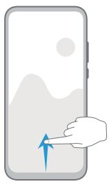
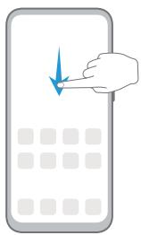
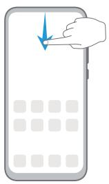

# 华为平板C5e

# 用户指南

# 目 录

# 基础使用

常用手势 1

系统导航 2

锁屏与解锁 3

了解桌面 3

常见图标含义 4

快捷开关 5

桌面窗口小工具 5

更换壁纸 6

截屏和录屏 6

查看和关闭通知 7

调整音量 8

输入文本 8

分屏与悬浮窗 12

开关机和重启 12

充电 13

# 智慧功能

智慧视觉 15

平板投屏 17

华为分享 17

# 相机图库

打开相机 20

拍照 20

全景拍摄 21

HDR 拍摄 21

动态照片 21

照片添加水印 22

专业相机 22

延时摄影 23

相机滤镜 24

相机设置 24

管理图库 24

图库智能分类 28

# 应用

联系人 30

电话 32

信息 36

日历 37

<table><tr><td>时钟</td><td>39</td></tr><tr><td>备忘录</td><td>40</td></tr><tr><td>录音机</td><td>42</td></tr><tr><td>电子邮件</td><td>43</td></tr><tr><td>计算器</td><td>45</td></tr><tr><td>应用分身</td><td>45</td></tr><tr><td>打开应用常用功能</td><td>46</td></tr><tr><td>平板管家</td><td>46</td></tr><tr><td>华为手机助手</td><td>48</td></tr></table>

# 设置

<table><tr><td>WLAN</td><td>50</td></tr><tr><td>更多连接</td><td>51</td></tr><tr><td>桌面和壁纸</td><td>54</td></tr><tr><td>显示和亮度</td><td>55</td></tr><tr><td>声音和振动</td><td>57</td></tr><tr><td>通知</td><td>60</td></tr><tr><td>生物识别和密码</td><td>61</td></tr><tr><td>应用</td><td>62</td></tr><tr><td>电池</td><td>62</td></tr><tr><td>存储</td><td>63</td></tr><tr><td>安全</td><td>64</td></tr><tr><td>隐私</td><td>65</td></tr><tr><td>辅助功能</td><td>67</td></tr><tr><td>系统和更新</td><td>68</td></tr><tr><td>关于平板电脑</td><td>72</td></tr></table>

# 基础使用

# 常用手势

# 常用手势

# 全面屏导航手势

进入 设置 > 系统和更新 > 系统导航方式，确保选择了手势导航。

/e7d590923475e688e5a5f295c42bb125ae9032690c41130892ef115a6bb2b8a5.jpg)

/b6786a8b5f63b9c508f1d4304f3aba2dada9fdb6e2949964420dea5c1c749f39.jpg)

natural_image

Illustration of a hand pressing a button on a smartphone screen (no text or symbols)

/a3f324a019c5a56229b10f02ad166e5515318d2b5bbe4692827ddc119b2010ee.jpg)

natural_image

Illustration of a hand pressing a button on a smartphone screen (no text or symbols)

/76af3b7f018e6195de75d849dbd04292c5abe511522321dbfded22d6f91fa7c1.jpg)

natural_image

Illustration of a hand pressing a blue arrow on a smartphone screen (no text or symbols)

# 更多手势

/31af7cf27ea89435dfd390fd0f86fbfbc9e90d5347a481bb6fb0fc212ff681ba.jpg)

#

<table><tr><td></td><td>进入锁屏快捷操作面板锁屏后,点亮屏幕,然后单指从底部上滑</td></tr><tr><td></td><td>打开搜索从桌面中部向下滑动,打开搜索框</td></tr><tr><td></td><td>打开快捷开关和通知消息从屏幕顶部下滑</td></tr></table>

# 系统导航

# 手势导航

进入 设置 > 系统和更新 > 系统导航方式，开启或关闭手势导航。

开启手势导航后，您可以：

• 返回上一级菜单：从屏幕左边缘或右边缘向内滑动。  
• 返回桌面：从屏幕底部边缘中间上滑。  
• 进入多任务：从屏幕底部边缘向上滑并停顿。  
• 结束单个任务：进入多任务界面时，上滑单个任务卡片。

# 三键虚拟导航

进入 设置 > 系统和更新 > 系统导航方式，选择屏幕内三键导航。

您还可以根据使用习惯，进入更多设置，选择不同的导航栏组合。

开启屏幕内三键导航后，您可以：

返回键：点击返回上一级菜单或退出应用程序。在文字输入界面，点击关闭屏幕键盘。  
• 主屏键：点击返回主屏幕。  
最近键：点击进入多任务管理界面。

/0db291452596b74b232d419343ca6f55a44a8eb76ae988f97643184487e8a86c.jpg)

下拉通知键：点击打开通知面板。

# 修改屏幕内三键导航样式

进入屏幕内三键导航 > 更多设置，您可以：

• 选择不同的导航栏组合样式。  
• 打开导航键可隐藏开关，在不使用导航键时将其隐藏。

# 锁屏与解锁

# 锁屏与解锁

# 锁定屏幕

一段时间不操作平板，平板将自动锁屏。

您也可以通过以下方式手动锁定屏幕：

• 按电源键锁定屏幕。  
• 在主屏幕，双指捏合进入主屏幕编辑模式，点击窗口小工具，将一键锁屏快捷图标添加到主屏幕。然后点击一键锁屏图标锁屏。

# 设置自动锁屏时间

进入 设置 > 显示和亮度 > 休眠，选择对应的屏幕自动休眠时长。

# 点亮屏幕

您可以通过以下方式点亮屏幕：

• 按电源键点亮屏幕。

• 进入 设置 > 辅助功能 > 快捷启动及手势 > 亮屏，开启并使用拿起设备亮屏或双击亮屏。

# 输入密码解锁

点亮屏幕后，从屏幕中部向上滑动，会出现密码输入面板。输入锁屏密码即可。

# 使用人脸解锁

点亮屏幕后，将平板对准人脸。平板会自动进行人脸识别校验，校验成功后即可解锁。

# 了解桌面

# 了解桌面

在桌面上，您可以：

• 通过顶部状态栏查看平板状态、通知消息。  
• 左右滑动查看应用、桌面小工具。

# 常见图标含义

# 常见图标含义

i 网络状态图标可能因您所在的地区或网络服务提供商不同而存在差异。

不同产品支持的功能有差异，以下图标可能不会出现在您的平板上，请以平板实际显示为准。

<table><tr><td>5G</td><td>5G 网络已连接</td><td>4G</td><td>4G 网络已连接</td></tr><tr><td>3G</td><td>3G 网络已连接</td><td>2G</td><td>2G 网络已连接</td></tr><tr><td></td><td>信号满格</td><td></td><td>正在漫游</td></tr><tr><td></td><td>已开启省流量模式</td><td></td><td>未插入 SIM 卡</td></tr><tr><td></td><td>已开启热点</td><td></td><td>已连接至热点</td></tr><tr><td></td><td>正在通话</td><td></td><td>VoLTE 高清通话已开启</td></tr><tr><td></td><td>已连接至 WLAN 网络</td><td></td><td>正在使用天际通</td></tr><tr><td></td><td>热点已断开</td><td></td><td>正在通过 WLAN+ 自动切换网络</td></tr><tr><td></td><td>飞行模式已开启</td><td></td><td>闹钟已开启</td></tr><tr><td></td><td>电池无电量</td><td></td><td>电池电量低</td></tr><tr><td></td><td>正在充电</td><td></td><td>正在使用快充</td></tr><tr><td></td><td>正在使用超级快充</td><td>[S4H5]</td><td>无线超级快充</td></tr><tr><td></td><td>无线快充</td><td>[2TKA]</td><td>普通无线充电</td></tr><tr><td></td><td>省电模式已开启</td><td>[60XY]</td><td>健康使用平板已开启</td></tr><tr><td></td><td>蓝牙已开启</td><td>[47TA]</td><td>蓝牙设备电量</td></tr><tr><td></td><td>已连接蓝牙设备</td><td></td><td>已连接至 VPN 网络</td></tr><tr><td></td><td>已进入驾驶模式</td><td>[23HK]</td><td>已连接至投屏设备</td></tr><tr><td></td><td>位置服务已开启</td><td></td><td>护眼模式已开启</td></tr><tr><td></td><td>已连接耳机</td><td></td><td>已连接带麦克风的耳机</td></tr><tr><td></td><td>有未接来电</td><td></td><td>有新消息</td></tr><tr><td></td><td>麦克风已被禁止</td><td></td><td>静音模式</td></tr><tr><td></td><td>更多未显示的信息</td><td></td><td>振动模式</td></tr><tr><td></td><td>NFC 已开启</td><td></td><td>免打扰模式已开启</td></tr><tr><td></td><td>数据同步中</td><td></td><td>数据同步失败</td></tr><tr><td></td><td>性能模式已开启</td><td></td><td>收到新邮件</td></tr><tr><td></td><td>收到日程提醒</td><td></td><td></td></tr></table>

# 快捷开关

# 快捷开关

# 打开快捷开关

从屏幕顶部状态栏下滑出通知面板，继续向下滑出整个菜单。

• 点击快捷开关，开启或关闭相应功能。  
• 长按快捷开关，进入对应功能的设置页面（部分功能支持）。  
• 点击 进入设置界面。

# 自定义快捷开关

点击 ，然后长按并拖动快捷开关调整位置。

# 桌面窗口小工具

# 桌面窗口小工具

您可以根据需要添加、移动或删除桌面窗口小工具，包括一键锁屏、天气、备忘录预览、联系人、日历等。

# 添加天气、时钟等桌面小工具

1 在桌面上双指捏合，进入桌面编辑状态。  
2 点击窗口小工具，然后可以向左滑动查看所有小工具。

3 部分小工具（如天气）会有多种样式，点击该图标可以展开所有的样式。向右滑动展开的样式，可以收拢。  
4 点击需要的小工具图标，即可将其添加到当前屏幕。如果当前屏幕没有空间，您可以长按并拖动该图标，将其添加到其它屏幕。

# 移动或删除窗口小工具

在桌面，长按一个窗口小工具直到平板振动，然后可将其拖动到桌面的任意位置。或点击移除将其删除。

# 更换壁纸

# 更换壁纸

# 使用自带的壁纸

1 进入 设置 > 桌面和壁纸 > 壁纸。  
2 选择一张图片。  
3 根据需要选择：

虚化：让壁纸呈现出模糊、虚化的效果。滑动滑块可以调节虚化程度。  
滚动：让壁纸能跟随屏幕滑动。

4 点击 ，选择将其设为锁屏、设为桌面或同时设置。

# 将图库中的照片设为壁纸

1 进入 图库，找到您喜欢的图片。  
2 点击 > 设置为 > 壁纸，根据屏幕提示完成设置。

# 截屏和录屏

# 截屏

使用组合键截取屏幕

同时按下电源键和音量下键截取完整屏幕。

# 使用快捷开关截取屏幕

从屏幕顶部状态栏下滑出通知面板，继续向下滑出整个菜单，点击 截取完整屏幕。

# 使用三指下滑截屏

1 进入 设置 > 辅助功能 > 快捷启动及手势 > 截屏，确保三指下滑截屏开关已开启。  
2 使用三指从屏幕中部向下滑动，即可截取完整屏幕。

# 分享、编辑或继续滚动截长图

截屏完成后，左下角会出现缩略图。您可以：

• 向下滑动缩略图，可以继续滚动截长屏。

0 不同产品所支持的功能可能有差异，请以实物为准。

• 向上滑动缩略图，选择一种分享方式，快速将截图分享给好友。

• 点击缩略图，可以编辑、删除截屏。

截屏图片默认保存在图库中。

# 录屏

您可以将屏幕操作过程录制成视频，分享给亲朋好友。

# 使用组合键录屏

同时按住电源键和音量上键启动录屏，再次按住结束录屏。

# 使用快捷开关录屏

1 从顶部状态栏向下滑出通知面板，继续向下滑出整个菜单。  
2 点击屏幕录制，启动录屏。   
3 点击屏幕上方的红色计时按钮，结束录屏。  
4 进入图库查看录屏结果。

# 边录屏，边解说

录屏时，您还可以开启麦克风，边录屏，边解说。

启动录屏后，点击麦克风图标让其处于 ，就可以同步记录声音。

/cee551bc812dc44b0f22e171e8cec3631d13beca4286360df6e5be3977e631c3.jpg)

表示麦克风关闭。此时仅可以收录系统音（如：音乐）。如您不想收录任何系统音，请在前将平板调成静音并关闭音乐等媒体音。

# 查看和关闭通知

# 查看和关闭通知

# 查看通知

当有通知提醒时，您可以点亮屏幕，从状态栏向下滑动，打开通知面板，查看各类消息。

# 清除通知

• 在通知面板上，快速向右滑动，可以清除该条通知。  
• 点击通知面板底部的 ，清除所有通知。

# 关闭、设为静默通知或延后提醒

向左滑动需要处理的通知项，然后点击 ，可选择关闭通知、设为静默通知、延后提醒等。部分系统通知不能被关闭、清除或延后。

# 调整音量

# 调整音量

# 按音量键调整音量

按音量上键或下键即可调大、调小音量。

# 按电源键快速静音

来电、闹铃响起时，按电源键可快速静音。

# 设置默认音量

进入 设置 > 声音和振动，您可以分别设置以下各类声音的默认值：

• 媒体（视频、游戏、音乐等）  
• 铃声  
• 闹钟   
• 通话

WLAN only 版本的平板不支持通话业务，请以实际情况为准。

# 通过快捷开关切换响铃或静音模式

1 从顶部状态栏向下滑出通知面板，继续向下滑出整个菜单。  
2 点击 响铃、 静音，可以在不同的模式之间快速切换。

# 输入文本

# 百度输入法华为版

百度输入法华为版由百度和华为联合开发，支持多种输入方式、键盘布局、输入语言、皮肤等，满足您的多种输入需求。

# 输入文本

当您需要输入文本时，点击屏幕，平板会自动弹出输入键盘。

键盘默认采用拼音9键布局，依次点击拼音字母，上方词条会出现联想词，点击即可输入。

/da85faafa8899dcfafd15e9ccecffa424307c6392d9ab36691b1aece38aca369.jpg)

text_image

更多设置
嗯 我 你好 哦 在
分词 ABC DEF
GHI JKL MNO
PQRS TUV WXYZ
符号 中/英 123
输入表情
换行
点击切换中英文输入法
长按可选择输入法、更
多语言
切换大小写
双击锁定大写
长按语音输入
?123 英/中 · ? 换行
输入数字或字符

按住字母键，上滑可输入数字，向左或向右滑动，可以输入字母。

/6993d80457a824baa54349b43b810ad419a92326d3efd4b99f32380acee6c7c4.jpg)

text_image

嗯 我 你好 哦 在
JKL5 jkl
4 GHI 5 JKL 6 MNO
? 7 PQRS 8 TUV 9 WXYZ
换行
符号 中/英 0 123

如您习惯 26 键布局，长按左下角的中英文切换键，然后选择“拼音26键”。

/713adc5939603210f0c227b1314c337af1201eec4052f4d1121895c23fe32f1f.jpg)

text_image

1 2 3 4 5 6 7 8 9 0
q w e r t y u i o p
! @ # $ % & * ( )
a s d f g h j k l
换大小写
双击锁定大写
长按语音输入
?123 英中 · ? 😊 换行
输入数字或字符

0 使用百度输入法华为版的不同皮肤，按键快捷功能会有差异。如需完整体验上述快捷功能，请切换至默认皮肤。

# 更改键盘布局或输入方式

您可以通过以下任意一种方式切换键盘布局或输入方式：

• 长按左下角的中英文切换键，然后选择拼音26键、拼音9键、手写、五笔等。

• 点击 > 输入方式，然后选择拼音26键、拼音9键、手写、五笔等。

# 使用手写输入

1 长按左下角的中英文切换键，选择手写。

2 在手写面板内书写文字，点击上方的文字联想确认您要输入的文字。  
3 您还可以点 击 ，选择全屏或半屏作为手写面板。

# 切换输入语言

长按左下角的中英文切换键，在弹出的快捷面板中选择一种语言。

或点击更多语言，根据提示下载并勾选需要的语言，将其添加到快捷面板。再次打开输入面板，平板会提示您切换为新的语言。

# 使用语音输入

说出要输入的内容，平板会自动转成文本，还支持将说出的内容翻译成其他语言。

1 长按空格键，待平板振动后，进入语音输入界面。  
2 点击 ᮛ ，根据提示选择输入语言，或要翻译的语言。  
3 点击 ，对着麦克风开始说话。  
4 点击返回关闭语音输入。

# 开启短信验证码自动填充

百度输入法华为版可直接提取短信中的验证码，无需从短信中复制再粘贴。

首次在信息中使用输入法时，平板会提示您开启短信验证码自动填充，请根据提示选择下一步 > 始终允许。

如您错过初次设置，也可以进入设置 > 应用 > 应用管理 > 百度输入法华为版 > 权限 > 信息 ，选择允许。

当收到短信验证码时，验证码会自动出现在输入面板的候选词条中，点击即可填充。

0 部分应用发送的验证码无法提取，需要手动复制粘贴。

# 更换输入法皮肤

输入法支持多种个性化皮肤，如 CHERRY 经典黑、经典版皮肤等。

不同皮肤的视觉效果、数字键盘布局、符号键布局、快捷按键等存在差异，您可以按照个人喜好选择适合的皮肤。

点击 > 超级皮肤，在本地或精品下查找并启用需要的皮肤。

# 编辑文本

您可以对文本进行选取、复制、剪切、粘贴和分享等操作。

1 在要选择的文字上长按，直至出现 。

在不同的应用程序中长按文字出来的结果可能不一样。请根据界面提示进行操作。

2 拖动 和 选择文字，或点击全选选择全部文字。

3 根据需要，点击复制或剪切。

4 在要插入文本的位置长按直至出现粘贴，然后点击粘贴。

# 分屏与悬浮窗

# 分屏

将平板屏幕一分为二，可以同时使用两个应用。

# 启动分屏

部分应用不支持分屏，请以实际情况为准。

1 打开一个应用。  
2 通过以下任一方式进入分屏：

• 三指从屏幕内上滑。为避免误触，请勿从屏幕底部边缘上滑。  
• 当您使用手势导航时，从屏幕下方上滑并停顿进入多任务管理界面，点击应用右上角的  
当您使用三键导航时，长按

3 打开另一个应用。

# 调整分屏比例

拖动两个屏幕分界线中间的 ，调整分屏比例。

# 关闭分屏

点击两个屏幕分界线中间的 ，然后点击 关闭分屏。

# 开关机和重启

# 开关机和重启

# 将平板开机或关机

若要将平板关机，请长按电源键几秒钟，直至平板弹出关机菜单，依次点击关机和点击关机。

若要将平板重新开机，请长按电源键几秒钟，直到平板振动、出现开机标志。

# 重启平板

经常重启平板，可以清理平板缓存，让平板保持在良好状态。如果平板不能正常工作，也可以尝试重启平板。

长按电源键几秒钟，直至平板弹出重启菜单，依次点击重启和点击重启。

# 强制重启平板

如果平板不能正常工作，也无法正常关机，可以尝试强制重启平板。

长按电源键 10 秒以上，强制重启平板。

# 充电

# 给平板充电

当电池电量过低时，平板会提示您及时充电。为避免电量不足，导致平板自动关机，请及时充电。

# 充电注意事项

• 请使用随机配送的充电器和数据线给平板充电。使用非原装充电器或数据线，可能会导致重启、充电慢、充电器过热或其他异常情况发生。  
• 通过数据线将平板连接到充电器或其他设备后，平板会自动检测 USB 端口。如端口潮湿，平板会启动保护措施而停止充电。此时请断开连接，待端口干燥后再充电。  
• 充电时间会随温度和电池使用情况而变化。  
• 电池属于易损耗品，如果发现待机时间大幅度降低，则需要更换电池。请联系本公司授权的客户服务中心更换。  
• 请勿在平板和充电器上覆盖物体。  
• 平板在长时间或高温环境下工作后，可能出现发热，这属于正常现象。感觉发热时，请停止充电并关闭部分应用，并将平板移至阴凉处。  
• 建议您在充电时，避免使用平板。  
• 若按下电源键平板无任何反应，表明电池电量已耗尽。请充电 10 分钟以后再开机。

# 使用标配的充电器充电

1 使用随机配送的数据线连接充电器和平板。  
2 将充电器插入电源插座。

# 通过电脑为平板充电

1 通过数据线将平板连接至电脑或其他设备。  
2 当平板弹出 USB 连接方式对话框时，点击仅充电。  
如果 USB 连接方式已经设置为其他模式，从屏幕顶端状态栏下滑出通知面板，点击设置，选择仅充电。

# 了解电池图标含义

您可以通过平板屏幕上的电量图标，判断当前的电池状态。

<table><tr><td>电池图标</td><td>电池电量状态</td></tr><tr><td></td><td>电池电量小于4%。</td></tr><tr><td></td><td>充电过程中,电池电量小于10%。</td></tr><tr><td></td><td>充电过程中,电池电量介于10%和90%之间。</td></tr><tr><td></td><td>充电过程中,电池电量大于90%。当状态栏上电量显示100%或在锁屏界面上有已充满提示时,表示电池电量已经充满。</td></tr></table>

# 智慧功能

# 智慧视觉

# 智慧视觉的多个入口

您可以通过多个入口打开智慧视觉。

相机入口

打开相机，进入拍照模式，可看到智慧视觉入口，点击 ，进入智慧视觉。

搜索栏入口

非锁屏状态下，在屏幕中部单指下滑打开搜索栏，可看到智慧视觉的入口，点击 ，进 r入智慧视觉。

锁屏入口

O 锁屏状态下，在屏幕底部单指上滑，可看到智慧视觉的入口，点击 ， 解锁屏幕后进入智慧视觉。

# 扫码，服务一步直达

智慧视觉可以扫描多种二维码和条形码（支付、购物、社交、连接设备、访问网站、添加联系人等），扫描后可直接跳转到服务页面，让服务一步直达。

1 打开相机，点击 ，点击 。

2 将相机镜头对准二维码或条形码，静待扫码结果呈现。

3 点击 ， 可识别保存在图库中的二维码或条形码图片。

# 外文随扫随译

到国外旅游看不懂路牌或者菜单？读不懂药瓶或者化妆品瓶上的外文说明？使用智慧视觉的翻译功能，将相机镜头对准外文，即可随扫随译。

1 打开相机，点击 ，点击

2 在语言选择列表中选择原语言和译文语言。

3 将镜头对准要翻译的文字，静待翻译结果，或者点击 文 拍照翻译。

4 点击 ， 可对保存在图库中的图片进行翻译。

5 点击 可分享和保存翻译结果。 $\vdots$

# 对着物品扫一扫，轻松购物

逛街或者翻看杂志，看到心仪物品，使用智慧视觉的购物功能，将相机镜头对准物品，轻松获取该物品在多个购物平台的购买链接。

1 打开相机，点击 点击 。   
2 将镜头对准要购买的物品，静待识别结果。或者点击 拍照购物。  
3 点击 ， 可对图库中图片上的物品进行识别和购买。

# 食物卡路里一扫便知

想保持身材，守护健康？使用智慧视觉的卡路里功能，只需将相机镜头对准食物，就能知道它的重量、卡路里和营养成分。

1 打开相机，点击 ，点击 。   
2 将镜头对准食物，即可查看食物的重量、卡路里和营养成分。  
3 点击 可分享和保存识别结果。

# 百科信息一扫便知

遇到感兴趣的目标，如新奇的植物、动物、炫酷的汽车、名画、地标建筑等，打开智慧视觉的识物功能，只需将相机镜头对准目标，就能轻松识别和查看相关信息。

1 打开相机，点击 点击   
2 将镜头对准要识别的目标，静待识别结果。或者点击 拍照识别。   
3 点击 ，可对图库中图片上的物品进行识别。  
4 如果识别到多个目标，可通过点击目标上的标记点快速切换和查看识别结果。  
5 点击识别结果中的服务卡片，可获取更多信息。点击 可分享和保存识别结果。

# 餐厅评分和优惠券一扫便知

在不熟悉的餐厅就餐，使用智慧视觉的扫店招功能，只需将相机镜头对准餐厅的招牌，即可轻松获取餐厅的评分、人均消费、优惠券等信息。

1 打开相机，点击 点击   
2 将镜头对准餐厅的招牌，静待扫描后，可以看到显示餐厅的评分、人均消费、优惠券信息的卡片。  
3 点击卡片，可进一步查看到更详细的信息。

# 对着文档扫一扫，智慧识文

智慧视觉的识文功能，可提取纸质文档中的内容，分析后提供分词、第三方服务的链接。例如您可以：

• 扫名片：直接把联系人增加到通讯录中。  
• 扫文档：提取纸质文档上的内容。此外，会为一些特殊词语提供第三方应用链接，方便您快速访问。例如：

• 文档中有名人的名字，可直接访百科、微博等。  
• 文档中有饭店名称可直接查看评分、人均消费信息，还有电话、打车、导航等链接。  
• 文档中有歌曲或电视剧名字可直接打开媒体APP欣赏。

• 扫题：可获取参考答案，查看类似题目等。

1 打开相机， ，点击 。  
2 将镜头对准文档，静待识别后，点击屏幕，拖动光标选择识文范围。  
3 点击复制文字，可复制所选择的文字。  
4 点击智慧识屏，可对所选文字进行分词，并提供第三方服务的链接。  
5 点击扫题，可完成扫题操作。

# 平板投屏

# 无线投屏

将平板通过无线投屏连接至大屏显示器（如电视机），使用大屏进行办公和娱乐。

1 根据您的大屏设备型号和功能，选择如下操作：

• 如果大屏支持 Miracast 协议，在大屏上开启无线投屏的设置开关。  
• 如果大屏不支持 Miracast 协议，将无线投屏器插入大屏的 HDMI 接口中，并连接无线投屏器的电源线。

如果您不了解大屏设备是否支持 Miracast 协议或者如何在大屏端开启无线投屏，您可以查阅大屏设备的说明书或咨询设备厂家。

2 在平板端从屏幕顶部状态栏下滑出通知面板，点击 开启 WLAN。  
3 继续向下滑出整个菜单，开启无线投屏，平板开始搜索大屏设备。

您也可以进入 设置 > 更多连接 > 无线投屏，开启无线投屏开关。

4 在设备列表选择对应的大屏设备名，完成投屏。如果您使用的无线投屏器，则选择无线投屏器设备名。

# 华为分享

# 华为分享

华为分享是一种设备间无线快速共享图片、视频、文档等文件的技术。它通过蓝牙发现周边其他支持华为分享的设备，然后通过 WLAN 直连传输文件，传输过程不需要流量。

# 开启或关闭华为分享

执行以下任一操作开启或关闭华为分享：

• 从屏幕顶部状态栏下滑出通知面板，继续向下滑出整个菜单。点击 开启或关闭华为分享。长按进入华为分享设置界面。

• 进入 设置 > 更多连接 > 华为分享，开启或关闭 Huawei Share 开关。

开启华为分享后，WLAN 和蓝牙开关会自动打开。

# 通过华为分享在平板间极速共享文件

通过华为分享可在华为平板间快速共享文件，接收端在接收前可预览，接收后直接呈现接收到的内容。例如：图片/视频接收成功后，直接调用图库预览此图片/视频； APP 接收成功后，直接进入安装界面等。

1 在接收设备上，开启 Huawei Share 开关。  
2 在发送设备上，长按选中待分享文件，点击 。然后点击 Huawei Share，发现接收设备后，点击接收设备名称发送文件。

如果在应用中直接分享，操作路径可能有所不同，请以实际情况为准。

3 在接收设备上点击接收开始接收文件。

在接收设备上，进入实用工具 > 文件管理，在分类页签下点击内部存储 > Huawei Share 查看接收到的文件。

接收到的图片或视频也可以在 图库 > 相册 > 华为分享 中直接查看。

# 通过华为分享进行一键打印

当周围有支持华为分享一键打印的打印机时，打开平板华为分享便能轻松发现并一键打印存于平板中的图片、PDF 文件。

1 针对不同类型的打印机，需做好如下准备：

• WLAN 打印机：启动打印机，并确保打印机与平板接入同一网络。  
• WLAN 直连打印机：启动打印机，在面板中选择 WLAN Direct 进入，然后进入设置，开启 WLAN Direct 开关。  
蓝牙打印机：启动打印机，并确保打印机蓝牙处于可发现状态。

2 在平板上预览要打印的文件，点击分享 > 华为分享。  
3 平板发现打印机后，点击打印机名称，在预览界面调整参数，点击开始打印。

若使用蓝牙打印机，首次连接时，需要在平板发现打印机并点击打印机名称后，按住打印机电源键 1 秒左右确认连接。

0 如需了解支持华为分享一键打印的打印机型号，请在华为分享的分享界面，点击了解详情，然后选择打印机，点击支持的打印机型号有哪些。

# 通过华为分享在平板与智慧屏间共享文件

无需 USB 数据线，通过华为分享即可在平板和华为/荣耀智慧屏快速共享图片、视频。

1 平板开启 Huawei Share 开关。  
2 在智慧屏首页点击右上角设置图标，选择通用 > 华为分享。根据界面提示，开启智慧屏华为分享开关。  
3 您可以按照以下方式互传图片或视频：

# 从平板传到智慧屏：

a 在平板端打开任意图片/视频，点击分享。  
b 在设备列表中，选择对应的智慧屏名称。  
c 在智慧屏提示框中，点击接受。  
d 文件传输完成后，在智慧屏提示框中，点击查看，即可查看已传输的图片或视频。

# 从智慧屏传到平板：

a 在智慧屏首页选择全部应用 > 媒体中心。  
b 选择任意图片，全屏播放。按遥控器菜单键，在底部提示框中选择分享。  
c 在设备列表中，选择对应的平板名称。  
d 在平板提示框中，点击接收。文件传输完成后，在平板提示框中，选择点击查看，即可查看已传输的图片。

# 相机图库

# 打开相机

# 打开相机

您可以通过多种方式启动相机。

# 在桌面打开相机

在桌面上，打开 相机。

# 在锁屏界面打开相机

锁屏时，点亮屏幕，按住右下角的相机图标并上滑，启动相机。

# 拍照

# 拍照

1 打开 相机。   
2 您可以进行以下操作：

对焦：轻触屏幕中想要重点突出的位置。  
若要分离对焦点和测光点，可在取景框中长按，待对焦框和测光框同时出现时，分别拖动到需要的位置。  
调节画面明暗：轻触屏幕，上下滑动对焦框旁的 。  
• 放大或缩小画面：在屏幕上，双指张开/捏合，或滑动屏幕旁的变焦条，放大/缩小画面。  
选择相机模式：在相机模式区域，左右或上下滑动，选择一种模式。  
• 打开或关闭闪光灯：点击 ，选择 （自动）、 （开）、 （关）或 （常亮）。

0 并非所有模式支持以上操作，请以实际情况为准。

3 点击 开始拍摄。

# 设置定时拍照

合影时，使用定时拍照功能，无需求助他人帮忙。只需定好取景画面，按下快门，相机将在倒计时结束后自动拍照。

1 打开 相机。   
2 进入 > 定时 拍摄 ，选择需要的定时时长。  
3 回到拍摄界面，点击快门后，平板将在倒计时结束后自动拍照。

# 使用声控拍照

无需手动点击快门，持稳平板，或将平板放置在三脚架上，说出拍照口令，即可拍照。

1 打开 相机。   
2 进入 > 声控拍照，打开声控拍照开关，选择需要的拍照口令。  
3 回到拍照界面，说出设置的口令，即可拍照。

# 全景拍摄

# 全景拍摄

当拍摄壮丽河山、集体合照等大幅照片时，您可使用全景模式，在拍摄过程中移动相机，将捕获的画面合成一幅宽广的全景照片。

# 使用后置摄像头拍摄全景照片

1 进入 相机 > 更多，选择全景模式。  
2 点击屏幕下方的 ，选择相机移动方向为水平或垂直。  
3 将镜头对准拍摄起点，点击 ，开始拍摄。  
4 持稳平板，让镜头朝着箭头指示方向缓慢移动，保持箭头顶点始终位于中心线上。  
5 点击 完成拍摄。

# HDR 拍摄

# HDR 拍摄

当在逆光、明暗光反差比较大的场景下拍摄时，使用相机 HDR，可以同时提升照片暗部和亮部的效果，让照片细节更出众。

# 拍摄后置 HDR 照片

1 进入 相机 > 更多，选择 HDR模式。  
2 使用三脚架固定或持稳平板。  
3 点击 拍摄。

# 动态照片

# 动态照片

动态照片可以捕捉按动快门前后各约 1 秒左右的画面和声音，帮您拍下可能错过的精彩瞬间。

# 拍摄动态照片

进入 ○ 相机 > 更多 > 动态照片，点击 进行拍摄。

# 查看动态照片

拍摄完成的动态照片将以 JPG 格式保存在图库中。

进入 图库 > 相册 > 相机，点击动态照片，然后点击照片顶端的 ，查看动态照片效果。动态照片效果会在播放完成后自动停止，您也可点击屏幕，提前停止播放。

# 分享动态照片

通过 WLAN 直连、蓝牙、华为分享等方式，可以将动态照片分享到华为/荣耀设备。

进入 图库 > 相册 > 相机，长按勾选要分享的动态照片，点击 ，按提示完成分享。分享到第三方应用或不支持的设备时，动态照片将以静图形式显示。

# 将动态照片另存为视频或 GIF

若要将动态照片转存为 GIF 或视频，在相册中，点击要处理的动态照片进入详情页，然后点击，选择另存为视频或另存为 GIF。

# 照片添加水印

# 拍摄带水印的照片

您可以为相片增加时间、地点、天气、心情、美食等水印。

1 进入 相机 > 更多，选择水印模式。如您在更多中没有找到水印，请在更多中点击 ，下载水印。

2 点击 ，选择水印，选择的水印会出现在取景框内。  
3 拖动水印，可改变水印的位置。部分水印的文字可点击修改。  
4 点击 拍照。

# 专业相机

# 专业相机

当您想在拍摄时自由调节相机的对焦方式、测光方式、曝光补偿等参数，让照片和视频呈现更专业的效果，可以使用专业模式。

1 打开 相机 > 更多，选择专业模式。

# 2 • 调整测光方式：点击 M，选择测光方式。

<table><tr><td>测光方式</td><td>适用场景</td></tr><tr><td>矩阵测光</td><td>对画面整体测光。适合拍摄自然风光。</td></tr><tr><td>中央重点测光</td><td>重点对画面中央区域测光。适合拍摄人像等。</td></tr><tr><td>点测光</td><td>对画面中心极小的区域测光(如人物的眼睛等)。</td></tr></table>

• 调节 ISO 感光度：点击 ISO，滑动 ISO 调节区。

当光线较弱时，可提高 ISO 感光度；当光线充足时，可降低 ISO 感光度，避免画面出现过多噪点。

调节快门速度：点击 S，滑动快门速度调节区。

快门速度会影响相机的进光量，当拍摄静止风景、人像时，可调低快门速度；当拍摄运动风景、人像时，可调高快门速度。

调节曝光补偿值：点击 EV·，滑动 EV 调节区。

当光线较弱时，可以调高 EV 值；当光线较强时，调低 EV 值。

调节对焦：点击 AF·，选择对焦模式。

<table><tr><td>对焦模式</td><td>适用场景</td></tr><tr><td>AF-S 单次对焦</td><td>静止人物、风景等。</td></tr><tr><td>AF-C 连续对焦</td><td>运动人物、风景等。</td></tr><tr><td>MF 手动对焦</td><td>点击需要突出的部位(如人物面部)进行对焦拍摄。</td></tr></table>

调节色彩基调：点击 WB·，选择白平衡。

如在日光下，可选择 1 在阴天或阴暗环境下，选择 $\frac { 1 1 1 1 } { 1 1 1 1 }$ 。

点击 ，可改变色温，让画面呈现较冷或较暖的色调。

# 3 点击快门拍照或录像。

# 延时摄影

# 延时摄影

使用延时摄影，可将连续几分钟、几小时的视频压缩成一段快速播放的短片，记录下花蕾绽放、云卷云舒等变化过程。

1 进入 相机 > 更多，选择延时摄影模式。

2 在要拍摄的位置放置好平板。为减小拍照过程中的抖动，建议您使用三脚架固定平板。

3 点击 开始拍摄，点击 结束拍摄。

拍摄完成后，您可以在图库中查看生成的延时摄影短片。

# 相机滤镜

# 相机滤镜

1 打开 相机，选择拍照或录像模式。  
2 点击 或 ，选择一种滤镜，预览效果。

0部分平板无 图标，请以平板界面显示为准。

3 点击快门拍照或录像。

# 相机设置

# 相机设置

根据使用习惯调整相机设置，可以让您更快捷地拍摄。

0 并非所有模式支持以下设置，请以实际情况为准。

# 开启地理定位

打开记录地理位置信息开关。开启后，拍摄的照片和视频会带有地理位置信息。

# 使用参考线辅助拍照

使用参考线辅助取景，可以帮您更好的取景构图。

1 进入 相机 > 。  
2 打开参考线开关。  
3 开启参考线后，取景框将出现九宫格参考线。将拍摄主体放在交叉点上，点击快门拍摄。

# 自动抓拍笑脸

打开笑脸抓拍开关。拍照时，相机检测到取景框内出现笑脸时，将自动进行抓拍。

# 使用水平仪辅助构图

1 点击 ，进入相机设置界面。  
2 打开水平仪开关，开启后，取景界面将出现水平辅助线。当水平辅助线的虚线与实线重合时，表明平板处于水平位置，可避免因平板不正而导致的构图倾斜。

# 管理图库

# 查看图片和视频

在图库中，您可以查看、编辑和分享图片和视频。

# 按拍摄时间查看

/c2f9e368518aa10cfe266493f8cfdf6c782e94e21998ca44134c03ac558ca941.jpg)

图库中，您可以按时间和地点浏览图片和视频，也可以通过相册查看。

在照片页签，两指分开或合拢，缩放屏幕，可以按月视图或日视图布局，查看图片和视频。

# 按拍摄地点查看

若在拍摄时，相机设置页面的记录地理位置信息开关已打开，您可以通过地图模式查看这些图片和视频。

1 在图库中，点击 > 设置，打开地图相册功能开关。  
2 在照片页签，点击 ，包含位置信息的图片或视频将标记在对应的拍摄地点。  
3 两指分开放大地图，可查看图片的详细拍摄地点。点击图片缩略图，可查看在该地点拍摄的所有图片和视频。

# 按相册查看

在相册页签，您可以按相册查看图片和视频。

部分图片和视频存放在系统指定的默认相册内。例如，使用相机拍摄的照片、视频保存在相机内，截屏、录屏文件保存在截屏录屏内。

# 按图库智能分类查看

在发现页签，图库会智能识别图片内容并分类展示。

您可以点击已识别的分类相册查看，如人像、地点、美食、风景等。

# 查看图片和视频详细信息

1 点击任意图片或视频，可进入全屏查看，再次点击屏幕隐藏菜单。

2 全屏查看时，您可以点击 ，在弹出的详细信息窗口中，查看图片和视频的存储路径、分辨率、大小等参数信息。

若查看的图片位于云端，默认查看缩略图的信息。

# 搜索图片

在图库中输入时间、地点、事物等关键词，可以快速搜图。

1 打开 图库，在屏幕顶端的搜索栏输入要搜索的关键词。

2 输入图片关键词（如“美食”、“风景”、“身份证”、“银行卡”等）。

3 图库会为您呈现与关键词相关的图片，并推荐相关关键词。点击关键词，或继续输入关键词，可进行更精确的搜索。

# 编辑图片和视频

使用图库的编辑功能，您可以对图片和视频实现自定义编辑。

# 基本图片编辑

1 打开 图库，点击图片，然后点击编辑，您可以实现以下操作。

• 修剪和旋转图片：点击 ，然后点击一个修剪框，拖动网格工具选框或边角大小，选择保留的部分。若要旋转图片，点击 $1 7 -$ ，滑动角度滑条，自定义图片的旋转角度。

若要固定旋转或镜像翻转图片，可点击 或 。 $\int \limits _ { \frac { \pi } { 2 } x } \theta d$

添加滤镜效果：点击 $8$ ，选择滤镜效果。  
• 调节图片效果：点击 $\underline { { \underline { { - \sigma } } } }$ ，调节图片的亮度、对比度、饱和度等参数。

2 点击 保存当前编辑，或点击 $\boxed { \pm }$ 保存图片。

# 给图片添加水印

1 点击要编辑的图片，然后点击 $\ L > \infty$ 水印，进入水印编辑。  
2 选择要添加的水印信息，如时间、地点、天气、心情等。  
3 选择水印后，将水印拖动到合适的位置。部分水印文字可编辑，点击水印，输入内容。  
4 点击 保存当前编辑，点击 保存图片。

# 给图片添加马赛克

1 在图库中，点击要编辑的图片，然后点击 > > 马赛克，进入马赛克编辑界面。  
2 选择马赛克样式和粗细，在图片上涂抹。  
3 若要擦除马赛克，点击橡皮擦后擦除。  
4 点击 保存当前编辑，点击 保存图片。

# 重命名图片

1 在图库中，点击要重命名的图片。  
2 点击 $\vdots \ \textgreater$ 重命名，输入该图片的新名称。  
3 点击确定。

# 拼图

当拍摄了多张照片时，您可以使用拼图功能，将多张照片快速拼接成一张，方便分享。

1 在照片或相册中，长按勾选要拼接的图片，点击 ℃ > 拼图。  
2 选择一个拼接模板，您可以：

调整图片位置：长按要调整的图片，将其拖动到想要的位置。  
• 调整图片显示部分：拖动要调整的图片，或在框中双指开合，放大或缩小图片，让想要的部分出现在框中。  
• 旋转图片：点击要调整的图片，然后点击 $\int \limits _ { \frac { \pi } { 2 } x } \theta d$ 进行旋转或镜像翻转。  
增加边框：点击边框，可在图片之间和外沿增加边框。

3 点击 $\boxed { \pm }$ 保存拼接效果。

您可以在相册 > 拼图中查看拼图。

# 分享图片和视频

您可以通过多种方式分享图库中的图片和视频。

1 打开 图库。

2 您可以通过以下方式分享：

• 分享单个图片或视频：点击某个图片或视频，然后点击 进行分享。 9  
• 分享多个图片或视频：在某个相册中，长按勾选多个图片和视频，点击 进行分享。

当要分享的图片或视频位于云端时，需下载到本地后才能分享。此功能需要在联网状态下进行，建议您将设备连接 WLAN 网络以避免消耗数据流量。

# 管理图库

当图片和视频比较多时，您可以通过相册管理图片和视频，方便查看。

# 新建相册

1 打开 图库，点击相册页签。  
2 点击新建相册，输入新相册名称。  
3 点击确定。  
4 选择要添加到相册的图片或视频，将所选文件添加至新相册中。

# 移动图片和视频

1 点击某个相册，长按勾选要移动的图片或视频。

2 点击 $\vdots \ \textgreater$ 移动 ，选择要移入的相册。

3 移动完成后，原相册中将不再保留已移出的文件。

所有照片和视频相册中，会聚合显示图库中的所有图片和视频。移动图片或视频，不会影响该相册中的显示。

# 删除图片和视频

长按勾选要删除的文件或相册，然后点击 > 删除。

部分系统预置的相册无法删除，如所有照片、我的收藏、视频和相机等。

删除的图片和视频会在最近删除相册中保留一段时间（最长 30 天），超过该时间后会被永久删除。

若要在保留期内永久删除图片或视频，请在最近删除中长按勾选要删除的图片或视频，然后点击> 删除。

# 恢复删除的图片和视频

在最近删除相册中，长按勾选要恢复的图片或视频，点击 ，图片或视频将恢复到原来的相册中。

若原相册被删除，平板会为您重新创建该相册。

# 收藏图片和视频

点击要收藏的图片或视频，然后点击 。

收藏后，原相册中的文件不会被移动，收藏后的图片和视频会呈现在我的收藏相册中，方便您查看。

# 隐藏相册

相机、视频、我的收藏及截屏录屏等系统相册无法隐藏。

在相册页签，点击 > 隐藏相册，打开要隐藏的相册开关。

开启开关后，该相册及相册中的图片和视频无法在图库中查看。

# 屏蔽相册

若您不想让某些第三方应用相册在图库中显示，您可以屏蔽这些相册。

1 在相册页签中，点击其他相册。

2 点击某个相册，可被屏蔽的相册顶端显示 图标。点 击 > 屏蔽。您可以把要屏蔽的图片或视频移动到可被屏蔽的相册中，进行屏蔽。已屏蔽的相册无法在其他应用中查看（文件管理除外）。

3 若要解除屏蔽，在其他相册中，点击查看已屏蔽相册，然后点击相册旁的取消屏蔽。

0 仅其他相册中的部分相册可被屏蔽，已开启云同步的相册无法屏蔽，请以平板实际功能为准。

# 图库智能分类

# 图库智能分类

平板可自动识别图库中的图片，并按人像、地点、风景、美食等类别智能分类，帮助您更快捷地整理和查看图片。

打开 图库，点击发现页签，可按分类查看相册。

若要移出某个分类相册中的图片，长按勾选要移除的图片，然后点击 （人像相册中点击 $\frac { 0 } { \theta } )$ 。部分分类相册中的图片无法移除。

# 查看和设置人像相册

在拍摄了较多的人物照片后，充电熄屏时，平板可以自动识别人物，聚合生成单人或合影相册。

您可以命名人像相册，或设定人物关系，方便您快速搜索和查看人物照片。

生成合影相册，需要在合影人数为 2 \~10 人、照片数量充足，且已为照片中出现的人物设置相册命名时实现。

1 进入 图库 > 发现页签，查看生成的人物相册。

2 点击相册，然后点击 > 人物信息编辑 > 添加名字，输入人物姓名，选择人物关系（如“宝宝”、“妈妈”等）。

设置后，在图库搜索栏中搜索人像命名或人物关系，可以快速查找人物图片。

# 应用

# 联系人

# 添加和使用联系人信息

通过多种方式添加联系人，并查看和管理联系人列表。

# 手工创建联系人

1 进入 电话，选择屏幕底部的联系人页签，点击

如果是首次创建联系人，请点击新建联系人开始添加联系人。

对于WLAN only 版本的平板，请在实用工具文件夹中打开联系人。

2 设置联系人头像，输入联系人姓名、公司、电话号码等信息，点击 < 。

# 导入联系人

1 在联系人界面，点击 > 设置 > 导入/导出。

2 您可根据屏幕提示，导入联系人。例如通过蓝牙导入、通过 WLAN 直连导入或从存储设备导入等。

# 搜索联系人

1 在联系人界面，进入 > 设置 > 显示联系人，点击所有联系人，确保平板已显示全部联系人。  
2 通过以下任一方式搜索联系人：

• 从桌面中部向下滑动，打开搜索框，输入要查找的关键字（如联系人姓名、姓名首字母或邮箱等）。

您还可以输入多个关键字进行搜索，如“张三 北京”。

在联系人列表顶部的搜索框中，输入要查找的关键字。

# 分享联系人

1 在联系人界面，选择要分享的联系人，点击 > 分享联系人。

2 选择一种分享方式，按照屏幕提示完成分享。

# 导出联系人

1 在联系人界面，点击 > 设置 > 导入/导出。

2 选择导出到存储设备，根据屏幕提示，导出联系人。

导出的 .vcf 文件，默认存储在设备内部存储空间的根目录下。您可以打开文件管理应用程序，在内部存储里查看导出的文件。

# 删除联系人

通过以下任一方式删除联系人：

• 长按要删除的联系人，点击删除。

• 在联系人界面，点击 > 设置 > 整理联系人 > 批量删除，选择要删除的联系人，点击 。

如果想恢复误删的联系人，点击 > 设置 > 整理联系人 > 最近删除，长按勾选要恢复的联系人，点击 。

# 合并重复联系人

1 进入 电话，选择屏幕底部的联系人页签，点击 > 设置 > 整理联系人 > 合并重复联系人。对于WLAN only 版本的平板，请在实用工具文件夹中打开联系人。

2 选择要合并的重复联系人，点击 。

# 管理联系人群组

使用联系人群组，方便快速群发邮件或信息。平板将联系人按公司、城市和最近联系时间进行智能分组，您可以根据需要新建群组。

# 创建群组

1 进入 电话，选择联系人页签，点击群组。

对于WLAN only 版本的平板，请在实用工具文件夹中打开联系人。

2 点击 ，输入群组名称，例如“家人”或“好友”，点击确定。

3 根据屏幕提示，选择要添加到群组的联系人，然后点击 。

# 编辑群组

1 在群组界面，选择想要编辑的群组，点击 添加新成员。

2 点击 $\vdots$ ，可以移除成员、群组铃声、删除群组和重命名。

# 群发信息或邮件

WLAN only 版本的平板不支持短信业务，请以实际情况为准。

在群组界面，打开群组，点击 发送信息，或点击 发送邮件。

# 删除群组

在群组界面，长按要删除的群组，点击删除。

# 添加个人信息

设置包含个人信息的名片，方便与他人分享名片。还可以添加个人紧急信息，便于发生紧急情况时快速求助。

# 创建个人名片

1 进入 电话，选择屏幕底部的联系人页签，点击我的名片。

对于WLAN only 版本的平板，请在实用工具文件夹中打开联系人。

2 设置个人头像，输入姓名、公司、电话号码等信息。  
3 点击 ，自动创建二维码名片。

您可以将个人名片以二维码方式进行分享。

# 添加个人紧急信息

WLAN only 版本的平板不支持通话业务，请以实际情况为准。

1 在联系人界面，点击我的名片 > 个人紧急信息。  
2 点击添加，设置个人信息、医疗信息和紧急联系人信息。

设置紧急联系人后，如需紧急求助，可在输入锁屏密码界面点击紧急呼叫 > 个人紧急信息 > 紧急联系人，选择紧急联系人拨打电话。

# 电话

# 拨打电话

WLAN only 版本的平板不支持通话业务，请以实际情况为准。

# 手动拨号或拨打联系人

通过以下任一方式拨打电话：

• 进入 电话，在拨号盘输入部分电话号码、联系人姓名首字母或拼音缩写，筛选出相关联系人或黄页号码，点击进行拨号。  
• 在电话界面，点击屏幕底部的联系人页签，在列表中选择联系人呼叫。

通话结束后，点击 挂断电话。

# 使用快速拨号

给常用联系人设置一键拨号，长按拨号盘的数字键即可快速拨号。

进 入 电话 > > 设置 > 快速拨号，选择某个数字作为快速拨号号码，然后选择联系人。

# 电源键快速挂断电话

当需要结束通话时，可以按电源键快速挂断。

进入 电话 > > 设置，开启按电源键结束通话开关。

# 设置通话背景

您可以设置壁纸来修改通话背景。

/611276c14f4e945268ed792f5a5981086245ea7e0df6a46c737c39731933e5dc.jpg)

设置 > 桌面和壁纸 > 壁纸。

2 选择一张图片设置为壁纸。

您也可以为联系人设置头像，通话背景中会显示联系人小头像。

1 在电话界面，点击屏幕底部的联系人页签，选择需要设置的联系人。

2 点击 ，然后点击 ， 为联系人设置头像。

# 手动切换网络运营商

如果您已开通国际漫游服务，但在漫游地使用手机时仍然没有信号，您可以手动切换网络运营商。

/3855056c22ce26ec062ca47b5b33733bd6d4cf2f86936ea9cca06012fea99c2c.jpg)

设置 > 移动网络 > 移动数据，选择网络运营商。

2 关闭自动选择，平板开始手动搜索网络运营商。

3 搜索完成后，选择所需的运营商，即可连接到运营商网络。待网络信号稳定后，再开启自动选择。

# 管理通话记录

WLAN only 版本的平板不支持通话业务，请以实际情况为准。

将相同联系人或相同号码的通话记录合并，呈现清爽简洁的通话记录列表；也可以根据需要清理和删除通话记录。

# 合并通话记录

/3ba36d166dfc48fb2854830945be9095cf6873eefc9bf2ae1bc8a3bb50bd98ea.jpg)

电话 > > 设置 > 通话记录合并。

2 选择按联系人，平板将自动合并相同号码或联系人的通话记录。

# 查看未接来电

/ff598071433428609571a61c2279b8095dc5ff296f3c8aabe03fcf30f0fe9b15.jpg)

电话，向下滑动通话列表，点击未接来电页签，查看所有的未接来电。

所有未接来电在通话列表中均以红色显示，您也可以在全部通话页签下，快速识别出未接来电。

2 点击通话记录旁边的 ，可进行回拨、发信息等操作。

# 删除通话记录

通过以下任一方式删除通话记录：

• 在电话界面，长按一条记录，点击删除通话记录。

• 在电话界面，点击 > 批量删除，选择要删除的记录，点击 。

• 在电话界面，向左滑动要删除的记录，点击

# 设置来电铃声

WLAN only 版本的平板不支持通话业务，请以实际情况为准。

将自己喜欢的音乐作为来电铃声，或选择一段视频作为来电铃声。

# 选择音乐作为来电铃声

1 进入 电话 > > 设置 > 来电铃声，或者进入 设置 > 声音和振动 > 平板电脑铃声。  
2 选择一首系统铃声，或点击本地音乐，选择本地歌曲作为来电铃声。

# 给联系人指定铃声

1 进入 电话，点击屏幕底部的联系人页签，选择所需的联系人。  
2 在联系人详情界面，点击电话铃声，选择想要设置的来电铃声。

# 管理呼入的电话

WLAN only 版本的平板不支持通话业务，请以实际情况为准。

通话中有第三方呼入电话时，可以使用呼叫等待功能。

如果不方便接听来电，或者因平板故障、网络信号差等无法接听来电时，可以提前设置好呼叫转移，将来电转移到其他手机号码上。

# 接听或拒接来电

当屏幕处于锁定状态时：

• 向右拖动 ，接听电话。  
• 向左拖动 ，拒接电话。

• 点击 ，拒接电话，并回复一条短信。

• 点击 ，设置回拨提醒。

当屏幕处于解锁状态时：

• 点击 ，接听电话。

• 点击 ，拒接电话。

• 点击 ，拒接电话，并回复一条短信。

• 点击 ，设置回拨提醒。

# 开启呼叫等待

通话过程中收到第三方来电时，可以接听该来电，并保持第一个通话。

此功能需要运营商业务支持，详情请咨询网络运营商。

进入 电话 $> \ \vdots \ >$ 设置，点击更多 > 呼叫等待设置。

此功能因网络运营商而异，请以实际情况为准。

# 通话中接听第三方来电

1 当通话过程中收到另一来电，点击 接听第三方来电。  
2 点击 ，或者在列表中点击处于保持状态的通话，在两个通话之间切换。

# 开启呼叫转移

开启呼叫转移后，符合条件的来电会自动转移到预设的目的号码。

此功能需要运营商业务支持，详情请咨询网络运营商。

1 在电话界面，点击 > 设置， 点击呼叫转移。  
2 选择一种转接方式进行开启，输入转接的目的号码，然后确认。  
此功能因网络运营商而异，请以实际情况为准。

# 取消呼叫转移

1 在电话界面，点击 > 设置，点击呼叫转移。  
2 选择一种转接方式，取消呼叫转移。  
0 此功能因网络运营商而异，请以实际情况为准。

# 过滤拦截骚扰电话

WLAN only 版本的平板不支持通话业务，请以实际情况为准。

通过启用智能拦截、设置黑名单等多种拦截规则，拦截推销、诈骗等骚扰电话。

# 过滤骚扰电话

1 进入 电话 > > 骚扰拦截 > 中 设置拦截规则。  
您也可以进入 平板管家 > 骚扰拦截 > 设置。

2 点击电话拦截规则，开启需要的拦截规则开关。

# 阻止特定用户的来电

通过以下任一方式阻止特定用户的来电：

• 进入 电话 $> \ \vdots \ >$ 骚扰拦截 > > 黑名单，点击 ，添加需要阻止的电话号码。

• 在电话界面，点击屏幕底部的联系人页签，选择要添加到黑名单的联系人，点击 $\vdots \ \textgreater$ 加入黑名单。

# 设置电话拦截是否通知

进入 电话 > > 骚扰拦截 > > 拦截通知，设置拦截时是否通知。

# 通话中的操作

0 WLAN only 版本的平板不支持通话业务，请以实际情况为准。

通话过程中，界面会显示多个通话设置选项。

• 点击 $\cdot \square ($ ，开启免提，使用扬声器外放通话声音。

• 点击 ，添加第三方通话。此功能需要运营商业务支持，详情请咨询网络运营商。 $+$

• 点击 ，打开拨号盘输入数字。

• 在通话过程中，根据平板使用的导航方式，返回上一级或者桌面，隐藏通话界面，打开其他应用。

若要返回通话界面，点击顶部状态栏的绿色按钮。

• 点击 ，挂断电话。

# 使用通话录音

WLAN only 版本的平板不支持通话业务，请以实际情况为准。

您可以将通话过程中对话进行录音。

# 通话期间录音

在通话界面，点击录音，对当前通话进行录音。

# 开启自动录音功能

1 进入 电话 > > 设置 > 通话自动录音，开启通话自动录音开关，会自动对所有通话进行录音。

2 如需对特定号码的通话录音，选择自动录音对象，设置指定号码。

# 查看通话录音结果

进入文件管理 > 分类 > 内部存储 > Sounds > CallRecord，查看通话录音文件。

# 信息

# 发送和管理信息

WLAN only 版本的平板不支持短信业务，请以实际情况为准。

发送和接收文本、表情、照片或录音等丰富多彩的信息，并对信息列表中的信息进行管理。

# 发送信息

1 进入 信息，点击   
2 在新建信息界面，输入信息内容。点击 可添加照片、录音等多种类型的信息。  
3 在收件人栏点击 ，选择要发送的联系人或群组，点击 。如果需要给陌生人群发短信，点击收件人栏的空白位置，输入一个手机号码，输入完后点击换行键，逐个输入其他手机号码。  
4 信息编辑完成后，点击 发送。

# 取消发送信息

在信息界面，进入 > 设置 > 高级，开启取消发送开关。

开启后，在信息发送后 6 秒内，双击信息内容可取消发送。

# 查看和回复信息

1 在信息界面，选择联系人，查看会话。

2 如需回复信息，在信息文本框输入信息内容，点击

收到的新信息会以横幅通知形式显示，点击即可快速回复。

平板支持以卡片形式展示短信内容，您可以在信息界面，进入 > 设置 > 智能短信服务，选择默认样式为卡片。

# 标记已读信息

通过以下任一方式标记已读信息：

• 收到的新消息会以横幅通知形式显示，可以快速标记已读。

• 在信息界面，向左滑动要标记的信息，点击

• 在信息界面，点击 $\vdots \ \textgreater$ 全部已读。

# 删除信息

通过以下任一方式删除信息：

亩• 在信息界面，向左滑动要删除的信息，点击

• 长按信息，批量勾选要删除的信息，点击 。 删除的信息无法再恢复，请谨慎删除。

# 日历

# 添加和管理日程

日程帮助您规划日常生活和工作中的各项活动，例如公司会议、朋友聚会、银行还贷等。添加日程并设置提醒，提前安排好日程计划。

# 添加日程

1 进入 日历，点击   
2 输入日程的标题、地点、开始、结束时间等详细信息。  
3 点击添加提醒，设置日程的提醒时间。  
4 点击 保存。

# 搜索日程

1 在日历界面，点击 。  
2 在搜索框输入待搜索日程的关键字，如日程的标题、地点等。

# 分享日程

1 在日历界面，在视图或日程中点击某个日程。  
2 点击 ，根据屏幕提示，通过多种方式分享日程。

# 删除日程

通过以下任一方式删除日程：

• 在日历界面，点击要删除的日程，然后点击 。  
• 在日程界面，长按一条日程进入多选界面，勾选想要删除的日程，然后点击 。

# 设置日历通知

根据需要设置日历的通知方式，例如状态栏显示、横幅通知或者铃声通知等。

您还可以修改默认提醒时间，平板会在相应的时间为您发送通知提醒。

1 进入 日历 > > 设置。  
2 在提醒栏，设置默认提醒时间和全天事件默认提醒时间。  
3 点击通知，开启允许通知开关。根据界面提示，设置日历的通知方式。

# 自定义日历显示方式

根据个人习惯，设置日历视图中的周数显示、一周开始日等。

1 进入 日历 > > 设置。  
2 设置在日历中是否显示周数、一周开始日等。  
3 设置显示节假班休信息，可以在日历中查看节假日安排。

# 更改历法显示

根据个人需要，设置在日历中显示其他历法，例如中国农历、伊斯兰历等。

进入 日历 > > 设置 > 其他历法，选择其他历法。

# 时钟

# 闹钟

您可以设定几个在特定时间响铃或振动的闹钟。

# 添加闹钟

1 进入 时钟 > 闹钟，点击 设置闹钟时间。  
2 选择铃声。在选择铃声时按压音量键，可设置铃声的大小。  
3 您还可以设置：

响铃重复周期  
响铃时长  
再响间隔  
闹钟名

4 点击 保存。

# 修改或删除闹钟

点击设定好的闹钟，可进行修改或者删除操作。

# 让闹钟稍后提醒

闹钟响起时，如果您想小睡几分钟，可按屏幕提示点击稍后提醒按钮，或者按下电源键。

闹钟再次响起的时间间隔，是添加闹钟时设置的。

# 关闭闹钟

闹钟响起时，您可以按屏幕上的提示左右滑动按钮关闭闹钟。

# 计时器或秒表

您可以使用计时器从特定时间开始倒数。您还可以使用秒表计量事件的持续时间。

# 计时器

进入 时钟 > 计时器，设定倒计时时长，点击 开始计时，点击 停止。

# 秒表

进入 时钟 > 秒表，点击 开始计时，点击 停止。

# 查看世界各地的时间

您可以使用时钟查看世界各地不同时区的当地时间。

进入 时钟 > 世界时钟，点击 ，输入城市名称或从城市列表中选择城市，即可查看该城市的时间。

# 备忘录

# 使用备忘录速记

开启速记功能，从屏幕边缘可随时滑出速记窗口，方便及时记录所见所想或者重要事项。

# 开启速记功能

1 进入 备忘录 > > 设置 > 速记，开启速记开关。

2 设置入口位置为屏幕左侧或屏幕右侧。

# 使用快速记事

1 在屏幕解锁状态下的任意界面，根据设置的速记入口位置，长按速记区域直至振动后，再向屏幕内滑动，打开速记窗口。  
2 输入记录内容，或者点击 记录语音内容。  
3 点击创建笔记或创建待办。

# 使用语音记事

使用语音输入记录笔记，语音会自动转换成文字，方便快速地记事。

1 进入 备忘录 > 笔记，点击

2 点击 ，说出要记录的内容，语音内容自动转换为文字，显示在笔记中。

3 点击 结束语音。

4 点击 保存笔记。

# 使用手绘涂鸦记事

有些想法和灵感不方便用文字表达，可以使用手绘涂鸦生动地画出来。

1 进入 备忘录 > 笔记，点击

2 点击 ，手写或手绘要记录的内容，根据需要选择书写的颜色。

3 点击 保存笔记。

# 管理备忘录

您可以将备忘录分类整理到不同的文件夹中，删除不需要的记录，还可以将备忘录分享给他人。查看浏览备忘录时，点击屏幕顶部状态栏，可以快速返回顶部。

# 创建笔记

创建笔记，随手记录想法和灵感。

1 进入 备忘录 > 笔记，点击   
2 输入笔记的标题和需要记录的内容。  
3 根据需要，点击 ，插入图片。长按图片，拖动图片在笔记中的显示位置。   
4 如果您希望笔记分类更清晰、方便查看，记录完成后点击 ，给笔记添加标签。  
5 点击 保存笔记。

# 创建待办事项

将计划要做的事情记录在待办事项中，并设置在具体时间或者位置提醒您完成待办。

如果您指定了提醒时间，平板会在指定时间发出通知，提醒您完成待办事项。

如果您指定了提醒位置，当经过设置的目的地有效范围并超过 1 分钟时，平板会发出通知，提醒您完成要做的事项。

1 进入 备忘录 > 待办，点击   
2 输入待办事项。

您还可以点击 ，说出待办内容。完成后点击 记录语音，语音内容自动转换为文字显示。

3 点击 ，设置待办的提醒方式。

点击指定时间，设置计划提醒的时间，点击确定。  
点击指定位置，输入地址或在地图上长按选择位置信息，选择有效期、指定位置范围并点击<。

4 点击保存。

# 分享备忘录

在全部笔记或全部待办列表界面，打开要分享的记录，点击 ，按照提示完成分享。

笔记可以通过图片或者文本方式分享。

# 删除备忘录

通过以下任一方式删除备忘录：

• 在全部笔记或全部待办列表界面，向左滑动一条记录，点击 删除。

• 长按要删除的笔记或待办，勾选或者沿着勾选框滑动选择多条待删除的记录，点击 。

如果想恢复误删的备忘录，点击全部笔记或全部待办，在最近删除文件夹中选择想要保留的记录，

点击 。

# 录音机

# 录音机

1 在实用工具文件夹中打开 $\left( \cdot \cdot | | | \cdot \cdot \cdot \right)$ 录音机，点击 ，启动录音。  
2 录音过程中，您可以点击 在关键位置添加录音标记。  
3 点击 结束录音。  
4 您可以长按录音文件，然后分享、重命名、删除该录音。

您还可以进入文件管理 > 分类 > 内部存储 > Sounds，查看录音文件。

# 播放录音

录音文件会以列表的形式展示在 录音机首页，点击即可播放。

在录音播放界面，您还可以：

• 点击 $\sqrt { 1 \times }$ ，播放时会自动跳过静音部分。  
• 点击 ， $\textcircled{1.0}$ 可以快速或慢速播放。  
• 点击 $☉$ ，可以给关键位置添加标识。  
• 点击已经添加的标签名称，可以重命名标签。

# 编辑录音文件

1 在 $\left( \cdot \cdot | | | \cdot \cdot \cdot \right)$ 录音机首页，点击录音文件。  
三2 点击 ，显示录音的全部波形。  
3 拖动录音的起始和结束时间条，选择需剪辑的录音区域。您还可以在波形区域，放大和合拢双指，调节波形显示区域后再选择裁剪区域。  
三4 点击 ，选择保留选中区域或删除选中区域。

# 分享录音文件

1 在 录音机首页，点击要分享的录音文件进入播放界面。  
2 点击 > 分享。

3 如果该录音文件已经转换成文本，您可以选择一种分享方式：

语音：仅分享语音文件。  
文本文档：仅分享录音转换后的文本文档。  
文本内容：复制并分享录音转换后的文字。  
语音及文本文档：同时分享录音文件和文本文档。

4 选择一种分享方式，按提示完成分享。

# 电子邮件

# 发送电子邮件

选取邮件帐户，编写邮件发送给朋友、家人或同事。

# 发送邮件

1 进入 电子邮件，点击  
2 输入收件人邮箱地址，或者点击 ，选择邮件联系人或群组，点击 。  
3 添加抄送、密送的邮件地址。如果有多个邮件帐户，选择要使用的发件人邮箱。  
4 输入主题和邮件内容，点击 。

# 保存邮件为草稿

在新建邮件界面，输入收件人邮箱地址、主题或邮件内容后，点击 ，将邮件存为草稿。点击收件箱 > 显示全部文件夹 > 草稿箱，查看保存为草稿的邮件。

# 回复邮件

1 在收件箱界面，打开要回复的邮件。  
2 点击 单独回复发件人，或者点击 回复此邮件中的所有联系人。  
3 输入要回复的内容后，点击 。

# 设置邮件通知

根据需要，设置邮件的通知方式。

1 进入 电子邮件 > > 设置 > 通用设置 > 通知，开启允许通知开关。  
2 选择要设置的邮件帐户，开启允许通知开关，设置通知方式。

# 查看和管理邮件

在收件箱中，收取和查看电子邮件，并对邮件进行整理。

# 查看邮件

1 进入 电子邮件，在收件箱界面，向下滑动刷新邮件列表。

如果有多个邮箱帐户，点击收件箱，选择要查看的邮件帐户。

2 打开一封邮件，可对该邮件进行查看、回复、转发、删除等操作。

如果邮件收到重要事项，点击 $\vdots \ \textgreater$ 添加事件到日程，将重要事项导入到日历。

3 左右滑动屏幕，可查看下一封或上一封邮件。

# 按主题聚合邮件

在收件箱界面，点击 > 设置 > 通用设置，开启按主题聚合开关。

# 设置邮件自动同步

设置邮件自动同步后，平板中的邮件内容会定期和邮箱服务器的内容自动同步。

1 在收件箱界面，点击 $\begin{array} { r l } { \mathrm { : } } & { { } { \mathrm { } } _ { > \mathrm { i } \& \equiv \mathrm { } } } \end{array}$   
2 点击要设置的帐户，开启同步电子邮件开关。  
3 点击同步周期，设置自动同步时间。

# 搜索邮件

在收件箱界面，点击搜索栏，输入关键字搜索，如邮件的主题、内容等。

# 删除邮件

在收件箱界面，长按要删除的邮件进入选择界面，勾选或者沿着勾选框滑动选择要删除的邮件，点$\pm \boxed { 1 1 }$ 。

# 管理邮件帐户

当有多个邮件帐户时，可以添加和管理多个帐户。

# 添加多个邮件帐户

1 进入 电子邮件 > > 设置 > 添加帐户。  
2 选择已有的邮箱服务提供商或点击其他，按照提示输入信息，添加邮件帐户。

# 切换邮件帐户

在收件箱界面，点击收件箱，选择要使用的邮件帐户。

# 更改帐户名称和签名

在收件箱界面，点击 > 设置，选择一个帐户，设置帐户名称、签名和默认帐户等。

# 退出邮件帐户

在收件箱界面，点击 > 设置，选择一个帐户，点击删除帐户。

# 管理邮件 VIP 联系人

将重要的联系人添加到 VIP 列表，VIP 联系人的邮件会被自动放置到 VIP 收件箱。

# 添加 VIP 联系人

通过以下任一方式添加 VIP 联系人：

• 进入 电子邮件 $> ~ \vdots > ~ \mathsf { i } \hat { \mathbf { z } } \equiv \mathsf { et { } { : } { \forall } \mathsf { I } P }$ 联系人，在 VIP 联系人列表界面，点击添加 > 手动添加或从联系人添加，按照屏幕提示完成添加。  
• 打开一封邮件，点击发件人或收件人，在弹出的菜单中，点击添加至 VIP 联系人。

# 删除 VIP 联系人

1 进入 电子邮件 $> \vdots >$ 设置 > VIP 联系人。  
2 在 VIP 联系人列表界面，点击 。  
3 选择要删除的 VIP 联系人，点击 。

# 计算器

# 计算器

平板作为计算器使用时，可以进行简单的加减乘除计算，也可以进行指数、开方、函数等较复杂的科学计算。

# 使用普通计算器

您可以通过如下任一方式打开计算器：

• 从主屏幕中部向下滑动打开搜索框，输入计算器，最靠前的搜索结果就是系统自带的计算器。  
• 在实用工具文件夹中打开计算器 。  
• 在锁屏界面，从屏幕底部边缘向上滑动，打开锁屏快捷操作面板，点击

# 使用科学计算器

打开计算器后，将平板旋转为横屏，普通计算器就转换成科学计算器。

# 拷贝、删除或清除数字

• 拷贝计算结果：长按显示的计算结果，轻点复制，然后将结果粘贴到其他位置，如备忘录或信息中。  
• 删除最后一位数：轻点 冈 。  
• 清除显示：轻点 。当点击 完成计算后，也可以点击 清除显示。

# 应用分身

# 应用分身

使用应用分身，可同时登录两个 QQ 或微信帐号，不用频繁切换，即可区分工作和日常社交。

0 仅部分应用可以使用应用分身功能，请以实际功能为准。

1 进入 设置 > 应用 > 应用分身，打开需要分身的应用开关。  
2 桌面将生成两个应用图标，您可以同时登录两个帐号。  
3 如需关闭应用分身，长按分身图标，点击关闭。关闭后，分身应用的数据将被删除。

# 打开应用常用功能

# 快速打开应用常用功能

部分应用支持直接从桌面打开常用功能，还可以将常用功能添加到桌面。

# 快速启动应用常用功能

长按应用图标，在弹出的常用功能列表中，点击即可使用对应的功能。

例如，长按 图标，会出现常用功能列表，点击即可直接进入对应的拍照模式。

若长按应用图标未弹出功能列表，说明应用不支持快速启动。

# 将常用功能添加到桌面

长按应用图标，在弹出的常用功能列表中，长按功能并拖动至桌面，即可为该功能创建桌面快捷图标。

# 平板管家

# 清理加速

平板管家的清理加速会扫描存储空间中冗余文件和大文件，如应用残留、多余的安装包、微信产生的数据等，并提供清理建议，帮助您释放存储空间。

1 进入 平板管家，点击清理加速。

2 待扫描完毕后，点击清理项后的去清理，根据提示删除多余的文件。

# 清理微信数据

长时间使用微信，会产生大量的数据，如微信缓存、聊天视频、语音、表情等。平板管家可以识别缓存数据类型，并允许您按数据类型或按微信群清理不需要的数据。

在清理加速界面，点击微信清理。您可以：

• 清理缓存文件、网络视频、收藏夹。  
• 前往微信按群清理群聊数据。  
• 对聊天图片、聊天视频、聊天语音等进行专项清理。

# 清理重复文件

平板管家还可以识别平板中的重复文件。

在清理加速界面，点击重复文件，点击浏览重复的文件，然后按界面提示勾选删除。

# 过滤拦截骚扰电话

WLAN only 版本的平板不支持通话业务，请以实际情况为准。

通过启用智能拦截、设置黑名单等多种拦截规则，拦截推销、诈骗等骚扰电话。

# 过滤骚扰电话

\+ 中1 进入 电话 > . > 骚扰拦截 > 设置拦截规则。您也可以进入 平板管家 > 骚扰拦截 > 设置。

2 点击电话拦截规则，开启需要的拦截规则开关。

# 阻止特定用户的来电

通过以下任一方式阻止特定用户的来电：

• 进入 电话 > > 骚扰拦截 > > 黑名单，点击 ，添加需要阻止的电话号码。

• 在电话界面，点击屏幕底部的联系人页签，选择要添加到黑名单的联系人，点击 $\vdots \ \textgreater$ 加入黑名单。

# 设置电话拦截是否通知

进入 电话 > > 骚扰拦截 > > 拦截通知，设置拦截时是否通知。

# 病毒查杀

病毒查杀默认开启。随时全盘扫描设备，轻松查杀隐藏病毒，净化使用环境。

# 查看平板安全状态

进入 平板管家，点击病毒查杀，可查看设备当前的安全状态。

# 开启或关闭联网病毒查杀

进入 平板管家 > ，点击联网病毒查杀，选择以下任一状态：

• 仅连接 WLAN 时

• 所有网络下

您也可选择关闭来禁用此功能。

# 一键优化平板

通过平板管家的一键优化，自动对平板进行全面智能体检，让平板时刻保持最佳状态。

1 进入 平板管家，点击一键优化。  
2 优化完毕后，平板管家会显示优化结果。

# 华为手机助手

# 华为手机助手简介

华为手机助手是一款管理华为智能 Android 设备（包括手机和平板）的电脑端软件，需要在电脑上安装使用。

使用华为手机助手，可以通过电脑管理平板联系人、短信、图片、视频、应用等数据，备份和恢复平板数据，将平板升级至最新版本。

1 在电脑上访问华为官网，搜索华为手机助手，下载并安装最新版本。  
2 通过 USB 数据线将平板连接至电脑。在平板弹出的 USB 连接方式选择框中，选择传输文件。  
3 在电脑上打开华为手机助手，选择 USB数据线连接。按照界面提示，建立平板与电脑的连接。

# 使用手机助手备份和恢复

安装华为手机助手并连接平板后，可以将平板中的数据（例如联系人、短信、通话记录、图片、视频、音频、文档等）备份到电脑中。当需要恢复数据时，再从电脑恢复。

# 备份数据至电脑

1 在华为手机助手首页，点击数据备份。  
2 在数据备份界面，勾选您需要备份的项目。  
3 点击开始备份，根据屏幕提示，设置密码和密码提示信息，然后确认。请妥善保存密码信息，如果忘记密码，则无法恢复备份数据。  
4 华为手机助手根据您的备份项目开始备份数据。在备份完成前，请勿断开连接。  
5 待备份完成后，点击完成。

备份数据默认保存在电脑的 C:\Users\ \Documents\Hisuite\backup 路径下。如果需要保存至电脑的其它路径下，在华为手机助手的上方点击 > 设置 > 备份设置，修改备份文件的保存路径。

# 恢复数据

1 在华为手机助手首页，点击数据恢复。  
2 在数据恢复界面，选择备份记录，勾选您需要恢复至平板中的数据，点击开始恢复。  
3 输入备份密码，点击确定。  
4 华为手机助手根据您要恢复的项目开始恢复数据。在数据恢复完成前，请勿断开连接。  
5 待数据恢复完成后，点击完成。

# 使用手机助手升级或修复

安装华为手机助手并连接平板后，可以更新平板系统版本。如果您的平板不能开机或系统不稳定，可以尝试使用华为手机助手修复平板系统版本。

# 升级系统

0 • 平板升级后，您所有的个人信息可能会被移除，请在升级前备份个人信息。

• 升级过程中，请勿断开 USB 数据线连接、手动关机或重启平板、插拔存储卡（若支持）。  
• 部分第三方应用程序可能不兼容新版本，例如网银客户端、游戏等。这是因为第三方应用程序还没有根据新版本进行升级，请耐心等待第三方应用程序的新版本。

在华为手机助手界面，点击系统更新，如果检测到新版本，界面会显示版本号，您可以选择新版本进行升级。

升级完成后，平板会自动重启，请耐心等待开机。

# 修复系统

1 在平板关机状态下，通过 USB 数据线将平板连接至电脑，长按音量下键+电源键几秒后屏幕亮起，平板进入 FASTBOOT 系统修复模式。

如果平板已经不能关机或循环重启中，将平板连接至电脑后长按电源键，强制重启。在关机后未亮屏时，长按音量下键+电源键进入 FASTBOOT 系统修复模式。

2 在电脑上打开华为手机助手，选择系统修复，按照屏幕提示修复系统。

平板自动重启后，系统将自动修复到指定版本。

若您多次尝试后，平板仍无法进入 FASTBOOT 系统修复模式或修复失败，请前往华为客户服务中心检修。

# WLAN

# 连接 WLAN 网络

通过无线局域网（Wireless Local Area Network，简称为 WLAN）连接网络，有效的节约数据流量，还可开启 WLAN 安全检测，过滤风险热点，让接入网络更安全。

# 接入 WLAN 网络

！ 请谨慎接入公共场所的免费 WLAN 网络，避免造成个人隐私数据泄露及财产损失等安全隐患。

1 进入 设置 > WLAN，开启 WLAN 开关。  
2 在 WLAN 设置界面，通过以下任一方式连接 WLAN 网络：

• 在可用 WLAN 列表中，点击要连接的 WLAN 网络。如果选择了加密的网络，则需输入密码。  
• 下拉到菜单底部，点击添加其他网络，按照屏幕提示输入网络名称及接入密码，完成 WLAN连接。

状态栏显示 ，表示平板正通过 WLAN 方式上网。

# WLAN 直连

WLAN 直连支持在华为设备之间快速传输数据。相比蓝牙传输，WLAN 直连无需配对且速度更快，更适合近距离传输大型文件。

1 在接收设备上，进入 设置 > WLAN，开启WLAN开关。  
2 点击更多 WLAN 设置 > WLAN 直连，开启 WLAN 直连检测。  
3 在发送设备上长按选中待分享文件，点击分享或 ，选择 WLAN 直连。

如果在应用中直接分享，操作路径可能有所不同，请以实际情况为准。

4 点击接收设备名称建立连接，并发送文件。  
5 在接收设备上接受 WLAN 直连传输请求。

在接收设备上，进入实用工具 > 文件管理，在分类页签下，点击内部存储 > WLAN Direct 查看接收到的文件。

# WLAN+

开启 WLAN+ 功能，当检测到周围有连接过的 WLAN 网络或免费的 WLAN 网络时，平板将自动连接该网络。还会对网络质量做出评测，当 WLAN 信号不好时，平板会智能切换到移动数据网络。

1 进入 设置 > WLAN。

# 2 点击更多 WLAN 设置，开启或关闭 WLAN+ 开关。

# 更多连接

# 飞行模式

搭乘飞机时，可按照航空公司要求，开启飞行模式。飞行模式会禁止平板接打电话、收发短信、使用数据流量，其他功能仍可正常使用。

您可以通过以下任一方式开启或关闭飞行模式：

• 从屏幕顶部状态栏下滑出通知面板，继续向下滑出整个菜单。点击 开启或关闭飞行模式。

• 进入 设置 > 移动网络 ，开启或关闭飞行模式开关。

开启飞行模式后，平板 WLAN 和蓝牙功能会自动关闭。在条件允许的情况下，您可以重新手动开启。

# 无线投屏

将平板通过无线投屏连接至大屏显示器（如电视机），使用大屏进行办公和娱乐。

1 根据您的大屏设备型号和功能，选择如下操作：

• 如果大屏支持 Miracast 协议，在大屏上开启无线投屏的设置开关。  
• 如果大屏不支持 Miracast 协议，将无线投屏器插入大屏的 HDMI 接口中，并连接无线投屏器的电源线。

如果您不了解大屏设备是否支持 Miracast 协议或者如何在大屏端开启无线投屏，您可以查阅大屏设备的说明书或咨询设备厂家。

2 在平板端从屏幕顶部状态栏下滑出通知面板，点击 开启 WLAN。 $\widehat { \mathbf { \xi } } $   
3 继续向下滑出整个菜单，开启无线投屏，平板开始搜索大屏设备。

您也可以进入 设置 > 更多连接 > 无线投屏，开启无线投屏开关。

4 在设备列表选择对应的大屏设备名，完成投屏。

如果您使用的无线投屏器，则选择无线投屏器设备名。

# 华为分享

华为分享是一种设备间无线快速共享图片、视频、文档等文件的技术。它通过蓝牙发现周边其他支持华为分享的设备，然后通过 WLAN 直连传输文件，传输过程不需要流量。

# 开启或关闭华为分享

执行以下任一操作开启或关闭华为分享：

• 从屏幕顶部状态栏下滑出通知面板，继续向下滑出整个菜单。点击 $( ( \bullet ) )$ 开启或关闭华为分享。长按进入华为分享设置界面。  
• 进入 设置 > 更多连接 > 华为分享，开启或关闭 Huawei Share 开关。

开启华为分享后，WLAN 和蓝牙开关会自动打开。

# 通过华为分享在平板间极速共享文件

通过华为分享可在华为平板间快速共享文件，接收端在接收前可预览，接收后直接呈现接收到的内容。例如：图片/视频接收成功后，直接调用图库预览此图片/视频； APP 接收成功后，直接进入安装界面等。

1 在接收设备上，开启 Huawei Share 开关。  
2 在发送设备上，长按选中待分享文件，点击 。然后点击 Huawei Share，发现接收设备后，点击接收设备名称发送文件。

如果在应用中直接分享，操作路径可能有所不同，请以实际情况为准。

3 在接收设备上点击接收开始接收文件。

在接收设备上，进入实用工具 > 文件管理，在分类页签下点击内部存储 > Huawei Share 查看接收到的文件。

接收到的图片或视频也可以在 图库 > 相册 > 华为分享 中直接查看。

# 通过华为分享进行一键打印

当周围有支持华为分享一键打印的打印机时，打开平板华为分享便能轻松发现并一键打印存于平板中的图片、PDF 文件。

1 针对不同类型的打印机，需做好如下准备：

• WLAN 打印机：启动打印机，并确保打印机与平板接入同一网络。  
• WLAN 直连打印机：启动打印机，在面板中选择 WLAN Direct 进入，然后进入设置，开启 WLAN Direct 开关。  
蓝牙打印机：启动打印机，并确保打印机蓝牙处于可发现状态。

2 在平板上预览要打印的文件，点击分享 > 华为分享。  
3 平板发现打印机后，点击打印机名称，在预览界面调整参数，点击开始打印。

若使用蓝牙打印机，首次连接时，需要在平板发现打印机并点击打印机名称后，按住打印机电源键 1 秒左右确认连接。

0 如需了解支持华为分享一键打印的打印机型号，请在华为分享的分享界面，点击了解详情，然后选择打印机，点击支持的打印机型号有哪些。

# 通过华为分享在平板与智慧屏间共享文件

无需 USB 数据线，通过华为分享即可在平板和华为/荣耀智慧屏快速共享图片、视频。

1 平板开启 Huawei Share 开关。  
2 在智慧屏首页点击右上角设置图标，选择通用 > 华为分享。根据界面提示，开启智慧屏华为分享开关。  
3 您可以按照以下方式互传图片或视频：

从平板传到智慧屏：

a 在平板端打开任意图片/视频，点击分享。

b 在设备列表中，选择对应的智慧屏名称。  
c 在智慧屏提示框中，点击接受。

d 文件传输完成后，在智慧屏提示框中，点击查看，即可查看已传输的图片或视频。

# 从智慧屏传到平板：

a 在智慧屏首页选择全部应用 > 媒体中心。  
b 选择任意图片，全屏播放。按遥控器菜单键，在底部提示框中选择分享。  
c 在设备列表中，选择对应的平板名称。  
d 在平板提示框中，点击接收。文件传输完成后，在平板提示框中，选择点击查看，即可查看已传输的图片。

# 打印

将平板与支持 Mopria 的打印机通过WLAN 互联后，您可以将平板中保存的图片、文稿打印出来。

# 平板与打印机互联

1 查阅打印机说明书或联系打印机厂商，确保您的打印机支持 Mopria 打印服务。  
如果打印机不支持 Mopria 打印服务，您可以咨询打印机厂商，安装对应型号的打印服务或插件。

2 通过以下任一方式，将平板和打印机连接至同一WLAN热点：

• 通过路由器连接：开启打印机WLAN，连接到对应的路由器热点。在平板上，开启WLAN开关，点击路由器热点，根据屏幕提示完成操作。  
• 通过 WLAN 直连：如果打印机支持 WLAN 直连，您可以根据打印机说明书，开启 WLAN直连功能。在平板上开启WLAN 直连，搜索到打印机并点击连接。  
通过打印机热点连接：如果打印机可作为 WLAN 热点，您可以根据打印机说明书，开启WLAN 热点并设置密码。在平板上开启WLAN开关，点击打印机热点，根据屏幕提示完成操作。

3 进入 设置 > 更多连接 > 打印 > 默认打印服务，开启默认打印服务开关。

4 选择已搜索到的打印机，根据屏幕提示手动添加打印机。

# 打印文件

以在图库和备忘录中打印文件为例介绍：

• 打印图片：在 图库中，打开图片，点击更多 > 打印或生成 PDF，选择打印机，根据屏幕提示完成打印。  
• 打印备忘录：进入 备忘录，打开需打印的备忘录，点击打印，选择打印机，根据屏幕提示完成打印。

# 连接 VPN 网络

VPN（Virtual Private Network ，虚拟专用网络）是在公用互联网中建立一个临时的、安全的通讯连接网络，并对数据加密传输，确保网络安全。

外出办公或异地出差时，通过 VPN 网络接入公司内部网络，可在保证信息安全的前提下，获取公司内部资料。

目前支持接入以下几种服务器类型的网络：

• PPTP（Point to Point Tunneling Protocol，点对点隧道协议）：提供 MPPE 加密认证。  
• L2TP（Layer 2 Tunneling Protocol，二层隧道协议）：面向数据链路层的多隧道协议，提供IPSec PSK、IPSec RSA 加密认证。  
• IPSec Xauth（IPSec Extended Authentication，IPSec扩展认证）：支持使用 PSK、RSA、Hybrid RSA 加密认证。

# 接入 PPTP 类型的服务器

1 请向 VPN 服务器管理者获取服务器名称、地址等数据。  
2 进入 设置 > 更多连接 > VPN > 添加 VPN 网络，根据提示，输入 VPN 网络名称，选择服务器类型为 PPTP，输入服务器地址。  
3 若 VPN 服务器没有 DNS 地址，点击显示高级选项，输入 DNS 域、DNS 服务器地址、转发路线信息。  
4 点击保存。   
5 点击已完成设置的 VPN 网络，输入 VPN 网络的用户名和密码，点击连接。

# 接入 L2TP/IPSecPSK 类型的服务器

1 请向 VPN 服务器管理者获取服务器名称、地址、L2TP 密钥（选填）、IPSec 标识符（选填）、IPSec 预共享密钥等数据。  
2 进入 设置 > 更多连接 > VPN > 添加 VPN 网络，根据提示，输入 VPN 网络名称，选择服务器类型为 L2TP/IPSecPSK，输入服务器地址、L2TP 密钥或IPSec 标识符、IPSec 预共享密钥等信息。  
3 若 VPN 服务器没有 DNS 地址，点击显示高级选项，输入 DNS 域、DNS 服务器地址、转发路线信息。  
4 点击保存。   
5 点击已完成设置的 VPN 网络，输入 VPN 网络的用户名和密码，点击连接。

# 桌面和壁纸

# 整理桌面

让平板桌面更符合自己的使用习惯，您可以通过以下方式管理桌面布局。

# 调整桌面图标位置

长按应用图标直到平板振动，然后根据需要将其拖动到桌面任意位置。

# 自动对齐桌面图标

在主屏幕双指捏合，进入桌面设置，开启自动对齐功能。当您删除某个应用后，桌面图标将自动补齐空位。

# 锁定桌面图标位置

在主屏幕双指捏合，进入桌面设置，开启锁定布局功能，桌面图标位置将被锁定。

# 选择桌面图标排列数目

在主屏幕双指捏合，进入桌面设置 > 桌面布局，选择您喜欢的桌面图标排列形式。

# 通过文件夹管理桌面图标

将应用分类放在文件夹中，并给文件夹取名，方便您管理桌面图标。

1 长按应用图标直到平板振动，然后将其拖动到另一个图标上，两个图标将集合在一个新文件夹中。  
2 打开文件夹，点击文件夹名称，输入便于记忆的名称。

# 添加或移除桌面文件夹中的图标

打开文件夹，点击 。您可以：

• 勾选要添加的应用，然后点击确定，勾选的应用将被自动添加到该文件夹。  
• 取消勾选要删除的应用，点击确定，将应用移除文件夹。若将应用全部取消勾选，此文件夹将被删除。

# 抽屉风格桌面

您可以将应用放置到抽屉中，桌面只保留常用应用快捷图标，让屏幕更简洁。

# 开启抽屉风格桌面

进入 设置 > 桌面和壁纸 > 桌面风格，选择抽屉风格。

在抽屉桌面，向上滑动可以进入抽屉，查看所有应用。

# 在桌面创建应用快捷方式

在抽屉风格桌面向上滑动进入抽屉，长按要添加的应用直到平板振动，即可将其拖出到桌面任意位置。

# 移除桌面上的应用快捷图标

长按要移除的应用图标直到平板振动，点击移除。此操作只移除桌面快捷图标。

应用依然保存在抽屉中，不会被卸载。

# 关闭抽屉风格桌面

若要切换回标准桌面，请在桌面风格界面选择标准风格。

# 显示和亮度

# 亮度、色彩与色温

根据眼睛的舒适程度，调节屏幕的亮度、色彩或色温。

# 自动调亮或调暗屏幕

进入 设置 > 显示和亮度，开启自动调节。

平板会根据周围光线的变化情况，自动调节屏幕亮度。

# 手动调亮或调暗屏幕

通过以下任一方式，手动调亮或调暗屏幕：

• 从屏幕顶部状态栏下滑出通知面板，在 区域，拖移滑块调整屏幕亮度。

• 进入 设置 > 显示和亮度，在 区域，拖移滑块调整屏幕亮度。

# 调节色温

进入 设置 > 显示和亮度 > 色温，根据使用习惯，选择色温，建议选择对眼睛较为舒适的默认或暖色。

• 默认：屏幕显示更接近自然颜色的色温  
• 暖色：屏幕显示的内容偏黄  
• 冷色：屏幕显示的内容偏白  
• 手动点击或拖动色温环上的圆点调整

# 护眼模式

护眼模式能有效降低蓝光辐射，调整屏幕光为更加温和的暖光，可缓解用眼疲劳，保护视力。

• 每使用半小时手机后，休息眼睛 10 分钟时间。

• 休息时，请向远处眺望，调节眼部睫状肌，避免眼部疲劳。  
• 请养成做眼保健操的良好习惯，保护视力，预防近视。

# 开启或关闭护眼模式

• 从屏幕顶部状态栏下滑出通知面板，继续向下滑出整个快捷开关菜单，点击 开启或关闭护眼模式。长按进入护眼模式设置界面。

• 进入 设置 > 显示和亮度 > 护眼模式，开启或关闭全天开启。

护眼模式开启后，状态栏中将显示 图标，因滤除部分蓝光，屏幕显示颜色会偏黄。

# 定时开启护眼模式

进入 设置 > 显示和亮度 > 护眼模式，开启定时开启开关，根据需要设置护眼模式的开始时间和结束时间。

# 调整护眼模式蓝光过滤

进入 设置 > 显示和亮度 > 护眼模式，打开全天开启或设置定时开启，然后滑动蓝光过滤下的滑块调整蓝光过滤强度。

# 调整字体

您可以调节字体大小、屏幕文字和图片的显示大小，还可以将字体修改为自己喜欢的样式。

# 放大或缩小字体

进入 设置 > 显示和亮度 > 字体与显示大小，拖移滑块调整字体大小。

# 放大或缩小屏幕内容

显示大小可等比放大或缩小应用内显示的内容（如文字、图片等）。

进入 设置 > 显示和亮度 > 字体与显示大小，拖移滑块调整显示大小。

# 更换字体

进入 设置 > 显示和亮度 > 字体样式，查看正在使用的字体，或者选择其他字体。

# 状态栏显示运营商名称和网速

更方便地了解网络运营商信息及上网速度。

进入 设置 > 显示和亮度 > 更多显示设置，根据需要打开或关闭显示运营商名称和显示实时网速。

WLAN only 版本的平板不支持此功能，请以实际情况为准。

# 切换横屏竖屏

平板内置重力感应器，旋转屏幕可以自动切换横、竖屏。

从屏幕顶部状态栏下滑出通知面板，继续向下滑出整个菜单。点击 允许或禁止屏幕自动旋转。

# 声音和振动

# 振动和提示音

1 进入 设置 > 声音和振动，根据需要开启或关闭静音时振动。  
2 点击更多声音设置，不同产品支持的功能不同，根据需要设置：

• 拨号按键音  
• 锁屏提示音  
• 截屏提示音  
• 触摸提示音

• 点击时振动

• 开机铃声

此功能因产品而异，请以实际情况为准。

# 免打扰

工作或休息时，如您不希望被电话或信息铃音打扰，可以设置免打扰模式。来电和信息将被静音，且不显示横幅通知。

# 开启或关闭免打扰

您可以通过如下任一方式开启或关闭免打扰：

• 从顶部状态栏向下滑出通知面板，继续向下滑出整个菜单，点击 开启或关闭免打扰。长按进入免打扰设置界面。

WLAN only 版本的平板不支持此功能，请以实际情况为准。

• 进入 设置 > 声音和振动 > 免打扰，开启或关闭立即开启开关。

开启免打扰后，状态栏出现月亮 图标。在下拉通知面板和锁屏界面，也可以看到免打扰通知。向左滑动通知，然后点击 可以设置延后提醒。

有来电、通知和信息时，平板不会自动亮屏、不显示横幅通知，并且被静音。

# 在指定时间段开启免打扰

1 进入 设置 > 声音和振动 > 免打扰，关闭立即开启。  
2 开启定时开启开关。开启后，手机默认在周六、周日指定时间进入免打扰模式。  
3 点击定时开启，可以设置免打扰时间段及重复周期。  
4 您也可以点击添加“定时开启”，设置多个定时开启时间。

# 免打扰模式下，接听来电或接收信息

您可以在免打扰模式下，允许特定联系人的来电或者信息正常响铃，不让您错过重要的事务。

进入 设置 > 声音和振动 > 免打扰，开启立即开启或定时开启开关后，您可以：

• 点击来电或信息，选择指定类型的联系人。在免打扰模式下，这类联系人的来电和信息会正常响铃。  
• 开启重复来电响铃开关，相同号码在 15 分钟内重复来电将会正常响铃。

WLAN only 版本的平板不支持通话业务，请以实际情况为准。

# 设置来电铃声

WLAN only 版本的平板不支持通话业务，请以实际情况为准。

将自己喜欢的音乐作为来电铃声，或选择一段视频作为来电铃声。

# 选择音乐作为来电铃声

1 进入 电话 > > 设置 > 来电铃声，或者进入 设置 > 声音和振动 > 平板电脑铃声。  
2 选择一首系统铃声，或点击本地音乐，选择本地歌曲作为来电铃声。

# 给联系人指定铃声

1 进入 电话，点击屏幕底部的联系人页签，选择所需的联系人。  
2 在联系人详情界面，点击电话铃声，选择想要设置的来电铃声。

# 设置信息通知铃声

1 进入 设置 > 声音和振动，点击信息铃声。  
2 选择一首系统铃声，或点击本地音乐，选择一首本地歌曲作为信息铃声。

WLAN only 版本的平板不支持此功能，请以实际情况为准。

# 设置通知铃声

您可以选择一首铃声作为默认通知铃声，或为某些应用（如备忘录、日历等）单独设置通知铃声。

# 设置默认通知铃声

1 进入 设置 > 声音和振动，点击默认通知铃声。  
2 选择一首系统铃声，或点击本地音乐，选择一首本地歌曲作为通知铃声。

# 为某些应用单独设置通知铃声

部分应用支持单独设置通知铃声。您可以通过以下方式查看并为应用设置通知铃声。

1 进入 设置 > 应用 > 应用管理。  
2 选择一个应用（以备忘录为例）。  
3 点击通知管理 > 待办通知 > 铃声。  
4 选择一首系统铃声，或点击本地音乐，选择一首音乐作为通知铃声。

# Huawei Histen 音效

Huawei Histen 音效，可以还原声音的质感和清晰度，还可支持多声道 3D 音效，带给您更真实的音效体验。

0 Huawei Histen 音效仅在连接耳机时支持。

进入 设置 > 声音和振动 > Huawei Histen 音效，选择音效模式：

• 智能：自动识别播放内容，智能选择最佳音效。  
• 3D 沉浸：选择不同的音效效果，还原 3D 声场的距离感和方位感。  
• 保真：还原原汁原味的听觉体验。

• 普通：当平板电量不足，选择此模式，可实现省电播放。您也可以自定义均衡器，为自己定制专属音效。

智能、3D 沉浸和普通模式下可选择耳机类型，让音效与您的耳机更匹配。

0 仅连接 3.5mm 接口耳机时可选择耳机类型，如您的平板不支持此接口，请使用华为原装耳机转接线体验此功能。

# 通知

# 桌面图标角标

部分应用图标上会有“小红点”的数字角标出现，表示该应用有新的通知消息。您可以关闭“小红点”提示，或改变“小红点”的显示样式。

# 关闭应用角标

1 进入 设置 > 通知，点击桌面图标角标。  
2 关闭全部或部分应用后的角标开关。

选择应用角标显示方式

在桌面图标角标管理界面，点击角标显示方式，选择数字角标或圆点角标。

# 关闭或更改应用通知

# 关闭应用推送通知

您可以通过以下任一方式关闭应用推送通知：

• 当您收到应用通知后，在通知面板中向左滑动通知，然后点击 > 更多设置，关闭允许通知开关。  
• 进入 设置 > 通知，找到并点击您要禁止推送通知的应用，然后关闭允许通知开关。  
• 进入 设置 > 应用 > 应用管理，点击要设置的应用图标后，进入通知管理，关闭允许通知开关。

# 更改应用通知提醒方式

1 进入 设置 > 通知，选择某个应用，开启允许通知开关。  
2 根据界面显示可以进行如下设置：

设为静默通知  
勾选锁屏通知、横幅通知  
选择通知铃声  
开启或关闭通知振动  
开启或关闭允许打扰

不同应用程序支持的通知提醒方式不同，请以实际显示为准。

# 锁屏通知

进入 设置 > 通知，开启隐藏通知内容开关，平板锁定时，通知内容将隐藏。关闭隐藏通知内容开关，新消息直接显示在锁屏界面上。

# 更多通知提醒方式

进入 设置 > 通知 > 更多通知设置，开启通知亮屏提示开关。平板在熄屏状态下收到锁屏通知将自动亮屏。

# 生物识别和密码

# 人脸识别

将人脸录入平板，暗光条件下也能被识别。录入的人脸信息可代替密码，用来解锁屏幕、访问应用锁等。

# 录入人脸数据

1 进入 设置 > 生物识别和密码 > 人脸识别，输入锁屏密码。  
2 勾选打开“拿起手机亮屏”，提升解锁体验。  
3 点击开始录入，面部正对平板，按照屏幕提示完成人脸录入。

# 添加多张人脸信息

给平板录入多张人脸（最多 5 张），让全家人都可以安全共用。

进入人脸识别界面，点击新建面部数据，根据界面提示录入人脸数据。

# 开启人脸解锁

进入人脸识别界面，点击解锁屏幕，选择解锁方式完成设置。

0 当您的平板开启了隐私空间，或是添加了多用户，仅在主空间和登录用户为机主时可以使用人脸解锁。

# 设置人脸访问应用锁

进入人脸识别界面，开启访问应用锁开关，按照屏幕提示关联人脸与应用锁。

设置成功后，在桌面上点击被锁定的应用，使用人脸即可访问该应用。

# 禁用或删除人脸数据

进入人脸识别界面，可根据需求执行以下操作：

• 暂停特定项目使用人脸：关闭解锁屏幕或访问应用锁等开关，将禁止人脸数据在此功能上的使用，但不会删除人脸数据。  
• 删除人脸数据：点击删除面部，根据屏幕提示完成操作，将彻底删除人脸数据。

# 锁屏密码

您可以设置数字、图案或混合密码作为锁屏密码。

# 设置锁屏密码

您可以设置数字、图案或混合密码。

1 进入 设置 > 生物识别和密码，点击锁屏密码。  
2 输入6位数字作为密码。  
3 或点击其他密码类型，选择一种密码类型，根据提示录入密码。

# 更改锁屏密码

1 再次进入生物识别和密码，点击更改锁屏密码。  
2 输入旧锁屏密码。  
3 然后输入新密码，或点击其他密码类型，选择并录入新密码。

# 关闭锁屏密码

进入生物识别和密码，点击关闭锁屏密码。

# 应用

# 应用分身

使用应用分身，可同时登录两个 QQ 或微信帐号，不用频繁切换，即可区分工作和日常社交。

仅部分应用可以使用应用分身功能，请以实际功能为准。

1 进入 设置 > 应用 > 应用分身，打开需要分身的应用开关。  
2 桌面将生成两个应用图标，您可以同时登录两个帐号。  
3 如需关闭应用分身，长按分身图标，点击关闭。关闭后，分身应用的数据将被删除。

# 查看或修改应用设置

进入 设置 > 应用 > 应用管理，点击某个应用，可以停止或卸载应用，还可以清除缓存、查看或修改应用的权限或通知方式等。

0 部分应用程序不能卸载，请以实际情况为准。

# 电池

# 省电管理

在电池界面，您可以查看待机时间，并通过一键省电、启用省电模式，延长平板待机时间。

# 通过一键省电优化平板设置项

进入 设置 > 电池（或进入 平板管家 > ），点击一键省电，平板会分析目前存在的耗电 问题，自动优化部分设置项，并推荐一些其他可优化的设置项。

# 开启性能模式

性能模式会根据不同的场景，自动平衡平板性能和功耗，以保障使用体验。例如，在游戏场景下，为让您获得更佳的视听体验，平板耗电量会增加。

当电量充足时，您可以进入 设置 > 电池（或进入 平板管家 > ），开启性能模式。

开启后，状态栏会出现 图标。

0 性能模式仅部分产品支持。若平板管家界面无性能模式菜单，则说明不支持此功能。

# 电池设置

您还可以设置在电池中显示电量百分比，以及当平板休眠时，是否保持网络连接。

# 在状态栏显示电量百分比

进入 设置 > 电池（或进入 平板管家 > ），点击电量百分比显示方式，选择在状态栏的电池内或电池外显示电量百分比。

# 在休眠状态下保持网络连接

如果想平板在休眠状态下，仍然接收消息或者继续下载数据，需要设置休眠时仍然保持网络连接。但开启此开关会增加耗电量。

在电池界面，点击更多电池设置，开启或关闭休眠时始终保持网络连接开关。

# 存储

# 查看存储空间使用情况

进入 设置 > 存储，查看存储空间使用情况，并根据存储空间的情况，及时清理空间。

# 清理加速

平板管家的清理加速会扫描存储空间中冗余文件和大文件，如应用残留、多余的安装包、微信产生的数据等，并提供清理建议，帮助您释放存储空间。

1 进入 平板管家，点击清理加速。

2 待扫描完毕后，点击清理项后的去清理，根据提示删除多余的文件。

# 清理微信数据

长时间使用微信，会产生大量的数据，如微信缓存、聊天视频、语音、表情等。平板管家可以识别缓存数据类型，并允许您按数据类型或按微信群清理不需要的数据。

在清理加速界面，点击微信清理。您可以：

• 清理缓存文件、网络视频、收藏夹。  
• 前往微信按群清理群聊数据。  
• 对聊天图片、聊天视频、聊天语音等进行专项清理。

# 清理重复文件

平板管家还可以识别平板中的重复文件。

在清理加速界面，点击重复文件，点击浏览重复的文件，然后按界面提示勾选删除。

# 安全

# 应用锁

给聊天、支付等隐私应用加把“锁”，有效防止别人未经允许访问。

# 启用应用锁

进入 设置 > 安全 > 应用锁 > 开启，设置应用锁密码并选择加锁应用。

如果您已设置了人脸或指纹解锁，还可以根据弹框提示将应用锁关联人脸或指纹，通过刷脸或指纹进入应用。

i 并非所有产品支持指纹功能，请以实际情况为准。

# 更改应用锁密码或密保

进入应用锁设置界面，点击 > 密码类型，可重新选择锁屏密码或自定义密码来作为应用锁密码。

如果选择了自定义密码，可以继续修改自定义密码和自定义密码保护。

# 取消或关闭应用锁

进入应用锁设置界面，请执行以下任一操作：

• 取消应用锁：在加锁应用列表中，关闭需要取消应用锁的应用尾部的开关。

关闭应用锁：点击 > 关闭应用锁 > 重置。此操作会取消所有应用的应用锁，同时清除应用锁的所有数据。

# 智能解锁

开启智能解锁屏幕功能，当您的平板检测到可用于解锁的设备（如手环）时，平板无需密码等身份验证，即可解锁，方便快捷。

1 为平板设置锁屏密码。

2 进入 设置 > 生物识别和密码 > 智能解锁，开启智能解锁开关。

3 点击 ， 配对蓝牙设备，如手环。配对成功后，蓝牙设备名称将显示在智能解锁开关界面的已配对的设备列表中。  
4 在已配对的设备列表中点击蓝牙设备名称，然后点击应用，根据提示将其设置为用于解锁的设备。

设置成功后，平板在锁屏状态下，当此蓝牙设备靠近时即可自动解锁。

在智能解锁开关界面，点击 ? 可了解智能解锁的更多内容。

# 屏幕固定

当您希望专注于一个应用，比如：玩游戏、看视频等，可以通过屏幕固定功能，让平板固定在当前应用界面。

进入 设置 > 安全 > 更多安全设置 > 屏幕固定，开启屏幕固定开关。

• 在手势导航方式下，单指从屏幕底部边缘上滑并停顿到多任务界面时，点击任务卡片上的 将其固定。屏幕一旦固定后，需从屏幕底部边缘上滑两次取消固定屏幕。  
• 在三键导航方式下，点击 最近键，进入多任务界面时，点击任务卡片上的 将其固定。屏幕一旦固定后，需长按 返回键，取消固定屏幕。

# 平板安全模式

安全模式，是一种仅加载基本功能和预置应用的最小系统环境，可以用来排查导致系统异常的第三方应用。

# 安全模式的作用

安装部分第三方应用后可能导致平板运行异常，此时可尝试进入安全模式来判断是第三方应用导致还是系统本身故障：

• 如果安全模式下系统运行正常，则可能是第三方应用导致的。您可以在安全模式下进入 设置> 应用 > 应用管理找到出现问题的第三方应用，并在正常模式下将其卸载。  
• 如果安全模式下系统运行异常，则是系统本身故障导致的。请您提前备份好重要数据，前往华为客户服务中心检测处理。

# 进入和退出安全模式

• 进入安全模式：在开机过程中同时按住电源键和音量上键，直至出现选择界面，用音量键控制光标选择安全模式，按电源键进入。进入安全模式后，屏幕左下角出现安全模式字样。  
• 退出安全模式：重启平板可退出安全模式。

# 隐私

# 权限管理

应用在使用时可能需要获取一些数据和访问权限，例如获取位置信息、悬浮窗权限等，以便为您提供相应的服务。

但部分应用也可能会获取过多不必要的权限，存在隐私安全和信息泄露的风险。您可以查看各应用的权限，关闭不合理的权限。

# 管理应用获取位置信息的权限

当授权某个应用获取您的位置信息权限后，此应用将可读取您的位置信息。如地图获取位置信息权限，可为您提供定位和导航服务，不需要时可随时关闭。

进入 设置 > 应用 > 权限管理，通过以下任一方式设置应用获取位置信息的权限：

• 在应用页签下，点击需要修改权限的应用图标，然后进入位置信息，选择始终允许、仅使用期间允许或禁止。  
• 在权限页签下，进入位置信息，点击需要修改权限的应用图标，选择始终允许、仅使用期间允许或禁止。

# 管理应用访问其他私人数据的权限

您还可以根据需要，合理管理应用访问“通讯录”、“信息”、“通话记录”、“健身运动”、“日历”、“相机”等更多私人数据的权限，以便获取更好的服务，同时保证隐私安全，防止信息泄露。

进入权限管理界面，通过以下任一方式设置应用的更多权限：

• 在应用页签下，点击需要修改权限的应用图标，然后进入相应权限，选择允许或禁止。  
• 在权限页签下，进入相应权限，开启或关闭应用对此权限的访问。

# 定位服务

部分应用在使用时需要获取您的位置信息，以便为您提供更好的服务。您可以根据需要开启或关闭定位服务，或设置某个应用的位置信息权限。

# 开启和关闭定位服务

您可以通过以下任一方式，开启或关闭定位服务：

• 从屏幕顶部状态栏下滑出通知面板，继续向下滑出整个菜单，点亮或关闭 。

• 进入 设置 > 隐私 > 定位服务，打开或关闭访问我的位置信息开关。

关闭定位服务后，除了指定的预置应用（如查找我的手机）外，平板将阻止所有应用和服务收集和使用位置信息。当您尝试使用它们时，平板会提醒您再次开启定位服务。

# 提高定位服务精确度

开启提高定位服务精确度后，平板将允许应用和服务随时扫描 WLAN 网络、蓝牙设备或访问GNSS辅助数据，以提供定位辅助，帮助提高定位的精确度。

进入 设置 > 隐私 > 定位服务 > 提高精确度，您可根据需要进行设置。

# 辅助功能

# 无障碍

通过使用读屏软件、放大手势、屏幕色彩校正等无障碍功能，可以帮助视力不佳人士使用平板。

# 开启屏幕朗读

开启屏幕朗读后，平板将自动读出您触摸、选择和启用的具体内容，让您在看不清屏幕的情况下，也能使用平板。

1 进入 设置 > 辅助功能 > 无障碍 > 屏幕朗读，开启 屏幕朗读 开关。  
2 点击确定。  
3 开启后，您可以使用如下手势操作平板：

• 浏览屏幕：双指上下滑动滚动屏幕，左右滑动翻页或翻屏。  
• 单击选择项目：使用单指单击项目，可以选中该项目，但不能打开。此时平板会朗读点击到的具体内容。  
• 双击开启项目：单击选择后，再使用单指双击屏幕上的任意地方，开启选中的项目。例如，若要开启设置，先单指单击设置图标，然后在屏幕任意位置双击。

4 您还可以在屏幕朗读界面，点击更多设置 > 新手教程，学习更多手势。

5 您也可以在更多设置界面，自定义屏幕朗读的其它设置项，如语音提示、声音反馈等。

# 关闭屏幕朗读

长按电源键直至平板弹出关机和重启菜单，双指长按屏幕 3 秒 即可关闭屏幕朗读。

# 将文本转换成语音（TTS）

文本转语音（TTS）输出功能可以让平板上的文字以语音的形式读出来，可以与读屏软件配合使用。

在无障碍设置界面，点击文本转语音，您可以：

• 调整语速

• 调整音调

• 选择需要的语音合成引擎

# 开启色彩校正，定制屏幕色彩

色彩校正可以帮助视力偏弱的人士更方便识别屏幕。

1 进入 设置 > 辅助功能 > 无障碍 > 色彩校正，开启色彩校正开关。

2 点击校正模式，根据需要选择色彩校正模式。

# 放大手势

您可以通过放大手势，放大屏幕显示的内容。

在无障碍 > 放大手势设置界面，开启放大手势开关。

单指连续快速点击屏幕三次后，您可以：

• 开合两指或更多手指进行屏幕的缩放。  
• 拖动两指或更多手指平移屏幕。

# 开启颜色反转

颜色反转可以更改屏幕上文字和背景显示颜色。开启后，平板会变成黑底白字。

在无障碍设置界面，开启颜色反转开关。

# 通过快捷方式启动无障碍功能

您可以设置通过音量键快速启动无障碍的某项功能。

1 在无障碍设置界面，点击无障碍快捷方式。  
2 点击选择功能，选择需要通过快捷方式启动的功能。  
3 开启无障碍快捷方式。当您需要启动无障碍功能时，同时按住音量上下键3秒即可开启对应的功能。

# 调整点击和按住的延迟时间

通过该功能，可以调整点击和按住屏幕时的响应时间。

在无障碍设置界面，点击点击和按住延迟，选择适合自己的延迟时间。

# 定时开关机

定时开关机，既可以省电，又可以确保夜间好好休息。

1 进入 设置 > 辅助功能 > 定时开关机，开启定时开关机开关。  
2 设置开机时间、关机时间及重复周期。系统将在设定的时间自动关机或开机。  
若要取消定时开关机功能，请关闭定时开关机开关。

# 系统和更新

# 语言和地区

1 进入 设置 > 系统和更新 > 语言和输入法 > 语言和地区，选择要使用的语言。  
2 如果语言列表中没有您要使用的语言，请点击添加语言，搜索并添加至语言列表后，再选择语言。  
3 点击地区选择国家和地区，系统界面会根据您选择地区的文化习惯进行显示。

# 输入法

您可将已下载的第三方输入法设置为默认输入法。

1 从应用市场下载需要的输入法。  
2 根据屏幕提示将其设为默认输入法。或进入 设置 > 系统和更新 > 语言和输入法 > 默认，勾选您安装的输入法，将其设为默认输入法。

# 日期和时间

平板会通过网络获得正确的时间，并根据您所在的时区来更新时间。您可以根据需要，手动调整日期、时间、时区。

进入 设置 > 系统和更新 > 日期和时间，按需设置。

# 自动获取或手动设置日期和时间

• 开启自动设置开关，平板将与当前网络上的时间同步。  
• 或关闭自动设置开关手动调整日期和时间。

# 修改时区

• 开启自动设置开关，平板将与当前网络上的时区同步。  
• 关闭自动设置开关您可以手动修改时区。

# 设置 12 小时制或 24 小时制

• 开启24小时制开关，时间将以 24 小时格式显示。  
• 关闭24小时制开关，时间将以 12 小时格式显示。

# 外部存储备份

# 备份数据到外置存储卡

当平板插入外置存储卡时，您可以随时将数据备份到外置存储卡中，让您的数据不易丢失。

1 进入 设置 > 系统和更新 > 备份和恢复 > 外部存储，选择外置存储卡。

2 点击新建备份，勾选要备份的数据，点击开始备份。

3 根据界面提示设置密码及密码提示，数据将加密备份。请您牢记备份密码，在恢复文件时需输入验证。

如需重置密码，在外置存储卡备份界面，点击 > 重置密码，然后根据界面提示重置。重置的密码只对之后的备份有效，对之前的备份无效。

4 备份完成后，可进入文件管理 > 分类 > 存储卡的 Huawei 文件夹内，查看备份文件。

根据需要，您还可以开启自动备份功能。在外置存储卡备份界面，开启自动备份开关，这样每隔七天，当平板接入充电器、电量达到 75% 且处于灭屏状态时将自动备份。

# 从外置存储卡上恢复备份数据

1 进入 设置 > 系统和更新 > 备份和恢复 > 外部存储，选择外置存储卡。  
2 在从备份记录恢复数据列表中选择合适的备份记录项进入。  
3 选择需要恢复的数据，点击恢复，根据提示输入密码，然后恢复数据。

# 备份数据到 USB 存储设备

当平板存储空间不足时，建议您定期将大文件或重要数据备份到 USB 存储设备上（例如：U 盘、读卡器等）。

1 用 USB OTG 数据线将平板连接至 USB 存储设备。  
2 在平板外部存储界面，选择USB存储。  
3 点击新建备份，勾选要备份的数据，点击开始备份。  
4 根据界面提示设置密码及密码提示，数据将加密备份。请您牢记备份密码，在恢复文件时需输入验证。

如需重置密码，在USB存储备份界面，点击 > 重置密码，然后根据界面提示重置。

重置的密码只对之后的备份有效，对之前的备份无效。

# 从 USB 存储设备上恢复备份数据

1 用 USB OTG 数据线将平板连接至 USB 存储设备。  
2 在平板外部存储界面，选择 USB存储。  
3 在从备份记录恢复数据列表中选择合适的备份记录项进入。  
4 选择需要恢复的数据，点击恢复，根据提示输入密码，然后恢复数据。

# 备份数据至家庭 NAS 设备

平板中存储了大量重要数据、图片、大文件时，您可以通过扫描发现同网络内的 NAS（NetworkAttached Storage，即网络附着存储，通俗来说就是私人云存储服务器）存储设备，并通过共享文件夹将数据备份其中。

1 在平板外部存储界面，选择共享文件夹。  
2 待平板通过 WLAN 扫描发现同网络内的 NAS 存储设备，点击访问并添加该设备下的共享文件夹。  
3 点击新建备份，勾选要备份的数据，点击开始备份。  
4 根据界面提示设置密码及密码提示，数据将加密备份。请您牢记备份密码，在恢复文件时需输入验证。

如需重置密码，在共享文件夹备份界面，点击 > 重置密码，然后根据界面提示重置。

重置的密码只对之后的备份有效，对之前的备份无效。

# 从家庭 NAS 设备上恢复备份数据

1 在平板外部存储界面，选择共享文件夹。  
2 待平板通过 WLAN 扫描发现同网络内的 NAS 存储设备，点击访问并添加该设备下的共享文件夹。  
3 在从备份记录恢复数据列表中选择合适的备份记录项进入。  
4 选择需要恢复的数据，点击恢复，根据提示输入密码，然后恢复数据。

# 重置

# 还原网络设置

此操作主要可还原 WLAN 、移动数据网络和蓝牙的设置，不会删除其他数据或修改其它设置。

进入 设置 > 系统和更新 > 重置，点击还原网络设置，根据屏幕提示还原。

# 还原所有设置

此操作主要还原网络设置、锁屏密码等，若平板支持指纹或人脸，还会还原指纹和人脸信息，不会删除其他类型数据或文件。查找我的平板、用户和帐户、设备管理器、应用设置等也不会被还原。

进入 设置 > 系统和更新 > 重置，点击还原所有设置，根据屏幕提示还原。

# 恢复出厂设置

此操作会删除您平板内部存储空间中的数据，包括帐户、系统及应用数据和设置、已安装的应用、音乐、图片、内部存储空间上的所有文件、安全芯片中的信息、与账号关联并存储在本设备上的系统、应用和个人数据。请在恢复出厂设置之前，及时备份您的数据。

进入 设置 > 系统和更新 > 重置 > 恢复出厂设置，点击重置平板电脑，根据屏幕提示重置。

# 在线升级平板系统

当您的平板有新的软件版本发布时，平板会提示您下载并安装更新。

0 在线升级前，请确认平板未安装过非官方版本，否则存在升级失败的风险，且可能引入未知问题。  
• 请在升级前备份个人信息。  
• 升级后，部分第三方应用程序可能对新系统不兼容而导致不可用。这是因为部分第三方应用程序对新系统响应较慢，请耐心等待第三方应用程序的新版本。  
• 升级过程中，请勿进行手动关机或重启平板、插拔存储卡（若支持）等操作。

1 进入 设置 > 系统和更新，点击软件更新。  
2 当系统检测到新版本时，您可以手动下载升级包更新版本，或通过夜间升级功能更新版本：

手动下载升级包：点击新版本 > 下载并安装。下载升级包会消耗一定的流量，建议您在WLAN 环境下进行操作。

升级完成后，平板会自动重启。

• 夜间自动升级：点击 ，同时开启WLAN 环境自动下载和夜间安装开关。

平板将在凌晨 2:00 至 4:00 时自动安装升级包，并重启平板。

在此时间段内，平板需处于开机锁屏状态，且未设置 2:00 至 4:00 之间的闹钟。升级电量需大于 35%，如果电量不足，请提前插入充电器。

如需关闭系统自动更新，请在软件更新界面点击 ，关闭 WLAN 环境自动下载开关。

# 通过 eRecovery 恢复系统

当您的平板不能开机，或系统不稳定时，您可以使用系统恢复（eRecovery）功能恢复平板。

• 系统恢复过程中可能会擦除用户数据，请先进行数据备份。

• 恢复过程中，请勿进行断开 USB 数据线连接、手动关机或重启平板、插拔存储卡（若支持）等操作。

• 恢复过程中，请确保电池电量大于 30%。

1 同时长按音量上键 + 电源键约 15 秒，直至进入 Recovery 模式。  
2 选择升级模式 > eRecovery模式 > 下载最新版本并恢复 > 下载并恢复，系统将启动 WLAN并扫描可用热点。  
3 将平板连接到稳定的 WLAN 网络，平板将自动获取安装包并下载。  
4 下载完成后，平板将自动进行升级。升级成功后，平板自动重启，进入系统界面。

# 关于平板电脑

# 法律声明

版权所有 © 华为 2021。保留一切权利。

Android 是 Google LLC.的商标。

本指南仅供参考，不构成任何形式的承诺，产品（包括但不限于颜色、大小、屏幕显示等）请以实物为准。

型号: BZI-W00

BZI-AL00

EMUI10.1\_01