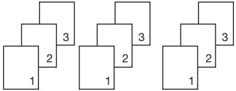
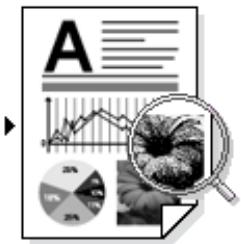

# M7208W Pro

Lenovo

激光多功能一体机

Laser Multi-Function Peripheral

用户手册/User's Guide

Version 01.00

注意使用本产品时，请您先仔细阅读使用说明书，再正确操作。请妥善保管好本手册，以便日后查阅。

CAUTlON Before using this product, read carefully these instructions for correct operation. Keep the User's Guide in a secure place for future reference.

# 为了创造更加美好的环境

请您协作

首先对您使用 Lenovo 产品表示衷心的感谢！

Lenovo 公司致力于关爱地球环境，制定了“从产品开发到废弃，关爱地球环境”的基本方针。当地的公民在环境保护活动中也应该对当地社会、环境两方面尽每个人的微薄之力。因此，希望您能配合这个计划，作为环境保护活动的一环，在平时处理废弃物的时候能多加注意。

1 不用的包装材料，为了能再次回收利用，请交付当地相关回收公司进行处理。  
2 废弃耗材的处理，应遵守相关的法律和规定。请根据相关法律和规定妥当处理。  
3 产品保养或修理需要更换零部件时，有不需要的电路板和电子零件，以及产品废弃时，请作为电子废弃物处理。  
4 关闭本产品的电源开关后，在拔下电源插头的情况下耗电量是零。  
5 本产品中的部分零部件可以用于同一工厂生产的同系列机型上。

注：零部件的更换请联系就近的 Lenovo 维修站。

# 中国环境标志的提示

1 建议将噪声大于 63dB 的设备放置于相对独立的区域。  
2 可以使用再生纸。  
3 在换气不畅的房间中长时间使用或打印大量文件时，应适时换气。  
4 产品及耗材的回收信息及相应渠道请参考联想图像（天津）有限公司网站。  
5 在产品停产后 5 年内，联想保证提供产品在正常使用范围内可能损坏的部件，并提供产品的消耗材料。

www.lenovoimage.com/1.html

# 声 明

欢迎您使用 Lenovo 产品！

首次安装和使用本产品前，请先仔细阅读随机配送的所有材料，这将有助于您更好地使用本产品。如果您未能按照本用户手册的说明和要求操作本产品，或由于理解错误等原因误操作本产品，联想图像（天津）有限公司将不对由此而导致的任何损失承担任何责任，但由于Lenovo 专业维修人员安装或操作不当而造成的损失除外。

联想图像（天津）有限公司已经对本手册的内容进行了严格、仔细的校勘，但是我们不能保证本手册完全没有错误或是疏漏。

联想图像（天津）有限公司致力于不断改进产品功能、提升服务品质，因此保留随时更改本手册所叙述任何产品或软件程序以及本手册内容的权利，恕不另行通知。

本手册旨在帮助您正确地使用本产品，并不包括对本产品的软硬件配置的任何说明。有关产品配置情况，请参阅相关合同（如有）和装箱清单，或者咨询向您出售产品的经销商。本手册中的图片仅供参考，如果有个别图片与产品实物不符，请以产品实物为准。

c 2018 联想图像（天津）有限公司。本手册受版权法律法规的保护。未经联想图像（天津）有限公司事先书面授权，不得以任何方式复制或抄录本手册，不得以任何形式在任何有线或无线网络中传送本手册，也不得将本手册翻译成任何语言。

Lenovo、Lenovo 联想、联想和其他 Lenovo 商标或标识都是联想图像（天津）有限公司或其子公司在中国大陆和/或其他国家/地区的商标或注册商标。本手册中提及的其他名称和产品可能是联想图像（天津）有限公司或其他公司的注册商标或商标。

如果您在操作过程中发现本产品的实际情况与本手册有不一致之处，或您想获取最新的信息，或您有任何问题或建议，请垂询或登录：

技术咨询电话：400-810-1234

（未开通 400 业务的地区，请拨打 010-58511600）

服务网站：http://www.lenovoimage.com/

# 法律禁止项目

请勿复印或打印法律禁止复制的任何项目。

根据当地法律，复制或打印以下项目一般属于违法行为：

◆ 纸币   
印花税票  
债券或其他债务证明  
◆ 存折   
◆ 义务服兵役文件或草拟文件  
股票  
◆ 银行汇票  
◆ 支票  
◆ 护照   
驾驶执照   
◆ 福利文件  
移民文件  
◆ 政府机构签发的支票或汇票  
→ 身份证明文件  
→ 徽章或勋章  
◆ 邮票（作废的或未作废的）

不可复印受版权保护的作品。一些受版权保护的作品可以被部分复制以进行“合理使用”。多份复制将被视为不正当使用。艺术作品等同于受版权保护的作品。

以上列表仅作参考，并不包括所有内容在内。对于其完整性及准确性，本公司概不承担责任。如果您有与复印或打印某些项目的合法性相关的问题，请咨询法律顾问。

# 目录

声 明 ....

法律禁止项目 ....

1 机器指南 .

1.1 外部 ....

1.2 内部 ....

2 设置打印机 .....

2.1 开箱 ..

2.2 打开进纸托盘 .. ..10

2.3 装入纸张 ... ..11

2.4 接通电源 .... ..13

2.5 启动打印机 .. ..13

2.6 安装打印机驱动程序和小新打印软件 ..14

2.6.1 快速安装（非Wi-Fi机型） .15

2.6.2 安装USB打印机 .. .17

2.6.3 快速安装（Wi-Fi） .22

2.6.4 安装Wi-Fi打印机 ... .22

2.6.5 安装已连入当前网络打印机 .. .22

2.6.6 升级打印机驱动程序 .. .23

2.6.7 卸载打印机驱动程序 .. ..24

2.7 打印测试页 ..25

2.8 打印配置页 ..25

3 打印介质 ... ...26

3.1 支持的纸张 ..26

3.1.1 纸张尺寸 .. ..26

3.1.2 纸张类型 . ..26

3.1.3 纸张容量 . ..26

3.2 不推荐的纸张类型 ..27  
3.3 打印区域 ... ..28

4 打印功能 ... ..29

4.1 打印作业 .. ..29

4.1.1 通过打印机驱动程序打印 ... .29  
4.1.2 使用小新打印进行本地或远程打印 ..30

4.2 取消打印作业 .... ..31

4.2.1 打印开始前取消打印作业 ..... ..31  
4.2.2 打印进行中取消打印作业 .. .32

5 复印功能 ... ..33

5.1 放置原稿 . ..33

5.1.1 关于原稿 .. .33  
5.1.2 在扫描仪玻璃板上放置原稿 . .33

5.2 复印基本操作 ... .34

5.2.1 使用打印机上按键复印 . .34  
5.2.2 使用打印机上按键连续复印 .. .35  
5.2.3 使用小新打印软件复印 ... ..35

5.3 身份证双面复印 . ..36  
5.4 取消复印 .. ..37

6 扫描功能 ... ..38

6.1 通过计算机扫描 .38

6.1.1 使用 TWAIN 扫描 .38  
6.1.2 使用 WIA 扫描 (Windows) .... ..42  
6.1.3 使用 Mac ICA 扫描 . ..44

6.2 使用小新打印软件扫描 ... .45

7 驱动程序 .. ..46

7.1 支持的系统环境 . ..46

# 7.2 Windows 中使用驱动程序 ..46

7.2.1 基本选项卡 .... ..47  
7.2.2 高级选项卡 .. ..52  
7.2.3 快捷设置选项卡 . ..58  
7.2.4 技术支持 ..... ..59

# 7.3 Mac 系统中使用驱动程序 . ..60

7.3.1 基本 ... ...60

# 8 通过无线网络打印 .. ...65

# 8.1 Windows 系统安装无线驱动程序 .. ..65

8.1.1 快速安装 ... ...65  
8.1.2 安装Wi-Fi打印机 ... ...66  
8.1.3 安装已连入当前网络打印机 .. ..69

# 8.2 Mac OS 系统安装无线驱动程序 ..72

8.3 通过网络使用打印机 .. .77

# 9 按键功能及指示灯状态 .... ..78

9.1 按键及指示灯简介 ... ..78  
9.2 LED 指示灯状态 ... ..78  
9.3 LED指示灯状态与状态描述 . ..79  
9.4 常用操作指引 .. ..82

# 10 机器维护 . ..84

10.1 维护感光鼓和墨粉盒 . .84  
10.2 更换鼓粉组件 ... ..86  
10.3 清洁打印机 .. ..87

# 11 故障排除 .. ...88

11.1 常见问题 . ..88  
11.2 送纸问题 . .89  
11.3 清除卡纸 .... ..90

11.4 打印质量问题 ... ..96  
11.5 打印问题 . .97  
11.6 复印问题 . .99  
11.7 扫描问题 . ...100  
11.8 LED 指示灯错误状态显示及操作指引 .... ....100  
12 打印机设置（WEB 页面） ...101  
13 附录 .... ...104  
13.1 墨粉的注意事项 . ....104  
13.2 移动和搬运机器 ...104   
13.3 鼓粉组件 ... ....105  
13.4 机器规格 ... ....106  
13.5 商标 .. ...109  
13.6 固定 IP 地址设置 . ...111

# 1 机器指南

本节介绍机器的外部及内部的各部件名称。

# 1.1 外部

# 提示

关于打印机上指示灯如何显示设备状态及按键使用功能的详细信息，请参见 >> 第 9 章 按键功能及指示灯状态。

# 1.2 内部

# 2 设置打印机

# 2.1 开箱

1.从包装箱中取出打印机和所有配件。

清点下列配件：

# 注意

如果发现其中缺少或有损坏的，请立即通知经销商。  
鼓粉组件已经装在打印机中。  
在不同的国家，少数部件可能不可用。

2.小心地撕下打印机上的包装胶带及内部胶带。

# 2.2 打开进纸托盘

1.打开进纸托盘，将其翻开。

2.向上拉出延伸板 1。

3.翻转出延伸板 2。

# 2.3 装入纸张

在进纸托盘中装入一叠用于打印的纸。

# 提示

关于打印介质的详细信息，请参见 >> 第 3 章 打印介质。

1.在装纸前，将纸来回弯曲，使纸松动，再扇动纸。在桌子上墩齐纸的边缘。

# 提示

→ 装纸前这样做有助于防止卡纸。

2.装入纸叠，打印面朝上。

3.不要装入太多的纸。进纸托盘最大可装 50 张 (70g/m²) 纸。

# 2.设置打印机

4.捏住纸张导板夹子，将其滑动使之适应纸的尺寸。

# 注意

◆ 装入纸张时，请务必配置纸张尺寸和纸张类型。打印文件时，请在打印机驱动程序中指定纸张尺寸和纸张类型，以便装入纸张时配置的设置可用来进行打印。

# 提示

◆ 关于在打印机驱动程序中指定纸张尺寸和纸张类型的详细信息，请参见 >> 第 3 章 打印介质。  
纸张卷曲可能会卡纸。装纸前，请将卷曲的纸张整理平整。  
? 不要将导纸板推得太紧，以致引起纸张拱起。  
? 如果您未调整导纸板，可能会卡纸。  
→ 如果您需要在打印时向打印机的进纸托盘中加纸，首先将打印机进纸托盘中剩余的纸张拿出来，然后将它们放进新的纸张中。注意直接在打印机进纸托盘中剩余的纸张上加纸，可能会导致打印机卡纸或多页纸同时输送。

# 2.4 接通电源

1.将电源线插入打印机后面的电源接口。

2.将电源线的另一端插入正确接地的交流电源插座内。

# 2.5 启动打印机

按住 电源键 0.5 秒以上启动打印机。

电源键指示灯显示

<table><tr><td>○</td><td>开始键灯不亮</td></tr><tr><td>●</td><td>电源键绿灯常亮</td></tr></table>

打印机准备就绪。

# 注意

打印机启动后，扫描仪会进行校准，请耐心等待。  
Wi-Fi机型打印机如果远程打印功能可用，则会紫灯常亮。

# 2.6 安装打印机驱动程序和小新打印软件

# 打印机不同型号的程序及软件配置

视型号或国家/地区而定，部分功能可能不可用。

驱动程序和小新打印软件：

<table><tr><td>驱动程序和小新打印</td><td>M7208W Pro</td></tr><tr><td>打印驱动程序</td><td>√</td></tr><tr><td>扫描驱动程序</td><td>√</td></tr><tr><td>小新打印 (Windows&amp;Mac)</td><td>√</td></tr><tr><td>小新打印 (Andriod&amp;iOS)</td><td>√</td></tr></table>

<table><tr><td rowspan="2">驱动程序两种安装方式</td><td>1.快速安装</td></tr><tr><td>2.自定义安装</td></tr><tr><td rowspan="6">自定义安装四种安装方式</td><td>1.安装 USB 打印机</td></tr><tr><td>2.安装Wi-Fi打印机</td></tr><tr><td>3.安装已连入当前网络打印机</td></tr><tr><td>4.安装小新打印和手册</td></tr><tr><td>小新打印 (Windows&amp;MAC) 和用户手册在您安装打印驱动时,会默认安装在您的电脑上。</td></tr><tr><td>提示:◆关于小新打印的详细介绍,请参见 &gt;&gt; 小新打印用户手册。</td></tr><tr><td>在安装打印机驱动程序前</td><td>确认以下各项:◆您的计算机上至少应有 128MB 内存。◆您的计算机硬盘至少有 200MB 的空余空间。◆您的计算机上已安装了 Windows 或Mac 系统。</td></tr></table>

# 提示

关于支持的系统环境，请参见 >> 第 7 章 驱动程序。

# 2.6.1 快速安装（非Wi-Fi机型）

# Windows 系统中安装驱动程序

对于非Wi-Fi机型，快速安装功能等同于自定义安装中的安装USB打印机

仅适用于操作系统为XP SP3以上（包含SP3）并且已经安装了.Net Framework4.0及以上版本的系统插件。

以Windows10 系统为例，实际步骤取决于您所使用的操作系统。

1.请开启打印机，使用 USB 线连接计算机与打印机。  
2.从http://www.lenovoimage.com/下载您购买机型的驱动程序并安装。  
3.出现安装程序主界面，选择所需语言；请仔细阅读许可协议，如果接受许可协议，勾选“我同意使用联想打印机驱动”前的方框；为了帮助我们为您提供更好的服务，我们希望您能参加“用户体验改善计划”，并同意我们收集打印机的使用数据。点击【下一步】；

# 2.设置打印机

4.对于非Wi-Fi机型出现以下进对话框：

5.当安装完成，可以点击【打印测试页】检测打印机驱动是否安装成功，也可以直接选择重启方式后点击【确定】直接退出驱动安装程序。

打印机驱动程序安装完成，您可以开始使用您的打印机了。

# 2.6.2 安装USB打印机

# Windows 系统中安装驱动程序

安装环境要求：

操作系统为XP SP3以上（包含SP3）并且已经安装了.Net Framework4.0及以上版本的系统插件。

以 Windows10 系统为例，实际步骤取决于您所使用的操作系统。

1.请开启打印机，使用 USB 线连接计算机与打印机。  
2.从http://www.lenovoimage.com/下载您购买机型的驱动程序并安装。

3.出现安装程序主界面，选择所需语言，选择安装方式为“自定义安装”；请仔细阅读许可协议，如果接受许可协议，勾选 “我同意使用联想打印机驱动”前的方框；为了帮助我们为您提供更好的服务，我们希望您能参加“用户体验改善计划”，并同意我们收集打印机的使用数据。点击【下一步】；

4.当出现安装程序界面时，单击【安装USB打印机】。

# 2.设置打印机

5.程序开始自动安装。

6.当安装完成，可以点击【打印测试页】检测打印机驱动是否安装成功，也可以直接选择重启方式后点击【确定】直接退出驱动安装程序。

打印机驱动程序安装完成，您可以开始使用您的打印机了。

# Mac OS 系统中安装驱动程序

1.请开启打印机，使用 USB 线连接计算机与打印机。  
2.从http://www.lenovoimage.com/下载您购买机型的驱动程序。  
3.双击安装程序。  
4.双击【安装】图标。显示界面如图：

5.在介绍界面点击【继续】。  
6.当出现许可协议界面时，请选择所需语言。   
7.请仔细阅读软件许可协议，之后点击【继续】。

# 2.设置打印机

8.如果您同意软件许可协议中的条款，请点击【同意】继续安装。

9.点击【安装】，之后将会按照标准安装程序安装。

# 2.设置打印机

10.对于 Mac OS X 10.5 和 Mac OS X 10.6，输入管理员名称和密码，

然后单击【确定】。

对于 Mac OS X 10.7及以上版本的操作系统，输入管理员的名称和密码，

然后单击【安装软件】。

11.点击【继续安装】。

12.单击【重新启动】以完成安装。

# 2.6.3 快速安装（Wi-Fi）

对于Wi-Fi机型，功能等同于安装Wi-Fi打印机

# 注意

视型号或国家/地区而定，部分功能可能不可用。

型号及具体配置功能，请参见 >> 打印机不同型号的程序及软件配置。

无线打印驱动安装，请参见 >> 第 8 章 通过无线网络打印。

# 2.6.4 安装Wi-Fi打印机

当打印机首次使用时，如果您要使用无线功能，需要对打印机进行无线配置，打印机无线配置后，才可以通过无线网络操作。

# 注意

→ 视型号或国家/地区而定，部分功能可能不可用。

型号及具体配置功能，请参见 >> 打印机不同型号的程序及软件配置。

无线打印驱动安装，请参见 >> 第 8 章 通过无线网络打印。

# 2.6.5 安装已连入当前网络打印机

当您首次使用已经无线配置过的打印机时，请安装无线打印驱动。

# 注意

视型号或国家/地区而定，部分功能和可选商品可能不可用。

型号及具体配置功能，请参见 >> 打印机不同型号的程序及软件配置。

→ 无线打印驱动安装，请参见 >> 第 8 章 通过无线网络打印。

# 2.6.6 升级打印机驱动程序

您可以遵循下列步骤升级已安装的打印机驱动程序。

1.在【开始】菜单中，单击[设备和打印机]。

? Windows XP、Windows Server 2003 / 2003 R2：  
在【开始】菜单中，选择【打印机和传真】。  
? Windows Vista、Windows Server 2008：  
在【开始】菜单中，选择【操作面板】，然后单击【硬件和声音】  
类别中的【打印机】。  
◆ Windows 8/8.1、Windows Server 2012/2012 R2/2016：  
在超级按钮栏上单击【设置】，然后单击【操作面板】  
出现【操作面板】窗口时，单击【查看设备和打印机】。

Windows 10：

在【开始】菜单中下搜索【控制面板】，

然后单击【硬件和声音】下的【查看设备和打印机】。

2.右击要更改的打印机的图标，然后单击【打印机属性】。

? Windows XP/Vista、Windows Server 2003/2008：

右键单击机器的图标，然后单击【属性】。

3.单击【高级】选项卡。

4.单击【新驱动程序...】，然后单击【下一步】。

5.单击【从磁盘安装...】。

6.单击【浏览...】，然后选择打印机驱动程序安装位置。

7.单击【确定】，然后指定打印机型号。

8.单击【下一步】。

9.单击【完成】。

10.单击【确定】，关闭打印机属性窗口。

11.重新启动计算机。

# 2.6.7 卸载打印机驱动程序

您可以使用卸载程序 ，也可以使用下面的操作步骤卸载已安装的打印机驱动程序。

1.在【开始】菜单中，单击【设备和打印机】。

→ Windows XP、Windows Server 2003 / 2003 R2：  
在【开始】菜单中，选择【打印机和传真】。  
◆ Windows Vista、Windows Server 2008：  
在【开始】菜单中，选择【操作面板】，然后单击【硬件和声音】  
类别中的【打印机】。  
→ Windows 8/8.1、Windows Server 2012/2012 R2/2016：  
在超级按钮栏上单击【设置】，然后单击【操作面板】。  
出现【操作面板】窗口时，单击【查看设备和打印机】。  
◆ Windows 10：  
在【开始】菜单中下搜索【控制面板】，  
然后单击【硬件和声音】下的【查看设备和打印机】。

2.右击要删除的打印机的图标，然后单击【删除设备】。

◆ Windows XP/Vista、Windows Server 2003/2003 R2/2008

右键单击要删除的机器的图标，然后单击【删除】。

3.单击【是】。  
4.单击任意打印机图标，然后单击【打印服务器属性】。  
5.单击【驱动程序】选项卡。  
6.若显示【更改驱动程序设置】，请单击它。  
7.选择要删除的打印机类型，单击【删除...】。  
8.选择【删除驱动程序和驱动程序包】，然后单击【确定】。  
9.单击【是】。

10.单击【删除】。

11.单击【确定】。

12.单击【关闭】，关闭打印服务器属性窗口。

# 2.7 打印测试页

在驱动程序安装结束时，会有打印测试页选项，您也可以通过以下途径打印测试页。

以 Windows 10 系统为例，

点击开始 >>控制面板>>硬件和声音>>查看设备和打印机 >> 选择您的打印机单击右键 >>

选择打印机属性，出现打印机属性对话框（如下图）：

点击【打印测试页】。

如果您成功打印了测试页，则说明 M7208W Pro 在您的设备上的安装是正确的。

# 2.8 打印配置页

配置页会包括您的打印机的一些配置参数，比如打印机的型号名、网络参数，打印机热点的名称和密码，墨粉余量，废墨粉和打印总页数。

打印机就绪状态下，一秒钟内快速按 电源键 3 次，看到指示灯状态显示：

<table><tr><td>○</td><td>开始键灯不亮</td></tr><tr><td>✿</td><td>电源键绿色灯亮一秒灭一秒</td></tr></table>

说明打印中，任务设置成功。

# 3 打印介质

# 3.1 支持的纸张

# 3.1.1 纸张尺寸

A4,

Letter,

B5,

A5 SEF,

B6 SEF,

A6,

Executive,

自定义尺寸；

自定义纸张尺寸支持如下纸张尺寸：

宽度 约76.2-216mm（3-8.5英寸）

长度 约116-355.6mm（4.57-14英寸）

# 3.1.2 纸张类型

普通纸 （70-90 g/m²）

再生纸 （70-90 g/m²）

厚纸 （90-105 g/m²）

薄纸 （60-70 g/m²）

标签 （激光打印机专用）

# 3.1.3 纸张容量

进纸托盘 50张 （70g/m²）

# 3.2 不推荐的纸张类

# 请勿使用以下类型的纸张：

→ 喷墨打印机专业纸张   
◆ 粘性墨水特殊纸张   
→ 弯曲、折叠或有折痕的纸张   
◆ 卷曲或扭曲的纸张   
◆ 起皱的纸张   
潮湿的纸张   
很脏或破损的纸张   
? 容易产生静电的过分干燥的纸张   
已经打印过的纸张、除有信头图案的纸张以外  
采用非激光打印机（例如黑白和彩色复印机、喷墨打印机等）打印过的纸张尤其可能造成故障  
特殊纸张、如热敏纸和复写纸   
纸张重量比限制值更重或更轻  
带有窗、洞、孔眼、图案或凹凸的纸张   
上面贴有胶纸或原纸的粘胶标签纸  
→ 带有回形针或订书钉的纸张   
信封

# 提示

采用保存不当的纸张打印时也会造成卡纸、打印质量下降或出现故障。  
→ 如果使用上述任意一类纸张，则可能会损坏设备。由此造成的损坏不在联想图像（天津）有限公司的保修服务范围内。

# 3.3 打印区域

下面显示机器可以打印的纸张区域 (A4)。

# 提示

◆ 根据纸张尺寸和打印机驱动程序设置，打印区域可能会有所不同。

# 4 打印功能

# 4.1 打印作业

本打印机有三种方式可以执行打印任务：

通过打印机驱动程序打印。  
? 使用小新打印软件打印。  
在手机上通过浏览器、微信等扫描远程打印二维码进行打印。

# 提示

◆ 除了通过电脑进行打印，还可以使用搭载 iOS 系统和 Android 系统的智能移动设备进行打印。

# 4.1.1 通过打印机驱动程序打印

使用打印机驱动程序从计算机中打印文件。

下面的过程说明基于 Windows 10 操作系统中打印的步骤。

打印文件的准确步骤可能随应用程序的不同而有所不同。

关于准确的打印步骤，请参照您的应用软件。

1.请确认您已经连接打印机。  
2.打开您需要打印的文件。  
3.在文件菜单中选择打印。  
屏幕显示打印对话框（您的应用程序的打印对话框可能会稍有不用）。  
基本打印设置在这个打印对话框中选择。  
这些打印设置包括打印份数、纸张尺寸和页面方向等。

确认您的打印机被选择

如果您看到一个属性按钮，点击它。如果您看到的是设置、打印机或选项，点击这些按钮；然后在下一个屏幕中点击属性按钮。

没有其他的打印要求点击【打印】，启动打印。

# 提示

→ 关于打印机的更多设置，请在应用程序的打印对话框中点击【属性】按钮，出现对话框允许您访问和改变打印机设置。  
您变更的设置仅当在使用当前的程序时才有效。如果您想打印机始终按照您的设置工作，请按照下面的步骤操作：

1. 点击 Windows 【开始】按钮。  
2. 搜索【控制面板】，然后单击【硬件和声音】下的【查看设备和打印机】。  
3. 选择您的打印机，点击右键，选择【打印机首选项】。  
4. 在此窗口进行打印机设置，之后点击【确定】。您的变更将持续有效。

关于打印机设置的详细信息请参见 >> 第 7 章 驱动程序。  
关于操作面板指示灯如何显示设备状态及电源键使用功能的详细信息，请参见 >> 第 9 章 按键功能及指示灯状态。

# 4.1.2 使用小新打印进行本地或远程打印

详情参见 >> 小新打印用户手册中的打印功能。

# 4.2 取消打印作业

如果您需要取消打印作业，根据打印状态不同操作不同。

# 4.2.1 打印开始前取消打印作业

1 在计算机任务栏上双击打印机图标，出现任务框。

2 选中【打印任务】，之后点击右键，然后单击【取消】。

3 点击【是】，打印任务取消。

# 4.2.2 打印进行中取消打印作业

按住 电源键 1 秒以上。

LED 指示灯状态显示：

<table><tr><td>○</td><td>开始键灯不亮</td></tr><tr><td>↔</td><td>电源键红灯和绿灯每0.5秒交替闪烁</td></tr></table>

显示取消当前任务。

# 注意

如果取消的打印作业已经在处理中，则会继续打印几页后才会取消。  
取消多页打印作业可能需要一段时间。

# 5 复印功能

# 5.1 放置原稿

本节介绍放置您使用的原稿类型以及放置方法。

# 5.1.1 关于原稿

建议的原稿尺寸

扫描仪玻璃板：宽度不超过 216 mm（8.5 英寸）

长度不超过 297 mm（11.7 英寸）

无法扫描的图像区域

即使原稿正确放置，其周围几毫米的边距可能无法扫描。

使用扫描仪玻璃板的边距：

# 5.1.2 在扫描仪玻璃板上放置原稿

1.抬起扫描仪盖板。  
2.将原稿正面朝下放置在扫描仪玻璃板上。

原稿应与左后角对齐。

# 5.复印功能

# 3.放下扫描仪盖板。

# 提示

◆ 在原稿上的墨粉完全干燥前，请勿放置原稿。否则可能在扫描仪玻璃板上留下印记，并且出现在复印件上。  
◆ 使用厚重、折叠或装订的原稿时，或者盖子无法完全放下时，请双手按住扫描仪盖板。

# 5.2 复印基本操作

本打印机有两种方式可以执行复印任务

使用打印机上的按键复印  
使用小新打印软件复印

# 5.2.1 使用打印机上按键复印

1.将您要复印的文件或证件放置于扫描仪玻璃板上，需要复印的面朝下。

# 提示

? 关于如何放置原稿，请参见 >> 放置原稿。

2.就绪状态下， 按 开始键一下，复印一张。

LED 指示灯状态显示：

<table><tr><td rowspan="2"></td><td>开始键绿灯亮</td></tr><tr><td>电源键绿灯亮一秒灭一秒</td></tr></table>

状态为复印中/连续复印中。

# 提示

注意如果打印机处于休眠状态：

<table><tr><td>○</td><td>开始键不亮</td></tr><tr><td>✕</td><td>电源键绿灯慢闪</td></tr></table>

按任意键唤醒打印机，之后使用打印机进行任务。详情请参见 >>

第 9 章 按键功能及指示灯状态中的 LED 指示灯状态显示及操作指引。

# 5.2.2 使用打印机上按键连续复印

1.将您要复印的文件或证件放置于扫描仪玻璃板上。

# 提示

◆ 关于如何放置原稿，请参见 >> 放置原稿。

2.就绪状态下，长按 开始键 3 秒以上，连续复印 5 张。

LED 指示灯状态显示：

<table><tr><td></td><td>开始键绿灯亮</td></tr><tr><td></td><td>电源键绿灯亮 1 秒灭 1 秒</td></tr></table>

状态为复印中/连续复印中。

# 提示

注意如果打印机处于休眠状态：

<table><tr><td>○</td><td>开始键灯不亮</td></tr><tr><td>○</td><td>电源键绿灯亮 1 秒灭 3 秒</td></tr></table>

按任意键唤醒打印机，之后使用打印机进行任务。详情请参见 >>

第 9 章 按键功能及指示灯状态中的 LED 指示灯状态显示及操作指引。

# 5.2.3 使用小新打印软件复印

更多高级功能操作请使用小新打印软件，详情参见 >> 小新打印用户手册中的复印功能。

# 5.3 身份证双面复印

您可以通过使用打印机上按键将身份证的两面复印到纸张的一面上。

1.将身份证的正面朝下，放置于扫描仪玻璃板左半面中间位置。

# 2.就绪状态下

同时按住 开始键和 电源键后释放按键，LED 指示灯状态：

<table><tr><td></td><td>开始键绿灯常亮</td></tr><tr><td></td><td>电源键绿灯常亮</td></tr></table>

进入身份证双面复印模式。

# 提示

如果在 1 分钟内，您没有任何操作动作，打印机将会退出此模式，回到就绪状态。

# 3.扫描证件第一面

进入身份证双面复印模式后，点击开始键，开始扫描证件的第一面。LED 指示灯状态显示：

<table><tr><td rowspan="2"></td><td>开始键绿灯亮</td></tr><tr><td>电源键绿灯闪烁</td></tr></table>

状态为扫描中。

# 4.当 LED 指示灯状态显示：

<table><tr><td></td><td>开始键绿灯闪烁</td></tr><tr><td></td><td>电源键绿灯闪烁</td></tr></table>

此时为等待扫描证件第二面。

请将证件翻面，放置位置不变，按 开始键一下，进入第二面扫描模式。

5.打印机会自动打印出您要复印的证件，证件的正反面在同一张纸的一面上。

# 提示

证件复印完后，证件复印功能将会保持 1 分钟，您可以继续进行下一张身份证双面复印，如果 1 分钟内，没有任何操作动作，打印机将会退出身份证双面复印功能，回到就绪状态。  
您也可以手动取消身份证双面复印功能，长按 电源键 1 秒以上。LED 指示灯状态显示：

<table><tr><td>○↔</td><td>开始键灯不亮电源键红灯和绿灯每0.5秒交替闪烁</td></tr></table>

即取消当前任务。

注意如果打印机处于休眠状态：

<table><tr><td>○</td><td>开始键不亮电源键绿灯亮1秒灭3秒</td></tr></table>

按任意键一下唤醒打印机，之后使用打印机进行任务。详情请参见 >>

第 9 章 按键功能及指示灯状态中的 LED 指示灯状态显示及操作指引。

# 5.4 取消复印

按 电源键 1 秒以上取消当前的所有作业。

LED 指示灯状态显示：

<table><tr><td>○</td><td>开始键灯不亮</td></tr><tr><td>↔</td><td>电源键红灯和绿灯每0.5秒交替闪烁</td></tr></table>

显示取消当前任务。

# 注意

如果机器正在扫描原稿时取消复印，则复印会立即取消且没有打印输出复件。  
如果在打印过程中取消复印，则系统将在打印输出当前页面之后取消复印过程。

# 6 扫描功能

本打印机有两种方式可以执行扫描任务

通过计算机扫描  
? 使用小新打印软件扫描

# 6.1 通过计算机扫描

通过计算机扫描（TWAIN 扫描、WIA 扫描和 ICA 扫描）支持直接从计算机操作机器，并将原稿扫描到计算机中。

# 6.1.1 使用 TWAIN 扫描

本节介绍使用 TWAIN 扫描仪所必需的准备和操作步骤。

# 提示

◆ 若您要使用 TWAIN 扫描仪，请先从 http://www.lenovoimage.com/下载安装您购买机型的驱动程序。  
◆ 在您使用 TWAIN 扫描前，必须安装与 TWAIN 兼容的应用程序。

# 使用 TWAIN 扫描步骤

计算机运行支持 TWAIN 的应用程序时可实现 TWAIN 扫描。

1.请将您要扫描的原稿放置于扫描仪玻璃板上。

# 提示

关于放置原稿的操作，详细信息请参见 >> 第 5 章 复印功能中的放置原稿。

2.使用支持 TWAIN 的应用程序打开本机的属性对话框。

# 6.扫描功能

3.根据需要配置扫描设置，然后单击【扫描】。

主页面：

# 预览：

点击【预览】按钮，您放在扫描设备上的原稿将会出现在预览窗口。

# 扫描：

点击【扫描】按钮，扫描设备开始扫描原稿。

# 功能设置：

基本扫描选项卡

◆ 图像类型：

黑白

8 位灰度级

24 位全色彩，默认为 24 位全色彩。

◆ 分辨率：

75 dpi/100 dpi/150 dpi/200 dpi/300dpi/600 dpi/

1200 dpi/2400 dpi/4800dpi/自定义

自定义：

当您选择自定义选项时，将出现自定义对话框供您选择自定义分辨率。

→ 扫描尺寸：

A4（210×297mm），A5（148 x 210 mm），B5（182×257mm），

Letter（8.5 x 11''），4×6''，典型尺寸

扫描方式：

快速扫描/高品质扫描

◆ 端口:

您可以使用此功能配置“端口设定”。

# 图像画质选项卡

您可以使用图像画质选项卡来调整扫描图像画质。

# 图像选项的选项卡

您可以使用图像选项的选项卡来处理从扫描设备扫描的文件。

# 6.1.2 使用 WIA 扫描 (Windows)

WIA 1.0 (Windows XP/Windows Server 2003)

? WIA 1.0 提供如下用于扫描的用户界面：

WIA 2.0（Windows Vista/Windows Server 2008 及以上的版本）

? WIA 2.0 提供如下用于扫描的用户界面：

# 网络扫描仪设置

如果您的电脑与扫描仪是通过无线网络相连，在使用扫描仪前请使用“扫描仪连接工具”设置扫描仪的无线参数。操作步骤如下：

1.从开始菜单中选择“扫描仪连接工具”。

2.进入“扫描仪连接工具”界面后点击【搜索】，将会列出您的电脑所处网络中所有搜索到的扫描仪，根据扫描仪的名称或者IP地址选择扫描仪；或者您可以直接在“输入IP地址”栏中输入打印机的IP地址；

3.点击【确定】，网络扫描仪设定完成。

# 使用 WIA 扫描步骤：

1.请将您要扫描的原稿放置于扫描仪玻璃板上。

# 提示

关于放置原稿的操作，详细信息请参见 >> 第 5 章复印功能中的放置原稿。

2.在【开始】菜单中，单击【设备和打印机】。  
3.右键单击您的打印机型号图标，然后单击【开始扫描】。  
4.根据需要配置扫描设置，然后单击【扫描】。

# 6.1.3 使用 Mac ICA 扫描

ICA（图像捕捉）扫描仪设备模块（驱动）支持 Mac OSX 10.6 及以上系统，同时支持USB/网络扫描。

驱动程序安装位置为：应用程序 >> 图像捕捉 >> 设备。

有两种类型的用户界面：简易版和详细版，均由 Mac 提供。

# 简易版用户界面：

# 详细版用户界面：

→ 色彩模式：

文本（1 bit 图像），黑白（8-bit 灰度），颜色（24-bit 全色彩）。

→ 分辨率：

75 dpi/100 dpi/150 dpi/200 dpi/300 dpi/600 dpi/1200 dpi/2400 dpi/4800 dpi。

→ 扫描尺寸：

A4，B5/JIS，B5，US Letter（美国信纸），A5，US Executive（美国行政用纸）。

# 6.2 使用小新打印软件扫描

详情参见 >> 小新打印用户手册中的扫描功能。

# 7 驱动程序

本章节介绍打印机驱动程序中的设置内容。

7.1 支持的系统环境

<table><tr><td>Windows XP</td><td>家庭版/专业版/专业版 x64 版本(SP3 或更高版)</td></tr><tr><td>Windows Vista</td><td>家庭版基本版/家庭版高级版/商业版/企业版/旗舰版</td></tr><tr><td>Windows 7</td><td>家庭版基本版/家庭版高级版/专业版/企业版/旗舰版</td></tr><tr><td>Windows Server 2003</td><td>标准版/标准版 x64 版/企业版/企业版 x64 版本(SP1 或更高版)</td></tr><tr><td>Windows Server 2003 R2</td><td>标准版/标准版 x64 版/企业版/企业版 x64 版本</td></tr><tr><td>Windows Server 2008</td><td>标准版/标准版无 Hyper-V/企业版/企业版 x64 版本无 Hyper-V</td></tr><tr><td>Windows Server 2008 R2</td><td>标准版/企业版</td></tr><tr><td>Windows 8</td><td>Windows 8</td></tr><tr><td>Windows 8.1</td><td>Windows 8.1</td></tr><tr><td>Windows Server 2012</td><td>Windows Server 2012</td></tr><tr><td>Windows Server 2012 R2</td><td>Windows Server 2012 R2</td></tr><tr><td>Windows Server 2016</td><td>Windows Server 2016</td></tr><tr><td>Windows 10</td><td>Windows 10</td></tr><tr><td>Mac OS</td><td>Mac OS X 10.5~10.13</td></tr></table>

# 7.2 Windows 中使用驱动程序

下面的过程说明基于 Windows 10 操作系统环境中打印的步骤。

打印文件的准确步骤可能随应用程序的不同而有所不同。

使用打印机驱动程序从计算机中打印文件。

1.打开您需要打印的文件。

# 7.驱动程序

2.在文件菜单中选择打印。

屏幕显示打印对话框（您的应用程序的打印对话框可能会稍有不用）。

基本打印设置在这个打印对话框中选择。

这些打印设置包括打印份数、纸张尺寸和页面方向等。

3.点击【属性】。属性对话框允许您访问和改变打印机设置。

# 7.2.1 基本选项卡

您可以点击以下选项更改相应的选项设置

纸张尺寸   
→ 方向  
份数  
纸张类型  
打印质量  
打印设置  
多页  
双面打印   
→ 省墨模式

在窗口（1）确认您的当前设置。

点击【确定】您选择的设置。

若要恢复默认设置，请点击【默认值】，然后点击【确定】。

# 纸张尺寸

从下拉列表中选择您正在使用的纸张的大小。

支持的纸张尺寸为：A4,Letter,B5,A5 SEF/LEF,B6 SEF/LEF,A6,Executive,16K,自定义尺寸;

自定义纸张尺寸支持如下纸张尺寸：

→ 宽度 约76.2-216 mm（3-8.5 英寸）  
长度 约116-355.6 mm（4.57-14 英寸）

# 提示

◆ 关于纸张尺寸详情，请参见 >> 第 3 章 打印介质中的支持的纸张。  
◆ 您选择的纸张尺寸最好与您正在使用的纸张尺寸一致。

# 方向

可以选择文档打印的位置（纵向或横向）。

<table><tr><td>纵向(垂直)</td><td>横向(水平)</td></tr><tr><td></td><td></td></tr></table>

# 份数

份数选项可以设置将要打印的份数。

◆ 逐份打印

选中逐份打印复选框时，将打印出一份完整的副本，然后重复整份打印， 直至打印完您所选择的份数。

如果未选中逐份打印复选框，打印机将根据设定份数对每一页重复打印。

<table><tr><td>选中逐份打印复选框时</td><td>未选中逐份打印复选框时</td></tr><tr><td></td><td></td></tr></table>

# 纸张类型

本设备支持下列纸张类型。选择您想使用的纸张类型，以便获取最佳的打印质量。

普通纸  
再生纸  
→ 厚纸   
薄纸   
◆ 标签

# 打印质量

您可以选择以下打印质量：

标准（600×600dpi）  
精细（1200×600dpi）

# 打印设置

您可以将打印设置更改为：

图形  
图形文档的最佳打印模式。  
文本  
文本文档的最佳打印模式。  
◆ 手动

您可以通过选择手动并点击【手动设置】按钮手动更改设置。您可以设置亮度和对比度。

# 多页

多页选项可以缩小图像尺寸，将多个页面打印在同一张纸上，

可以放大图像尺寸，将一个页面打印在多张纸上。

◆ 页面顺序

选择每页 N 版选项时，可以在下拉列表中选择页面的顺序。

# 注意

◆ 选择每页 N 版选项时，高级功能中的缩放功能不可用。  
选择 N×N 页 1 版选项时，双面打印功能不可用。

此时会有警告信息对话框弹出。

◆ 边框线

使用多页功能将多个页面打印在同一张纸上时，您可以选择为纸张添加实线边框和无边框。

打印裁切线

选择 N×N 页 1 版选项时，可以选择打印裁切线选项。使用此选项可以为打印区域添加细裁切线。

# 手动双面打印

如果您想进行双面打印，请使用此选项。

# 使用流程：

1.双面打印选项框中选择长边翻页或短边翻页。  
2.开启双面打印功能后，弹出一个对话框告诉您如何操作。

对话框如下：

# 7.驱动程序

3.第一面打印完成后，需要您手动将纸张按照上述对话框提示装回进纸盘以打印第二面。  
4.装回纸张后，按一下正在闪烁红灯的 电源键。  
5.打印机继续打印第二面。

# 注意

? 标签纸不支持双面打印功能。

# 打印顺序

当在高级选项卡中逆序打印选项框勾选中时

先是打印偶数页（…8,6,4,2），之后打印奇数页（…7,5,3,1）。

当在高级选项卡中逆序打印选项框没有勾选时

先是打印偶数页（…2,4,6,8），之后打印奇数页（…1,3,5,7）。

# 提示

◆ 如果打印页数总数为奇数，最后会出现一张空白页。  
◆ 无   
长边翻页  
→ 短边翻页

# 两种装订方向

<table><tr><td>长边翻页</td><td>短边翻页</td></tr><tr><td></td><td></td></tr></table>

# 省墨打印

使用省墨打印模式可以减少墨粉消耗。

省墨打印模式，您可以得到正常密度的打印质量，但是打印输出效果较浅。

此选项默认为关。

# 注意

选择省墨打印模式不影响打印速度和内存使用。

# 7.2.2 高级选项卡

您可以点击以下选项更改相应的选项设置：

◆ 缩放比例  
◆ 小册子打印   
◆ 使用水印  
◆ 页眉页脚打印   
浓度调整   
跳过空白页  
以黑白二色打印文本  
◆ 逆序打印

# 缩放比例

您可以更改打印图像的比例。

◆ 关   
◆ 调整至纸张尺寸   
◆ 自定义调整【25%-400%】

# 注意

◆ 当开启调整至纸张尺寸或任意缩放选项时，多页功能或小册子打印功能不可用。  
◆ 此时会有警告信息对话框弹出。

# 小册子打印

使用双面打印功能制作小册子时，请使用此选项。它会按照正确的页码排列文档，您无需排列页码顺序，只要对折打印的页面即可。

您可以在小册子打印设置对话框中进行以下设置：

◆ 装订制作设定  
左侧装订  
右侧装订  
◆ 小册子打印方式  
整册装订   
分册装订  
选择分册装订时：  
使用此选项可以将整本小册子打印成较小的单个小册子集，也无需排列页码顺序，只要对折已打印的小册子集即可。  
您可以从 1 到 15 指定各个小册子集的页数。对打印页数较多的小册子，此选项非常有用。  
装订偏移量  
如果您选中装订偏移量，您可以指定以毫米或英寸为单位的装订偏移量。

# 注意

◆ 当您选择小册子打印时，弹出警告对话框显示双面打印中长边翻页打开。  
◆ 当您选择小册子打印时，多页功能或页眉页脚打印中的页数功能不可用。

# 使用水印

您可以将标识或文本作为水印打印到文档中。您可以选择预设的水印或使用自己创建的文本/图片文件。请选中使用水印复选框，然后点击【设置】按钮。

水印设置

→ 选择水印

选择所需的水印。

要新创建水印，点击新建水印文本或新建水印图片。

新建水印文本

新建水印的数量最多为 29 个。

# 名称

在此栏中输入合适的标题。

# 文本

在文本栏中输入水印文本，然后选择字体、字形、大小和透明。

# 透明

选中此复选框，打印一个透明的水印，基本的文本或图像是可见的。

取消选中这个复选框，打印水印使潜在的文本或图像被覆盖。

# 角度

若要控制水印在页面的角度方向，可使用此项设置。

# 位置

指定水印的位置。

# ? 新建水印图片

# 名称

在此栏中输入合适的标题。

# 图片

在文件名栏选择您要新建的水印图片。

# 缩放

您可以更改图片的比例。

# 位置

若要控制水印在页面上的位置，可使用位置设置。

# 透明

选中此复选框，打印一个透明的水印，基本的文本或图像是可见的。

取消选中这个复选框，打印水印使潜在的文本或图像被覆盖。

新建文本或图片后点击【确认】，新建水印完成。

# 注意

→ 水印功能开启时，多页功能中的“N×N 页 1 版”功能不可用。  
编辑

您可以在选择水印列表中选择您要编辑的水印，点击【编辑】，出现“编辑水印”或“编辑水印（图片）”对话框。

删除

您可以在选择水印列表中选择您要删除的水印，点击【删除】，请按照出现的对话框操作删除水印。

# 提示

◆ 内置水印无法编辑与删除。

# 页眉页脚打印

启动此功能后，您可以在文档上打印页眉和页脚信息。

请选中页眉页脚打印复选框，然后点击【设置】按钮进行设置。

设置包括：◆登录用户名◆打印任务所有者名◆文件名◆页数◆日期◆时间

# 7.驱动程序

# 位置

若要设置页眉页脚在页面上的位置，可使用位置设置。

水平方向有三种选择：居左/居中/居右

垂直方向有两种选择：居上/居下。

# 字体

您可以设置字体。

# 大小

您可以设置字体大小。

“B”按钮：加粗字。

“I”按钮：斜体字。

# 浓度调整

增加或降低打印浓度。

调整打印浓度值选中浓度调整复选框，然后点击【设置】按钮进行设置。

# 其他打印选项

◆ 跳过空白页

如果选中跳过空白页，打印机驱动程序会自动检测空白页并且不打印空白页。

# 注意

当您选择以下选项时，此选项不可用：

使用水印  
◆ 页眉页脚打印   
◆ 多页打印   
◆ 双面打印   
小册子打印

以黑白二色打印文本

此功能指定始终以黑白二色打印所有文本。

# 注意

可能不兼容某些字符。  
→ 逆序打印

选中逆序打印复选框，所有打印页逆序。

# 7.2.3 快捷设置选项卡

快捷设置是可编辑的预设值，可使您快速访问常用打印配置。

快捷设置框 (1)   
删除配置文件 (2)  
添加快捷设置 (3)   
当前快捷设置视图 (4)

1.从快捷设置框中选择所需的快捷设置。  
2.点击【确定】应用您选择的快捷设置。

# 添加快捷设置

点击【添加快捷设置】可打开添加快捷设置对话框。

1.在名称中输入所需标题。  
2.从图标列表中选择您想使用的图标，然后点击【确定】。  
3.显示在打印机驱动程序窗口左侧的当前设置将会被保存。

# 删除快捷设置

可删除任何已添加的快捷设置，但内置快捷设置不能被删除。

1.在【选择所需的快捷设置】中选择想要删除的快捷设置。  
2.点击删除配置文件。  
3.点击确定。  
4.所选快捷设置将被删除。

# 7.2.4 技术支持

联想图像技术支持网站

http://www.lenovoimage.com/

为您提供联想图像产品及耗材的相关信息，行业解决方案及服务支持。

请您访问联想图像官网获取更多的信息和技术支持。

# 7.3 Mac 系统中使用驱动程序

# 7.3.1基本

您可以点击以下选项更改相应的选项设置

→ 纸张尺寸   
方向  
份数  
→ 纸张类型  
打印质量  
打印设置  
◆ 省墨模式

在预览窗口确认您的当前设置。

# 纸张尺寸

从下拉列表中选择您正在使用的纸张的大小。

支持的纸张尺寸为：A4,Letter,B5,A5 SEF,B6 SEF,A6,Executive,16K,自定义尺寸

# 用户纸张尺寸（系统内置功能）

# 创建用户纸张尺寸

1.打开您要打印的文件；  
2.按照如下操作：

◆ 选择文件 >> 页面设置。从设置弹出菜单选择页面属性，然后从格式弹出菜单选择任意打印机。选择任意打印机可以确保您的文件可以在任意支持您选择的纸张尺寸的打印机上打印。  
如果页面设置不可用，选择 文件 >> 打印。如果打印对话框仅包含两个弹出菜单和一些在底部的按钮，点击打印机弹出菜单旁边的三角形。

3.从纸张尺寸弹出菜单选择管理用户尺寸。  
4.单击添加按钮“+”   
5.双击纸张尺寸名称，键入一个新的名称。

在纸张尺寸和不可打印的区域值域中输入值，然后点击“确定”。

# 提示

◆ 系统内置功能：这个内置系统的变化取决于您安装的 OS X 版本。

# 方向

可以选择文档打印的位置（纵向或横向）。

方向：

# 份数

份数选项可以设置将要打印的份数。

逐份打印

选中逐份打印复选框时，将打印出一份完整的副本，然后重复整份打印， 直至打印完您所选择的份数。如果未选中逐份打印复选框，打印机将根据 设定份数对每一页重复打印。

<table><tr><td>选中逐份打印复选框时</td><td>未选中逐份打印复选框时</td></tr><tr><td></td><td></td></tr></table>

# 纸张类型

本设备支持下列纸张类型，选择你想使用的纸张类型，以便获得最佳打印质量。

普通纸  
再生纸  
厚纸   
薄纸   
标签

# 打印设置

调整亮度：亮度指的是颜色的亮度/暗度水平。增加亮度能使亮度接近白色。

# 多页（系统内置功能）

您可以使用这个功能将多个页面打印在同一张纸上，

有六个选择：“1”，“2”，“4”，“6”，“9”，“16”，

布局方向（系统内置功能）

选择每页 N 版选项时，你可以设置布局方向选择在一张纸上的连续页的位置。

◆ 边框线

使用多页功能将多个页面打印在同一张纸上时，您可以选择为纸张添加边框。

# 手动双面打印

如果您想进行双面打印，请使用此选项。

双面打印

使用流程：

1.用户使用手动双面打印选项设置打印一份文件。  
2.第一面打印偶数页（...8,6,4,2）。  
3.第一面打印完成后，取出剩余白纸，将已打印纸张翻转，且页眉朝上，再次放入打印机。  
4.放回纸张后，按一下正在闪烁红灯的 电源键。  
5.打印机继续打印第二面。

# 提示

标签纸不支持双面打印功能。

# 7.驱动程序

# 色彩平衡

您可以通过调节墨粉浓度为黑色进行调节。

# 省墨模式

应用省墨模式会使打印出的颜色更淡并且节省墨粉。

# 画像旋转

您可以在打印前将画像调整 180 度。

# 亮度

您可以进行亮度的调节，调节范围：-100 \~ 100。

# 跳过空白页

如果选中跳过空白页，打印机驱动程序会自动检测空白页并且不打印空白页。

# 注意

当您选择以下选项时，此选项不可用：

→ 多页打印   
◆ 双面打印

# 8 通过无线网络打印

# 8.1 Windows 系统安装无线驱动程序

# 8.1.1 快速安装

仅适用于操作系统为XP SP3以上（包含SP3）并且已经安装了.Net Framework4.0及以上版本的系统插件。

以Windows10 系统为例，实际步骤取决于您所使用的操作系统。

1.请开启打印机，将计算机接入到打印机将要连接的无线网络中。  
2.从http://www.lenovoimage.com/下载您购买机型的驱动程序并安装。  
3.将打印机通过 USB 线连接到计算机。  
4.出现安装程序主界面，选择所需语言；请仔细阅读许可协议，如果接受许可协议，勾选“我同意使用联想打印机驱动”前的方框；为了帮助我们为您提供更好的服务，我们希望您能参加“用户体验改善计划”，并同意我们收集打印机的使用数据。点击【下一步】；

其他步骤，与安装Wi-Fi打印机的步骤6及以后相同。

# 8.1.2 安装 Wi-Fi 打印机

安装前：确保您的打印机支持无线联网。根据型号，无线联网可能不可用。

# 提示

◆ 关于不同型号打印机的程序和软件配置，请参见 >> 2.6 安装打印机驱动程序和小新打印软件的打印机不同型号的程序及软件配置。

安装环境要求：

操作系统为XP SP3以上（包含SP3）并且已经安装了.Net Framework4.0及以上版本的系统插件。

以 Windows10 系统为例，实际步骤取决于您所使用的操作系统。

# 安装步骤：

1.请开启打印机，将计算机接入到打印机将要连接的无线网络中。  
2.从http://www.lenovoimage.com/下载您购买机型的驱动程序并安装。  
3.将打印机通过 USB 线连接到计算机。  
4.出现安装程序主界面，选择所需语言，选择安装方式为自定义安装；请仔细阅读许可协议，如果接受许可协议，勾选 “我同意使用联想打印机驱动”前的方框；为了帮助我们为您提供更好的服务，我们希望您能参加“用户体验改善计划”，并同意我们收集打印机的使用数据。点击【下一步】；

# 8.通过无线网络打印

5.点击【安装Wi-Fi打印机】。

6.自动检测电脑的网络连接状态。

7.如果检测到电脑的有线连接正常，则需要通过用户手动选择网络，确定打印机无线网络参

数；检测到电脑仅有Wi-Fi连接正常，则使用电脑Wi-Fi参数作为打印机无线网络参数。

# 8.通过无线网络打印

8.当获取到打印机无线网络参数时，自动进行打印机无线参数配置。

9.自动进行驱动安装。

10.当安装完成，可以点击【打印测试页】检测打印机驱动是否安装成功，也可以直接选择重启方式后点击【确定】直接退出驱动安装程序。

无线驱动安装完成，您可以通过无线网络使用您的打印机了。

# 8.1.3 安装已连入当前网络打印机

在您的打印机已经无线配置过的情况下，选择网络安装。

安装环境要求：

操作系统为 XP SP3 以上（包含 SP3）并且已经安装了 .Net Framework4.0 及以上版本的系统插件。

以 Windows10 系统为例，实际步骤取决于您所使用的操作系统。

# 安装步骤

1.请确认打印机已经开启，Wi-Fi 功能已经打开。  
2.从http://www.lenovoimage.com/下载您购买机型的驱动程序并安装。

3.出现安装程序主界面，选择所需语言，选择安装方式为自定义安装；请仔细阅读许可协议，如果接受许可协议，勾选 “我同意使用联想打印机驱动”前的方框；为了帮助我们为您提供更好的服务，我们希望您能参加“用户体验改善计划”，并同意我们收集打印机的使用数据。点击【下一步】；

4.点击【安装已连入当前网络打印机】。

# 8.通过无线网络打印

5.自动检测电脑的网络连接状态。

6.选择在无线网络中搜索到的打印机。

7.自动进行驱动安装。

# 8.通过无线网络打印

8.当安装完成，可以点击【打印测试页】检测打印机驱动是否安装成功，也可以直接选择重启方式后点击【确定】直接退出驱动安装程序。

无线驱动安装完成，您可以通过无线网络使用您的打印机了。

# 8.2 Mac OS 系统安装无线驱动程序

1.依照 2.6 安装打印机驱动程序和小新打印软件指示完成安装，重启计算机。  
2.通过 USB 线连接计算机与打印机，按 电源键 1 秒打开打印机 Wi-Fi，电源键指示灯显示蓝色。

3.在“打印机与扫描仪”中添加 USB 打印机。

4.打开“小新打印”软件，在“设定”中设置“Wi-Fi 安装”。

# 8.通过无线网络打印

5.搜索 Wi-Fi，选择要连接的网络，输入网络密码，点击“应用”后会弹出管理员登录窗口，输入管理员密码即可设置完成。管理员初始密码为：888888.

# 6.添加网络打印机

方法一：通过 Bonjour 添加网络打印机

a. 单击“添加打印机或扫描仪…”。

b. 选择要安装的打印机点击“添加”。

# 方法二：通过 IP 地址添加网络打印机。

a. 在“打印机与扫描仪”中选择“添加打印机或扫描仪...”在 [IP] 地址栏中输入地址。

# 提示

在打印机就绪状态下1秒内连续按3次电源键可打印出配置页，配置页包含 IP 地址等信息。

b. 在“使用”栏选择“选择软件”。

c.在弹出的“打印机软件”窗口中搜索打印机型号“7208”，列表出现已安装的打印机驱动，选择要安装的打印机，单击“好”。

# 8.通过无线网络打印

d. 单击“添加”，网络打印机添加完成。

e. 安装完成后列表显示已安装的打印机。

# 8.3 通过网络使用打印机

确认您已经安装网络驱动程序。

# 打印

使用打印机驱动程序从计算机中打印文件。

下面的过程说明基于 Windows 10 操作系统 Acrobat Reader DC 环境中打印的步骤。

打印文件的准确步骤可能随应用程序的不用而有所不同。

关于准确的打印步骤，请参照您的应用软件。

1.请确认您的打印机已经开启 Wi-Fi 并且您的个人电子设备与打印机置于同一无线网络。  
2.打开您需要打印的文件。  
3.在文件菜单中选择打印。

屏幕显示打印对话框（您的应用程序的打印对话框可能会稍有不同）。

基本打印设置在这个打印对话框中选择。

这些打印设置包括打印份数、纸张尺寸和页面方向等。

没有其他的打印要求点击【打印】，启动打印。

# 9 按键功能及指示灯状态

# 9.1 按键及指示灯简介

# LED 指示灯五种颜色

电源键：红色

蓝色

绿色

橙灯（红灯、绿灯同时常亮）

紫色（红灯、绿灯和蓝灯同时常亮）

# 9.2 LED 指示灯状态

<table><tr><td>LED 灯</td><td>状态</td></tr><tr><td>○</td><td>关闭</td></tr><tr><td>●</td><td>开启</td></tr><tr><td>※</td><td>闪烁(亮 1 秒灭 1 秒)</td></tr><tr><td>✕</td><td>慢闪(亮 1 秒灭 3 秒)</td></tr><tr><td>★</td><td>快闪(亮 0.5 秒灭 0.5 秒)</td></tr><tr><td>★</td><td>高频闪烁(亮 0.25 秒灭 0.25 秒)</td></tr></table>

9.3 LED指示灯状态与状态描述

<table><tr><td>系统状态</td><td>LED</td><td>状态描述</td></tr><tr><td>关机</td><td>○○</td><td>开始键灯不亮电源键灯不亮</td></tr><tr><td>开机</td><td>○●</td><td>开始键灯不亮电源键绿灯常亮</td></tr><tr><td>预热</td><td>○※</td><td>开始键灯不亮电源键绿灯闪烁</td></tr><tr><td>待机(不带Wi-Fi机型)</td><td>○●</td><td>开始键灯不亮电源键绿灯常亮</td></tr><tr><td>待机/(Wi-Fi机型,Wi-Fi不能连接或不能使用)</td><td>○●</td><td>开始键灯不亮电源键绿灯常亮</td></tr><tr><td>待机/(Wi-Fi模式,Wi-Fi连接)</td><td>○●</td><td>开始键灯不亮电源键蓝灯常亮</td></tr><tr><td>待机/(Wi-Fi模式,远程打印功能可用)</td><td>○●</td><td>开始键灯不亮电源键紫灯常亮</td></tr><tr><td>固件升级</td><td>○↔※</td><td>开始键灯不亮电源键红灯和蓝灯每0.5秒交替闪烁</td></tr><tr><td>休眠模式</td><td>○※</td><td>开始键不亮电源键绿灯慢闪</td></tr><tr><td>恢复出厂设置</td><td>○●</td><td>开始键灯不亮电源键红灯快闪10秒后显示橙灯亮</td></tr><tr><td>进入小新安装指南模式</td><td>●●</td><td>开始键绿灯常亮电源键紫灯常亮</td></tr><tr><td>任务进行中</td><td>○※</td><td>开始键灯不亮电源键绿灯闪烁</td></tr><tr><td>打印中</td><td>○※</td><td>开始键灯不亮电源键绿灯闪烁</td></tr><tr><td>任务取消</td><td>○↔※</td><td>开始键灯不亮电源键红灯和绿灯每0.5秒交替闪烁</td></tr><tr><td>复印中/继续复印/扫描</td><td></td><td>开始键绿灯常亮电源键绿灯闪烁</td></tr><tr><td>启动身份证复印</td><td></td><td>开始键绿灯常亮电源键绿灯常亮</td></tr><tr><td>等待复印身份证的背面</td><td></td><td>开始键绿灯闪烁电源键绿灯闪烁</td></tr><tr><td>N合1模式下等待复印下一页</td><td></td><td>开始键绿灯闪烁电源键绿灯闪烁</td></tr><tr><td>打开Wi-Fi功能</td><td></td><td>开始键灯不亮电源键蓝灯常亮</td></tr><tr><td>打印机热点功能启用</td><td></td><td>开始键灯不亮电源键蓝灯高频闪烁2次</td></tr><tr><td>关闭打印机热点功能</td><td></td><td>开始键灯不亮电源键蓝灯高频闪烁3次</td></tr><tr><td>Wi-Fi处于搜索或连接中</td><td></td><td>开始键灯不亮电源键蓝灯闪烁</td></tr><tr><td>Wi-Fi处于连接状态</td><td></td><td>开始键灯不亮电源键蓝灯常亮</td></tr><tr><td>上盖开着</td><td></td><td rowspan="2">开始键灯不亮电源键红灯常亮</td></tr><tr><td>卡纸</td><td></td></tr><tr><td>缺纸</td><td></td><td rowspan="3">开始键灯不亮电源键红灯闪烁</td></tr><tr><td>机器降温中</td><td></td></tr><tr><td>等待手动双面打印中的奇数页打印</td><td></td></tr><tr><td>没有墨粉/墨粉不足</td><td></td><td>开始键灯不亮电源键红灯慢闪</td></tr><tr><td>主板故障</td><td></td><td>开始键灯不亮电源键红灯快闪1次,绿灯快闪1次</td></tr><tr><td>定影单元错误</td><td></td><td>开始键灯不亮电源键红灯快闪2次,绿灯快闪1次</td></tr><tr><td>激光扫描单元故障</td><td></td><td>开始键灯不亮电源键红灯快闪1次,绿灯快闪2次</td></tr><tr><td>主马达故障</td><td></td><td>开始键灯不亮电源键红灯快闪2次,绿灯快闪2次</td></tr><tr><td>高压电源单元故障</td><td></td><td>开始键灯不亮电源键红灯快闪1次,蓝灯快闪1次</td></tr><tr><td>低压电源故障</td><td></td><td>开始键灯不亮电源键红灯快闪2次,蓝灯快闪1次</td></tr><tr><td>风扇故障</td><td></td><td>开始键灯不亮电源键红灯快闪1次,蓝灯快闪2次</td></tr><tr><td>扫描头未复位</td><td></td><td>开始键灯不亮电源键红灯快闪2次,蓝灯快闪2次</td></tr><tr><td>扫描马达故障</td><td></td><td>开始键灯不亮电源键绿灯快闪1次,蓝灯快闪1次</td></tr></table>

9.4 常用操作指引

<table><tr><td>打印机状态</td><td>操作</td><td>关键操作步骤</td></tr><tr><td>关机</td><td>开机</td><td>按住电源键0.5秒以上</td></tr><tr><td>关机</td><td>恢复出厂设置</td><td>打开上盖,按住电源键10秒以上,电源键指示灯橙灯亮(红灯绿灯同时亮)</td></tr><tr><td>关机</td><td>进入小新安装指南模式</td><td>按住电源键5秒以上</td></tr><tr><td>待机</td><td>关机</td><td>按住电源键6秒以上,所有的指示灯关闭,释放按钮后关机(关机是强制性动作,在任何状态下都可以进行)</td></tr><tr><td>待机</td><td>打印配置页</td><td>在1秒内连续按3次电源键</td></tr><tr><td>待机(Wi-Fi机型)并且Wi-Fi未使用</td><td>使用Wi-Fi</td><td>按住电源键1秒以上</td></tr><tr><td>待机(Wi-Fi机型)并且Wi-Fi已使用,打印机热点未使用</td><td>使用打印机热点</td><td>按住电源键1秒以上</td></tr><tr><td>待机(Wi-Fi机型)并且Wi-Fi和打印机热点已使用</td><td>禁用打印机热点</td><td>按住电源键1秒以上</td></tr><tr><td>任务进行中/打印中</td><td>取消任务</td><td>按住电源键1秒以上</td></tr><tr><td>休眠</td><td>唤醒</td><td>按任意按键,或插拔USB线</td></tr><tr><td>待机</td><td>复印1份</td><td>按开始键一下</td></tr><tr><td>待机</td><td>连续复印5份</td><td>按住开始键3秒以上</td></tr><tr><td>待机</td><td>进入身份证复印模式</td><td>同时按住开始键和电源键1秒后,释放按键,开始键和电源键绿灯常亮</td></tr><tr><td>身份证复印模式</td><td>开始身份证复印</td><td>按开始键一下</td></tr><tr><td>身份证复印模式</td><td>退出身份证复印模式</td><td>按住电源键1秒以上</td></tr><tr><td>等待复印身份证的背面</td><td>开始复印身份证背面</td><td>按开始键一下</td></tr><tr><td>等待复印身份证的背面</td><td>取消任务并退出身份证复印模式</td><td>按住电源键1秒以上</td></tr><tr><td>N合1模式中等待复印下一页</td><td>开始复印下一页</td><td>按开始键一下</td></tr><tr><td>卡纸</td><td>清除卡纸</td><td>按照第10章故障排除中的清除卡纸步骤操作</td></tr><tr><td>缺纸</td><td>继续打印</td><td>装入纸张,点击电源键一下</td></tr><tr><td>手动双面打印中等待打印第二面</td><td>继续打印</td><td>按电源键一下</td></tr><tr><td>待机</td><td>复位感光鼓</td><td>打开电源,开启上盖,连续按电源键5次(2秒内),关闭上盖,待打印机进入待机模式时,则复位完成;</td></tr><tr><td>待机</td><td>复位墨粉盒</td><td>打开电源,开启上盖,连续按电源键2次(1秒内),关闭上盖,待打印机进入待机模式时,则复位完成;</td></tr></table>

# 10 机器维护

# 10.1 维护感光鼓和墨粉盒

# 感光鼓和墨粉盒的储存

为了使感光鼓和墨粉盒发挥最大作用，请您牢记下列准则：  
直到准备安装时，才将感光鼓或墨粉盒从它的包装中拿出来。  
◆ 不建议再次灌装墨粉盒，对打印机的保证不包括由于使用再次灌装墨粉盒而引起的损坏。  
◆ 不建议使用非联想原装正品的感光鼓，对打印机的保证不包括由于使用非本机官方配套的感光鼓而引起的损坏。  
◆ 将感光鼓和墨粉盒储存在于打印机相同的环境中。应将感光鼓和墨粉盒存放于阴凉处。  
为了防止损坏感光鼓，不要将它暴露在光线下长达数分钟。

# 感光鼓和墨粉盒的寿命

感光鼓和墨粉盒的寿命取决于打印任务需要使用量。以打印“ISO/IEC 19752”测试页进行计算，墨粉盒的寿命平均为 1000 页，感光鼓的寿命平均为 10000 页。

◆ 如果使用纸张不是推荐纸张，则感光鼓、墨粉盒和设备零件的寿命会因此而缩短。  
◆ 感光鼓和墨粉盒的更换频率因打印页面、打印覆盖率和使用纸张类型的不同而有所不同。

# 感光鼓和墨粉盒的回收

请根据当地法规处理使用过的感光鼓和墨粉盒，并将其与生活垃圾分开。

如果您有任何问题，请致电当地的废品处理站。务必重新密封

感光鼓和墨粉盒以防内部墨粉溅出。

我们建议您将使用过的感光鼓和墨粉盒放在干净的纸上，

以防止墨粉意外溅出或散落。

# 省墨

打印机的属性设置中启用省墨模式。选择此选项，可延长墨粉盒使用寿命，降低打印每页的成本，但是也降低了打印质量。

# 提示

如果机器墨粉不足和感光鼓使用寿命快结束时，状态指示灯会显示：

<table><tr><td>○</td><td>开始键灯不亮</td></tr><tr><td>✕</td><td>电源键红灯慢闪</td></tr></table>

如果打印的图像突然变浅或模糊，

则请根据小新打印软件提示更换感光鼓或墨粉盒。

→ 实际可打印的数量因图像数量和浓度、一次打印的页数、纸张类型和尺寸以及环境条件（如温度和湿度）而异。墨粉质量会随时间下降。  
◆ 为了获得良好的打印质量建议您使用联想原装正品感光鼓和墨粉盒。  
◆ 对因在办公产品上使用非原装部件而导致的任何损坏或损失，联想图像（天津）有限公司概不负责。

# 10.2 更换鼓粉组件

1.打开机器上盖。  
2.握住鼓粉组件拉手，向上拉出。

注意烫手

# 10.机器维护

3.根据打印机的提示，更换相应的墨粉盒或感光鼓。  
4.安装前请水平轻轻摇晃鼓粉盒五、六次，以使墨粉分布均匀。

# 注意

如果墨粉沾在您的衣服上，用干布擦，并用冷水洗，热水会使墨粉渗进到纤维中。

5.将鼓粉组件放到打印机内，确保鼓粉组件卡到位。

6.关上机器上盖。

7.通过面板按键，复位墨粉盒或感光鼓，具体操作请参考9.4 常用操作指引。

# 10.3 清洁打印机

为了保持良好的打印质量，在每次更换鼓粉组件或出现打印质量时，执行下面的清洁程序。

# 清洁注意事项

请定期清洁机器以维持较高的打印质量。

用软布干擦机身表面。如果干擦不够，请使用完全拧干的柔软湿布擦拭。如果仍然不能去除污垢污渍，请使用中性清洁剂，为防止变形、变色或破裂，请勿使用挥发性化学物品（例如汽油、稀释剂或喷雾杀虫剂）擦拭机器，用完全拧干的湿布反复擦拭，然后干擦该区域使其干燥。  
在清洁打印机内部时，小心不要触及转印辊（位于鼓粉组件下面），手上的油污会引起打印质量问题。  
如果机器内部有灰尘或污渍，请用清洁的干布擦拭。  
◆ 每年必须至少从墙壁插座上拔掉插头一次。清除插头和插座上的所有灰尘和污垢，然后再重新连接。积聚的灰尘和污垢可能导致起火危险。

# 清洁打印机外部

用清洁的、干的无绒布清洁打印机的外部。

# 清洁打印机内部

在打印过程中，纸、墨粉和灰尘颗粒会堆积在打印机内。时间久了之后，这些堆积物会引起打印质量问题，例如墨粉斑点、污迹和卡纸，清洁打印机内部可消除或减少这些问题。

1.关闭打印机，然后拔下电源线，等待打印机冷却。  
2.打开上盖，拿出鼓粉组件。  
3.用干的无绒布擦去鼓粉组件区域和放鼓粉组件的空间上的灰尘和洒落的墨粉。  
4.重新安装上鼓粉组件，并关紧上盖。  
5.插上电源线，接通打印机电源。

# 注意

为了防止损坏感光鼓，不要将感光鼓暴露在光线下长达数分钟。如需要，用纸盖上它。也不要触及打印机内部转印辊。

# 清洁扫描仪玻璃板

1.抬起扫描仪盖板。  
2.用软湿布清洁扫描仪玻璃板部件，然后用干布擦拭相同部件，以去除所有剩余的水。

# 11 故障排除

# 11.1 常见问题

本节介绍如何对操作机器时可能出现的常见问题进行故障排除。

<table><tr><td>问题</td><td>可能的原因</td><td>解决方法</td></tr><tr><td>机器无法开机</td><td>没有正确连接电源线</td><td>1. 确保电源插头牢牢地插入墙上插座中。2. 通过连接其他工作设备,确保墙上插座没有故障。</td></tr><tr><td>无法打印</td><td>USB 线未正确连接</td><td>重新连接 USB 线</td></tr><tr><td>听到奇怪的噪音</td><td>鼓粉组件未正确安装</td><td>检查感光鼓和墨粉盒是否已正确安装</td></tr></table>

# 提示

◆ 如果这些问题依然存在，请关闭电源，拔下电源线，然后与您的销售或服务代表联系。

# 11.2 送纸问题

如果机器运行正常，但无法送纸或者频繁卡纸，请检查机器和纸张的情况。

<table><tr><td>问题</td><td>解决方法</td></tr><tr><td>纸张无法顺利送入</td><td>◆ 使用受支持的纸张类型。请参见 &gt;&gt;第3章打印介质中的支持的纸张。◆ 正确装入纸张,确保正确调整纸张导板。请参见 &gt;&gt;第2章设置打印机中的装入纸张。◆ 如果纸张卷曲了,请弄平纸张。◆ 从进纸托盘中取出纸张并将其扇开。随后,颠倒纸张顶部和底部,然后放到进纸托盘中。</td></tr><tr><td>经常出现卡纸</td><td>◆ 如果纸张和挡纸板之间有缝隙,请调整纸张导板以消除缝隙。◆ 在打印包含大面积纯色的图像(这些图像会消耗大量墨粉)时,请避免在纸张的两面上进行打印。◆ 使用受支持的纸张类型。请参见 &gt;&gt;第3章打印介质中的支持的纸张。◆ 装纸时,请确保纸张高度不超过纸张导板上的上限标记。</td></tr><tr><td>一次送入多张纸</td><td>◆ 在装纸前,将纸来回弯曲,使纸松动,再扇动纸。在桌子上墩齐纸的边缘。◆ 确保进纸托盘位于正确的位置。◆ 使用受支持的纸张类型。请参见 &gt;&gt;第3章打印介质中的支持的纸张。◆ 装纸时,请确保纸张高度不超过纸张导板上的上限标记。◆ 检查是否在进纸托盘中还有少量纸的情况下直接添加了新纸,请将打印机进纸托盘中剩余的纸张拿出来,然后将它们放入新的纸张中,重新扇开墩齐后放回进纸托盘中。</td></tr><tr><td>纸张有褶皱</td><td>◆ 纸张潮湿。请使用保存良好的纸张。◆ 纸张过薄。请参见 &gt;&gt;第3章打印介质中的支持的纸张。◆ 如果纸张和纸张导板之间有缝隙,请调纸张导板以消除缝隙。</td></tr><tr><td>打印的纸张卷曲</td><td>◆ 在进纸托盘中颠倒装入纸张。◆ 纸张潮湿。请使用保存良好的纸张。</td></tr><tr><td>打印到页面上的图像是斜的</td><td>如果纸张和纸张导板之间有缝隙,请调节纸张导板以消除缝隙。</td></tr></table>

# 11.3 清除卡纸

打印过程中有时会出现卡纸现象。打印介质被卡住时，您会通过小新打印软件提供的出错信息和打印机的指示灯状态显示得到通知。

# 卡纸的原因

进纸托盘内纸装得不正确，或装得太多。  
◆ 在打印时，上盖被打开。  
◆ 纸张不符合要求的规格。请参见 >> 第 3 章 打印介质中的支持的纸张。  
◆ 使用的纸张尺寸超出允许的大小范围。

请参见 >> 第 3 章 打印介质中的支持的纸张。

→ 如果出现卡纸，指示灯状态显示：

如果看不清卡纸的位置，先检查打印机内部。

# 机器自动强排

卡纸请开关上盖机器将自动排纸。

# 纸卡在出纸区域

# 注意

→ 如卡纸在这个区域，可能会引起墨粉洒在纸上。如果您的衣服沾上墨粉，用冷水清洗，因为热水会使墨粉进入纤维。

# 手动排纸

若机器不能自动排纸，请按照以下步骤完成手动排纸

1.打开打印机上盖。

2.拿出鼓粉组件。

3.小心地将卡住的纸拉出出纸口。

注意不要撕坏纸张。

# 11.故障排除

4.放回鼓粉盒。

5.合上上盖。恢复打印。

# 纸卡在进纸区域

# 注意

如果纸已经进入鼓粉组件区域，按照如下步骤操作。

1.打开上盖，拿出鼓粉组件。

# 注意

◆ 如果电源键指示灯依然红灯亮，说明仍然有纸卡在打印机内部。检查打印机内部。

# 11.故障排除

2.合上上盖，小心地拉出卡在进纸托盘的纸。

注意不要撕坏纸张。

3.重新装回鼓粉组件，合上上盖。

# 纸卡在打印机内部

# 注意

如纸卡在这个区域，可能会引起墨粉洒在纸上，如果您的衣服上沾上墨粉，用冷水清洗，因为热水会使墨粉进入纤维。

1.打开打印机上盖。

# 11.故障排除

2.拿出鼓粉组件。

# 注意

◆ 为了防止损坏感光鼓，不要将它暴露在光线下达数分钟，当将它从打印机内取出后，用一张纸盖住它。

3.轻轻地将纸向您的方向从打印机内拉出。

确保没有纸留在打印机内部。

4.重新装回鼓粉组件。

# 11.故障排除

5.关紧上盖。打印机恢复打印。

# 注意

如果电源键指示灯依然红灯亮，说明仍然有纸卡在打印机内部。  
检查打印机内部。

# 避免卡纸的注意事项

◆ 只要选择正确的纸张类型，就能避免大部分卡纸。如果发生了卡纸，请按照“清除卡纸”中的步骤操作。  
◆ 遵照“装入纸张”中的方法正确地装入纸。正确调整纸张导板的位置。  
不要向进纸盘装入过多的纸。  
◆ 正在进行打印时，不要从进纸托盘内取出纸。  
在装入纸之前，弯曲、扇开和展平纸。  
不要使用皱的、折叠过的、受潮的或非常卷曲的纸。  
◆ 不要在一个进纸盘内混装不同类型的纸。  
仅使用推荐的打印介质，请参见 >> 第 2 章 设置打印机中的装入纸张。  
将打印介质保存在适当的环境中。

# 重要信息

◆ 卡纸上可能覆盖有墨粉。注意不要使其沾到手上或衣服上。  
◆ 清除卡纸后，如果立即进行打印，则打印上的墨粉可能无法充分定影，从而弄脏纸张。打印一些测试页，直到不再出现污迹为止。  
请勿用力取出卡纸，因为卡纸可能会撕破。残留在机器中的碎片会导致以后卡纸并且可能损坏机器。  
→ 卡纸可能导致页面丢失。请检查打印作业是否有丢失的页面，并重新打印没有打印输出的页面。

# 11.4 打印质量问题

查看机器情况如果打印质量有问题，请先检查机器情况。

<table><tr><td>问题</td><td>解决方法</td></tr><tr><td>机器的位置有问题</td><td>确保机器位于水平表面上。将机器放在不会摇动或震动的位置。</td></tr><tr><td>使用了不受支持的纸张类型</td><td>确保机器支持您所使用的纸张。请参见 &gt;&gt; 第3章 打印介质中的支持的纸张。</td></tr><tr><td>纸张类型设置不正确</td><td>确保打印机驱动程序的纸张类型设置与装入的纸张类型一致。请参见 &gt;&gt; 第3章 打印介质中的支持的纸张。</td></tr><tr><td>使用的是非原装耗材</td><td>使用的是非原装感光鼓和墨粉盒。非原装感光鼓和墨粉盒会降低打印质量,而且会引起故障。请使用原装感光鼓和墨粉盒。</td></tr><tr><td>使用的是旧感光鼓和墨粉盒</td><td>感光鼓和墨粉盒应在过期日期之前打开并在打开以后六个月内使用。</td></tr><tr><td>机器脏了</td><td>请参见 &gt;&gt; 第10章 维护机器中的清洁打印机。根据需要清洁机器。</td></tr></table>

11.5 打印问题

<table><tr><td>问题</td><td>解决方法</td></tr><tr><td>打印出错</td><td>如果打印时出错,请更改计算机和打印机驱动程序设置。◆ 检查其他应用程序是否正在运行。关闭其他应用程序,因为它们可能会干扰打印。如果问题没有解决,请另外再关闭不需要的进程。◆ 检查是否使用了最新的打印机驱动程序。</td></tr><tr><td>打印启动命令和实际打印之间的时间间隔太长</td><td>◆ 处理时间取决于数据量。处理大量数据(例如图形密集型文件)的时间较长。稍等片刻。◆ 要加快打印速度,请使用打印机驱动程序来降低打印分辨率。</td></tr><tr><td>整个打印输出模糊不清</td><td>◆ 纸张潮湿。请使用保存良好的纸张。请参见 &gt;&gt; 第3章 打印介质中的支持的纸张。◆ 如果启用了[省墨模式],则打印浓度通常比较低。◆ 可能聚集了冷凝物。如果温度或湿度变化较快,请在本机适应环境以后再使用。</td></tr><tr><td>使用某个应用程序时,无法正常打印,或者无法正常打印图像数据打印的某些字符暗淡,或者没有打印某些字符</td><td>更改打印质量设置。</td></tr></table>

# 11.故障排除

# 打印位置与显示位置不一致

如果打印页面上的项目位置不同于计算机屏幕上显示的位置，可能是由于以下原因之一所致。

<table><tr><td>问题</td><td>解决方法</td></tr><tr><td>页面布局设置的配置不正确</td><td>检查应用程序中是否正确配置了页面布局设置。</td></tr><tr><td>纸张尺寸设置与装入的纸张不一致</td><td>检查打印机驱动程序中指定的纸张尺寸是否与装入的纸张尺寸一致。</td></tr></table>

11.6 复印问题

<table><tr><td>问题</td><td>解决方法</td></tr><tr><td>复印的纸张为空白</td><td>放置原稿时正反颠倒,按照正确的方向放置原稿。请参见 &gt;&gt;第5章复印功能中的放置原稿。</td></tr><tr><td>复印的页面太深或太淡</td><td>在小新打印软件的复印功能中调整图像浓度。</td></tr><tr><td>复印的页面看起来与原稿不一样</td><td>在小新打印软件的复印功能中根据原稿类型选择正确的扫描模式。</td></tr><tr><td>复印照片印刷材料时,复印件上出现黑点</td><td>◆由于湿度较高,原稿可能粘到扫描仪玻璃板上了。◆将原稿放在扫描仪玻璃板上,然后将两张或三张白纸放在它上面。◆复印时未合上扫描仪盖板。</td></tr><tr><td>复印的图案有波纹</td><td>原稿可能有一些线条或点比较密集的区域。在小新打印软件的复印功能中在【照片】和【文字/照片】设置之间切换可能会减少波纹图案。</td></tr><tr><td>复印的纸张很脏</td><td>◆图像浓度过高。调整图像浓度。◆打印页表面上的墨粉没有干。复印以后,请勿立即触碰打印表面。逐一取走刚刚打印的纸张,注意不要触碰打印区域。扫描仪玻璃板上有脏污,请清洁扫描仪玻璃板。第10章清洁打印机中的清洁扫描仪玻璃板。◆将原稿放在扫描仪玻璃板上之前,请确保墨粉或修正液是干的。</td></tr><tr><td>从扫描仪玻璃板复印时,复印件的打印区域未与原稿对齐</td><td>将原稿复印面朝下放置,确保它与左后角对齐并在扫描仪玻璃板上将它压平。</td></tr><tr><td>纸张尺寸设置与装入的纸张不一致</td><td>检查机器上指定的纸张尺寸是否与装入的纸张尺寸一致。</td></tr></table>

11.7 扫描问题

<table><tr><td>问题</td><td>解决方法</td></tr><tr><td>扫描的图像脏</td><td>◆ 扫描仪玻璃板上有脏污,请清洁扫描仪玻璃板。请参见 &gt;&gt; 第 10 章 清洁打印机中的清洁扫描仪玻璃板。◆ 将原稿放在扫描仪玻璃板上之前,请确保墨粉或修正液是干的。</td></tr><tr><td>扫描的图像变形或错位</td><td>扫描过程中原稿被移动。扫描过程中请勿移动原稿。</td></tr><tr><td>扫描的图像上下颠倒放置</td><td>放置原稿时正反颠倒放置。按照正确的方向放置原稿。请参见 &gt;&gt; 第 5 章 复印功能中的放置原稿。</td></tr><tr><td>描的图像为空白</td><td>放置原稿时正反颠倒。</td></tr><tr><td>扫描的图像太深或太淡</td><td>调整图像浓度。</td></tr><tr><td>在使用WIA网络扫描时提示“无法从设备检索图片,请检查该设备是否正确连接,然后再试”</td><td>请使用“扫描仪连接工具”设置网络扫描仪,使用方法请参考 6.1 章节中“使用 WIA 扫描 (Windows)”部分。</td></tr></table>

# 11.8 LED指示灯错误状态显示及操作指引

详情请参见 >> 第 9 章 按键功能及指示灯状态中的 LED 指示灯状态显示及操作指引。

# 12 打印机设置(WEB页面)

# 概述

您可以使用网络浏览器从您的网络设备上使用或获取以下功能及信息：

查看设备状态、墨粉余量信息、版本信息和打印数信息；  
◆ 修改和查看 TCP/IP 设置、Bonjour 设置、无线设置、打印机热点设置和管理员密码设置信息等；  
◆ 修改和查看远程打印功能是否开启、服务器地址/端口号、代理服务器；打印远程打印二维码；

您也可以通过“小新打印”软件对打印机进行更为方便的设置。

# 1.通过网络浏览器连接打印机

（1）将打印机和终端设备连接到同一无线网络中；  
（2）1秒内连续按3次打印机上的电源键，打印配置页；  
（3）打开您的网络浏览器，在浏览器的地址栏中输入“http:// 设备的 IP 地址/”，例如：http://192.168.1.2/；如果您的电脑是通过无线网络和打印机相连，设备的 IP地址就是系统配置页中“网络参数”中的“IP 地址”；如果你的电脑时通过打印机热点和打印机相连，设备 IP 地址为 192.168.186.1；

（4）无需密码即可打开打印机网络基本管理系统。

# 2.查看打印机各种信息

点击“信息”页签，即可查看到设备状态、墨粉余量信息、版本信息和打印数信息。

# 3.查看和修改 TCP/IP 设置

点击“设置”页签，通过“TCP/IP 设置”可以进行打印机的主机名、IP 模式、IP 地址、子网掩码和网关进行设置。当修改完成后，点击“应用”按钮，即可将修改的内容设置到打印机。

如果 IP 模式选择“自动获取 IP 地址”，则 IP 地址、子网掩码和网关将由无线网络路由器进行分配，此时将无法进行修改。

如果 IP 模式选择“手动”，则用户可以根据自身网络需求对 IP 地址、子网掩码和网关进行编辑和修改。

# 4.查看和修改 Bonjour(零配置联网）设置

点击“设置”页签，通过“Bonjour（mDNS）设置”可以进主机名和打印机名进行设置。当修改完成后，点击“应用”按钮，即可将修改的内容设置到打印机。

# 5.查看和修改无线设置

点击“设置”页签，通过“无线设置”可以进行打印机的无线参数进行设置。当修改完成后，点击“应用”按钮，即可将修改的内容设置到打印机。

# 6.查看和修改打印机热点设置

点击“设置”页签，通过“打印机热点设置”可以进行打印机热点的参数设置。当修改完成后，点击“应用”按钮，即可将修改的内容设置到打印机。

可以通过勾选“启用”选项，控制打印机热点的打开和关闭。可以设置打印机热点的SSID、接入网络的密码。

# 7.查看和修改管理员密码设置

点击“设置”页签，通过“管理员密码设置”可以进行管理员密码设置。当修改完成后，点击“应用”按钮，即可将修改的内容设置到打印机。

# 8.查看和修改远程打印相关设置

点击“远程打印”页签，按照页面提示可对远程打印功能是否开启、服务器地址/端口号、代理服务器进行修改，当修改完成后，点击“应用”按钮，即可将修改的内容设置到打印机。如果有打印二位码的需求，可通过修改“二维码打印”的选项，点击“应用”按钮完成。

# 提示

◆ 远程打印服务器地址和端口号缺省设置为联想图像的远程打印服务器，修改后会导致远程打印功能无法使用。如果有其他问题和需求，请联系联想图像客服；

# 13 附录

# 13.1 耗材的注意事项

如果使用非联想正品耗材，则无法保证机器正常运行。  
根据打印条件，有时候打印机无法打印出规格中说明的纸张数量。  
如果打印的图像突然变浅或模糊，则请更换墨粉盒或感光鼓。

# 13.2 移动和搬运机器

本节介绍您在长/短距离范围内移动机器时必须注意的事项。

长距离移动机器时，请使用原始包装材料来重新包装机器。

◆ 运输之前，请务必拔下机器上的所有电缆。  
→ 本机是精密设备。移动时，请务必小心操作。  
请务必水平移动机器。上下楼梯搬运机器时，请格外小心。  
→ 移动机器时请勿取出鼓粉组件。  
◆ 移动机器时，请务必让机器保持水平。为了防止墨粉溅出，请小心移动机器。  
务必检查以下几点：  
电源开关已关闭。  
从壁装插座上拔下电源线。  
其他所有电缆都已从机器上拔下。

? 要长距离移动机器，请将其包装妥当。在搬运过程中，  
请小心不要翻倒或倾斜机器。

◆ 在搬运过程中，如果机器未保持水平，则墨粉可能会溅到机器内。

? 有关移动机器的详细信息，请与您的销售或服务代表联系。

# 如何处理本机

有关正确处理本机的信息，请询问您的销售或服务代表。

# 到何处询问

要了解本手册包含主题的更多信息，或了解本手册未涵盖的其他主题，请咨询您的销售或服务代表。

# 13.3 鼓粉组件

鼓粉组件包括感光鼓和墨粉盒。以打印“ISO/IEC 19752”测试页进行计算，墨粉盒的寿命平均为 1000 页，感光鼓的寿命平均为 10000 页。

# 提示

◆ 除非在感光鼓使用寿命到达之前更换感光鼓，否则打印无法继续。为便于更换感光鼓，我们建议您在感光鼓快到达使用寿命之前购买并储存多余的感光鼓。  
◆ 实际可打印的页数将视图像容量和浓度、一次要打印的页数、所用的纸张类型和纸张尺寸以及环境条件（例如温度和湿度）的不同而有所变化。  
◆ 由于鼓粉组件随使用时间的延长而质量下降，因此可能需要在出现相关的指示信息之前将其更换。  
鼓粉组件不在保修范围内。但是，如果出现问题，请与销售商店联系。

# 13.4 机器规格

本节列出机器的规格。

# 常规功能规格

配置

台式

使用扫描仪玻璃板扫描的最大纸张尺寸

$$
2 1 6 \mathrm{mm} \times 2 9 7 \mathrm{mm} (8. 5 \times 1 1. 7 \text {英寸})
$$

打印的最大纸张尺寸

$$
2 1 6 \mathrm{mm} \times 3 5 6 \mathrm{mm} (8. 5 \times 1 4 \text {英寸})
$$

预热时间

小于 25 秒（23 °C、50%RH）

纸张尺寸

A4,Letter,B5,A5 SEF,B6 SEF,A6,Executive,16K,自定义尺寸

自定义纸张尺寸支持如下纸张尺寸：

. 宽度: 76.2-216 mm（3-8.5 英寸）  
. 长度: 116-355.6 mm（4.57-14 英寸）

纸张类型

普通纸 （70-90 g/m2 （17-26 磅））

再生纸 （70-90 g/m2 （20-24 磅））

薄纸 （60-70 g/m2 （14-17 磅））

厚纸 （90-105 g/m2 （26.6-34 磅））

标签

纸张输入容量

50 张（70 g/m²，19 磅）

内存

128 MB

电源要求

220-240 伏、5 安、50/60 赫兹

# 13.附录

功耗

最大功耗 900 W

节能模式 1.2 W 或更少

机器尺寸（宽度×深度×高度）

350 x 275 x 135 mm

重量（机身、鼓粉组件）

约6.5kg（14.3磅）或更少

# 打印功能规格

打印速度

每分钟 22 页（A4 短边进纸）

分辨率

600 x 600 dpi（最大：1200 x 600 dpi）

首页打印速度

11 秒或更少（从开始打印到出纸完成）

接口

USB 2.0 和 Wi-Fi 802.11 b/g/n（仅限带 Wi-Fi 机型）

打印机语言

GDI

# 复印功能规格

最大分辨率（扫描和打印）

扫描：600 x 600 dpi

打印：600 x 600 dpi

多页复印速度

每分钟 22 页

# 13.附录

复印比例

固定比例：50%、70%、81%、100%、122%、141%、200%

微调比例：25%到400%

复印数量（单次最大复印数量）

99

# 扫描功能规格

最大扫描面积（横向×纵向）

A4/信纸

从计算机扫描 (TWAIN) 时的最大分辨率

$$
4 8 0 0 \times 4 8 0 0 \mathrm{dpi}
$$

从计算机扫描 (WIA) 时的最大分辨率

$$
6 0 0 \times 6 0 0 \mathrm{dpi}
$$

# 13.5 商标

Microsoft® 、Windows® 、Windows Server® 和 Windows Vista® 是 Microsoft Corporation在美国和/或其他国家/地区的注册商标或商标。

本手册使用的其它产品名称仅用于识别目的，可能是其各自公司的商标。我们否认对这些标记拥有任何或全部权利。

Windows 操作系统的专有名称如下：

. Windows XP 的产品名称如下：  
Microsoft® Windows® XP Professional   
Microsoft® Windows® XP Home Edition   
Microsoft® Windows® XP Professional x64 Edition

. Windows Vista 的产品名称如下：

Microsoft® Windows Vista® Ultimate

Microsoft® Windows Vista® Business

Microsoft® Windows Vista® Home Premium

Microsoft® Windows Vista® Home Basic

Microsoft® Windows Vista® Enterprise

Windows 7 的产品名称如下：

Microsoft® Windows® 7 Home Premium

Microsoft® Windows® 7 Professional

Microsoft® Windows® 7 Ultimate

Microsoft® Windows® 7 Enterprise

. Windows 8 的产品名称如下：

Microsoft® Windows® 8

Microsoft® Windows® 8 Pro

Microsoft® Windows® 8 Enterprise

. Windows 8.1 的产品名称如下：

Microsoft® Windows® 8.1

Microsoft® Windows® 8.1 Pro

Microsoft® Windows® 8.1 Enterprise

# 13.附录

Windows 10 的产品名称如下：  
Microsoft® Windows® 10 Home   
Microsoft® Windows® 10 Pro   
Microsoft® Windows® 10 Enterprise   
Windows Server 2003 的产品名称如下：  
Microsoft® Windows Server® 2003 Standard Edition   
Microsoft® Windows Server® 2003 Enterprise Edition   
. Windows Server 2003 R2 的产品名称如下：  
Microsoft® Windows Server® 2003 R2 Standard Edition   
Microsoft® Windows Server® 2003 R2 Enterprise Edition   
. Windows Server 2008 的产品名称如下：  
Microsoft® Windows Server® 2008 Foundation   
Microsoft® Windows Server® 2008 Standard   
Microsoft® Windows Server® 2008 Enterprise   
. Windows Server 2008 R2 的产品名称如下：  
Microsoft® Windows Server® 2008 R2 Foundation   
Microsoft® Windows Server® 2008 R2 Standard   
Microsoft® Windows Server® 2008 R2 Enterprise   
. Windows Server 2012 的产品名称如下：  
Microsoft® Windows Server® 2012 Foundation   
Microsoft® Windows Server® 2012 Essentials   
Microsoft® Windows Server® 2012 Standard   
. Windows Server 2012 R2 的产品名称如下：  
Microsoft® Windows Server® 2012 R2 Foundation   
Microsoft® Windows Server® 2012 R2 Essentials   
Microsoft® Windows Server® 2012 R2 Standard   
. Windows Server 2016 的产品名称如下：  
Microsoft® Windows Server® 2016 Essentials   
Microsoft® Windows Server® 2016 Standard   
Microsoft® Windows Server® 2016 Datacenter

重印 Microsoft 产品的屏幕截图需得到 Microsoft Corporation 的许可。

# 13.6 固定 IP 地址设置

使用无线网路打印，需要将打印机的 IP 地址中在路由器中设置成固定 IP 地址，如果使用默认的动态分配 IP 模式（DHCP 模式），则每次打印机重启或者无线路由器重启，打印机的IP 地址将会被重新分配，将会导致你所安装的打印机驱动与现有打印机配置不匹配，打印机将无法使用。因此本章将以 TP-LINK 其中一款型号的路由器为例，介绍如何为打印机设置固定 IP 地址。

# 步骤

1.开启打印机后，在 1 秒钟之内连续按 3 次电源键，打印配置页和移动设备连接指南。  
2.根据配置页获取打印的 MAC 地址。

无线网络

<table><tr><td>网络标识</td><td>Lenovo_device</td></tr><tr><td>网络类型</td><td>基础设施</td></tr><tr><td>加密模式</td><td>无防护</td></tr><tr><td>MAC地址</td><td>AC:0E:01:DF:35:D1</td></tr><tr><td>网络参数</td><td></td></tr><tr><td>本机名称</td><td>LenovoDF35D1</td></tr><tr><td>获取方式</td><td>自动</td></tr><tr><td>IP地址</td><td>192.168.3.31</td></tr><tr><td>子网掩码</td><td>255.255.255.0</td></tr><tr><td>打印机热点</td><td></td></tr><tr><td>开启/关闭</td><td>开启</td></tr><tr><td>网络标识</td><td>Lenovo_DF35D1</td></tr><tr><td>密码</td><td>08040331</td></tr><tr><td>IP地址</td><td>192.168.186.1</td></tr></table>

3.计算机连接到 TP-LINK 的路由器组件的无线网络中，在 IE 浏览器的地址栏中输入http://192.168.1.1/，在弹出的登录界面中输入用户名和密码，用户名和密码可以通过网络管理员或者路由器产品手册获取。

# 13.附录

4.进入路由器管理界面后，在左边的功能选项栏中选择“DHCP 服务器”→“静态地址分配”，将会进入静态地址分配设置的界面。

5.在静态地址分配界面中，选择添加新的条目。

6.在“添加新的条目”界面中输入打印机的 MAC 地址和需要分配打印机使用的固定 IP地址，点击保存按钮。

# 13.附录

7.重启路由器后设置生效。  
8.按照打印机的移动设备连接指南将打印机连接到无线网络。

通过以上 8 个步骤，打印机的 IP 地址在路由器中被设置成固定 IP 地址，每次打印机重启或者无线路由器重启，打印机的 IP 地址将不会变更，不会出现因为打印机驱动与现有打印机配置不匹配，导致打印机无法使用的情况发生。