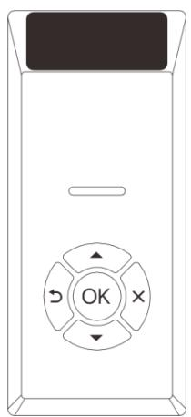
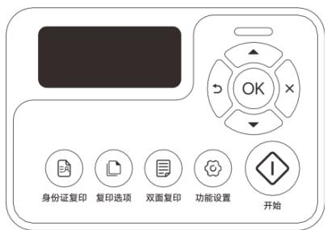

# 用户手册

# G336DN Plus/L3508DN/M3508DNA/GM337DN Plus

# 目录

# 产品介绍

外观....1

常用操作指引....3

操作面板内容指示 4

状态灯指示....5

规格参数 5

# 首次安装与设备添加

首次安装打印机....7

添加打印机设备....10

# 打印

打印电脑中的文件 23

取消打印 29

# 复印

放置原稿 30

机身按键复印....32

电脑端软件复印 33

取消复印 36

# 扫描

将原稿扫描至电脑中（Windows/macOS/Linux） 37

通过计算机扫描 38

取消扫描 42

# 更多操作

更换鼓粉盒....42

恢复出厂设置....44

打印机固件升级 44

查看打印机基本信息....45

# 机器维护

维护鼓粉盒....45

清洁打印机....46

# 故障排除

常见问题 49

送纸问题 49

打印问题 50

复印问题 51

扫描问题 52

清除卡纸 53

注意事项 61

# 安全信息

# 法律声明

# 产品介绍

# 外观

单功能机型（SFP）  

带平板扫描+自动输稿器多功能机型（ADF）  

text_image

操作面板*
自动输稿器
出纸口
排纸延长板
平板扫描
上盖按钮
纸盒
上盖
鼓粉盒
后盖
电源开关
电源接口
纸盒防尘盖
网线接口
USB接口

常用操作指引

<table><tr><td>操作</td><td>关键操作步骤</td></tr><tr><td>开机</td><td>将打印机接通电源,拨动机身后侧键开机。</td></tr><tr><td>关机</td><td>拨动机身后侧键关机。注意:关机是强制性动作,请勿在打印状态下进行,以免造成卡纸。请勿在升级固件时关机,以免造成宕机。</td></tr><tr><td>休眠唤醒</td><td>休眠:打印机就绪状态下无操作,经过系统设定的休眠时间后自动进入休眠模式,此时面板会熄灭。唤醒:点击操作面板上任意按键将机器唤醒,此时面板会点亮。</td></tr><tr><td>取消当前任务</td><td>按×键。</td></tr><tr><td>常规复印</td><td>在打印机就绪状态下,点击▲键或者▼键快捷设置复印份数,点击◇键进行复印。如需调整复印的双面、浓度、分辨率等相关设置,可点击操作面板上的◇键,根据界面提示完成调整,再点击◇键进行复印。▲提示:多功能机型适用。</td></tr><tr><td>身份证复印</td><td>按◇键,进入身份证复印模式,可以在菜单中设置身份证复印参数,然后点击◇键进行复印,之后请按照面板的提示完成第二面的复印。▲提示:多功能机型适用。</td></tr><tr><td>双面复印</td><td>按◇键,进入双面复印模式,可以在菜单中设置双面复印参数,然后点击◇键进行复印,之后请按照面板的提示完成第二面的复印。▲提示:多功能机型适用。</td></tr><tr><td>开始复印第二面</td><td>按◇键。▲提示:多功能机型适用。</td></tr><tr><td>在多合一复印模式下扫描下一页</td><td>按◇键。▲提示:多功能机型适用。</td></tr><tr><td>缺纸后继续打印</td><td>装入纸张,按OK键一下。</td></tr><tr><td>清除卡纸</td><td>请参考&gt;&gt;清除卡纸步骤操作。</td></tr><tr><td>系统信息页</td><td>单功能机型:在打印机就绪状态下,在操作面板点击【OK键】&gt;&gt;【打印系统信息页】,按提示完成操作。多功能机型:在打印机就绪状态下,在操作面板点击【功能设置】&gt;&gt;【打印系统信息页】,按提示完成操作。</td></tr><tr><td>恢复出厂设置</td><td>单功能机型:在打印机就绪状态下,在操作面板点击【OK键】&gt;&gt;【高级设置】&gt;&gt;【恢复出厂设置】,按提示完成操作。</td></tr></table>

多功能机型：在打印机就绪状态下，在操作面板点击【功能设置】>>【高级设置】>>【恢复出厂设置】，按提示完成操作。注意：恢复出厂设置会强制重启。

操作面板内容指示

<table><tr><td>单功能机型操作面板</td><td>按键</td><td>按键介绍</td></tr><tr><td rowspan="7"></td><td></td><td>LCD显示屏,显示操作界面及产品信息。</td></tr><tr><td></td><td>状态灯,指示打印机的状态。</td></tr><tr><td></td><td>向上键,向上滚动浏览各菜单及其选项。</td></tr><tr><td></td><td>向下键,向下滚动浏览各菜单及其选项。</td></tr><tr><td></td><td>返回键,返回上一级菜单。</td></tr><tr><td></td><td>取消键,当有任务时,取消当前执行的任务;当设置时,可恢复默认设置或已设定数值。</td></tr><tr><td>OK</td><td>确定键,确认当前操作。</td></tr><tr><td>多功能机型操作面板</td><td>按键</td><td>按键介绍</td></tr><tr><td rowspan="12"></td><td></td><td>LCD显示屏,显示操作界面及产品信息。</td></tr><tr><td></td><td>状态灯,指示打印机的状态。</td></tr><tr><td></td><td>向上键,向上滚动浏览各菜单及其选项。数字操作时短按为“+1”,长按为“+10”,持续按键可连续操作。</td></tr><tr><td></td><td>向下键,向下滚动浏览各菜单及其选项。当份数等于1份时,短按可设置为“99”。当份数大于1份时,数字操作时短按为“-1”,长按为“-10”,持续按键可连续操作。</td></tr><tr><td></td><td>返回键,返回上一级菜单。</td></tr><tr><td></td><td>取消键,当有任务时,取消当前执行的任务;当设置时,可恢复默认设置或已设定数值。</td></tr><tr><td>OK</td><td>确定键,确认当前操作。</td></tr><tr><td></td><td>身份证复印键,按此键可进入身份证复印模式。</td></tr><tr><td></td><td>复印选项键,按此键可进入复印模式。</td></tr><tr><td></td><td>双面复印键,按此键可进入双面复印模式。</td></tr><tr><td></td><td>功能设置键,打开功能设置主菜单。</td></tr><tr><td></td><td>开始键,用于进行操作设置后,开始相应操作。</td></tr></table>

状态灯指示

<table><tr><td>状态灯</td><td>状态描述</td><td>打印机状态</td></tr><tr><td></td><td>状态灯熄灭</td><td>关机</td></tr><tr><td></td><td>绿灯常亮</td><td>开机</td></tr><tr><td></td><td>绿灯闪烁</td><td>预热</td></tr><tr><td></td><td>绿灯常亮</td><td>空闲/就绪</td></tr><tr><td></td><td>绿灯闪烁</td><td>数据接收中</td></tr><tr><td></td><td>绿灯慢闪</td><td>休眠模式</td></tr><tr><td></td><td>红绿灯每0.5秒交替闪烁</td><td>任务取消</td></tr><tr><td></td><td>红灯常亮</td><td>运行故障(上盖打开/卡纸/鼓粉盒寿命已到等)</td></tr><tr><td rowspan="2"></td><td rowspan="2">红灯闪烁</td><td>缺纸</td></tr><tr><td>机器降温中</td></tr><tr><td></td><td>红灯慢闪</td><td>鼓粉盒寿命不足</td></tr></table>

规格参数

<table><tr><td>机型</td><td>单功能</td><td>多功能(带平板扫描+自动输稿器)</td></tr><tr><td rowspan="2">型号</td><td>G336DN Plus</td><td>M3508DNA</td></tr><tr><td>L3508DN</td><td>GM337DN Plus</td></tr></table>

常规功能规格

<table><tr><td>配置</td><td>台式</td><td>台式</td></tr><tr><td>最大纸张尺寸</td><td>216×297(mm)</td><td>216×297(mm)</td></tr><tr><td>打印纸张尺寸</td><td>A4, Letter, A5, A5 旋转,A6, B5 (JIS), B6 (JIS), B6(JIS)旋转, Executive, 16K,自定义尺寸</td><td>A4, Letter, A5, A5 旋转,A6, B5 (JIS), B6 (JIS), B6(JIS)旋转, Executive, 16K,自定义尺寸</td></tr><tr><td>自定义尺寸</td><td>宽度: 100~216(mm)高度: 127~297(mm)</td><td>宽度: 100~216(mm)高度: 127~297(mm)</td></tr><tr><td>纸张克重</td><td>60g~105g/m2</td><td>60g~105g/m2</td></tr><tr><td>自动双面纸张尺寸</td><td>A4, Letter</td><td>A4, Letter</td></tr><tr><td>自动双面纸张克重</td><td>70g~90g/m2</td><td>70g~90g/m2</td></tr><tr><td>纸盒容量</td><td>550页(70g/m2)</td><td>550页(70g/m2)</td></tr><tr><td>内存</td><td>1GB</td><td>512M</td></tr></table>

产品介绍 

<table><tr><td>电源要求</td><td>AC 220~240V,5A,50/60Hz</td><td>AC 220~240V,5A,50/60Hz</td></tr><tr><td>功耗(平均)</td><td>打印&lt;450W待机&lt;20W休眠&lt;2W</td><td>打印&lt;450W待机&lt;20W休眠&lt;2.5W</td></tr><tr><td>机器尺寸(L*W*H)</td><td>376×319.5×260(mm)</td><td>419×360×394(mm)</td></tr><tr><td>净重</td><td>约8.1kg</td><td>约11.7kg</td></tr><tr><td>USB端口</td><td>USB-B 2.0</td><td>USB-B 2.0</td></tr><tr><td>网络接口</td><td>10/100BASE-T</td><td>10/100Base-TX</td></tr><tr><td>有线网络</td><td>支持</td><td>支持</td></tr></table>

打印功能规格

<table><tr><td>打印速度</td><td>每分钟35页(A4,600 dpi)</td><td>每分钟35页(A4,600dpi)</td></tr><tr><td>打印分辨率</td><td>物理分辨率:600×600 (dpi)软件增强:1200×1200 (dpi)</td><td>物理分辨率:600×600 (dpi)软件增强:1200×1200 (dpi)</td></tr><tr><td>首页打印速度</td><td>&lt;5秒(从搓纸开始到出纸完成)</td><td>&lt;5秒(从搓纸开始到出纸完成)</td></tr></table>

复印功能规格

<table><tr><td>最大原稿尺寸</td><td>N/A</td><td>216×297(mm)</td></tr><tr><td>复印最大分辨率</td><td>N/A</td><td>600×600 (dpi)</td></tr><tr><td>首页输出时间</td><td>N/A</td><td>MFP: &lt;13秒ADF: &lt;15秒</td></tr><tr><td>连续复印</td><td>N/A</td><td>每分钟22页(A4,黑白)</td></tr><tr><td>复印比例</td><td>N/A</td><td>25%~400%</td></tr></table>

扫描功能规格

<table><tr><td>扫描类型</td><td>N/A</td><td>平板扫描+自动输稿器</td></tr><tr><td>色彩模式</td><td>N/A</td><td>彩色、灰度、黑白</td></tr><tr><td>光学分辨率</td><td>N/A</td><td>平板扫描:1200×600 (dpi)自动输稿器:600×600 (dpi)</td></tr><tr><td>色彩位数</td><td>N/A</td><td>24bits(彩色)、8bits(灰度)、1bit(黑白)</td></tr><tr><td>自动输稿器纸张输入容量</td><td>N/A</td><td>50 张( $70g/m^{2}$ )</td></tr><tr><td>保存格式</td><td>N/A</td><td>JPEG,PDF(默认),PNG,BMP,TIF,OFD 格式</td></tr></table>

# 首次安装与设备添加

# 首次安装打印机

1）从包装箱中取出打印机和所有配件，并清点齐全。

natural_image

Line drawing of a printer or scanner device with lid and control panel (no text or symbols)

打印机 × 1

natural_image

Technical line drawing of a mechanical component with internal channels and mounting holes (no text or symbols)

鼓粉盒 $\times 1$ ※已安装于打印机内

natural_image

Simple line drawing of a closed book or document (no text or symbols)

快速安装指南&保修卡 × 1

natural_image

Line drawing of a broadband cable with two connectors (no text or symbols)

USB 线 × 1

natural_image

Line drawing of a cord with two connectors (no text or symbols)

电源线 × 1

<table><tr><td rowspan="3">注意</td><td>如果发现其中缺少或有损坏的,请立即通知经销商。</td></tr><tr><td>在不同的国家,少数部件可能不可用。</td></tr><tr><td>本手册以多功能一体机为例进行图例展示,不同型号请以实物为准。</td></tr></table>

2）移除保护材料&隔离纸

  
如出现打印效果异常，请查看机器内的胶带是否取出。

①打开包装袋，小心地撕下机器内外部全部橙色固定胶带，并取下缓冲支撑块。

natural_image

Illustration of a printer's internal structure showing paper feeding, ventilation, and packaging (no text or symbols)

②先按上盖按钮打开上盖，向上揭开黑色隔离纸，请确保黑色隔离纸完整无残留的取出。

natural_image

Technical line drawing showing two views of a printer or scanner device with an open lid and internal components, no text or symbols present.

# 3）装入纸张

①将纸盒从设备中完全拉出。

natural_image

Illustration of a printer being inserted into a paper holder, with red arrows indicating the process (no text or symbols present)

②先捏住后端A纸盒绿色延长解锁杆解锁拉出纸盒延长托盘。

natural_image

Technical diagram of a mechanical device with internal components and a labeled section (A), no readable text or symbols present.

※如需放置 Letter 纸型，请按照如下步骤完成操作：先将左右两侧挡片的固定卡扣解扣，再将左右两侧挡片旋转放到纸盒后端卡槽内，即可放置 Letter 纸。

text_image

Technical diagram of a computer motherboard with numbered components and directional arrows indicating movement or assembly.

③在装纸前，将纸来回弯曲使纸松动，再扇动纸，在桌子上墩齐纸的边缘。

natural_image

Two-step illustration showing hands holding a folded paper or scroll, with arrows indicating movement direction (no text or symbols)

④将纸张平整放入纸盒，捏住并移动 $^{B}$ 左边绿色挡板和 $^{C}$ 后端绿色挡板调整到打印纸张大小的位置，以固定纸张。纸盒最多可装550张（70g/m $^{2}$ ）纸，过满可能会导致卡纸。

text_image

B
C
短边

<table><tr><td rowspan="2">提示</td><td>装纸前墩齐纸的边缘有助于防止卡纸。</td></tr><tr><td>请勿直接从机器后侧装纸,以免造成卡纸。</td></tr></table>

⑤将纸盒装回打印机。

natural_image

Line drawing of a printer with a hand inserting a component, showing red arrows indicating motion (no text or symbols)

<table><tr><td>注意</td><td>装入纸张时,请务必配置纸张尺寸和纸张类型。打印文件时,请在打印机驱动程序中指定纸张尺寸和纸张类型,以便装入纸张时配置的设置可用来进行打印。</td></tr><tr><td rowspan="5">提示</td><td>关于在打印机驱动程序中指定纸张尺寸和纸张类型的详细信息,请参见 &gt;&gt; 纸张尺寸。</td></tr><tr><td>纸张卷曲可能会卡纸。装纸前,请将卷曲的纸张整理平整。</td></tr><tr><td>不要将导纸板推得太紧,以致引起纸张拱起。</td></tr><tr><td>如果您未调整导纸板,可能会卡纸。</td></tr><tr><td>如果您需要在打印时向打印机的进纸托盘中加纸,首先将打印机进纸托盘中剩余的纸张拿出来,然后将它们放进新的纸张中。直接在打印机进纸托盘中剩余的纸张上加纸,可能会导致打印机卡纸或多页纸同时输送。</td></tr></table>

# 5）放置合适位置并开机

①将打印机水平稳固放置并预留足够的空间，四周需预留15cm以上空间。将排纸延长板拉出并旋转到位。  
②将电源线的另一端插入正确接地的 220V 交流电源插座内，拨动机身后侧 键开机。

text_image

≥15cm
≥15cm
≥15cm

text_image

开关

# 注意

打印机启动后，扫描仪会进行校准，校准时请勿打开扫描仪上盖，请耐心等待。

添加打印机设备

<table><tr><td>程序&amp;软件</td><td>内容</td></tr><tr><td>电脑端(鸿蒙Next/Windows/macOS/Linux)</td><td>联想打印软件</td></tr><tr><td>驱动程序</td><td>鸿蒙Next/Windows/macOS/Linux</td></tr><tr><td rowspan="3">在安装打印机驱动程序前确认</td><td>您的计算机上至少应有2GB内存。</td></tr><tr><td>您的计算机硬盘至少有200MB的空余空间。</td></tr><tr><td>您的计算机上已安装了鸿蒙Next/Windows/macOS/Linux系统。</td></tr><tr><td>提示</td><td>系统不同,安装界面会有所差异,属于正常现象。</td></tr></table>

# Windows 系统安装驱动程序

仅适用于操作系统为 Windows 7 以上，并且已经安装了.Net Framework 4.0 及以上版本的系统插件。

以 Windows 10 系统为例，实际步骤取决于您所使用的操作系统。

①在打印机开机状态下，使用随附的 USB 线连接电脑和打印机。

natural_image

Isometric line drawing of a mechanical device with no visible text or symbols

natural_image

Pure electrical circuit lines without any symbols

natural_image

Line drawing of a laptop computer with blank screen and keyboard (no text or symbols)

②登录官网：https://www.lenovoimage.com/ 根据打印机型号下载打印机驱动，解压后进行安装。  
③根据界面指引安装驱动，点击【下一步】继续安装。

text_image

联想打印 安装
欢迎使用联想打印安装程序
此程序将引导你完成"联想打印 v2.2.5"的安装。
点击 [下一步(N)] 继续。
下一步(N) > 取消(C)

④勾选【我接受许可证协议中的条款】，点击【下一步】继续安装。

text_image

联想打印 安装
许可证协议
在安装联想打印之前，请阅读许可证条款。
要阅读协议的其余部分，请按 [PgDn] 键向下翻页。
至像许可协议
ZX001-001-01 01/2023
本至像许可协议（以下简称“本协议”）适用于您获得的各种至像科技有限公司（以下简称“至像”）软件产品，不论是至像硬件产品上预装或附带的、单独获得的或您从至像网站或经至像准许的第三方网站上下载的。本协议也适用于这些软件产品的任何更新或补丁程序。
如需本至像许可协议的其他语言版本，请访问：
请点击勾选下方的选框，你必须在同意后才能安装，点击 [下一步(N)] 继续。
☑ 我接受许可证协议中的条款(A)
< 上一步(P)    下一步(N) >    取消(C)

⑤点击【浏览】选择所需安装目录，点击【安装】。

text_image

联想打印 安装
选择安装位置
选择联想打印的安装文件夹。
安装程序将把联想打印安装到以下目录，点击 [安装(I)] 开始安装。
安装目录
C:\Program Files (x86)\Lenovo_Print
浏览(B)...
所需空间: 116.4 MB
可用空间: 22.8 GB
< 上一步(P) 安装(I) 取消(C)

⑥程序自动安装，请耐心等待。

text_image

正在安装
联想打印正在安装，请稍候。
解压缩: BasicTableViewStyle.qml
解压缩: StackView.qmlc... 100%
解压缩: StackViewDelegate.qml... 100%
解压缩: StackViewDelegate.qmlc... 100%
解压缩: StackViewTransition.qml... 100%
解压缩: StackViewTransition.qmlc... 100%
解压缩: StatusBar.qml... 100%
解压缩: StatusBar.qmlc... 100%
输出目录: D:\LenovoPrint\LenovoPrint_v2.0.4\Lenovo_Print\QtQuick\Co...
解压缩: ApplicationWindowStyle.qml... 100%
解压缩: ApplicationWindowStyle.qmlc... 100%

⑦打印机驱动程序安装完成，勾选【运行联想打印】，点击【完成】运行驱动程序。

text_image

联想打印 安装
联想打印安装程序结束
联想打印已经成功安装到本机。
点击 [完成(P)] 关闭安装程序。
✓ 运行联想打印(R)
< 上一步(P) 完成(F) 取消(C)

⑧点击【开始添加】添加打印机，确认打印机连接状态。

text_image

联想打印
添加打印机
全新智能打印机
打印从此不同
开始添加

# 网络打印机添加方法：

此方法适用于打印机已插入有线网络。

# 注意

请确保打印机与电脑处于同局域网。

①根据界面指引，选择第一项，点击【下一步】后选择设备并添加。

text_image

联想打印
< 选择打印机添加方式
打印机是否已连接过网络？
是。打印机已连接过网络
否。打印机设连接过网络或想重新连接网络
仅使用USB连接电脑和打印机
下一步

text_image

联想打印
< 搜索到的打印机
Lenovo GM337DN Plus
IPv4:192.168.108.228
添加
Lenovo GM337DN Plus
IPv6:fe80::4603.77fffe4d:7d9
添加
✓ 同时显示IPv6备用设备
IP 地址添加设备

②设备添加成功后，点击【开始使用】完成设置。首页设备列表中会有添加成功的设备显示。

text_image

联想打印
搜索到的打印机
Lenovo GM337DN Plus
IPv4.192.168.108.228
添加成功
Lenovo GM337DN Plus-...
192.168.108.228
开始使用
IP 地址添加设置

text_image

联想打印
Lenovo GM337D...
在线
Lenovo GM337D...
在线
Lenovo GM337DN Plus-N...
耗材购买
休眠中
100%
①
重粉剩余量
扫描
复印
身份证复印
设置

仅通过 USB 线连接打印机使用：

①选择第三个选项，点击【下一步】。

text_image

联想打印
< 选择打印机添加方式
打印机是否已连接过网络？
○ 是。打印机已连接过网络
○ 否。打印机没连接过网络或想重新连接网络
● 仅使用USB连接电脑和打印机
下一步

②按照界面操作提示，为打印机开机并连接 USB 线缆，逐一检查并执行操作，完成后，点击【返回首页】。

text_image

联想打印
仅使用USB连接
请确认以下操作：
· 打印机已处于开机状态
· 使用打印机USB线缆，将打印机和电脑连接
· 连接成功后，电脑会自动添加USB打印机，请返回首页等待添加结果
返回首页

③自动添加设备成功后，首页设备列表中会有自动添加的设备显示。

text_image

联想打印
Lenovo GM337D...
在线
Lenovo GM337DN Plus
耗材购买
• 休眠中
100%
①
墨粉剩余量
扫描
复印
身份证复印
设置

# macOS 系统安装驱动程序

①在打印机开机状态下，使用随附的 USB 线连接电脑和打印机。  
②登录官网: https://www.lenovoimage.com 根据打印机型号下载打印机驱动, 解压后进行安装。

text_image

Install Lenovo Printer Driver
Lenovo Printer Driver.pkg

③在介绍界面点击【继续】。

text_image

安装Lenovo Printer Driver
欢迎使用"Lenovo Printer Driver"安装器
● 介绍
● 许可
● 目的宗卷
● 安装类型
● 安装
● 摘要
安装器将引导你完成安装此软件所需要的步骤。
返回	继续

④根据界面引导安装程序，点击【安装】，之后将会按照标准安装程序安装。

text_image

安装 Lenovo Printer Driver
标准安装将执行于“macOS”上
• 介绍
• 许可
• 目的宗卷
• 安装类型
• 安装
• 摘要
这将占用你的电脑上的83.3MB空间。
请点按“安装”来为此电脑的所有用户执行此软件标准安装。此电脑的所有用户均可以使用此软件。
更改安装位置...
返回	安装

⑤等待安装。

text_image

安装 Lenovo Printer Driver
正在安装 Lenovo Printer Driver
• 介绍
• 许可
• 目的宗卷
• 安装类型
• 安装
• 摘要
正在向系统注册软件包...
剩余安装时间：大约2分钟
返回	继续

⑥单击【关闭】完成安装。

text_image

安装 Lenovo Printer Driver
安装成功。
● 介绍
● 许可
● 目的宗卷
● 安装类型
● 安装
● 摘要
安装成功。
软件已安装。
返回	关闭

⑦点击【开始添加】添加打印机，确认打印机连接状态。

text_image

联想打印
添加打印机
全新智能打印机
打印从此不同
开始添加

网络打印机添加方法：

此方法适用于打印机已插入有线网络。

注意

请确保打印机与电脑处于同局域网。

①根据界面指引，选择第一项，点击【下一步】后选择设备并添加。

text_image

选择打印机添加方式
打印机是否已连接过网络？
是。打印机已连接过网络
否。打印机没连接过网络或想重新连接网络
仅使用USB连接电脑和打印机
下一步

text_image

联想打印
< 搜索到的打印机
Lenovo GM337DN Plus
IPv4:192.168.108.228
添加
Lenovo GM337DN Plus
IPv6:fe80::4603:77ff:fe4d:7d9...
添加
同时显示IPv6备用设备
IP 地址添加设备

②设备添加成功后，点击【开始使用】完成设置。首页设备列表中会有添加成功的设备显示。

text_image

联想打印
< 搜索到的打印机
Lenovo GM337DN Plus
IPv4.182.168.108.228
添加成功
Lenovo_GM337DN_Plus-...
192.168.108.228
开始使用
地址添加设备

text_image

联想打印
Lenovo_GM337D...
在线
Lenovo_GM337D...
在线
Lenovo_GM337DN_Plus-...
耗材购买
休眠中
100%
墨粉剩余量
扫描
复印
身份证复印
设置

仅通过 USB 线连接打印机使用：

①选择第三个选项，点击【下一步】。

text_image

选择打印机添加方式
打印机是否已连接过网络？
○ 是。打印机已连接过网络
○ 否。打印机没连接过网络或想重新连接网络
● 仅使用USB连接电脑和打印机
下一步

②按照界面操作提示，为打印机开机并连接 USB 线缆，逐一检查并执行操作，完成后，点击【返回首页】。

text_image

仅使用USB连接
请确认以下操作：
• 打印机已处于开机状态
• 使用打印机USB线缆，将打印机和电脑连接
• 连接成功后，电脑会自动添加USB打印机，请返回首页等待添加结果
返回首页

③自动添加设备成功后，首页设备列表中会有自动添加的设备显示。

text_image

联想打印
Lenovo GM337D...
在线
Lenovo GM337DN Plus
耗材购买
休眠中
100%
墨粉剩余量
扫描
复印
身份证复印
设置

# Linux 系统安装无线驱动程序（Kylin V10 为例）

①在打印机开机状态下，使用随附的 USB 线连接电脑和打印机。  
②登录官网: https://www.lenovoimage.com 根据打印机型号下载打印机驱动, 解压后进行安装。  
③双击安装包，打开安装界面，点击【一键安装】。

text_image

安装器
联想打印
版本: 2.1-8
一键安装

④等待安装。

text_image

安装器
联想打印
版本: 2.1-8
安装中...
9%

⑤单击【确定】完成安装。

text_image

安装器
安装成功
确定

⑥点击【开始添加】添加打印机，确认打印机连接状态。

text_image

联想打印
添加打印机
全新智能打印机
打印从此不同
开始添加

网络打印机添加方法：

此方法适用于打印机已插入有线网络。

注意

请确保打印机与电脑处于同局域网。

①根据界面指引，选择第一项，点击【下一步】后选择设备并添加。

text_image

联想打印
< 选择打印机添加方式
打印机是否已连接过网络？
是。打印机已连接过网络
否。打印机设连接过网络或想重新连接网络
仅使用USB连接电脑和打印机
下一步

text_image

联想打印
< 搜索到的打印机
Lenovo GM337DN Plus
IPv4:192.168.108.228 添加
Lenovo GM337DN Plus
IPv6:fe80::4603.77ff,fe4d:7d9 添加
同时显示IPv6备用设备
IP 地址添加设备

②设备添加成功后，点击【开始使用】完成设置。首页设备列表中会有添加成功的设备显示。

text_image

联想打印
搜索到的打印机
Lenovo GM337DN Plus
IPv4.192.168.108.228
添加成功
Lenovo GM337DN Plus-...
192.168.108.228
开始使用
IP 地址添加设备

text_image

联想打印
+
GM337DN-Plus
在线
Lenovo_GM337D...
在线
Lenovo_GM337DN_Plus-N...
只 耗材购买
休眠中
100%
墨粉剩余量
扫描
复印
身份证复印
设置

仅通过 USB 线连接打印机使用：

①选择第三个选项，点击【下一步】。

text_image

联想打印
< 选择打印机添加方式
打印机是否已连接过网络？
○ 是。打印机已连接过网络
○ 否。打印机没连接过网络或想重新连接网络
● 仅使用USB连接电脑和打印机
下一步

②按照界面操作提示，为打印机开机并连接 USB 线缆，逐一检查并执行操作，完成后，点击【返回首页】。

text_image

联想打印
仅使用USB连接
请确认以下操作：
· 打印机已处于开机状态
· 使用打印机USB线缆，将打印机和电脑连接
· 连接成功后，电脑会自动添加USB打印机，请返回首页等待添加结果
返回首页

③自动添加设备成功后，首页设备列表中会有自动添加的设备显示。

text_image

联想打印
GM337DN-Plus
在线
GM337DN-Plus
耗材购买
休眠中
100%
墨粉剩余量
扫描
复印
身份证复印
设置

# 鸿蒙 Next 系统安装驱动程序

①从应用商店安装【联想至像打印】App，打印机驱动软件就会被安装到鸿蒙系统的设备上。请前往【设置】>>【打印机和扫描仪】>>【添加打印机】，添加完成后即可开始打印。如需使用扫描功能，请在对应打印机处点击【打开扫描仪】。

<table><tr><td>注意</td><td>卸载【联想至像打印】App时将同步移除打印机驱动,从而影响打印机的打印效果,请谨慎操作。</td></tr></table>

text_image

添加打印机和扫描仪
默认	IP 添加
打印机需和本机连接相同 WLAN，或通过 USB 和有线连接，才可被发现
USB-GM337DN Plus-102390
USB
ZX_M3300DNW_4823
WLAN
ZX_M3300DNW-Network @ jamie的MacBook Pro
WLAN
ZX-M3300DNW
云打印

②添加打印机完成即可。

text_image

打印机和扫描仪
默认打印机
已连接设备
USB-GM337DN Plus=102390
* 坚前,上次使用的打印机
打开扫描仪
添加打印机和扫描仪
上次使用的打印机 ▼

# 打印

# 打印电脑中的文件

本章节介绍打印机驱动程序中的设置内容和步骤。

<table><tr><td>打印机驱动程序打印</td><td colspan="2">设置选项</td></tr><tr><td rowspan="4">Windows系统使用驱动程序(含通过网络使用打印机)</td><td>布局</td><td>● 方向● 双面打印</td></tr><tr><td>纸张/质量</td><td>● 纸盒选项</td></tr><tr><td>其他</td><td>● 自定义纸张管理</td></tr><tr><td>高级</td><td>● 纸张/输出● 图形● 文档选项</td></tr><tr><td>macOS系统使用驱动程序</td><td>基本设置</td><td>● 纸张尺寸● 方向● 份数● 纸张类型● 打印质量● 打印设置● 省墨模式</td></tr><tr><td rowspan="4">Linux系统中使用驱动程序(Kylin V10为例)</td><td>常规</td><td>● 份数</td></tr><tr><td>页面设置</td><td>● 双面● 方向● 纸张类型● 纸张大小</td></tr><tr><td>图像质量</td><td>● 分辨率</td></tr><tr><td>高级</td><td>● 省墨模式● 亮度● 对比度</td></tr><tr><td>鸿蒙Next系统使用驱动程序</td><td>常规</td><td>● 份数● 色彩(黑白)</td></tr></table>

打印

<table><tr><td rowspan="2"></td><td>页面设置</td><td>● 双面打印● 纸张方向● 纸张类型● 纸张大小</td></tr><tr><td>打印质量</td><td>● 分辨率</td></tr></table>

# Windows 系统使用驱动程序

下面的过程说明基于 Windows 10 操作系统环境中打印的步骤。

# 注意

打印文件的准确步骤可能随应用程序的不同而有所不同，关于准确的打印步骤，请参照您的应用软件。

通过网络使用打印机时，请先确认您已经安装网络驱动程序。

使用打印机驱动程序从计算机中打印文件。

1）请确认您已经连接打印机。  
2）打开您需要打印的文件。  
3）在文件菜单中选择打印。

text_image

打印
打印机(N): 
属性(P) 高级(D)
份数(C): 1
以灰度(黑白色) 打印(Y)
节省墨水/墨粉 ①
要打印的页面
所有页面(A)
当前页面(U)
页面(G) 1 - 23
更多选项
调整页面大小和处理页面 ①
大小(I) 海报 多页 小册子
适合(F)
实际大小
缩小过大的页面
自定义比例: 100 %
按照 PDF 页面大小选择纸张来源(Z)
双面打印(B)
方向:
自动纵向/横向(R)
纵向
横向
注释和表单(M)
文档和标记
小结注释(T)
比例: 100%
21 x 29.7 厘米
为了创造更加美好的环境
第 2 页, 共 25 页
页面设置(S)... 打印 取消

4）在图例左侧窗口确认您的当前设置，点击【属性】，可修改打印参数。  
5）以下打印参数修改确认完毕后，点击【确定】完成设置。

①布局

text_image

布局
纸张/质量
其他
方向(Q):
纵向
双面打印(B):
无
高级(V)...
确定
取消

# - 方向

可以选择文档打印的方向：纵向或横向。

text_image

纵向
横向

# - 双面打印

如果您想进行双面打印，请使用此选项。仅支持 A4、Letter 纸张尺寸开启此功能。

a.请在打印机特性中选择双面打印选项框中选择长边翻页或短边翻页。

b. 打印机将会按设置的参数自动进行双面打印。

②纸张/质量

text_image

布局
纸张/质量
其他
纸盒选择
纸张来源(S): 自动选择
媒体(M): 普通纸
高级(V)...
确定 取消

# - 纸盒选择

a. 纸张来源，从下拉列表中选择自动选择或下层纸盒。  
b. 媒体，从下拉列表中选择普通纸、再生纸、厚纸。

# ③其他

text_image

布局 纸张/质量 其他
自定义纸张管理
自定义尺寸(U)
确定 取消

# - 自定义纸张管理

点击【自定义尺寸】，点击【添加】并输入尺寸相关参数后，点击【确认】完成添加。

提示 自定义设置支持尺寸参数具体可查看“常规功能规格”中“自定义尺寸”。

# ④高级设置

在布局或纸张/质量页面，点击【高级】，可以完成高级文档设置。包括纸张/输出、图形、文档选项等参数设置。

text_image

Lenovo GM337DN Plus 高级选项
Lenovo GM337DN Plus 高级文档设置
□ 纸张/输出
    纸张规格: A4
    份数: 1 份数
□ 图形
    打印质量: 标准 (600 dpi)
□ 文档选项
□ 打印机功能
    进纸方向: 短边
    省墨模式: 关闭
    打印设置: 默认
    浓度调整: 正常
    细线补偿: 启用
确定 取消

# macOS 系统使用驱动程序

text_image

未命名
Helvetica
常规体
12
B I U
页码: 1/1
打印机 Lenovo GM337DN Plus (zhaowei's iMac)
预置 默认设置
份数 1
页数
所有页面
范围从 1 至 1
所选页
从边栏选择页面
双面 关闭
纸张大小 A4 210 x 297毫米
方向 竖排 横排
文本编辑
打印页眉和页脚
内容重新自动换行以适合页面
布局
每张1页
纸张处理
逐张打印、所有张数
打印机选项
打印机信息
? PDF 取消 打印

1）打开您要打印的文件。  
2）从系统弹出的设置界面，选择指定打印机进行打印。  
3）设置份数、页数、双面、纸张大小、方向、文本编辑、布局、纸张处理、打印机选项、打印机信息等打印参数。

# 4）完成参数设置，点击【打印】。

# 提示

系统内置功能的变化取决于您安装的 macOS 版本。

# ①份数

份数选项可以设置将要打印的份数，默认份数为 “1”。

# ②页数

页数选项可以设置将要打印的文件，全部页数或指定页数进行打印。

# ③双面

如果您想进行双面打印，请打开此选项，默认为“关闭”。

# 提示

仅在 A4、Letter 纸张尺寸下可以使用自动双面打印功能。

# ④纸张大小

可选择 A4，Letter，B5，A5，A5(长边)，B6，B6(长边)，A6，Executive，16K，自定义尺寸等尺寸。

# ⑤方向

可以通过点选“竖排”或“横排”，选择打印方向。

# ⑥文本编辑

可通过勾选“打印页眉和页脚”或“内容重新自动换行以适合页面”，完成文本编辑设置。

# ⑦布局

可设置每张页数、布局方向、边框、颠倒页面方向、水平翻转等内容。

# ⑧纸张处理

可设置逐张打印、待打印的张数、纸张顺序等内容。

# Linux 系统使用驱动程序（Kylin V10 为例）

下面的过程说明基于 KylinV 10 操作系统环境中打印的步骤。

text_image

打印
常规	页面设置	文本编辑器	任务	图像质量	颜色	高级
打印机	位置	状态
打印到文件
GM337DN-Plus
Lenovo_GM337DN_Plus-Network
范围	副本
所有页面(A)	副本数(S): 1 - +
当前页(U)	逐份(O)
页面(E):	逆序(R)
预览(V)	取消(C)	打印(P)

1）打开您要打印的文件。  
2）从系统弹出的设置界面，选择指定打印机进行打印。  
3）可调整常规、页面设置、文本编辑器、任务、图像质量、颜色、高级等打印参数。  
4）完成参数设置，点击【打印】。

# 提示

系统内置功能的变化取决于不同的 Linux 系统。

# 鸿蒙 Next 系统使用驱动程序

从应用软件的菜单中选择【打印】，调出打印对话框，设置需要的参数，然后开始打印。

text_image

打印机
USB-GM337DN Plus-102390
范围
全部页面
从 1 至 1
自定义 例如: 1, 3, 5-12
份数
1
色彩模式:
黑白
纸张尺寸 A4 (210 × 297 mm)
纸张方向 自适应
单双面 单面打印
打印质量 标准均衡
① 取消 开始打印

# 取消打印

如果您需要取消打印作业，根据打印状态不同操作不同。

# 打印开始前取消打印作业

1）在计算机任务栏上双击打印机图标，出现任务框。

<table><tr><td colspan="7">打印机(P) 文档(D) 查看(V)</td></tr><tr><td>文档名</td><td>状态</td><td>所有者</td><td>页数</td><td>大小</td><td>提交时间</td><td>端口</td></tr><tr><td>用户手册.pdf</td><td>正在打印</td><td>wang...</td><td>104</td><td>7.00 MB...</td><td>18:48:39 20...</td><td>USBO</td></tr><tr><td colspan="3">队列中有1个文档</td><td></td><td></td><td></td><td></td></tr></table>

2）选中【打印任务】，之后点击鼠标右键，然后单击【取消】。

text_image

打印机(P) 文档(D) 查看(V)
文档名	状态	所有者	页数	大小	提交时间	端口
用户手册.pdf	正在打印	wang...	104	9.25 MB...	18:48:39 20...	USBO
暂停(A)
重新启动(S)
取消(C)
属性(R)

3）点击【是】，打印任务取消。

text_image

打印机(P) 文档(D) 查看(V)
文档名	状态	所有者	页数	大小	提交时间	端口
用户手册.pdf 正在打印	wang... 104 9.25 MB... 18:48:39 20... USB0
队列中有 1 个文档
打印机
!
你确定要取消该文档吗?
是(Y) 否(N)

# 打印进行中取消打印作业

按操作面板上的 × 键，操作面板上会有文字提示，同时状态灯 ↔ 红灯和绿灯每0.5秒交替闪烁，取消当前任务。

<table><tr><td rowspan="2">注意</td><td>如果取消的打印作业已经在处理中,则会继续打印几页后才会取消。</td></tr><tr><td>取消多页打印作业可能需要一段时间。</td></tr></table>

# 复印

# 放置原稿

# 关于原稿

# 1）建议的原稿尺寸

平板扫描仪：宽度不超过 216mm，长度不超过 297mm，稿台最大承重≤3kg。

自动输稿器：宽度不超过 216mm，长度不超过 297mm，纸张最大克重≤100g（平整纸 50 页（70g/m²），非平整纸张或其他克重的纸张以不超过左右导纸板刻度线为准）。

# 2）无法扫描的图像区域

即使原稿正确放置，其周围 1 毫米左右的边距可能无法扫描。

text_image

1 mm
1 mm
扫描区域

# 在扫描仪玻璃板上放置原稿

1）抬起扫描仪盖板。  
2）将原稿正面朝下放置在扫描仪玻璃板上，原稿应与左上角对齐。

text_image

1mm
A5 B5 LTR A4
1mm
A5
B5
A4
LTR

# 3）放下扫描仪盖板。

# 注意

在原稿上的墨粉完全干燥前，请勿放置原稿。否则可能在扫描仪玻璃板上留下印记，并且出现在复印件上。

使用厚重、折叠或装订的原稿时，或者盖子无法完全放下时，请双手按住扫描仪盖板。

# 使用自动输稿器放置原稿

# 提示

将纸张放入自动输稿器前必须充分展开堆叠的纸张。

切勿使用卷曲、褶皱、折叠、撕裂或带有订书钉、回形针、胶水或粘有胶带的纸张。

切勿使用纸板、报纸或纤维纸。

使用自动输稿器时，切勿在进纸过程中拉住原稿，以免损坏设备。

确保原稿上的涂改液或墨迹完全干透。

# 1）翻转自动输稿器的原稿出纸支撑翼板①和原稿托板②。

text_image

Diagram of a printer with labeled parts A and B, showing internal structure and red directional arrows indicating flow or movement.

2）在唤醒状态下，充分展开堆叠的纸张，并将原稿以正面向上、顶部先进入的方式放入自动输稿器中，而且原稿已触碰到撮纸辊。  
3）调整纸张导块©至原稿宽度。

natural_image

Line drawing of a printer with a paper feeding into a tray, showing no text or symbols.

# 机身按键复印

# 普通复印

1）将您要复印的文件或证件放置于扫描仪玻璃板上，需要复印的面朝下。  
2）就绪状态下，根据复印需求在操作面板上点击 ☐ 键设置相应的参数，如份数、浓度等。  
3）设置就绪后，点击 ◆ 键，进行复印。  
4）操作面板上会有文字提示，状态灯 绿灯闪烁，状态为正在复印中。

<table><tr><td>提示</td><td>如果打印机处于休眠状态,操作面板屏幕熄灭,状态灯绿灯慢闪,按任意键唤醒打印机,之后使用打印机进行复印任务。</td></tr></table>

# 身份证复印

您可以通过使用打印机上身份证复印功能将身份证的两面复印到纸张的一面上。

1）将身份证放置于扫描仪玻璃板上复印最佳区域内。

text_image

1cm
A5 B5 LTR A4
1cm
复印最佳区域
A5
B5
A4
LTR

2）根据身份证复印需求，按下 🔊 键选择相应的份数及其他设置。  
3）进入身份证复印模式后，点击操作面板上 ◆ 键，开始扫描证件的第一面。

<table><tr><td rowspan="2">提示</td><td>如果在1分钟内,您没有任何操作动作,打印机将会退出此模式,回到就绪状态。</td></tr><tr><td>如果身份证复印失败,请尝试确认及操作:1.确认玻璃板是否擦拭干净;2.确认扫描盖板是否有漏光;3.手动重启打印机,盖好扫描盖板,重新进行扫描仪校准。</td></tr></table>

4）操作面板屏幕会有文字提示，此时状态灯 ☐ 绿灯闪烁，此时为等待扫描证件第二面。  
5）请将证件翻面，放置位置仍保持放置在扫描仪玻璃板复印最佳区域内，按操作面板上的 ◊ 键一下，进入第二面扫描模式。  
6）打印机会自动打印出您要复印的证件，证件的正反面在同一张纸的一面上。

<table><tr><td>▲提示</td><td>证件复印完后,证件复印功能将会保持20秒,您可以继续进行下一张身份证复印,如果20秒内,没有任何操作动作,打印机将会退出身份证复印功能,回到就绪</td></tr></table>

状态。

在复印过程中您也可以按操作面板 × 键取消身份证复印，返回就绪界面。

# 电脑端软件复印

# 普通复印

在首页点击【复印】并设置好复印参数后，点击【开始复印】按钮即可。

text_image

联想打印
Lenovo GM337D...
在线
Lenovo GM337DN Plus
耗材购买
休眠中
100%
置粉剩余量
扫描
复印
身份证复印
设置

text_image

联想打印
< 复印
将原稿放置扫描区域，盖住面板，设置完复印参数，点击“开始复印”
复印设置
复印份数
1
复印浓度
标准
缩放比例
- 100%
原稿类型
照片
原稿尺寸
A4
复印质量
标准
输出尺寸
A4
开始复印

# 双面复印

如需双面复印，仅支持 A4、Letter 纸张尺寸开启此功能。可按照以下步骤进行操作：

1）在首页点击【复印】并设置好复印参数。

text_image

联想打印
Lenovo GM337D...
在线
Lenovo GM337DN Plus
耗材购买
休眠中
100%
置粉剩余量
扫描
复印
身份证复印
设置

2）点击界面【双面复印】右侧【V】下拉菜单，在【双面复印】子菜单中选择“长边翻边”或“短边翻边”，点击【i】图标查看操作提示，再点击【开始复印】按钮即可。

text_image

联想打印
< 复印
将原稿放置扫描区域，盖住面板，设置完复印参数，点击“开始复印”
复印设置
复印质量
标准
输出尺寸
A4
纸张类型
普通纸
多合一
1
1
2
3
4
1 2 3
4 5 6
7 8 9
一合一
二合一
四合一
九合一
双面复印
无
开始复印

text_image

联想打印
提示
复印文件第一面
复印文件第二面
将原稿放置扫描
完复印参数
放入原稿第一面，开始复印
扫描完第一面后，放入下一页原稿，点击开始按钮继续扫描
九合一
开始复印

3）当第一页原稿复印后，打印机上状态灯 ☐ 绿色闪烁，请在 1 分钟之内按照首页弹出提示，放入下一页原稿，按打印机操作面板的 ◆ 键继续。直至打印机吐纸，双面复印完成。

text_image

联想打印
放入下一页原稿后，合上盖板，轻按触控面板开始键继续。
Lenovo GM337DN Plus
耗材购买
• 复印等待中
100% ①
墨粉剩余量
扫描
复印
身份证复印
设置

# 身份证复印

如果需要将身份证正反面复印到同一张 A4 纸上，可按照以下步骤进行操作：

1）点击【身份证复印】并设置好复印参数后，点击【下一步】按钮即可。

text_image

联想打印
Lenovo GM337D...
在线
Lenovo GM337DN Plus
耗材购买
休眠中
100%
①
墨粉剩余量
扫描
复印
身份证复印
设置

text_image

联想打印
身份证复印
将身份证放置扫描区域，盖住面板，设置完复印参数，点击“开始复印”
*使用A5纸张进行身份证复印，请纵向放置纸张
复印设置
复印份数
1
复印浓度
标准
输出尺寸
A4
纸张类型
普通纸
版式选择
居中
顶端
底端
横向
下一步

2）按照提示放置身份证原件，然后点击【我已放好身份证，开始扫描】按钮。

text_image

联想打印
身份证复印
①
复印身份证头像面
②
复印身份证国徽面
将身份证头像面按照图示位置放在扫描区域，关闭扫描盖板，在电脑上点击“开始扫描”按钮
将身份证翻面放在同一位置，关闭扫描台盖板，轻按开始键进行复印
我已放好身份证，开始扫描

3）当头像面扫描完后，打印机上状态灯 ☐ 绿色闪烁，请在 1 分钟之内按照首页弹出提示，将身份证翻面扫描国徽面，按打印机操作面板的 ◆ 键继续。直至打印机吐纸，身份证复印完成。

text_image

联想打印
Lenovo GM337D...
在线
身份证翻面后，合上盖板，轻接触控面板开始键继续。
Lenovo GM337DN Plus
耗材购买
复印等待中
100%
墨粉剩余量
扫描
复印
身份证复印
设置

# 多合一复印

如果需要将多张原稿复印到一张纸上，可按照以下步骤进行操作：

1）在复印功能页面中选择多合一复印数量，点击【i】图标查看操作提示，再点击【开始复印】按钮。

text_image

联想打印
Lenovo GM337D...
在线
Lenovo GM337DN Plus
耗材购买
• 休眠中
100%
墨粉剩余量
扫描
复印
身份证复印
设置

text_image

联想打印
复印设置
复印质量
标准
输出尺寸
A4
纸张类型
普通纸
多合一 ④
1
1 2 3
4 5 6
2 3 4 5 6
7 8 9
一合一 二合一 四合一 九合一
双面复印 ①
无
开始复印

text_image

联想打印
< 复印
提示
1
复印第一份文件
2
复印第二份文件
3
复印第三份文件
将原稿放置扫完复印参数
放入原稿第一面，开始复印
扫描完第一面后，放入下一页原稿
继续放入后面的原稿，轻按打印机控制面板开始键，直到复印完成
九合一
开始复印

2）当第一页原稿复印后，打印机上状态灯 ☐ 绿色闪烁，请在 1 分钟之内按照首页弹出提示，放入后面的原稿，按打印机操作面板的 ⏱ 键继续。循环本步骤，直至打印机吐纸，多合一复印完成。

text_image

联想打印
放入下一页原稿后，合上盖板，轻按触控面板开始键继续。
Lenovo GM337DN Plus
耗材购买
复印等待中
100% ①
墨粉剩余量
扫描
复印
身份证复印
设置

# 取消复印

1）按操作面板上 ✗ 键即可以取消当前正在进行的复印作业。

2）操作面板屏幕有相应文字提示，状态灯 ↔ 红灯和绿灯每 0.5 秒交替闪烁，取消当前任务。

<table><tr><td rowspan="3">注意</td><td>在1分钟内未按提示完成操作,打印机自动取消当前复印任务。</td></tr><tr><td>如果机器正在扫描原稿时取消复印,则复印会立即取消且没有打印输出复件。</td></tr><tr><td>如果在打印过程中取消复印,则系统将在打印输出当前页面之后取消复印任务。</td></tr></table>

# 扫描

# 将原稿扫描至电脑中（Windows/macOS/Linux）

将需要扫描的物件放入打印机的扫描区域，使用电脑端软件【联想打印】按照以下流程进行操作：

1）在首页点击【扫描】按钮。

text_image

联想打印
Lenovo GM337D...
在线
Lenovo GM337DN Plus
耗材购买
• 休眠中
100%
墨粉剩余量
扫描
复印
身份证复印
设置

2）设置扫描参数，将扫描文件保存至指定文件夹，点击【开始扫描】。

text_image

联想打印
< 扫描
扫描设置
扫描来源	平板
扫描质量	标准 (300 dpi)
原稿尺寸	A4
扫描颜色	彩色
保存路径	C:/Users/WEI/Des... 更改
将原稿放置扫描区域,盖住面板,设置完扫描参数,点击“开始扫描”
开始扫描

3）扫描中请耐心等待。

text_image

联想打印
< 扫描
扫描设置
扫描来源	平板
标准 (300 dpi)
30%
取消
将原稿放置扫描区域, 盖住...
完扫描参数, 点击 "开始扫描"
Users/WEI/Des... 更改
开始扫描

4）扫描结果页面，勾选中图片，可执行删除、另存操作。点击选中图片，可执行预览操作。鼠标移至图片之上，可对图片进行删除、编辑。

text_image

联想打印
< 扫描结果
1
*长按拖动排列顺序
删除 编辑
预览图-第1页
全选
批量删除
继续扫描
另存为

text_image

联想打印
编辑扫描结果-第1页
裁剪	旋转	还原
对比度	亮度
取消	保存

5）鼠标单击选中图片，预览图侧点击预览按钮，打开图片，【右键】>>【打印】，可将扫描图片打印。

text_image

联想打印
< 扫描结果
1
*长按拖动排列顺序
预览图-第1页
全选
继续扫描
另存为

# 通过计算机扫描

通过计算机扫描（TWAIN扫描、WIA扫描和ICA扫描）支持直接从计算机操作机器，并将原稿扫描到计算机中。

# 使用 TWAIN 扫描

本节介绍使用TWAIN扫描仪所必需的准备和操作步骤。

提示

若您要使用 TWAIN 扫描仪，请先从 https://www.lenovoimage.com/ 下载安装您购买机型的驱动程序。

在您使用 TWAIN 扫描前，必须安装与 TWAIN 兼容的应用程序。

<table><tr><td></td><td>计算机运行支持 TWAIN 的应用程序时可实现 TWAIN 扫描。</td></tr></table>

1）请将您要扫描的原稿放置于扫描仪玻璃板上。

# 提示

关于放置原稿的操作，详细信息请参见 >> 放置原稿。

2）使用支持TWAIN的应用程序打开本机的属性对话框。  
3）根据需要配置扫描设置，然后单击【扫描】。

text_image

ZX M3300DNWA TWAIN Driver (USB)
预览(P)
扫描(S)
基本扫描
扫描自(M):
平板纸台
图像类型(I):
24位全色彩
分辨率(R):
300 dpi
扫描尺寸(Z):
A4(210x297mm)
端口(Q):
USB
喜好设定(U):
标准
单位(U): 像素
关于(A)... 帮助(H)... 关闭(C)

# 基本扫描

text_image

基本扫描
图像画质
图像选项
扫描自(M):
平板纸台
图像类型(I):
24位全色彩
分辨率(R):
300 dpi
扫描尺寸(Z):
A4(210x297mm)
端口(O):
USB
直好设定(I):
标准
默认值(E)

- 扫描自：自动输稿器/平板纸台。  
- 图像类型：默认为24位全色彩，下拉可选黑白、8位灰度级、24位全色彩。  
- 分辨率：默认为 300 dpi，下拉可选 100 dpi /200 dpi/300 dpi/600 dpi/1200 dpi /自定义。  
- 自定义：当您选择自定义选项时，将出现自定义对话框供您选择自定义分辨率。

text_image

自定义分辨率
75 dpi - 4800 dpi
● 自定义1	125
○ 自定义2	250
○ 自定义3	400
确定(O)	关闭(C)

- 扫描尺寸：A4（210×297mm），A5（148×210mm），B5（182×257mm），Letter（8.5×11"），4×6"，典型尺寸。  
- 端口：您可以使用此功能配置“端口设定”。

# 使用 WIA 扫描（Windows）

WIA 1.0 (Windows XP/Windows Server 2003)

\- WIA 1.0 提供如下用于扫描的用户界面：

text_image

用 GM337DN Plus 扫描
你想扫描什么？
纸张来源(A)
平板
为要扫描的照片类型选择下面的一个选项。
● 彩色照片(Q)
○ 灰度照片(G)
○ 黑白照片或文本(B)
○ 自定义设置(C)
你还可以：
调整已扫描照片的质量
纸张大小(Z): 法律专用纸 8.5 x 14 英寸(216) > 
预览(P) 扫描(S) 取消

WIA 2.0 (Windows Vista/Windows Server 2008及以上的版本)

\- WIA 2.0 提供如下用于扫描的用户界面：

text_image

新扫描
扫描仪: GM337DN Plus
更改(N)...
配置文件(I): 照片 (默认)
来源(U): 平板
纸张大小(E):
颜色格式(O): 彩色
文件类型(F): JPG (JPG 图片文件)
分辨率(DPI)(R): 300
亮度(B): 0
对比度(C): 0
预览或将图像扫描为单独的文件(I)
预览(P) 扫描(S) 取消

# 使用 WIA 扫描步骤：

1）请将您要扫描的原稿放置于扫描仪玻璃板或打印机输稿器上。

# 提示

关于放置原稿的操作，详细信息请参见 >> 放置原稿。

2）在【开始菜单】中，搜索【Windows传真和扫描】，再【点击新扫描】。  
3）单击您的打印机型号图标，然后单击【确定】。  
4）根据需要配置扫描设置，然后单击【扫描】。

# 使用 ICA 扫描（macOS）

ICA（图像捕捉）扫描仪设备模块（驱动）支持 Mac OS X 10.6 及以上系统，同时支持 USB/网络扫描。

驱动程序安装位置为：【应用程序】>>【图像捕捉】>>【从扫描仪导入】>>【设备】。

有两种类型的用户界面：简易版和详细版，均由Mac提供。

# 简易版用户界面：

text_image

扫描仪
图片
检测单独项目
显示详细信息 扫描

# 详细版用户界面：

text_image

扫描仪
种类: 彩色
分辨率: 75 dpi
使用自定大小
大小: 0 0 英寸
旋转角度: 0°
自动选择: 关闭
扫描至: 图片
名称: 扫描
格式: JPEG
图像校正: 无
隐藏详细信息 概览 扫描

- 色彩模式：文本（1 bit 图像），黑白（8 bits 灰度），颜色（24 bits 全色彩）。  
- 分辨率：100 dpi/200 dpi/300 dpi/600 dpi/1200 dpi。  
- 扫描尺寸：A4，B5/JIS B5，US Letter（美国信纸），A5，US Executive（美国行政用纸）。

# 使用鸿蒙驱动扫描（鸿蒙 Next）

请前往【设置】>>【打印机和扫描仪】>>【添加打印机】，添加完成后即可开始打印。如需使用扫描功能，请在对应打印机处点击【打开扫描仪】。

text_image

扫描仪
USB-GM337DN Plus-102390
扫描仪:
扫描模式: 平台扫描
色彩模式: 彩色
原稿尺寸: A4
分辨率: 300 dpi
①
开始扫描
请将原稿放置扫描区域，并盖住面板，设置完
扫描参数后点击“开始扫描”

# 取消扫描

1) 按操作面板上 × 键，即取消扫描任务。  
2) 操作面板屏幕有相应文字提示, 状态灯 ↔ 红灯和绿灯每 0.5 秒交替闪烁, 取消当前任务。

# 更多操作

# 更换鼓粉盒组件

1）按上盖按钮，打开机器上盖。

natural_image

Isometric line drawing of a printer with a red indicator light on the cover (no text or symbols)

2）握住鼓粉盒把手，向上拉出。

text_image

注意烫手

<table><tr><td rowspan="2">注意</td><td>取出鼓粉盒时,注意高温烫手。</td></tr><tr><td>如果墨粉沾在您的衣服上,用干布擦并用冷水洗,热水会使墨粉渗进纤维中。</td></tr></table>

3）根据打印机的提示，更换相应新的鼓粉盒。  
4）从包装里取出新的鼓粉盒，请先移除黑色隔离纸，请确保黑色隔离纸完整无残留的取出。安装前请水平轻轻摇晃鼓粉盒5～6次，使墨粉分布均匀，再把鼓粉盒安装到位。

text_image

5~6

5）将鼓粉盒放到打印机内，确保鼓粉盒安装到位，并关上机器上盖。

natural_image

Technical line drawing of an open industrial machine with internal components and a red handle (no text or symbols)

natural_image

Technical illustration of a mechanical device with a red arrow indicating a component (no text or symbols present)

# 恢复出厂设置

在打印机就绪状态下，在操作面板进入【功能设置】>>【高级设置】>>【恢复出厂设置】，按提示完成操作。

注意

恢复出厂设置会强制重启。

# 打印机固件升级

1）在【设置】功能页，在设备信息里查看打印机当前固件版本。

text_image

联想打印
打印机设置
设备信息
有线网络
休眠设置
设备维护
高级设置
设备信息
设备型号
设备序列号
AP11257876AP25032294
固件升级
当前固件版本: 30.27.00.03.00
检查
删除设备
从当前列表删除
删除设备

2）点击【检查】后，按照提示给打印机配网，点击【开始】。

text_image

联想打印
< 打印机设置
设备信息
设备信息
设备型号
提示
AP11105849AP24110196
设备序列号
固件升级
1、请确保打印机和电脑已连至互联网
2、在打印机固件升级中切勿重启打印机
当前固件版:
删除设备
从当前列表
取消
开始
检查
删除设备

3）如果有新固件版本则会提示最新固件版本以及更新内容，再点击【更新】。

text_image

联想打印
打印机设置
设备信息
无线网络
有线网络
休眠设置
设备维护
高级设置
设备信息
设备型号
发现新版本固件
30.47.00.03.00
测试版本
AP11105849AP24110196
固件升级
当前固件
删除设备
从当前列
取消	更新
检查
删除设备

# 4）等待3-5分钟。

# 提示

在固件升级中请勿断网、关机或重启打印机否则会导致固件升级失败。

text_image

联想打印
打印机设置
设备信息
无线网络
有线网络
休眠设置
设备维护
高级设置
设备信息
设备型号
设备序列号
固件升级
当前固件版
删除设备
从当前列表
AP11105849AP24110196
检查
固件正在升级中
请稍等...
删除设备

# 5）更新完成后打印机自动重启至待机状态。

# 查看打印机基本信息

您可以通过打印帮助信息页查看您的打印机的基本信息及参数，比如打印机的型号名、网络参数、打印机热点的名称和密码、墨粉余量预估和打印总页数。

帮助信息页操作步骤：在打印机就绪状态下，在操作面板进入【功能设置】>>【打印系统信息页】，按提示完成操作。

# 机器维护

# 维护鼓粉盒

# 鼓粉盒的储存

为了使鼓粉盒发挥最大作用，请您牢记下列准则：

- 直到准备安装时，才将鼓粉盒从它的包装中拿出来。  
- 不建议再次灌装墨粉，对打印机的保证不包括由于使用再次灌装墨粉而引起的损坏。  
- 不建议使用非原装正品的鼓粉盒，对打印机的保证不包括由于使用非本机官方配套的鼓粉盒而引起的损坏。

- 将鼓粉盒储存于打印机相同的环境中。应将鼓粉盒存放于阴凉处。  
- 为了防止损坏鼓粉盒，不要将它暴露在光线下长达数分钟。

# 鼓粉盒的页产量

鼓粉盒的页产量取决于打印任务需要使用量。以打印 “ISO/IEC 19752” 测试页进行计算，随机鼓粉盒的页产量平均为 3000 页，零售鼓粉盒的页产量平均为 1500、3000 和 7000 页。

<table><tr><td colspan="2">产品型号</td><td>页产量</td></tr><tr><td>耗材</td><td>LD3351</td><td>1500 页</td></tr><tr><td>整机</td><td>G336DN Plus/L3508DN/M3508DNA/GM337DN Plus</td><td rowspan="2">3000 页</td></tr><tr><td>耗材</td><td>LD3351H/LD3581H</td></tr><tr><td>耗材</td><td>LD3351SH/LD3581SH</td><td>7000 页</td></tr></table>

- 如果使用纸张不是推荐纸张，则鼓粉盒和设备零件的寿命会因此而缩短。  
- 鼓粉盒的更换频率因打印页面、打印覆盖率和使用纸张类型的不同而有所不同。

# 鼓粉盒的回收

请根据当地法规处理使用过的鼓粉盒，并将其与生活垃圾分开。

如果您有任何问题，请致电当地的废品处理站。

务必重新密封鼓粉盒以防内部墨粉溅出。

我们建议您将使用过的鼓粉盒放在干净的纸上，以防止墨粉意外溅出或散落。

# 省墨

打印机的属性设置中启用省墨模式。选择此选项，可延长鼓粉盒使用寿命，降低打印每页的成本，但是也降低了打印质量。

<table><tr><td>提示</td><td>如果机器鼓粉盒使用寿命快结束时,面板会有文字提示,同时状态灯红灯慢闪。</td></tr></table>

- 如果打印的图像突然变浅或模糊，请根据【联想打印】软件提示更换鼓粉盒。  
- 实际可打印的数量因图像数量和浓度、一次打印的页数、纸张类型和尺寸以及环境条件（如温度和湿度）而异。墨粉质量会随时间下降。  
- 为了获得良好的打印质量建议您使用原装正品鼓粉盒。  
- 对因在办公产品上使用非原装部件而导致的任何损坏或损失，本公司概不负责。

# 清洁打印机

为了保持良好的打印质量，在每次更换鼓粉盒或出现打印质量时，执行下面的清洁程序。

# 清洁注意事项

请定期清洁机器以维持较高的打印质量。

- 用软布干擦机身表面。如果干擦不够，请使用完全拧干的柔软湿布擦拭。  
- 如果仍然不能去除污垢污渍，请使用中性清洁剂，为防止变形、变色或破裂，请勿使用挥发化学物品（例如汽油、稀释剂或喷雾杀虫剂）擦拭机器，用完全拧干的湿布反复擦拭，然后干擦该区域使其干燥。  
- 在清洁打印机内部时，小心不要触及转印辊（位于鼓粉盒下面），手上的油污会引起打印质量问题。  
- 如果机器内部有灰尘或污渍，请用清洁的干布擦拭。  
- 每年必须至少从墙壁插座上拔掉插头一次。清除插头和插座上的所有灰尘和污垢，然后再重新连接。积聚的灰尘和污垢可能导致起火危险。

# 清洁打印机外部

用洁净的、干的无绒布清洁打印机的外部。

# 清洁打印机内部

在打印过程中，纸、墨粉和灰尘颗粒会堆积在打印机内。时间久了之后，这些堆积物会引起打印质量问题，例如墨粉斑点、污迹和卡纸，清洁打印机内部可消除或减少这些问题。

1）关闭打印机，然后拔下电源线，等待打印机冷却。  
2）按下上盖按钮打开上盖，拿出鼓粉盒。  
3）用干的无绒布擦去鼓粉盒区域的灰尘和洒落的墨粉。  
4）重新安装上鼓粉盒到位，并关紧上盖。  
5）插上电源线，接通打印机电源。

# 注意

为了防止损坏鼓粉盒，不要将鼓粉盒暴露在光线下长达数分钟。

如需要请用纸盖上它，不要触及打印机内部转印辊。

# 清洁扫描仪玻璃板

1）抬起扫描仪盖板。

natural_image

Line drawing of a printer with an open lid and a red circular arrow indicating rotation (no text or symbols)

2）用软湿布清洁扫描仪玻璃板部件，然后用干布擦拭相同部件，以去除所有剩余的水。

natural_image

Line drawing of an open printer with a black cover on the cover (no text or symbols)

# 清洁自动输稿器

1）抬起自动输稿器。

natural_image

Line drawing of an open printer with a red circular arrow indicating rotation (no text or symbols)

2）用拧干水分的软湿布清洁描玻璃板左侧以及压纸杆部件，然后用干布擦拭相同部件，以去除所有剩余的水。

natural_image

Illustration of a printer with a black object being inserted, showing a red arrow indicating the process (no text or symbols present)

<table><tr><td rowspan="2">注意</td><td>打印机使用一段时间后,扫描玻璃板左侧以及压纸杆会产生磨损残留物堆积,建议每进纸1000次清洁1次。</td></tr><tr><td>清洁扫描玻璃板左侧以及压纸杆产生磨损残留物堆积时,小心不要被外露的锋利零件边角划伤。</td></tr></table>

# 故障排除

# 常见问题

本节介绍如何对操作机器时可能出现的常见问题进行故障排除。

<table><tr><td>问题</td><td>可能的原因</td><td>解决方法</td></tr><tr><td>机器无法开机</td><td>没有正确连接电源线未打开电源开关</td><td>确保电源插头牢牢地插入墙上插座中。通过连接其他工作设备,确保墙上插座没有故障。拨动打开机器后侧电源开关。</td></tr><tr><td>无法打印</td><td>USB线未正确连接</td><td>重新连接USB线。</td></tr><tr><td>听到奇怪的噪音</td><td>鼓粉盒未正确安装</td><td>检查鼓粉盒是否已正确安装。</td></tr><tr><td>提示</td><td colspan="2">如果这些问题依然存在,请关闭电源,拔下电源线,然后与您的销售或服务代表联系。</td></tr></table>

# 送纸问题

如果机器运行正常，但无法送纸或者频繁卡纸，请检查机器和纸张的情况。

<table><tr><td>问题</td><td>解决方法</td></tr><tr><td>纸张无法顺利送入</td><td>● 使用支持的纸张类型。请参见 &gt;&gt; 纸张尺寸。● 正确装入纸张,确保正确调整纸张导板。请参见 &gt;&gt; 装入纸张。● 如果纸张卷曲了,请弄平纸张。● 从进纸托盘中取出纸张并将其扇开。随后,颠倒纸张顶部和底部,然后放到</td></tr></table>

故障排除 

<table><tr><td></td><td>纸托盘中。</td></tr><tr><td>经常出现卡纸</td><td>● 如果纸张和挡纸板之间有缝隙,请调整纸张导板以消除缝隙。● 在打印包含大面积纯色的图像(这些图像会消耗大量墨粉)时,请避免在纸张的两面上进行打印。● 使用支持的纸张类型。请参见 &gt;&gt; 纸张尺寸。● 装纸时,请确保纸张高度不超过纸张导板上的上限标记。</td></tr><tr><td>一次送入多张纸</td><td>● 在装纸前,将纸来回弯曲,使纸松动,再扇动纸。在桌子上墩齐纸的边缘。● 确保进纸托盘位于正确的位置。● 使用支持的纸张类型。请参见 &gt;&gt; 纸张尺寸。● 装纸时,请确保纸张高度不超过纸张导板上的上限标记。● 检查是否在进纸托盘中还有少量纸的情况下直接添加了新纸,请将打印机进纸托盘中剩余的纸张拿出来,然后将它们放入新的纸张中,重新扇开墩齐后放回进纸托盘中。</td></tr><tr><td>纸张有褶皱</td><td>● 纸张潮湿。请使用保存良好的纸张。● 纸张过薄。请参见 &gt;&gt; 纸张克重。● 如果纸张和纸张导板之间有缝隙,请调整纸张导板以消除缝隙。</td></tr><tr><td>打印的纸张卷曲</td><td>● 卷曲纸张熨平后放入。● 纸张潮湿。请使用保存良好的纸张。</td></tr><tr><td>打印到页面上的图像是斜的</td><td>如果纸张和纸张导板之间有缝隙,请调节纸张导板以消除缝隙。</td></tr></table>

打印问题

<table><tr><td>类型</td><td>问题</td><td>解决方法</td></tr><tr><td rowspan="3">打印常见问题</td><td>打印出错</td><td>● 如果打印时出错,请更改计算机和打印机驱动程序设置。● 检查其他应用程序是否正在运行。关闭其他应用程序,因为它们可能会干扰打印。● 如果问题没有解决,请另外再关闭不需要的进程。检查是否使用了最新的打印机驱动程序。</td></tr><tr><td>打印启动命令和实际打印之间的时间间隔太长</td><td>● 处理时间取决于数据量。处理大量数据(例如图形密集型文件)的时间较长。稍等片刻。● 要加快打印速度,请使用打印机驱动程序来降低打印分辨率。</td></tr><tr><td>整个打印输出模糊不清</td><td>● 纸张潮湿。请使用保存良好的纸张。请参见 &gt;&gt; 纸张尺寸。● 如果启用了【省墨模式】,则打印浓度通常比较低。● 可能聚集了冷凝物。如果温度或湿度变化较快,请在本机适应环境以后再使用。</td></tr><tr><td rowspan="5"></td><td>使用某个应用程序时,无法正常打印,或者无法正常打印图像数据</td><td rowspan="2">更改打印质量设置。</td></tr><tr><td>打印的某些字符暗淡,或者没有打印某些字符</td></tr><tr><td>打印纸卷曲破损</td><td>使用干爽的纸张;将纸张放置在纸仓后,调节纸张导板,将纸张轻轻夹住。</td></tr><tr><td>文件转换慢</td><td>与文件页数和网络速度有关,请耐心等待。</td></tr><tr><td>打印任务不能排队,多任务并行</td><td>建议在电脑端使用USB连接或局域网下尝试,移动端App不支持。</td></tr><tr><td rowspan="6">打印质量问题</td><td>机器的位置有问题</td><td>确保机器位于水平表面上。将机器放在不会摇动或震动的位置。</td></tr><tr><td>使用了不受支持的纸张类型</td><td>确保机器支持您所使用的纸张。请参见 &gt;&gt; 纸张尺寸。</td></tr><tr><td>纸张类型设置不正确</td><td>确保打印机驱动程序的纸张类型设置与装入的纸张类型一致。请参见 &gt;&gt; 纸张尺寸。</td></tr><tr><td>使用的是非原装耗材</td><td>使用的是非原装鼓粉盒。非原装鼓粉盒会降低打印质量,而且会引起故障。请使用原装鼓粉盒。</td></tr><tr><td>使用的是旧鼓粉盒</td><td>鼓粉盒应在过期日期之前打开并在打开以后六个月内使用。</td></tr><tr><td>机器脏了</td><td>根据需要清洁机器。请参见 &gt;&gt; 清洁打印机。</td></tr><tr><td rowspan="2">打印位置与显示位置不一致</td><td>页面布局设置的配置不正确</td><td>检查应用程序中是否正确配置了页面布局设置。</td></tr><tr><td>纸张尺寸设置与装入的纸张不一致</td><td>检查打印机驱动程序中指定的纸张尺寸是否与装入的纸张尺寸一致。</td></tr></table>

复印问题

<table><tr><td>问题</td><td>解决方法</td></tr><tr><td>复印的纸张为空白</td><td>放置原稿时正反颠倒,按照正确的方向放置原稿。</td></tr><tr><td>复印的页面太深或太淡</td><td>在【联想打印】软件的复印功能中调整图像浓度。</td></tr><tr><td>复印的页面看起来与原稿不一样</td><td>在【联想打印】软件的复印功能中根据原稿类型选择正确的扫描模式。</td></tr><tr><td>复印照片印刷材料时,复印件上出现黑点</td><td>● 由于湿度较高,原稿可能粘到扫描仪玻璃板上了。● 将原稿放在扫描仪玻璃板上,然后将两张或三张白纸放在它上面。● 复印时未合上扫描仪盖板。</td></tr><tr><td>复印的图案有波纹</td><td>原稿可能有一些线条或点比较密集的区域。在【联想打印】软件的复印功能中在【照片】和【文字/照片】设置之间切换可能会减少波纹图案。</td></tr><tr><td>复印的纸张很脏</td><td>● 图像浓度过高。调整图像浓度。● 打印页表面上的墨粉没有干。复印以后,请勿立即触碰打印表面。逐一取走刚刚打印的纸张,注意不要触碰打印区域。● 扫描仪玻璃板上有脏污,请清洁扫描仪玻璃板。请参见 &gt;&gt; 清洁扫描仪玻璃板。● 将原稿放在扫描仪玻璃板上之前,请确保墨粉或修正液是干的。</td></tr><tr><td>从扫描仪玻璃板复印时复印件的打印区域未与原稿对齐</td><td>将原稿复印面朝下放置,确保它与左后角对齐并在扫描仪玻璃板上将它压平。</td></tr><tr><td>纸张尺寸设置与装入的纸张不一致</td><td>检查机器上指定的纸张尺寸是否与装入的纸张尺寸一致。</td></tr></table>

扫描问题

<table><tr><td>问题</td><td>解决方法</td></tr><tr><td>扫描的图像脏</td><td>● 扫描仪玻璃板上有脏污,请清洁扫描仪玻璃板。请参见 &gt;&gt; 清洁扫描仪玻璃板。● 将原稿放在扫描仪玻璃板上之前,请确保墨粉或修正液是干的。</td></tr><tr><td>扫描的图像变形或错位</td><td>扫描过程中原稿被移动。扫描过程中请勿移动原稿。</td></tr></table>

故障排除 

<table><tr><td>扫描的图像上下颠倒</td><td>放置原稿时正反颠倒放置。按照正确的方向放置原稿。</td></tr><tr><td>扫描图像为空白</td><td>放置原稿时正反颠倒。</td></tr><tr><td>扫描的图像太深或太淡</td><td>调整图像浓度。</td></tr><tr><td>扫描有阴影</td><td>放置原稿时,需压平,尤其有厚度的原稿,否则会透光,致使扫描不清晰,有阴影。</td></tr><tr><td>扫描有轻微色差</td><td>性能限制,可尝试调整扫描质量。</td></tr><tr><td>扫描速度较慢</td><td>高质量扫描规格会影响速度;扫描完成后,需要等待扫描杆归位。</td></tr><tr><td>扫描的图像存在长条纹灰线</td><td>扫描玻璃左侧及压纸杆部件有脏污,请清洁扫描仪玻璃板左侧以及压纸杆部件,请参见 &gt;&gt; 清洁自动输稿器。</td></tr><tr><td>扫描的图像歪斜严重</td><td>如果纸张和挡纸板之间有缝隙,请调整纸张导板以消除缝隙。</td></tr><tr><td>经常出现卡纸</td><td>● 如果原稿和挡纸板之间有缝隙,请调整纸张导板以消除缝隙。● 如果原稿被挡纸板夹太紧,请调整纸张导板以保证纸张平整。● 使用支持的纸张类型,请参见 &gt;&gt; 纸张尺寸。● 装纸时,请确保纸张高度不超过纸张导板上的上限标记。● 如果发现原稿卷曲,请先弄平原稿再使用。</td></tr><tr><td>一次送入多张纸</td><td>确保原稿纸头放置位置正确。</td></tr></table>

# 清除卡纸

打印过程中有时会出现卡纸现象。打印介质被卡住时，您会通过【联想打印】软件提供的出错信息和打印机的状态灯显示得到通知。

# 卡纸的原因

- 纸盒内纸装得不正确，或装得太多。  
- 在打印时，上盖或后盖被打开。  
- 纸张不符合要求的规格。请参见 >> 纸张尺寸。  
- 使用的纸张尺寸超出允许的大小范围。请参见 >> 纸张尺寸。

注意

如果出现卡纸，面板会有文字提示，状态灯 红灯常亮。

如果看不清卡纸的位置，请检查打印机内部。

# 机器自动强排

卡纸时请首先使用自动强排功能。先拉出 1/3 纸盒，按下上盖按钮开关上盖，机器将自动排纸。若自动强排操作完毕，纸张仍无法排出，建议按照手动排纸步骤进行操作。

natural_image

Four-step diagram showing a printer press operation with red arrows indicating press direction (no text or symbols present)

# 手动排纸

若机器不能自动强排，请按照以下步骤完成手动排纸。

# 1）纸卡在出纸区域

# 注意

如卡纸在这个区域，可能会引起墨粉洒在纸上。如果您的衣服沾上墨粉，用冷水清洗，因为热水会使墨粉进入纤维。

①按下上盖按钮，打开打印机上盖。

natural_image

Technical illustration of a printer with open lid and internal components, showing part assembly (no text or symbols)

②拿出鼓粉盒。

text_image

注意烫手

③小心地将卡住的纸拉出出纸口。注意不要撕坏纸张，避免碎纸残留。

natural_image

Technical illustration of a mechanical device with a red arrow indicating direction, no text or symbols present

④放回鼓粉盒。

natural_image

Technical line drawing of an open industrial machine with internal components (no text or symbols)

⑤合上上盖，恢复打印。

natural_image

Line drawing of a printer with a control panel and paper feed (no text or symbols)

⑥如果以上操作无法清除卡纸，需要打开后门进行手动排纸，把卡住的纸张取出后，关上后门，恢复正常打印。（详情请看\*纸卡在定影部分）

natural_image

Diagram of a printer or printer with internal components and directional arrows indicating flow or movement (no text or symbols present)

# 2）纸卡在打印机内部

注意

如果纸已经进入鼓粉盒区域，按照如下步骤操作。

如果状态灯依然 红灯常亮，说明仍有纸卡在打印机内部，请检查打印机内部并清除干净。

①按下上盖按钮，打开打印机上盖。

natural_image

Technical line drawing of a printer with open lid and internal components, showing assembly steps (no text or symbols)

②拿出鼓粉盒。

text_image

注意烫手

③小心地拉出卡在机器内部的纸。注意不要撕坏纸张，避免碎纸残留。

natural_image

Technical illustration of a mechanical device with a red arrow indicating a component (no text or symbols present)

④重新装回鼓粉盒并合上上盖。

natural_image

Line drawing of a printer with a paper airplane and control panel (no text or symbols)

# 3）纸卡在双面区域

# 注意

如纸卡在这个区域，可能会引起墨粉洒在纸上，如果您的衣服上沾上墨粉，用冷水清洗，因为热水会使墨粉进入纤维。

为了防止损坏鼓粉盒，不要将它暴露在光线下达数分钟，当将它从打印机内取出后，用一张纸盖住它。

①完全拉出打印机纸盒。

natural_image

Illustration of a printer being inserted into a rack, with red arrows indicating process flow (no text or symbols present)

②机器稍稍向后倾斜，手握扣手位向下打开绿色双面导纸板，并轻轻地将纸向下的方向从打印机内完整拉出，确保没有纸留在打印机内部。

natural_image

Diagram of a printer with a hand inserting a paper into the print case, showing internal structure and a magnified view (no text or symbols)

natural_image

Diagram of a printer with a paper roll and a red arrow indicating motion (no text or symbols)

③从中部向上按压关闭Ⓐ绿色双面导纸板，并检查Ⓑ左、右卡扣是否闭合到位。

# 注意

绿色双面导纸板恢复时，需注意左、右两侧卡扣均安装到位。

text_image

A
B
B

④恢复双面导纸板，装好纸盒，按下上盖按钮开合上盖后，打印机可以继续打印。

natural_image

Illustration of a printer with a hand inserting a component, showing red arrows indicating motion (no text or symbols)

<table><tr><td>注意</td><td>如果状态灯依然 红灯常亮,说明仍有纸卡在打印机内部,请检查打印机内部并清除干净。</td></tr></table>

# 4）纸卡在定影区域

①向下打开打印机后盖。

natural_image

Technical line drawing of a printer or printer with a red arrow indicating a ventilation grille (no text or symbols present)

②如果发现卡纸，请往下拨动两侧的蓝色压解除把手，小心地拉出所卡纸张，注意不要撕坏纸张。卡纸取出后，请上抬蓝色压解除把手回到原位置。

text_image

Technical diagram of a printer with labeled parts and directional arrows indicating motion or operation

③关紧后盖和纵向导纸板，恢复打印机即可打印。

natural_image

Technical line drawing of a mechanical device with a red arrow indicating a component (no text or symbols present)

# 5）纸卡在自动输稿器部分

①打开文档输稿器上盖。

natural_image

Isometric line drawing of a printer with an open lid and internal compartments, showing no text or symbols.

②从文档输稿器中取出卡纸，取出上方卡纸后，也请记得取出下方卡纸。

natural_image

Two technical line drawings of a printer or printer with open lid and internal compartments, showing internal structure and red directional arrows indicating motion (no text or symbols present)

③若卡纸张较难取出，可尝试将ADF托盘抬起，打开扫描仪盖，从压块处取出卡纸。

natural_image

Illustration of a printer with a paper airplane being inserted, showing a red arrow indicating rotation (no text or symbols present)

④取出卡纸后，恢复输稿器，打印机恢复就绪可以继续使用打印机。

natural_image

Line drawing of a printer with an open lid and a red arrow indicating a process (no text or symbols present)

# 避免卡纸的注意事项

选择正确的纸张类型，可以避免大部分卡纸。如果发生了卡纸，请按照“清除卡纸”中的步骤操作。

- 正确地装入纸，正确调整纸张导板的位置。请参见 >> 装入纸张。  
- 不要向进纸盘装入过多的纸。  
● 正在进行打印时，不要从进纸托盘内取出纸。

- 在装入纸之前，弯曲、扇开和展平纸。  
- 不要使用皱的、折叠过的、受潮的或非常卷曲的纸。  
- 不要在一个进纸盘内混装不同类型的纸。  
- 仅使用推荐的纸张。  
- 将打印介质保存在适当的环境中。

# 重要信息

- 卡纸上可能覆盖有墨粉。注意不要使其沾到手上或衣服上。  
- 清除卡纸后，如果立即进行打印，则打印上的墨粉可能无法充分定影，从而弄脏纸张。打印一些测试页，直到不再出现污迹为止。  
- 请勿用力取出卡纸，因为卡纸可能会撕破。残留在机器中的碎片会导致以后卡纸并且可能损坏机器。  
- 卡纸可能导致页面丢失。请检查打印作业是否有丢失的页面，并重新打印没有打印输出的页面。

# 注意事项

# 耗材的注意事项

- 如果使用非正品耗材，则无法保证机器正常运行。  
- 根据打印条件，有时候打印机无法打印出规格中说明的纸张数量。  
● 如果打印的图像突然变浅或模糊，请更换鼓粉盒。

# 移动和搬运机器

本节介绍您在长/短距离范围内移动机器时必须注意的事项。

● 长距离移动机器时，请使用原始包装材料来重新包装机器。  
- 运输之前，请务必拔下机器上的所有电缆。  
● 本机是精密设备。移动时，请务必小心操作。  
- 请务必水平移动机器。上下楼梯搬运机器时，请格外小心。  
- 移动机器时请勿取出鼓粉盒。

\- 移动机器时，请务必让机器保持水平。为了防止墨粉溅出，请小心移动机器。

● 要长距离移动机器，请将其包装妥当。在搬运过程中，请小心不要翻倒或倾斜机器。

\- 在搬运过程中，如果机器未保持水平，则墨粉可能会溅到机器内。

● 有关移动机器的详细信息，请与您的销售或服务代表联系。

# 如何处理本机

有关正确处理本机的信息，请询问您的销售或服务代表。

# 到何处询问

要了解本手册包含主题的更多信息，或了解本手册未涵盖的其他主题，请咨询您的销售或服务代表。

# 鼓粉盒

鼓粉盒标称页产量是依据 “IOS/IEC 19752” 标准测定，随机鼓粉盒和零售鼓粉盒的页产量请参见 >> 鼓粉盒页产量。

<table><tr><td rowspan="4">提示</td><td>除非在鼓粉盒使用寿命到达之前更换鼓粉盒,否则打印无法继续。为便于更换鼓粉盒,我们建议您在鼓粉盒快到达使用寿命之前购买并储存多余的鼓粉盒。</td></tr><tr><td>实际可打印的页数将视图像容量和浓度、一次要打印的页数、所用的纸张类型和纸张尺寸以及环境条件(例如温度和湿度)的不同而有所变化。</td></tr><tr><td>由于鼓粉盒随使用时间的延长而质量下降,因此可能需要在出现相关的指示信息之前将其更换。</td></tr><tr><td>鼓粉盒不在保修范围内。但是如果出现问题,请与销售商店联系。</td></tr></table>

# 不推荐的纸张类型

请勿使用以下类型的纸张：

- 喷墨打印机专用纸张；  
- 粘性墨水特殊纸张；  
- 弯曲、折叠或有折痕的纸张；  
- 卷曲或扭曲的纸张；  
● 起皱的纸张；  
- 潮湿的纸张；  
- 很脏或破损的纸张；  
- 容易产生静电的过分干燥的纸张；  
- 已经打印过的纸张、除有信头图案的纸张以外；  
● 采用非激光打印机（例如黑白和彩色复印机、喷墨打印机等）使用的纸张；  
- 打印过的纸张尤其可能造成故障；  
● 特殊纸张、如热敏纸和复写纸；  
- 纸张重量比限制值更重或更轻；

● 带有窗、洞、孔眼、图案或凹凸的纸张；  
- 上面贴有胶纸或原纸的粘胶标签纸；  
● 带有回形针或订书钉的纸张；  
- 信封。

<table><tr><td rowspan="2">提示</td><td>采用保存不当的纸张打印时也会造成卡纸、打印质量下降或出现故障。</td></tr><tr><td>如果使用上述任意一类纸张,则可能会损坏设备。由此造成的损坏不在本公司的保修服务范围内。</td></tr></table>

# 安全信息

# 免责声明

开始安装、使用、维护、维修本产品前，请仔细阅读产品安全信息。如用户未遵循产品安全信息导致的短路、触电、设备损坏、火灾或人身伤害等，本公司不承担任何责任。

# 电源线及电源安全

1）本产品功率较大，请务必使用产品包装内附的电源线。  
2）为了您的安全，产品不使用时请关闭电源，长时间不使用时请从电源插座拔下电源插头。  
3）本产品必须安装在靠近电源插座的地方，确保紧急情况时，可立即从电源插座上拔下产品电源插头以安全切断电源。  
4）请用电源软线连接到具有接地连接的输出插座。  
5）使用本产品前，请检查电源线是否有损坏或磨损，如：绝缘皮破损、插头变形、插头损坏等，如有以上情况，请勿接触损坏部位，并停止使用本产品，关闭电源并拔下电源插头。  
6）本产品必须连接到符合产品标签所标的额定电压范围的交流电源上且电源插头完全插入电源插座，请勿将本产品连接到直流电源或变压器上。  
7）请从插座上拔下电源插头以切断电源，切勿通过拉扯电源线材的方式切断电源，否则会使插头与插座在分离过程中发生接触不良，引起触电或火灾。  
8）请勿用湿手插拔电源线插头，以免导致触电。  
9）请勿踩踏、挤压或拉紧电源线，同时不要在电源线上放置任何物品，否则会导致电源线内部芯线短路引起火灾。  
10）请勿让任何金属物品、水或其他液体落在本产品的电源插头上，否则可能会造成触

电或火灾。

11）请勿使用不符合产品规格的 USB 线或网线，否则可能会造成火灾或漏电。  
12）强烈建议您不要使用任何类型的电源插排。

# 安装本产品

1）请勿将本产品放置在加热器或者散热器等产品附近的场所，否则产品可能因为过热或加热设备引起短路或火灾。  
2）请勿将本产品放置在空调、电风扇、冰箱或水源等附近，否则产品可能会因为接触到水（包括加热器、空调或其他通风设备造成的凝露），而造成触电、短路或火灾。  
3）请勿将本产品暴露于阳光直射、高温（超过 $35^{\circ}$ C）、有明火、有腐蚀性气体、潮湿或多尘的环境中，否则可能会造成触电、短路或火灾。  
4）请勿将本产品放置在化学品附近或可能发生化学品泄漏的地方，否则可能会造成火灾或触电；特别是有机溶剂或液体，例如苯、油漆稀释剂、去光水或除臭剂，可能会导致塑料外壳、电缆融化或溶解，造成触电或火灾。  
5）请将本产品放置在通风状况良好的场所，请勿遮挡或阻碍产品通风口（如：散热孔等），否则可能会造成产品过热或引起火灾。  
6）请将本产品（含墨粉盒/鼓粉组件）放置在儿童不易接触到的地方，警惕受伤。  
7）请将本产品（含墨粉盒/鼓粉组件）放置在温湿度适宜的位置，环境温度应保持在 $10^{\circ} \mathrm{C} \sim 32^{\circ} \mathrm{C}$ ，湿度应保持在 $15 \% \sim 80 \%$ （无凝露）。

# 日常使用与维护本产品

1）本产品发出的无线电波可能会影响医疗电气设备工作（例：心脏起搏器），请勿在任何医疗电气设备附近使用本产品（仅限带无线网络功能的产品），否则可能导致医疗电气设备出现故障，造成医疗事故或人员伤害。  
2）长时间使用产品时，产品内部的一些零件温度会非常高。因此，请至少等待15分钟以上，直至产品完全冷却后再接触产品。如果产品异常发烫、冒烟并释放一些强烈刺鼻气味，请立即关闭电源，并联系产品服务热线或您当地的产品经销商。

# 激光辐射标准

本机符合 IEC60825-1:2014 中对 1 类激光产品的要求。本机器包含 AlGaAs 激光二极管（12 毫瓦），每个发射极的波长为 775-800 纳米。垂直方向的光束发射角为 25 度（最小值）和 35 度

text_image

1类激光产品
CLASS 1 LASER PRODUCT

（最大值），水平方向的光束发散角为 7 度（最小值）和 12 度（最大值），并且激光束在连续波（CW）模式下产生。

注意：利用非本手册的步骤进行控制、调整或操作时，可能会导致危险的辐射暴露。

# 本机安全标识

本机器内部有 ⚠️ 警告或注意标识，为了安全起见，请根据说明操作本机。

1）避免阳光直射。  
2）将碳粉（包括废碳粉）、碳粉盒和接触过碳粉的物品放在儿童所能触及的范围之外。  
3）请勿焚烧碳粉或碳粉容器，碳粉遇到明火时会燃烧。  
4）不得使用吸尘器吸除溢出的碳粉（包括废碳粉）。由于吸尘器内部的电器触点会产生火花，吸入碳粉（包括废碳粉）可能会导致火灾或爆炸。可使用专为防止粉尘爆炸而设计的吸尘器。  
5）如果碳粉撒落到地上，应用湿布缓慢清除撒落的碳粉，以免碳粉飘散。  
6）如果碳粉弄到衣服上，请用冷水清洗相关部位。  
7）如果碳粉或废碳粉进入眼睛，请立即用大量的水冲洗。必要时请及时就医。

警告或注意内容

<table><tr><td></td><td>热零部件!请勿接触图标标示的部件。触摸该零部件时会烫伤手指,关闭电源后等待半小时才能触摸零部件。</td></tr><tr><td></td><td>仅适用于海拔2000m及以下地区安全使用。</td></tr><tr><td></td><td>仅适用于非热带气候条件下安全使用。</td></tr><tr><td> 警告</td><td>图标表示可能存在的危险情况,如果不遵循说明可能导致轻度、中度伤害或财产损失。</td></tr><tr><td> 注意</td><td>图标表示指定操作环境、安装条件或特殊使用条件。</td></tr><tr><td> 提示</td><td>图标表示给予提醒和解释。</td></tr></table>

电器电子产品中有害物质的名称及含有信息表如下

<table><tr><td colspan="11">产品中有害物质的名称及含有的信息表</td></tr><tr><td rowspan="2">部件名称</td><td colspan="10">有害物质</td></tr><tr><td>Pb</td><td>Hg</td><td>Cd</td><td>Cr(VI)</td><td>PBBs</td><td>PBDEs</td><td>DBP</td><td>DIBP</td><td>BBP</td><td>DEHP</td></tr><tr><td>自动进稿器*</td><td>×</td><td>○</td><td>○</td><td>○</td><td>○</td><td>○</td><td>○</td><td>○</td><td>○</td><td>○</td></tr><tr><td>原稿扫描器*</td><td>×</td><td>○</td><td>○</td><td>○</td><td>○</td><td>○</td><td>○</td><td>○</td><td>○</td><td>○</td></tr><tr><td>操作面板</td><td>×</td><td>○</td><td>○</td><td>○</td><td>○</td><td>○</td><td>○</td><td>○</td><td>○</td><td>○</td></tr></table>

安全信息

<table><tr><td>风扇</td><td>×</td><td>○</td><td>○</td><td>○</td><td>○</td><td>○</td><td>○</td><td>○</td><td>○</td><td>○</td></tr><tr><td>印制电路板组件</td><td>×</td><td>○</td><td>○</td><td>○</td><td>○</td><td>○</td><td>○</td><td>○</td><td>○</td><td>○</td></tr><tr><td>主马达</td><td>×</td><td>○</td><td>○</td><td>○</td><td>○</td><td>○</td><td>○</td><td>○</td><td>○</td><td>○</td></tr><tr><td>内部线材</td><td>○</td><td>○</td><td>×</td><td>○</td><td>○</td><td>○</td><td>○</td><td>○</td><td>○</td><td>○</td></tr><tr><td>鼓粉盒#</td><td>×</td><td>○</td><td>○</td><td>○</td><td>○</td><td>○</td><td>○</td><td>○</td><td>○</td><td>○</td></tr><tr><td>激光单元</td><td>×</td><td>○</td><td>○</td><td>○</td><td>○</td><td>○</td><td>○</td><td>○</td><td>○</td><td>○</td></tr></table>

注 1：○：表示该有害物质在该部件所有均质材料中的含量均不超出电器电子产品有害物质限制使用国家标准要求。  
×：表示该有害物质至少在该部件的某一均质材料中的含量超出电器电子产品有害物质限制使用国家标准要求。  
注 2：以上未列出的部件，表明其有害物质含量均不超出电器电子产品有害物质限制使用国家标准要求。  
注 3：表中标记 “×” 的部件，皆因现阶段技术水平限制，业界无法实现有害物质的替代，但符合中国 RoHS 物质限制和适用的豁免要求。  
注 4：根据型号不同，可能不会含有以上带\*号的部件；另带#的部件，仅针对含有 ID 芯片的鼓粉盒，请以实际购买机型为准。

# China RoHS 合格评定制度标识和产品中有害物质含有信息的标识说明

<table><tr><td></td><td>依照《电器电子产品有害物质限制使用合格评定制度实施安排》、《绿色产品标识使用管理办法》以及市场监管总局关于明确电器电子产品有害物质限制使用合格评定制度‘供方符合性标志’的公告中对于合格评定标识的相关要求,本公司针对纳入《电器电子产品有害物质限制使用达标管理目录》内的产品,使用自我声明的合格评定方式。</td></tr><tr><td></td><td>本标识内数字表示产品在正常使用状态下的环保使用期限为10年。</td></tr></table>

# 法律声明

# 为了创造更加美好的环境

首先对您使用 Lenovo 产品表示衷心的感谢！

联想（北京）有限公司（下称：本公司）致力于关爱地球环境，制定了“从产品开发到废弃，关爱地球环境”的基本方针。当地的公民在环境保护活动中也应该对当地社会、环境两方面尽每个人的微薄之力。因此，希望您能配合这个计划，作为环境保护活动的一环，

在平时处理废弃物的时候能多加注意。

1）不用的包装材料，为了能再次回收利用，请交付当地相关回收公司进行处理。  
2）废弃耗材的处理，应遵守所在地相关的法律和规定。请根据所在地相关法律和规定妥当处理。  
3) 产品保养或修理需要更换零部件时，有不需要的电路板和电子零件，以及产品废弃时，请作为电子废弃物处理。  
4）关闭本产品的电源开关后，耗电量是零。  
5）本产品中的部分零部件可以用于同一工厂生产的同系列机型上。

注：零部件的更换请联系就近的本公司授权维修站。

# 中国环境标志的提示

1）建议将噪声大于 63dB 的设备放置于相对独立的区域。  
2）建议使用再生纸。  
3）在换气不畅的房间中长时间使用或打印大量文件时，应适时换气。  
4）在产品停产后 5 年内，本公司保证提供产品在正常使用范围内可能损坏的部件，并提供产品的消耗材料。  
5）联想（北京）有限公司对本公司生产的打印机产品实施免费回收服务，服务政策请参阅网址：https://support.lenovo.com.cn/lenovo/wsi/activity/551.htm

# 声明

欢迎您使用 Lenovo 产品!

首次安装和使用本产品前，请先仔细阅读随机配送的所有材料，这将有助于您更好地使用本产品。如果您未能按照本用户手册的说明和要求操作本产品，或由于理解错误等原因误操作本产品，本公司将不对由此而导致的任何损失承担任何责任，但由于本公司授权的专业维修人员安装或操作不当而造成的损失除外。

本公司已经对本手册的内容进行了严格、仔细的校勘，但是我们不能保证本手册完全没有错误或是疏漏。

本公司致力于不断改进产品功能、提升服务品质，因此保留随时更改本手册所叙述任何产品或软件程序以及本手册内容的权利，恕不另行通知。

本手册旨在帮助您正确地使用本产品，并不包括对本产品的软硬件配置的任何说明。有关产品配置情况，请参阅相关合同（如有）和装箱清单，或者咨询向您出售产品的经销商。本手册中的图片仅供参考，如果有个别图片与产品实物不符，请以产品实物为准。

如果您在操作过程中发现本产品的实际情况与本手册有不一致之处，或您想获取最新的信息，或您有任何问题或建议，请拨打服务热线或登录服务网站：

产品服务热线：400-6600-900 （周一到周日，09:00-20:00）

产品服务网站：www.lenovoimage.com

©2025 联想（北京）有限公司。本手册受版权法律法规的保护。未经本公司事先书面授权，任何第三方不得以任何方式复制或抄录本手册，不得以任何形式在任何有线或无线网络中传送本手册，也不得将本手册翻译成任何其他语言。

“联想” “Lenovo” 文字及徽标是联想集团所属企业的商标。提及的其他商号、产品或服务名称可能是联想或其他公司的商标并由其各自权利人拥有。©2025 联想集团所属企业和/或其许可方，保留所有权利。

# 法律禁止项目

请勿使用本产品复印或打印法律禁止复制的任何项目。

根据当地法律，复制或打印以下项目一般属于违法行为：

- 纸币；  
- 印花税票；  
- 债券或其他债务证明；  
- 存折;   
- 义务服兵役文件或草拟文件；  
- 股票；  
- 银行汇票；  
- 支票;  
● 护照；  
● 驾驶执照；  
- 福利文件；  
- 移民文件；  
● 政府机构签发的支票或汇票；  
- 身份证明文件；  
- 徽章或勋章；  
- 邮票（作废的或未作废的）。

# 法律声明

不可复印受版权保护的作品。一些受版权保护的作品可以被部分复制以进行“合理使用”。多份复制将被视为不正当使用。艺术作品等同于受版权保护的作品。

以上列表仅作参考，并不包括法律所禁止复印的所有内容。对于其完整性及准确性，本公司概不承担责任。如果您有与复印或打印某些项目的合法性相关的问题，请咨询专业法律顾问。