# 用户指南

# 目 录

# 了解桌面

HarmonyOS 桌面简介 1

小艺搜索 3

控制中心 4

快捷栏 6

桌面快捷方式 8

桌面卡片 9

桌面和个性化 11

查看和管理通知消息 13

# 基础使用

外观介绍 16

数据克隆 18

常用手势 25

常用快捷键 31

锁屏与解锁 35

应用操作 36

截屏和录屏 43

播控中心 47

开关机和重启 48

给电脑充电 49

# 高效办公

日程管理 52

文件管理 60

电子邮件 68

备忘录 71

连接其他设备 79

企业数字空间 84

# 全场景协同

超级终端 87

多屏协同 88

华为分享 91

跨设备任务接续 95

跨设备剪贴板 96

跨设备互通 98

跨设备键鼠共享 99

多设备移动通信共享 101

文件打印 102

# 智慧功能

<table><tr><td>全新小艺</td><td>104</td></tr><tr><td>小艺对话</td><td>108</td></tr><tr><td>小艺圈选</td><td>112</td></tr><tr><td>文档助理</td><td>113</td></tr><tr><td>深度研究</td><td>114</td></tr><tr><td>小艺慧记</td><td>115</td></tr><tr><td>小艺知识库</td><td>118</td></tr><tr><td>小艺广场</td><td>121</td></tr><tr><td>小艺翻译</td><td>121</td></tr><tr><td>小艺字幕</td><td>124</td></tr><tr><td>智慧划词</td><td>124</td></tr></table>

# 应用

<table><tr><td>相机</td><td>126</td></tr><tr><td>图库</td><td>126</td></tr><tr><td>畅连</td><td>134</td></tr><tr><td>时钟</td><td>137</td></tr><tr><td>录音机</td><td>139</td></tr><tr><td>计算器</td><td>141</td></tr></table>

# 设置

<table><tr><td>查找设置项</td><td>143</td></tr><tr><td>网络</td><td>143</td></tr><tr><td>使电脑易于查看</td><td>144</td></tr><tr><td>使键盘、鼠标、触控板易于使用</td><td>146</td></tr><tr><td>声音</td><td>147</td></tr><tr><td>查看和管理通知消息</td><td>150</td></tr><tr><td>查看存储空间使用情况</td><td>152</td></tr><tr><td>电源和电池</td><td>152</td></tr><tr><td>生物识别和密码</td><td>154</td></tr><tr><td>隐私和安全</td><td>157</td></tr><tr><td>用户管理</td><td>167</td></tr><tr><td>系统管理</td><td>168</td></tr><tr><td>健康使用设备</td><td>175</td></tr><tr><td>关于本机</td><td>178</td></tr></table>

# 了解桌面

# HarmonyOS 桌面简介

# 了解新桌面

HarmonyOS 桌面提供了快捷栏、小艺搜索、控制中心等功能，操作便捷，助您高效使用。系统内置两种不同的桌面风格，您可根据喜好切换桌面风格，以符合个人操作习惯。

# 桌面风格 1

桌面风格 1 为系统出厂预置的桌面风格，常用功能默认位于桌面底部，包括快捷栏、小艺搜索、控制中心等功能，方便操作。

/3bfdba426cd02a901a4022df291e973f7eca532e74ce72ba1d6e01524e39a7ce.jpg)

0 配图仅供参考，请以产品实际为准。

• 快捷栏：位于桌面底部，显示常用的应用，方便您快速访问。单击应用图标可打开应用或将应用最小化。  
• 小艺搜索： ，位于桌面左下角，单击调出搜索框后输入关键字（如文件名、文件内容等），可搜索电脑中的文件、应用、系统设置项及互联网信息等。  
• 小艺助手： ，位于桌面右下角，是一款懂您所问的智慧助手，您可通过语音或文字与小艺互动，快速获取问题的答案、创建日程、更改系统设置等。

• 控制中心：默认位于桌面右下角 WLAN 和电池区域（包含电池图标 ），包含常用的快捷开关和音频播控中心，方便您快速设置。例如，单击 (0）） ，可快速开启或关闭 WLAN、华为分享。  
• 卡片：将常用应用的卡片添加至桌面，可快速预览应用信息或单击打开应用。  
• 桌面快捷方式：将常用应用的快捷方式添加至桌面，可快速打开应用。  
• 收纳夹：桌面内容较多时，可新建收纳夹，将桌面内容分类存放，方便管理和查找。  
• 通知中心：默认位于桌面右下角日期和时间区域（包含通知图标 ），单击可查看通知详情，如系统通知、日程提醒、待办事项等。  
• 启动菜单： ，位于桌面左下角，单击可查看最近文件和应用，或执行用户设置、重启电脑、关机等操作。

# 桌面风格 2

桌面风格 2 将通知中心、状态栏、控制中心移至桌面顶部显示，启动菜单、快捷栏、小艺助手等保留在桌面底部显示。

/20db032ab07088141cdf25ce256286d298497f0797c0c6725fa97a161c596cca.jpg)

配图仅供参考，请以产品实际为准。

• 快捷栏：位于桌面底部，显示常用的应用，方便您快速访问。单击应用图标可打开应用或将应用最小化。  
• 小艺搜索： ，位于桌面左下角，单击调出搜索框后输入关键字（如文件名、文件内容等），可搜索电脑中的文件、应用、系统设置项及互联网信息等。

• 小艺助手： ，位于桌面右下角，是一款懂您所问的智慧助手，您可通过语音或文字与小艺互动，快速获取问题的答案、创建会议日程等。  
• 状态栏：位于桌面右上角，包含一步直达功能（如小艺翻译、截屏、区域截屏等）和设备状态图标（如音量、 WLAN 连接情况、电池电量等）。单击某状态图标可显示更多信息或选项，如单击 $\widehat { \widetilde { \mathbf { \Gamma } } } $ 可查看可用 WLAN 列表或开启/关闭 WLAN。

• 控制中心： $\underline { { \circ } }$ ，位于桌面右上角，包含常用的快捷开关和音频播控中心，方便您快速设置。例如，单击 $\widehat { \widehat { \mathbf { \Gamma } } } , \widehat { \mathbf { \Gamma } } ( \mathfrak { c } ) \widehat { \mathbf { \Gamma } }$ ，可快速开启或关闭 WLAN、华为分享。

• 卡片：将常用应用的卡片添加至桌面，可快速预览应用信息或单击打开应用。

• 桌面快捷方式：将常用应用的快捷方式添加至桌面，双击可快速打开应用。

• 收纳夹：桌面内容较多时，可新建收纳夹，将桌面内容分类存放，方便管理和查找。

• 通知中心：位于桌面左上角日期和时间区域（包含通知图标 ），单击可查看通知详情，如系统通知、日程提醒、待办事项等。

• 启动菜单： ，位于桌面左下角，单击可查看最近文件和应用，或执行用户设置、重启电脑、关机等操作。

# 小艺搜索

# 小艺搜索

使用小艺搜索，快速搜索电脑中的文件、应用、系统设置项及互联网信息等，搜索结果智能分类、一触即览。

/bd6943479221fb6884892e5b95f84f50212a32bae74b967ea8a4b6c6a9e79a05.jpg)

i 配图仅供参考，请以产品实际为准。

1 通过以下任一方式调出小艺搜索：

单击桌面左下角 。  
• Fn 键指示灯熄灭时，点按 键。  
点按（键盘上的）鸿蒙键 + S 组合键。

2 在搜索框中输入关键字，输入时将自动启动搜索，实时显示、刷新搜索结果。若想限制搜索范围或搜索引擎，可单击搜索框右侧 进入小艺搜索详情界面进行设置。

小艺搜索不仅支持按文件名、文件内容的搜索，还可支持复杂的语义搜索：

按文件内容搜索：例如“银行”，可搜索出包含“银行”文字的文档、图片。  
按属性搜索：例如“北京”，可搜索出在“北京”拍摄的照片。  
多维度属性组合搜索：例如“上周编辑的文档”，可搜索出符合条件的文档。  
• 自然语义搜索：例如“奔跑的小狗”，可搜索出符合描述画面的图片，实现高效搜图。

本机新增图片，需熄屏并充电一段时间，经过自动分析和分类后，方可搜索。

3 搜索结果按类型分类显示，在搜索结果列表中，可单击预览文件（如图片、PDF 文档）或打开应用。

# 控制中心

使用控制中心

控制中心将常用的快捷开关、超级终端、音频播控中心等功能集合在一起，方便您快速操作。

# 控制中心常用功能

/f4eb179dae75dab872fda583ca0f04fa7f43f77873d294f93d64787113fde981.jpg)

0 配图仅供参考，请以产品实际为准。

单击桌面右下角状态栏中间区域（包含电池图标 ）或点按（键盘上的）鸿蒙键 + C 组合键，打开控制中心，您可体验以下功能：

• 超级终端：可协同华为手机、耳机、音箱等多种设备，实现多屏协同、音乐流转等操作。  
• 播控中心：统一控制音频播放，可快速实现播放、暂停、切换上下曲。您还可以单击播控中心区域进入详情界面，调节播放模式及播放进度、切换到其他最近使用的音频应用、将本机音频投播到其他设备等。  
• 快捷开关：快速开启或关闭某项功能，例如单击 、 ， 可快速开启或关闭 WLAN、华为分享。单击某项功能文字区域或更多图标（ 或 ）可显示更多选项，例如单 击 开启 WLAN后，单击其文字区域（或 ）进入 WLAN 详情界面，选择想要连接的 WLAN 网络。  
0仅部分功能支持单击其文字区域或更多图标（ 或 ）显示更多选项，请以实际情况为准。  
• 拖动滑块以增加或减少某项设置：例如，拖动 滑块，调节屏幕亮度、音量。

# 控制中心个性编辑

/ec454ab26f90fb25dd6faf36ff84ab82bd19bb23f0b8940e131a5967ff68ec0e.jpg)

• 配图仅供参考，请以产品实际为准。  
• 此功能要求电脑系统版本为 HarmonyOS 6 及以上。

您可根据需要编辑控制中心，如调整快捷开关位置、隐藏不常用的快捷开关、添加快捷开关等，帮助您更好的使用控制中心。

1 单击桌面右下角状态栏中间区域（包含电池图标 ）或点按（键盘上）鸿蒙键 + C 组合键，打开控制中心。  
2 单击 进入编辑界面，您可进行如下操作：

• 调整快捷开关位置：光标移至待移动的快捷开关区域，将其拖拽至想要的位置（控制中心编辑界面白色边框内）。  
隐藏快捷开关：单击快捷开关上的 = 将其隐藏。  
、添加快捷开关：单击下方隐藏的快捷开关上的十 ，将其添加到控制中心显示。

3 编辑完成后，单击 保存并自动返回控制中心。

# 快捷栏

# 使用快捷栏

快捷栏是您访问常用应用的快捷位置，您可以根据需要管理和调整快捷栏中的固定应用，以符合个人操作习惯。快捷栏默认位于桌面底部，不支持设置在桌面左侧或右侧。

/ba67f729fd84231c628e1c32d6eb09c17eea4114e4b125da1ae8921a9a12d93d.jpg)

i 配图仅供参考，请以产品实际为准。

• 快捷栏固定应用区域（分隔线左侧）：显示固定到快捷栏的应用图标，单击应用图标可快速打开应用或将应用最小化。您也可以根据需要，调整快捷栏中的固定应用位置。  
• 应用右键快捷菜单：光标移至某个应用图标区域，单指点按触控板右下角（或单击鼠标右键），打开其右键快捷菜单，单击某个菜单项以执行对应操作。  
• 快捷栏非固定应用区域（分隔线右侧）：显示当前打开但未固定到快捷栏的应用图标，方便您操作应用。  
• 更多应用：打开的非固定应用超过一定数量时，最右侧会隐藏，需单击最右侧 ，以查看隐藏应用。

# 添加应用至快捷栏固定区域

您可根据需要，将常用的应用固定到快捷栏，方便快速访问。

# 从应用中心添加应用至快捷栏

1 单击桌面底部快捷栏中的 或点按（键盘上）鸿蒙键 + A 组合键，进入应用中心。  
2 光标移至待添加的应用图标区域，通过以下任一方式，将应用添加至快捷栏固定区域：

右键选择添加至快捷栏。

• 单指长按触控板（或鼠标左键）并移动，将其拖拽至桌面底部快捷栏固定应用区域（分隔线左侧），出现矩形框时松开手指。

# 应用打开时添加至快捷栏固定区域

打开未在快捷栏固定的应用时，若想将该应用固定到快捷栏，可将光标移至快捷栏中该应用图标区域，然后通过以下任一方式将添加至快捷栏固定区域：

• 右键选择添加至快捷栏。

• 单指长按触控板（或鼠标左键）并移动，将其拖拽至左侧快捷栏固定应用区域（分隔线左侧），出现矩形框时松开手指。

# 调整快捷栏中应用位置

在桌面底部快捷栏的固定应用区域（分隔线左侧），光标移至待移动的应用图标区域，单指长按触控板（或鼠标左键），将其向左或右拖拽至快捷栏固定应用区域指定位置，出现矩形框时松开手指。

部分应用位置不支持调整（如应用中心），请以实际情况为准。

# 应用快捷菜单

在快捷栏中的应用，可查看其快捷菜单，单击某个菜单项以执行对应操作。

例如，打开文件管理后，光标移至快捷栏的 区域，单指点按触控板右下角（或单击鼠标右键），打开文件管理快捷菜单，选择打开新的窗口或关闭窗口强制退出（可能会丢失未保存的更改）。

# 从快捷栏移除固定应用

在桌面底部快捷栏的固定应用区域（分隔线左侧），右键单击待移除的应用，选择从快捷栏移除。

• 部分应用不支持移除（如应用中心），请以实际情况为准。

• 仅移除快捷栏中的应用图标，实际应用仍可通过应用中心打开。

# 隐藏快捷栏

/eb93c972b29fed53e351db2f1cad15e40512df16961fff54d103dacfd18fbed6.jpg)

• 配图仅供参考，请以产品实际为准。

• 此功能要求电脑系统版本为 5.1.0.320 SP26 及以上。

当窗口最大化或分屏时，可设置快捷栏自动隐藏，让您无干扰沉浸式浏览窗口，更专注更高效。

1 单击桌面底部快捷栏中的 打开设置，单击左侧边栏的桌面和个性化。  
2 在右侧界面，单击开启窗口最大化或分屏时隐藏快捷栏开关，当窗口最大化或分屏时，即可自动隐藏快捷栏。  
0 如需显示快捷栏，将光标移至快捷栏区域，或退出窗口最大化/分屏状态，即可显示快捷栏。

# 桌面快捷方式

# 添加应用快捷方式至桌面

鸿蒙电脑安装应用后，不会自动创建桌面应用图标快捷方式，您可将高频应用的快捷方式添加至桌面，双击可快速打开应用。

# 从应用中心添加

# 1 通过以下任一方式进入应用中心：

单击桌面底部快捷栏中的 C  
点按（键盘上）鸿蒙键 + A 组合键。

# 2 右键单击待添加的应用，选择添加至桌面。

# 从快捷栏添加

在桌面底部快捷栏中，右键单击待添加的应用，选择添加至桌面。

部分应用不支持添加至桌面（如应用中心），请以实际情况为准。

# 移除桌面快捷方式

• 移除单个应用快捷方式：选中桌面上待移除的应用图标，右键选择从桌面移除或点按 Del 键。  
• 批量移除多个应用快捷方式：长按 Ctrl/Shift 键并单击选择多个应用图标，或单指长按触控板（或鼠标左键）并移动选择多个连续的应用图标，然后右键选择删除或点按 Del 键。

• 此操作仅移除桌面的应用快捷方式，实际应用仍可通过应用中心打开。  
• 部分应用卸载后，对应的应用图标也会从桌面移除。

# 桌面卡片

# 使用卡片

您可根据需要，将卡片添加至桌面，使桌面美观且使用便捷：

• 添加日历临近日程、备忘录待办卡片，快速查看日程提醒、待办事项。单击卡片可快速打开应用。  
• 添加日历重要日卡片，提醒您过去或将来有特殊意义的日子。您还可以根据需要修改重要日卡片的字体、版式等，使卡片美观且个性化。  
• 添加应用卡片时，根据喜好选择不同样式的卡片，打造个性化桌面。

• 部分应用不支持卡片，请以实际情况为准。

/2bbf345827abcd39f1604d91d8768c4584dcac7d31cd8a6c896819b62152b14e.jpg)

i 配图仅供参考，请以产品实际为准。

# 添加卡片到桌面

1 在电脑桌面，右键单击空白处，选择添加卡片。  
2 在左侧应用列表中，单击待添加卡片的应用（如备忘录、日历、天气等）。  
3 通过以下任一方式，将卡片添加至桌面：

单击想要的卡片样式。  
• 光标移至想要的卡片样式区域，单指长按触控板（或鼠标左键）并移动，将其拖拽至桌面任意位置后松开手指。

# 编辑卡片

您可根据需要，更改卡片的显示信息。

例如，若您选择了透明天气卡片样式，您可按照如下操作，将天气卡片设置为指定城市：

1 在电脑桌面，右键单击天气卡片，选择编辑。  
2 在城市天气右侧下拉框中，根据需要选择显示单城天气或双城天气。  
3 在下方的城市列表中，单击勾选想要显示的城市名称。

若列表中没有想要选择的城市，可单击添加城市，搜索城市名称或在热门城市列表中单击要添加的城市名称，然后单击右侧界面的添加。

4 设置完成后，单击 × 关闭编辑地点窗口。

• 部分卡片不支持编辑，请以实际情况为准。  
• 应用版本不同，卡片编辑界面可能存在差异，请以实际为准。

# 移除卡片

在电脑桌面，右键单击待移除的卡片，选择移除 > 移除。

i 应用卸载后，对应的卡片也会从桌面移除。

# 桌面和个性化

# 设置个性桌面

将应用快捷方式和卡片添加至桌面后，您可根据需要管理桌面布局或进行个性化设置，让电脑桌面更符合您的使用习惯。

# 整理桌面

# 调整桌面图标位置

• 拖动图标移动位置：单击选中应用图标，然后单指长按触控板（或鼠标左键）并移动，将其拖拽至桌面任意位置。  
• 选择多个图标并拖动：长按 Ctrl/Shift 键并单击选中多个应用图标，然后单指长按触控板（或鼠标左键）并移动，可将多个图标一起拖拽至桌面任意位置。  
• 自动对齐应用图标：桌面应用图标多、分布零散时，可将光标移至桌面任意空白处，右键单击并选择自动排序或排序并选择排序方式，桌面图标将自动对齐显示。

# 调整桌面图标大小和样式

# 1 通过以下任一方式进入桌面和个性化：

在电脑桌面，右键单击空白处，选择桌面和个性化。  
单击桌面底部快捷栏中的 打开设置，单击左侧边栏的桌面和个性化。

# 2 在右侧界面，根据需要调整桌面图标大小或样式：

• 调整桌面图标大小：拖动滑块调整图标大小。仅对添加至桌面的应用图标生效，快捷栏中的图标不可调整大小。  
更换图标样式：单击勾选想要的图标样式。

# 创建和使用收纳夹

您可使用收纳夹对桌面应用图标、文件夹、文件等进行分类管理，保持桌面整洁。

/3e66eda40964ffb3a9018be2fb11215550143e1c1f42ac494b62c707bc477bdc.jpg)

i 配图仅供参考，请以产品实际为准。

# 创建收纳夹

您可通过以下任一方式创建收纳夹：

• 在电脑桌面，右键单击空白处，选择新建 > 收纳夹，然后将待收纳图标拖拽至收纳夹中。  
• 在电脑桌面，框选出待收纳的图标，然后右键单击选择收纳所选项，图标将集合在一个新的收纳夹中。

0 若要重命名收纳夹，右键单击待重命名的收纳夹，选择重命名，或单击收纳夹下方的默认名称文本进入编辑模式，输入新名称。

• 若要删除收纳夹，右键单击待删除的收纳夹，选择解散收纳夹，解散后，收纳夹内的内容将恢复至电脑桌面，收纳夹将被删除。

# 使用收纳夹

• 调整收纳夹尺寸：光标移至收纳夹边缘，拖拽边缘可调整收纳夹尺寸大小。  
• 收纳夹内图标自动排序：光标移至收纳夹空白处，右键选择排序，根据需要选择想要的排序规则，如名称、修改日期、创建日期等。  
• 快速直达：双击收纳夹中的图标，可直接打开应用、文件夹、文件等。  
• 移动收纳图标：进入收纳夹，光标移至待移动的收纳图标，单指长按触控板（或鼠标左键）并移动，将其拖拽至桌面空白处或其他收纳夹。  
• 调整收纳夹位置：光标移至收纳夹空白处，单指长按触控板（或鼠标左键）并移动，将其拖拽至桌面任意位置（不支持与桌面卡片、其他收纳夹的位置重叠）。

# 更换壁纸

您可挑选喜欢的图片设置为桌面壁纸和锁屏背景，使您的电脑桌面与众不同。

1 通过以下任一方式，进入壁纸设置界面：

在电脑桌面，右键单击空白处，选择编辑壁纸。  
• 单击桌面底部快捷栏中的 打开设置，单击左侧边栏的桌面和个性化，然后在右侧界面单击壁纸。

2 从已有的壁纸中，单击喜欢的图片即可设为壁纸。您也可以单击添加图片，从电脑中选择喜欢的图片，将其设为壁纸。

并非所有图片格式都可设为壁纸，目前自定义壁纸支持 png、jpg、jpeg、bmp、svg 等图片格式。若壁纸设置时未显示想要选择的图片，可能是不支持该图片格式，请以实际情况为准。

# 切换桌面风格

您可根据习惯，切换不同的桌面风格，如选择快捷栏合并（功能菜单统一在桌面底部显示）或分开显示（部分菜单在桌面顶部显示）。

1 通过以下任一方式进入桌面和个性化：

在电脑桌面，右键单击空白处，选择桌面和个性化。  
单击桌面底部快捷栏中的 打开设置，单击左侧边栏的桌面和个性化。

2 在右侧界面，单击勾选想要的桌面风格。

# 其他个性设置

# 设置快捷栏变化色调

进入设置 > 桌面和个性化界面，在右侧界面快捷栏变化色调的下拉选项中，选择想要的变化色调。

• 单击选择跟随壁纸和窗口，当壁纸或最大化窗口为深色时，快捷栏将变化为深色。  
• 单击选择跟随显示模式，当开启深色模式时，快捷栏将变化为深色。

# 设置最小化窗口动效

进入设置 > 桌面和个性化界面，在右侧界面最小化窗口时使用的下拉选项中，选择想要的动效效果（如流星效果）。

# 查看和管理通知消息

# 查看和管理通知消息

当收到新的通知消息时，单击桌面右下角状态栏日期和时间区域（包含通知图标 ）或点按（键盘上）鸿蒙 键 + N 组合键，打开通知中心可查看所有通知消息。您可以：

• 查看通知消息详情：单击某条通知消息，进入详情界面查看。  
• 查看单个应用的所有通知消息：单击某个应用（如日历、备忘录）的消息卡片，展开该应用的所有通知消息，根据需要单击某条通知消息进入详情界面查看。  
• 通知消息设置：右键单击某条通知消息以执行更多操作，如关闭此应用通知、置顶此应用通知或单击更多设置进入通知管理界面更改通知设置。

• 通知管理：单击通知中心卡片右上角 进入设置 > 通知和状态栏界面，根据需要开启或关闭横幅通知、设置单个应用的通知方式（如置顶显示通知、提醒方式、响铃等）。

# 设置横幅通知

1 通过以下任一方式，进入设置 > 通知和状态栏界面：

• 单击桌面底部快捷栏中的 打开设置，然后单击左侧边栏的通知和状态栏。  
• 单击桌面右下角状态栏日期和时间区域（包含通知图标 ）或点按（键盘上）鸿蒙键+ N 组合键，打开通知中心，单击右上角 。

2 根据需要选择开启或关闭桌面显示横幅通知、显示横幅通知内容的开关。

显示横幅通知内容的开关，仅对将显示横幅通知内容设置为跟随系统的应用生效。若单个应用将显示横幅通知内容设置为始终显示或不显示，则以应用内的设置为准。

# 置顶应用通知

您可通过以下任一方式置顶应用通知，将关注的应用通知显示在通知中心的顶部，方便查看。

• 单击桌面右下角状态栏日期和时间区域（包含通知图标 ）或点按（键盘上）鸿蒙键 + N组合键，打开通知中心，右键单击待置顶的应用，选择置顶此应用通知。  
• 单击桌面底部快捷栏中的 打开设置，单击左侧边栏的通知和状态栏，然后在右侧界面单击待置顶的应用，进入详情界面，单击开启置顶显示通知的开关。

# 管理单个应用通知

您可根据需要开启重要应用的通知，并针对应用设置通知方式（如置顶显示通知、提醒方式、响铃等）。不错过任何重要通知提醒。

1 通过以下任一方式，进入设置 > 通知和状态栏界面：

• 单击桌面底部快捷栏中的 打开设置，然后单击左侧边栏的通知和状态栏。  
• 单击桌面右下角状态栏日期和时间区域（包含通知图标 ）或点按（键盘上）鸿蒙键+ N 组合键，打开通知中心，单击右上角 。

2 单击应用进入详情界面，根据需要进行设置：

置顶显示通知：开启后，该应用的通知消息将在通知中心的顶部显示。  
横幅通知：勾选后，通知消息将以横幅的形式在桌面右下角短暂显示。  
• 桌面角标：勾选后，当应用有新消息、未读通知或需更新时，部分应用图标右上角显示通知数量。  
显示横幅通知内容：根据需要选择横幅通知时是否显示通知内容。  
响铃：开启后，通知消息送达时响铃。

静默通知：开启后，通知消息仅在下拉通知栏显示，不响铃。

若应用详情界面无静默通知设置项，则不支持此功能，请以实际情况为准。

# 关闭应用通知

若您不想被某个应用通知打扰，可通过以下任一方式关闭应用通知：

• 单击桌面右下角状态栏日期和时间区域（包含通知图标 ）或点按（键盘上）鸿蒙键 + N组合键，打开通知中心，右键单击待关闭通知的应用，选择关闭此应用通知。

• 单击桌面底部快捷栏中的 打开设置，单击左侧边栏的通知和状态栏，然后在右侧界面单击待关闭的应用进入详情界面，单击关闭允许通知的开关。

# 接收手机通知消息

操作前，在手机上进入设置 > 多设备协同 > 多屏协同，确认是否有在平板和电脑上显示通知开关。

若有此开关，请按照以下方法操作：

1 在手机上，开启在平板和电脑上显示通知开关。  
2 在电脑上，进入设置 > 通知和状态栏，开启允许来自手机的通知开关。  
3 手机和电脑协同连接后，手机应用通知会在会在电脑上显示，您可以在电脑端接收手机的通知消息。

# 若无此开关，请按照以下方法操作：

手机和电脑协同连接后，电脑将会弹窗（仅首次协同弹窗），提示允许来自手机的通知，单击允许，手机应用通知会在会在电脑上显示，您可以在电脑端接收手机的通知消息。

0 此功能仅支持在 HarmonyOS 6 及以上版本的设备间使用，建议您将系统升级至最新版本体验此功能。  
• 仅部分手机应用通知消息支持在电脑端接收，请以实际情况为准。

如需关闭此功能，您可以在电脑设置 > 通知和状态栏中关闭允许来自手机的通知开关。

# 基础使用

# 外观介绍

# 外观介绍

/ecb069587b6e18465c55beffd14c0259ec0587360e77cd3f521693b1fdb75245.jpg)

配图仅供参考，请以产品实际为准。

<table><tr><td>序号</td><td>描述</td></tr><tr><td>1</td><td>隐藏式环境光传感器感知周围光线情况,自动调节屏幕显示亮度。i请不要在环境光感应器位置上覆盖物体,以免影响正常使用。如果要使用屏幕保护膜,建议您购买为感应器留了小开口的专用屏幕保护膜。</td></tr><tr><td>2</td><td>摄像头使用摄像头进行拍照或视频交流。</td></tr><tr><td>3</td><td>摄像头指示灯使用摄像头时,摄像头指示灯白色常亮。</td></tr><tr><td>4</td><td>麦克风×2使用麦克风进行视频会议、语音通话或录音。</td></tr><tr><td>5</td><td>触摸显示屏轻触屏幕可操作电脑。计算机采用OLED全面屏,为了保护屏幕,保持计算机的续航性能,建议不要设置从不关闭屏幕。</td></tr><tr><td>6</td><td>指纹电源键短按此键,将电脑开机或唤醒。长按此键8秒以上,将电脑强制关机。电脑锁屏时,使用已录入的指纹触摸此键,快速解锁屏幕。</td></tr><tr><td>7</td><td>触控板类似鼠标的功能,更方便的操控计算机。部分华为手机的NFC感应区域轻触电脑的触控板中间,实现多屏协同功能。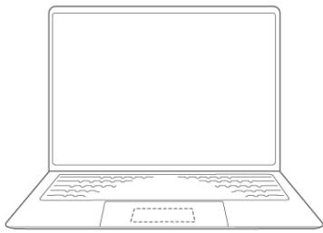 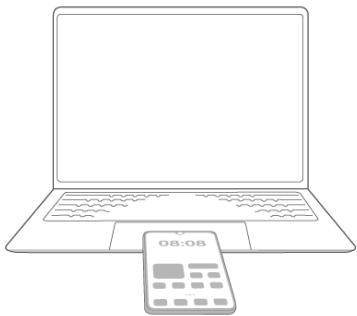配图仅供参考,请以产品实际为准。</td></tr><tr><td>8</td><td>USB-C接口连接电源适配器给电脑充电。通过扩展坞,连接显示器、投影仪等视频显示设备。连接手机、U盘等外接设备传输数据。连接手机、平板等设备反向充电,在电脑关机状态下,可对手机、平板反向快速充电,最高支持66W的规格。</td></tr><tr><td>9</td><td>充电指示灯充电时,显示电池充电状态:白色闪烁表示正在充电。白色常亮表示电池充满电,停止充电。</td></tr><tr><td>10</td><td>USB-A (USB 3.2 Gen 1) 接口连接手机、U 盘等外接设备传输数据。</td></tr><tr><td>11</td><td>HDMI 接口高清晰度多媒体接口,连接显示设备。</td></tr><tr><td>12</td><td>3.5 mm 耳机接口连接耳机。</td></tr><tr><td>13</td><td>超级隐私开关·将右侧的超级隐私开关向屏幕方向拨动,关闭超级隐私模式,恢复摄像头、麦克风、位置信息的功能。·将右侧的超级隐私开关向触控板方向拨动,开启超级隐私模式,禁用摄像头、麦克风、位置信息的功能。此时,隐私开关右侧显示红色。</td></tr><tr><td>14</td><td>USB-A (USB 3.2 Gen 1) 接口连接手机、U 盘等外接设备传输数据。</td></tr><tr><td>15</td><td>RJ45 接口连接网线。</td></tr><tr><td>16</td><td>扬声器 x 2声音从扬声器中发出。</td></tr></table>

# 数据克隆

# 将 Windows 电脑数据迁移至鸿蒙电脑

使用数据克隆，将旧电脑上的基础数据（如文档、图片、应用等）迁移至新电脑，简单快速、换机无忧。

• 部分数据和应用不支持迁移，请以实际情况为准。

• 迁移期间，建议将新、旧电脑接入电源，避免数据传输期间电量不足关机导致迁移中断。  
• 迁移期间，建议暂停在新、旧电脑上的操作（如新增、修改、删除文件），避免发生迁移错误。

# 从 Windows 电脑迁移数据

# 0 操作前，请确认新、旧电脑满足以下要求：

• Windows 系统电脑（旧电脑）需支持无线网卡功能（博通网卡、Wireless-AC 3165 网卡除外）。  
• Windows 系统电脑（旧电脑）仅 Windows 10（64 位）/ Windows 11（64 位） 系统支持 PC 克隆。以 Windows 11 系统电脑为例，您可单击底部任务栏 ，在搜索框中输入“设备规格”然后点按 Enter 搜索，即可查看设备规格和系统版本信息。

• Windows 系统电脑（旧电脑）的 PC 克隆应用版本需在 14.0.5.900 及以上。

• 建议新、旧电脑保持 1 米内的传输距离，且新、旧电脑需预留 5GB 以上的存储空间，避免数据迁移失败。

• 建议在网络稳定环境下进行克隆，以保证全程高速传输。

请确认新、旧电脑上已安装克隆应用。

• 新电脑（ HarmonyOS 系统）：出厂默认预置数据克隆；若已卸载，可进入设置 > 应用和元服务，单击右上角 > 恢复应用，单击数据克隆右侧的恢复即可。

• 旧电脑（ Windows 系统）：通过浏览器打开 PC 克隆服务官网（https://consumer.huawei.com/cn/support/pc-clone/），按照界面提示下载安装 PC 克隆。

1 在新电脑上，单击桌面底部快捷栏中的 进入应用中心，单击打开数据克隆。选择这是新电脑，勾选已完成上述操作并单击下一步。

/0946d2b730d0e72deb57e148b8b700de41171f78afa5f231893a884188c2f1a0.jpg)

配图仅供参考，请以产品实际为准。

2 在新电脑的数据克隆配对连接界面，选择旧电脑类型为 Windows 电脑，然后单击继续创建热点，根据您的设备型号选择旧 Windows 电脑类型（华为 Windows 电脑或其他 Windows 电脑），此时电脑上将出现配对码。

/d22fc6e0070b2749dcac6ec1dee2c1d83e7976dc8ed43ebe720217ee01da3215.jpg)

配图仅供参考，请以产品实际为准。

3 在旧电脑上，打开 PC 克隆，单击这是旧电脑 > 下一步 > 确定，搜索新电脑。搜索完成后，选择待连接的新电脑名称并单击下一步，输入新电脑上显示的配对码并单击下一步，完成新、旧电脑的配对连接。

/535c3d2ad7e7741e16a8adfa7dd5920f8202e813fea004256e12b8d28b6168bc.jpg)

配图仅供参考，请以产品实际为准。

4 在旧电脑上，选择需要迁移的数据（如文档、图片、应用等），单击开始迁移，等待迁移完成。

/070999900ee5d933e8b79a41cfaa55b24099da5ac4155764c1f34566a71f3b89.jpg)

配图仅供参考，请以产品实际为准。

# 查看迁移数据

通过以下任一方式，查看从 Windows 电脑迁移的数据：

• 在新电脑数据克隆的迁移完成界面，可单击查看详情 > 打开文件位置 > 继续前往文件管理查看迁移数据。

/10b0514b4b686e333f2c7266f244941312e168081235444591b134bb0226fc61.jpg)

配图仅供参考，请以产品实际为准。

• 在新电脑上单击桌面底部快捷栏中的 打开文件管理，单击左侧边栏存储位置中的 ，然后在右侧界面双击个人 > 来自Windows的迁移数据查看。

/04b89362340624094872a94503e130f8a6d084d1c2c19117543e15bdf2831e8f.jpg)

配图仅供参考，请以产品实际为准。

# 查看迁移历史

在新电脑数据克隆界面，单击 > 迁移历史，可查看历史迁移记录。单击任一记录，可查看迁移所耗时间、迁移数据大小、迁移状态。

# 将鸿蒙电脑数据迁移至鸿蒙电脑

使用数据克隆，将旧电脑上的基础数据（如文档、图片、应用等）迁移至新电脑，简单快速、换机无忧。

/c1d7c85469f05d9df2019a0d4b699553030da280eab0af1e950aaa707e3d485d.jpg)

• 此功能要求新、旧电脑系统版本为 HarmonyOS 5.1 及以上。单击桌面底部快捷栏中的  
打开设置，在左侧边栏单击设备名称，在关于本机界面，单击检查更新，按照界面提示升级系统版本。  
• 部分数据和应用不支持迁移，请以实际情况为准。  
• 迁移期间，建议将新、旧电脑接入电源，避免数据传输期间电量不足关机导致迁移中断。  
• 迁移期间，建议暂停在新、旧电脑上的操作（如新增、修改、删除文件），避免发生迁移错误。

# 从鸿蒙电脑迁移数据

0 操作前，请确认新、旧电脑满足以下要求：

• 建议新、旧电脑保持 1 米内的传输距离，且新、旧电脑预留 5GB 以上的存储空间，避免数据迁移失败。  
• 建议在网络稳定环境下进行克隆，以保证全程高速传输。

1 在新、旧电脑上开启 WLAN 、蓝牙开关，并确认已安装克隆应用。

鸿蒙电脑出厂默认预置数据克隆；若已卸载，可进入设置 > 应用和元服务，单击右上角 >恢复应用，单击数据克隆右侧的恢复即可。

2 在新电脑上，单击桌面底部快捷栏中的 进入应用中心，单击打开数据克隆。选择这是新电脑，勾选已完成上述操作并单击下一步。在配对连接界面，选择旧电脑类型为鸿蒙电脑，此时电脑上将出现配对码。

/25ed6e432dca8ae0b7389fc1658b9065f1dc8b52e05728f6a11232a0613bf872.jpg)

配图仅供参考，请以产品实际为准。

3 在旧电脑上打开数据克隆，选择这是旧电脑，选择待连接的新电脑名称并单击下一步，输入新电脑上显示的配对码，完成新、旧电脑的配对连接。  
4 在新电脑上输入旧电脑的锁屏密码并单击下一步，选择需要迁移的数据（如图片、用户数据、应用等），单击开始迁移，等待迁移完成即可。

/0837d118af1617ad3a94df6fff077ff19f7f00db03c9f4ec4ef728db2b80d8a7.jpg)

配图仅供参考，请以产品实际为准。

0 若新、旧电脑登录了同一华为账号，在新电脑的配对连接界面选择旧电脑名称后，旧电脑上将出现确认连接弹框，单击连接。然后在新电脑上输入旧电脑锁屏密码并单击下一步。选择需要迁移的数据，单击开始迁移即可。

# 查看迁移数据

在新电脑的数据克隆迁移完成界面，可单击查看详情 > 打开文件位置 > 跳转前往文件管理查看迁移数据。

迁移后，数据在新电脑的存放路径与旧电脑的相同。如旧电脑的个人 > 图片文件夹数据将迁移至新电脑的个人 > 图片文件夹下。

/7075d7c8dadfa08c943dad5a790fbcb21280c40ac48ff0d8d6eb9cfc81c0c34b.jpg)

0 配图仅供参考，请以产品实际为准。

# 查看迁移历史

在数据克隆界面，单击 > 迁移历史，可查看历史迁移记录。单击任一记录，可查看迁移时间、迁移数据大小、迁移状态。

# 常用手势

# 触控板手势

电脑的触控板有类似鼠标的功能，可实现单击、双击、放大、缩小等功能，让您方便地操作电脑。

基础手势

<table><tr><td>手势图</td><td>描述</td></tr><tr><td>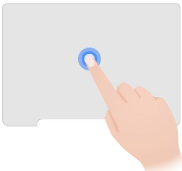</td><td>单击单指轻点或点按下去,或者单指按压左下角,相当于单击鼠标左键,可选择一个操作对象。例如:单击选择图片、文档、设置项。单击应用图标,打开应用。双击单指轻点两下,相当于双击鼠标左键,可进行某些快捷操作。例如:打开文件管理,双击应用窗口顶部标题栏,将应用窗口最大化或还原至之前的显示大小。在文件管理中,双击打开一篇文档。</td></tr><tr><td>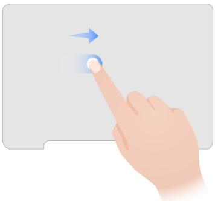</td><td>移动光标单指在触控板上滑动,可移动光标至操作对象。</td></tr><tr><td></td><td>呼出菜单单指点按右下角或者双指点按或轻点,相当于单击鼠标右键,可打开应用或系统的快捷菜单。</td></tr><tr><td>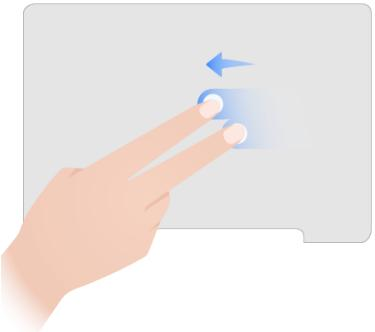</td><td>滑动双指快速移动(轻扫)或缓慢移动,可上下或左右切换或滚动页面。例如:在图库中打开图片后,双指左右轻扫,可快速切换查看的图片。在浏览器中打开网页后,双指上下滑动,可滚动浏览网页内容。</td></tr><tr><td>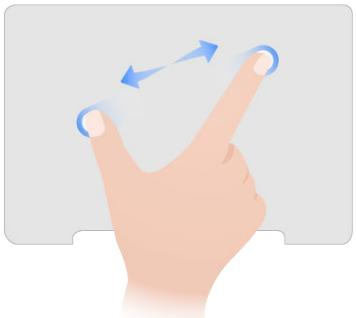</td><td>缩放双指张开或捏合,可放大或缩小图片或页面等。例如:在图库中打开图片后,大拇指与食指在触控板上张开,可放大图片以查看细节。</td></tr><tr><td>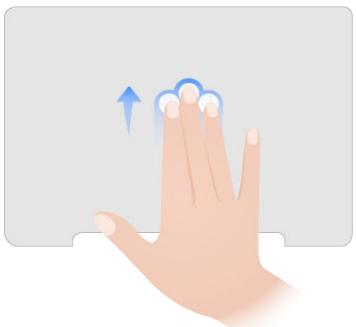</td><td>返回桌面应用窗口打开时,三指上滑可显示桌面,三指下滑可还原打开的应用窗口。</td></tr><tr><td>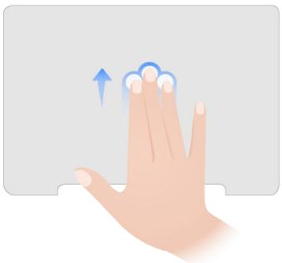</td><td>进入多任务三指上滑并停顿进入任务中心,可查看运行的全部应用,三指下滑退出任务中心。</td></tr><tr><td>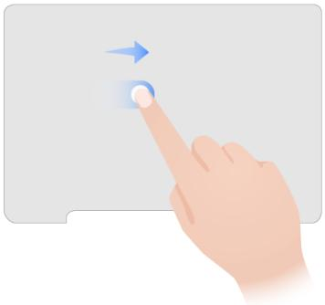</td><td>拖拽单指长按拖拽,或单指快速轻点两下不抬起进行拖拽,可移动窗口的位置,或将图片、文档等复制至其他位置。例如:打开一个窗口,光标移至标题栏空白处,长按拖拽,移动窗口的位置。打开图库,选择图片后,长按拖拽,将图片复制至其他位置。</td></tr><tr><td>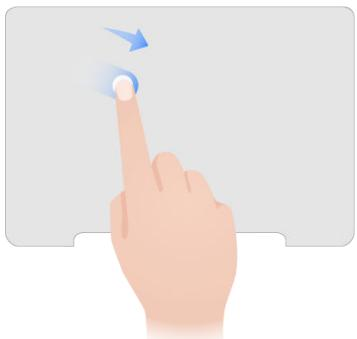</td><td rowspan="3">框选通过触控板控制光标,在桌面上绘制矩形,可以框选文件或区域。框选的手势:单指按压并移动。一只手指按压,另一只手指移动。单指快速轻点两下不抬起,然后移动。例如:打开文件管理,移动光标至空白处,单指按压触控板并移动,绘制矩形框覆盖需要的文件,然后松开手指。截取局部屏幕时,单指在触控板快速轻点两下不抬起,然后移动,绘制矩形选择截屏区域,然后松开手指。</td></tr><tr><td>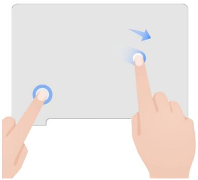</td></tr><tr><td>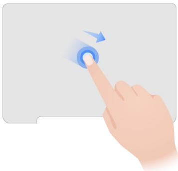</td></tr></table>

# 触屏手势

手指可以直接在屏幕上操作电脑，比如单指轻点打开应用，双指张开放大图片，更简单更容易。

基础手势

<table><tr><td>手势图</td><td>描述</td></tr><tr><td>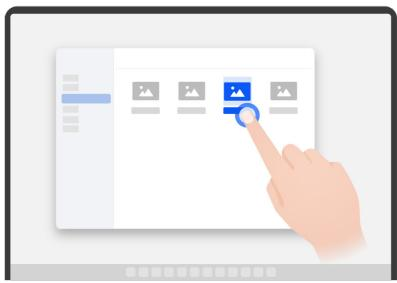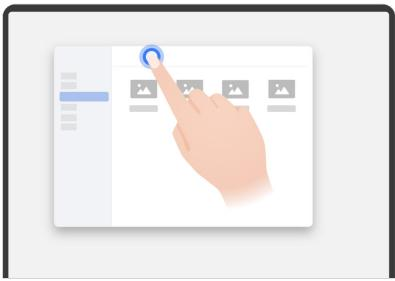</td><td>单击单指轻点,相当于单击鼠标左键,可选择或打开一个操作对象。例如:单击选择设置项。单击应用图标,打开应用。在文件管理中,单击可打开图片、视频、文档等。双击单指轻点两下,相当于双击鼠标左键,进行某些快捷操作。例如:打开文件管理,双击应用窗口顶部标题栏,可将应用窗口最大化或还原至之前的显示大小。</td></tr><tr><td></td><td>滑动单指快速移动(轻扫)或缓慢移动,可上下或左右切换或滚动页面。例如:在图库中打开图片后,单指左右轻扫,可快速切换查看的图片。在浏览器中打开网页后,单指上下滑动,可滚动浏览网页内容。</td></tr><tr><td></td><td>长按单指长按,相当于单击鼠标右键,可打开应用或系统的快捷菜单。例如:在文件管理中,在文件上单指长按,可打开文件操作的快捷菜单。</td></tr><tr><td>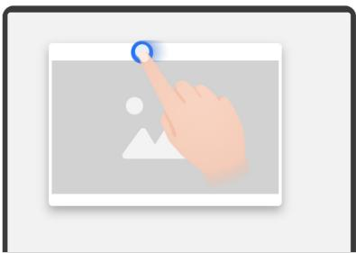</td><td>拖拽·直接拖拽:拖拽窗口时,单指拖拽窗口标题栏。·长按拖拽:拖拽图片、文档等对象时,单指长按对象并拖拽。例如:在图库中,单指长按一张图片后,拖拽至备忘录的备忘编辑页面。</td></tr><tr><td></td><td>缩放双指捏合或张开,缩小或放大页面。例如:在图库中打开图片后,双指在图片上张开,可放大图片后查看细节。</td></tr></table>

导航手势 

<table><tr><td>手势图</td><td>描述</td></tr><tr><td></td><td>返回上一级从屏幕左边缘或右边缘向内滑动。</td></tr><tr><td>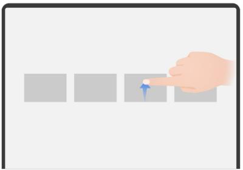</td><td>结束单个任务在任务中心界面,上滑单个任务卡片。</td></tr></table>

# 隔空手势

您可通过隔空手势操作电脑，例如截屏、滑动屏幕等。

• 部分场景或应用不支持隔空手势，请以实际操作为准。

使用隔空手势之前，请按照如下方式开启功能：

1 单击桌面底部快捷栏中的 打开设置，单击左侧边栏的系统。  
2 在右侧界面，单击快捷启动和手势，确保隔空滑动屏幕、隔空截屏已开启。

<table><tr><td>手势图</td><td>描述</td></tr><tr><td>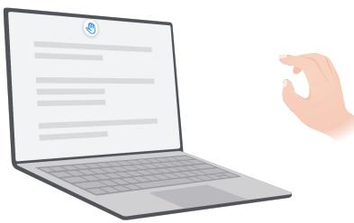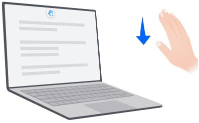</td><td>隔空截屏将手掌朝向屏幕摄像头,指尖向上,放在离屏幕约40-70cm的位置稍作停顿。待屏幕上方出现 🏠后,抓取握拳截屏。截图自动保存在图库中。当您在浏览需要上下滑动屏幕的内容时,您可以:隔空向下滑动若要阅读页面前面的内容,将手掌朝向屏幕摄像头,指尖向上,放在离屏幕约40-70cm的位置稍作停顿。待屏幕上方出现[IMAGE]后,向下连续挥动手腕,隔空滑动屏幕至所需页面。</td></tr><tr><td>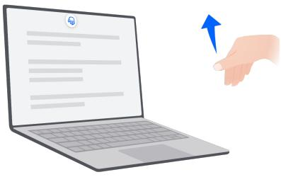</td><td>隔空向上滑动若要阅读页面后面的内容,将手背朝向屏幕摄像头,指尖向下,放在离屏幕约40-70cm的位置稍作停顿,待屏幕上方出现[IMAGE]后,向上连续挥动手腕,隔空滑动屏幕至所需页面。</td></tr></table>

# 常用快捷键

# 常用快捷键和热键

使用键盘上某一个键或某几个键的组合，轻松操作电脑，快捷高效。

• 本文描述的快捷键和热键不支持自定义设置。

• 部分快捷键组合（如鸿蒙键 + R）在鸿蒙电脑上不支持使用，请以实际操作为准。

# 常用快捷键

桌面窗口快捷键 

<table><tr><td>快捷键</td><td>描述</td></tr><tr><td>鸿蒙键 ○ + 上方向键</td><td>最大化窗口将当前活跃(桌面最上层)的应用窗口最大化。</td></tr><tr><td>鸿蒙键 ○ + M,或鸿蒙键 ○ + 下方向键</td><td>最小化窗口• 点按鸿蒙键 ○ + M,将当前活跃(桌面最上层)的应用窗口直接最小化。• 点按鸿蒙键 ○ + 下方向键:• 若当前活跃(桌面最上层)的应用窗口未处于全屏模式,点按此组合键,可直接将应用窗口最小化。• 若当前活跃(桌面最上层)的应用窗口处于全屏模式,应用窗口先退出全屏模式,再次点按此组合键,可将应用窗口最小化。</td></tr><tr><td>鸿蒙键 + Tab</td><td>进入/退出任务中心运行应用较多时,在任务中心,可查看运行的全部应用。</td></tr><tr><td>鸿蒙键 + D</td><td>显示桌面/还原打开的应用窗口桌面上运行应用窗口较多时,快捷返回桌面。</td></tr><tr><td>鸿蒙键 + L</td><td>锁定屏幕短暂离开电脑,快捷锁屏,保护信息安全。</td></tr><tr><td>Alt + Tab</td><td>快切应用点按 Alt + Tab 组合键,可在当前显示的应用及其相邻的应用之间切换。若要循环浏览多个应用,请按住 Alt 键不松手,然后点按 Tab 键选择应用。</td></tr><tr><td>Alt + F4</td><td>关闭窗口将当前活跃(桌面最上层)的应用窗口关闭。</td></tr><tr><td>Alt + Shift + F4</td><td>退出应用将当前同一应用的多个窗口关闭,并从后台退出应用。</td></tr></table>

系统功能快捷键

<table><tr><td>快捷键</td><td>描述</td></tr><tr><td>鸿蒙键</td><td>打开/关闭开始菜单在开始菜单中,可以查看最近操作的文件与应用、进入设置、进行关机或重启等。</td></tr><tr><td>鸿蒙键 +?</td><td>打开/关闭快捷键提示面板在快捷键提示面板中,可了解更多快捷键。</td></tr><tr><td>鸿蒙键 +A</td><td>进入/退出应用中心在应用中心中,可查看电脑中安装的全部应用。</td></tr><tr><td>鸿蒙键 +N</td><td>打开/关闭通知中心在通知中心中,可查看会议日程、待办等提醒信息,还可查看日期、设置日期和时间。</td></tr><tr><td>鸿蒙键 +C</td><td>进入/退出控制中心控制中心将常用的音频播控中心、快捷开关等功能集合在一起,方便您快速操作,如开启或关闭WLAN、华为分享等。</td></tr><tr><td>鸿蒙键 +S</td><td>打开/关闭小艺搜索在搜索框中输入关键字,搜索电脑中的文件、应用、系统设置项及在线网页等相关内容。</td></tr><tr><td>鸿蒙键 </td><td>打开文件管理在文件管理中,可以查看电脑中所有内容,包括文档、图片、视频及云端文件等。</td></tr><tr><td>鸿蒙键 + Shift + S</td><td>区域截屏进入区域截屏模式,通过触控板、鼠标等在电脑桌面中画矩形。截屏自动保存在图库中。</td></tr><tr><td>鸿蒙键 </td><td>录制屏幕录制电脑屏幕画面,以便记录重要内容。录屏自动保存在图库中。</td></tr><tr><td>鸿蒙键 </td><td>返回返回上一步操作。比如,在图库中打开一张图片进行浏览时,点按鸿蒙键 + 键,可返回至图库。</td></tr><tr><td>鸿蒙键 Shift</td><td>切换输入法安装多种输入法后,通过快捷键可以在不同的输入法之间切换。</td></tr><tr><td>Ctrl + Shift + Esc</td><td>打开任务管理器查看正在运行的应用占用的CPU、内存、磁盘读取等资源情况,或根据需要强制关闭占内存高的应用进程。</td></tr><tr><td>Ctrl + Alt + Del</td><td>打开安全窗口在安全窗口中,可以进行锁定屏幕、打开任务管理器、切换用户等。</td></tr><tr><td>智慧键 [KCTS]</td><td>打开/关闭小艺·短按:打开/关闭小艺侧边窗。·长按:未打开小艺侧边窗时,长按可打开小艺侧边窗并进入语音模式,直接与小艺语音交互。打开小艺侧边窗时,长按可进入/退出语音模式。</td></tr><tr><td>语音键 </td><td>打开/关闭语音转写使用小艺输入法时,单击文本输入区域,光标闪烁后,点按语音键打开语音转写弹窗,对着电脑说话,语音自动转成文字。比如,打开文档进行编辑,或者单击桌面左下角 → 打开小艺搜索后,点按语音键 ,对着电脑说话即可识别为文字。</td></tr><tr><td>Fn</td><td>F1~F12 键功能开关位于 Esc 键和 Del 键之间、带有特殊图标或字符(如 、□、Ins)的按键,默认为热键。若要作为功能键,点按 Fn 键,Fn 键指示灯常亮后,即可将热键切换为 F1~F12 功能键。</td></tr></table>

# 焦点导航快捷键

焦点是指当前界面中被选中的可交互元素（如按钮、输入框、链接），可以接收键盘输入。

焦点导航是指在当前界面中，通过键盘控制焦点移动来操作可交互元素。

当可交互元素被选中时，元素上显示会蓝色边框（如图库）、虚线框或高亮背景等，即进入焦点状态。不同界面中焦点状态样式不同，请以实际界面为准。

<table><tr><td>快捷键</td><td>描述</td></tr><tr><td>Tab</td><td>·激活界面内的焦点导航。·移动至界面内下一个焦点。</td></tr><tr><td>Shift + Tab</td><td>移动至界面内上一个焦点。</td></tr><tr><td>Enter/空格键</td><td>激活界面内当前选中的焦点元素对应的操作。例如,在文件管理中,移动焦点至后退或前进按钮时,点按 Enter/空格键,可执行后退或前进的操作。</td></tr><tr><td>Enter</td><td>进入界面内当前选中的焦点元素对应的页面。例如,在网页中,移动焦点至带有链接的文本时,点按 Enter 键,可打开此链接页面。</td></tr><tr><td>Esc</td><td>取消页面内当前选中元素的操作。例如,在图库中,移动焦点至 · · 时,点按 Enter/空格键,打开快捷菜单后,点按 Esc 键可关闭此快捷菜单。</td></tr><tr><td>Shift + F10</td><td>打开上下文菜单。例如,在网页中,移动焦点至带有链接的文本时,点按 Shift + F10 组合键,可以打开其快捷菜单。</td></tr><tr><td>上、下、左、右方向键</td><td>按方向键移动焦点。</td></tr></table>

# 键盘热键模式

电脑键盘中 F1\~F12 键，部分按键左上角带有特殊图标或字符（如 、 、Ins），在 Fn 键指示灯熄灭时，作为热键，可快捷执行一些操作，如降低屏幕亮度等。

0 点按 Fn 键，Fn 键指示灯常亮后，可将热键切换为 F1\~F12 功能键，例如在网页中点按 F5键进行刷新。

<table><tr><td>快捷键</td><td>描述</td></tr><tr><td></td><td>降低屏幕亮度。</td></tr><tr><td></td><td>增加屏幕亮度。</td></tr><tr><td></td><td>开启/调节/关闭键盘背光。若按键上无图标,则表示键盘不支持背光。</td></tr><tr><td>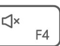</td><td>开启/关闭静音。</td></tr><tr><td></td><td>调低音量。</td></tr><tr><td></td><td>调高音量。</td></tr><tr><td></td><td>开启/关闭麦克风。指示灯亮起,关闭麦克风。指示灯熄灭,开启麦克风。</td></tr><tr><td></td><td>开启无线投屏。</td></tr><tr><td></td><td>开启小艺搜索。</td></tr><tr><td>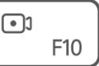</td><td>开启/停止录屏。停止录屏后,录屏自动保存在图库中。</td></tr><tr><td></td><td>全屏截图并自动保存在图库中。</td></tr><tr><td></td><td>文本输入时,切换为插入或覆盖模式。(部分应用不支持切换覆盖模式,比如备忘录。)</td></tr></table>

# 锁屏与解锁

锁屏与解锁

锁定屏幕

自动锁屏：

一段时间内不操作，电脑将自动锁屏。

您可进入 > 电源和电池，选择接通电源，设备闲置时熄屏和电池供电，设备闲置时熄屏的时长。

# 手动锁屏：

您可通过以下任一方式手动锁屏：

• 点按（键盘上）鸿蒙键 + L 组合键。

• 点按 Ctrl+ Alt + Del 组合键，然后单击锁定屏幕。

• 单击桌面左下角 打开启动菜单，然后单击 > 锁定屏幕。

# 设置注视屏幕时不熄屏

阅读时，若长时间不操作电脑，屏幕可能会自动熄屏。开启注视屏幕不熄屏功能，当电脑检测到您在注视屏幕时，会持续亮屏。

1 单击桌面底部快捷栏中的 打开设置，单击左侧边栏的显示和亮度。

2 在右侧界面，单击开启注视屏幕不熄屏的开关。

# 点亮屏幕

电脑盖子抬起后，会自动亮屏。若未亮屏，可点按电源键（或 Enter 键、空格键）至屏幕亮起。

# 解锁屏幕

• 密码解锁：点亮屏幕后，输入锁屏密码（若您登录多个用户，需先单击用户头像，切换用户），然后单击 或点按 Enter 键解锁。

• 指纹解锁：使用已录入指纹的手指轻触指纹感应区（电源键），即可快速解锁。

# 应用操作

# 安装和卸载应用

# 安装、更新应用

应用市场集成了常用的应用，提供安装、更新应用等服务。

单击桌面底部快捷栏中的 进入应用中心，单击打开应用市场，您可以：

• 安装应用：在顶部搜索框输入应用名称，搜索、安装所需的应用；或者单击左侧工作、娱乐等页签，找到需要安装的应用，单击安装。• 更新应用：单击我的，在右侧待更新列表中单击全部更新，可批量更新全部应用，如需更新单个应用，单击应用右侧的更新即可。

应用市场上架的应用持续更新中，请以实际情况为准。

# 卸载或恢复应用

电脑出厂预置的部分应用（如文件管理、设置）不支持卸载，请以实际情况为准。

# 从应用中心卸载应用

1 单击桌面底部快捷栏中的 进入应用中心。  
2 右键单击待卸载的应用，选择卸载，根据界面提示确认卸载。

若应用快捷菜单中无卸载选项，则该应用不支持卸载，请以实际情况为准。

# 从设置卸载应用

1 单击桌面底部快捷栏中的 打开设置，单击左侧边栏的应用和元服务。  
2 在应用页签中，单击待卸载的应用进入详情页。  
3 单击卸载，根据界面提示确认卸载。

若界面无卸载菜单，则该应用不支持卸载，请以实际情况为准。

# 恢复卸载的应用

如果误卸载了应用，您可以按如下方式恢复：

1 单击桌面底部快捷栏中的 打开设置，单击左侧边栏的应用和元服务。  
2 在右侧界面，单击右上角 ，选择恢复应用。  
3 单击应用右侧恢复，即可恢复此应用。

# 使用应用中心

电脑中预置了各种常用的应用，便于您高效工作、轻松娱乐等。您可在应用中心查看所有已安装的应用，也可以对应用执行搜索、打开、卸载等更多操作。

1 单击桌面底部快捷栏中的 或点按（键盘上）鸿蒙键 + A 组合键，进入应用中心。  
2 根据需要，对应用执行相关操作：

打开应用：单击应用图标。  
• 搜索应用：应用较多时，可在上方搜索框中输入关键词（如应用名称），快速搜索并单击应用图标打开应用。  
• 调整应用位置：光标移至应用图标区域，单指长按触控板（或鼠标左键）并移动，将其拖拽至想要的位置，出现矩形框时松开手指。  
卸载应用：光标移至应用图标区域，右键单击，选择卸载，卸载不使用的应用。  
• 对应用执行更多操作：例如，光标移至应用图标区域，右键单击，选择添加至快捷栏，可将应用添加至快捷栏，方便快捷操作应用。

# 打开和切换应用

您可在电脑上同时打开多个应用，并在多个应用窗口切换。

# 打开应用

您可单击桌面底部快捷栏中的应用图标，快速打开应用。

若应用未固定在桌面底部快捷栏，您也可以通过以下任一方式找到并打开应用：

• 单击桌面底部快捷栏中的 或点按（键盘上）鸿蒙键 + A 组合键，进入应用中心，单击应用图标。  
• 单击桌面右下角 打开小艺，通过语音或文字输入给小艺下发指令，例如：“打开日历应用”。  
• 单击桌面左下角 ，在搜索框中输入应用名称，在搜索结果中单击应用。  
• 如果想要打开最近使用过的应用，可以单击桌面左下角 打开开始菜单，在最近应用中单击应用图标。

# 切换应用

同时打开的应用较多时，您可通过快捷键或任务中心在多个应用之间快速切换。

# 快捷键切换应用

点按 Alt + Tab 组合键，可在当前显示的应用及其相邻的应用之间切换。若要循环浏览多个应用，请按住 Alt 键不松手，然后点按 Tab 键选择应用。

# 在任务中心切换应用

您可在任务中心查看全部打开应用，并单击想要在桌面最上层显示的应用。

1 通过以下任一方式，进入任务中心：

单击桌面底部快捷栏中的 。  
点按（键盘上）鸿蒙键 + Tab 组合键。  
在触控板上，三指上滑停顿一下后抬起。

2 单击需要切换的应用，该应用即可显示在桌面最上层。

# 应用全屏

应用全屏模式，可以充分利用电脑桌面，同时避免其他应用的干扰。

# 进入应用全屏

• 部分应用不支持应用全屏，请以实际情况为准。  
• 各应用支持的方式存在差异，请以实际情况为准。

打开应用后，通过以下任一方式进入应用全屏：

• 单击应用窗口右上角   
• 双击应用窗口顶部标题栏空白处。

• 窗口处于活动状态下，点按鸿蒙键 + 上方向键。  
• 光标移至应用窗口顶部标题栏空白处，单指按压触控板（或鼠标左键）并移动光标，将应用窗口拖至桌面顶部，出现半透明图层后松开。

# 退出应用全屏

i 各应用支持的方式存在差异，请以实际情况为准。

进入应用全屏后，通过以下任一方式退出应用全屏：

• 单击应用窗口右上角 $^ { \mathsf { { \Delta } } } _ { \mathsf { r } }$ 。  
• 双击应用窗口顶部标题栏空白处。  
• 光标移至应用窗口顶部标题栏空白处，单指按压触控板（或鼠标左键）并移动光标，或单指放到应用窗口顶部标题栏空白处进行拖动，将应用窗口拖离桌面顶部。

# 应用分屏，协同操作更高效

开启分屏，电脑桌面上同时显示两个应用窗口，直接在应用间拖拽图片、文字，让多任务处理快人一步。例如，您可以从文件管理中拖拽图片到备忘录。

# 开启分屏

• 部分应用不支持分屏显示，请以实际情况为准。

• 目前仅支持左右二分屏。

1 打开需要分屏的两个应用窗口，通过以下任一方式开启分屏：

• 长按其中一个应用窗口右上角 $\Gamma _ { \perp } \mid _ { \perp \mid } \mid _ { r }$ ，在弹框中选择窗口显示的位置（如窗口显示在屏幕右侧）后，此应用自动占据一半的桌面。  
• 光标移至其中一个应用窗口顶部标题栏空白处，单指按压触控板（或鼠标左键）并移动，将窗口向桌面左/右侧拖拽，直至窗口下方显示半透明图层后松开，此应用自动占据一半的桌面。

2 在另一半的桌面中单击另一个应用窗口，即可同屏显示这两个应用窗口。

/26ce74f04a81d880962a4e9775dbd518c9bed845d1fbd28cd7ef755b179660a9.jpg)

配图仅供参考，请以产品实际为准。

# 分屏常用操作

/9de6196a6fff16c2c859902a9a1f18c340d081599468c720e75f1a8de7704fad.jpg)

0 配图仅供参考，请以产品实际为准。

在分屏状态下，可进行分屏互换等操作。

• 分屏互换：长按左侧应用窗口右上角 ，在弹框中单击窗口显示在屏幕右侧。或者拖拽左侧应用窗口标题栏空白处至桌面右侧后松开。

• 调节分屏比例：部分应用支持向左/右拖动分屏分割线中的 调整分屏比例。不同应用的最小宽度存在差异，若拖拽后出现回弹现象，表示该应用分屏不支持调整分屏比例，或已达到分屏比例可调节的最大幅度，请以实际情况为准。  
• 退出分屏：在其中一个分屏应用右上角单击 、 或 ，即可退出分屏。您也可以向左/右拖动分屏分隔线中的 ，直至另外一个分屏窗口消失。

# 在分屏应用间拖拽文件

开启分屏后，可直接在分屏应用间拖拽图片、文本或文档。

i 部分应用中不支持拖拽内容，请以实际情况为准。

拖拽方法：在分屏的一个应用中，选中文本、图片或文档，单指按压触控板（或鼠标左键）并移动，将其拖拽至另一个应用，出现 时松开手指。

• 拖拽文本：例如，同屏显示备忘录、打开的网页时，可在网页中选中一段文本，将其拖拽至备忘录的备忘编辑页面。  
• 拖拽图片/文档：例如，同屏显示备忘录和文件管理时，可在文件管理中选中图片/文档，将其拖拽至备忘录的备忘编辑页面。

# 应用分身

使用应用分身，可对某个应用生成完全独立的分身，方便使用不同账号登录，轻松区分不同使用场景。

0 仅部分应用支持应用分身，请前往官网了解支持的应用。

# 创建分身

1 单击桌面底部快捷栏中的 打开设置，单击左侧边栏的系统。  
2 在右侧界面，单击应用分身，查看支持分身的应用。  
3 单击选择想要分身的应用，然后单击创建分身。创建后，将在应用中心生成分身应用图标（图标右下角有数字标识，如 ）。  
4 单击桌面底部快捷栏中的 进入应用中心，单击分身应用图标（如 ），登录不同账号。

# 删除分身

• 应用分身删除后，分身关联的数据也会清空，建议您操作前做好数据备份。

• 若原应用被卸载，其应用分身将会自动删除。

您可通过以下任一方式，删除应用分身：

• 进入设置 > 系统 > 应用分身界面，单击待删除分身的应用，然后单击删除。  
• 单击桌面底部快捷栏中的 进入应用中心，右键单击分身应用图标如 ，选择删除。

# 快速返回桌面

打开的应用较多时，通过以下任一方式可快速将所有应用最小化，以回到桌面：

• 点按（键盘上）鸿蒙 键 + D 组合键，即可回到桌面。再次点按此组合键，即可恢复显示应用窗口。  
• 在触控板上三指上滑后抬起手指，即可回到桌面。再次三指下滑后抬起手指，即可恢复显示应用窗口。  
• 单击桌面底部状态栏最右侧回到桌面区域，即可回到桌面。再次单击此区域，即可恢复显示应用窗口。

/2f049f2011d657101e67178dd602461a09606b449b7f50721e22e6b473330f21.jpg)

配图仅供参考，请以产品实际为准。

# 查看和管理应用和进程

# 查看电脑性能

1 您可通过以下任一方式打开任务管理器：

单击桌面底部快捷栏中的 进入应用中心，单击打开任务管理器。  
点按 $\mathsf { C t r l } + \mathsf { S h i f t } + \mathsf { E s c }$ 组合键，打开任务管理器。

2 在任务管理器界面，单击性能，查看电脑 CPU、内存、磁盘等性能情况。

# 查看应用和进程占用资源情况

在任务管理器界面，单击进程，查看正在运行的应用或进程占用的 CPU、内存等资源情况。

运行应用或进程较多时，可单击右上角 打开搜索框，在搜索框中输入应用或进程名称，快速搜索、查看单个应用或进程占用的资源情况。

# 强制关闭应用或进程

• 强制关闭应用或进程可能会导致数据丢失，请谨慎操作。  
• 建议不要强制关闭系统相关的进程，否则可能会造成系统无法正常运行、硬件损坏等问题。

在任务管理器的进程界面，通过如下任一方式强制关闭应用或进程：

• 单击待退出的应用或进程，单击右上角 ，根据界面提示确认强制关闭。  
• 右键单击待退出的应用或进程，选择强制关闭应用或强制关闭进程。

# 设置应用开机自启动

将常用应用（如聊天应用、邮件应用）设置为自启动应用，电脑开机后或切换用户登录后，自动打开应用，提升办公效率。

i 随着自启动应用数量的增加，电脑开机或切换用户的速度可能会变慢。

1 单击桌面底部快捷栏中的 打开设置，单击左侧边栏的应用和元服务。  
2 在右侧界面，单击应用启动管理，您可以：

添加自启动应用：单击添加应用，打开选择应用界面，在应用列表中选择要添加的应用，或者在搜索栏搜索想要添加的应用，然后单击完成。

在选择应用界面，若选择应用的过程中需要取消勾选应用，在应用右侧取消勾选，或者在左下角已选中取消勾选。

删除自启动应用：在应用列表中，单击想要删除的应用右侧的移除。电脑开机后或切换用户登录后，此应用将不会再自动打开。

# 通过系统设置查看应用版本

1 单击桌面底部快捷栏中的 打开设置，单击左侧边栏的应用和元服务。  
2 在右侧界面，找到待查看版本的应用，单击应用进入详情页，即可查看应用版本。

# 截屏和录屏

# 截屏

轻松截取完整或局部屏幕，并自动保存在电脑中。

# 截取完整屏幕

您可使用多种截屏方法，轻松定格屏幕精彩瞬间。

# 使用快捷开关截取完整屏幕

单击桌面右下角状态栏 ，再单击

# 使用快捷键截取完整屏幕

Fn 键指示灯熄灭时，点按 F11 键。

# 使用隔空手势截取完整屏幕

截屏前，请进入设置 > 系统 > 快捷启动和手势，开启隔空截屏开关。

将手掌朝向屏幕摄像头，指尖向上，放在离屏幕约 40–70cm 的位置稍作停顿。待屏幕上方出现

/a53e5ad5e6ee21949822d5bad9b03ae8e83d70c056c2835b5c9f4fc96890ab64.jpg)

后，抓取握拳。

/39f73f9a2053055c39944eb89da39695aa0a4f67f8baeac1b28eed8e6d2979a8.jpg)

0 配图仅供参考，请以产品实际为准。

# 截取局部屏幕

当您需要截取屏幕局部内容时，可以按如下方式轻松截屏。

1 单击桌面右下角状态栏 ，再单击 ，或点按（键盘上）鸿蒙键 + Shift + S 组合键，光标变成 ，表示进入局部截屏模式。

i 若想退出局部截屏模式，可在键盘上点按 Esc 键或者单指单击触控板（或鼠标左键）。

2 单指长按触控板（或鼠标左键）并移动光标，或单指在屏幕上拖动，绘制矩形以确定截取区域后松开手指。

# 查看、编辑、分享截图等

使用文件管理打开截图，查看、编辑、分享截图

1 通过以下任一方式，打开截图：

• 截屏完成后，桌面右下角会短暂显示截屏缩略图，单击打开截图。  
• 进入文件管理，单击图片 > 图库 > 截图，找到截图并打开。

2 打开截图后，您可以进行编辑、分享等操作：

<table><tr><td>功能</td><td>操作方式</td></tr><tr><td>缩放</td><td>单击/⊕,可缩小或放大截图。</td></tr><tr><td>编辑</td><td>单击☑,进入编辑页面,您可以:添加文本:单击插入T,单击左侧显示的≡,设置字号和颜色后,在截图上单击即可输入文字。您可以需要调整文本框大小和位置。裁剪:单击□,拖动截图边角,选择保留的部分。添加图形:单击●,再单击左侧显示形状图标(如□、○)可设置图形形状和粗细,单击左侧显示的颜色设置图标(如○)可设置图形颜色,设置好形状后,移动光标,绘制图形框。涂鸦:单击A,在底部显示的涂鸦编辑界面,可设置颜色、选择笔形等。撤销操作或重新操作:单击⊃或⊂,可撤销上一步编辑或恢复上一步编辑。重置:单击○,可清除当前编辑内容。保存:编辑完成后,在右上角单击√,可以选择覆盖原图或另存为。</td></tr><tr><td>旋转</td><td>单击□,可逆时针旋转截图。</td></tr><tr><td>删除</td><td>单击↔,可删除截图。</td></tr><tr><td>分享</td><td>单击↔,选择一种分享方式,分享截图至其他设备或应用:选择华为分享,单击已开启华为分享的设备,在设备端确认接收,即可将截图分享至其他设备。选择对应应用,如备忘录,即可将截图分享并保存至该应用。选择复制,光标移至需要粘贴截图的位置(如正在编辑的文档),点按Ctrl+V组合键(或右键单击,选择粘贴)进行粘贴。</td></tr><tr><td>更多</td><td>单击••,可打开文件所在位置、打印截图、查看文件详情、另存截图等。</td></tr></table>

在图库中打开截图，查看、编辑、分享截图

1 进入图库，在左侧边栏单击来自应用下的截图。

# 2 双击打开截图后，可进行编辑、分享等操作。

# 录制屏幕

您可录制电脑屏幕操作过程，分享给同事好友；也可以录制网络课程、在线会议等内容，方便后期回放。

# 开启录屏

# 1 通过如下任一方式开始录制：

• Fn 键指示灯熄灭时，点按 F10 键。  
点按（键盘上）鸿蒙键 + Shift + R 组合键。  
单击桌面右下角状态栏 ，再单击 。

2 开始录制后，桌面左上角显示录制浮窗（如 麦克风 ■00:05 ），可根据需要拖拽录制浮窗调整其位置。在录制浮窗中，单击麦克风图标，可选择开启或关闭麦克风：

表示麦克风开启，您可以边录屏边解说。  
表示麦克风关闭，此时仅可以收录系统内声音（如：正在播放的音乐、视频等声音）。

# 停止录屏

录制完成后，在录制浮窗（如 麦克风 ■00:05 ）中单击 ，或者在 Fn 键指示灯熄灭时点按F10 键，结束录制。

# 查看、编辑、分享录屏等

使用文件管理打开录屏，查看、编辑、分享录屏

# 1 通过以下任一方式，打开录屏：

• 录制结束后，桌面右下角会短暂显示录屏缩略图，单击打开录屏。  
• 进入文件管理，单击图片 > 图库 > 屏幕录制，找到录屏并打开。

# 2 打开录屏后，可进行编辑、分享等操作：

<table><tr><td>功能</td><td>操作方式</td></tr><tr><td>编辑</td><td>单击,进入编辑页面,您可以:将录屏调为静音:单击,可关闭录屏原声。截取录屏:拖动底部视频预览条两端,选中需要保留的部分,可单击左侧,预览截取效果。保存录屏:编辑完成后,单击右上角,可以选择覆盖原视频或另存为新视频。</td></tr><tr><td>删除</td><td>单击 ,可删除录屏。</td></tr><tr><td>分享</td><td>单击 ,选择一种分享方式,分享录屏至其他设备或应用:· 选择华为分享,单击已开启华为分享的设备,在设备端确认接收,即可将录屏分享至其他设备。· 选择对应应用,如备忘录,即可将录屏分享并保存至该应用。· 选择复制,光标移至需要粘贴录屏的位置(如文件夹),点按 Ctrl + V 组合键(或右键单击,选择粘贴)进行粘贴。</td></tr><tr><td>更多</td><td>单击 ,可打开文件所在位置、查看文件详情等。</td></tr></table>

在图库中打开录屏，查看、编辑、分享录屏

1 进入图库，在左侧边栏单击来自应用下的屏幕录制。  
2 双击打开录屏后，可进行编辑、分享等操作。

# 播控中心

# 使用播控中心

使用播控中心，您可快速控制音视频应用（如播放暂停、调节播放进度、切换歌曲等），或将本机的音频投放到耳机、音箱等设备。

/64768bb0a20fc83afffb0d67f1a32cfef6c9a9703e35946f1ff1e31ae6dc12b5.jpg)

配图仅供参考，请以产品实际为准。

# 控制本机音视频应用

1 当开启了音视频类应用时（如音乐），单击桌面右下角状态栏中间区域（包含电池图标 ）或点按（键盘上）鸿蒙键 + C 组合键，打开控制中心。  
2 在播控中心区域，您可以单击 、 实现暂停、播放，也可以单击 、 切换上一个、下一个音视频。  
3 单击播控中心区域空白处进入详情界面，您可以将光标移至播放进度条区域，向左或右拖动、调节播放进度；或单击 、 等设置播放模式、添加收藏等（不同音视频应用卡片显示的图标存在差异，请以实际情况为准）。

# 将音频投放到其他设备

当电脑连接了耳机、音箱等设备后，您可将电脑的音频快速投放到这些设备，并在播控中心进行控制和切换。

1 将电脑连接音频设备（如音箱、耳机等），具体操作请参考设备说明书。  
2 在控制中心界面，单击播控中心区域空白处进入详情页。  
3 在播控中心界面，单击待投放的音频应用卡片右上角的 （或 ），在下方设备列表中单击待投放的设备名称，完成音频投放。

# 开关机和重启

# 开关机和重启

# 将电脑开机

• 新机首次开机时，必须连接电源适配器并接通电源，连接后，电脑自动开机。  
• 再次开机时，短按电源键，屏幕显示画面，表示电脑已开机。

# 开盖开机

开启开盖开机功能后，无需点按电源键，开盖即开机，减少您的开机等待时间。此功能默认关闭，您可以按如下方法开启此功能：

1 单击桌面底部快捷栏中的 打开设置，单击左侧边栏的电源和电池。  
2 在右侧界面单击更多电源设置，打开启用开盖开机开关。  
3 电脑关机并合盖后，抬起电脑上盖，即可自动开机。

# 将电脑关机

# 正常关机

• 在电脑的工作桌面，单击桌面左下角 ，打开开始菜单，在开始菜单右下角单击 ，选择关机。

• 在电脑的锁屏桌面，单击桌面左上角 ，选择关机。

稍等片刻，键盘上 Caps 等按键指示灯熄灭，表示电脑已完全关机。

# 强制关机

0 强制关机会导致未保存的数据丢失，请谨慎使用。

1 若电脑无法正常工作或关机，可尝试长按电源键 8 秒以上将电脑强制关机。  
2 关机后，您可以短按电源键，将电脑重新开机。

# 重启电脑

重启电脑，可以释放电脑内存，让电脑保持在良好状态。如果电脑运行异常，也可以尝试重启。

0 重启前请先保存相关文件，如正在编辑的文档。

根据电脑桌面状态，按如下方式重启电脑：

• 在电脑桌面，单击桌面左下角 ，打开开始菜单，在开始菜单右下角单击 ，选择重启。  
• 在锁屏桌面，单击桌面左上角 ，选择重启。

# 给电脑充电

# 充电

当电池电量过低时，请及时为电脑充电，以免影响您的使用。

# 充电注意事项

• 电脑充电时间会随温度条件和电池使用状况而变化。当环境温度低于 $0 \%$ 或高于 $5 0 ~ \mathsf { ‰}$ 时，电脑无法充电。  
• 电脑长时间工作和充电时，可能会发热，这属于正常现象。感觉发烫时，建议您关闭不使用的高占比应用并停止充电。  
• 电源插头作为断开装置，对可插式设备，电源插座应安装在产品附近并应易于操作。  
• 当长时间不使用设备时，请断开电源适配器与设备的连接，并从电源插座上拔掉电源适配器；若需长期存放设备，请将设备关机并置于阴凉干燥的环境中 (理想温度为 $2 0 ^ { \circ } \mathsf { C } \sim 2 5 ^ { \circ } \mathsf { C } )$ ，并将设备电量维持在 50% 左右，并每隔六个月将设备电量复充至 50%。

# 使用适配器给电脑充电

为了保证充电安全，建议使用标配的适配器给电脑充电。

电脑处于关机或睡眠状态时，充电速度更快。

1 连接适配器和电脑。  
2 将适配器插入电源插座。充电时，充电指示灯白色闪烁。充满电时，充电指示灯白色常亮。

# 了解电池图标含义

您可以通过电脑桌面屏幕上的电池图标，判断当前的电池状态。

您也可以进入设置 > 电源和电池界面，单击开启显示电量百分比的开关。开启后，即可在电池图标上直接查看电量百分比。

<table><tr><td>电池图标</td><td>电池电量状态</td></tr><tr><td></td><td>电池电量不超过5%。</td></tr><tr><td></td><td>电池电量不超过10%。</td></tr><tr><td></td><td>电池电量不超过20%。</td></tr><tr><td></td><td>电池电量介于20%和30%之间。</td></tr><tr><td></td><td>电池电量达到100%。</td></tr><tr><td></td><td>充电过程中,电池电量不超过5%。</td></tr><tr><td></td><td>充电过程中,电池电量不超过10%。</td></tr><tr><td></td><td>充电过程中,电池电量不超过20%。</td></tr><tr><td></td><td>充电过程中,电池电量介于20%和30%之间。</td></tr><tr><td></td><td>充电过程中,电池电量介于90%-99%。当状态栏上电量显示100%或在锁屏界面上有已充满提示时,表示电池电量已经充满。</td></tr></table>

# 对外部设备反向充电

在旅途等场景中，电脑可作为充电宝，对其他设备反向充电。

使用充电线连接电脑和待充电设备（如手机、平板等），无需其他操作，电脑即可对其他设备充电。

# 反向快速充电

在电脑关机状态下，电脑的 USB-C 接口，支持对部分可以使用 USB-C 充电的手机/平板反向快速充电，最高支持 66W，具体以实际使用为准。

反向快速充电需满足以下条件：

• 需使用华为 USB-C 转 USB-C 充电线。如果未标配 USB-C 转 USB-C 充电线，请到华为官网商城购买。  
• 待充电的设备需保持开机状态。

• 电脑的电池电量需大于 10%（电量低于 10% 后会停止对外充电）。

不同手机、平板机型的快速充电能力不同，请以实际为准。

/9b5995e1e050da5c00a1cdd48aedf31f25c1ade58c01750ccd68d8bd16733c3b.jpg)

配图仅供参考，请以产品实际为准。

# 高效办公

# 日程管理

# 创建日程

添加日程或重要日并设置提醒，帮助您规划日常工作和生活中的各项活动，例如公司会议、朋友聚会、结婚纪念日等。

# 在日历中输入创建日程

1 单击桌面底部快捷栏中的 田 进入应用中心，单击打开日历。  
2 通过以下任一方式，创建日程：

• 单击右上角 > 日程，设置日程的标题、开始和结束时间等详细信息，然后单击 保存。  
• 在月、周或日视图界面，光标移至待添加日程的日期或时间块区域，右键选择新建日程，设置日程的标题、开始和结束时间等详细信息，然后单击 保存。  
• 在月、周或日视图界面，双击待添加日程的日期或时间块区域，设置日程的标题、开始和结束时间等详细信息，然后单击 保存。

# 拖拽文本至日历创建日程

将带有时间信息的文本拖拽至日历界面，日历可识别并自动创建日程。

1 单击桌面底部快捷栏中的 进入应用中心，单击打开日历。  
2 从应用（如备忘录、电子邮件）选中带有时间信息的文本，单指长按触控板（或鼠标左键）并移动，将其拖拽至日历界面，出现 时松开手指，即可自动新建日程。  
3 在新建日程界面，根据需要调整标题、开始和结束时间等详细信息，然后单击 保存。

# 使用小艺，快速创建日程

/3e41b4fc9c85cc86bce544767708d290ed190f106712633f9db1079bf9e72f45.jpg)

i 配图仅供参考，请以产品实际为准。

1 通过以下任一方式，唤醒小艺。

小艺图标唤醒：单击桌面右下角 。  
智慧键唤醒：点按键盘上的智慧键 。  
语音唤醒：说出唤醒词（默认为“小艺小艺”）。

2 通过以下任一方式，让小艺帮您快速创建日程：

• 发送语音或输入文字，给小艺下发添加日程的指令，例如，“提醒我明天早上 10 点的会议”。  
• 从应用（如备忘录、电子邮件）选中带有时间信息的文本，单指长按触控板（或鼠标左键）并移动，将其拖拽至小艺面板上方对话区域，然后单击 Tips 提示（如“添加日程到日历”）。

3 创建完成后，可根据需要单击日程卡片，对日程进行更多编辑。

# 识别屏幕内容创建日程

浏览备忘录时，若内容中存在时间信息（带有蓝色下划线的文本），可使用智慧识屏快速创建日程。

1 单击桌面底部快捷栏中的 田 进入应用中心，单击打开备忘录。  
2 单击打开带有时间信息的备忘，在右侧备忘详情页，单击时间文本（带有蓝色下划线）快速创建日程，或光标移至时间文本区域右键单击并选择新建日程。  
3 在新建日程界面，根据需要调整标题、开始时间和结束时间等详细信息，然后单击 保存。

# 添加重要日提醒

将过去或将来有特殊意义的日子添加为重要日，让每天充满美好回忆和无限期待。

1 在日历界面，单击 ，选择重要日。  
2 设置重要日的名称、日期、重复周期等详细信息，然后单击 保存。

若希望将日期以农历显示，在设置日期时勾选显示农历即可。

# 使用多个日历

您可创建多个日历并设置不同颜色，分类管理工作、生活等不同类型的日程安排。查看日历日程时，可根据颜色确定每个日程所属的日历。

/10b23508fe4850c76eee71f816d8a0191a12b6e6d2e8b2a4aef09c1dd858fb28.jpg)

0 配图仅供参考，请以产品实际为准。

# 添加日历

1 单击桌面底部快捷栏中的 进入应用中心，单击打开日历。  
2 在左侧边栏，单击添加 > 添加日历，设置日历的名称、颜色，然后单击 保存。

# 将日程移至其他日历

1 在日历界面，通过以下任一方式，进入编辑日程界面：

• 在月、周或日视图界面，光标移至待移动日程的文字区域，右键单击并选择编辑。  
• 单击 > 查看全部日程，在左侧日程列表中，找到并单击待移动的日程，单击 。  
• 单击 > 搜索日程，输入日程关键字（如日程的标题、地点等），搜索并单击待移动的日程，单击 。

2 在编辑日程界面，单击日历（您可能需要下滑页面至底部），选择想要移入的日历，然后单击右上角 保存。

# 更改日历的名称或颜色

1 在日历界面左侧的日历列表中，单击待修改的日历。  
2 在编辑日历界面，修改日历的名称或颜色，然后单击 保存。

0 系统默认的我的日历不支持修改名称，请以实际情况为准。

# 显示或隐藏日历

在日历界面左侧的日历列表中，单击日历前的 或 ，即可在日历视图中隐藏或显示该日历内的所有日程。

# 删除日历

• 日历删除时，该日历内的所有日程也会同步删除。

• 部分日历（如系统默认的我的日历）不支持删除。

1 在日历界面左侧的日历列表中，单击待删除的日历。  
2 在编辑日历界面，单击 ，根据界面提示确定删除。

# 日程管理

# 查看和编辑日程

1 单击桌面底部快捷栏中的 进入应用中心，单击打开日历。  
2 通过以下任一方式，查看日程信息：

• 在月、周或日视图界面，光标移至待查看日程的文字区域，在悬浮界面单击上方日程卡片进入日程详情界面查看。  
• 在月、周或日视图界面，光标移至待查看日程的文字区域，右键选择查看进入日程详情界面查看。  
• 单击 > 查看全部日程，找到并单击待查看的日程，在右侧界面查看。

3 根据需要，单击 进入编辑日程界面，修改日程的标题、开始或结束时间等详细信息，然后单击 保存。

# 搜索日程

日程较多时，可通过搜索的方式快速找到目标日程。

1 通过以下任一方式，进入搜索界面：

在日历界面，单击 > 搜索日程。  
• 在电脑桌面，单击左下角 ，调出小艺搜索。

2 在搜索框中，输入日程关键字（如日程的标题、地点等），搜索日程。

# 归类日程

根据日程内容分类存放在不同的日历账户，查阅、共享更方便。

创建或编辑日程时，单击日历（您可能需要下滑页面至底部），选择想要移入的日历，然后单击右上角 保存。

# 删除日程

在日历界面，您可通过以下任一方式，删除自定义创建的日程：

• 在月、周或日视图界面，光标移至待删除日程的文字区域，右键单击并选择删除，根据界面提示确定删除。  
• 单击 > 查看全部日程，找到并单击要删除的日程，然后单击 ，根据界面提示确定删除。

# 共享日程

# 共享单个日程

1 单击桌面底部快捷栏中的 进入应用中心，单击打开日历。  
2 单击 > 查看全部日程，找到并单击待分享的日程。日程较多时，您可单击 > 搜索日程，输入日程关键字（如日程的标题、地点等），快速找到待分享的日程。  
3 通过以下任一方式，将日程分享给他人：

单击 ? 选择日历日程或文本，然后根据界面提示选择合适的方式（如华为分享、电子邮件、畅连等），将日程分享给他人。  
单击 ，在下方共享成员区域，单击添加共享成员，勾选待添加的联系人，然后单击完成> 。 。

0 添加共享成员需要打开云空间中日历同步开关，并开启畅连通信服务，请根据界面提示登录华为账号并开启相关设置和服务。  
• 添加共享成员仅支持添加已开通畅连通信的联系人。

4 在接收端设备上，收到分享日程或通知后，根据界面提示接受或拒绝。

# 共享日历内所有日程

1 在日历界面左侧的日历列表中，单击待分享的日历（自定义创建的日历）。

系统默认的我的日历不支持日历共享，您可在编辑日历界面，单击查看日历内所有日程，然后分享单个日程。

2 在编辑日历界面，通过以下任一方式将日历内所有日程分享给他人：

单击 ， 根据界面提示选择合适的方式（如华为分享、电子邮件、畅连等），分享给他人。  
• 单击添加共享成员，勾选待添加的联系人，然后单击完成 > 。

添加共享成员需要打开云空间中日历同步开关，并开启畅连通信服务，请根据界面提示登录华为账号并开启相关设置和服务。  
• 添加共享成员仅支持添加已开通畅连通信的联系人。

3 在接收端设备上，收到分享日历或通知后，根据界面提示接受或拒绝。

# 使用日历课程表

您可以在日历中创建课程表，还可以将课程表添加到桌面，方便管理和查看课程安排。

# 创建课程表

您可以根据实际情况，选择手动添加或图片导入的方式创建课程表。

# • 手动添加课程表

1 单击桌面底部快捷栏中的 进入应用中心，单击打开日历。  
2 在左侧边栏，单击添加 > 添加课表，选择空课表创建。  
3 单击右上角 ，填写课程名称，选择课程时间，课程周数等；还可以给不同课程选择不同的课程背景色便于区分。单击添加更多时间段，可以将此课程的所有课时一次性填写。  
您也可以单击课程表某一时间（如周一第 4 节课）对应的空格，待出现 后填写课程信息。  
4 填写完成后，单击右上角 。

# • 图片导入课程表

0 使用此功能前，请先登录华为账号。

1 单击桌面底部快捷栏中的 进入应用中心，单击打开日历。  
2 在左侧边栏，单击添加 > 添加课表，选择相册导入。或者选择空课表创建，然后单击 >导入课表。  
3 参考图片上传引导中的正确示例准备好课程表图片，单击开始相册导入，选择课程表图片，单击完成。  
4 完成解析后，检查导入结果，若不准确，可选择重新上传，若准确，单击下一步。  
5 根据需要修改课程表名称，调整开学时间、期末时间、当前周数等，然后单击 。

6 对于已创建的课程表，若某一课程信息有误，可单击该课程所在位置，然后单击编辑重新修改信息。

# 管理课程表

对于已创建的课程表，您可以修改课表名称、调整开学时间、期末时间、课程时间等，让课程表信息更准确。

1 打开日历，在课表列表中单击进入任一课表。

2 单击 > 课表管理，选择需要编辑的课表名称后，您可以修改课表名称，还可进行以下设置：

开学时间和期末时间：分别调整本学期的开始时间和结束时间。  
当前周数：调整当前进行到了本学期第几周。  
本学期周数：根据实际调整本学期有多少周。  
• 周末是否有课：开启后，课表会显示周一到周日的内容。关闭后，课表中仅显示周一到周五的内容。  
• 课表时间设置：调整课程时长、课间休息时长及每节课的具体时间。

进入课表后，您也可以在左上角单击课表名称旁边的 ，快速切换要显示的课表及课程周数。

# 设置课程提醒

您可以对课程表中的课程设置提醒，方便提前做好上课准备。

1 打开日历，在课表列表中单击进入需设置提醒的课表。  
2 单击 > 课程提醒，您可以：

开启课前提醒开关，分别设置提醒方式和提醒时间。

例如选择每节课提醒，且提前 5 分钟提醒；或是仅第一节课提醒，且提前 30 分钟提醒。

开启每日课程提醒开关，然后设置提醒时间。

例如选择提醒时间为前一天 20:00 ，则在有课的日期，前一天晚上 20:00 将会提醒您第二天有课。

# 添加课程表卡片到桌面

添加课程表卡片到桌面，快速预览课程安排。

1 在电脑桌面，右键单击空白处，选择添加卡片。  
2 在左侧应用列表中单击日历，光标移至右侧区域，在触控板上双指上、下滑动，找到并单击要添加的课程表卡片。

若有多个课程表，您还可以切换需要在桌面卡片中显示的课程表：右键单击课程表卡片，选择编辑，选择需要显示的课程表，单击 。

# 分享课程表

课程表创建完成后，可以快速分享给同学或好友，共同查看课程安排。

打开日历，在课表列表中单击进入需要分享的课表，单击 > 分享课表，选择合适的方式（如华为分享），根据界面提示完成分享。

# 删除课程表

1 打开日历，在课表列表中单击进入任一课表。  
2 单击 > 课表管理，通过以下任一方式删除：

左滑需要删除的课表名称，单击 > 删除。  
单击需要删除的课表名称，然后单击 > 删除。

# 设置日历显示方式

您可根据喜好，设置日历视图中的显示信息或添加日历卡片到桌面，方便查看。

# 设置日历视图

1 单击桌面底部快捷栏中的 进入应用中心，单击打开日历。  
2 在日历界面，单击上方年、月、周、日，切换日历视图。  
3 根据需要，单击 > 设置，选择日历视图中是否显示节假日、周数、一周开始日等。

更改历法显示：单击其他历法，选择其他历法，如中国农历。  
显示国家（地区）节日：单击国家 (地区) 节日，开启想要显示的国家（地区）右侧的开关。开启后，在日历视图中会显示对应国家（地区）的节日信息。  
• 显示班休信息：单击开启显示节假班休信息的开关（仅地区为“中国”时显示）。开启后，在日历视图中会显示班、休字样，快速掌握节假日的调休补班信息。  
显示周数：单击开启显示周数的开关。  
更改一周开始日：单击一周开始日，选择希望的一周开始日。

# 添加日历卡片到桌面

添加日历卡片到桌面，快速预览会议日程、重要日等提醒。

1 在电脑桌面，右键单击空白处，选择添加卡片。  
2 在左侧应用列表中单击日历，光标移至右侧区域，在触控板上双指上、下滑动，找到并单击要添加的临近日程、月视图或重要日卡片。  
3 添加卡片到桌面后，您还可以体验以下功能：

添加更多卡片：右键单击卡片，选择更多卡片，添加其他样式的日历卡片到桌面。  
定制重要日卡片的背景和版式：右键单击重要日卡片，选择编辑，设置喜欢的卡片背景、底纹、版式等，然后单击应用。您还可以单击选择日期下方卡片进入详情界面，选择切换到其他重要日。

# 订阅黄历、星座

您可根据需要，在日历中订阅黄历、星座，订阅后相关内容可在日历首页显示。

1 单击桌面底部快捷栏中的 进入应用中心，单击打开日历。  
2 单击左侧边栏订阅服务旁边的管理，然后单击卡片右上角订阅，根据界面提示完成相关设置。

# 文件管理

# 查看文件

您可在文件管理中查看电脑中所有内容，包括文档、图片、视频及云端文件等。

# 更改查看视图

在文件管理中查看文件夹/文件时，您可根据喜好选择不同视图，展现文件夹/文件的显示效果。

1 单击桌面底部快捷栏中的 ，打开文件管理。  
2 单击打开一个文件夹，例如快速访问中的桌面、文档，或者个人创建的文件夹。  
3 在上方菜单栏单击查看，然后单击每个视图图标查看显示效果，以找到符合个人习惯的最佳视图。

• 宫格视图：所有内容显示为以网格方式排列的图标，可单击 $\underline { { \underline { { \Pi } } } } , \subseteq , \sqsubseteq$ ，以选择想要显示的图标大小。  
• 列表视图：单击 ，所有内容以列表形式排列，可显示修改日期、大小等属性信息。点按属性标题栏，可调整对应的排列顺序。  
• 预览窗口：单击 开启后，找到并单击待查看的文件，可在界面右侧显示文件内容。

# 按分组查看文件夹/文件

在文件管理中查看文件夹/文件时，单击排序 > 分组，可选择按名称、创建日期、类型等对文件夹/文件进行分组，方便查看。

# 查看文件内容

# 开启预览窗口

1 在文件管理界面，您可通过以下任一方式，开启预览窗口：

单击右侧 。  
在上方菜单栏单击查看，然后单击

2 找到并单击待查看的文件，即可在右侧预览窗口中显示文件内容。

# 使用文件预览

文件预览支持常见文件格式的快速预览，无需打开其他应用服务。

在文件管理界面，找到并选中待查看的文件，点按空格键或右键单击并选择快速查看，预览其详情。

并非所有文件格式支持文件预览，请以实际情况为准。

# 选择本机其他应用

在文件管理界面，找到待查看的文件，右键单击并选择打开方式，根据界面提示，选择打开此文件的应用。

# 快速访问目录

在文件管理界面，左侧快速访问显示常用文件夹，单击可查看最近经常使用、下载的文件。您也可以将经常使用的个人文件夹添加至“快速访问”，方便快速打开。

1 单击桌面底部快捷栏中的 ，打开文件管理。  
2 根据以下场景需要，调整快速访问目录：

将常用文件夹固定到快速访问：右键单击待添加的文件夹，选择固定到“快速访问”；或者选中文件夹，单指长按触控板（或鼠标左键），将其拖拽到左侧快速访问区域，出现蓝色横线后松开手指。

部分文件夹不支持拖拽至快速访问，请以实际情况为准。

• 调整快速访问的文件夹顺序：在快速访问目录中，选中文件夹，单指长按触控板（或鼠标左键），上、下移动至指定位置且出现蓝色横线后松开手指。  
• 从快速访问移除不常用的文件夹：右键单击待移除的文件夹，选择从“快速访问”取消固定。

部分文件夹不支持从快速访问中移除，请以实际情况为准。

# 按文件夹分类整理文件

文件较多时，您可将文件整理到不同的文件夹中，使分类清晰、方便查找。

# 新建文件夹并移入文件

1 单击桌面底部快捷栏中的 ，打开文件管理。  
2 进入想要新建文件夹的目录，单击上方菜单栏新建 > 文件夹，或将光标移至空白处右键单击并选择新建 > 文件夹，输入文件夹名称，然后点按 Enter 键确定。  
3 右键单击桌面底部快捷栏中的 ，选择打开新的窗口，找到待移入文件所在的目录，通过以下任一方式，将文件移至新文件夹中：

• 拷贝文件副本：单击选中单个文件或长按 Ctrl/Shift 键并单击选中多个文件，右键单击并选择复制，然后光标移至新文件夹空白处，右键单击并选择粘贴。  
剪切/粘贴：单击选中单个文件或长按 Ctrl/Shift 键并单击选中多个文件，右键单击并选择剪切，然后光标移至新文件夹空白处，右键单击并选择粘贴。

• 拖拽：单击选中单个文件或长按 Ctrl/Shift 键并单击选中多个文件，单指长按触控板（或鼠标左键），将其拖拽至新文件夹空白处后松开手指。

# 多个文件快速新建文件夹

1 在文件管理界面，长按 Ctrl/Shift 键并单击选中多个文件。  
2 右键单击所选文件，选择用所选项新建文件夹，输入文件夹名称，点按 Enter 键确定。

公共文件夹（如文档、图片、下载、桌面）不支持多选后新建文件夹，请以实际情况为准。

# 文件智能分类

您可以在文件管理中创建智能分类，将符合共同条件（如文件类型、文件来源等）的文件进行归类，方便快速查看。添加、修改或删除符合条件的文件时，智能分类中的文件列表将自动更新。

/146f50ec2aaf93208154b3cc3083eb65ed9ca993e2ac98481d7789318911dfd4.jpg)

配图仅供参考，请以产品实际为准。

# 创建智能分类

无需手动操作，系统可将电脑本机的文件自动归纳到对应的智能分类（如文档、音频、压缩包）中，同时，还可根据本机文件，智能识别您近期可能关注的主题，自动生成推荐智能分类卡片。您也可以根据需求，自定义创建智能分类：

1 单击桌面底部快捷栏中的 ，打开文件管理。  
2 单击左侧边栏的智能分类，通过以下任一方式新建智能分类：

在右侧界面空白处，右键单击并选择新建智能分类。  
单击左上角新建 > 智能分类。

3 在创建智能分类界面，设置分类条件：

在上方输入框中输入关键词，系统将以此关键词筛选内容相关的文件进行归纳。

• 单击分类条件右侧 展开，单击新增后在下拉框中选择分类条件（如文件类型、文件来源等）。如有需要，可单击新增添加多个条件。

4 设置完成后，输入智能分类名称，根据需要选择是否开启智能更新开关，然后单击创建智能分类。

通过智能更新，可根据您设置的分类条件，自动刷新该智能分类内所包含的文件。

5 创建完成后，即可将符合条件的文件归纳到该智能分类中。将光标移至该智能分类区域，单击右上角 ，可将该分类固定到左侧快速访问区域，还可进行压缩、删除等操作。  
6 如需重新设置分类条件，单击进入该智能分类，单击右上角编辑，按界面提示重新选择分类条件。

# 智能推荐

系统可对文件管理中的本地文件进行智能分析，推荐关联文档，助您快速查阅。

/3456e1418722a5c747f356b0db2a86f111b4a8ce2d6bba6cf382ed22d13c2f5f.jpg)

0 配图仅供参考，请以产品实际为准。

1 单击桌面底部快捷栏中的 ，打开文件管理。  
2 单击选中待查看的文档，然后单击右上角推荐，在内容相近和名称相近页签，系统将自动搜索并显示电脑中与此文档内容相近或名称相近的文件。  
3 您可在右侧推荐文档列表中双击打开任一文档进行查看，或右键选择文档执行更多操作（如打开所在文件夹、选择打开方式、添加到智能分类等）。  
0 仅电脑本机的部分文件格式支持智能推荐（不支持云盘、网络共享、外接设备等路径文件），请以实际情况为准。

# 智能摘要

对于文件中的内容，可一键提取主题并生成摘要，帮您提纲挈领，理清条理。

1 单击桌面底部快捷栏中的 ，打开文件管理。  
2 单击选中待查看的文档，然后单击右上角预览，您可以使用以下功能：

智能摘要：通过预览画面下方的智能摘要功能，可智能分析文档内容，快速归纳总结要点。单击 可一键复制摘要内容。  
• 深度总结：单击深度总结，通过多层分析和推理，生成逻辑更强，内容更丰富的总结，但往往耗时较长。单击 可一键复制总结内容。  
• 关闭智能摘要：单击 > 关闭文档智能摘要即可，如需重新打开，在上方菜单栏单击> 设置，打开开启文档智能摘要开关并保存。

仅电脑本机的部分文件格式支持智能摘要（不支持云盘、网络共享、外接设备等路径文件），请以实际情况为准。

# 文件保密柜

您可将电脑中的重要文件移入保密柜，防止被非法获取、篡改或丢失，保障信息安全。

# 添加保密柜

1 单击桌面底部快捷栏中的 ，打开文件管理。  
2 单击 > 保密柜 > 新建保密柜，根据界面提示，设置保密柜名称、密码、密保问题等信息，然后单击完成。

i 首次使用保密柜，根据界面提示单击立即启用后，将自动进入创建保密柜界面。

3 根据需要，选择是否关联华为账号。

# 将文件移入保密柜

1 在文件管理界面，单击 > 保密柜。  
2 在左侧保密柜列表中，单击待移入文件的保密柜名称，输入密码并单击确定进行验证。  
3 单击右上角 ，选择文件，单击打开即可将文件移入保密柜。

• 内容为空的文件不支持移入保密柜。

• 移入的文件将自动按照文件格式存放在图片、音频、视频、文件格式的文件夹中。  
• 文件移入保密柜后，在文件管理中不再显示，您需进入保密柜查看。

# 查看保密柜中的文件

1 在文件管理界面，单击 > 保密柜。  
2 在左侧保密柜列表中，单击待查看文件的保密柜名称，输入密码并单击确定进行验证。

3 根据文件格式（如图片、音频、视频、文件），双击打开对应的文件夹，找到待查看的文件，双击打开或右键单击并选择快速查看。

# 将文件移出保密柜

1 在左侧保密柜列表中，单击待移出文件的保密柜名称，输入密码并单击确定进行验证。  
2 根据文件格式（如图片、音频、视频、文件），双击打开对应的文件夹，找到并右键单击待移出的文件，选择移出。  
3 选择文件保存路径，单击选择即可将文件移出保密柜。

# 修改保密柜信息

1 在左侧保密柜列表中，单击待修改的保密柜名称，输入密码并单击确定进行验证。  
2 单击右上角 进入设置界面，单击修改密码、关联华为账号等，根据界面提示进行修改。

# 销毁保密柜

销毁保密柜后，当前保密柜及其中的全部文件都将被删除。若保密柜中的文件需要保留，请提前将文件移出保密柜。

1 在左侧保密柜列表中，单击待销毁的保密柜名称，输入密码并单击确定进行验证。

2 单击右上角 > 销毁保密柜，根据界面提示确认销毁。

# 重要文件加密分享

使用加密分享，将重要文件进行加密后分享给指定授权人账号，只有授权的华为账号才能访问此文件，还可设置查看加密文件的有效期为单次有效或永久有效，保护您的信息安全。

0

• 使用此功能之前，请将电脑系统版本升级至最新：单击桌面底部快捷栏中的 打开设置，在左侧边栏单击设备名称，在关于本机界面，单击检查更新，按照界面提示升级系统版本。  
• 仅 HarmonyOS 5 及以上版本的设备支持查看加密文件。  
• 并非所有文件格式支持加密，请以实际情况为准。

1 单击桌面底部快捷栏中的 打开设置，确认已登录华为账号。

2 单击桌面底部快捷栏中的 进入应用中心，单击打开待分享文件所在的应用（如文件管理、图库）。

3 选中单个或多个要加密的文件，右键选择分享，在分享界面底部，选择加密分享。

4 根据界面提示，添加可查看加密文件的授权人。您可通过在通讯录中选择联系人，或输入目标授权人华为账号绑定的手机号/邮箱进行搜索添加。

5 添加授权人后，在添加可查看的用户界面，根据需要选择查看有效期为永久或仅可查看一次（发送方不受有效期限制），然后单击去分享。

• 永久：仅目标授权人可打开，打开次数不限。

• 仅可查看一次：仅目标授权人可在首次打开，在后台关闭文件预览应用后，无法再次打开。如需再次打开，需发送方重新加密分享。

6 回到分享界面，选择华为分享、畅连等方式，将加密文件分享给指定授权人。  
7 授权人接收加密文件后，登录授权的华为账号，即可打开并查看加密文件，打开后无法对加密文件进行截屏、录屏。未登录华为账号或非授权的华为账号，则无法打开文件。

# 通过网络邻居（SMB）访问共享文件夹

通过网络邻居（SMB），你可以访问同一局域网下的其他存储设备（如鸿蒙电脑、Windows 电脑、路由器、NAS 存储设备等）的文件，或共享本机文件给同一局域网下的其他存储设备，实现音频、视频、图片、文档等数据共享。

# 创建共享文件夹

# 在鸿蒙电脑上创建共享文件夹

鸿蒙电脑仅 HarmonyOS 6.0.0.115 及以上版本支持共享本机文件夹给其他存储设备访问。

1 单击桌面底部快捷栏中的 ，打开文件管理。  
2 在文件管理界面，单击 > 设置，然后单击打开网络共享开关。

首次开启网络共享需下载“网络邻居服务安装包”，请按界面提示下载，下载完成后，单击保存并关闭。

3 右键单击待共享的文件夹，选择授予访问权限 > 特定用户，进入共享界面，然后在下拉框选择创建新用户，输入待共享文件夹的用户名和密码，选择添加。  
4 在共享界面，在下拉框中选择已创建共享文件夹的用户名，选择添加，设置共享文件夹的访问权限（如读取/写入），单击共享，界面提示“文件夹已共享”，单击完成。

# 在其他存储设备上创建共享文件夹

在其他存储设备上创建共享文件夹，具体操作请参阅存储设备说明书了解详情。以 Windows 11系统电脑设备为例：

1 右键单击待共享的文件夹，选择显示更多选项 > 授予访问权限 > 特定用户。  
2 在选择要与其共享的用户下拉框中选择待分享的用户名称，并设置分享的权限级别（例如读取/写入）。

# 添加共享设备

操作前，请确认满足以下要求：

• 若共享设备是鸿蒙电脑：双方设备连接至同一 WLAN。  
• 若共享设备是其他存储设备：双方设备连接至同一 WLAN，确保存储设备已启用 SMB 协议。以 Windows 11 系统电脑为例：打开控制面板，选择程序 > 程序和功能，单击启用或关闭Windows 功能，找到 SMB 相关选项，勾选并单击确定。

# 添加共享设备：

单击桌面底部快捷栏中的 ，打开文件管理，单击网络，通过以下任一方式添加共享设备：

• 通过地址栏添加：在上方地址栏，单击输入“\\存储设备的 IP 地址”（例如存储设备的 IP 地址为 192.168.3.4，请在地址栏输入：\\192.168.3.4），然后输入用户名和密码连接。  
• 通过右键单击网络添加：光标移至网络，右键单击并选择添加设备，输入存储设备的 IP 地址后，单击下一步，然后输入用户名和密码连接。  
• 通过自动扫描添加：在其他设备下方，通过自动扫描发现同一 WLAN 下的存储设备，双击存储设备的 IP 地址后，输入用户名和密码连接。

# 查看共享文件夹

在网络界面我的设备下方，双击打开已添加存储设备的 IP 地址，进入共享目录后，您可对共享文件夹进行复制、剪贴等快捷操作，也可进行文件预览，在上方菜单栏的查看下拉选项中还可切换查看视图。

单击左侧边栏网络下方的存储设备 IP 地址展开，还可查看共享文件夹的目录结构。

# 断开网络共享设备

在网络界面我的设备下方，右键单击已添加存储设备的 IP 地址，选择断开连接即可关闭共享文件夹。

# 压缩/解压缩文件或文件夹

# 压缩文件或文件夹

选中待压缩的文件或文件夹，右键单击选择压缩，将在文件同一路径下，自动生成一个文件压缩包。

# 解压缩文件或文件夹

右键单击压缩包，选择解压到当前文件夹，将在压缩包同一路径下，自动生成解压后的文件或文件夹；或选择解压到，然后选择目标文件夹，将在目标文件夹生成解压后的的文件或文件夹。

# 文件快捷方式

i 并非所有文件或文件夹支持创建快捷方式，请以实际情况为准。

# 创建快捷方式至桌面

将高频文件或文件夹的快捷方式添加至桌面，双击可快速打开。

1 单击桌面底部快捷栏中的 ，打开文件管理。  
2 找到需创建桌面快捷方式的文件或文件夹，右键单击并选择发送快捷方式到“桌面”。  
3 在桌面双击快捷方式，可打开对应文件或文件夹。

# 创建快捷方式至指定目录

1 单击桌面底部快捷栏中的 ，打开文件管理。  
2 找到需创建快捷方式的目录，右键单击任意空白处并选择新建 > 快捷方式，单击浏览，按界面提示选择待创建快捷方式的文件或文件夹，设置快捷方式名称后，单击完成。或者，找到待创建快捷方式的文件或文件夹，右键单击并选择创建快捷方式，然后根据需要，将此快捷方式移至指定目录下。

3 双击新建的快捷方式，即可打开对应的文件或文件夹。

0 移动、复制快捷方式到其他位置后，双击可正常打开快捷方式。但若原目录下的文件或文件夹被移动、删除或重命名，双击快捷方式则无法打开，提示找不到目标路径，您可以恢复原文件后重新打开，或者单击删除快捷方式。

# 设置默认打开目录

您可根据需要，设置打开文件管理新窗口时默认显示的目录，方便快速访问常用目录。

1 单击桌面底部快捷栏中的 ，打开文件管理。  
2 单击界面右上角 > 设置，在开启新窗口时打开的下拉选项中，选择想要默认显示的目录（如个人、桌面、下载等），然后单击保存并关闭。  
3 光标移至桌面底部快捷栏中的 区域，右键单击并选择打开新的窗口，新打开的窗口将直接显示您设置的默认打开目录。

# 电子邮件

# 添加和管理邮件账户

您可将多个电子邮件账户（如新浪邮箱、网易邮箱等）添加到电子邮件中，方便集中查看和管理。

# 添加邮件账户

1 单击桌面底部快捷栏中的 田 进入应用中心，单击打开电子邮件。  
2 输入电子邮件地址、密码（或授权码）并登录后，系统将自动连接服务器并检查服务器设置。由于 QQ 、网易等邮箱的登录策略，需要使用授权码登录。您可单击账户登录界面的如何获取授权码，根据操作指导登录网页版邮箱、获取授权码，然后在添加电子邮件账户时手动输入授权码登录。  
3 添加成功后，您可单击账户列表上方的添加，将更多电子邮件账户添加到电子邮件中。

# 切换邮件账户

在电子邮件左侧的账户列表中，单击账户内的收件箱、未读邮件等文件夹，可切换、查看不同邮件账户下的邮件。

# 更改、删除邮件账户

1 在电子邮件界面，单击中间区域上方 > 设置。  
2 在设置界面，单击待修改的账户进入详情界面，您可执行以下操作：

修改账户基本信息：单击账户名称、发信昵称、签名管理，输入自定义内容。  
• 将该账户设置为默认账户：单击开启默认账户的开关。开启后，默认情况下从此账户发送电子邮件。

更改同步设置：单击开启同步电子邮件的开关，并设置收信时间范围或每次载入电子邮件数目，返回至设置界面，可根据需要选择邮件查收频率。设置后，账户的邮件内容会定期和邮件服务器的内容自动同步。  
更改服务器设置：进入服务器设置界面，更改密码、服务器等信息，然后单击完成。  
删除邮件账户：单击删除账户。

# 发送电子邮件

# 编辑和发送邮件

1 单击桌面底部快捷栏中的 进入应用中心，单击打开电子邮件。  
2 单击中间区域 新建邮件，输入收件人邮件地址，也可根据需要添加抄送或密送的邮件地址、设置邮件的重要性（您可能需要单击右侧 展开）。登录多个邮件账户时，如需修改发件人，可在发件人下拉选项中选择要使用的邮件地址。  
3 输入主题和内容，可根据需要单击 添加附件。  
4 编辑完成后，单击 发送邮件。

# 保存邮件为草稿

在新建邮件界面，输入收件人邮件地址、主题或邮件内容后，若暂时不想发送，可单击右上角根据界面提示将邮件保存为草稿。

未输入任何信息情况下，单击右上角 将直接关闭新建邮件界面，无草稿邮件生成。

单击左侧边栏的所有草稿箱或账户内的草稿箱，可查看保存为草稿的邮件。

# 回复邮件

1 在电子邮件中间区域的邮件列表中，单击要回复的邮件。  
2 在右侧邮件详情界面，单 击 单独回复发件人，或单击 回复此邮件中的所有联系人。  
3 输入要回复的内容后，单击 发送邮件。

# 转发邮件

1 在电子邮件中间区域的邮件列表中，单击要转发的邮件。  
2 在右侧邮件详情界面，单击 ，输入收件人邮件地址，也可根据需要添加抄送或密送的邮件地址、设置邮件的重要性（您可能需要单击右侧 展开）。  
3 编辑完成后，单击 发送邮件。

# 查看和管理邮件

# 查看邮件

1 单击桌面底部快捷栏中的 进入应用中心，单击打开电子邮件。  
2 单击左侧边栏的所有收件箱、所有未读、所有已标星等文件夹，可查看所有邮件账户汇总的接收邮件、未读邮件、标星邮件等。  
3 单击某账户内的收件箱、未读邮件、已标星等文件夹，查看该账户对应文件夹下的邮件。

选择邮件账户后，单击上方编辑，可勾选邮件左侧边栏显示的文件夹，未勾选的文件夹将被隐藏。

# 搜索邮件

在电子邮件中间区域的搜索框中，输入关键字搜索，如邮件的主题、发件人、收件人。

# 重要邮件标星

您可根据需要，给重要邮件标星后自动归类到已标星文件夹，方便快速查找。

1 在电子邮件中间区域的邮件列表中，通过以下任一方式给邮件标星：

右键单击待标星的邮件，选择标星。  
单击待标星的邮件，在右侧邮件详情界面，单击 。

2 单击左侧边栏的所有已标星或账户内的已标星文件夹，可查看标星邮件。

# 删除和恢复邮件

# 删除邮件

在电子邮件中间区域的邮件列表中，通过以下任一方式删除邮件：

• 右键单击待删除的邮件，选择删除。  
• 单击待删除的邮件，在右侧邮件详情界面，单击 。

# 永久删除邮件

若想永久删除邮件，可单击左侧边栏账户内的已删除文件夹，然后通过以下任一方式永久删除邮件：

• 右键单击待删除的邮件，选择删除，根据界面提示确定删除。  
• 单击待删除的邮件，在右侧邮件详情界面，单击 ，根据界面提示确定删除。

# 恢复已删除的邮件

单击左侧边栏的邮件账户下已删除文件夹，通过以下任一方式恢复已删除的邮件：

• 右键单击待恢复的邮件，选择移至，选择待移入的文件夹。  
• 单击待恢复的邮件，在右侧邮件详情界面，单击 > 移至，选择待移入的文件夹。

# 备忘录

# 创建和编辑备忘

使用备忘录，帮您快速留住一闪而过的想法和灵感。还可使用核对清单、图片、文档等多种形式让备忘内容更详细、丰富。

/c032e8ed57d703eee6f77430182d46b30a27993a4d9362fcee36b9ecb8b4e40b.jpg)

0 配图仅供参考，请以产品实际为准。

1 单击桌面底部快捷栏中的 田 进入应用中心，单击打开备忘录。  
2 在左侧边栏，进入备忘 > 全部备忘，然后单击中间区域上方 新建备忘，输入标题和内容，也可根据需要添加核对清单、图片、附件等内容。

• 添加核对清单：单击 ，在空心圆圈后输入文本，点按 Enter 键可换行输入。单击 $O _ { \overline { { \mathsf { H } } } }$ 将此项目标记完成；单击 可取消标记。  
• 添加图片：单击 ，选择拍照或选择图片插入图片。也可从文件管理中拖拽或复制图片到备忘录。  
• 添加附件：单击 $\circled { : } , \emptyset$ ，选择文档、音频、视频等附件插入。  
• 语音输入：单击 $\textcircled { : } , \textcircled { A }$ ，说出要记录的内容，然后单击 结束语音。录音结果自动保存在备忘中，单击 可播放录音。

3 若需要更改文字样式、颜色等，可单击 、 $\mathsf { A } _ { \sf a }$ $\Delta \equiv$ 进行设置。

4 编辑完成后，光标移开或单击切换其他备忘等，将自动保存。

# 使用速记，创建备忘

使用速记，方便及时记录重要事项或灵光一闪的金点子。

1 单击桌面右下角 > 打开速记，输入记录内容后，单击 将速记内容保存为新备忘。  
2 保存后，可单击 打开备忘录，找到已保存的备忘，执行更多编辑操作。

# 语音备忘录

您可通过录音创建语音备忘录，还可将录音转写为文本、一键插入备忘。录音支持声纹识别，多人场景更方便。

1 单击桌面底部快捷栏中的 进入应用中心，单击打开备忘录。  
2 在左侧边栏，进入备忘 > 全部备忘，然后单击 新建备忘或打开已有的备忘，在右侧备忘编辑界面，单击 > 开始录音。  
3 单击 结束录音。录音结果自动保存在备忘中，单击 可播放录音。  
4 单击录音右侧的 > 查看录音转写，可按照声纹自动识别发言人，并将转写结果按照不同的发言人和发言顺序分段显示。您还可以对转写结果执行以下操作：

单击 可隐藏或显示某发言人的录音转写结果。  
• 单击 ，可搜索转写结果中的关键字，搜索结果会高亮显示。  
• 单击 > 复制全文，可将转写结果全文复制粘贴到需要的地方。  
• 单击 > 文本替换，可对转写结果中的某些内容批量替换。  
• 单击 > 添加至原文，可将转写结果一键插入本备忘中。  
• 单击 ，选择隐藏发言人、隐藏时间戳，可隐藏转写结果中的说话人、说话时长信息。

5 单击录音转写界面右上角 关闭录音转写界面，然后单击录音右侧的 ，可选择对录音进行保存、分享或删除。

# 智能整理备忘内容

使用 AI 工具，可对备忘中的原始文本进行摘要、排版、润色改写等，让文本创作更智能、便捷。

• 使用此功能前，请先登录华为账号。  
• 部分功能需要文本内容达到一定的字数才可使用，请以实际情况为准。

# 摘要

对于备忘中的文本内容，可一键生成全文总结和分段摘要，帮您提纲挈领，快速了解备忘重点内容。

1 单击桌面底部快捷栏中的 进入应用中心，单击打开备忘录。  
2 在左侧边栏，进入备忘 > 全部备忘，然后在中间区域的备忘列表中，单击打开待处理的备忘。  
3 在右侧备忘编辑界面，单击 > 摘要，将自动提取文本信息，生成全文总结和分段摘要，过程中单击 AI 生成中可中止处理。  
4 您还可以根据需要，对摘要结果进行如下操作：

单 击 ，摘要结果将替换原本备忘中的内容。 $\textcircled{4}$   
单 击 ，摘要结果将以卡片形式添加到原本备忘中置顶显示，单击可查阅摘要详情。若想删除摘要卡片，可将光标移至卡片区域，右键单击并选择删除。  
单击 $\boxed { \dag }$ 将摘要结果复制粘贴到需要的地方。  
单击 ，可切换查看原本备忘录和摘要后的结果。 $\mathfrak { D }$   
• 单击 ，将重新生成摘要。

# 校正文本

对于备忘中的文本内容，可一键校正文本，修改错别字、语病等。

1 在右侧备忘编辑界面，单击 > 校正文本。  
2 设备将根据您的选择校正，校正过程中单击 AI 生成中可中止处理。  
3 校正后，您还可以对校正结果进行如下操作：

单击 ，校正结果将替换原本备忘中的内容。 $\textcircled{4}$   
单击 $\textcircled{+}$ ，将校正结果添加至原本备忘中。  
单击 田 $\boxed { \dag }$ ，将校正结果复制粘贴到需要的地方。  
单击 ，可切换查看备忘原始内容和校正后的内容。 $\mathfrak { D }$   
单击 $\bigcirc$ ，可对备忘内容重新校正。

# 润色改写和语气改写

对于备忘中的文本内容，可选择不同风格进行一键改写，满足不同场景的需求。

润色改写：改成特定的风格或文体，可以设置不同的条件，比如一段话改成一首诗等，改动较大。

语气改写：修改原文的风格，比如正式、轻松、文艺等，改动较小。

1 在右侧备忘编辑界面，单击 > 润色改写或单击 > 语气改写，按需选择对应的风格。  
2 设备将根据您选择的风格生成改写结果，改写过程中单击 AI 生成中可中止处理。  
3 改写后，您还可以对改写结果进行如下操作：

单击 ，改写结果将替换原本备忘中的内容。 $\textcircled{4}$   
单击 ，将改写结果添加至原本备忘中。   
单击 十 可将改写结果复制粘贴到需要的地方。  
单击 ，可切换查看备忘原始内容和润色改写后的结果。  
单击 ，可对备忘内容重新改写。

# 扩写

对于备忘中的文本内容，可选择一键扩写，使内容更加丰富，满足不同场景的需求。

1 在右侧备忘编辑界面，单击 > 扩写，扩写过程中单击 AI 生成中可中止处理。  
2 扩写后，您还可以对扩写结果进行如下操作：

单 击 ，扩写的结果将替换原本备忘中的内容。 $\textcircled{4}$   
单击 + ，将扩写的结果添加至原本备忘中。  
单击 + 可将扩写的结果复制粘贴到需要的地方。  
单击 ，可切换查看备忘原始内容和扩写的结果。  
单击 ，可对备忘内容重新扩写。

# 分段小结和会议排版

对于备忘中的文本内容，可一键智能排版，生成分段小结或会议排版，让办公更轻松。

分段小结：对原文进行分段换行、对齐、重点加粗、低错纠正等处理。

会议排版：按照固定模板，将原文转换为会议纪要格式。

1 在右侧备忘编辑界面，单击 > 分段小结或单击 > 会议排版。  
2 设备将根据您的选择生成分段小结或会议排版，生成过程中单击 AI 生成中可中止处理。  
3 生成后，您还可以对生成结果进行如下操作：

单 击 ，总结或排版的结果将替换原本备忘中的内容。注：摘要卡片不会被替换，请以实 $\textcircled{4}$ 际情况为准。  
单击 ，将总结或排版的结果添加至原本备忘中。  
单击 ，将总结或排版的结果复制粘贴到需要的地方。  
单击 ，可切换查看备忘原始内容和总结或排版的结果。  
• 单击 ，可对备忘内容重新总结或排版。

# 整理备忘

# 按文件夹分类存放备忘

备忘较多时，您可将备忘按照类别存放到不同的文件夹中，分类清晰、方便查找。

1 单击桌面底部快捷栏中的 进入应用中心，单击打开备忘录。  
2 进入备忘，在文件夹区域单击添加文件夹（您可能需要向下滑动），输入文件夹名称并设置颜色，然后单击保存。  
3 单击左侧边栏的全部备忘（或其他页签），在中间区域的备忘列表中，选择要移入文件夹的备忘。  
• 移入单个备忘：右键单击要移入的备忘，选择移到，单击要移入的文件夹。  
• 批量移入多个备忘：单击上方 > 多选，勾选多个备忘后单击上 方 ，单击要移入的文件夹。

# 置顶或收藏备忘

您可将重要的备忘置顶或添加至收藏，便于快速查找。

• 置顶备忘：在中间区域的备忘列表中，右键单击要置顶的备忘，选择置顶。  
• 收藏备忘：在中间区域的备忘列表中，右键单击要收藏的备忘，选择收藏。您也可以单击备忘，  
在右侧备忘详情界面单 击 。单击左侧边栏的备忘 > 收藏，可查看所有收藏的备忘。

# 锁定备忘

您可根据需要，对隐私备忘启用备忘锁、设置访问密码，有效保护隐私。

# 启用备忘锁

1 单击桌面底部快捷栏中的 ，确保已登录华为账号，并已设置锁屏密码。  
2 单击桌面底部快捷栏中的 进入应用中心，单击打开备忘录。

3 在左侧边栏，进入备忘 > 全部备忘，在中间区域的备忘列表中，单击待锁定的备忘，然后在右侧备忘编辑界面单击上方 $\because >$ 启用备忘锁。  
4 通过以下任一方式完成认证，启用备忘锁：

密码认证：输入锁屏密码并单击确定进行验证。  
指纹认证：若您的设备支持指纹且已录入，在备忘录界面，单击中间区域上方 > 设置 >备忘锁设置，开启关联指纹解锁的开关。后续即可使用已录入指纹的手指轻触指纹感应区（电源键位置），快速认证。

5 验证通过后，单击上方 ，锁定备忘。

# 解锁备忘

备忘锁定后，将无法预览、编辑。如需查看、编辑备忘，需解锁备忘。

1 进入备忘录，单击左侧边栏的加锁目录，查看所有已锁定的备忘。  
2 在中间区域的备忘列表中，单击待解锁的备忘，然后在右侧备忘编辑界面单击上方 或下方解锁。  
3 通过以下任一方式解锁备忘：

密码解锁：输入锁屏密码并单击确定进行验证，通过验证后即可解锁备忘。

指纹解锁：若您的设备支持指纹且已录入，在备忘录界面，单击中间区域上方 > 设置 >备忘锁设置，开启关联指纹解锁的开关。后续即可使用已录入指纹的手指轻触指纹感应区（电源键位置），快速认证解锁。

单个备忘解锁或锁定，所有启用备忘锁的备忘都会同时解锁或锁定。

# 移除备忘锁

解锁备忘后，在右侧备忘编辑界面，单击上方 > 移除备忘锁。

# 设置备忘的显示方式

备忘录中的备忘，默认按照编辑日期由近及远排列显示。您可根据需要，调整备忘的显示视图、规则等。

# 设置备忘查看视图

1 单击桌面底部快捷栏中的 进入应用中心，单击打开备忘录。  
2 在左侧边栏，进入备忘 > 全部备忘，单击中间区域上方 $\equiv : \equiv _ { \tt S t } \mathtt { o s }$ ，可以效率视图、列表视图、宫格视图显示所有备忘。

# 设置备忘排序方式

进入备忘 > 全部备忘，单击中间区域上方 > 排序方式，选择以创建时间或编辑时间由近及远显示所有备忘。

# 按日期分组备忘

·进入备忘 > 全部备忘，单击中间区域上方 > 按日期分组，可将所有备忘按时间区间分组显示。

# 添加备忘录卡片至桌面

您可添加备忘或待办的卡片至桌面，方便查看。

1 在电脑桌面，右键单击空白处，选择添加卡片。  
2 在左侧应用列表中，单击备忘录，通过以下任一方式将卡片添加至桌面：

单击想要的卡片样式。  
• 光标移至想要的卡片样式区域，单指长按触控板（或鼠标左键）并移动，将其拖拽至桌面任意位置后松开手指。

3 添加卡片至桌面后，您还可以右键单击卡片，选择更多卡片，添加其他样式的卡片至桌面。

# 搜索、分享备忘

# 搜索备忘

备忘较多时，您可通过以下任一方式输入关键字（如标题、内容等），快速搜索备忘：

• 单击桌面左下 角 调出小艺搜索，输入关键字搜索。  
• 单击桌面底部快捷栏中的 进入应用中心，单击打开备忘录，然后进入备忘 > 全部备忘，在中间区域的搜索框中输入关键字搜索。

# 分享备忘

您可将备忘以图片、文本、PDF 等格式，分享给他人或其他应用（如图库、畅连）。

1 在左侧边栏，进入备忘 > 全部备忘，在中间区域的备忘列表中，单击要分享的备忘。  
2 在右侧备忘编辑界面，单击上方 ，然后选择分享格式，如图片、文本、PDF 等。

0备忘作为图片分享时会自带水印，如需修改水印内容，可单击中间区域的 > 设置 > 水印，输入自定义水印内容，点按 Enter 键或光标移开将自动保存。

3 根据界面提示选择合适的方式（如华为分享、电子邮件、畅连等），将备忘分享给他人或其他应用。

# 创建待办事项

您可为工作项目、日常购物清单等想要跟踪的事项创建提醒，轻松跟踪所有待办事项。

1 单击桌面底部快捷栏中的 进入应用中心，单击打开备忘录。  
2 在左侧边栏，进入待办 > 全部待办，然后单击中间区域上方 新建待办，输入待办事项并设置时间提醒。如有需要可同时选择重复提醒（如每天、每周、每月等），电脑将在指定时间按照已设定的重复周期发送提醒通知。  
3 设置完成后，单击 保存。

# 管理待办事项

# 按文件夹分类存放待办

待办较多时，您可将待办按照类别存放到不同的文件夹中，使分类清晰、方便查找。

1 单击桌面底部快捷栏中的 进入应用中心，单击打开备忘录。  
2 进入待办，在文件夹区域单击添加文件夹（可能需要向下滑动），输入文件夹名称并设置颜色，然后单击保存。  
3 在中间区域的待办列表中，选择要移入文件夹的待办。

• 移入单个待办：右键单击要移入的待办，选择移到，单击要移入的文件夹。

• 批量移入多个待办：单击上方 > 多选，勾选多个待办并单击上方 ，单击要移入的文件夹。

# 隐藏已完成待办

若已完成的待办不想删除，您可以选择将其隐藏，让待办清单更清晰。

进入备忘录 > 待办 > 全部待办，然后单击中间区域上方 > 隐藏已完成待办，即可将已完成的待办从全部待办列表中隐藏。

若需重新显示，可单击中间区域上方 > 显示已完成待办。

# 删除和恢复备忘或待办

# 删除单个备忘或待办

在备忘或待办的中间区域列表中，右键单击待删除的备忘或待办，选择删除备忘录或删除待办，然后根据界面提示确认删除。

# 批量删除多个备忘或待办

在备忘或待办中，单击中间区域上方 > 多选，勾选多个待删除的备忘或待办，然后单击 ，根据界面提示确认删除。

# 永久删除备忘或待办

被删除的备忘或待办超过一定期限（最长 180 天）后将自动永久删除。您也可以在备忘或待办的最近删除中，通过以下任一方式手动清理：

• 永久删除单个备忘或待办：单击待永久删除的备忘或待办，右键选择删除或在右侧详情界面单击，根据界面提示确认删除。  
• 永久删除多个备忘或待办：单击中间区域上方 > 多选，勾选多个待永久删除的备忘或待办，然后单击 ，根据界面提示确认删除；或单击中间区域上方 > 清空，根据界面提示确认清空。

# 恢复删除的备忘或待办

您可在备忘或待办的最近删除中，查看删除记录。若想恢复已删除的内容，可通过以下任一方式操作：

• 恢复单个已删除的备忘或待办：单击待恢复的备忘或待办，右键选择恢复或在右侧详情界面单击恢复。  
• 恢复多个已删除的备忘或待办：单击中间区域上方 > 多选，勾选多个待恢复的备忘或待办，然后单击 恢复。

# 连接其他设备

# 无线投屏

无需连线，将电脑屏幕快速投送至大屏设备（如智慧屏），让办公、娱乐更畅快。

0 无线投屏功能要求大屏设备支持 Cast+/Miracast 协议，可查阅大屏设备说明书或咨询设备厂家了解支持情况。

/ae1c82ecd4cf453f37e4bd5404a4306ce3fbd878e73028924e7005f55c5f4efb.jpg)

i 配图仅供参考，请以产品实际为准。

# 开启投屏

1 电脑端开启 WLAN 、蓝牙开关。  
2 打开大屏设备，确保 Cast+/Miracast 协议对应的开关或投屏开关已开启。不同大屏设备的开启方式有所差异，以华为智慧屏为例：在智慧屏主页进入设置 > 网络与联接/遥控器与连接，开启投屏开关。  
3 在电脑端通过以下任一方式，启动并搜索可投屏的大屏设备：

• 单击桌面右下角状态栏中间区域（包含电池图标 ）或点按鸿蒙键 + C 组合键，打开控制中心，单击 。  
Fn 键指示灯熄灭时，点按 键。

4 搜索完成后，在设备列表中单击待投屏的设备名称，按界面提示操作，将电脑屏幕内容投送至大屏设备。

# 切换投屏设备或退出投屏

# 切换投屏设备

1 单击桌面右下角状态栏中间区域（包含电池图标 ）或点按鸿蒙键 + C 组合键，打开控制中心，单击无线投屏文字区域。  
2 在设备列表中，单击其他可投屏的设备进行切换。

# 退出投屏

• 单击桌面右下角 > ，单击正在投屏中的设备名称可退出投屏。

• 单击桌面右下角状态栏中间区域（包含电池图标 ）或点按鸿蒙键 + C 组合键，打开控制中心，单击 关闭无线投屏，即可自动退出。

# 连接蓝牙设备

通过蓝牙功能，将电脑与蓝牙鼠标、耳机等蓝牙设备连接。

# 与蓝牙设备配对连接

1 确保待连接的设备已开启蓝牙且可被发现。不同设备进入蓝牙配对模式的方式不同，请参阅设备说明书了解详情。  
2 首次连接蓝牙设备，建议单击桌面底部快捷栏中的 打开设置，单击左侧边栏的星闪和蓝牙，开启蓝牙开关，在其他设备列表中，单击要连接的设备，即可配对连接。

0 已配对的蓝牙设备，单击桌面右下角状态栏中间区域（包含电池图标 ）或点按鸿蒙键+ C 组合键，打开控制中心，单击 开启蓝牙后将自动连接该设备。

3 在右侧界面的设备列表中，单击要连接的设备，根据界面提示完成配对连接。

# 华为手机/平板和鸿蒙电脑间免配对使用华为耳机

# 0

• 使用此功能前，请将电脑系统版本升级至最新：单击桌面底部快捷栏中的 打开设置，在左侧边栏单击设备名称，在关于本机界面，单击检查更新，按照界面提示升级系统版本。• 仅部分华为耳机型号支持此功能，请以实际为准。

1 在华为手机/平板、鸿蒙电脑上登录同一华为账号，确保设备网络状况良好。  
2 将华为手机/平板与华为耳机进行配对连接，连接方法请查阅设备说明书。  
3 等待 10 秒左右，在电脑端进入设置 > 星闪和蓝牙，在右侧界面已配对设备列表中，即可看到此华为耳机。  
4 单击此华为耳机，电脑与耳机即可完成配对连接。

# 更改蓝牙设备设置

与蓝牙设备配对连接后，可进入设置 > 星闪和蓝牙界面，单击已配对设备右侧的 进入设备信息页，根据需要更改蓝牙设备设置：

• 修改蓝牙设备名称：单击设备名称，输入新名称后，单击 Enter 键保存。部分设备进入设备信息页后，单击右上角 > 设备设置 > 设备名称，输入新名称后即可生效。  
• 开启或关闭某项功能：例如，单击通话音频、媒体音频、蓝牙设备音量与电脑同步的开关，将其开启或关闭。

# 断开连接

进入设置 > 星闪和蓝牙界面，根据需要与蓝牙设备断开连接或取消配对：

• 断开连接：单击已配对的蓝牙设备，根据界面提示断开连接。若需再次连接设备，单击此设备即可。  
• 取消配对：单击已配对的蓝牙设备右侧的 进入设备信息页，单击取消配对。部分设备进入设备信息页后，单击右上角 > 删除设备，根据界面提示操作即可。若需再次连接设备，需要重新配对连接。

# 连接星闪设备

通过星闪功能，将电脑与支持星闪的鼠标等设备连接，更稳定快捷。

# 与星闪设备连接

1 确保待连接的设备已开启星闪且可被发现。不同设备进入星闪配对模式的方式不同，请参阅设备说明书了解详情。  
2 首次连接星闪设备，建议单击桌面底部快捷栏中的 打开设置，进入星闪和蓝牙界面，开启星闪开关，在其他设备列表中，单击要连接的设备，即可配对连接。

已配对的星闪设备，单击桌面右下角状态栏中间区域（包含电池图标 ）或点按鸿蒙键+ C 组合键，打开控制中心，单击 开启星闪并晃动设备后将自动连接该设备。

# 更改星闪设备名称

1 与星闪设备配对连接后，进入设置 > 星闪和蓝牙界面。  
2 单击已配对的星闪设备右侧 的 进入设备信息页，单击设备名称，输入新名称后，单击其他空白界面。

# 断开连接

进入设置 > 星闪和蓝牙界面，根据需要与星闪设备断开连接或取消配对：

• 断开连接：单击已配对的星闪设备，根据界面提示断开连接。若需再次连接设备，单击此设备即可。  
• 取消配对：单击已配对的星闪设备右侧的 进入设备信息页，单击取消配对。若需再次连接设备，需要重新配对连接。

# 外接显示器、投影仪、电视等设备

显示器、投影仪、电视等设备与电脑连接后：可以作为电脑的扩展屏幕，实现多屏操作，轻松处理各项事务；可以作为电脑的镜像屏幕，在会议、演讲等场景中演示内容；还可以仅在外接显示器的屏幕显示，作为电脑的主屏幕使用，获得大屏办公体验。

电脑外接显示器、投影仪、电视等显示设备的操作方式类似，本文以外接显示器为例。

如果电脑处于熄屏、睡眠状态，外接显示器将黑屏不显示内容，请点按电源键或使用其他方式将电脑唤醒并解锁，外接显示器即可恢复显示内容。若未恢复显示内容，请尝试断开连接后重新连接。

# 有线连接显示器

1 通过直连线缆或转接器转接线缆，将显示器连接到电脑（处于亮屏解锁状态），接通显示器的电源并打开。

• 直连线缆，如 USB-C 转 USB-C 全功能数据线、USB-C 转 HDMI 线缆 、USB-C 转DP 线缆、HDMI 线缆。  
转换器转接线缆，如扩展坞转接 HDMI 或 VGA 或 DP 线缆。

• 设备型号不同，接口存在差异，请根据设备接口准备连接的线缆或转接器。

2 连接成功后，显示器屏幕显示电脑的系统桌面：

首次接入时，显示器默认作为电脑的扩展显示器。  
• 再次接入时，显示器将按照断开前的屏幕显示方式恢复投屏，如断开前显示器的屏幕显示方式是本机屏幕的镜像，重新连接后显示器将显示与电脑屏幕相同的内容。

# 切换屏幕显示方式

若需要切换外接显示器的屏幕显示方式，您可以按如下方式操作：

# 在选择屏幕显示方式的弹窗中，设置屏幕显示方式

电脑有线连接显示器后，在电脑桌面弹出选择外接显示器屏幕显示方式的弹窗，在弹窗中，您可以选择将外接显示器的显示方式：

若在弹窗中单击不再提示，当前显示器再次接入时，将不再弹出此弹窗。

• 选择扩展显示器，将外接显示器作为电脑的扩展屏幕，可在电脑屏幕和外接显示器屏幕打开不同的应用窗口，双屏操作，办公学习更高效。  
• 选择本机屏幕的镜像，外接显示器与电脑屏幕显示内容相同并实时同步。  
• 选择更多显示设置，可进入外接显示器的显示和亮度设置界面，进行更多显示设置。

# 在显示和亮度设置界面，设置屏幕显示方式

1 单击桌面底部快捷栏中的 打开设置，单击左侧边栏的显示和亮度。  
2 在右侧界面，单击选择外接显示器，在屏幕显示方式中：

选择主显示器，外接显示器将作为主显示器，电脑屏幕将作为扩展显示屏。  
• 选择扩展显示器，将外接显示器作为电脑的扩展屏幕，可在电脑屏幕和外接显示器屏幕打开不同的应用窗口，双屏操作，办公学习更高效。  
选择本机屏幕的镜像，外接显示器与电脑屏幕显示内容相同并实时同步。  
• 选择仅在外接显示器显示（如仅在XXX-XXXXX显示），外接显示器显示电脑屏幕内容，电脑屏幕自动关闭。

# 电脑合盖，已连接的显示器作为电脑屏幕使用

1 单击桌面底部快捷栏中的 打开设置，单击左侧边栏的电源和电池。  
2 在右侧界面接通电源时合盖的下拉选项中，选择不做任何操作。  
3 电脑连接电源并合盖后，显示器作为主屏显示电脑屏幕的内容，可使用已连接电脑的键盘、鼠标进行操作。

# 设置光标穿越方向

外接显示器作为扩展显示器或主显示器时，您可以根据自己的使用习惯，调整光标穿越屏幕边缘的方向。

1 单击桌面底部快捷栏中的 打开设置，单击左侧边栏的显示和亮度。  
2 在右侧界面，单击屏幕排列右侧的编辑，打开屏幕排列窗口，拖拽本机屏幕或外接显示器屏幕调整位置，以选择光标穿越屏幕边缘的方向。

比如，将外接显示器屏幕拖拽至本机屏幕的上方，光标移至本机屏幕顶部边缘穿越至外接显示器屏幕，光标移至外接显示器屏幕底部边缘穿回本机屏幕。

# 调节外接显示器显示大小、分辨率

您可以按如下方式操作，调节外接显示器应用窗口内容（如文字、图片等）的显示大小、分辨率。

i 将外接显示器设置为本机屏幕的镜像时，不支持调节外接显示器的显示大小、分辨率。

1 单击桌面底部快捷栏中的 打开设置，单击左侧边栏的显示和亮度。  
2 在右侧界面，单击选择外接显示器，进入外接显示器的设置界面，您可以：

• 调节分辨率：单击分辨率右侧 ，可选择其他分辨率，分辨率越高，画面越清晰。

• 调节显示大小：单 击 / （或左右拖拽滑块），可缩小或放大应用窗口的显示内容。

# 设置屏幕满屏显示

将外接显示器设置为本机屏幕的镜像时，若外接显示器屏幕上电脑画面未满屏显示，您可以通过屏幕满屏显示，选择外接显示器，让外接显示器满屏显示。

1 单击桌面底部快捷栏中的 打开设置，单击左侧边栏的显示和亮度。  
2 在右侧界面，单击选择外接显示器，进入外接显示器的设置界面，将屏幕满屏显示选择为外接显示器，外接显示器即可满屏显示。

# 断开连接显示器

若要断开电脑与显示器的连接，移除连接线缆、转换器，或将显示器关机即可。

# 企业数字空间

# 使用企业数字双空间

一台电脑，两个空间，提升商用办公生产力。企业空间统一管控工作数据，守护企业数据安全；个人空间处理对外工作、个人事务等，自由高效。

# 激活企业空间

1 电脑开机配置时，进入企业账号认证界面，输入企业账号的用户名和密码，输入锁屏密码并再次输入确认，单击继续。  
2 稍等片刻，待企业账号认证成功，进入设备保护界面，根据界面指引完成配置。

# 创建或删除个人空间

# 创建个人空间

1 进入到电脑桌面后，自动弹出双空间介绍弹窗，单击下一步，进入添加个人空间界面，单击立即添加。若您选择稍后添加，可后续进入设置 > 系统 > 企业空间管理，单击添加个人空间 。  
2 在添加个人空间界面，输入个人空间的账号名称，输入锁屏密码并再次输入确认，单击添加。  
3 稍等片刻，成功添加个人空间后， 进入个人空间的锁屏界面，输入锁屏密码登录。  
4 进入个人空间的配置界面，根据界面指引完成配置。

# 删除个人空间

若要删除个人空间，您可以按如下方式操作：

1 进入个人空间，将个人空间数据进行备份。  
2 进入设置 > 系统 > 企业空间管理，单击个人空间，在个人空间详情页中单击删除空间。  
3 输入个人空间的锁屏密码，单击确定。  
4 在确认删除的弹窗中，单击删除。  
5 个人空间删除后，进入到企业空间的锁屏界面，输入企业空间的锁屏密码登录。

# 企业空间与个人空间切换

1 通过以下任一方式，在企业空间与个人空间之间进行切换：

• 在企业空间时，四指在触控板上向右横滑，可切换至个人空间。在个人空间时，四指在触控板上向左横滑，可切换至企业空间。  
在键盘上点按鸿蒙键 + Shift + E 键，选择企业空间或个人空间。  
• 单击桌面左下角 ，打开开始菜单，单击用户头像，选择企业空间或个人空间。

+单击桌面右下角状态栏 ，再单击 ，选择企业空间或个人空间。

• 三指在触控板上上滑并停顿，或单击桌面底部快捷栏中的 ，进入任务中心，在底部单击选择企业空间或个人空间。

2 进入企业空间或个人空间的锁屏界面，输入企业空间或个人空间的锁屏密码，即可进入对应空间的电脑桌面。

# 企业空间与个人空间互传文件

# 个人空间的文件传至企业空间

1 在个人空间中，单击桌面底部快捷栏中的 进入应用中心，单击打开空间互传。  
2 在空间互传窗口中单击发送，进入发送页签，拖动文件至空间互传中，并进行确认。或右键单击文件，选择添加到空间互传，然后在空间互传的发送页签进行确认，等待文件完成发送。  
3 四指在触控板上向左横滑，切换至企业空间。或单击桌面左下角 ，打开开始菜单，单击用户头像，选择企业空间。  
4 进入企业空间的锁屏界面，输入企业空间的锁屏密码登录。

5 在企业空间中，单击桌面底部快捷栏中的 进入应用中心，单击打开空间互传。

6 在空间互传中单击接收，进入接收页签：

单击保存全部，一键保存所有文件。  
• 右键单击文件后，您可以选择快速查看、保存、多选、删除文件等。

# 企业空间的文件传至个人空间

i 此功能因企业定制存在差异，请以实际操作为准。

1 在企业空间中，单击桌面底部快捷栏中的 进入应用中心，单击打开空间互传。

2 在空间互传窗口中单击发送，进入发送页签，拖动文件至空间互传中，并进行确认。或右键单击文件，选择添加到空间互传，然后在空间互传的发送页签进行确认，等待文件完成发送。

• 若空间互传的发送页签提示无发送权限，则表示您的企业管理员禁止了外发功能。

• 若文件添加至空间互传后，文件卡片上显示发起审批的按钮，单击发起审批（或右键单击文件后选择多选），勾选需要外发的文件，然后单击提交审批，联系您的企业管理员进行审批。

3 四指在触控板上向右横滑，切换至个人空间。或单击桌面左下角 ，打开开始菜单，单击用户头像，选择个人空间。  
4 进入个人空间的锁屏界面，输入个人空间的锁屏密码登录。   
5 在个人空间中，单击桌面底部快捷栏中的 进入应用中心，单击打开空间互传。  
6 在空间互传中单击接收，进入接收页签：

单击保存全部，一键保存所有文件。

• 右键单击文件后，您可以选择快速查看、保存、多选、删除文件等。

# 全场景协同

# 超级终端

# 超级终端实现多设备协同

超级终端一键协同，让您使用多设备就像使用一台设备那样简单高效。例如：手机协同电脑，可在电脑上轻松编辑手机上的文件，办公更高效；电脑协同耳机，音乐轻松流转。

/26afe62eeee65cd5acda8ab739c84692f4910bd4aa302365d9e49adebc4baadc.jpg)

0 配图仅供参考，请以产品实际为准。

# 超级终端使用前设置

使用超级终端前，建议您先了解支持超级终端协同的产品及协同场景，同时完成各产品的相关设置，以便更好的完成协同连接。

支持超级终端协同的产品及协同场景如下：

<table><tr><td>发起连接设备</td><td>被连接设备</td><td>协同场景</td></tr><tr><td>电脑</td><td>手机</td><td>多屏协同</td></tr><tr><td>手机</td><td>电脑</td><td>多屏协同</td></tr><tr><td>电脑</td><td>智慧屏</td><td>无线投屏</td></tr><tr><td>电脑</td><td>蓝牙耳机、智能眼镜</td><td>音频流转</td></tr><tr><td>电脑</td><td>智能音箱</td><td>音频流转</td></tr></table>

请将被连接设备保持亮屏状态，并进行如下设置：

• 电脑、手机、智慧屏：开启 WLAN 、蓝牙，并与发起连接设备登录同一华为账号。  
• 蓝牙耳机、智能眼镜：与电脑通过蓝牙配对连接。不同设备进入蓝牙配对模式的方式不同，请参阅设备说明书了解详情。  
• 智能音箱：开启蓝牙，通过智慧生活应用绑定到发起连接设备所登录的华为账号，并与发起连接设备完成蓝牙配对。

0 您可在发起连接设备上进入设置 > 蓝牙，确保已配对设备列表中存在该音箱。

# 使用超级终端完成设备连接

1 在发起连接设备上，开启 WLAN 、蓝牙，并登录华为账号。  
2 在被连接设备上，按照超级终端使用前设置完成相关设置。  
3 在发起连接设备上，打开控制中心，然后在超级终端中单击 。

手机：从顶部右侧下滑出控制中心。

• 电脑：单击桌面右下角状态栏中间区域（包含电池图标 ）或点按（键盘上）鸿蒙键+ C 组合键，打开控制中心。

4 在超级终端界面的设备列表中，单击想要协同连接的设备名称，即可发起协同。

# 多屏协同

# 电脑和手机协同连接

将手机和电脑建立协同连接后，电脑桌面上会显示手机镜像窗口。您可在电脑端使用键鼠操控手机（如拖拽互传文件、复制粘贴文本、编辑手机文件等），助您高效办公。

/4897120a50de3c38a62fea4dc8e48259a3bf14bb0cefcac0758f32ab3cf037dc.jpg)

i 配图仅供参考，请以产品实际为准。

# 超级终端连接电脑和手机

1 在手机、电脑上，开启 WLAN 、蓝牙，并登录同一华为账号。  
2 在电脑上，单击桌面右下角状态栏中间区域（包含电池图标 ）或点按（键盘上） 鸿蒙键 + C 组合键，打开控制中心。  
3 在超级终端界面，单击手机图标（ ）发起协同连接。

# 一碰连接电脑和手机

1 在手机、电脑上，开启 WLAN 、蓝牙，并登录同一华为账号。  
2 在手机上，从顶部右侧下滑出控制中心，开启 NFC 。

若未显示 NFC 开关，您可以进入设置中打开 NFC 开关。

3 将手机（亮屏解锁状态下）背面 NFC 区域紧贴电脑触控板中间区域，直至手机出现连接提示框，然后在手机上根据界面提示单击连接即可。

# 断开电脑和手机的连接

完成多屏协同办公后，您可通过以下任一方式断开连接：

• 在电脑上的手机镜像窗口，单击 × 。  
• 在电脑上的手机镜像窗口，单击协同中胶囊 □ ，然后在实况窗中单击。  
• 在电脑上，右键单击电脑桌面底部快捷栏的 选择关闭窗口。  
• 在电脑上，单击桌面右下角状态栏中间区域（包含电池图标 ）或点按（键盘上的）鸿蒙键+ C 组合键，打开控制中心，在超级终端中单击协同中的手机图标 ，再单击已协同的手机。  
• 在手机上，点击协同胶囊 ，然后在实况窗中点击 × 。  
• 在手机上，从顶部左侧下滑出通知中心，点击协同通知中的 ×   
• 在手机上从顶部右侧下滑出控制中心，在超级终端中点击协同中的电脑图标 。

# 电脑和手机拖拽互传文件

手机和电脑协同连接后，您可以在设备间拖拽互传图片、视频、文本等内容，方便快捷。

0 拖拽文件时，会显示文件缩略图，若未出现文件缩略图，表示该文件不支持拖拽或未成功拖拽。  
• 拖拽文件至目标位置，松开手指后，文件未出现在目标位置，表示该位置不支持拖拽互传文件。

# 手机文件传至电脑

在电脑上的手机镜像窗口中，选中并长按文本、图片、文档等后， 将其拖拽至电脑端的目标位置（如正在编辑的文档、桌面或文件夹等），松开手指。

例如，将手机图库中的照片拖至电脑上的图库中。

/1dd54266908e71718a697d446d2236873552950a309f58073efd016e5d971312.jpg)

0 配图仅供参考，请以产品实际为准。

# 电脑文件传至手机

在电脑上，选中并长按文本、图片、文档等后，将其拖拽至电脑上的手机镜像窗口中的目标位置（如正在编辑的文档、图库或文件管理等），出现 后松开手指。

例如，将电脑中选中的文本，拖拽至手机上正在编辑的备忘中，在手机上继续编辑。

/cc51772dc236cd5bf3106b7a8043ab27d538d5a62c5edb8cfb72643116ba2d81.jpg)

i 配图仅供参考，请以产品实际为准。

# 在电脑端操作手机应用和文件

手机和电脑协同连接后，可在电脑上使用鼠标和键盘，便捷操作手机应用和文件。

# 在电脑上操作手机应用

在电脑的手机镜像窗口，您可体验以下操作：

• 打开手机应用：单击手机桌面的应用图标，打开应用。  
• 切换手机桌面：光标移至电脑的手机镜像窗口，在触控板上双指左、右滑动，可切换手机桌面。  
• 输入文字：在手机上编辑备忘时，使用电脑键盘，在电脑的手机镜像窗口中输入文字。  
• 复制、粘贴文本：在电脑上的应用（如备忘录、电子邮件等）复制文本后，光标移至电脑的手机镜像窗口正在编辑的备忘或文档待插入文本的位置，点按 Ctrl + V 组合键直接粘贴。

# 在电脑上解锁手机

此功能要求协同的电脑、手机系统版本为 HarmonyOS 5.1 及以上。

手机和电脑协同连接后，若手机屏幕锁定，无需拿起手机，在电脑的手机镜像窗口中单击解锁即可将手机解锁。

# 华为分享

# 通过华为分享在设备间分享文件

华为分享是一种多设备间无线快速分享图片、视频、文档等文件的技术，可通过蓝牙发现周边其他支持华为分享的设备，然后通过 WLAN 直连传输文件，传输过程不需要流量。

/3f354427afd754372f8b66d38fd567f9ed5ba70da44bcec4a7e4549a9b2e7f82.jpg)

i 配图仅供参考，请以产品实际为准。

1 在手机/平板、电脑、智慧屏上，开启华为分享的开关：

手机/平板：从顶部右侧下滑出控制中心，点亮华为分享。  
HarmonyOS 系统电脑：单击桌面右下角状态栏中间区域（包含电池图标 ）或点按鸿蒙键 + C 组合键，打开控制中心，单击开启华为分享的开关。  
Windows 系统电脑：双击打开华为电脑管家，单击开启华为分享的开关。  
• 智慧屏：在智慧屏首页点击右上角设置，选择遥控器与连接/网络与联接 > 华为分享（或通用 > Huawei Share）。根据界面提示，开启智慧屏华为分享（或 Huawei Share）开关。

2 在发送设备上，选中待分享的文件，选择分享（或分享 > 华为分享、显示更多选项 > 华为分享、 > 华为分享），在设备列表中选择接收设备。

3 在接收设备上，根据界面提示确定接收。

部分设备首次被分享时，开启华为分享后需选择所有人可见（10 分钟），才可被发现。  
• 登录同一华为账号的设备间分享，在发送设备上分享文件后，在接收设备上将自动接收并保存。

# 碰一碰分享

手机与电脑屏幕碰一碰，即可互相分享图片、视频、文档、WLAN 等众多内容，让办公更高效。

• 此功能要求手机、电脑系统版本为 HarmonyOS 6 及以上。

• 手机壳过厚或者异形可能影响功能体验，请以实际为准。

/262e0b6c7a79c0d45ff543a57eb6864f3ea8359157a2452a73c0f5b3de95a3fe.jpg)

i 配图仅供参考，请以产品实际为准。

分享前，请完成如下设置：

• 手机：开启 WLAN、蓝牙，登录华为账号。进入设置 > 多设备协同 > 华为分享 > 更多华为分享设置，确认启用华为分享服务开关已开启。  
• 电脑：开启 WLAN、蓝牙，登录与手机端相同的华为账号。进入设置 > 多设备协同，确认碰一碰开关已开启。

若在手机和电脑的设置 > 多设备协同 > 高级中已开启多设备协同增强服务开关，则不开启WLAN 、蓝牙，也可以使用此功能。

完成设置后，根据使用场景，选择对应的方式分享：

# 手机分享至电脑：

1 在手机端打开或选中待分享的内容：

• 分享本地图片、视频：在手机端图库中打开一个或选中多个图片或视频。  
分享在线音乐、视频：在手机端华为音乐、视频中打开歌曲或视频的播放页面。  
• 分享本地文档：在手机端文件管理中选中一个或多个文档。  
• 分享 WLAN、热点：在手机端进入要分享的 WLAN、热点详情页。

2 手机顶边轻触电脑屏幕，直至手机提示音响起或振动后移开手机。  
3 此时，电脑屏幕上显示鸿蒙光环，在手机端上滑，电脑端即可接收或打开手机分享的内容，或自动连接手机分享的 WLAN、热点。

0 分享本地图片、视频、文档时：手机触碰电脑桌面或桌面的文件夹，分享文件则存放在桌面或桌面文件夹；手机触碰电脑上文件管理的窗口区域，分享文件则存放在文件管理的当前目录中；手机触碰电脑上文件管理之外的应用窗口区域，分享文件一般存放在文件管理中个人> 华为分享的目录中。

# 电脑分享至手机：

1 在电脑端打开或选中待分享的内容：

• 分享本地图片、视频：在电脑端打开一个或选中多个图片或视频。  
分享在线音乐、视频：在电脑端华为音乐、视频中打开歌曲、视频的播放页面。  
• 分享本地文档：在电脑端文件管理中或桌面上选中一个或多个文档，请注意不要打开文档。  
• 分享 WLAN：在电脑端进入要分享的 WLAN 详情页。

2 手机顶边轻触电脑屏幕，直至手机提示音响起或振动后移开手机。  
3 手机端弹出接收电脑分享的提示，点击接收，手机端即可接收或打开电脑分享的内容，或自动连接电脑分享的 WLAN。

打开手机文件管理，进入图片、视频、文档，可查看接收的本地图片、视频、文档；也可打开手机图库，在图片、视频中查看接收的本地图片、视频。

# 跨设备隔空传送文件

使用隔空手势，可轻松将本设备图库中的图片或视频、正在播放的音乐或视频、当前界面截图，隔空传送至其他设备上。

0 仅部分 HarmonyOS 5 及以上版本的手机/平板支持与鸿蒙电脑隔空投送，若您的手机/平板上没有隔空传送的开关，则代表设备不支持此功能，请以实际情况为准。

• 部分功能要求双方设备系统版本为 HarmonyOS 6 及以上，为体验最新功能，请将双方设备的系统版本升级至最新。

/6a1aad71974fa3588e1152628d44328a6451e29ce14b814cc93fabc1c71cfcb0.jpg)

i 配图仅供参考，请以产品实际为准。

1 在双方设备上，开启 WLAN 、蓝牙，进入设置 > 系统 > 快捷启动和手势 > 隔空传送，开启隔空传送的开关，并保持亮屏解锁。

若在设置 > 多设备协同 > 高级中已开启多设备协同增强服务开关，则不开启 WLAN 、蓝牙，也可以使用此功能。

2 在电脑上，根据分享类型操作：

• 分享图片或视频：在图库中打开单个图片或视频，或在文件管理中选中多个图片或视频。  
• 分享文件：在文件管理中选中一个或多个文档、压缩包、文件夹等。  
• 分享在线音乐：进入应用市场，将华为音乐升级至最新版本后，打开音乐的播放页面。  
• 分享在线视频：进入应用市场，将华为视频升级至最新版本后，打开视频的播放页面。  
• 分享截屏：进入设置 > 系统 > 快捷启动和手势 > 隔空截屏，开启隔空截屏开关，然后打开需要截屏分享的页面。

部分场景（如华为视频中正在播放视频）不支持隔空截屏并分享。若要分享此界面截屏，您可先截屏，然后进入图库中分享。

3 在电脑屏幕前约半臂（40–70 cm）的距离，伸开手掌，指尖朝上，掌心一面对准摄像头并稍作停顿，待屏幕出现 后，握拳抓取待分享动效出现或显示截屏。

4 保持握拳移动至接收设备（如手机）屏幕前对准摄像头并稍作停顿，待屏幕出现 后，伸开手掌进行传送。

# 通过华为分享与 iPhone/iPad/Mac 互传文件

通过华为分享，可以在鸿蒙电脑与 iPhone、iPad、Mac 之间无障碍互传图片、视频、文档等。

使用前，请先了解支持互传的设备条件：

<table><tr><td>鸿蒙电脑操作系统</td><td>iPhone/iPad/Mac 操作系统</td></tr><tr><td>HarmonyOS 6.0.0.115 及以上版本</td><td>iPhone: iOS 13 及以上</td></tr><tr><td>HarmonyOS 6.0.0.115 及以上版本</td><td>iPad: iPad 13 及以上</td></tr><tr><td>HarmonyOS 6.0.0.115 及以上版本</td><td>Mac: macOS 10.15 及以上</td></tr></table>

1 请确认双端设备已完成以下设置：

• 鸿蒙电脑：打开控制中心，单击开启华为分享的开关。首次互传，开启华为分享后选择所有人可见（10 分钟）。  
• iPhone/iPad/Mac：在应用商店下载、打开鸿蒙星河互联应用，并开启WLAN、蓝牙开关。

2 完成设置后，参考以下方式互文件：

• 鸿蒙电脑分享至 iPhone/iPad/Mac：选中待分享的文件，单击 > 华为分享，然后单击待接收的设备图标，根据界面提示完成分享。  
• iPhone/iPad/Mac 分享至鸿蒙电脑：在鸿蒙星河互联应用内点击电脑图标，选择要传输的文件后，根据界面提示完成分享。  
您也可在应用内点击我要发送，选择待传输的文件后，点击要分享的一个或多个电脑图标，根据界面提示完成分享。

# 跨设备任务接续

# 跨设备任务无缝接续

使用接续，可以在附近设备上无缝衔接当前设备上的任务，体验不间断。例如，在户外用手机备忘录记录的一些有趣见闻，回家后可将备忘平滑切换到电脑上继续编辑。

/71bcde806f7b1323070561100d5f009c3dde5d3c8411bbf639c7e107d8fa9a24.jpg)

• 配图仅供参考，请以产品实际为准。

• 此功能目前仅支持在 HarmonyOS 5 及以上版本的设备间使用。

• 仅部分应用支持接续，请以实际情况为准。

# 以备忘录为例：

1 在手机/平板、电脑上，开启 WLAN、蓝牙，并登录同一华为账号。  
2 在手机/平板、电脑上，开启接续的开关。

• 手机/平板：进入设置 > 多设备协同 > 接续，单击开启接续的开关。  
• 电脑：单击桌面底部快捷栏中的 打开设置，单击多设备协同 > 接续，然后单击开启接续的开关。

3 在手机/平板/其他电脑上，打开需要接续的备忘。  
4 在电脑上，桌面底部快捷栏中会显示备忘录的接续图标 ，单击该图标后即可在电脑上继续手机/平板/其他电脑上未完成的备忘。若电脑本地已有打开正在编辑的备忘，则需点击接续图标

/83f9292a72573391da78a2702765c1977722207de15dd593f378b4a6ff9bd18f.jpg)

后，再点击接续备忘缩略图即可。

# 跨设备剪贴板

# 跨设备复制和粘贴

使用跨设备剪贴板，在设备间复制粘贴文本、图片等素材，轻松完成多设备间的内容共享。

/c8541ae661b7c8651ee63947c3132bc3b12fe6663d7800cbc156fd8fbef7894f.jpg)

配图仅供参考，请以产品实际为准。

当手机/平板为 HarmonyOS 5.0 及以上系统时：

1 在手机/平板、电脑上，开启 WLAN、蓝牙，并登录同一华为账号。  
2 在手机/平板、电脑上，开启跨设备剪贴板的开关。

手机/平板：进入设置 > 多设备协同 > 跨设备剪贴板，单击开启跨设备剪贴板的开关。  
• 电脑：单击桌面底部快捷栏中的 打开设置，单击多设备协同 > 跨设备剪贴板，然后单击开启跨设备剪贴板的开关。

3 在手机/平板上复制文本或图片，然后在电脑上粘贴此文本或图片。

• 复制粘贴文本：在手机/平板的应用（如备忘录、电子邮件等）长按要复制的文字，直至出现，拖动 和 调整选中的文字或点击全选选择全部文字，点击复制或剪切；在电脑上要插入文本的位置，右键选择粘贴。  
• 复制粘贴图片：在手机/平板的应用（如备忘录、文件管理等）长按要复制的图片，点击复制；在电脑上要插入图片的位置，右键选择粘贴。

当手机为 HarmonyOS 4.3 及以下系统时：

1 在手机、电脑上，开启 WLAN、蓝牙，并登录同一华为账号。  
2 单击电脑桌面右下角状态栏中间区域（包含电池图标 ）或点按（键盘上的）鸿蒙键 + C组合键，打开控制中心，然后在超级终端界面，单击手机图标（ ）发起协同连接。  
3 连接成功后，在手机上复制文本，然后在电脑上粘贴此文本。例如，在手机的应用（如备忘录、电子邮件等）长按要复制的文字，直至出现 ，拖动 和 调整选中的文字或点击全选选择全部文字，点击复制或剪切；在电脑上要插入文本的位置，右键选择粘贴。

# 跨设备互通

# 跨设备互通，快速获取图片素材

使用跨设备互通，可在电脑上使用手机/平板强大的拍照、扫描功能，或直接访问周边设备的图库，方便快捷的获取清晰美观的图片，插入电脑正在编辑的内容中。

/d3850598aabdc82d8c82862c8f159b06de98f47c38d63c290bc6afa8d3b4779f.jpg)

/3ca7df2d0f09b766dbdf8e3ecad6f2fc6713f6a42473d1aec93f1b6b237c5b35.jpg)

• 配图仅供参考，请以产品实际为准。

• 此功能目前仅支持在 HarmonyOS 5 及以上版本的设备间使用。

# 以在备忘录中插入图片素材为例：

1 在手机/平板、电脑上，开启 WLAN 、蓝牙，并登录同一华为账号。  
2 在电脑上，单击桌面底部快捷栏中的 进入应用中心，单击打开备忘录。  
3 单击 新建备忘或打开已有的备忘。  
4 在备忘编辑时，单击 ，从对端设备中选择对应的操作：

• 拍照：调用手机/平板的相机拍照并点击 保存，图片将自动插入到备忘中。  
选择图片：从手机/平板的图库中选择图片，插入备忘中。  
• 文档扫描：调用手机/平板的相机扫描文件并点击 保存，扫描件将自动插入到备忘中。

5 编辑完成后，光标移开或单击切换其他备忘等，将自动保存，或单击备忘录右上角 保存。部分支持跨设备互通的应用使用场景：

• 备忘录：编辑备忘时，单击 ，插入对端设备图片。  
• 畅连：聊天过程中，单击 > 我的设备导入，发送图片。  
• 电子邮件：编辑邮件时，单击 ，插入对端设备图片。  
• 文件管理：进入文件夹后，右键单击空白处，选择从其他设备导入，移入图片。

# 跨设备键鼠共享

# 跨设备键鼠共享

使用键鼠共享，使电脑鼠标在设备间自由穿越，体验跨设备键盘鼠标共享和文件拖拽。例如，在电脑上将光标移至屏幕边缘并穿越至手机/平板后，可使用电脑的鼠标操作手机/平板应用、使用电脑的键盘在手机/平板的备忘编辑界面输入文本。

/d8ce85cfd3d962a65f6eb15254e4a1c2cb3beee18ef932446ad49b33301a3306.jpg)

• 配图仅供参考，请以产品实际为准。

• 此功能目前仅支持在 HarmonyOS 5 及以上版本的设备间使用。

# 开启键鼠共享

1 在手机/平板、电脑上，登录同一华为账号。  
2 在手机/平板、电脑上，开启键鼠共享的开关。  
手机/平板：进入设置 > 多设备协同 > 键鼠共享，单击开启键鼠共享的开关。

• 电脑：单击桌面底部快捷栏中的 打开设置，单击多设备协同 > 键鼠共享，然后单击开启键鼠共享、允许鼠标移动至附近设备屏幕以内连接设备的开关。

您也可以单击桌面右下角状态栏中间区域（包含电池图标 ）或点按鸿蒙键 + C 组合键，打开控制中心，单击开启键鼠共享。

3 通过以下任一方式移动光标至手机/平板、电脑上：

• 移动电脑光标，连续多次轻触屏幕侧边缘，直至出现穿越动效，继续向穿越方向移动光标，光标将能穿入侧边的手机/平板、电脑上。  
• 在电脑上，打开设置 > 多设备协同 > 键鼠共享，在键鼠共享的设备右侧下拉列表中选择待共享的设备。  
• 进入控制中心，单击键鼠共享，在设备列表中单击待共享的设备。单击键鼠共享设置进入键鼠共享页面，可进行更多设置。

4 在键鼠共享设置页面，在屏幕上方长按拖拽共享设备的位置，可调整光标穿越屏幕边缘的方向，即是光标移至屏幕左侧边缘穿越至另一台设备，还是移至屏幕右侧边缘完成穿越。

# 手眼同行

键鼠共享时，可通过注视屏幕，同时使用 Ctrl 键，切换光标至所注视的设备屏幕上。

/926c3ff34ec6206763288ebe165ed2a5476fdaca0e8b752acb6aa070963d15e4.jpg)

• 配图仅供参考，请以产品实际为准。

• 此功能目前仅支持在 HarmonyOS 5 及以上版本的设备间使用。

1 在键鼠共享的设备上，同时开启手眼同行的开关。

手机/平板：进入设置 > 多设备协同 > 键鼠共享，单击开启手眼同行的开关。

• 电脑：单击桌面底部快捷栏中的 打开设置，单击多设备协同 > 键鼠共享，然后单击手眼同行的开关。

2 鼠标光标在当前注视的 A 设备上时，移动视线至另一台 B 设备，当 B 设备上方出现 时点按A 设备上的 Ctrl 键，鼠标光标即可自动切换到 B 设备屏幕上。

# 拖拽文本/文件至对端设备

开启键鼠共享后，光标可在共享设备间自由穿越，您可拖拽文本、图片或文档至对端设备。

以从手机/平板拖拽文本、文件至电脑为例：

# 拖拽、复制文本

1 在电脑上，编辑备忘或文档时，光标移至屏幕右/左侧边缘并穿越至手机/平板。  
2 在手机/平板上，打开备忘录或文档，选中文本后单指长按触控板（或鼠标左键）并移至屏幕左/右侧边缘，穿越至电脑端备忘或文档编辑界面，出现 后松开手指。

# 拖拽、复制图片/文档

1 在电脑上，单击桌面底部快捷栏中的 打开文件管理，然后光标移至屏幕右/左侧边缘并穿越至手机/平板。  
2 在手机/平板上，打开图库或文件管理，选中图片或文档后单指长按触控板（或鼠标左键）并移至屏幕左/右侧边缘，穿越至电脑的文件管理界面，出现 后松开手指。

# 使用电脑键盘输入文本

开启键鼠共享后，可在手机/平板上使用电脑键盘输入文本，便捷高效。

1 在电脑上，光标移至屏幕右/左侧边缘并穿越至手机/平板。  
2 在手机/平板上，打开备忘或文档进行编辑时，通过点按电脑键盘上的按键输入文本。  
3 编辑完成后，单击 保存。

# 多设备移动通信共享

# 多设备间通信能力共享

开启通信共享，在电脑无网络或网络不佳时，可共享手机移动网络，随时随地便捷上网。您还可以在使用电脑时，共享手机的移动通信能力接打电话和收发短信。

• 仅部分华为手机支持此功能。

• 目前仅支持设备间一对一通信共享。若手机已与其他设备通信共享，需要在电脑上进入设置> WLAN，在共享网络列表中单击网络名称发起连接。

# 在电脑上共享手机移动网络

开启通信共享，在电脑无网络或网络不佳时，可共享手机移动网络，让您无需繁琐操作，随时随地便捷上网。

1 共享网络前，在手机、电脑上完成如下设置：

手机：开启 WLAN、蓝牙、移动数据的开关，登录华为账号。  
电脑：开启 WLAN、蓝牙的开关，并与手机登录同一华为账号。

部分手机共享网络时需删除手机上正在连接的 WLAN。请在手机上进入设置 > WLAN，单击已连接的 WLAN 名称，然后单击删除该网络。

2 在手机上，进入设置 > 多设备协同 > 通信共享（或设置 > 超级终端 > 多设备移动通信共享），开启网络共享的开关。  
3 在电脑上，单击桌面底部快捷栏中的 打开设置，单击多设备协同 > 通信共享 > 连接网络，根据需要选择不同的连接方式：

自动连接：选择自动连接，电脑会自动搜索并连接附近手机的移动网络。  
• 手动连接：选择手动连接，然后在电脑上进入设置 > WLAN，在共享网络列表中单击网络名称发起连接。

4 待电脑右下角状态栏中出现 ，表示连接成功。

# 在电脑上共享手机电话和短信

开启通信共享，可在电脑上共享手机移动通信能力接听或拨打电话、查看或回复手机接收到的短消息。

1 在手机、电脑上，开启 WLAN、蓝牙，并登录同一华为账号。  
2 在手机、电脑上，进入设置 > 多设备协同 > 通信共享（或设置 > 超级终端 > 多设备移动通信共享），通过以下方式完成通话和信息能力共享：

• 电话共享：手机开启电话共享的开关，电脑开启接打电话的开关。  
• 信息共享：手机开启信息共享的开关，电脑开启收发信息的开关。

3 待电脑右下角状态栏出现 ，表示连接成功。  
4 连接成功后，您可在电脑上使用以下功能：

• 电话共享：高清语音来电，手机和电脑会同步响铃，您可以就近或按需选择用手机或电脑接听。您也可以在电脑上，单击桌面底部快捷栏中的 拨打电话。

• 信息共享：可在电脑上，单击桌面底部快捷栏中的 打开信息，查看和回复手机上接收到的信息。例如，电脑上应用需要短信验证码，可直接在电脑上接收验证码，无需操作手机。

# 文件打印

# 文件打印

使用打印，轻松发现电脑周边打印机，打印电脑中的文件。

# 连接电脑和打印机

# 局域网连接

在电脑上开启 WLAN ，并确保打印机与电脑接入同一 WLAN 网络，打印机配置网络请参阅打印机说明书。

# USB 有线连接

1 使用打印机随附的 USB 线缆连接电脑和打印机，具体连接操作请参阅打印机说明书。  
2 单击桌面底部快捷栏中的 进入应用中心，单击打开应用市场，搜索、安装有线打印应用（如智睦云打印），具体支持有线打印的应用请参阅打印机说明书或咨询打印机设备厂商。  
3 单击桌面底部快捷栏中的 进入应用中心，单击打开安装的打印应用，根据界面提示安装、配置打印机驱动。

# 打印文件

1 连接电脑和打印机后，对电脑中不同格式的文件，选择对应的方式进行打印：

图片：在文件管理或图库中选择需要打印的图片，右键单击并选择打印。  
• 文档：通过应用（如石墨文档）打开需要打印的文档，单击左上角 > 打印，选择打印范围并单击下一步。  
• 备忘：在备忘录中打开备忘，在右侧备忘详情界面，单击上方 > 打印。

不同版本的应用操作路径可能有所差异，请以实际情况为准。

2 在打印界面，下拉选择要使用的打印机。调整份数、色彩模式、纸张尺寸等参数，然后单击开始打印。

i 若非首次使用打印，打印时会自动连接上次使用过的打印机，无需再手动选择。

# 查看和管理打印任务

单击桌面右下角 > > ， 可查看打印任务。若要取消打印任务，将光标移至打印任务名称，单击任务右侧的 即可；若要取消所有打印任务，单击取消全部任务。

# 智慧功能

# 全新小艺

# 全新小艺简介

小艺是一款系统级 AI 智能助手，与系统交互深度融合，能够为您提供多种技能和实用服务，从生活工作到休闲娱乐，打造全场景智慧生活方式。

# 小艺窗口介绍

小艺全新升级，通过小艺侧边窗和小艺应用窗两种主要窗口形态，满足您不同的使用场景：

• 小艺侧边窗：开启便捷，占据空间小，置于所有应用窗口的最上层，可随时随地与小艺对话，对小艺提问、让小艺帮写等。  
• 小艺应用窗：集成更多功能，不仅可与小艺对话，还可使用小艺慧记、深度研究、文档助理、小艺知识库等更多实用服务，让您工作生活更得心应手。

# 唤醒小艺

使用小艺前，请单击桌面底部快捷栏中的 打开设置，确认已登录华为账号。

# 打开小艺侧边窗

通过以下任一方式，打开小艺侧边窗。

# 桌面小艺图标

单击桌面右下角 。

# 快捷键

点按键盘上的智慧键

# 语音唤醒词

1 通过以下任一方式，进入唤醒设置界面：

• 单击桌面底部快捷栏中的 打开设置，单击左侧边栏的小艺，然后在右侧界面单击唤醒。  
右键单击桌面右下角 ，再单击设置，打开小艺设置界面。

2 单击开启语音唤醒的开关，根据界面提示录入唤醒词：“小艺小艺”。  
3 需要使用小艺时，说出唤醒词（“小艺小艺”），将自动打开小艺侧边窗并触发小艺收音。

当电脑麦克风被占用时，如处于通话状态、录屏，或当使用电脑录音时，小艺无法通过语音唤醒。

# 打开小艺应用窗

通过以下任一方式，打开小艺应用窗。

# 应用中心

单击桌面底部快捷栏中的 进入应用中心，单击小艺。

# 小艺侧边窗

单击桌面右下角 或点按键盘上的智慧键 ，打开小艺侧边窗，再单击小艺侧边窗左上角 。

# 小艺分屏对话

当您编辑备忘、文档时，打开小艺侧边窗进行分屏对话，一边写作，一边让小艺帮助您搜索资料、生成参考文案等。

# 进入小艺分屏

0 仅部分应用支持小艺分屏，请以实际情况为准。

1 通过以下任一方式，打开窗口分屏协同开关：

• 单击桌面底部快捷栏中的 打开设置，单击左侧边栏的小艺，然后在右侧界面单击通用，打开窗口分屏协同开关。  
• 右键单击桌面右下角 ，再单击设置，打开小艺设置界面，单击左侧边栏的通用，打开窗口分屏协同开关。

2 打开其他应用（如备忘录），将应用窗口最大化。

3 单击桌面底部右下角 或点按键盘上的智慧键 打开小艺侧边窗，应用窗口和小艺侧边窗将分屏显示，即可在应用窗口编辑内容时，向小艺提问或让小艺帮写等。

# 分屏常用操作

分屏状态下，您可以调整分屏比例、更换与小艺分屏的应用等。

• 调节分屏比例：左右拖拽分屏分割线中的 ，调节窗口的分屏比例。部分应用支持向左/右拖动分屏分割线调整与小艺的分屏比例。不同应用的最小宽度存在差异，若拖拽分割线后出现回弹现象，表示该应用分屏不支持调整分屏比例或已达到分屏比例可调节的最大幅度，请以实际情况为准。  
• 更换分屏应用：打开新的应用，并且将应用窗口最大化后，与小艺分屏的应用将自动切换为此应用。

# 退出小艺分屏

通过以下任一方式，退出小艺分屏：

• 其他应用退出全屏时，将解除分屏，小艺恢复为悬浮窗状态。

• 单击桌面底部右下角 或点按键盘上的智慧键 ，关闭小艺侧边窗，即可退出分屏。

• 单击桌面底部快捷栏中的 打开设置，单击左侧边栏的小艺，然后在右侧界面单击通用，关闭窗口分屏协同开关。

• 右键单击桌面右下角 ，再单击设置，打开小艺设置界面，单击左侧边栏的通用，关闭窗口分屏协同开关。

# 锁屏下与小艺对话

锁屏时唤醒小艺，您可以使用不涉及个人资产、隐私等敏感信息的功能，如天气查询、知识问答等。其他功能需要解锁屏幕后使用。

1 通过以下任一方式，进入唤醒设置界面：

• 单击桌面底部快捷栏中的 打开设置，单击左侧边栏的小艺，然后在右侧界面单击唤醒。  
• 右键单击桌面右下角 ，再单击设置，打开小艺设置界面。

2 单击锁屏语音技能，开启锁屏时使用语音技能的开关。  
3 在锁屏界面时，点按键盘上的智慧键 或通过其他方式，打开小艺侧边窗，可与小艺对话。

# 使用小艺本地 AI 处理对话

本地 AI 是指部署在您设备上的小艺 AI 模型，可在离线状态下运行，实现离线语音识别和对话处理。

在使用本地 AI 时，您的问答仅在本地处理，数据不会上传云端，可充分保护您的隐私。

• 目前本地 AI 支持文档问答、摘要、润色改写、排版功能，请以实际情况为准。

• 本地 AI 暂不支持分析复印版或扫描版的 PDF 文档。  
• 使用本地 AI 会占用一定的性能资源，且处理效果因电脑性能而异，请以实际情况为准。

# 开启小艺本地 AI 处理对话功能

1 通过以下任一方式，进入通用设置界面：

• 单击桌面底部快捷栏中的 打开设置，单击左侧边栏的小艺，然后在右侧界面单击通用。  
• 右键单击桌面右下角 ，再单击设置，打开小艺设置界面，单击左侧边栏的通用。

2 打开使用小艺本地 AI 处理对话的开关，开启后，即使电脑处于联网状态，小艺将仍然使用本地模型处理对话。

# 设置小艺音色

1 通过以下任一方式，打开小艺音色设置界面：

• 单击桌面底部快捷栏中的 打开设置，单击左侧边栏的小艺，然后在右侧界面单击音色。  
• 单击桌面底部右下角 或点按键盘上的智慧键 打开小艺侧边窗，通过语音或文字输入，给小艺下发指令：“音色设置”。  
• 右键单击桌面右下角 ，再单击设置，打开小艺设置界面，单击左侧边栏的音色。

# 2 按需选择音色，如童声、少女。

# 设置唤醒

# 开启或关闭语音唤醒功能

# 1 通过以下任一方式，进入唤醒设置界面：

• 单击桌面底部快捷栏中的 打开设置，单击左侧边栏的小艺，然后在右侧界面单击唤醒。  
右键单击桌面右下角 ，再单击设置，打开小艺设置界面。

# 2 在右侧界面，您可以：

• 单击打开语音唤醒的开关，根据界面提示录入唤醒词：“小艺小艺”，完成后即可使用语音唤醒小艺。  
单击关闭语音唤醒的开关，将无法使用语音唤醒小艺。

# 设置唤醒灵敏度

在唤醒设置界面，开启语音唤醒的开关后，单击唤醒灵敏度可设置灵敏度。

# 重新录入唤醒词

在唤醒设置界面，开启语音唤醒的开关后，单击唤醒词，可重新录入唤醒词。

# 自定义唤醒词

此功能要求电脑版本为 HarmonyOS 6.0.0.115 及以上，单击桌面底部快捷栏中的 打开设置，在左侧边栏单击设备名称，在关于本机界面，单击检查更新，按照界面提示升级系统版本。

1 在唤醒设置界面，开启语音唤醒的开关后，单击唤醒词。  
2 勾选自定义后，按界面提示，您可以自定义并录入新的唤醒词。  
3 录入成功后，您可以使用自定义唤醒词唤醒小艺。

# 开启协同唤醒

若您有多个华为智能设备（如电脑、手机、平板、智慧屏等）开启了语音唤醒功能，当您通过唤醒词唤醒小艺时，将会同时唤醒多个设备。为避免此现象，请开启协同唤醒功能，小艺会智能选择一台合适的设备响应您的唤醒，然后进入收音状态。其他智能设备会告知您当前已有其他设备被唤醒，并自动退出小艺。

在唤醒设置界面，开启语音唤醒的开关后，单击开启协同唤醒的开关。

0 此功能正常生效需要在设备端打开 WLAN、蓝牙。为了更好的协同唤醒效果，请尽量将所有设备连接至相同的 WLAN 网络。  
• 当设备处于相同的工作状态时，应答优先级为：中控屏亮屏 > 智慧屏亮屏 > 音箱播放音乐 >车机 > 中控屏 >学习智慧屏 > 音箱 > 智慧屏 > 手表 > 耳机 > 手机 > 平板 > 电脑。  
• 同类设备（如：两部电脑）同时被唤醒时，离您较近的设备会优先应答。

# 设置换行快捷键

# 1 通过以下任一方式，进入通用设置界面：

• 单击桌面底部快捷栏中的 打开设置，单击左侧边栏的小艺，然后在右侧界面单击通用。  
• 右键单击桌面右下角 ，再单击设置，打开小艺设置界面，单击左侧边栏的通用。

2 在通用设置界面，您可将换行输入的快捷键设置为 Shift+Enter、Alt+Enter 或 Ctrl+Enter。设置后，在小艺窗口的输入框中输入文字时，即可点按设置的组合键进行换行。

# 添加小艺常用功能至桌面

您可以将经常使用的小艺功能（如小艺慧记、文档助理）的快捷方式添加至桌面，一键开启，快人一步。

仅部分小艺功能支持添加快捷方式至桌面，请以实际情况为准。

1 单击桌面底部快捷栏中的 进入应用中心，单击打开小艺。

2 在小艺应用窗左侧边栏，单击需要的功能（如小艺慧记、小艺知识库），进入对应功能首页。

3 单击右上角 ，选择添加至桌面，单击确定，即可将对应服务的快捷方式添加至桌面。

# 小艺对话

# 小艺对话

小艺是一款懂您所问的智慧助手，您可通过语音、文字输入等方式与小艺互动，快速获取问题的答案、文字润色改写、创建日程、更改系统设置等。

# 对话问答

小艺拥有海量的知识储备，覆盖通用百科、新闻资讯、政务民生、体育赛事等类型知识，有问必答。

在小艺侧边窗或小艺应用窗的新对话页面，您可采用多种方式向小艺提问，小艺将根据识别到的问题进行答复。

在小艺应用窗左侧边栏单击历史对话，可查看与小艺的历史对话记录。

# 发送文字

通过以下任一方式，发送文字给小艺。

• 在小艺窗口的输入框中输入文字（如“北京环球影城游玩攻略”、“今日新闻”），单击 或点按键盘上 Enter 键发送。  
• 从应用（如备忘录、电子邮件）选中文本，将其拖拽至小艺窗口中，选择小艺推荐的提示问题或在输入框中输入指令，单击 或点按键盘上 Enter 键发送。

• 从应用（如备忘录、电子邮件）选中文本并右键单击，选择问问小艺，将自动打开小艺侧边窗且文本显示在输入框中，选择小艺推荐的提示问题或在输入框中输入指令，单击 或点按键盘上Enter 键发送。

# 发送语音

通过以下任一方式，发送语音给小艺。

• 单击 ，触发小艺收音，收音结束后单击 或点按键盘上 Enter 键发送。  
• 开启语音唤醒功能后，说出唤醒词“小艺小艺”，在小艺侧边窗中触发小艺收音，收音结束后自动发送语音给小艺。  
• 长按键盘上智慧键 ，在小艺侧边窗中触发小艺收音，收音结束后自动发送语音给小艺。

# 发送图片

通过以下任一方式，发送图片给小艺，小艺分析图片后为您推荐一些提示问题（如这是什么、文字提取），单击问题获取答复，您也可以直接输入指令（如“描述图片”、“扫描图片”）发送给小艺。

• 单击 > 图片，从应用（如图库、文件管理）选择图片，单击打开，图片显示在小艺窗口的输入框中，选择小艺推荐的提示问题或在输入框中输入指令，单击 或点按键盘上 Enter 键发送。  
• 单击 ，根据需要截取屏幕内容后，选择小艺推荐的提示问题，或单击问问小艺，图片显示在小艺窗口的输入框后输入指令，单击 或点按键盘上 Enter 键发送。  
• 从应用（如图库、文件管理）选中图片，将其拖拽至小艺窗口中，选择小艺推荐的提示问题或在输入框中输入您的问题，单击或点按键盘上 Enter键发送。  
• 在文件管理中右键单击选中的图片，选择问问小艺，将自动打开小艺侧边窗且图片显示在输入框中，选择小艺推荐的提示问题或在输入框中输入指令，单击 或点按键盘上 Enter 键发送。

# 发送文件

通过以下任一方式，发送文件和指令（如“智能摘要”、生成思维导图）给小艺。

• 单击 > 文件，在文件管理中选择文件后单击打开，文件显示在小艺窗口的输入框中，选择小艺推荐的提示问题或在输入框中输入指令，单击 或点按键盘上 Enter 键发送。  
• 右键单击桌面右下角 ，再单击上传文件，将自动打开小艺侧边窗和选择文件的窗口，在文件管理中选择文件后单击打开，文件显示在小艺侧边窗的输入框中，选择小艺推荐的提示问题或在输入框中输入指令，单击 或点按键盘上 Enter 键发送。  
• 在文件管理中选中文件，将其拖拽至小艺窗口中，文件显示在小艺窗口的输入框中，输入指令，单击 或点按键盘上 Enter 键发送。  
• 在文件管理中右键单击选中的文件，选择问问小艺，将自动打开小艺侧边窗且文件显示在输入框中，选择小艺推荐的提示问题或在输入框中输入指令，单击 或点按键盘上 Enter 键发送。

# 文案生成

小艺可以按照您的要求，快速生成参考文案、全文摘要、润色改写等，提升您的写作效率。

# 生成参考文案

写文案卡壳时，发送指令给小艺，让小艺帮您生成参考文案。

1 打开小艺窗口后，通过语音或文字输入，将文案要求（如“公司年会邀请函”、“会议纪要”、“班级委员竞选词”）发给小艺。  
2 小艺根据您的要求生成参考文案，单击 可将内容复制粘贴到需要的地方，右键单击生成的内容可进行分享等更多操作。

# 润色改写

编辑文档时，小艺可以帮您扩写或润色：

1 打开小艺窗口后，在电子邮件、备忘录等应用中选中文本，将其拖拽至小艺窗口中输入框之外的区域，可自动发送内容。  
2 小艺根据内容推荐一些提示问题（如扩写、润色），单击问题获取相应内容。  
若推荐的问题不符合您的要求，您可在输入框输入指令（“扩写”或“润色”），发送给小艺后获取相应的内容。  
3 扩写或润色完成后，单击 可将内容复制粘贴到需要的地方，右键单击生成的内容可进行分享等更多操作。

# 图片处理

# 表格提取

您可将包含表格的图片发送给小艺，让小艺帮您提取表格。

1 通过以下任一方式，发送图片给小艺，让小艺帮您提取表格：

• 在图库或文件管理中选中包含表格的图片，将其拖拽至小艺窗口中，单击提示问题表格提  
取。若未显示表格提取，在输入框中输入“表格提取”，单击 或点按键盘上 Enter 键发送。  
• 在文件管理中右键单击包含表格的图片，选择问问小艺，将自动打开小艺侧边窗且图片显示在输入框中，单击表格提取。若未显示表格提取，在输入框中输入“表格提取”，单击或点按键盘上 Enter 键发送。  
• 打开包含表格的内容（如图片、文档、网页），单击小艺窗口中 的 ，或点按（键盘上的）鸿蒙 键 + Alt 组合键，截取表格部分，然后单击表格提取。若未显示表格提取，单击问问小艺，然后单击提示问题表格提取或直接在输入框中输入“表格提取”，单击 或点按键盘上 Enter 键发送。

2 表格提取后，单击生成的表格，可以查看表格内容，还可以进行分享、另存为等操作。

# 图片转 PPT

发送图片给小艺，小艺帮您将图片转成 PPT。

• 此功能仅支持处理像素尺寸在 512 到 8192 之间的图片。

• 图片转 PPT 后，图片上的文字将被还原成可编辑的文字。

# 使用小艺圈选截图，转 PPT

1 单击小艺窗口中的 ，或点按（键盘上的）鸿蒙键 + Alt 组合键，截取图片。  
2 单击图片下方显示的提示问题问问小艺，图片显示在小艺窗口的输入框中。  
3 单击小艺提供的提示问题图片转ppt，或在输入框中输入“转ppt”，单击 或点按键盘上Enter 键发送。  
4 单击生成的 PPT，可查看、编辑内容等。

# 通过拖拽或上传图片，转 PPT

1 打开小艺后，通过如下任一方式，发送图片给小艺：

在应用（如图库、文件管理）中选择不超过 5 张的图片，将其拖拽至小艺窗口中。  
单击 > 图片，从应用（如图库、文件管理）选择不超过 5 张的图片，单击打开。

2 图片显示在小艺窗口的输入框中，单击小艺提供的提示问题图片转PPT，或在输入框中输入“转ppt”，单击 或点按键盘上 Enter 键发送。

3 单击生成的 PPT，可查看、编辑内容等。

# 日程管理

# 创建日程提醒

您可通过以下任一方式，给小艺下发指令，快速创建日程：

• 通过语音或文字输入，例如：“创建明天上午 10 点项目例会的日程”。  
• 打开应用（如备忘录、电子邮件），选中包含时间和事件的文本（如，“明天上午 9:00 \~ 11:00面试”），复制粘贴或拖入到小艺窗口中并发送，小艺自动感应内容并创建日程。若未自动创建日程，单击提示问题添加日程到日历，或直接在输入框中输入指令（如提取日程）并发送。

# 查看日程

通过语音或文字输入，给小艺下发指令，查询日历日程。例如：“查看日程”、“查一下我明天的日程安排”。

# 系统操控

通过语音或文字输入，给小艺下发指令，快速打开或更改设置项。例如：“打开蓝牙”、“开启静音”、“提高屏幕亮度”。

小艺支持的设置项持续更新中，请以实际情况为准。

# 应用操作

通过语音或文字输入，给小艺下发指令，可以对一些应用进行操作，如安装/卸载、打开/关闭应用等。

# 打开或关闭应用

打开小艺窗口后，对小艺下发打开/关闭应用的指令（如，“打开华为音乐”、“关闭日历”），小艺即可帮您打开/关闭应用。

# 搜索应用

打开小艺窗口后，对小艺下发搜索或安装应用的指令（如，“安装视频应用”、“搜索解压缩应用”），小艺即可帮您在应用市场搜索应用，单击打开应用市场此应用的详情页，即可安装应用。

# 卸载应用

打开小艺窗口后，对小艺下发卸载应用的指令（如，“卸载华为阅读”），小艺即可帮您卸载对应的应用。

• 小艺支持的应用持续更新中，请以实际情况为准。

• 目前小艺仅支持对华为自有应用及华为应用市场内下载的三方应用进行打开或关闭。  
• 目前通过小艺对话打开应用，仅支持打开应用界面，暂不支持打开应用后进行更深层次的操控及不支持打开分身应用。

# 深度思考

启用深度思考时，小艺能推理和分析您的问题，通过多层推理和多层反思，生成逻辑性更强、更为专业的结果，并展现分析过程。

# 深度思考适用的场景

深度思考适用于文案创作、知识问答、内容分析等领域，生成内容更丰富，但往往耗时较长，您可以根据实际需要选择是否开启深度思考。当您需要具体的指令任务或者简单客观问答时，建议您关闭深度思考。

# 开启或关闭深度思考

在小艺窗口中，单击点亮 ，即可开启深度思考开关，再次单击 ，即可关闭深度思考开关。

# 小艺圈选

# 小艺圈选

使用圈选，您可以通过截图将屏幕内容传递给小艺，让小艺帮您提取文字、解题、描述图片、提取表格、翻译图片、图片转 PPT、扫描图片等。

0 小艺在生成内容以及锁屏使用小艺时，无法使用圈选功能。

1 在屏幕中打开需要处理的内容，如图片、网页、文档等。  
2 通过如下任一方式，开启圈选：

点按（键盘上的）鸿蒙键 + Alt 组合键。  
在小艺窗口的输入框中单击

右键单击桌面右下角 ，再单击圈选。

3 单指按压触控板（或鼠标左键）并移动光标 ，或单指在屏幕上拖动，绘制矩形以确定截取区域后松开手指，截取屏幕内容（如带有文字的图片）。  
4 小艺分析截图内容后，会提供一些提示问题（如表格提取、描述图片）：

• 若有您需要的提示问题，单击提示问题，截图自动发送给小艺，小艺为您生成对应的内容。

• 若没有您需要的提示问题，单击问问小艺，图片显示在小艺窗口的输入框中，在输入框中输入指令（如“描述图片”），单击 或点按键盘上 Enter 键发送，小艺为您生成对应的内容。

# 文档助理

# 文档助理

将论文、财报、体验报告等发送给小艺，小艺可以帮您解读、提取摘要、润色改写等。

# 进入文档助理

1 单击桌面底部快捷栏中的 进入应用中心，单击打开小艺。  
2 在小艺应用窗左侧边栏，单击文档助理，进入文档助理首页。

# 使用文档助理

使用文档助理，帮您快速理解各类文档进行总结和问答，还能提取核心观点、生成思维导图，助您高效阅读。

0 内容不同，指令不同，小艺为您提供的服务不同，请以实际情况为准。

# 阅读文档

1 在文档助理首页，按如下任一方式上传文档：

单击选择文档，从文件管理中选择文档，单击打开。  
在文件管理中选中文档，将其拖入界面提示的区域。

2 文档显示在文档助理页面的输入框后，单击小艺为您推荐的提示问题（如总结摘要），或直接输入指令（如“解读”、“摘要”），单击 或点按键盘上 Enter 键发送。  
3 小艺快速完成摘要及问答：

• 在左侧摘要界面，您可以查看、复制摘要内容，还可以继续输入指令（如“生成思维导图”）发送给小艺。

在右侧深入解读界面，您可以：

若未显示右侧界面，单击摘要内容底部的深入解读文档。

单击原文，查看原始内容。

单击概要，对内容进行概括总结、提取要点。  
单击脑图，基于内容生成思维导图。  
单击翻译，将内容翻译为英文。  
单击 ， 下载对应页签的内容。  
• 单击 ，关闭深入解读界面。

# 阅读网页

1 在文档助理首页，单击输入网址，将需要解读的网页链接复制粘贴或拖拽至输入网址弹窗的输入框中，单击确定。  
2 小艺帮您阅读网页：

• 在左侧摘要界面，您可以查看、复制摘要内容，还可以继续输入指令（如“生成思维导图”）发送给小艺。  
在右侧深入解读界面，您可以：

单击原文，查看网页原始内容。  
• 单击概要，对内容进行概括总结、提取要点。  
单击脑图，基于内容生成思维导图。  
单击精读，对内容进行更精细更深入的阅读。  
单击 ， 下载对应页签的内容。  
• 单击 ，关闭深入解读界面。

# 深度研究

# 深度研究

小艺深度研究，通过 AI 自动整合公开信息、专业数据，深度搜索与分析推理，为您生成更深度的研究报告。

# 进入深度研究

1 单击桌面底部快捷栏中的 进入应用中心，单击打开小艺。  
2 在小艺应用窗左侧边栏，单击深度研究，进入深度研究首页。

# 生成研究报告

1 在深度研究首页，您可以直接输入输入您研究的专题内容、目的、背景及方法等，单击 上传参考文件后再输入您的研究课题，根据需要选择行业知识库和私有知识库，然后单击 或点按键盘上 Enter 键发送。

2 小艺会根据您发送的内容提示一些关键点，您可以选择完善需求描述发送给小艺，也可以直接单击直接开始研究。  
3 AI 自动分析问题、搜索整理信息并撰写报告。

若报告生成的中途，您离开或关闭了深度研究页面，重新打开小艺窗口后，在左侧边栏历史对话下单击您此前发送深度研究的专题，即可查看生成的报告。

4 在右侧报告详情页，您可以：

单击文字版，您可查看生成的报告内容以及来源参考。  
• 单击图文版，一键生成可视化研究报告，让内容更直观更易读。  
单击PPT版，一键生成 PPT，演示汇报轻松搞定。  
• 单击 ，可将报告详情页在深度研究窗口中最大化。若要退出最大化，单击 $\kappa _ { \textrm { y } }$ $^ { \vee } _ { \kappa }$ 。  
• 单击 $\bigstar$ ，可根据需要选择下载文字版、图文版等版本的报告。  
单击 $\mathsf { f } \equiv$ ，可显示研究文档的目录。

# 小艺慧记

# 小艺慧记

实时录音转文本，灵感想法一键记录。开会议、听网课，从此更高效更轻松。

# 使用小艺慧记转写

1 通过以下任一方式，打开小艺慧记：

• 单击桌面右下角状态栏中间区域（包含电池图标 ）或点按（键盘上）鸿蒙键 + C 组合键，打开控制中心，单击小艺慧记。  
• 单击桌面底部快捷栏中的 进入应用中心，单击打开小艺，在左侧边栏单击小艺慧记。  
右键单击桌面右下角 ，再单击小艺慧记。

2 进入小艺慧记首页，在开始新慧记中输入慧记场景名，选择收音源、麦克风收音范围，单击开始，即可边录音边转写，转写结果按照不同的发言人和发言顺序分段显示。

您可以根据需要单击更多设置，进入开始新慧记详情页，设置慧记场景名、时间、地点、参与人等后，单击开始录音，即可边录音边转写。

3 在小艺慧记右侧录音转文本页面，您可以：

• 单击 $\kappa _ { _ { \mathrm { > } } }$ ，可将转写界面在慧记页面中最大化。若要退出最大化，单击 $^ { \vee } _ { \kappa }$ 。  
• 单击发言人（如所有人），选择隐藏或呈现某发言人的录音转写结果。  
• 单击 ，可搜索转写结果中的关键字，搜索结果会高亮显示。

单击 可将转写结果进行精简提炼，整理成书面语。再次单击 可查看原文。  
单击 截图，可截取电脑屏幕后附加到小艺慧记中。  
单击 > 从其他设备导入，若电脑已连接手机/平板设备，在连接设备下：单击选择图片，然后在连接设备中选择图片可直接插入转写内容中；单击拍照、文档扫描，然后在连接设备中进行拍照、扫描后将图片插入到转写内容中。  
• 单击 > 更多设置，设置时间、参与人、关联日程等信息。  
• 单击 > 复制全文，可将转写结果全文复制粘贴到需要的地方。  
• 单击 ，选择隐藏发言人、隐藏时间戳，可隐藏转写结果中的说话人、发言时间。  
• 单击 > 图片附件，可查看或删除小艺慧记中附加的图片。  
• 单击 > 常用发言人，可查看添加的常用发言人名称，单击此名称右侧 并确认，可删除常用发言人。  
单击发言人名称，例如发言者 1，可选择关注或修改发言人名称。选择修改发言人名称，在弹窗中可输入新名称，或选择已有名称进行替换，发言人的发言字数达到要求后，还可将发言人添加为常用发言人，下次转写识别到常用发言人，会自动将发言人名称替换为设置的名称。  
• 单击底部输入框，对最新的转写内容实时记录想法，点按（键盘上的）Enter 键发送。  
• 选中一段文本后，右键单击此内容，可对此内容进行如下操作：

选择修改，对转写结果进行修订。  
选择复制，将转写结果进行复制。  
选择划重点，下划线标注出重点内容。  
选择写想法，实时记录想法。  
选择标记待办，遗留任务随时关注。

单击 ， 暂停录音。单击 ，继续录音。

4 在小艺慧记右侧顶部单击笔记，您可以查看您对转写内容划出的重点、批注的想法、标记的待办。

# 启用或退出智能提醒

会议中临时离开，启用智能提醒功能，让您不错过重要内容。

1 录音过程中，在小艺慧记左侧单击智能提醒，打开智能提醒页面。  
2 在接收通知设备中选择通知设备，若选择本机之外的其他设备，需要在其他设备中开启小艺通知权限。

3 设置触发提醒通知的昵称词汇（如“梦洁”）后，单击启用智能提醒，当录音内容提到设置的昵称后，将在接收通知的设备端收到提醒通知。  
4 若需退出智能提醒，在左侧单击智能提醒，选择退出智能提醒，或者在右侧转写界面，单击退出智能提醒。

# 查看摘要与总结内容

会议中，实时生成摘要和总结，帮您提纲挈领，抓住重点。

在小艺慧记左侧页面，您可以：

• 单击摘要速览：若新增发言内容达到 200 字，可自动生成摘要；若新增发言内容未达到 200 字，将不会生成摘要。  
• 单击发言总结：若未关注发言人，将弹出关注发言人的窗口，选择发言人后，单击确定，即可关注发言人，当已关注的发言人发言达到 200 字，可生成发言总结。若已关注发言人，单击刷新发言总结，当新增发言达到 200 字，可生成新的发言总结，单击编辑关注发言人，可打开关注发言人的窗口，可新增或取消关注发言人。

# 保存和查看慧记

# 保存和查看慧记内容

1 会议结束，单击 ，在结束录制弹窗中，单击结束并保存，慧记将保存至小艺慧记中。

i 若您不想保存慧记，单击直接结束；若您想继续转写，单击取消后可继续转写。

2 待慧记保存后，单击生成的小艺慧记卡片，或单击底部的查看详情，在右侧打开慧记详情页，您可以：

• 单击慧记速览，可查看慧记主题、时间、关键字、摘要等内容，小艺还会基于慧记内容为您推荐待办。  
单击录音转文本，可查看转写内容。  
• 单击笔记，可查看划出的重点、批注的想法等备注信息。  
• 单击 ，可将慧记导出至备忘录或本地保存。

3 若您需要将慧记内容发布为纪要，在左侧页面底部单击模板纪要，小艺帮您按照模板生成纪要。纪要生成后，单击纪要卡片，在右侧打开纪要详情页，您可以：

查看和编辑纪要内容。  
• 选中文本内容后，可以让小艺帮写、调整文本样式、复制文本等。  
单击 + ，复制纪要全文。  
单击 ， 将纪要内容存储为 Word 或 PDF 格式。

# 在备忘录中查看慧记内容

1 将慧记分享至备忘录后，打开备忘录，在左侧边栏单击文件夹下的小艺慧记。  
2 在中间栏选择需要查看的慧记，在右侧界面可查看慧记内容，还可单击点击查看原文进入慧记详情页。

3 在慧记详情页中，可查看慧记信息、慧记摘要等内容，并可编辑慧记内容。  
4 单击右上角 可将慧记内容一键导出为 Word 文档。  
5 单击右上角 ，关闭慧记详情页。

# 在小艺慧记中查看历史慧记

1 打开控制中心，单击小艺慧记。  
2 进入小艺慧记界面后，在右侧历史记录中单击慧记卡片，或在左侧边栏历史对话下方单击慧记标题，即可查看慧记详情。

# 小艺知识库

# 小艺知识库

小艺知识库可以帮您存储和整理电脑上的本地数据、网络信息与知识，协助您进行知识管理，让沉淀下来的知识发挥更大的价值。

# 进入小艺知识库

1 单击桌面底部快捷栏中的 田 进入应用中心，单击打开小艺。  
2 在小艺应用窗左侧边栏，单击小艺知识库，进入小艺知识库首页。

# 添加知识

您可以通过以下任一方式，将内容添加到小艺知识库中。

# 通过添加知识按钮添加

在小艺知识库首页，单击添加知识，可手动添加文件、链接、图片、音视频内容。

# 通过拖入进行添加

选中文档、图片或链接等，将其拖入小艺知识库首页。

# 通过小艺圈选进行添加

1 在屏幕中打开添加知识库的页面，如图片、网页等。  
2 通过如下任一方式，开启圈选：

点按（键盘上的）鸿蒙键 + Alt 组合键。  
在小艺窗口的输入框中单击  
右键单击桌面右下角 ，再单击圈选。

3 单指按压触控板（或鼠标左键）并移动光标 ，或单指在屏幕上拖动，绘制矩形以确定截取区域后松开手指，截取屏幕内容。  
4 单击截图下方显示的提示问题加入知识库。

# 删除知识

您可以通过以下任一方式将小艺知识库中的内容删除：

• 在小艺知识库首页，右键单击知识卡片，选择删除，或者选择多选，勾选知识后，再单击 。  
单击知识卡片，进入知识详情页后，单击右上角 。

# 合集功能

根据知识内容，将知识整理归纳至合集，方便您查阅浏览。

# 合集功能介绍

智能合集是根据合集名称及简介，将相关的知识自动分类到已有的合集，帮助您整理及归纳，无需自己动手，省心省力。

普通合集不会将知识自动归纳，需要您手动将知识添加至合集。

小艺已预置了一些智能合集（如科技前沿、职场商务、灵感设计），帮您归纳知识。

您也可以根据需要，自定义创建智能合集或普通合集。

# 创建空白合集

1 进入小艺知识库首页，在智能合集下，单击创建合集。  
2 在创建合集弹窗中，输入合集名称、简介，根据创建合集的类型按如下操作：

• 若需创建智能合集，打开智能关联的开关，已有和后续新增的同类知识将自动添加至该合集。

• 若需创建普通合集，关闭智能关联的开关。

3 单击确认，即可创建合集。

• 若为智能合集，已有和后续新增的同类知识将自动添加至该合集，您也可以单击添加知识或通过拖入的方式，手动添加知识至该合集。  
若为普通合集，单击添加知识或通过拖入的方式，手动添加知识至该合集。

# 搜索创建合集

1 进入小艺知识库首页，在右上角搜索框中输入内容。  
2 搜索到内容后，单击底部创建为知识合集。  
3 在创建合集弹窗中，输入合集名称、简介，根据创建合集的类型按如下操作：

• 若需创建智能合集，打开智能关联的开关，已有和后续新增的同类知识将自动添加至该合集。

若需创建普通合集，关闭智能关联的开关。

4 单击确认，即可创建合集，搜索到知识将自动添加至该合集。

• 若为智能合集，已有和后续新增的同类知识将自动添加至该合集，您也可以单击添加知识或通过拖入的方式，手动添加知识至该合集。  
若为普通合集，单击添加知识或通过拖入的方式，手动添加知识至该合集。

# 编辑合集

# 1 通过以下任一方式找到您需要的合集：

• 进入小艺知识库首页，在智能合集下，左右滑动合集栏。  
单击智能合集右侧更多，进入智能合集详情页。

# 2 单击合集卡片，进入合集列表页中，您可以：

查看该合集内已归入的知识。  
在右上角搜索框中输入内容，搜索合集内的知识。  
• 单击右上角 ，编辑合集名称、描述，开启或关闭智能关联开关。

单击右上角 ，删除合集。

单击添加知识或通过拖入的方式，手动添加知识至该合集。

• 右键单击知识卡片：选择移动至，可将知识移动至其他合集；选择移除，在弹窗框中，选择删除内容可将知识从小艺知识库中删除，选择从合集中移除可将知识从此合集中移除。

• 单击底部输入框，输入内容并发送，基于当前合集内的知识进行提问。

0 找到您需要的合集后，您也可以直接右键单击合集卡片，进行编辑、删除的操作。

# 知识库问答

# 问答范围灵活可选，问答结果更精准

问答功能基于您添加在小艺知识库的所有内容进行回答，快速生成结论，并提供参考来源。您可以选择个人知识库、单个合集进行问答。

1 进入小艺知识库首页，在底部输入框中，单击问答范围选项（如个人知识库）。  
2 打开选择问答范围弹窗后，您可以根据需要选择个人知识库、智能合集，单击确认。  
3 输入问题，发送小艺，获得回答。

# 千人千面的个性化回答，帮您快速定位结果

• 小艺回答后，在结果下方会显示参考来源，单击即可查看原始内容。  
• 问答结果支持图文并茂显示，观看更直观。

• 右键单击问答结果，您可选择另存为，将问答结果存储为 Word、PDF 等文档，也可选择分享，选择一种分享方式，将问答结果分享至其他设备或应用。

# 知识库搜索

个人知识库搜索，一搜即得，搜索结果还可批量操作。

# 搜索路径

• 全局搜索：进入小艺知识库首页，在右上角输入框输入内容，搜索整个小艺知识库中的知识。  
• 合集内搜索：进入合集详情页中，在右上角搜索框中输入内容，搜索合集内的知识。

# 搜索方式

小艺知识库支持如下形式的搜索：

• 支持通过标签、标题和正文、图片内文字或实体的关键词搜索，如“旅游”、“问界”、“车机交互”。  
• 支持通过收藏时间、打开时间、收藏来源、文件扩展名、文件大小、文件类型等属性搜索，如“我昨天收藏的内容”、“我昨天下午打开的文件”、“我从浏览器收藏的内容”、“word”、“大于5M的文件”、“文档”。

# 批量处理搜索结果

在搜索结果中，单击创建为知识合集，将搜索结果归纳至创建的新合集中。

在搜索结果中，右键单击某个知识卡片，选择多选，勾选结果后，您可以：

• 单击 + 可批量将内容添加至合集中。=

• 单击 ，可批量删除内容。

# 小艺广场

# 小艺广场

小艺广场中为您提供了更多技能和服务，如英语陪练、论文改写、模拟考试、文物创奇讲述官、成语故事宝库等。

1 单击桌面底部快捷栏中的 进入应用中心，单击打开小艺。  
2 在小艺应用窗左侧边栏，单击广场。  
3 在广场页面，选择您需要的服务，根据界面提示输入内容开始使用。

# 小艺翻译

# 小艺翻译

通过小艺翻译，您可翻译文本、图片及文档。

# 使用小艺对话进行翻译

1 单击桌面右下角 ，或点按键盘上的智慧键 ，打开小艺侧边窗。  
2 发送文字、图片、文档给小艺，通过语音或文字输入下发翻译指令，让小艺帮您翻译。

# 文本翻译

1 在输入框输入翻译指令（如“将 XXX 翻译成英文”），然后单击 或点按键盘上 Enter 键发送。  
C 2 显示翻译结果后，单击 可复制翻译，单击 可分享翻译，单击 可查看翻译词典。

# 图片翻译

1 选择如下任一方式，发送图片给小艺：

• 从应用中（如图库、文件管理）选择图片并拖拽小艺侧边窗中。  
在小艺侧边窗底部单击 > 图片，从应用中选择图片并打开。  
在小艺侧边窗底部单击 ，截取屏幕内容后单击问问小艺。  
• 在文件管理中右键单击包含表格的图片，选择问问小艺。

2 图片显示在小艺窗口的输入框中后，单击小艺推荐的提示问题（如翻译成英文），或在输入框中输入翻译指令（如“翻译成英文”），单击 或点按键盘上 Enter 键发送。

3 翻译完成后，单击生成的图片即可打开小艺翻译窗口查看翻译结果，默认同屏显示翻译前、后的图片，方便对照核对。您可以：

单击 $\mathbb { G } 3$ 选择仅显示翻译后的图片。  
单击 田 ，复制翻译后图片，粘贴至需要的地方。  
单击 ，将翻译后的图片保存至本地。  
单击 ， 将翻译后的图片分享至其他设备或应用。

# 文档翻译

1 选择如下任一方式，发送图片给小艺：

• 从文件管理中选择文档并拖拽至小艺侧边窗中。  
在小艺侧边窗底部，单击 > 文件上传文档。  
在文件管理中右键单击文档，选择问问小艺。

2 文档显示在小艺窗口的输入框中后，单击小艺推荐的提示问题（如翻译成英文），或在输入框中输入翻译指令(如“文档翻译成英文”)，单击 或点按键盘上 Enter 键发送。

3 翻译完成后，单击生成的文档即可打开小艺翻译窗口查看翻译结果。您可以：

单击 切换显示的内容（如同屏显示翻译前、后的文档或仅显示翻译后的文档）。  
单击 ，将翻译后的文档保存至本地。  
单击 ， 将翻译后的文档分享至其他设备或应用。

# 使用小艺翻译进行翻译

# 打开小艺翻译

您可以通过如下任一方式，打开小艺翻译：

• 单击桌面右下角 > ，打开小艺翻译的文本翻译面板，可进行文本翻译。单击更多翻译功能，打开小艺翻译窗口，还可进行图片翻译、文档翻译、查看翻译历史。

• 单击桌面右下角 ，或点按键盘上的智慧 键 ，打开小艺侧边窗后，下发指令“打开翻译”或“小艺翻译”，即可打开小艺翻译窗口。  
• 右键单击桌面右下角 ，再单击小艺翻译，即可打开小艺翻译窗口。

# 文本翻译

1 在小艺翻译的文本翻译面板中，下拉选择源语言和要翻译的目标语言，然后输入待翻译的文本，即可自动翻译。  
2 显示翻译结果后，单击 可复制翻译，单击 $\textcircled { \it { 1 } }$ 可分享翻译。

# 图片翻译

1 打开小艺翻译窗口，单击左侧边栏的图片。  
2 在右侧界面，下拉选择源语言和要翻译的目标语言，然后单击选择图片或从应用中（如图库、文件管理）拖拽图片至翻译区域。  
3 翻译完成后，默认同屏显示翻译前、后的图片，方便对照核对。您可以：

$\Ybrace = \bigtriangledown . \bigtriangledown$ ，选择仅显示翻译后的图片。  
$\ Y q = \bigoplus$ ，复制翻译后图片，粘贴至需要的地方。  
单击 ，将翻译后的图片保存至本地。  
单击 ，将翻译后的图片分享至其他设备或应用。

# 文档翻译

1 打开小艺翻译窗口，单击左侧边栏的文档。  
2 在右侧界面，下拉选择源语言和要翻译的目标语言，然后单击选择文档或从文件管理中拖拽文档至翻译区域。您也可以输入文档链接进行翻译。  
3 文档上传后，单击立即翻译。  
4 翻译完成后，显示翻译后的文档内容。您可以：

单击 $\mathbb { G } 3$ 切换显示的内容（如同屏显示翻译前、后的文档或仅显示翻译后的文档）。  
单 击 ，将翻译后的文档保存至本地。 $\downarrow$   
单击 ， 将翻译后的文档分享至其他设备或应用。

# 查看翻译历史

1 通过以下任一方式，打开小艺翻译的历史界面：

• 单击桌面右下角 打开小艺侧边窗，通过语音或文字输入下发指令，例如“打开翻译历史”。

• 单击桌面右下角 > > 更多翻译功能，单击左侧边栏的历史。  
右键单击桌面右下角 ，再单击小艺翻译 > 历史。

2 单击中间栏的翻译、图片、文档，可查看对应的翻译历史记录。

# 小艺字幕

# 小艺字幕

观看外文视频时，您可以使用小艺字幕，识别视频声音，实时生成字幕，让您看视频更方便；还支持将识别的文本保存至备忘录，方便后续浏览。

0 小艺字幕支持将系统播放的外文语言的音视频内容翻译为中文，目前支持的语种范围是英译中、日译中和韩译中。

1 单击桌面右下角 ，或点按键盘上的智慧键 ，打开小艺侧边窗。  
2 单击 发送语音指令，或直接在输入框中发送文字指令，例如：“打开小艺字幕”。  
3 桌面显示小艺字幕悬浮窗后，在悬浮窗顶部菜单栏中，根据音视频语种选择原语言（左侧）和字幕语言（右侧）的语种：

原语言和字幕语言选择选择同一语种时，悬浮窗中显示所选语言的转写结果。

• 原语言选择为英文、日文等外文，字幕语言自动切换中文和原语言的双语模式，可同时显示原语言转写结果与字幕翻译结果，方便您对照查看。

原语言选择为英文、日文等外文，字幕语言选择为中文，即可实现字幕翻译。

4 您可以根据需要，单击 进入字幕设置界面，设置对齐方式、字号、背景不透明度等。  
5 设置完成后，字幕将按您的设置呈现。长按悬浮窗顶部，可移动悬浮窗的位置。拖动悬浮窗边框或四角，可改变悬浮窗的大小。  
6 字幕生成结束后，可右键单击字幕文本，复制全文粘贴至需要的位置，或将字幕保存至备忘录，以便后续查看。

# 智慧划词

# 智慧划词

当阅读遇到专业词汇时，当写作无灵感时，使用智慧划词，一触即达小艺 AI 等工具，大幅提升生产力。

# 开启智慧划词

1 单击桌面底部快捷栏中的 打开设置，单击左侧边栏的系统。  
2 在右侧界面，单击智慧划词，打开智慧划词开关。

# 使用智慧划词

智慧划词默认使用小艺服务。

选中一段文本，在键盘上点按 Ctrl 键，在文本附近就近打开小艺划词工具栏，您可以：

• 单击 不松手，拖拽划词工具栏调整其位置。  
• 单击搜索，自动搜索相关内容。  
• 单击翻译，自动翻译为英文。  
• 单击复制，复制内容后可粘贴到需要的地方。  
• 单击更多，可以选择扩写、润色对内容进行改写，可以选择禁用设置划词禁用的场景（如，在本应用中禁用），还可以选择自定义设置更改划词工具栏的设置（如，在功能管理下方，单击功能右侧 后，可以拖拽功能调整功能位置）。  
• 单击问问小艺，打开小艺侧边窗，获取更多帮助。

0 选择搜索、翻译、扩写等功能后，自动弹出小艺 Mini 窗显示生成的结果，单击 可将结果复制粘贴到需要的地方。

# 应用

# 相机

# 拍摄照片或录制视频

1 单击桌面底部快捷栏中的 进入应用中心，单击打开相机。  
2 单击右上角 进入设置界面，根据使用习惯调整相机设置。

调整照片规格：单击照片规格，选择需要的照片规格。  
调整视频分辨率：单击视频分辨率，选择需要的分辨率。  
选择视频帧率：单击视频帧率，选择需要的帧率。  
• 使用参考线辅助拍照：单击开启参考线的开关。开启后，取景框将出现九宫格参考线。  
• 设置定时拍照：单击定时拍摄，选择需要的定时时长。返回拍摄界面，单击快门，将在倒计时结束后自动拍照。  
• 自拍镜像：单击开启自拍镜像的开关。开启后，所拍图片与真实场景相反，与拍照预览一致。  
静音拍照：单击开启拍摄静音的开关。开启后，拍照和录像时会关闭快门音。  
• 恢复默认值：相机出厂时预置了参数，如您手动调整了参数，您可恢复默认值，将参数还原初始化。在设置中，单击恢复默认值。

3 返回拍摄界面，单击拍照 > 或录像 > 。您可以进入图库查看拍摄的照片和录制的视频。

# 图库

# 查看图片和视频

在图库中，您可以按多种维度查看图片和视频，如按照类别或者相册查看。

/0e9ca22e5daec96ad22260d48361d570ca37116a6775bd545835b7f8baba10d4.jpg)

配图仅供参考，请以产品实际为准。

# 按类别查看

1 单击桌面底部快捷栏中的 进入应用中心，单击打开图库。  
2 在左侧目录中，单击不同类别（如图片、视频等）查看对应的图片或视频。

图片和视频：展示图库中所有的图片和视频。  
图片：展示图库中所有图片。  
视频：展示图库中所有视频。  
我的收藏：展示所有已收藏的图片和视频。  
最近删除：展示所有已删除的图片和视频。

# 按相册查看

在图库的我的相册列表中，单击对应的相册名，查看该相册内的所有图片和视频。

部分图片和视频存放在系统指定的默认相册内。例如，使用相机拍摄的照片、视频保存在相机相册中，截图保存在截图相册中。

# 切换查看视图

在图库界面，单击右上角 或 切换图片或视频显示比例，选择以正方形显示缩略图或以完整宽高比显示缩略图。

此功能要求电脑系统版本为 HarmonyOS 6 及以上。

# 查看图片和视频详细信息

在图库界面，双击打开任一图片或视频，单击 查看图片或视频的分辨率、大小、格式等参数信息。

# 图片对比

使用图片对比功能，您可将多张类似的图片进行同屏显示，通过缩放图片进行细节对比，帮您快速挑选出满意的图片。

0 部分图片格式不支持对比，请以实际情况为准。

1 单击桌面底部快捷栏中的 进入应用中心，单击打开图库。  
2 在图片和视频或其他相册中，单击 > 多选，单击选中要对比的图片，然后单击 。  
3 进入对比界面后，您可以进行以下操作：

调整图片显示：光标移至其中一张图片区域，单指长按触控板（或鼠标左键）并移动以调整图片显示范围，或者在触控板上双指张开/捏合以放大/缩小图片。默认开启同步缩放功能，即当您调整单张图片时，对比界面中的所有图片都会同步变化。如需取消同步，单击右上角。  
收藏选中图片：单击要收藏图片下方的   
删除对比图片：单击要删除图片下方的 。   
• 更换对比图片：当多张图片对比时，在下方列表中，单击已选择的图片，取消对比；单击未选择的图片，增加对比。  
• 重新选择图片：单击左下角 ，勾选新图片或取消选中图片，然后单击完成。

# 快速搜索图片和视频

您可在图库搜索中输入人物、时间、事物等关键词，快速搜索图片或视频。

电脑处于熄屏充电时，将智能分析图库中的图片和视频，分析完成后，您可搜索更精确的内容。

1 单击桌面底部快捷栏中的 进入应用中心，单击打开图库，您可以在右上角搜索框中输入关键词（如“美食”、“风景”等）进行查找。  
2 图库会为您呈现相关的图片和视频，并推荐关联关键词。单击推荐的关键词，或继续输入关键词，可进行更精确的搜索。

# 分享图片和视频

在图库中，您可选中单个或多个图片或视频，快速分享给他人。

分享单个图片或视频：单击某个图片或视频，然后单击 。

分享多个图片或视频：单击 > 多选，勾选要分享的图片或视频，然后单击 。

如需将图片复制到剪贴板以便粘贴到其他应用（如备忘录、邮件等），单击 后，您可选择复制，然后在要粘贴的应用中，单指点按触控板右键（或鼠标右键）选择粘贴。

# 编辑图片

使用图库的编辑功能，您可以对图片进行自定义编辑。

# 裁剪、旋转或校正图片

1 单击桌面底部快捷栏中的 进入应用中心，单击打开图库。  
2 双击打开待编辑的图片，然后单击 > 裁剪，您可以进行以下操作：

• 裁剪图片：在裁剪中，拖动网格工具边角，选择图片保留的部分。您也可以在裁剪框中拖动图片或者在触控板上双指开合进行缩放，调整图片保留的部分。

如需选择固定比例裁剪（如 1：1 等），单击比例，选择需要的比例后，网格工具将按选的比例固定，您可拖动边角调整工具大小。

• 旋转图片：在裁剪中，单击自由旋转，滑动角度滑条，可自定义图片的旋转角度。

若要固定角度旋转图片，单击 ；若要镜像翻转图片，单击 。

• 校正图片：在裁剪中，选择水平校正或垂直校正，滑动角度滑条，可自定义图片的校正角度。

3 编辑完成后，单击 ，选择另存为或覆盖原图保存。

# 调节图片亮度、对比度等

1 在图库中，双击打开待编辑的图片，然后单击 > 调节。  
2 根据需要选择亮度、对比度、饱和度等参数，滑动调节效果。

您也可以单击 键优化图片。

3 编辑完成后，单击 ，选择另存为或覆盖原图保存。

# 给图片添加滤镜

1 在图库中，双击打开待添加滤镜的图片，然后单击 > 滤镜。  
2 选择喜欢的滤镜样式，然后单击 ，选择另存为或覆盖原图保存。

# 给图片添加涂鸦或马赛克

您可根据需要，在图片上进行涂鸦、书写、添加马赛克等操作。

1 在图库中，双击打开待编辑的图片，然后单击 > 进 入涂鸦编辑界面，您可以：

选择画笔颜色：单击 打开色板，选择画笔颜色。  
• 选择画笔类型：单击想要的画笔效果，如钢笔、荧光笔等，再次单击可选择笔宽、不透明度等效果。单击 可为图片添加马赛克。  
• 擦除画笔内容：单击 选择橡皮擦，可擦除涂鸦或马赛克内容，再次单击 ，可选择擦除方式（如点擦除或笔画擦除），还可以选择擦除直径或仅擦除荧光笔等。  
• 复制或剪切绘画内容：如果已在图片上绘画或书写，单击 ，在已涂抹的内容上画封闭图形（如圆圈），可选择复制或剪切该涂抹内容。

复制或剪切后，在合适的位置，单指长按触控板（或鼠标右键），选择粘贴，将涂抹内容粘贴到对应位置。

您也可以单指长按触控板（或鼠标左键）拖动选中的内容到画板任意位置。

• 设置抬笔成形：单击 ，开启抬笔成形，画出图形后抬笔，电脑会自动识别图形并变成标准图形。

2 编辑完成后，单击 > ，选择另存为或覆盖原图保存。

图片保存后，如需修改重做，可双击图片进入详情界面，然后单击 > 恢复为原图后再次编辑。

# 重命名图片

1 在图库中，双击打开待重命名的图片。  
2 单击 > 重命名，输入该图片的新名称，然后单击确定。

# 添加备注

1 在图库中，双击打开待添加备注的图片。  
2 单击 > 添加备注，输入该图片的备注信息，点按 Enter 键确定。

# 拼图

使用拼图功能，您可以将图库中的多张图片快速拼接成一张，方便分享。

1 单击桌面底部快捷栏中的 田 进入应用中心，然后单击打开图库。  
2 单击 > 多选，勾选需要拼接的图片，然后单击 。  
3 在拼图界面，选择一个拼图模板，您可以进行以下操作：

调整图片位置：长按要调整的图片，将其拖拽至想要的位置进行交换。  
• 调整图片显示部分：单击要调整的图片，拖动图片或双指开合，调整图片的显示部分。

旋转图片：单击要调整的图片，然后单击 或 进行旋转或镜像翻转。  
• 添加或删除边框：拼图默认在图片之间和外沿显示边框，如您不需要边框，单击边框可删除。  
更换拼图图片：单击已选择的图片，然后单击 更换图片。

4 单击 $\boxed { \Xi }$ 保存拼图效果。

# 编辑视频

拍摄视频后，您可在图库中进行编辑。

1 单击桌面底部快捷栏中的 田 进入应用中心，单击打开图库。  
2 双击打开要编辑的视频，单击 ，您可实现以下操作：

• 裁剪、旋转或校正视频：单击裁剪，拖动网格工具边角，选择要保留的部分。您可以在修剪框中拖动视频，或双指开合进行缩放，调整显示部分。

如需选择固定比例裁剪（如 1：1 等），单击比例，选择需要的比例后，网格工具将按选中的比例固定，您可拖动边角调整工具大小。

如需自定义视频的旋转角度，单击旋转，滑动角度滑条。若要固定旋转或镜像翻转视频，单击 或 。

如需自定义视频的校正角度，单击水平校正或垂直校正，滑动角度滑条。

• 截取视频：如需截取视频中的某一段，单击调节，滑动底部视频预览条两端，选中需要保留的部分，您也可以单击 添加分割，分割后，选中要删除的部分，单击 删除。

单击左侧 可预览截取效果。单击 D 可关闭视频原声。

调节视频：在调节中，根据需要选择亮度、对比度、饱和度、锐度等选项，滑动调节效果。如果想快速优化视频效果，您可选择一键调节，系统会智能识别视频场景，匹配对应场景效果，帮您提升视频的清晰度、色彩等。  
为视频添加滤镜：单击滤镜，选择喜欢的滤镜样式。  
• 编辑完成后，单击 ，选择覆盖原视频或另存为新视频保存。

# 提取图片中的文字或主体

# 提取图片中的文字

1 单击桌面底部快捷栏中的 田 进入应用中心，单击打开图库。  
2 双击打开待提取文字内容的图片，即可自动识别并提取文字。您也可以单击图片右下角出现的，识别并提取的文字将突出显示。

3 根据需要，选择部分或全部已识别的文字，然后右键选择复制、翻译、搜索、分享等。

当电脑版本为 HarmonyOS 6 及以上时，还可通过快捷键 Ctrl+C、Ctrl+V 进行复制、粘贴。

# 提取图片中的主体

1 在图库界面，双击打开待提取主体的图片（如人像、宠物等），光标移至图片区域，单指长按触控板（或鼠标左键），直至出现主体识别动效。  
2 主体识别后，您可选择复制，将提取的主体粘贴至备忘录或邮件中，也可以分享提取的主体。或者单指长按触控板（或鼠标左键），将提取的主体拖拽到桌面或图库，生成新的图片。

# 整理相册

当图片和视频比较多时，您可以通过相册管理图片和视频，方便查看。

# 新建相册

1 单击桌面底部快捷栏中的 田 进入应用中心，单击打开图库。  
2 单击新建相册，输入新相册名称，点按 Enter 键确定。  
3 选择 添加图片或视频。

0 • 若要重命名相册，右键单击要重命名的相册，选择重命名相册。

• 若要删除相册，右键单击要删除的相册，选择删除相册。删除时，原相册中的图片和视频也被同步删除。  
• 系统预置的相册无法重命名或删除，如图片、视频、我的收藏等。

# 移动图片和视频

打开某个相册，单击要移出的某个图片或视频，然后单击 > 移动到，选择一个已有相册或单击新建相册。

如需批量移出，您可单击 > 多选，勾选要移出的图片或视频，然后单击 > 移动到，选择一个已有相册或单击新建相册。

0 图片和视频聚合了图库的全部图片和视频，将图片或视频移动到其他相册，仍会在图片和视频中显示（隐藏、删除的图片或视频除外）。

# 收藏图片和视频

单击要收藏的某个图片或视频，然后单击右上角 收藏，单击 ，取消收藏。

如需批量收藏，您可单击 > 多选，勾选要收藏的图片或视频，然后单击 > 收藏。

收藏后，原相册中的文件不会被移动，收藏后的图片和视频会呈现在我的收藏相册中，方便您查看。

# 隐藏图片和视频

您可以在图库中隐藏隐私图片或视频，通过锁屏验证访问。

隐藏图片或视频：单击某个图片或视频，然后单击 > 隐藏 > 确定。

若需批量隐藏，您可单击 > 多选，勾选要隐藏的图片或视频，然后单击 $\therefore >$ 隐藏 > 确定。

查看已隐藏图片或视频：在图片和视频相册页签，单击 $\therefore >$ 隐藏相册，通过锁屏验证后，即可查看隐藏的图片或视频。

您可在查看时切换视图，方便您按不同维度查看。在隐藏相册中，单击 $\because$ ，选择切换图片视图或切换相册视图

取消单个相册的隐藏：在隐藏相册界面，选择相册视图，单击 > 多选，勾选取消隐藏的相册，然后单击 ?

取消图片或视频的隐藏：在隐藏相册界面，选择图片视图，单击 > 多选，勾选取消隐藏的图片或视频，然后单击 。

0 取消隐藏后，图片和视频将恢复到原相册中。

# 删除图片和视频

删除图片或视频：单击某个图片或视频，然后单击 > 删除。

若需批量删除，您可单击 > 多选，勾选要删除的图片或视频，然后单击 > 删除。

0 删除的图片或视频会在最近删除中保留一段时间（最长 30 天），超过该时间后会被永久删除。

• 若要永久删除图片或视频，请在最近删除中，勾选要删除的图片或视频，单击 > 永久删除。

恢复删除的图片或视频：在最近删除相册中，单击某个图片或视频，然后单击 。

若需批量恢复，您可单击 > 多选，勾选需要恢复的图片或视频，然后单击 。

若原相册被删除，电脑会为您重新创建该相册。

# 图库智能分类

电脑处于熄屏充电时，将智能分析图库中的图片，并按地点、人像、风景等多种类别智能分类，帮助您更快捷地整理和查看图片。

您可以进入图库 > 智能相册，单击查看人像相册、分类相册等。

# 通过图库查看和管理外部存储设备

当您的电脑连接外部存储设备（如 SD 卡、U 盘）后，您可通过图库快速进入文件管理，查看外部存储设备中的图片或视频，或将外部存储设备中的图片或视频复制到本机图库中。

1 将外部存储设备和电脑连接。

2 单击桌面底部快捷栏中的 打开应用中心，进入图库 > 图片和视频，识别到设备后，界面顶端会显示查看存储设备的提示窗口，单击前往查看，可跳转到外部存储设备所在目录，然后单击外部存储设备名称，您可以：

查看图片或视频：双击打开对应文件夹，查看外部存储设备中的图片或视频。  
将图片或视频复制到本机图库：双击打开对应文件夹，长按 Ctrl/Shift 键并单击选中多个图 片或视频，右键单击并选择复制，然后再打开图库，进入待粘贴的相册，右键单击空白处并 选择粘贴。

# 畅连

# 畅连你我，乐享沟通

使用畅连，可以与好友发送消息、语音视频聊天等，让沟通简单、高效。

# 开启畅连

1 单击桌面底部快捷栏中的 进入应用中心，单击打开畅连。  
2 在用户协议界面，单击同意。  
3 根据界面提示登录华为账号，即可成功登录畅连。若您已在本机登录华为账号，打开畅连后将关联此账号并自动登录。若已登录华为账号，进入畅连应用后仍无法自动登录，请按照界面指引操作。

# 畅连号码绑定或变更

若拥有多个号码，可以给畅连绑定多个号码，方便好友联系。也可以更换或删除已绑定的号码。

在畅连界面，单击左上角头像，然后单击设置 > 畅连手机号，您可以：

• 若仅绑定 1 个号码，单击添加新号码，根据界面提示输入新的手机号并获取验证码，然后单击确定保存。绑定多个号码后，他人使用畅连呼叫这些号码中的任意一个即可联系您。  
• 若已绑定多个号码，单击号码管理，添加或删除号码。  
• 单击已绑定号码右侧的更换，可更换绑定其他号码。  
• 勾选已绑定的多个号码中的某个号码，可将该号码设置为主叫号码，使用本机呼叫他人时，将默认使用此号码。

# 管理联系人

在畅连界面，您可以根据需要添加、编辑、收藏或删除联系人。

# 添加联系人

单击顶部 ，选择新建联系人，输入姓名、电话等信息，然后单击 保存。

# 编辑/收藏/删除联系人

在联系人页签单击联系人，在右侧详情页中：

• 单击 ， 可编辑联系人信息。

• 单击 ，可收藏联系人至联系人页签中的收藏分组中。

• 单击 $\because$ ，可删除联系人，还可将联系人加入或移除黑名单。

# 使用畅连通话

使用畅连，与华为手机、平板等畅快互连和音视频通话。

1 在联系人页签单击头像右下角带有畅连图标（如 ）的联系人，在右侧详情页中，单击 或，可与已开通畅连的号码进行语音或视频通话。

2 通话过程中，单击畅连通话窗口，您可以：

单击 O ，通话静音。

单击 ，语音通话切换为视频通话。

• 单 击 ，选择共享屏幕，共享本机屏幕，选择邀请对方，对方同意后，由对方共享屏幕。

• 单击 ，关闭摄像头。

• 连接耳机时，畅连自动使用耳机播放通话。若连接了耳机等其他设备，单击通话播放模式图标（如出设备。

单击 可发送畅连消息。

部分功能仅视频通话支持，请以实际情况为准。

3 通话完成后，单击 ，结束通话。

# 拦截陌生号码来电

开启拦截功能，免去陌生号码来电的干扰。

1 单击桌面底部快捷栏中的 打开设置，单击左侧边栏的畅连通信。

2 在右侧界面，单击安全设置，开启不接听陌生号码来电开关。

# 使用畅连消息聊天

使用畅连的消息聊天，不仅可发送文字，还能发送图片等内容，让聊天内容更丰富。

单击顶部 $+$ ， 选择发起聊天，选择与好友单聊、群聊：

单聊：选择某个联系人，然后单击完成开始聊天。

群聊：选择多个联系人，然后单击完成发起群聊。

聊天过程中，除了发送文字消息，您还可以：

• 发送表情：单击 插入表情，然后单击发送。

• 单聊时进行畅连通话：单击 或 ，发起语音或视频通话。

• 发送图片/视频：单击 $+ \phantom { } _ { > }$ 图片，选择电脑中已有的图片/视频，单击发送。单击 > 拍摄，可实时拍照或录像后进行发送。

• 发送文件：单击 > 文件，选择文件，单击打开。

• 导入设备图片：若电脑已连接手机/平板设备，单击 > 我的设备导入，单击选择图片，在连接设备中选择图片后可直接发送，单击拍照、文档扫描，在连接设备中进行拍照、扫描后将图片直接发送。

• 发送信封消息：单击 > 信封消息，进入信封消息模式，在此模式下发送的文字、图片、文件等内容在对话框内不会直接呈现，单击后才可查看，消息内容不支持截屏或录屏。若勾选使用使用即阅信纸，信息内容仅可查看一次，保护交流隐私。再次单击 > 信封消息可退出此模式。

• 单聊时文件加密分享：单击 > 加密分享，选择需要加密分享的文件，单击打开。

• 此功能要求电脑系统版本为 HarmonyOS 6 及以上。

• 加密后的文件，仅支持在 HarmonyOS 5 及以上版本的设备中查看。

• 操作聊天内容：在对话框中，右键单击聊天内容，可进行多选、复制、回复、转发、删除、撤回等操作。

• 管理聊天：单击 $\because$ ，可增加聊天成员、修改群聊名称、设置群聊公告、查找聊天内容、置顶聊天、清空聊天记录等。

i 单聊、群聊中支持的功能不同，请以实际情况为准。

# 畅连消息设置和通知提醒

对已发送消息设置已读提醒，随时关注好友读取消息的动态。设置新消息通知提醒，不错过每一个重要消息。开启拦截功能，免去陌生人消息的干扰。

单击桌面底部快捷栏中的 打开设置，单击左侧边栏的畅连通信，在右侧界面，您可以：

• 开启已读回执：单击消息设置，开启已读回执开关，好友读取您发送的信息后，将返回已读提醒。

• 设置回车键发送信息：单击消息设置，开启回车键发送消息开关，使用消息聊天时，点按 Enter键进行发送，若需换行则点按 Ctrl + Enter 键。  
• 开启进群确认：单击消息设置，开启非联系人拉我进群时需要确认开关，非好友拉您进群时需要您确认后才能生效。  
• 设置消息提醒方式：单击通知提醒 > 通知管理，开启允许通知开关，可根据需要，设置提醒方式（如横幅通知），开启置顶显示通知、响铃等。  
• 设置聊天界面内新消息通知：单击通知提醒 > 聊天界面内新消息通知，开启声音开关。当会话列表及当前聊天中收到新消息时，设备将发出声音提醒。  
• 拦截陌生人消息：单击安全设置，开启不接收陌生人消息开关，您将不会收到陌生人发送的消息。

# 恢复或退出畅连

畅连应用支持误卸载后快速恢复，也支持在您不使用时退出应用。

# 恢复畅连

畅连应用被误卸载后，可以尝试恢复它，继续享受畅连带来的优质交流和分享体验。

若要恢复畅连应用，选择如下以下任一方式：

# 在应用和元服务中恢复

1 单击桌面底部快捷栏中的 打开设置，单击左侧边栏的应用和元服务。  
2 在右侧界面，单击右上角 ，选择恢复应用。  
3 单击畅连右侧恢复，即可恢复此应用。

# 在畅连通信中恢复

1 单击桌面底部快捷栏中的 打开设置，单击左侧边栏的畅连通信。  
2 在右侧界面，打开畅连通信开关，单击打开畅连 > 恢复，即可恢复此应用。

# 退出畅连

若要退出畅连，选择如下以下任一方式：

单击桌面底部快捷栏中的 打开设置，单击左侧边栏的畅连通信，在右侧界面关闭畅连通信的开关。  
• 从电脑任意位置退出华为账号，畅连将自动退出。例如，单击桌面底部快捷栏中的 打开设置，单击左侧边栏顶部的华为账号，在右侧页面底部单击退出账号，根据界面提示退出华为账号。

# 时钟

# 使用时钟

时钟可以帮助您更好地管理时间、记录时间、规划日常活动。

# 设置闹钟提醒

设置闹钟，在特定时间提醒您，让重要事情不错过。

# 添加闹钟

1 单击桌面底部快捷栏中的 田 进入应用中心，单击打开时钟。  
2 在闹钟页签，单击 ，添加一个闹钟。  
3 根据屏幕提示，设置闹钟时间、重复周期、闹钟铃声等，然后单击 保存。

# 修改或删除闹钟

进入时钟 > 闹钟，单击一个设置好的闹钟，可进行修改或者删除操作。

# 让闹钟稍后提醒

闹钟响起后，在闹钟弹窗中，可直接单击关闭，若需要再次提醒可单击稍后提醒。闹钟将在添加闹钟时设置的再响间隔后响起。

# 使用秒表计时

精确计量短时任务的持续时间或间隔时间，并可标记关键时间点，让您准确把握时间。

1 在时钟界面，单击秒表页签，单击 开始计时。  
2 计时过程中，可根据需要执行以下操作：

单击 ， 标记关键时间点。  
单击 暂停计时。  
单击 继续计时。  
单击 ，重置时间，重新开始计时。

# 使用计时器倒数计时

从设定的时间开始倒数，倒计时结束触发提醒，提醒您进行某项任务。

1 在时钟界面，单击计时器页签，根据需要设置时间，开始计时：

单击时、分、秒上方的文本框，自定义设置时间，单击 。  
单击应用已设定好的时间。

2 计时过程中，可根据需要执行以下操作：

单击 ， 在弹出界面中选择提醒铃声。  
单击 暂停计时。

单击 继续计时。  
• 单击 ，返回计时器首页，设定时间后重新开始倒数计时。

3 计时结束，桌面右下角会弹出横幅通知并伴随响铃提醒（非静音时），单击关闭，可关闭响铃。

# 查看世界各地时间

您可以使用世界时钟查看世界各地的实时时间。

# 添加城市

在时钟界面，单击世界时钟页签，单击 ，输入城市名称搜索城市或从城市列表中选择城市，可查看当地时间。

# 删除城市

在世界时钟页签，右键单击城市卡片，选择删除，或者向左滑动城市卡片，可直接删除。

# 录音机

# 录音机

会议、讲座、演讲等场景中，使用录音机记录讲话内容，便于随时回放整理成笔记，方便快捷。

# 录音

i 录音默认命名为“未命名录音”。录音前，若您单击允许访问，允许录音机访问设备的位置信息，录音将以位置命名录音文件。  
1 单击桌面底部快捷栏中的 进入应用中心，单击打开录音机。  
2 单击 ， 根据界面提示操作，开始录音。  
3 在录音过程中：

单击 ，可在关键位置添加标记。

单击 ， 可暂停录音。

单击 ， 可继续录音。

4 单击 ， 可结束录音。

录音结束后，生成 .m4a 格式的录音文件。您可进入文件管理 > 音频 > 录音机，查看保存的录音文件。

# 查看和播放录音

在录音机界面的中间录音列表中，单击需要播放的录音文件，在右侧录音页中：

• 单击 > 重命名，可修改录音文件名称。  
• 单击 $\overleftrightarrow { \boldsymbol { \mathbf { \nabla } } \boldsymbol { \mathbf { \times } } }$ ， 可跳过静音。单击 $\overleftrightarrow { \mathbf { \nabla } } \cdot \overleftrightarrow { \mathbf { \nabla } } \cdot$ 可关闭跳过静音模式。  
• 单击 ， 可播放录音。  
• 单击 ， 可暂停播放。  
• 单击 ，可在关键位置添加标记。  
• 单击播放速度图标可切换播放速度，如 表示 1 倍速播放， 表示 2 倍速播放。

# 分享录音

1 在录音机界面，您可通过以下任一方式，进入分享界面：

右键单击待分享的录音文件，选择分享。  
• 单击中间区域上方 或右键单击录音文件，选择多选，选择录音文件后，单击分享。  
单击待分享的录音文件，在右侧录音页中单击 > 分享。

2 选择一种分享方式，分享录音至其他设备或应用。

• 选择华为分享，单击已开启华为分享的设备，在设备端确认接收，即可将录音分享至其他设备。  
• 选择对应应用，如备忘录，即可将录音分享并保存至该应用。

# 将录音文件转换成文本

将录音转写成文本，查看内容一目了然。

1 在录音机界面的中间录音列表中，单击待转换的录音文件，在右侧录音页中单击 $[ \arcsin ] \cdot 7 =$   
2 在场景词库中，选择合适的领域后，单击开始转写。  
3 转写完成后，您可以：

• 单击发言人（如所有人），可隐藏或显示某发言人的录音转写结果。  
• 单击 ，可搜索转写结果中的关键字，搜索结果会高亮显示。  
字数达到要求后，单击 或摘要卡片，进入智能摘要页面。可选择复制，将摘要内容复制到需要的地方，或选择添加至原文，将摘要内容添加到转写内容中，以便打开录音后可随时查看摘要内容。  
• 单击 > 复制全文，可将转写结果全文复制粘贴到需要的地方。  
• 单击 > 文本替换，可对转写结果中的某些内容进行全文替换。

• 单击 ，选择隐藏发言人、隐藏时间戳，可隐藏转写结果中的说话人、发言时间。  
单击发言人名称，例如发言者 1，可修改发言人名称。

# 删除和恢复录音

# 删除录音

您可通过以下任一方式，删除录音：

在录音机界面，您可通过以下任一方式，删除录音：

• 右键单击待删除的录音文件，选择删除。  
• 单击中间区域上方 或右键单击录音文件，选择多选，选择录音文件后，单击删除。  
• 单击待删除的录音文件，在右侧录音页中单击 $\therefore >$ 删除。

# 永久删除录音

0 永久删除的录音会从最近删除的录音列表中移除，无法恢复。

删除的录音将在最近删除保留一段时间，超过该时间后会被自动永久删除。

若您想手动永久删除，可单击左侧边栏的最近删除，然后通过以下任一方式永久删除录音：

• 单击中间区域上方 $\because$ ，选择全部删除。  
• 右键单击录音文件，选择永久删除。  
• 单击中间区域上方 或右键单击录音文件，选择多选，选择录音文件后，选择删除。

# 恢复录音

若您想恢复最近删除的录音，可单击左侧边栏的最近删除，然后通过以下任一方式恢复录音：

• 单击中间区域上方 $\because$ ，选择全部恢复。  
• 单击中间区域上方 $\because$ 或右键单击录音文件，选择多选，选择录音文件后，选择恢复。  
• 右键单击某个录音文件，选择恢复。

# 计算器

# 计算器

使用计算器，可以进行简单的加减乘除计算，也可以进行指数、开方、函数等较复杂的科学计算。

# 使用计算器

1 单击桌面底部快捷栏中的 进入应用中心，单击打开计算器。  
2 在计算器界面，可以进行指数、开方、函数等较复杂的科学计算，也可以进行简单的基础计算。

若仅需要进行简单计算，您可以单击 > 标准计算器，切换至界面更为简洁的标准计算器即可。

# 拷贝、删除或清除数字

• 拷贝计算结果：光标选中计算结果，右键单击，可选择复制或剪切，将结果粘贴到其他位置使用，如备忘录或文档中。  
• 删除最后一位数：单击 。  
• 清除显示：单击 。当单击 完成计算后，也可以单击 清除显示。

# 设置

# 查找设置项

# 快速查找设置项

无需层层查找，通过搜索可一步直达设置项，让操作更便捷。

您可通过以下任一方式快速查找设置项：

• 通过小艺搜索查找：单击桌面左下 角 调出小艺搜索，输入设置项名称，在显示的搜索结果中，单击进入该设置项界面。  
• 在设置中查找：单击桌面底部快捷栏中的 打开设置，在左侧边栏的搜索框中输入设置项名称，在显示的搜索结果中，单击进入该设置项界面。

# 网络

# 网络与连接

# 连接至 WLAN 网络

i 请谨慎接入公共场所的免费 WLAN 网络，避免造成个人隐私数据泄露及财产损失等安全隐患。

1 单击桌面底部快捷栏中的 打开设置，单击左侧边栏的 WLAN。

2 在右侧界面，单击开启 WLAN 的开关，然后通过以下任一方式连接至 WLAN 网络：

• 在可用 WLAN 或其他 WLAN 列表中，单击要连接的 WLAN 网络。如果选择了加密的网络，则需输入密码。  
• 在触控板上双指上滑（或下滑鼠标滚轮），将页面滑至底部，单击添加其他网络，根据界面提示输入网络名称、安全性、代理等信息，完成 WLAN 连接。

3 待桌面右下角状态栏显示 ，表示 WLAN 连接成功。

# 添加 VPN 网络

VPN（Virtual Private Network ，虚拟专用网络）是在公用互联网中建立一个临时的、安全的通讯连接网络，并对数据加密传输，确保网络安全。

外出办公或异地出差时，通过 VPN 网络接入公司内部网络，可在保证信息安全的前提下，获取公司内部资料。

1 请向 VPN 服务器管理者获取 VPN 网络名称、类型、服务器地址等信息。

2 单击桌面底部快捷栏中的 打开设置，单击左侧边栏的网络。

3 在右侧界面，单击 VPN > 添加 VPN 网络，根据界面提示，输入获取的 VPN 网络名称、类型、服务器地址、IPSec 标识符等信息，然后单击保存。  
4 在 VPN 界面，单击已完成设置的 VPN 网络，输入 VPN 网络的用户名和密码，然后单击连接。

# 使用代理服务器

代理服务器是一种位于客户端和服务器之间的网络组件，可以拦截、转发客户端和服务器之间的网络请求。使用代理服务器，有助于提高网络性能、保护网络安全、修复网络故障等。

您可根据需要，手动设置代理服务器：

1 单击桌面底部快捷栏中的 打开设置，单击左侧边栏的网络。  
2 在右侧界面，单击代理 > 使用代理服务器，在弹框界面，单击开启使用代理服务器的开关。  
3 根据界面提示输入服务器、端口，并根据需要填写可忽略代理设置的主机或域，然后单击保存。

# 开启或关闭飞行模式

搭乘飞机时，可按照航空公司要求，开启飞行模式。飞行模式会禁止电脑使用网络、蓝牙及其关联的功能（如华为分享），其他非联网的功能仍可正常使用。

您可通过以下任一方式开启或关闭飞行模式：

• 在设置中操作：单击桌面底部快捷栏中的 打开设置，单击左侧边栏的网络，然后在右侧界面单击开启或关闭飞行模式的开关。  
• 在控制中心操作：单击桌面右下角状态栏中间区域（包含电池图标 ）或点按（键盘上的）鸿蒙键 + C 组合键，打开控制中心，单击开启或关闭飞行模式的开关。

• 让小艺帮您操作：单击桌面右下角 打开小艺，通过语音或文字输入向小艺下发指令，例如：“开启飞行模式”。

# 使电脑易于查看

# 调节字体和显示大小

您可根据使用习惯，调节字体大小或粗细、应用界面内容（如文字、图片等）的显示大小，使电脑屏幕内容更容易被看清，提高使用舒适度。

1 单击桌面底部快捷栏中的 打开设置，单击左侧边栏的显示和亮度。  
2 在右侧界面，根据需要拖动对应设置项的滑块或单击滑块两侧的图标（如 、 ）进行调节，然后单击应用。

字体大小：调节应用界面的文字大小。  
字体粗细：调节应用界面的文字粗细。

显示大小：等比缩放应用界面显示的内容（如文字、图片等）。

3 若想撤销修改，可单击系统默认，恢复初始字体大小、字体粗细和显示大小。

# 护眼设置

# 调节屏幕亮度

根据个人需求调节屏幕亮度，以适应不同的环境光线，让您更舒适地浏览页面。

通过以下任一方式调节屏幕亮度：

• 单击桌面右下角状态栏中间区域（包含电池图标 ）或点按鸿蒙键 + C 组合键，打开控制中心，拖动亮度滑块调节屏幕亮度。  
单击桌面底部快捷栏中的 打开设置，单击左侧边栏的显示和亮度，在右侧亮度中，拖动滑块调节屏幕亮度。或开启自动调节的开关，使屏幕亮度随着周围光线的变化自动调节，方便您在不同环境下都能获得较好的视觉体验。  
• Fn 键指示灯熄灭时，点按 键降低屏幕亮度，点按 键增加屏幕亮度。

# 使用护眼模式

开启护眼模式，调整屏幕光为更加温和的暖光，能有效降低蓝光辐射，缓解用眼疲劳。

1 单击桌面底部快捷栏中的 进入设置，单击左侧边栏的显示和亮度。

2 在右侧界面，单击护眼模式，您可以根据需要设置开启时间：

全天开启：单击打开全天开启的开关。  
• 定时开启：单击定时开启，打开定时开启的开关，可设置为日落到日出或自定义时段。

• 因滤除部分蓝光，屏幕显示颜色会偏暖，属正常显示。

• 建议您每使用设备半小时后，休息 10 分钟时间，可向远处眺望、放松眼球，避免眼部疲劳。

• 建议您养成做眼保健操的良好习惯，保护视力，预防近视。

# 使用深色模式

将应用背景设置为深色，降低屏幕过亮对人眼的刺激，让您获得更舒适的视觉体验，同时还能节省电量。

进入设置 > 显示和亮度界面，在右侧界面单击深色模式，根据需要设置开启时间：

• 全天开启：单击打开全天开启的开关。  
• 定时开启：单击打开定时开启的开关，然后设置开始时间和结束时间。

# 使用电子书模式

长时间阅读文章或浏览网页时，开启电子书模式，可缓解用眼疲劳。

1 进入设置 > 显示和亮度界面，在右侧界面单击电子书模式，打开电子书模式的开关。

2 根据阅读内容，单击选择您需要的电子书模式：

彩色绘本：提供绘本般彩印书籍阅读体验。  
经典黑白：提供报纸般沉浸式文字阅读体验。

# 色彩与色温设置

您可根据使用习惯，选择对眼睛较为舒适的色彩或色温模式。

# 色彩设置

1 单击桌面底部快捷栏中的 进入设置，单击左侧边栏的显示和亮度。  
2 在右侧界面，单击色彩调节与色温，根据喜好选择想要的色彩模式（建议选择对眼睛较为舒适的标准模式）：

标准：屏幕显示的颜色更接近自然色调。  
鲜艳：屏幕显示的颜色更鲜艳明亮。

# 色温设置

若已开启护眼模式或电子书模式，色温不可调节。

进入设置 > 显示和亮度 > 色彩调节与色温界面，根据喜好选择想要的色温模式（建议选择对眼睛较为舒适的标准或暖色）：

• 标准：屏幕显示更接近自然颜色的色温。  
• 暖色：屏幕显示的内容偏黄。  
• 冷色：屏幕显示的内容偏白。  
• 在色环上拖动圆点可更改色温；单击标准可恢复初始状态。

# 屏幕刷新率

当您选择高刷新率时，动态画面看起来会更流畅，但会更耗电。

1 单击桌面底部快捷栏中的 进入设置，单击左侧边栏的显示和亮度。  
2 在右侧界面，单击屏幕刷新率，选择需要的刷新率。

# 使键盘、 + 鼠标、触控板易于使用

# 键盘设置

单击桌面底部快捷栏中的 打开设置，单击左侧边栏的键盘。您可根据习惯更改以下设置：

• 重复输入速率：拖动滑块调节按键重复的速度。蓝色区域越大，长按键盘按键时，速率越高，输入字符越多。  
• 重复输入延时：拖动滑块调节按键重复延迟的时间间隔。蓝色区域越大，长按键盘按键时，延时越长，重复触发时间越长。

调节后，您可在键重复速度测试的输入框中，长按键盘上某个按键进行测试，以确保调整后的重复输入速率和重复输入延时间隔符合要求。

# 鼠标设置

单击桌面底部快捷栏中的 打开设置，单击左侧边栏的鼠标。您可根据习惯更改以下设置：

• 主鼠标键：默认为左键，单击鼠标左键可选择一个操作对象，例如单击应用图标打开应用。若更改为右键，则单击鼠标右键可选择一个操作对象。  
• 未选中窗口滚动：默认开启，打开多个应用时光标移至不在桌面最上层的应用窗口时，也可通过触控板或鼠标使窗口页面滚动。若不想未选中窗口页面滚动，可单击关闭未选中窗口滚动的开关。  
• 光标速度：拖动滑块调节光标移动速度。值越大，速率越高，光标移动速度越快。  
• 滚动速度：拖动滑块调节滚动速度。值越大，速率越高，鼠标滚动可跨越的行数越多。  
• 光标样式：设置光标填充颜色、光标大小。

# 触控板设置

根据个人习惯，更改触控板设置，让指尖操作得心应手。

单击桌面底部快捷栏中的 打开设置，单击左侧边栏的触控板。

在光标点按页签，您可以进行以下设置：

• 光标速度：拖动光标速度滑块，调节光标移动速度，速率越高，光标移动速度越快。  
• 菜单弹出方式（类似鼠标右键）：单击菜单弹出右侧 ，选择右键菜单的弹出方式，如双指点按或轻点或点按右下角。  
• 启用/禁用触控板：触控板功能默认开启，若您想禁用触控板，可单击关闭启用触控板的开关。  
在滚动缩放页签，您可以根据需要，开启或关闭对应的手势开关。

如浏览网页时，开启自然滚动后，页面内容滚动方向跟和双指滑动方向一致，当关闭自然滚动开关后，内容滚动方向和双指滑动方向相反，即双指向上滑动时，页面内容向下滚动。

在更多手势页签，您可以根据需要，开启或关闭对应的手势开关，如显示桌面或恢复窗口、进入多任务等。

# 声音

# 声音设置

# 调节输出音量

媒体、来电、通话、闹钟等播放音量，以及消息通知、提示音等提示音量，可通过如下方式调节：

• Fn 键指示灯熄灭时，点按 或 键调节播放音量，点按 键静音。

• 单击桌面右下角状态栏中间区域（包含电池图标 ）或点按（键盘上）鸿蒙键 + C 组合键，打开控制中心，拖动音量滑块调节播放音量。  
• 单击桌面底部快捷栏的 打开设置，单击左侧边栏的声音，在右侧输出页签，拖动播放音量或提示音量右侧滑块调节音量，或打开静音开关，将播放音量和提示音量同时静音。

# 关闭/开启麦克风

Fn 键指示灯熄灭时，点按 键，关闭麦克风（ 键指示灯亮起）。再次点按 键，重新开启麦克风。

# 切换声音的输出、输入设备

若电脑外接了音箱、耳机等设备后，您可以根据需要切换输出、输入设备。

# 在设置中切换

1 单击桌面底部快捷栏的 打开设置，单击左侧边栏的声音。  
2 在右侧输出或输入页签，可将输出、输入设备切换为本机或外置设备。

# 在控制中心中切换

1 单击桌面右下角状态栏中间区域（包含电池图标 ）或点按（键盘上）鸿蒙键 + C 组合键，打开控制中心。  
2 光标移至音量滑块右侧，待出现 ，单击此图标，进入声音页面，可将输出设备切换为本机或外置设备。

# 更改提示声音

电脑提供多种提示声音，您可以根据个人喜好设置。

1 单击桌面底部快捷栏的 进入设置，单击左侧边栏的声音。  
2 在右侧输出页签，您可以：

• 单击通知铃声右侧 ，选择喜欢的声音，或下滑至页面底部，选择无铃声。  
• 单击开机声音、操作反馈提示音或音量调节提示音的右侧开关，可开启或关闭对应的提示 音。

# 使用 AI 音效，降低噪声

音视频通话时，使用 AI 音效，降低环境声（如敲击键盘声等）的干扰，让您听得更清晰，或让您的声音更清晰地传递给对方。

AI 智慧伴唱与 AI 人声突显属于特定场景下的音效，建议您在使用结束后或无需此功能时关闭该功能，避免影响正常播放体验。

# 在设置中开启 AI 音效

1 单击桌面底部快捷栏的 进入设置，单击左侧边栏的声音。  
2 在右侧输出页签，您可以：

• 播放音视频时：开启 AI 智慧伴唱，智能降低音视频中的人声，保留伴奏或背景音；开启 AI人声突显，智能降低伴奏或背景音，突显人声。  
通话时：开启通话对端降噪，减少对端设备的干扰噪声，让您听得更清晰。

3 在右侧输入页签，您可以：

• 多人会议时：开启多人纯净人声，消除环境噪声干扰，增强人声。  
• 连接耳机通话时：开启单人静谧空间，消除周边人声干扰，识别并突显佩戴耳机的主讲人的声音。  
• 录音时：开启 AI 降噪录音，减少环境噪声干扰，让收音更纯净。

# 在控制中心开启 AI 音效

1 单击桌面右下角状态栏中间区域（包含电池图标 ）或点按鸿蒙键 + C 组合键，打开控制中心。  
2 光标移至音量滑块右侧，待出现 ，单击此图标，进入声音页面：

• 播放音视频时：单击 AI 智慧伴唱，智能降低音视频中的人声，保留伴奏或背景音；单击 AI人声突显，智能降低伴奏或背景音，突显人声。再次单击，即可退出 AI 智慧伴唱或 AI 人声突显。  
• 通话时：单击开启通话对端降噪，减少对端设备的干扰噪声，让您听得更清晰。单击已开启通话对端降噪，即可退出通话对端降噪模式。

# 设置免打扰模式

工作或休息时，若您不希望被通知消息打扰，可以设置免打扰模式。

# 开启或关闭免打扰

您可以通过如下任一方式开启或关闭免打扰：

• 单击桌面右下角状态栏中间区域（包含电池图标 ）或点按鸿蒙键 + C 组合键，打开控制中心，点亮或关闭免打扰。  
• 单击桌面底部快捷栏的 进入设置，单击左侧边栏的声音，在右侧输出页签单击免打扰，打开或关闭立即开启开关。

开启免打扰后，收到通知时，将不会弹框提示和听到提示音。您可点按鸿蒙键 + N 组合键，打开通知中心，查看所有通知消息。

# 在指定时间开启免打扰

1 进入设置 > 声音，在输出页签单击免打扰，确保立即开启开关已关闭。  
2 单击定时开启下方选项框，进入编辑定时开启页面。

3 打开开启开关，再根据需要选择重复周期、更改开始和结束时间，设置完成后，单击右上角确认保存。  
4 返回免打扰页面，您也可以单击添加“定时开启”，新增多个定时开启时间。

# 免打扰模式下，允许特定应用通知提示

您可以在免打扰模式下，允许特定应用进行通知提示，不让您错过重要的事务。

1 进入设置 > 声音，在输出页签单击免打扰，开启立即开启或定时开启。  
2 单击通知，选择允许打扰的应用后，单击完成。

# 查看和管理通知消息

# 查看和管理通知消息

当收到新的通知消息时，单击桌面右下角状态栏日期和时间区域（包含通知图标 ）或点按（键盘上）鸿蒙 键 + N 组合键，打开通知中心可查看所有通知消息。您可以：

• 查看通知消息详情：单击某条通知消息，进入详情界面查看。  
• 查看单个应用的所有通知消息：单击某个应用（如日历、备忘录）的消息卡片，展开该应用的所有通知消息，根据需要单击某条通知消息进入详情界面查看。  
• 通知消息设置：右键单击某条通知消息以执行更多操作，如关闭此应用通知、置顶此应用通知或单击更多设置进入通知管理界面更改通知设置。  
• 通知管理：单击通知中心卡片右上角 进入设置 > 通知和状态栏界面，根据需要开启或关闭横幅通知、设置单个应用的通知方式（如置顶显示通知、提醒方式、响铃等）。

# 设置横幅通知

1 通过以下任一方式，进入设置 > 通知和状态栏界面：

• 单击桌面底部快捷栏中的 打开设置，然后单击左侧边栏的通知和状态栏。  
• 单击桌面右下角状态栏日期和时间区域（包含通知图标 ）或点按（键盘上）鸿蒙键+ N 组合键，打开通知中心，单击右上角 D

2 根据需要选择开启或关闭桌面显示横幅通知、显示横幅通知内容的开关。

0 显示横幅通知内容的开关，仅对将显示横幅通知内容设置为跟随系统的应用生效。若单个应用将显示横幅通知内容设置为始终显示或不显示，则以应用内的设置为准。

# 置顶应用通知

您可通过以下任一方式置顶应用通知，将关注的应用通知显示在通知中心的顶部，方便查看。

• 单击桌面右下角状态栏日期和时间区域（包含通知图标 ）或点按（键盘上）鸿蒙键 + N组合键，打开通知中心，右键单击待置顶的应用，选择置顶此应用通知。  
• 单击桌面底部快捷栏中的 打开设置，单击左侧边栏的通知和状态栏，然后在右侧界面单击待置顶的应用，进入详情界面，单击开启置顶显示通知的开关。

# 管理单个应用通知

您可根据需要开启重要应用的通知，并针对应用设置通知方式（如置顶显示通知、提醒方式、响铃等）。不错过任何重要通知提醒。

1 通过以下任一方式，进入设置 > 通知和状态栏界面：

• 单击桌面底部快捷栏中的 打开设置，然后单击左侧边栏的通知和状态栏。  
• 单击桌面右下角状态栏日期和时间区域（包含通知图标 ）或点按（键盘上）鸿蒙键+ N 组合键，打开通知中心，单击右上角 。

2 单击应用进入详情界面，根据需要进行设置：

置顶显示通知：开启后，该应用的通知消息将在通知中心的顶部显示。  
横幅通知：勾选后，通知消息将以横幅的形式在桌面右下角短暂显示。  
• 桌面角标：勾选后，当应用有新消息、未读通知或需更新时，部分应用图标右上角显示通知数量。  
• 显示横幅通知内容：根据需要选择横幅通知时是否显示通知内容。  
响铃：开启后，通知消息送达时响铃。  
静默通知：开启后，通知消息仅在下拉通知栏显示，不响铃。

若应用详情界面无静默通知设置项，则不支持此功能，请以实际情况为准。

# 关闭应用通知

若您不想被某个应用通知打扰，可通过以下任一方式关闭应用通知：

• 单击桌面右下角状态栏日期和时间区域（包含通知图标 ）或点按（键盘上）鸿蒙键 + N组合键，打开通知中心，右键单击待关闭通知的应用，选择关闭此应用通知。  
• 单击桌面底部快捷栏中的 打开设置，单击左侧边栏的通知和状态栏，然后在右侧界面单击待关闭的应用进入详情界面，单击关闭允许通知的开关。

# 接收手机通知消息

操作前，在手机上进入设置 > 多设备协同 > 多屏协同，确认是否有在平板和电脑上显示通知开关。若有此开关，请按照以下方法操作：

1 在手机上，开启在平板和电脑上显示通知开关。  
2 在电脑上，进入设置 > 通知和状态栏，开启允许来自手机的通知开关。

3 手机和电脑协同连接后，手机应用通知会在会在电脑上显示，您可以在电脑端接收手机的通知消息。

# 若无此开关，请按照以下方法操作：

手机和电脑协同连接后，电脑将会弹窗（仅首次协同弹窗），提示允许来自手机的通知，单击允许，手机应用通知会在会在电脑上显示，您可以在电脑端接收手机的通知消息。

0 此功能仅支持在 HarmonyOS 6 及以上版本的设备间使用，建议您将系统升级至最新版本体验此功能。  
• 仅部分手机应用通知消息支持在电脑端接收，请以实际情况为准。

如需关闭此功能，您可以在电脑设置 > 通知和状态栏中关闭允许来自手机的通知开关。

# 查看存储空间使用情况

# 查看存储空间使用情况

• 部分应用不支持卸载，请以实际情况为准。  
• 卸载应用请提前将重要数据进行备份。

单击桌面底部快捷栏中的 打开设置，单击左侧边栏的存储，在右侧界面可查看存储空间整体使用情况，还能查看已安装应用和系统数据占用存储空间的情况。

单击需要查看的应用，可单独查看该应用和应用数据的容量大小。您可根据需要，单击清空缓存或卸载，释放其占用的存储空间。

# 电源和电池

# 查看耗电情况

如果您觉得设备耗电异常，可以查看设备耗电情况、关闭高耗电应用。

单击桌面底部快捷栏中的 打开设置，单击左侧边栏的电源和电池。在右侧界面，您可以：

• 在电量使用情况中，查看一天各时段的耗电情况。  
• 在耗电量排行中，查看各应用的耗电情况。单击应用进入详情页，还可以查看该应用的前台占用时长/耗电量、后台占用时长/耗电量。  
• 在耗电量排行中，若高耗电应用暂不使用，可单击应用进入详情页，然后单击结束运行，关闭该应用。为避免未保存的应用数据丢失，请您提前保存。

# 屏幕与睡眠设置

您可根据需要，更改电脑熄屏或睡眠的触发设置，减少电脑闲时能耗。

1 单击桌面底部快捷栏中的 打开设置，单击左侧边栏的电源和电池。  
2 在右侧界面，可更改以下设置：

• 更改自动熄屏时长：在接通电源，设备闲置时熄屏和电池供电，设备闲置时熄屏的下拉选项中，选择想要的自动熄屏时长。  
更改按下电源键的屏幕设置：在按下电源键的下拉选项中，选择熄屏或睡眠。  
• 更改合盖时的屏幕设置：在接通电源时合盖和电池供电时合盖的下拉选项中，选择熄屏、睡眠等。

# 提升电池续航，延长使用寿命

# 开启省电模式

开启省电模式后，系统将自动通过减弱显示视觉效果、限制应用的后台活动、降低系统运行性能等措施，提升电脑续航时间。

1 单击桌面底部快捷栏中的 打开设置，单击左侧边栏的电源和电池。  
2 在右侧界面，单击开启省电模式的开关。

# 显示电量百分比

在电源和电池界面，单击开启显示电量百分比的开关。开启后，桌面右下角状态栏将显示电池电量百分比。

# 电池健康管理

电脑长期连接电源适配器或经常处于高温满电状态，会加速电池的老化。开启智能充电模式或自定义充电模式，能有效减缓电池老化，延长电池使用期限。

单击桌面底部快捷栏中的 打开设置，单击左侧边栏的电源和电池。然后在右侧界面，单击电池健康，根据需要，开启或关闭智能充电模式与自定义充电模式。

• 智能充电模式与自定义充电模式无法同时开启。

• 智能充电模式默认开启，您可根据需要开启或关闭。

# 智能充电模式：

开启智能充电模式，可自动调整充电状态，进行智能充电管理。

在电脑开机或关机状态下连续充电 72 小时后，会自动将充电电量上限调整为 70%。如有需要，可在弹窗中确认将充电电量上限恢复至 100%。

# 自定义充电模式：

开启自定义充电模式，设置最大充电电量，当电池电量达到您设置的最大充电电量时，系统将自动停止充电。

当电池电量大于设置的最大充电电量时，即使电脑处于充电状态，电池仍会逐渐耗电至设置值，当电量小于最大充电电量时，才会重新对电脑充电。

为延长电池使用寿命，建议您将最大充电电量设置为 70%\~90%。例如：长期连接适配器使用场景，建议您选择自定义充电模式并设置最大充电量为 70%。

# 更多提升电池续航时长的方式

续航时长可能与您的使用场景以及系统的部分设置息息相关，建议您尝试以下方式提升电池续航时间。

• 关闭不使用的高占用应用。单击桌面底部快捷栏中的 进入应用中心，单击打开任务管理器，关闭不使用的高占用应用，降低 CPU 使用率。  
• 适当降低屏幕亮度。在室内使用电脑，Fn 键指示灯熄灭时，点按 键适当降低屏幕亮度。  
• 运行高占用应用时，连接电源适配器使用电脑。需要运行高占用应用，如游戏、视频剪辑、设计开发应用等，建议连接电源适配器使用电脑。  
• 播放在线视频时，选择较低的清晰度。清晰度越高，电池耗电量越多。  
• 及时移除外接设备。外接设备（如扩展坞）不再使用时，请及时移除，减少外设消耗电量。  
• 适当降低音量。Fn 键指示灯熄灭时，点按 键适当降低音量。  
• 关闭开机自启动应用。单击桌面底部快捷栏中的 打开设置，单击左侧边栏的应用和元服务，然后在右侧界面单击应用启动管理，在应用列表中，单击应用右侧移除，删除自启动应用。

# 开机快速启动

快速启动有助于在关机之后更快的启动电脑，开启此功能后，会跳过开机动画，缩短开机等待时间，但可能会使您的关机时间变得更长。此功能默认开启，您可通过以下方法关闭此功能：

1 单击桌面底部快捷栏中的 打开设置，单击左侧边栏的电源和电池。

2 在右侧界面，单击更多电源设置，关闭启用快速启动的开关。

# 生物识别和密码

# 锁屏密码

锁屏密码可防止他人未经授权访问您的电脑，保护您的信息安全。

# 设置锁屏密码

开机配置过程中若未设置锁屏密码，或进入系统后关闭了锁屏密码，可在设置中创建锁屏密码。

1 单击桌面底部快捷栏中的 打开设置，单击左侧边栏的生物识别和密码。  
2 在右侧界面，单击锁屏密码，根据界面提示，输入符合要求的字符（建议包含数字、字母、特殊字符等）作为密码，并再次输入此密码，单击确定。  
3 若弹出重新创建恢复密钥的弹窗中，单击重新创建。  
4 恢复密钥生成后，请务必将此恢复密钥记录在安全的地方，请勿保存在本设备。记录此密钥后，单击已保存。

# 关联华为账号

设置锁屏密码后，建议您开启关联华为账号的开关。开启后，若您忘记锁屏密码，可通过验证华为账号来重置密码。

1 进入设置 > 生物识别和密码界面，打开关联华为账号可重置锁屏密码的开关。  
2 输入锁屏密码，单击确定。  
3 根据华为账号的登录与认证情况，进行操作：

若您未登录华为账号，根据界面提示进行登录。  
• 若您已登录华为账号，但华为账号未完成实名人脸认证，请根据界面提示，完成实名认证。  
• 若您已登录华为账号，且华为账号已完成实名人脸认证，根据界面指引在手机上完成人脸识别。

# 更改锁屏密码

定期更改锁屏密码，使用电脑更安全。

1 进入设置 > 生物识别和密码界面，单击更改锁屏密码。  
2 输入旧锁屏密码，单击下一步进行验证。  
3 输入新密码，并再次输入此密码，单击确定。

未开启坚盾守护模式下，新密码设置后的 96 小时内，若您忘记新密码，可以在锁屏界面使用旧密码重置锁屏密码。

4 若弹出重新创建恢复密钥的弹窗，单击重新创建。恢复密钥生成后，请务必将此恢复密钥记录在安全的地方，请勿保存在本设备。  
5 若您需要立即将旧密码过期：

未开启坚盾守护模式下，建议您记录新的锁屏密码后，再单击立即使旧密码过期。  
已开启坚盾守护模式下，无需操作，更改新密码后，旧密码不会保留。

# 重置锁屏密码

当您忘记锁屏密码后，可通过旧密码（未开启坚盾守护模式且在更改密码后的 96 小时内）、恢复密钥等重置锁屏密码。

1 在电脑锁屏界面，连续 3 次输入密码错误后，单击底部显示的点击可重启设备以重置密码。  
2 在提示重启的弹窗中，单击重启。

重启可能会导致正在编辑的内容丢失，请谨慎操作。

3 电脑重启后，在重置锁屏密码界面，根据您的实际情况选择验证方式：

• 若未开启坚盾守护模式，且新密码设置未超过 96 小时，旧密码未过期，可直接输入旧密码进行验证。  
• 若您已开启关联华为账号可重置锁屏密码的开关，可选择验证华为账号，根据界面提示，输入华为账号密码，使用手机扫码验证身份。  
若您找得到恢复密钥，可选择验证恢复密钥，输入恢复密钥进行验证。

4 设置新的锁屏密码，并再次输入，单击重置。

5 锁屏密码重置成功，单击重启，电脑重启后，即可使用新的锁屏密码登录。

# 关闭锁屏密码

在风险较低环境中（如家庭、个人办公室），您也可以关闭锁屏密码，以便更快进入桌面。

• 关闭锁屏密码后，指纹解锁功能将不可用，且录入的指纹将被清除。

• 企业用户不支持关闭锁屏密码，请以实际情况为准。

1 进入设置 > 生物识别和密码界面，单击关闭锁屏密码。  
2 选择关闭，输入锁屏密码，单击确定。

# 设置指纹

电脑锁屏时，使用已录入的指纹触摸指纹感应区（电源键位置），快速解锁屏幕，便捷安全。

# 录入指纹和使用指纹解锁

i 录入指纹或使用指纹解锁时，请您保持手指干燥，以免影响指纹识别精度。

# 录入指纹

1 单击桌面底部快捷栏中的 打开设置，单击左侧边栏的生物识别和密码。  
2 在右侧界面，单击指纹，根据界面提示设置锁屏密码或输入锁屏密码并单击确定验证。  
3 单击新建指纹 > 开始录入，将手指轻放于指纹感应区（电源键），新建指纹界面中指纹信息高亮显示后抬起手指，根据界面提示的指纹区域调整手指角度，将手指反复触摸指纹感应区（电源键），直至界面提示录入成功。

• 每个用户账号最多可添加 5 个指纹。

• 录入指纹边缘时，请将手指边缘向指纹感应区（电源键）中间稍加移动，略微倾斜并旋转手指。

# 使用指纹解锁屏幕

电脑锁屏或熄屏时，用录入指纹的手指触摸指纹感应区（电源键），即可解锁屏幕。

0 电脑开机或者重启，或者闲置 72 小时后，需要输入密码解锁屏幕，不能使用指纹解锁。

# 重命名或删除指纹

1 进入设置 > 生物识别和密码，单击指纹，输入锁屏密码并单击确定验证。  
2 在指纹列表中单击已录入的指纹，您可以进行以下操作。

对指纹重命名：选择重命名，输入新的命名后，单击确定。

删除指纹：选择删除，在弹窗中单击删除。

# 识别指纹

如果您录入了多个指纹，可以通过识别指纹功能，分辨指纹对应的手指。

1 进入设置 > 生物识别和密码，单击指纹，输入锁屏密码并单击确定验证。  
2 单击识别指纹，打开识别指纹界面，用手指触摸指纹感应区（电源键），即可进行指纹识别：

若存在匹配的指纹，所识别的指纹将会高亮显示。  
若未存在匹配的指纹，界面下方弹出提示“未识别到对应指纹”。

# 隐私和安全

# 隐私安全中心

您可通过隐私安全中心查看电脑的安全建议和隐私数据访问情况、设置隐私安全功能，让您快速了解和管理电脑的隐私安全设置。

/08ed53ced974c8172d0bcb80c93a1d38ce09f4c4668bc1be06223908f5c0d3e8.jpg)

0 配图仅供参考，请以产品实际为准。

单击桌面底部快捷栏中的 打开设置，单击左侧边栏的隐私和安全，您可以体验以下功能：

• 查看隐私安全建议：当电脑检测到可能存在的安全风险时，右侧界面上方将提供安全建议提示，您可根据提示完成设置。若要忽略某条安全建议，单击提示框右上角 即可。  
• 查看权限访问情况：在右侧隐私数据面板中，可直接查看位置、相机、麦克风等敏感权限的使用情况，如访问应用数量、访问时长等。如需管理访问权限，单击对应的权限进入详情页进行设置。  
• 设置隐私安全功能：在右侧界面下方设置更多隐私安全功能，如密码保险箱、坚盾守护模式、智能填充等。

# 应用访问权限

应用在使用时可能需要获取一些数据和访问权限，例如获取位置、相机、麦克风、键盘输入辅助等权限，以便为您提供相应的服务。

如您不希望应用获取您的某些权限，可以根据需要，合理管理应用访问位置、相机、麦克风、键盘输入辅助等隐私数据的权限，以便在获取应用服务时保护您的隐私安全，防止信息泄露。

i 不同权限的设置项可能有差异，请以实际情况为准。

# 从权限范围管理

1 单击桌面底部快捷栏中的 打开设置，单击左侧边栏的隐私和安全。  
2 在右侧界面隐私数据区域，单击相应权限（如位置、相机、麦克风、键盘输入辅助等）进入详情页，您可以：

单击访问记录，查看访问详情，如访问的应用、访问时间、访问次数。  
开启或关闭权限的授权开关。  
• 在全部应用列表中，单击某应用，设置该应用的权限范围。

# 从应用范围管理

1 进入设置 > 隐私和安全 > 应用和元服务权限管理，在列表中单击要管理的应用。  
2 界面将显示该应用曾申请过的权限，您可以开启或关闭权限，或设置权限使用范围。如应用未申请过某个权限，应用界面中将不会显示该权限的设置项。

# 使用定位服务

部分应用在使用时需要获取您的位置信息，以便为您提供更好的服务。您可以根据需要开启或关闭定位服务，或设置某个应用的位置信息权限。

# 开启或关闭定位服务

您可以通过以下任一方式，开启或关闭定位服务：

• 单击桌面右下角状态栏中间区域（包含电池图标 ）或点按鸿蒙键 + C 组合键，打开控制中心，单击开启或关闭位置信息的开关。  
单击桌面底部快捷栏中的 打开设置，单击左侧边栏的隐私和安全，然后在右侧界面单击位置进入详情页，单击开启或关闭访问我的位置的开关。

关闭定位服务后，除了系统自带的必须使用位置信息的特殊应用（如查找设备）外，设备将阻止其他应用和服务收集和使用位置信息。当您尝试使用它们时，设备会提醒您再次开启定位服务。

# 允许或限制应用获取位置信息

您可根据需要，允许或禁止某个应用访问位置信息的权限。

1 进入设置 > 隐私和安全 > 位置界面，查看可授予位置权限的应用。  
2 单击要设置位置访问权限的应用，根据界面提示单击选择始终允许、每次使用询问或禁止。  
3 您还可以根据需要，单击开启或关闭精确位置的开关，以便允许或禁止应用获取您的准确位置。若应用的位置权限界面无精确位置设置项，则不支持此功能，请以实际情况为准。

# 通过隐私灯了解权限使用

当应用使用敏感权限时（如位置、相机、麦克风），桌面右下角会显示隐私灯的提示（如黄色小点），您可直观地通过隐私灯了解情况，并及时处理。

/4522914c29b48cdbf9ebe81af658b46b946424f3b93f7e197eafa9102e3dc985.jpg)

配图仅供参考，请以产品实际为准。

例如，有应用正在使用麦克风权限时，桌面右下角电池图标右侧将显示黄色小点提示 $( ^ { \frac { \equiv \pi } { \hbar } } )$ ，您可单击该区域打开控制中心，在控制中心顶部查看当前使用权限的应用。

• 黄色小点提示：桌面右下角控制中心区域的电池图标右侧显示黄色小点时，表明有应用在使用麦克风权限。  
• 橙色小点提示：桌面右下角控制中心区域的电池图标右侧显示橙色小点时，表明有应用在使用相机权限。  
• 位置图标提示：桌面右下角显示 图标时，表明有应用在使用位置权限。

# 超级隐私模式

若您需要更高级别的隐私保护，您可一键开启超级隐私，禁止应用访问相机、麦克风、位置信息，避免恶意应用在后台窃取您的隐私数据。

# • 开启超级隐私模式

将电脑键盘右侧的超级隐私开关，向触控板方向拨动（开关右侧显示红色），即可关闭相机、麦克风、位置信息的使用权限。

开启超级隐私后，部分应用和服务的使用会受到影响，如第三方应用可能无法扫描到附近的蓝牙设备或 WLAN 、相机无法拍照、无法获取当前位置天气等，请以实际情况为准。

/8d386c1f942f24396a6b5422b6cec582b8301f980129a8600b5214cfceb49438.jpg)

配图仅供参考，请以产品实际为准。

# • 关闭超级隐私模式

将电脑键盘右侧的超级隐私开关，向屏幕方向拨动，即可打开相机、麦克风、位置信息的使用权限。

# 使用智能填充快速填写表单

若您经常需要在应用中填写资料信息（如姓名、电话、地址等），可开启、使用智能填充。智能填充可根据您的历史填写表单、剪贴板、华为账号资料等内容，推荐匹配的信息，帮您快速填写。

0 并非所有应用支持此功能，请以实际情况为准。

1 单击桌面底部快捷栏中的 打开设置，确认已登录华为账号。  
2 单击左侧边栏的隐私和安全，在右侧界面单击智能填充，确认已开启智能填充的开关。  
3 根据需要开启或关闭作为填充建议的数据：

• 历史表单输入：首次在应用中填写个人资料后，根据界面提示保存到历史表单。再次填写资料时，填写姓名输入栏后，系统会根据输入的信息，匹配已保存的表单数据，帮助您填写。

您可进入设置 > 隐私和安全 > 智能填充 > 历史表单输入，查看或编辑已保存的表单信息，也可新增表单。

• 华为账号：若您已设置过华为账号的个人信息（如手机号、收货地址等），在应用中填写资料时，单击姓名输入栏，系统会推荐对应的华为账号信息。  
• 联系人：若您保存过联系人信息（如手机号、邮件地址等），在应用中填写资料时，输入联系人姓名后，系统会推荐对应的手机号、邮箱地址等信息。  
• 日程：若临近的待办日程中有地址信息，在应用中填写地址时，系统会推荐对应的日程地址。

剪贴板：若您已复制一段资料信息到剪贴板，在应用中填写资料时，系统会提示您匹配、填充该段资料。例如，当您收到一段姓名、电话和地址信息，需要分开填写到应用的各行中（如在购物应用中填写收货地址等），您可先长按复制整段信息到剪贴板，单击姓名输入栏，系统会推荐您匹配、填充该段资料。

若您想在多个设备间都能使用已保存的资料信息进行填充，可进入设置 > 隐私和安全 > 智能填充，单击开启多设备同步的开关（设备需登录同一华为账号）。

# 密码保险箱

使用密码保险箱保存应用或网站的账号、密码、通行密钥，登录时，通过验证，电脑可自动帮您填充，无需反复手动填写。

0 使用密码保险箱之前，请先为您的设备设置身份认证信息（如锁屏密码、指纹）。

• 仅部分应用和网站支持密码保险箱功能，请以实际情况为准。

# 自动填充账号和密码

1 首次登录应用或网站，输入账号和密码后，根据界面提示单击保存密码。  
2 再次登录应用或网站，根据界面提示，选择对应的账号并进行身份验证（锁屏密码、指纹），即可自动填充账号和密码。

# 查看已保存的账号和密码

1 单击桌面底部快捷栏中的 打开设置，单击左侧边栏的隐私和安全。  
2 在右侧界面，单击密码保险箱，并进行身份验证（锁屏密码、指纹）。  
3 验证通过后，单击账号密码，可看到所有已保存的账号和密码。单击任一账号进入详情页，您可执行以下操作：

• 修改账号、密码：单击 ，在用户名、密码的显示框中修改，然后单击 保存。

• 添加、修改备注：在备注框中，新增备注信息，单击 保存。如需修改备注，单击 ，在备注框中完成修改后单击 保存。

删除账号、密码：单击删除，根据界面提示确认删除。

# 阻止设备自动填充账号和密码

密码保险箱的自动填充和保存功能默认开启，如有需要，可随时关闭。

进入设置 > 隐私和安全 > 密码保险箱，进行身份验证（锁屏密码、指纹）后，单击关闭自动填充和保存的开关。

# 多设备同步密码保险箱

开启多设备同步开关，您可在登录同一华为账号的多个设备中使用密码保险箱已保存的账号密码。

进入设置 > 隐私和安全 > 密码保险箱，进行身份验证（锁屏密码、指纹）后，开启多设备同步开关。

# 使用通行密钥快速登录应用或网站

通行密钥（Passkey）是一种简单又安全的登录方式，借助通行密钥，您可在支持通行密钥的应用或网站上使用指纹或锁屏密码验证，实现免密登录。

此功能要求电脑系统版本为 HarmonyOS 6 及以上。

# 创建通行密钥

在应用或网站中登录已注册的账号，在账号设置中找到通行密钥的相关设置，进行身份验证（锁屏密码、指纹）后即可添加通行密钥。

不同应用或网站的设置界面可能存在差异，请以实际为准。

# 使用通行密钥登录

创建通行密钥后，使用通行密钥登录支持的应用或网站时，在“使用通行密钥登录”的弹窗中，登录当前账号并进行身份验证（锁屏密码、指纹），若注册了多个账号，可单击其他登录选项，选择其他账号登录。

i 不同应用或网站的设置界面可能存在差异，请以实际为准。

# 使用其他设备登录

当存储了通行密钥的其他设备（如手机、平板）在身边时，您可以将该设备作为验证设备进行登录。

1 使用通行密钥登录应用或网站时，根据界面提示，选择其他登录选项中的使用其他设备登录，界面会显示二维码提示您扫描。  
2 使用保存有通行密钥的其他设备（如手机、平板）扫描此二维码，通过验证后实现免密登录。

# 管理已创建的通行密钥

进入设置 > 隐私和安全 > 密码保险箱，进行身份验证（锁屏密码、指纹）后，单击通行密钥，查看和管理已创建的密钥。

# 手动录入账号密码

您可以在密码保险箱中手动录入已注册过的账号和密码，方便后续登录应用时快速调用。

此功能要求电脑系统版本为 HarmonyOS 6 及以上。

进入设置 > 隐私和安全 > 密码保险箱，进行身份验证（锁屏密码、指纹）后，单击右上方 ，按界面提示录入账号和密码，单击保存。后续在电脑上登录对应的应用时，可调用该账号密码，快速登录。

# 坚盾守护模式

坚盾守护模式可以保护您的设备不被复杂网络攻击。当您认为设备处于高度针对性网络攻击环境时，打开此模式将提升设备的防护状态，保护个人信息安全。

0 启用坚盾守护模式需要重新启动设备，为避免未保存的数据丢失，请保存重要数据后再开启此模式。

• 开启坚盾守护模式后，部分体验会受到限制，如无法预览和查看畅连中收到的网址链接和图片、无法自动连接使用了不安全协议的无线局域网络、限制部分网页的浏览功能和网络技术等。

/bb1bf4721a2006866ba33f13ecd840041357188830a46c340739c24bf98539a4.jpg)

i 配图仅供参考，请以产品实际为准。

1 单击桌面底部快捷栏中的 打开设置，单击左侧边栏的隐私和安全。  
2 在右侧界面，单击坚盾守护模式，然后单击开启。  
3 根据界面提示，单击打开并重启确定开启。

4 开启后，应用的部分浏览功能和网络技术将被限制，如需取消限制，您可单击应用浏览功能限制，进行身份验证（锁屏密码、指纹）后，根据需要关闭应用右侧的开关。

若坚盾守护模式界面无应用浏览功能限制设置项，则代表设备不支持此功能，请以实际情况为准。

# 设置恢复密钥

恢复密钥可用于设备硬件故障时恢复数据，也可用于您忘记锁屏密码时重置密码。

在开机配置时，可创建恢复密钥。进入系统后，可重新创建恢复密钥。

# 开机配置时创建恢复密钥

1 电脑开机配置时，在数据加密保护和恢复界面，单击创建恢复密钥。  
2 生成恢复密钥后，请及时记录恢复密钥并保存在安全的地方，请勿保存在本设备。例如，您可以使用手机拍照记录，并加入收藏夹，方便日后查找。  
3 记录恢复密钥后，单击已保存，再单击继续。

4 当界面上关联华为账号可恢复设备数据的开关打开后，单击继续。  
5 进入登录华为账号界面后，单击同意并继续：

• 若有华为账号，根据界面提示登录华为账号，输入在其他登录此华为账号的设备上收到的数字码或短信验证码进行验证，再输入电脑的锁屏密码进行验证。  
若忘记华为账号的密码或没有华为账号，在底部单击没有华为账号或忘记密码？，根据界面提示找回密码或创建华为账号，也可以单击稍后在“设置”中设置，选择不使用。完成开机配置进入电脑桌面后，再设置华为账号。

0 若在开机配置时您关闭了关联华为账号可恢复设备数据的开关或未登录华为账号：进入桌面后，打开设置，确认登录华为账号，然后进入设置 > 隐私和安全 > 数据加密保护和恢复，开启关联华为账号可恢复设备数据的开关，输入锁屏密码验证。

# 设置中重新创建恢复密钥

若在开机配置时未记录或创建恢复密钥，进入电脑桌面后，可重新创建安全密钥。

1 在电脑可正常使用时，进入设置 > 隐私和安全 > 数据加密保护和恢复界面，单击重新创建。  
2 若已设置锁屏密码，输入锁屏密码并确认后，单击重新创建。若未设置锁屏密码，直接单击重新创建。  
3 恢复密钥创建后，请及时记录并保存在安全的地方，请勿保存在本设备。记录此恢复密钥后，单击已保存。

# 通过恢复密钥恢复电脑数据

使用迁移助手，将电脑硬盘的数据迁移备份至新电脑时，可通过恢复密钥解密数据，解密后即可根据界面提示完成数据的迁移。

# 通过恢复密钥重设锁屏密码

当您忘记锁屏密码后，可通过恢复密钥重置锁屏密码。

1 在电脑锁屏界面，连续 3 次输入密码错误后，单击底部显示的点击可重启设备以重置密码。  
2 在提示重启的弹窗中，单击重启。  
3 电脑重启后，在重置锁屏密码界面，选择验证恢复密钥，输入恢复密钥进行验证。  
4 设置新的锁屏密码，并再次输入，单击重置。  
5 锁屏密码重置成功，单击重启，电脑重启后，即可使用新的锁屏密码登录。

# 查找设备

开启查找设备功能之后，可对您的手机、平板、电脑、手表等设备发起定位查找，远程追踪和锁定设备，保护您的设备和数据安全。

# 在电脑上开启查找设备

1 单击桌面底部快捷栏中的 打开设置，登陆华为账号，单击查找设备。  
2 开启查找我的电脑开关，根据界面提示，完成安全认证。

# 查找丢失设备

1 在其他设备上（如手机/平板），进入设置界面，登录与丢失设备相同的华为账号并根据界面提示完成安全认证。

• 在其他设备上（如手机/平板），找到并打开查找设备应用，可查看已开启查找功能的华为设备，从设备列表中找到丢失的设备型号，可进行搜索和定位等操作。  
• 登录 cloud.huawei.com，进入华为云空间，登录与丢失设备相同的华为账号后单击查找设备，可查看丢失设备位置。

2 进入丢失设备详情页后，您可进行以下操作：

导航：单击导航，可通过地图导航查看丢失设备的大概位置。  
• 播放铃声：在到达丢失设备的附近位置后，单击播放铃声，通过铃声找寻丢失设备的大概位置。  
• 丢失模式：若设备已丢失，可单击丢失模式，在丢失设备的锁屏界面上进行留言，以便拾到者与您联系。  
• 擦除数据：若设备已丢失，可单击擦除数据，将设备恢复出厂设置（设备中的所有数据将被永久删除），以保护您的信息安全。

如果未找到位置或功能操作未生效，可能是未连接网络、已关机或设备损坏。

# 精确查找

精确查找目前仅支持在手机、平板设备上查找电脑。

如果丢失设备和查找设备均支持星闪查找，成功定位丢失设备并到达附近后，进入详情页，会出现精确查找提示。

1 单击立即开启，刷新页面后会出现精确查找按钮。

2 单击精确查找按钮，根据指引到达待查找电脑附近后，单击播放铃声，即使电脑关机也能启动响铃，轻松锁定位置。

0 当设备满足精确查找的条件时，进入丢失设备详情页时，将自动显示精确查找入口，若不显示精确查找入口，说明当前设备不满足使用条件。

• 请前往官网，了解支持星闪查找的手机、平板、电脑机型。  
• 星闪查找支持的最长关机时间为 30 天，测距和指向查找功能支持的最大范围为 50 米。  
• 因不同设备存在差异，具体查找功能请以实际界面显示为准。

# 安全防护，实时防护病毒威胁

/42ecb9716b70062e6a46f6b2078ac466261592c3e4062185416a72f37958a328.jpg)

i 配图仅供参考，请以产品实际为准。

使用安全防护，可扫描设备内的病毒威胁，实时风险防护、保护设备安全。

• 单击桌面底部快捷栏中的 打开设置，选择隐私和安全 > 高级 > 安全防护，确认安全防护开关已开启（默认开启）。

开启后，将实时防护设备风险，发现病毒威胁时，将以通知的方式进行提醒。

• 找到待检测的文件或文件夹，右键单击并选择更多 > 使用安全防护检测。

等待检测完成，若安全防护界面有风险文件提示，可在未处理的风险列表中，单击风险文件右侧的删除或忽略。

# 骚扰和诈骗拦截

骚扰和诈骗拦截功能，可帮您拦截恶意网址，预警诈骗风险、保护您的用机安全。

# 网页防护

1 单击桌面底部快捷栏中的 打开设置，单击左侧边栏的隐私和安全。  
2 在右侧界面，单击骚扰和诈骗拦截 > 网页防护，可查看近期网页拦截记录。若不想显示拦截记录，可单击停止展示拦截记录，根据界面提示确认停止。

# 智能安全防护

开启智能安全防护后，当您在进行视频通话时，若电脑检测到对方可能使用了 AI 技术换脸，会通过弹窗进行提示。

1 单击桌面底部快捷栏中的 打开设置，单击左侧边栏的隐私和安全。  
2 在右侧界面，单击骚扰和诈骗拦截 > 智能安全防护，打开视频通话时检测的开关。

0 若骚扰和诈骗拦截界面无智能安全防护设置项，则代表设备不支持此功能，请以实际情况为准。

• 部分应用可能不支持视频通话检测，请以实际情况为准。  
• 人脸检测过程仅在设备本地完成，您的个人信息不会以任何形式存储或上传。

# 用户管理

# 用户管理

若您的电脑与他人（如家人、同事）共享使用，您可开启多用户模式，将不同用户账号的电脑信息（如资料、应用等）进行隔离，实现一机多人使用，不同用户之间数据无法相互查看。

# 添加用户

根据需要添加的用户类型，选择对应的方式以添加用户。

# 添加普通用户

1 单击桌面底部快捷栏中的 打开设置，单击左侧边栏的用户。  
2 单击添加电脑用户，输入用户名、密码等信息，然后单击添加用户。

# 添加企业用户

1 单击桌面底部快捷栏中的 打开设置，单击左侧边栏的 WLAN 。  
2 根据要添加企业用户的服务器类型，在右侧 WLAN 列表中单击要连接的 WLAN 网络。例如，AD 服务器需要连接对应的局域网（具体信息请咨询 AD 服务器的管理员）、LDAP 和 IDaaS服务器需要连接手机热点。  
3 成功连接 WLAN 后，单击左侧边栏的用户，然后单击右侧界面的添加企业服务器。  
4 根据界面提示选择服务器，并配置该服务器下的认证信息（如服务器域名、账号 ID 、账号名等，具体信息请咨询对应服务器的管理员），然后单击添加。  
5 输入企业账号的用户名和密码，然后单击添加。  
6 根据界面提示，输入该企业用户的锁屏密码，然后单击添加用户。

# 切换用户

切换用户前，请先进入设置 > 系统 > 开发者选项，确认已关闭开发者选项的开关。

0 关闭开发者选项需要重新启动设备，为避免未保存的数据丢失，请保存重要数据后再关闭。

# 工作界面切换用户

在电脑桌面，您可通过以下任一方式切换用户：

• 单击桌面左下角 ，单击当前登录用户的头像，在其他用户列表中选择要切换的用户并进行身份验证（锁屏密码、指纹）。  
• 点按 Ctrl+Alt+Del 组合键进入安全窗口，单击切换用户，然后单击要切换的用户头像并进行身份验证（锁屏密码、指纹）。

# 锁屏界面切换用户

在锁屏界面，单击当前登录用户的头像或光标移至当前登录用户的头像区域并停留，出现多个用户头像时，单击要切换的用户头像并进行身份验证（锁屏密码、指纹）。

0 切换至新用户（首次登录），需根据界面提示创建并保存恢复密钥、登录华为账号、增强服务与用户体验改进等系统设置。

# 查看、修改用户信息

1 单击桌面底部快捷栏中的 打开设置，单击左侧边栏的用户。  
2 在右侧界面，单击当前登录用户右侧的 进入，根据需要修改用户名或更换头像，然后单击保存。

• 用户名：在用户名输入框，输入新名称即可。若当前用户为企业用户，则不允许修改。  
• 头像：单击头像区域任意位置，从默认头像或图库中选择喜欢的图片，然后单击保存。

# 退出登录

退出登录，将退出当前所有应用程序，建议您先保存相关应用数据。

在电脑桌面，您可通过以下任一方式退出登录：

• 单击桌面左下角 ，单击当前登录用户的头像，然后单击当前用户右侧的退出登录。  
• 点按 Ctrl+Alt+Del 组合键进入安全窗口，单击退出登录。

# 删除用户

1 在设置 > 用户界面的其他用户列表中，光标移至待删除的用户区域，然后单击右侧的删除用户。

首次开机时创建的用户不支持删除，删除时会提示其他用户不可删除此用户。

• 当前已经登录的用户不支持删除（需退出登录后再删除）。

2 输入当前用户的锁屏密码进行身份验证，验证通过后单击删除用户。

# 系统管理

# 更改系统语言和地区

1 单击桌面底部快捷栏中的 打开设置，单击左侧边栏的系统。  
2 在右侧界面，单击语言和地区，您可按需要进行以下操作：

• 更改语言：选择要使用的语言。如果语言列表中没有您要使用的语言，单击添加语言，在所有语言列表中单击要更改的语言，根据界面提示单击更改。  
更改地区：单击当前地区，在所有地区列表中单击选择要使用的地区。

# 设置系统日期和时间

电脑联网时可通过网络获取正确的时间，并根据您所在的时区自动更新时间。您也可以根据需要，手动调整系统日期、时间、时区。

1 单击桌面底部快捷栏中的 打开设置，单击左侧边栏的系统。  
2 在右侧界面，单击日期和时间，您可按需更改以下设置：

设置 24 小时制或 12 小时制：开启 24 小时制的开关，时间将以 24 小时格式显示；关闭24 小时制的开关，时间将以 12 小时格式显示。  
手动调整日期和时间：若系统显示的日期和时间不正确，可手动调整日期和时间。  
• 更改时区：在时区下拉选项中单击所需显示的时区。更改后，将自动根据所选的时区刷新系统显示的日期和时间。

# 在线升级系统版本

• 请在升级前备份重要数据。

• 升级系统版本期间，建议接入电源，若弹出低电量提醒，请及时充电，避免因电量不足关机导致升级中断。  
• 升级过程中，请勿进行关机或重启电脑等操作。

# 通过设置升级系统版本

1 单击桌面底部快捷栏中的 打开设置，单击左侧边栏的设备名称。  
2 在关于本机界面，单击检查更新。  
3 当系统检测到新版本时，根据界面提示下载、安装升级包，更新系统版本。

# 通过 eUpdate 模式升级系统版本

1 电脑关机状态下，短按电源键，然后立即长按 F10 按键，进入系统恢复界面。  
2 单击升级模式 > eUpdate 模式 > 下载最新版本并恢复 > 确认 > 下载并恢复，系统将启动WLAN 并扫描可用热点。  
3 将电脑连接至稳定的 WLAN 网络，电脑将自动获取安装包并下载。  
4 下载完成后，电脑将自动升级。升级成功后，电脑自动重启。

# 通过外部存储设备备份数据

# 备份数据到 USB 存储设备

您可定期将大文件或重要数据备份到 USB 存储设备上（例如移动硬盘、U 盘）进行保存。

1 将 USB 存储设备与电脑连接，具体连接操作请参阅存储设备说明书。  
2 单击桌面底部快捷栏中的 打开设置，单击左侧边栏的系统。  
3 在右侧界面，单击备份和恢复 > 外部存储，然后单击新建备份。

4 勾选要备份的数据，然后单击开始备份。若未设置备份密码，请根据提示设置密码，数据将加密备份。请您牢记备份密码，以便在恢复文件时输入验证。

如需重置密码，可在外部存储界面，单击 > 重置密码，然后根据界面提示重置。

重置的密码仅针对之后的备份有效，恢复已备份的数据还是需要使用旧密码。

5 备份完成后，建议您单击桌面底部快捷栏中的 打开文件管理，在左侧边栏的存储位置中找到外部存储设备名称（如 U 盘），右键单击并选择安全移除，安全移除该存储设备以保障数据安全。

0 文件在传输过程中，请勿拔出外部存储设备或进行关机、重启等中断操作，避免数据出错。

# 从 USB 存储设备上恢复备份数据

1 将 USB 存储设备与电脑连接，具体连接操作请参阅存储设备说明书。  
2 单击桌面底部快捷栏中的 打开设置，单击左侧边栏的系统。  
3 在右侧界面，单击备份和恢复 > 外部存储，在备份记录列表中单击需要恢复的记录。  
4 选择需要恢复的数据，单击开始恢复，根据界面提示输入备份时设置的密码，然后恢复数据。

# 电脑重置

# 还原网络设置

还原网络设置会清除 WLAN、以太网、蓝牙、星闪等已连接的记录。重置后，您需要重新连接网络及对应设备。

您可以根据需要重置 WLAN、网络、蓝牙和星闪的设置，不会删除其他数据或修改其他设置。

1 单击桌面底部快捷栏中的 打开设置，单击左侧边栏的系统。  
2 在右侧界面，单击重置 > 还原网络设置，单击下方还原网络设置，输入锁屏密码（若您设置过锁屏密码），单击还原，根据界面提示还原网络设置。

# 恢复出厂设置

i 恢复出厂设置将删除所有本地数据且无法撤销，为防止数据丢失，请提前将重要数据进行备份。

如果您想重新开始使用您的电脑，可通过恢复出厂设置的方式，删除设备内部所有本地数据，包括账户、系统数据、安装的应用及应用数据、个人文件（如文档、图片）等内容，来释放存储空间，优化性能。

您可通过以下任一方式将电脑恢复至出厂状态：

• 进入设置 > 系统，单击重置 > 恢复出厂设置，单击下方重置本机，根据界面提示将设备恢复出厂。

恢复出厂过程中，如需验证锁屏密码、华为账号，请按界面提示操作。

• 电脑关机状态下，短按电源键，然后立即长按 F10 按键，进入系统恢复界面，单击恢复出厂设置，输入“yes”，再单击恢复出厂设置 > 恢复出厂设置。

# 字体安装和管理

您可根据需要，自行安装和管理三方应用中可使用的字体。

# 安装字体

1 字体安装前，请将字体文件（如 ttf、ttc、otf格式）下载或导入到电脑中。

0 您自行获取/下载的字体文件，因其版权归属对应的字体设计商，请您在安装前自行确认其版权合规性并在使用过程中遵从字体版权方的相关要求，华为不承担因您自行下载、安装和使用字体而产生的任何法律风险，谢谢。

• 并非所有字体文件格式都支持安装，请以实际情况为准。

2 单击桌面底部快捷栏中的 打开设置，或单击快捷栏中的 进入应用中心，单击打开设置。  
3 单击左侧边栏的系统，然后在右侧界面单击字体安装和管理，根据界面提示，单击从文件选择后从本机选择要安装的字体或拖拽字体文件至上方拖入即安装的虚线框区域。

• 首次安装字体时，拖拽字体文件至没有字体的提示文字区域即可。

• 安装的字体数量有上限要求，若界面提示“字体安装数量已达上限”，建议您先卸载不需要使用的字体，再安装新字体。

4 字体安装完成后，会在全部字体下方以卡片形式显示。

# 卸载字体

若想卸载自行安装的字体，可进入设置 > 系统 > 字体安装和管理界面，单击待卸载的字体卡片右上角 > 卸载。

/0f7f7a042e6eb117962fcae4a6872b49f9efa487eb710f5b177a76154d395462.jpg)

i 配图仅供参考，请以产品实际为准。

# 查看设备信息

您可以在电脑上查看本设备的详细信息，如型号名称、软件版本、序列号等。

单击桌面底部快捷栏中的 打开设置，然后单击列表最上方的设备名称进入关于本机详情页，您可以：

• 查看设备名称，如需修改，可将光标移至右侧名称区域并单击进入输入模式，修改完成后点按Enter 键（或移开光标并单击）保存。  
• 查看型号名称、软件版本、序列号等信息。

# 快速启用新设备

快速启用可让新、旧设备通过靠近发现进行配对，使新设备快速同步旧设备的部分数据内容，高效完成开机设置，提升换机体验。

/265c25987b680f999715d1770b2779d183bd21e3c7cefc86339c0b1592a20619.jpg)

• 配图仅供参考，请以产品实际为准。

• 此功能目前仅支持在 HarmonyOS 5 及以上版本的设备间使用。

1 新设备开机后，选择语言和地区，进入快速启用界面。  
2 旧设备开启蓝牙，靠近新设备，在弹窗中单击设置。  
3 新设备会弹出星河环，旧设备弹出扫一扫界面。  
4 根据界面提示，通过以下任一方式完成配对验证：

使用旧设备扫描新设备的星河环完成验证。  
• 单击使用连接码验证，在旧设备上输入新设备显示的连接码完成验证。

5 验证通过后，新设备将自动同步旧设备的部分数据配置（如网络配置、华为账号），您可根据界面提示完成后续配置和数据导入。

# 使用小艺输入法

小艺输入法是华为开发的一款安全、简洁、高效的输入法，可支持文字和语音输入。

# 切换中文输入方式

# 切换中文输入键盘

单击可编辑的内容（如备忘录、电子邮件）进入输入模式，桌面会显示小艺输入法状态栏（默认在桌面右下角），单击 右侧的输入方式（如中、五），在弹出界面中选择想要的输入方式。

# 切换为繁体输入

当前为简体输入时，您可通过以下任一方式，切换为繁体输入：

• 单击桌面右下角 > 键盘设置进入键盘设置界面，在右侧界面单击小艺输入法 > 输入设置，然后单击开启繁体输入的开关。  
• 在输入模式下，点按 Ctrl + Shift + F 组合键（默认按键，若您更改过快捷按键，请按照自定义按键操作）。  
• 在输入模式下，单击小艺输入法状态栏（默认在桌面右下角）中的 > 输入法设置进入小艺输入法设置界面，单击左侧边栏的输入设置，然后在右侧界面单击开启繁体输入的开关。  
• 单击桌面底部快捷栏中的 打开设置，单击左侧边栏的键盘，在右侧界面单击小艺输入法 > 输入设置，然后单击开启繁体输入的开关。

# 语音输入

小艺输入法可将语音实时转化为文字，支持多国语言，还支持粤语、四川话、东北话等多种方言，提升输入效率。

1 单击桌面右下角 > 键盘设置进入键盘设置界面，在右侧界面单击小艺输入法 > 语音设置。  
2 在语种选择下拉选项中，选择想要使用的语言：  
多国语言：可选择英文、日语、韩语等不同语言。  
• 方言随心说：光标移至中文区域，在展开列表中可选择粤语、四川话、东北话等不同方言。  
3 在输入模式下，单击小艺输入法状态栏（默认在桌面右下角）中的 或点按 Ctrl + Shift + Y组合键（默认按键，若您更改过快捷按键，请按照自定义按键操作）进入语音输入模式，说话即可将语音同步输出为文字。

# 富媒体输入

小艺输入法提供了多种 Emoji 表情、丰富的颜文字和常用的符号，可满足您不同场景的输入需求。

1 在输入模式下，通过以下任一方式进入表情与符号详情页：

单击小艺输入法状态栏（默认在桌面右下角）中的 。

• 单击小艺输入法状态栏（默认在桌面右下角）中的 > 显示表情与符号。  
• 点按 Ctrl + Shift + B 组合键（默认按键，若您更改过快捷按键，请按照自定义按键操作）。

2 在左侧边栏，单击 Emoji/颜文字/符号右侧的 展开列表，单击选择您想要的 Emoji 表情、颜文字或符号类型。  
3 在右侧界面，单击想要插入的 Emoji 表情、颜文字或符号。

# 切换输入语言

# 添加语言

您可通过以下任一方式，添加语言：

• 单击桌面右下角 > 键盘设置进入键盘设置界面，在右侧界面单击小艺输入法 > 更多键盘 >添加键盘，单击语言右侧的添加。  
• 在输入模式下，单击小艺输入法状态栏（默认在桌面右下角）中的 > 输入法设置进入小艺输入法设置界面，单击左侧边栏的更多键盘，然后在右侧界面单击添加键盘，单击语言右侧的添加。  
单击桌面底部快捷栏中的 打开设置，单击左侧边栏的键盘，在右侧界面单击小艺输入法 > 更多键盘 > 添加键盘，单击语言右侧的添加。

# 切换输入语言

在输入模式下，根据需要通过以下方式切换输入语言：

• 点按 Shift 键，快速切换中英文。  
• 单击桌面右下角小艺输入法图标 左侧的语言切换图标（如 、 ），在弹出界面中选择想要的语言。

# 删除语言

进入小艺输入法 > 更多键盘界面，单击其他键盘右侧的编辑，然后单击待删除语言右侧的 完成。

# 小艺输入法设置

# 进入小艺输入法设置界面

您可通过以下任一方式，进入小艺输入法设置界面，根据需要更改相关设置。

• 在输入模式下，单击小艺输入法状态栏（默认在桌面右下角）中的 > 输入法设置。  
• 单击桌面右下角 > 键盘设置进入键盘设置界面，在右侧界面单击小艺输入法。  
单击桌面底部快捷栏中的 打开设置，单击左侧边栏的键盘，在右侧界面单击小艺输入法。

# 设置字体

1 在小艺输入法设置界面，单击外观。  
2 系统默认开启跟随系统设置调节字体大小，即小艺输入法字体大小跟随系统设置变化；若想自定义设置字体大小，可单击关闭跟随系统设置调节字体大小的开关，然后根据需要拖动候选字体大小或键盘字体大小的滑块调节字体大小。

# 更改快捷按键

在小艺输入法设置界面，单击按键，根据需要更改操作的快捷按键，如中英切换、简繁切换、表情符号等。

# 设置或添加词库

在输入模式下，单击小艺输入法状态栏（默认在桌面右下角）中的 > 输入法设置，单击左侧边栏的常用服务 > 词库，根据需要进行相关设置，如开启/关闭自动同步的开关、单击手动同步、单击添加专业词库等。

# 隐藏状态栏

您可通过以下任一方式，隐藏小艺输入法状态栏：

• 单击桌面右下角 ，在弹出界面中单击开启隐藏状态栏的开关。

• 在输入模式下，单击小艺输入法状态栏（默认在桌面右下角）中的 ， 然后单击开启隐藏状态栏的开关。

# 健康使用设备

# 健康使用设备

通过健康使用设备，可以随时了解自己花费在设备上的时间，并可设置设备可用时长、应用和元服务限额、停用时间等，合理规划您的用机时长。

# 设置用机时长

通过屏幕使用时间管理，帮助您平衡设备使用时间。

1 单击桌面底部快捷栏中的 打开设置，单击左侧边栏的健康使用设备。  
2 在右侧界面，选择自己使用，单击开启，您可以：

• 单击停用时间 > 添加停用时间，根据界面提示设置停用设备的开始时间、结束时间、重复周期（需下滑至页面底部），然后单击 保存。您可以根据需要添加多个停用时间。  
• 单击可用时长 > 添加可用时长，根据界面提示设置名称、重复周期、每日可用时长，然后单击 保存。您可以根据需要添加多个可用时长。  
• 单击应用和元服务限额，单击需要设置限额的应用或元服务，根据界面提示设置每日时长或禁止使用，然后单击 < 保存。

• 单击始终允许，单击应用或元服务右侧的 ，将其设置为始终允许使用的应用或元服务。设置成功后，在停用时间也可继续使用该应用或元服务，同时不受可用时长的限制。

到达限定时间后，应用界面会自动锁定并进行提示，如浏览器窗口将提示“停用时间内，“浏览器”不可使用”，应用图标会变成灰色。如需继续使用，可在应用界面单击申请延时使用，根据界面提示进行设置。

禁止使用应用后，不可用的应用图标会变成灰色，打开应用，应用界面提示应用被禁止使用。如需使用应用，请进入设置 > 健康使用设备 > 应用和元服务限额界面，单击需要使用的应用，单击关闭禁止使用的开关。

如需取消用机时长限制，请进入设置 > 健康使用设备界面，单击关闭屏幕使用时间管理的开关。

如需关闭健康使用设备，请进入设置 > 健康使用设备界面，单击关闭健康使用设备。

# 设置健康使用设备密码

开启健康使用设备，您可为健康使用设备设置独立密码，用于请求更多使用时间或更改健康使用设备设置。

# 设置密码

1 进入设置 > 健康使用设备界面，单击健康使用设备密码的开关。  
2 根据界面提示操作，设置 6 位数字密码并确认密码。请您务必牢记密码。  
3 单击 选择密保问题，并设置答案，然后单击完成。请您务必牢记密保问题的答案，若忘记密码，可通过验证密保问题的答案重设密码。  
4 在弹出关联华为账号的提醒弹窗中，建议您单击关联，关联当前登录的华为账号。若忘记密码，还可通过关联的华为账号重设密码。

# 修改密码

1 进入设置 > 健康使用设备界面，单击密码设置。

2 单击修改密码，然后根据是否记得旧密码进行如下操作：

• 若您记得旧密码，输入旧密码验证身份后，再输入新密码即可。  
• 若您忘记旧密码，单击忘记密码，选择密码找回的方式，根据界面提示验证后，输入新密码并再次确认密码。

# 关闭密码

1 进入设置 > 健康使用设备界面，单击健康使用设备密码的开关。

2 在关闭密码的弹窗中，单击确定，然后根据是否记得旧密码进行如下操作：

若您记得密码，输入密码即可关闭。  
若您忘记密码，单击忘记密码，选择密码找回的方式，根据界面提示验证后，输入新密码并再次确认密码。设置新密码后，返回至健康使用设备页面，单击关闭健康使用设备密码开关。

# 查看用机统计报告

通过健康使用设备，查看您花费在各应用上的时间分布，助您健康用机。

进入设置 > 健康使用设备 > 使用统计界面，单击每天或过去七天，查看设备使用情况的统计，例如时间区段的使用时长、最常使用的应用及其使用时长。

# 帮助孩子健康使用设备

您可在设备上开启未成年人模式，当打开部分视频类、阅读类应用时，将默认进入未成年人模式。您还可以通过屏幕使用时间管理，引导孩子合理使用设备。

# 开启未成年人模式

1 使用此功能前，请您先登录华为账号。  
2 单击桌面底部快捷栏中的 打开设置，单击左侧边栏的健康使用设备。  
3 在右侧界面，选择未成年人使用，单击开启。

0 在右侧界面，若未看到未成年人使用，是因为您已开启自己使用的模式，请先单击关闭健康使用设备，根据界面提示关闭自己使用的模式。

4 在选择未成年使用者界面，您可以选择系统设定好的未成年使用者，单击确认，也可以单击创建新的使用者，根据需要设置使用者的头像、名字、年龄，然后单击同意并创建。  
5 根据界面提示，设置健康使用设备的密码和密保问题。请您务必牢记密码和密保问题的答案。  
6 在弹出关联华为账号的提醒弹窗中，建议您单击关联，关联当前登录的华为账号。若忘记密码，还可通过关联的华为账号重设密码。  
7 未成年人模式开启后，部分应用图标将变成灰色，表示应用被禁用。部分应用图标正常显示，表示应用可使用，打开某些视频类、阅读类应用后，默认进入未成年人模式，确保孩子访问内容安全。

如需使用被禁用的应用，进入应用后，由家长或未成年人在家长的指导下进行操作：单击申请使用，选择使用时长，单击确定，输入健康使用设备的密码。

如需关闭未成年人模式，进入设置 > 健康使用设备界面，单击关闭未成年人模式，根据界面提示输入健康使用设备密码进行验证，验证通过后即可关闭。

# 设置用机时长

开启未成年人模式后，您可通过屏幕使用时间管理，为孩子设置设备及应用的使用时间。

0 设置屏幕使用时间，必须先输入管理未成年人模式的密码。

进入设置 > 健康使用设备界面，您可以：

• 单击停用时间，单击系统已设置的停用时间，更改停用设备的开始时间、结束时间、重复周期，然后单击 保存。您还可以根据需要单击添加停用时间，添加多个停用时间。  
• 单击可用时长，单击系统已设置的可用时长，更改可用时长的名称、重复周期、每日可用时长，然后单击 保存。您还可以根据需要单击添加可用时长，添加多个可用时长。  
• 单击应用和元服务限额，单击需要设置限额的应用或元服务，根据界面提示设置每日时长或禁止使用，然后单击 保存。

• 单击始终允许，单击应用或元服务右侧的 ，将其设置为始终允许使用的应用或元服务。设置成功后，在停用时间也可继续使用该应用或元服务，同时不受可用时长的限制。

到达限定时间后，应用界面会自动锁定并进行提示，如浏览器窗口将提示“停用时间内，“浏览器”不可使用”，应用图标会变成灰色。如需继续使用，可由家长或未成年人在家长的指导下进行操作：在应用界面单击申请延时使用，根据界面提示进行设置。

禁止使用应用后，不可用的应用图标会变成灰色，打开应用，应用界面提示应用被禁止使用。如需使用应用，可由家长或未成年人在家长的指导下进行操作：进入设置 > 健康使用设备 > 应用和元服务限额界面，单击需要使用的应用，单击关闭禁止使用的开关。

如需取消用机时长限制，请您进入设置 > 健康使用设备界面，单击关闭屏幕使用时间管理的开关。

# 更改未成年人健康使用设备密码

1 进入设置 > 健康使用设备界面，单击密码设置。  
2 单击修改密码，然后根据是否记得旧密码进行如下操作：

• 若您记得旧密码，输入旧密码验证身份后，再输入新密码即可。  
• 若您忘记旧密码，单击忘记密码，选择密码找回的方式，根据界面提示验证后，输入新密码并再次确认密码。

# 查看用机统计报告

通过健康使用设备，查看您的孩子花费在各应用上的时间分布，帮助孩子健康使用设备。

进入设置 > 健康使用设备 > 使用统计界面，单击每天或过去七天，查看设备使用情况的统计，例如时间区段的使用时长、最常使用的应用及其使用时长。

# 关于本机

# 法律声明

版权所有 © 2025 华为技术有限公司。保留一切权利。

# 产品重要信息

ֶ̗˗దࠏྭ᠏ᄊՐሦԣե᧚ֶ̗˗దࠏྭ᠏ᄊՐሦԣե᧚ 

<table><tr><td rowspan="2">部件名称</td><td colspan="10">有害物质</td></tr><tr><td>铅(Pb)</td><td>汞(Hg)</td><td>镉(Cd)</td><td>六价铬(Cr(VI))</td><td>多溴联苯(PBB)</td><td>多溴二苯醚(PBDE)</td><td>邻苯二甲酸二(2-乙基)己酯(DEHP)</td><td>邻苯二甲酸丁基苄酯(BBP)</td><td>邻苯二甲酸二正丁酯(DBP)</td><td>邻苯二甲酸二异丁酯(DIBP)</td></tr><tr><td>电路板</td><td>×</td><td>○</td><td>○</td><td>○</td><td>○</td><td>○</td><td>○</td><td>○</td><td>○</td><td>○</td></tr><tr><td>屏幕</td><td>×</td><td>○</td><td>○</td><td>○</td><td>○</td><td>○</td><td>○</td><td>○</td><td>○</td><td>○</td></tr><tr><td>散热组件</td><td>×</td><td>○</td><td>○</td><td>○</td><td>○</td><td>○</td><td>○</td><td>○</td><td>○</td><td>○</td></tr><tr><td>电池</td><td>×</td><td>○</td><td>○</td><td>○</td><td>○</td><td>○</td><td>○</td><td>○</td><td>○</td><td>○</td></tr><tr><td>电源适配器</td><td>×</td><td>○</td><td>○</td><td>○</td><td>○</td><td>○</td><td>○</td><td>○</td><td>○</td><td>○</td></tr><tr><td>外壳</td><td>×</td><td>○</td><td>○</td><td>○</td><td>○</td><td>○</td><td>○</td><td>○</td><td>○</td><td>○</td></tr><tr><td>附件</td><td>×</td><td>○</td><td>○</td><td>○</td><td>○</td><td>○</td><td>○</td><td>○</td><td>○</td><td>○</td></tr><tr><td colspan="11">本表格依据SJ/T 11364的规定编制。○:表示该有害物质在该部件所有均质材料中的含量均不超出电器电子产品有害物质限制使用国家标准要求。×:表示该有害物质至少在该部件的某一均质材料中含量超出电器电子产品有害物质限制使用国家标准要求,且由于技术性或经济性等因素的局限,法律法规不规定其限量要求或放宽其限量要求的技术应用。因型号不同,产品可能不包括以上部分部件,请以产品实际销售配置为准。</td></tr></table>

Ǎࣲ˞Ύၹ࿄গʾᄊဗδΎၹరᬍ࣢൤ښֶ̗᛫ᇨߚ஝వಖគЯ   
? Ǎࣲ˞Ύၹ࿄গʾᄊဗδΎၹరᬍ࣢൤ښ͈᛫ᇨᬄߚ஝వಖគЯ   
Ǎࣲ˞Ύၹ࿄গʾᄊဗδΎၹరᬍ࣢൤ښ෉᛫ᇨႃߚ஝వಖគЯ

౽̏ᦊ͈˷ԻᑟదဗδΎၹరᬍಖគἻХဗδΎၹరᬍ̿ಖគЯ஝ߚ˞юǍ本产品具备《中华人民共和国无线电管理条例》规定的微功率短距离无线电发射能力（NFC 功能），根据“工业和信息化部公告 2019 年第 52 号”的要求，现注明如下：

认证信息

<table><tr><td>设备型号</td><td>CMIIT ID</td><td>产品输入规格</td></tr><tr><td>华为擎云 HM740-001</td><td>25J440HWH486</td><td>20V --- 3.25A</td></tr><tr><td>华为擎云 HM740-002</td><td>25J440HWY953</td><td>20V --- 3.25A</td></tr><tr><td>华为擎云 HM740-031</td><td>25J440HW7806</td><td>20V --- 3.25A</td></tr><tr><td>华为擎云 HM740-032</td><td>25J440HWU020</td><td>20V --- 3.25A</td></tr></table>

（一）产品符合“微功率短距离无线电发射设备目录和技术要求”第一条通用微功率设备第 3 款 C类设备的规定，内置环形 NFC 天线，通过负载调制方式实现一碰连通信，不具备主动发射场景，用户可根据产品说明书来使用此功能；  
（二）不得擅自改变使用场景或使用条件、扩大发射频率范围、加大发射功率（包括额外加装射频功率放大器），不得擅自更改发射天线；  
（三）不得对其他合法的无线电台（站）产生有害干扰，也不得提出免受有害干扰保护；  
（四）应当承受辐射射频能量的工业、科学及医疗（ISM）应用设备的干扰或其他合法的无线电台（站）干扰；  
（五）如对其他合法的无线电台（站）产生有害干扰时，应立即停止使用，并采取措施消除干扰后方可继续使用；  
（六）在航空器内和依据法律法规、国家有关规定、标准划设的射电天文台、气象雷达站、卫星地球站（含测控、测距、接收、导航站）等军民用无线电台（站）、机场等的电磁环境保护区域内使用微功率设备，应当遵守电磁环境保护及相关行业主管部门的规定；  
（七）禁止在以机场跑道中心点为圆心、半径 5000 米的区域内使用各类模型遥控器；  
（八）本产品 NFC 工作电压为 3.3V，工作环境温度为 0℃～35℃；  
（九）使用微功率短距离无线电发射设备应当符合国家无线电管理有关规定。

# 中国 RoHS

/ef59cd6abdd5c9b03b855095d14bb155cd4e83e9f9a4cecc641a953448c782be.jpg)

SDoC SDoC

是中国 RoHS 合格评定标识，表示产品符合中国《电器电子产品有害物质限制使用管理办法》和《电器电子产品有害物质限制使用合格评定制度实施安排》的要求。

0 本指南仅供参考，不构成任何形式的承诺，产品（包括但不限于颜色、大小、屏幕显示等）请以实物为准。如出现本指南与官网描述不一致的情况，请以官网说明为准，恕不另行通知。