# PANTUM

WWW.PANTUM-COM

# Pantum P3500 Series

黑白单功能激光打印机

# 前言

欢迎您使用奔图系列产品！

对您使用奔图系列产品我们表示衷心的感谢！

为了保障您的切身权益，请认真阅读下面的声明内容。

# 法律说明

# 商标

Pantum 和 Pantum 标识是珠海奔图电子有限公司注册的商标。

Microsoft® 、Windows® 、Windows server® 和 Windows Vista® 是微软公司在美国和其他国家注册的商标和注册商标。

Mopria® , the Mopria® Logo and the Mopria® Alliance logo are registered trademarks and service marks of Mopria Alliance, Inc. in the United States and other countries. Unauthorized use is strictly prohibited.

AirPrint和AirPrint标识是苹果公司在美国和其他国家注册的商标。

Wi-Fi ® , Wi-Fi Alliance® ,Wi-Fi Protected Access® (WPA),the Wi-Fi CERTIFIED logo, the Wi-Fi logo and the Wi-Fi Protected Setup logo are registered trademarks of Wi-Fi Alliance.

对于本用户指南涉及的软件名称，其所有权根据相应的许可协议由所属公司拥有，引用仅供说明。

本用户指南涉及的其他产品和品牌名称为其相应所有者的注册商标、商标或服务标志，引用仅供说明。

# 版权

本用户指南版权归珠海奔图电子有限公司所有。

未经珠海奔图电子有限公司事先书面同意，禁止以任何手段或形式对本用户指南进行复印、翻译、修改和传送。

版本：V1.2

# 免责声明

为了更好的用户体验，珠海奔图电子有限公司保留对本用户指南作出更改的权利。如有更改，恕不另行通知。

用户未按用户指南操作，而产生的任何损害，应由本人承担。同时，珠海奔图电子有限公司除了在产品维修书或服务承诺作出的明示担保外，也未对本用户指南（包括排版或文字）作出任何明示或默示的担保或保证。

本产品被用于某些文档或图像的复印、打印、扫描或其他形式时，可能违反您所在地的法律。您如果无法确定该使用是否符合所在地法律时，应向法律专业人士咨询后进行。

此产品仅适用于非热带，海拔 2000 米及以下地区安全使用。

# 维修保证

企业承诺，在停产后至少 5 年内，保证提供产品在正常使用范围内可能损坏的备件。

# 消耗材料的供应

企业承诺，在停产后至少 5 年内，提供产品的消耗材料。

# 安全防范措施

# 激光安全

激光辐射对人体有害。由于激光组件完全密闭在打印机内，激光辐射不会泄露。为了避免激光辐射，请不要随意拆机！

本机遵循 CFR 标准的 1 类激光产品。本机带有 Ⅲb 类的激光二极管，在激光组件中无激光辐射的外泄。

本机内部的激光组件上贴有如下标签：

text_image

PANTUM
CAUTION CLASS IS BASSILE LASER RADIATION WHEN OPEN AND INTERLOCKS DEPIATED. AWID EXPOSURE TO BEAM.
VORS ICHT UNSICHTARE LASERSTRAHLING DERKLASSE IS VEMNASDECKUNG DESFNET UND SICHERHETTSERRIGELUNG ÜBEDRÜGATNACHTÖM STRAHLAUSSETZEN.
ADVARSEL USTNLIG LASERSTRAHLING AF KLASSE IS VEDÄMINING NÄR SIKKERHEOSAFBRYDERIIS ER USE FUNKTION UNDSDÄUDSDETTELE FOR STRÄLNG.
ADVERSEL USTNLIG KLASSE IS LASERSTRAHLING NÄR DESKSLÄPINES OG SIKERHEOSLÄS DRYTES UNGÄDEXSPONERING FOR STRÄLEN.
VARNING OSYNLIG LASERSTRAHLING KLASSE IS NÄR DENHADELÄR ÖFPNÖD OCH SPÄRNAR AR UROFPLADE LINDVK EXPORERING FOR STRÄLEN.
VARO! ANHTRESSA ASUJDALUNTUR OHTETTRRESSA OLET ALTINA NÄKYARÖTÄTÄ LUOKAN IS LASERSATELYLLE ALAKATO SATEESEN.
注意 カバーを開けインスターロックを無駄にした場合には、クラスリルレーザー 製の恐れがあります。レーザー先にさるされないようにしてください。
警告 當打開並使連鎖装置失效時，會產生等級IIIB不可見的雷射光照射，應避免暴露於雷射光中。
注意
盖板打开并且连锁装置处于无效状态时，请不要直視激光光束。

# 奔图电子产品回收利用体系

为保护环境，奔图电子公司建立废弃产品的回收再利用体系，您可以选择将废弃的打印机和耗材交给当地奔图维修中心进行统一回收，再由国家认定的具备废弃物处理资质的处理机构对废弃产品进行正确的回收、再利用处理，以确保节约资源，降低环境污染，解除用户对废弃产品污染环境的担忧。

flowchart

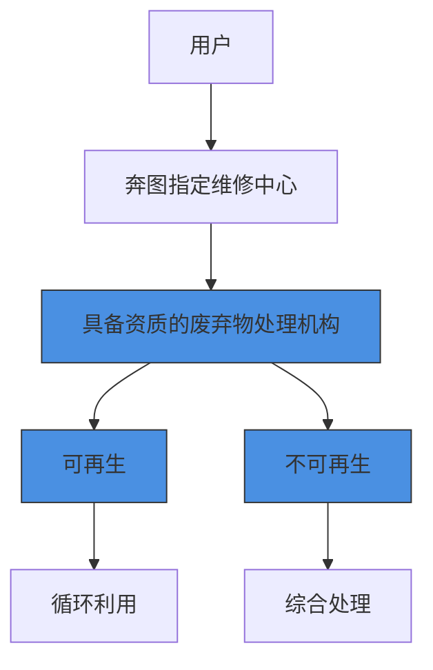

1. 用户负担费用：用户—维修中心。  
2. 奔图电子负担费用：奔图维修中心—具备资质的废弃物处理机构。

# 安全警告

在使用本打印机前，请注意如下安全警告：

# 警告

打印机内部有高压电极。在清洁打印机之前，请确保已切断电源！

请勿用湿手插拔电源线插头，以免导致电击。

text_image

Diagram showing a hand inserting a plug into a wall with a red X symbol indicating disassembly or rejection.

打印机打印时和打印后，定影组件会处于高温状态，请勿触摸定影单元（图示阴影部分），以免造成烫伤！

定影单元有高温警示标签，请勿移动或损坏该标签。

natural_image

Diagram of an open industrial machine with a warning symbol (no text or labels present)

# 注意事项

# 使用打印机前的注意事项：

1. 阅读和理解所有说明；  
2. 了解电器使用的基本常识；  
3. 遵循机器上标识或随机手册上的警告和说明；  
4. 如果操作说明与安全信息有冲突，请以安全信息为准；您可能错误理解了操作说明；如果您不能解决冲突，请拨打售后电话或与服务代表联系以寻求帮助；  
5. 清洁之前，请将电源线从 AC 电源插座拔下。请勿使用液体或气雾清洁剂；  
6. 请勿将本机器放在不稳定的台面上，以免跌落造成严重损坏；  
7. 请勿将任何物体放置于机器顶部，以免机器部件温度升高，从而造成损坏或者火灾；  
8. 严禁将本机器置于散热器、空调或通风管附近；  
9. 请勿在电源线上压任何物品；请勿将本机器放在人们会踩到其电源线的地方；  
10. 插座和延长线不要过载；这可能会降低性能，以及造成火灾或电击；  
11. 谨防小动物咬噬 AC 电源线和计算机接口线；  
12. 切勿让尖锐物品刺穿机器槽孔，以免触到内部高压装置，造成火灾或电击；切勿让任何液体溅到机器上；  
13. 请勿拆解本机器以免造成电击；需要修理时应请专业维护人员进行；打开或卸下护盖时会有电击或其它危险；不正确的拆装可能会导致以后使用时造成电击；  
14. 若出现以下情况，请将机器从计算机和墙上 AC 电源插座上拔下，并联络专业维修人员进行维护：

• 机器中溅入了液体。  
• 机器受到雨淋或进水。  
• 机器跌落，或机壳摔坏。  
• 机器性能发生明显变化。

15. 只调整操作说明中提到的控制；不正确地调整其它控制可能会造成损坏，并且需要专业维修人员用更长时间才能修好；

16. 避免在雷暴天气使用本机器，以免遭到电击；如果可能，请在雷雨期间拔下 AC 电源线；

17. 如果连续打印多页，出纸盘的表面会变得很烫，当心不要触碰此表面，并让儿童远离此表面；

18. 与该打印机相连的设备的信号线不能连接到户外；

19. 在换气不畅的房间中长时间使用或打印大量文件时，请您适时换气；

20. 待机状态下，产品未接收到作业指示一段时间后（如 1 分钟），会自动进入节电（休眠）模式；只有当产品无任何外接输入电源相连时才能实现零能耗；

21. 本产品为 Class 1 等级设备，使用时必须将其连接到带有保护性接地线的电源插座上。

22. 请将本产品安装在温度介于 10℃ 至 32.5℃ 之间，相对湿度介于 20% 至 80% 之间的地方；

23. 出于安全考虑，在某些情况下，打印机连续打印一定量后，可能会转成间歇式打印；

24. 请妥善保管本手册。

# 法规信息

<table><tr><td></td><td>此符号表明不能将该产品与其它废物一起随意丢弃。更妥善的做法,您应该将废弃设备送到指定的收集点,以便回收利用废弃的电气和电子设备。</td></tr><tr><td></td><td>本产品适合室内使用,不适合室外使用。</td></tr><tr><td></td><td>欧共体(EC)指令合规性本产品符合欧共体理事会2004/108/EC和2006/95/EC指令的成员国近似和协调法规中涉及电磁兼容性和电气设备安全性(为在特定电压范围内使用)的保护要求。本产品制造商为:中华人民共和国广东省珠海市香洲区珠海大道3883号珠海奔图电子有限公司。有关这些指令要求的合规声明,可向授权代表索取。本产品符合EN 55022的B级范围和EN 60950的安全要求。</td></tr><tr><td></td><td>本产品完全符合ROHS指令2009/95/EC及重订指令2011/65/EU对有毒有害物质的管理要求。</td></tr><tr><td></td><td>本产品仅适用于非热带地区安全使用。</td></tr><tr><td></td><td>本产品仅适用于海拔2000米及以下地区安全使用。</td></tr></table>

<table><tr><td colspan="7">产品中有毒有害物质或元素名称及含量</td></tr><tr><td rowspan="2">部件名称</td><td colspan="6">有毒有害物质或元素</td></tr><tr><td>铅(Pb)</td><td>汞(Hg)</td><td>镉(Cd)</td><td>六价铬(Cr(VI))</td><td>多溴联苯(PBB)</td><td>多溴二苯醚(PBDE)</td></tr><tr><td>塑胶部件</td><td>○</td><td>○</td><td>○</td><td>○</td><td>○</td><td>○</td></tr><tr><td>金属部件</td><td>×</td><td>○</td><td>○</td><td>○</td><td>○</td><td>○</td></tr><tr><td>电线电缆</td><td>×</td><td>○</td><td>○</td><td>○</td><td>○</td><td>○</td></tr><tr><td>电路板组件</td><td>×</td><td>○</td><td>○</td><td>○</td><td>○</td><td>○</td></tr><tr><td>玻璃部件</td><td>○</td><td>○</td><td>○</td><td>○</td><td>○</td><td>○</td></tr><tr><td>碳粉</td><td>○</td><td>○</td><td>○</td><td>○</td><td>○</td><td>○</td></tr><tr><td>包装材料</td><td>○</td><td>○</td><td>○</td><td>○</td><td>○</td><td>○</td></tr><tr><td colspan="7">备注:1. ○:表示该有毒有害物质在该部件所有均质材料中含量均在 SJ/T11363-2006 标准规定的限量要求以下。2. ×:表示该有毒有害物质至少在该部件的某一均质材料中的含量超出 SJ/T11363-2006 标准规定的限量要求。3. 本产品的部分部件含有有害物质,这些部件是在现有科学技术水平下暂时无可替代物质,但奔图电子将会为一直满足 SJ/T 11363-2006 标准而做不懈努力。4. 环保使用期限取决于产品正常工作的温度和湿度等条件。</td></tr></table>

# 目录

# 1. 使用本机前 .. ..1-2

1.1. 装箱清单 . .1-2   
1.2. 产品视图 .. ..1-3  
1.3. 激光碳粉盒. ..1-5   
1.4. 控制面板 .. ..1-6  
1.5. 产品信息报告. ..1-7

1.5.1.打印产品报告. .1-7

1.5.2.查看信息报告. ..1-8

# 2. 纸张与打印介质. ..2-2

2.1. 纸张规格 . .2-2  
2.2. 装入纸张 .. .2-4

2.2.1. 装入标准纸盒.. ..2-4

2.2.2. 装入多功能纸盒 . ..2-6  
2.2.3. 装入选配纸盒.. ..2-7

2.3. 非打印区域.. ..2-8

# 3. 驱动安装与卸载 . ..3-2

3.1. 基于Windows 系统的驱动安装 ..3-2

3.1.1. USB安装.. ...3-2   
3.1.2. 有线网络安装. ..3-2  
3.1.3. 无线网络安装（Wi-Fi） ..3-4  
3.1.4. 驱动卸载 .3-7

3.2.基于Mac系统的驱动安装 .3-7

3.2.1. 驱动安装 . ..3-7   
3.2.2 .添加打印机 . ..3-8

# 4. 网络设置 . ...4-2

4.1. IP地址设置 . ..4-2

4.1.1 .IPv4设置 . ..4-2   
4.1.2 .IPv6设置 . ...4-3

4.2. 无线网络类型 ..4-3

4.2.1. 基础结构连接模式 . ..4-4  
4.2.2 .Wi-Fi热点连接模式 ...4-7

4.3.关闭无线网络 . ..4-8  
4.4.无线网络设置常遇问题 ..4-8

# 5. Web服务器 . ..5-2

5.1.使用协议 . ..5-2  
5.2.如何使用Web服务器管理打印机 . ..5-2

5.2.1.访问内嵌Web 服务器 ..5-2  
5.2.2.使用Web服务器管理打印机 . ..5-3

# 6. 移动打印 . ...6-2

6.1.基础结构连接模式 ..6-2  
6.2. Wi-Fi热点连接模式(推荐) . ..6-2

6.2.1 .Android设备移动打印 . ...6-2   
6.2.2 .IOS设备移动打印. ..6-4

# 7. 系统设置 . ...7-2

7.1. 语言设置 .  
7.2. 休眠时间设置. ..7-2  
7.3. 省墨设置 . ..7-3   
7.4. 恢复出厂设置. ..7-3

8. 打印 . ..8-2

8.1. 打印功能 . ..8-2  
8.2. 打印设置 . ..8-3  
8.3.取消打印 . ..8-3   
8.4.纸盒与纸张类型/纸张尺寸的对应关系 ..8-3

8.4.1.纸张类型 . ...8-4  
8.4.2.纸张尺寸 . ..8-4

8.5. 打印方式 . ..8-5

8.5.1. 标准纸盒打印.. ...8-5  
8.5.2. 多功能纸盒打印 ..8-6  
8.5.3. 选配纸盒打印.. ...8-6

8.6. 自动双面打印 . ..8-8  
8.7. 打开帮助文档 . ..8-12

9. 日常维护 . ..9-2

9.1. 打印机清洁 .. ..9-2  
9.2. 激光碳粉盒维护 . ..9-3

9.2.1. 关于激光碳粉盒 . ..9-3  
9.2.2. 更换激光碳粉盒 . ..9-4

10. 故障排除 . ..10-2

10.1. 清除卡纸 ..10-2

10.1.1. 标准纸盒卡纸. ..10-2   
10.1.2. 多功能纸盒卡纸. ..10-3  
10.1.3. 选配纸盒卡纸.. ..10-4   
10.1.4. 中部卡纸.. ..10-5  
10.1.5. 定影单元卡纸. ..10-6   
10.1.6. 双面单元卡纸.. ..10-7

10.2. 软件故障 ..10-8  
10.3. 常见故障排除 ..10-8

10.3.1. 一般故障 . ..10-8  
10.3.2. 图像缺陷 . ..10-9

11. 菜单结构 . ..11-2  
12. 产品规格 . ..12-2

# 使用本机前

#

# 章

# 1. 使用本机前 .... ..1-2

1.1. 装箱清单 . .1-2   
1.2. 产品视图 .. ..1-3  
1.3. 激光碳粉盒 . ..1-5   
1.4. 控制面板 . ..1-6  
1.5. 产品信息报告 . ..1-7  
1.5.1.打印产品报告.. ..1-7   
1.5.2.查看信息报告.. ..1-8

# 1. 使用本机前

# 1.1. 装箱清单

当您打开包装时，请检查纸箱中是否包括以下部件：

<table><tr><td>部件</td><td>名称</td><td>数量</td></tr><tr><td>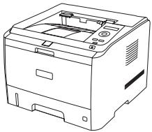</td><td>打印机</td><td>1</td></tr><tr><td>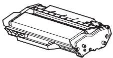</td><td>激光碳粉盒</td><td>1</td></tr><tr><td></td><td>USB 连接线</td><td>1</td></tr><tr><td></td><td>电源线</td><td>1</td></tr><tr><td></td><td>随机光盘</td><td>1</td></tr><tr><td>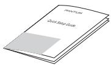</td><td>快速安装指南</td><td>1</td></tr><tr><td>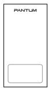</td><td>三包凭证</td><td>1</td></tr></table>

  
注： • 个别地区可能不包含三包凭证。

# 1.2. 产品视图

侧视图  

text_image

Technical diagram of a printer with numbered parts for identification and assembly reference.

<table><tr><td>1</td><td>出纸槽</td><td>用于存放打印出来的纸张</td></tr><tr><td>2</td><td>控制面板</td><td>指示打印机状态,进行打印设置操作</td></tr><tr><td>3</td><td>出纸托盘</td><td>防止打印出来的纸张滑落</td></tr><tr><td>4</td><td>前盖</td><td>打开前盖,可取出激光碳粉盒</td></tr><tr><td>5</td><td>多功能纸盒</td><td>打开多功能纸盒前盖,放入打印介质</td></tr><tr><td>6</td><td>多功能纸盒导纸板</td><td>调整纸张两侧宽度</td></tr><tr><td>7</td><td>电源总开关</td><td>打开或关闭电源</td></tr><tr><td>8</td><td>标准纸盒</td><td>放置打印纸张</td></tr><tr><td>9</td><td>宽度导纸板</td><td>在标准纸盒内,用于调整纸盒内纸张宽度</td></tr></table>

后视图  

text_image

Diagram of a computer with numbered parts labeled 1 to 5, showing internal structure and mounting points.

<table><tr><td>1</td><td>USB 接口</td><td>用于直接连接计算机</td></tr><tr><td>2</td><td>网络接口</td><td>用于连接产品到网络</td></tr><tr><td>3</td><td>电源接口</td><td>用于连接电源线</td></tr><tr><td>4</td><td>后盖</td><td>卡纸时可打开后盖检查</td></tr><tr><td>5</td><td>双面打印单元</td><td>用于后部双面打印卡纸释放</td></tr></table>

注： • 不同型号不同功能的打印机，示意图会有差异，以实物为准。

# 1.3. 激光碳粉盒

激光碳粉盒使用寿命

natural_image

Technical line drawing of a mechanical component with no visible text or symbols

<table><tr><td>类型</td><td>平均打印量</td></tr><tr><td>标准容量激光碳粉盒</td><td>约 3000 页(以上数据基于 ISO/IEC 19752 标准)</td></tr><tr><td>高容量激光碳粉盒</td><td>约 6000 页(以上数据基于 ISO/IEC 19752 标准)</td></tr><tr><td>超大容量激光碳粉盒</td><td>约 10000 页(以上数据基于 ISO/IEC 19752 标准)</td></tr></table>

注： • 如有型号增加恕不另行通知。

• 耗材容量可能会因使用类型不同而有所差异。  
• 本公司不建议使用 Pantum 原装耗材以外的耗材。  
• 因使用非 Pantum 原装耗材而导致的任何损坏不在保修范围之内。  
• 激光碳粉盒外观因型号不同会存在差异，示意图仅供参考。

# 1.4. 控制面板

# 1. 控制面板布局和功能

打印机控制面板布局如下图所示：

text_image

①
②
③
④
⑤
⑥
⑦
OK
⑧
△k↔
⑨

<table><tr><td>序号</td><td>名称</td><td>功能</td></tr><tr><td>1</td><td>LCD显示屏</td><td>显示屏提供有关产品的信息。</td></tr><tr><td>2</td><td>上翻键</td><td>按此键可滚动浏览各菜单及其选项。对于需要输入的菜单项,循环累加变化一个数值。</td></tr><tr><td>3</td><td>菜单键</td><td>打开控制面板主菜单,进行菜单设置。</td></tr><tr><td>4</td><td>下翻键</td><td>按此键可滚动浏览各菜单及其选项。对于需要输入的菜单项,则为移动光标位置,如IP地址输入。</td></tr><tr><td>5</td><td>Wi-Fi键/配置报告键</td><td>此键可启动Wi-Fi功能,并指示Wi-Fi连接状态(仅适用于Wi-Fi机型)。若为非Wi-Fi机型,此键则为打印“打印机信息页”和“网络配置报告”。</td></tr><tr><td>6</td><td>OK键</td><td>·按此键保存设置。·打开控制面板显示屏上的子菜单。·选择菜单项。</td></tr><tr><td>7</td><td>返回键</td><td>返回箭头按键:使用此按键执行以下操作:·退出控制面板菜单。·滚动返回子菜单列表中的上一级菜单。·返回菜单上一级,如果在菜单顶级,则返回就绪界面。</td></tr><tr><td>8</td><td>取消键</td><td>按此键可执行取消操作。在有打印作业的情况下,取消当前正在打印的作业。</td></tr><tr><td>9</td><td>状态指示灯</td><td>此灯可指示打印机就绪、报警等状态。绿灯:正常状态。橙灯:警告状态。红灯:出错状态。</td></tr><tr><td></td><td>电源灯</td><td>开机、工作中、休眠都为蓝色,常亮表示电源就绪。</td></tr></table>

# 2. 状态指示灯

双色 LED 灯会显示红色、橙色、绿色，具体功能为：

<table><tr><td></td><td>亮红色:出现较为严重的错误,激光碳粉盒未安装、激光碳粉盒不匹配、纸盒缺纸等,红灯长亮。具体错误请参阅第10章故障排除。</td></tr><tr><td></td><td>亮橙色:出现激光碳粉盒粉量低,橙灯长亮。</td></tr><tr><td></td><td>亮绿色:打印机处于就绪状态,绿灯长亮。</td></tr></table>

# 1.5. 产品信息报告

# 1.5.1.打印产品报告

用户可以通过操作控制面板打印产品报告。这些页面可以帮助您了解产品信息、诊断和解决产品故障。

1) 按“菜单”键进入菜单设置界面。  
2) 按方向键“▲”或“▼”选择“5.打印信息报告”选项。

text_image

菜单设置
5.打印信息报告
OK
Δ

3) 按“OK”键进入信息报告打印，用户可以根据需要打印产品报告。

注： • 若为非 Wi-Fi 机型，用户还可以直接通过控制面板“网络配置报告”快捷按键，长按打印产品的网络配置报告。

text_image

△←→

# 1.5.2.查看信息报告

以下信息报告页，以P3500DW为例：

# 1．演示页

# PANTUM

The New Era for Printing

P3500 Series

Monochrome Laser Printer

text_image

Automatic 2-sided printing
50,000 page monthly duty cycle
750 to 4,000 recommended monthly page volume
Easy USB connection
250 sheet input tray
Environmentally friendly
Space saving design
Sleep mode to reduce energy consumption

[Sample Test]

# 2．打印机信息页

可以查看您的打印机当前使用粉盒的碳粉剩余量和已打印的页数，以及其他信息。

text_image

[打印机信息页]
[ Page 1 ]
产品信息
产品名称 : P3500DW
USB Vender ID : 0x232B
固件版本 : 3.3.1.3
引擎版本 : 7.4.1.9
内存大小 : 256MB
打印语言 : PCLSe&PS3.PDF
序列号 : AA2A000000
磁盘信息
磁盘型号 : P*350
磁粉剩余量 : 100%
实际已打印页数 : 0
半片磁盘率 : 0%
理论打印页数 : 0
打印信息
打印机总打印页数 : 0
自动双面打印页数 : 0
不同成型打印页数 : 0
A5 : 0
A4/Letter : 0
Legal/Folio : 0
BS/Executive : 0
其他 : 0
纸盒设置
多功能纸盒纸张尺寸 : 自动
多功能纸盒纸张类型 : 自动
标准纸盒纸张尺寸 : 自动
标准纸盒纸张类型 : 自动
选配纸盒1纸张尺寸 : 自动
选配纸盒1纸张类型 : 自动
打印设置
纸张类型 : 普通纸
纸张尺寸 : A4
纸张来源 : 自动选择
页面打印 : 关闭
分辨率 : 600dpi
亮度 : 正常
系统设置
休眠时间 : 1分钟
索引模式 : 关闭

# 3.菜单结构页

可以查看打印机三级菜单的结构。

<table><tr><td colspan="5">[菜单结构]</td></tr><tr><td>一级菜单</td><td>二级菜单</td><td>三级菜单</td><td>四级菜单</td><td>五级菜单</td></tr><tr><td rowspan="5">1.系统设置</td><td>1.语言设置</td><td></td><td></td><td></td></tr><tr><td>2.嵌照时间设置</td><td></td><td></td><td></td></tr><tr><td>3.省属</td><td></td><td></td><td></td></tr><tr><td>4.嵌置出厂设置</td><td></td><td></td><td></td></tr><tr><td>5.版本信息</td><td></td><td></td><td></td></tr><tr><td rowspan="8">2.纸盒设置</td><td rowspan="2">1.多功能纸盒</td><td>1.纸张类型</td><td></td><td></td></tr><tr><td>2.纸张尺寸</td><td></td><td></td></tr><tr><td rowspan="2">1.标准纸盒</td><td>1.纸张类型</td><td></td><td></td></tr><tr><td>2.纸张尺寸</td><td></td><td></td></tr><tr><td rowspan="2">1.选配纸盒一</td><td>1.纸张类型</td><td></td><td></td></tr><tr><td>2.纸张尺寸</td><td></td><td></td></tr><tr><td rowspan="2">1.选配纸盒二</td><td>1.纸张类型</td><td></td><td></td></tr><tr><td>2.纸张尺寸</td><td></td><td></td></tr><tr><td rowspan="7">3.网络设置</td><td rowspan="2">1.有线网络设置</td><td>1.IPv4</td><td></td><td></td></tr><tr><td>2.IPv5</td><td></td><td></td></tr><tr><td rowspan="4">2.无线网络设置</td><td>1.无线网络</td><td></td><td></td></tr><tr><td>2.WPS.PIN 模式</td><td></td><td></td></tr><tr><td>3.IPv4</td><td></td><td></td></tr><tr><td>4.IPv5</td><td></td><td></td></tr><tr><td>3.无线热点</td><td></td><td></td><td></td></tr><tr><td rowspan="14">4.网络信息</td><td rowspan="3">1.有线网络信息</td><td>1.IP 地址</td><td></td><td></td></tr><tr><td>2.子网舞码</td><td></td><td></td></tr><tr><td>3.网关</td><td></td><td></td></tr><tr><td rowspan="6">2.无线网络信息</td><td>1.连接状态</td><td></td><td></td></tr><tr><td>2.IP 地址</td><td></td><td></td></tr><tr><td>3.子网舞码</td><td></td><td></td></tr><tr><td>4.网关</td><td></td><td></td></tr><tr><td>5.信道</td><td></td><td></td></tr><tr><td>6.SSDD</td><td></td><td></td></tr><tr><td rowspan="5">3.WiFi热点保单</td><td>1.状态</td><td></td><td></td></tr><tr><td>2.设备名称</td><td></td><td></td></tr><tr><td>3.IP 地址</td><td></td><td></td></tr><tr><td>4.拨码</td><td></td><td></td></tr><tr><td>5.已连接设备数</td><td></td><td></td></tr></table>

<table><tr><td colspan="4">[菜单结构]</td><td>[Page 1]</td></tr><tr><td>一级菜单</td><td>二级菜单</td><td>三级菜单</td><td>四级菜单</td><td>五级菜单</td></tr><tr><td rowspan="8">5.打印信息报告</td><td>1.演示页</td><td></td><td></td><td></td></tr><tr><td>2.信息页</td><td></td><td></td><td></td></tr><tr><td>3.菜单结构页</td><td></td><td></td><td></td></tr><tr><td>4.网络配置页</td><td></td><td></td><td></td></tr><tr><td>5.WiFi 助式列表页</td><td></td><td></td><td></td></tr><tr><td>6.PCL 字体列表页</td><td></td><td></td><td></td></tr><tr><td>7.PS 字体列表页</td><td></td><td></td><td></td></tr><tr><td>8.打印全部信息页</td><td></td><td></td><td></td></tr></table>

# 4．网络配置信息页

可以查看打印机的有线/无线网络信息、无线热点信息。

<table><tr><td colspan="2">有线网络配置</td><td colspan="2">无线网络配置</td></tr><tr><td>连接状态</td><td>已连接</td><td>连接状态</td><td>已连接</td></tr><tr><td>有线操作地址</td><td>:ACEF:84:01:15:04</td><td>无线操作地址</td><td>:00:11:F6:AC:BC:F3</td></tr><tr><td>总机名称</td><td>:Partum:011504</td><td>通信模式</td><td>:基础连接模式</td></tr><tr><td rowspan="3">设备位置</td><td rowspan="3">:</td><td>网络名称(SSID)</td><td>:osshi</td></tr><tr><td>BSSID</td><td>:d8:3a:35:33:75:40</td></tr><tr><td>身份证方式</td><td>:WPA/WPA2</td></tr><tr><td colspan="2">有线网络IPv4信息</td><td colspan="2">无线网络IPv4信息</td></tr><tr><td>状态</td><td>开启</td><td>状态</td><td>开启</td></tr><tr><td>配置方式</td><td>自动</td><td>配置方式</td><td>自动</td></tr><tr><td>IP地址</td><td>:10.10.148.147</td><td>IP地址</td><td>:192.168.0.102</td></tr><tr><td>子网掩码</td><td>:255.255.255.0</td><td>子网掩码</td><td>:255.255.255.0</td></tr><tr><td>默认网关</td><td>:10.10.148.254</td><td>默认网关</td><td>:192.168.0.1</td></tr><tr><td>Bonjour名称</td><td>:Partum P3500DW SERIES 011504</td><td>Bonjour名称</td><td>:Partum P3500DW SERIES 011504</td></tr><tr><td colspan="2">有线网络IPv6信息</td><td colspan="2">无线网络IPv6信息</td></tr><tr><td>状态</td><td>开启</td><td>状态</td><td>开启</td></tr><tr><td>链路本地地址</td><td>:fe80:a2ef84fffe01:1504</td><td>链路本地地址</td><td>:fe80:211:f9ff:ea:cbd3</td></tr><tr><td>状态需地址</td><td>:114c:a2ef:84fffe:01:1504</td><td>状态需地址</td><td>::</td></tr><tr><td>有状态地址</td><td>:114c:ff:0.0:434b</td><td>有状态地址</td><td>:114c:ff:0.0:0.434b</td></tr><tr><td colspan="2">附件通知</td><td colspan="2">无线热点信息</td></tr><tr><td>缺纸</td><td>关闭</td><td>状态</td><td>开启</td></tr><tr><td>数量低</td><td>关闭</td><td>SSID</td><td>:Partum-AP-ACBCF3</td></tr><tr><td>卡纸</td><td>关闭</td><td>IP地址</td><td>:192.168.223.1</td></tr><tr><td>磁盘寿命尽</td><td>关闭</td><td>密码</td><td>:12345678</td></tr><tr><td></td><td></td><td>已连接设备数</td><td>:0</td></tr></table>

<table><tr><td colspan="2">P3500 Series</td><td>PANTUM</td></tr><tr><td colspan="2">[网络配置信息页]</td><td>[Page 2]</td></tr><tr><td colspan="2">网络服务状态信息</td><td></td></tr><tr><td>IPv4 状态</td><td>: 开启</td><td></td></tr><tr><td>IPv6 状态</td><td>: 开启</td><td></td></tr><tr><td>DHCPv4 状态</td><td>: 开启</td><td></td></tr><tr><td>DHCPv6 状态</td><td>: 开启</td><td></td></tr><tr><td>RAW 状态</td><td>: 开启</td><td></td></tr><tr><td>LPD 状态</td><td>: 开启</td><td></td></tr><tr><td>WSD 状态</td><td>: 关闭</td><td></td></tr><tr><td>SNMP 状态</td><td>: 开启</td><td></td></tr><tr><td>Email Alert 状态</td><td>: 开启</td><td></td></tr><tr><td>Bonjour 状态</td><td>: 开启</td><td></td></tr><tr><td>Mopriu 状态</td><td>: 开启</td><td></td></tr><tr><td>SLP 状态</td><td>: 开启</td><td></td></tr><tr><td>IPP 状态</td><td>: 开启</td><td></td></tr><tr><td>LLMNR 状态</td><td>: 关闭</td><td></td></tr></table>

# 5.Wi-Fi热点列表页

可以查看当前打印机搜索到的无线网络。

<table><tr><td colspan="3">[WiFi 热点列表页]</td><td>[Page 1]</td></tr><tr><td>序号</td><td>热点名称</td><td>加密方式</td><td>信号强度(%)</td></tr><tr><td>1</td><td>Test-AP1</td><td>WPA/WPA2</td><td>80%</td></tr><tr><td>2</td><td>Test-AP2</td><td>WPA/WPA2</td><td>60%</td></tr><tr><td>3</td><td>Test-AP3</td><td>WPA/WPA2</td><td>60%</td></tr><tr><td>4</td><td>Test-AP4</td><td>无</td><td>40%</td></tr><tr><td>5</td><td>Test-AP5</td><td>WPA/WPA2</td><td>40%</td></tr><tr><td>6</td><td>Test-AP6</td><td>无</td><td>20%</td></tr><tr><td>7</td><td>Test-AP7</td><td>WPA/WPA2</td><td>20%</td></tr><tr><td>8</td><td>Test-AP8</td><td>WPA/WPA2</td><td>20%</td></tr></table>

# 6.PCL字体列表页

可以查看当前打印机支持的93种PCL设备字体。

# 7.PS字体列表页

可以查看当前打印机支持的93种PS设备字体。

# 纸张与打印介质

# 2

# 章

2. 纸张与打印介质 . .2-2

2.1. 纸张规格 . .2-2  
2.2. 装入纸张 . ..2-4

2.2.1. 装入标准纸盒. ..2-4

2.2.2. 装入多功能纸盒 . ..2-6

2.2.3. 装入选配纸盒. ..2-7

2.3. 非打印区域 . .2-8

# 2. 纸张与打印介质

# 2.1. 纸张规格

<table><tr><td rowspan="13">P3500系列</td><td rowspan="4">标准纸盒</td><td>介质类型</td><td>自动*、普通纸、薄纸</td></tr><tr><td>介质尺寸</td><td>自动*、A4、Letter、A5、Legal、Statement、B5、Folio、Oficio、Executive、ISO B5、A5 L、A6、B6、16K、Big 16K、32K、Big 32K。</td></tr><tr><td>介质克重</td><td>60~105 g/m2</td></tr><tr><td>纸盒最大容量</td><td>250页</td></tr><tr><td rowspan="4">多功能纸盒</td><td>介质类型</td><td>自动*、普通纸、厚纸、薄纸、透明胶片纸、卡片纸、标签纸、信封纸</td></tr><tr><td>介质尺寸</td><td>自动*、A4、Letter、Legal、Folio、Oficio、Statement、Executive、JIS B5、ISO B5、A5、A5 L、A6、B6、Monarch Env、DL Env、C5 Env、NO.10 Env、C6 Env、Jap Postcard、Postcard、Yougata2、Nagagata3、Younaga3、Yougata4、Long Paper(1.2m)、ZL、16K、Big 16K、32K、Big 32K。</td></tr><tr><td>介质克重</td><td>60~200 g/m2</td></tr><tr><td>纸盒最大容量</td><td>60页</td></tr><tr><td rowspan="4">选配纸盒</td><td>介质类型</td><td>自动*、普通纸、薄纸</td></tr><tr><td>介质尺寸</td><td>自动*、A4、A5短边、JIS B5、ISO B5、Letter、Legal、Executive、Folio、Oficio、Statement、16K、Big 16K。</td></tr><tr><td>介质克重</td><td>60~105 g/m2</td></tr><tr><td>纸盒最大容量</td><td>550页(单个选配纸盒)</td></tr><tr><td>出纸盒容量</td><td>150页</td><td></td></tr></table>

注： • 本款打印机建议使用标准纸、再生纸。

• 不建议大量使用特殊纸，可能影响打印机寿命。  
• 不符合本用户指南中所列准则的打印介质可能导致打印质量差、卡纸次数增多、打印机过度磨损。  
• 重量、成分、纹理及湿度等属性是影响打印机性能和输出质量的重要因素。  
• 在选择打印介质时，请注意以下事项：

1. 所需打印效果：选择的打印介质应符合打印任务的需要。  
2. 表面平滑度：打印介质的平滑度会对打印效果的清晰程度产生影响。  
3. 某些打印介质可能符合本部分的所有使用准则，但仍不能产生令人满意的打印效果。这可能是由于不正确的操作、不适宜的温度和湿度，或者奔图无法控制的其他因素造成的。在大批量购买打印介质之前，请确保打印介质符合本用户指南中指定的规格。  
4. 使用不符合这些规格要求的打印介质，可能会导致打印机的损坏。

# 纸张与原稿使用原则

• 纹理粗糙、有凹凸、油渍、十分光滑的纸张或原稿打印效果不佳。  
• 请确保纸上无灰尘、绒毛等。  
• 将纸张置于平坦的表面，存放在阴凉、干燥的环境。

# 特殊纸张说明

本产品支持特殊纸张进行打印，特殊纸张包括：标签纸、信封、透明胶片、厚纸、卡片纸等。特殊纸张需在多功能纸盒进行打印。

注： • 当使用特殊纸张或打印介质时，请确保在打印设置上选择匹配的打印类型和尺寸，以便获得最佳打印效果。  
• 当在多功能纸盒使用特殊介质打印时，我们建议一次仅放一张纸。

请遵守以下标准：

<table><tr><td>打印介质种类</td><td>正确做法</td><td>错误做法</td></tr><tr><td>标签纸</td><td>仅使用未暴露衬纸的标签。标签使用时应放平。仅使用整张的标签。不保证市面上所有的标签纸都能够满足要求。</td><td>使用褶皱、起泡或破损的标签纸。</td></tr><tr><td>信封</td><td>信封应平整置入。</td><td>使用有褶皱、缺口、粘连或损坏的信封。使用带有别针、按扣、窗口或涂层衬里的信封。使用自粘不干胶或其他合成材料的信封。</td></tr><tr><td>透明胶片</td><td>仅使用经核准适用于激光打印机的透明胶片。</td><td>使用不适用于激光打印机的透明胶片。</td></tr><tr><td>厚纸、卡片纸</td><td>仅使用经核准适用于激光打印机并满足本产品重量规格的重质纸。</td><td>使用重量超过本产品推荐介质规格的纸张,除非是经核准适用于本产品的纸张。</td></tr></table>

# 2.2. 装入纸张

# 2.2.1. 装入标准纸盒

1. 从打印机中完全抽出标准纸盒。

natural_image

Illustration of a printer with a paper holder and internal components, showing no text or symbols.

2. 滑动标准纸盒长度导纸板、宽度导纸板到所需的纸张尺寸卡槽，匹配纸张的长度和宽度。

natural_image

Technical line drawing of a mechanical housing or enclosure with red arrows indicating flow or movement (no text or symbols present)

注： • 请不要过度挤压“长度导纸板”和“宽度导纸板”，否则容易导致纸张变形。

3. 请在装入纸张之前展开堆叠的纸张，避免卡纸或进纸错误，再把纸张打印面朝下装入纸盒内，标准纸盒最多可装入 250 张 80 g/m² 纸。

text_image

Illustration showing a document being folded into a printer, with a magnified inset highlighting the fold change.

注： • 产品纸盒上设有常用纸张尺寸的“纸盒拨盘”，可根据需要进行设置，当所打印作业纸型与拨盘设置纸型不一致时，打印机 LCD 显示屏将会报错“纸张设置不匹配”，需重新设置好拨盘，排除错误。

natural_image

Technical illustration of a mechanical housing component with an inset view showing a circular component labeled A4 (no text or symbols present)

• 拨盘上没有显示的纸型可通过控制面板进行纸张尺寸设置。

4. 抬起出纸托盘，避免打印完的纸张滑落。

natural_image

Illustration of a printer with paper feed and red arrows indicating ports (no text or symbols)

注： • 如果一次性放入标准纸盒的纸张超过 250 页（80 g/m²）会卡纸或不进纸。• 如果仅打印单面时，请把要打印的面（空白面）朝下。

# 2.2.2. 装入多功能纸盒

1. 抬起出纸托盘，避免打印完的纸张滑落，或在打印完成后立即将打印的文档取走。

natural_image

Illustration of a printer with a red arrow indicating the paper airplane (no text or symbols present)

2. 打开多功能纸盒。

natural_image

Line drawing of a printer with a red arrow indicating a process or operation, showing internal components without any text or symbols.

3. 滑动多功能纸盒的导纸板以匹配纸张的两侧。不要用力过度，否则会导致卡纸或纸张歪斜。

natural_image

Line drawing of a printer with paper feed and paper roll, showing internal components without any text or symbols

4. 双手将信封或透明胶片等打印介质放入多功能纸盒中，直至信封或透明胶片的前端碰到校正辊。

natural_image

Illustration of hands inserting a paper into a printer (no text or symbols visible)

注： • 当您将纸张放入多功能纸盒时，设置纸张来源为自动选择或者指定设置为多功能纸盒时，将会优先从多功能纸盒进纸打印。

• 每次最多放入 60 张打印介质到多功能纸盒中。

• 将打印介质打印面向上放入多功能纸盒，装入时，纸张的顶部先进入多功能纸盒。

• 使用打印过的纸张时，请将要打印的面（空白面）朝上。

• 打印后，请立即取走纸张、信封和透明胶片。堆叠的纸张或信封会引起卡纸或曲纸。

# 2.2.3. 装入选配纸盒

本机可叠加选配纸盒，每个纸盒最多可放入 550 页 80 g/m² 的纸张。如果需要购买选配纸盒，请联系购买此打印机的当地经销商。

注： • 关于选配纸盒安装方式，请参阅第 8 章。

1. 从打印机中完全抽出选配纸盒 。

natural_image

Line drawing of a printer with a red arrow indicating a download or release mechanism (no text or symbols present)

2. 滑动纸盒的长度导纸板、宽度导纸板到所需的纸张尺寸卡槽，匹配纸张的长度和宽度。

natural_image

Isometric technical drawing of a mechanical housing or enclosure with internal components and red directional arrows indicating movement (no text or symbols)

注： • 请不要过度挤压“长度导纸板”和“宽度导纸板”，否则容易导致纸张变形。

• 要装入 Legal 尺寸纸张，请向里按纸盘后端的释放按键并拉出纸盘后端，从而加长纸盘。

3. 请在装入纸张之前展开堆叠的纸张，避免卡纸或进纸错误，再把纸张打印面朝下装入纸盒内，选配纸盒最多可装入 550 张 80 g/m² 纸。

text_image

Illustration showing steps to fold a document into a printer, with magnified detail highlighting the process.

注： • 产品纸盒上设有常用纸张尺寸的“纸盒拨盘”，可根据需要进行设置，当所打印作业纸型与拨盘设置纸型不一致时，打印机 LCD 显示屏将会报错“选配纸盒一，纸张设置不匹配”，需重新设置好拨盘，排除错误。

natural_image

Technical illustration of a mechanical component with an inset view showing a labeled section A4 (no text or symbols on the diagram itself)

• 拨盘上没有显示的纸型可通过控制面板进行纸张尺寸设置。

4. 抬起出纸托盘，避免打印完的纸张滑落。

natural_image

Diagram of a printer with an open drawer and paper feed, showing internal components and a red arrow indicating motion (no text or symbols present)

注： • 如果一次性放入选配纸盒的纸张超过 550 页（80 g/m²）会卡纸或不进纸。

• 如果仅打印单面时，请将要打印的面（空白面）朝下。  
• 关于选配纸盒的安装，详细内容请参照选配纸盒随机附带的安装指南。

# 2.3. 非打印区域

阴影部分表示非打印区域。

natural_image

Simple geometric diagram of a rectangle with labeled corners A, I, and B (no text or symbols within the shape)

<table><tr><td>用途</td><td>纸张尺寸</td><td>上下边距(A)</td><td>左右边距(B)</td></tr><tr><td rowspan="2">打印</td><td>A4</td><td>4.2mm(0.165in)</td><td>4.2mm(0.165in)</td></tr><tr><td>Letter</td><td>4.2mm(0.165in)</td><td>4.2mm(0.165in)</td></tr></table>

# 驱动安装与卸载

# 3

章

# 3. 驱动安装与卸载 . ..3-2

3.1. 基于Windows 系统的驱动安装 . .3-2

3.1.1. USB安装.. ..3-2   
3.1.2. 有线网络安装. ..3-2  
3.1.3. 无线网络安装（Wi-Fi） ..3-4  
3.1.4. 驱动卸载 . ..3-7

3.2.基于Mac系统的驱动安装 ..3-7

3.2.1. 驱动安装 .. ..3-7   
3.2.2 .添加打印机 . ...3-8

# 3. 驱动安装与卸载

# 3.1. 基于Windows 系统的驱动安装

• 驱动安装前，您需要知道打印机型号，请打印“打印机信息页”并查看“产品名称”（参阅第1.5章）。  
• 在使用有线或无线网络安装驱动时，您需要知道打印机的IP地址，请打印“网络配置信息页”并查看（参阅第1.5章）。  
• 覆盖安装驱动，安装语言是不可以更改的。若需要更改，请先将打印机驱动卸载。

# 3.1.1. USB安装

以下操作以Pantum P3500D Series为例：

1.使用USB线连接打印机和计算机，打开电源。  
2.在计算机的光驱中插入随附的安装光盘，运行Autorun.exe安装程序。   
3.阅读许可协议，选择安装语言，点击“安装”。

text_image

PANTUM P3500 Series PCL6
PANTUM
安装语言： 中文（简体）
用户指南
我同意许可协议
安装

4.系统自动安装驱动，安装过程可能需要几分钟。  
5.安装完成后，弹出“安装完成”界面，约3秒后自动关闭。

# 3.1.2. 有线网络安装

以下操作以Pantum P3500DN Series为例：

1.计算机已连接到有线网络。  
2.打开打印机和计算机的电源。  
3.将网线连接到打印机的网络接口，确保打印机与计算机处于同一网络（如何配置网络，参阅第4.1章）。  
4.在计算机的光驱中插入随附的安装光盘，运行Autorun.exe安装程序。

5.阅读许可协议，选择安装语言和打印机型号，选择“已连接至网络的打印机”，点击“安装”。

text_image

PANTUM P3500 Series PCL6
安装语言： 中文（简体）
选择打印机： Pantum P3500DN Series PCL6
安装方式：
USB打印机
打印机已连接JSB至计算机。
已连接至网络的打印机
已配置打印机并连接至网络。
用户指南
✓ 我同意许可协议
安装

6.安装程序自动搜索打印机，搜索过程可能需要1－2分钟。  
7.搜索完成后，选择需要连接的打印机，点击“下一步”。

text_image

Pantum P3500 Series PCL6
已搜索到的打印机
打印机名称	IP地址	主机名
✓ Pantum P3500DN Series PC...	192.168.1.2	Pantum-011504
以主机名安装列表中的打印机	刷新
手动添加IP地址或主机名
上一步	下一步	退出

注： • 若已搜索到的打印机列表中，没有您需要连接的打印机，点击“刷新”；

• 若以主机名方式安装打印机驱动，请同时勾选您需要连接的“打印机名称”和“以主机名安装列表中的打印机”；  
• 若手动添加IP地址或主机名，您需要知道所连接的打印机IP地址或主机名。如不清楚，请打印“网络配置信息页”并查看“IP地址”和“主机名”（参阅第1.5章）。

8.系统自动安装驱动，安装过程可能需要几分钟。  
9.安装完成后，弹出“安装完成”界面，约3秒后自动关闭。

# 3.1.3. 无线网络安装（Wi-Fi）

无线网络连接类型，分为基础结构连接和Wi-Fi热点连接两种模式（参阅第4.2章）。

# 3.1.3.1.基础结构连接安装

驱动安装前，必须了解您的接入点（无线路由器）的“网络名（SSID）”和“密码”。如果无法确定，请咨询您的网络管理员或接入点（无线路由器）制造商。

以下操作以Pantum P3500DW Series为例：

1.计算机已成功连接到接入点（无线路由器）。  
2.使用USB线连接打印机和计算机，打开电源。  
3.在计算机的光驱中插入随附的安装光盘，运行Autorun.exe安装程序。   
4.阅读许可协议，选择安装语言和打印机型号，选择“连接至新的网络的打印机”，点击安装。

text_image

PANTUM P3500 Series PCL6
安装语言： 中文（简体）
选择打印机： Pantum P3500DW Series PCL6
安装方式：
USB打印机
打印机已连接JSB至计算机。
已连接至网络的打印机
已配置打印机并连接至网络。
连接至新的网络的打印机
配置打印机连接至新的无线网络。
用户指南
我同意许可协议
安装

5.按照安装窗口提示进行操作，将打印机配置到无线网络（如何配置，参阅第4.2.1.章）。  
6.无线网络配置成功后，安装程序自动搜索打印机，搜索过程可能需要1－2分钟。  
7.选择需要连接的打印机，点击“下一步”。

text_image

PANTUM P3500 Series PCL6
已搜索到的打印机
打印机名称	IP地址	主机名
✓ Pantum P3500DW Series PC...	192.168.0.104	Pantum-011504
以主机名安装列表中的打印机	刷新
手动添加IP地址或主机名
上一步	下一步	退出

注： • 若已搜索到的打印机列表中，没有您需要连接的打印机，点击刷新；

• 若以主机名方式安装打印机驱动，请同时勾选您需要连接的“打印机名称”和“以主机名安装列表中的打印机”；  
• 若手动添加IP地址或主机名，您需要知道所连接的打印机IP地址或主机名。如不清楚，请打印“网络配置信息页”并查看“IP地址”和“主机名”（请参阅第1.5章）。

8.系统自动安装驱动，安装过程可能需要几分钟。  
9.安装完成后，弹出安装完成界面，约3秒后自动关闭。

# 3.1.3.2.Wi-Fi热点连接安装

驱动安装前，必须了解您的打印机的无线热点信息。如不清楚，请打印网络配置信息页并查看打印机无线热点的SSID和密码（参阅第1.5章）。

以下操作以Pantum P3500DW Series为例：

1.打开打印机和计算机的电源。  
2.打开打印机的Wi-Fi热点（如何打开，请查阅第4.2.2章）。  
3.点击计算机桌面右下角的 ， 连接打印机的无线热点。  
4.在计算机的光驱中插入随附的安装光盘，运行Autorun.exe安装程序。

5.阅读许可协议，选择安装语言和打印机型号，选择已连接至网络的打印机，点击安装。

text_image

PANTUM P3500 Series PCL6
PANTUM
安装语言： 中文（简体）
选择打印机： Pantum P3500DW Series PCL6
安装方式：
USB打印机
打印机已连接JSB至计算机。
已连接至网络的打印机
已配置打印机并连接至网络。
连接至新的网络的打印机
配置打印机连接至新的无线网络。
用户指南	✓ 我同意许可协议
安装

6.安装程序自动搜索打印机，搜索过程可能需要1－2分钟。  
7.选择需要连接的打印机，点击“下一步”。

text_image

PANTUM P3500 Series PCL6
已搜索到的打印机
打印机名称	IP地址	主机名
✓ Pantum P3500DW Series PC...	192.168.223.1	Pantum-011504
以主机名安装列表中的打印机	刷新
手动添加IP地址或主机名
上一步	下一步	退出

注：• 若已搜索到的打印机列表中，没有您需要连接的打印机，点击刷新。

• 若以主机名方式安装打印机驱动，请同时勾选您需要连接的打印机名称 和 以主机名安装列表中的打印机。

8.系统自动安装驱动，安装过程可能需要几分钟。  
9.安装完成后，弹出“安装完成”界面，约3秒后自动关闭。

# 3.1.4. 驱动卸载

# 3.1.4.1.卸载方法

以下操作以 Windows 7 为例，您的计算机屏幕信息可能因操作系统的不同而有差异。

1.点击计算机的“开始菜单” ，然后点击“所有程序” 。

2.点击 “Pantum”，然后点击“Pantum X Series PCL6”。

Pantum X Series PCL6 中的 “X” 代表产品型号。

3.点击“卸载”，按照卸载窗口说明删除驱动。

# 3.2.基于Mac系统的驱动安装

• Mac系统下的驱动安装分为驱动安装和添加打印机两部分。若您使用AirPrint 打印机进行打印，无须安装驱动，添加打印机即可使用。  
• 在使用有线或无线网络安装驱动时，您需要知道打印机的IP地址，请打印“网络配置信息页”并查看“Bonjour名称”（参阅第1.5章）。

# 3.2.1. 驱动安装

以下操作以 Mac10.10 为例，您的计算机屏幕信息可能因操作系统的不同而有差异。

1.打开打印机和计算机的电源。  
2.在计算机的光驱中插入随附的安装光盘，双击“Pantum P3500 Series PS”安装包。

3.点击“继续”。

4.阅读许可协议，然后点击“继续”。

5.在弹出的提示窗口，点击“同意”，接受许可协议。

6.点击“安装”。

7.输入计算机密码，点击“安装软件”。

8.在弹出的提示窗口，点击“继续安装”。

9.系统自动完成驱动安装，并弹出无线网络配置提示窗口。

text_image

是否现在运行“无线网络配置工具”？
是	否

• 若选择USB、有线网络或无线热点方式连接打印机，请点击“否”，退出无线网络配置提示窗口。  
• 若选择无线网络基础结构连接模式连接打印机，请点击“是”，通过无线网络配置工具配置打印机的无线网络（参阅第4.2.1.1章）。  
9.点击“重新启动”，等待计算机重启，完成安装。

注：• 驱动安装完成后，您需要添加打印机，才能进行打印（请参阅第3.2.2章）。

# 3.2.2.添加打印机

若您希望使用AirPrint打印，添加打印机时，在“使用”选项框中，选择“Secure AirPrint（数据加密）”或“AirPrint（不加密）”。

# 3.2.2.1. USB连接方式添加

1.打开打印机和计算机的电源。  
2.使用USB线连接打印机和计算机，系统自动识别并添加打印机。  
3.进入计算机的“系统偏好设置”－“打印机与扫描仪”，在打印机列表中查看打印机是否已添加成功。  
若打印机列表中显示您添加的打印机，且打印机准备就绪，则打印机添加成功。

若打印机列表中没有您添加的打印机，可能是USB线未连接好，请重新连接。

# 3.2.2.2.有线网络连接方式添加

1.打开打印机和计算机的电源。  
2.将网线连接到打印机网络接口，确保打印机与计算机处于同一网络（如何配置网络，参阅第4.1章）。  
3.进入计算机的“系统偏好设置”－“打印机与扫描仪”。  
4.点击 按钮。  
5.选择您的Pantum打印机，然后从“使用”弹出菜单中选择对应的打印机型号。  
6.点击“添加”。

# 3.2.2.3.无线网络连接方式添加

无线网络连接类型，分为基础结构连接和Wi-Fi热点连接两种模式（参阅第4.2章）。

# 3.2.2.3.1.基础结构连接

添加打印机前，必须了解您的接入点（无线路由器）的“网络名（SSID）”和“密码”。如果无法确定，请咨询您的网络管理员或接入点（无线路由器）制造商。

1.计算机已成功连接到接入点（无线路由器）。  
2.使用USB线连接打印机和计算机，打开电源。  
3.打印机已连接到无线网络，确保与计算机在同一网络（如何配置，参阅第4.2.1章）。  
4.进入计算机的“系统偏好设置” －“打印机与扫描仪”。

5.点击 按钮。

6.选择您的Pantum打印机，然后从“使用”弹出菜单中选择对应的打印机型号。

7.点击“添加”。

# 3.2.2.3.2. Wi-Fi热点连接

驱动安装前，必须了解您的打印机的无线热点信息。如不清楚，请打印“网络配置信息页”并查看打印机无线热点的“SSID”和“密码”（参阅第1.5章）。

1.打开打印机和计算机的电源。  
2.打开打印机的Wi-Fi热点（如何打开，请查阅第4.2.2章）。  
3.点击计算机桌面右上角的 ， 连接打印机的无线热点。  
4.进入计算机的“系统偏好设置”－“打印机与扫描仪”。  
5.点击 按钮。  
6.选择您的Pantum打印机，然后从“使用”弹出菜单中选择对应的打印机型号。  
7.点击“添加”。

# 网络设置

# 4

# 章

# 4. 网络设置 . ..4-2

4.1. IP地址设置 . ..4-2

4.1.1 .IPv4设置 . ..4-2   
4.1.2 .IPv6设置 . ..4-3

4.2. 无线网络类型 . .4-3

4.2.1. 基础结构连接模式 . ..4-4  
4.2.2 .Wi-Fi热点连接模式 . ..4-7

4.3.关闭无线网络 . ..4-8

4.4.无线网络设置常遇问题 . .4-8

# 4. 网络设置

本产品可同时支持有线网络和无线网络连接。

# 4.1. IP地址设置

IP地址设置前，您需要将打印机连接到网络。

1.若为有线网络机型，使用网线连接到打印机网络接口，将打印机连接到有线网络。  
2.若为无线网络机型，可通过无线网络配置工具或Wi-Fi Protected Setup配置方式，将打印机连接到无线网络（参阅第4.2.1章）。

# 4.1.1.IPv4设置

打印机IPv4地址设置分为DHCP自动分配和手动设置。

# 4.1.1.1. DHCP自动分配

动态主机配置协议(DHCP)是客户端与服务器之间的一种网络协议。DHCP 服务器提供特定于DHCP 客户端主机请求的配置参数，一般是客户端主机参与某个 IP 网络所需的信息。DHCP还提供用于将 IP 地址分配给客户端主机的机制。打印机默认开启DHCP 自动分配功能。

1.打开打印机电源，将打印机连接到网络。  
2.打印机将自动获取DHCP服务器分配的IP地址，整个过程可能需要几分钟。

您可以打印“网络配置信息页”并查看打印机“IP地址”（如何打印，参阅第1.5章）。如果IP地址未列出，请等待几分钟，然后重试。

注：• 如果DHCP服务器自动分配IP地址不成功，打印机会自动获取系统分配的链路本地地址：169.254.xx.xx。

# 4.1.1.2 .手动设置

# 4.1.1.2.1.通过面板设置

1. 打开打印机电源，使打印机进入就绪状态。  
2. 按下打印机控制面板“菜单键”－“菜单设置”－“网络设置”－“有线网络设置”－“IPv4”－“手动”，按下“ok”键，进入“IP地址”设置界面。  
3. 通过控制面板方向键“▲”或“▼”，输入您需要配置的“IPv4地址”、“子网掩码”和“网关地址”，按下“ok”键，完成设置。

注：• 方向键“▲”设置数字0-9，方向键“▼”移动光标位置。

# 4.1.1.2.2. 通过内嵌Web服务器设置

1.打开打印机电源，将打印机连接到网络。  
2.登录内嵌Web服务器（如何登录，参阅第5.2.1章）。  
3.点击“设置”－“网络设置”－“协议设置”－“有线IP配置”。  
4.将IPv4地址分配方式设置为“手动”。

5.输入“IPv4地址”、“子网掩码”和“网关地址”，点击“应用”。

# 4.1.2.IPv6设置

# 4.1.2.1. 通过面板启用

1. 打开打印机电源，使打印机进入就绪状态。  
2. 按下打印机控制面板“菜单键”－“菜单设置”－“网络设置”－“有线网络设置”－“IPv6”－“开启DHCPv6”，按下“ok”键，完成设置。

# 4.1.2.2. 通过内嵌Web服务器启用IPv6协议

1.打开打印机电源，将打印机连接到网络。  
2.登录内嵌Web服务器（如何登录，参阅第5.2.1章）。  
3.点击“设置”－“网络设置”－“协议设置”－“IPv6”。  
4.勾选“启用IPv6协议”和 “启用DHCPv6”（默认为勾选），点击“应用”。

您可刷新浏览器，在“有线IP配置”界面，查看“IPv6本地链路地址”和“有状态地址”。

注： 打印机支持使用下列 IPv6 地址进行网络打印和管理；

• IPv6本地链路地址：自行配置的本地 IPv6 地址（以 FE80 开头的地址）。  
• 有状态地址：DHCPv6 服务器配置的 IPv6 地址（若网络中无DHCPv6服务器，“有状态地址”不能分配）；  
• 无状态地址：网络路由器自动配置的 IPv6 地址（参阅第1.5章，在“网络配置信息页”中查看）。

# 4.2. 无线网络类型

无线网络连接类型，分为基础结构连接和Wi-Fi热点连接两种模式。若您在无线网络设置过程中遇到问题，请参阅第4.4章。

flowchart

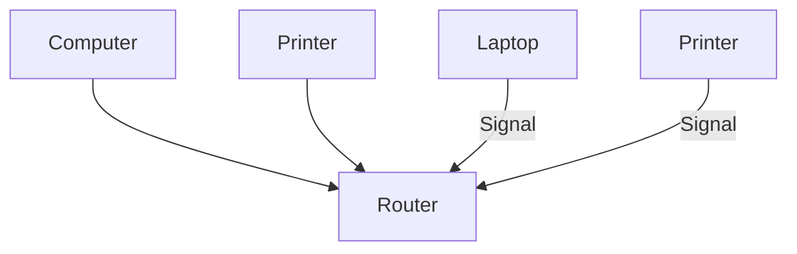

基础结构连接模式：通过路由器与无线设备连接

1.接入点（无线路由器）  
2.无线网络打印机  
3.通过无线网络连接至接入点的计算机  
4.通过网线连接至接入点的计算机

text_image

Diagram showing two laptops connected to a printer with signal waves, labeled with numbers 1 and 2.

Wi-Fi热点连接模式：计算机与带Wi-Fi功能的打印机连接

1.无线网络打印机  
2.通过无线网络连接打印机热点的计算机

# 4.2.1. 基础结构连接模式

您可以通过接入点（无线路由器）作为媒介，将计算机和打印机连接在一起。接入点（无线路由器）连接分为无线网络配置和Wi-Fi Protected Setup配置两种方式。

重要：在进行无线网络安装前，必须了解您的接入点（无线路由器）的网络名（SSID）和密码。如果无法确定，请咨询您的网络管理员或接入点（无线路由器）制造商。

# 4.2.1.1. 无线网络配置工具

若您的计算机已安装驱动，但无线网络发生变更，可以通过无线网络配置工具重新配置。

# 4.2.1.1.1.前期准备事项

1.接入点（无线路由器）。  
2.已连接到网络的计算机。  
3.具有无线网络功能的打印机。  
4.USB线。

# 4.2.1.1.2.无线网络配置工具配置方法

1.使用USB线连接打印机和计算机，打开电源。  
2.在计算机中调出无线网络配置工具。

1）Windows系统：点击计算机“开始菜单”－“所有程序”－“Pantum”－“产品名称”－“无线网络配置工具”。

2）Mac系统：点击计算机菜单栏“前往”－“应用程序”－“产品名称”－“无线网络配置工具”。  
3.1 若您的计算机已开启无线网络，在以下界面，选择需要连接的无线网络的“网络名（SSID）”，点击下一步。

text_image

Pantum P3500 Series
请从下面列表中选择相应的网络名（SSID），然后单击"下一步"。
网络名	安全模式	信号强度
ceshi	WPA/WPA2	100%
ciscosb1	无	90%
ASUS1-8	WPA/WPA2	88%
手动输入网络名
刷新	下一步	取消

注：• 您所选择的网络名（SSID）应与计算机连接的接入点（无线路由器）的网络名（SSID）一致。

• 若无线网络列表为空，请查看接入点（无线路由器）是否已开启，或者计算机是否处于无线网络范围内，然后点击“刷新”。  
• 若您需要连接的网络名（SSID）不在已搜索到的网络名列表中，请勾选“手动输入网络名”进行手动配置（参阅以下第3.2步骤）。

3.2若您使用网线连接计算机和接入点（无线路由器），在以下界面，输入接入点（无线路由器）的网络名称SSID（SSID 区分大小写），点击“下一步”。

text_image

Pantum P3500 Series
PANTUM
您可以点击"打印无线网络信息页"，打印打印机搜索到的无线网络列表。
网络名称 (SSID):
ceshi
手动输入网络名
打印无线网络信息页
下一步
取消

注：• 如果您不清楚接入点（无线路由器）的网络名（SSID），请点击打印无线网络信息页，通过打印机搜索无线网络热点，搜索过程约10秒。

4．输入接入点（无线路由器）的Wi-Fi密码，点击“下一步”。

text_image

PANTUM P3500 Series
PANTUM
请验证无线凭证，然后单击"下一步"。
网络名称 (SSID):
ceshi
安全模式:
WPA/WPA2
密码:
************
□ 显示密码
上一步    下一步    取消

注：• 如果不了解您的网络安全模式及密码，请咨询您的网络管理员或接入点（无线路由器）制造商。

• 目前，打印机支持的安全模式有三种：无、WEP和WPA/WPA2。

1)无：未使用任何加密方式。

2)WEP：通过使用WEP（有线等效加密），以安全密钥发送和接收数据。WEP密钥适用于64和128位加密网络，可同时包含数字和字母。

3)WPA/WPA2：是Wi-Fi保护接入预共享密钥，它通过使用TKIP或AES加密（WPS－Personal）将无线设备与接入点进行连接。WPA/WPA2使用长度介于8-63个字符之间的预共享密钥（PSK）。

• “显示密码”默认为不勾选，若勾选，所输入的密码将明文显示。

5.计算机开始与打印机建立无线连接。

6.连接成功后，点击“完成”。

注：• 无线网络配置完成后，若打印机不能正常使用，请重新安装驱动。安装方式请选择“已连接至网络的打印机”（Windows系统请参阅第3.1.3章，Mac系统请参阅第3.2.2.3章）。

# 4.2.1.2. Wi-Fi Protected Setup配置

如果接入点（无线路由器）支持 Wi-Fi Protected Setup，则可以分别按下打印机控制面板上的Wi-Fi按键和接入点（无线路由器）上的WPS按键，从而将打印机连接到无线网络。

# 4.2.1.2.1.前期准备事项

1.接入点（无线路由器）支持 Wi-Fi Protected Setup。  
2.具有无线网络功能的打印机。

# 4.2.1.2.2. Wi-Fi Protected Setup配置方法

1.打开打印机和接入点（无线路由器）的电源。  
2.确保打印机处于就绪状态。

注：• 若打印机进入休眠状态，请按下打印机控制面板的任意按键，然后松开，再等待约3-6秒，打印机即被唤醒。

3.按下打印机控制面板上的“Wi-Fi”键约3秒，直到面板显示“WPS连接中…”，然后松开。  
4.您需要在2分钟内，按下接入点（无线路由器）上的“WPS”按键，然后松开。  
5.接入点（无线路由器）与打印机开始进行无线网络连接，连接过程大概需要2分钟。连接成功后打印机的Wi-Fi灯蓝灯常亮  
若超过2分钟没有建立好连接，打印机LCD面板返回就绪状态，Wi-Fi灯灭 ，Wi-FiProtected Setup连接失败。若需要重新连接，请重复以上第3-4步骤。

注：• Wi-Fi Protected Setup连接成功后，若您希望通过无线网络方式进行打印，请安装驱动。安装方式请选择“已连接至网络的打印机”（Windows系统请参阅第3.1.3章，Mac系统请参阅第3.2.2.3章）。

# 4.2.2.Wi-Fi热点连接模式

您可以不使用接入点（无线路由），将无线客户端（包括具有无线网络功能的计算机和移动设备）与无线网络打印机建立连接。

# 4.2.2.1.前期准备事项

1.具有无线网络功能的打印机。  
2.无线客户端（包括具有无线网络功能的计算机和移动设备）。

# 4.2.2.2. Wi-Fi热点连接方法

1.打开打印机电源。  
2.按下打印机控制面板“菜单键”－“菜单设置”－“网络设置”－“Wi-Fi热点”－“开启”，打开打印机的Wi-Fi热点。  
3.按下打印机控制面板“菜单键”－“打印信息报告”－“网络配置信息页”，请打印“网络配置信息页”并查看打印机无线热点的“SSID”和“密码”。

注：• Wi-Fi热点默认为关闭。

• 您还可以通过内嵌Web服务器打开打印机的Wi-Fi热点（参阅5.2.2.1章）。

4.开启计算机或移动设备。

# 5.1.使用计算机连接

1）Windows系统：点击计算机桌面右下角的 ，连接打印机的无线热点。  
2）Mac系统：点击桌面右上角的 ， 连接打印机的无线热点。

注：• 若您希望计算机通过无线网络方式进行打印，请安装驱动。安装方式请选择“已连接至网络的打印机”（Windows系统请参阅第3.1.3章，Mac系统请参阅第3.2.2.3章）。

# 5.2.使用移动设备连接

1）设置移动设备的无线连接。如何设置，请参阅您所使用的移动设备的用户手册或咨询您的移动设备制造商。  
2）移动设备与打印机成功建立连接后，如何打印，请参阅第6章。

# 4.3.关闭无线网络

打印机通过接入点（无线路由器）连接到无线网络，Wi-Fi灯蓝灯常亮 。若要关闭无线网络，请按以下步骤进行操作：

1.确保打印机处于就绪状态。

注：• 若打印机进入休眠状态，请按下打印机控制面板的任意按键，然后松开，再等待约3-6秒，打印机即被唤醒。

2.按打印机控制面板“菜单键” － “菜单设置” －“网络设置” － “无线网络设置” －会“无线网络” － “关闭”，关闭无线网络， Wi-Fi灯灭 。

注：•您还可通过内嵌Web服务器关闭无线网络（参阅5.2.2.1章）。

# 4.4.无线网络设置常遇问题

# 1．未找到打印机

• 计算机、接入点（无线路由器）或打印机电源是否已打开。  
• 计算机和打印机之间是否已连接了USB线。  
• 打印机是否支持无线网络连接。

# 2．网络连接时，找不到网络名（SSID）

• 检查接入点（无线路由器）的电源开关是否已打开。  
• 打印机找不到您选择或输入的接入点（无线路由器）的网络名称 (SSID)，请检查接入点上的网络名称（SSID）并尝试重新连接。  
• 每当接入点（无线路由器）的配置发生变化时，您必须重新设置打印机的无线网络。

# 3．连接失败

• 请检查接入点（无线路由器）和打印机的安全模式、密码是否正确。  
• 计算机无法连接打印机的无线热点，请检查打印机电源是否已打开。  
• 检查打印机周围的无线接收。如果路由器远离打印机或中间有障碍，可能影响信号的接收。  
• 关闭接入点（无线路由器）和打印机的电源，然后再重新启动。

# 4.如果在网络中使用打印机时出现问题，请检查以下几方面：

• 关闭计算机、接入点（无线路由器）和打印机的电源，然后再重启。  
• 检查防火墙软件是否封锁通信。如果计算机和打印机连接在同一网络中却搜索不到，可能是因为防火墙软件封锁了通信。请参阅防火墙软件的用户指南，将防火墙关闭，然后重新尝试搜索打印机。  
• 检查打印机 IP 地址的分配是否正确。您可以打印打印机的网络配置信息页来检查 IP地址。

注：• 有关接入点（无线路由器）的信息，请参阅其用户指南或咨询其制造商。

# Web服务器

# 5

# 章

5. Web服务器 ...5-2

5.1.使用协议 . .5-2  
5.2.如何使用Web服务器管理打印机 . ..5-2

5.2.1.访问内嵌Web 服务器 . ..5-2

5.2.2.使用Web服务器管理打印机. ..5-3

# 5. Web服务器

您可以通过内嵌Web服务器，管理打印机的设置。

# 5.1.使用协议

# 1．有线IP配置-IPv4

IPv4是互联网协议的第四版，也是第一个被广泛使用，构成现今互联网技术的基础协议。您可以使用内嵌Web服务器更改IPv4地址、子网掩码和网关地址（请参阅第4.1.1章）。

# 2．IPv6

IPv6是互联网协议的第六版，也被称作下一代互联网协议，它是由IETF设计的用来替代现行的IPv4协议的一种新的IP协议。打印机支持IPv6协议，默认为启用（请参阅第4.1.2章）。

# 3．RAW/LPD

TCP/IP网络中广泛应用的打印协议。该协议实现了交互式数据传输。打印机支持RAW/LPD协议，默认为启用。

# 4．SNMP

简单网络管理协议（SNMP）用于管理计算机、路由器和无线网络打印机等网络设备。打印机支持SNMPv1/SNMPv2协议，默认为启用。

# 5．SMTP

简单邮件传输协议 (SMTP) 是 Internet 上的电子邮件发送标准。SMTP 是一种相对简单的文本协议，它指定了一个或多个信息接收人，然后将此信息文本发送出去。它是一个客户端到服务器的协议，可以将邮件信息从客户端发送至服务器。

# 6．Bonjour

Bonjour也称为零配置联网，能自动发现IP网络上的电脑、设备和服务。打印机支持Bonjour协议，默认为启用。

# 7.SSL/TLS

SSL/TLS在传输层对网络连接进行加密，为数据通讯提供安全支持。提供生成/安装/卸载TLS证书。

# 5.2.如何使用Web服务器管理打印机

# 5.2.1.访问内嵌Web 服务器

1.打开打印机和计算机电源。

2.将打印机连接到网络，确保打印机与计算机处于同一网络。

注：• 若您的打印机为有线网络机型，使用网线连接到打印机网络接口，将打印机连接到有线网络。

• 若您的打印机为无线网络机型，可通过无线网络配置工具或Wi-Fi Protected Setup配置方式，将打印机连接到无线网络（请参阅第4.2.1章）。

3.在计算机打开Internet Explore等浏览器，在地址栏中输入打印机的IP地址（例http://192.168.1.100），然后按“回车键”。

打印“网络配置信息页”并查看打印机的“IP 地址”（请参阅第1.5章）。

注：• 建议Windows用户使用Microsoft Internet Explorer 8.0（或更高版本）或Firefox 1.0（或更高版本），Mac用户使用Safari 4.0（或更高版本）。无论您使用何种浏览器，请确保始终启用JavaScript和Cookies。如果使用其他网络浏览器，请确保其与HTPP 1.0和HTTP 1.1兼容。

• 如果计算机不能访问打印机内嵌的Web服务器，可能是计算机和打印机不在同一网络中，请检查您的网络环境或咨询您的网络管理员。

4 .点击“登录”选项，输入用户名和密码（默认用户名为“a d m i n”，初始密码为“000000”），点击“登录”。

注：• 出于安全原因，奔图打印建议您更改默认密码，您可以进入“用户管理”界面进行修改。

# 5.2.2.使用Web服务器管理打印机

您可以使用内嵌的Web服务器，管理打印机。

1.可查看打印机的基本信息，包括产品名称、打印机状态和粉盒状态。  
2.可配置打印机支持的网络协议参数。  
3.可配置打印机的无线网络连接，开启/关闭无线网络和无线热点。  
4.可配置邮件服务器客户端，通过电子邮件通知方式管理打印机状态。

# 5.2.2.1.无线设置

您可以通过无线设置页面，设置打印机的“无线网络”、“无线IP配置”、“无线热点”和“WPS”。设置前，请先登录内嵌Web服务器（如何登录，参阅第5.2.1章）。

# 开启/关闭无线网络：

1.点击“设置”－“网络设置”－“无线设置”－“无线网络”。  
1）无线网络默认为开启，若要关闭，选择“关闭”选项框，再点击“应用”。  
2）若您需要配置无线网络，点击搜索列表中需要连接的接入点（无线路由）的网络名（SSID），输入密钥，点击“应用”。

# 无线IP配置：

只有开启打印机的无线网络，内嵌 Web服务器才显示“无线IP配置”。

1.点击“设置”－“网络设置”－“无线设置”－“无线IP配置”。

1)DHCPv4默认为勾选。若要手动配置IP地址，请取消勾选DHCPv4复选框，输入您需要配置的“IPv4地址”、“子网掩码”和“网关地址”，点击“应用”。

# 开启/关闭无线热点：

1.点击“设置”－“网络设置”－“无线设置”－“无线热点”。

无线热点默认为关闭，若要开启，选择“开启”选项框，再点击“应用”。

# WPS设置：

1.点击“设置”－“网络设置”－“无线设置”－“WPS”。

WPS默认为关闭。若要开启，请选择您需要的“WPS启动方式”，点击“应用”，并按照页面提示进行操作。

# 5.2.2.2.机器设置

您可以通过机器设置页面，添加邮件地址通讯录、设置电子邮件通知、设置休眠时间、恢复出厂设置。

# 5.2.2.2.1.配置电子邮件通知

若您配置了电子邮件通知，当打印机出现缺纸等异常状态时，将会向您指定的邮箱地址发送邮件。

配置电子邮件通知前，您需要登录内嵌Web服务器（如何登录，参阅第5.2.1章）。

# 一.配置SMTP客户端

1.点击“设置”－“网络设置”－“协议设置”－“SMTP”。  
2.在SMTP页面，输入SMTP服务器地址、配置发件人的邮箱登录名和密码，点击“应用”。

# 二.添加收件人邮件地址

1.点击“设置”－“机器设置”－“通讯录”。  
2.点击“添加”，输入收件人姓名和电子邮箱，点击“应用”。

# 三.设置电子邮件通知

1.点击“设置”－“机器设置”－“电子邮件通知”。  
2.点击 按钮，在弹出的联系人列表里，选择您希望添加的邮件地址。

您也可以勾选“地址X”（如地址1），手动输入您希望添加的收件人邮件地址。

3.勾选您希望通知的邮件地址和通知的内容，点击“应用”。

# 5.2.2.2.2.休眠时间设置

打印机休眠时间默认为1分钟，若您需要更改打印机的休眠时间，可通过内嵌Web服务器（通过网络连接方式安装的打印机）或打印机属性界面进行设置（Windows系统使用USB线连接方式安装的打印机）。

# 一、通过Web服务器设置

1.登录内嵌Web服务器（如何登录，参阅第5.2.1章）。  
2.点击“设置”－“机器设置”－“系统”。  
3.根据您的需要选择休眠时间，点击“应用”。

注：• 若您的打印机恢复出厂设置，休眠时间将自动恢复为1分钟。

# 二、通过打印机属性设置（仅支持Windows系统使用USB线连接方式安装的打印机）

以下步骤适用于Windows 7系统，您的计算机屏幕信息可能因操作系统的不同而有差异。

1.进入计算机的“开始菜单”－“控制面板”－“查看设备和打印机”。  
2.右键点击打印机，在下拉菜单，选择“打印机属性”。  
3.进入“辅助设置”选项。  
4.设置休眠时间，点击“确定”。

# 5.2.2.3.通过Web服务器恢复出厂设置

1.登录内嵌Web服务器（如何登录，参阅第5.2.1章）。  
2.点击“用户管理”选项，再点击“恢复出厂设置”，打印机自动重启。

注：• 打印机恢复出厂设置后，管理员的用户名恢复为admin，登录密码恢复为000000。• 您还可以通过打印机控制面板按键恢复出厂默认设置，参阅第7.4.章。

# 移动打印

# 6

# 章

6. 移动打印 . ...6-2

6.1.基础结构连接模式 . ..6-2  
6.2. Wi-Fi热点连接模式(推荐) . ..6-2

6.2.1 .Android设备移动打印 . ..6-2

6.2.2 .IOS设备移动打印. ..6-4

# 6. 移动打印

无线网络连接类型，分为基础结构连接和Wi-Fi热点（推荐）连接两种模式。若您在无线网络设置过程中遇到问题，请参阅第4.4章 无线网络设置常遇问题。

text_image

1
2
3

基础结构连接模式：通过路由器与无线设备连接

1.通过无线网络连接至接入点的移动设备  
2.接入点（无线路由器）  
3.无线网络打印机

text_image

1
WLAN
Pantum-AP-XXXXXX
Connected
WLAN
Pantum-AP-XXXXXX
Connected
2

Wi-Fi热点连接模式：移动设备与带Wi-Fi功能的打印机连接

1. 通过无线网络连接打印机热点的移动设备  
2. 无线网络打印机

# 6.1.基础结构连接模式

您可以通过接入点（无线路由器）作为媒介，将移动设备和无线网络打印机连接在一起。

重要：在进行无线网络安装前，必须了解您的接入点（无线路由器）网络名（SSID）和密码。如果无法确定，请咨询您的网络管理员或接入点（无线路由器）制造商。

1.将打印机连接到接入点（无线路由器），连接方法请参阅第4.2.1章。  
2.将移动设备连接到接入点（无线路由器），如何连接，请咨询您的网络管理员或移动设备制造商。  
3.若您使用的是Android移动设备，可以使用Mopria移动打印。如何打印，请参阅第6.2.1章。  
若您使用的是IOS移动设备，可以使用AirPrint移动打印。如何打印，请参阅第6.2.2章。

# 6.2. Wi-Fi热点连接模式(推荐)

您可以不使用接入点（无线路由），将移动设备连接到无线网络打印机的Wi-Fi热点，与无线网络打印机建立连接。

# 6.2.1.Android设备移动打印

支持Mopria移动打印。

# 6.2.1.1. Mopria移动打印

Mopria 移动打印需要在Android移动设备安装Mopria Print Service打印插件。您可以打印照片、电子邮件、网页和文档。

# 6.2.1.1.1. Mopria移动打印支持的操作系统和应用软件

1.Mopria移动打印适用于Android4.4或更高版本。

2.Mopria移动打印支持的应用软件有微软Office 1.01(16.0.4201.1006) 或更高版本，AdobeReader （V11.7.1）或更高版本等。

更多支持Mopria打印的软件请访问：http://mopria.org/Developers/SpotlightAppsWall.aspx

# 6.2.1.1.2.如何下载Mopria Print Service

1.从Google play Store下载并安装Mopria Print Service打印插件到Android移动设备。

2.中国用户请登录<http://simplifiedchinese.tyslab.com/> 下载Mopria打印服务 > 下载并安装。

# 6.2.1.1.3.前期准备事项

1.具有无线网络功能的打印机。  
2.Android移动设备。

# 6.2.1.1.4.如何使用Mopria移动打印

打印前，先将Mopria print service设置为打开。

1.点击Android移动设备主屏幕上的“设置”，选择“打印”。  
2.将“Mopria print service”设置为“打开”。

若要使用Mopria移动打印功能，需要将“Cloud Print”或“HP Print Service Plugin”设置为“关闭”。

打印步骤可能会因应用程序而异，以下以Adobe Reader为例进行说明。

1.打开打印机电源。  
2.Android移动设备连接打印机的无线网络（如何连接，参阅第4.2.2章）。  
3.在Android移动设备上，使用Adobe Reader打开您需要打印的文档。

4.点击 ： 。

5.点击“打印”。

6.确保已选择Pantum打印机。

若您选择了其他打印机（或没有选择打印机），请点击打印机下拉菜单，然后选择您的Pantum打印机。

7.设置打印参数，如打印页数。

8.点击“打印”。

注：• 如果打印失败，请检查Android移动设备是否已连接到打印机的无线热点（Wi-Fi）。

• 如果Android移动设备未检测到任何打印机，请检查打印机是否已接通电源，以及打印机是否已打开。

# 6.2.2.IOS设备移动打印

只有 AirPrint 认证的打印机可使用 AirPrint 功能。请查看打印机所使用的包装箱上是否有AirPrint 认证标志。

# 6.2.2.1. IOS移动打印支持的操作系统

适用于IOS7.0 或更高版本。

# 6.2.2.2.前期准备事项

1．具有无线网络功能的打印机。  
2．IOS 移动设备。

# 6.2.2.3.如何使用 AirPrint移动打印

打印步骤可能会因应用程序而异，以下以PDF为例进行说明。

1.打开打印机电源。  
2.IOS移动设备连接打印机的无线网络（如何连接，参阅第4.2.2章）。  
3.在IOS设备上，使用PDF打开您需要打印的文档。  
4.点击 。

5.点击“打印”。

6.确保已选择Pantum打印机。

若您选择了其他打印机（或没有选择打印机），请点击“打印机”选项，然后选择您的Pantum打印机。

7.设置打印参数，如打印份数。

8.点击“打印”。

注： • 如果打印失败，请检查IOS 移动设备是否已连接到打印机的无线热点（Wi-Fi）。

• 如果IOS 移动设备未检测到任何打印机，请检查打印机是否已接通电源，以及打印机是否已打开。

# 系统设置

# 7

# 章

7. 系统设置 . ..7-2

7.1. 语言设置 . ..7-2  
7.2. 休眠时间设置 . ..7-2  
7.3. 省墨设置 . ..7-3   
7.4. 恢复出厂设置 . ..7-5

# 7. 系统设置

本章主要介绍一些常用设置。

# 7.1. 语言设置

“语言设置”用来选择控制面板的显示语言。

1) 按“菜单”键进入菜单设置界面。  
2) 按“OK”键选择“1.系统设置”选项。  
3) 按“OK”键选择“1.语言设置”选项，如下图：

text_image

系统设置
1.语言设置
OK
Δk→

# 7.2. 休眠时间设置

设置休眠模式将降低耗电量，“休眠时间设置”可以选择设备进入休眠模式之前的闲置时间。

1) 按“菜单”键进入菜单设置界面。  
2) 按“OK”键选择“1.系统设置”选项。  
3) 按方向键“▲”或“▼”选择“2.休眠时间设置”选项，按“OK”键。

text_image

系统设置
2.休眠时间设置
OK
Δ

4) 按方向键“▲”或“▼”可选择“1 分钟”、“5 分钟”、“15 分钟”、“30 分钟”、“60 分钟”、“8 小时”。

注： • 打印机进入休眠状态时，按任意键或者发送打印作业，可以唤醒打印机。

# 7.3. 省墨设置

用户可以选择省墨设置，降低打印成本，当省墨模式为“打开”时，打印输出的颜色将偏淡。默认设置为“关闭”。

1.通过控制面板设置：

1) 按“菜单”键进入菜单设置界面。  
2) 按“OK”键选择“1.系统设置”选项。

text_image

菜单设置
1.系统设置
OK
Δ

3) 按方向键“▲”或“▼”选择“3. 省墨”选项，按“OK”键。

text_image

系统设置
3.省圈
OK
W
X
▲

4) 按方向键“▲”或“▼”选择“1. 关闭”，按“OK”键，“1. 关闭”后出现“\*”表示关闭省墨设定完成；或按方向键“▲”或“▼”选择“2. 开启”，按“OK”键，“2. 开启”后出现“\*” 表示开启省墨设置完成。

text_image

省圈
1.关闭
OK
Δ

5) 按“菜单”键退出菜单界面，或者选择每级菜单中最后一项“返回上一级”按“OK”键逐级退出菜单界面。

text_image

就绪
OK
W
X
△<>

2.通过打印首选项设置：

点击打印首选项，点击左上方“版面”按钮，进入如下界面，选择“省墨”模式，“省墨”模式下打印输出颜色为“较淡”。

text_image

打印首选项
基本	纸张	版面	高级
多页
多页	1页
边框	无边框
排序	向右再向下
缩放	原始尺寸的 100 % 25-400%
省墨
省墨
浓度	较淡
图像方向
横向
纵向
旋转180度
PANTUM
恢复默认设置
确定	取消	帮助

# 7.4. 恢复出厂设置

“恢复出厂设置”用来恢复到打印机的默认设置。

1) 按“菜单”键进入菜单设置界面。  
2) 按“OK”键选择“1.系统设置”选项。

text_image

菜单设置
1.系统设置
OK
Δk→

3) 按方向键“▲”或“▼”选择“4.恢复出厂设置”选项，按“OK”键。

text_image

系统设置
4.恢复出厂设置
OK
Δ

注：• 若您通过网络方式安装打印机，可通过内嵌Web服务器恢复出厂设置（请参阅第5.2.2.3章）。

# 打印

# 8

# 章

8. 打印 .. ...8-2

8.1. 打印功能 . ..8-2  
8.2. 打印设置 . ..8-3  
8.3.取消打印 . ..8-3   
8.4.纸盒与纸张类型/纸张尺寸的对应关系 .. .8-3

8.4.1.纸张类型 . ..8-4  
8.4.2.纸张尺寸. ..8-4

8.5. 打印方式 . ..8-5

8.5.1. 标准纸盒打印.. ..8-5  
8.5.2. 多功能纸盒打印 . ..8-6  
8.5.3. 选配纸盒打印.. ..8-6

8.6. 自动双面打印 .. ..8-8

8.7. 打开帮助文档. .8-12

# 8. 打印

# 8.1. 打印功能

您可以通过在打印首选项中各种属性的设置实现如下打印功能。

<table><tr><td>功能</td><td>图示</td></tr><tr><td>自动双面打印</td><td></td></tr><tr><td>逐份打印</td><td></td></tr><tr><td>逆序打印</td><td></td></tr><tr><td>多页合一</td><td></td></tr><tr><td>海报打印(仅适用于Windows系统)</td><td></td></tr><tr><td>缩放打印</td><td></td></tr><tr><td>自定义尺寸</td><td></td></tr></table>

注： • 您可以在多页合一中选择 2x2 海报打印，实现海报打印功能。

• 您可以打开打印首选项，点击帮助按钮，查看具体的功能解释。如何打开帮助文档，请参阅第 8 章。

# 8.2. 打印设置

发送打印作业前，可通过以下2种方式设置打印参数（如纸张类型、纸张尺寸和纸张来源）。

<table><tr><td>操作系统</td><td>临时更改打印作业的设置(以word 2010为例)</td><td>永久更改默认设置(以PDF为例)</td></tr><tr><td>Windows 7</td><td>1. 点击文件菜单-打印-选择打印机-打印机属性(具体步骤因操作系统不同而有差异)。</td><td>1. 点击开始菜单-控制面板-设备和打印机。2. 右键点击打印机图标,选择打印首选项。</td></tr><tr><td>Macintosh OS X</td><td>1. 点击文件菜单-打印。2. 在弹出的窗口更改设置。</td><td>1. 点击文件菜单-打印。2. 在弹出的窗口更改设置,点击保存预设置。3. 每次进行打印时,必须选择预设置,否则按默认设置进行打印。</td></tr></table>

注： • 应用软件设置优先级高于打印机设置。

# 8.3.取消打印

在打印过程中，若要取消作业，请按打印机控制面板的“取消键”。

# 8.4.纸盒与纸张类型/纸张尺寸的对应关系

<table><tr><td rowspan="2">纸盒</td><td colspan="2">控制面板</td><td>拨盘</td></tr><tr><td>支持的纸张类型</td><td>支持的纸张尺寸</td><td>支持的纸张尺寸</td></tr><tr><td>多功能纸盒</td><td>自动*、普通纸、厚纸、透明胶片纸、卡片纸、标签纸、信封纸、薄纸</td><td>自动*、A4、Letter、Legal、Folio、Oficio、Statement、Executive、JIS B5、ISO B5、A5、A5 L、A6、B6、Monarch Env、DL Env、C5 Env、NO.10 Env、C6 Env、Jap Postcard、Postcard、Yougata2、Nagagata3、Younaga3、Yougata4、Long Paper (1.2m)、ZL、16K、Big 16K、32K、Big 32K。</td><td>无拨盘</td></tr><tr><td>标准纸盒</td><td>自动*、普通纸、薄纸</td><td>自动*、Folio、Oficio、Executive、ISO B5、A5 L、A6、B6、16K、Big 16K、32K、Big 32K。</td><td>*(自动)、A5、A4、LTR、LGL、STA、B5。</td></tr><tr><td>选配纸盒</td><td>自动*、普通纸、薄纸</td><td>自动*、Folio、Oficio、Executive、ISO B5、16K、Big 16K。</td><td>*(自动)、A5、A4、LTR、LGL、STA、B5。</td></tr></table>

注： •若打印机端纸盒的纸张尺寸、纸张类型和拨盘设置为“自动”时，则不对打印作业计算机端的纸张尺寸和纸张类型设置进行匹配检测。反之，设置为非“自动”时，会进行匹配检测。

•若打印作业计算机端设置的纸张尺寸、纸张类型和纸张来源，与打印机端对应纸盒的纸张尺寸和纸张类型相匹配，则作业正常打印。若不匹配，打印机控制面板有相应提示。  
•若打印作业计算机端设置的纸张尺寸、纸张类型和纸张来源，与打印机端多个纸盒设置相匹配时，打印机抽取纸张的顺序依次为：多功能纸盒 > 标准纸盒 > 选配纸盒。

# 8.4.1.纸张类型

您可以通过打印机的控制面板，设置多功能纸盒/标准纸盒/选配纸盒的纸张类型。

注：• 多功能纸盒/标准纸盒/选配纸盒支持的纸张类型,请参阅第8.4.章。

# 8.4.1.1.控制面板纸张类型设置

1.按控制面板的“菜单键”，按“方向键”，选择“纸盒设置”。  
2.按“OK键”，进入“纸盒设置界面”，按“方向键”，选择需要设置的纸盒。  
3.按“OK键”，进入“设置界面”，按“方向键”，选择“纸张类型”。  
4.按“OK键”，进入“纸张类型界面”。  
5.按“方向键”，选择需要设置的选项。再按“OK键”，设置选项。

注：• 请确保纸张类型设置，与纸盒放置的纸张类型相匹配。

# 8.4.2.纸张尺寸

您可以通过打印机的控制面板和对应的纸盒拨盘，设置多功能纸盒/标准纸盒/选配纸盒的纸张尺寸。

注：• 多功能纸盒/标准纸盒/选配纸盒支持的纸张尺寸,请参阅第8.4.章。

# 8.4.2.1.控制面板纸张尺寸设置

1.按控制面板的“菜单键”，按“方向键”，选择“纸盒设置”。  
2.按“OK键”，进入“纸盒设置界面”，按“方向键”，选择需要设置的纸盒。  
3.按“OK键”，进入“设置界面”，按“方向键”，选择“纸张尺寸”。  
4.按“OK键”，进入“纸张尺寸界面”。  
5.按“方向键”，选择需要设置的选项。再按“OK键”，设置选项。

注：• 请确保纸张尺寸设置，与纸盒放置的纸张尺寸相匹配。

# 8.4.2.2.纸盒拨盘纸张尺寸设置

您可以通过打印机的纸盒拨盘，设置标准纸盒/选配纸盒的纸张尺寸。

以下以标准纸盒为例进行操作说明：

1.将标准纸盒从打印机中拉出。

natural_image

Line drawing of a printer with internal components and a red arrow indicating a location (no text or symbols present)

2.拨动纸盒拨盘，选择您需要的纸张尺寸。

natural_image

Technical diagram of a mechanical component with a magnified inset showing a circular view of a door or panel (no text or symbols present)

3. 放入纸张，将标准纸盒装入打印机。

natural_image

Illustration of a printer with paper being inserted into a rack, showing red arrows indicating motion (no text or symbols present)

注：• 请确保纸盒拨盘的纸张尺寸设置，与纸盒放置的纸张尺寸相匹配。

# 8.5. 打印方式

本机可进行标准纸盒打印、多功能纸盒打印和选配纸盒打印。若多功能纸盒有打印介质，则优先打印多功能纸盒内的打印介质。本机优先顺序为：多功能纸盒＞标准纸盒＞选配纸盒。

# 8.5.1. 标准纸盒打印

在打印前，请确保标准纸盒中已装入相应数量的介质。

natural_image

Line drawing of a printer with paper inside, showing internal structure and base panel (no text or symbols)

注： • 有关装纸注意事项，请参阅第 2 章。

# 8.5.2. 多功能纸盒打印

当您将纸张放入多功能纸盒时，本机将自动从多功能纸盒进纸打印。

natural_image

Illustration of hands printing a printer into a machine with a red arrow indicating the paper's direction (no text or symbols present)

注： • 多功能纸盒可以用来打印特殊纸张，当使用特殊纸张打印时，我们建议一次仅放一张纸。

• 有关在多功能纸盒中装纸，请参阅第 2 章。  
• 若您设置的纸张尺寸为Long Paper，打印前请打开打印机后盖，使打印纸张从打印机后端排出。打印时，一次只能放置1页纸张。

# 8.5.3. 选配纸盒打印

# 8.5.3.1. 选配纸盒安装

1. 请确保打印机本体与选配纸盒正确放置，如下图所示。

natural_image

Diagram of a printer stack with red arrows indicating upward movement (no text or symbols present)

2. 将电源线插入打印机本体，打开电源。

text_image

Diagram showing connection between a computer device and an electrical outlet, with red arrows indicating cable or wiring connections.

注： • 安装或移走选配纸盒时，请断开打印机电源。

• 选配纸盒安装完成后，打印过程中请勿抬起本体，否则将会造成选配纸盒通信失败。用户需要重新开机恢复错误。

3. 在操作系统的“设备和打印机”界面，打开“打印机属性”，点击“辅助设置”，在“可安装选项”中选择“已安装”，完成选配纸盒安装，如图所示。

text_image

Pantum P3500DW Series PCL6 属性
常规	共享	端口	高级	颜色管理	安全	辅助设置	关于
休眠时间设定
1分钟进入休眠
True Type字体表
按纸盒类型分配
选配纸盒1 Letter(8.5×11 inch)
选配纸盒2 Letter(8.5×11 inch)
可安装选项
选配纸盒1 已安装
选配纸盒2 未安装
确定	取消	应用(A)	帮助

4. 当打印机的多功能纸盒和标准纸盒无纸时，或者用户设置纸张来源为“选配置纸盒1/2”，打印机将会从选配纸盒进纸完成打印作业。

natural_image

Line drawing of a printer with an open drawer and internal components (no text or symbols)

注： • 选配纸盒最多能放入 550 页 80 g/m²普通纸。

• 请确保选配纸盒与打印机本机正常安装。

# 8.5.3.2. 选配纸盒拆卸

1. 长按打印机电源键，关闭电源。  
2. 双手抬起打印机本体，移走选配纸盒。

注： • 拆卸选配纸盒时，请确保打印机电源已关闭。

# 8.6. 自动双面打印

1. 本机驱动程序支持普通纸的自动双面打印。自动双面打印支持的纸张大小：A4、Letter、Legal、Oficio、Folio。

注： • 如果纸张薄，可能会起皱。

• 如果纸张卷曲，将其恢复平整然后放回纸盒中。  
• 某些纸张介质不适于自动双面打印，尝试自动双面打印可能会损坏打印机。  
• 如果一次性放入标准纸盒的纸张超过 250 张，将会出现卡纸或不进纸现象。  
• 自动双面打印不支持海报打印。  
• 有关装纸，标准纸盒打印的介质类型，请参阅第 2 章。  
• 有关如何处理卡纸，请参阅第 9 章。

2. 本机支持标准纸盒自动双面打印、多功能纸盒自动双面打印、选配纸盒自动双面打印。

1) 标准纸盒自动双面打印

在打印前，请确保标准纸盒中已装入相应数量的介质。

natural_image

Illustration of a printer with paper feed and red arrows indicating ports (no text or symbols)

2) 多功能纸盒自动双面打印

从多功能纸盒中进纸进行自动双面打印。

natural_image

Illustration of hands printing a printer into a paper (no text or symbols visible)

当您将纸张放入多功能纸盒时，本机将优先选择多功能纸盒中的打印纸张。

注： • 多功能纸盒可实现自动双面打印，但是最多只能放置 60 页纸张，且使用推荐的打印纸张类型。

• 多功能纸盒支持普通纸的自动双面打印。

3) 选配纸盒自动双面打印

在打印前，请确保选配纸盒中已装入相应数量的介质，且标准纸盒和多功能纸盒中无介质；或者用户设置纸张来源为选配纸盒。

natural_image

Line drawing of a printer with an open drawer and internal components (no text or symbols)

注： • 选配纸盒仅支持普通纸的自动双面打印，请不要放入特殊打印介质。

# 自动双面打印，操作步骤如下（本章节适用于 Windows 系统）

1. 从应用程序（如记事本）打开要打印的打印作业。  
2. 从“文件”菜单中选择“打印”。

text_image

新建文本文档 (2) - 记事本
文件(F)  编辑(E)  格式(O)  查看(V)  帮助(H)
新建(N)      Ctrl+N
打开(O)...    Ctrl+O
保存(S)      Ctrl+S
另存为(A)...
页面设置(U)...
打印(P)...    Ctrl+P
退出(X)

3. 选择相应型号的奔图打印机。

text_image

打印
常规
选择打印机
Pantum P3500DW Series PCL6
状态：就绪
位置：
备注：
页面范围
全部 (L)
选定范围 (T)
当前页面 (U)
页码 (G)：
份数 (C)： 1
自动分页 (O)
打印 (P)    取消    应用 (A)

4. 单击“首选项”或“属性”按钮，进行打印配置。  
5. 选择“基本”选项卡的“双面打印”，根据需要选择“长边”或“短边”。

text_image

打印首选项
基本 纸张 版面 高级
快速设置
出厂设置 保存 删除
双面打印
无（单面） 长边 短边
PANTUM PANTUM PANTUM
份数 1 分辨率
份数 逐份 1 2 3 600DPI
逆序 1 2 3 1200DPI
PANTUM 恢复默认设置
确定 取消 帮助

6. 单击“确定”，完成打印设置。点击“打印”，即可实现自动双面打印。

text_image

打印
常规
选择打印机
Pantum P3500DW Series PCL6
状态：就绪
位置：
备注：
页面范围
全部 (L)
选定范围 (T)
当前页面 (U)
页码 (G)：
份数 (C)： 1
自动分页 (O)
打印 (P)  取消  应用 (A)

注： • 建议抬起托纸板避免已打印纸张从出纸托盘中滑出。如果您选择不抬起托纸板，我们建议立即取走从本机中输出的已打印纸张。• 在打印过程中，打印机将自动调整页面文字的方向。

# 8.7. 打开帮助文档

您可以打开“打印首选项”，点击“帮助”按钮（仅适用于 Windows 系统）。帮助文档中有打印机的使用指南，可通过使用指南了解打印的相关设置信息。

text_image

Pantum P3500DW Series PCL6 打印首选项
基本	纸张	版面	高级
快速设置
出厂设置
保存	删除
双面打印
无（单面）
PANTUM
1
2
PANTUM
1
2
3
短边
PANTUM
1
2
3
份数
份数	1
逐份
逆序
1	1	2	3	3
分辨率
600DPI
1200DPI
PANTUM
恢复默认设置
确定	取消	应用(A)	帮助

text_image

打印机驱动使用指南
目录 (I) | 索引 (R) | 搜索 (A) |
打印机驱动使用指南
打印首选项
基本
纸张
版面
高级
打印机属性
打印设置
基本
“基本”选项卡提供有关下列主题的信息：
• 快速设置
• 双面打印
• 份数
• 分辨率
• 恢复默认设置
快速设置
快速设置是已保存打印设置的集合，可以通过在“快速设置”下拉列表中选择相关选项以应用这些打印设置。您也可以根据需要修改打印设置（如“方向”，“纸张”，“份数”等），并将其保存以便下次使用。

# 日常维护

# 9

# 章

9. 日常维护 . ...9-2

9.1. 打印机清洁 . .9-2  
9.2. 激光碳粉盒维护 . ..9-3

9.2.1. 关于激光碳粉盒 . ..9-3

9.2.2. 更换激光碳粉盒 . ..9-4

# 9. 日常维护

# 9.1. 打印机清洁

注： • 请使用中性清洁剂。

• 打印机使用后短时间内局部零件仍处于高温状态。当打开前盖或后盖接触内部零件时，请勿接触下图阴影部分的零件。

natural_image

Illustration of a printer with a red X mark indicating a disassembly or deletion (no text or symbols present)

natural_image

Illustration of a printer with internal circuitry and a red X symbol indicating a disconnection or cancellation (no text or symbols present)

1. 使用柔软的抹布擦拭设备外部，除去灰尘。

natural_image

Line drawing of a hand inserting a card into a printer (no text or symbols present)

2. 打开前盖，取出激光碳粉盒。

natural_image

Diagram of a printer with a paper feeding into a slot, showing internal components and a red arrow indicating the process (no text or symbols present)

注： • 取下激光碳粉盒时，请将激光碳粉盒装入保护袋或用厚纸包裹，避免光线照射而损坏感光鼓。

3. 清洁打印机内部，如下图所示，用干燥无绒布料轻轻擦拭图示阴影处。

natural_image

Line drawing of a printer with hands operating the internal structure (no text or symbols)

# 9.2. 激光碳粉盒维护

# 9.2.1. 关于激光碳粉盒

# 1. 激光碳粉盒的使用和维护。

为了获得更好的打印质量，请使用奔图原装激光碳粉盒。

使用激光碳粉盒时，请注意下列事项：

• 除非立即使用，否则请勿从包装中取出激光碳粉盒。  
• 请勿擅自重新填充激光碳粉盒。否则由此引起的损坏不包括在打印机保修范围内。  
• 请将激光碳粉盒存放在阴凉干燥的环境。  
• 请勿将激光碳粉盒置于火源附近，激光碳粉盒内的碳粉为易燃物，避免引起火灾。  
• 在取出或拆卸激光碳粉盒时，请注意碳粉泄露问题，若发生碳粉泄露导致碳粉与皮肤接触或者飞溅入眼睛和口中，请立即用清水清洗，如有不适请立即就医。  
• 放置激光碳粉盒时，请远离儿童可接触区域。

# 2. 激光碳粉盒使用寿命。

• 激光碳粉盒的使用寿命取决于打印作业需要的碳粉量。

• 当打印机 LED 指示灯显示下图状态时或者 LCD 显示屏显示“粉盒寿命尽”，表示该激光碳粉盒已到寿命期限，请更换激光碳粉盒。

text_image

粉盒寿命尽
OK
Wi-Fi
X
Δ<=>

# 9.2.2. 更换激光碳粉盒

注： 在更换激光碳粉盒前，请注意如下事项：

• 因激光碳粉盒表面可能含有碳粉，取出时请小心处理，避免洒落。  
• 取出的激光碳粉盒请放置在纸张上，以免碳粉意外洒落。  
• 取下保护罩时，应立即将激光碳粉盒装入打印机，以免过多地受到阳光或室内光线直射，损坏激光碳粉盒感光鼓。  
• 安装时，请勿触碰感光鼓表面，以免刮伤感光鼓。

更换激光碳粉盒步骤如下：

1. 关闭打印机电源。

natural_image

Line drawing of a printer with a hand cursor pointing to the button (no text or symbols present)

2. 打开前盖，沿着导轨取出用尽的激光碳粉盒。

natural_image

Diagram of a printer internal machine with a red arrow indicating compression or disassembly (no text or symbols present)

3. 打开新的激光碳粉盒包装，握住激光碳粉盒把手，轻轻左右摇晃 5-6 次，使激光碳粉盒内碳粉均匀分散。

text_image

5-6

4. 取下保护罩，将激光碳粉盒沿导轨放入打印机，盖紧机盖。

natural_image

Diagram showing a printer's internal structure with a tray and an open base, no text or symbols present.

注： • 碳粉盒放入打印机前请检查是否有封条，如果有请先撕下封条再安装。

natural_image

Technical illustration of a mechanical component with a red arrow indicating direction and a circular icon (no text or symbols)

5. 重新开启打印机电源，打印一张测试页。

natural_image

Line drawing of a printer with a hand cursor pointing to the button (no text or symbols present)

# 故障排除

# 10

章

# 10. 故障排除 .. ..10-2

10.1. 清除卡纸 ..10-2

10.1.1. 标准纸盒卡纸.. ..10-2

10.1.2. 多功能纸盒卡纸 . ..10-3

10.1.3. 选配纸盒卡纸. ..10-4

10.1.4. 中部卡纸 .. ..10-5

10.1.5. 定影单元卡纸. ..10-6

10.1.6. 双面打印单元卡纸 ..10-7

10.2. 软件故障 ..10-8

10.3. 常见故障排除 ..10-8

10.3.1. 一般故障 . ..10-8

10.3.2. 图像缺陷 . ..10-9

# 10. 故障排除

请仔细阅读本章节，可以帮您解决打印过程中常见的故障。若还未能解决出现的问题，请及时联系奔图售后服务中心。

在处理常见故障之前，首先请检查以下情况：

• 电源线是否连接正确，并且打印机电源开关是否已打开。  
• 所有的保护零件是否已拆除。  
• 激光碳粉盒是否已正确安装。  
• 出纸槽是否已完全合上。  
• 纸张是否已正确放入纸盒中。  
• 接口电缆线是否已正确连接打印机和计算机。  
• 是否已选择并安装了正确的打印机驱动程序。  
• 计算机端口是否已安装并连接到正确的打印机端口。

# 10.1. 清除卡纸

注: • 按如下步骤将卡纸全部取出后，合上前盖，在纸盒中整理好纸张，打印机将自动恢复打印。如果打印机不能自动恢复打印，请按控制面板按键。  
• 如果打印机仍然未开始打印，请检查打印机内的卡纸是否全部清除。   
• 如果不能自行取出卡纸，请联系当地的奔图授权维修中心或送往就近奔图授权维修 中心维修。

# 10.1.1. 标准纸盒卡纸

1. 打开纸盒。

natural_image

Line drawing of a printer with a paper holder and a red arrow indicating compression or disassembly (no text or symbols present)

2. 将卡住的纸张轻轻地向外拉出。

natural_image

Illustration of hands printing a printer with a red arrow indicating the process (no text or symbols present)

3. 取出卡纸后，请将纸盒重新装入打印机，打印机将自动恢复打印。

natural_image

Line drawing of a printer with an open lid and paper holder, showing internal structure without any text or symbols.

# 10.1.2. 多功能纸盒卡纸

1. 将卡住的纸张轻轻地向外拉出。

natural_image

Illustration of hands inserting a printer into a machine, with a red arrow indicating the process (no text or symbols present)

2. 取出后重新装入纸张，打印机将自动恢复打印。

natural_image

Illustration of hands printing a printer into a machine with a red arrow indicating the paper's direction (no text or symbols present)

# 10.1.3. 选配纸盒卡纸

如出现选配纸盒卡纸，请根据控制面板 LCD 显示屏提示，并按照如下步骤进行操作，排除卡纸。

1. 打开选配纸盒。

natural_image

Line drawing of a printer with an open drawer and paper holder, showing internal components (no text or symbols)

2. 将卡住的纸张轻轻地向外拉出。

natural_image

Illustration of hands using a printer to press or attach a document, with a red arrow indicating the process (no text or symbols present)

3. 取出卡纸后，请将纸盒重新装入打印机，打印机将自动恢复打印。

natural_image

Line drawing of a printer with an open drawer and paper holder, showing internal components (no text or symbols)

如果在该区域看不到纸张，请停止并转至下一步：

1. 打开标准纸盒。

natural_image

Diagram of a printer with a red arrow indicating a download or release mechanism (no text or symbols present)

2. 从标准纸盒中取出卡纸。

natural_image

Line drawing of a printer with a red arrow indicating a disassembly or release process (no text or symbols present)

3. 取出卡纸后，重新将纸盒放入打印机。

natural_image

Illustration of a printer with a red arrow indicating a loading or attachment mechanism (no text or symbols present)

# 10.1.4. 中部卡纸

注： • 在取中间卡纸与定影单元卡纸时，请注意切勿触摸如下阴影部分区域，避免灼伤。

natural_image

Illustration of an open computer with a red X symbol indicating a deletion or cancellation (no text or symbols present)

natural_image

Line drawing of a printer with internal circuitry and a red X symbol indicating a disconnection or deletion (no text or symbols present)

1. 打开前盖。

natural_image

Diagram of a printer with internal components and a red arrow indicating a process (no text or symbols present)

2. 取出激光碳粉盒。（为避免感光鼓曝光影响打印质量，请用黑色胶袋将激光碳粉盒装好，或用纸张盖住激光碳粉盒。）

natural_image

Diagram of a printer with internal components and a red arrow indicating a process (no text or symbols present)

3. 将卡住的纸张轻轻地向外拉出。

natural_image

Diagram of a printer interior showing internal components and a red arrow indicating a process (no text or symbols present)

4. 取出卡纸后，重新装入激光碳粉盒，合上前盖，打印机将自动恢复打印。

# 10.1.5. 定影单元卡纸

1. 打开后盖。

natural_image

Diagram of a printer with a red arrow indicating compression or disassembly (no text or symbols present)

2. 通过两边的把手打开定影解压单元。

natural_image

Illustration of a printer with hands inserting or removing the internal structure, showing no text or symbols.

3. 将卡住的纸张轻轻地向外拉出。

natural_image

Illustration of a printer with hands inserting or removing the internal structure (no text or symbols visible)

4. 取出卡纸后，关上定影解压单元和后盖，打印机将自动恢复打印。

text_image

Diagram of a printer with labeled parts and an upward arrow indicating process flow

# 10.1.6. 双面打印单元卡纸

1. 从打印机后面取出双面打印单元。

natural_image

Line drawing of a printer with a red arrow indicating compression or disassembly (no text or symbols present)

2. 从双面打印单元中取出卡纸。

natural_image

Technical line drawing of a mechanical assembly with internal components (no text or symbols)

3. 如果纸张未随双面打印单元一起出来，请打开纸盒直接从底部取出卡纸。

natural_image

Illustration of a hand inserting a packet into a printer (no text or symbols visible)

4. 取出卡纸后，装回双面打印单元，检查产品其他部位，确保无卡纸后，合上后盖，打印机将自动恢复打印。

# 10.2. 软件故障

<table><tr><td>故障现象</td><td>解决方法</td></tr><tr><td>Pantum P3500 Series 打印机驱动程序在“打印机和传真”文件夹中看不到。</td><td>重新安装打印机驱动程序。请确保 USB 连接线及电源线正确连接。</td></tr><tr><td>打印机处于“就绪”模式,但不执行任何打印作业。</td><td>重启打印机,若故障依旧,请重新安装打印机驱动程序。请确保 USB 连接线正确连接。</td></tr><tr><td>驱动安装失败。</td><td>检查 Print spooler 服务是否已经开启。检查打印机电源是否开启,打印机连接是否正常。</td></tr><tr><td>打印机 IP 地址变更后,驱动无法使用。</td><td>修改打印机驱动的端口 IP 地址。如果以上方法解决不了,请重新安装打印机驱动程序。建议将网络打印机设置为固定 IP 地址。DHCP 网络中建议将 IP 地址与打印机 MAC 地址绑定。</td></tr></table>

# 10.3. 常见故障排除

# 10.3.1. 一般故障

<table><tr><td>故障现象</td><td>原因</td><td>解决办法</td></tr><tr><td colspan="3">打印机问题</td></tr><tr><td>打印机不打印</td><td>计算机与打印机之间的连接线未正确连接。打印端口指定错误。打印机处于脱机状态,勾选了“脱机使用打印机”。打印机内部错误未恢复,如卡纸,缺纸等。</td><td>断开打印机线缆连接,然后重新连接。检查 Windows 打印机设置,确保打印作业发送到正确的端口。如果计算机有多个端口,请确认产品连接到正确的端口。请确保打印机处于正常联机状态。</td></tr><tr><td colspan="3">纸张处理问题</td></tr><tr><td>打印不进纸</td><td>未正确安装打印介质。打印介质超出了使用规格范围。给纸辊脏污。</td><td>请正确安装打印介质,如果使用特殊打印介质打印,请使用多功能纸盒打印。请使用规格范围内的打印介质。清洁给纸辊。</td></tr><tr><td>卡纸</td><td>纸盘中的纸张过多。打印介质超出了使用规格范围。进纸通道有异物。给纸辊脏污。内部部件故障。</td><td>从纸盘中取出多余的纸张,如果在特殊打印介质上打印,请使用多功能纸盒。确保使用符合规格的纸张。如果在特殊打印介质上打印,请使用多功能纸盒。清洁进纸通道。清洁给纸辊。</td></tr><tr><td>打印多页进纸</td><td>打印介质含静电量过大。打印介质受潮或粘合在一起。内部部件故障。</td><td>将打印介质重新分离,可以消除部分静电。建议使用推荐打印介质。请重新将打印介质分离或使用更好的干燥打印介质。</td></tr></table>

注: • 如果问题依旧，请联系奔图客服。

# 10.3.2. 图像缺陷

<table><tr><td colspan="2">故障现象</td><td>故障原因</td><td>解决办法</td></tr><tr><td colspan="2">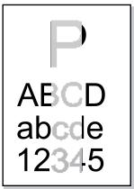</td><td>碳粉不足。打印介质不符合使用规格,例如介质受潮或太粗糙。打印程序中分辨率设置过低,浓度设置过低,或勾选了省墨模式。激光碳粉盒损坏。</td><td>请正确使用规格范围内的介质。设置程序中的打印分辨率,浓度设置,或取消勾选省墨模式。</td></tr><tr><td colspan="2">打印发白或偏淡</td><td></td><td></td></tr><tr><td colspan="2">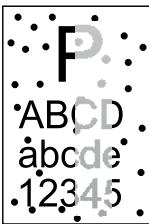</td><td>激光碳粉盒脏污或漏粉。激光碳粉盒损坏。使用了不符合使用规格的打印介质,例如介质受潮或太粗糙。进纸通道脏污。</td><td>请使用规格范围内的打印介质。清洁进纸通道。建议更换原装激光碳粉盒。</td></tr><tr><td colspan="2">粉墨斑点</td><td></td><td></td></tr><tr><td colspan="2"></td><td>使用了不符合使用规格的打印介质,例如介质受潮或太粗糙。进纸通道脏污。激光碳粉盒内部鼓损坏。机器内部激光器反光玻璃脏污。</td><td>请使用规格范围内的打印介质。清洁进纸通道。清洁激光器反光玻璃。</td></tr><tr><td colspan="2">白点</td><td></td><td></td></tr><tr><td colspan="2"></td><td>使用了不符合使用规格的打印介质,例如介质受潮或太粗糙。机器内部脏污。激光碳粉盒损坏。机器内部部件损坏。</td><td>请使用规格范围内的打印介质。清洁机器内部。建议更换原装激光碳粉盒。</td></tr><tr><td colspan="2">碳粉脱落</td><td></td><td></td></tr><tr><td colspan="2"></td><td>激光碳粉盒脏污。激光碳粉盒内部部件损坏。机器内部激光器反光玻璃脏污。进纸通道脏污。</td><td>清洁机器背部激光器反光玻璃。清洁打印机背部进纸通道。</td></tr><tr><td colspan="2">黑色竖条</td><td></td><td></td></tr><tr><td colspan="2">故障现象</td><td>故障原因</td><td>解决办法</td></tr><tr><td colspan="2">ABCDabcde12345</td><td>·使用了不符合使用规格的打印介质,例如介质受潮或太粗糙。·激光碳粉盒脏污。·激光碳粉盒内部部件损坏。·进纸通道脏污。·打印内部转印电压异常。</td><td>·请使用规格范围内的打印介质。·清洁机器内部进纸通道。</td></tr><tr><td colspan="2">黑色背景(底灰)</td><td></td><td></td></tr><tr><td colspan="2">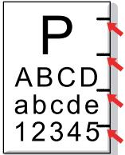</td><td>·激光碳粉盒脏污。·激光碳粉盒内部部件损坏。·定影组件损坏。</td><td>·清洁或更换新激光碳粉盒。·请联系奔图客服维修更换新的定影组件。</td></tr><tr><td colspan="2">出现周期性痕迹</td><td></td><td></td></tr><tr><td colspan="2">[TCKS]ABCDabcde12345</td><td>·未正确安装打印介质。·机器进纸通道脏污。</td><td>·确保正确安装打印介质。·清洁机器内部进纸通道。</td></tr><tr><td colspan="2">页面歪斜</td><td></td><td></td></tr><tr><td colspan="2">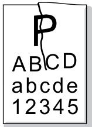</td><td>·未正确安装打印介质。·打印介质不符合使用规格。·打印内部进纸通道脏污。·打印定影组件损坏。</td><td>·确保正确安装打印介质。·请使用规格范围内的打印介质进行打印。·清洁机器内部进纸通道。</td></tr><tr><td colspan="2">皱纸</td><td></td><td></td></tr><tr><td colspan="2">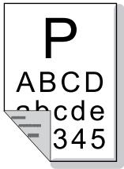</td><td>·激光碳粉盒脏污。·机器内部转印辊脏污。·机器内部转印电压异常。</td><td>·清洁或更换新激光碳粉盒。·清洁机器内部转印部件。</td></tr><tr><td colspan="2">背面脏污</td><td></td><td></td></tr><tr><td colspan="2">打印全黑版</td><td>未正确安装激光碳粉盒。激光碳粉盒内部损坏。机器内部充电异常,未给激光碳粉盒充电。</td><td>确保正确安装激光碳粉盒。建议更换原装激光碳粉盒。</td></tr><tr><td colspan="2">碳粉晕开</td><td>使用了不符合使用规格的打印介质,例如介质受潮或太粗糙。机器内部脏污。激光碳粉盒损坏。机器内部部件损坏。</td><td>请使用规格范围内的打印介质。清洁机器内部。</td></tr><tr><td colspan="2">水平条纹</td><td>激光碳粉盒未正确安装。激光碳粉盒可能损坏。机器内部部件损坏。</td><td>确保正确安装激光碳粉盒。</td></tr></table>

注： • 上述故障可采用清洁或更换新激光碳粉盒等方法来改善。如果问题依旧，请联系奔图客服。

# 菜单结构

# 11

章

11. 菜单结构 ... ..11-2

# 11. 菜单结构

此章节主要介绍控制面板整体的菜单结构，用户可以通过查看菜单结构，了解可以设置的菜单选项。

注： • 本章中的菜单结构为最全的菜单结构，您实际使用机型的菜单结构可能与以下的菜单结构存在差异。

<table><tr><td colspan="3">总菜单结构</td></tr><tr><td>一级菜单</td><td>二级菜单</td><td>三级菜单</td></tr><tr><td rowspan="20">1.系统设置</td><td rowspan="8">1.语言设置</td><td>1.中文*</td></tr><tr><td>2.English</td></tr><tr><td>3. р у с с к и й</td></tr><tr><td>4.Italiano</td></tr><tr><td>5.Español</td></tr><tr><td>6.Français</td></tr><tr><td>7.Deutsch</td></tr><tr><td>8.繁體中文</td></tr><tr><td rowspan="6">2.休眠时间设置</td><td>1.1分钟*</td></tr><tr><td>2.5分钟</td></tr><tr><td>3.15分钟</td></tr><tr><td>4.30分钟</td></tr><tr><td>5.60分钟</td></tr><tr><td>6.8小时</td></tr><tr><td rowspan="2">3.省墨</td><td>1.关闭*</td></tr><tr><td>2.开启</td></tr><tr><td rowspan="2">4.恢复出厂设置</td><td>1.否*</td></tr><tr><td>2.是</td></tr><tr><td rowspan="2">5.版本信息</td><td>1.数据固件版本</td></tr><tr><td>2.引擎固件版本</td></tr><tr><td rowspan="8">2.纸盒设置</td><td rowspan="2">1.多功能纸盒</td><td>1.纸张类型</td></tr><tr><td>2.纸张尺寸</td></tr><tr><td rowspan="2">2.标准纸盒</td><td>1.纸张类型</td></tr><tr><td>2.纸张尺寸</td></tr><tr><td rowspan="2">3.选配纸盒一</td><td>1.纸张类型</td></tr><tr><td>2.纸张尺寸</td></tr><tr><td rowspan="2">4.选配纸盒二</td><td>1.纸张类型</td></tr><tr><td>2.纸张尺寸</td></tr><tr><td rowspan="7">3.网络设置</td><td rowspan="2">1.有线网络设置</td><td>1.IPv4</td></tr><tr><td>2.IPv6</td></tr><tr><td rowspan="4">2.无线网络设置</td><td>1.无线网络</td></tr><tr><td>2.WPS PIN 模式</td></tr><tr><td>3.IPv4</td></tr><tr><td>4.IPv6</td></tr><tr><td>3.WiFi 热点</td><td></td></tr><tr><td rowspan="14">4.网络信息</td><td rowspan="3">1.有线网络信息</td><td>1.IP 地址</td></tr><tr><td>2.子网掩码</td></tr><tr><td>3.网关</td></tr><tr><td rowspan="6">2.无线网络信息</td><td>1.连接状态</td></tr><tr><td>2.IP 地址</td></tr><tr><td>3.子网掩码</td></tr><tr><td>4.网关</td></tr><tr><td>5.信道</td></tr><tr><td>6.SSID</td></tr><tr><td rowspan="5">3.WiFi 热点信息</td><td>1.状态</td></tr><tr><td>2.设备名称</td></tr><tr><td>3.IP 地址</td></tr><tr><td>4.密码</td></tr><tr><td>5.已连接设备数</td></tr><tr><td rowspan="8">5.打印信息报告</td><td>1.演示页</td><td></td></tr><tr><td>2.信息页</td><td></td></tr><tr><td>3.菜单结构页</td><td></td></tr><tr><td>4.网络配置页</td><td></td></tr><tr><td>5.WiFi 热点列表页</td><td></td></tr><tr><td>6.PCL 字体列表页</td><td></td></tr><tr><td>7.PS 字体列表页</td><td></td></tr><tr><td>8.打印全部信息页</td><td></td></tr></table>

# 产品规格

# 12

章

12. 产品规格 ... ...12-2

# 12. 产品规格

注： • 不同型号不同功能的打印机，规格数值略有差异，不同区域国家的产品规格也存在差异。

•数值基于初始数据，有关更多最新规格信息，请访问：www.pantum.com。

规格总述

<table><tr><td>产品尺寸(长×宽×高)</td><td>370mm*370mm*286mm</td></tr><tr><td>产品重量</td><td>9.4Kg(不包含包装及粉盒)</td></tr><tr><td rowspan="2">工作环境</td><td>工作环境温度:5~35°C,最佳工作温度:10~32°C</td></tr><tr><td>工作环境湿度:20%RH~80%RH</td></tr><tr><td rowspan="4">电源电压</td><td>110V Model:</td></tr><tr><td>AC100~127V(±10%),50HZ/60HZ(±2%),8A</td></tr><tr><td>220V Model:</td></tr><tr><td>AC220~240V(±10%),50HZ/60HZ(±2%),4A</td></tr><tr><td rowspan="2">噪音</td><td>打印:≤55dB(A)</td></tr><tr><td>待机:≤30dB(A)</td></tr><tr><td>功耗</td><td>TEC:符合EnergyStarV2.0要求及中国能效</td></tr><tr><td rowspan="5">操作系统</td><td>Microsoft Windows Server2003/Server2008/Server2012/XP/Vista/Windows7/Windows 8/Windows 8.1/Windows10 (32/64 Bit)</td></tr><tr><td>Mac OS 10.7/10.8/10.9/10.10/10.11</td></tr><tr><td>Linux(有版本限制)</td></tr><tr><td>IOS/Android(有版本限制)</td></tr><tr><td>中标麒麟(龙芯/飞腾)(有版本限制)</td></tr><tr><td rowspan="3">通信接口</td><td>Hi-Speed USB 2.0</td></tr><tr><td>10Base-T/100Base-TX/1000Base-T(除USB型号)</td></tr><tr><td>Wi-Fi IEEE802.11b/g/n(仅Wi-Fi型号)</td></tr><tr><td>处理器</td><td>600MHZ</td></tr><tr><td>内存</td><td>标配256MB</td></tr></table>

打印规格

<table><tr><td>打印速度</td><td>A4 33ppm/Letter 35ppm</td></tr><tr><td>首页打印时间</td><td>≤8.5秒</td></tr><tr><td>最大月打印量</td><td>80,000页</td></tr><tr><td>最大打印幅面</td><td>216mm*401.5mm</td></tr><tr><td rowspan="4">打印语言</td><td>PCL5e</td></tr><tr><td>PCL6/XL</td></tr><tr><td>PS3</td></tr><tr><td>PDF</td></tr><tr><td>双面打印</td><td>支持</td></tr><tr><td>出纸方式</td><td>前出纸、后出纸</td></tr></table>

# PANTUM

珠海奔图打印科技有限公司

地址: 珠海市珠海大道3883 号01栋3楼中区A

邮编 : 519060

网址 : www.pantum.com

电话 : 400-060-1888