# 【操作说明】

# 迅饶网关与小米产品通讯配置说明

上海迅饶自动化科技有限公司

2019 年 04 月

# 目录

# 1. 系统网络架构.

# 2. 米家 APP 设置.. 3

2.1 米家 APP 添加小米设备 . .3  
2.2 开启绿米网关局域网协议. 3

# 3. LUMISCAN 搜索局域网设备. .. 6

3.1LUMISCAN 搜索步骤 . .. 6   
3.2 操作步骤示意图.   
3.3 文件解析..

3.3.1 小米多功能网关属性.  
3.3.2 多功能网关下的设备. .8  
3.3.3 米家智能插座属性. 8  
3.3.4 米家温湿度传感器属性.

# 4. X2VIEW 工程配置 . .10

4.1 新建驱动. .10  
4.2 新建通道.. .10  
4.3 新建设备... .11  
4.4 新建标签. .12

# 5. 总结 .... 13

# 1. 系统网络架构

①通过米家 APP 将绿米网关接入现场的局域网络；  
②通过米家 APP 将需要集成的所有小米设备接入现场的局域网络；  
③将自己的电脑接入现场的局域网络并且禁用其他所有网卡；  
④运行 LumiScan.exe 程序即可搜索到绿米网关下所有设备的信息；  
⑤根据 LumiScan搜索到的报文信息配置网关工程。

# 2. 米家 APP 设置

# 2.1 米家APP添加小米设备

根据小米设备的说明书操作步骤，在米家 APP 中添加所有小米的设备，一般步骤分为:

①长按设备上的按钮进入设置模式；  
②按照提示连接小米设备的网络；  
③设备接入现场的局域网络；  
④米家APP绑定小米设备成功。

# 2.2 开启绿米网关局域网协议

按照下面的步骤开启绿米网关的局域网协议：

①点击米家多功能网关进入米家多功能网关界面；

②点击右上角的“…“进入设置界面；  
③点击“关于”进入关于设置界面；  
④一直点击空白处，大约连续点击 5-10 次会出现隐藏信息；  
⑤点击“局域网通信协议”进入局域网通信设置界面；  
⑥选择开启局域网通信协议，获取米家多功能网关的局域网通讯密码；  
⑦关于界面点击网关信息进入绿米网关信息查询界面。

界面显示如下图所示：  
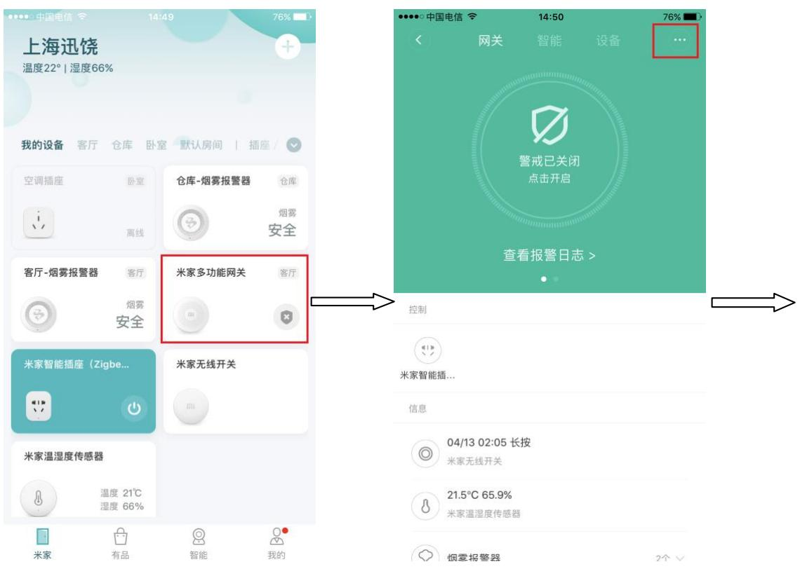

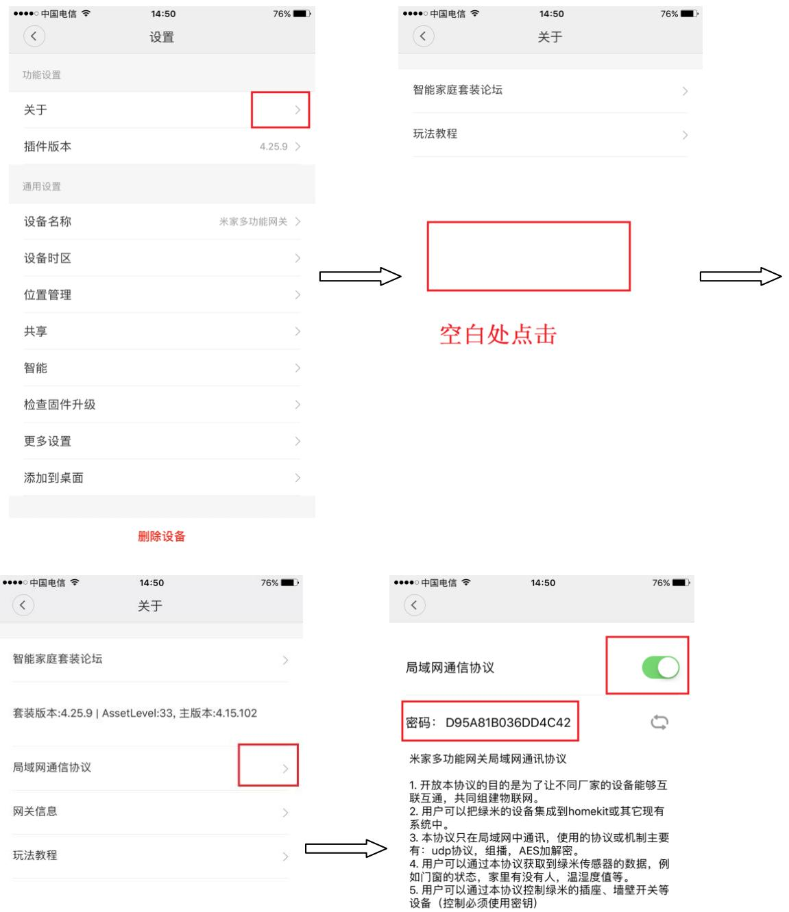

<table><tr><td>取消</td><td>确定</td></tr></table>

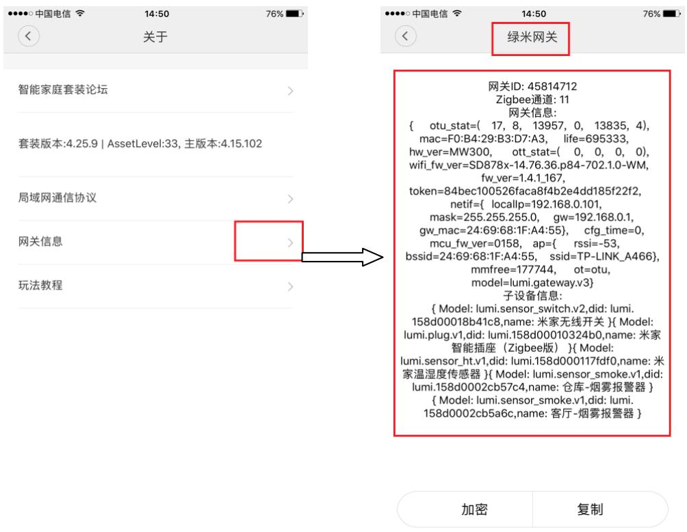  
图 2-2-1 局域网通讯和网关信息示意图

# 3. LumiScan 搜索局域网设备

# 3.1LumiScan 搜索步骤

①禁用无关的网卡，只保留当前局域网的网卡；  
②运行 LumiScan.exe 程序进行搜索；  
③得到 LumiScan搜索日志文件；

# 3.2 操作步骤示意图

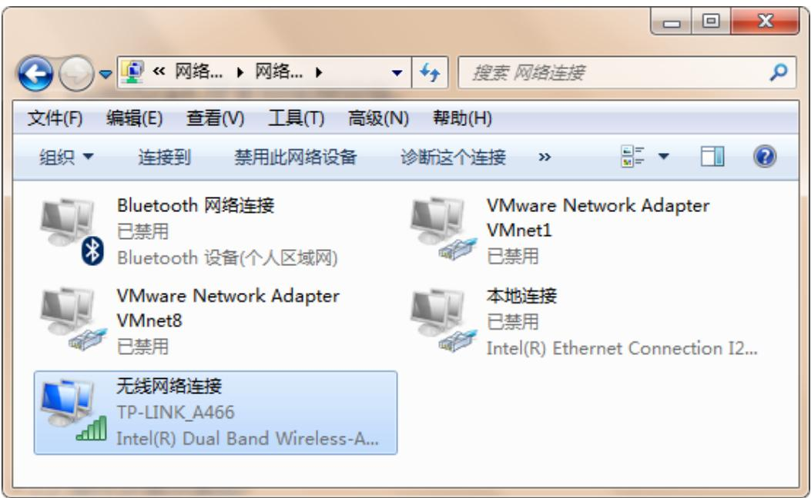

图 3-2-1 禁用网络示意图  

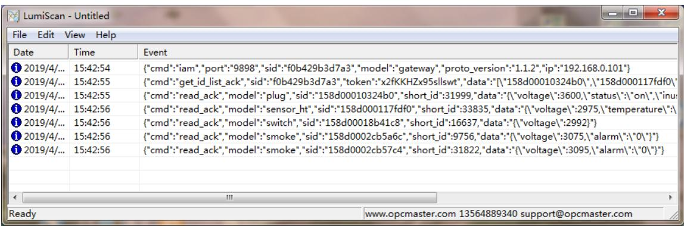  
图 3-2-2 LumiScan 搜索示意图

# 3.3 文件解析

# 3.3.1小米多功能网关属性

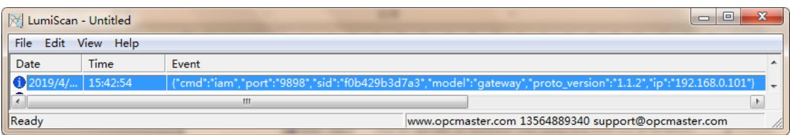  
图 3-3-1 小米多功能网关属性

属性说明：

port：多功能网关当前使用的端口号。sid：多功能网关的 MAC 地址。model：当前设备的属性分类。proto\_version：版本号。ip：多功能网关的当前 IP 地址。

# 3.3.2多功能网关下的设备

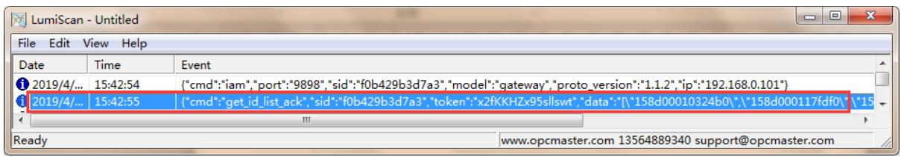  
图 3-3-2 小米多功能网关连接设备

属性说明：

sid：多功能网关的 MAC 地址。token：令牌。data：多功能网关下连接的设备。

# 3.3.3米家智能插座属性

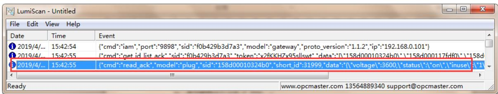  
图 3-3-3 小米智能插座属性

属性说明：

model：当前设备的属性分类。sid：米家智能揑座的MAC地址。short\_id：米家智能揑座的设备号。voltage：米家智能揑座的当前电压值。status：米家智能揑座的当前状态。

power\_consumed：米家智能揑座的负载消耗电量。

load\_power：米家智能揑座的负载功率。

# 3.3.4米家温湿度传感器属性

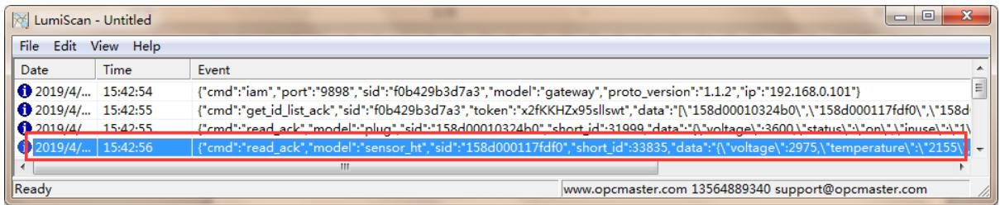  
图 3-3-4 米家温湿度传感器属性

属性说明：

model：当前设备的属性分类。

sid：米家温湿度传感器的 MAC 地址。

short\_id：米家温湿度传感器的设备号。

voltage：米家温湿度传感器的当前电压值。

temperature：米家温湿度传感器的当前温度值。

humidity：米家温湿度传感器的当前湿度值。

# 3.3.5米家无线开关属性

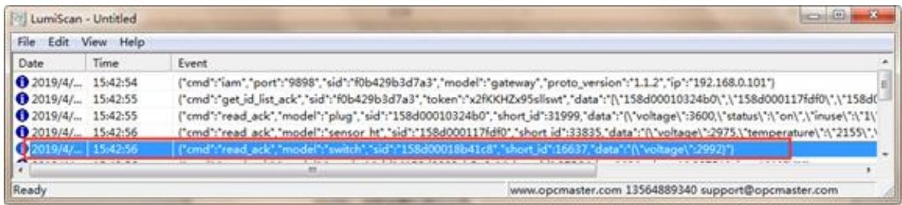  
图 3-3-4 米家无线开关属性

属性说明：

model：当前设备的属性分类。

sid：米家无线开关的MAC地址。

short\_id：米家无线开关的设备号。

voltage：米家无线开关的当前电压值。

注意：其他设备以此类推即可，如有其他疑惑请联系上海迅饶自动化科技有限公司。

# 4. X2View 工程配置

# 4.1 新建驱动

选择驱动 Lumi\_Gateway：

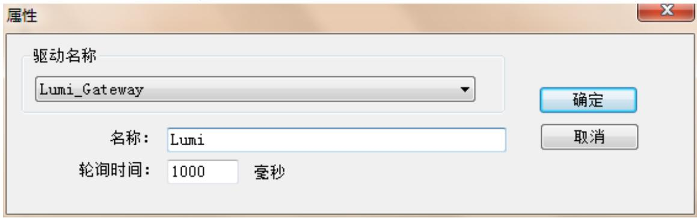  
图 4-1-1 驱动属性

名称可自定义填写，轮训时间默认 1000 毫秒，可以更具现场的实际情况自行修改。

# 4.2 新建通道

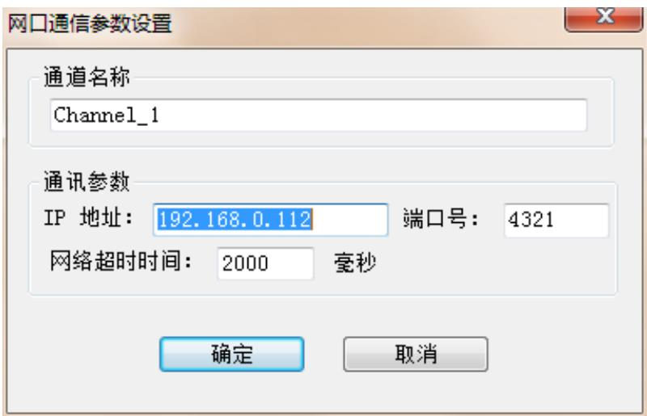  
图 4-2-1 通道属性

此处的IP地址为迅饶网关的 IP地址，端口号默认 4321，网络超时时间可以根据具体的现场环境设置，默认2000 毫秒。

# 4.3 新建设备

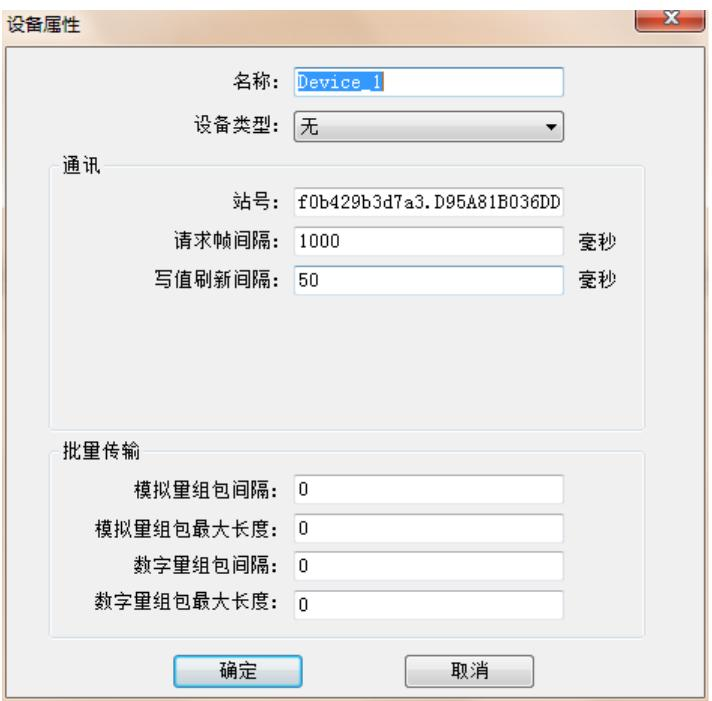  
图 4-3-1 设备属性

名称可自定义，站号填写格式为：网关的“：mac 地址”+“绿米网关的局域网通信协议密码”，请求帧间隔默认 1000 毫秒，可更具现场的需要自行修改。

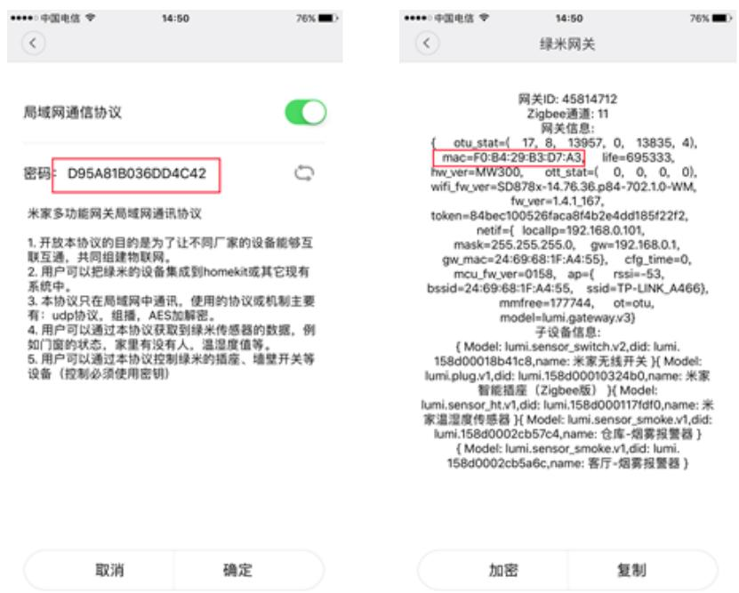  
图 4-3-2 密码及mac 地址示意图

# 4.4 新建标签

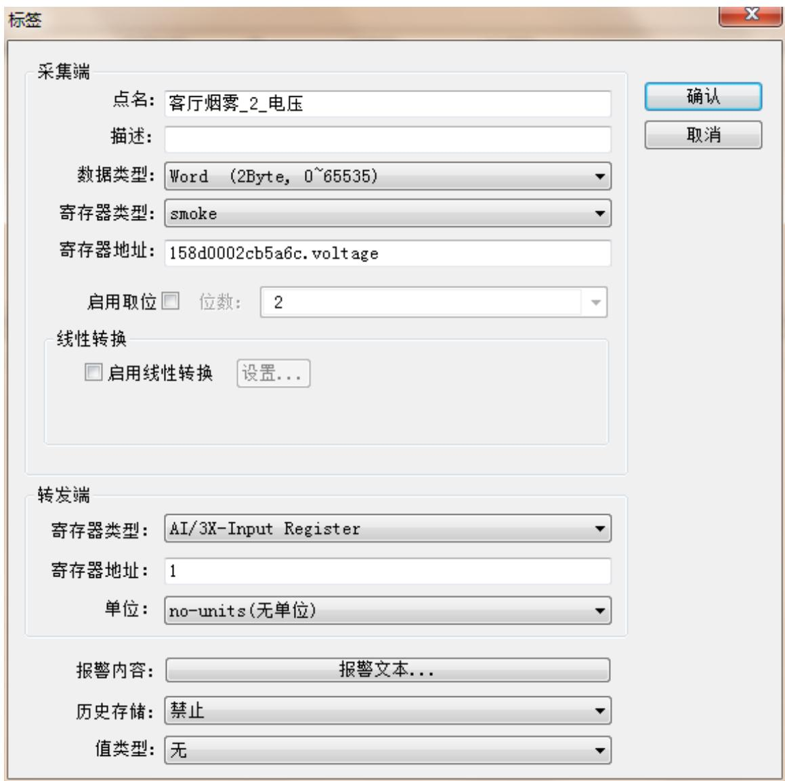  
图 4-4-1 标签属性

点名可自定义填写，数据类型根据你设备的实际情况填写，开关量选择Boolean，模拟量选择Word；数据类型为 LumiScan 扫描出来的”model”；寄存器地址为 LumiScan扫描出来的“sid”+“data 属性”；

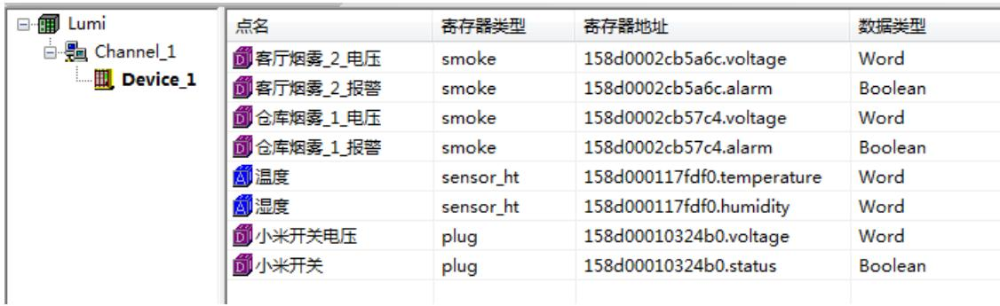  
图 4-4-2 工程点位示意图

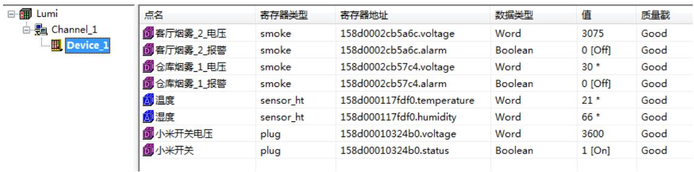  
图 4-4-3 通常成功示意图

# 5. 总结

①绿米网关的局域网通讯要开启；  
②局域网需要有绿米网关在线；

③LumiScan 扫描时需要禁用其他无关网络；

④配置工程需要根据 LumiScan 扫描到的具体信息进行配置。